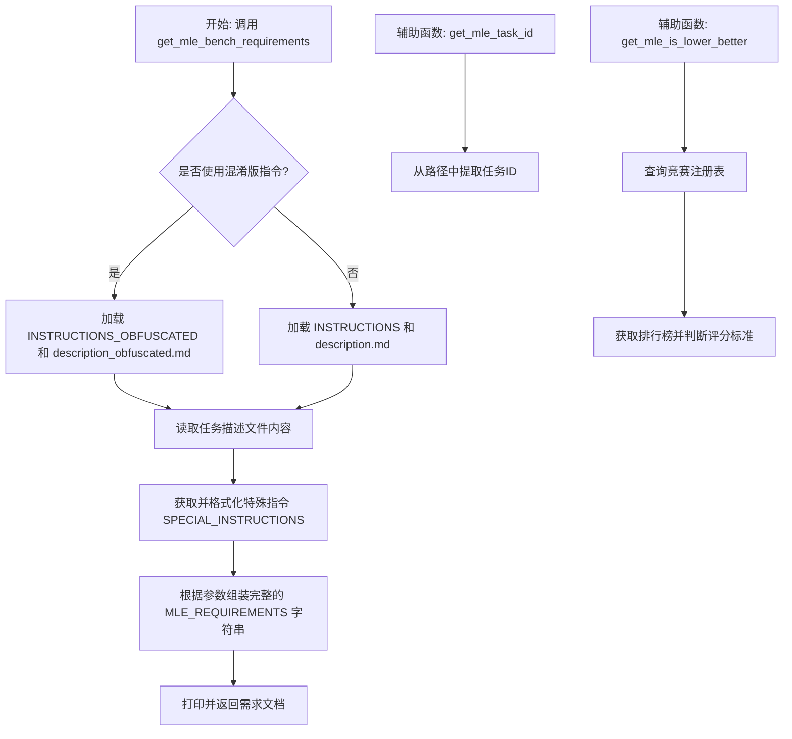
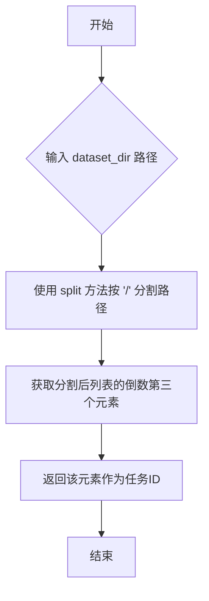
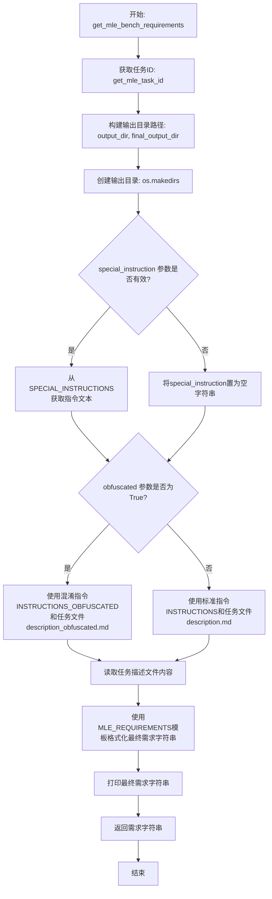

# `.\MetaGPT\metagpt\ext\sela\data\custom_task.py` 详细设计文档

该代码文件是MetaGPT框架中用于处理MLE（机器学习工程）基准测试任务需求生成的核心模块。它主要功能是根据给定的数据集目录和配置，动态生成一份结构化的、包含具体任务指令、注意事项和特殊要求的任务需求文档（MLE_REQUIREMENTS），用于指导后续的机器学习建模流程。

## 整体流程



## 类结构

```
该文件不包含类定义，主要由全局变量和函数组成。
├── 全局常量 (MLE_BENCH_FILES, MLE_REQUIREMENTS)
├── 全局函数 (get_mle_task_id, get_mle_is_lower_better, get_mle_bench_requirements)
```

## 全局变量及字段


### `MLE_BENCH_FILES`
    
一个字符串列表，定义了MLE基准测试中使用的描述文件名称，包括普通版本和混淆版本。

类型：`List[str]`
    


### `MLE_REQUIREMENTS`
    
一个多行字符串模板，用于生成MLE基准测试的完整任务要求说明，包含指令、注意事项和任务描述等部分。

类型：`str`
    


    

## 全局函数及方法

### `get_mle_task_id`

该函数用于从给定的数据集目录路径中提取 MLE（机器学习工程）任务的唯一标识符（ID）。它通过解析路径字符串，获取倒数第三级的目录名作为任务ID。

参数：

- `dataset_dir`：`str`，表示数据集所在的目录路径。

返回值：`str`，从路径中提取的任务ID。

#### 流程图



#### 带注释源码

```python
def get_mle_task_id(dataset_dir):
    # 将路径字符串按 '/' 分割成列表
    # 例如：输入 '/home/user/data/task123/dataset' 会得到 ['', 'home', 'user', 'data', 'task123', 'dataset']
    # 然后取倒数第三个元素（索引 -3），即 'task123'，作为任务ID
    return dataset_dir.split("/")[-3]
```

### `get_mle_is_lower_better`

该函数用于判断给定机器学习竞赛任务（task）的评估指标是否为“越低越好”。它通过查询竞赛注册表获取竞赛对象，然后获取该竞赛的排行榜，最后调用竞赛评分器的 `is_lower_better` 方法来确定评估方向。

参数：

- `task`：`str`，机器学习竞赛任务的标识符（ID），用于在注册表中查找对应的竞赛。

返回值：`bool`，返回一个布尔值。`True` 表示该竞赛的评估指标是“越低越好”（例如，误差、损失），`False` 则表示“越高越好”（例如，准确率、F1分数）。

#### 流程图

```mermaid
graph TD
    A[开始: 调用 get_mle_is_lower_better(task)] --> B[从注册表获取竞赛对象: registry.get_competition(task)]
    B --> C[获取竞赛排行榜: get_leaderboard(competition)]
    C --> D[调用评分器方法: competition.grader.is_lower_better(competition_leaderboard)]
    D --> E[返回布尔值结果]
    E --> F[结束]
```

#### 带注释源码

```python
def get_mle_is_lower_better(task):
    # 动态导入必要的模块，避免在函数外部导入可能未安装的包
    from mlebench.data import get_leaderboard
    from mlebench.registry import registry

    # 1. 根据任务ID从全局注册表中获取对应的竞赛对象
    competition = registry.get_competition(task)
    # 2. 获取该竞赛的排行榜数据
    competition_leaderboard = get_leaderboard(competition)
    # 3. 调用竞赛评分器的 `is_lower_better` 方法，传入排行榜数据，判断评估标准是否为“越低越好”
    return competition.grader.is_lower_better(competition_leaderboard)
```

### `get_mle_bench_requirements`

该函数用于生成MLE（机器学习工程）基准测试的完整任务需求字符串。它根据输入参数（如数据集目录、配置、是否使用混淆描述等）动态组装指令、附加说明和具体的任务描述，最终返回一个格式化的需求文档字符串，并打印输出。

参数：

-  `dataset_dir`：`str`，数据集目录的路径，用于定位任务描述文件和确定任务ID。
-  `data_config`：`dict`，数据配置字典，其中必须包含`work_dir`键，用于指定工作目录。
-  `special_instruction`：`str`，特殊指令的标识符，用于从预定义的`SPECIAL_INSTRUCTIONS`字典中获取对应的指令文本。
-  `obfuscated`：`bool`，布尔值，指示是否使用混淆版本的任务描述和指令。

返回值：`str`，返回一个格式化后的、完整的MLE基准测试需求字符串。

#### 流程图



#### 带注释源码

```python
def get_mle_bench_requirements(dataset_dir, data_config, special_instruction, obfuscated=False):
    # 从数据配置中获取工作目录
    work_dir = data_config["work_dir"]
    # 从数据集目录路径中提取任务ID（假设路径格式为 .../task_id/...）
    task = get_mle_task_id(dataset_dir)
    # 构建任务专属的输出目录和最终的提交目录路径
    output_dir = f"{work_dir}/{task}"
    final_output_dir = f"{work_dir}/submission"
    # 确保任务专属的输出目录存在
    os.makedirs(output_dir, exist_ok=True)
    
    # 处理特殊指令：如果提供了标识符，则从预定义字典中获取对应文本；否则置为空
    if special_instruction:
        special_instruction = SPECIAL_INSTRUCTIONS[special_instruction]
    else:
        special_instruction = ""
    
    # 根据`obfuscated`标志选择使用标准指令还是混淆指令，以及对应的任务描述文件名
    if obfuscated:
        # 使用混淆指令模板，并传入数据集目录和最终提交目录进行格式化
        instructions = INSTRUCTIONS_OBFUSCATED.format(dataset_dir=dataset_dir, output_dir=final_output_dir)
        task_file = "description_obfuscated.md"
    else:
        # 使用标准指令模板，并传入数据集目录和任务输出目录进行格式化
        instructions = INSTRUCTIONS.format(dataset_dir=dataset_dir, output_dir=output_dir)
        task_file = "description.md"
    
    # 读取指定（标准或混淆）版本的任务描述文件内容
    with open(os.path.join(dataset_dir, task_file), encoding="utf-8") as f:
        task_description = f.read()
    
    # 使用预定义的需求模板，将所有组件（指令、附加说明、任务描述、输出目录、特殊指令）组合成最终的需求字符串
    mle_requirement = MLE_REQUIREMENTS.format(
        instructions=instructions,
        additonal_notes=ADDITIONAL_NOTES,
        task_description=task_description,
        output_dir=output_dir,
        special_instruction=special_instruction,
    )
    # 打印生成的需求字符串（通常用于日志或调试）
    print(mle_requirement)
    # 返回最终的需求字符串
    return mle_requirement
```

## 关键组件


### 任务描述与指令生成

根据数据集目录、配置和特殊指令，动态生成用于机器学习竞赛的完整任务需求描述。该组件负责读取任务描述文件、选择指令模板、整合特殊说明，并最终格式化输出一个包含所有必要步骤和约束的详细任务要求字符串。

### 任务标识符提取

从数据集目录路径中提取唯一的任务ID。该组件通过解析文件路径，获取代表特定机器学习竞赛任务的标识符，用于后续的竞赛信息查询和输出目录构建。

### 竞赛指标方向判断

查询指定机器学习竞赛的排行榜信息，以确定评估指标是“越低越好”还是“越高越好”。该组件依赖于外部竞赛注册表和排行榜数据，为核心评估逻辑提供关键的方向性信息。

### 文件与路径管理

负责创建必要的输出目录，并基于任务标识符和配置构建标准化的文件路径。该组件确保生成的文件（如预测结果和提交文件）被正确地组织和存储在预定义的工作目录结构中。

### 特殊指令处理

根据传入的特殊指令键，从预定义的指令字典中检索并返回对应的详细说明文本。如果未提供特殊指令，则返回空字符串，确保任务需求描述的灵活性。


## 问题及建议


### 已知问题

-   **硬编码的文件路径分隔符**：`get_mle_task_id` 函数使用 `"/"` 作为路径分隔符，这在不同操作系统（如 Windows 使用 `\`）上可能导致错误。
-   **潜在的循环导入风险**：`get_mle_is_lower_better` 函数在内部导入 `mlebench.data` 和 `mlebench.registry`。如果调用方模块也导入了这些模块，可能会引发循环导入问题，尤其是在复杂的依赖结构中。
-   **字符串格式化错误**：`MLE_REQUIREMENTS` 模板字符串中的 `{additonal_notes}` 占位符与变量名 `ADDITIONAL_NOTES` 拼写不一致（缺少一个 `i`），这会导致 `KeyError` 异常。
-   **异常处理缺失**：`get_mle_bench_requirements` 函数在读取文件（`open`）和创建目录（`os.makedirs`）时没有进行异常处理。如果文件不存在、权限不足或路径无效，程序会崩溃。
-   **潜在的键错误**：`special_instruction` 参数被用作 `SPECIAL_INSTRUCTIONS` 字典的键。如果传入的 `special_instruction` 值不在字典中，将引发 `KeyError`。
-   **代码重复**：`obfuscated` 分支和非 `obfuscated` 分支的代码逻辑高度相似，存在重复，增加了维护成本。

### 优化建议

-   **使用 `os.path` 处理路径**：将 `get_mle_task_id` 函数中的路径分割逻辑改为使用 `os.path` 模块（例如 `os.path.basename` 或 `os.path.split`），以确保跨平台兼容性。
-   **将导入移至模块顶部**：将 `get_mle_is_lower_better` 函数内部的导入语句移到模块的顶部，遵循 PEP 8 规范，并消除潜在的循环导入风险。
-   **修正模板字符串**：将 `MLE_REQUIREMENTS` 模板字符串中的 `{additonal_notes}` 占位符更正为 `{additional_notes}`，与变量名保持一致。
-   **添加异常处理**：在 `get_mle_bench_requirements` 函数中，为文件操作和目录创建添加 `try-except` 块，以优雅地处理 `IOError`、`OSError` 等异常，并提供有意义的错误信息。
-   **使用字典的 `get` 方法**：在访问 `SPECIAL_INSTRUCTIONS` 字典时，使用 `get` 方法并提供默认值（如空字符串 `""`），以避免 `KeyError`。
-   **重构重复代码**：提取 `obfuscated` 分支和非 `obfuscated` 分支中的共同逻辑（如构建 `instructions` 和 `task_file`）为一个辅助函数，减少代码重复。
-   **增强类型提示**：为函数参数和返回值添加更详细的类型提示（例如使用 `typing` 模块），以提高代码的可读性和可维护性，并方便静态类型检查。
-   **考虑配置化**：将 `MLE_BENCH_FILES`、文件编码等硬编码值提取到配置文件或环境变量中，提高灵活性。
-   **日志记录替代 `print`**：考虑使用标准的日志记录库（如 `logging`）替代 `print` 语句，以便更好地控制输出级别和格式，并支持日志文件记录。


## 其它


### 设计目标与约束

本模块的核心设计目标是作为一个适配器，为机器学习竞赛（MLE Bench）生成格式化的任务需求描述。它需要从给定的数据集目录和配置中提取信息，并根据是否使用混淆描述，动态组装出完整的任务指令字符串。主要约束包括：必须兼容MLE Bench竞赛的特定文件结构（如`description.md`和`description_obfuscated.md`的存在性），需要正确处理可选的`special_instruction`，并确保生成的输出目录结构符合预期。

### 错误处理与异常设计

当前代码的异常处理较为隐式，主要依赖于Python内置的异常机制。例如，`open`函数在文件不存在时会抛出`FileNotFoundError`，`os.makedirs`在权限不足时会抛出`PermissionError`。对于字典`SPECIAL_INSTRUCTIONS`的键查找，如果传入的`special_instruction`参数值不在字典中，会引发`KeyError`。模块没有显式地捕获或转换这些异常，意味着调用方需要负责处理。此外，路径分割操作（`dataset_dir.split("/")[-3]`）假设了特定的目录深度和分隔符格式，如果输入路径不符合预期，可能导致索引错误或得到错误的`task_id`。

### 数据流与状态机

模块的数据流是单向且无状态的。输入为`dataset_dir`（数据集路径字符串）、`data_config`（包含`work_dir`的配置字典）、`special_instruction`（可选的特殊指令键）和`obfuscated`（布尔标志）。核心处理流程是：1) 从路径解析任务ID；2) 根据`obfuscated`标志选择指令模板和任务描述文件；3) 读取任务描述文件内容；4) 将所有组件（基础指令、附加说明、任务描述、输出路径、特殊指令）填充到主需求模板`MLE_REQUIREMENTS`中；5) 打印并返回组装好的需求字符串。整个过程不维护任何内部状态，每次调用都是独立的。

### 外部依赖与接口契约

*   **外部模块依赖**:
    *   `metagpt.ext.sela.data.dataset.SPECIAL_INSTRUCTIONS`: 一个字典，提供可选的、预定义的特殊指令文本。
    *   `metagpt.ext.sela.runner.mle_bench.instructions`: 包含`ADDITIONAL_NOTES`, `INSTRUCTIONS`, `INSTRUCTIONS_OBFUSCATED`三个字符串常量，分别代表附加说明、标准指令和混淆指令模板。
    *   `os`: 用于目录创建和文件路径操作。
*   **接口契约**:
    *   `get_mle_bench_requirements`函数是主要对外接口。它期望`dataset_dir`指向一个包含`description.md`（或`description_obfuscated.md`）文件的目录。`data_config`字典必须包含键为`"work_dir"`的项。`special_instruction`参数应为`None`或`SPECIAL_INSTRUCTIONS`字典中的有效键。
    *   `get_mle_task_id`和`get_mle_is_lower_better`函数是辅助性的，后者还依赖于外部的`mlebench.data`和`mlebench.registry`模块来获取竞赛信息和排行榜。
*   **文件系统契约**: 假设在`dataset_dir`下存在`MLE_BENCH_FILES`列表中定义的文件（`description.md`或`description_obfuscated.md`）。

### 配置管理

模块的配置主要通过两个来源：1) 硬编码的常量，如`MLE_BENCH_FILES`和`MLE_REQUIREMENTS`模板字符串；2) 通过函数参数传入的动态配置，主要是`data_config`字典和`obfuscated`标志。`MLE_REQUIREMENTS`模板定义了最终输出字符串的固定结构和占位符。输出目录的路径逻辑是硬编码的，基于`work_dir`和`task_id`拼接而成。特殊指令的映射关系依赖于外部的`SPECIAL_INSTRUCTIONS`字典，这可以看作是一种外部化的配置。

### 安全考虑

模块涉及文件系统操作（读取文件、创建目录）和从外部路径构造内部路径。虽然当前上下文是受控的竞赛环境，但仍需注意：1) `dataset_dir`参数如果来自不可信来源，可能存在路径遍历风险（例如包含`../`）。当前代码未进行净化。2) 构造的`output_dir`路径直接用于`os.makedirs`，如果`work_dir`或`task_id`包含特殊字符或绝对路径，可能导致在非预期位置创建目录。在更广泛的应用中，应考虑对输入路径进行验证和规范化。

    