# `.\MetaGPT\metagpt\ext\sela\data\dataset.py` 详细设计文档

该代码是一个数据集处理与机器学习任务生成工具，核心功能是自动化处理来自OpenML平台和本地自定义的数据集，包括数据集的下载、分割、信息提取、元数据生成，并基于这些数据集生成结构化的机器学习任务描述（提示词），以便后续的自动化机器学习流程（如通过SolutionDesigner）使用。

## 整体流程

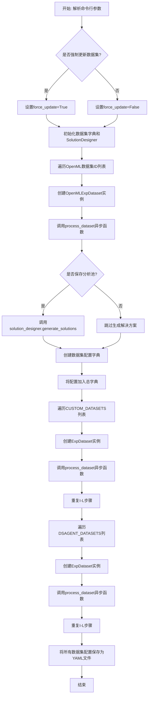

## 类结构

```
ExpDataset (基础数据集类)
├── OpenMLExpDataset (OpenML数据集类)
└── (通过process_dataset函数关联)
    └── SolutionDesigner (外部类，用于生成解决方案)
```

## 全局变量及字段


### `BASE_USER_REQUIREMENT`
    
基础用户需求模板，用于生成针对特定数据集和目标的机器学习任务描述。

类型：`str`
    


### `USE_AG`
    
使用AutoGluon进行模型训练的特定指令，包括预设配置、时间限制和评估指标。

类型：`str`
    


### `TEXT_MODALITY`
    
针对文本数据集的特殊指令，建议使用transformers库的模型并利用GPU加速。

类型：`str`
    


### `IMAGE_MODALITY`
    
针对图像数据集的特殊指令，建议使用transformers/torchvision库的模型并利用GPU加速。

类型：`str`
    


### `STACKING`
    
关于使用堆叠集成方法（如StackingClassifier/Regressor）以避免过拟合的指令。

类型：`str`
    


### `SPECIAL_INSTRUCTIONS`
    
特殊指令的映射字典，将指令名称（如'ag'、'stacking'）映射到对应的指令字符串。

类型：`dict`
    


### `DI_INSTRUCTION`
    
详细的数据洞察（DI）任务指令模板，包含数据预处理、模型训练、结果保存等具体要求。

类型：`str`
    


### `TASK_PROMPT`
    
完整的任务提示模板，整合了用户需求、数据路径、附加指令和数据集描述信息。

类型：`str`
    


### `SEED`
    
随机种子，用于确保数据分割和模型训练的可重复性。

类型：`int`
    


### `TRAIN_TEST_SPLIT`
    
训练集与测试集的分割比例，用于初始数据划分。

类型：`float`
    


### `TRAIN_DEV_SPLIT`
    
训练集与开发集的分割比例，用于从训练集中进一步划分出开发集。

类型：`float`
    


### `OPENML_DATASET_IDS`
    
OpenML平台上的数据集ID列表，包含回归、二分类和多分类任务的数据集。

类型：`list[int]`
    


### `CUSTOM_DATASETS`
    
自定义数据集的列表，每个元素为（数据集名称，目标列名）的元组。

类型：`list[tuple]`
    


### `DSAGENT_DATASETS`
    
DSAgent数据集的列表，每个元素为（数据集名称，目标列名）的元组。

类型：`list[tuple]`
    


### `ExpDataset.description`
    
数据集的描述信息，默认为None，在OpenMLExpDataset中会从OpenML获取。

类型：`str`
    


### `ExpDataset.metadata`
    
数据集的元数据字典，包含特征数、实例数、缺失值等统计信息。

类型：`dict`
    


### `ExpDataset.dataset_dir`
    
数据集存储的根目录路径。

类型：`str`
    


### `ExpDataset.target_col`
    
数据集的目标列名称，用于监督学习任务。

类型：`str`
    


### `ExpDataset.name`
    
数据集的名称标识符。

类型：`str`
    


### `ExpDataset.force_update`
    
强制更新标志，如果为True则重新生成数据集分割和信息文件。

类型：`bool`
    


### `OpenMLExpDataset.dataset_id`
    
OpenML平台上的数据集唯一标识符。

类型：`int`
    


### `OpenMLExpDataset.dataset`
    
从OpenML获取的数据集对象，包含数据、元数据和描述信息。

类型：`openml.datasets.OpenMLDataset`
    
    

## 全局函数及方法

### `get_split_dataset_path`

该函数根据给定的数据集名称和配置信息，返回该数据集在文件系统中已拆分好的各个数据文件（训练集、验证集、测试集等）的路径字典。如果指定的数据集名称不在配置中，则抛出异常。

参数：

- `dataset_name`：`str`，要查找的数据集的名称。
- `config`：`dict`，包含数据集配置信息的字典，其中应包含`datasets_dir`（数据集根目录）和`datasets`（数据集映射字典）等键。

返回值：`dict`，一个包含多个键值对的字典，每个键对应一个数据拆分文件（如`"train"`、`"dev"`），其值为该文件在文件系统中的完整路径字符串。

#### 流程图

```mermaid
graph TD
    A[开始: get_split_dataset_path(dataset_name, config)] --> B{dataset_name 是否在 config['datasets'] 中?};
    B -- 是 --> C[从 config 中获取数据集信息];
    C --> D[构建数据集基础路径 data_path];
    D --> E[构建包含 train, dev, test 等文件路径的字典 split_datasets];
    E --> F[返回 split_datasets];
    B -- 否 --> G[抛出 ValueError 异常];
```

#### 带注释源码

```python
def get_split_dataset_path(dataset_name, config):
    # 从配置中获取数据集的根目录路径
    datasets_dir = config["datasets_dir"]
    # 检查请求的数据集名称是否存在于配置文件中定义的数据集列表中
    if dataset_name in config["datasets"]:
        # 获取该数据集的详细配置信息
        dataset = config["datasets"][dataset_name]
        # 拼接该数据集的基础目录路径
        data_path = os.path.join(datasets_dir, dataset["dataset"])
        # 构建一个字典，为每种数据拆分类型（训练、验证、测试等）生成对应的文件路径
        split_datasets = {
            "train": os.path.join(data_path, "split_train.csv"),
            "dev": os.path.join(data_path, "split_dev.csv"),
            "dev_wo_target": os.path.join(data_path, "split_dev_wo_target.csv"),
            "dev_target": os.path.join(data_path, "split_dev_target.csv"),
            "test": os.path.join(data_path, "split_test.csv"),
            "test_wo_target": os.path.join(data_path, "split_test_wo_target.csv"),
            "test_target": os.path.join(data_path, "split_test_target.csv"),
        }
        # 返回包含所有路径的字典
        return split_datasets
    else:
        # 如果数据集未找到，抛出异常并提示可用的数据集名称
        raise ValueError(
            f"Dataset {dataset_name} not found in config file. Available datasets: {config['datasets'].keys()}"
        )
```

### `get_user_requirement`

该函数用于从配置文件中根据给定的任务名称（数据集名称）检索并返回对应的用户需求描述。它首先检查任务名称是否存在于配置文件的`datasets`字典中，如果存在则返回该数据集配置中的`user_requirement`字段；如果不存在，则抛出`ValueError`异常。

参数：

- `task_name`：`str`，要查询的数据集或任务的名称。
- `config`：`dict`，包含数据集配置信息的字典，其中`datasets`键下存储了各个数据集的详细信息。

返回值：`str`，返回指定数据集配置中的用户需求描述字符串。

#### 流程图

```mermaid
graph TD
    A[开始] --> B{task_name 是否在 config['datasets'] 中?};
    B -- 是 --> C[从 config['datasets'][task_name] 获取 user_requirement];
    C --> D[返回 user_requirement];
    B -- 否 --> E[抛出 ValueError 异常];
    E --> F[结束];
    D --> F;
```

#### 带注释源码

```python
def get_user_requirement(task_name, config):
    # datasets_dir = config["datasets_dir"] # 注释掉的代码，可能用于后续扩展
    # 检查给定的任务名称是否存在于配置文件的 datasets 字典中
    if task_name in config["datasets"]:
        # 如果存在，获取该数据集的配置信息
        dataset = config["datasets"][task_name]
        # data_path = os.path.join(datasets_dir, dataset["dataset"]) # 注释掉的代码，可能用于后续扩展
        # 从数据集配置中提取用户需求描述
        user_requirement = dataset["user_requirement"]
        # 返回用户需求字符串
        return user_requirement
    else:
        # 如果任务名称不存在，抛出 ValueError 异常，并列出所有可用的数据集名称
        raise ValueError(
            f"Dataset {task_name} not found in config file. Available datasets: {config['datasets'].keys()}"
        )
```

### `save_datasets_dict_to_yaml`

该函数用于将包含数据集信息的字典对象序列化并保存为YAML格式的文件。它接受一个字典参数和一个可选的输出文件名，将字典内容写入指定的YAML文件。此功能常用于保存配置信息或数据集元数据，便于后续读取和使用。

参数：

- `datasets_dict`：`dict`，包含数据集信息的字典对象，将被保存为YAML文件。
- `name`：`str`，可选参数，指定输出YAML文件的名称，默认为`"datasets.yaml"`。

返回值：`None`，该函数不返回任何值，仅执行文件写入操作。

#### 流程图

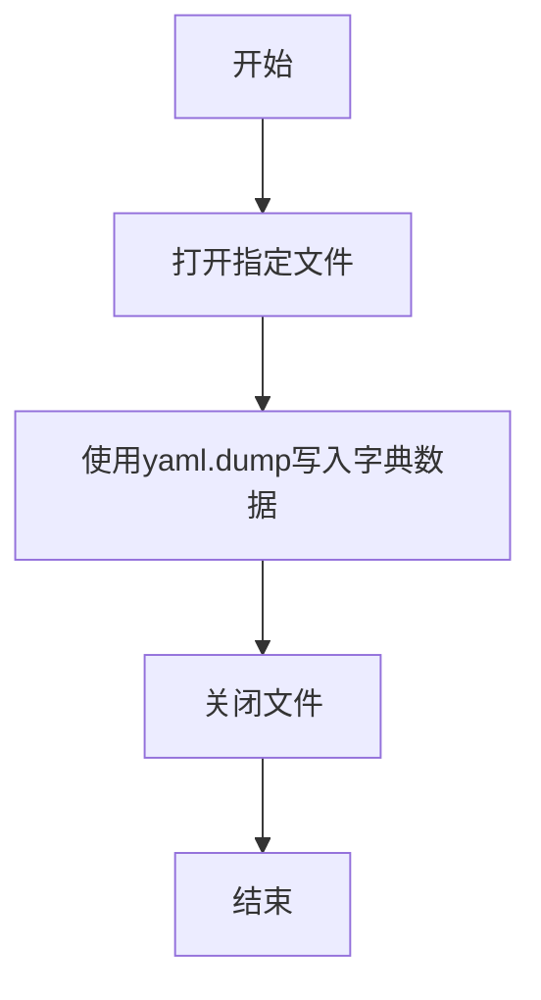

#### 带注释源码

```python
def save_datasets_dict_to_yaml(datasets_dict, name="datasets.yaml"):
    # 打开指定名称的文件用于写入，如果文件不存在则创建
    with open(name, "w") as file:
        # 使用yaml.dump将字典对象序列化为YAML格式并写入文件
        yaml.dump(datasets_dict, file)
```

### `create_dataset_dict`

该函数接收一个`ExpDataset`对象，提取其关键属性（数据集名称、用户需求、评估指标、目标列），并将其封装到一个字典中返回。该字典用于后续生成数据集配置文件。

参数：

- `dataset`：`ExpDataset`，一个实验数据集对象，包含数据集的名称、目标列、用户需求等信息。

返回值：`dict`，一个包含数据集配置信息的字典，键包括`"dataset"`、`"user_requirement"`、`"metric"`、`"target_col"`。

#### 流程图

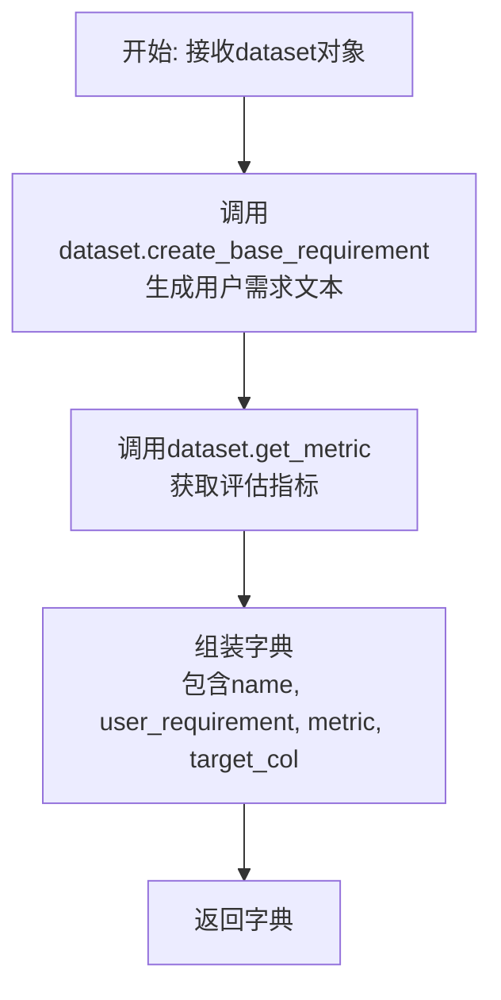

#### 带注释源码

```python
def create_dataset_dict(dataset):
    # 创建一个字典，用于存储数据集的配置信息
    dataset_dict = {
        # 数据集名称，从dataset对象的name属性获取
        "dataset": dataset.name,
        # 用户需求文本，通过调用dataset对象的create_base_requirement方法生成
        "user_requirement": dataset.create_base_requirement(),
        # 评估指标，通过调用dataset对象的get_metric方法获取
        "metric": dataset.get_metric(),
        # 目标列名称，从dataset对象的target_col属性获取
        "target_col": dataset.target_col,
    }
    # 返回组装好的配置字典
    return dataset_dict
```

### `generate_di_instruction`

该函数用于生成数据洞察（DI）任务的附加指令。它根据传入的特殊指令键（如 `"ag"`, `"stacking"`, `"text"`, `"image"`）从预定义的指令字典中获取对应的提示文本，并将其与输出目录信息一起格式化到基础DI指令模板中，最终返回一个完整的、针对特定任务配置的指令字符串。

参数：

- `output_dir`：`str`，指定任务输出文件的目录路径。
- `special_instruction`：`str` 或 `None`，一个标识特殊指令的键（例如 `"ag"` 表示使用AutoGluon）。如果为 `None` 或空，则不添加特殊指令。

返回值：`str`，返回一个格式化后的、包含具体输出目录和（可选的）特殊指令的完整DI指令字符串。

#### 流程图

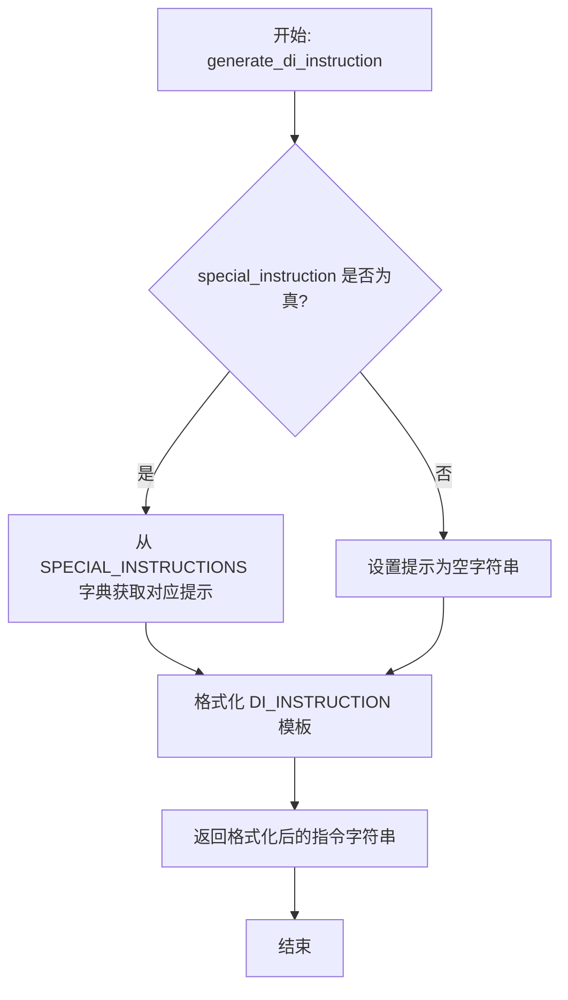

#### 带注释源码

```python
def generate_di_instruction(output_dir, special_instruction):
    # 1. 检查是否提供了特殊指令键
    if special_instruction:
        # 1.1 如果提供了，从预定义的 SPECIAL_INSTRUCTIONS 字典中获取对应的指令文本
        special_instruction_prompt = SPECIAL_INSTRUCTIONS[special_instruction]
    else:
        # 1.2 如果未提供，将特殊指令提示设置为空字符串
        special_instruction_prompt = ""
    # 2. 使用获取到的特殊指令提示和输出目录路径，格式化全局常量 DI_INSTRUCTION 模板
    additional_instruction = DI_INSTRUCTION.format(
        output_dir=output_dir, special_instruction=special_instruction_prompt
    )
    # 3. 返回格式化后的完整指令字符串
    return additional_instruction
```

### `generate_task_requirement`

该函数根据给定的任务名称和配置，生成一个完整的任务需求提示字符串。它整合了用户需求、数据路径、输出目录以及特定于任务类型的附加指令（如是否启用数据洞察模式），最终生成一个结构化的任务描述，用于指导后续的数据分析和机器学习流程。

参数：

- `task_name`：`str`，任务名称，用于在配置中查找对应的数据集信息。
- `data_config`：`dict`，数据配置字典，包含数据集路径、工作目录等信息。
- `is_di`：`bool`，可选参数，默认为`True`，指示是否生成数据洞察（Data Insight）模式的附加指令。
- `special_instruction`：`str`，可选参数，默认为`None`，用于指定特殊的训练指令（如使用AutoGluon、堆叠模型等）。

返回值：`str`，返回一个格式化后的任务需求提示字符串。

#### 流程图

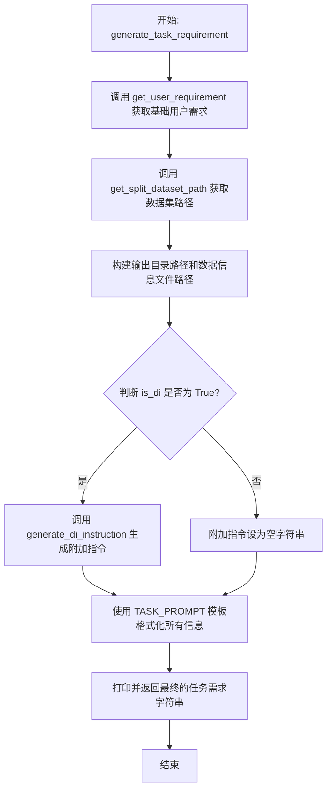

#### 带注释源码

```python
def generate_task_requirement(task_name, data_config, is_di=True, special_instruction=None):
    """
    根据任务名称和配置生成完整的任务需求提示。

    Args:
        task_name (str): 任务名称，对应配置中的数据集键。
        data_config (dict): 包含数据集路径、工作目录等配置信息的字典。
        is_di (bool, optional): 是否启用数据洞察模式。默认为 True。
        special_instruction (str, optional): 特殊指令键，用于选择特定的训练策略（如 'ag', 'stacking'）。默认为 None。

    Returns:
        str: 格式化后的任务需求提示字符串。
    """
    # 1. 从配置中获取基础用户需求描述
    user_requirement = get_user_requirement(task_name, data_config)
    # 2. 获取数据集的拆分文件路径（训练集、验证集、测试集等）
    split_dataset_path = get_split_dataset_path(task_name, data_config)
    train_path = split_dataset_path["train"]
    dev_path = split_dataset_path["dev"]
    test_path = split_dataset_path["test_wo_target"]  # 注意：测试集路径是不带目标列的版本
    # 3. 构建输出目录和数据信息文件路径
    work_dir = data_config["work_dir"]
    output_dir = f"{work_dir}/{task_name}"
    datasets_dir = data_config["datasets_dir"]
    data_info_path = f"{datasets_dir}/{task_name}/dataset_info.json"
    # 4. 根据 is_di 标志决定是否生成数据洞察模式的附加指令
    if is_di:
        additional_instruction = generate_di_instruction(output_dir, special_instruction)
    else:
        additional_instruction = ""
    # 5. 使用预定义的 TASK_PROMPT 模板，将所有信息组合成最终的任务提示
    user_requirement = TASK_PROMPT.format(
        user_requirement=user_requirement,
        train_path=train_path,
        dev_path=dev_path,
        test_path=test_path,
        additional_instruction=additional_instruction,
        data_info_path=data_info_path,
    )
    # 6. 打印并返回结果
    print(user_requirement)
    return user_requirement
```

### `process_dataset`

这是一个异步函数，用于处理单个数据集。它首先（可选地）调用 `SolutionDesigner` 生成解决方案分析池，然后根据数据集信息创建一个配置字典，并将其添加到全局的 `datasets_dict` 中，为后续生成YAML配置文件做准备。

参数：

- `dataset`：`ExpDataset` 或其子类（如 `OpenMLExpDataset`），表示要处理的数据集对象。
- `solution_designer`：`SolutionDesigner`，一个用于生成机器学习解决方案分析池的组件。
- `save_analysis_pool`：`bool`，一个标志，指示是否调用 `solution_designer.generate_solutions` 来生成并保存解决方案分析池。
- `datasets_dict`：`dict`，一个用于收集所有数据集配置信息的字典。函数会将当前数据集的配置信息添加到 `datasets_dict["datasets"]` 下。

返回值：`None`，该函数不返回任何值，其作用是通过修改传入的 `datasets_dict` 参数来收集数据。

#### 流程图

```mermaid
flowchart TD
    A[开始: process_dataset] --> B{是否保存分析池?<br>save_analysis_pool == True?};
    B -- 是 --> C[调用 solution_designer.generate_solutions<br>生成解决方案分析池];
    B -- 否 --> D;
    C --> D[调用 create_dataset_dict<br>创建数据集配置字典];
    D --> E[将配置字典添加到<br>datasets_dict["datasets"] 中];
    E --> F[结束];
```

#### 带注释源码

```python
async def process_dataset(dataset, solution_designer: SolutionDesigner, save_analysis_pool, datasets_dict):
    # 1. 条件性生成解决方案分析池：如果 save_analysis_pool 标志为 True，
    #    则调用 solution_designer 的异步方法，传入数据集信息和名称。
    if save_analysis_pool:
        await solution_designer.generate_solutions(dataset.get_dataset_info(), dataset.name)
    
    # 2. 创建数据集配置字典：根据 dataset 对象的信息（如名称、用户需求、评估指标、目标列）
    #    生成一个标准化的配置字典。
    dataset_dict = create_dataset_dict(dataset)
    
    # 3. 收集配置信息：将上一步创建的配置字典，以数据集名称为键，添加到全局的 datasets_dict 中。
    #    这为后续将所有数据集配置保存到YAML文件做好了准备。
    datasets_dict["datasets"][dataset.name] = dataset_dict
```

### `parse_args`

该函数用于解析命令行参数，配置数据集处理过程中的更新和分析池保存选项。

参数：

- 无显式参数（使用 `argparse` 模块解析命令行参数）

返回值：`argparse.Namespace`，包含解析后的命令行参数对象

#### 流程图

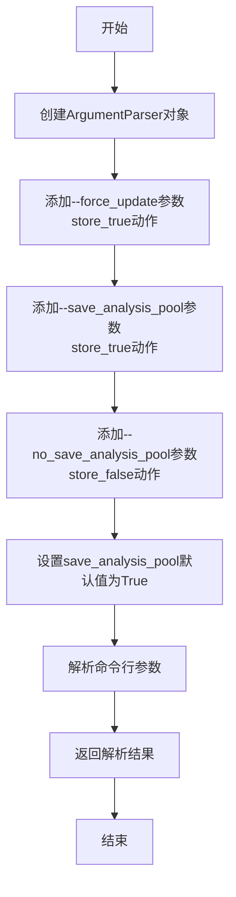

#### 带注释源码

```python
def parse_args():
    # 创建ArgumentParser对象，用于解析命令行参数
    parser = argparse.ArgumentParser()
    
    # 添加--force_update参数，当指定该参数时，force_update为True
    # 用于强制更新数据集
    parser.add_argument("--force_update", action="store_true", help="Force update datasets")
    
    # 添加--save_analysis_pool参数，当指定该参数时，save_analysis_pool为True
    # 用于保存分析池
    parser.add_argument("--save_analysis_pool", action="store_true", help="Save analysis pool")
    
    # 添加--no_save_analysis_pool参数，当指定该参数时，save_analysis_pool为False
    # 用于不保存分析池
    parser.add_argument(
        "--no_save_analysis_pool", dest="save_analysis_pool", action="store_false", help="Do not save analysis pool"
    )
    
    # 设置save_analysis_pool参数的默认值为True
    # 即如果不指定任何相关参数，默认会保存分析池
    parser.set_defaults(save_analysis_pool=True)
    
    # 解析命令行参数并返回结果
    return parser.parse_args()
```

### `ExpDataset.__init__`

`ExpDataset.__init__` 方法是 `ExpDataset` 类的构造函数，负责初始化一个实验数据集对象。它接收数据集的名称和目录路径，以及可选的配置参数（如目标列名和强制更新标志）。该方法的核心功能是调用 `save_dataset` 方法来确保数据集文件（包括拆分后的训练集、验证集、测试集以及数据集信息文件）在指定目录中正确存在。如果文件已存在且未设置强制更新，则跳过创建过程；否则，将根据原始数据生成并保存这些文件。

参数：

- `name`：`str`，数据集的名称。
- `dataset_dir`：`str`，数据集存储的根目录路径。
- `**kwargs`：`dict`，可选的关键字参数，包含 `target_col`（目标列名）和 `force_update`（强制更新标志）。

返回值：`None`，构造函数不返回任何值。

#### 流程图

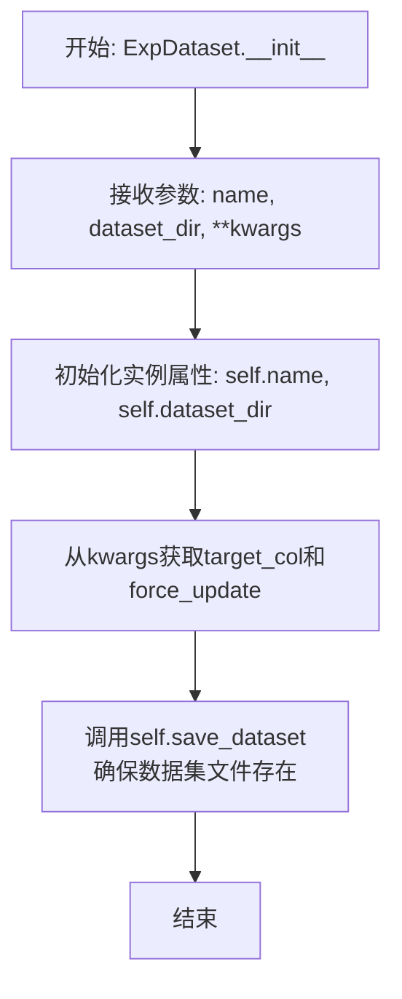

#### 带注释源码

```python
    def __init__(self, name, dataset_dir, **kwargs):
        # 初始化数据集名称
        self.name = name
        # 初始化数据集存储目录
        self.dataset_dir = dataset_dir
        # 从关键字参数中获取目标列名，如果未提供则为None
        self.target_col = kwargs.get("target_col", None)
        # 从关键字参数中获取强制更新标志，如果未提供则为False
        self.force_update = kwargs.get("force_update", False)
        # 调用save_dataset方法，确保数据集文件（拆分文件和信息文件）被创建或更新
        self.save_dataset(target_col=self.target_col)
```

### `ExpDataset.check_dataset_exists`

该方法用于检查数据集是否已完整存在。它验证指定数据集目录下是否包含所有必需的分割文件（如训练集、开发集、测试集等）。如果所有文件都存在，则返回 `True`；否则返回 `False`。

参数：

-  `self`：`ExpDataset` 实例，表示当前数据集对象。

返回值：`bool`，如果所有必需的分割文件都存在则返回 `True`，否则返回 `False`。

#### 流程图

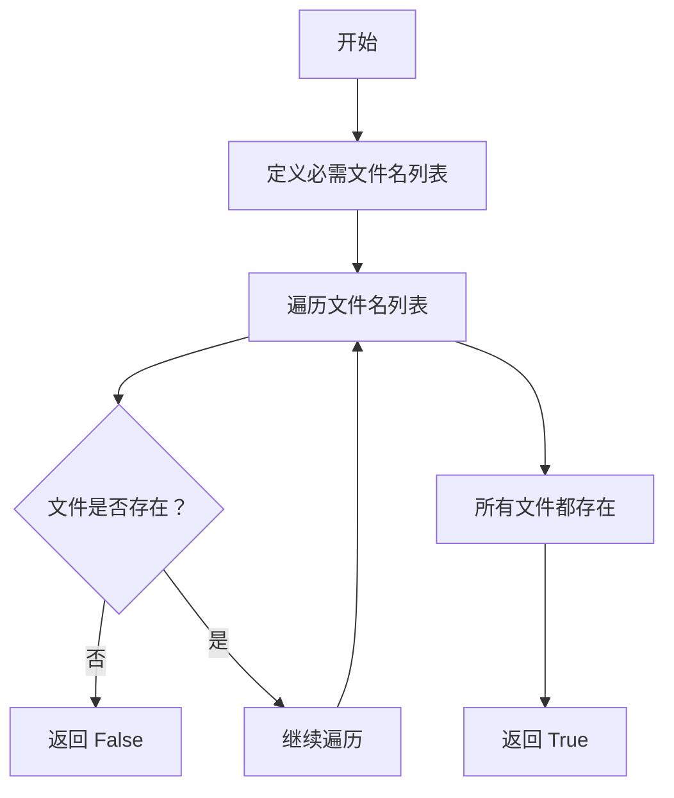

#### 带注释源码

```python
def check_dataset_exists(self):
    # 定义必需的分割文件名列表
    fnames = [
        "split_train.csv",
        "split_dev.csv",
        "split_test.csv",
        "split_dev_wo_target.csv",
        "split_dev_target.csv",
        "split_test_wo_target.csv",
        "split_test_target.csv",
    ]
    # 遍历每个文件名，检查文件是否存在
    for fname in fnames:
        # 构建文件路径：数据集目录/数据集名称/文件名
        if not os.path.exists(Path(self.dataset_dir, self.name, fname)):
            # 如果任一文件不存在，立即返回 False
            return False
    # 所有文件都存在，返回 True
    return True
```

### `ExpDataset.check_datasetinfo_exists`

该方法用于检查数据集信息文件（dataset_info.json）是否存在于指定目录中。

参数：
- `self`：`ExpDataset`，当前`ExpDataset`类的实例

返回值：`bool`，如果数据集信息文件存在则返回`True`，否则返回`False`

#### 流程图

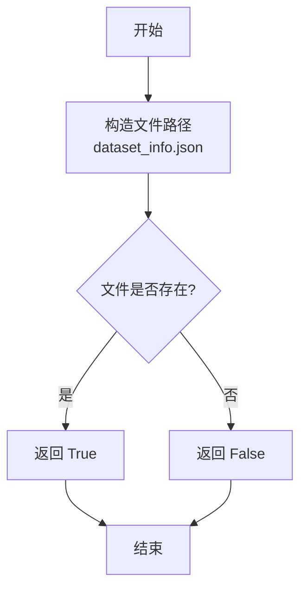

#### 带注释源码

```python
def check_datasetinfo_exists(self):
    # 构造数据集信息文件的完整路径，位于数据集目录下的`dataset_info.json`
    # 使用`Path`对象拼接路径，确保跨平台兼容性
    return os.path.exists(Path(self.dataset_dir, self.name, "dataset_info.json"))
```

### `ExpDataset.get_raw_dataset`

该方法用于从指定目录加载原始的训练和测试数据集文件（train.csv 和 test.csv），并以 pandas DataFrame 的形式返回。如果原始数据文件不存在，则会抛出异常。

参数：

- `self`：`ExpDataset`，当前 `ExpDataset` 类的实例。

返回值：`tuple[pd.DataFrame, pd.DataFrame]`，返回一个包含两个 pandas DataFrame 的元组。第一个元素是训练数据集（train_df），第二个元素是测试数据集（test_df）。如果测试数据集文件不存在，则 test_df 为 None。

#### 流程图

```mermaid
flowchart TD
    A[开始] --> B[构造原始数据目录路径 raw_dir]
    B --> C{检查 train.csv 是否存在?}
    C -- 否 --> D[抛出 FileNotFoundError 异常]
    C -- 是 --> E[使用 pd.read_csv 加载 train.csv 为 train_df]
    E --> F{检查 test.csv 是否存在?}
    F -- 否 --> G[设置 test_df = None]
    F -- 是 --> H[使用 pd.read_csv 加载 test.csv 为 test_df]
    G --> I[返回 (train_df, test_df)]
    H --> I
```

#### 带注释源码

```python
def get_raw_dataset(self):
    # 构造原始数据文件的存储目录路径，格式为：{数据集目录}/{数据集名称}/raw
    raw_dir = Path(self.dataset_dir, self.name, "raw")
    train_df = None
    test_df = None

    # 检查原始训练数据文件 train.csv 是否存在
    if not os.path.exists(Path(raw_dir, "train.csv")):
        # 如果不存在，抛出文件未找到异常
        raise FileNotFoundError(f"Raw dataset `train.csv` not found in {raw_dir}")
    else:
        # 如果存在，使用 pandas 读取 CSV 文件，加载为 DataFrame
        train_df = pd.read_csv(Path(raw_dir, "train.csv"))

    # 检查原始测试数据文件 test.csv 是否存在
    if os.path.exists(Path(raw_dir, "test.csv")):
        # 如果存在，使用 pandas 读取 CSV 文件，加载为 DataFrame
        test_df = pd.read_csv(Path(raw_dir, "test.csv"))

    # 返回包含训练和测试 DataFrame 的元组。如果 test.csv 不存在，test_df 为 None。
    return train_df, test_df
```

### `ExpDataset.get_dataset_info`

该方法用于获取数据集的详细信息，包括元数据和数据预览。它读取原始训练数据文件，计算关键统计信息（如特征数量、类别数量、缺失值数量等），并生成一个包含数据集名称、描述、目标列、元数据和数据预览的字典。

参数：

-  `self`：`ExpDataset`，当前`ExpDataset`类的实例

返回值：`dict`，包含数据集详细信息的字典，结构如下：
```python
{
    "name": str,               # 数据集名称
    "description": str,        # 数据集描述（当前为空字符串）
    "target_col": str,         # 目标列名称
    "metadata": dict,          # 数据集元数据，包含各种统计信息
    "df_head": str             # 数据预览（前几行数据的字符串表示）
}
```

#### 流程图

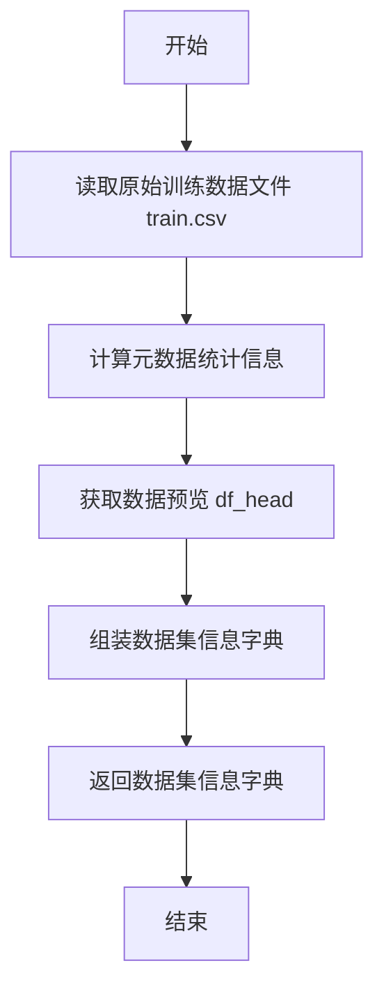

#### 带注释源码

```python
def get_dataset_info(self):
    # 读取原始训练数据文件
    raw_df = pd.read_csv(Path(self.dataset_dir, self.name, "raw", "train.csv"))
    
    # 计算数据集的元数据统计信息
    metadata = {
        "NumberOfClasses": raw_df[self.target_col].nunique(),  # 目标列的唯一值数量（类别数）
        "NumberOfFeatures": raw_df.shape[1],  # 特征数量（列数）
        "NumberOfInstances": raw_df.shape[0],  # 实例数量（行数）
        "NumberOfInstancesWithMissingValues": int(raw_df.isnull().any(axis=1).sum()),  # 包含缺失值的实例数量
        "NumberOfMissingValues": int(raw_df.isnull().sum().sum()),  # 缺失值总数
        "NumberOfNumericFeatures": raw_df.select_dtypes(include=["number"]).shape[1],  # 数值型特征数量
        "NumberOfSymbolicFeatures": raw_df.select_dtypes(include=["object"]).shape[1],  # 符号型（字符型）特征数量
    }

    # 获取数据预览（前几行数据的字符串表示）
    df_head_text = self.get_df_head(raw_df)

    # 组装数据集信息字典
    dataset_info = {
        "name": self.name,  # 数据集名称
        "description": "",  # 数据集描述（当前为空，可在子类中填充）
        "target_col": self.target_col,  # 目标列名称
        "metadata": metadata,  # 元数据统计信息
        "df_head": df_head_text,  # 数据预览
    }
    return dataset_info  # 返回数据集信息字典
```

### `ExpDataset.get_df_head`

该方法用于获取数据框的前几行数据，并将其转换为字符串格式，以便于查看或记录数据的基本结构。

参数：

- `raw_df`：`pandas.DataFrame`，原始数据框，包含待处理的数据。

返回值：`str`，返回数据框前几行数据的字符串表示，不包含索引列。

#### 流程图

```mermaid
graph TD
    A[开始] --> B[调用 raw_df.head() 获取前几行数据]
    B --> C[使用 to_string(index=False) 转换为字符串]
    C --> D[返回字符串结果]
    D --> E[结束]
```

#### 带注释源码

```python
def get_df_head(self, raw_df):
    # 调用 pandas.DataFrame 的 head() 方法获取前几行数据（默认前5行）
    # 使用 to_string(index=False) 将数据框转换为字符串，不包含索引列
    return raw_df.head().to_string(index=False)
```

### `ExpDataset.get_metric`

该方法根据数据集的目标列（target column）的类别数量，自动确定并返回一个合适的评估指标（metric）。具体规则是：对于二分类问题返回"f1 binary"，对于多分类问题（类别数在3到200之间）返回"f1 weighted"，对于回归问题（类别数大于200或等于0）返回"rmse"。

参数：
- `self`：`ExpDataset`，当前`ExpDataset`类的实例。

返回值：`str`，根据数据集特性确定的评估指标名称。

#### 流程图

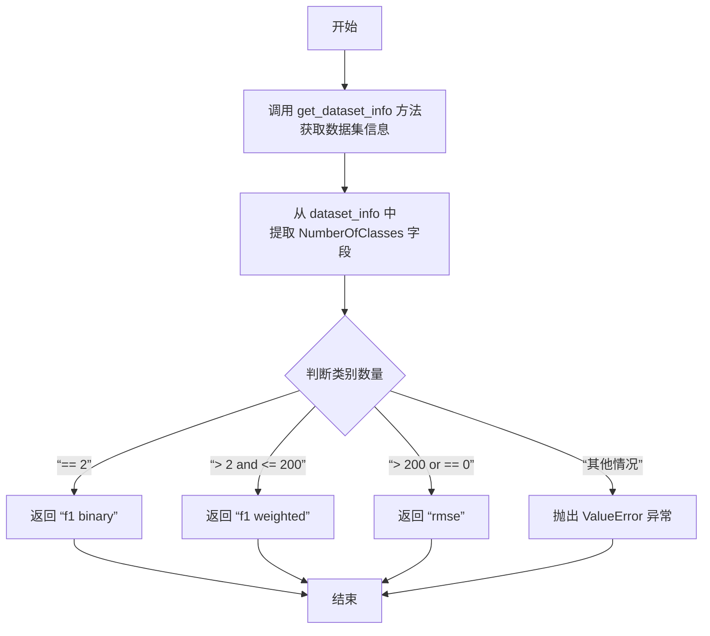

#### 带注释源码

```python
def get_metric(self):
    # 1. 获取数据集信息，其中包含元数据（metadata）
    dataset_info = self.get_dataset_info()
    # 2. 从元数据中提取目标列的类别数量
    num_classes = dataset_info["metadata"]["NumberOfClasses"]
    
    # 3. 根据类别数量选择评估指标
    if num_classes == 2:
        # 二分类问题：使用 F1 分数（binary）
        metric = "f1 binary"
    elif 2 < num_classes <= 200:
        # 多分类问题（类别数适中）：使用加权 F1 分数
        metric = "f1 weighted"
    elif num_classes > 200 or num_classes == 0:
        # 回归问题（类别数非常多或为0）或连续值预测：使用均方根误差
        metric = "rmse"
    else:
        # 处理不支持的类别数量（理论上不应触发，因为类别数是非负整数）
        raise ValueError(f"Number of classes {num_classes} not supported")
    
    # 4. 返回确定的评估指标
    return metric
```

### `ExpDataset.create_base_requirement`

该方法用于生成数据集的基础用户需求描述。它首先调用 `get_metric()` 方法确定评估指标，然后使用 `BASE_USER_REQUIREMENT` 模板，将数据集名称、目标列和评估指标填充到模板中，生成一段标准化的任务描述。

参数：
-  `self`：`ExpDataset`，当前 `ExpDataset` 类的实例

返回值：`str`，格式化后的基础用户需求字符串

#### 流程图

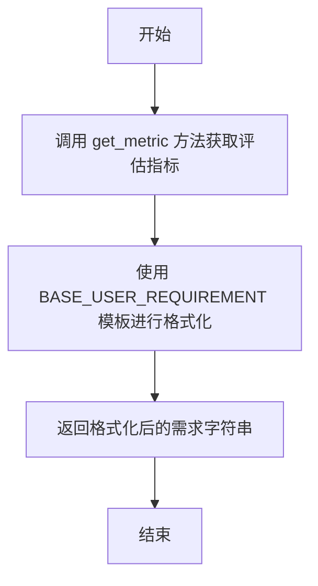

#### 带注释源码

```python
def create_base_requirement(self):
    # 调用 get_metric 方法，根据数据集的目标列类型（分类或回归）确定评估指标
    metric = self.get_metric()
    # 使用 BASE_USER_REQUIREMENT 模板，将数据集名称、目标列和评估指标填充到模板中
    req = BASE_USER_REQUIREMENT.format(datasetname=self.name, target_col=self.target_col, metric=metric)
    # 返回格式化后的基础用户需求字符串
    return req
```

### `ExpDataset.save_dataset`

该方法负责保存数据集及其相关信息。它首先检查数据集是否已存在或是否需要强制更新，如果不存在或需要更新，则调用 `split_and_save` 方法将原始数据集分割为训练集、开发集和测试集，并保存到指定目录。同时，它也会检查数据集信息文件是否存在或是否需要更新，如果不存在或需要更新，则调用 `get_dataset_info` 方法获取数据集信息，并保存为 JSON 文件。

参数：

- `target_col`：`str`，目标列的名称，用于数据分割和保存。

返回值：`None`，无返回值。

#### 流程图

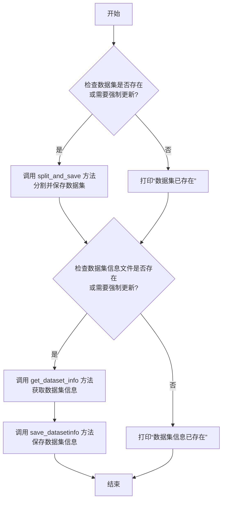

#### 带注释源码

```python
def save_dataset(self, target_col):
    # 获取原始数据集和测试集（如果存在）
    df, test_df = self.get_raw_dataset()
    
    # 检查数据集是否已存在或是否需要强制更新
    if not self.check_dataset_exists() or self.force_update:
        print(f"Saving Dataset {self.name} in {self.dataset_dir}")
        # 调用 split_and_save 方法分割并保存数据集
        self.split_and_save(df, target_col, test_df=test_df)
    else:
        print(f"Dataset {self.name} already exists")
    
    # 检查数据集信息文件是否已存在或是否需要强制更新
    if not self.check_datasetinfo_exists() or self.force_update:
        print(f"Saving Dataset info for {self.name}")
        # 调用 get_dataset_info 方法获取数据集信息
        dataset_info = self.get_dataset_info()
        # 调用 save_datasetinfo 方法保存数据集信息
        self.save_datasetinfo(dataset_info)
    else:
        print(f"Dataset info for {self.name} already exists")
```

### `ExpDataset.save_datasetinfo`

该方法用于将数据集信息（元数据、描述、目标列等）保存为JSON格式的文件，以便后续使用。

参数：

- `dataset_info`：`dict`，包含数据集信息的字典，如名称、描述、目标列、元数据等。

返回值：`None`，无返回值。

#### 流程图

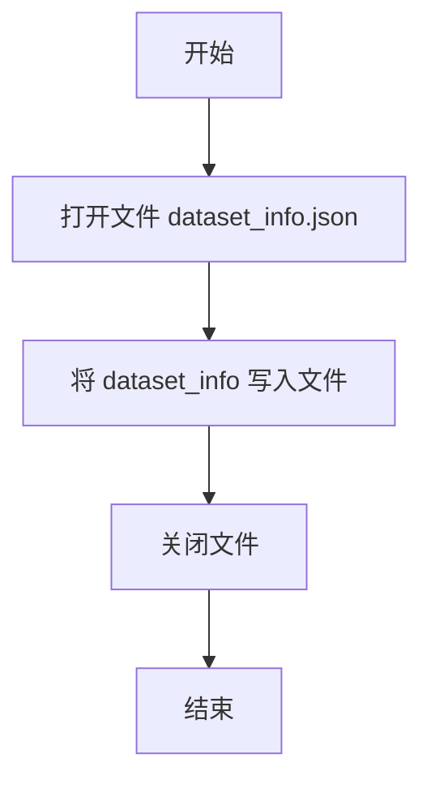

#### 带注释源码

```python
def save_datasetinfo(self, dataset_info):
    # 打开数据集信息文件，使用 utf-8 编码以确保支持非ASCII字符
    with open(Path(self.dataset_dir, self.name, "dataset_info.json"), "w", encoding="utf-8") as file:
        # 将 dataset_info 字典写入文件，缩进为4个空格，确保非ASCII字符正确保存
        json.dump(dataset_info, file, indent=4, ensure_ascii=False)
```

### `ExpDataset.save_split_datasets`

该方法属于 `ExpDataset` 类，负责将给定的数据集（`df`）保存为指定拆分（`split`）的CSV文件。它会生成三个文件：包含完整数据的文件、不包含目标列的文件以及仅包含目标列的文件。如果目标列的名称不是“target”，则会将其重命名为“target”后单独保存。

参数：

- `df`：`pandas.DataFrame`，需要保存的数据集。
- `split`：`str`，数据集的拆分名称（例如：“train”、“dev”、“test”），将作为生成文件名的前缀。
- `target_col`：`str`，可选参数，数据集中目标列的名称。如果提供，则会额外生成不包含目标列和仅包含目标列的文件。

返回值：`None`，该方法不返回任何值，其作用是将文件写入磁盘。

#### 流程图

```mermaid
flowchart TD
    A[开始] --> B{target_col 参数是否提供?}
    B -- 是 --> C[保存完整数据集 df 到 split_{split}.csv]
    C --> D[从 df 中移除 target_col 列<br>生成 df_wo_target]
    D --> E[保存 df_wo_target 到 split_{split}_wo_target.csv]
    E --> F[从 df 中提取 target_col 列<br>生成 df_target]
    F --> G{target_col 列名是否为 'target'?}
    G -- 否 --> H[将列名重命名为 'target']
    H --> I[保存 df_target 到 split_{split}_target.csv]
    G -- 是 --> I
    I --> J[结束]
    B -- 否 --> K[仅保存完整数据集 df 到 split_{split}.csv]
    K --> J
```

#### 带注释源码

```python
def save_split_datasets(self, df, split, target_col=None):
    # 构建数据集存储的基础路径
    path = Path(self.dataset_dir, self.name)
    # 1. 保存完整的数据集到文件，例如 split_train.csv
    df.to_csv(Path(path, f"split_{split}.csv"), index=False)
    
    # 2. 如果提供了目标列名，则生成并保存不包含目标列和仅包含目标列的文件
    if target_col:
        # 2.1 生成不包含目标列的数据集
        df_wo_target = df.drop(columns=[target_col])
        # 保存到文件，例如 split_dev_wo_target.csv
        df_wo_target.to_csv(Path(path, f"split_{split}_wo_target.csv"), index=False)
        
        # 2.2 生成仅包含目标列的数据集
        df_target = df[[target_col]].copy()
        # 如果原始目标列名不是 'target'，则将其重命名为 'target' 以保持一致性
        if target_col != "target":
            df_target["target"] = df_target[target_col]
            df_target = df_target.drop(columns=[target_col])
        # 保存到文件，例如 split_dev_target.csv
        df_target.to_csv(Path(path, f"split_{split}_target.csv"), index=False)
```

### `ExpDataset.split_and_save`

该方法用于将原始数据集分割为训练集、开发集和测试集，并将分割后的数据集保存到指定目录。如果提供了独立的测试集，则直接使用该测试集；否则，从原始数据中分割出测试集。分割过程使用固定的随机种子以确保可重复性。

参数：

- `df`：`pandas.DataFrame`，原始训练数据集（包含目标列）。
- `target_col`：`str`，目标列的名称。
- `test_df`：`pandas.DataFrame`，可选的独立测试数据集（默认为`None`）。如果提供，则直接使用此数据集作为测试集，而不从`df`中分割。

返回值：`None`，该方法不返回任何值，但会将分割后的数据集保存为CSV文件。

#### 流程图

```mermaid
graph TD
    A[开始 split_and_save] --> B{target_col 是否为空?};
    B -- 是 --> C[抛出 ValueError];
    B -- 否 --> D{test_df 是否为 None?};
    D -- 是 --> E[使用 train_test_split 从 df 分割出 test];
    D -- 否 --> F[将 df 作为 train, test_df 作为 test];
    E --> G[使用 train_test_split 从 train 分割出 dev];
    F --> G;
    G --> H[调用 save_split_datasets 保存 train];
    H --> I[调用 save_split_datasets 保存 dev];
    I --> J[调用 save_split_datasets 保存 test];
    J --> K[结束];
```

#### 带注释源码

```python
def split_and_save(self, df, target_col, test_df=None):
    # 检查目标列是否提供，若未提供则抛出异常
    if not target_col:
        raise ValueError("Target column not provided")
    
    # 判断是否提供了独立的测试集
    if test_df is None:
        # 若未提供，则从原始数据 df 中分割出测试集
        # TRAIN_TEST_SPLIT 定义了训练集的比例，SEED 为随机种子以确保可重复性
        train, test = train_test_split(df, test_size=1 - TRAIN_TEST_SPLIT, random_state=SEED)
    else:
        # 若提供了独立的测试集，则直接使用
        train = df
        test = test_df
    
    # 从训练集中进一步分割出开发集
    # TRAIN_DEV_SPLIT 定义了训练集在进一步分割中的比例
    train, dev = train_test_split(train, test_size=1 - TRAIN_DEV_SPLIT, random_state=SEED)
    
    # 保存分割后的数据集
    # 训练集不保存目标列（因为训练时目标列已知）
    self.save_split_datasets(train, "train")
    # 开发集保存带目标列、不带目标列以及仅目标列的三个版本
    self.save_split_datasets(dev, "dev", target_col)
    # 测试集保存带目标列、不带目标列以及仅目标列的三个版本
    self.save_split_datasets(test, "test", target_col)
```

### `OpenMLExpDataset.__init__`

该方法用于初始化一个OpenML实验数据集对象。它首先从OpenML平台获取指定ID的数据集，然后调用父类的初始化方法，将数据集信息保存到本地目录中。

参数：

- `name`：`str`，数据集的名称（在此方法中实际上被忽略，因为名称从OpenML获取）
- `dataset_dir`：`str`，数据集保存的本地目录路径
- `dataset_id`：`int`，OpenML数据集的唯一标识符
- `**kwargs`：`dict`，其他关键字参数，传递给父类初始化方法

返回值：`None`，无返回值

#### 流程图

```mermaid
graph TD
    A[开始] --> B[获取OpenML数据集]
    B --> C[设置数据集名称和目标列]
    C --> D[调用父类初始化方法]
    D --> E[结束]
```

#### 带注释源码

```python
def __init__(self, name, dataset_dir, dataset_id, **kwargs):
    # 保存OpenML数据集的ID
    self.dataset_id = dataset_id
    # 从OpenML平台获取数据集元数据（不下载数据）
    self.dataset = openml.datasets.get_dataset(
        self.dataset_id, 
        download_data=False, 
        download_qualities=False, 
        download_features_meta_data=True
    )
    # 使用OpenML数据集的名称作为对象名称
    self.name = self.dataset.name
    # 使用OpenML数据集的默认目标列作为目标列
    self.target_col = self.dataset.default_target_attribute
    # 调用父类ExpDataset的初始化方法，传递必要的参数
    super().__init__(self.name, dataset_dir, target_col=self.target_col, **kwargs)
```

### `OpenMLExpDataset.get_raw_dataset`

该方法用于从OpenML平台获取指定ID的数据集，并将其保存为CSV文件，然后返回训练数据DataFrame和None（因为OpenML数据集通常不区分训练集和测试集）。

参数：

- `self`：`OpenMLExpDataset`，当前OpenMLExpDataset实例

返回值：`tuple[pd.DataFrame, None]`，返回一个元组，包含训练数据DataFrame和None（测试数据）

#### 流程图

```mermaid
graph TD
    A[开始] --> B[获取OpenML数据集对象]
    B --> C[将数据集转换为DataFrame]
    C --> D[创建raw目录]
    D --> E[保存DataFrame为train.csv]
    E --> F[返回DataFrame和None]
    F --> G[结束]
```

#### 带注释源码

```python
def get_raw_dataset(self):
    # 获取OpenML数据集对象
    dataset = self.dataset
    # 将数据集转换为DataFrame，忽略其他返回的元组元素
    dataset_df, *_ = dataset.get_data()
    # 构建raw目录路径
    raw_dir = Path(self.dataset_dir, self.name, "raw")
    # 创建raw目录（如果不存在）
    os.makedirs(raw_dir, exist_ok=True)
    # 将DataFrame保存为CSV文件到raw目录
    dataset_df.to_csv(Path(raw_dir, "train.csv"), index=False)
    # 返回训练数据DataFrame和None（因为OpenML数据集通常不提供测试集）
    return dataset_df, None
```

### `OpenMLExpDataset.get_dataset_info`

该方法用于获取OpenML数据集的详细信息，包括数据集的基本元数据、描述以及从OpenML平台获取的额外质量属性。它首先调用父类`ExpDataset`的`get_dataset_info`方法获取基础信息，然后补充OpenML特有的描述和质量属性。

参数：
-  `self`：`OpenMLExpDataset`，当前OpenMLExpDataset实例

返回值：`dict`，包含数据集名称、描述、目标列、元数据（包括基础统计信息和OpenML质量属性）以及数据预览的字典。

#### 流程图

```mermaid
graph TD
    A[开始] --> B[调用父类ExpDataset.get_dataset_info]
    B --> C[获取基础数据集信息字典]
    C --> D[从OpenML数据集对象获取名称和描述]
    D --> E[从OpenML数据集对象获取质量属性]
    E --> F[将OpenML质量属性更新到元数据中]
    F --> G[返回更新后的数据集信息字典]
    G --> H[结束]
```

#### 带注释源码

```python
def get_dataset_info(self):
    # 1. 调用父类ExpDataset的get_dataset_info方法，获取基础数据集信息
    #    这包括：数据集名称、目标列、基础元数据（如特征数、实例数等）和数据预览
    dataset_info = super().get_dataset_info()
    
    # 2. 获取OpenML数据集对象（在__init__中已加载）
    dataset = self.dataset
    
    # 3. 使用OpenML数据集的名称和描述覆盖或补充父类获取的信息
    dataset_info["name"] = dataset.name
    dataset_info["description"] = dataset.description
    
    # 4. 获取OpenML平台提供的该数据集的质量属性（如NumberOfMissingValues等），
    #    并将其更新到已有的元数据字典中。这丰富了数据集的描述信息。
    dataset_info["metadata"].update(dataset.qualities)
    
    # 5. 返回最终整合了基础信息和OpenML特有信息的数据集信息字典
    return dataset_info
```

## 关键组件


### 数据集管理与配置系统

该组件负责管理多种来源（OpenML、自定义CSV文件）的数据集，包括数据集的加载、验证、信息提取、标准化分割（训练集/验证集/测试集）以及生成对应的配置元数据（YAML文件）。它抽象了不同数据源的差异，为下游的机器学习任务提供统一、格式化的数据接口。

### 任务指令生成器

该组件根据数据集类型（如回归、分类、文本、图像）和用户指定的特殊指令（如使用AutoGluon、堆叠集成），动态生成结构化的、详细的机器学习任务提示（Prompt）。它将数据集路径、目标变量、评估指标、输出目录等具体信息与通用的数据科学工作流指导原则相结合，形成可执行的指令。

### 数据集信息提取与元数据构建

该组件从原始数据集中自动提取关键统计信息（如特征数量、类别数、缺失值情况），并生成结构化的数据集描述。这些元数据用于自动确定合适的评估指标（如F1、RMSE）以及为下游的智能体或分析工具提供数据洞察。

### 异步任务处理流水线

该组件组织主程序的执行流程，通过异步方式（`asyncio.run`）依次处理多个数据集。它将数据集对象、解决方案设计器（`SolutionDesigner`）和配置字典连接起来，支持可选的分析池保存功能，实现了数据预处理与潜在方案生成的解耦与并行化处理。

### 命令行参数解析与配置

该组件定义了程序运行时的控制参数，如是否强制更新已有数据集（`--force_update`）和是否保存分析池（`--save_analysis_pool`）。它提供了灵活的运行时配置能力，使得脚本可以适应不同的预处理和实验需求。


## 问题及建议


### 已知问题

-   **硬编码的配置和路径**：代码中大量使用了硬编码的常量（如 `OPENML_DATASET_IDS`, `CUSTOM_DATASETS`, `DSAGENT_DATASETS`）和路径拼接逻辑（如在 `get_split_dataset_path` 和 `generate_task_requirement` 中）。这使得代码难以维护、复用和配置，任何数据集或目录结构的变更都需要直接修改源代码。
-   **同步与异步混合使用不当**：主程序入口 `if __name__ == "__main__":` 中，在同步代码块内直接调用 `asyncio.run()` 来处理每个数据集。虽然功能上可行，但这种模式限制了并发处理多个数据集的潜力，并且不是使用异步编程的最佳实践。更好的方式是将整个循环包装在一个异步函数中。
-   **错误处理不完善**：代码中多处存在可能引发异常的地方（如文件不存在、数据集配置缺失、网络请求失败等），但缺乏统一的错误处理机制。例如，`get_raw_dataset` 在文件不存在时直接抛出 `FileNotFoundError`，但上层调用者 `save_dataset` 并未捕获和处理，可能导致整个程序意外终止。
-   **代码重复与职责不清**：
    -   `get_user_requirement` 和 `get_split_dataset_path` 函数逻辑高度相似，都是根据任务名从配置中查找信息，可以抽象。
    -   `ExpDataset` 类的 `save_dataset` 方法同时负责检查、拆分数据和保存数据集信息，职责过多。拆分数据集的逻辑也直接写在类方法中，与数据获取逻辑耦合。
-   **潜在的资源与性能问题**：
    -   对于大型数据集，`get_dataset_info` 方法中的 `raw_df.isnull().any(axis=1).sum()` 和 `raw_df.isnull().sum().sum()` 操作可能比较耗时，且被重复调用（例如在 `save_dataset` 和 `get_metric` 中）。
    -   `OpenMLExpDataset.get_raw_dataset` 每次实例化都会调用 `openml.datasets.get_dataset`，如果实例化多次且 `force_update=False`，会造成不必要的网络请求或缓存查询。
-   **类型提示缺失**：函数和方法的参数、返回值缺乏完整的类型提示（Type Hints），降低了代码的可读性和可维护性，也不利于静态类型检查工具的使用。
-   **配置管理分散**：数据集配置信息分散在多个地方：硬编码的ID列表、`DATA_CONFIG` 导入的配置、以及通过 `create_dataset_dict` 动态生成的 `datasets_dict`。这种分散的管理方式增加了同步和更新配置的复杂度。

### 优化建议

-   **外部化配置**：将 `OPENML_DATASET_IDS`, `CUSTOM_DATASETS`, `DSAGENT_DATASETS` 等列表移至外部配置文件（如YAML或JSON）。将路径模板（如 `{work_dir}/{task_name}`）也纳入配置管理。使用配置类或字典来集中管理所有路径和常量。
-   **重构异步执行流程**：创建一个异步的 `main` 函数，使用 `asyncio.gather()` 并发处理所有数据集，以提高I/O密集型操作（如网络请求、文件读写）的效率。确保事件循环在程序入口点被正确启动和管理。
-   **增强错误处理与日志记录**：
    -   在关键操作（如文件读写、网络请求、数据预处理）周围添加 `try-except` 块，捕获特定异常并进行适当处理（如记录错误、跳过当前数据集、提供默认值）。
    -   引入结构化的日志记录（如使用 `logging` 模块）替代 `print` 语句，以便更好地控制日志级别、格式和输出目的地。
-   **重构与抽象**：
    -   创建一个 `DatasetConfig` 类或使用 `dataclass` 来统一管理数据集的名称、路径、目标列等信息，替换 `get_user_requirement` 和 `get_split_dataset_path` 的功能。
    -   将数据集拆分 (`split_and_save`) 和元数据生成 (`get_dataset_info`) 的逻辑解耦，可以考虑引入“策略模式”或独立的函数/类来处理不同来源（OpenML, 自定义文件）的数据加载和拆分。
    -   在 `ExpDataset` 中缓存 `get_dataset_info` 的结果，避免重复计算。
-   **添加类型提示**：为所有函数、方法、类属性添加完整的类型提示。这可以利用 `typing` 模块（如 `Optional`, `Dict`, `List` 等）来精确描述数据结构。
-   **统一配置加载**：设计一个统一的配置加载机制，合并静态配置文件、命令行参数和动态生成的配置。确保所有模块都从一个单一的、权威的配置源获取信息。
-   **提高代码可测试性**：
    -   将文件系统操作（`os.path`, `Path`）和网络请求（`openml`）等依赖通过参数注入或抽象成接口，以便在单元测试中进行模拟（Mock）。
    -   将主要的业务逻辑（如数据集处理流程）从脚本执行块 (`if __name__ == "__main__"`) 中分离出来，便于独立测试。
-   **优化资源使用**：对于 `OpenMLExpDataset`，考虑在类内部缓存 `dataset` 属性，或者提供一种方式在不需要更新时跳过 `get_raw_dataset` 的调用。


## 其它


### 设计目标与约束

本代码的设计目标是构建一个自动化机器学习（AutoML）数据预处理与任务生成流水线。核心目标包括：
1.  **数据集标准化处理**：支持从多种来源（OpenML平台、本地自定义CSV文件）加载数据集，并自动进行训练集/验证集/测试集的划分与标准化存储。
2.  **元数据提取与描述**：自动分析数据集特征（如样本数、特征数、缺失值、目标列类型），并生成结构化的数据集信息文件（`dataset_info.json`）。
3.  **任务指令自动化生成**：根据数据集特性和用户配置，动态生成包含详细步骤、约束和输出要求的自然语言任务指令（Prompt），用于驱动下游的AI智能体（如`SolutionDesigner`）进行自动化机器学习建模。
4.  **配置驱动与可扩展性**：通过外部配置文件（`DATA_CONFIG`）管理路径和数据集列表，通过类继承（`OpenMLExpDataset`）支持不同数据源的扩展。

主要约束包括：
*   **输入格式**：本地自定义数据集需遵循特定目录结构（`raw/train.csv`, `raw/test.csv`）。
*   **输出格式**：生成的数据集文件、信息文件和最终的配置YAML文件需符合预定义的命名和格式规范。
*   **依赖环境**：需要`openml`, `pandas`, `scikit-learn`, `yaml`等第三方库，以及项目内部的`SolutionDesigner`模块。
*   **任务类型**：当前主要面向监督学习任务（分类、回归），通过目标列唯一值数量自动推断评估指标（F1, RMSE）。

### 错误处理与异常设计

代码中包含了基础的错误处理，但整体策略较为简单，主要依赖于Python内置异常：
1.  **文件与路径检查**：在`ExpDataset.check_dataset_exists`、`get_raw_dataset`等方法中，使用`os.path.exists`检查文件是否存在，缺失时抛出`FileNotFoundError`。
2.  **配置验证**：在`get_split_dataset_path`和`get_user_requirement`函数中，验证请求的数据集名称是否存在于配置中，若不存在则抛出`ValueError`。
3.  **参数验证**：在`ExpDataset.split_and_save`方法中，检查`target_col`参数是否提供，未提供时抛出`ValueError`。
4.  **静默处理与默认值**：对于某些非关键错误，如读取不存在的测试集文件（`get_raw_dataset`），代码选择静默处理（`test_df`为`None`）而非中断流程。
5.  **异常传播**：主程序`__main__`块中没有显式的`try-catch`结构，任何在数据集处理循环中抛出的未捕获异常都将导致整个脚本终止。

**优化空间**：可引入更系统的错误处理层级，例如定义自定义异常类（如`DatasetNotFoundError`、`InvalidConfigError`），在主循环中添加异常日志记录和部分失败容错机制（一个数据集处理失败不影响其他数据集），并提供更友好的错误提示信息。

### 数据流与状态机

代码的核心数据流遵循一个清晰的管道模式，但并未涉及复杂的状态机：
1.  **数据输入**：
    *   **外部配置**：从`DATA_CONFIG`（模块级变量）加载工作目录、数据集目录等路径信息。
    *   **原始数据**：根据数据集类型，从OpenML API或本地`raw/`目录读取原始`DataFrame`。
2.  **数据处理管道**：
    *   **检查点**：`ExpDataset`首先检查处理后的数据集文件和信息文件是否已存在（`check_dataset_exists`, `check_datasetinfo_exists`）。这是管道中的一个决策点，受`force_update`参数控制。
    *   **拆分与保存**：若需要更新，则调用`split_and_save`方法，使用固定的随机种子和比例（`TRAIN_TEST_SPLIT`, `TRAIN_DEV_SPLIT`）划分数据集，并保存为多个CSV文件（含目标列、不含目标列、仅目标列）。
    *   **元数据提取**：调用`get_dataset_info`方法，从原始数据计算特征统计信息，并生成`dataset_info.json`文件。
3.  **信息聚合与输出**：
    *   **字典构建**：每个数据集处理后，`create_dataset_dict`函数将其核心信息（名称、用户需求模板、评估指标、目标列）聚合到一个字典中。
    *   **全局聚合**：所有数据集的字典被收集到顶层的`datasets_dict`中。
    *   **最终输出**：`save_datasets_dict_to_yaml`函数将聚合后的字典写入YAML配置文件。
4.  **任务指令生成（可选旁路）**：
    *   如果`save_analysis_pool`标志为真，则异步调用`solution_designer.generate_solutions`，将数据集信息传递给下游AI智能体进行分析，此流程独立于主数据流。
5.  **状态**：主要状态体现在文件系统上（文件是否存在），而非内存中的对象状态。`ExpDataset`对象本身是相对无状态的，其方法主要对文件进行操作。

### 外部依赖与接口契约

1.  **第三方库**：
    *   `openml`: 用于从OpenML平台下载数据集元数据和内容。契约：需有效数据集ID，网络连接。
    *   `pandas` (`pd`): 用于所有数据框的读取、操作和分析。契约：输入需为兼容CSV格式。
    *   `scikit-learn` (`train_test_split`): 用于数据集划分。契约：输入为`DataFrame`，输出为随机划分后的子集。
    *   `yaml`: 用于将最终的配置字典序列化为YAML文件。
    *   `argparse`: 用于解析命令行参数。
    *   `asyncio`: 用于管理可选的异步分析任务（`solution_designer.generate_solutions`）。

2.  **项目内部模块**：
    *   `from metagpt.ext.sela.insights.solution_designer import SolutionDesigner`: 核心外部智能体接口。契约：`SolutionDesigner`类需提供异步方法`generate_solutions(dataset_info, dataset_name)`，其内部实现和返回值在本代码中未使用，仅触发其执行。
    *   `from metagpt.ext.sela.utils import DATA_CONFIG`: 关键配置依赖。契约：`DATA_CONFIG`必须是一个包含`datasets_dir`和`work_dir`键的字典，且`datasets_dir`下的目录结构需符合预期。

3.  **文件系统契约**：
    *   **输入目录结构**：对于自定义数据集，期望`{datasets_dir}/{dataset_name}/raw/train.csv`（和可选的`test.csv`）。
    *   **输出目录结构**：代码将在`{datasets_dir}/{dataset_name}/`下生成`split_*.csv`系列文件和`dataset_info.json`文件。
    *   **输出文件格式**：CSV文件使用`pandas.to_csv`默认格式，JSON文件使用`json.dump`并确保非ASCII字符正确编码（`ensure_ascii=False`）。

4.  **配置契约**：
    *   通过全局列表（`OPENML_DATASET_IDS`, `CUSTOM_DATASETS`, `DSAGENT_DATASETS`）硬编码了要处理的数据集列表。更优的设计是将此列表也纳入外部配置。

5.  **环境假设**：
    *   脚本运行环境需能访问OpenML API。
    *   有足够的磁盘空间存储原始和处理后的数据集。
    *   （可选）如果使用`SolutionDesigner`且其涉及GPU模型，则需要相应的CUDA环境。

    