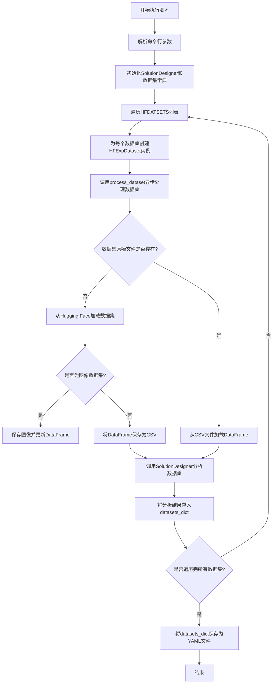
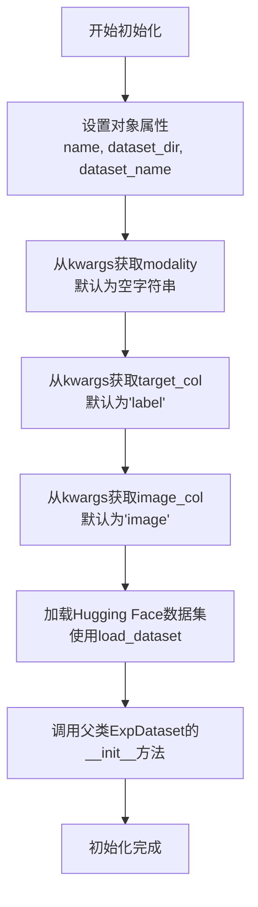
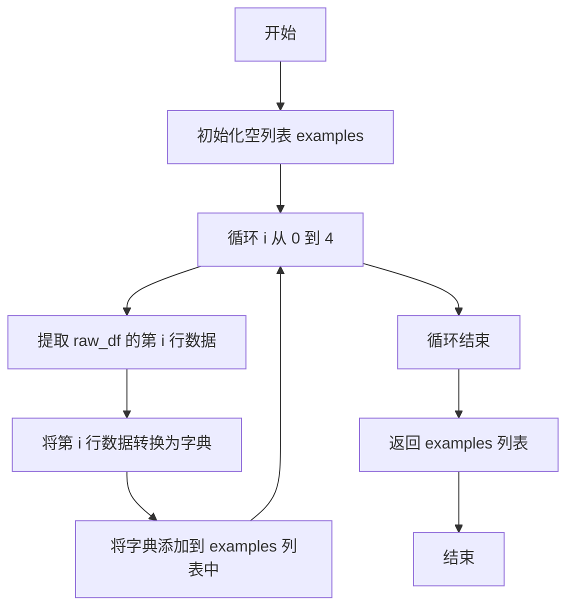
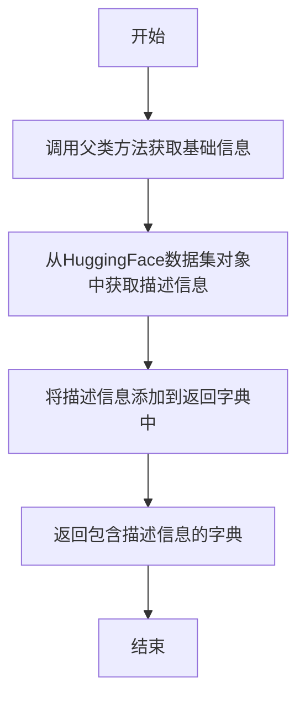

# `.\MetaGPT\metagpt\ext\sela\data\hf_data.py` 详细设计文档

该代码是一个用于处理Hugging Face数据集的脚本，其核心功能是：定义了一个HFExpDataset类来加载、预处理和保存指定的Hugging Face数据集（包括文本和图像模态），将原始数据转换为CSV格式并保存图像文件，然后通过异步任务调用SolutionDesigner进行数据集分析，最终将处理后的数据集信息汇总并保存到YAML配置文件中。

## 整体流程



## 类结构

```
ExpDataset (父类，来自metagpt.ext.sela.data.dataset)
└── HFExpDataset (子类，处理Hugging Face数据集)
    ├── __init__ (构造函数)
    ├── get_raw_dataset (获取原始数据集)
    ├── save_images_and_update_df (保存图像并更新DataFrame)
    ├── get_df_head (获取数据样本)
    └── get_dataset_info (获取数据集信息)
```

## 全局变量及字段


### `HFDATSETS`
    
一个预定义的列表，包含多个Hugging Face数据集的元数据配置，如数据集名称、Hugging Face路径、目标列、模态类型等，用于批量处理这些数据集。

类型：`List[Dict[str, Any]]`
    


### `HFExpDataset.train_ratio`
    
训练集在原始数据集中的划分比例，默认值为0.6。

类型：`float`
    


### `HFExpDataset.dev_ratio`
    
开发集（验证集）在原始数据集中的划分比例，默认值为0.2。

类型：`float`
    


### `HFExpDataset.test_ratio`
    
测试集在原始数据集中的划分比例，默认值为0.2。

类型：`float`
    


### `HFExpDataset.name`
    
数据集的唯一标识名称，用于在本地文件系统中创建目录和引用。

类型：`str`
    


### `HFExpDataset.dataset_dir`
    
本地存储数据集的根目录路径，所有处理后的数据文件将保存在此目录下。

类型：`str`
    


### `HFExpDataset.dataset_name`
    
Hugging Face数据集的完整标识符，用于从Hugging Face Hub加载数据集。

类型：`str`
    


### `HFExpDataset.modality`
    
数据集的模态类型，例如'text'或'image'，决定了数据处理流程（如是否需要保存图像）。

类型：`str`
    


### `HFExpDataset.target_col`
    
数据集中目标变量（标签）所在的列名，默认为'label'。

类型：`str`
    


### `HFExpDataset.image_col`
    
当数据集模态为'image'时，指定包含图像数据的列名，默认为'image'。

类型：`str`
    


### `HFExpDataset.dataset`
    
从Hugging Face加载的原始数据集对象，包含训练集、测试集等分割。

类型：`datasets.DatasetDict`
    
    

## 全局函数及方法

### `HFExpDataset.__init__`

该方法用于初始化一个HFExpDataset对象，该对象继承自ExpDataset，专门用于处理来自Hugging Face数据集的实验数据。初始化过程包括设置数据集的基本属性（如名称、目录、数据集标识符等），并根据传入的关键字参数配置数据集的模态（文本或图像）、目标列和图像列。最后，它加载指定的Hugging Face数据集并调用父类的初始化方法。

参数：

- `name`：`str`，数据集的名称，用于标识该数据集。
- `dataset_dir`：`str`，数据集存储的根目录路径。
- `dataset_name`：`str`，Hugging Face数据集的标识符，用于从Hugging Face加载数据集。
- `**kwargs`：`dict`，可变关键字参数，用于传递额外的配置选项，如`modality`（数据模态）、`target_col`（目标列名）、`image_col`（图像列名）等。

返回值：`None`，该方法不返回任何值，仅用于初始化对象。

#### 流程图



#### 带注释源码

```python
def __init__(self, name, dataset_dir, dataset_name, **kwargs):
    # 设置数据集的名称
    self.name = name
    # 设置数据集的存储目录
    self.dataset_dir = dataset_dir
    # 设置Hugging Face数据集的标识符
    self.dataset_name = dataset_name
    # 从kwargs中获取数据模态（如'text'或'image'），默认为空字符串
    self.modality = kwargs.get("modality", "")
    # 从kwargs中获取目标列名，默认为'label'
    self.target_col = kwargs.get("target_col", "label")
    # 从kwargs中获取图像列名，默认为'image'
    self.image_col = kwargs.get("image_col", "image")
    # 加载Hugging Face数据集，trust_remote_code=True允许执行远程代码（通常用于自定义数据集加载）
    self.dataset = load_dataset(self.dataset_name, trust_remote_code=True)
    # 调用父类ExpDataset的初始化方法，传递名称、目录和其他关键字参数
    super().__init__(self.name, dataset_dir, **kwargs)
```

### `HFExpDataset.get_raw_dataset`

该方法负责从Hugging Face数据集加载原始数据，并根据数据集模态（文本或图像）进行预处理。对于图像数据集，它会将图像保存到本地文件系统，并更新DataFrame中的图像路径。最终返回训练集和测试集的DataFrame。

参数：

- `self`：`HFExpDataset`，当前HFExpDataset实例

返回值：`tuple[pd.DataFrame, pd.DataFrame | None]`，返回一个元组，包含训练集的DataFrame和测试集的DataFrame（如果存在测试集，否则为None）

#### 流程图

```mermaid
graph TD
    A[开始] --> B[构造原始数据目录路径 raw_dir]
    B --> C{检查 raw_dir/train.csv 是否存在?}
    C -->|是| D[从 train.csv 加载训练集DataFrame]
    C -->|否| E[从 self.dataset['train'] 加载训练集DataFrame]
    E --> F{数据集模态是否为图像?}
    F -->|是| G[调用 save_images_and_update_df 处理图像并更新DataFrame]
    F -->|否| H[跳过图像处理]
    G --> I
    H --> I[将训练集DataFrame保存为 train.csv]
    I --> J{检查 raw_dir/test.csv 是否存在?}
    J -->|是| K[从 test.csv 加载测试集DataFrame]
    J -->|否| L{self.dataset 中是否存在 'test' 分割?}
    L -->|是| M[从 self.dataset['test'] 加载测试集DataFrame]
    M --> N{数据集模态是否为图像?}
    N -->|是| O[调用 save_images_and_update_df 处理图像并更新DataFrame]
    N -->|否| P[跳过图像处理]
    O --> Q
    P --> Q[将测试集DataFrame保存为 test.csv]
    Q --> R[返回训练集和测试集DataFrame]
    L -->|否| S[设置测试集DataFrame为None]
    S --> R
    K --> R
    D --> R
```

#### 带注释源码

```python
def get_raw_dataset(self):
    # 1. 构造原始数据存储目录路径
    raw_dir = Path(self.dataset_dir, self.name, "raw")
    raw_dir.mkdir(parents=True, exist_ok=True)  # 确保目录存在

    # 2. 处理训练集数据
    # 检查是否已有缓存的训练集CSV文件
    if os.path.exists(Path(raw_dir, "train.csv")):
        # 如果存在，直接加载
        df = pd.read_csv(Path(raw_dir, "train.csv"), encoding="utf-8")
    else:
        # 如果不存在，从Hugging Face数据集加载训练集
        df = self.dataset["train"].to_pandas()

        # 如果是图像数据集，需要保存图像并更新DataFrame中的路径
        if self.modality == "image":
            df = self.save_images_and_update_df(df, raw_dir, "train")

        # 将处理后的训练集保存为CSV文件，以便后续复用
        df.to_csv(Path(raw_dir, "train.csv"), index=False, encoding="utf-8")

    # 3. 处理测试集数据
    # 检查是否已有缓存的测试集CSV文件
    if os.path.exists(Path(raw_dir, "test.csv")):
        # 如果存在，直接加载
        test_df = pd.read_csv(Path(raw_dir, "test.csv"), encoding="utf-8")
    else:
        # 如果不存在，检查数据集中是否包含测试集分割
        if self.dataset and "test" in self.dataset:
            # 如果存在测试集，加载并处理
            test_df = self.dataset["test"].to_pandas()

            # 如果是图像数据集，同样需要保存图像并更新路径
            if self.modality == "image":
                test_df = self.save_images_and_update_df(test_df, raw_dir, "test")

            # 将处理后的测试集保存为CSV文件
            test_df.to_csv(Path(raw_dir, "test.csv"), index=False, encoding="utf-8")
        else:
            # 如果数据集中没有测试集，则设置为None
            test_df = None

    # 4. 返回训练集和测试集的DataFrame
    return df, test_df
```


### `HFExpDataset.save_images_and_update_df`

该方法用于处理包含图像数据的Pandas DataFrame。其核心功能是遍历DataFrame的每一行，将行中指定列（`image_col`）的原始图像字节数据解码为PIL Image对象，进行格式转换（如RGBA转RGB），然后将图像保存到指定的本地目录中。保存后，它会更新DataFrame中的图像列，将原始的字节数据替换为保存后图像的相对路径字符串，以便后续处理可以直接引用本地文件。

参数：

-  `df`：`pandas.DataFrame`，包含原始图像数据的DataFrame，其中`self.image_col`列的值应为包含`'bytes'`键的字典。
-  `raw_dir`：`pathlib.Path`，原始数据集的根目录路径，用于构建图像保存的子目录。
-  `split`：`str`，数据集的划分名称（例如 `'train'` 或 `'test'`），用于命名保存图像的子目录。

返回值：`pandas.DataFrame`，返回更新后的DataFrame。原`self.image_col`列（代码中固定为`"image"`列）的值已从包含字节数据的字典更新为对应图像的相对路径字符串（格式如 `'raw/{split}_images/{idx}.jpg'`）。

#### 流程图

```mermaid
flowchart TD
    A[开始: save_images_and_update_df(df, raw_dir, split)] --> B[构建绝对/相对图像目录路径]
    B --> C[创建绝对图像目录]
    C --> D[定义内部函数 process_image]
    D --> E[对df的每一行应用process_image]
    E --> F[更新df的'image'列为返回的路径]
    F --> G[返回更新后的df]
    
    subgraph D_sub [process_image 内部流程]
        D1[参数: idx, row] --> D2[从row中获取图像字节数据]
        D2 --> D3[字节数据转为PIL Image]
        D3 --> D4{图像模式是否为 RGBA?}
        D4 -- 是 --> D5[转换为 RGB 模式]
        D4 -- 否 --> D6
        D5 --> D6[构建图像保存路径]
        D6 --> D7[保存图像为JPG]
        D7 --> D8[返回相对路径]
    end
```

#### 带注释源码

```python
    def save_images_and_update_df(self, df, raw_dir, split):
        # 1. 构建图像保存的目录路径。
        #    abs_image_dir: 用于实际保存文件的绝对路径目录。
        #    rel_image_dir: 用于更新DataFrame的相对路径目录（相对于raw_dir的父级）。
        abs_image_dir = Path(raw_dir, f"{split}_images")
        rel_image_dir = f"raw/{split}_images"
        # 2. 创建绝对路径目录，如果已存在则忽略。
        abs_image_dir.mkdir(parents=True, exist_ok=True)

        # 3. 定义处理单行图像数据的内部函数。
        def process_image(idx, row):
            # 3.1 从DataFrame行的指定列中获取图像的字节数据。
            #     假设row[self.image_col]是一个包含'bytes'键的字典。
            image_bytes = row[self.image_col]["bytes"]
            # 3.2 将字节数据加载到内存中，并使用PIL打开为Image对象。
            image = Image.open(io.BytesIO(image_bytes))
            # 3.3 检查图像模式，如果是RGBA（带透明度），则转换为RGB（三通道），
            #     因为JPG格式通常不支持透明度。
            if image.mode == "RGBA":
                image = image.convert("RGB")
            # 3.4 构建图像文件的保存路径。
            #     abs_image_dir是之前创建的绝对路径目录，idx是行索引，作为文件名。
            img_path = Path(abs_image_dir, f"{idx}.jpg")
            # 3.5 构建相对于数据集根目录的图像路径，用于更新DataFrame。
            rel_img_path = f"{rel_image_dir}/{idx}.jpg"
            # 3.6 将PIL Image对象保存为JPG格式到绝对路径。
            image.save(img_path)
            # 3.7 返回相对路径，这个值将用于替换DataFrame中该行的原始图像数据。
            return rel_img_path

        # 4. 应用内部函数到DataFrame的每一行。
        #    df.apply(..., axis=1): 按行应用函数。
        #    lambda row: process_image(row.name, row): 对每一行，调用process_image，
        #    传入行索引(row.name)和行数据(row)。
        #    结果（图像相对路径）将赋值给DataFrame的'image'列，覆盖原来的值。
        df["image"] = df.apply(lambda row: process_image(row.name, row), axis=1)
        # 5. 返回更新后的DataFrame。
        return df
```


### `HFExpDataset.get_df_head`

该方法用于从原始数据集中提取前5行数据，并将其转换为字典列表，以便于后续的分析和展示。

参数：

- `raw_df`：`pandas.DataFrame`，原始数据集，包含需要提取的数据。

返回值：`list[dict]`，返回一个包含前5行数据的字典列表，每个字典对应一行数据。

#### 流程图



#### 带注释源码

```python
def get_df_head(self, raw_df):
    # 初始化一个空列表，用于存储提取的数据
    examples = []
    # 循环5次，提取前5行数据
    for i in range(5):
        # 提取第 i 行数据，并将其转换为字典
        examples.append(raw_df.iloc[i].to_dict())
    # 返回包含前5行数据的字典列表
    return examples
```

### `HFExpDataset.get_dataset_info`

该方法用于获取HuggingFace数据集的详细信息，继承并扩展了父类`ExpDataset`的`get_dataset_info`方法，主要增加了对数据集描述信息的获取。

参数：
- `self`：`HFExpDataset`，当前`HFExpDataset`类的实例。

返回值：`dict`，一个包含数据集详细信息的字典，例如数据集的描述、特征等。

#### 流程图



#### 带注释源码

```python
def get_dataset_info(self):
    # 调用父类ExpDataset的get_dataset_info方法，获取基础的数据集信息字典
    dataset_info = super().get_dataset_info()
    # 获取当前实例加载的HuggingFace数据集对象
    dataset = self.dataset
    # 从数据集的训练集信息中提取描述，并添加到返回的字典中
    dataset_info["description"] = dataset["train"].info.description
    # 返回更新后的数据集信息字典
    return dataset_info
```

## 关键组件


### HFExpDataset 类

一个用于加载和处理 Hugging Face 数据集的自定义数据集类，继承自 `ExpDataset`，支持文本和图像模态数据的自动下载、缓存、格式转换（如将图像保存为本地文件）以及数据集信息提取。

### 数据集处理流程 (`process_dataset` 函数)

一个异步函数，负责协调单个数据集的完整处理流程，包括数据加载、分析、特征工程以及将处理结果注册到全局的数据集字典中。

### 数据集配置与注册 (`save_datasets_dict_to_yaml` 函数)

将处理完成的所有数据集信息（存储在 `datasets_dict` 字典中）序列化并保存到 YAML 配置文件中，用于后续的模型训练或分析任务。

### 解决方案设计器 (`SolutionDesigner` 类)

一个核心组件，用于根据数据集的特征和任务类型，自动生成或选择合适的数据处理、特征工程和模型训练方案。

### 预定义数据集列表 (`HFDATSETS`)

一个包含多个 Hugging Face 数据集元信息的列表，定义了每个数据集的名称、在 Hugging Face 上的标识符、目标列、图像列以及模态类型（文本或图像），作为批量处理任务的输入配置。

### 数据加载与缓存机制

通过 `load_dataset` 函数从 Hugging Face 加载数据，并实现本地 CSV 和图像文件的缓存逻辑，避免重复下载，提高后续处理效率。

### 图像处理流水线 (`save_images_and_update_df` 方法)

将数据集中以字节形式存储的图像数据解码为 PIL Image 对象，进行必要的格式转换（如 RGBA 转 RGB），保存为本地 JPG 文件，并更新 DataFrame 中的图像路径引用。

### 命令行参数解析 (`parse_args` 函数)

解析运行脚本时传入的命令行参数，例如是否强制更新缓存 (`force_update`) 和是否保存分析池 (`save_analysis_pool`)，以控制程序的行为。


## 问题及建议


### 已知问题

-   **硬编码的数据集配置**：`HFDATSETS` 列表在代码中硬编码，这使得添加、移除或修改数据集配置需要直接修改源代码，降低了灵活性和可维护性。
-   **同步与异步混合使用**：`HFExpDataset.get_raw_dataset` 和 `save_images_and_update_df` 方法是同步的，但在主流程中通过 `asyncio.run(process_dataset(...))` 异步调用。如果 `process_dataset` 内部调用了这些同步方法，可能会阻塞事件循环，影响并发性能。
-   **潜在的图像处理性能瓶颈**：`save_images_and_update_df` 方法使用 `DataFrame.apply` 和 `lambda` 函数逐行处理图像，对于大型数据集，这种串行处理方式可能成为性能瓶颈。
-   **异常处理不完善**：代码中缺少对可能发生的异常（如网络请求失败、磁盘空间不足、图像格式错误等）的捕获和处理，可能导致程序意外终止。
-   **内存使用风险**：`get_raw_dataset` 方法将整个训练集和测试集一次性加载到 `pandas.DataFrame` 中，对于非常大的数据集，可能导致内存不足。
-   **路径处理依赖特定结构**：`save_images_and_update_df` 方法中构建相对路径 (`rel_img_path`) 的逻辑依赖于 `raw_dir` 的特定子目录结构（`raw/{split}_images`），如果目录结构改变，可能导致路径错误。
-   **主脚本中的全局变量**：`dataset_dir` 等变量在主脚本的全局作用域中定义和赋值，不利于模块化和测试。

### 优化建议

-   **外部化数据集配置**：将 `HFDATSETS` 列表移至外部配置文件（如 YAML 或 JSON 文件），通过读取配置文件来动态加载数据集元数据，提高可配置性。
-   **统一异步处理**：考虑将 `HFExpDataset` 中涉及 I/O 操作的方法（如 `get_raw_dataset`, `save_images_and_update_df`）重构为异步方法，或使用 `asyncio.to_thread` 在单独的线程中执行这些阻塞操作，以避免阻塞主事件循环。
-   **并行化图像处理**：在 `save_images_and_update_df` 方法中，使用 `concurrent.futures.ThreadPoolExecutor` 或 `ProcessPoolExecutor` 来并行处理图像保存任务，以加速处理速度。
-   **增强异常处理**：在关键操作（如 `load_dataset`、文件读写、图像处理）周围添加 `try-except` 块，记录详细的错误日志，并提供优雅的降级或重试机制。
-   **采用流式或分批处理**：对于大型数据集，考虑使用迭代器或分批加载的方式处理数据，而不是一次性加载整个数据集到内存中。例如，使用 `datasets` 库的流式特性或 `pandas` 的 `chunksize` 参数。
-   **抽象路径管理逻辑**：将路径构建逻辑封装到独立的工具函数或配置类中，使其更清晰且易于修改，减少对硬编码路径结构的依赖。
-   **重构主脚本逻辑**：将主脚本中的逻辑封装到一个 `main()` 函数中，并将配置参数（如 `dataset_dir`）作为函数参数或从环境变量/配置文件中读取，以提高代码的可测试性和可重用性。
-   **添加类型注解**：为函数和方法参数、返回值添加更详细的类型注解，这有助于静态类型检查工具（如 mypy）进行验证，提高代码的健壮性和可读性。
-   **考虑缓存机制**：对于已经处理并保存的 CSV 和图像文件，可以计算哈希值来验证是否需要更新，避免不必要的重复处理。


## 其它


### 设计目标与约束

本模块的核心设计目标是构建一个可扩展的、支持多模态（文本和图像）的Hugging Face数据集处理流水线，并将其集成到Sela项目的实验数据管理框架中。主要约束包括：1) 必须兼容父类`ExpDataset`的接口契约，确保与现有`process_dataset`等流程的无缝集成；2) 需要处理Hugging Face `datasets`库返回的特殊数据结构（如包含图像字节的列）；3) 需要将远程数据集缓存到本地文件系统，并处理图像格式转换（RGBA转RGB）和路径映射，以支持后续的机器学习训练流程。

### 错误处理与异常设计

当前代码的异常处理较为隐式，主要依赖Python内置异常和外部库（如`datasets`、`PIL`）抛出的错误。缺乏针对特定业务场景的、结构化的错误处理。例如：1) 当`load_dataset`因网络或认证问题失败时，程序会直接崩溃；2) 在`save_images_and_update_df`方法中，如果图像字节流损坏或无法被`PIL`识别，会抛出未处理的异常；3) 在`get_raw_dataset`方法中，当数据集没有`test`分割时，`test_df`被设为`None`，但后续流程可能未对此情况进行检查。建议增加`try-except`块，对可能失败的远程加载、文件IO、图像处理操作进行包装，并抛出更具信息量的自定义异常（如`DatasetLoadError`， `ImageProcessingError`），或在日志中记录警告后跳过当前数据集的处理。

### 数据流与状态机

模块的数据流始于`HFDATSETS`列表中定义的静态元数据配置。对于每个配置项，主程序实例化一个`HFExpDataset`对象。该对象的初始化会触发从Hugging Face加载数据集到内存（`self.dataset`）。随后，调用`get_raw_dataset`方法，该方法驱动核心状态转换：检查本地缓存 -> 若不存在则从内存中的`self.dataset`转换 -> 对于图像数据，调用`save_images_and_update_df`将图像字节保存为本地文件并更新DataFrame中的路径 -> 将最终的DataFrame保存为CSV文件。处理后的数据（`df`, `test_df`）和数据集信息（通过`get_dataset_info`）被传递给外部的`process_dataset`异步函数进行后续分析。整个流程是一个无复杂状态循环的线性管道，主要状态体现在数据从远程（HF Hub）到内存（`datasets.Dataset`）再到本地结构化文件（CSV和JPG）的形态转换。

### 外部依赖与接口契约

1.  **外部库依赖**:
    *   `datasets`: 核心依赖，用于从Hugging Face Hub加载数据集。通过`load_dataset`函数和返回的`DatasetDict`对象交互。
    *   `pandas (pd)`: 用于表格化数据处理和CSV文件读写。
    *   `PIL (Pillow)`: 用于图像字节流的解码、模式转换和保存。
    *   `pathlib.Path`: 用于跨平台的文件路径操作。
    *   `asyncio`: 用于运行异步的`process_dataset`函数。

2.  **项目内部依赖**:
    *   `metagpt.ext.sela.data.dataset.ExpDataset`: 必须继承的父类，约定了`__init__`、`get_raw_dataset`、`get_dataset_info`等方法的签名和基本行为。
    *   `metagpt.ext.sela.data.dataset.parse_args, process_dataset, save_datasets_dict_to_yaml`: 来自同一模块的工具函数，定义了数据集处理流程的输入、核心步骤和输出。
    *   `metagpt.ext.sela.insights.solution_designer.SolutionDesigner`: 用于在`process_dataset`步骤中对数据集进行分析。
    *   `metagpt.ext.sela.utils.DATA_CONFIG`: 提供项目级的配置，如数据集存储根目录`datasets_dir`。

3.  **接口契约**:
    *   `HFExpDataset`构造函数：必须接受`name`, `dataset_dir`, `dataset_name`参数，并可接受`modality`, `target_col`, `image_col`等关键字参数以适配不同模态的数据集。
    *   `get_raw_dataset`方法：必须返回一个元组`(df, test_df)`，其中`df`和`test_df`为`pandas.DataFrame`或`None`。这是与`process_dataset`函数交互的关键契约。
    *   `get_dataset_info`方法：必须返回一个字典，包含数据集的基本信息。本类重写此方法以添加Hugging Face数据集的描述信息。

    