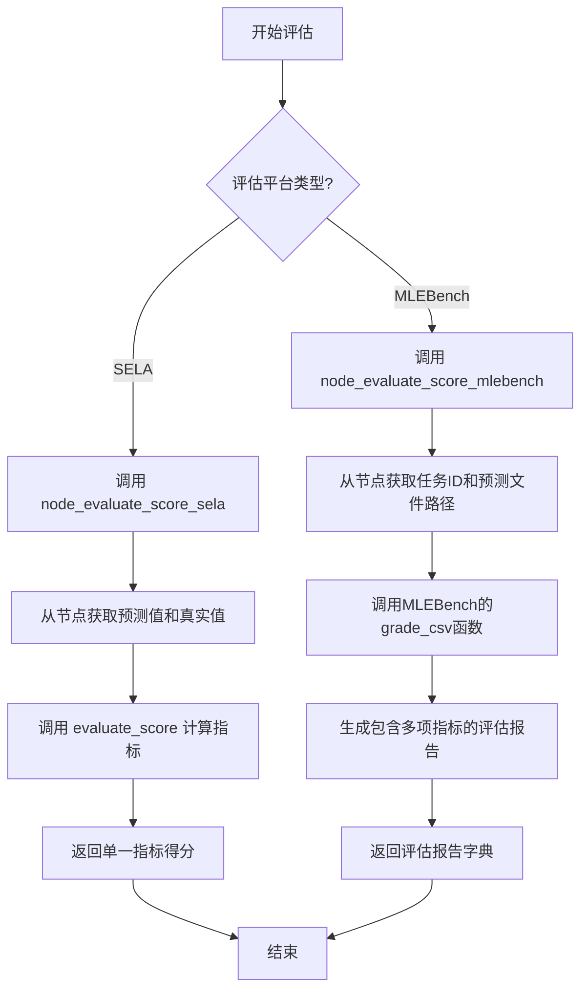

# `.\MetaGPT\metagpt\ext\sela\evaluation\evaluation.py` 详细设计文档

该代码文件提供了一个机器学习模型评估框架，包含通用的评估指标计算函数（如准确率、F1分数、RMSE等）以及针对特定平台（SELA和MLEBench）的节点评估适配器，用于计算模型在测试集上的性能得分或生成详细的评估报告。

## 整体流程



## 类结构

```
该文件不包含类定义，仅包含函数。
├── evaluate_score (核心评估函数)
├── node_evaluate_score_sela (SELA平台适配器)
└── node_evaluate_score_mlebench (MLEBench平台适配器)
```

## 全局变量及字段


    

## 全局函数及方法

### `evaluate_score`

该函数根据指定的评估指标计算预测值与真实值之间的性能得分。它支持多种分类和回归指标，包括准确率、F1分数（支持二分类和多分类的加权平均）、ROC AUC、RMSE以及对数RMSE。函数内部根据`metric`参数选择相应的评估方法，并处理不同指标所需的特殊参数（如F1分数的`pos_label`）。对于不支持的指标，函数会抛出`ValueError`异常。

参数：

- `pred`：`array-like`，模型预测值。对于分类任务，可以是类别标签或概率；对于回归任务，为连续值。
- `gt`：`array-like`，真实值（ground truth）。形状应与`pred`一致。
- `metric`：`str`，评估指标名称。支持的选项包括：`"accuracy"`、`"f1"`、`"f1 weighted"`、`"roc_auc"`、`"rmse"`、`"log rmse"`。

返回值：`float`，计算得到的评估分数。对于`node_evaluate_score_mlebench`函数调用的场景，返回值可能是一个包含评估报告的字典。

#### 流程图

```mermaid
flowchart TD
    A[开始: evaluate_score(pred, gt, metric)] --> B{metric 判断};
    B -- "metric == 'accuracy'" --> C[调用 accuracy_score];
    B -- "metric == 'f1'" --> D[确定 pos_label];
    D --> E[调用 f1_score];
    B -- "metric == 'f1 weighted'" --> F[调用 f1_score<br>average='weighted'];
    B -- "metric == 'roc_auc'" --> G[调用 roc_auc_score];
    B -- "metric == 'rmse'" --> H[调用 mean_squared_error<br>squared=False];
    B -- "metric == 'log rmse'" --> I[对 gt 和 pred 取 log1p];
    I --> J[调用 mean_squared_error<br>squared=False];
    B -- "其他" --> K[抛出 ValueError];
    C --> L[返回分数];
    E --> L;
    F --> L;
    G --> L;
    H --> L;
    J --> L;
    K --> M[结束];
    L --> M;
```

#### 带注释源码

```python
def evaluate_score(pred, gt, metric):
    # 计算准确率：分类任务中预测正确的样本比例
    if metric == "accuracy":
        return accuracy_score(gt, pred)
    # 计算F1分数（适用于二分类，自动确定正类标签）
    elif metric == "f1":
        # 获取真实值中的唯一类别并排序
        unique_classes = sorted(list(np.unique(gt)))
        # 如果类别包含0和1，则正类标签设为1（常见二分类场景）
        if 1 in unique_classes and 0 in unique_classes:
            pos_label = 1
        else:
            # 否则，若只有两个类别，取第一个作为正类；多于两个类别则设为None（将使用宏平均）
            pos_label = unique_classes[0] if len(unique_classes) == 2 else None
        # 调用sklearn的f1_score函数，传入确定的pos_label
        return f1_score(gt, pred, pos_label=pos_label)
    # 计算加权F1分数：适用于多分类，按各类别支持度加权
    elif metric == "f1 weighted":
        return f1_score(gt, pred, average="weighted")
    # 计算ROC AUC分数：评估二分类模型性能，适用于概率预测
    elif metric == "roc_auc":
        return roc_auc_score(gt, pred)
    # 计算均方根误差（RMSE）：回归任务常用指标，squared=False返回根号值
    elif metric == "rmse":
        return mean_squared_error(gt, pred, squared=False)
    # 计算对数RMSE：先对真实值和预测值取log1p（log(1+x)），再计算RMSE，适用于目标值范围较大的回归任务
    elif metric == "log rmse":
        return mean_squared_error(np.log1p(gt), np.log1p(pred), squared=False)
    # 如果传入不支持的指标名称，抛出异常
    else:
        raise ValueError(f"Metric {metric} not supported")
```

### `node_evaluate_score_sela`

该函数是SELA（一个机器学习评估框架）中用于评估节点预测性能的核心方法。它从指定的节点对象中获取测试集的预测值和真实值，并根据数据集配置中指定的评估指标，调用底层评估函数计算并返回相应的分数。

参数：
- `node`：`object`，一个包含模型状态、预测数据和真实标签的节点对象。该对象必须提供获取预测值和真实值的方法，并且其状态中需包含数据集配置信息。

返回值：`float`，根据指定的评估指标计算出的性能分数。

#### 流程图

```mermaid
flowchart TD
    A[开始: node_evaluate_score_sela(node)] --> B[从node获取测试集预测值preds]
    B --> C[从node获取测试集真实值gt]
    C --> D[从node状态中获取评估指标metric]
    D --> E[调用evaluate_score(preds, gt, metric)]
    E --> F{评估指标metric类型?}
    F -->|accuracy| G[计算准确率]
    F -->|f1| H[计算F1分数]
    F -->|f1 weighted| I[计算加权F1分数]
    F -->|roc_auc| J[计算ROC AUC分数]
    F -->|rmse| K[计算均方根误差]
    F -->|log rmse| L[计算对数均方根误差]
    F -->|其他| M[抛出ValueError异常]
    G --> N[返回分数]
    H --> N
    I --> N
    J --> N
    K --> N
    L --> N
    M --> O[结束: 异常]
    N --> P[结束: 返回分数]
```

#### 带注释源码

```python
def node_evaluate_score_sela(node):
    # 从节点对象中获取测试集的预测值。`get_and_move_predictions`方法返回一个字典，
    # 其中键为“target”的值是预测结果数组。
    preds = node.get_and_move_predictions("test")["target"]
    
    # 从节点对象中获取测试集的真实值（Ground Truth）。`get_gt`方法返回一个字典，
    # 其中键为“target”的值是真实标签数组。
    gt = node.get_gt("test")["target"]
    
    # 从节点对象的状态（state）中获取数据集配置信息，并从中提取评估指标的名称。
    # 这决定了将使用哪种指标（如准确率、F1分数等）进行评估。
    metric = node.state["dataset_config"]["metric"]
    
    # 调用通用的评估函数`evaluate_score`，传入预测值、真实值和指标名称，
    # 计算并返回对应的评估分数。
    return evaluate_score(preds, gt, metric)
```


### `node_evaluate_score_mlebench`

该函数是用于在MLEBench竞赛框架下评估节点（node）在测试集上预测结果的评分函数。它通过调用MLEBench的评分库，根据指定的竞赛任务（competition_id）和预测文件，生成一个包含详细评分报告和提交文件路径的字典。

参数：

-  `node`：`object`，一个包含任务状态、数据集配置和预测文件路径等信息的节点对象。

返回值：`dict`，一个包含评分报告（report）和提交文件路径（submission_path）的字典。

#### 流程图

```mermaid
flowchart TD
    A[开始: node_evaluate_score_mlebench(node)] --> B[导入mlebench.grade.grade_csv<br>和mlebench.registry.registry]
    B --> C[从node.state中提取<br>competition_id和custom_dataset_dir]
    C --> D[计算数据根目录data_dir<br>为custom_dataset_dir的父目录的父目录的父目录]
    D --> E[获取测试集预测文件的路径pred_path]
    E --> F[使用data_dir更新全局注册表new_registry]
    F --> G[从new_registry中获取竞赛对象competition]
    G --> H[将pred_path转换为Path对象submission]
    H --> I[调用grade_csv(submission, competition)<br>进行评分，得到report对象]
    I --> J[将report对象转换为字典<br>并添加'submission_path'键]
    J --> K[返回包含评分结果的字典]
```

#### 带注释源码

```python
def node_evaluate_score_mlebench(node):
    # TODO
    # 导入MLEBench框架的评分和注册表模块
    from mlebench.grade import grade_csv
    from mlebench.registry import registry

    # 从节点状态中获取本次评估对应的竞赛任务ID
    competition_id = node.state["task"]
    # 根据节点状态中的自定义数据集目录，推导出MLEBench数据准备的根目录
    # 假设路径结构为: .../prepared/public/...，需要回溯到prepared的父目录
    data_dir = Path(node.state["custom_dataset_dir"]).parent.parent.parent  # prepared/public/../../../
    # 获取节点生成的、用于测试集的预测文件的存储路径
    pred_path = node.get_predictions_path("test")
    # 使用计算出的数据根目录更新全局竞赛注册表，并获取新的注册表实例
    new_registry = registry.set_data_dir(data_dir)
    # 从新的注册表中，根据竞赛ID获取对应的竞赛配置对象
    competition = new_registry.get_competition(competition_id)
    # 将预测文件路径转换为Path对象，便于后续操作
    submission = Path(pred_path)
    # 调用MLEBench的核心评分函数，对提交文件进行评分，并将结果报告对象转换为字典
    report = grade_csv(submission, competition).to_dict()
    # 在返回的报告中添加提交文件的路径信息，便于追踪
    report["submission_path"] = str(submission)
    # 返回完整的评分报告字典
    return report
```


## 关键组件


### 评估函数 (`evaluate_score`)

一个通用的评估函数，根据指定的指标名称（如 "accuracy", "f1", "rmse" 等）计算预测结果与真实标签之间的性能分数，支持分类和回归任务。

### 节点评估适配器 (`node_evaluate_score_sela`)

一个适配器函数，用于从特定节点对象（`node`）中提取测试集的预测值和真实值，并调用通用评估函数 `evaluate_score` 进行计算。

### MLEBench 竞赛评估适配器 (`node_evaluate_score_mlebench`)

一个专门用于 MLEBench 竞赛的评估适配器，它通过竞赛 ID 和预测文件路径，调用 MLEBench 框架的评分函数来生成详细的评估报告。


## 问题及建议


### 已知问题

-   **`node_evaluate_score_mlebench` 函数存在硬编码路径逻辑**：该函数通过 `Path(node.state["custom_dataset_dir"]).parent.parent.parent` 的方式向上回溯三级目录来定位数据根目录。这种硬编码的路径结构非常脆弱，一旦上游代码或项目结构发生变化（例如目录层级调整），该函数将无法正确找到数据目录，导致运行时错误。
-   **`node_evaluate_score_mlebench` 函数包含未完成的 `TODO` 注释**：函数开头的 `# TODO` 注释表明该功能可能尚未完全实现或处于待完善状态，这给代码的可靠性和维护性带来了不确定性。
-   **`evaluate_score` 函数对 `f1` 指标的处理逻辑可能不严谨**：在计算二分类 F1 分数时，通过检查 `0` 和 `1` 是否在唯一类别列表中来设置 `pos_label=1`。如果数据集的负类标签不是 `0`（例如 `-1` 或 `2`），或者正类标签不是 `1`，此逻辑可能无法正确识别正类，导致计算错误。虽然回退逻辑（`pos_label=unique_classes[0]`）能处理部分情况，但意图不够清晰。
-   **`evaluate_score` 函数缺乏输入验证**：函数没有对输入参数 `pred` 和 `gt` 的形状、类型或值域进行基本校验（例如，检查它们是否为 NumPy 数组或列表，长度是否一致，`gt` 对于 `roc_auc` 是否包含两个类别等）。这可能导致来自上游的异常数据直接引发底层 `sklearn` 函数的晦涩错误，不利于调试。
-   **`node_evaluate_score_sela` 函数存在潜在的键错误风险**：该函数直接通过键（如 `"test"`, `"target"`, `"dataset_config"`, `"metric"`）访问 `node` 对象的字典属性。如果 `node` 的状态字典结构不符合预期或缺少某个键，将抛出 `KeyError`，使程序崩溃。
-   **代码存在重复的字符串字面量**：字符串 `"test"` 和 `"target"` 在多个函数中作为键被硬编码。如果这些键名在未来发生变更，需要在多处进行修改，容易遗漏，增加了维护成本。

### 优化建议

-   **解耦 `node_evaluate_score_mlebench` 函数的路径依赖**：建议将数据根目录的路径作为配置项（例如，通过 `node.state` 传入一个明确的键，如 `"mlebench_data_root"`），或者设计一个更稳健的路径解析方法（例如，基于已知的竞赛ID查找配置文件），而不是依赖固定的目录层级回溯。
-   **清理 `TODO` 注释并完善功能**：应评估 `node_evaluate_score_mlebench` 函数的实现状态。如果功能完整，则移除 `TODO` 注释；如果仍需工作，应明确记录待办事项或将其纳入开发计划。
-   **重构 `evaluate_score` 函数的 F1 计算逻辑**：对于 `metric == "f1"` 的情况，可以要求调用方明确指定 `pos_label` 参数，或者通过函数参数传入。如果必须自动判断，应提供更明确的文档说明其行为，并考虑更通用的处理方式（例如，对于二分类，总是将 `unique_classes[1]` 作为正类，并确保类别已排序）。
-   **在 `evaluate_score` 函数中添加输入验证**：在函数开始处，添加对 `pred` 和 `gt` 的校验。例如，检查它们是否为可迭代对象、长度是否相等、对于分类指标检查 `gt` 的类别数等。验证失败时应抛出具有清晰描述的 `ValueError`。
-   **增强 `node_evaluate_score_*` 函数的健壮性**：在访问 `node.state` 字典的深层键之前，使用 `.get()` 方法并提供默认值或进行键的存在性检查（`key in dict`），以避免 `KeyError`。或者，考虑在 `node` 对象中封装专门的、类型安全的方法来获取这些属性。
-   **使用常量定义公共字符串**：将 `"test"`、`"target"` 等频繁使用的字符串字面量定义为模块级别的常量（如 `SPLIT_TEST = "test"`）。这样可以在单个位置管理这些值，提高代码的可维护性和可读性。
-   **考虑统一评估接口**：目前有两个 `node_evaluate_score_*` 函数，它们接口相同但内部实现和返回值差异很大（一个返回分数，一个返回报告字典）。可以考虑定义一个统一的评估接口或基类，并使用策略模式根据 `node.state` 中的某个配置（如评估器类型）来分发到不同的具体实现，使架构更清晰。
-   **补充单元测试**：为 `evaluate_score` 函数编写全面的单元测试，覆盖所有支持的指标、边界情况（如空输入、非法指标）以及 `f1` 和 `roc_auc` 的特殊逻辑。这能有效防止回归错误并验证优化后的逻辑。


## 其它


### 设计目标与约束

本模块的核心设计目标是提供一个统一、可扩展的评估框架，用于计算机器学习模型的预测性能。它旨在：
1.  **统一接口**：通过 `evaluate_score` 函数，为多种评估指标（如准确率、F1、RMSE、ROC-AUC）提供一致的调用接口。
2.  **支持多场景**：通过 `node_evaluate_score_sela` 和 `node_evaluate_score_mlebench` 两个适配器函数，分别适配内部SELA框架和外部MLEBench竞赛平台的评估流程。
3.  **可扩展性**：通过 `if-elif` 结构支持新的评估指标，未来可重构为策略模式以提升可维护性。
主要约束包括：
*   依赖于 `scikit-learn` 和 `numpy` 进行核心计算。
*   `node_evaluate_score_mlebench` 函数强依赖于 `mlebench` 库及其特定的目录结构和 `registry` 机制。
*   当前指标扩展需直接修改 `evaluate_score` 函数，违反了开闭原则。

### 错误处理与异常设计

模块的错误处理策略如下：
1.  **输入验证**：`evaluate_score` 函数在接收到不支持的 `metric` 参数时，会抛出 `ValueError` 异常，并明确指出不支持的指标名称。
2.  **库依赖错误**：`node_evaluate_score_mlebench` 函数通过 `try-except` 导入 `mlebench`，但代码中未显式展示。在实际部署中，若 `mlebench` 库未安装或版本不兼容，会在导入或调用时抛出 `ImportError` 或相关运行时异常。
3.  **数据路径错误**：`node_evaluate_score_mlebench` 函数通过路径拼接定位数据目录，若路径不存在或结构不符，`Path` 操作或 `mlebench` 库的后续调用可能抛出 `FileNotFoundError` 或类似异常。
4.  **静默处理**：`node_evaluate_score_sela` 函数中，`node.get_and_move_predictions` 和 `node.get_gt` 方法可能因数据不存在而返回空或抛出异常，当前代码未进行显式捕获和处理，依赖上游调用者或 `node` 对象自身的健壮性。

### 数据流与状态机

模块的数据流清晰分为两个主要分支：
1.  **SELA评估分支**：
    *   **输入**：`node` 对象（需包含 `state[“dataset_config”][“metric”]`、测试集预测结果和真实标签）。
    *   **处理**：`node_evaluate_score_sela` 从 `node` 中提取预测值、真实值和指标名称，传递给核心函数 `evaluate_score`。
    *   **输出**：单个数值型评估分数（如准确率、F1值）。
2.  **MLEBench评估分支**：
    *   **输入**：`node` 对象（需包含 `state[“task”]`、`state[“custom_dataset_dir”]` 和测试集预测文件路径）。
    *   **处理**：`node_evaluate_score_mlebench` 根据 `node` 状态信息，定位数据目录和预测文件，调用 `mlebench.grade.grade_csv` 进行评分。
    *   **输出**：一个包含详细评分报告的字典 (`report`)，并额外附加了提交文件路径。
模块本身不维护内部状态，所有状态信息均来自输入的 `node` 对象，因此不涉及复杂的状态机。

### 外部依赖与接口契约

1.  **外部库依赖**：
    *   `numpy`：用于数值计算（如 `np.unique`, `np.log1p`）。
    *   `scikit-learn`：用于核心指标计算（`accuracy_score`, `f1_score`, `mean_squared_error`, `roc_auc_score`）。
    *   `mlebench`（可选）：仅在调用 `node_evaluate_score_mlebench` 时需安装，用于特定竞赛的自动化评估。
2.  **接口契约**：
    *   `evaluate_score(pred, gt, metric)`：
        *   `pred`/`gt`：应为兼容 `sklearn.metrics` 函数输入的数组或序列。
        *   `metric`：必须是预定义的字符串（如 `”accuracy”`, `”f1″`, `”rmse”`）。
    *   `node_evaluate_score_sela(node)`：
        *   `node`：必须实现 `get_and_move_predictions(“test”)` 和 `get_gt(“test”)` 方法，返回包含 `”target”` 键的字典。`node.state[“dataset_config”]` 必须包含 `”metric”` 键。
    *   `node_evaluate_score_mlebench(node)`：
        *   `node`：`state` 字典中必须包含 `”task”`（竞赛ID）和 `”custom_dataset_dir”`（用于推导数据根目录）。必须实现 `get_predictions_path(“test”)` 方法返回预测文件路径。
        *   文件系统：预测文件必须存在，且数据目录结构需符合 `mlebench` 的预期（`prepared/public/../../`）。

    