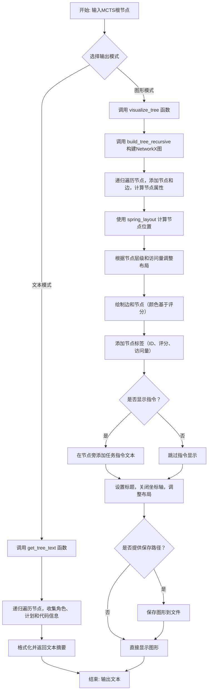
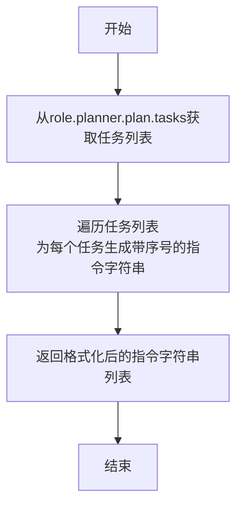

# `.\MetaGPT\metagpt\ext\sela\evaluation\visualize_mcts.py` 详细设计文档

该代码文件是一个用于可视化和分析蒙特卡洛树搜索（MCTS）结果的工具。它从给定的MCTS根节点出发，递归地遍历搜索树，提取每个节点的信息（如计划任务、模拟状态、评分和访问次数），并以文本和图形两种形式展示树的结构。文本输出提供详细的节点信息摘要，而图形输出则使用NetworkX和Matplotlib生成一个层次化的树状图，其中节点颜色根据评分高低变化（从红到绿），节点标签包含关键指标，并可选择性地显示任务指令。

## 整体流程



## 类结构

```
该文件不包含类定义，主要由全局函数和常量组成。
├── 全局常量: NODE_TEMPLATE, NODE_SIZE, NODE_FONT_SIZE
├── 全局函数:
│   ├── get_role_plans
│   ├── get_tree_text
│   ├── get_node_color
│   ├── visualize_tree
│   └── build_tree_recursive
```

## 全局变量及字段


### `NODE_TEMPLATE`
    
用于格式化树节点文本输出的模板字符串，包含节点ID、计划、模拟状态、分数和访问次数等信息。

类型：`str`
    


### `NODE_SIZE`
    
定义树可视化图中节点的大小（像素或点），用于控制节点在图形中的显示尺寸。

类型：`int`
    


### `NODE_FONT_SIZE`
    
定义树可视化图中节点标签的字体大小，用于控制节点标签文本的可读性。

类型：`int`
    


    

## 全局函数及方法


### `get_role_plans`

该函数用于从一个`role`对象中提取其计划任务列表，并将每个任务格式化成一个带有序号的指令字符串列表。

参数：

-  `role`：`Role`（根据上下文推断），描述：一个包含计划器（planner）和计划（plan）的角色对象。

返回值：`list[str]`，描述：一个字符串列表，其中每个字符串代表角色计划中的一个任务指令，格式为“序号. 指令内容”。

#### 流程图



#### 带注释源码

```
def get_role_plans(role):
    # 从传入的role对象中，获取其计划器（planner）下的计划（plan）所包含的任务列表。
    plans = role.planner.plan.tasks
    # 使用列表推导式，遍历任务列表。enumerate(plans)为每个任务生成索引i和任务对象task。
    # 将每个任务格式化为字符串，格式为“序号. 指令内容”，其中序号从1开始（i+1）。
    instruct_plans = [f"{i+1}. {task.instruction}" for i, task in enumerate(plans)]
    # 返回格式化后的指令字符串列表。
    return instruct_plans
```


### `get_tree_text`

该函数用于生成蒙特卡洛树搜索（MCTS）节点的文本化表示。它通过递归遍历以给定节点为根的子树，收集并格式化每个节点的信息（如ID、计划任务、模拟状态、评分和访问次数），最终返回一个描述整个树结构的字符串以及树中所有唯一任务指令的数量。

参数：

-  `node`：`Node`，MCTS树的根节点，函数将从此节点开始遍历并生成文本表示。

返回值：`tuple[str, int]`，返回一个元组。第一个元素是描述整个树结构的格式化文本字符串，第二个元素是树中所有唯一任务指令的数量。

#### 流程图

```mermaid
flowchart TD
    A[开始: get_tree_text(node)] --> B[初始化 role_dict, code_set]
    B --> C[定义内部函数 load_role]
    C --> D[定义内部函数 visualize_node]
    D --> E[定义内部函数 visualize_tree_text]
    E --> F[获取总模拟次数 num_simulations]
    F --> G[调用 visualize_tree_text 生成树文本]
    G --> H[拼接总模拟次数和树文本]
    H --> I[返回 (text, len(code_set))]
    
    subgraph visualize_tree_text [递归函数]
        V1[输入: node, depth, previous_plans] --> V2{node 是否为 None?}
        V2 -- 是 --> V3[返回空字符串]
        V2 -- 否 --> V4[调用 visualize_node 生成当前节点文本]
        V4 --> V5[加载当前节点角色到 role_dict]
        V5 --> V6[将当前节点任务指令加入 code_set]
        V6 --> V7[获取当前节点计划作为新的 previous_plans]
        V7 --> V8[遍历每个子节点 child]
        V8 --> V9[递归调用 visualize_tree_text(child, depth+1, previous_plans)]
        V9 --> V10[对递归结果进行缩进]
        V10 --> V11[拼接当前节点文本和所有子节点文本]
        V11 --> V12[返回拼接后的文本]
    end
```

#### 带注释源码

```python
def get_tree_text(node: Node):
    # 初始化一个字典，用于缓存已加载的角色对象，避免重复加载
    role_dict = {}
    # 初始化一个集合，用于收集树中所有唯一的任务指令
    code_set = set()

    # 内部函数：加载指定节点的角色，如果已缓存则直接返回
    def load_role(node):
        if node.id not in role_dict:
            role_dict[node.id] = node.load_role()
        return role_dict[node.id]

    # 内部函数：生成单个节点的格式化文本
    def visualize_node(node: Node, previous_plans=None):
        # 加载当前节点的角色
        role = load_role(node)
        node_id = node.id
        # 获取角色的计划任务列表
        plans = role.planner.plan.tasks
        # 将任务列表格式化为带序号的指令字符串列表
        instruct_plans = [f"{i+1}. {task.instruction}" for i, task in enumerate(plans)]
        # 如果提供了父节点的计划（previous_plans），则过滤掉与父节点相同的计划行
        # 这通常用于在可视化中只显示新扩展的部分
        if previous_plans is not None:
            instruct_plans = [plan for plan, prev_plan in zip(instruct_plans, previous_plans) if plan != prev_plan]
        # 将指令列表连接成一个字符串，用换行符分隔
        instruct_plans_text = "\n".join(instruct_plans)
        # 获取角色的模拟状态
        simulated = role.state_saved
        # 格式化评分信息：平均评分和原始奖励（模拟评分）
        score = f"avg score: {node.avg_value()}, simulated score: {node.raw_reward}"
        # 获取节点的访问次数
        num_visits = node.visited
        # 使用预定义的模板格式化所有信息并返回
        return NODE_TEMPLATE.format(
            id=node_id, plans=instruct_plans_text, simulated=simulated, score=score, num_visits=num_visits
        )

    # 内部函数：递归遍历树，生成整棵树的文本表示
    def visualize_tree_text(node, depth=0, previous_plans=None):
        text = ""
        if node is not None:
            # 1. 生成当前节点的文本
            text += visualize_node(node, previous_plans)
            # 2. 加载当前节点的角色，并将其所有任务指令添加到全局的 code_set 中
            role = load_role(node)
            code_set.update({task.instruction for task in role.planner.plan.tasks})
            # 3. 获取当前节点的完整计划，作为其子节点的“前序计划”（previous_plans）
            previous_plans = get_role_plans(role)
            # 4. 递归处理每一个子节点
            for child in node.children:
                # 对子节点生成的文本进行缩进（深度增加），然后拼接到当前文本后
                text += textwrap.indent(visualize_tree_text(child, depth + 1, previous_plans), "\t")
        return text

    # 主函数逻辑开始
    # 获取根节点的总模拟次数（即访问次数）
    num_simulations = node.visited
    # 初始化最终文本，首行显示总模拟次数
    text = f"Number of simulations: {num_simulations}\n"
    # 调用递归函数生成树的文本表示，并拼接到首行之后
    text += visualize_tree_text(node)
    # 返回最终的文本和树中唯一指令的数量
    return text, len(code_set)
```


### `get_node_color`

根据节点的访问次数和平均价值计算节点的显示颜色。如果节点未被访问过，则返回灰色；否则，根据平均价值（0到1之间）计算一个从红色（低价值）到绿色（高价值）渐变的颜色。

参数：

-  `node`：`dict`，包含节点属性的字典，必须包含 `visits` 和 `avg_value` 两个键。

返回值：`str`，表示颜色的十六进制字符串（格式为 `#RRGGBB`）。

#### 流程图

```mermaid
flowchart TD
    A[开始: get_node_color(node)] --> B{node['visits'] == 0?}
    B -- 是 --> C[返回灰色 '#D3D3D3']
    B -- 否 --> D[计算红色分量 red = int(255 * (1 - avg_value))]
    D --> E[计算绿色分量 green = int(255 * avg_value)]
    E --> F[格式化颜色字符串 f'#{red:02X}{green:02X}00']
    F --> G[返回颜色字符串]
    C --> H[结束]
    G --> H
```

#### 带注释源码

```python
def get_node_color(node):
    # 检查节点是否被访问过
    if node["visits"] == 0:
        # 如果访问次数为0，返回灰色
        return "#D3D3D3"
    else:
        # 节点已被访问，根据其平均价值计算颜色强度
        # avg_value 的值在0到1之间
        avg_value = node["avg_value"]
        # 将 avg_value 映射为从红色（低价值）到绿色（高价值）渐变的颜色
        # 价值越低，红色分量越高；价值越高，绿色分量越高
        red = int(255 * (1 - avg_value))
        green = int(255 * avg_value)
        # 将RGB分量格式化为两位十六进制字符串，蓝色分量固定为00
        return f"#{red:02X}{green:02X}00"
```


### `visualize_tree`

该函数使用 NetworkX 和 Matplotlib 库，根据传入的图数据结构，生成并显示一个树状结构的可视化图形。它支持自定义节点颜色、标签、指令文本显示，并可选择将图形保存到指定路径。

参数：

-  `graph`：`networkx.Graph`，包含节点和边信息的 NetworkX 图对象，用于构建可视化树。
-  `show_instructions`：`bool`，可选参数，默认为 `False`。如果为 `True`，则在节点右侧显示详细的指令文本。
-  `save_path`：`str`，可选参数，默认为空字符串 `""`。如果提供非空路径字符串，则将生成的图形保存为该路径下的图片文件。

返回值：`None`，该函数不返回任何值，其主要作用是生成并显示（或保存）一个图形化界面。

#### 流程图

```mermaid
flowchart TD
    A[开始: visualize_tree(graph, show_instructions, save_path)] --> B[计算图布局 pos]
    B --> C[设置图形尺寸 plt.figure]
    C --> D[计算节点层级 levels]
    D --> E[按层级调整节点位置 pos]
    E --> F[绘制边 nx.draw_networkx_edges]
    F --> G[计算节点颜色列表 node_colors]
    G --> H[绘制节点 nx.draw_networkx_nodes]
    H --> I[绘制节点标签 nx.draw_networkx_labels]
    I --> J{show_instructions?}
    J -- 是 --> K[遍历所有节点]
    K --> L[获取节点指令文本]
    L --> M[文本换行处理 textwrap.fill]
    M --> N[在节点右侧添加文本 plt.text]
    N --> O
    J -- 否 --> O[设置图形标题 plt.title]
    O --> P[关闭坐标轴 plt.axis]
    P --> Q{save_path 非空?}
    Q -- 是 --> R[保存图形 plt.savefig]
    R --> S
    Q -- 否 --> S[显示图形 plt.show]
    S --> T[结束]
```

#### 带注释源码

```python
def visualize_tree(graph, show_instructions=False, save_path=""):
    # 使用分层布局算法（spring_layout）计算图中每个节点的初始位置，k和iterations参数用于调整布局效果。
    pos = nx.spring_layout(graph, k=0.9, iterations=50)

    # 创建一个新的图形窗口，设置其尺寸为30x20英寸，以确保大型树结构有足够的显示空间。
    plt.figure(figsize=(30, 20))  # Further increase figure size for better visibility

    # 计算从根节点"0"到图中所有其他节点的最短路径长度，即节点的深度（层级）。
    root = "0"
    levels = nx.single_source_shortest_path_length(graph, root)
    max_level = max(levels.values())

    # 根据计算出的层级，重新调整节点的位置，使同一层级的节点在Y轴上对齐，并按X轴均匀分布，避免重叠。
    nodes_by_level = {}
    for node, level in levels.items():
        if level not in nodes_by_level:
            nodes_by_level[level] = []
        nodes_by_level[level].append(node)

    for level, nodes in nodes_by_level.items():
        y = 1 - level / max_level  # 顶层Y坐标接近1，底层接近0
        x_step = 1.0 / (len(nodes) + 1)  # 计算同一层节点间的X轴间隔
        for i, node in enumerate(sorted(nodes)):
            pos[node] = ((i + 1) * x_step, y)  # 为节点分配新的(x, y)坐标

    # 绘制图中的所有边，颜色为灰色，带箭头，箭头尺寸和边宽较大以增强可视性。
    nx.draw_networkx_edges(graph, pos, edge_color="gray", arrows=True, arrowsize=40, width=3)

    # 为每个节点计算颜色（通过get_node_color函数），然后绘制所有节点。
    node_colors = [get_node_color(graph.nodes[node]) for node in graph.nodes]
    nx.draw_networkx_nodes(graph, pos, node_size=NODE_SIZE, node_color=node_colors)

    # 从图节点的属性中获取'label'字段作为节点的标签文本，并绘制在节点上。
    labels = nx.get_node_attributes(graph, "label")
    nx.draw_networkx_labels(graph, pos, labels, font_size=NODE_FONT_SIZE)

    # 如果show_instructions参数为True，则在每个节点的右侧额外显示指令文本。
    if show_instructions:
        # 从图节点的属性中获取'instruction'字段。
        instructions = nx.get_node_attributes(graph, "instruction")
        for node, (x, y) in pos.items():
            # 对长文本进行自动换行处理，每行最多约30个字符，以适应图形空间。
            wrapped_text = textwrap.fill(instructions[node], width=30)  # Adjust width as needed
            # 在节点坐标(x, y)的右侧（x+0.05）位置添加换行后的文本。
            plt.text(x + 0.05, y, wrapped_text, fontsize=15, ha="left", va="center")

    # 设置图形的标题。
    plt.title("MCTS Tree Visualization", fontsize=40)
    plt.axis("off")  # 隐藏坐标轴，使图形更简洁。
    plt.tight_layout()  # 自动调整子图参数，使之填充整个图像区域。
    # 如果提供了save_path参数，则将当前图形保存到该路径。
    if save_path:
        plt.savefig(save_path)
    # 显示图形。如果图形被保存，它也会在屏幕上显示。
    plt.show()
```


### `build_tree_recursive`

该函数是树形结构可视化的核心递归构建函数。它接收一个蒙特卡洛树搜索（MCTS）的节点，将其信息（如ID、平均得分、原始开发得分、访问次数、指令文本）作为属性添加到NetworkX图对象中，并递归地处理其所有子节点，从而在图中构建出完整的树形结构。

参数：

-  `graph`：`networkx.Graph`，用于存储和构建树形结构的NetworkX图对象。
-  `parent_id`：`str`，当前节点在图形中的唯一标识符。
-  `node`：`metagpt.ext.sela.search.tree_search.Node`，待处理的MCTS树节点对象，包含角色、得分、访问次数和子节点等信息。
-  `node_order`：`list`，一个节点ID列表，用于确定节点在可视化中的显示顺序。
-  `start_task_id`：`int`，默认为2，指示从角色计划中的第几个任务开始提取指令文本。

返回值：`None`，该函数通过修改传入的`graph`对象来构建树，没有显式返回值。

#### 流程图

```mermaid
flowchart TD
    A[开始: build_tree_recursive] --> B[从node加载角色role]
    B --> C{判断节点深度depth}
    C -- depth == 0 --> D[提取前start_task_id个任务的指令]
    C -- depth > 0 --> E[提取第depth+start_task_id-1个任务的指令]
    D --> F
    E --> F
    F[计算dev_score和avg_score] --> G[确定节点在node_order中的顺序order]
    G --> H[向graph添加当前节点<br>（包含label, avg_value等属性）]
    H --> I{判断node是否有子节点?}
    I -- 无子节点 --> J[结束递归]
    I -- 有子节点 --> K[遍历每个子节点child]
    K --> L[为子节点生成唯一ID child_id]
    L --> M[在graph中添加从parent_id到child_id的边]
    M --> N[递归调用自身<br>build_tree_recursive(graph, child_id, child, node_order)]
    N --> K
    K -- 遍历结束 --> J
```

#### 带注释源码

```python
def build_tree_recursive(graph, parent_id, node, node_order, start_task_id=2):
    """
    Recursively builds the entire tree starting from the root node.
    Adds nodes and edges to the NetworkX graph.
    """
    # 1. 加载当前节点关联的角色信息
    role = node.load_role()
    # 2. 获取当前节点在树中的深度
    depth = node.get_depth()
    # 3. 根据深度决定提取哪部分指令文本作为节点标签的一部分
    if depth == 0:
        # 根节点：提取从开始到start_task_id（默认前2个）的所有任务指令
        instruction = "\n\n".join([role.planner.plan.tasks[i].instruction for i in range(start_task_id)])
    else:
        # 非根节点：提取特定索引（depth + start_task_id - 1）的任务指令
        instruction = role.planner.plan.tasks[depth + start_task_id - 1].instruction
    print(instruction) # 调试信息，打印当前指令
    # 4. 计算用于节点标签显示的得分（转换为百分比形式）
    dev_score = node.raw_reward.get("dev_score", 0) * 100
    avg_score = node.avg_value() * 100
    # 5. 查找当前节点在传入顺序列表中的位置，用于标签显示
    order = node_order.index(node.id) if node.id in node_order else ""
    # 6. 将当前节点作为一个顶点添加到图中，并设置其属性（标签、得分、访问次数、指令等）
    graph.add_node(
        parent_id,
        label=f"{node.id}\nAvg: {avg_score:.1f}\nScore: {dev_score:.1f}\nVisits: {node.visited}\nOrder: {order}",
        avg_value=node.avg_value(),
        dev_score=dev_score,
        visits=node.visited,
        instruction=instruction,
    )
    # 7. 递归终止条件：如果当前节点没有子节点，则返回
    if not node.children:
        return

    # 8. 递归处理：为每一个子节点创建图形顶点和边
    for i, child in enumerate(node.children):
        # 8.1 为子节点生成一个基于父节点ID和索引的唯一ID
        child_id = f"{parent_id}-{i}"
        # 8.2 在父节点和子节点之间添加一条边
        graph.add_edge(parent_id, child_id)
        # 8.3 递归调用自身，处理子节点
        build_tree_recursive(graph, child_id, child, node_order)
```


## 关键组件


### 节点文本可视化组件

该组件负责将蒙特卡洛树搜索（MCTS）的节点树结构转换为可读的文本格式，通过递归遍历节点，提取并格式化每个节点的计划、模拟状态、评分和访问次数等信息，最终生成一个包含所有节点详细信息的文本报告。

### 节点树图形可视化组件

该组件负责将MCTS节点树结构转换为图形化表示，使用NetworkX构建图结构，Matplotlib进行绘制。它根据节点的访问次数和平均价值计算节点颜色，并支持显示节点标签和任务指令，最终生成树状图的可视化图像。

### 递归树构建器

该组件是图形可视化流程的核心，负责递归地遍历MCTS节点树，将每个节点及其属性（如ID、平均得分、开发得分、访问次数、任务指令）添加到NetworkX图中，并建立节点间的父子边关系，从而构建出完整的树形图数据结构。


## 问题及建议


### 已知问题

-   **硬编码的配置参数**：代码中多处使用了硬编码的配置参数，例如 `NODE_SIZE = 12000`、`NODE_FONT_SIZE = 18`、`k=0.9`、`iterations=50` 以及 `width=30`。这些参数缺乏灵活性，难以适应不同的可视化需求或数据规模，修改时需要直接改动源代码。
-   **潜在的递归深度限制**：`build_tree_recursive` 和 `visualize_tree_text` 函数使用递归遍历树结构。当搜索树深度非常大时，可能触发 Python 的递归深度限制，导致 `RecursionError`。
-   **重复的角色加载**：在 `get_tree_text` 函数中，`load_role` 函数被多次调用（在 `visualize_node` 和 `visualize_tree_text` 中），且没有缓存机制。对于同一个节点，其关联的 `role` 对象可能会被重复加载，造成不必要的 I/O 或计算开销。
-   **颜色映射逻辑缺陷**：`get_node_color` 函数中，颜色计算基于 `avg_value`（假设在 0 到 1 之间）。如果 `avg_value` 超出此范围（例如为负或大于1），颜色计算将产生无效的 RGB 值（如大于255或小于0），可能导致可视化错误或异常。
-   **脆弱的节点标识符生成**：在 `build_tree_recursive` 中，子节点的 ID 通过字符串拼接生成（`f"{parent_id}-{i}"`）。这种生成方式依赖于父节点 ID 的格式和子节点在列表中的索引，如果父节点 ID 本身包含连字符 `-`，或者子节点列表顺序发生变化，可能导致 ID 冲突或逻辑错误。
-   **控制台输出污染**：`build_tree_recursive` 函数中直接使用 `print(instruction)` 将指令打印到控制台。这会将调试信息与程序的标准输出混合，不利于日志管理和程序集成。
-   **图形布局算法选择不当**：`visualize_tree` 函数虽然使用了 `spring_layout`，但随后又手动调整了节点位置。对于严格的树状结构，`spring_layout` 可能不是最高效或最直观的选择，`graphviz_layout`（用于分层布局）或 `multipartite_layout` 可能更合适，代码中的手动调整逻辑也较为复杂。

### 优化建议

-   **参数化配置**：将硬编码的参数（如节点大小、字体、布局参数、文本宽度）提取为函数参数或配置文件/常量模块。这提高了代码的可配置性和可维护性。
-   **使用迭代替代递归**：将递归遍历树结构的函数（如 `build_tree_recursive`、`visualize_tree_text`）改为使用栈或队列进行迭代遍历。这可以避免递归深度限制，并可能提升大树的处理性能。
-   **引入角色缓存**：在 `get_tree_text` 函数中，使用一个字典（如 `role_cache`）来缓存已加载的 `role` 对象。在 `load_role` 函数或调用处检查缓存，避免对同一节点重复加载。
-   **增强颜色计算的健壮性**：在 `get_node_color` 函数中，对 `avg_value` 进行范围钳制（clamp），例如使用 `max(0.0, min(1.0, avg_value))`，确保其值在 [0, 1] 区间内，防止生成无效颜色。
-   **使用唯一标识符**：为树节点生成或使用其固有的唯一 ID（例如 `node.id`），而不是通过字符串拼接构造。在 `build_tree_recursive` 中，可以直接使用 `child.id` 作为图中的节点标识符，并通过边来体现父子关系，这样更准确且不易出错。
-   **使用日志记录替代 print**：将 `print(instruction)` 替换为使用 Python 的 `logging` 模块，并设置适当的日志级别（如 `DEBUG`）。这样可以通过配置来控制输出，保持控制台清洁。
-   **优化图形布局**：考虑使用更适合树状结构的布局算法，如 `nx.drawing.nx_agraph.graphviz_layout`（需要安装 Graphviz）或 `nx.multipartite_layout`。这可以简化手动调整位置的代码，并可能产生更美观、更符合直觉的可视化效果。同时，评估手动调整坐标的逻辑是否必要或可以简化。


## 其它


### 设计目标与约束

本模块的核心设计目标是提供一个用于可视化展示蒙特卡洛树搜索（MCTS）算法执行过程的工具。它旨在将复杂的树形搜索结构（由 `Node` 对象表示）转换为两种易于理解的格式：1）结构化的纯文本描述，用于快速查看节点详情和统计信息；2）图形化的树状图，用于直观展示节点间的父子关系、访问次数和评估分数。主要约束包括：1）输入依赖外部的 `Node` 类及其关联的 `Role` 对象结构；2）图形渲染依赖于 `matplotlib` 和 `networkx` 库，输出为静态图片，不适合超大规模树的交互式探索；3）文本和图形输出的布局、颜色方案、信息密度需在可读性与信息完整性之间取得平衡。

### 错误处理与异常设计

当前代码中显式的错误处理机制较为薄弱。主要依赖Python解释器的默认异常传播。潜在的风险点包括：1）`node.load_role()` 可能失败（如文件不存在或反序列化错误），导致 `role` 为 `None`，进而引发 `AttributeError`（例如访问 `role.planner`）；2）在 `get_node_color` 函数中，假设 `node["avg_value"]` 存在且为0到1之间的浮点数，若数据异常可能导致颜色计算错误或索引越界；3）`visualize_tree` 函数中，如果 `graph` 为空或 `pos` 计算失败，图形绘制将出错；4）`build_tree_recursive` 中递归深度可能受Python递归栈限制，对于极深的树可能导致 `RecursionError`。建议增加 `try-except` 块捕获关键操作异常，对输入参数进行有效性校验，并为递归函数考虑迭代替代方案或设置深度限制。

### 数据流与状态机

模块的数据流始于一个根 `Node` 对象。主要流程分为两个分支：
1.  **文本生成流** (`get_tree_text`)：从根节点开始，通过递归遍历 (`visualize_tree_text`) 访问每个节点。对于每个节点，通过 `load_role` 加载关联的 `Role` 对象，提取计划任务（`plans`）、模拟状态、分数和访问次数等信息，并按照 `NODE_TEMPLATE` 格式化为字符串。同时，收集所有出现过的任务指令到 `code_set`。最终，汇总所有节点的文本和唯一指令数量返回。
2.  **图形构建与渲染流**：首先，通过 `build_tree_recursive` 函数递归遍历 `Node` 树，将其转换为一个 `networkx.Graph` 对象。在此过程中，为每个图形节点计算并存储标签、平均价值、开发分数、访问次数和指令等属性。然后，`visualize_tree` 函数接收这个 `Graph` 对象，计算节点布局（`pos`），根据访问次数和平均价值为节点着色（`get_node_color`），最后使用 `matplotlib` 绘制出带有节点、边、标签和可选指令的树状图。该过程不涉及复杂的状态机，是一个单向的、无状态的转换与渲染管道。

### 外部依赖与接口契约

1.  **输入接口**：
    *   `Node` 类（来自 `metagpt.ext.sela.search.tree_search`）：必须提供 `id`, `children`, `visited`, `avg_value()`, `raw_reward`, `load_role()`, `get_depth()` 等属性和方法。
    *   `Role` 对象（通过 `node.load_role()` 返回）：必须提供 `state_saved`, `planner.plan.tasks`（列表），其中每个 `task` 有 `instruction` 属性。
2.  **第三方库**：
    *   `networkx`：用于创建、操作图形数据结构，以及计算图形布局。
    *   `matplotlib.pyplot`：用于生成和显示（或保存）高质量的图形可视化。
    *   `textwrap`：用于格式化文本，实现自动换行和缩进。
3.  **输出契约**：
    *   `get_tree_text`：返回一个元组 `(str, int)`，分别是描述整个树的文本字符串和树中出现的唯一任务指令的数量。
    *   `visualize_tree`：无返回值，其副作用是显示一个 matplotlib 图形窗口，并可选择将图形保存到 `save_path` 指定的文件路径。
    *   `build_tree_recursive`：无返回值，其副作用是修改传入的 `networkx.Graph` 对象，为其添加节点和边。

### 配置与常量

模块定义了几个配置常量和模板，用于控制输出格式和视觉效果：
*   `NODE_TEMPLATE` (str)：定义每个节点在文本输出中的格式，使用 `{id}`, `{plans}`, `{simulated}`, `{score}`, `{num_visits}` 作为占位符。
*   `NODE_SIZE` (int)：控制图形可视化中节点的大小（12000）。
*   `NODE_FONT_SIZE` (int)：控制图形可视化中节点标签的字体大小（18）。
*   `get_node_color` 中的颜色映射逻辑：定义了节点着色的规则。未访问的节点（`visits == 0`）显示为灰色（`#D3D3D3`）。已访问的节点根据其 `avg_value`（假设在0到1之间）从红色（低分，`#FF0000`）线性过渡到绿色（高分，`#00FF00`）。这些常量直接决定了最终输出的可读性和美观度。


    