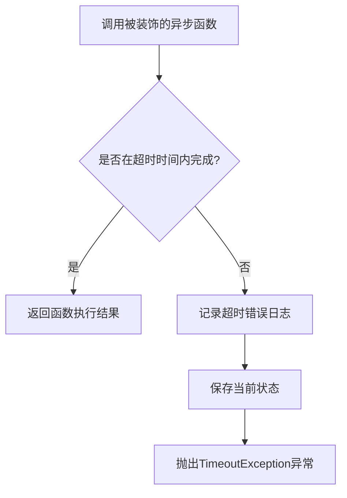
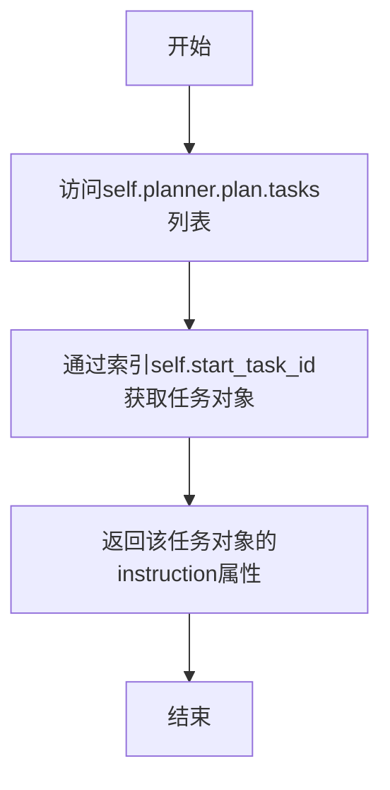
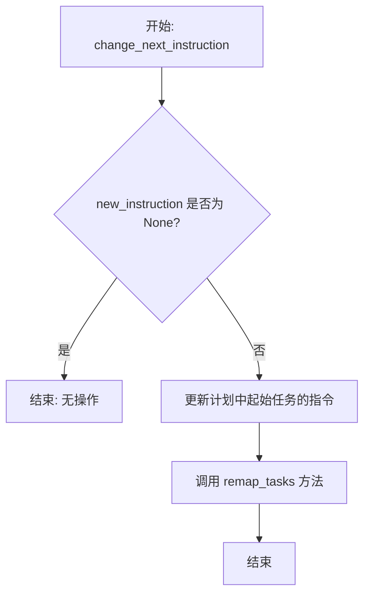
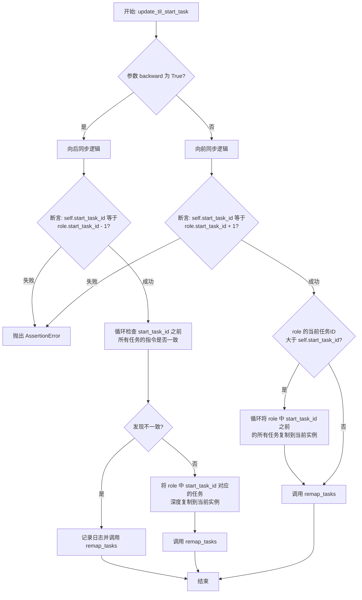
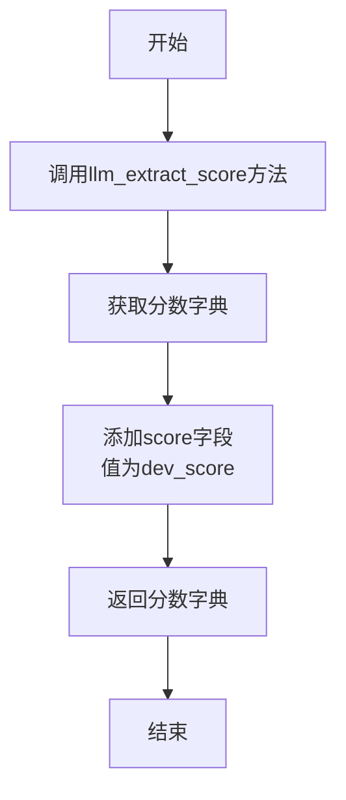
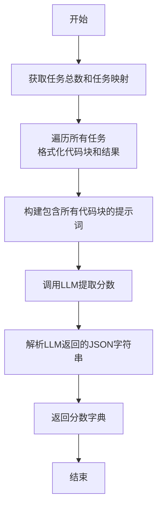
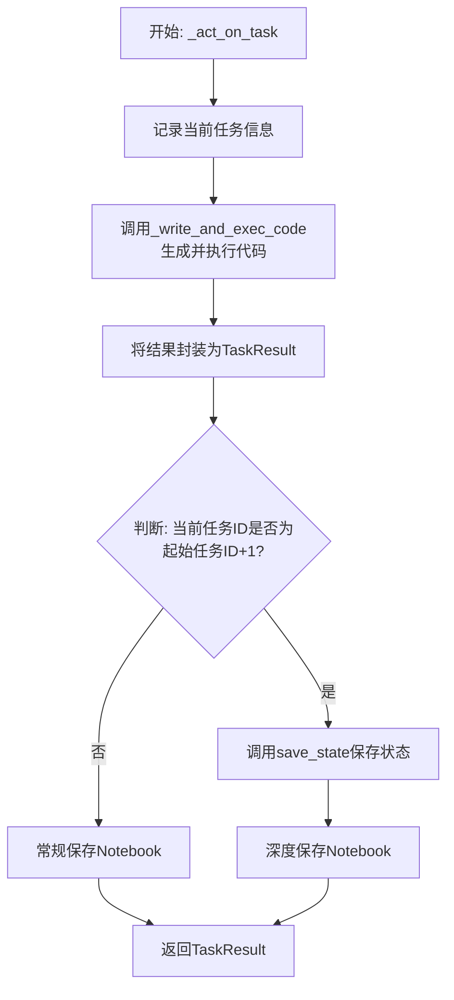
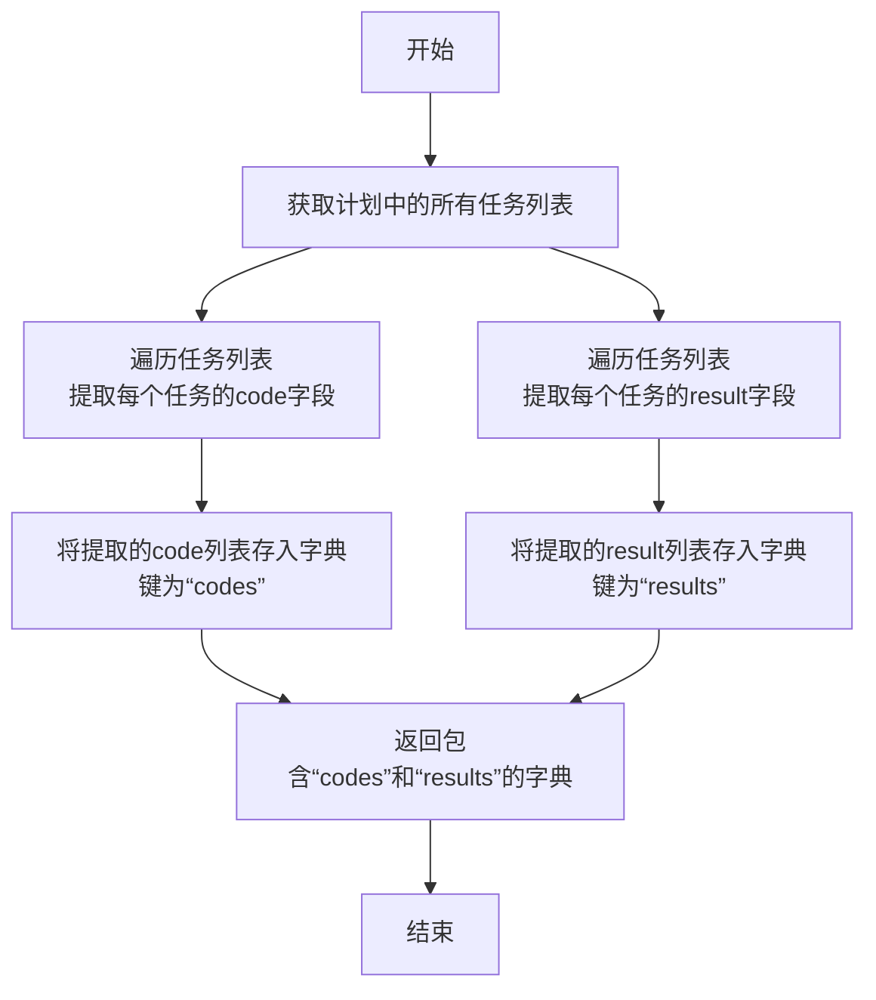
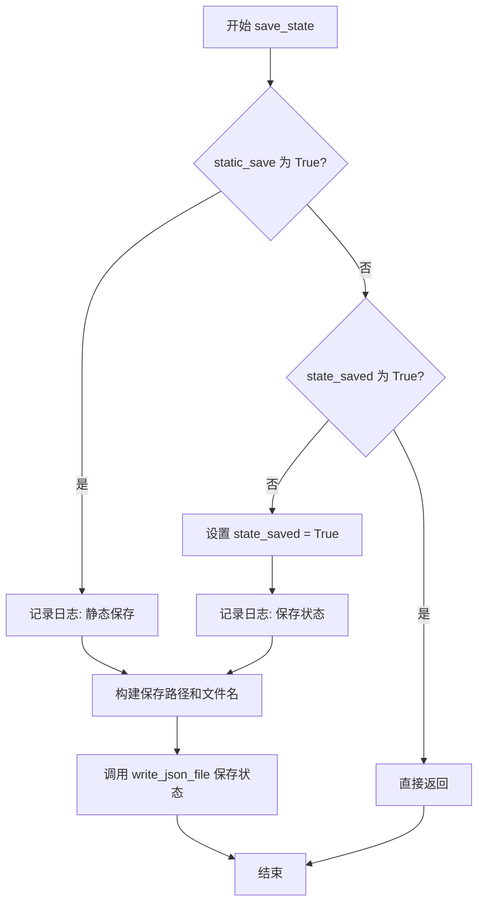
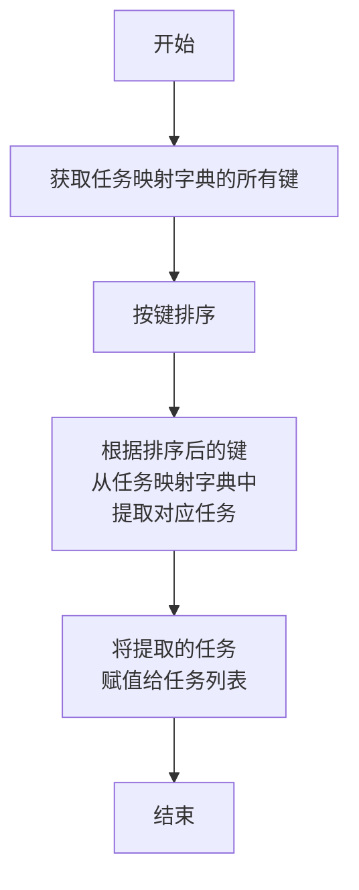

# `.\MetaGPT\metagpt\ext\sela\experimenter.py` 详细设计文档

该代码定义了一个名为 Experimenter 的类，它继承自 DataInterpreter，核心功能是作为一个实验执行者，通过蒙特卡洛树搜索（MCTS）风格的流程，在数据科学或机器学习任务中执行代码、评估结果（提取分数）、管理任务状态，并支持超时控制、状态保存和任务回溯/前向更新。

## 整体流程

```mermaid
graph TD
    A[Experimenter 实例化] --> B{检查现有计划?}
    B -- 是 --> C[复用现有计划，设置 WriteAnalysisCode 动作]
    B -- 否 --> D[调用父类 DataInterpreter 初始化计划与工具]
    D --> E[进入运行循环]
    E --> F{执行模式?}
    F -- 'plan_and_act' --> G[调用 _act_on_task 执行单个任务]
    G --> H[调用 _write_and_exec_code 生成并执行代码]
    H --> I[生成 TaskResult]
    I --> J{任务ID == start_task_id + 1?}
    J -- 是 --> K[保存完整状态并深度保存 Notebook]
    J -- 否 --> L[保存当前状态到 Notebook]
    L --> M[返回 TaskResult]
    F -- 'run' (默认) --> N[调用父类 run 方法进行观察-思考-行动循环]
    N --> O[调用 react 方法]
    O --> P[发布消息]
    P --> Q[返回 Message]
    E --> R[外部调用 get_score]
    R --> S[调用 llm_extract_score 提取分数]
    S --> T[组装所有任务的代码与结果]
    T --> U[调用 LLM 解析分数]
    U --> V[返回分数字典]
    E --> W[外部调用 update_til_start_task]
    W --> X{方向?}
    X -- 向后(backward=True) --> Y[验证并复制前一个角色的任务]
    X -- 向前(backward=False) --> Z[验证并复制后一个角色的任务]
    Y --> AA[调用 remap_tasks 重新排序任务列表]
    Z --> AA
    AA --> BB[流程结束]
    note: 所有异步方法均被 async_timeout 装饰器包装，超时则抛出 TimeoutException 并保存状态。
```

## 类结构

```
DataInterpreter (父类，来自 metagpt.roles.di.data_interpreter)
└── Experimenter
    ├── 类字段: node_id, start_task_id, state_saved, role_dir, role_timeout
    ├── 类方法: get_node_name, get_next_instruction, change_next_instruction, update_til_start_task, get_score, llm_extract_score, set_plan_and_tool, _act_on_task, get_solution, save_state, remap_tasks, run
    └── 继承方法: 来自 DataInterpreter 的 _write_and_exec_code, react, observe, think, act 等
```

## 全局变量及字段


### `CODE_BLOCK_RESULT`
    
一个用于格式化代码块及其执行结果的字符串模板，包含代码和结果两个占位符。

类型：`str`
    


### `EXTRACT_SCORE_PROMPT`
    
一个用于指导LLM从代码执行结果中提取训练、开发和测试分数的提示词模板。

类型：`str`
    


### `Experimenter.node_id`
    
标识当前实验节点的唯一字符串ID，用于生成节点名称和保存状态文件。

类型：`str`
    


### `Experimenter.start_task_id`
    
表示当前实验节点开始执行的任务ID，用于任务序列的定位和状态管理。

类型：`int`
    


### `Experimenter.state_saved`
    
标志位，指示当前节点的状态是否已保存，用于防止重复保存状态。

类型：`bool`
    


### `Experimenter.role_dir`
    
实验节点状态文件的保存目录路径，基于SERDESER_PATH常量构建。

类型：`Path | str`
    


### `Experimenter.role_timeout`
    
实验节点执行任务的超时时间（秒），用于装饰器async_timeout控制异步操作的执行时长。

类型：`int`
    
    

## 全局函数及方法

### `async_timeout`

`async_timeout` 是一个装饰器工厂函数，用于为异步方法添加超时控制。当被装饰的异步方法执行时间超过指定的超时时间（`self.role_timeout`）时，它会记录错误、保存当前状态，并抛出一个自定义的 `TimeoutException` 异常。

参数：

-  `func`：`Callable`，需要被装饰的异步函数或方法

返回值：`Callable`，返回一个包装后的异步函数（wrapper），该函数具有超时控制逻辑

#### 流程图



#### 带注释源码

```python
def async_timeout():
    # 装饰器工厂函数，返回一个装饰器
    def decorator(func):
        # 实际的装饰器，它包装了原始的异步函数
        async def wrapper(self, *args, **kwargs):
            try:
                # 使用 asyncio.wait_for 为原始函数调用添加超时控制
                # 超时时间从 self.role_timeout 属性获取
                result = await asyncio.wait_for(func(self, *args, **kwargs), timeout=self.role_timeout)
            except asyncio.TimeoutError:
                # 如果发生超时，构造错误信息
                text = f"Function timed out after {self.role_timeout} seconds"
                # 使用项目特定的日志记录器记录错误
                mcts_logger.error(text)
                # 保存当前对象的状态（例如，到文件）
                self.save_state()
                # 抛出自定义的超时异常，终止执行
                raise TimeoutException(text)
            # 如果未超时，正常返回原始函数的结果
            return result

        return wrapper

    return decorator
```

### `Experimenter.get_node_name`

该方法用于生成并返回当前实验节点的名称，格式为"Node-{节点ID}"。

参数：无

返回值：`str`，返回格式为"Node-{节点ID}"的字符串，其中节点ID来自实例的`node_id`字段。

#### 流程图

```mermaid
flowchart TD
    A[开始] --> B[读取 self.node_id]
    B --> C[拼接字符串 'Node-{node_id}']
    C --> D[返回拼接结果]
    D --> E[结束]
```

#### 带注释源码

```python
def get_node_name(self):
    # 返回格式为"Node-{节点ID}"的字符串
    # 其中 self.node_id 是实例的一个字段，表示当前实验节点的唯一标识符
    return f"Node-{self.node_id}"
```

### `Experimenter.get_next_instruction`

该方法用于获取当前实验者（Experimenter）角色计划中起始任务（由`start_task_id`标识）的指令内容。

参数：
- `self`：`Experimenter`，当前`Experimenter`类的实例。

返回值：`str`，返回计划中起始任务（`self.start_task_id`）的指令字符串。

#### 流程图



#### 带注释源码

```python
def get_next_instruction(self):
    # 从当前角色的计划器（planner）的计划（plan）中，
    # 获取任务列表（tasks），并通过起始任务ID（start_task_id）索引到对应的任务对象，
    # 最后返回该任务对象的指令（instruction）属性。
    return self.planner.plan.tasks[self.start_task_id].instruction
```

### `Experimenter.change_next_instruction`

该方法用于更新`Experimenter`实例中计划（plan）的起始任务（由`start_task_id`标识）的指令。如果提供了新的指令，它会替换现有指令，并重新映射任务列表以保持一致性。

参数：

- `new_instruction`：`str`，新的任务指令。如果为`None`，则不执行任何操作。

返回值：`None`，此方法不返回任何值。

#### 流程图



#### 带注释源码

```python
def change_next_instruction(self, new_instruction):
    # 检查传入的新指令是否有效（非None）
    if new_instruction is not None:
        # 根据 start_task_id 定位到计划中的对应任务，并更新其指令
        self.planner.plan.task_map[str(self.start_task_id)].instruction = new_instruction
        # 调用 remap_tasks 方法，确保任务列表（self.planner.plan.tasks）与 task_map 保持同步
        self.remap_tasks()
```

### `Experimenter.update_til_start_task`

该方法用于同步两个`Experimenter`角色实例之间的任务状态。它根据`backward`参数的值，决定是向前（从较早的任务状态同步到当前实例）还是向后（从较晚的任务状态同步到当前实例）同步任务指令和内容。其核心逻辑是确保两个角色实例在指定任务ID之前的任务指令保持一致，并将目标任务的完整信息复制到当前实例中，最后重新映射任务列表以保持顺序。

参数：

- `role`：`Experimenter`，作为参考源的另一个`Experimenter`角色实例，其任务状态将被同步到当前实例。
- `backward`：`bool`，默认为`True`。同步方向标志。为`True`时执行“向后同步”（从`role`同步到当前实例的`start_task_id`任务）；为`False`时执行“向前同步”（从`role`同步到当前实例的`start_task_id`之前的任务）。

返回值：`None`，此方法不返回任何值，其作用是通过修改当前实例的`self.planner.plan.task_map`来更新内部状态。

#### 流程图



#### 带注释源码

```python
def update_til_start_task(self, role: Experimenter, backward: bool = True):
    # 判断同步方向：True 表示“向后同步”，即用传入的role（通常是更“新”或更“深”的节点）的任务来更新当前实例。
    if backward:
        # 向后同步的前提：当前实例的 start_task_id 必须正好比传入 role 的 start_task_id 小 1。
        # 这确保了它们是执行链上相邻的两个状态。
        assert (
            self.start_task_id == role.start_task_id - 1
        ), f"start_task_id: {self.start_task_id}, role.start_task_id: {role.start_task_id}"
        # 检查当前实例与传入role在 start_task_id 之前的所有任务指令是否完全一致。
        # 这是为了确保在复制新任务之前，两者的历史执行路径是一致的。
        for i in range(self.start_task_id):
            if (
                self.planner.plan.task_map[str(self.start_task_id)].instruction
                != role.planner.plan.task_map[str(self.start_task_id)].instruction
            ):
                # 如果发现历史任务指令不匹配，记录日志，重新映射任务列表，然后直接返回。
                # 这可能发生在MCTS搜索中，当尝试合并不同分支的结果时发现基础不一致。
                mcts_logger.info("Previous task instructions not matched")
                self.remap_tasks()
                return
        # 如果历史任务指令全部匹配，则将传入role中 start_task_id 对应的任务（即新的、待同步的任务）
        # 深度复制到当前实例的任务映射表中。
        self.planner.plan.task_map[str(self.start_task_id)] = role.planner.plan.task_map[
            str(self.start_task_id)
        ].model_copy()
        # 更新任务映射后，重新整理任务列表，确保顺序正确。
        self.remap_tasks()

    else:
        # 向前同步逻辑：当前实例的 start_task_id 必须正好比传入 role 的 start_task_id 大 1。
        # 这通常用于从“父节点”回滚或同步状态到“子节点”。
        assert (
            self.start_task_id == role.start_task_id + 1
        ), f"start_task_id: {self.start_task_id}, role.start_task_id: {role.start_task_id}"
        # 检查传入role的当前执行进度是否已经超过了当前实例的 start_task_id。
        # 如果是，说明role已经执行了更多任务，我们需要将这些更早的任务状态同步过来。
        if int(role.planner.plan.current_task_id) > self.start_task_id:
            # 将传入role中，从开始到 start_task_id（不含）的所有任务状态复制到当前实例。
            # 这相当于用role的“过去”覆盖当前实例的“过去”。
            for i in range(role.start_task_id):
                self.planner.plan.task_map[str(i)] = role.planner.plan.task_map[str(i)].model_copy()
        # 同步完成后，重新映射任务列表。
        self.remap_tasks()
```

### `Experimenter.get_score`

该方法用于从实验过程中生成的代码块和执行结果中提取最终的训练、开发和测试分数，并返回一个包含这些分数的字典。如果无法找到分数，则返回默认值为-1的字典。

参数：

- 无

返回值：`dict`，包含键为"train_score"、"dev_score"、"test_score"和"score"的字典，其中"score"的值与"dev_score"相同。

#### 流程图



#### 带注释源码

```python
async def get_score(self):
    # 调用llm_extract_score方法从LLM提取分数字典
    score_dict = await self.llm_extract_score()
    # 将dev_score的值赋给score字段，作为最终评分
    score_dict["score"] = score_dict["dev_score"]
    # 返回包含所有分数的字典
    return score_dict
```

### `Experimenter.llm_extract_score`

该方法通过调用大语言模型（LLM），从一系列代码执行结果中提取训练、开发和测试的最终分数，并以字典形式返回。

参数：
- `self`：`Experimenter`，`Experimenter`类的实例，用于访问任务映射和LLM接口。

返回值：`dict`，一个包含`train_score`、`dev_score`和`test_score`键的字典。如果无法找到分数，则值设为-1。

#### 流程图



#### 带注释源码

```python
async def llm_extract_score(self):
    # 获取任务映射中的任务总数
    num_tasks = len(self.planner.plan.task_map)
    # 获取任务映射字典
    task_map = self.planner.plan.task_map
    # 遍历所有任务，将每个任务的代码和执行结果格式化为预定义的CODE_BLOCK_RESULT模板
    code_block = "\n".join(
        [
            CODE_BLOCK_RESULT.format(code=task_map[str(i + 1)].code, result=task_map[str(i + 1)].result)
            for i in range(num_tasks)
        ]
    )
    # 使用格式化后的代码块构建完整的提示词，并调用LLM进行询问
    rsp = await self.llm.aask(EXTRACT_SCORE_PROMPT.format(code_block=code_block, role="user"))
    # 从LLM的响应中解析出JSON代码块
    json_block = CodeParser.parse_code(block=None, text=rsp)
    # 将JSON字符串解析为Python字典
    score_dict = json.loads(json_block)
    # 返回包含分数的字典
    return score_dict
```

### `Experimenter.set_plan_and_tool`

该方法是一个模型验证器，在`Experimenter`类实例化后自动调用。其核心功能是检查当前实例的`planner.plan.goal`是否已存在。如果目标（goal）已存在，则跳过默认的初始化流程，直接为该角色设置`WriteAnalysisCode`动作并重置状态；否则，调用父类（`DataInterpreter`）的`set_plan_and_tool`方法执行标准的计划和工具初始化流程。

参数：
-  `self`：`Experimenter`，`Experimenter`类的当前实例。

返回值：`Interpreter`，返回经过初始化配置后的`Experimenter`实例自身（`self`）。

#### 流程图

```mermaid
flowchart TD
    A[开始: set_plan_and_tool] --> B{检查 plan.goal 是否为空字符串?}
    B -- 否/已存在 --> C[设置动作为 WriteAnalysisCode]
    C --> D[调用 _set_state(0) 重置状态]
    D --> E[打印“Plan already exists, skipping initialization.”]
    E --> F[返回 self]
    B -- 是/为空 --> G[打印“Initializing plan and tool...”]
    G --> H[调用父类 DataInterpreter.set_plan_and_tool]
    H --> F
```

#### 带注释源码

```python
    @model_validator(mode="after")
    def set_plan_and_tool(self) -> "Interpreter":
        # 检查当前计划的目标（goal）是否非空。非空意味着计划已存在。
        if self.planner.plan.goal != "":
            # 如果计划已存在，则跳过完整的初始化流程。
            # 仅为该角色设置一个特定的动作：WriteAnalysisCode。
            self.set_actions([WriteAnalysisCode])
            # 调用内部方法将角色状态重置为初始状态（例如，任务索引归零）。
            self._set_state(0)
            # 在控制台输出提示信息，表明跳过了初始化。
            print("Plan already exists, skipping initialization.")
            # 返回配置好的当前实例。
            return self
        # 如果计划目标为空，说明这是一个全新的实例，需要执行标准初始化。
        print("Initializing plan and tool...")
        # 调用父类（DataInterpreter）的 set_plan_and_tool 方法
        # 来执行默认的计划创建和工具加载逻辑。
        return super().set_plan_and_tool()
```

### `Experimenter._act_on_task`

该方法用于在"plan_and_act"模式下执行单个任务。它通过调用`_write_and_exec_code`方法生成并执行代码，将执行结果封装为`TaskResult`对象返回。根据当前任务ID与起始任务ID的关系，该方法会决定是否保存完整的实验状态和深度保存Notebook，或者仅进行常规的Notebook保存。

参数：

- `current_task`：`Task`，当前需要被执行的任务对象。

返回值：`TaskResult`，包含执行生成的代码、执行结果以及执行是否成功的标志。

#### 流程图



#### 带注释源码

```python
async def _act_on_task(self, current_task: Task) -> TaskResult:
    """Useful in 'plan_and_act' mode. Wrap the output in a TaskResult for review and confirmation."""
    # 1. 记录当前正在执行的任务信息，便于调试和追踪
    mcts_logger.info(f"The current_task is: {current_task}")
    
    # 2. 核心步骤：调用内部方法生成代码并执行，获取代码文本、执行结果和成功状态
    code, result, is_success = await self._write_and_exec_code()
    
    # 3. 将执行结果封装成标准化的TaskResult对象
    task_result = TaskResult(code=code, result=result, is_success=is_success)
    
    # 4. 判断逻辑：如果当前任务是起始任务的下一个任务（即关键的执行步骤）
    if int(current_task.task_id) == self.start_task_id + 1:
        # 保存实验的完整状态（例如，用于MCTS中的状态回溯）
        self.save_state()
        # 深度保存Notebook，包含所有中间步骤和上下文
        save_notebook(role=self, save_dir=self.role_dir, name=self.get_node_name(), save_to_depth=True)
    else:
        # 对于其他任务，仅进行常规的Notebook保存
        save_notebook(role=self, save_dir=self.role_dir, name=self.get_node_name())
    
    # 5. 返回封装好的任务执行结果
    return task_result
```

### `Experimenter.get_solution`

该方法用于获取当前实验者（Experimenter）角色在其计划（plan）中所有任务的代码和执行结果，并将其打包成一个字典返回。

参数：
- `self`：`Experimenter`，当前`Experimenter`类的实例。

返回值：`dict`，一个包含两个键值对的字典：
  - `"codes"`：一个列表，包含计划中所有任务的代码（`task.code`）。
  - `"results"`：一个列表，包含计划中所有任务的结果（`task.result`）。

#### 流程图



#### 带注释源码

```python
def get_solution(self):
    # 从当前角色的计划（self.planner.plan）中获取所有任务（tasks）的列表
    codes = [task.code for task in self.planner.plan.tasks]
    results = [task.result for task in self.planner.plan.tasks]
    # 将提取出的代码列表和结果列表组合成一个字典并返回
    return {"codes": codes, "results": results}
```

### `Experimenter.save_state`

该方法用于保存 `Experimenter` 角色的当前状态到 JSON 文件。它通过检查 `state_saved` 标志来决定是否需要保存，以避免重复保存。当 `static_save` 参数为 `True` 时，会强制保存状态而不改变 `state_saved` 标志，通常用于新角色创建时的初始状态保存。

参数：

- `self`：`Experimenter`，当前 `Experimenter` 实例
- `static_save`：`bool`，默认为 `False`。如果为 `True`，则执行“静态保存”，即保存状态但不更新 `state_saved` 标志；如果为 `False`，则仅在 `state_saved` 为 `False` 时保存并更新标志。

返回值：`None`，该方法不返回任何值，其作用是将对象状态序列化并写入文件。

#### 流程图



#### 带注释源码

```python
def save_state(self, static_save=False):
    """
    保存当前角色的状态到 JSON 文件。
    通过 `state_saved` 标志避免重复保存。
    `static_save` 参数用于在不改变标志的情况下强制保存（例如创建新角色时）。

    Args:
        static_save (bool): 如果为 True，执行“静态保存”，即保存但不更新 `state_saved` 标志。
                            默认为 False。
    """
    # 检查是否已经保存过且不是静态保存，如果是则直接返回
    if self.state_saved and not static_save:
        return
    # 如果不是静态保存，则标记状态已保存
    if not static_save:
        self.state_saved = True
        # 记录常规保存日志
        mcts_logger.log("MCTS", f"Saving state at task {self.start_task_id}")
    else:
        # 记录静态保存日志
        mcts_logger.log("MCTS", "Static Saving")
    # 构建保存目录路径
    stg_path = self.role_dir
    # 获取节点名称作为文件名的一部分
    name = self.get_node_name()
    # 拼接完整的文件路径
    role_path = os.path.join(stg_path, f"{name}.json")
    # 将当前对象的状态（通过 Pydantic 的 model_dump 序列化）保存为 JSON 文件
    write_json_file(role_path, self.model_dump())
```

### `Experimenter.remap_tasks`

该方法用于重新映射任务列表，确保任务列表的顺序与任务映射字典的键顺序一致。

参数：
- 无

返回值：`None`，无返回值

#### 流程图



#### 带注释源码

```python
def remap_tasks(self):
    # 重新映射任务列表，确保任务列表的顺序与任务映射字典的键顺序一致
    self.planner.plan.tasks = [
        # 遍历排序后的任务映射字典的键
        self.planner.plan.task_map[task_id] for task_id in sorted(self.planner.plan.task_map.keys())
    ]
```

### `Experimenter.run`

`Experimenter.run` 方法是 `Experimenter` 类的主要执行入口，它负责根据传入的消息参数决定是继续执行现有任务还是启动新的任务流程。当接收到 `"continue"` 消息时，它会清理工作内存并继续执行；否则，它将调用父类的 `run` 方法来启动新的任务执行流程。

参数：

- `with_message`：`Message | str | None`，触发运行的消息或指令。当值为 `"continue"` 时，表示继续执行现有任务；其他情况则启动新的任务流程。

返回值：`Message | None`，返回执行过程中生成的消息，如果执行被中断或没有生成消息，则返回 `None`。

#### 流程图

```mermaid
flowchart TD
    A[开始: run(with_message)] --> B{with_message == 'continue'?}
    B -- 是 --> C[清理工作内存]
    C --> D[调用react方法继续执行]
    D --> E[设置todo为None]
    E --> F[发布消息]
    F --> G[返回消息]
    B -- 否 --> H[调用父类DataInterpreter的run方法]
    H --> I[返回父类方法的结果]
```

#### 带注释源码

```python
    @async_timeout()  # 应用异步超时装饰器，确保方法在指定时间内完成
    async def run(self, with_message=None) -> Message | None:
        """Observe, and think and act based on the results of the observation"""
        # 检查传入的消息是否为"continue"，以决定执行路径
        if with_message == "continue":
            mcts_logger.info("Continue to run")  # 记录继续执行的日志
            # 清理角色上下文和工作内存，为继续执行做准备
            self.rc.working_memory.clear()
            self.working_memory.clear()
            # 调用react方法继续执行任务链
            rsp = await self.react()
            # 将待办事项设置为None，表示当前没有待处理任务
            self.set_todo(None)
            # 将执行结果作为消息发布
            self.publish_message(rsp)
            # 返回生成的消息
            return rsp
        # 如果消息不是"continue"，则调用父类DataInterpreter的run方法启动新流程
        return await super().run(with_message)
```

## 关键组件


### 异步超时装饰器 (`async_timeout`)

一个用于包装异步方法的装饰器，用于实现执行超时控制。当被装饰的方法执行时间超过预设的 `role_timeout` 时，会抛出 `TimeoutException` 异常，并自动保存当前角色的状态。

### 状态管理与序列化 (`save_state`, `model_dump`)

基于 Pydantic 模型 (`BaseModel`) 的序列化能力，提供了将 `Experimenter` 角色实例的完整状态（包括计划、任务等）保存到 JSON 文件的功能。支持通过 `state_saved` 标志位避免重复保存，并可通过 `static_save` 参数进行强制保存。

### 任务计划与执行引擎 (`_act_on_task`, `run`)

继承自 `DataInterpreter` 的核心执行循环。`_act_on_task` 方法负责执行单个任务（生成并运行代码），`run` 方法作为入口点，驱动整个“观察-思考-行动”的循环。支持从特定断点（`with_message="continue"`）继续执行。

### 任务图谱与重映射 (`remap_tasks`, `update_til_start_task`)

维护一个以任务ID为键的字典 (`task_map`) 来管理所有任务，并通过 `remap_tasks` 方法确保任务列表 (`tasks`) 的顺序与ID顺序一致。`update_til_start_task` 方法用于在角色间同步任务状态，支持向前（复制新任务）和向后（复制已完成任务）两种同步模式。

### 基于LLM的分数提取 (`llm_extract_score`)

通过构造包含所有任务代码块和执行结果的提示词，调用大语言模型 (LLM) 从文本中提取结构化的评分结果（训练集、开发集、测试集分数）。该组件将非结构化的自然语言输出转化为程序可处理的 JSON 数据。

### 实验节点标识与管理 (`node_id`, `get_node_name`)

为每个 `Experimenter` 实例分配唯一的 `node_id`，用于在实验树或图中标识不同的搜索节点。`get_node_name` 方法生成标准化的节点名称，用于文件保存和日志记录。

### 断点保存与笔记本生成 (`save_notebook`)

在执行到关键任务（`start_task_id + 1`）时，会触发深度保存，不仅保存角色状态，还可能生成可交互的笔记本文件（如 Jupyter Notebook），便于结果复现和深度分析。这为复杂的、多步骤的数据分析实验提供了可追溯和可调试的工件。


## 问题及建议


### 已知问题

-   **硬编码的超时时间**：`role_timeout: int = 1000` 是一个硬编码的常量，对于不同的任务或运行环境，1000秒可能过长或过短，缺乏灵活性。
-   **潜在的循环依赖风险**：`update_til_start_task` 方法中通过 `model_copy()` 复制任务对象，如果 `Task` 对象包含复杂的循环引用或不可序列化的属性，可能导致复制失败或状态不一致。
-   **异常处理不完整**：`async_timeout` 装饰器在超时后抛出 `TimeoutException`，但 `run` 方法并未显式捕获此异常，可能导致程序意外终止，且超时后的状态保存 (`self.save_state()`) 可能因超时中断而失败。
-   **状态保存逻辑可能重复**：`save_state` 方法通过 `state_saved` 标志防止重复保存，但在 `_act_on_task` 中，当 `current_task.task_id == self.start_task_id + 1` 时也会调用 `save_state()`，可能存在逻辑重叠或竞争条件。
-   **分数提取的健壮性不足**：`llm_extract_score` 方法依赖LLM从代码块中提取分数，如果LLM返回的JSON格式不正确或无法解析，`json.loads(json_block)` 可能抛出异常，且错误处理仅依赖于默认值（-1），缺乏更细致的错误反馈。
-   **断言可能在生产环境中中断**：`update_til_start_task` 方法中使用 `assert` 语句验证任务ID连续性，在Python优化模式下（`-O` 标志）这些断言会被忽略，导致逻辑错误。

### 优化建议

-   **将超时时间配置化**：建议将 `role_timeout` 改为从配置文件或环境变量中读取，为不同场景提供可配置的超时策略。
-   **改进任务复制机制**：考虑使用更安全的对象复制方法，如 `copy.deepcopy` 或实现自定义的序列化/反序列化逻辑，确保复制的完整性和独立性。
-   **增强异常处理链**：在 `run` 方法中捕获 `TimeoutException` 并进行适当处理（如记录日志、返回错误消息）。同时，评估超时后状态保存的可靠性，考虑在超时前设置更早的保存点或使用事务性保存。
-   **重构状态保存逻辑**：明确 `save_state` 和 `_act_on_task` 中保存状态的职责。可以考虑将状态保存的触发条件集中管理，避免分散的逻辑点，并使用锁或异步锁防止并发保存冲突。
-   **增强分数提取的容错性**：在 `llm_extract_score` 方法中，对 `json.loads` 添加异常捕获，并提供更详细的错误日志。可以尝试多次重试或使用更稳健的JSON解析库。
-   **将断言替换为运行时检查**：将 `update_til_start_task` 中的 `assert` 语句改为显式的 `if` 检查并抛出更具体的异常（如 `ValueError`），确保在生产环境中逻辑依然有效。
-   **考虑异步上下文管理**：对于 `async_timeout` 装饰器，可以考虑使用 `asyncio.timeout` 上下文管理器（Python 3.11+）以获得更清晰和现代的异步超时控制。
-   **优化日志记录**：在关键方法（如 `update_til_start_task`, `llm_extract_score`）中添加更详细的调试级别日志，便于追踪任务状态和LLM交互过程。


## 其它


### 设计目标与约束

本模块（`Experimenter` 类）是 `DataInterpreter` 角色的一个特定扩展，旨在自动化执行数据分析或机器学习实验流程。其核心设计目标是在一个可中断、可恢复、可评估的框架内，通过代码生成与执行来完成任务。主要约束包括：1) 继承自 `DataInterpreter`，需遵循其父类的交互模式与状态管理机制；2) 执行过程存在超时限制（`role_timeout`），需保证长时间运行任务的健壮性；3) 状态需序列化保存，以支持实验过程的快照与回滚；4) 需要从代码执行结果中提取结构化的评估分数。

### 错误处理与异常设计

模块定义了自定义异常 `TimeoutException`，用于包装异步执行超时错误（`asyncio.TimeoutError`）。关键方法 `run` 和 `_act_on_task` 通过 `@async_timeout` 装饰器实现了超时控制，超时后记录日志、保存状态并抛出 `TimeoutException`。`llm_extract_score` 方法在解析分数失败时，会返回默认值为 -1 的字典，避免了因解析异常导致流程中断。`update_til_start_task` 方法中的 `assert` 语句用于在调试阶段验证任务ID的连续性，在生产环境中可能需要更健壮的校验或异常处理。

### 数据流与状态机

数据流围绕 `Task` 和 `TaskResult` 对象展开。`Experimenter` 从 `planner.plan` 中获取任务列表，通过 `_act_on_task` 方法执行每个任务（生成并运行代码），生成包含代码和结果的 `TaskResult`，并更新回 `planner.plan.task_map`。状态的核心是 `start_task_id` 和 `state_saved` 标志，它们定义了当前执行的起点和状态持久化情况。`save_state` 方法将整个角色实例序列化为 JSON 文件，是实现状态快照（State Snapshot）和后续 `update_til_start_task` 进行状态同步（前向/后向更新）的基础。`remap_tasks` 方法确保 `task_map` 字典与有序的 `tasks` 列表保持一致。

### 外部依赖与接口契约

1.  **父类依赖**：强依赖 `DataInterpreter` 基类，继承其 `llm`（大语言模型客户端）、`planner`（规划器）、`rc`（运行时上下文）等核心组件及 `react`、`_write_and_exec_code` 等行为方法。
2.  **Pydantic**：使用 `@model_validator` 进行模型初始化后的自定义校验和设置（`set_plan_and_tool`）。
3.  **工具与动作**：依赖 `WriteAnalysisCode` 动作类来生成具体代码。
4.  **配置常量**：依赖 `SERDESER_PATH` 定义状态序列化的根目录。
5.  **工具函数**：依赖 `CodeParser.parse_code` 解析LLM响应中的代码块，依赖 `write_json_file` 进行JSON序列化，依赖 `save_notebook` 保存实验记录。
6.  **日志接口**：通过 `mcts_logger` 进行结构化日志记录。

### 并发与异步设计

模块完全构建于 `asyncio` 异步框架之上。核心方法 `run`、`_act_on_task`、`get_score`、`llm_extract_score` 均为异步方法。`@async_timeout` 装饰器利用 `asyncio.wait_for` 为被装饰的异步方法添加超时控制，这是防止单个任务（尤其是LLM调用或代码执行）无限期阻塞的关键机制。这种设计允许在更高层级的循环（如MCTS搜索）中并发运行多个 `Experimenter` 实例。

### 配置与序列化

配置主要通过类字段实现：`role_dir` 定义了状态文件的存储路径；`role_timeout` 控制了方法执行的超时阈值。序列化是核心功能，`save_state` 方法利用 Pydantic 的 `model_dump()` 将整个实例对象转换为字典，再通过 `write_json_file` 保存为 JSON 文件。反序列化（加载状态）逻辑未在本代码段中直接体现，但应存在于创建 `Experimenter` 实例的上下文中（例如，从JSON文件加载并初始化）。`node_id` 和 `get_node_name()` 共同定义了状态文件的命名规则。

### 测试策略建议

1.  **单元测试**：应覆盖 `llm_extract_score` 方法，测试其对不同格式的代码块和结果文本的解析能力，包括正常分数提取和失败回退（返回-1）的情况。测试 `update_til_start_task` 方法在向前、向后同步时的逻辑。
2.  **集成测试**：模拟完整的 `run` 流程，验证从接收指令到生成代码、执行、保存状态、提取分数的端到端功能。需要Mock `llm.aask` 和 `_write_and_exec_code` 等外部依赖。
3.  **超时测试**：验证 `@async_timeout` 装饰器在方法执行超时后是否能正确抛出 `TimeoutException` 并触发状态保存。
4.  **状态持久化测试**：测试 `save_state` 生成的文件能否被正确加载并恢复出一个功能等效的 `Experimenter` 实例。
5.  **并发测试**：在模拟的MCTS环境中测试多个 `Experimenter` 实例并发运行时的状态隔离与同步是否正确。

    