# `.\MetaGPT\metagpt\ext\sela\insights\instruction_generator.py` 详细设计文档

该代码实现了一个指令生成器，其核心功能是基于给定的数据集信息和任务描述，通过调用大型语言模型（LLM）和解决方案设计器（SolutionDesigner）来生成或演化出改进的指令（Instructions）。它能够从零开始生成解决方案洞察（insights），或从现有洞察池中加载，然后利用这些洞察来重写原始指令，以产生性能可能更优的新指令。该模块主要用于自动化机器学习竞赛（如Kaggle）中代码或策略的迭代优化过程。

## 整体流程

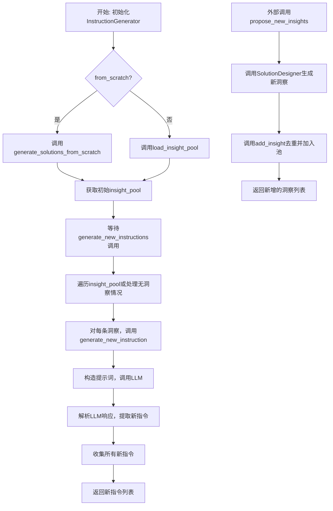

## 类结构

```
InstructionGenerator
├── 类字段: data_config, state, file_path, dataset_info, use_fixed_insights, proposer, from_scratch, insight_pool
├── 类方法: __init__, initialize, load_json_data, _random_sample, sample_instruction_set, format_output, load_insight_pool, generate_new_instructions, propose_new_insights, generate_solutions_from_scratch, add_insight, is_similar_to_existing, calculate_similarity, generate_new_instruction
└── (无显式继承关系)
```

## 全局变量及字段


### `REFLECTION_SYSTEM_MSG`
    
用于指导LLM生成改进建议的系统提示词，设定了一个Kaggle大师的角色和任务目标。

类型：`str`
    


### `CHANGE_INSTRUCTION`
    
一个用于格式化LLM提示的模板字符串，包含原始指令、洞察信息，并指定了期望的JSON输出格式。

类型：`str`
    


### `DATA_CONFIG`
    
通过调用`load_data_config()`加载的全局数据配置字典，包含项目的数据路径等信息。

类型：`dict`
    


### `InstructionGenerator.data_config`
    
类级别的数据配置字典，与全局变量`DATA_CONFIG`指向同一对象，用于存储数据集路径等配置信息。

类型：`dict`
    


### `InstructionGenerator.state`
    
包含实验状态信息的字典，如实验池路径、自定义数据集目录、数据集配置和任务类型等。

类型：`dict`
    


### `InstructionGenerator.file_path`
    
存储从`state`中获取的实验池文件路径，用于加载或保存洞察池数据。

类型：`str`
    


### `InstructionGenerator.dataset_info`
    
存储数据集的信息，可能是一个从Markdown文件读取的字符串，或是一个从JSON文件加载的字典。

类型：`str | dict`
    


### `InstructionGenerator.use_fixed_insights`
    
一个布尔标志，指示是否在加载洞察池时合并预定义的固定洞察（fixed_insights.json）。

类型：`bool`
    


### `InstructionGenerator.proposer`
    
`SolutionDesigner`类的实例，负责生成和提议新的解决方案与洞察。

类型：`SolutionDesigner`
    


### `InstructionGenerator.from_scratch`
    
一个布尔标志，指示是否从头开始生成洞察池（True），还是从现有文件加载（False）。

类型：`bool`
    


### `InstructionGenerator.insight_pool`
    
存储所有可用洞察的列表，每个洞察是一个包含`task_id`和`Analysis`等键的字典，是生成新指令的核心知识库。

类型：`list[dict]`
    
    

## 全局函数及方法

### `InstructionGenerator.__init__`

该方法用于初始化 `InstructionGenerator` 类的实例，根据传入的状态参数、是否使用固定洞察标志以及是否从头开始生成洞察的标志，来设置实例的初始状态和属性。

参数：

- `state`：`dict`，包含实验配置信息的字典，如实验池路径、自定义数据集目录、数据集配置等。
- `use_fixed_insights`：`bool`，指示是否从固定洞察文件中加载额外洞察的标志。
- `from_scratch`：`bool`，指示是否从头开始生成洞察池的标志。

返回值：`None`，构造函数不返回任何值。

#### 流程图

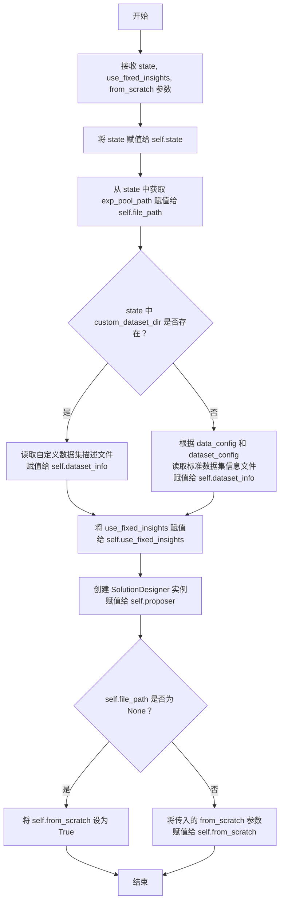

#### 带注释源码

```python
def __init__(self, state, use_fixed_insights, from_scratch):
    # 保存传入的状态字典，包含实验配置
    self.state = state
    # 从状态字典中获取实验池文件路径
    self.file_path = state["exp_pool_path"]
    # 检查是否提供了自定义数据集目录
    if state["custom_dataset_dir"]:
        # 如果提供了，读取该目录下的描述文件
        with open(f"{state['custom_dataset_dir']}/description.md", "r", encoding="utf-8") as file:
            self.dataset_info = file.read()
    else:
        # 如果没有提供自定义数据集，则根据配置构建标准数据集信息文件路径
        dataset_info_path = (
            f"{self.data_config['datasets_dir']}/{state['dataset_config']['dataset']}/dataset_info.json"
        )
        # 读取标准数据集信息文件
        with open(dataset_info_path, "r") as file:
            self.dataset_info = json.load(file)
    # 保存是否使用固定洞察的标志
    self.use_fixed_insights = use_fixed_insights
    # 创建一个 SolutionDesigner 实例，用于后续生成或提议洞察
    self.proposer = SolutionDesigner()
    # 判断是否从头开始生成洞察池：如果文件路径为空，则强制设为 True；否则使用传入的参数
    if self.file_path is None:
        self.from_scratch = True
    else:
        self.from_scratch = from_scratch
```

### `InstructionGenerator.initialize`

该方法用于初始化 `InstructionGenerator` 实例的 `insight_pool` 属性。根据 `from_scratch` 标志，它要么从零开始生成新的解决方案洞察，要么从指定的文件路径加载现有的洞察池。

参数：
-  `self`：`InstructionGenerator` 类型，`InstructionGenerator` 类的实例。

返回值：`None` 类型，该方法不返回任何值，仅初始化实例的 `insight_pool` 属性。

#### 流程图

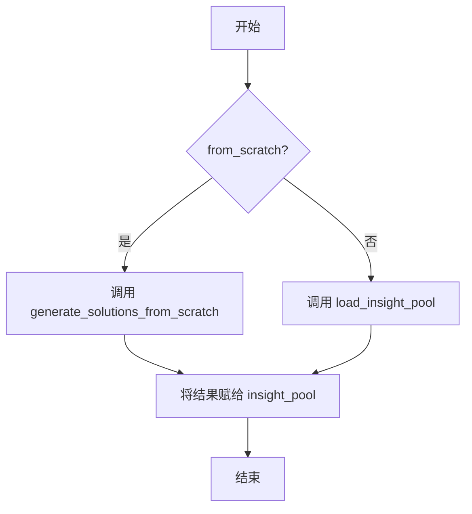

#### 带注释源码

```python
async def initialize(self):
    # 检查是否从零开始生成洞察
    if self.from_scratch:
        # 如果是，则调用 generate_solutions_from_scratch 方法，
        # 传入数据集信息和任务状态，生成新的洞察池
        self.insight_pool = await self.generate_solutions_from_scratch(self.dataset_info, self.state["task"])
    else:
        # 如果不是，则调用 load_insight_pool 方法，
        # 从文件路径加载现有的洞察池，并根据 use_fixed_insights 标志决定是否合并固定洞察
        self.insight_pool = self.load_insight_pool(self.file_path, self.use_fixed_insights)
```

### `InstructionGenerator.load_json_data`

`InstructionGenerator.load_json_data` 是一个静态方法，用于从指定的 JSON 文件路径加载数据。它打开文件，读取其内容，并使用 `json.load` 方法将 JSON 数据解析为 Python 对象（通常是字典或列表），然后返回该对象。

参数：

- `json_dir`：`str`，JSON 文件的路径。

返回值：`Any`（通常是 `dict` 或 `list`），从 JSON 文件解析出的 Python 数据结构。

#### 流程图

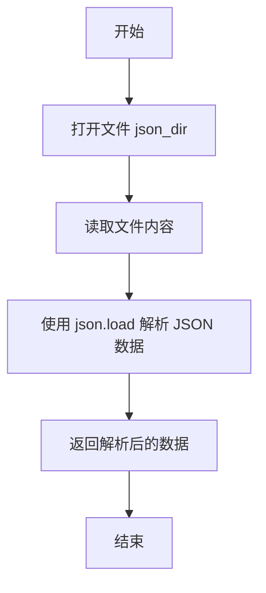

#### 带注释源码

```python
    @staticmethod
    def load_json_data(json_dir):
        # 打开指定路径的 JSON 文件，模式为只读 ('r')
        with open(json_dir, "r") as file:
            # 使用 json.load 方法读取并解析文件内容为 Python 对象
            json_data = json.load(file)
            # 返回解析后的数据
            return json_data
```

### `InstructionGenerator._random_sample`

从给定的分析列表中随机抽取指定数量的样本。

参数：

- `analysis`：`list`，包含分析数据的列表
- `num_samples`：`int`，需要抽取的样本数量

返回值：`list`，随机抽取的样本列表

#### 流程图

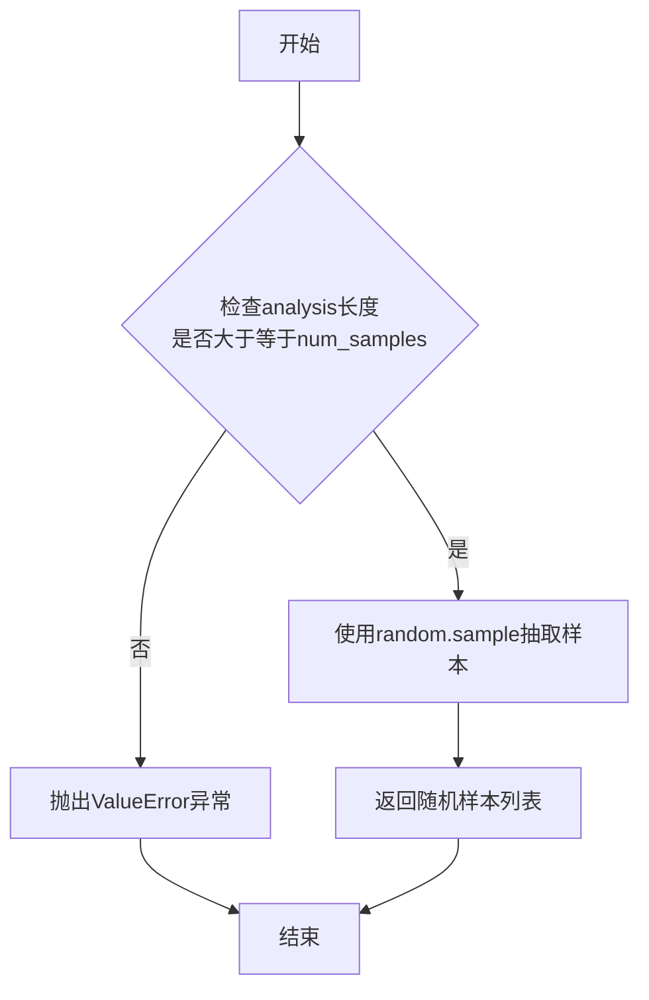

#### 带注释源码

```python
@staticmethod
def _random_sample(analysis, num_samples):
    # 使用random.sample从analysis列表中随机抽取num_samples个样本
    # 注意：random.sample要求num_samples不能超过analysis的长度
    return random.sample(analysis, num_samples)
```

### `InstructionGenerator.sample_instruction_set`

该方法用于从给定的数据列表中，按任务ID（`task_id`）分组，并从每个任务组中随机抽取一个条目，最终组成一个指令集。其核心功能是实现一种分层随机抽样，确保每个任务至少有一个代表指令被选中，同时保持随机性。

参数：

- `data`：`list`，包含多个字典的列表，每个字典至少应包含`task_id`键，用于标识任务归属。

返回值：`list`，返回一个列表，其中每个元素是从对应`task_id`组中随机选择的一个字典，代表一个指令集。

#### 流程图

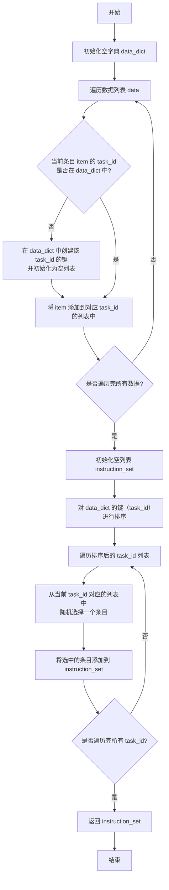

#### 带注释源码

```python
@staticmethod
def sample_instruction_set(data):
    # 初始化一个空字典，用于按 task_id 分组存储数据
    data_dict = {}
    # 遍历输入的数据列表
    for item in data:
        # 获取当前条目的任务ID
        task_id = item["task_id"]
        # 如果该 task_id 尚未在字典中，则为其创建一个空列表
        if task_id not in data_dict:
            data_dict[task_id] = []
        # 将当前条目添加到对应 task_id 的列表中
        data_dict[task_id].append(item)
    # 初始化一个空列表，用于存储最终选出的指令集
    instruction_set = []
    # 对字典的键（即 task_id）进行排序，以确保输出顺序的一致性
    for task_id in sorted(data_dict.keys()):
        # 从当前 task_id 对应的列表中随机选择一个条目
        instruction_set.append(random.choice(data_dict[task_id]))
    # 返回构建好的指令集
    return instruction_set
```

### `InstructionGenerator.format_output`

`format_output` 是一个静态方法，用于将传入的 JSON 字符串响应（`rsp`）解析并重新格式化为一个包含“Insights”键的字典列表。它主要用于处理从外部（如LLM）获取的JSON格式的洞察数据，并将其包装成程序内部期望的统一数据结构。

参数：

- `rsp`：`str`，一个包含JSON格式数据的字符串，通常是从语言模型或其他API获取的原始响应。

返回值：`list`，返回一个列表，列表中的每个元素是一个字典。该字典包含一个键`"Insights"`，其值为解析`rsp`后得到的JSON对象（`dict`）。

#### 流程图

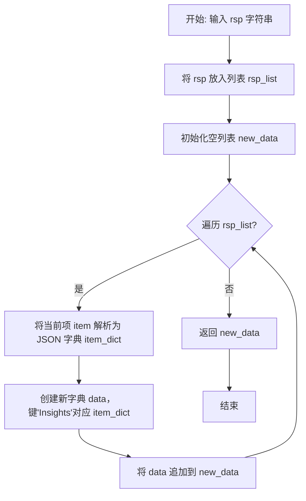

#### 带注释源码

```python
    @staticmethod
    def format_output(rsp):
        # 1. 初始化一个列表，将输入的单个响应字符串包装起来。
        #    这样做是为了统一处理流程，即使只有一个输入也视为列表。
        rsp_list = []
        new_data = []
        rsp_list.append(rsp)

        # 2. 遍历响应列表（目前只有一个元素）。
        for item in rsp_list:
            # 3. 将字符串形式的JSON响应解析为Python字典对象。
            item_dict = json.loads(item)
            # 4. 按照内部数据结构要求，创建一个新的字典。
            #    将解析后的洞察数据放在'Insights'键下。
            data = {
                "Insights": item_dict,
            }
            # 5. 将格式化后的数据添加到结果列表中。
            new_data.append(data)
        # 6. 返回包含格式化后数据的列表。
        return new_data
```

### `InstructionGenerator.load_insight_pool`

该方法用于从指定的JSON文件路径加载洞察（insight）数据池，并根据参数决定是否合并固定的洞察数据。它还可以根据给定的任务ID（task_id）对数据进行筛选。

参数：

- `file_path`：`str`，包含洞察数据的JSON文件的路径。
- `use_fixed_insights`：`bool`，指示是否将固定的洞察数据合并到加载的数据中。
- `task_id`：`int` 或 `None`，可选参数，用于筛选特定任务ID的洞察数据。如果为None，则返回所有数据。

返回值：`list`，返回一个包含洞察数据的列表。每个元素是一个字典，至少包含`task_id`键。

#### 流程图

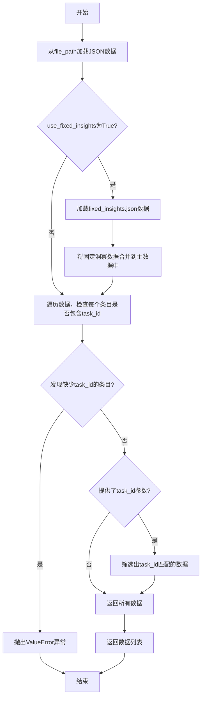

#### 带注释源码

```python
@staticmethod
def load_insight_pool(file_path, use_fixed_insights, task_id=None):
    # 1. 从给定的文件路径加载JSON数据
    data = InstructionGenerator.load_json_data(file_path)
    
    # 2. 如果use_fixed_insights标志为True，则加载并合并固定的洞察数据
    if use_fixed_insights:
        current_directory = os.path.dirname(__file__)
        fixed_insights = InstructionGenerator.load_json_data(f"{current_directory}/fixed_insights.json")
        data.extend(fixed_insights)
    
    # 3. 数据完整性检查：确保加载的每个数据条目都包含'task_id'字段
    for item in data:
        if "task_id" not in item:
            raise ValueError("task_id is not found in the insight_pool")
    
    # 4. 如果提供了task_id参数，则筛选出与该ID匹配的数据条目
    if task_id:
        data = [item for item in data if int(item["task_id"]) == int(task_id)]
    
    # 5. 返回处理后的数据列表
    return data
```

### `InstructionGenerator.generate_new_instructions`

该方法根据给定的任务ID、原始指令和最大生成数量，结合已有的洞察（insights）池，生成一系列新的指令。如果洞察池为空，则直接使用原始指令作为新指令；否则，它会从洞察池中依次取出洞察，通过调用`generate_new_instruction`方法生成新的指令，并收集到列表中返回。

参数：

- `task_id`：`int`，任务ID，用于标识当前任务。
- `original_instruction`：`str`，原始指令，作为生成新指令的基础。
- `max_num`：`int`，最大生成数量，指定需要生成的新指令数量。
- `ext_info`：`Optional[Any]`，扩展信息，可选参数，用于传递额外的上下文信息。

返回值：`List[str]`，返回一个字符串列表，包含生成的新指令。

#### 流程图

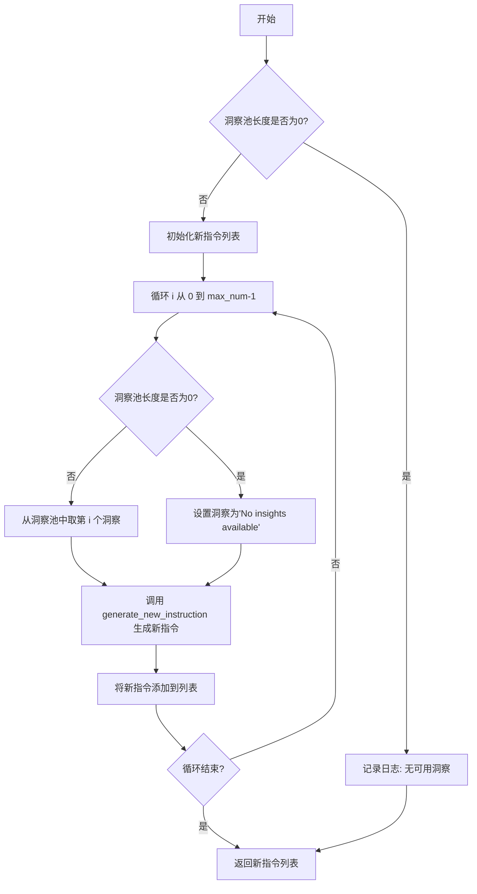

#### 带注释源码

```python
async def generate_new_instructions(self, task_id, original_instruction, max_num, ext_info=None):
    # 获取当前实例的洞察池
    data = self.insight_pool
    # 初始化新指令列表
    new_instructions = []
    # 如果洞察池为空，记录日志
    if len(data) == 0:
        mcts_logger.log("MCTS", f"No insights available for task {task_id}")
        # 可以选择直接返回原始指令，但当前代码注释掉了该行
        # return [original_instruction]  # Return the original instruction if no insights are available
    # 循环生成指定数量的新指令
    for i in range(max_num):
        # 如果洞察池为空，设置洞察为默认文本
        if len(data) == 0:
            insights = "No insights available"
        else:
            # 从洞察池中取出第 i 个洞察
            item = data[i]
            insights = item["Analysis"]
        # 调用静态方法生成新指令
        new_instruction = await InstructionGenerator.generate_new_instruction(
            original_instruction, insights, ext_info
        )
        # 将生成的新指令添加到列表
        new_instructions.append(new_instruction)
    # 返回生成的新指令列表
    return new_instructions
```

### `InstructionGenerator.propose_new_insights`

该方法用于根据给定的解决方案（代码）及其评估分数，通过调用`SolutionDesigner`来生成新的、潜在的改进见解（insights）。它会过滤掉与现有见解池中内容高度相似的见解，并将新的、独特的见解添加到池中，最后返回这些新增的见解列表。

参数：

- `solution`：`str`，待评估和改进的解决方案代码。
- `score`：`float`，该解决方案的评估分数。

返回值：`list`，返回一个包含新增见解（字典格式）的列表。

#### 流程图

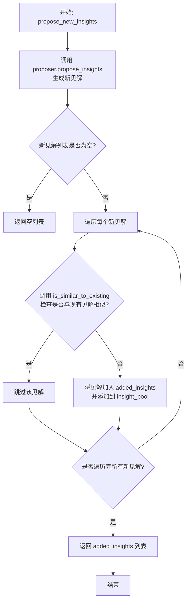

#### 带注释源码

```python
async def propose_new_insights(self, solution, score):
    # 1. 调用 SolutionDesigner 实例的 propose_insights 方法，传入解决方案和分数，异步生成新的见解列表。
    new_insights = await self.proposer.propose_insights(solution, score)
    # 2. 调用内部方法 add_insight，将新生成的见解列表传入，进行去重和添加操作。
    added_insights = self.add_insight(new_insights)
    # 3. 返回经过过滤后实际被添加到见解池中的新见解列表。
    return added_insights
```

### `InstructionGenerator.generate_solutions_from_scratch`

该方法用于在没有任何现有洞察（insight）池的情况下，为给定的数据集生成初始的解决方案洞察。它通过调用`SolutionDesigner`的`generate_solutions`方法来实现，该方法可能基于数据集信息和任务描述，利用LLM或其他分析技术生成一系列初始的、基础的解决方案或洞察。

参数：

- `dataset_info`：`str` 或 `dict`，数据集的描述信息。如果使用自定义数据集，则为`description.md`文件的内容字符串；否则为从`dataset_info.json`加载的字典。
- `dataset_name`：`str`，数据集的名称，用于在生成解决方案时进行标识或上下文引用。

返回值：`list`，返回一个包含生成的初始洞察（insight）对象的列表。每个洞察对象通常是一个字典，可能包含如`Analysis`（分析内容）、`task_id`（关联的任务ID）等字段。

#### 流程图

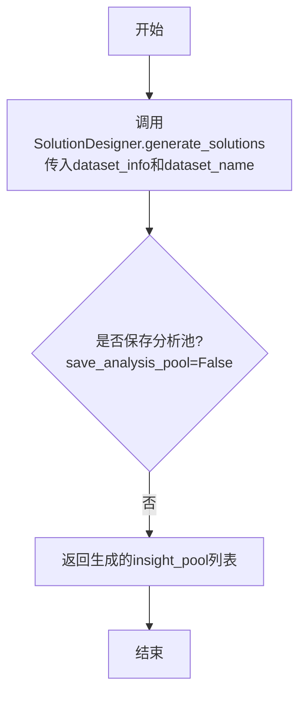

#### 带注释源码

```python
async def generate_solutions_from_scratch(self, dataset_info, dataset_name):
    # 调用SolutionDesigner实例的generate_solutions方法，传入数据集信息和名称。
    # 参数`save_analysis_pool=False`表示不将生成的洞察保存到持久化存储中，仅返回内存中的列表。
    insight_pool = await self.proposer.generate_solutions(dataset_info, dataset_name, save_analysis_pool=False)
    # 将生成的初始洞察池返回给调用者。
    return insight_pool
```

### `InstructionGenerator.add_insight`

该方法用于向`insight_pool`（洞察池）中添加新的洞察（`new_insights`）。它会遍历传入的新洞察列表，对于每一个新洞察，首先检查其与洞察池中现有洞察的相似度。只有当新洞察与所有现有洞察的相似度都低于预设的阈值（`similarity_threshold`，默认为0.8）时，才会将其添加到洞察池中。最终，该方法返回一个列表，包含所有成功添加的新洞察。

参数：
- `new_insights`：`list`，一个包含新洞察字典的列表。每个字典应至少包含一个`"Analysis"`键，其值为该洞察的分析文本。

返回值：`list`，一个列表，包含所有成功添加到`self.insight_pool`中的新洞察字典。

#### 流程图

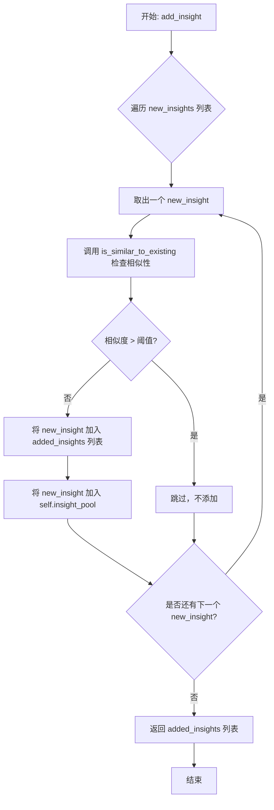

#### 带注释源码

```python
def add_insight(self, new_insights):
    # 初始化一个空列表，用于存储成功添加的新洞察
    added_insights = []
    # 遍历传入的新洞察列表
    for new_insight in new_insights:
        # 检查当前新洞察是否与洞察池中现有洞察相似
        if not self.is_similar_to_existing(new_insight):
            # 如果不相似，将其添加到成功添加的列表中
            added_insights.append(new_insight)
            # 同时将其添加到类的洞察池中
            self.insight_pool.append(new_insight)
    # 返回所有成功添加的新洞察列表
    return added_insights
```

### `InstructionGenerator.is_similar_to_existing`

该方法用于判断新生成的洞察（`new_insight`）是否与洞察池（`insight_pool`）中已有的洞察过于相似。它通过计算新洞察的“分析”文本（`Analysis`）与池中每个现有洞察的“分析”文本之间的相似度来实现。如果相似度超过预设的阈值（默认为0.8），则认为新洞察与现有洞察相似，返回 `True`；否则，遍历完整个洞察池后返回 `False`。

参数：

- `new_insight`：`dict`，包含新洞察信息的字典，其中必须包含键为 `"Analysis"` 的文本字段。
- `similarity_threshold`：`float`，可选参数，默认为 `0.8`。用于判断两个洞察是否相似的阈值。相似度高于此阈值则判定为相似。

返回值：`bool`，如果新洞察与洞察池中任一现有洞察的相似度超过阈值，则返回 `True`，表示相似；否则返回 `False`，表示不相似。

#### 流程图

```mermaid
flowchart TD
    A[开始：is_similar_to_existing] --> B{遍历 insight_pool 中的<br>每个 existing_insight}
    B --> C[计算 new_insight['Analysis']<br>与 existing_insight['Analysis']<br>的相似度]
    C --> D{相似度 > 阈值？}
    D -- 是 --> E[返回 True]
    D -- 否 --> B
    B -- 遍历结束 --> F[返回 False]
```

#### 带注释源码

```python
def is_similar_to_existing(self, new_insight, similarity_threshold=0.8):
    """
    检查新洞察是否与洞察池中已有的洞察相似。

    该方法遍历当前实例的洞察池（`self.insight_pool`），
    将新洞察的“分析”文本与池中每个现有洞察的“分析”文本进行比较。
    如果任何一对文本的相似度超过给定的阈值，则返回 True，表示新洞察与现有洞察相似。
    否则，返回 False。

    Args:
        new_insight (dict): 新生成的洞察，必须包含键为 "Analysis" 的文本字段。
        similarity_threshold (float, optional): 判断相似的阈值。默认为 0.8。

    Returns:
        bool: 如果新洞察与任何现有洞察相似，则为 True；否则为 False。
    """
    # 遍历洞察池中的所有现有洞察
    for existing_insight in self.insight_pool:
        # 计算新洞察与当前现有洞察的“分析”文本之间的相似度
        similarity = self.calculate_similarity(new_insight["Analysis"], existing_insight["Analysis"])
        # 如果相似度超过阈值，立即返回 True，表示找到相似洞察
        if similarity > similarity_threshold:
            return True
    # 如果遍历完所有洞察都未超过阈值，返回 False，表示新洞察是独特的
    return False
```

### `InstructionGenerator.calculate_similarity`

该方法是一个静态工具方法，用于计算两段文本之间的相似度。它基于Python标准库`difflib`中的`SequenceMatcher`类，通过比较两个字符串的序列匹配程度，返回一个介于0.0到1.0之间的相似度分数，其中1.0表示完全相同。

参数：

- `text1`：`str`，需要比较的第一段文本。
- `text2`：`str`，需要比较的第二段文本。

返回值：`float`，一个介于0.0到1.0之间的浮点数，表示`text1`和`text2`的相似度。

#### 流程图

```mermaid
flowchart TD
    A[开始] --> B[接收参数 text1, text2]
    B --> C[创建SequenceMatcher对象<br/>传入text1和text2]
    C --> D[调用.ratio()方法计算相似度]
    D --> E[返回相似度分数]
    E --> F[结束]
```

#### 带注释源码

```python
    @staticmethod
    def calculate_similarity(text1, text2):
        # 使用difflib.SequenceMatcher计算两个字符串的相似度
        # SequenceMatcher(None, a, b) 创建一个比较器，None表示使用默认的字符匹配算法
        # .ratio() 方法返回一个[0.0, 1.0]的浮点数，表示两个序列的相似度
        return SequenceMatcher(None, text1, text2).ratio()
```

### `InstructionGenerator.generate_new_instruction`

该方法是一个静态异步方法，用于根据给定的原始指令和洞察信息，生成一条新的、改进后的指令。它通过调用大语言模型（LLM），基于一个结构化的提示词模板，将原始指令和洞察信息融合，从而产生一个优化后的新指令。

参数：

- `original_instruction`：`str`，原始的指令文本。
- `insights`：`str`，用于改进原始指令的洞察或分析信息。
- `ext_info`：`Any`，扩展信息，在当前方法实现中未使用。

返回值：`str`，由LLM生成的新指令文本。

#### 流程图

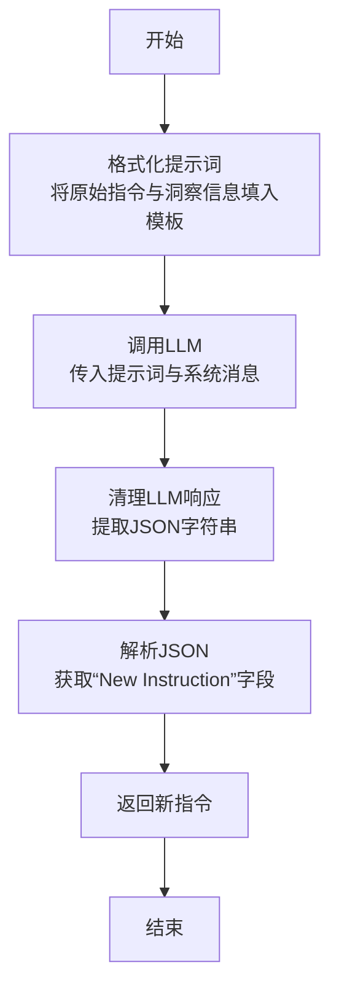

#### 带注释源码

```python
    @staticmethod
    async def generate_new_instruction(original_instruction, insights, ext_info):
        # 1. 格式化提示词：将原始指令和洞察信息填充到预定义的模板中。
        prompt = CHANGE_INSTRUCTION.format(instruction=original_instruction, insights=insights)
        # 2. 初始化LLM客户端。
        llm = LLM()
        # 3. 将用户提示词包装成Message对象，并格式化为LLM可接受的上下文。
        context = llm.format_msg([Message(content=prompt, role="user")])
        # 4. 异步调用LLM，传入上下文和系统角色定义（REFLECTION_SYSTEM_MSG）。
        llm_response = await llm.aask(context, system_msgs=[REFLECTION_SYSTEM_MSG])
        # 5. 清理LLM的响应，提取出其中的JSON格式字符串。
        rsp = clean_json_from_rsp(llm_response)
        # 6. 解析JSON字符串，并从中提取“New Instruction”字段的值作为新指令。
        new_instruction = json.loads(rsp)["New Instruction"]
        # 7. 返回生成的新指令。
        return new_instruction
```

## 关键组件


### 数据集信息加载与配置管理

负责根据实验状态加载数据集描述信息，支持自定义数据集和预配置数据集的灵活切换，并通过全局配置对象管理数据路径。

### 洞察池（Insight Pool）管理

维护一个包含任务分析结果的洞察集合，支持从文件加载、从零生成、动态添加新洞察以及基于相似性去重的完整生命周期管理。

### 指令生成引擎

基于LLM驱动的指令重构系统，将原始指令与领域洞察结合，通过结构化提示模板生成优化后的新指令，支持外部信息扩展。

### 解决方案设计器集成

封装SolutionDesigner代理的协作接口，提供从零生成解决方案和基于反馈提出新洞察的两阶段能力。

### 相似性检测机制

采用SequenceMatcher算法计算文本相似度，防止洞察池中出现高度重复的分析内容，确保多样性。

### 实验状态驱动的工作流

根据`from_scratch`标志决定初始化路径，支持全新生成和基于历史文件的延续实验两种模式。


## 问题及建议


### 已知问题

-   **硬编码的相似度阈值**：`is_similar_to_existing` 方法中使用了固定的相似度阈值 `0.8`，缺乏灵活性，可能不适用于所有类型的洞察文本比较场景。
-   **潜在的无限循环风险**：`generate_new_instructions` 方法中，当 `max_num` 大于可用洞察数量时，循环索引 `i` 可能超出 `data` 列表的范围，导致 `IndexError`。
-   **错误处理不完善**：`load_insight_pool` 方法中，当 `task_id` 参数传入时，如果 `data` 列表为空或没有匹配项，会返回空列表，但调用方 `generate_new_instructions` 仅检查 `len(data) == 0`，未考虑 `task_id` 过滤后为空的情况，可能导致逻辑混淆。
-   **资源管理**：`load_json_data` 和文件打开操作使用了基本的 `open` 而没有显式的异常处理或上下文管理器（虽然 `with open` 是上下文管理器，但更外层的错误处理可以更完善），例如文件不存在或 JSON 格式错误时，异常会直接抛出，中断程序。
-   **代码重复**：`load_json_data` 静态方法在 `load_insight_pool` 中被调用，但 `initialize` 方法中加载 `dataset_info` 时又重复了类似的 JSON 加载和文件打开逻辑。
-   **状态管理模糊**：`from_scratch` 标志的初始化逻辑（`if self.file_path is None: self.from_scratch = True`）与构造函数参数 `from_scratch` 可能存在冲突，依赖调用方正确理解。
-   **LLM 调用缺乏配置**：`generate_new_instruction` 方法中直接实例化 `LLM()`，没有传入任何配置参数（如模型类型、温度等），这依赖于全局默认配置，降低了方法的可定制性和可测试性。

### 优化建议

-   **使相似度阈值可配置**：将 `similarity_threshold` 作为 `add_insight` 或 `is_similar_to_existing` 方法的参数，或作为类属性，以提高灵活性。
-   **修复循环逻辑**：修改 `generate_new_instructions` 中的循环，确保索引安全。例如，使用 `for i in range(min(max_num, len(data))):` 或先对 `data` 进行切片。
-   **增强错误处理和日志**：在文件操作和 JSON 解析处添加更具体的异常捕获（如 `FileNotFoundError`, `json.JSONDecodeError`）并记录日志。在 `load_insight_pool` 中，当根据 `task_id` 过滤后结果为空时，可以记录一条警告日志。
-   **统一数据加载逻辑**：创建一个更通用的数据加载辅助函数，处理文件路径解析、打开、读取、JSON 解析及错误处理，替代多处重复的代码。
-   **明确状态初始化逻辑**：重构构造函数中关于 `from_scratch` 的判断逻辑，使其更清晰。例如，优先使用传入的参数，仅当路径为空且参数未指定时才设置为 `True`，并添加日志说明。
-   **解耦 LLM 依赖**：考虑将 `LLM` 实例作为参数传入 `generate_new_instruction` 静态方法，或通过依赖注入的方式提供给 `InstructionGenerator` 类，以提高可测试性和灵活性。
-   **添加类型注解**：为方法参数和返回值添加详细的类型注解（Type Hints），可以提高代码的可读性和 IDE 支持，并方便进行静态类型检查。
-   **考虑性能优化**：`is_similar_to_existing` 方法在洞察池较大时可能成为性能瓶颈，因为需要与池中每个现有洞察进行相似度计算。可以考虑使用更高效的文本相似度算法（如 TF-IDF 向量化后计算余弦相似度）或引入缓存机制。


## 其它


### 设计目标与约束

本模块的核心设计目标是基于给定的数据集信息和任务描述，动态生成或演化出用于指导机器学习模型训练的“指令”。它通过分析现有解决方案的“洞察”，并利用大语言模型（LLM）的生成能力，将原始指令与洞察结合，创造出性能可能更优的新指令。主要约束包括：1) 依赖外部LLM服务进行指令生成，存在网络延迟和成本考量；2) 洞察池的相似性去重逻辑基于文本相似度，可能无法完全捕捉语义上的重复或新颖性；3) 从零开始生成洞察时，依赖于`SolutionDesigner`组件的输出质量和稳定性。

### 错误处理与异常设计

代码中显式的错误处理较少，主要依赖于Python的默认异常传播机制。关键点包括：
1.  **文件读取错误**：在`__init__`和`load_json_data`方法中，使用`with open(...)`进行文件操作，若文件不存在或格式错误，会抛出`FileNotFoundError`或`json.JSONDecodeError`，这些异常会向上层调用者传播。
2.  **数据完整性校验**：在`load_insight_pool`方法中，会检查加载的数据中是否包含`task_id`字段，若缺失则抛出`ValueError`。
3.  **LLM调用错误**：在`generate_new_instruction`静态方法中，`llm.aask`的调用可能因网络或API问题失败，会抛出异步异常。`clean_json_from_rsp`函数可能因LLM返回非JSON格式而失败。
4.  **静默处理**：在`generate_new_instructions`方法中，当洞察池为空时，会记录日志并继续执行，将“No insights available”作为洞察传递给LLM，这可能导致生成无意义的指令，属于一种降级处理策略。

### 数据流与状态机

1.  **初始化数据流**：
    *   **输入**：`state`（包含实验池路径、自定义数据集目录、任务、数据集配置）、`use_fixed_insights`、`from_scratch`标志。
    *   **处理**：根据`from_scratch`标志，选择从零生成洞察池(`generate_solutions_from_scratch`)或从文件加载洞察池(`load_insight_pool`)。
    *   **输出/状态**：初始化后的`InstructionGenerator`实例，其`insight_pool`属性被填充。

2.  **指令生成数据流**：
    *   **触发**：调用`generate_new_instructions`方法。
    *   **输入**：`task_id`、`original_instruction`、`max_num`、`ext_info`。
    *   **处理**：从`insight_pool`中按索引顺序（或使用“No insights”）获取洞察，为每个洞察调用`generate_new_instruction`静态方法。该方法构造提示词，调用LLM，解析返回的JSON以获取新指令。
    *   **输出**：一个包含`max_num`条新指令的列表。

3.  **洞察演化数据流**：
    *   **触发**：调用`propose_new_insights`方法（通常在外部评估一个解决方案后）。
    *   **输入**：`solution`（解决方案描述）、`score`（评估分数）。
    *   **处理**：通过`SolutionDesigner.propose_insights`生成新洞察，然后通过`add_insight`方法进行去重后加入`insight_pool`。
    *   **输出**：实际被添加到池中的新洞察列表(`added_insights`)。

4.  **状态机**：`InstructionGenerator`实例的核心状态是`insight_pool`。它可以通过`initialize`初始化，通过`propose_new_insights`/`add_insight`动态增长。`generate_new_instructions`是只读操作，不改变内部状态。没有明确的“结束”状态。

### 外部依赖与接口契约

1.  **大语言模型 (LLM)**：
    *   **依赖**：`metagpt.llm.LLM` 类。
    *   **契约**：期望`LLM.aask`方法接受消息上下文和系统消息，并返回一个字符串格式的响应。响应内容需符合`CHANGE_INSTRUCTION`中定义的JSON格式，以便`clean_json_from_rsp`和`json.loads`能成功解析出`"New Instruction"`字段。

2.  **解决方案设计器 (SolutionDesigner)**：
    *   **依赖**：`metagpt.ext.sela.insights.solution_designer.SolutionDesigner` 类。
    *   **契约**：
        *   `generate_solutions`方法：接受`dataset_info`和`dataset_name`，返回一个洞察池（列表）。
        *   `propose_insights`方法：接受`solution`和`score`，返回一个新洞察列表。

3.  **工具函数**：
    *   `metagpt.ext.sela.utils.clean_json_from_rsp`：负责从LLM响应中提取干净的JSON字符串。
    *   `metagpt.ext.sela.utils.load_data_config`：加载数据配置。
    *   `metagpt.ext.sela.utils.mcts_logger`：提供日志记录功能。

4.  **数据文件**：
    *   **配置文件**：通过`load_data_config()`加载的`DATA_CONFIG`，用于定位数据集目录。
    *   **洞察池文件**：由`state[“exp_pool_path”]`指定，期望为JSON格式，每个条目包含`task_id`和`Analysis`等字段。
    *   **固定洞察文件**：`fixed_insights.json`，用于在`use_fixed_insights`为True时扩充洞察池。
    *   **数据集信息文件**：`dataset_info.json` 或 `description.md`，提供数据集的描述信息。

5.  **Python标准库**：`json`, `os`, `random`, `difflib.SequenceMatcher`。

### 配置与参数化

1.  **系统提示词**：`REFLECTION_SYSTEM_MSG` 定义了LLM在指令重写任务中的角色和目标。
2.  **指令变更模板**：`CHANGE_INSTRUCTION` 是一个多行字符串模板，用于构造发送给LLM的提示词，严格定义了输入（原始指令、洞察）和期望的JSON输出格式。
3.  **相似度阈值**：`is_similar_to_existing`方法中的`similarity_threshold`参数（默认0.8），控制着新洞察与现有洞察的文本相似度阈值，高于此阈值则视为重复。
4.  **数据配置**：`DATA_CONFIG` 全局变量，决定了数据集根目录等路径，影响数据集信息文件的加载位置。
5.  **运行参数**：`InstructionGenerator`构造函数的参数（`use_fixed_insights`, `from_scratch`）以及`generate_new_instructions`方法的`max_num`参数，共同控制着指令生成的行为和数量。

    