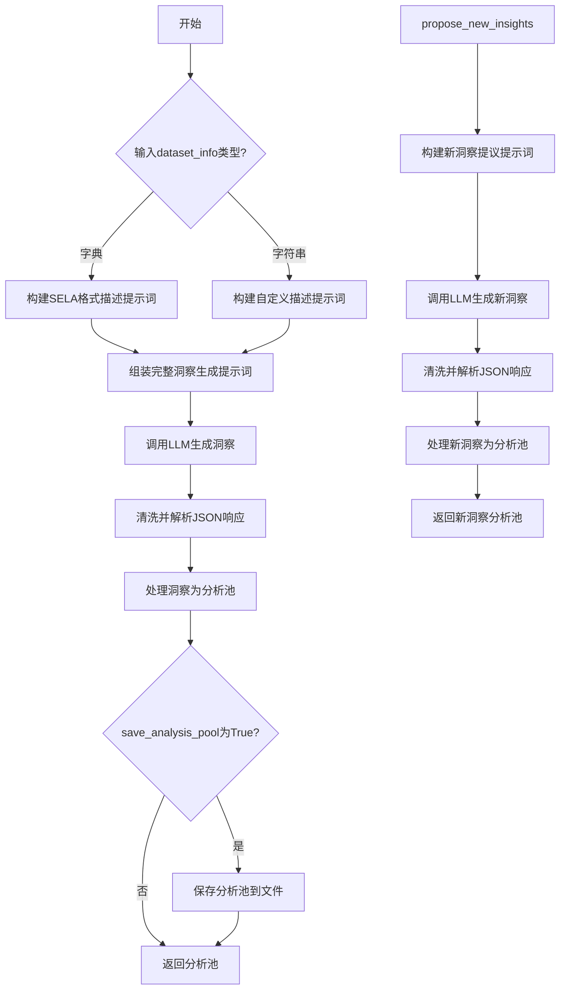
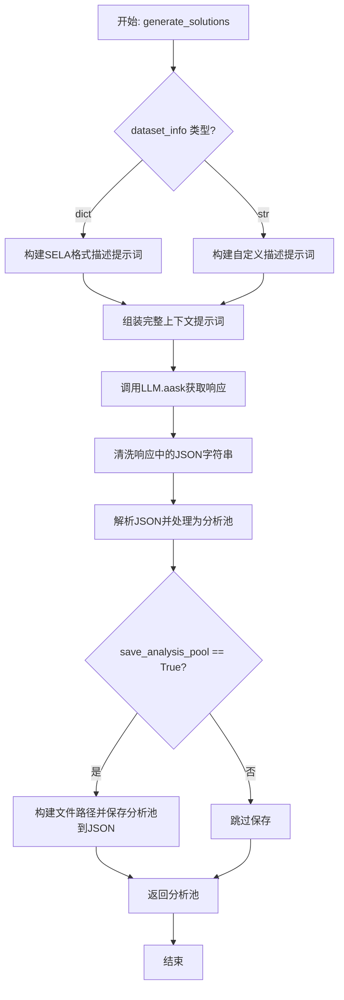
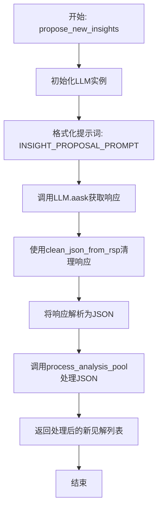
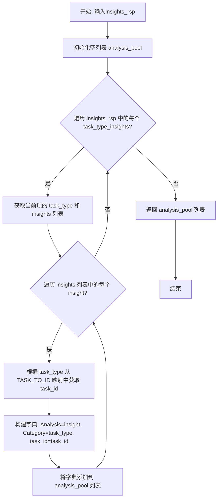
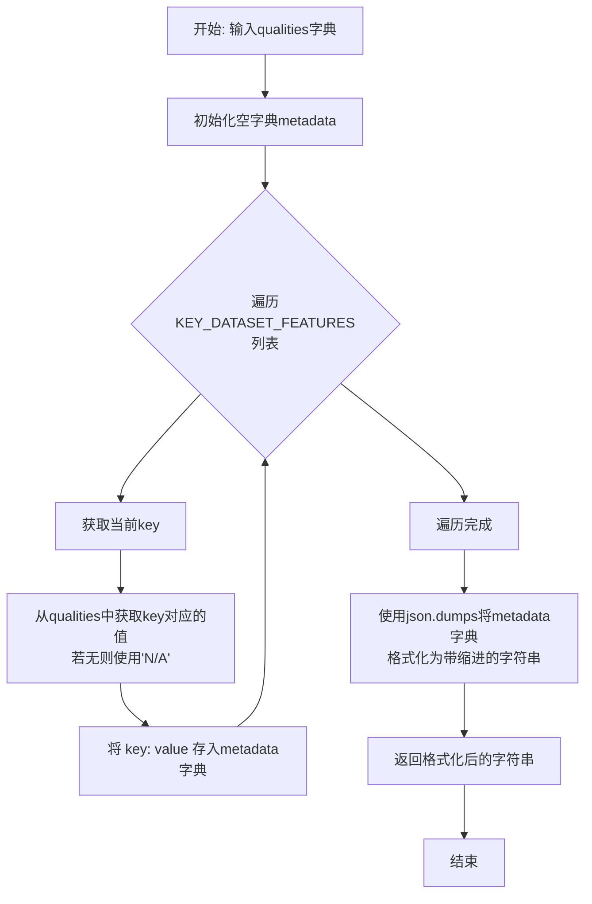

# `.\MetaGPT\metagpt\ext\sela\insights\solution_designer.py` 详细设计文档

该代码实现了一个机器学习解决方案设计器，核心功能是分析数据集信息，利用大语言模型（LLM）生成针对不同机器学习任务类型（如EDA、数据预处理、特征工程、模型训练）的性能改进洞察（insights），并能根据现有解决方案和评分提出新的改进建议。

## 整体流程



## 类结构

```
SolutionDesigner
├── 字段: data_dir
├── 方法: generate_solutions
├── 方法: propose_new_insights
├── 方法: process_analysis_pool
├── 方法: metadata_builder
└── 方法: save_analysis_pool
```

## 全局变量及字段


### `DATA_CONFIG`
    
通过 load_data_config() 函数加载的全局数据配置字典，包含项目运行所需的数据集路径等配置信息。

类型：`dict`
    


### `DATASET_DESCRIPTION_SELA_PROMPT`
    
用于构建 SELA 格式数据集描述的提示词模板，包含数据集描述、元数据和数据头部的占位符。

类型：`str`
    


### `DATASET_DESCRIPTION_CUSTOM_PROMPT`
    
用于构建自定义格式数据集描述的提示词模板，仅包含一个通用的数据集描述占位符。

类型：`str`
    


### `DATASET_INSIGHT_PROMPT`
    
用于指导大语言模型（LLM）为给定数据集生成改进模型性能的洞察（insights）的提示词模板，包含任务类型和输出格式要求。

类型：`str`
    


### `INSIGHT_PROPOSAL_PROMPT`
    
用于指导大语言模型（LLM）基于现有解决方案和开发分数，提出新的、可操作的改进洞察的提示词模板。

类型：`str`
    


### `KEY_DATASET_FEATURES`
    
一个字符串列表，定义了在构建数据集元数据时需要提取和展示的关键数据集特征（如实例数、特征数、缺失值数量等）。

类型：`list[str]`
    


### `TASK_TO_ID`
    
一个字典，将机器学习任务类型（如'EDA'，'Data Preprocessing'）映射到唯一的整数ID，用于在分析池（analysis pool）中标识任务类别。

类型：`dict[str, int]`
    


### `SolutionDesigner.data_dir`
    
SolutionDesigner 类的实例字段，存储从 DATA_CONFIG 中获取的数据集根目录路径，用于定位和保存数据集相关的分析结果文件。

类型：`str`
    
    

## 全局函数及方法

### `SolutionDesigner.generate_solutions`

该方法根据给定的数据集信息，利用大语言模型（LLM）生成针对不同机器学习任务类型（如EDA、数据预处理、特征工程、模型训练）的改进见解（insights）池，并可选择性地将结果保存到文件中。

参数：

- `dataset_info`：`Union[dict, str]`，数据集信息。如果为字典类型，则期望包含`description`、`metadata`和`df_head`键；如果为字符串类型，则直接作为数据集描述。
- `dataset_name`：`str`，数据集的名称，用于构建保存文件的路径。
- `save_analysis_pool`：`bool`，可选参数，默认为`True`。指示是否将生成的见解池保存到JSON文件中。

返回值：`list[dict]`，返回一个分析池列表。列表中的每个元素是一个字典，包含`Analysis`（具体见解）、`Category`（任务类型）和`task_id`（任务类型对应的数字ID）三个键。

#### 流程图



#### 带注释源码

```python
async def generate_solutions(self, dataset_info, dataset_name, save_analysis_pool=True):
    # 1. 初始化LLM实例
    llm = LLM()
    
    # 2. 根据输入的数据集信息类型，构建不同的描述性提示词
    if type(dataset_info) == dict:
        # 2.1 如果输入是字典，使用SELA格式的模板，填充数据集描述、元数据和数据头部
        description_prompt = DATASET_DESCRIPTION_SELA_PROMPT.format(
            dataset=dataset_info["description"],
            metadata=self.metadata_builder(dataset_info["metadata"]),
            head=dataset_info["df_head"],
        )
    else:
        # 2.2 如果输入是字符串，直接使用自定义描述模板
        description_prompt = DATASET_DESCRIPTION_CUSTOM_PROMPT.format(dataset_description=dataset_info)
    
    # 3. 将构建好的数据集描述插入到核心指令提示词模板中，形成完整的上下文
    context = DATASET_INSIGHT_PROMPT.format(description=description_prompt)
    
    # 4. 异步调用大语言模型，获取关于数据集改进见解的响应
    rsp = await llm.aask(context)
    
    # 5. 清洗响应文本，提取出格式化的JSON字符串部分
    rsp = clean_json_from_rsp(rsp)
    
    # 6. 将JSON字符串解析为Python对象（列表），并处理成标准化的分析池结构
    analysis_pool = self.process_analysis_pool(json.loads(rsp))
    
    # 7. 根据参数决定是否将分析池保存到文件
    if save_analysis_pool:
        # 7.1 构建数据集对应的目录路径
        dataset_path = f"{self.data_dir}/{dataset_name}"
        # 7.2 调用保存方法，将分析池写入JSON文件
        self.save_analysis_pool(dataset_path, analysis_pool)
    
    # 8. 返回生成的分析池列表
    return analysis_pool
```

### `SolutionDesigner.propose_new_insights`

该方法根据给定的机器学习解决方案代码和开发分数，利用大语言模型（LLM）生成新的、可操作的改进见解，以提升模型性能。它属于解决方案设计流程的一部分，旨在迭代式地优化现有方案。

参数：

- `solution`：`str`，当前的机器学习解决方案代码。
- `score`：`str`，当前解决方案的开发分数或评估分数。

返回值：`list`，一个包含新见解的列表，列表中的每个元素是一个字典，包含 `Analysis`（见解内容）、`Category`（任务类型）和 `task_id`（任务ID）。

#### 流程图



#### 带注释源码

```python
async def propose_new_insights(self, solution, score):
    # 1. 初始化大语言模型（LLM）客户端
    llm = LLM()
    
    # 2. 构建提示词（Prompt）上下文。
    #    将当前的解决方案代码（solution）和开发分数（score）填充到预定义的提示词模板中。
    context = INSIGHT_PROPOSAL_PROMPT.format(solution_code=solution, dev_score=score)
    
    # 3. 异步调用LLM，向其发送构建好的提示词，并等待其生成文本响应。
    rsp = await llm.aask(context)
    
    # 4. 清理LLM的响应。
    #    `clean_json_from_rsp` 函数通常用于移除响应中可能存在的代码块标记（如 ```json ... ```）或多余的空格/换行。
    rsp = clean_json_from_rsp(rsp)
    
    # 5. 将清理后的响应字符串解析为Python的JSON对象（在这里预期是一个列表）。
    # 6. 调用 `process_analysis_pool` 方法处理解析后的JSON数据。
    #    该方法会将JSON结构（按任务类型组织的见解列表）转换为程序内部使用的统一分析池格式。
    new_insights = self.process_analysis_pool(json.loads(rsp))
    
    # 7. 返回处理后的新见解列表。
    return new_insights
```

### `SolutionDesigner.process_analysis_pool`

该方法用于处理从LLM（大语言模型）获取的洞察力（insights）响应，将其从按任务类型分组的原始JSON格式，转换为一个扁平化的分析池（analysis pool）列表。每个列表项包含洞察内容、所属类别以及对应的任务ID。

参数：

- `insights_rsp`：`list`，从LLM返回的JSON解析后的列表。列表中的每个元素是一个字典，包含`task_type`和`insights`两个键。`insights`是一个字符串列表。

返回值：`list`，返回一个字典列表。每个字典包含三个键：`"Analysis"`（洞察内容字符串）、`"Category"`（任务类型字符串）和`"task_id"`（任务类型对应的整数ID）。

#### 流程图



#### 带注释源码

```python
def process_analysis_pool(self, insights_rsp):
    # 初始化一个空列表，用于存储最终的分析池数据
    analysis_pool = []
    # 遍历输入的洞察力响应列表，每个元素代表一个任务类型及其对应的洞察列表
    for task_type_insights in insights_rsp:
        # 从当前字典中获取任务类型，例如 "Data Preprocessing"
        task_type = task_type_insights["task_type"]
        # 遍历当前任务类型下的所有洞察（字符串列表）
        for insight in task_type_insights["insights"]:
            # 为每一条洞察构建一个标准化的字典项
            # 包含洞察内容、所属类别以及从全局映射表获取的任务ID
            analysis_pool.append({"Analysis": insight, "Category": task_type, "task_id": TASK_TO_ID[task_type]})
    # 返回扁平化处理后的分析池列表
    return analysis_pool
```

### `SolutionDesigner.metadata_builder`

该方法用于从给定的数据集质量信息字典中，提取并格式化一组关键特征，生成一个结构化的JSON字符串作为数据集的元数据摘要。

参数：
- `qualities`：`dict`，包含数据集各种质量指标和特征的原始字典。

返回值：`str`，一个格式化的JSON字符串，其中包含了从输入字典中筛选出的关键数据集特征。

#### 流程图



#### 带注释源码

```python
def metadata_builder(self, qualities):
    # 初始化一个空字典，用于存储筛选后的元数据
    metadata = {}
    # 遍历预定义的关键数据集特征列表
    for key in KEY_DATASET_FEATURES:
        # 从输入的qualities字典中获取当前key对应的值。
        # 如果key不存在于qualities中，则使用默认值'N/A'。
        metadata[key] = qualities.get(key, "N/A")
    # 将metadata字典转换为格式美观（缩进为4个空格）的JSON字符串
    metadata_text = json.dumps(metadata, indent=4)
    # 返回格式化后的JSON字符串
    return metadata_text
```

### `SolutionDesigner.save_analysis_pool`

该方法用于将分析池（`analysis_pool`）数据以 JSON 格式保存到指定数据集路径下的 `ds_analysis_pool.json` 文件中。

参数：

- `dataset_path`：`str`，目标数据集的存储路径。
- `analysis_pool`：`list`，包含分析洞察信息的列表，列表中的每个元素是一个字典，通常包含 `Analysis`、`Category` 和 `task_id` 等键。

返回值：`None`，此方法不返回任何值。

#### 流程图

```mermaid
flowchart TD
    A[开始] --> B[构造文件完整路径<br>fpath = f"{dataset_path}/ds_analysis_pool.json"]
    B --> C[以写入模式打开文件]
    C --> D[使用 json.dump 将 analysis_pool 写入文件<br>并设置缩进为 4]
    D --> E[关闭文件]
    E --> F[结束]
```

#### 带注释源码

```python
def save_analysis_pool(self, dataset_path, analysis_pool):
    # 构造目标文件的完整路径，文件名为 ds_analysis_pool.json
    fpath = f"{dataset_path}/ds_analysis_pool.json"
    # 以写入模式（'w'）打开文件
    with open(fpath, "w") as file:
        # 使用 json.dump 方法将 analysis_pool 列表序列化为 JSON 格式并写入文件
        # indent=4 参数使生成的 JSON 文件具有缩进，便于阅读
        json.dump(analysis_pool, file, indent=4)
    # 方法执行完毕，with 语句会自动关闭文件，无返回值
```

## 关键组件


### 提示词模板引擎

定义了多个用于构建LLM提示词的字符串模板，用于引导LLM生成数据集洞察和解决方案改进建议。这些模板结构化地嵌入了数据集信息、解决方案代码和评估分数，并规定了LLM响应的JSON格式。

### 数据集特征提取器

通过`KEY_DATASET_FEATURES`列表和`metadata_builder`方法，从原始数据集元数据中提取并格式化关键统计特征（如类别数、特征数、实例数等），用于构建描述性提示词。

### 洞察处理器

包含`process_analysis_pool`方法，负责解析LLM返回的JSON格式的洞察列表，并将其转换为内部统一的结构化格式（`analysis_pool`），该格式将每条洞察与其任务类型和任务ID关联起来。

### 解决方案设计器

`SolutionDesigner`类是核心协调组件，它整合了提示词构建、LLM调用、响应解析和结果持久化的完整工作流。它根据输入的数据集信息类型（SELA格式或自定义描述）选择不同的提示词模板，生成初始解决方案洞察或基于现有方案提出改进建议。

### 数据持久化管理器

通过`save_analysis_pool`方法，将处理后的洞察池（`analysis_pool`）以JSON格式保存到指定的数据集目录下的文件中，实现了生成结果的可追溯性和离线使用。

### 任务类型映射器

通过`TASK_TO_ID`字典，将人类可读的任务类型名称（如“EDA”、“Data Preprocessing”）映射为内部的数字ID，用于在`analysis_pool`中标识每条洞察所属的任务阶段，便于后续的分类处理或优先级排序。


## 问题及建议


### 已知问题

-   **硬编码的提示词模板**：`DATASET_INSIGHT_PROMPT` 和 `INSIGHT_PROPOSAL_PROMPT` 等提示词模板直接以字符串形式硬编码在代码中。这导致模板难以维护、复用和根据不同场景（如不同任务类型、模型能力）进行动态调整。任何修改都需要直接更改源代码。
-   **脆弱的 JSON 解析**：`clean_json_from_rsp` 函数的功能和健壮性未知。代码直接假设其返回一个可被 `json.loads` 解析的、格式完美的 JSON 字符串。如果大语言模型（LLM）的响应格式稍有偏差（如包含额外的文本、JSON格式错误），`json.loads(rsp)` 将抛出异常，导致整个流程中断，缺乏容错机制。
-   **同步文件操作**：`save_analysis_pool` 方法使用同步的 `open` 和 `json.dump` 进行文件写入。当 `generate_solutions` 方法被异步调用时，此同步IO操作会阻塞事件循环，可能影响整个应用的并发性能和响应性。
-   **配置管理简单**：`DATA_CONFIG` 通过 `load_data_config()` 加载，但其使用方式（`DATA_CONFIG["datasets_dir"]`）是硬编码的。如果配置结构发生变化或需要支持多个配置键，代码需要相应修改，缺乏灵活性。
-   **错误处理缺失**：代码中几乎没有显式的错误处理（try-except）。例如，文件写入可能因权限不足或路径不存在而失败；网络请求（LLM调用）可能超时或返回错误；JSON解析可能失败。这些都会导致未处理的异常，使程序崩溃。
-   **潜在的循环依赖与紧耦合**：`SolutionDesigner` 类直接依赖 `metagpt.llm.LLM` 和 `metagpt.ext.sela.utils` 中的特定函数。这种紧耦合使得单元测试困难，并且难以替换底层组件（例如，更换LLM提供商或调整工具函数）。

### 优化建议

-   **外部化提示词模板**：将 `DATASET_INSIGHT_PROMPT`、`INSIGHT_PROPOSAL_PROMPT` 等提示词模板移至外部配置文件（如 YAML、JSON）或数据库中。可以创建一个 `PromptTemplateManager` 类来管理和渲染这些模板，支持变量插值、模板继承和版本管理，从而提高可维护性和灵活性。
-   **增强 JSON 解析的健壮性**：
    1.  在调用 `json.loads` 时添加 `try-except` 块，捕获 `json.JSONDecodeError`。
    2.  可以引入一个更鲁棒的解析函数，在 `clean_json_from_rsp` 的基础上，使用正则表达式或专门的库（如 `json_repair`）尝试从非标准响应中提取和修复 JSON 片段。
    3.  为解析失败设计降级策略，例如记录错误、返回空列表或使用默认值，而不是让整个流程崩溃。
-   **异步化文件操作**：将 `save_analysis_pool` 方法改为异步，使用 `aiofiles` 库进行异步文件写入。例如：`async with aiofiles.open(fpath, 'w') as file: await file.write(json.dumps(analysis_pool, indent=4))`。这可以避免阻塞事件循环。
-   **改进配置与依赖注入**：
    1.  使用 Pydantic 等库来定义强类型的配置模型，替代简单的字典访问，提高安全性和IDE支持。
    2.  考虑使用依赖注入（DI）容器。将 `LLM` 实例、配置对象等作为参数传递给 `SolutionDesigner` 的构造函数，而不是在方法内部创建。这能显著提升代码的可测试性，并降低耦合度。
-   **添加全面的错误处理与日志记录**：
    1.  在 `generate_solutions` 和 `propose_new_insights` 等关键方法中，使用 `try-except` 包裹可能失败的步骤（LLM调用、JSON解析、文件IO），并记录详细的错误日志（包括上下文信息如 `dataset_name`）。
    2.  定义明确的业务异常类（如 `InsightGenerationError`, `FileSaveError`），并在适当的时候抛出，便于上层调用者处理。
-   **引入接口抽象以降低耦合**：为 LLM 服务定义一个抽象基类（ABC），例如 `ILLMClient`，包含 `aask` 等方法。让 `metagpt.llm.LLM` 实现这个接口。`SolutionDesigner` 类只依赖 `ILLMClient` 接口。这样，未来更换LLM提供商或进行Mock测试将非常容易。
-   **代码重构与职责分离**：考虑将 `metadata_builder`、`process_analysis_pool`、`save_analysis_pool` 这些功能拆分为独立的工具类或服务类。例如，一个 `DatasetMetadataFormatter`、一个 `InsightResponseProcessor` 和一个 `AnalysisPersistenceService`。这遵循单一职责原则，使 `SolutionDesigner` 类更专注于核心的“生成”和“提议”逻辑，提高代码的可读性和可测试性。


## 其它


### 设计目标与约束

本模块的核心设计目标是作为一个机器学习解决方案的智能设计助手，能够根据给定的数据集信息或现有解决方案，自动生成或提出改进的、可执行的洞察建议。其设计遵循以下约束：
1.  **LLM驱动**：核心功能依赖于大型语言模型（LLM）的推理和生成能力，通过精心设计的提示词（Prompt）引导模型输出结构化内容。
2.  **结构化输出**：所有由LLM生成的洞察建议必须被解析为预定义的、统一的JSON格式，以便于后续的自动化处理和集成。
3.  **任务分类**：生成的洞察必须按照预定义的任务类型（如EDA、数据预处理、特征工程、模型训练）进行分类和组织，以匹配机器学习工作流的不同阶段。
4.  **可扩展性**：支持处理两种不同来源和格式的数据集描述信息（SELA格式和自定义格式），并能够为现有解决方案生成新的改进洞察。
5.  **数据持久化**：提供将生成的洞察池（analysis pool）保存到本地JSON文件的功能，以便于记录和复用。

### 错误处理与异常设计

当前代码中的错误处理机制较为基础，主要依赖于外部函数和潜在的异常传播：
1.  **JSON解析错误**：`clean_json_from_rsp` 函数和 `json.loads(rsp)` 调用是潜在的错误点。如果LLM的响应不符合预期的JSON格式或 `clean_json_from_rsp` 未能正确提取JSON字符串，`json.loads` 将抛出 `json.JSONDecodeError`。目前代码未显式捕获此异常。
2.  **文件I/O错误**：在 `save_analysis_pool` 方法中，打开或写入文件 `fpath` 时可能发生 `IOError`（如路径不存在、权限不足）。当前使用 `with open(...) as file:` 语句能确保文件正确关闭，但未对可能的异常进行捕获和处理。
3.  **字典键访问错误**：在 `metadata_builder` 方法中，使用 `qualities.get(key, "N/A")` 安全地获取值，避免了 `KeyError`。然而，在 `process_analysis_pool` 方法中，直接访问 `task_type_insights["task_type"]` 和 `insights_rsp` 的列表元素，如果输入JSON结构不符合预期，可能引发 `KeyError` 或 `IndexError`。
4.  **LLM调用错误**：`llm.aask(context)` 是异步网络调用，可能因网络问题、API限制或模型服务故障而失败，抛出异常。当前代码未包含对此类异常的捕获或重试逻辑。
5.  **数据验证缺失**：对输入参数（如 `dataset_info`, `dataset_name`, `solution`, `score`）的有效性没有进行前置验证。

### 数据流与状态机

本模块的数据流清晰，主要围绕“提示词构建 -> LLM调用 -> 响应解析 -> 结果处理”这一主线，不涉及复杂的状态管理：
1.  **数据输入**：
    *   `generate_solutions`：输入为 `dataset_info`（字典或字符串）和 `dataset_name`（字符串）。
    *   `propose_new_insights`：输入为 `solution`（字符串，代码）和 `score`（数值或字符串，评分）。
2.  **核心处理流程**：
    a.  **提示词组装**：根据输入类型和目的，选择对应的模板（`DATASET_DESCRIPTION_SELA_PROMPT`, `DATASET_DESCRIPTION_CUSTOM_PROMPT`, `DATASET_INSIGHT_PROMPT`, `INSIGHT_PROPOSAL_PROMPT`）并填充变量，生成最终的上下文提示词（`context`）。
    b.  **LLM交互**：实例化 `LLM` 对象，异步调用 `aask` 方法，传入组装好的 `context`，获取模型生成的文本响应（`rsp`）。
    c.  **响应清洗与解析**：调用 `clean_json_from_rsp(rsp)` 从响应文本中提取JSON字符串，然后使用 `json.loads` 将其解析为Python对象（列表/字典）。
    d.  **结果标准化**：调用 `process_analysis_pool` 方法，将解析后的结构化数据转换为内部统一的 `analysis_pool` 格式（一个字典列表，每个字典包含 `Analysis`, `Category`, `task_id` 键）。
3.  **数据输出/持久化**：
    *   `generate_solutions`：可选择性地通过 `save_analysis_pool` 方法将 `analysis_pool` 保存到 `{数据目录}/{数据集名}/ds_analysis_pool.json` 文件。
    *   两个主方法最终都返回标准化后的 `analysis_pool` 列表。
4.  **状态**：模块本身是无状态的（Stateless）。`SolutionDesigner` 类实例不维护跨方法调用的内部状态。`DATA_CONFIG` 和 `TASK_TO_ID` 等是加载或定义在模块级别的全局配置/映射，在运行时是常量。

### 外部依赖与接口契约

1.  **外部模块/类依赖**：
    *   `metagpt.ext.sela.utils`：依赖其中的 `clean_json_from_rsp` 和 `load_data_config` 函数。前者负责从LLM的非结构化响应中提取JSON，后者负责加载数据配置（如数据集目录路径）。这是关键的预处理和配置管理依赖。
    *   `metagpt.llm.LLM`：核心依赖。通过实例化该类并调用其 `aask` 异步方法，与底层的大语言模型服务进行交互。其接口契约是接收一个字符串提示词，返回一个字符串响应。
    *   `json`：Python标准库，用于序列化和反序列化JSON数据。

2.  **数据格式契约**：
    *   **输入给LLM的提示词**：必须符合定义的 `DATASET_INSIGHT_PROMPT` 或 `INSIGHT_PROPOSAL_PROMPT` 模板所要求的格式和指令。
    *   **LLM的输出响应**：必须是一个合法的JSON字符串，其结构必须严格符合提示词中“Format”部分定义的JSON Schema（例如，包含 `task_type` 和 `insights` 键的字典列表）。`clean_json_from_rsp` 函数负责确保提取出这个JSON字符串。
    *   **`dataset_info` 输入**：当为字典时，契约要求其包含 `description`、`metadata`（字典）、`df_head` 键。`metadata` 字典应包含 `KEY_DATASET_FEATURES` 中列出的部分或全部键。
    *   **内部 `analysis_pool` 格式**：输出和保存的格式契约是一个字典列表，每个字典有三个键：`"Analysis"`（字符串，洞察内容）、`"Category"`（字符串，任务类型）、`"task_id"`（整数，对应的任务ID）。

3.  **文件系统契约**：
    *   `save_analysis_pool` 方法假设 `self.data_dir`（来自 `DATA_CONFIG["datasets_dir"]`）指向一个有效的目录路径，并且在该路径下，以 `dataset_name` 命名的子目录存在或可创建，以便将 `ds_analysis_pool.json` 文件写入其中。

### 配置管理

1.  **数据配置 (`DATA_CONFIG`)**：通过 `load_data_config()` 函数从外部加载。这很可能是一个包含诸如数据集根目录路径（`datasets_dir`）等信息的字典。该配置决定了生成的分析结果文件保存的位置，是模块运行的环境依赖。
2.  **任务类型映射 (`TASK_TO_ID`)**：一个硬编码的字典，将可读的任务类型名称（如 `"Data Preprocessing"`）映射为数字ID（如 `2`）。这为洞察的分类提供了一个固定的、内部使用的标识符，用于可能的下游处理或排序。此映射的修改需要同步更新提示词模板中的任务类型列表。
3.  **关键数据集特征列表 (`KEY_DATASET_FEATURES`)**：定义了在构建SELA格式数据集元数据时，需要从输入中提取和展示的特征键名列表。这规范了元数据报告的内容范围。
4.  **提示词模板 (`DATASET_DESCRIPTION_*_PROMPT`, `DATASET_INSIGHT_PROMPT`, `INSIGHT_PROPOSAL_PROMPT`)**：这些是模块的核心“逻辑”配置。它们定义了与LLM交互的指令、上下文和输出格式要求。任何对生成内容范围、格式或风格的调整，都需要修改相应的提示词模板。这些模板目前以模块级字符串常量的形式存在。

    