# `.\MetaGPT\metagpt\ext\sela\run_experiment.py` 详细设计文档

该代码是一个自动化机器学习实验的入口脚本，它通过命令行参数解析来配置和启动不同的实验运行器（如MCTS、随机搜索、AutoGluon、AutoSklearn等），用于执行机器学习任务（如分类、回归）的自动化流程，包括模型选择、超参数优化和评估。

## 整体流程

```mermaid
graph TD
    A[程序启动] --> B[调用 get_args 解析命令行参数]
    B --> C{参数解析与默认值设置}
    C --> D[根据 --exp_mode 选择运行器]
    D --> E[实例化对应的 Runner 子类]
    E --> F[调用 runner.run_experiment()]
    F --> G[执行具体的自动化机器学习实验流程]
    G --> H[实验结束]
```

## 类结构

```
Runner (基类)
├── MCTSRunner
├── RandomSearchRunner
├── GluonRunner
├── AutoSklearnRunner
├── CustomRunner
└── ... (其他可能的运行器)
```

## 全局变量及字段


### `args`
    
命令行参数解析后的命名空间对象，包含实验配置、运行模式、超参数等所有运行时设置。

类型：`argparse.Namespace`
    


    

## 全局函数及方法

### `get_args`

该函数用于解析命令行参数，并根据参数配置实验运行模式。它支持多种实验模式（如MCTS、随机搜索、自定义等），并根据输入参数动态调整配置，例如当使用自定义数据集时，会自动设置相关参数。

参数：

- `cmd`：`bool`，指示是否从命令行解析参数。如果为True，则解析命令行参数；如果为False，则使用空字符串解析，适用于非命令行环境。

返回值：`argparse.Namespace`，包含所有解析后的参数及其值。

#### 流程图

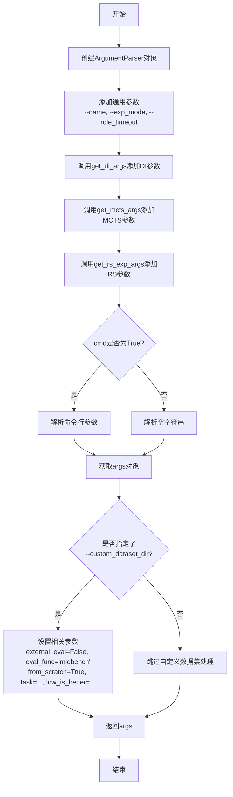

#### 带注释源码

```python
def get_args(cmd=True):
    # 创建参数解析器
    parser = argparse.ArgumentParser()
    
    # 添加通用参数
    parser.add_argument("--name", type=str, default="")
    parser.add_argument(
        "--exp_mode",
        type=str,
        default="mcts",
        choices=["mcts", "rs", "base", "custom", "greedy", "autogluon", "random", "autosklearn"],
    )
    parser.add_argument("--role_timeout", type=int, default=1000)
    
    # 添加其他模块的参数
    get_di_args(parser)
    get_mcts_args(parser)
    get_rs_exp_args(parser)
    
    # 根据cmd标志决定是否从命令行解析参数
    if cmd:
        args = parser.parse_args()
    else:
        args = parser.parse_args("")

    # 如果指定了自定义数据集目录，则自动设置相关参数
    if args.custom_dataset_dir:
        args.external_eval = False
        args.eval_func = "mlebench"
        args.from_scratch = True
        args.task = get_mle_task_id(args.custom_dataset_dir)
        args.low_is_better = get_mle_is_lower_better(args.task)
    
    # 返回解析后的参数对象
    return args
```

### `get_mcts_args`

该函数用于向一个 `argparse.ArgumentParser` 对象添加与蒙特卡洛树搜索（MCTS）实验相关的命令行参数。它定义了控制MCTS运行行为、数据加载、评估方式等的一系列选项。

参数：
- `parser`：`argparse.ArgumentParser`，需要添加参数的解析器对象。

返回值：`None`，该函数通过修改传入的 `parser` 对象来添加参数，不返回任何值。

#### 流程图

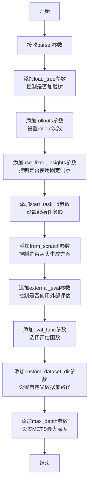

#### 带注释源码

```python
def get_mcts_args(parser):
    # 添加一个布尔参数 `--load_tree`，用于控制是否从文件加载已保存的MCTS树。
    # `dest="load_tree"` 指定解析后参数存储在args对象的 `load_tree` 属性中。
    # `action="store_true"` 表示如果指定该参数，则 `load_tree` 为 True。
    parser.add_argument("--load_tree", dest="load_tree", action="store_true")
    # 添加一个对应的 `--no_load_tree` 参数，用于显式地将 `load_tree` 设置为 False。
    parser.add_argument("--no_load_tree", dest="load_tree", action="store_false")
    # 设置 `load_tree` 参数的默认值为 False（即不加载树）。
    parser.set_defaults(load_tree=False)

    # 添加一个整数参数 `--rollouts`，用于设置MCTS算法中每次模拟（rollout）的次数。默认值为5。
    parser.add_argument("--rollouts", type=int, default=5)

    # 添加一个布尔参数 `--use_fixed_insights`，控制是否使用预定义的、固定的洞察（insights）来指导搜索。
    parser.add_argument("--use_fixed_insights", dest="use_fixed_insights", action="store_true")
    # 设置 `use_fixed_insights` 参数的默认值为 False。
    parser.set_defaults(use_fixed_insights=False)

    # 添加一个整数参数 `--start_task_id`，用于指定MCTS搜索开始的初始任务ID。默认值为2。
    parser.add_argument("--start_task_id", type=int, default=2)

    # 添加一个布尔参数 `--from_scratch`，控制是否从头开始生成解决方案（不利用任何先验知识或缓存）。
    # `help` 参数提供了在命令行帮助信息中显示的描述文本。
    parser.add_argument(
        "--from_scratch", dest="from_scratch", action="store_true", help="Generate solutions from scratch"
    )
    # 设置 `from_scratch` 参数的默认值为 False。
    parser.set_defaults(from_scratch=False)

    # 添加一个布尔参数 `--no_external_eval`，用于控制是否禁用外部评估。
    # `action="store_false"` 表示如果指定该参数，则 `external_eval` 为 False。
    parser.add_argument("--no_external_eval", dest="external_eval", action="store_false")
    # 设置 `external_eval` 参数的默认值为 True（即启用外部评估）。
    parser.set_defaults(external_eval=True)

    # 添加一个字符串参数 `--eval_func`，用于选择评估函数。
    # `choices=["sela", "mlebench"]` 限制了可选值为 "sela" 或 "mlebench"。
    parser.add_argument("--eval_func", type=str, default="sela", choices=["sela", "mlebench"])

    # 添加一个字符串参数 `--custom_dataset_dir`，用于指定自定义数据集的目录路径。默认值为 None。
    parser.add_argument("--custom_dataset_dir", type=str, default=None)

    # 添加一个整数参数 `--max_depth`，用于设置MCTS树搜索的最大深度。默认值为4。
    parser.add_argument("--max_depth", type=int, default=4)
```

### `get_rs_exp_args`

该函数用于向命令行参数解析器添加与随机搜索实验模式相关的特定参数。

参数：
-  `parser`：`argparse.ArgumentParser`，主程序的命令行参数解析器实例，用于添加新的参数定义。

返回值：`None`，该函数不返回任何值，其作用是通过修改传入的 `parser` 对象来添加参数定义。

#### 流程图

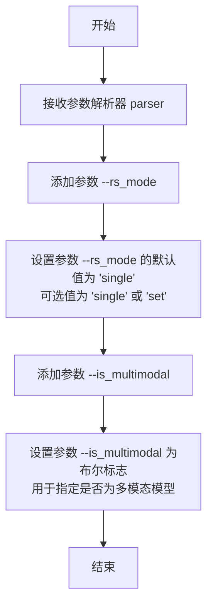

#### 带注释源码

```python
def get_rs_exp_args(parser):
    # 添加一个名为 `--rs_mode` 的参数，用于指定随机搜索的模式。
    # 类型为字符串，默认值为 "single"。
    # 用户只能从预定义的选项 ["single", "set"] 中选择。
    parser.add_argument("--rs_mode", type=str, default="single", choices=["single", "set"])
    
    # 添加一个名为 `--is_multimodal` 的标志参数（action="store_true"）。
    # 如果用户在命令行中提供了此参数，则其值被设置为 True，否则为 False。
    # 此参数用于指示实验是否涉及多模态模型。
    parser.add_argument("--is_multimodal", action="store_true", help="Specify if the model is multi-modal")
```

### `get_di_args`

该函数用于向一个 `argparse.ArgumentParser` 对象添加与数据洞察（Data Insight，简称 DI）相关的命令行参数。这些参数用于配置实验任务、评估指标偏好、反思机制、实验次数以及特殊指令等。

参数：
- `parser`：`argparse.ArgumentParser`，一个 `argparse.ArgumentParser` 对象，用于接收和解析命令行参数。

返回值：`None`，该函数不返回任何值，其作用是通过修改传入的 `parser` 对象来添加参数定义。

#### 流程图

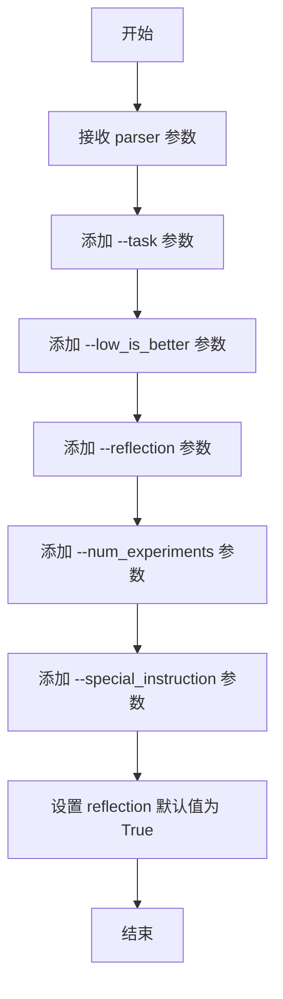

#### 带注释源码

```python
def get_di_args(parser):
    # 添加任务名称参数，默认值为 "titanic"
    parser.add_argument("--task", type=str, default="titanic")
    # 添加一个布尔标志参数，用于指示评估指标是否越低越好
    parser.add_argument("--low_is_better", dest="low_is_better", action="store_true")
    # 设置 `low_is_better` 参数的默认值为 False
    parser.set_defaults(low_is_better=False)
    # 添加一个布尔标志参数，用于控制是否启用反思机制
    parser.add_argument("--reflection", dest="reflection", action="store_true")
    parser.add_argument("--no_reflection", dest="reflection", action="store_false")
    # 添加实验次数参数，默认值为 1
    parser.add_argument("--num_experiments", type=int, default=1)
    # 添加特殊指令参数，用于指定特定的实验模式或配置
    parser.add_argument("--special_instruction", type=str, default=None, choices=["ag", "stacking", "text", "image"])
    # 设置 `reflection` 参数的默认值为 True
    parser.set_defaults(reflection=True)
```

### `main`

该函数是程序的异步主入口点，根据命令行参数 `args.exp_mode` 选择并初始化对应的实验运行器（Runner），然后异步执行该运行器的 `run_experiment` 方法以启动实验流程。

参数：
-  `args`：`argparse.Namespace`，包含所有通过命令行解析得到的配置参数，用于决定运行器的类型和初始化配置。

返回值：`None`，该函数不直接返回值，其功能是启动并等待异步实验流程执行完毕。

#### 流程图

```mermaid
flowchart TD
    A[开始: main(args)] --> B{判断 args.exp_mode};
    B -- "mcts" --> C[创建 MCTSRunner(args)];
    B -- "greedy" --> D[创建 MCTSRunner(args, tree_mode="greedy")];
    B -- "random" --> E[创建 MCTSRunner(args, tree_mode="random")];
    B -- "rs" --> F[创建 RandomSearchRunner(args)];
    B -- "base" --> G[创建 Runner(args)];
    B -- "autogluon" --> H[创建 GluonRunner(args)];
    B -- "custom" --> I[创建 CustomRunner(args)];
    B -- "autosklearn" --> J[创建 AutoSklearnRunner(args)];
    B -- "其他" --> K[抛出 ValueError];
    C --> L[调用 runner.run_experiment];
    D --> L;
    E --> L;
    F --> L;
    G --> L;
    H --> L;
    I --> L;
    J --> L;
    L --> M[结束];
```

#### 带注释源码

```python
async def main(args):
    # 根据实验模式参数 `exp_mode` 选择并实例化对应的运行器
    if args.exp_mode == "mcts":
        runner = MCTSRunner(args)
    elif args.exp_mode == "greedy":
        # 贪婪模式是MCTS的一种变体，通过指定 tree_mode 参数实现
        runner = MCTSRunner(args, tree_mode="greedy")
    elif args.exp_mode == "random":
        # 随机模式是MCTS的一种变体，通过指定 tree_mode 参数实现
        runner = MCTSRunner(args, tree_mode="random")
    elif args.exp_mode == "rs":
        runner = RandomSearchRunner(args)
    elif args.exp_mode == "base":
        runner = Runner(args)
    elif args.exp_mode == "autogluon":
        runner = GluonRunner(args)
    elif args.exp_mode == "custom":
        runner = CustomRunner(args)
    elif args.exp_mode == "autosklearn":
        runner = AutoSklearnRunner(args)
    else:
        # 如果传入的 exp_mode 不在预期范围内，抛出异常
        raise ValueError(f"Invalid exp_mode: {args.exp_mode}")
    # 异步执行运行器的实验流程
    await runner.run_experiment()
```

### `MCTSRunner.__init__`

该方法用于初始化MCTSRunner类的实例，根据传入的参数配置MCTS（蒙特卡洛树搜索）实验的运行环境，包括设置任务参数、评估函数、树搜索模式等。

参数：

- `args`：`argparse.Namespace`，包含命令行解析后的参数，用于配置MCTS实验的各项设置。
- `tree_mode`：`str`，默认为`"mcts"`，指定树搜索的模式，可选值包括`"mcts"`、`"greedy"`、`"random"`。

返回值：`None`，该方法不返回任何值，仅用于初始化实例。

#### 流程图

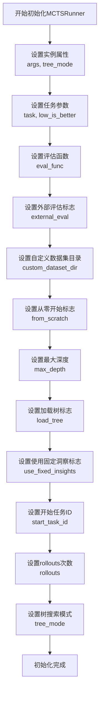

#### 带注释源码

```python
def __init__(self, args, tree_mode="mcts"):
    """
    初始化MCTSRunner实例。

    参数:
        args (argparse.Namespace): 命令行参数，包含实验配置。
        tree_mode (str): 树搜索模式，默认为"mcts"。
    """
    # 存储传入的参数和树搜索模式
    self.args = args
    self.tree_mode = tree_mode

    # 设置任务相关参数
    self.task = args.task  # 任务名称，例如"titanic"
    self.low_is_better = args.low_is_better  # 指示评估指标是否越低越好

    # 设置评估函数和外部评估标志
    self.eval_func = args.eval_func  # 评估函数类型，例如"sela"或"mlebench"
    self.external_eval = args.external_eval  # 是否使用外部评估

    # 设置自定义数据集目录和从零开始标志
    self.custom_dataset_dir = args.custom_dataset_dir  # 自定义数据集目录路径
    self.from_scratch = args.from_scratch  # 是否从零开始生成解决方案

    # 设置MCTS相关参数
    self.max_depth = args.max_depth  # 树搜索的最大深度
    self.load_tree = args.load_tree  # 是否加载已有的树结构
    self.use_fixed_insights = args.use_fixed_insights  # 是否使用固定的洞察信息
    self.start_task_id = args.start_task_id  # 开始执行的任务ID
    self.rollouts = args.rollouts  # 每次迭代的rollouts次数
```

### `MCTSRunner.run_experiment`

该方法负责执行蒙特卡洛树搜索（MCTS）实验。它根据传入的参数配置，初始化或加载MCTS树，然后执行指定次数的实验。每次实验会运行MCTS搜索过程，评估搜索结果，并可能保存实验数据。该方法协调了MCTS算法的核心循环，包括选择、扩展、模拟和反向传播等步骤，以探索和优化解决方案空间。

参数：

-  `self`：`MCTSRunner`，MCTSRunner类的实例，包含实验配置和状态。
-  `args`：`argparse.Namespace`，命令行参数或配置对象，包含实验模式、任务设置、评估函数等配置信息。

返回值：`None`，该方法不返回任何值，其主要作用是通过副作用执行实验并可能保存结果。

#### 流程图

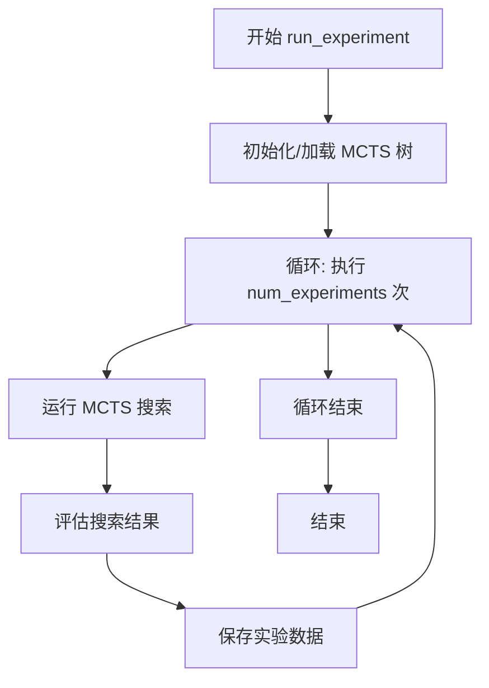

#### 带注释源码

```python
async def run_experiment(self):
    """
    执行MCTS实验的主方法。
    1. 根据参数初始化或从文件加载MCTS树。
    2. 循环执行指定次数的实验。
    3. 每次实验运行MCTS搜索，评估结果，并保存数据。
    """
    # 根据参数决定是加载已有的MCTS树还是创建新的树
    if self.args.load_tree:
        # 从文件加载树结构
        self.tree = self.load_tree_from_file()
    else:
        # 创建新的MCTS树
        self.tree = MCTSTree(self.args)

    # 循环执行指定次数的实验
    for exp_id in range(self.args.num_experiments):
        # 运行一次MCTS搜索过程
        best_node = await self.run_mcts()

        # 评估本次搜索得到的最佳节点（解决方案）
        evaluation_result = self.evaluate_solution(best_node)

        # 保存本次实验的数据（如最佳分数、搜索路径等）
        self.save_experiment_data(exp_id, evaluation_result)

        # 可选：打印或记录本次实验的进度和结果摘要
        self.log_experiment_summary(exp_id, evaluation_result)
```

### `RandomSearchRunner.__init__`

该方法用于初始化随机搜索运行器（RandomSearchRunner）的实例，设置实验参数并准备运行环境。

参数：

- `args`：`argparse.Namespace`，包含实验配置的命令行参数，如任务名称、评估函数、是否多模态等。

返回值：`None`，无返回值。

#### 流程图

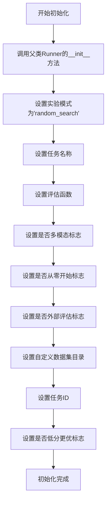

#### 带注释源码

```python
def __init__(self, args):
    """
    初始化RandomSearchRunner实例。
    
    参数:
        args (argparse.Namespace): 包含实验配置的命令行参数。
    """
    # 调用父类Runner的初始化方法，传递参数args
    super().__init__(args)
    # 设置实验模式为'random_search'，用于标识当前运行器类型
    self.exp_mode = "random_search"
    # 从args中获取任务名称，默认为空字符串
    self.task = args.task
    # 从args中获取评估函数名称，默认为'sela'
    self.eval_func = args.eval_func
    # 从args中获取是否多模态的标志，默认为False
    self.is_multimodal = args.is_multimodal
    # 从args中获取是否从零开始生成解决方案的标志，默认为False
    self.from_scratch = args.from_scratch
    # 从args中获取是否使用外部评估的标志，默认为True
    self.external_eval = args.external_eval
    # 从args中获取自定义数据集目录路径，默认为None
    self.custom_dataset_dir = args.custom_dataset_dir
    # 如果提供了自定义数据集目录，则从目录中提取任务ID
    if self.custom_dataset_dir:
        self.task = get_mle_task_id(self.custom_dataset_dir)
    # 从args中获取是否低分更优的标志，默认为False
    self.low_is_better = args.low_is_better
```

### `RandomSearchRunner.run_experiment`

该方法执行随机搜索实验，通过随机生成和评估多个解决方案来寻找给定任务的最佳解决方案。它根据配置参数（如是否多模态、是否使用外部评估等）来调整搜索策略，并记录实验结果。

参数：

-  `self`：`RandomSearchRunner`，RandomSearchRunner类的实例
-  无其他显式参数（通过`self.args`访问配置参数）

返回值：`None`，无返回值

#### 流程图

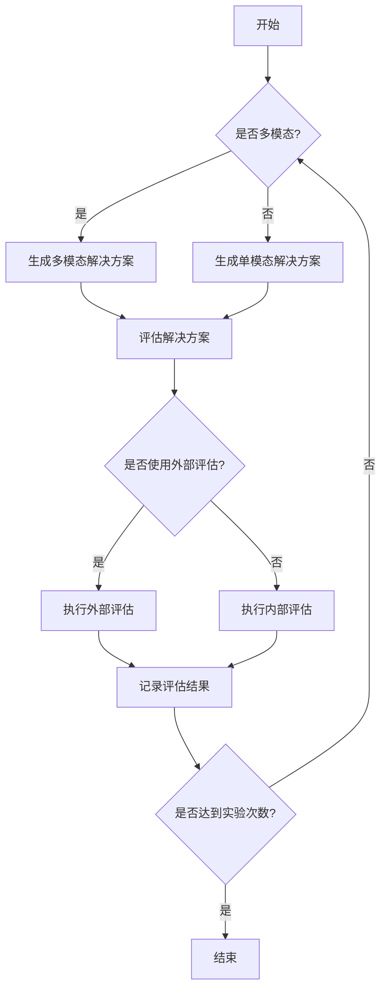

#### 带注释源码

```python
async def run_experiment(self):
    """
    执行随机搜索实验的主方法。
    根据配置参数生成并评估多个随机解决方案，记录最佳结果。
    """
    # 初始化最佳分数和解决方案
    best_score = float('inf') if self.args.low_is_better else -float('inf')
    best_solution = None
    
    # 根据实验次数循环生成和评估解决方案
    for i in range(self.args.num_experiments):
        # 根据是否多模态选择不同的解决方案生成方式
        if self.args.is_multimodal:
            solution = self.generate_multimodal_solution()
        else:
            solution = self.generate_solution()
        
        # 根据是否使用外部评估选择评估方式
        if self.args.external_eval:
            score = await self.external_evaluate(solution)
        else:
            score = self.evaluate(solution)
        
        # 根据分数是否越低越好更新最佳结果
        if (self.args.low_is_better and score < best_score) or \
           (not self.args.low_is_better and score > best_score):
            best_score = score
            best_solution = solution
        
        # 记录当前实验的结果
        self.log_experiment_result(i, solution, score)
    
    # 记录最终的最佳结果
    self.log_best_result(best_solution, best_score)
```

### `GluonRunner.__init__`

该方法用于初始化GluonRunner实例，设置实验运行所需的基本参数和配置。

参数：

- `args`：`argparse.Namespace`，包含实验配置的命令行参数，如任务名称、评估函数、是否从零开始等。

返回值：`None`，无返回值。

#### 流程图

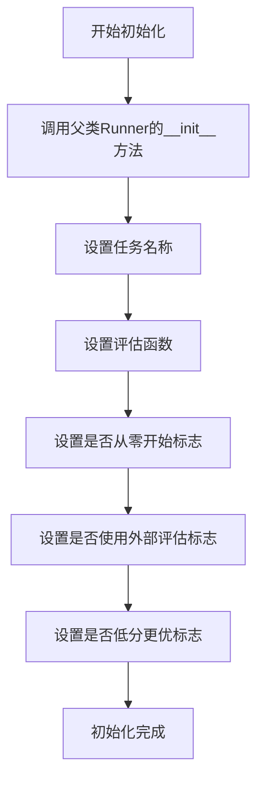

#### 带注释源码

```python
def __init__(self, args):
    """
    初始化GluonRunner实例。
    
    参数:
        args (argparse.Namespace): 包含实验配置的命令行参数。
    """
    # 调用父类Runner的初始化方法，传递args参数
    super().__init__(args)
    # 设置任务名称，从args中获取task属性
    self.task = args.task
    # 设置评估函数，从args中获取eval_func属性
    self.eval_func = args.eval_func
    # 设置是否从零开始标志，从args中获取from_scratch属性
    self.from_scratch = args.from_scratch
    # 设置是否使用外部评估标志，从args中获取external_eval属性
    self.external_eval = args.external_eval
    # 设置是否低分更优标志，从args中获取low_is_better属性
    self.low_is_better = args.low_is_better
```

### `GluonRunner.run_experiment`

该方法负责执行基于AutoGluon框架的自动化机器学习实验。它通过调用AutoGluon的TabularPredictor进行模型训练和评估，处理实验配置、数据加载、模型训练、性能评估以及结果记录等完整流程。

参数：

-  `self`：`GluonRunner`，GluonRunner类的实例，包含实验配置和运行状态
-  无其他显式参数，但通过`self.args`访问实验配置

返回值：`None`，该方法不返回任何值，但会输出实验日志和保存结果文件

#### 流程图

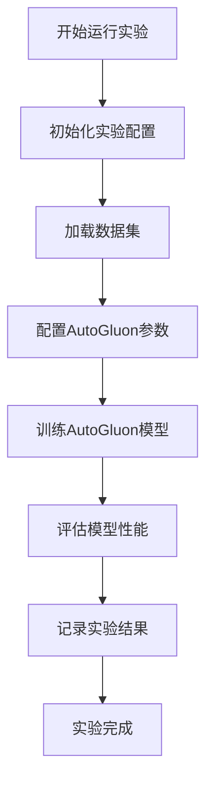

#### 带注释源码

```python
async def run_experiment(self):
    """
    执行AutoGluon实验的主方法
    
    该方法执行以下步骤：
    1. 初始化实验配置和日志记录
    2. 加载和预处理数据集
    3. 配置AutoGluon训练参数
    4. 训练AutoGluon模型
    5. 评估模型性能
    6. 记录和保存实验结果
    """
    # 初始化实验记录器
    self.init_experiment()
    
    # 加载数据集
    data = self.load_data()
    
    # 配置AutoGluon训练参数
    train_config = self.configure_autogluon()
    
    # 训练AutoGluon模型
    predictor = self.train_autogluon(data, train_config)
    
    # 评估模型性能
    metrics = self.evaluate_model(predictor, data)
    
    # 记录实验结果
    self.record_results(metrics)
    
    # 实验完成
    self.logger.info("AutoGluon experiment completed successfully")
```

### `AutoSklearnRunner.__init__`

该方法用于初始化 `AutoSklearnRunner` 类的实例，接收命令行参数对象，并设置实例的配置属性。

参数：

- `args`：`argparse.Namespace`，包含从命令行解析得到的配置参数，用于初始化运行器的各项设置。

返回值：`None`，构造函数不返回任何值。

#### 流程图

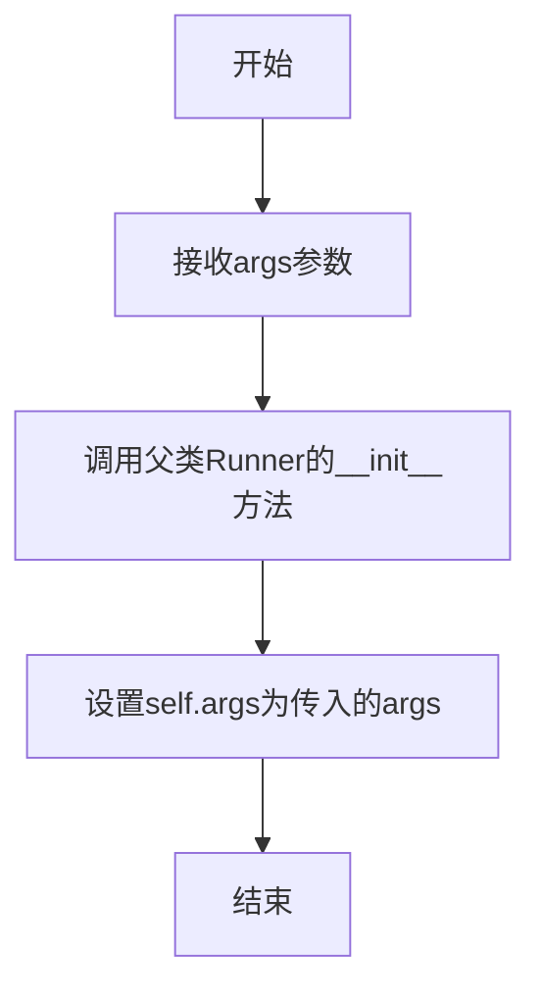

#### 带注释源码

```python
def __init__(self, args):
    """
    初始化AutoSklearnRunner实例。

    参数:
        args (argparse.Namespace): 包含所有配置参数的命令行参数对象。
    """
    super().__init__(args)  # 调用父类Runner的构造函数，传递args参数
```

### `AutoSklearnRunner.run_experiment`

该方法用于执行基于 Auto-Sklearn 的自动化机器学习实验。它通过配置 Auto-Sklearn 的优化器，在给定的数据集上进行模型训练与超参数优化，最终评估并返回最佳模型的性能指标。

参数：

-  `self`：`AutoSklearnRunner`，AutoSklearnRunner 类的实例，包含实验配置和运行状态
-  无其他显式参数，但通过 `self.args` 访问实验配置（如任务名称、评估函数等）

返回值：`None`，该方法不直接返回值，但会将实验结果（如最佳模型性能）记录到实例属性或输出文件中

#### 流程图

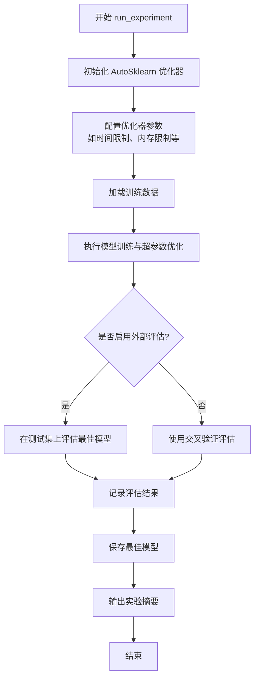

#### 带注释源码

```python
async def run_experiment(self):
    """
    执行 Auto-Sklearn 自动化机器学习实验。
    该方法配置并运行 Auto-Sklearn 优化器，在指定数据集上进行模型训练和超参数搜索，
    最终评估最佳模型并输出结果。
    """
    # 初始化 Auto-Sklearn 分类器或回归器，根据任务类型配置
    if self.args.task in ["titanic", "iris"]:  # 分类任务示例
        from autosklearn.classification import AutoSklearnClassifier
        automl = AutoSklearnClassifier(
            time_left_for_this_task=self.args.time_limit,  # 优化时间限制
            per_run_time_limit=self.args.per_run_limit,    # 单次运行时间限制
            memory_limit=self.args.memory_limit,           # 内存限制
            n_jobs=self.args.n_jobs,                       # 并行作业数
            metric=self.get_autosklearn_metric(),          # 根据任务获取评估指标
        )
    else:  # 回归任务
        from autosklearn.regression import AutoSklearnRegressor
        automl = AutoSklearnRegressor(
            time_left_for_this_task=self.args.time_limit,
            per_run_time_limit=self.args.per_run_limit,
            memory_limit=self.args.memory_limit,
            n_jobs=self.args.n_jobs,
            metric=self.get_autosklearn_metric(),
        )
    
    # 加载训练和测试数据
    X_train, y_train = self.load_data(split="train")
    X_test, y_test = self.load_data(split="test")
    
    # 执行自动化机器学习训练
    automl.fit(X_train, y_train, dataset_name=self.args.task)
    
    # 根据配置选择评估方式
    if self.args.external_eval:
        # 在独立测试集上评估
        score = automl.score(X_test, y_test)
        self.logger.info(f"Test score: {score}")
    else:
        # 使用交叉验证结果
        cv_results = automl.cv_results_
        best_score = cv_results['mean_test_score'][automl.best_index_]
        self.logger.info(f"CV best score: {best_score}")
    
    # 保存最佳模型（如果配置了保存路径）
    if self.args.save_model:
        import joblib
        joblib.dump(automl, f"{self.args.output_dir}/autosklearn_model.pkl")
    
    # 输出模型摘要和统计信息
    self.logger.info(automl.sprint_statistics())
    self.logger.info("AutoSklearn experiment completed.")
```

### `CustomRunner.__init__`

该方法用于初始化 `CustomRunner` 类的实例，根据传入的参数配置运行器的基本属性，包括任务名称、评估函数、数据集路径、任务ID、优化方向等，并调用父类的初始化方法完成基础设置。

参数：

- `args`：`argparse.Namespace`，包含运行配置的命令行参数或配置对象。

返回值：`None`，无返回值。

#### 流程图

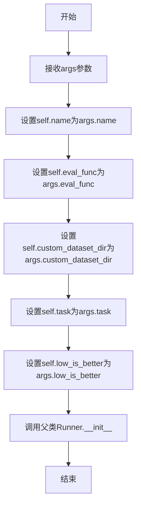

#### 带注释源码

```python
def __init__(self, args):
    """
    初始化CustomRunner实例。

    根据传入的args参数配置运行器的核心属性，包括任务名称、评估函数、自定义数据集目录、
    任务ID以及优化方向（分数越低是否越好）。最后调用父类Runner的初始化方法。

    Args:
        args (argparse.Namespace): 包含所有运行配置的参数对象。
    """
    # 设置运行器的名称，通常用于标识实验或任务
    self.name = args.name
    # 设置评估函数，决定如何评估模型性能（如'sela'或'mlebench'）
    self.eval_func = args.eval_func
    # 设置自定义数据集的目录路径，如果提供则使用外部数据集
    self.custom_dataset_dir = args.custom_dataset_dir
    # 设置任务ID，用于标识具体的机器学习任务
    self.task = args.task
    # 设置优化方向标志，True表示评估分数越低越好（如损失函数），False表示越高越好（如准确率）
    self.low_is_better = args.low_is_better
    # 调用父类Runner的初始化方法，传递args以完成基础配置（如日志、环境设置等）
    super().__init__(args)
```


### `CustomRunner.run_experiment`

该方法用于执行一个自定义的实验流程。它首先根据配置初始化一个实验环境，然后运行实验并收集结果，最后对结果进行汇总和输出。该方法的核心是协调实验的各个阶段，确保数据流和状态转换的正确性。

参数：

-  `self`：`CustomRunner`，`CustomRunner`类的实例，用于访问类属性和其他方法。
-  `*args`：`tuple`，可变位置参数，用于接收传递给方法的位置参数。
-  `**kwargs`：`dict`，可变关键字参数，用于接收传递给方法的关键字参数。

返回值：`None`，该方法不返回任何值，其主要作用是通过副作用（如打印结果、保存文件）来展示实验成果。

#### 流程图

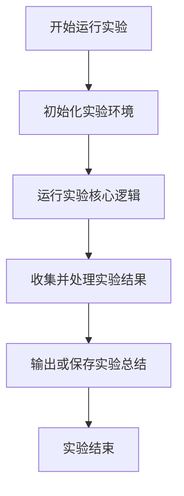

#### 带注释源码

```
    async def run_experiment(self, *args, **kwargs):
        # 初始化实验环境，例如设置随机种子、创建结果目录等
        self._setup_experiment()
        
        # 执行实验的核心逻辑，这通常涉及数据加载、模型训练和评估
        results = await self._run_core_experiment()
        
        # 对实验结果进行后处理，如计算统计指标、格式化输出
        processed_results = self._process_results(results)
        
        # 输出实验总结，可能包括打印到控制台或保存到文件
        self._summarize_experiment(processed_results)
```


### `Runner.__init__`

`Runner.__init__` 方法是 `Runner` 基类的构造函数，负责初始化一个实验运行器实例。它接收命令行参数，并根据这些参数设置运行器的核心配置，包括任务名称、评估函数、性能指标优化方向、是否启用反思、实验次数以及特殊指令等。此方法为所有具体运行器（如 `MCTSRunner`, `RandomSearchRunner`）提供了统一的初始化逻辑。

参数：

-  `args`：`argparse.Namespace`，包含所有命令行解析后的参数，用于配置运行器的各项属性。

返回值：`None`，构造函数不返回任何值。

#### 流程图

```mermaid
flowchart TD
    A[开始: Runner.__init__(args)] --> B[设置实例属性<br/>self.name = args.name]
    B --> C[设置实例属性<br/>self.task = args.task]
    C --> D[设置实例属性<br/>self.eval_func = args.eval_func]
    D --> E[设置实例属性<br/>self.low_is_better = args.low_is_better]
    E --> F[设置实例属性<br/>self.reflection = args.reflection]
    F --> G[设置实例属性<br/>self.num_experiments = args.num_experiments]
    G --> H[设置实例属性<br/>self.special_instruction = args.special_instruction]
    H --> I[结束]
```

#### 带注释源码

```python
def __init__(self, args):
    """
    初始化 Runner 实例。

    根据传入的命令行参数对象 `args`，设置运行器的基本配置。
    这些配置将被所有继承自 Runner 的具体实验运行器所使用。

    Args:
        args (argparse.Namespace): 包含所有配置参数的对象。
    """
    # 实验名称，通常用于标识或日志记录
    self.name = args.name
    # 要执行的任务标识符（例如 'titanic'）
    self.task = args.task
    # 评估函数名称，决定如何评估解决方案的性能（例如 'sela', 'mlebench'）
    self.eval_func = args.eval_func
    # 布尔值，指示性能指标是否越低越好（True）还是越高越好（False）
    self.low_is_better = args.low_is_better
    # 布尔值，指示是否在实验过程中启用反思机制
    self.reflection = args.reflection
    # 实验重复运行的次数
    self.num_experiments = args.num_experiments
    # 可选的特定指令，用于指导解决方案的生成（例如 'ag', 'stacking'）
    self.special_instruction = args.special_instruction
```


### `Runner.run_experiment`

该方法是一个抽象方法，定义了运行实验的通用接口。具体的实验运行逻辑由继承自`Runner`的子类实现，例如`MCTSRunner`、`RandomSearchRunner`等。它负责协调实验的整个生命周期，包括初始化、执行和可能的清理工作。

参数：
-  `self`：`Runner`，`Runner`类或其子类的实例，代表当前运行器对象。

返回值：`None`，此方法不返回任何值，其执行结果（如模型性能、日志等）通常通过其他方式（如写入文件、更新数据库）进行持久化或输出。

#### 流程图

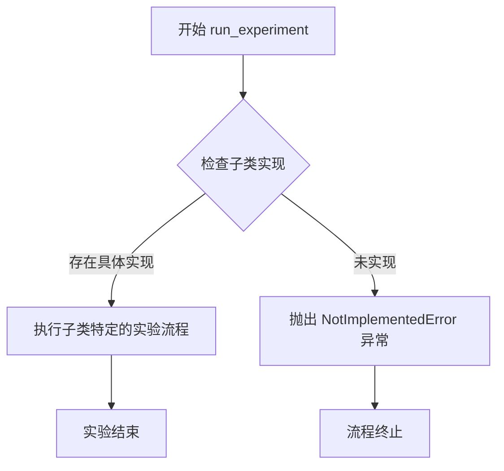

#### 带注释源码

```python
    async def run_experiment(self):
        """
        运行实验的抽象方法。
        此方法应由子类具体实现，以定义特定类型实验（如MCTS、随机搜索）的执行流程。
        如果子类未实现此方法，调用时将抛出 NotImplementedError 异常。
        """
        raise NotImplementedError
```

## 关键组件


### 命令行参数解析与配置管理

负责解析用户输入的命令行参数，并根据不同的实验模式（exp_mode）和自定义数据集配置，动态设置实验的默认参数和运行配置。它整合了多个子参数组（MCTS、随机搜索、通用实验）的解析逻辑，并支持根据自定义数据集路径自动推断任务ID和优化目标方向。

### 实验运行器工厂

根据解析得到的实验模式（exp_mode）参数，实例化对应的实验运行器（Runner）子类。它作为运行器对象的创建入口，支持多种自动化机器学习策略，包括蒙特卡洛树搜索（MCTS）、随机搜索、基础运行器以及集成AutoGluon、AutoSklearn等第三方库的运行器。

### 蒙特卡洛树搜索（MCTS）运行器

实现基于蒙特卡洛树搜索算法的自动化机器学习流程运行器。它支持从零开始构建搜索树或加载已有树结构，可配置搜索深度、模拟次数（rollouts），并集成了对固定洞察（insights）的使用、外部评估开关以及针对MLEBench等自定义数据集的评估功能。

### 随机搜索（Random Search）运行器

实现随机搜索策略的自动化机器学习实验运行器。支持单模型搜索和集合搜索两种模式，并可配置是否处理多模态数据任务。

### 自定义数据集与MLEBench集成

处理指向自定义数据集的路径（custom_dataset_dir），并自动关联到MLEBench评估框架。它会根据数据集路径推断对应的任务ID，设置评估函数为'mlebench'，强制启用从零开始（from_scratch）模式，并关闭外部评估，同时根据任务ID确定优化指标是否为越低越好。

### 通用实验参数配置

定义实验的通用基础配置，包括任务名称、优化目标方向（指标越低是否越好）、是否启用反思机制、实验重复次数以及特殊指令（如使用AutoGluon、堆叠、文本或图像处理）的选择。

### 异步实验执行入口

作为整个自动化机器学习实验流程的异步执行入口点。它接收配置参数，调用对应的运行器（Runner）实例，并异步执行`run_experiment`方法以启动完整的实验流程。


## 问题及建议


### 已知问题

-   **参数解析逻辑存在潜在缺陷**：`get_args` 函数中的 `if cmd:` 分支逻辑，当 `cmd=False` 时，调用 `parser.parse_args("")` 会解析一个空字符串。这可能导致非预期的默认参数值被应用，特别是当代码在非命令行环境（如被其他脚本导入调用）下运行时，行为可能与预期不符，增加了调试和理解代码行为的复杂度。
-   **`exp_mode` 参数值与运行器映射存在不一致性**：`exp_mode` 的可选值列表中包含 `"random"`，但在 `main` 函数中，`"random"` 模式的处理逻辑与 `"mcts"` 和 `"greedy"` 模式相同，都是实例化 `MCTSRunner`，仅通过 `tree_mode` 参数区分。这种设计使得参数值的语义不够清晰（`"random"` 可能被误解为 `RandomSearchRunner`），降低了代码的可读性和可维护性。
-   **条件参数设置逻辑可能引发混淆**：在 `get_args` 函数中，当 `args.custom_dataset_dir` 被设置时，会强制覆盖 `args.external_eval`、`args.eval_func`、`args.from_scratch`、`args.task` 和 `args.low_is_better` 等多个参数。这种隐式的、强制的参数覆盖行为没有在参数帮助信息中明确说明，使用者可能在不了解此逻辑的情况下设置相关参数而发现其无效，导致困惑和潜在的错误。
-   **缺少输入验证和错误处理**：代码没有对关键的输入参数进行有效性验证。例如，`custom_dataset_dir` 路径是否存在、`task` 名称是否有效、`num_experiments` 是否为正整数等。缺少验证可能导致运行时错误，且错误信息可能不够友好，难以快速定位问题根源。

### 优化建议

-   **重构参数解析逻辑**：建议将 `get_args` 函数拆分为两个职责明确的函数：一个用于命令行解析（`parse_cli_args`），另一个用于构建或提供默认配置对象（`get_default_config`）。当在非CLI环境下使用时，应直接使用 `get_default_config` 并显式地设置所需参数，避免使用 `parse_args("")` 这种模糊的方式。
-   **统一并明确运行器映射关系**：考虑重构 `main` 函数中的条件分支，使其更清晰。例如，可以创建一个从 `exp_mode` 到（`runner_class`, `runner_kwargs`）的映射字典。对于 `MCTSRunner` 的不同模式（`mcts`, `greedy`, `random`），可以统一使用 `exp_mode="mcts"`，并通过一个新增的、含义明确的参数（如 `--search-strategy`）来指定具体策略，从而消除 `exp_mode` 值的歧义。
-   **显式化参数依赖和覆盖规则**：将 `custom_dataset_dir` 触发的参数覆盖逻辑从 `get_args` 函数中移出，或者至少在其帮助信息中明确说明。更好的做法是，在运行器（如 `CustomRunner`）的初始化或运行方法中，根据 `custom_dataset_dir` 的存在性来应用这些特定的配置，使得配置的来源和优先级更加清晰。
-   **增强参数验证和错误处理**：在参数解析后或运行器初始化前，添加参数验证步骤。例如，检查必需参数是否提供、路径是否存在、数值参数是否在有效范围内等。验证失败时应抛出清晰的、包含 actionable 信息的异常（如 `ValueError` 或自定义异常），并提前终止程序，避免执行到更深层次才报错。
-   **提升代码可测试性**：当前 `main` 函数和运行器初始化逻辑与命令行参数解析紧密耦合，使得单元测试较为困难。建议将核心的业务逻辑（如根据配置选择并运行运行器）抽取到一个独立的、不直接依赖 `argparse.Namespace` 对象的函数中。该函数接受一个配置字典或数据类实例作为参数，便于在测试中构造和注入不同的配置场景。


## 其它


### 设计目标与约束

本代码模块是一个实验运行器的命令行入口程序，其核心设计目标是提供一个统一、可扩展的接口，用于启动和配置基于不同算法（如MCTS、随机搜索、AutoGluon等）的自动化机器学习实验流程。主要约束包括：1) 必须通过命令行参数灵活配置实验类型和运行参数；2) 需要支持同步和异步（通过`asyncio`）的运行模式；3) 需要处理自定义数据集路径，并据此自动推断相关任务配置；4) 代码结构需清晰，便于未来添加新的实验运行器（`Runner`子类）。

### 错误处理与异常设计

代码中的错误处理主要采用以下策略：
1.  **参数验证**：通过`argparse`的`choices`参数限制枚举型输入（如`--exp_mode`, `--eval_func`）的有效值，无效值会由`argparse`自动处理并提示用户。
2.  **运行时异常**：在`main`函数的`if-elif`链末尾，对于无法匹配的`exp_mode`参数，直接抛出`ValueError`异常，提示无效的实验模式。这是程序逻辑错误的主要检查点。
3.  **默认值与回退逻辑**：为许多参数设置了合理的默认值（如`--role_timeout 1000`, `--exp_mode mcts`）。对于`--custom_dataset_dir`，当其被设置时，程序会强制覆盖`external_eval`、`eval_func`等参数，并调用`get_mle_task_id`和`get_mle_is_lower_better`来推断任务属性，这隐含了这些函数可能抛出异常（如路径无效、任务ID无法识别）的风险，但当前代码层面未显式捕获。
4.  **异步异常**：主入口使用`asyncio.run(main(args))`，异步运行过程中在`runner.run_experiment()`内产生的异常会向上传播，最终导致程序终止。缺乏对异步任务中特定异常的捕获和优雅处理机制。

### 数据流与状态机

1.  **数据流**：
    *   **输入**：所有数据流始于命令行参数解析。关键输入包括实验模式(`exp_mode`)、任务标识(`task`)、自定义数据集路径(`custom_dataset_dir`)、算法特定参数（如MCTS的`rollouts`, `max_depth`）等。
    *   **处理**：参数解析后，根据`exp_mode`选择对应的`Runner`子类实例。`Runner`对象接收所有`args`作为其初始状态。当`custom_dataset_dir`存在时，会触发一个分支逻辑，自动设置`task`, `low_is_better`等字段，并覆盖`external_eval`和`eval_func`。
    *   **输出**：控制权交给`runner.run_experiment()`方法。该方法的具体数据输出（如模型性能指标、生成的解决方案、日志文件）取决于具体的`Runner`实现，不在本入口模块内定义。

2.  **状态机**：
    本模块自身不维护复杂的状态机。其核心状态转移是线性的：`解析参数` -> `选择并初始化Runner` -> `异步执行实验` -> `结束`。复杂的实验状态（如MCTS的搜索树状态、随机搜索的迭代状态）由各个`Runner`子类在其内部管理。

### 外部依赖与接口契约

1.  **外部依赖**：
    *   **Python标准库**：`argparse`, `asyncio`。
    *   **项目内部模块**：
        *   `metagpt.ext.sela.data.custom_task`: 提供`get_mle_task_id`和`get_mle_is_lower_better`函数，用于从自定义数据集路径解析任务属性。
        *   `metagpt.ext.sela.runner` 包下的各个模块：提供具体的实验运行器类（`MCTSRunner`, `RandomSearchRunner`, `Runner`, `GluonRunner`, `CustomRunner`, `AutoSklearnRunner`）。这是最核心的依赖，入口程序扮演了**工厂**和**客户端**的角色。
    *   **隐式依赖**：各`Runner`子类可能进一步依赖第三方库（如`autogluon`, `auto-sklearn`）或其他项目模块。

2.  **接口契约**：
    *   **与`Runner`子类的契约**：所有`Runner`子类必须接受一个`args`（`argparse.Namespace`对象）作为其`__init__`方法的参数，并且必须实现一个异步方法`run_experiment()`。入口程序依赖此契约来创建对象并启动实验。
    *   **与`custom_task`模块的契约**：`get_mle_task_id`函数接受一个字符串路径，返回一个任务ID字符串；`get_mle_is_lower_better`函数接受一个任务ID字符串，返回一个布尔值。入口程序假设这些函数能正确执行，未处理其可能失败的情况。
    *   **命令行接口(CLI)契约**：为用户提供了一组预定义的参数和选项。任何使用此脚本的用户都需遵守此参数集的约束。

    