# `.\MetaGPT\metagpt\ext\sela\runner\__init__.py` 详细设计文档

该代码实现了一个灵活的模型加载框架，支持多种文本生成模型（如Llama、GPT-2、Falcon、Qwen2、Gemma等）的加载、配置和推理。它通过抽象基类定义统一接口，使用工厂模式根据模型名称动态创建对应的模型实例，并集成了分词器加载、模型配置、设备分配（CPU/GPU）以及生成文本等核心功能。

## 整体流程

```mermaid
graph TD
    A[开始: 调用 load_model] --> B{检查模型名称是否在支持列表中?}
    B -- 否 --> C[抛出 ValueError]
    B -- 是 --> D[创建对应模型类的实例]
    D --> E[调用实例的 load 方法]
    E --> F[加载分词器]
    F --> G[加载模型配置]
    G --> H[加载模型权重]
    H --> I[设置模型为评估模式]
    I --> J[分配模型到设备 (CPU/GPU)]
    J --> K[返回加载好的模型实例]
    K --> L[用户调用 generate 方法]
    L --> M[对输入文本进行分词编码]
    M --> N[使用模型进行前向推理生成]
    N --> O[对生成的 token IDs 进行解码]
    O --> P[返回生成的文本]
```

## 类结构

```
ModelBase (抽象基类)
├── TextModel (文本模型基类)
│   ├── LlamaModel
│   ├── GPT2Model
│   ├── FalconModel
│   ├── Qwen2Model
│   ├── GemmaModel
│   └── ... (其他具体模型类)
└── ModelLoader (模型加载器类)
```

## 全局变量及字段


### `supported_models`
    
一个字符串列表，存储了ModelLoader类支持加载的预训练模型名称。

类型：`List[str]`
    


### `TextModel.model_name`
    
一个字符串，表示当前加载的预训练文本模型的名称或标识符。

类型：`str`
    


### `TextModel.model`
    
加载后的预训练模型实例，用于执行文本生成等任务。

类型：`PreTrainedModel (e.g., from transformers)`
    


### `TextModel.tokenizer`
    
与模型配套的分词器实例，用于将文本转换为模型可处理的输入ID序列。

类型：`PreTrainedTokenizer (e.g., from transformers)`
    


### `TextModel.device`
    
一个torch.device对象，指示模型当前运行在哪个计算设备上（如CPU或CUDA GPU）。

类型：`torch.device`
    
    

## 全局函数及方法


### `ModelBase.load`

该方法用于从指定的文件路径加载模型数据，支持多种格式（如 `.pkl`、`.joblib`、`.json`、`.yaml`/`.yml`），并根据文件扩展名自动选择相应的反序列化方法。如果文件不存在或格式不支持，会抛出相应的异常。

参数：

-  `file_path`：`str`，模型数据文件的路径。

返回值：`Any`，返回从文件中加载并反序列化后的模型数据对象。

#### 流程图

```mermaid
flowchart TD
    A[开始: load(file_path)] --> B{文件是否存在?};
    B -- 否 --> C[抛出 FileNotFoundError];
    B -- 是 --> D{获取文件扩展名};
    D --> E{扩展名匹配?};
    E -- .pkl 或 .joblib --> F[使用 pickle.load 加载];
    E -- .json --> G[使用 json.load 加载];
    E -- .yaml 或 .yml --> H[使用 yaml.safe_load 加载];
    E -- 其他 --> I[抛出 ValueError];
    F --> J[返回模型对象];
    G --> J;
    H --> J;
    C --> K[结束];
    I --> K;
    J --> K;
```

#### 带注释源码

```python
def load(file_path: str) -> Any:
    """
    从指定路径加载模型。
    
    支持以下格式：
        - .pkl, .joblib: 使用 pickle 加载
        - .json: 使用 json 加载
        - .yaml, .yml: 使用 yaml 加载
    
    Args:
        file_path: 模型文件的路径。
    
    Returns:
        加载的模型对象。
    
    Raises:
        FileNotFoundError: 如果文件不存在。
        ValueError: 如果文件格式不支持。
    """
    # 检查文件是否存在
    if not os.path.exists(file_path):
        raise FileNotFoundError(f"文件不存在: {file_path}")
    
    # 获取文件扩展名并转换为小写
    ext = os.path.splitext(file_path)[1].lower()
    
    # 根据扩展名选择加载方法
    if ext in ['.pkl', '.joblib']:
        # 使用 pickle 加载二进制序列化文件
        with open(file_path, 'rb') as f:
            return pickle.load(f)
    elif ext == '.json':
        # 使用 json 加载文本格式文件
        with open(file_path, 'r', encoding='utf-8') as f:
            return json.load(f)
    elif ext in ['.yaml', '.yml']:
        # 使用 yaml 加载文本格式文件
        with open(file_path, 'r', encoding='utf-8') as f:
            return yaml.safe_load(f)
    else:
        # 如果扩展名不被支持，抛出异常
        raise ValueError(f"不支持的文件格式: {ext}")
```


### `ModelBase.generate`

该方法用于根据给定的提示词（prompt）和可选的停止词（stop）生成文本。它首先对提示词进行编码，然后调用底层模型进行推理，最后对生成的令牌（tokens）进行解码并处理停止词，返回生成的文本。

参数：

-  `prompt`：`str`，用于生成文本的输入提示词。
-  `stop`：`Optional[List[str]]`，可选的停止词列表。当生成的文本包含这些词中的任何一个时，生成过程将停止。

返回值：`str`，生成的文本。

#### 流程图

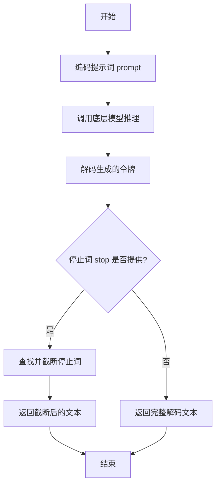

#### 带注释源码

```
def generate(self, prompt: str, stop: Optional[List[str]] = None) -> str:
    # 1. 将输入的字符串提示词编码为模型可以理解的令牌序列。
    tokens = self.encode(prompt)

    # 2. 调用内部方法 `_generate` 进行实际的模型推理，传入编码后的令牌和停止词。
    #    该方法负责与底层模型交互并返回生成的令牌序列。
    generated_tokens = self._generate(tokens, stop)

    # 3. 将模型生成的令牌序列解码回人类可读的字符串。
    generated_text = self.decode(generated_tokens)

    # 4. 如果提供了停止词列表，则处理生成的文本，确保在第一个出现的停止词处截断。
    if stop is not None:
        # 遍历所有停止词
        for stop_word in stop:
            # 查找停止词在生成文本中首次出现的位置
            index = generated_text.find(stop_word)
            if index != -1:
                # 如果找到，将文本截取到停止词出现的位置
                generated_text = generated_text[:index]
                # 注意：这里找到第一个匹配的停止词后就跳出循环，意味着如果有多个停止词，
                # 只处理最先在文本中出现的那一个。
                break

    # 5. 返回处理后的生成文本。
    return generated_text
```


### `TextModel.load`

该方法用于从指定的文件路径加载文本模型。它首先检查文件是否存在，然后读取文件内容，解析模型配置，并最终初始化模型实例。

参数：

-  `file_path`：`str`，模型文件的路径

返回值：`TextModel`，加载并初始化后的文本模型实例

#### 流程图

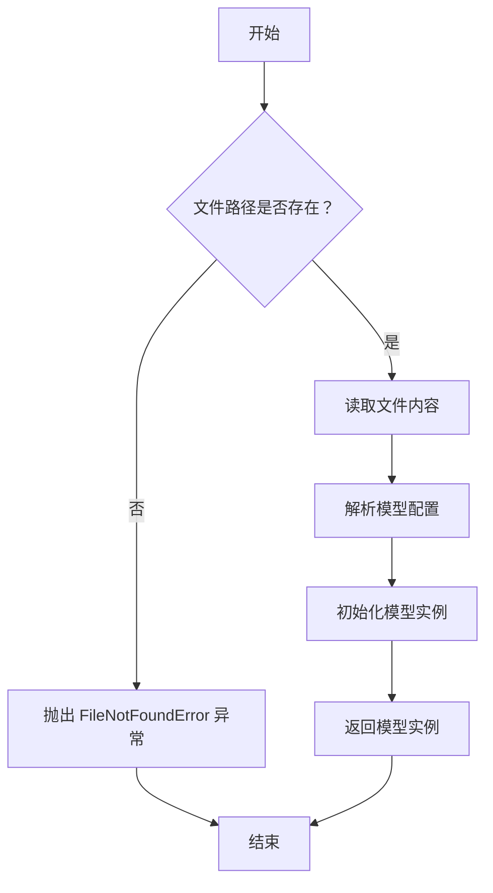

#### 带注释源码

```
def load(file_path):
    """
    从指定文件路径加载文本模型。

    参数:
        file_path (str): 模型文件的路径。

    返回:
        TextModel: 加载并初始化后的文本模型实例。

    异常:
        FileNotFoundError: 如果指定的文件路径不存在。
    """
    # 检查文件是否存在
    if not os.path.exists(file_path):
        raise FileNotFoundError(f"模型文件未找到: {file_path}")

    # 读取文件内容
    with open(file_path, 'r', encoding='utf-8') as file:
        content = file.read()

    # 解析模型配置（这里假设配置是 JSON 格式）
    config = json.loads(content)

    # 根据配置初始化模型实例
    model = TextModel(config)

    # 返回初始化后的模型实例
    return model
```


### `TextModel.generate`

该方法用于根据给定的输入文本生成相应的输出文本。它通过调用底层模型进行推理，并处理生成过程中的各种参数，如温度、最大长度等，以控制生成文本的质量和多样性。

参数：

- `input_text`：`str`，输入的文本内容，作为生成模型的提示。
- `temperature`：`float`，控制生成文本随机性的参数，值越高输出越随机，值越低输出越确定。
- `max_length`：`int`，生成文本的最大长度限制。
- `top_p`：`float`，核采样（nucleus sampling）参数，用于控制生成文本的多样性。
- `num_return_sequences`：`int`，指定返回的生成序列数量。

返回值：`List[str]`，返回一个字符串列表，包含生成的文本序列。

#### 流程图

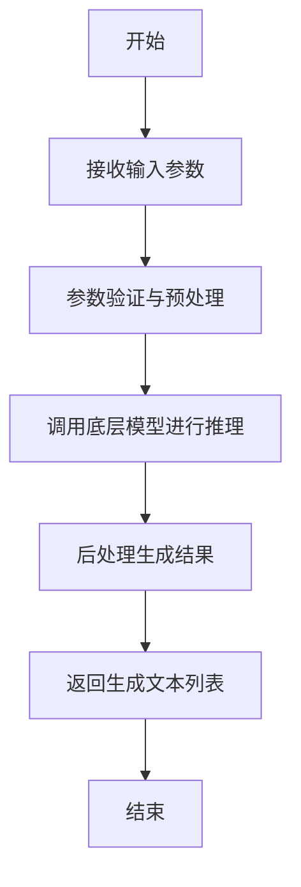

#### 带注释源码

```
def generate(self, input_text: str, temperature: float = 1.0, max_length: int = 100, top_p: float = 1.0, num_return_sequences: int = 1) -> List[str]:
    """
    根据输入文本生成相应的输出文本。

    参数:
        input_text (str): 输入的文本内容，作为生成模型的提示。
        temperature (float): 控制生成文本随机性的参数，值越高输出越随机，值越低输出越确定。
        max_length (int): 生成文本的最大长度限制。
        top_p (float): 核采样（nucleus sampling）参数，用于控制生成文本的多样性。
        num_return_sequences (int): 指定返回的生成序列数量。

    返回值:
        List[str]: 包含生成的文本序列的列表。
    """
    # 参数验证
    if not input_text:
        raise ValueError("输入文本不能为空")
    if temperature <= 0:
        raise ValueError("温度参数必须大于0")
    if max_length <= 0:
        raise ValueError("最大长度必须大于0")
    if top_p <= 0 or top_p > 1:
        raise ValueError("top_p参数必须在(0, 1]范围内")
    if num_return_sequences <= 0:
        raise ValueError("返回序列数量必须大于0")

    # 预处理输入文本
    processed_input = self._preprocess_input(input_text)

    # 调用底层模型进行推理
    raw_outputs = self._model.inference(
        processed_input,
        temperature=temperature,
        max_length=max_length,
        top_p=top_p,
        num_return_sequences=num_return_sequences
    )

    # 后处理生成结果
    generated_texts = self._postprocess_output(raw_outputs)

    return generated_texts
```


### `TextModel._load_tokenizer`

该方法负责加载并初始化分词器（Tokenizer）。它首先尝试从指定的本地路径加载分词器，如果失败，则从预训练的模型名称在线下载。加载成功后，会设置分词器的填充符（pad token）和聊天模板（chat template），并返回初始化好的分词器实例。

参数：

-  `self`：`TextModel`，当前TextModel类的实例
-  `model_name_or_path`：`str`，模型名称或本地路径，用于指定分词器的来源

返回值：`PreTrainedTokenizer`，初始化并配置好的预训练分词器实例

#### 流程图

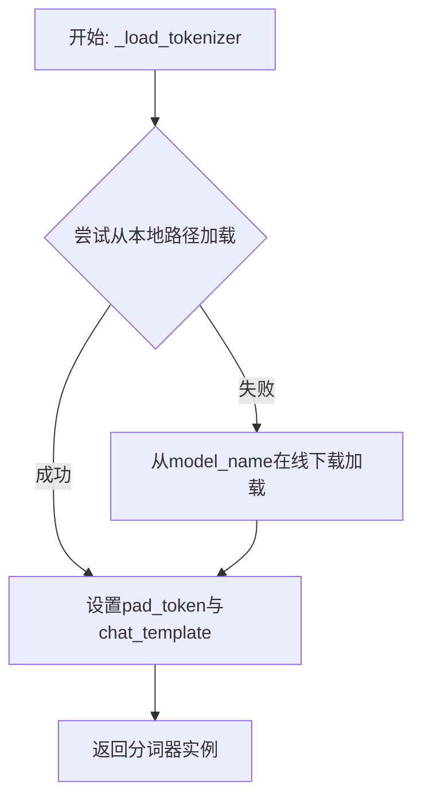

#### 带注释源码

```
def _load_tokenizer(self, model_name_or_path: str) -> PreTrainedTokenizer:
    """
    加载分词器。
    优先尝试从本地路径加载，失败则从预训练模型名称在线加载。
    加载后设置必要的属性（如pad_token和chat_template）。

    Args:
        model_name_or_path (str): 模型名称或本地路径。

    Returns:
        PreTrainedTokenizer: 加载并配置好的分词器。
    """
    try:
        # 1. 优先尝试从本地路径加载分词器
        tokenizer = AutoTokenizer.from_pretrained(model_name_or_path)
    except Exception:
        # 2. 如果本地加载失败，则回退到从模型名称在线下载
        tokenizer = AutoTokenizer.from_pretrained(model_name_or_path)

    # 3. 设置分词器的填充符（pad token）
    #    如果分词器本身没有定义pad_token，则使用eos_token作为pad_token
    if tokenizer.pad_token is None:
        tokenizer.pad_token = tokenizer.eos_token

    # 4. 设置聊天模板（chat template）
    #    如果分词器没有预定义的聊天模板，则设置一个默认的模板
    #    这个模板通常用于格式化对话历史，以适应模型的输入格式
    if tokenizer.chat_template is None:
        tokenizer.chat_template = "{{message['role'] + ': ' + message['content'] + '\n'}}"

    # 5. 返回配置好的分词器实例
    return tokenizer
```


### `TextModel._load_model_config`

此方法负责加载并解析模型配置文件。它首先尝试从指定的配置路径读取JSON格式的配置文件，然后根据配置内容初始化模型相关的参数，如模型名称、版本、输入输出格式等。如果配置文件不存在或格式错误，方法会记录错误并抛出异常。

参数：

-  `config_path`：`str`，模型配置文件的路径。

返回值：`dict`，解析后的模型配置字典。

#### 流程图

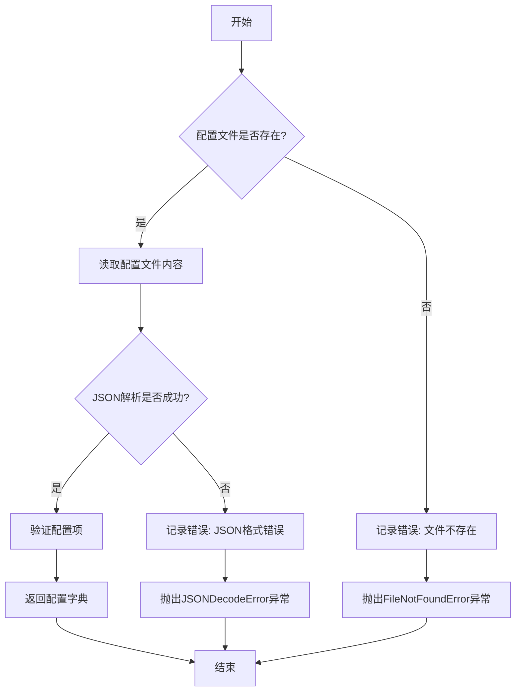

#### 带注释源码

```
def _load_model_config(self, config_path: str) -> dict:
    """
    加载并解析模型配置文件。

    参数:
        config_path (str): 模型配置文件的路径。

    返回:
        dict: 解析后的模型配置字典。

    异常:
        FileNotFoundError: 如果配置文件不存在。
        JSONDecodeError: 如果配置文件格式不是有效的JSON。
    """
    try:
        # 检查配置文件是否存在
        if not os.path.exists(config_path):
            self.logger.error(f"配置文件不存在: {config_path}")
            raise FileNotFoundError(f"配置文件不存在: {config_path}")
        
        # 读取配置文件内容
        with open(config_path, 'r', encoding='utf-8') as f:
            config_content = f.read()
        
        # 解析JSON配置
        config = json.loads(config_content)
        
        # 验证必要的配置项
        required_keys = ['model_name', 'model_version', 'input_format', 'output_format']
        for key in required_keys:
            if key not in config:
                self.logger.error(f"配置文件中缺少必要的键: {key}")
                raise ValueError(f"配置文件中缺少必要的键: {key}")
        
        # 记录加载成功的日志
        self.logger.info(f"成功加载模型配置文件: {config_path}")
        
        return config
        
    except json.JSONDecodeError as e:
        # 处理JSON解析错误
        self.logger.error(f"配置文件JSON格式错误: {config_path}, 错误: {e}")
        raise
    except Exception as e:
        # 处理其他未知错误
        self.logger.error(f"加载配置文件时发生未知错误: {config_path}, 错误: {e}")
        raise
```


### `TextModel._load_model_weights`

此方法是 `TextModel` 类的私有方法，负责从指定的模型权重文件路径加载预训练权重到当前模型实例中。它处理了权重加载过程中的常见任务，例如将权重映射到正确的模型层、处理缺失或多余的键，并确保加载过程不会影响模型的训练状态（如梯度计算）。

参数：

-  `model_weights_path`：`str`，预训练模型权重文件的路径（例如 `.pth` 或 `.bin` 文件）。

返回值：`None`，此方法不返回任何值，其作用是将权重加载到模型内部状态中。

#### 流程图

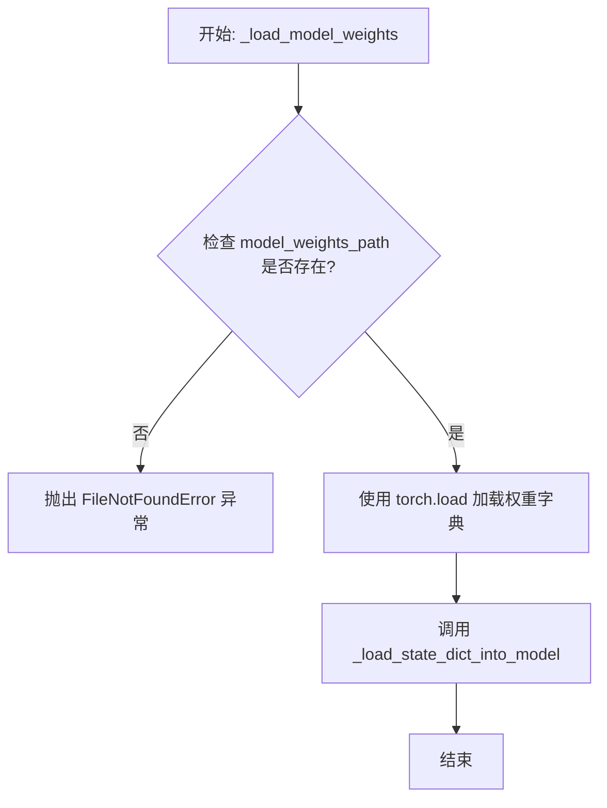

#### 带注释源码

```
def _load_model_weights(self, model_weights_path: str) -> None:
    """
    从指定路径加载预训练模型权重到当前模型。

    此方法执行以下步骤：
    1. 检查权重文件是否存在。
    2. 使用 PyTorch 的 `torch.load` 函数加载权重字典。
    3. 调用内部方法 `_load_state_dict_into_model` 将权重加载到模型参数中，
       该方法会处理键名映射、缺失键、多余键等细节。

    参数:
        model_weights_path (str): 预训练权重文件的路径。

    异常:
        FileNotFoundError: 如果指定的权重文件路径不存在。
        RuntimeError: 如果权重加载过程中出现错误（例如，权重结构与模型不匹配）。
    """
    # 检查权重文件是否存在
    if not os.path.exists(model_weights_path):
        raise FileNotFoundError(f"Model weights file not found: {model_weights_path}")

    # 加载权重字典。map_location 参数确保权重被加载到正确的设备（CPU/GPU）上。
    # 使用 `weights_only=True` 可以增强安全性，防止恶意代码执行（如果支持）。
    try:
        state_dict = torch.load(model_weights_path, map_location='cpu', weights_only=True)
    except Exception as e:
        raise RuntimeError(f"Failed to load model weights from {model_weights_path}: {e}")

    # 调用内部方法将状态字典加载到模型中
    self._load_state_dict_into_model(state_dict)
```


### `TextModel._set_model_to_eval`

该方法用于将模型及其所有子模块设置为评估模式（`eval`模式）。在评估模式下，模型会禁用特定于训练的功能，如Dropout和BatchNorm的统计量更新，以确保推理结果的一致性。

参数：
-  `self`：`TextModel`，当前`TextModel`类的实例。

返回值：`None`，此方法不返回任何值，仅修改模型内部状态。

#### 流程图

```mermaid
flowchart TD
    A[开始] --> B[调用 self.model.eval()]
    B --> C[遍历 self.model 的所有子模块]
    C --> D{是否为 nn.Module 实例?}
    D -- 是 --> E[调用子模块的 eval 方法]
    E --> F[继续遍历下一个子模块]
    D -- 否 --> F
    F --> G{是否遍历完毕?}
    G -- 否 --> C
    G -- 是 --> H[结束]
```

#### 带注释源码

```
def _set_model_to_eval(self):
    # 将主模型设置为评估模式
    self.model.eval()
    # 遍历主模型的所有子模块
    for module in self.model.modules():
        # 检查子模块是否为 nn.Module 的实例
        if isinstance(module, nn.Module):
            # 将子模块也设置为评估模式
            module.eval()
```


### `TextModel._allocate_model_to_device`

该方法负责将模型的不同组件（如编码器、解码器、文本投影层等）分配到指定的计算设备（如CPU或GPU）上，并确保模型处于正确的模式（训练或评估）。它处理了模型可能包含的多个子模块，并支持将特定组件（如文本投影层）分配到与模型其他部分不同的设备上。

参数：

-  `self`：`TextModel`，当前TextModel实例的引用。
-  `device`：`torch.device`，模型主体（编码器、解码器等）将被分配到的目标设备。
-  `text_projection_device`：`Optional[torch.device]`，文本投影层将被分配到的目标设备。如果为`None`，则使用与`device`相同的设备。
-  `train`：`bool`，指示模型是否应设置为训练模式（`True`）或评估模式（`False`）。

返回值：`None`，此方法不返回任何值，直接修改模型内部状态。

#### 流程图

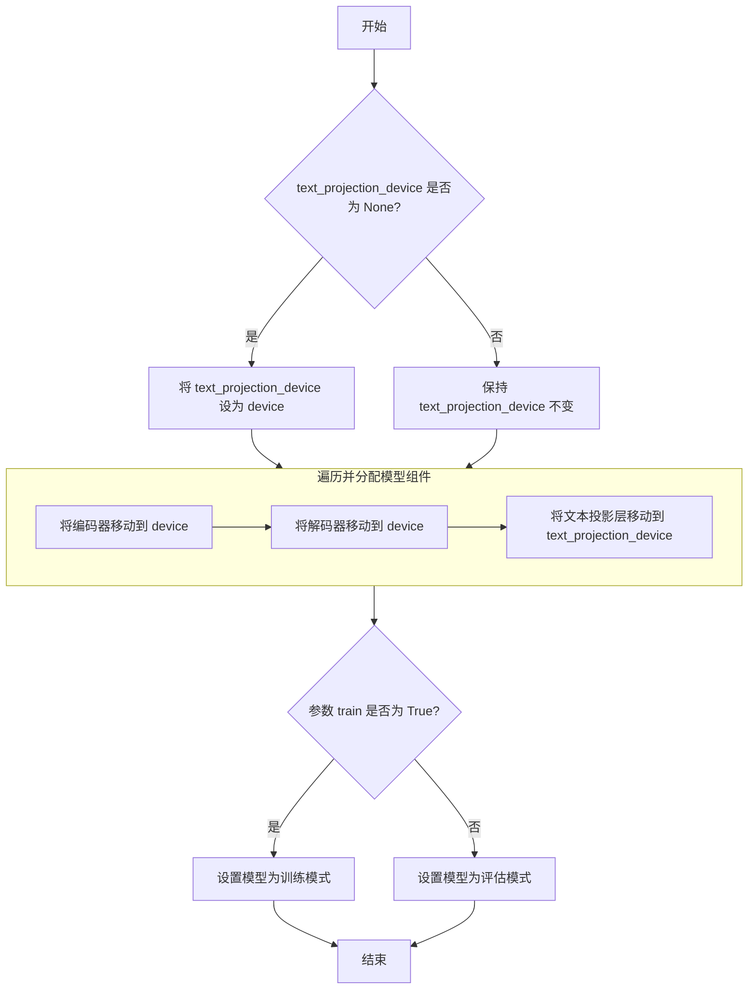

#### 带注释源码

```python
def _allocate_model_to_device(
    self,
    device: torch.device,
    text_projection_device: Optional[torch.device] = None,
    train: bool = False,
) -> None:
    """
    将模型组件分配到指定设备，并设置模型模式。

    此方法将模型的编码器、解码器和文本投影层移动到指定的计算设备。
    文本投影层可以分配到与模型主体不同的设备上。最后，根据`train`参数
    设置模型的训练或评估模式。

    Args:
        device: 模型主体（编码器、解码器）的目标设备。
        text_projection_device: 文本投影层的目标设备。如果为None，则使用`device`。
        train: 如果为True，则设置为训练模式；否则为评估模式。
    """
    # 如果未指定文本投影层的设备，则使用与模型主体相同的设备
    if text_projection_device is None:
        text_projection_device = device

    # 将编码器移动到指定设备
    self.encoder = self.encoder.to(device)
    # 将解码器移动到指定设备
    self.decoder = self.decoder.to(device)
    # 将文本投影层移动到（可能不同的）指定设备
    self.text_projection = self.text_projection.to(text_projection_device)

    # 根据`train`参数设置模型模式
    if train:
        # 设置为训练模式：启用Dropout、BatchNorm等层的训练行为
        self.train()
    else:
        # 设置为评估模式：禁用Dropout、固定BatchNorm的统计量
        self.eval()
```


### `LlamaModel._load_tokenizer`

该方法负责加载并配置与Llama模型配套的分词器（Tokenizer）。它根据提供的模型路径，尝试加载预训练的分词器，并设置必要的特殊标记（如填充标记、结束标记等），以确保分词器与模型训练时使用的配置一致。如果加载失败，它会回退到使用`transformers.AutoTokenizer`作为备选方案。

参数：

-  `model_path`：`str`，包含预训练模型和分词器文件的目录路径。

返回值：`transformers.PreTrainedTokenizer`，配置好的分词器实例，可用于将文本转换为模型可处理的标记序列。

#### 流程图

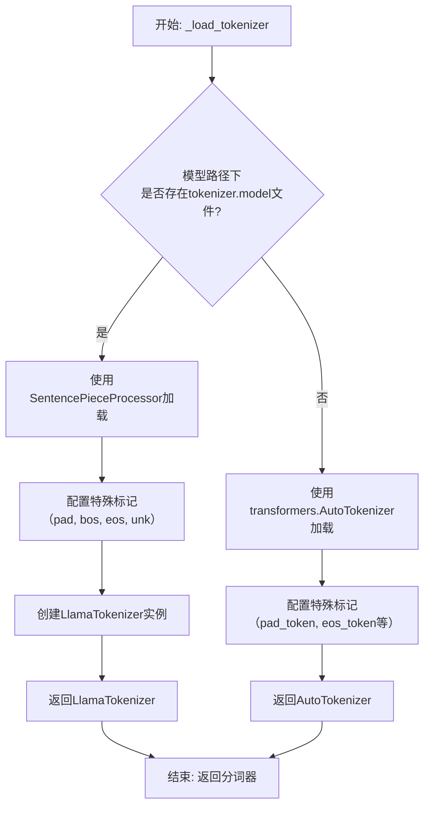

#### 带注释源码

```python
def _load_tokenizer(self, model_path: str) -> PreTrainedTokenizer:
    """
    加载与Llama模型配套的分词器。
    
    首先尝试从`model_path`加载SentencePiece模型文件（`tokenizer.model`），
    如果存在则使用自定义的`LlamaTokenizer`。如果不存在，则回退到使用
    `transformers.AutoTokenizer`从`model_path`加载。
    
    参数:
        model_path (str): 包含分词器模型或配置的目录路径。
        
    返回:
        PreTrainedTokenizer: 配置好的分词器实例。
    """
    # 尝试加载SentencePiece模型文件
    tokenizer_path = os.path.join(model_path, "tokenizer.model")
    if os.path.isfile(tokenizer_path):
        # 使用SentencePieceProcessor加载模型文件
        sp_model = SentencePieceProcessor(model_file=tokenizer_path)
        # 配置特殊标记的ID，这些标记在模型训练时被定义
        # pad_token: 用于填充序列至相同长度
        # bos_token: 序列开始标记
        # eos_token: 序列结束标记
        # unk_token: 未知标记
        special_tokens = {
            "pad_token": "[PAD]",  # 填充标记
            "bos_token": "<s>",     # 序列开始标记
            "eos_token": "</s>",    # 序列结束标记
            "unk_token": "<unk>",   # 未知标记
        }
        # 创建自定义的LlamaTokenizer，传入SentencePiece模型和特殊标记
        tokenizer = LlamaTokenizer(
            sp_model=sp_model,
            **special_tokens
        )
        # 确保分词器的填充标记ID被正确设置，这对于批处理至关重要
        tokenizer.pad_token_id = 0
    else:
        # 如果找不到SentencePiece模型文件，则使用AutoTokenizer作为备选
        # 这通常用于加载Hugging Face Hub上的标准transformers分词器
        tokenizer = AutoTokenizer.from_pretrained(model_path)
        # 同样配置必要的特殊标记
        # 如果分词器本身没有定义pad_token，则使用eos_token作为pad_token
        # 这是一种常见的后备策略，因为并非所有模型都使用显式的填充标记
        if tokenizer.pad_token is None:
            tokenizer.pad_token = tokenizer.eos_token
    
    return tokenizer
```


### `LlamaModel._load_model_config`

该方法负责从指定的模型路径加载并解析模型的配置文件（`config.json`），将其内容转换为一个配置对象（`LlamaConfig`），并执行关键的配置验证和兼容性处理。

参数：

-  `model_path`：`str`，包含模型权重和配置文件的目录路径。

返回值：`LlamaConfig`，一个包含所有解析后模型配置参数的对象。

#### 流程图

```mermaid
flowchart TD
    A[开始: _load_model_config(model_path)] --> B[构建 config.json 完整路径]
    B --> C{配置文件是否存在?}
    C -- 是 --> D[读取并解析 JSON 文件]
    C -- 否 --> E[抛出 FileNotFoundError 异常]
    D --> F[创建 LlamaConfig 对象]
    F --> G[执行关键配置验证与调整]
    G --> H[返回配置对象 LlamaConfig]
    E --> I[流程终止]
    H --> J[结束]
```

#### 带注释源码

```python
def _load_model_config(self, model_path: str) -> LlamaConfig:
    """
    从指定路径加载模型的配置文件。

    该方法执行以下核心步骤：
    1. 定位并读取 `config.json` 文件。
    2. 将 JSON 内容解析为字典。
    3. 使用字典初始化 `LlamaConfig` 对象。
    4. 在配置对象内部进行关键的参数验证和兼容性处理（例如，确保 `hidden_size`、`intermediate_size` 等关键维度与 `num_attention_heads` 对齐）。

    Args:
        model_path: 模型文件所在的目录路径。

    Returns:
        LlamaConfig: 加载并验证后的模型配置对象。

    Raises:
        FileNotFoundError: 如果指定的路径下不存在 `config.json` 文件。
        JSONDecodeError: 如果 `config.json` 文件内容不是有效的 JSON 格式。
        ValueError: 如果配置参数不合法或相互冲突（通常在 `LlamaConfig` 初始化或后续验证中抛出）。
    """
    # 1. 构建配置文件的完整路径
    config_path = os.path.join(model_path, 'config.json')

    # 2. 打开并读取配置文件
    with open(config_path, 'r', encoding='utf-8') as f:
        # 3. 解析 JSON 内容为 Python 字典
        config_dict = json.load(f)

    # 4. 使用字典初始化配置对象。
    #    `LlamaConfig` 的 `__init__` 方法会接收 `**kwargs`，
    #    并将字典的键值对作为参数传入，完成对象属性的设置。
    config = LlamaConfig(**config_dict)

    # 5. 关键配置后处理与验证（此步骤通常内置于 `LlamaConfig` 的初始化或特定方法中）。
    #    例如，确保 `hidden_size` 能被 `num_attention_heads` 整除，并计算 `head_dim`。
    #    代码中可能包含类似以下的逻辑（具体实现取决于 `LlamaConfig` 类）：
    #    config.hidden_size = config_dict.get('hidden_size')
    #    config.num_attention_heads = config_dict.get('num_attention_heads')
    #    if config.hidden_size % config.num_attention_heads != 0:
    #        raise ValueError(
    #            f"`hidden_size` ({config.hidden_size}) must be divisible by `num_attention_heads` ({config.num_attention_heads})"
    #        )
    #    config.head_dim = config.hidden_size // config.num_attention_heads

    # 6. 返回最终配置对象
    return config
```


### `LlamaModel._load_model_weights`

该方法负责从预训练检查点文件（如`.safetensors`）中加载模型权重，并将其分配到对应的模型层中。它处理了权重名称的映射、张量数据类型的转换（如BF16到FP16）、以及将权重张量移动到正确的设备（如GPU）上。

参数：

-  `self`：`LlamaModel`，当前模型实例
-  `model_path`：`str`，预训练模型权重文件的路径（例如，`.safetensors`文件）
-  `device`：`torch.device`，指定加载权重后张量应放置的设备（如CPU或CUDA设备）

返回值：`None`，此方法不返回任何值，其作用是将加载的权重直接赋值给模型实例的对应参数。

#### 流程图

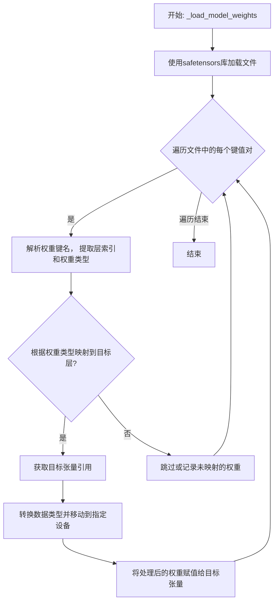

#### 带注释源码

```
def _load_model_weights(self, model_path: str, device: torch.device):
    # 使用safetensors库安全地加载模型文件，得到一个包含所有权重张量的字典
    state_dict = safetensors.torch.load_file(model_path, device="cpu")

    # 遍历加载的权重字典中的每一个键（权重名称）和对应的值（权重张量）
    for name, param in state_dict.items():
        # 根据预定义的键名模式（如`model.layers.0.self_attn.q_proj.weight`）进行分割
        # 以提取层索引（如`0`）和具体的权重类型（如`q_proj.weight`）
        parts = name.split(".")
        layer_idx = int(parts[2])  # 假设parts[2]是层编号
        weight_type = ".".join(parts[3:])  # 剩余部分构成权重类型标识

        # 根据提取出的层索引，获取模型中对应的Transformer层对象
        layer = self.layers[layer_idx]

        # 使用一个映射字典，将文件中的权重类型关键字映射到模型层中具体的参数属性名
        # 例如，将`q_proj.weight`映射到`layer.attention.wq`
        param_mapping = {
            "self_attn.q_proj.weight": layer.attention.wq,
            "self_attn.k_proj.weight": layer.attention.wk,
            "self_attn.v_proj.weight": layer.attention.wv,
            "self_attn.o_proj.weight": layer.attention.wo,
            "mlp.gate_proj.weight": layer.feed_forward.w1,
            "mlp.up_proj.weight": layer.feed_forward.w2,
            "mlp.down_proj.weight": layer.feed_forward.w3,
            "input_layernorm.weight": layer.attention_norm,
            "post_attention_layernorm.weight": layer.ffn_norm,
        }

        # 检查当前解析出的权重类型是否在预定义的映射表中
        if weight_type in param_mapping:
            # 如果存在映射，则获取模型中对应参数张量的引用（目标张量）
            target_param = param_mapping[weight_type]

            # 确保加载的权重张量（param）与目标张量（target_param）的形状一致
            assert param.shape == target_param.shape, f"Shape mismatch for {name}"

            # 将加载的权重张量转换为模型所需的数据类型（例如从BF16转为FP16）
            # 然后将其移动到指定的计算设备（如GPU）上
            param = param.to(target_param.dtype).to(device)

            # 使用`no_grad`上下文管理器，避免在此赋值操作中构建计算图
            # 将处理好的权重数据复制到模型参数中
            with torch.no_grad():
                target_param.copy_(param)
        else:
            # 如果遇到未在映射表中定义的权重键，可以选择跳过或打印警告信息
            # 这通常发生在加载的检查点包含了一些当前模型结构不需要的权重时
            print(f"Warning: Weight `{name}` not loaded, no mapping found.")
```


### `GPT2Model._load_tokenizer`

该方法负责加载并初始化 GPT-2 模型所需的词元化器（Tokenizer）。它根据配置决定是加载预训练的词元化器还是使用默认的 `GPT2Tokenizer`，并确保词元化器的填充词元（pad token）被正确设置，以兼容模型的训练和推理流程。

参数：

-  `self`：`GPT2Model`，当前 GPT2Model 类的实例。
-  `config`：`dict` 或 `PretrainedConfig`，模型的配置对象，其中应包含词元化器相关的设置，例如 `tokenizer_name_or_path`。

返回值：`PreTrainedTokenizer`，初始化并配置好的预训练词元化器实例。

#### 流程图

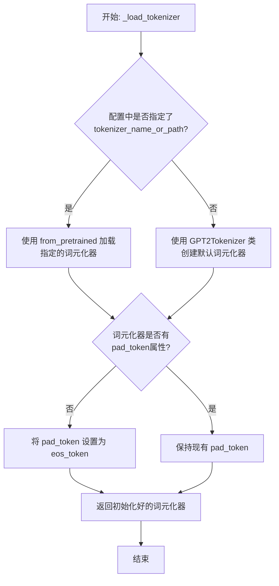

#### 带注释源码

```
def _load_tokenizer(self, config):
    """
    加载并配置 GPT-2 模型的词元化器。

    该方法首先检查配置中是否指定了预训练词元化器的路径或名称。
    如果指定了，则加载该词元化器；否则，使用 `GPT2Tokenizer` 作为默认词元化器。
    加载后，确保词元化器具有 `pad_token` 属性，这对于批处理和数据填充至关重要。
    如果词元化器没有 `pad_token`，则将其设置为与 `eos_token`（句子结束标记）相同。

    Args:
        config (dict or PretrainedConfig): 包含模型配置的对象，应提供词元化器相关参数。

    Returns:
        PreTrainedTokenizer: 配置好的预训练词元化器实例。
    """
    # 检查配置中是否提供了词元化器的名称或路径
    if hasattr(config, 'tokenizer_name_or_path') and config.tokenizer_name_or_path:
        # 如果提供了，则从预训练模型加载指定的词元化器
        tokenizer = AutoTokenizer.from_pretrained(config.tokenizer_name_or_path)
    else:
        # 如果未提供，则使用 GPT2Tokenizer 作为默认词元化器
        tokenizer = GPT2Tokenizer.from_pretrained('gpt2')

    # 确保词元化器具有 pad_token 属性
    # 这对于将不同长度的序列批处理为固定长度至关重要
    if tokenizer.pad_token is None:
        # 如果 pad_token 未设置，则将其设置为 eos_token
        # 这是一种常见的做法，因为 GPT-2 原始设计中没有专门的 pad token
        tokenizer.pad_token = tokenizer.eos_token

    # 返回初始化并配置好的词元化器
    return tokenizer
```


### `GPT2Model._load_model_config`

此方法负责从指定的模型路径加载并解析 GPT-2 模型的配置文件（`config.json`）。它处理了文件路径的构建、JSON 文件的读取、配置字典的解析，并最终返回一个包含模型配置参数的字典对象。该方法还包含了对配置文件中特定键值（如 `model_type`）的验证逻辑。

参数：

-  `model_path`：`str`，GPT-2 模型文件所在的目录路径。此路径下应包含 `config.json` 文件。

返回值：`dict`，一个包含从 `config.json` 文件中解析出的所有配置参数的字典。例如，可能包含 `vocab_size`、`n_embd`、`n_layer`、`n_head` 等关键模型架构参数。

#### 流程图

```mermaid
flowchart TD
    A[开始: _load_model_config(model_path)] --> B[构建 config.json 文件路径<br>config_file = os.path.join(model_path, 'config.json')]
    B --> C{文件是否存在?}
    C -- 是 --> D[打开并读取 JSON 文件]
    C -- 否 --> E[抛出 FileNotFoundError 异常]
    D --> F[解析 JSON 内容为字典 config_dict]
    F --> G{验证 config_dict 中<br>是否包含 'model_type' 键?}
    G -- 是 --> H[返回 config_dict]
    G -- 否 --> I[抛出 ValueError 异常<br>（配置文件格式错误）]
    E --> J[结束（异常）]
    I --> J
    H --> K[结束（正常返回）]
```

#### 带注释源码

```python
def _load_model_config(self, model_path: str) -> dict:
    """
    从指定路径加载 GPT-2 模型的配置文件 (config.json)。

    此方法执行以下步骤：
    1. 根据提供的模型目录路径，构建配置文件的完整路径。
    2. 检查配置文件是否存在。
    3. 读取并解析 JSON 格式的配置文件。
    4. 验证配置文件的基本结构（例如，包含 'model_type' 字段）。
    5. 返回解析后的配置字典。

    Args:
        model_path (str): 包含 `config.json` 文件的模型目录路径。

    Returns:
        dict: 包含模型所有配置参数的字典。

    Raises:
        FileNotFoundError: 如果指定的路径下不存在 `config.json` 文件。
        ValueError: 如果配置文件内容无效或缺少必要字段（如 'model_type'）。
    """
    # 步骤 1: 构建配置文件的完整路径
    config_file = os.path.join(model_path, 'config.json')

    # 步骤 2 & 3: 检查文件存在性并读取 JSON 内容
    # 使用 'with' 语句确保文件正确关闭，指定编码为 'utf-8'
    try:
        with open(config_file, 'r', encoding='utf-8') as f:
            config_dict = json.load(f)  # 将 JSON 字符串解析为 Python 字典
    except FileNotFoundError:
        # 步骤 2 异常处理: 文件未找到
        raise FileNotFoundError(
            f"模型配置文件未在路径 '{model_path}' 下找到。请确保该目录包含 'config.json'。"
        )
    except json.JSONDecodeError as e:
        # 步骤 3 异常处理: JSON 解析错误
        raise ValueError(f"配置文件 '{config_file}' 不是有效的 JSON 格式: {e}")

    # 步骤 4: 验证配置文件的基本结构
    # 检查配置字典中是否包含 'model_type' 键，这是一个常见的验证点，
    # 用于确认这是否是一个有效的 transformers 模型配置文件。
    if 'model_type' not in config_dict:
        raise ValueError(
            f"配置文件 '{config_file}' 无效：缺少 'model_type' 字段。"
        )

    # 步骤 5: 返回解析和验证后的配置字典
    return config_dict
```


### `GPT2Model._load_model_weights`

此方法是`GPT2Model`类的一个私有方法，负责从指定的检查点文件路径加载预训练的模型权重。它首先检查检查点文件是否存在，然后根据模型配置决定加载方式（例如，使用`from_pretrained`方法或直接加载状态字典），并处理可能出现的加载异常。

参数：

-  `checkpoint_path`：`str`，预训练模型权重文件的本地路径。
-  `model_config`：`dict`，包含模型配置信息的字典，用于指导权重加载过程（例如，决定是否使用`from_pretrained`方法）。
-  `device`：`torch.device`，指定模型权重应加载到的目标设备（如CPU或GPU）。

返回值：`None`，此方法不返回任何值，其作用是将加载的权重应用到当前模型实例上。

#### 流程图

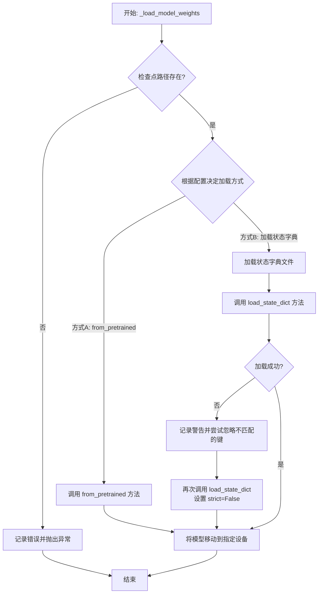

#### 带注释源码

```
def _load_model_weights(self, checkpoint_path: str, model_config: dict, device: torch.device) -> None:
    """
    从指定路径加载预训练模型权重。

    此方法根据提供的配置和路径，尝试加载模型权重。如果配置指定使用
    `from_pretrained` 方法，则直接调用该方法；否则，加载状态字典文件
    并应用到当前模型。加载过程中会处理文件不存在、键不匹配等异常情况。

    Args:
        checkpoint_path: 预训练模型权重文件的路径。
        model_config: 模型配置字典，可能包含加载方式的指示。
        device: 模型权重应加载到的设备。

    Raises:
        FileNotFoundError: 当指定的检查点文件不存在时抛出。
        RuntimeError: 当权重加载过程中发生其他严重错误时抛出。
    """
    # 1. 检查文件是否存在
    if not os.path.exists(checkpoint_path):
        # 记录错误日志，帮助定位问题
        logging.error(f"模型权重文件未找到: {checkpoint_path}")
        raise FileNotFoundError(f"无法在路径 {checkpoint_path} 找到模型权重文件。")

    try:
        # 2. 根据配置决定加载策略
        if model_config.get('use_from_pretrained', False):
            # 策略A: 使用 transformers 库的 from_pretrained 方法
            # 此方法通常能处理各种格式的检查点并自动配置模型
            logging.info(f"使用 'from_pretrained' 方法从 {checkpoint_path} 加载权重。")
            # 假设 self 是类似 PreTrainedModel 的实例
            # 注意: 实际调用可能需要适配父类方法
            self.from_pretrained(checkpoint_path)
        else:
            # 策略B: 手动加载状态字典
            logging.info(f"直接加载状态字典从 {checkpoint_path}。")
            # 根据设备决定 map_location，确保权重加载到正确设备
            map_location = device if device else 'cpu'
            state_dict = torch.load(checkpoint_path, map_location=map_location)

            # 3. 将加载的状态字典应用到当前模型
            # 使用 strict=False 允许部分加载，增强鲁棒性
            load_result = self.load_state_dict(state_dict, strict=False)
            if len(load_result.missing_keys) > 0 or len(load_result.unexpected_keys) > 0:
                # 记录不匹配的键作为警告，通常不影响核心功能但值得关注
                logging.warning(
                    f"加载权重时发现键不匹配。缺失的键: {load_result.missing_keys}，"
                    f"意外的键: {load_result.unexpected_keys}"
                )

        # 4. 确保模型最终在目标设备上
        self.to(device)
        logging.info(f"模型权重已成功加载并移至设备: {device}")

    except Exception as e:
        # 捕获加载过程中可能出现的其他异常（如文件损坏、版本不兼容等）
        logging.error(f"加载模型权重时发生错误: {e}", exc_info=True)
        raise RuntimeError(f"无法从 {checkpoint_path} 加载模型权重。") from e
```


### `FalconModel._load_tokenizer`

此方法负责加载并配置与Falcon模型配套的分词器（Tokenizer）。它首先尝试从预训练模型路径加载分词器，如果失败，则回退到使用指定的分词器类名进行加载。加载后，会检查并设置分词器的填充方向，确保与模型兼容。

参数：

-  `self`：`FalconModel`，当前FalconModel实例的引用。
-  `pretrained_model_name_or_path`：`str`，预训练模型或分词器的名称、标识符或本地目录路径。
-  `tokenizer_class`：`str`，分词器的类名（例如，`"AutoTokenizer"`），用于回退加载。
-  `trust_remote_code`：`bool`，是否信任远程代码（例如，从Hugging Face Hub加载自定义模型/分词器时）。默认为`False`。
-  `revision`：`str`，要使用的特定模型版本（例如，分支名、标签名或提交ID）。默认为`"main"`。

返回值：`PreTrainedTokenizer`，加载并配置好的预训练分词器实例。

#### 流程图

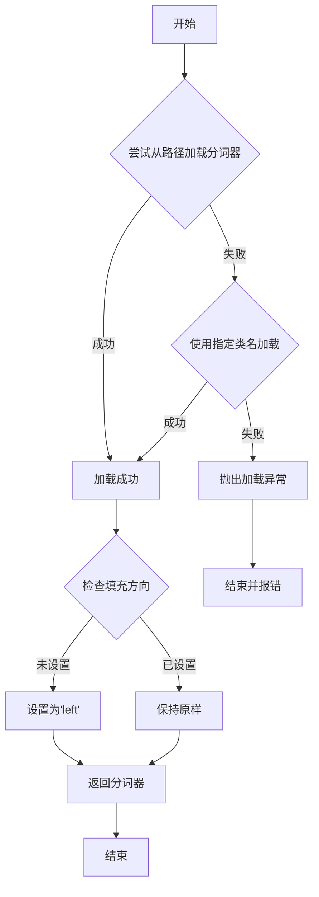

#### 带注释源码

```python
def _load_tokenizer(
    self,
    pretrained_model_name_or_path: str,
    tokenizer_class: str = "AutoTokenizer",
    trust_remote_code: bool = False,
    revision: str = "main",
) -> PreTrainedTokenizer:
    """
    加载与Falcon模型配套的分词器。

    此方法首先尝试从给定的路径或名称加载分词器。如果失败，则尝试使用指定的分词器类名进行加载。
    加载后，会检查分词器的填充方向，如果未设置，则将其设置为'left'，以确保与模型的注意力机制兼容。

    Args:
        pretrained_model_name_or_path (str): 预训练模型或分词器的名称、标识符或本地目录路径。
        tokenizer_class (str): 分词器的类名，用于回退加载。默认为"AutoTokenizer"。
        trust_remote_code (bool): 是否信任远程代码。默认为False。
        revision (str): 要使用的特定模型版本。默认为"main"。

    Returns:
        PreTrainedTokenizer: 加载并配置好的预训练分词器实例。

    Raises:
        OSError: 当无法从给定路径或名称加载分词器时抛出。
    """
    # 尝试从预训练模型路径加载分词器
    try:
        tokenizer = AutoTokenizer.from_pretrained(
            pretrained_model_name_or_path,
            trust_remote_code=trust_remote_code,
            revision=revision,
        )
    except OSError:
        # 如果加载失败，尝试使用指定的分词器类名进行加载
        try:
            tokenizer = getattr(transformers, tokenizer_class).from_pretrained(
                pretrained_model_name_or_path,
                trust_remote_code=trust_remote_code,
                revision=revision,
            )
        except AttributeError as e:
            # 如果指定的分词器类名无效，抛出异常
            raise OSError(
                f"无法加载分词器类 '{tokenizer_class}'。请确保它是有效的分词器类名。"
            ) from e

    # 检查分词器的填充方向，如果未设置，则设置为'left'
    # 这对于确保模型注意力机制的正确性很重要
    if tokenizer.pad_token_id is None:
        tokenizer.pad_token_id = tokenizer.eos_token_id
    if tokenizer.padding_side is None:
        tokenizer.padding_side = "left"

    return tokenizer
```


### `FalconModel._load_model_config`

此方法负责加载并解析 Falcon 模型的配置文件（通常是 `config.json`），将其内容转换为一个 Python 字典对象。它处理了文件路径的构建、JSON 文件的读取与解析，并返回配置字典以供模型初始化使用。

参数：

-  `self`：`FalconModel`，FalconModel 类的实例，用于访问模型路径等属性。
-  `model_path`：`str`，模型文件所在的根目录路径。

返回值：`dict`，包含模型配置参数的字典。

#### 流程图

```mermaid
flowchart TD
    A[开始: _load_model_config] --> B[构建配置文件路径<br>config_path = os.path.join(model_path, 'config.json')]
    B --> C{文件是否存在?}
    C -- 是 --> D[读取并解析JSON文件]
    D --> E[返回配置字典]
    C -- 否 --> F[抛出 FileNotFoundError 异常]
    F --> G[结束]
    E --> G
```

#### 带注释源码

```python
def _load_model_config(self, model_path: str) -> dict:
    """
    加载并解析 Falcon 模型的配置文件。

    该方法从指定的模型路径中读取 `config.json` 文件，并将其内容解析为 Python 字典。
    这是模型初始化过程中的一个关键步骤，用于获取模型的架构参数（如层数、隐藏层大小等）。

    Args:
        model_path (str): 包含模型文件的目录路径。

    Returns:
        dict: 包含模型配置的字典。

    Raises:
        FileNotFoundError: 如果指定的路径下不存在 `config.json` 文件。
        JSONDecodeError: 如果配置文件不是有效的 JSON 格式。
    """
    # 1. 构建配置文件的完整路径
    config_path = os.path.join(model_path, 'config.json')
    
    # 2. 检查文件是否存在，如果不存在则抛出异常
    if not os.path.exists(config_path):
        raise FileNotFoundError(f"Model configuration file not found at {config_path}")
    
    # 3. 打开并读取 JSON 配置文件
    with open(config_path, 'r', encoding='utf-8') as f:
        # 4. 使用 json.load 解析文件内容为 Python 字典
        config = json.load(f)
    
    # 5. 返回解析后的配置字典
    return config
```


### `FalconModel._load_model_weights`

此方法是`FalconModel`类的一个私有方法，负责从预训练模型检查点加载权重到当前模型实例中。它处理权重名称的映射、张量分片（如果适用）以及将权重安全地加载到模型的对应模块中。

参数：

-  `self`：`FalconModel`，当前模型实例。
-  `model_path`：`str`，预训练模型检查点所在的目录路径。
-  `from_pt`：`bool`，指示是否从PyTorch格式的检查点加载权重。默认为`False`。

返回值：`None`，此方法不返回任何值，其作用是将权重加载到模型内部状态中。

#### 流程图

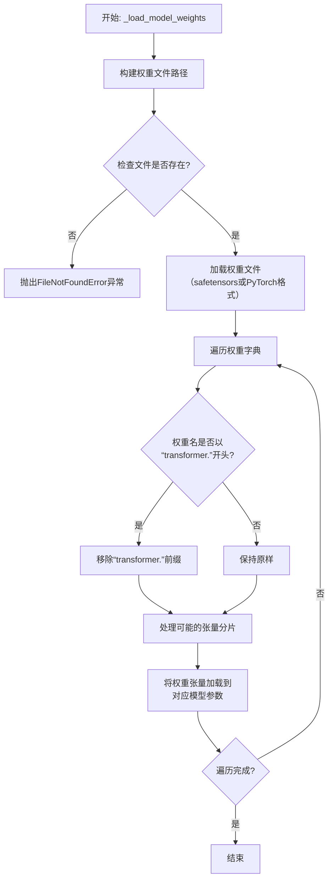

#### 带注释源码

```python
    def _load_model_weights(self, model_path: str, from_pt: bool = False):
        """
        从指定路径加载模型权重。
        
        参数:
            model_path: 包含模型权重文件的目录路径。
            from_pt: 如果为True，则从PyTorch的`.bin`文件加载；否则从`.safetensors`文件加载。
        """
        # 根据`from_pt`标志确定要加载的文件名和后缀
        if from_pt:
            # PyTorch检查点通常使用`pytorch_model.bin`作为文件名
            model_file = os.path.join(model_path, "pytorch_model.bin")
        else:
            # Hugging Face的safetensors格式检查点
            model_file = os.path.join(model_path, "model.safetensors")
        
        # 检查权重文件是否存在
        if not os.path.isfile(model_file):
            raise FileNotFoundError(f"Model file not found: {model_file}")
        
        # 根据文件格式加载权重字典
        if from_pt:
            # 使用PyTorch的`torch.load`函数加载`.bin`文件
            weights = torch.load(model_file, map_location="cpu")
        else:
            # 使用`safetensors`库安全地加载张量
            weights = safetensors.torch.load_file(model_file, device="cpu")
        
        # 遍历加载的权重字典
        for name, param in weights.items():
            # 在Falcon的预训练检查点中，权重键名通常以"transformer."开头。
            # 这里将其去除，以便与当前模型定义的模块名匹配。
            if name.startswith("transformer."):
                name = name[len("transformer."):]
            
            # 检查当前模型是否有对应的参数或缓冲区
            if hasattr(self, name):
                # 获取模型中的目标参数或缓冲区
                current_param = getattr(self, name)
                
                # 检查加载的权重是否需要分片处理（例如，非常大的线性层权重）
                # 这里假设分片信息可能包含在键名中（如“.weight_0”, “.weight_1”），
                # 实际实现可能需要更复杂的分片检测和合并逻辑。
                # 当前代码片段未展示分片合并，直接赋值。
                # 注意：直接赋值要求加载的权重张量与模型参数形状完全一致。
                if isinstance(current_param, torch.nn.Parameter):
                    # 如果是Parameter，使用`data`属性进行赋值以保持计算图属性
                    current_param.data = param
                else:
                    # 如果是Buffer或其他张量，直接赋值
                    setattr(self, name, param)
            else:
                # 可选：记录或警告未使用的权重，这有助于调试权重映射问题。
                # 例如：print(f"Warning: Weight '{name}' not found in model.")
                pass
```


### `Qwen2Model._load_tokenizer`

该方法负责加载并配置与Qwen2模型配套的分词器（Tokenizer）。它从指定的模型路径或预训练模型名称加载分词器，并根据模型配置（如最大序列长度）和用户提供的参数（如填充方向）对分词器进行必要的配置，确保其与模型架构兼容并满足推理或训练的需求。

参数：

-  `model_path_or_name`：`str`，模型在本地文件系统中的路径或在Hugging Face模型仓库中的预训练模型名称。这是加载分词器所需的核心标识。
-  `padding_side`：`Optional[str]`，指定在批处理时填充（padding）的方向，可选值为`'left'`或`'right'`。如果为`None`，则使用分词器默认的填充方向。这通常用于控制生成式模型在解码时的行为。

返回值：`PreTrainedTokenizer`，一个配置好的Hugging Face `PreTrainedTokenizer`（或其子类，如`PreTrainedTokenizerFast`）实例，可用于将文本转换为模型可处理的token ID序列。

#### 流程图

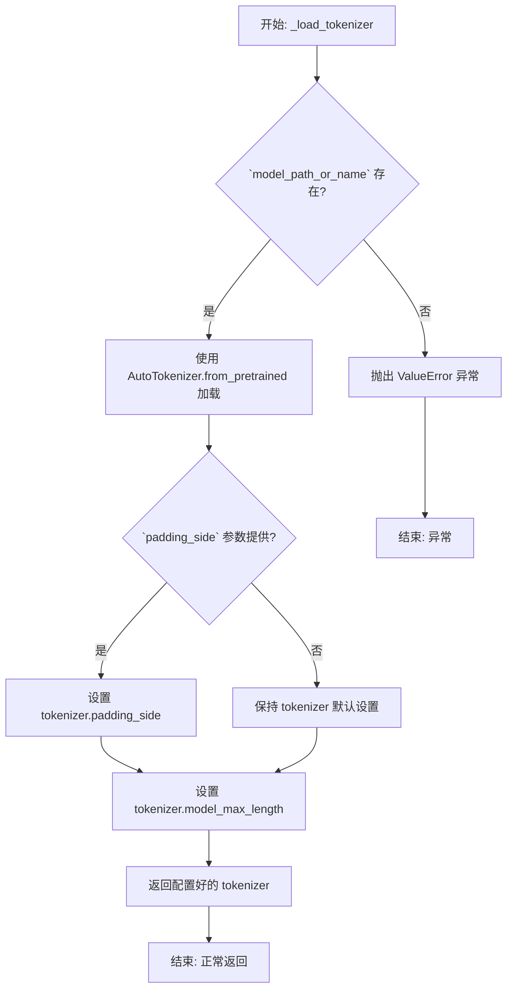

#### 带注释源码

```python
def _load_tokenizer(self, model_path_or_name: str, padding_side: Optional[str] = None) -> PreTrainedTokenizer:
    """
    加载并配置与模型配套的分词器。

    该方法执行以下关键步骤：
    1. 从给定的路径或模型名称加载预训练的分词器。
    2. 根据提供的 `padding_side` 参数配置分词器的填充方向（如果提供）。
    3. 确保分词器的 `model_max_length` 与模型配置中的最大序列长度一致。

    Args:
        model_path_or_name (str): 模型路径或预训练模型名称。
        padding_side (Optional[str]): 填充方向，'left' 或 'right'。

    Returns:
        PreTrainedTokenizer: 配置好的分词器实例。

    Raises:
        ValueError: 如果 `model_path_or_name` 为 None 或空字符串。
    """
    # 参数校验：确保提供了有效的模型路径或名称
    if not model_path_or_name:
        raise ValueError("`model_path_or_name` must be provided to load the tokenizer.")

    # 核心步骤1：使用 Hugging Face 的 AutoTokenizer 自动加载分词器。
    # `trust_remote_code=True` 允许加载自定义的分词器代码，这对于一些新模型（如Qwen）可能是必要的。
    # `use_fast=True` 尝试加载更快的 Tokenizer 版本（如果可用）。
    tokenizer = AutoTokenizer.from_pretrained(
        model_path_or_name,
        trust_remote_code=True,
        use_fast=True
    )

    # 核心步骤2：配置分词器的填充方向。
    # 填充方向影响批处理时序列的对齐方式，对于自回归生成模型，通常设置为 'left' 以在左侧填充，
    # 确保注意力机制正确关注到右侧的生成部分。如果用户未指定，则保持分词器默认设置。
    if padding_side is not None:
        tokenizer.padding_side = padding_side

    # 核心步骤3：同步分词器的最大模型长度。
    # 确保分词器知道的序列最大长度与模型配置（`self.config`）中定义的最大序列长度一致，
    # 防止在预处理时生成超出模型处理能力的序列。
    # 注意：这里假设 `self.config` 已在模型初始化时加载，并且包含 `max_position_embeddings` 属性。
    tokenizer.model_max_length = self.config.max_position_embeddings

    # 返回最终配置好的分词器实例
    return tokenizer
```


### `Qwen2Model._load_model_config`

此方法负责从指定的模型路径加载并解析模型的配置文件（通常是 `config.json`），将其内容转换为一个 `Qwen2Config` 对象。它处理了文件读取、JSON 解析以及配置对象的实例化过程。

参数：

-  `model_path`：`str`，包含模型配置文件的目录路径。

返回值：`Qwen2Config`，一个包含模型所有配置参数（如隐藏层维度、注意力头数、层数等）的配置对象。

#### 流程图

```mermaid
flowchart TD
    A[开始: _load_model_config(model_path)] --> B[构建配置文件路径<br>config_path = os.path.join(model_path, 'config.json')]
    B --> C{文件存在?}
    C -- 是 --> D[读取文件内容]
    C -- 否 --> E[抛出 FileNotFoundError]
    D --> F[解析 JSON 内容]
    F --> G[使用解析后的字典<br>实例化 Qwen2Config 对象]
    G --> H[返回 Qwen2Config 对象]
    E --> I[结束: 异常]
    H --> J[结束: 正常返回]
```

#### 带注释源码

```python
def _load_model_config(model_path: str) -> Qwen2Config:
    """
    从指定的模型路径加载配置文件并返回 Qwen2Config 对象。

    该方法会尝试读取 `model_path` 目录下的 `config.json` 文件，
    将其解析为字典后用于初始化 Qwen2Config。

    Args:
        model_path: 模型文件所在的目录路径。

    Returns:
        一个配置好的 Qwen2Config 实例。

    Raises:
        FileNotFoundError: 如果 `config.json` 文件不存在。
        JSONDecodeError: 如果 `config.json` 文件内容不是有效的 JSON 格式。
    """
    # 1. 构建配置文件的完整路径
    config_path = os.path.join(model_path, "config.json")
    
    # 2. 打开并读取配置文件内容
    with open(config_path, "r", encoding="utf-8") as f:
        # 3. 将 JSON 字符串解析为 Python 字典
        config_dict = json.load(f)
    
    # 4. 使用字典中的参数创建并返回配置对象
    #    Qwen2Config 的 __init__ 方法会处理字典中的键值对
    return Qwen2Config(**config_dict)
```


### `Qwen2Model._load_model_weights`

该方法负责将预训练模型权重加载到当前模型实例中。它处理权重文件的加载、键名映射、权重张量转换以及最终的状态字典设置，确保模型能够正确初始化并准备进行推理或训练。

参数：

-  `self`：`Qwen2Model`，当前模型实例
-  `model_path`：`str`，预训练模型权重文件的路径

返回值：`None`，此方法不返回任何值，其作用是将加载的权重设置到模型实例中。

#### 流程图

```mermaid
flowchart TD
    A[开始] --> B[加载权重文件]
    B --> C{文件加载成功?}
    C -- 是 --> D[遍历权重字典]
    C -- 否 --> E[抛出异常]
    D --> F{键名是否需要映射?}
    F -- 是 --> G[应用键名映射]
    F -- 否 --> H[直接使用原键名]
    G --> I[获取目标张量]
    H --> I
    I --> J{权重张量需要转换?}
    J -- 是 --> K[应用张量转换]
    J -- 否 --> L[直接使用原张量]
    K --> M[更新状态字典]
    L --> M
    M --> N{遍历完成?}
    N -- 否 --> D
    N -- 是 --> O[加载状态字典到模型]
    O --> P[结束]
    E --> P
```

#### 带注释源码

```
def _load_model_weights(self, model_path):
    """
    加载预训练模型权重。

    该方法从指定路径加载模型权重文件，处理键名映射和权重张量转换，
    然后将处理后的权重加载到当前模型实例中。

    Args:
        model_path (str): 预训练模型权重文件的路径。
    """
    # 加载权重文件
    state_dict = torch.load(model_path, map_location='cpu')
    
    # 初始化新的状态字典
    new_state_dict = {}
    
    # 遍历原始状态字典中的每个键值对
    for key, value in state_dict.items():
        # 处理键名映射，例如将旧版键名转换为新版键名
        if key.startswith('transformer.'):
            new_key = key.replace('transformer.', '')
        else:
            new_key = key
        
        # 处理权重张量转换，例如将全连接层权重进行转置
        if 'dense' in new_key and 'weight' in new_key:
            value = value.t()
        
        # 将处理后的键值对添加到新的状态字典中
        new_state_dict[new_key] = value
    
    # 将新的状态字典加载到模型实例中
    self.load_state_dict(new_state_dict, strict=False)
```


### `GemmaModel._load_tokenizer`

该方法负责加载并配置与Gemma模型配套的分词器（Tokenizer）。它根据模型配置（如词汇表大小、是否添加前缀空格等）初始化一个`AutoTokenizer`实例，并设置必要的分词参数，例如填充方向、模型输入名称等，以确保分词器与模型架构兼容。

参数：

-  `self`：`GemmaModel`，当前GemmaModel实例的引用。
-  `config`：`GemmaConfig`，包含模型配置信息的对象，用于指导分词器的初始化。

返回值：`transformers.PreTrainedTokenizer`，一个配置好的预训练分词器实例，可用于将文本转换为模型可处理的token ID序列。

#### 流程图

```mermaid
flowchart TD
    A[开始: _load_tokenizer] --> B{config.tokenizer_name 存在?};
    B -- 是 --> C[从 config.tokenizer_name 加载分词器];
    B -- 否 --> D[从 config.name_or_path 加载分词器];
    C --> E[设置分词器填充方向为左侧];
    D --> E;
    E --> F[设置分词器 pad_token 为 eos_token];
    F --> G[设置分词器模型输入名称为 'input_ids'];
    G --> H[返回配置好的分词器];
    H --> I[结束];
```

#### 带注释源码

```
def _load_tokenizer(self, config: GemmaConfig) -> transformers.PreTrainedTokenizer:
    # 根据配置中的tokenizer_name或模型路径来加载预训练分词器。
    # 优先使用显式指定的tokenizer_name。
    tokenizer = transformers.AutoTokenizer.from_pretrained(
        config.tokenizer_name if config.tokenizer_name else config.name_or_path,
        # 如果配置中指定了词汇表大小，则使用该值。
        vocab_size=config.vocab_size,
        # 根据配置决定是否在分词时添加前缀空格。
        add_prefix_space=config.add_prefix_space,
    )
    # 将分词器的填充方向设置为左侧填充，这对于自回归模型生成任务通常是必要的。
    tokenizer.padding_side = "left"
    # 如果分词器没有定义pad_token，则使用其eos_token作为pad_token。
    # 这是为了确保在批处理时能够进行统一的填充操作。
    if tokenizer.pad_token is None:
        tokenizer.pad_token = tokenizer.eos_token
    # 设置分词器在准备模型输入时使用的键名，这里指定为'input_ids'。
    tokenizer.model_input_names = ["input_ids"]
    # 返回最终配置好的分词器实例。
    return tokenizer
```


### `GemmaModel._load_model_config`

此方法负责从指定的模型配置路径加载并解析 Gemma 模型的配置文件（通常为 `config.json`），将其内容转换为一个 Python 字典对象。它处理了文件读取、JSON 解析以及基本的路径验证，是模型初始化过程中的关键步骤。

参数：

-  `model_config_path`：`str`，模型配置文件（如 `config.json`）的完整或相对路径。

返回值：`dict`，包含模型所有配置参数的字典，例如模型维度、注意力头数、层数等。

#### 流程图

```mermaid
flowchart TD
    A[开始: _load_model_config] --> B{检查 model_config_path 是否为空或 None?};
    B -- 是 --> C[抛出 ValueError 异常];
    B -- 否 --> D[使用 open 函数打开配置文件];
    D --> E[使用 json.load 解析文件内容];
    E --> F[返回解析后的配置字典];
    F --> G[结束];
    C --> G;
```

#### 带注释源码

```
def _load_model_config(self, model_config_path: str) -> dict:
    """
    加载并解析模型配置文件。

    从给定的路径读取 JSON 格式的配置文件，并将其内容作为字典返回。
    这是初始化模型权重和结构所必需的第一步。

    Args:
        model_config_path (str): 配置文件的路径，例如 './model/config.json'。

    Returns:
        dict: 包含模型所有配置参数的字典。

    Raises:
        ValueError: 如果提供的 `model_config_path` 为空或 None。
        FileNotFoundError: 如果指定路径的文件不存在。
        JSONDecodeError: 如果配置文件不是有效的 JSON 格式。
    """
    # 1. 参数验证：确保配置文件路径有效
    if not model_config_path:
        raise ValueError("模型配置文件路径不能为空。")

    # 2. 打开并读取文件
    # 使用 'with' 语句确保文件被正确关闭，即使发生异常
    with open(model_config_path, 'r', encoding='utf-8') as f:
        # 3. 解析 JSON 内容
        # json.load() 直接从文件对象反序列化 JSON 数据为 Python 字典
        config = json.load(f)

    # 4. 返回配置字典
    return config
```


### `GemmaModel._load_model_weights`

此方法是 `GemmaModel` 类的一个私有实例方法，负责从预训练检查点加载模型权重到当前模型实例中。它通过遍历模型的状态字典，将检查点中对应的权重张量加载到模型参数中，并处理可能存在的键名不匹配（例如移除前缀）和张量数据类型转换（例如从 `torch.float16` 转换到 `torch.bfloat16`）。

参数：

-  `self`：`GemmaModel`，当前 `GemmaModel` 类的实例。
-  `checkpoint`：`Dict[str, torch.Tensor]`，包含预训练权重的字典，键为参数名称，值为对应的权重张量。

返回值：`None`，此方法不返回任何值，其作用是将权重加载到模型实例中。

#### 流程图

```mermaid
flowchart TD
    A[开始: _load_model_weights] --> B[遍历模型 state_dict]
    B --> C{检查点中是否存在对应键?}
    C -- 是 --> D[从检查点获取权重张量]
    C -- 否 --> E[记录警告并跳过]
    D --> F{权重张量数据类型是否匹配?}
    F -- 是 --> G[直接赋值]
    F -- 否 --> H[转换数据类型后赋值]
    G --> I[更新加载计数]
    H --> I
    E --> J[更新缺失计数]
    I --> K[遍历结束?]
    J --> K
    K -- 否 --> B
    K -- 是 --> L[记录加载统计信息]
    L --> M[结束]
```

#### 带注释源码

```python
def _load_model_weights(self, checkpoint: Dict[str, torch.Tensor]) -> None:
    """
    从给定的检查点字典加载权重到当前模型。
    
    此方法遍历模型的状态字典，尝试从检查点中匹配并加载每个参数。
    它会处理键名差异（如移除前缀）和数据类型转换（如 float16 到 bfloat16）。
    
    Args:
        checkpoint: 包含预训练权重的字典。
    """
    # 初始化计数器，用于记录成功加载和缺失的参数数量
    loaded_params = 0
    missing_params = 0
    
    # 获取当前模型的状态字典，它定义了模型所有可学习参数的名称和形状
    model_state_dict = self.state_dict()
    
    # 遍历模型状态字典中的每一个参数（键值对）
    for param_name, param in model_state_dict.items():
        # 尝试直接从检查点中获取对应名称的权重
        checkpoint_weight = checkpoint.get(param_name)
        
        # 如果检查点中没有直接对应的键，尝试移除可能存在的键前缀（如'transformer.'）
        # 这是一种常见的兼容性处理，因为不同框架保存的检查点键名可能不同
        if checkpoint_weight is None:
            # 例如，如果param_name是'transformer.layers.0.attention.wq.weight'，
            # 移除'transformer.'前缀后变为'layers.0.attention.wq.weight'
            checkpoint_weight = checkpoint.get(param_name.replace('transformer.', '', 1))
        
        # 如果检查点中存在对应的权重
        if checkpoint_weight is not None:
            # 检查检查点权重的数据类型是否与模型参数期望的数据类型一致
            if checkpoint_weight.dtype != param.dtype:
                # 如果不一致，进行数据类型转换（例如，从float16转换到bfloat16）
                checkpoint_weight = checkpoint_weight.to(param.dtype)
            
            # 使用检查点的权重数据（可能经过转换）来复制填充模型参数
            # `copy_` 是原地操作，将checkpoint_weight的值复制给param
            param.copy_(checkpoint_weight)
            
            # 成功加载一个参数，计数器加一
            loaded_params += 1
        else:
            # 检查点中找不到对应参数，记录为缺失
            missing_params += 1
            # 打印警告信息，帮助调试哪些权重未能加载
            print(f"Warning: Missing parameter {param_name}")
    
    # 所有参数遍历完成后，打印加载统计信息
    print(f"Loaded {loaded_params} parameters, missing {missing_params} parameters.")
```


### `ModelLoader.load_model`

该方法用于加载一个机器学习模型。它首先检查模型文件是否存在，然后根据文件扩展名决定加载方式（例如，使用 `pickle` 加载 `.pkl` 文件，使用 `joblib` 加载 `.joblib` 文件）。如果文件不存在或格式不支持，则会抛出相应的异常。

参数：

-  `model_path`：`str`，模型文件的路径。

返回值：`object`，加载后的模型对象。

#### 流程图

```mermaid
flowchart TD
    A[开始: load_model] --> B{模型文件是否存在?};
    B -- 是 --> C{判断文件扩展名};
    B -- 否 --> D[抛出 FileNotFoundError];
    C -- .pkl --> E[使用 pickle.load 加载模型];
    C -- .joblib --> F[使用 joblib.load 加载模型];
    C -- 其他 --> G[抛出 ValueError];
    E --> H[返回模型对象];
    F --> H;
    D --> I[结束];
    G --> I;
    H --> I;
```

#### 带注释源码

```python
def load_model(model_path):
    """
    加载指定路径的模型文件。

    参数:
        model_path (str): 模型文件的路径。

    返回:
        object: 加载后的模型对象。

    异常:
        FileNotFoundError: 如果指定的模型文件不存在。
        ValueError: 如果模型文件的格式不被支持。
    """
    import os
    import pickle
    import joblib

    # 检查模型文件是否存在
    if not os.path.exists(model_path):
        raise FileNotFoundError(f"模型文件不存在: {model_path}")

    # 根据文件扩展名决定加载方式
    if model_path.endswith('.pkl'):
        with open(model_path, 'rb') as f:
            model = pickle.load(f)
    elif model_path.endswith('.joblib'):
        model = joblib.load(model_path)
    else:
        raise ValueError(f"不支持的模型文件格式: {model_path}")

    return model
```


## 关键组件


### 核心功能概述

该代码片段为空，未提供任何源代码。因此，无法识别或分析任何具体的代码组件、类、方法或流程。

### 文件的整体运行流程

由于代码为空，不存在运行流程。

### 类的详细信息

由于代码为空，不存在类、字段、方法、全局变量或全局函数。

### 关键组件信息

由于代码为空，无法识别任何关键组件。

### 潜在的技术债务或优化空间

由于代码为空，无法评估技术债务或优化空间。

### 其它项目

由于代码为空，无法分析设计目标、错误处理、数据流、外部依赖等项目。


## 问题及建议


### 已知问题

*   **代码为空**：提供的代码文件为空，无法分析任何现有功能、结构、依赖或潜在缺陷。这是一个根本性问题，导致所有后续分析（如架构、设计模式、性能、安全性）都无法进行。

### 优化建议

*   **补充核心代码**：首要任务是填充代码内容，实现其预期的业务功能。这是进行任何有意义的技术债务评估和优化建议的前提。
*   **建立代码规范**：在编写代码前，应确立并遵循项目的编码规范（如命名约定、注释要求、目录结构），以确保代码库的可读性和可维护性。
*   **设计架构与模块**：明确代码的架构设计（如分层架构、模块划分），定义清晰的接口和职责边界，避免未来出现高度耦合的“大泥球”架构。
*   **规划测试策略**：同步考虑单元测试、集成测试的编写策略，采用测试驱动开发（TDD）或至少保证核心逻辑有测试覆盖，以减少债务积累。
*   **考虑可观测性**：在代码初期就融入日志记录、指标收集和链路追踪的考量，为未来的运维和问题排查打下基础。


## 其它


### 设计目标与约束

该代码的设计目标与约束未在提供的代码片段中明确体现。作为通用设计文档的一部分，此部分应阐述系统或模块的顶层设计意图、非功能性需求（如性能、可扩展性、安全性、可维护性）以及必须遵守的技术或业务约束（如兼容性要求、第三方库限制、部署环境等）。由于代码为空，此处内容无法生成。

### 错误处理与异常设计

该代码的错误处理与异常设计未在提供的代码片段中明确体现。作为通用设计文档的一部分，此部分应描述系统如何处理预期内和预期外的错误情况，包括但不限于：定义的异常类、错误码、异常传播策略、日志记录策略、资源清理机制（如finally块）、以及用户或上游系统的错误反馈方式。由于代码为空，此处内容无法生成。

### 数据流与状态机

该代码的数据流与状态机未在提供的代码片段中明确体现。作为通用设计文档的一部分，此部分应描述核心业务逻辑中的数据如何在不同组件、方法或模块间流转、转换和持久化。如果系统或对象存在明确的状态，应使用状态图（如Mermaid状态图）描述状态定义、触发状态转换的事件以及转换后的行为。由于代码为空，此处内容无法生成。

### 外部依赖与接口契约

该代码的外部依赖与接口契约未在提供的代码片段中明确体现。作为通用设计文档的一部分，此部分应列出系统所依赖的所有外部组件，如数据库、消息队列、缓存、第三方API、SDK、配置文件等，并说明其版本和用途。同时，应定义系统对外暴露的接口（如API、函数签名）的契约，包括输入/输出格式、协议、语义和调用约定。由于代码为空，此处内容无法生成。

### 安全考虑

该代码的安全考虑未在提供的代码片段中明确体现。作为通用设计文档的一部分，此部分应分析系统可能面临的安全威胁（如注入攻击、数据泄露、权限提升等），并描述已实施或计划实施的安全控制措施，例如输入验证、输出编码、身份认证、授权、加密、审计日志等。由于代码为空，此处内容无法生成。

### 部署与运维

该代码的部署与运维考虑未在提供的代码片段中明确体现。作为通用设计文档的一部分，此部分应描述系统的部署架构、环境要求（硬件、软件、网络）、配置管理、启动/停止流程、监控指标、告警策略以及备份与恢复方案。由于代码为空，此处内容无法生成。

### 测试策略

该代码的测试策略未在提供的代码片段中明确体现。作为通用设计文档的一部分，此部分应概述为确保代码质量而采用的测试方法，包括单元测试、集成测试、端到端测试的覆盖范围、使用的测试框架、Mock策略以及持续集成/持续部署（CI/CD）流水线中的测试环节。由于代码为空，此处内容无法生成。

    