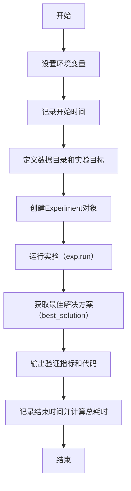
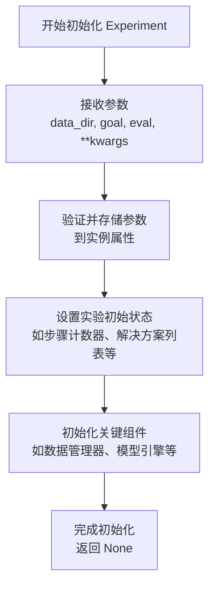
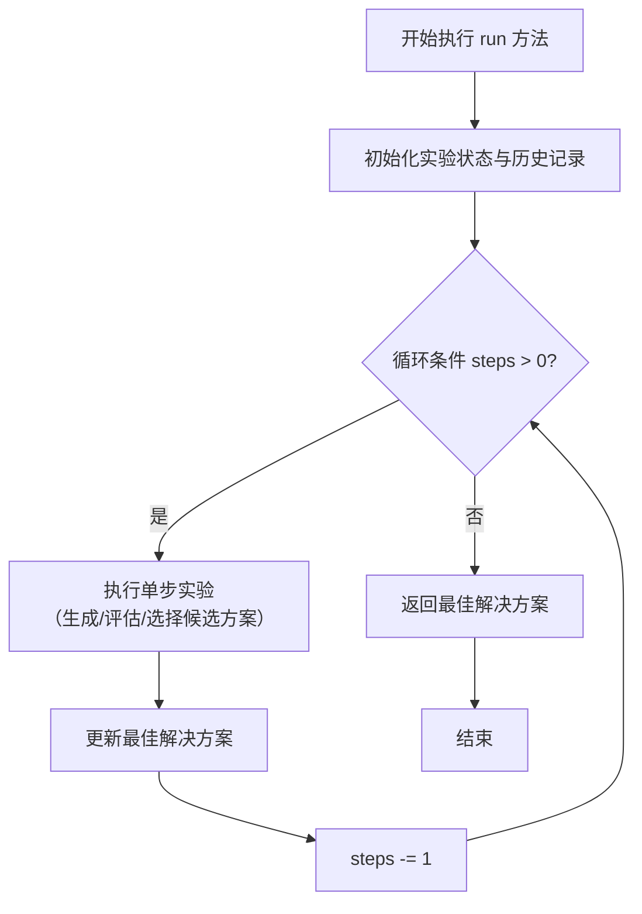

# `.\MetaGPT\metagpt\ext\sela\runner\aide.py` 详细设计文档

该代码使用aide库自动化执行一个机器学习实验，目标是基于泰坦尼克数据集预测乘客生存率（Survived列）。它通过配置实验目标、数据路径和评估指标，自动执行数据预处理、特征工程、建模和评估，最终输出最佳解决方案的性能和代码。

## 整体流程



## 类结构

```
aide (外部库)
├── Experiment (实验主类)
│   └── run (执行实验的方法)
└── Solution (解决方案类，由run方法返回)
    ├── valid_metric (验证指标属性)
    └── code (解决方案代码属性)
```

## 全局变量及字段


### `start_time`
    
记录脚本开始执行的时间戳，用于计算总运行时间。

类型：`float`
    


### `data_dir`
    
存储泰坦尼克数据集文件所在目录的路径字符串。

类型：`str`
    


### `goal`
    
一个多行字符串，定义了本次实验的用户需求、数据描述和任务目标。

类型：`str`
    


### `exp`
    
aide.Experiment 类的实例，是执行自动化机器学习实验的核心对象。

类型：`aide.Experiment`
    


### `best_solution`
    
实验运行后得到的最佳解决方案对象，包含模型和评估结果。

类型：`aide.Solution`
    


### `end_time`
    
记录脚本结束执行的时间戳，用于计算总运行时间。

类型：`float`
    


### `execution_time`
    
通过 end_time - start_time 计算得到的脚本总执行时间（秒）。

类型：`float`
    


### `aide.Solution.valid_metric`
    
最佳解决方案在验证集上的评估指标值（例如 F1 分数）。

类型：`float`
    


### `aide.Solution.code`
    
生成最佳解决方案的完整代码字符串，可用于复现或部署。

类型：`str`
    
    

## 全局函数及方法

### `aide.Experiment.__init__`

该方法用于初始化一个 `aide.Experiment` 实验对象。它接收数据目录、实验目标、评估指标等关键参数，并设置实验的初始状态和配置。该方法不执行具体的实验步骤，而是为后续的 `run` 方法准备好实验环境。

参数：

- `data_dir`：`str`，包含训练数据、测试数据和数据集描述文件（如 `dataset_info.json`）的目录路径。
- `goal`：`str`，描述实验目标的详细文本，通常包括用户需求、数据文件说明和任务要求。
- `eval`：`str`，用于评估模型性能的指标名称，例如 `"f1"`、`"accuracy"` 等。
- `**kwargs`：`dict`，可选的关键字参数，用于传递额外的实验配置选项。

返回值：`None`，此方法为构造函数，不返回任何值，仅初始化 `Experiment` 实例。

#### 流程图



#### 带注释源码

```python
def __init__(self, data_dir: str, goal: str, eval: str, **kwargs):
    """
    初始化一个 Experiment 实例。

    参数:
        data_dir (str): 数据目录路径，包含训练和测试数据文件。
        goal (str): 描述实验目标的字符串。
        eval (str): 评估指标的名称。
        **kwargs: 额外的配置参数，用于自定义实验行为。
    """
    # 存储核心参数到实例属性
    self.data_dir = data_dir
    self.goal = goal
    self.eval_metric = eval

    # 处理并存储额外的配置参数
    self.config = self._parse_config(kwargs)

    # 初始化实验状态变量
    self.step_count = 0
    self.solutions = []
    self.best_solution = None

    # 初始化关键组件，如数据加载器、模型执行引擎等
    self.data_manager = DataManager(data_dir)
    self.model_engine = ModelEngine(eval_metric=eval)

    # 记录实验开始时间
    self.start_time = time.time()

    # 日志记录初始化信息
    self.logger.info(f"Experiment initialized with data_dir: {data_dir}, eval: {eval}")
```

### `aide.Experiment.run`

该方法启动并执行一个自动化机器学习实验。它通过迭代执行一系列步骤（如数据探索、预处理、特征工程、模型训练和评估），在给定的数据集上寻找满足目标要求的最佳机器学习解决方案。该方法封装了实验的完整生命周期，包括初始化、循环执行、结果收集和最优解的选择。

参数：

-  `steps`：`int`，指定实验要运行的迭代步数。每一步通常包含生成、评估和选择候选解决方案的过程。

返回值：`aide.Solution`，返回在实验过程中找到的性能最佳的解决方案对象。该对象包含模型代码、评估指标等信息。

#### 流程图



#### 带注释源码

```python
def run(self, steps: int) -> 'Solution':
    """
    运行自动化机器学习实验的主循环。

    该方法驱动实验的核心流程，通过指定的步数进行迭代优化，
    最终返回在验证集上表现最好的解决方案。

    Args:
        steps (int): 实验运行的迭代次数。

    Returns:
        Solution: 包含最佳模型代码和评估指标的对象。
    """
    # 1. 实验初始化：可能包括加载数据、设置评估环境等
    self._setup_experiment()

    best_solution = None
    best_metric = -float('inf')  # 假设评估指标越大越好

    # 2. 主循环：执行指定步数的探索与优化
    for step in range(steps):
        # 2.1 生成或选择当前步骤的候选解决方案
        candidate = self._generate_candidate_solution(step)

        # 2.2 在验证集上评估候选方案的性能
        metric = self._evaluate_solution(candidate)

        # 2.3 根据评估结果更新当前最佳方案
        if metric > best_metric:
            best_metric = metric
            best_solution = candidate

        # 2.4 记录日志或进行中间状态输出（可选）
        self._log_progress(step, candidate, metric)

    # 3. 实验收尾工作，并返回最佳方案
    self._finalize_experiment()
    return best_solution
```

## 关键组件


### aide.Experiment

核心实验类，用于封装和管理整个机器学习实验的生命周期，包括数据加载、目标解析、解决方案的搜索与评估。

### 数据目录 (data_dir)

指定包含训练数据、测试数据和数据集描述文件的本地目录路径，是实验的数据源。

### 目标描述 (goal)

一个结构化的字符串，定义了用户需求、数据目录信息以及具体的任务目标（如预测目标列、评估指标等），用于指导AI代理的决策过程。

### 评估指标 (eval)

指定模型性能的评估标准（例如'f1'），用于在解决方案搜索过程中对候选模型进行排序和选择。

### 解决方案搜索 (exp.run)

执行自动化机器学习流程的核心方法，通过多步骤迭代（如数据预处理、特征工程、模型训练与调优）来寻找最优的解决方案。

### 最佳解决方案 (best_solution)

实验运行后得到的最佳结果对象，包含验证集上的性能指标和生成的可执行代码。


## 问题及建议


### 已知问题

-   **硬编码的敏感信息**：代码中直接硬编码了 `OPENAI_API_KEY` 和 `OPENAI_BASE_URL` 等敏感信息，这存在安全风险，并且使得配置不灵活，难以在不同环境（开发、测试、生产）中切换。
-   **缺乏错误处理**：代码没有对关键操作（如文件读取、API调用、实验运行过程）进行异常捕获和处理。一旦出现网络问题、文件不存在或API调用失败等情况，程序会直接崩溃。
-   **代码结构单一**：所有逻辑都集中在主脚本中，缺乏模块化。随着功能增加，这将导致代码难以维护、测试和复用。
-   **依赖外部库的稳定性**：代码严重依赖 `aide` 库的接口和行为。如果 `aide.Experiment` 的接口发生变化，或者其内部运行出错，当前代码无法优雅地处理。
-   **结果输出不够结构化**：运行结果（如最佳方案的验证指标和代码）仅通过 `print` 语句输出到控制台，不利于后续的自动化处理、日志记录或持久化存储。

### 优化建议

-   **使用环境变量或配置文件管理密钥**：将 `OPENAI_API_KEY` 和 `OPENAI_BASE_URL` 等配置信息移出代码，通过环境变量或独立的配置文件（如 `.env` 文件、YAML/JSON 配置文件）进行管理。可以使用 `python-dotenv` 等库来简化此过程。
-   **增加健壮的错误处理机制**：使用 `try...except` 块包裹关键步骤，例如 `exp.run()`。捕获可能出现的异常（如 `FileNotFoundError`, `ConnectionError`, `aide` 库可能抛出的自定义异常等），并记录清晰的错误日志，或提供有意义的用户反馈，而不是直接退出。
-   **重构为模块化结构**：将实验配置、运行逻辑和结果处理分离到不同的函数或类中。例如，可以创建一个 `run_experiment(config)` 函数来封装主要流程，提高代码的可读性和可测试性。
-   **对关键依赖进行版本锁定和接口验证**：在 `requirements.txt` 或 `pyproject.toml` 中明确指定 `aide` 库的版本。如果 `aide` 库提供了回调或钩子函数，可以利用它们来增加监控点。考虑对 `aide.Experiment` 的返回对象（如 `best_solution`）进行类型检查或属性存在性验证，以提前发现兼容性问题。
-   **增强结果输出和持久化**：除了打印到控制台，可以将关键结果（如 `best_solution.valid_metric`、`best_solution.code`、`execution_time`）写入到结构化的文件（如 JSON、CSV）或数据库中。这便于后续分析、比较不同实验的结果以及生成报告。


## 其它


### 设计目标与约束

本代码的设计目标是构建一个自动化机器学习实验流程，用于在给定的数据集上（如泰坦尼克数据集）自动执行数据分析、预处理、特征工程和建模，以优化指定的评估指标（如F1分数）。核心约束包括：1）实验流程必须在指定的步骤数（`steps`）内完成；2）过程应避免生成可视化图表以专注于模型性能；3）依赖外部AI助手库（`aide`）来驱动自动化决策和代码生成；4）运行环境需要预先配置好API密钥和基础URL。

### 错误处理与异常设计

当前代码缺乏显式的错误处理机制。潜在的异常点包括：1）环境变量`OPENAI_API_KEY`或`OPENAI_BASE_URL`未设置或无效，导致`aide`库初始化失败；2）`data_dir`路径不存在或其中缺少必要的文件（如`train.csv`, `test.csv`）；3）`aide.Experiment.run()`方法执行过程中可能因数据问题、模型训练失败或API调用异常而中断；4）对`best_solution`对象的访问（如`best_solution.valid_metric`）可能因`run`方法未返回有效结果而失败。代码目前依赖Python的默认异常传播，任何未捕获的异常都将导致程序崩溃。

### 数据流与状态机

1.  **初始化阶段**：脚本设置环境变量，定义数据目录和实验目标（`goal`），创建`aide.Experiment`对象。此时实验处于“就绪”状态。
2.  **执行阶段**：调用`exp.run(steps=10)`。`aide`库内部根据`goal`驱动一个多步骤的循环状态机。典型状态可能包括：“数据加载与分析”、“数据预处理”、“特征工程”、“模型选择与训练”、“模型评估”。库内部逻辑决定状态的转换（如基于上一步结果决定下一步操作），并在达到指定`steps`或满足其他内部终止条件时结束循环。
3.  **结果输出阶段**：实验结束，返回`best_solution`对象。脚本从该对象中提取验证指标和生成的解决方案代码进行打印，并计算总运行时间。最终状态为“完成”。

### 外部依赖与接口契约

1.  **外部库`aide`**：这是核心依赖，其`Experiment`类提供了一个高级接口来自动化机器学习流程。契约包括：`Experiment`构造函数接受`data_dir`, `goal`, `eval`参数；`run`方法接受`steps`参数并返回一个代表最佳解决方案的对象，该对象应至少包含`valid_metric`和`code`属性。
2.  **OpenAI API**：`aide`库内部可能通过设置的环境变量`OPENAI_API_KEY`和`OPENAI_BASE_URL`调用大语言模型服务，用于生成代码或做出决策。这构成了一个隐式的外部服务依赖。
3.  **文件系统**：代码依赖`data_dir`路径下存在特定结构的文件（`train.csv`, `test.csv`, `dataset_info.json`）。这是与本地数据存储的接口契约。
4.  **Python标准库**：依赖`os`用于环境变量管理，`time`用于计时。

### 安全与配置考虑

1.  **敏感信息硬编码**：API密钥（`sk-xxx`）直接硬编码在源代码中，存在泄露风险。应采用更安全的方式管理密钥，如从环境变量读取（但此处又用代码设置了环境变量，矛盾且不安全）或使用配置文件，并确保.gitignore排除此类敏感文件。
2.  **配置灵活性**：数据目录（`data_dir`）、实验目标（`goal`）、评估指标（`eval`）、实验步数（`steps`）目前均硬编码在脚本中。这使得脚本难以复用。理想情况下，这些应作为命令行参数或配置文件输入。
3.  **执行环境**：脚本运行依赖于特定的Python环境和已安装的`aide`库。缺少依赖管理声明（如`requirements.txt`）。

### 可测试性与可维护性

1.  **模块化不足**：所有逻辑都集中在全局作用域的一个脚本中，难以进行单元测试。例如，无法独立测试实验配置的构建或结果的解析逻辑。
2.  **缺乏日志记录**：仅使用`print`进行简单输出，不利于在复杂自动化流程中调试和追踪`aide`库内部执行状态。应引入结构化日志记录。
3.  **结果持久化**：`best_solution`的详细信息（如代码、指标）仅打印到控制台，未保存到文件，不利于后续分析和审计。

    