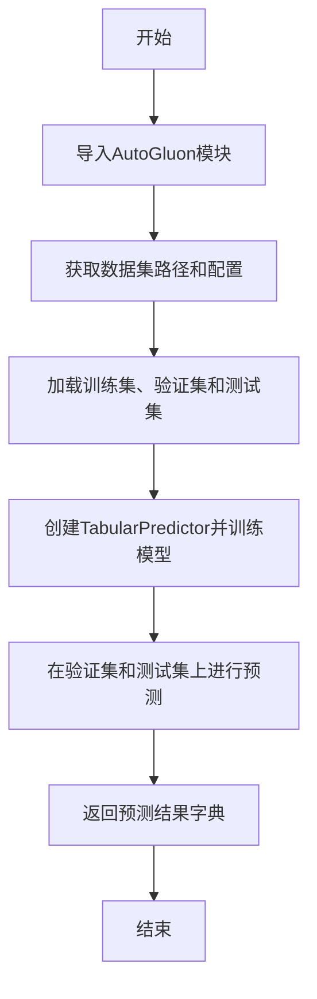
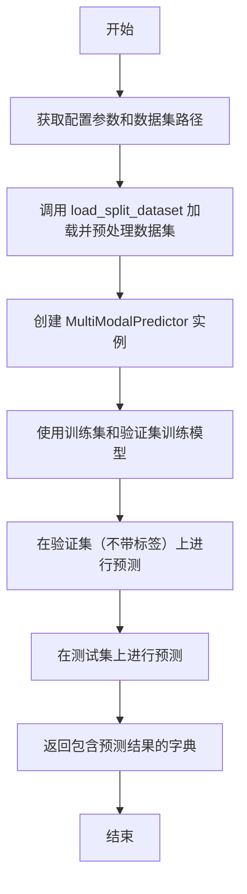
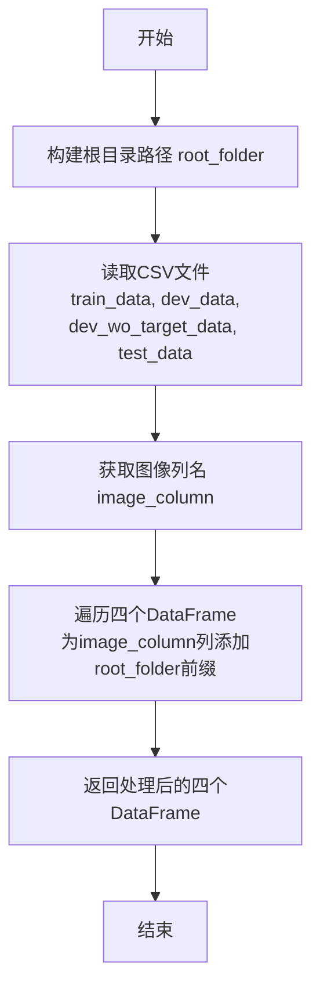
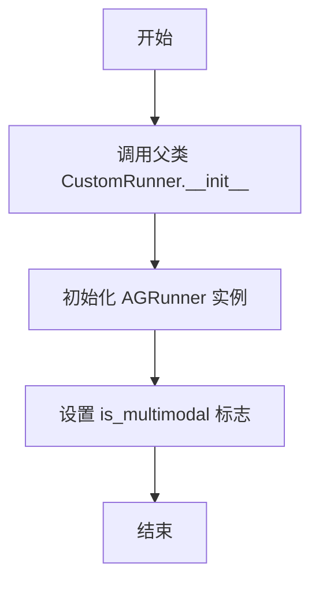
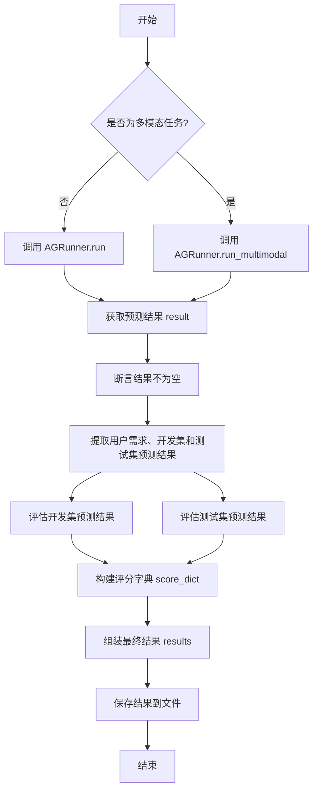

# `.\MetaGPT\metagpt\ext\sela\runner\autogluon.py` 详细设计文档

该代码定义了两个运行器类（AGRunner和GluonRunner），用于封装和自动化AutoGluon机器学习框架的训练与预测流程。AGRunner负责核心的模型训练和预测逻辑，支持表格数据和多模态数据；GluonRunner作为自定义运行器，负责实验流程的编排、结果评估与保存。代码通过读取配置文件中的数据集路径和任务参数，自动加载数据、训练模型、进行预测并评估性能。

## 整体流程

```mermaid
graph TD
    A[开始] --> B[GluonRunner初始化]
    B --> C{是否为多模态任务?}
    C -- 否 --> D[调用AGRunner.run()]
    C -- 是 --> E[调用AGRunner.run_multimodal()]
    D --> F[加载表格数据]
    D --> G[训练TabularPredictor]
    E --> H[加载多模态数据]
    E --> I[训练MultiModalPredictor]
    F --> J[进行预测]
    G --> J
    H --> J
    I --> J
    J --> K[评估预测结果]
    K --> L[保存结果]
    L --> M[结束]
```

## 类结构

```
CustomRunner (父类，来自metagpt.ext.sela.runner.custom)
└── GluonRunner
    └── AGRunner (组合关系)
```

## 全局变量及字段


### `AGRunner.state`
    
存储运行器配置和任务状态的字典，包含数据集路径、任务配置等信息。

类型：`dict`
    


### `AGRunner.datasets`
    
从state中提取的数据集路径字典，包含训练集、验证集和测试集的路径。

类型：`dict`
    


### `GluonRunner.result_path`
    
存储AutoGluon运行结果的默认目录路径。

类型：`str`
    


### `GluonRunner.framework`
    
AGRunner实例，用于执行具体的AutoGluon训练和预测任务。

类型：`AGRunner`
    


### `GluonRunner.is_multimodal`
    
布尔标志，指示当前任务是否为多模态任务，决定使用TabularPredictor还是MultiModalPredictor。

类型：`bool`
    
    

## 全局函数及方法


### `AGRunner.__init__`

AGRunner 类的构造函数，用于初始化AGRunner实例。它接收一个状态字典，并将其存储在实例变量中，同时从状态字典中提取数据集目录路径。

参数：

-  `state`：`dict`，包含配置信息和数据集路径的字典。如果为None，则实例的state字段将为None。

返回值：`None`，构造函数不返回任何值。

#### 流程图

```mermaid
flowchart TD
    A[开始: AGRunner.__init__] --> B{state 参数是否为 None?}
    B -- 是 --> C[设置 self.state = None]
    B -- 否 --> D[设置 self.state = state]
    D --> E[从 state['datasets_dir'] 获取数据集路径]
    E --> F[设置 self.datasets = 获取的路径]
    C --> G[结束]
    F --> G
```

#### 带注释源码

```python
def __init__(self, state=None):
    # 将传入的状态字典（或None）保存为实例变量
    self.state = state
    # 从状态字典中提取键为'datasets_dir'的值，并将其赋值给实例变量self.datasets
    # 如果state为None，此行代码将引发KeyError异常
    self.datasets = self.state["datasets_dir"]
```


### `AGRunner.run`

该方法使用AutoGluon库的TabularPredictor进行表格数据的训练和预测。它加载训练集、验证集和测试集，训练一个表格预测模型，并在验证集（无标签）和测试集上进行预测，最后返回预测结果。

参数：

-  `self`：`AGRunner`，AGRunner类的实例

返回值：`dict`，包含测试集和验证集的预测结果，键为"test_preds"和"dev_preds"

#### 流程图



#### 带注释源码

```python
def run(self):
    # 导入AutoGluon的表格数据集和预测器模块
    from autogluon.tabular import TabularDataset, TabularPredictor

    # 从状态中获取训练集、验证集和测试集的路径
    train_path = self.datasets["train"]
    dev_path = self.datasets["dev"]
    dev_wo_target_path = self.datasets["dev_wo_target"]
    test_wo_target_path = self.datasets["test_wo_target"]
    
    # 获取目标列和评估指标
    target_col = self.state["dataset_config"]["target_col"]
    
    # 加载训练集、验证集和测试集数据
    train_data = TabularDataset(train_path)
    dev_data = TabularDataset(dev_path)
    dev_wo_target_data = TabularDataset(dev_wo_target_path)
    test_data = TabularDataset(test_wo_target_path)
    
    # 处理评估指标名称，将空格替换为下划线
    eval_metric = self.state["dataset_config"]["metric"].replace(" ", "_")
    
    # 创建TabularPredictor实例并训练模型
    predictor = TabularPredictor(
        label=target_col,
        eval_metric=eval_metric,
        # 设置模型保存路径，包含任务名称和时间戳
        path="AutogluonModels/ag-{}-{}".format(self.state["task"], datetime.now().strftime("%y%m%d_%H%M")),
    ).fit(train_data=train_data, tuning_data=dev_data, num_gpus=1)  # 使用1个GPU进行训练
    
    # 在验证集（无标签）和测试集上进行预测
    dev_preds = predictor.predict(dev_wo_target_data)
    test_preds = predictor.predict(test_data)
    
    # 返回包含测试集和验证集预测结果的字典
    return {"test_preds": test_preds, "dev_preds": dev_preds}
```

### `AGRunner.run_multimodal`

该方法使用 AutoGluon 的多模态预测器（MultiModalPredictor）对包含图像和表格数据的多模态数据集进行训练和预测。它首先加载并预处理训练集、验证集（带标签和不带标签）以及测试集，然后训练一个多模态模型，最后在验证集（不带标签）和测试集上进行预测，并返回预测结果。

参数：
- `self`：`AGRunner`，`AGRunner` 类的实例，包含任务状态和数据集路径。

返回值：`dict`，包含两个键值对：`"dev_preds"` 对应验证集（不带标签）的预测结果，`"test_preds"` 对应测试集的预测结果。

#### 流程图



#### 带注释源码

```python
def run_multimodal(self):
    # 导入 AutoGluon 的多模态预测器模块
    from autogluon.multimodal import MultiModalPredictor

    # 从状态配置中获取目标列名称
    target_col = self.state["dataset_config"]["target_col"]
    # 获取训练集、验证集（带标签）、验证集（不带标签）和测试集的路径
    train_path = self.datasets["train"]
    dev_path = self.datasets["dev"]
    dev_wo_target_path = self.datasets["dev_wo_target"]  # Updated variable name
    test_wo_target_path = self.datasets["test_wo_target"]
    # 获取评估指标，并替换空格为下划线以符合 AutoGluon 的格式要求
    eval_metric = self.state["dataset_config"]["metric"].replace(" ", "_")

    # 调用 load_split_dataset 方法加载并预处理数据集
    # 该方法会读取 CSV 文件，并为图像路径列添加根目录前缀
    train_data, dev_data, dev_wo_target_data, test_data = self.load_split_dataset(
        train_path, dev_path, dev_wo_target_path, test_wo_target_path
    )

    # 创建 MultiModalPredictor 实例
    # label: 指定目标列
    # eval_metric: 指定评估指标
    # path: 指定模型保存路径，路径中包含任务名称和时间戳以确保唯一性
    predictor = MultiModalPredictor(
        label=target_col,
        eval_metric=eval_metric,
        path="AutogluonModels/ag-{}-{}".format(self.state["task"], datetime.now().strftime("%y%m%d_%H%M")),
    ).fit(train_data=train_data, tuning_data=dev_data)  # 使用训练集和验证集（带标签）训练模型

    # 使用训练好的模型在验证集（不带标签）上进行预测
    dev_preds = predictor.predict(dev_wo_target_data)
    # 使用训练好的模型在测试集上进行预测
    test_preds = predictor.predict(test_data)

    # 返回一个字典，包含验证集和测试集的预测结果
    return {"dev_preds": dev_preds, "test_preds": test_preds}
```


### `AGRunner.load_split_dataset`

该方法用于加载并预处理训练集、开发集（含标签）、开发集（无标签）和测试集（无标签）四个CSV格式的数据集文件。其核心功能是读取这些文件，并统一为每个数据集中的图像路径列（假设为第一列）添加一个基于任务名称的根目录前缀，以确保后续模型训练和预测时能够正确访问图像文件。

参数：

-  `train_path`：`str`，训练数据集的CSV文件路径。
-  `dev_path`：`str`，包含目标标签的开发数据集的CSV文件路径。
-  `dev_wo_target_path`：`str`，不包含目标标签的开发数据集的CSV文件路径。
-  `test_wo_target_path`：`str`，不包含目标标签的测试数据集的CSV文件路径。

返回值：`tuple[pd.DataFrame, pd.DataFrame, pd.DataFrame, pd.DataFrame]`，返回一个包含四个`pandas.DataFrame`对象的元组，分别对应处理后的训练数据、带标签的开发数据、无标签的开发数据和无标签的测试数据。

#### 流程图



#### 带注释源码

```python
def load_split_dataset(self, train_path, dev_path, dev_wo_target_path, test_wo_target_path):
    """
    Loads training, dev, and test datasets from given file paths

    Args:
        train_path (str): Path to the training dataset.
        dev_path (str): Path to the dev dataset with target labels.
        dev_wo_target_path (str): Path to the dev dataset without target labels.
        test_wo_target_path (str): Path to the test dataset without target labels.

    Returns:
        train_data (pd.DataFrame): Loaded training dataset with updated image paths.
        dev_data (pd.DataFrame): Loaded dev dataset with updated image paths.
        dev_wo_target_data (pd.DataFrame): Loaded dev dataset without target labels and updated image paths.
        test_data (pd.DataFrame): Loaded test dataset with updated image paths.
    """

    # 定义要追加的根路径，路径基于当前任务名称动态构建
    root_folder = os.path.join("F:/Download/Dataset/", self.state["task"])

    # 加载数据集：使用pandas读取CSV文件
    train_data = pd.read_csv(train_path)
    dev_data = pd.read_csv(dev_path)  # 加载带标签的开发集
    dev_wo_target_data = pd.read_csv(dev_wo_target_path)  # 加载无标签的开发集
    test_data = pd.read_csv(test_wo_target_path)

    # 获取第一列的列名，假设该列为图像路径列
    image_column = train_data.columns[0]

    # 为每个数据集的图像路径列添加根目录前缀
    # 使用apply和lambda函数遍历该列的每个值，与root_folder拼接
    train_data[image_column] = train_data[image_column].apply(lambda x: os.path.join(root_folder, x))
    dev_data[image_column] = dev_data[image_column].apply(lambda x: os.path.join(root_folder, x))
    dev_wo_target_data[image_column] = dev_wo_target_data[image_column].apply(
        lambda x: os.path.join(root_folder, x)
    )
    test_data[image_column] = test_data[image_column].apply(lambda x: os.path.join(root_folder, x))

    # 返回处理后的四个数据集
    return train_data, dev_data, dev_wo_target_data, test_data
```


### `GluonRunner.__init__`

该方法用于初始化 `GluonRunner` 类的实例。它首先调用父类 `CustomRunner` 的构造函数，然后根据传入的参数初始化 `AGRunner` 实例，并设置一个标志位 `is_multimodal` 以指示是否使用多模态模型。

参数：

- `args`：`argparse.Namespace` 或类似对象，包含命令行参数或配置参数。
- `**kwargs`：可变关键字参数，传递给父类 `CustomRunner` 的构造函数。

返回值：`None`，构造函数不返回任何值。

#### 流程图



#### 带注释源码

```python
def __init__(self, args, **kwargs):
    # 调用父类 CustomRunner 的构造函数，传递 args 和 kwargs
    super().__init__(args, **kwargs)
    # 初始化 AGRunner 实例，将当前状态传递给 AGRunner
    self.framework = AGRunner(self.state)
    # 检查 args 是否包含 is_multimodal 属性，如果存在则使用其值，否则默认为 False
    self.is_multimodal = args.is_multimodal if hasattr(args, "is_multimodal") else False
```

### `GluonRunner.run_experiment`

该方法根据配置选择使用 AutoGluon 的表格预测模型或多模态预测模型进行训练和预测，评估预测结果，并将结果保存到指定路径。

参数：
- 无显式参数，但依赖于 `self.is_multimodal` 和 `self.state` 等实例属性。

返回值：`None`，该方法不直接返回值，但会将结果保存到文件。

#### 流程图



#### 带注释源码

```python
async def run_experiment(self):
    # 根据是否为多模态任务，调用不同的运行方法
    if not self.is_multimodal:
        result = self.framework.run()  # 运行表格预测任务
    else:
        result = self.framework.run_multimodal()  # 运行多模态预测任务

    # 确保结果不为空
    assert result is not None
    # 从状态中获取用户需求
    user_requirement = self.state["requirement"]
    # 从结果中提取开发集和测试集的预测结果
    dev_preds = result["dev_preds"]
    test_preds = result["test_preds"]
    # 评估预测结果并构建评分字典
    score_dict = {
        "dev_score": self.evaluate_predictions(dev_preds, "dev"),
        "test_score": self.evaluate_predictions(test_preds, "test"),
    }
    # 组装最终结果，包含评分字典、用户需求和参数
    results = [0, {"score_dict": score_dict, "user_requirement": user_requirement, "args": vars(self.args)}]
    # 保存结果到文件
    self.save_result(results)
```

## 关键组件


### AGRunner

AGRunner 是执行 AutoGluon 模型训练和预测的核心运行器，它根据配置状态加载数据集，初始化 AutoGluon 的 TabularPredictor 或 MultiModalPredictor 进行模型训练，并对开发集和测试集进行预测。

### GluonRunner

GluonRunner 是继承自 CustomRunner 的实验运行器，它封装了 AGRunner，负责根据命令行参数决定使用表格数据还是多模态数据模式，执行实验流程，评估预测结果，并将最终结果保存到指定路径。


## 问题及建议


### 已知问题

-   **硬编码的根路径**：`load_split_dataset` 方法中硬编码了根路径 `"F:/Download/Dataset/"`。这使得代码无法在不同环境或不同数据集目录结构下运行，严重限制了可移植性和灵活性。
-   **缺乏输入验证**：代码未对 `self.state` 字典中的关键键（如 `datasets_dir`、`dataset_config`）是否存在进行验证。如果传入的 `state` 字典结构不符合预期，将导致运行时 `KeyError` 异常。
-   **同步阻塞调用**：`GluonRunner.run_experiment` 方法被标记为 `async`，但其内部调用的 `AGRunner.run` 或 `run_multimodal` 方法是同步且可能长时间运行的（模型训练）。这会导致事件循环阻塞，违背了异步方法的初衷，可能影响整个应用的响应性。
-   **资源管理不足**：代码在训练模型（`TabularPredictor.fit` 和 `MultiModalPredictor.fit`）时，没有显式地管理计算资源（如GPU）。虽然 `TabularPredictor.fit` 中指定了 `num_gpus=1`，但缺乏对GPU可用性的检查或优雅的回退机制。模型保存路径也缺乏清理旧模型的逻辑。
-   **错误处理缺失**：整个流程缺乏异常处理（try-except）。文件读取失败、模型训练出错、预测失败等场景都会导致程序崩溃，没有提供错误恢复或用户友好的错误信息。
-   **代码重复**：`run` 和 `run_multimodal` 方法在加载数据集路径、构建模型保存路径等逻辑上存在重复。`load_split_dataset` 方法的引入部分解决了 `run_multimodal` 的重复，但 `run` 方法仍独立实现了类似的数据加载逻辑。
-   **配置耦合**：`AGRunner` 的初始化依赖于一个结构复杂的 `state` 字典。这种紧耦合使得类难以独立测试，且其接口不清晰，使用者必须了解 `state` 字典的内部结构。

### 优化建议

-   **解耦配置与路径**：将根路径 `"F:/Download/Dataset/"` 提取为配置项（如环境变量、配置文件参数），并通过构造函数或方法参数传入 `AGRunner` 或 `load_split_dataset`。`load_split_dataset` 方法应接收一个可选的 `root_folder` 参数。
-   **增加输入验证与默认值**：在 `AGRunner.__init__` 和 `load_split_dataset` 等方法开头，使用 `dict.get()` 并提供合理的默认值，或显式检查必要键是否存在并抛出清晰的 `ValueError`。
-   **将耗时操作异步化或移出事件循环**：对于 `GluonRunner`，如果其父类 `CustomRunner` 的接口允许，应将 `run_experiment` 改为同步方法。如果必须保持异步，则应使用 `asyncio.to_thread` 或 `loop.run_in_executor` 将同步的模型训练任务放到单独的线程池中执行，避免阻塞事件循环。
-   **增强资源与生命周期管理**：
    -   在训练前检查GPU可用性，并提供回退到CPU的选项。
    -   考虑实现模型缓存机制，避免相同配置重复训练。
    -   在 `GluonRunner.save_result` 前后，或添加一个清理方法，用于管理 `AutogluonModels/` 目录下的旧模型文件，防止磁盘空间耗尽。
-   **引入全面的异常处理**：在文件I/O、模型训练、预测等关键步骤包裹 `try-except` 块。捕获特定异常（如 `FileNotFoundError`, `pd.errors.EmptyDataError`, `autogluon` 相关异常），记录日志，并向上抛出封装后的业务异常或返回错误状态，而不是让程序崩溃。
-   **重构以消除重复**：创建一个通用的 `_load_and_preprocess_data` 私有方法，统一处理数据加载和路径预处理逻辑，供 `run` 和 `run_multimodal` 调用。将构建预测器路径的逻辑也提取为独立方法。
-   **设计清晰的接口与依赖注入**：考虑为 `AGRunner` 定义一个明确的配置数据类（如 `AGConfig`），包含 `task`, `datasets`, `target_col`, `metric`, `root_folder` 等字段，代替原始的 `state` 字典。通过构造函数注入该配置对象，提高代码的可读性、类型安全性和可测试性。
-   **提升可观测性**：在关键步骤添加日志记录（如使用 `logging` 模块），记录数据集加载、训练开始/结束、预测结果、评估分数等信息，便于调试和监控。
-   **分离关注点**：`GluonRunner` 的 `run_experiment` 方法承担了运行实验、评估结果、保存结果多项职责。可以考虑将评估 (`evaluate_predictions`) 和结果组装逻辑进一步抽离，使该方法更专注于协调实验流程。


## 其它


### 设计目标与约束

本模块的核心设计目标是提供一个统一、可扩展的自动化机器学习（AutoML）任务执行器，封装 AutoGluon 框架的调用细节，支持表格数据和多模态数据的预测任务。主要约束包括：1) 必须与上层 `CustomRunner` 框架兼容，遵循其生命周期和结果保存约定；2) 数据路径和配置通过 `state` 字典传入，需保持接口一致性；3) 模型输出路径需包含时间戳以避免覆盖；4) 对于多模态任务，需要处理图像路径的预处理。

### 错误处理与异常设计

当前代码缺乏系统性的错误处理机制。潜在异常点包括：1) 文件路径不存在或无法读取（`pd.read_csv` 会抛出 `FileNotFoundError` 或 `pd.errors.EmptyDataError`）；2) `state` 字典中缺少必要的键（如 `datasets_dir`, `dataset_config`）会导致 `KeyError`；3) AutoGluon 框架在训练或预测过程中可能因数据格式、内存不足等问题抛出多种异常；4) `self.evaluate_predictions` 方法未在代码中定义，调用时将导致 `AttributeError`。建议增加 `try-except` 块捕获关键操作异常，并记录日志或向上层返回明确的错误状态。

### 数据流与状态机

1.  **初始化阶段**：`GluonRunner` 接收 `args` 和 `state`，初始化 `AGRunner` 并设置任务模式（是否为多模态）。
2.  **数据加载与预处理阶段**：
    *   `AGRunner.run`/`run_multimodal`：从 `state` 中解析路径，加载数据。对于多模态任务，调用 `load_split_dataset` 方法，该方法会读取 CSV 文件，并为图像路径列拼接上固定的根目录。
3.  **模型训练与预测阶段**：
    *   根据任务模式，实例化 `TabularPredictor` 或 `MultiModalPredictor`。
    *   调用 `fit` 方法进行模型训练与调优。
    *   调用 `predict` 方法在开发集（无标签）和测试集上生成预测结果。
4.  **结果评估与保存阶段**：
    *   `GluonRunner.run_experiment`：接收预测结果，调用（未实现的）`evaluate_predictions` 方法进行评估。
    *   将评估分数、用户需求、参数等封装成结果列表，调用 `save_result` 方法保存。

### 外部依赖与接口契约

1.  **外部库依赖**：
    *   `pandas` (`pd`): 用于 CSV 数据加载。
    *   `autogluon.tabular`: 用于表格数据的 AutoML 任务。
    *   `autogluon.multimodal`: 用于多模态（如图像+文本）数据的 AutoML 任务。
    *   `metagpt.ext.sela.runner.custom.CustomRunner`: 作为基类，定义了 `run_experiment` 和 `save_result` 等接口。
2.  **输入接口契约**：
    *   `AGRunner.__init__`: 期望 `state` 参数是一个字典，且包含 `datasets_dir`（字典）和 `dataset_config`（字典）等键。
    *   `GluonRunner.__init__`: 期望 `args` 参数包含 `is_multimodal` 属性（可选）。
3.  **输出接口契约**：
    *   `AGRunner.run`/`run_multimodal`: 返回一个字典，包含 `dev_preds` 和 `test_preds` 键，值为预测结果序列。
    *   `GluonRunner.run_experiment`: 通过调用 `save_result` 方法将结果持久化，并遵循基类定义的格式（例如列表 `[0, {...}]`）。

### 配置管理与环境假设

1.  **硬编码配置**：
    *   多模态数据根路径被硬编码为 `"F:/Download/Dataset/"` 拼接任务名，这严重限制了代码的可移植性和部署能力。应将其改为可从配置（如 `state`）中读取。
    *   模型保存路径格式 `"AutogluonModels/ag-{task}-{timestamp}"` 是固定的。
    *   `GluonRunner.result_path` 被硬编码为 `"results/autogluon"`。
2.  **环境假设**：
    *   假设运行环境已正确安装所有依赖库（pandas, autogluon）。
    *   对于多模态任务，假设数据集的第一个 CSV 列是图像路径。
    *   假设开发集和测试集的数据格式与训练集兼容。
    *   代码中使用了 `num_gpus=1`（在 `TabularPredictor.fit` 中），假设运行环境至少有一块可用 GPU。

### 安全与合规性考虑

1.  **数据安全**：代码直接读取本地文件系统路径，需确保传入的路径参数是可信的，防止路径遍历攻击（尽管在此上下文中风险较低）。
2.  **模型安全**：生成的 AutoGluon 模型保存在本地目录，需考虑模型的访问权限和存储安全，尤其是当模型包含敏感数据时。
3.  **依赖安全**：依赖的第三方库（如 AutoGluon）应使用稳定或指定版本，以避免因版本更新引入的不兼容或安全漏洞。
4.  **合规性**：无明显的合规性设计。若处理个人数据或受监管数据，需要确保数据加载、处理和模型训练过程符合相关数据保护法规（如 GDPR）。

    