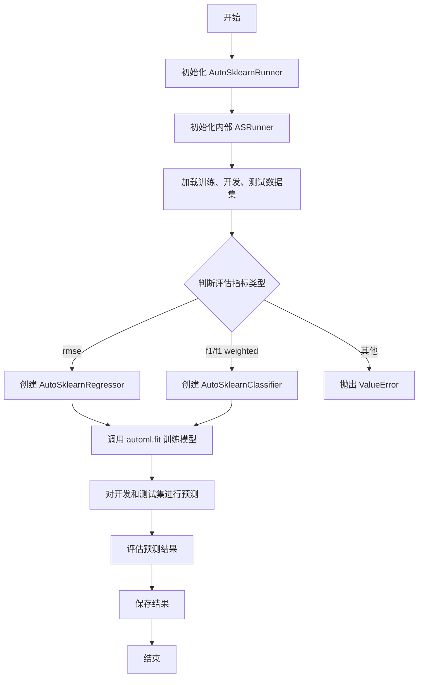
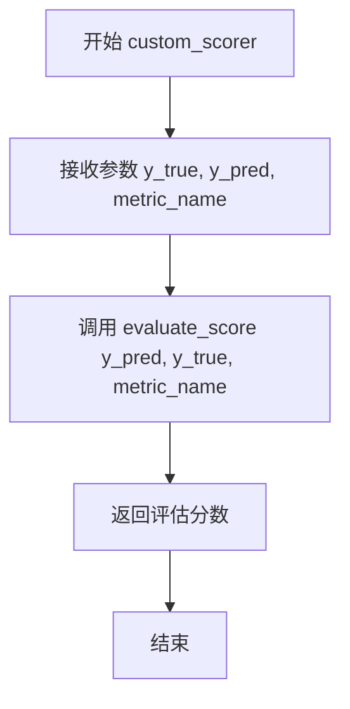
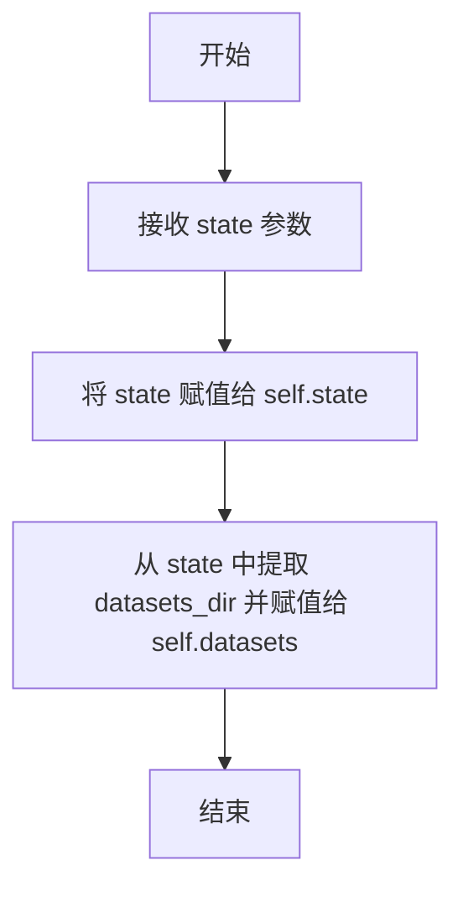
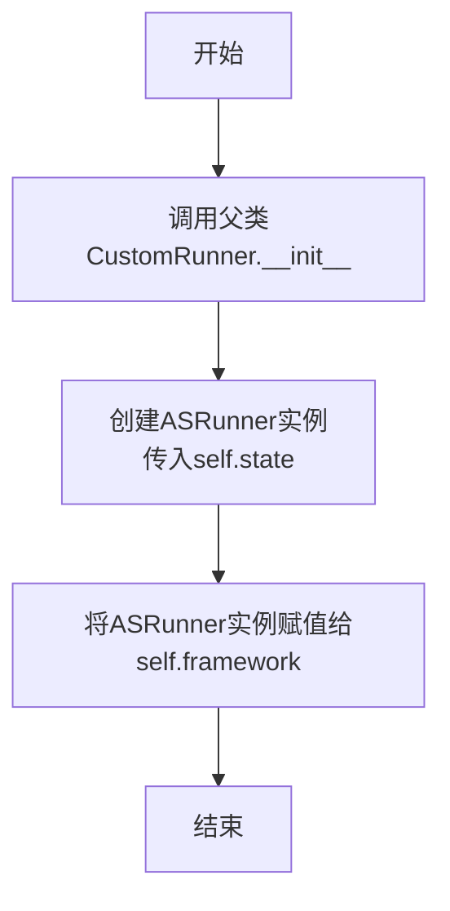
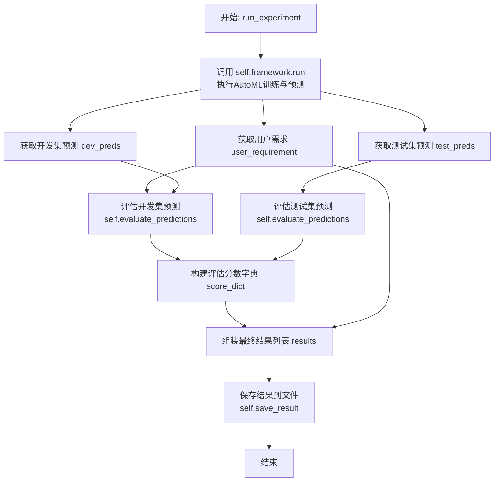

# `.\MetaGPT\metagpt\ext\sela\runner\autosklearn.py` 详细设计文档

该代码实现了一个基于 Auto-Sklearn 自动化机器学习框架的集成运行器，它封装了数据加载、模型训练、预测和评估的完整流程，支持分类和回归任务，并能根据配置的评估指标自动选择合适的 Auto-Sklearn 模型。

## 整体流程



## 类结构

```
CustomRunner (父类)
└── AutoSklearnRunner
    └── ASRunner (组合关系)
```

## 全局变量及字段


### `ASRunner.time_limit`
    
AutoML任务的最大运行时间限制（秒）。

类型：`int`
    


### `ASRunner.state`
    
包含任务配置、数据集路径和用户需求等运行时状态的字典。

类型：`dict`
    


### `ASRunner.datasets`
    
从state中提取的包含训练集、开发集和测试集文件路径的字典。

类型：`dict`
    


### `AutoSklearnRunner.result_path`
    
用于存储AutoSklearn实验结果的默认目录路径。

类型：`str`
    


### `AutoSklearnRunner.framework`
    
封装了AutoSklearn具体运行逻辑的核心框架实例。

类型：`ASRunner`
    
    

## 全局函数及方法

### `custom_scorer`

`custom_scorer` 是一个包装函数，它调用 `evaluate_score` 函数来计算预测值与真实值之间的评分。该函数主要用于与 `autosklearn` 框架集成，通过 `functools.partial` 创建一个符合 `autosklearn` 评分器接口的定制化评分函数。

参数：

- `y_true`：`Any`，真实的目标值（标签）。
- `y_pred`：`Any`，模型预测的目标值（标签）。
- `metric_name`：`str`，用于评估的指标名称（例如 `"rmse"`、`"f1"`）。

返回值：`float`，根据指定的 `metric_name` 计算出的评估分数。

#### 流程图



#### 带注释源码

```python
def custom_scorer(y_true, y_pred, metric_name):
    # 调用 evaluate_score 函数，传入预测值、真实值和指标名称
    # 注意：参数顺序是 y_pred, y_true，与函数签名 y_true, y_pred 相反
    return evaluate_score(y_pred, y_true, metric_name)
```

### `ASRunner.__init__`

该方法用于初始化 `ASRunner` 类的实例，设置其内部状态和数据集路径。

参数：

- `state`：`dict`，包含配置信息和数据集路径的字典，用于初始化运行器的状态。

返回值：`None`，该方法不返回任何值。

#### 流程图



#### 带注释源码

```python
def __init__(self, state=None):
    # 将传入的 state 参数赋值给实例变量 self.state
    self.state = state
    # 从 state 字典中获取键为 "datasets_dir" 的值，并赋值给实例变量 self.datasets
    self.datasets = self.state["datasets_dir"]
```


### `ASRunner.create_autosklearn_scorer`

该方法用于创建一个与 `auto-sklearn` 框架兼容的自定义评分器（scorer）。它通过 `functools.partial` 将指定的评估指标名称（`metric_name`）绑定到自定义的评分函数 `custom_scorer` 上，然后使用 `auto-sklearn` 的 `make_scorer` 函数将其包装成一个符合 `scikit-learn` 和 `auto-sklearn` 接口规范的评分器对象。

参数：

-  `metric_name`：`str`，评估指标的名称（例如：`"rmse"`, `"f1"`, `"f1 weighted"`），该名称将传递给底层的 `custom_scorer` 函数。

返回值：`autosklearn.metrics.Scorer`，一个 `auto-sklearn` 框架可用的评分器对象，用于在模型训练和评估过程中计算指定指标的性能。

#### 流程图

```mermaid
graph TD
    A[开始: create_autosklearn_scorer(metric_name)] --> B[从autosklearn.metrics导入make_scorer];
    B --> C[使用partial绑定参数: partial(custom_scorer, metric_name=metric_name)];
    C --> D[调用make_scorer: make_scorer(name=metric_name, score_func=partial_func)];
    D --> E[返回Scorer对象];
    E --> F[结束];
```

#### 带注释源码

```
    def create_autosklearn_scorer(self, metric_name):
        # 动态导入auto-sklearn的make_scorer函数，避免在模块级别导入整个库
        from autosklearn.metrics import make_scorer

        # 使用functools.partial创建一个新的函数，该函数固定了custom_scorer的metric_name参数。
        # 这样，当auto-sklearn调用这个scorer时，只需要传入y_true和y_pred即可。
        # make_scorer将这个部分应用的函数包装成符合scikit-learn接口的评分器。
        return make_scorer(name=metric_name, score_func=partial(custom_scorer, metric_name=metric_name))
```


### `ASRunner.run`

该方法执行一个自动机器学习（AutoML）流程，使用 `autosklearn` 库根据配置的评估指标（如 `rmse`、`f1` 等）自动训练回归或分类模型。它加载训练、开发和测试数据集，配置并运行 `autosklearn` 的自动模型选择与训练流程，最后返回在开发和测试集上的预测结果。

参数：
- `self`：`ASRunner` 实例，包含状态信息和数据集路径。

返回值：`dict`，包含两个键值对：`"test_preds"` 对应测试集的预测结果，`"dev_preds"` 对应开发集的预测结果。

#### 流程图

```mermaid
flowchart TD
    A[开始] --> B[加载数据集路径和配置]
    B --> C[读取训练、开发、测试数据]
    C --> D[准备训练特征X_train和目标y_train]
    D --> E{评估指标类型?}
    E -->|"rmse"| F[创建AutoSklearnRegressor]
    E -->|"f1" 或 "f1 weighted"| G[创建AutoSklearnClassifier]
    E -->|其他| H[抛出ValueError]
    F --> I[使用automl.fit训练模型]
    G --> I
    I --> J[对开发集进行预测]
    I --> K[对测试集进行预测]
    J --> L[返回预测结果字典]
    K --> L
    L --> M[结束]
```

#### 带注释源码

```python
def run(self):
    # 导入autosklearn的分类和回归模块
    import autosklearn.classification
    import autosklearn.regression

    # 从状态中获取数据集路径
    train_path = self.datasets["train"]
    dev_wo_target_path = self.datasets["dev_wo_target"]
    test_wo_target_path = self.datasets["test_wo_target"]
    # 获取目标列名
    target_col = self.state["dataset_config"]["target_col"]

    # 使用pandas读取CSV格式的数据集
    train_data = pd.read_csv(train_path)
    dev_data = pd.read_csv(dev_wo_target_path)
    test_data = pd.read_csv(test_wo_target_path)
    # 获取评估指标名称
    eval_metric = self.state["dataset_config"]["metric"]
    # 准备训练特征和目标变量
    X_train = train_data.drop(columns=[target_col])
    y_train = train_data[target_col]

    # 根据评估指标选择创建回归器或分类器
    if eval_metric == "rmse":
        # 创建AutoSklearn回归器，配置时间限制、自定义评分器、内存限制、临时文件夹和并行作业数
        automl = autosklearn.regression.AutoSklearnRegressor(
            time_left_for_this_task=self.time_limit,
            metric=self.create_autosklearn_scorer(eval_metric),
            memory_limit=8192,
            tmp_folder="AutosklearnModels/as-{}-{}".format(
                self.state["task"], datetime.now().strftime("%y%m%d_%H%M")
            ),
            n_jobs=-1,
        )
    elif eval_metric in ["f1", "f1 weighted"]:
        # 创建AutoSklearn分类器，配置类似回归器
        automl = autosklearn.classification.AutoSklearnClassifier(
            time_left_for_this_task=self.time_limit,
            metric=self.create_autosklearn_scorer(eval_metric),
            memory_limit=8192,
            tmp_folder="AutosklearnModels/as-{}-{}".format(
                self.state["task"], datetime.now().strftime("%y%m%d_%H%M")
            ),
            n_jobs=-1,
        )
    else:
        # 如果指标不支持，抛出异常
        raise ValueError(f"Unsupported metric: {eval_metric}")
    # 使用训练数据拟合模型
    automl.fit(X_train, y_train)

    # 使用训练好的模型对开发和测试集进行预测
    dev_preds = automl.predict(dev_data)
    test_preds = automl.predict(test_data)

    # 返回包含预测结果的字典
    return {"test_preds": test_preds, "dev_preds": dev_preds}
```

### `AutoSklearnRunner.__init__`

该方法用于初始化 `AutoSklearnRunner` 类的实例。它首先调用父类 `CustomRunner` 的构造函数，然后创建一个 `ASRunner` 实例作为 `framework` 属性，用于后续的自动化机器学习任务。

参数：

- `args`：`argparse.Namespace` 或类似对象，包含命令行参数或配置参数，传递给父类构造函数。
- `**kwargs`：`dict`，可变关键字参数，传递给父类构造函数。

返回值：`None`，构造函数不返回任何值。

#### 流程图



#### 带注释源码

```python
def __init__(self, args, **kwargs):
    # 调用父类CustomRunner的构造函数，初始化继承来的属性
    super().__init__(args, **kwargs)
    # 创建一个ASRunner实例，将当前实例的state属性传递给它
    # 并将该实例赋值给当前实例的framework属性，作为后续运行的核心组件
    self.framework = ASRunner(self.state)
```


### `AutoSklearnRunner.run_experiment`

该方法负责执行一个完整的AutoML实验流程。它调用底层的ASRunner框架进行模型训练和预测，然后对开发集和测试集的预测结果进行评估，最后将实验配置、用户需求、评估分数等结果保存到指定路径。

参数：
-  `self`：`AutoSklearnRunner`，AutoSklearnRunner类的实例，包含实验状态、参数和框架对象。

返回值：`None`，该方法不直接返回值，但会将实验结果保存到文件系统中。

#### 流程图



#### 带注释源码

```
async def run_experiment(self):
    # 1. 调用ASRunner框架执行核心AutoML流程，包括数据加载、模型选择、训练和预测。
    result = self.framework.run()
    # 2. 从实验状态中获取用户需求。
    user_requirement = self.state["requirement"]
    # 3. 从框架运行结果中提取开发集和测试集的预测值。
    dev_preds = result["dev_preds"]
    test_preds = result["test_preds"]
    # 4. 分别评估开发集和测试集的预测结果，生成分数字典。
    score_dict = {
        "dev_score": self.evaluate_predictions(dev_preds, "dev"),
        "test_score": self.evaluate_predictions(test_preds, "test"),
    }
    # 5. 组装最终的结果列表，包含状态码、分数字典、用户需求和参数字典。
    results = [
        0, # 状态码，0通常表示成功
        {
            "score_dict": score_dict,
            "user_requirement": user_requirement,
            "args": vars(self.args), # 将命令行参数对象转换为字典
        },
    ]
    # 6. 调用父类方法将结果保存到文件系统（路径由类的result_path属性定义）。
    self.save_result(results)
```


## 关键组件

### ASRunner

ASRunner 是 AutoML 框架 Auto-Sklearn 的核心执行器，负责根据任务类型（分类或回归）初始化 Auto-Sklearn 模型、加载和预处理数据、训练模型并进行预测。

### AutoSklearnRunner

AutoSklearnRunner 是 ASRunner 的封装器，继承自 CustomRunner，负责管理实验流程，包括调用 ASRunner 执行训练预测、评估预测结果、整合实验数据并保存最终结果。

### custom_scorer

custom_scorer 是一个自定义评分函数，它作为适配器，将 Auto-Sklearn 的评分接口与项目内部的 `evaluate_score` 函数连接起来，以支持特定的评估指标。

### create_autosklearn_scorer

create_autosklearn_scorer 是 ASRunner 的一个方法，它利用 `functools.partial` 和 `autosklearn.metrics.make_scorer` 来创建一个符合 Auto-Sklearn 要求的评分器对象，该评分器内部使用 `custom_scorer` 函数。

## 问题及建议


### 已知问题

-   **硬编码配置与路径**：`time_limit`、`memory_limit`、`tmp_folder` 路径模板等关键参数在代码中硬编码，缺乏灵活性，难以适应不同环境或需求的变化。
-   **异常处理不完善**：`run` 方法中仅对不支持的 `eval_metric` 抛出 `ValueError`，对于文件读取失败、模型训练失败、预测失败等潜在异常缺乏捕获和处理机制。
-   **资源管理风险**：`n_jobs=-1` 设置可能耗尽系统资源，尤其是在共享或资源受限的环境中。临时文件夹 `tmp_folder` 的生成未考虑清理机制，可能导致磁盘空间被长期占用。
-   **同步阻塞调用**：`AutoSklearnRunner.run_experiment` 方法被标记为 `async`，但其核心操作 `self.framework.run()` 是同步且可能非常耗时的，这违背了异步编程的初衷，可能阻塞事件循环。
-   **类型提示缺失**：代码中大量缺少类型注解（如 `state` 参数、`run` 方法的返回值等），降低了代码的可读性、可维护性，并使得静态类型检查工具无法发挥作用。
-   **结果保存逻辑不清晰**：`save_result` 方法未在提供代码中定义，其具体实现和存储格式不明确，存在潜在的不一致性风险。
-   **依赖导入位置不当**：`autosklearn.classification` 和 `autosklearn.regression` 在 `ASRunner.run` 方法内部导入，这可能导致循环导入问题，并影响代码的可测试性和清晰度。

### 优化建议

-   **配置外部化与参数化**：将 `time_limit`、`memory_limit`、`tmp_folder` 模板、`n_jobs` 等配置项移至配置文件（如 YAML、JSON）或通过构造函数参数传入，提高代码的灵活性和可配置性。
-   **增强异常处理与日志记录**：在文件 I/O、模型训练与预测等关键步骤添加 `try-except` 块，捕获并记录具体异常信息，提供更友好的错误提示，并确保程序在部分失败时能优雅降级或明确报错。
-   **实现资源管理与清理**：考虑为 `n_jobs` 设置一个上限值或提供配置选项。为 `tmp_folder` 实现一个清理机制，例如在运行结束后删除，或使用上下文管理器确保资源释放。
-   **重构异步执行逻辑**：将耗时的同步操作（如 `self.framework.run()`）放入线程池或进程池中执行，使用 `asyncio.to_thread` 或 `loop.run_in_executor`，使 `run_experiment` 方法真正实现非阻塞，符合其异步签名。
-   **补充完整的类型注解**：为所有函数、方法参数、返回值以及类属性添加类型提示。这能极大提升代码的清晰度，并方便使用 `mypy` 等工具进行静态检查。
-   **明确并标准化结果处理**：在 `CustomRunner` 基类或本文档中明确定义 `save_result` 方法的接口契约（输入格式、存储位置、序列化方式）。考虑使用统一的序列化库（如 `json`、`pickle` 或 `joblib`）并处理路径创建。
-   **调整依赖导入位置**：将 `autosklearn` 的导入语句移至文件顶部或 `ASRunner` 类的顶部。如果是为了避免某些环境下的依赖问题，可以考虑在类或方法级别进行延迟导入，但需注释说明原因。
-   **考虑模型持久化**：当前代码在每次运行后，训练好的 `automl` 模型对象未被保存。建议添加模型保存与加载功能，以便后续进行预测或分析，而无需重新训练。


## 其它


### 设计目标与约束

本代码模块的核心设计目标是提供一个封装了Auto-Sklearn自动化机器学习框架的、可配置的、可扩展的Runner组件，用于在MetaGPT框架内执行分类和回归任务。主要约束包括：1) 必须适配MetaGPT的`CustomRunner`基类接口；2) 支持通过`state`字典进行灵活配置（如数据集路径、目标列、评估指标）；3) 需要处理两种任务类型（分类和回归）并适配不同的Auto-Sklearn评估器；4) 运行时间受`time_limit`（默认600秒）约束；5) 需要将模型、预测结果和评估分数进行持久化存储。

### 错误处理与异常设计

代码中的错误处理主要采用防御性编程和异常抛出机制。关键点包括：1) 在`ASRunner.run`方法中，通过`if-elif-else`结构检查`eval_metric`，对于不支持的评估指标（非"rmse"、"f1"或"f1 weighted"）直接抛出`ValueError`异常。2) 依赖外部库（如`pandas.read_csv`, `autosklearn`）可能引发的异常（如文件未找到、数据格式错误、内存不足等）未在代码中显式捕获，将向上层调用者（`AutoSklearnRunner`）传播，最终可能由MetaGPT框架的统一错误处理机制管理。3) `custom_scorer`函数依赖外部模块`evaluate_score`，其内部错误处理逻辑未知，是本模块的一个潜在风险点。

### 数据流与状态机

1.  **初始化数据流**：`AutoSklearnRunner`实例化时，通过父类`CustomRunner`的`__init__`接收并处理`args`，生成`self.state`。`ASRunner`随后被创建，其`state`和`datasets`属性由此初始化。
2.  **训练与预测数据流**：在`ASRunner.run`中，从`self.datasets`定义的路径读取训练集(`train`)、开发集(`dev_wo_target`)和测试集(`test_wo_target`)CSV文件。训练时，从训练集中分离特征(`X_train`)和标签(`y_train`)。预测时，直接将开发集和测试集的特征数据输入训练好的`automl`模型，得到预测结果(`dev_preds`, `test_preds`)。
3.  **评估与结果数据流**：预测结果返回给`AutoSklearnRunner.run_experiment`，调用`self.evaluate_predictions`方法（从父类继承）进行评估，生成`score_dict`。最终，将分数、用户需求(`user_requirement`)和参数(`args`)打包成`results`列表，通过`self.save_result`方法（从父类继承）持久化到`result_path`（"results/autosklearn"）。
4.  **状态机**：模块本身没有复杂的状态转换。`ASRunner`实例的生命周期围绕一次`run`方法的执行：初始化 -> 配置模型 -> 训练 -> 预测 -> 返回结果。`AutoSklearnRunner`作为包装器，管理`ASRunner`的调用和结果的后续处理与保存。

### 外部依赖与接口契约

1.  **外部库依赖**：
    *   **核心依赖**：`autosklearn` (用于自动化机器学习模型训练与预测)、`pandas` (用于数据加载与处理)。
    *   **标准库依赖**：`datetime` (用于生成时间戳)、`functools.partial` (用于创建偏函数)。
    *   **项目内部依赖**：`metagpt.ext.sela.evaluation.evaluation.evaluate_score` (用于计算自定义评估分数)、`metagpt.ext.sela.runner.custom.CustomRunner` (作为基类)。
2.  **接口契约**：
    *   **输入契约**：`AutoSklearnRunner.__init__`期望接收`args`参数，其具体结构由父类`CustomRunner`定义。`ASRunner.__init__`期望一个`state`字典，其中必须包含`datasets_dir`（指向包含`train`, `dev_wo_target`, `test_wo_target`键的字典）、`dataset_config`（包含`target_col`和`metric`键）以及`task`等键。
    *   **输出契约**：`ASRunner.run`返回一个字典，包含`test_preds`和`dev_preds`键，对应测试集和开发集的预测值（numpy数组或类似结构）。`AutoSklearnRunner.run_experiment`方法（异步）的返回值未显示，但其副作用是通过`save_result`将结果保存到文件系统。
    *   **函数契约**：`custom_scorer`函数必须接受`y_true`, `y_pred`, `metric_name`参数，并返回一个数值分数。它是对`evaluate_score`函数的简单包装，后者需兼容`autosklearn.metrics.make_scorer`的调用约定。

    