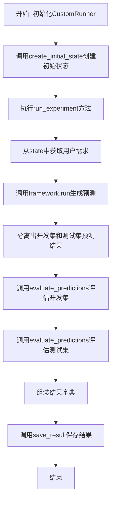
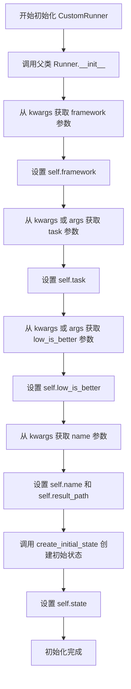
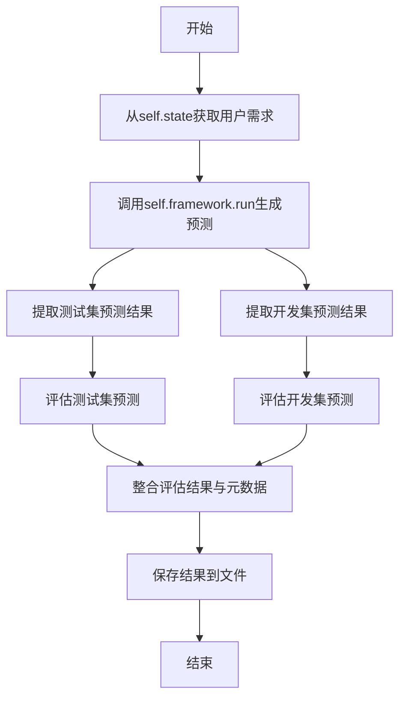
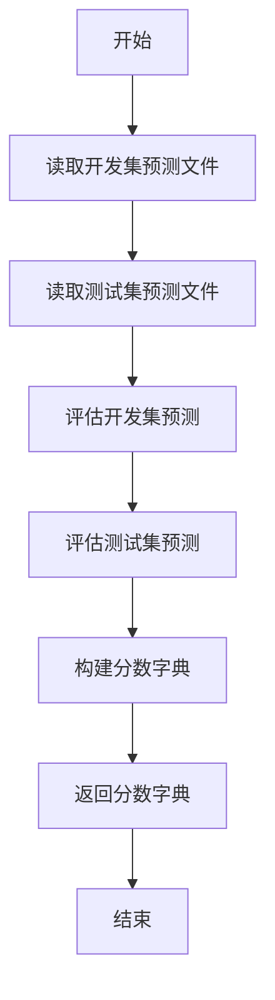
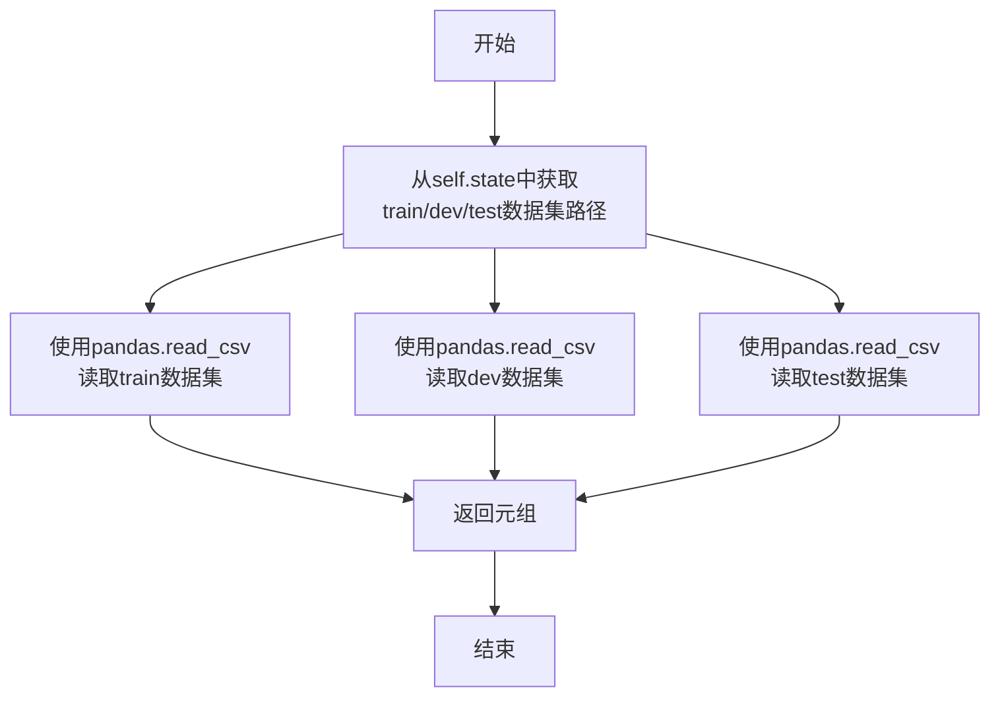

# `.\MetaGPT\metagpt\ext\sela\runner\custom.py` 详细设计文档

该代码定义了一个名为CustomRunner的类，它继承自Runner基类，用于执行一个自定义的机器学习实验流程。其核心功能是：根据给定的任务配置初始化实验状态，运行一个指定的机器学习框架（framework）来生成预测结果，然后分别在开发集（dev）和测试集（test）上评估这些预测结果的性能得分，最后将评估结果、用户需求及实验参数保存到文件中。

## 整体流程



## 类结构

```
Runner (基类，来自metagpt.ext.sela.runner.runner)
└── CustomRunner (自定义实验运行器)
```

## 全局变量及字段


### `CustomRunner.result_path`
    
存储实验结果的目录路径，默认为'results/custom'，在初始化时会根据name参数进行扩展。

类型：`str`
    


### `CustomRunner.framework`
    
用于执行机器学习任务的核心框架对象，通过kwargs传入，负责运行模型并生成预测结果。

类型：`Optional[Any]`
    


### `CustomRunner.task`
    
当前运行的具体任务标识，优先从kwargs获取，否则使用命令行参数args.task。

类型：`str`
    


### `CustomRunner.low_is_better`
    
评估指标的方向标志，True表示指标值越低越好，优先从kwargs获取，否则使用命令行参数args.low_is_better。

类型：`bool`
    


### `CustomRunner.name`
    
当前运行实例的自定义名称，用于区分不同实验，影响结果路径的生成。

类型：`str`
    


### `CustomRunner.state`
    
包含任务初始状态、数据集配置、路径等信息的字典，由create_initial_state函数创建。

类型：`Dict[str, Any]`
    
    

## 全局函数及方法

### `CustomRunner.__init__`

该方法用于初始化 `CustomRunner` 类的实例。它首先调用父类 `Runner` 的初始化方法，然后根据传入的参数和关键字参数设置实例的多个属性，包括任务框架、任务描述、评估指标方向、运行器名称以及结果保存路径。最后，它调用 `create_initial_state` 函数来创建并初始化任务的状态对象，该对象包含了任务配置、数据集路径等信息，为后续的实验运行和数据加载做准备。

参数：

- `args`：`argparse.Namespace` 或类似对象，包含命令行或配置传入的参数。
- `**kwargs`：`dict`，关键字参数字典，用于接收额外的配置项，如 `framework`, `task`, `low_is_better`, `name`。

返回值：`None`，此方法为构造函数，不返回任何值。

#### 流程图



#### 带注释源码

```python
def __init__(self, args, **kwargs):
    # 调用父类 Runner 的初始化方法，传入 args 和所有关键字参数
    super().__init__(args, **kwargs)
    # 从 kwargs 中获取 'framework' 参数，如果不存在则设为 None
    self.framework = kwargs.get("framework", None)  # todo
    # 从 kwargs 中获取 'task' 参数，如果不存在则使用 self.args.task
    self.task = kwargs.get("task", self.args.task)
    # 从 kwargs 中获取 'low_is_better' 参数，如果不存在则使用 self.args.low_is_better
    self.low_is_better = kwargs.get("low_is_better", self.args.low_is_better)
    # 从 kwargs 中获取 'name' 参数，如果不存在则设为空字符串
    self.name = kwargs.get("name", "")
    # 根据 name 构建结果保存路径
    self.result_path = f"results/custom_{self.name}"
    # 调用 create_initial_state 函数创建初始任务状态，传入任务、起始ID、数据配置和参数
    self.state = create_initial_state(
        self.task,
        start_task_id=1,
        data_config=self.data_config,
        args=self.args,
    )
```

### `CustomRunner.run_experiment`

该方法执行一个完整的自定义实验流程。它首先从初始化状态中获取用户需求，然后使用配置的框架（`self.framework`）根据该需求生成预测结果。接着，它分别评估在开发集（`dev`）和测试集（`test`）上的预测性能，并将评估结果、用户需求以及运行参数保存起来。

参数：
-  `self`：`CustomRunner`，`CustomRunner`类的实例，提供了实验运行所需的上下文（如框架、任务、状态等）。

返回值：`None`，该方法不返回任何值，其执行结果通过保存文件来体现。

#### 流程图



#### 带注释源码

```python
def run_experiment(self):
    # 1. 从初始化状态中获取用户需求
    user_requirement = self.state["requirement"]
    
    # 2. 使用配置的框架（self.framework）处理用户需求，生成预测结果
    #    preds 预期是一个字典，至少包含 'test_preds' 和 'dev_preds' 两个键
    preds = self.framework.run(user_requirement)
    
    # 3. 从预测结果中分别提取测试集和开发集的预测值
    test_preds = preds["test_preds"]
    dev_preds = preds["dev_preds"]
    
    # 4. 调用内部方法评估开发集和测试集的预测性能，并构建分数字典
    score_dict = {
        "dev_score": self.evaluate_predictions(dev_preds, "dev"),
        "test_score": self.evaluate_predictions(test_preds, "test"),
    }
    
    # 5. 整合实验结果：包含分数字典、用户需求以及运行参数（转换为字典）
    results = {"score_dict": score_dict, "user_requirement": user_requirement, "args": vars(self.args)}
    
    # 6. 调用父类或自身的 save_result 方法将结果保存到指定路径
    self.save_result(results)
```

### `CustomRunner.evaluate_pred_files`

该方法用于评估存储在CSV文件中的预测结果。它读取开发集和测试集的预测文件，计算相应的评估分数，并返回一个包含开发集和测试集分数的字典。

参数：

- `dev_pred_path`：`str`，开发集预测文件的路径
- `test_pred_path`：`str`，测试集预测文件的路径

返回值：`dict`，包含开发集和测试集评估分数的字典，键为`"dev_score"`和`"test_score"`

#### 流程图



#### 带注释源码

```python
def evaluate_pred_files(self, dev_pred_path, test_pred_path):
    # 从CSV文件中读取开发集预测结果，提取"target"列
    dev_preds = pd.read_csv(dev_pred_path)["target"]
    # 从CSV文件中读取测试集预测结果，提取"target"列
    test_preds = pd.read_csv(test_pred_path)["target"]
    # 构建分数字典，包含开发集和测试集的评估分数
    score_dict = {
        "dev_score": self.evaluate_score(dev_preds, "dev"),
        "test_score": self.evaluate_score(test_preds, "test"),
    }
    # 返回包含评估分数的字典
    return score_dict
```

### `CustomRunner.evaluate_predictions`

该方法用于评估给定预测结果在指定数据集划分（开发集或测试集）上的性能得分。它根据任务配置的评估指标，读取对应的真实标签（ground truth）文件，计算预测值与真实值之间的得分。

参数：

- `preds`：`pandas.Series` 或类似数组结构，模型在指定数据集划分上的预测结果。
- `split`：`str`，数据集划分的名称，应为 `"dev"` 或 `"test"`，用于确定加载哪个真实标签文件。

返回值：`float`，根据配置的评估指标计算出的性能得分。

#### 流程图

```mermaid
flowchart TD
    A[开始: evaluate_predictions(preds, split)] --> B[从state中获取评估指标metric]
    B --> C[根据split拼接真实标签文件路径gt_path]
    C --> D[从gt_path读取真实标签gt]
    D --> E[调用evaluate_score(preds, gt, metric)计算得分]
    E --> F[返回得分score]
    F --> G[结束]
```

#### 带注释源码

```python
def evaluate_predictions(self, preds, split):
    # 1. 从当前状态中获取数据集配置中定义的评估指标（例如：'accuracy', 'f1'）
    metric = self.state["dataset_config"]["metric"]
    
    # 2. 根据传入的数据集划分（split），从状态中获取对应的真实标签文件路径并拼接完整路径
    gt_path = os.path.join(self.state["datasets_dir"][f"{split}_target"])
    
    # 3. 使用pandas读取真实标签文件，并提取名为'target'的列作为真实值序列
    gt = pd.read_csv(gt_path)["target"]
    
    # 4. 调用外部评估函数，传入预测值、真实值和评估指标，计算得分
    score = evaluate_score(preds, gt, metric)
    
    # 5. 返回计算得到的性能得分
    return score
```

### `CustomRunner.load_datasets`

该方法负责加载训练、开发和测试数据集。它从`self.state["datasets_dir"]`字典中获取三个数据集的路径，然后使用`pandas.read_csv`方法分别读取这些CSV文件，最后将三个`DataFrame`对象作为元组返回。

参数：
-  `self`：`CustomRunner`，表示`CustomRunner`类的实例，用于访问实例属性如`self.state`。

返回值：`tuple[pd.DataFrame, pd.DataFrame, pd.DataFrame]`，返回一个包含三个`pandas.DataFrame`对象的元组，分别对应训练集、开发集和测试集。

#### 流程图



#### 带注释源码

```python
def load_datasets(self):
    # 从实例状态中获取训练、开发、测试数据集的存储路径
    train_path = self.state["datasets_dir"]["train"]
    dev_path = self.state["datasets_dir"]["dev"]
    test_path = self.state["datasets_dir"]["test"]
    
    # 使用pandas库读取CSV格式的训练集文件
    train = pd.read_csv(train_path)
    # 使用pandas库读取CSV格式的开发集文件
    dev = pd.read_csv(dev_path)
    # 使用pandas库读取CSV格式的测试集文件
    test = pd.read_csv(test_path)
    
    # 将读取到的三个DataFrame对象以元组形式返回
    return train, dev, test
```

## 关键组件


### CustomRunner

一个自定义的实验运行器，继承自基础Runner类，负责加载任务配置、执行框架推理、评估预测结果并保存实验数据。

### 框架执行器 (framework)

一个外部传入的组件，负责接收用户需求并执行核心的推理或生成任务，返回包含开发集和测试集预测结果的数据结构。

### 状态初始化器 (create_initial_state)

一个函数，根据任务名称、数据配置和命令行参数，创建并返回包含任务需求、数据集配置和路径等信息的初始状态字典。

### 评估器 (evaluate_score)

一个评估函数，接收预测值、真实值和评估指标名称，计算并返回对应的性能分数。

### 数据加载器 (load_datasets)

一个方法，从状态字典中获取数据集路径，使用pandas加载训练集、开发集和测试集数据并返回。

### 结果保存器 (save_result)

一个从父类继承的方法，负责将包含分数、用户需求和参数的实验结果字典保存到指定的结果路径中。


## 问题及建议


### 已知问题

-   **硬编码路径与配置**：`result_path` 被硬编码为 `"results/custom"`，并且在 `__init__` 中基于 `self.name` 进行修改。这种模式缺乏灵活性，难以适应不同的部署环境或配置需求。
-   **脆弱的初始化逻辑**：`__init__` 方法中，`self.task`、`self.low_is_better` 等字段的赋值逻辑依赖于 `kwargs` 和 `self.args` 的优先级，代码可读性较差，且容易在参数传递时出错。
-   **潜在的类型安全与错误处理缺失**：代码中多处直接访问字典键（如 `self.state["requirement"]`、`preds["test_preds"]`）和读取文件（如 `pd.read_csv`），缺乏键值存在性检查和文件读取异常处理，可能导致运行时 `KeyError` 或 `FileNotFoundError`。
-   **数据加载与评估的重复模式**：`evaluate_predictions` 和 `load_datasets` 方法中都存在类似的 `pd.read_csv` 调用和路径拼接逻辑，存在代码重复，且对数据格式（必须包含 `"target"` 列）有隐式依赖。
-   **框架依赖的紧耦合**：`run_experiment` 方法直接调用 `self.framework.run(user_requirement)`，将 `CustomRunner` 与一个特定的 `framework` 对象紧密耦合，降低了组件的可测试性和可替换性。

### 优化建议

-   **配置外部化与路径管理**：建议将 `result_path` 等路径配置通过配置文件（如 YAML、JSON）或环境变量管理。可以引入一个配置管理类，集中处理所有路径和运行时参数的解析与提供。
-   **重构初始化逻辑，明确职责**：在 `__init__` 方法中，应清晰定义构造参数的来源和优先级。可以考虑使用专门的配置对象（如 `dataclass` 或 `pydantic BaseModel`）来封装所有运行参数，使初始化过程更清晰、类型更安全。
-   **增强健壮性：添加防御性编程**：
    -   在访问 `self.state`、`preds` 等字典时，使用 `.get()` 方法并提供默认值，或使用 `try-except` 块捕获 `KeyError`。
    -   在文件操作（`pd.read_csv`、`os.path.join`）周围添加异常处理（`try-except`），以优雅地处理文件不存在或格式错误的情况，并记录或抛出更有意义的异常信息。
-   **抽象数据访问层**：将数据加载逻辑（读取CSV、提取特定列）封装到一个独立的 `DataLoader` 或 `DatasetManager` 类中。这样可以统一处理数据格式、缓存和错误处理，消除 `evaluate_predictions` 和 `load_datasets` 中的重复代码。
-   **解耦框架依赖，面向接口编程**：定义一个清晰的 `Framework` 接口（例如，使用抽象基类 `abc.ABC`），其中声明 `run` 方法。`CustomRunner` 应依赖于此接口而非具体实现。这样可以通过依赖注入轻松替换不同的框架实现，便于单元测试（例如，注入一个模拟框架）和扩展。
-   **结果保存的扩展性**：当前的 `save_result` 方法（在父类 `Runner` 中）可能只支持特定格式。可以考虑将结果保存策略抽象化，支持多种后端（如本地文件系统、数据库、云存储）和格式（如 JSON、Pickle）。


## 其它


### 设计目标与约束

本代码旨在提供一个可扩展的、用于特定任务（由 `task` 参数指定）的自动化实验运行框架。其核心设计目标包括：
1.  **可配置性**：通过 `args`、`kwargs` 以及 `data_config` 等参数，支持对不同任务、数据集和评估指标的灵活配置。
2.  **模块化**：将实验流程（`run_experiment`）、评估逻辑（`evaluate_predictions`）和数据加载（`load_datasets`）分离，便于维护和扩展。
3.  **结果可追溯性**：自动保存包含原始需求、参数配置和评估得分的完整实验结果，确保实验的可复现性。
主要约束包括：
1.  依赖外部定义的 `framework` 对象来执行核心的预测生成逻辑，该框架需实现 `run` 方法并返回特定格式的预测结果。
2.  数据格式假定为 CSV 文件，且包含名为 `"target"` 的列。
3.  评估逻辑依赖于外部函数 `evaluate_score` 和 `state` 中定义的 `metric`。

### 错误处理与异常设计

当前代码中的错误处理较为基础，主要依赖 Python 和 pandas 的内置异常机制：
1.  **文件操作**：`pd.read_csv` 和 `os.path.join` 在文件路径错误或文件不存在时会抛出 `FileNotFoundError` 或 `pd.errors.EmptyDataError` 等异常，这些异常会直接向上传播，可能导致程序崩溃。
2.  **数据格式**：假设 CSV 文件包含 `"target"` 列，如果该列不存在，`pd.read_csv(...)["target"]` 会引发 `KeyError`。
3.  **外部依赖**：对 `self.framework.run` 和 `evaluate_score` 的调用没有进行显式的异常捕获，其内部异常会直接暴露。
**改进建议**：应在关键操作（如文件读取、框架调用）周围添加 `try-except` 块，捕获特定异常并转换为更具信息量的自定义异常或日志记录，确保程序在部分失败时能优雅降级或提供清晰的错误信息。

### 数据流与状态机

1.  **初始化数据流**：
    *   输入：`args`, `kwargs` (包含 `framework`, `task`, `low_is_better`, `name`, `data_config`)。
    *   处理：调用 `create_initial_state`，根据输入参数生成初始 `state` 字典，其中包含任务需求、数据集路径、配置等信息。
    *   输出：初始化完成的 `CustomRunner` 实例，其 `state` 字段承载了实验的所有上下文信息。
2.  **实验执行数据流** (`run_experiment`)：
    *   输入：`state["requirement"]` (用户需求)。
    *   处理：`framework.run(user_requirement)` 生成预测结果 `preds` -> 分割为 `dev_preds` 和 `test_preds` -> 分别调用 `evaluate_predictions` 进行评估 -> 组装结果字典。
    *   输出：包含评估分数、用户需求和参数的 `results` 字典，并调用 `save_result` 保存。
3.  **状态机**：本类未实现复杂的状态转换。`state` 对象在初始化后即为只读的上下文信息提供者。实验流程是线性的：初始化 -> 执行 -> 评估 -> 保存。

### 外部依赖与接口契约

1.  **外部模块/类**：
    *   `metagpt.ext.sela.evaluation.evaluation.evaluate_score`: 评估函数，契约：`(preds, gt, metric) -> score`。
    *   `metagpt.ext.sela.runner.runner.Runner`: 父类，提供基础结构（如 `save_result` 方法，代码中未展示但被调用）。
    *   `metagpt.ext.sela.search.tree_search.create_initial_state`: 状态创建函数，契约：`(task, start_task_id, data_config, args) -> state_dict`。
    *   `pandas (pd)`: 用于数据读取和处理。
2.  **接口契约（对调用者）**：
    *   `__init__`: 要求传入 `args` 对象，并可选择性地传入 `framework`, `task` 等关键字参数。
    *   `run_experiment`: 无参数，执行完整实验流程。要求 `self.framework` 已被正确初始化且实现了 `run` 方法。
    *   `evaluate_pred_files`: 契约：`(dev_pred_path: str, test_pred_path: str) -> score_dict`。
    *   `evaluate_predictions`: 契约：`(preds, split: str) -> score`。依赖 `self.state` 中正确的 `dataset_config` 和 `datasets_dir`。
    *   `load_datasets`: 契约：`() -> (train_df, dev_df, test_df)`。依赖 `self.state["datasets_dir"]` 中正确的路径。
3.  **接口契约（需被满足）**：
    *   `self.framework` 对象必须实现 `run(user_requirement)` 方法，并返回一个字典，至少包含 `"test_preds"` 和 `"dev_preds"` 两个键，对应的值为预测结果序列（如 pandas Series 或 list）。

    