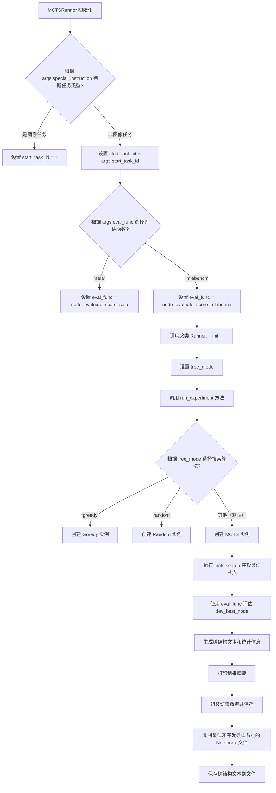
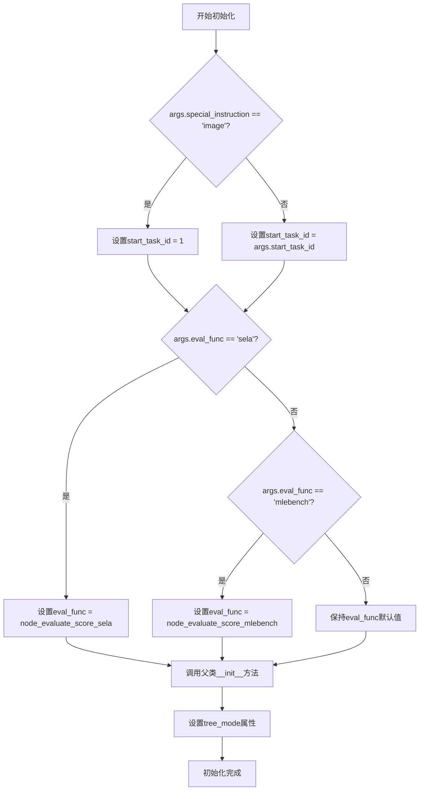
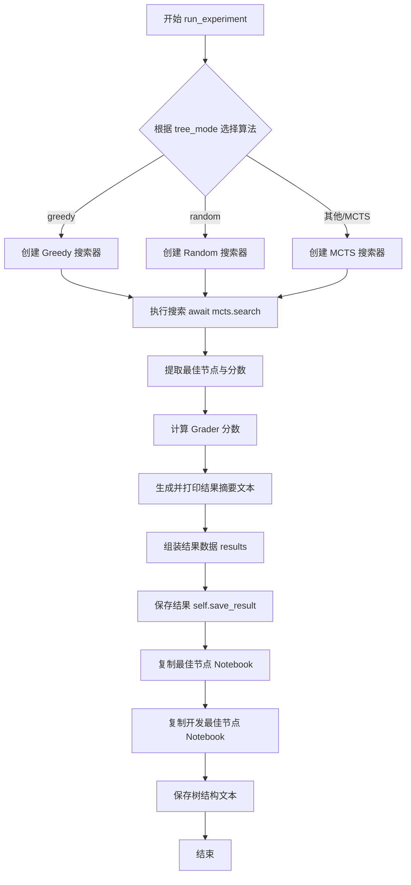
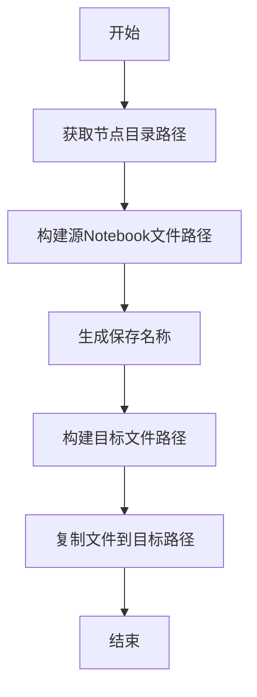
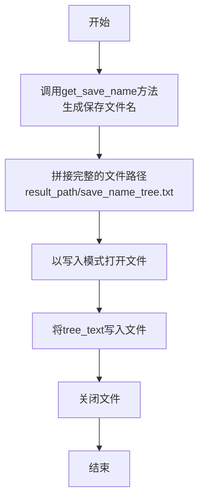

# `.\MetaGPT\metagpt\ext\sela\runner\mcts.py` 详细设计文档

该文件定义了一个名为 MCTSRunner 的类，它是用于执行基于蒙特卡洛树搜索（MCTS）、贪婪或随机算法的实验运行器。它根据输入参数配置评估函数和搜索算法，执行搜索过程，评估最佳节点，并将结果（包括最佳代码、开发最佳代码、树结构文本和性能指标）保存到指定目录。

## 整体流程



## 类结构

```
MCTSRunner (继承自 Runner)
├── 字段: result_path, start_task_id, eval_func, tree_mode
├── 方法: __init__, run_experiment, copy_notebook, save_tree
└── 依赖的外部类: MCTS, Greedy, Random (来自 metagpt.ext.sela.search.search_algorithm)
```

## 全局变量及字段


### `MCTSRunner.result_path`
    
用于存储实验结果的根目录路径，默认为'results/mcts'。

类型：`str`
    


### `MCTSRunner.start_task_id`
    
根据任务类型（是否为图像任务）确定的起始任务ID，用于控制实验流程的起点。

类型：`int`
    


### `MCTSRunner.eval_func`
    
用于评估节点性能的评分函数，根据命令行参数在'sela'和'mlebench'两种评估方法中选择。

类型：`Callable`
    


### `MCTSRunner.tree_mode`
    
指定搜索算法的模式，可选值包括'greedy'、'random'或None（默认使用MCTS），用于实例化不同的搜索策略。

类型：`str`
    
    

## 全局函数及方法

### `MCTSRunner.__init__`

该方法用于初始化MCTSRunner实例，根据传入的参数配置任务起始ID、评估函数，并调用父类初始化方法。

参数：

- `args`：`argparse.Namespace`，命令行参数对象，包含任务配置信息
- `tree_mode`：`str`，可选参数，指定搜索树模式（如"greedy"、"random"等）
- `kwargs`：`dict`，其他关键字参数，传递给父类初始化方法

返回值：`None`，无返回值

#### 流程图



#### 带注释源码

```python
def __init__(self, args, tree_mode=None, **kwargs):
    # 根据任务类型设置起始任务ID
    if args.special_instruction == "image":
        self.start_task_id = 1  # 如果是图像任务，从数据预处理开始
    else:
        self.start_task_id = args.start_task_id  # 否则使用参数指定的起始任务ID

    # 根据评估函数名称设置对应的评估函数
    if args.eval_func == "sela":
        self.eval_func = node_evaluate_score_sela  # 使用SELA评估函数
    elif args.eval_func == "mlebench":
        self.eval_func = node_evaluate_score_mlebench  # 使用MLEBench评估函数

    # 调用父类Runner的初始化方法
    super().__init__(args, **kwargs)
    
    # 设置搜索树模式
    self.tree_mode = tree_mode
```


### `MCTSRunner.run_experiment`

该方法负责执行一次完整的MCTS（蒙特卡洛树搜索）实验。它根据配置选择搜索算法（MCTS、贪婪或随机），执行搜索以找到最佳节点，收集并计算相关指标（如分数、生成的代码数量），将结果保存到文件，并复制最佳节点对应的Jupyter Notebook文件。

参数：
-  `self`：`MCTSRunner`，MCTSRunner类的实例，包含实验配置和状态。

返回值：`None`，该方法不返回任何值，其功能主要通过副作用（如保存文件、打印信息）实现。

#### 流程图



#### 带注释源码

```python
    async def run_experiment(self):
        # 从命令行参数中获取是否使用固定洞察和最大搜索深度
        use_fixed_insights = self.args.use_fixed_insights
        depth = self.args.max_depth

        # 根据 tree_mode 配置实例化不同的搜索算法对象
        if self.tree_mode == "greedy":
            mcts = Greedy(root_node=None, max_depth=depth, use_fixed_insights=use_fixed_insights)
        elif self.tree_mode == "random":
            mcts = Random(root_node=None, max_depth=depth, use_fixed_insights=use_fixed_insights)
        else:
            # 默认或指定为 "mcts" 时使用 MCTS 算法
            mcts = MCTS(root_node=None, max_depth=depth, use_fixed_insights=use_fixed_insights)

        # 执行异步搜索，传入当前状态和参数，返回最佳节点等信息
        best_nodes = await mcts.search(state=self.state, args=self.args)

        # 从搜索结果中提取全局最佳节点和开发集最佳节点
        best_node = best_nodes["global_best"]
        dev_best_node = best_nodes["dev_best"]
        # 提取分数字典
        score_dict = best_nodes["scores"]

        # 使用评估函数计算开发集最佳节点的额外分数（Grader分数）
        additional_scores = {"grader": self.eval_func(dev_best_node)}

        # 生成搜索树的文本表示，并获取生成的唯一代码数量
        text, num_generated_codes = get_tree_text(mcts.root_node)
        # 向文本摘要中添加关键统计信息
        text += f"Generated {num_generated_codes} unique codes.\n"
        text += f"Best node: {best_node.id}, score: {best_node.raw_reward}\n"
        text += f"Dev best node: {dev_best_node.id}, score: {dev_best_node.raw_reward}\n"
        text += f"Grader score: {additional_scores['grader']}\n"
        # 打印摘要到控制台
        print(text)

        # 将实验结果组装成一个字典列表（通常只包含一个实验的结果）
        results = [
            {
                "best_node": best_node.id,
                "best_node_score": best_node.raw_reward,
                "dev_best_node": dev_best_node.id,
                "dev_best_node_score": dev_best_node.raw_reward,
                "num_generated_codes": num_generated_codes,
                "user_requirement": best_node.state["requirement"], # 记录用户需求
                "tree_text": text, # 保存树文本
                "args": vars(self.args), # 保存实验参数
                "scores": score_dict, # 保存搜索过程中的分数
                "additional_scores": additional_scores, # 保存额外计算的分数
            }
        ]
        # 调用父类方法保存结果到文件
        self.save_result(results)
        # 复制全局最佳节点对应的Jupyter Notebook文件
        self.copy_notebook(best_node, "best")
        # 复制开发集最佳节点对应的Jupyter Notebook文件
        self.copy_notebook(dev_best_node, "dev_best")
        # 将搜索树的文本表示保存到文件
        self.save_tree(text)
```


### `MCTSRunner.copy_notebook`

该方法用于将指定节点对应的Jupyter Notebook文件复制到结果目录中，并按照指定的名称进行重命名，以便于后续的分析和存档。

参数：

- `node`：`Node`，表示一个搜索树节点，包含节点的ID和状态信息，用于获取节点对应的Notebook文件路径。
- `name`：`str`，表示复制后的文件名称后缀，用于区分不同的节点（如“best”或“dev_best”）。

返回值：`None`，该方法不返回任何值，仅执行文件复制操作。

#### 流程图



#### 带注释源码

```python
def copy_notebook(self, node, name):
    # 获取节点对应的目录路径
    node_dir = node.get_node_dir()
    # 构建源Notebook文件的完整路径，格式为“{节点目录}/Node-{节点ID}.ipynb”
    node_nb_dir = f"{node_dir}/Node-{node.id}.ipynb"
    # 调用get_save_name方法生成唯一的保存名称，通常基于实验参数或时间戳
    save_name = self.get_save_name()
    # 构建目标文件的完整路径，格式为“{结果路径}/{保存名称}_{名称}.ipynb”
    copy_nb_dir = f"{self.result_path}/{save_name}_{name}.ipynb"
    # 使用shutil.copy将源Notebook文件复制到目标路径
    shutil.copy(node_nb_dir, copy_nb_dir)
```


### `MCTSRunner.save_tree`

该方法用于将蒙特卡洛树搜索（MCTS）过程中生成的树结构文本保存到指定的文件中，以便后续分析和可视化。

参数：

-  `tree_text`：`str`，包含MCTS树结构信息的文本内容。

返回值：`None`，该方法不返回任何值。

#### 流程图



#### 带注释源码

```python
def save_tree(self, tree_text):
    # 调用get_save_name方法生成一个唯一的保存文件名
    save_name = self.get_save_name()
    # 基于result_path和生成的save_name，拼接出完整的文件路径
    fpath = f"{self.result_path}/{save_name}_tree.txt"
    # 以写入模式打开文件，如果文件不存在则创建
    with open(fpath, "w") as f:
        # 将传入的树结构文本tree_text写入到文件中
        f.write(tree_text)
    # 方法执行完毕，隐式返回None
```


## 关键组件


### 搜索算法 (MCTS, Greedy, Random)

定义了三种不同的搜索策略（蒙特卡洛树搜索、贪婪搜索、随机搜索），用于在代码生成任务的状态空间中探索和选择最优的解决方案路径。

### 评估函数 (node_evaluate_score_sela, node_evaluate_score_mlebench)

提供了两种不同的评估函数，用于对搜索过程中生成的节点（代表候选解决方案）进行评分，以指导搜索方向并最终选择最佳方案。

### 实验运行器 (MCTSRunner)

一个实验执行框架，负责根据配置参数（如搜索算法类型、评估函数、任务起始点）初始化并运行搜索实验，收集、记录实验结果（包括最佳节点、分数、生成的代码数量等），并将关键输出（如最佳代码笔记本、搜索树文本）保存到指定目录。

### 结果可视化与文本生成 (get_tree_text)

一个工具函数，用于将搜索算法生成的树状结构（代表搜索路径和决策过程）转换为可读的文本格式，便于分析和记录实验过程。


## 问题及建议


### 已知问题

-   **硬编码路径与配置**：`result_path` 字段被硬编码为 `"results/mcts"`，这降低了代码的灵活性，使得在不同环境或配置下运行实验时难以更改结果保存位置。
-   **构造函数逻辑分散**：`__init__` 方法中的初始化逻辑（如根据 `args.special_instruction` 设置 `start_task_id`，根据 `args.eval_func` 设置 `eval_func`）与父类 `Runner` 的初始化逻辑交织，可能违反了单一职责原则，使得子类构造函数承担了过多的配置职责。
-   **方法职责不单一**：`run_experiment` 方法过于庞大，它同时负责算法选择、搜索执行、结果评估、文本生成、结果打印、结果保存和文件复制等多个步骤，违反了单一职责原则，降低了代码的可读性和可维护性。
-   **潜在的资源管理问题**：`copy_notebook` 和 `save_tree` 方法直接进行文件操作，但没有包含任何错误处理（例如，源文件不存在、目标路径无权限等），这可能导致运行时异常。
-   **类型注解缺失**：代码中缺少类型注解（例如，`tree_mode` 参数、`best_nodes` 返回值等），这降低了代码的可读性，也不利于静态类型检查工具的使用。
-   **魔术字符串的使用**：代码中使用了多个魔术字符串（如 `"image"`, `"sela"`, `"mlebench"`, `"greedy"`, `"random"`, `"grader"` 等），这些字符串在多个地方重复出现，增加了维护成本和出错风险。

### 优化建议

-   **将配置外部化**：将 `result_path` 等配置项移至配置文件（如 YAML、JSON）或通过命令行参数传入，提高代码的灵活性和可配置性。
-   **重构构造函数**：考虑将 `start_task_id` 和 `eval_func` 的设置逻辑提取到独立的配置方法中，或者通过工厂模式来创建不同的评估函数实例，使构造函数更清晰，职责更单一。
-   **拆分 `run_experiment` 方法**：将该方法拆分为多个更小、职责单一的方法，例如：`_select_search_algorithm`, `_execute_search`, `_evaluate_results`, `_generate_report_text`, `_save_results` 等。这能显著提升代码的可读性、可测试性和可维护性。
-   **增强错误处理**：在 `copy_notebook` 和 `save_tree` 等文件操作方法中添加 `try-except` 块，捕获并处理可能出现的 `FileNotFoundError`、`PermissionError` 等异常，提供更友好的错误信息或回退策略。
-   **补充类型注解**：为类字段、方法参数和返回值添加详细的类型注解。这有助于开发者理解代码接口，并利用 `mypy` 等工具进行静态检查，提前发现潜在的类型错误。
-   **使用常量或枚举替代魔术字符串**：将频繁使用的字符串定义为类常量或使用 `Enum`，例如 `SearchMode.GREEDY`, `EvalFunc.SELA`, `TaskType.IMAGE` 等。这样可以集中管理这些值，避免拼写错误，并提高代码的语义清晰度。
-   **考虑依赖注入**：对于 `eval_func` 等依赖，可以考虑通过依赖注入的方式在运行时传入，而不是在构造函数内部根据条件判断来赋值。这能提高代码的模块化和可测试性。


## 其它


### 设计目标与约束

本模块（`MCTSRunner`）是SELA（Software Engineering LLM Agent）项目中的一个实验运行器，其核心设计目标是提供一个可配置的、基于不同搜索算法（MCTS、Greedy、Random）的代码生成与评估实验框架。主要约束包括：1) 必须能够处理不同类型的任务（如普通任务与图像任务），并据此调整起始任务ID；2) 必须支持不同的评估函数（`sela` 或 `mlebench`）来对生成的代码节点进行评分；3) 必须将实验过程（搜索树、最佳节点、评估分数）和结果（最佳代码的Jupyter Notebook）持久化到文件系统中。

### 错误处理与异常设计

当前代码中显式的错误处理逻辑较少，主要依赖Python的默认异常传播机制。潜在的风险点包括：1) 文件操作（如`shutil.copy`, `open`）可能因路径不存在或权限问题而失败；2) 搜索算法（`MCTS`, `Greedy`, `Random`）在`search`过程中可能因状态异常或外部依赖（如LLM调用）失败而抛出异常；3) `args`参数的配置错误可能导致运行时逻辑错误（如未定义的`eval_func`）。建议增加`try-except`块来捕获这些操作异常，并记录详细的错误日志，同时提供更友好的参数验证。

### 数据流与状态机

1.  **初始化数据流**：通过`__init__`方法，根据输入参数`args`（包含任务类型、评估函数名等）初始化`start_task_id`、`eval_func`等关键属性，并调用父类`Runner`的初始化逻辑。
2.  **实验执行数据流**：`run_experiment`方法是核心。它根据`tree_mode`参数实例化具体的搜索算法对象（MCTS/Greedy/Random），传入当前`state`和`args`进行异步搜索（`search`）。搜索算法返回最佳节点字典。
3.  **结果处理与持久化数据流**：从搜索结果中提取`best_node`和`dev_best_node`，使用`eval_func`计算额外分数，通过`get_tree_text`生成搜索树的文本表示。最后，将结果字典保存（`save_result`），复制最佳节点的Notebook文件（`copy_notebook`），并保存树文本（`save_tree`）。
4.  **状态机**：虽然没有显式的状态机定义，但`state`对象（从父类继承或在搜索过程中维护）隐含地代表了代码生成任务的当前状态（如需求、已生成的代码片段、环境等）。搜索算法通过扩展和评估不同的`node`（代表不同的代码生成路径和状态）来驱动状态演进。

### 外部依赖与接口契约

1.  **父类依赖**：继承自`metagpt.ext.sela.runner.runner.Runner`，依赖其提供的`state`、`args`、`save_result`、`get_save_name`等属性和方法。
2.  **算法依赖**：依赖`metagpt.ext.sela.search.search_algorithm`模块中的`MCTS`、`Greedy`、`Random`类。契约是这些类必须实现`search`异步方法，并返回包含`global_best`、`dev_best`、`scores`等键的字典。
3.  **评估函数依赖**：依赖`metagpt.ext.sela.evaluation.evaluation`模块中的`node_evaluate_score_sela`和`node_evaluate_score_mlebench`函数。契约是这些函数接受一个`node`对象作为参数并返回一个分数。
4.  **工具函数依赖**：依赖`metagpt.ext.sela.evaluation.visualize_mcts.get_tree_text`函数来可视化搜索树。
5.  **标准库依赖**：依赖`shutil`模块进行文件复制操作。
6.  **参数接口契约**：`__init__`方法接受一个`args`对象（通常是`argparse.Namespace`），该对象必须包含`special_instruction`、`start_task_id`、`eval_func`、`use_fixed_insights`、`max_depth`等属性。`run_experiment`方法依赖于`self.state`和`self.args`的有效性。

### 并发与异步设计

`run_experiment`方法被定义为`async`方法，表明其内部包含异步操作。核心的异步调用发生在`await mcts.search(state=self.state, args=self.args)`。这暗示底层的搜索算法（尤其是MCTS）可能涉及耗时的I/O操作，例如与大型语言模型（LLM）的API交互、文件读写或网络请求。这种异步设计旨在避免阻塞主线程，提高在I/O密集型场景下的运行效率。调用方需要在一个异步环境中（例如使用`asyncio.run`）执行此方法。

### 配置管理与环境

模块的行为高度依赖于外部传入的配置参数（`args`）。关键的配置项包括：
*   `args.special_instruction`: 决定任务类型（如`"image"`），影响`start_task_id`。
*   `args.eval_func`: 决定用于最终评估的评分函数（`"sela"`或`"mlebench"`）。
*   `args.use_fixed_insights` 和 `args.max_depth`: 直接传递给搜索算法，控制搜索过程。
*   `tree_mode`（通过`__init__`传入）：决定使用哪种搜索算法（`None`/`"mcts"`、`"greedy"`、`"random"`）。
结果文件的存储路径由类属性`result_path`（`"results/mcts"`）和运行时生成的`save_name`共同决定。这要求运行环境中存在相应的目录结构，或者代码/父类中有创建目录的逻辑。

    