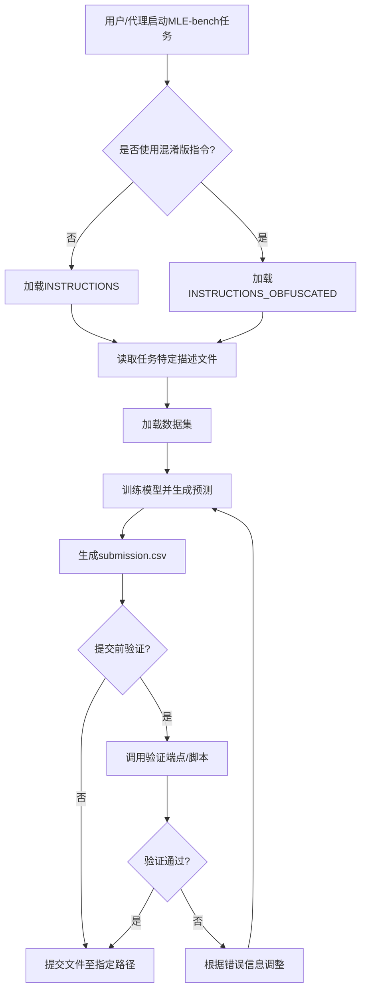

# `.\MetaGPT\metagpt\ext\sela\runner\mle_bench\instructions.py` 详细设计文档

该文件定义了MLE-bench基准测试的通用指令集，包含提交验证说明、基准测试核心规则（如数据集路径、提交格式、测试集划分、防作弊规则）以及附加说明（如GPU可用性）。它提供了两种版本的指令（标准版和混淆版），供不同场景下使用。

## 整体流程



## 类结构

```
该文件不包含类定义，仅包含全局字符串常量。
```

## 全局变量及字段


### `SUBMISSION_INSTURCTION`
    
包含提交文件验证服务器端点的使用说明，指导用户如何通过HTTP POST请求验证提交文件的有效性。

类型：`str`
    


### `INSTRUCTIONS`
    
MLE-bench基准测试的完整说明，包含竞赛规则、数据集位置、提交要求、测试集说明和防作弊政策。

类型：`str`
    


### `INSTRUCTIONS_OBFUSCATED`
    
INSTRUCTIONS的混淆版本，将'competition'替换为'task'，用于某些需要隐藏竞赛背景的场景。

类型：`str`
    


### `ADDITIONAL_NOTES`
    
补充说明，告知用户环境中可用的计算资源（如GPU）。

类型：`str`
    


    

## 全局函数及方法


## 关键组件


### 提交验证机制

提供通过HTTP端点验证提交文件有效性的工具，包含一个服务器验证接口和一个本地验证脚本。

### 基准测试指令框架

定义了参与MLE-bench基准测试的通用规则和流程，包括任务说明、数据集位置、提交格式要求、测试集构成以及反作弊规定。

### 指令混淆版本

为基准测试指令提供了一个措辞略有不同的版本，将“竞赛”相关术语替换为更通用的“任务”，以适应不同的应用场景。

### 附加说明

提供了关于计算资源（GPU）的额外信息，确保参与者了解可用的硬件环境。


## 问题及建议


### 已知问题

-   **硬编码路径与配置**：代码中多处使用了硬编码的路径（如 `runner/mle_bench/instructions.py`、`{dataset_dir}/description.md`、`{output_dir}/submission.csv`）和服务器端点（`http://localhost:5000/validate`）。这降低了代码的灵活性和可配置性，当部署环境或项目结构发生变化时，需要直接修改源代码，增加了维护成本和出错风险。
-   **指令重复与不一致**：存在两个高度相似的指令字符串 `INSTRUCTIONS` 和 `INSTRUCTIONS_OBFUSCATED`，它们仅在少数术语（如“competition” vs “task”）上有所不同。这种重复不仅增加了代码体积，还可能在未来维护时导致两个版本不同步，引发不一致性问题。
-   **缺乏结构化数据模型**：所有信息（提交说明、基准指令、附加说明）都以纯字符串形式存储。当需要动态生成、国际化（多语言支持）或程序化处理这些内容时（例如，根据运行环境选择不同的说明文本），当前结构显得笨拙且难以扩展。
-   **潜在的魔法字符串**：像 `submission.csv` 这样的关键文件名作为魔法字符串直接嵌入在多个地方。如果未来需要更改此文件名，必须在代码中进行多处查找和替换，容易遗漏。

### 优化建议

-   **外部化配置**：将硬编码的路径、URL、文件名等提取到配置文件（如 JSON、YAML 或环境变量）中。例如，可以创建一个 `config.py` 或使用 `os.environ` 来管理 `SUBMISSION_FILE_PATH`、`VALIDATION_SERVER_URL`、`INSTRUCTIONS_FILE_PATH` 等。这提高了代码的可配置性和环境适应性。
-   **统一指令模板**：合并 `INSTRUCTIONS` 和 `INSTRUCTIONS_OBFUSCATED`，使用一个参数化的模板字符串或一个简单的函数来生成最终指令。可以通过一个参数（如 `context="competition"` 或 `context="task"`）来控制术语的替换，消除重复并确保一致性。
-   **引入数据类或枚举**：考虑将指令内容封装到数据类（dataclass）或使用枚举来管理不同的指令类型。这可以使代码更结构化，便于后续的扩展和维护。例如，可以定义一个 `BenchmarkInstructions` 类，其属性包含各个部分的文本，并提供一个方法根据上下文渲染最终文本。
-   **定义常量**：将 `submission.csv` 等魔法字符串定义为模块级常量（如 `SUBMISSION_FILENAME = "submission.csv"`），并在代码中引用这些常量。这样，只需在一个地方修改即可全局生效。
-   **增强验证脚本的集成**：`SUBMISSION_INSTRUCTION` 中提到的验证脚本路径（`/home/validate_submission.sh`）也是硬编码的。建议将此信息也纳入配置管理，或者提供一个更通用的、通过配置获取验证命令的方法。


## 其它


### 设计目标与约束

本模块的核心设计目标是提供一个清晰、无歧义的指令集，用于指导参与者在“MLE-bench”基准测试中完成机器学习任务。它旨在通过预定义的常量字符串，确保所有参与者遵循统一的流程和规则，从而保证评估的公平性和一致性。主要约束包括：1) 指令内容必须静态、不可变，以避免运行时解释带来的不确定性；2) 指令文本需要包含对特定文件路径（如 `{dataset_dir}`, `{output_dir}`）的占位符，以便在运行时被动态替换；3) 需要区分“竞赛”和“任务”两种语境，以适应不同的场景描述（`INSTRUCTIONS` 与 `INSTRUCTIONS_OBFUSCATED`）；4) 必须包含关于提交验证、计算资源等关键操作说明。

### 错误处理与异常设计

本模块不包含主动的错误处理或异常抛出逻辑，因为它仅由常量字符串定义组成。其设计哲学是将错误处理的责任委托给使用这些常量的上层代码。例如，如果上层代码未能正确格式化字符串（如替换 `{dataset_dir}`），可能导致生成的指令信息不完整或误导用户。因此，潜在的错误处理策略应在上层实现，包括：1) 在使用 `format` 方法填充占位符前，验证输入参数的完整性和有效性；2) 确保生成的最终指令字符串被完整、无误地传递给最终用户（如AI代理）；3) 对于 `SUBMISSION_INSTRUCTION` 中提到的验证服务器端点，上层代码应处理网络请求失败、响应解析错误等情况。

### 数据流与状态机

本模块不涉及动态的数据处理或状态转换。其数据流是静态且单向的：在系统初始化或任务开始时，上层加载模块（如 `instructions.py`）并读取这些常量。随后，根据当前运行模式（例如，是标准的竞赛模式还是经过“混淆”的任务模式），选择 `INSTRUCTIONS` 或 `INSTRUCTIONS_OBFUSCATED` 中的一条。接着，使用具体的路径信息（数据集目录、输出目录）格式化选中的指令字符串，并与 `SUBMISSION_INSTRUCTION` 和 `ADDITIONAL_NOTES` 拼接，形成最终提供给参与者的完整指导文档。整个过程无状态变化，也不依赖于外部输入（除了路径参数）。

### 外部依赖与接口契约

本模块作为纯文本常量定义，没有直接的外部依赖（如数据库、网络服务、第三方库）。然而，它定义了对使用方（即调用此模块的代码）的隐式接口契约：1) 调用方需要提供 `dataset_dir` 和 `output_dir` 两个字符串参数，以正确格式化指令文本。2) 调用方需要理解 `SUBMISSION_INSTRUCTION` 中描述的验证服务（`http://localhost:5000/validate`）和辅助脚本（`/home/validate_submission.sh`）的存在和用法，这些是运行时环境必须提供的设施。3) 调用方需要确保 `ADDITIONAL_NOTES` 中关于GPU资源的声明与实际的执行环境相符。模块本身不验证这些契约，满足契约是系统集成的前提条件。

    