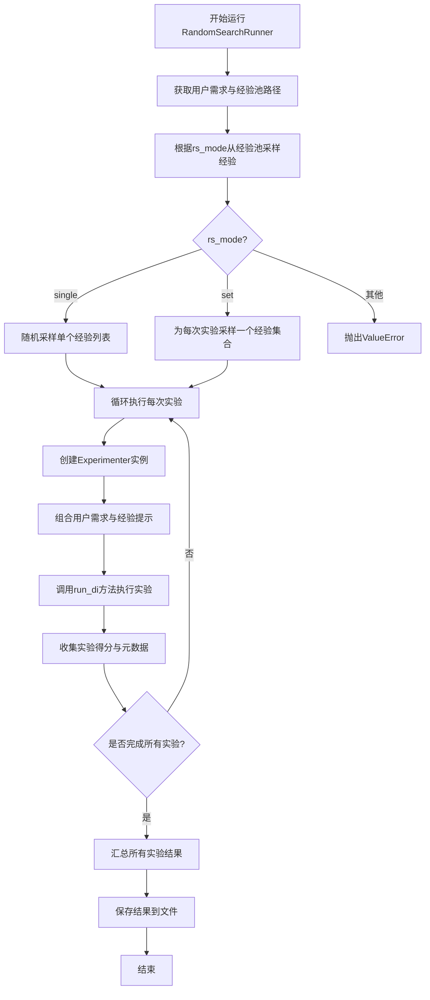
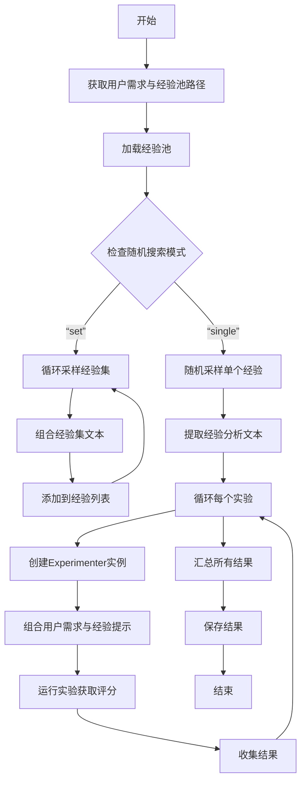

# `.\MetaGPT\metagpt\ext\sela\runner\random_search.py` 详细设计文档

该代码实现了一个基于随机搜索的实验运行器，用于在给定任务上评估不同经验提示（insights）对智能体性能的影响。它从经验池中随机采样经验，将其注入到用户需求中，然后通过实验者（Experimenter）运行多个实验，收集并汇总结果。

## 整体流程



## 类结构

```
Runner (基类)
└── RandomSearchRunner (随机搜索实验运行器)
```

## 全局变量及字段


### `EXPS_PROMPT`
    
一个用于格式化经验提示的字符串模板，包含占位符 {experience}，用于在用户需求中插入经验洞察。

类型：`str`
    


### `RandomSearchRunner.result_path`
    
指定随机搜索实验结果的默认存储路径。

类型：`str`
    
    

## 全局函数及方法

### `RandomSearchRunner.run_experiment`

该方法执行随机搜索实验。它首先根据配置的任务和数据加载经验池，然后根据指定的随机搜索模式（单个经验或经验集）从池中采样经验。接着，它为每个采样到的经验创建一个实验者（Experimenter）实例，将经验作为提示的一部分与用户需求结合，并运行实验以获取评分结果。最后，它汇总所有实验结果并保存。

参数：
- `self`：`RandomSearchRunner`，当前`RandomSearchRunner`实例的引用。

返回值：`None`，该方法不返回任何值，但会将实验结果保存到文件中。

#### 流程图



#### 带注释源码

```python
async def run_experiment(self):
    # 从状态中获取用户需求
    user_requirement = self.state["requirement"]
    # 根据任务和数据配置获取经验池文件路径
    exp_pool_path = get_exp_pool_path(self.args.task, self.data_config, pool_name="ds_analysis_pool")
    # 加载经验池，根据参数决定是否使用固定的经验
    exp_pool = InstructionGenerator.load_insight_pool(
        exp_pool_path, use_fixed_insights=self.args.use_fixed_insights
    )
    # 根据随机搜索模式处理经验
    if self.args.rs_mode == "single":
        # 模式“single”：从经验池中随机采样指定数量的单个经验
        exps = InstructionGenerator._random_sample(exp_pool, self.args.num_experiments)
        # 提取每个经验中的“Analysis”字段文本
        exps = [exp["Analysis"] for exp in exps]
    elif self.args.rs_mode == "set":
        # 模式“set”：循环采样指定数量的经验集
        exps = []
        for i in range(self.args.num_experiments):
            # 采样一个经验集（可能包含多个经验）
            exp_set = InstructionGenerator.sample_instruction_set(exp_pool)
            # 将经验集格式化为文本，每行包含任务ID和分析内容
            exp_set_text = "\n".join([f"{exp['task_id']}: {exp['Analysis']}" for exp in exp_set])
            # 将格式化后的文本添加到经验列表中
            exps.append(exp_set_text)
    else:
        # 如果模式不是“single”或“set”，抛出错误
        raise ValueError(f"Invalid mode: {self.args.rs_mode}")

    # 初始化结果列表
    results = []
    # 循环执行每个实验
    for i in range(self.args.num_experiments):
        # 为当前实验创建一个Experimenter实例，配置超时和反思选项
        di = Experimenter(node_id=str(i), use_reflection=self.args.reflection, role_timeout=self.args.role_timeout)
        # 设置实验者的工作目录，包含任务名称以区分
        di.role_dir = f"{di.role_dir}_{self.args.task}"
        # 将用户需求与当前实验的经验提示结合
        requirement = user_requirement + EXPS_PROMPT.format(experience=exps[i])
        # 打印组合后的需求（用于调试或日志）
        print(requirement)
        # 运行实验，获取评分字典
        score_dict = await self.run_di(di, requirement, run_idx=i)
        # 将当前实验的结果（索引、评分、模式、经验、需求、参数）添加到结果列表
        results.append(
            {
                "idx": i,
                "score_dict": score_dict,
                "rs_mode": self.args.rs_mode,
                "insights": exps[i],
                "user_requirement": requirement,
                "args": vars(self.args),
            }
        )
    # 汇总所有实验结果（例如计算平均分、最佳结果等）
    results = self.summarize_results(results)
    # 将汇总后的结果保存到文件
    self.save_result(results)
```

## 关键组件


### 张量索引与惰性加载

代码中未直接涉及张量索引与惰性加载机制。

### 反量化支持

代码中未直接涉及反量化支持机制。

### 量化策略

代码中未直接涉及量化策略。

### 经验池加载与采样 (`InstructionGenerator`)

`InstructionGenerator` 类提供了从指定路径加载经验池 (`load_insight_pool`) 以及从池中进行随机采样 (`_random_sample`) 或按集合采样 (`sample_instruction_set`) 的功能，用于为实验提供不同的先验知识或指令集。

### 实验运行器 (`RandomSearchRunner`)

`RandomSearchRunner` 类继承自 `Runner`，是执行随机搜索实验的核心组件。它负责加载经验池、根据配置模式（单条或集合）采样经验、为每个实验实例化 `Experimenter`、组合用户需求与采样经验、运行实验并收集和汇总结果。

### 实验执行者 (`Experimenter`)

`Experimenter` 类是具体执行单个实验任务的核心组件。它接收组合后的需求（用户需求+经验提示），在给定的配置（如是否使用反思、角色超时等）下运行，并返回包含评分等信息的字典 (`score_dict`)。

### 经验提示模板 (`EXPS_PROMPT`)

`EXPS_PROMPT` 是一个全局字符串常量，定义了将采样到的经验（`{experience}`）嵌入到用户原始需求中的模板格式，用于构建每个实验的具体输入指令。


## 问题及建议


### 已知问题

-   **硬编码路径与配置**：`result_path` 字段被硬编码为 `"results/random_search"`，缺乏灵活性，难以适应不同的部署环境或实验配置。
-   **缺乏输入验证**：代码直接使用 `self.args.rs_mode` 和 `self.args.num_experiments` 等参数，未进行有效性检查（如 `rs_mode` 是否在允许的列表中，`num_experiments` 是否为正整数），可能导致运行时错误。
-   **潜在的阻塞风险**：`run_experiment` 方法中通过 `for` 循环顺序执行多个实验（`await self.run_di(...)`），如果单个实验耗时较长，整体运行时间会线性增长，无法利用并发优势。
-   **资源管理不足**：为每个实验创建新的 `Experimenter` 实例（`di = Experimenter(...)`），但未显式管理其生命周期或资源释放，在长时间运行或大规模实验中可能引发资源泄露。
-   **代码可测试性差**：方法 `run_experiment` 承担了过多职责（参数解析、经验池加载、采样、实验执行、结果收集与保存），且严重依赖外部状态（`self.state`, `self.args`, `self.data_config`）和全局函数，导致单元测试难以编写。
-   **异常处理不完善**：在加载经验池（`InstructionGenerator.load_insight_pool`）和运行实验（`self.run_di`）时可能抛出异常，但当前代码未进行捕获和处理，可能导致程序意外终止。
-   **结果保存耦合**：结果保存逻辑内嵌在 `run_experiment` 方法中（`self.save_result(results)`），使得该方法职责不单一，且难以替换或扩展保存策略。

### 优化建议

-   **配置外部化**：将 `result_path` 等硬编码值移至配置文件（如 YAML、JSON）或通过命令行参数注入，提高系统的可配置性和环境适应性。
-   **增加参数验证**：在方法开始处或通过 Pydantic 等模型，对 `self.args` 中的关键参数进行验证，确保其符合预期范围和类型，并给出清晰的错误提示。
-   **引入并发执行**：将实验执行改为并发模式。例如，使用 `asyncio.gather` 或 `TaskGroup` 来并发运行多个 `self.run_di` 调用，显著减少总运行时间。需注意控制并发度，避免资源过载。
-   **实现资源上下文管理**：为 `Experimenter` 类实现 `__aenter__` 和 `__aexit__` 方法，或使用 `async with` 语句来确保实验结束后相关资源（如网络连接、文件句柄）能被正确清理。
-   **重构以遵循单一职责原则**：将 `run_experiment` 方法拆分为更小的、功能单一的函数或方法。例如：
    -   `_load_and_sample_experiences`: 负责加载经验池并按模式采样。
    -   `_run_single_experiment`: 负责执行单个实验并返回结果。
    -   `_run_experiments_concurrently`: 负责并发调度多个实验。
    -   主方法 `run_experiment` 则协调这些步骤。这能提升代码可读性、可维护性和可测试性。
-   **增强异常处理与日志记录**：使用 `try...except` 块包裹可能失败的操作（如 I/O、网络请求），记录详细的错误日志，并根据情况决定是重试、跳过还是终止实验。考虑使用结构化的日志记录库。
-   **依赖注入与结果处理器抽象**：将结果保存逻辑抽象为一个接口（例如 `ResultSaver`），并通过依赖注入的方式提供给 `RandomSearchRunner`。这样可以根据需要轻松切换不同的保存后端（如本地文件、数据库、云存储）。
-   **添加类型注解与文档**：为方法参数、返回值和复杂逻辑添加更详细的类型注解和文档字符串（docstring），这能极大提升代码的可读性和开发工具（如 IDE、mypy）的支持度。


## 其它


### 设计目标与约束

本模块（RandomSearchRunner）的设计目标是实现一个基于随机搜索策略的实验运行器，用于在给定的任务和数据配置下，自动化地执行多轮实验。其核心约束包括：1) 必须能够从预定义的“经验池”中随机抽取或组合指令（insights）作为实验的额外输入；2) 支持两种随机采样模式（`single` 和 `set`）；3) 能够为每一轮实验实例化独立的实验执行器（Experimenter）并运行；4) 需要收集、汇总并持久化每一轮实验的结果。设计上依赖于外部的 `Experimenter`、`InstructionGenerator` 等组件，并遵循项目约定的目录结构和参数传递方式。

### 错误处理与异常设计

模块中的错误处理主要集中于参数验证和流程控制。在 `run_experiment` 方法中，对 `self.args.rs_mode` 参数进行了检查，如果其值不是预定义的 `"single"` 或 `"set"`，则会抛出 `ValueError` 异常，并附带错误信息。这是一种防御性编程，确保程序在遇到无法处理的模式时能明确失败，避免后续逻辑错误。对于文件加载（如 `get_exp_pool_path`、`load_insight_pool`）或异步任务执行（`run_di`）过程中可能出现的其他异常（如文件不存在、IO错误、网络超时等），当前代码并未显式捕获和处理，这些异常会向上层调用者传播，由更顶层的错误处理机制或框架来处理。

### 数据流与状态机

1.  **输入数据流**：流程始于 `self.state["requirement"]`（用户原始需求）和通过 `self.args` 及 `self.data_config` 确定的实验配置。核心输入是存储在 `exp_pool_path` 的经验池数据。
2.  **内部处理流**：
    *   **经验采样**：根据 `rs_mode`，从经验池中随机抽取单个经验（`single`）或一组经验（`set`），并格式化为文本 `exps[i]`。
    *   **需求增强**：将原始用户需求与格式化后的经验文本结合，生成增强后的任务需求 `requirement`。
    *   **实验执行**：为每个增强后的需求实例化一个 `Experimenter` (`di`)，并调用 `run_di` 方法执行实验，获取 `score_dict`。
3.  **输出数据流**：每一轮实验的结果（索引、分数字典、模式、使用的经验、完整需求、参数）被收集到 `results` 列表中。最终，该列表被传递给 `summarize_results` 方法进行汇总，然后通过 `save_result` 方法持久化到 `result_path` 指定的位置。模块本身不维护复杂的内部状态机，其状态主要由输入参数和循环索引 `i` 驱动。

### 外部依赖与接口契约

1.  **类依赖**：
    *   `Experimenter`: 负责执行单次实验的核心组件。`RandomSearchRunner.run_di` 方法（在父类 `Runner` 中定义）依赖于其接口来运行实验并返回评分字典。
    *   `InstructionGenerator`: 提供加载经验池（`load_insight_pool`）、随机采样（`_random_sample`）和采样指令集（`sample_instruction_set`）的静态方法。`RandomSearchRunner` 严格依赖这些方法的数据格式和返回值结构。
2.  **函数/工具依赖**：
    *   `get_exp_pool_path`: 用于根据任务和配置生成经验池文件的路径。依赖其返回有效的文件系统路径。
    *   `Runner` 父类：`RandomSearchRunner` 继承自 `Runner`，依赖父类定义的 `run_di`、`summarize_results`、`save_result` 等方法以及可能存在的 `state`、`args`、`data_config` 等属性。必须遵循父类的接口契约。
3.  **数据格式契约**：
    *   经验池数据：预期为 `InstructionGenerator.load_insight_pool` 可加载的格式，通常是一个包含字典的列表，每个字典至少包含 `"Analysis"` 和 `"task_id"` 键。
    *   实验结果：`run_di` 方法返回的 `score_dict` 需要符合 `summarize_results` 和 `save_result` 方法处理的预期格式。
    *   参数对象 `self.args`：需要包含 `task`, `use_fixed_insights`, `rs_mode`, `num_experiments`, `reflection`, `role_timeout` 等属性。

    