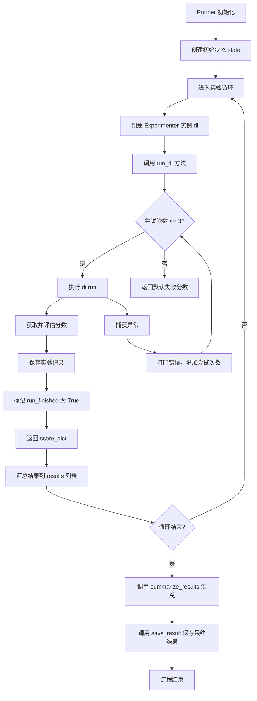
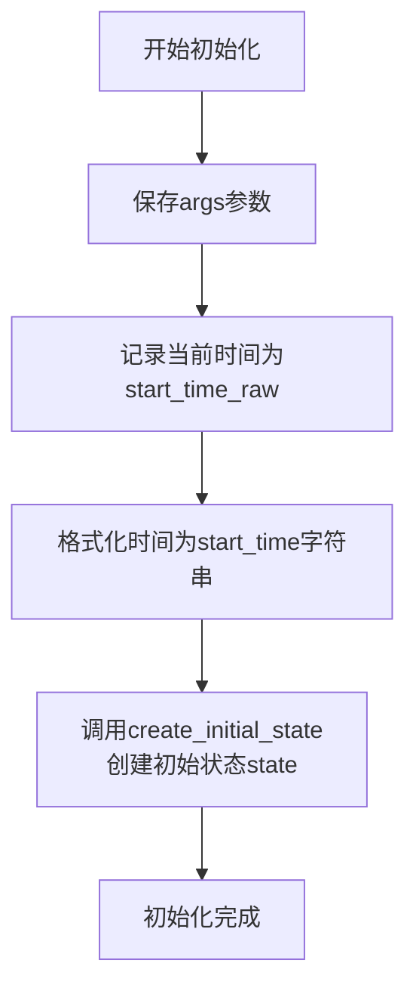
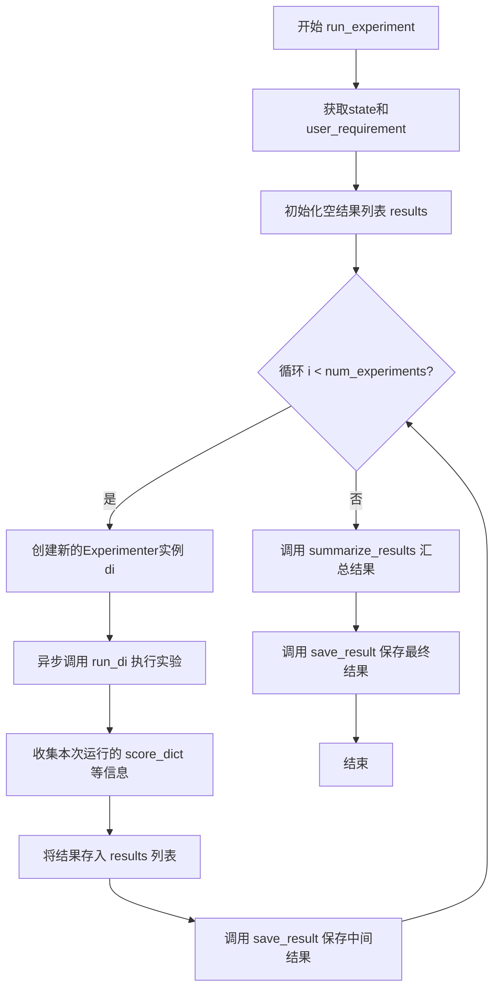
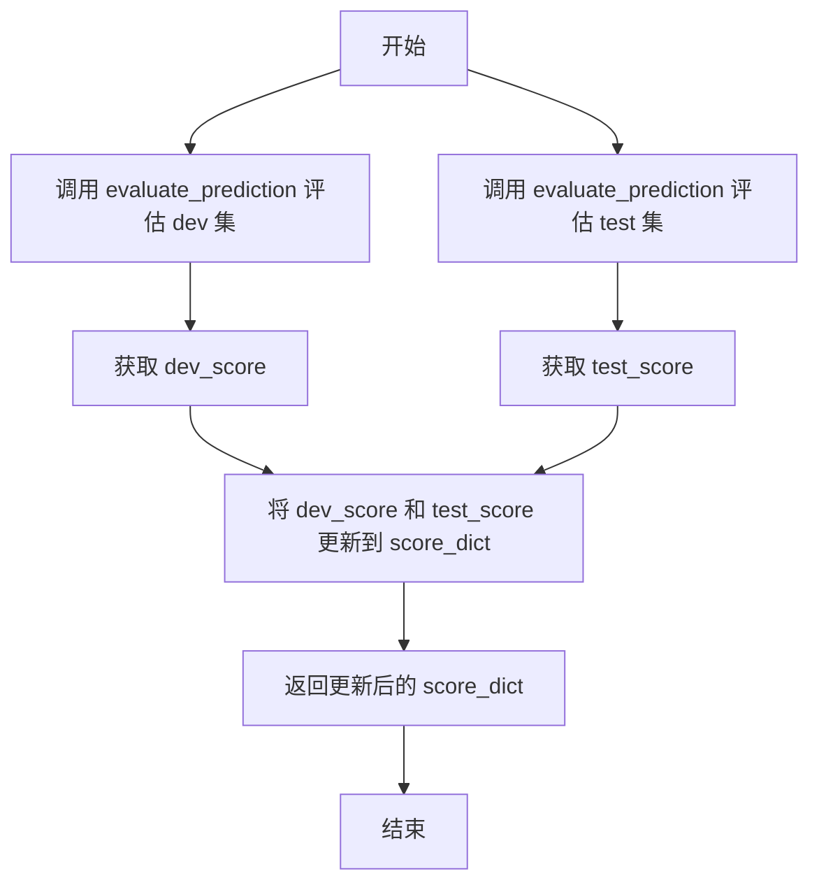

# `.\MetaGPT\metagpt\ext\sela\runner\runner.py` 详细设计文档

该代码定义了一个名为 `Runner` 的类，其核心功能是管理和执行一系列基于 `Experimenter` 的自动化实验。它负责初始化实验状态，运行多个实验实例（支持重试机制），评估每个实验在开发集和测试集上的预测性能，汇总所有实验结果（包括最佳分数和平均分数），并将最终结果及元数据（如时间戳、实验参数）保存为 JSON 文件。

## 整体流程



## 类结构

```
Runner
├── 类字段: result_path, data_config, start_task_id, args, start_time_raw, start_time, state
├── 类方法: __init__, run_di, summarize_results, run_experiment, evaluate_prediction, evaluate, get_save_name, save_result
```

## 全局变量及字段


### `Runner.result_path`
    
存储实验结果的根目录路径，默认值为'results/base'。

类型：`str`
    


### `Runner.data_config`
    
从DATA_CONFIG导入的数据配置字典，包含数据集路径、任务配置等信息。

类型：`Dict`
    


### `Runner.start_task_id`
    
实验运行的起始任务ID，默认值为1。

类型：`int`
    


### `Runner.args`
    
命令行参数对象，包含实验配置如任务名称、实验次数、超时时间等。

类型：`argparse.Namespace`
    


### `Runner.start_time_raw`
    
实验开始的原始时间戳对象，用于计算实验持续时间。

类型：`datetime.datetime`
    


### `Runner.start_time`
    
格式化后的实验开始时间字符串（格式：YYYYMMDDHHMM），用于生成唯一文件名。

类型：`str`
    


### `Runner.state`
    
实验的初始状态字典，包含任务配置、工作目录、数据集路径等运行时信息。

类型：`Dict`
    
    

## 全局函数及方法

### `Runner.__init__`

初始化 `Runner` 类的实例，设置实验运行所需的核心参数、时间戳和初始状态。

参数：

- `args`：`argparse.Namespace` 或类似对象，包含命令行参数或配置参数，用于控制实验的运行方式（如任务名称、实验模式等）。
- `**kwargs`：`dict`，可变关键字参数，当前代码中未使用，但为未来扩展预留。

返回值：`None`，构造函数不返回任何值。

#### 流程图



#### 带注释源码

```python
def __init__(self, args, **kwargs):
    # 保存传入的配置参数，这些参数将控制实验的各个方面
    self.args = args
    # 记录实验开始的精确时间点，用于后续计算总耗时
    self.start_time_raw = datetime.datetime.now()
    # 将开始时间格式化为字符串，用于生成唯一的文件名或标识符
    self.start_time = self.start_time_raw.strftime("%Y%m%d%H%M")
    # 调用工具函数，根据任务配置、数据配置和参数创建实验的初始状态字典
    # 该状态包含了任务信息、工作目录、数据集路径等关键上下文
    self.state = create_initial_state(
        self.args.task,
        start_task_id=self.start_task_id,
        data_config=self.data_config,
        args=self.args,
    )
```

### `Runner.run_di`

该方法负责执行一个具体的实验运行。它接收一个实验器实例、用户需求和一个运行索引，尝试运行实验并获取评分。如果运行过程中发生异常，它会进行有限次数的重试。无论运行成功与否，它都会保存实验的笔记本文件，并返回一个包含训练、开发和测试集评分的字典。如果所有重试均失败，则返回一个包含默认失败分数（-1）的字典。

参数：
- `di`：`Experimenter`，一个实验器实例，用于执行具体的实验逻辑。
- `user_requirement`：`str`，用户的需求或任务描述，作为实验的输入。
- `run_idx`：`int`，当前实验运行的索引号，用于区分多次运行。

返回值：`dict`，一个包含实验评分的字典。成功时包含 `train_score`、`dev_score`、`test_score` 和 `score` 等键；失败时所有键的值均为 -1。

#### 流程图

```mermaid
flowchart TD
    A[开始: run_di(di, user_requirement, run_idx)] --> B[初始化: max_retries=3, num_runs=1, run_finished=False]
    B --> C{循环条件: num_runs <= max_retries<br>且 run_finished == False?}
    C -- 是 --> D[尝试执行: await di.run(user_requirement)]
    D --> E[获取评分: score_dict = await di.get_score()]
    E --> F[评估评分: score_dict = self.evaluate(score_dict, self.state)]
    F --> G[设置 run_finished = True]
    G --> C
    C -- 否 --> H[保存实验笔记本]
    H --> I{run_finished == True?}
    I -- 是 --> J[返回 score_dict]
    I -- 否 --> K[构造失败评分字典]
    K --> J
    D -.-> L[捕获异常]
    L --> M[打印错误信息]
    M --> N[num_runs += 1]
    N --> C
```

#### 带注释源码

```python
async def run_di(self, di, user_requirement, run_idx):
    # 最大重试次数
    max_retries = 3
    # 当前运行次数
    num_runs = 1
    # 运行完成标志
    run_finished = False
    # 重试循环：当运行次数未超过最大重试次数且运行未完成时继续
    while num_runs <= max_retries and not run_finished:
        try:
            # 执行实验器的主要运行逻辑
            await di.run(user_requirement)
            # 获取实验器计算出的初步评分
            score_dict = await di.get_score()
            # 调用评估方法，对预测结果进行正式评估并更新评分字典
            score_dict = self.evaluate(score_dict, self.state)
            # 运行成功，设置完成标志
            run_finished = True
        except Exception as e:
            # 捕获运行过程中的任何异常
            print(f"Error: {e}")
            # 增加运行次数，准备重试
            num_runs += 1
    # 无论成功与否，都保存实验的笔记本文件
    # 构造保存名称
    save_name = self.get_save_name()
    # 调用工具函数保存笔记本
    save_notebook(role=di, save_dir=self.result_path, name=f"{save_name}_{run_idx}")

    # 如果经过重试后运行仍未成功
    if not run_finished:
        # 构造一个表示失败的评分字典，所有分数设为-1
        score_dict = {"train_score": -1, "dev_score": -1, "test_score": -1, "score": -1}
    # 返回评分字典（成功时为评估后的字典，失败时为默认失败字典）
    return score_dict
```

### `Runner.summarize_results`

该方法用于汇总多次实验的结果，计算关键统计指标（如最佳开发集分数、平均测试分数等），并将这些汇总信息插入到结果列表的开头。

参数：

- `results`：`list`，包含每次实验详细结果的列表。每个元素是一个字典，至少包含键`"score_dict"`，其值是一个包含`"dev_score"`和`"test_score"`等分数的字典。

返回值：`list`，更新后的结果列表。在列表开头插入了一个新的字典元素，包含了计算出的汇总指标。

#### 流程图

```mermaid
flowchart TD
    A[开始: summarize_results(results)] --> B[提取所有dev_score到列表dev_scores]
    B --> C{args.low_is_better?}
    C -- 否 --> D[取dev_scores最大值作为best_dev_score]
    C -- 是 --> E[过滤掉-1分数后取最小值作为best_dev_score]
    D --> F
    E --> F[根据best_dev_score找到其索引best_score_idx]
    F --> G[提取所有test_score到列表test_scores]
    G --> H[计算test_scores的平均值avg_score]
    H --> I{args.low_is_better?}
    I -- 否 --> J[取test_scores最大值作为global_best_score]
    I -- 是 --> K[过滤掉dev_score为-1对应的test_score后取最小值]
    J --> L
    K --> L[构造汇总字典summary_dict]
    L --> M[将summary_dict插入results列表开头]
    M --> N[返回更新后的results列表]
```

#### 带注释源码

```python
def summarize_results(self, results):
    # 1. 从所有实验结果中提取开发集分数
    dev_scores = [result["score_dict"]["dev_score"] for result in results]

    # 2. 根据评估标准（分数越低越好还是越高越好）确定最佳开发集分数
    if not self.args.low_is_better:
        # 分数越高越好，直接取最大值
        best_dev_score = max(dev_scores)
    else:
        # 分数越低越好，需要过滤掉无效分数（-1），然后取最小值
        # 如果所有分数都是-1，则使用正无穷作为默认值
        best_dev_score = min([score for score in dev_scores if score != -1] + [np.inf])

    # 3. 找到最佳开发集分数在原始列表中的索引
    best_score_idx = dev_scores.index(best_dev_score)

    # 4. 从所有实验结果中提取测试集分数
    test_scores = [result["score_dict"]["test_score"] for result in results]

    # 5. 计算所有测试集分数的平均值
    avg_score = sum(test_scores) / len(test_scores)

    # 6. 根据评估标准确定全局最佳测试集分数
    if not self.args.low_is_better:
        # 分数越高越好，直接取最大值
        global_best_score = max(test_scores)
    else:
        # 分数越低越好，需要过滤掉那些开发集分数无效（-1）的实验所对应的测试分数
        # 然后取最小值。如果所有对应开发集分数都无效，则使用正无穷作为默认值。
        global_best_score = min(
            [score for i, score in enumerate(test_scores) if dev_scores[i] != -1] + [np.inf]
        )

    # 7. 构造一个包含所有汇总指标的字典
    summary_dict = {
        "best_dev_score": best_dev_score,          # 最佳开发集分数
        "best_dev_score_idx": best_score_idx,      # 最佳开发集分数对应的实验索引
        "best_dev_test_score": test_scores[best_score_idx], # 最佳开发集实验对应的测试分数
        "avg_test_score": avg_score,               # 所有测试分数的平均值
        "global_best_test_score": global_best_score, # 全局最佳测试分数（可能与最佳开发集实验不同）
    }

    # 8. 将汇总字典插入到结果列表的开头（索引0位置）
    results.insert(0, summary_dict)

    # 9. 返回更新后的结果列表
    return results
```

### `Runner.run_experiment`

该方法负责执行一个完整的实验流程。它通过循环创建多个`Experimenter`实例（即DI，数据智能体），对给定的用户需求进行多次独立的实验运行。每次运行会调用`run_di`方法执行实验并获取评分，收集所有运行结果后，调用`summarize_results`方法进行统计分析（如计算最佳开发集分数、平均测试集分数等），并最终将包含时间信息和汇总结果的完整数据保存到JSON文件中。

参数：
- `self`：`Runner`，`Runner`类的实例，包含实验配置、状态和工具方法。

返回值：`None`，该方法不返回任何值，其主要作用是通过副作用执行实验并保存结果。

#### 流程图



#### 带注释源码

```python
async def run_experiment(self):
    # 从Runner实例中获取初始化的实验状态
    state = self.state
    # 从状态中提取用户需求，作为实验的输入目标
    user_requirement = state["requirement"]
    # 初始化一个空列表，用于存储每次实验运行的结果
    results = []

    # 根据命令行参数中指定的实验次数进行循环
    for i in range(self.args.num_experiments):
        # 创建一个新的Experimenter实例（数据智能体），配置其ID、是否使用反思机制和角色超时时间
        di = Experimenter(node_id="0", use_reflection=self.args.reflection, role_timeout=self.args.role_timeout)
        # 异步执行一次实验：运行智能体，评估结果，并保存相关输出（如notebook）
        score_dict = await self.run_di(di, user_requirement, run_idx=i)
        # 将本次实验的索引、评分字典、用户需求和参数配置打包成一个字典，添加到结果列表中
        results.append(
            {"idx": i, "score_dict": score_dict, "user_requirement": user_requirement, "args": vars(self.args)}
        )
        # 每次循环后都保存当前的结果列表，作为中间结果，防止程序意外中断导致数据丢失
        self.save_result(results)  # save intermediate results
    # 所有实验运行完毕后，对结果进行统计分析（如找出最佳开发集分数对应的运行等）
    results = self.summarize_results(results)

    # 保存包含汇总信息的最终结果
    self.save_result(results)
```


### `Runner.evaluate_prediction`

该方法用于评估模型在指定数据集划分（开发集或测试集）上的预测结果。它读取模型生成的预测文件，与真实标签进行对比，使用指定的评估指标计算得分，并将预测结果复制到节点专属目录进行存档。

参数：

-  `split`：`str`，数据集划分的名称，例如 "dev" 或 "test"。
-  `state`：`dict`，包含当前任务运行状态、配置和路径信息的字典。

返回值：`float`，模型在指定数据集划分上的评估得分。

#### 流程图

```mermaid
flowchart TD
    A[开始: evaluate_prediction(split, state)] --> B[构建预测文件路径 pred_path]
    B --> C[创建节点目录 state['node_dir']]
    C --> D[构建节点预测文件路径 pred_node_path]
    D --> E[构建真实标签文件路径 gt_path]
    E --> F[读取预测文件 preds]
    F --> G[提取预测列<br>（通常是最后一列）]
    G --> H[将预测结果保存到节点目录 pred_node_path]
    H --> I[读取真实标签 gt]
    I --> J[获取评估指标 metric]
    J --> K[删除原始预测文件 pred_path]
    K --> L[调用 evaluate_score 计算得分]
    L --> M[返回评估得分]
```

#### 带注释源码

```python
def evaluate_prediction(self, split, state):
    # 1. 构建原始预测文件的完整路径。路径基于工作目录、任务名和数据集划分。
    pred_path = os.path.join(state["work_dir"], state["task"], f"{split}_predictions.csv")
    # 2. 确保节点专属目录存在，用于存档本次运行的预测结果。
    os.makedirs(state["node_dir"], exist_ok=True)
    # 3. 构建节点目录下的预测文件路径，文件名包含时间戳以区分不同运行。
    pred_node_path = os.path.join(state["node_dir"], f"{self.start_time}-{split}_predictions.csv")
    # 4. 根据数据集划分，从配置中获取真实标签文件的路径。
    gt_path = os.path.join(state["datasets_dir"][f"{split}_target"])
    # 5. 读取模型生成的预测CSV文件。
    preds = pd.read_csv(pred_path)
    # 6. 提取预测值。假设预测值是CSV文件的最后一列。
    preds = preds[preds.columns.tolist()[-1]]
    # 7. 将提取出的预测序列保存到节点目录，实现结果存档。
    preds.to_csv(pred_node_path, index=False)
    # 8. 读取真实标签文件，并提取名为'target'的列作为真实值。
    gt = pd.read_csv(gt_path)["target"]
    # 9. 从数据集配置中获取本次任务使用的评估指标（如准确率、F1分数等）。
    metric = state["dataset_config"]["metric"]
    # 10. 删除原始的预测文件，可能为了清理临时文件或避免后续混淆。
    os.remove(pred_path)
    # 11. 调用外部评估函数，传入预测值、真实值和评估指标，计算并返回最终得分。
    return evaluate_score(preds, gt, metric)
```


### `Runner.evaluate`

该方法用于评估模型在开发集（dev）和测试集（test）上的预测性能，并将评估分数更新到传入的分数字典中。

参数：
- `score_dict`：`dict`，包含初始评估分数的字典，通常包含训练集分数等信息。
- `state`：`dict`，包含实验运行状态、配置和路径信息的字典。

返回值：`dict`，更新后的分数字典，包含了`dev_score`和`test_score`两个新的键值对。

#### 流程图



#### 带注释源码

```python
def evaluate(self, score_dict, state):
    # 评估开发集和测试集的预测结果，并将分数存入字典
    scores = {
        "dev_score": self.evaluate_prediction("dev", state),  # 评估开发集
        "test_score": self.evaluate_prediction("test", state),  # 评估测试集
    }
    score_dict.update(scores)  # 将评估分数更新到原始分数字典中
    return score_dict  # 返回更新后的分数字典
```

### `Runner.get_save_name`

该方法用于生成一个唯一的、描述性的文件名，该文件名结合了实验模式、任务名称和实验开始时间，用于保存实验结果或相关文件。

参数：
-  `self`：`Runner`，`Runner`类的实例，用于访问实例属性`args`和`start_time`。

返回值：`str`，返回一个格式为`{exp_mode}-{task}_{start_time}`的字符串，其中`exp_mode`和`task`来自运行参数，`start_time`是实验开始的时间戳。

#### 流程图

```mermaid
graph TD
    A[开始] --> B[获取self.args.exp_mode]
    B --> C[获取self.args.task]
    C --> D[获取self.start_time]
    D --> E[拼接字符串: f'{exp_mode}-{task}_{start_time}']
    E --> F[返回拼接后的字符串]
    F --> G[结束]
```

#### 带注释源码

```python
def get_save_name(self):
    # 生成一个唯一的保存文件名，格式为：实验模式-任务名_开始时间
    # 例如：'base-task1_202311151200'
    return f"{self.args.exp_mode}-{self.args.task}_{self.start_time}"
```

### `Runner.save_result`

该方法用于将实验结果（包括时间信息和性能指标）保存为JSON文件到指定路径。

参数：

- `result`：`list`，包含实验结果的列表，每个元素是一个字典，记录了单次实验的详细信息（如得分、参数等）

返回值：`None`，无返回值

#### 流程图

```mermaid
flowchart TD
    A[开始: save_result(result)] --> B[获取当前时间end_time_raw]
    B --> C[格式化end_time为字符串]
    C --> D[计算实验持续时间]
    D --> E[构建时间信息字典time_info]
    E --> F[复制result列表]
    F --> G[在result列表头部插入time_info]
    G --> H[调用get_save_name生成文件名]
    H --> I[确保结果目录存在]
    I --> J[将result列表写入JSON文件]
    J --> K[结束]
```

#### 带注释源码

```python
def save_result(self, result):
    # 获取实验结束时间
    end_time_raw = datetime.datetime.now()
    # 将结束时间格式化为字符串，格式为年月日时分
    end_time = end_time_raw.strftime("%Y%m%d%H%M")
    # 构建包含实验时间信息的字典
    time_info = {
        "start_time": self.start_time,  # 实验开始时间（已在__init__中初始化）
        "end_time": end_time,           # 实验结束时间
        "duration (seconds)": (end_time_raw - self.start_time_raw).seconds,  # 实验总耗时（秒）
    }
    # 复制传入的结果列表，避免修改原始数据
    result = result.copy()
    # 将时间信息插入到结果列表的头部
    result.insert(0, time_info)
    # 生成保存文件的名称，通常包含实验模式、任务名和开始时间
    save_name = self.get_save_name()
    # 确保结果保存目录存在，如果不存在则创建
    os.makedirs(self.result_path, exist_ok=True)
    # 将结果列表以JSON格式写入文件，indent=4使输出格式更易读
    with open(f"{self.result_path}/{save_name}.json", "w") as f:
        json.dump(result, f, indent=4)
```

## 关键组件


### 实验运行器 (Runner)

负责管理整个实验流程，包括初始化实验状态、运行多个实验实例、收集并评估结果，以及最终汇总和保存实验结果。

### 实验状态初始化 (create_initial_state)

根据给定的任务、配置和参数，创建并返回一个包含任务需求、工作目录、数据集路径等关键信息的初始状态字典，为后续实验提供上下文。

### 实验执行器 (Experimenter)

作为实验的核心执行单元，负责根据用户需求（`user_requirement`）执行具体的实验逻辑，并返回初步的评分结果。

### 结果评估器 (evaluate_score)

一个外部评估函数，接收预测值、真实值和评估指标，计算并返回具体的分数，用于量化模型在开发集和测试集上的性能。

### 结果持久化 (save_notebook & Runner.save_result)

`save_notebook` 负责保存实验过程中的中间产物（如Notebook文件）。`Runner.save_result` 方法负责将最终的实验结果（包括时间信息和汇总分数）以JSON格式保存到指定路径。

### 配置管理 (DATA_CONFIG)

一个全局配置对象，用于存储和管理实验所需的数据集路径、任务配置等信息，确保实验环境的一致性。


## 问题及建议


### 已知问题

-   **异常处理不完善**：`run_di` 方法中的异常处理仅打印错误信息并重试，未记录异常详情或区分异常类型。当 `di.run` 或 `di.get_score` 失败时，重试机制可能掩盖了根本原因，且最终返回的 `{"train_score": -1, ...}` 字典无法区分是任务失败还是代码错误。
-   **资源泄漏风险**：`evaluate_prediction` 方法在评估后使用 `os.remove(pred_path)` 删除预测文件。如果评估过程（如 `evaluate_score`）在此前抛出异常，文件可能不会被正确清理，导致临时文件累积。
-   **硬编码路径与配置**：`result_path` 和 `data_config` 作为类属性硬编码，降低了代码的灵活性和可配置性。`DATA_CONFIG` 作为模块级全局变量导入，其来源和结构不明确，增加了维护和理解成本。
-   **潜在的竞态条件**：`save_result` 方法使用 `self.start_time` 作为文件名的一部分。如果在同一秒内启动多个 `Runner` 实例，可能导致结果文件被覆盖。`self.start_time` 在 `__init__` 中生成，但后续未更新，长时间运行的任务可能产生误导性的时间戳。
-   **结果汇总逻辑缺陷**：`summarize_results` 方法中，当 `self.args.low_is_better` 为 `True` 时，寻找最佳开发集分数的逻辑 `min([score for score in dev_scores if score != -1] + [np.inf])` 可能存在问题。如果所有 `dev_scores` 都是 `-1`，此表达式将返回 `np.inf`，这可能不是期望的“最差”分数表示，且与后续 `best_score_idx = dev_scores.index(best_dev_score)` 的查找可能失败（因为 `np.inf` 不在 `dev_scores` 列表中）。
-   **代码可测试性差**：类方法（如 `run_di`, `evaluate`）与实例状态（`self.state`, `self.args`）和外部依赖（文件系统、`Experimenter` 类）紧密耦合，难以进行单元测试。

### 优化建议

-   **增强异常处理与日志记录**：在 `run_di` 方法中，应捕获更具体的异常，记录堆栈信息，并可能根据异常类型采取不同策略（如重试、跳过或终止）。考虑使用结构化的日志系统（如 `logging` 模块）替代 `print` 语句。失败时返回的分数字典可包含一个 `error` 字段以记录错误信息。
-   **使用上下文管理器管理资源**：对于文件操作（如读取、删除预测文件），应使用 `try...finally` 块或上下文管理器确保资源（如文件句柄）被正确释放，即使在发生异常时也是如此。例如，将 `os.remove` 放在 `finally` 块中。
-   **外部化配置**：将 `result_path`、`start_task_id` 等配置项移至配置文件（如 YAML、JSON）或通过构造函数参数传入，避免硬编码。考虑使用配置管理库（如 `pydantic-settings`）来验证和加载配置。
-   **确保唯一性和时间准确性**：在生成保存文件名时，可以结合进程ID、随机字符串或更精确的时间戳（如微秒）来避免冲突。对于长时间运行的任务，考虑在 `save_result` 中计算持续时间时使用当前时间，而非依赖初始化时的时间。
-   **修复汇总逻辑并增加健壮性**：修正 `summarize_results` 中寻找最佳分数的逻辑。当所有分数都为 `-1` 时，应明确处理这种情况（例如，设置一个默认值或跳过汇总）。增加输入验证，确保列表不为空且索引有效。
-   **提高可测试性**：通过依赖注入（Dependency Injection）解耦类。例如，将 `Experimenter` 的创建、文件操作函数（如 `save_notebook`, `evaluate_score`）作为参数传入 `Runner` 的构造函数。这样可以在测试中轻松替换为模拟对象（Mock）。将业务逻辑（如结果汇总）与I/O操作（如文件保存）分离。
-   **代码结构与类型提示**：为方法参数和返回值添加更详细的类型提示（Type Hints），以提高代码可读性和 IDE 支持。考虑将 `state` 字典封装为一个数据类（`dataclass` 或 `pydantic` 模型），以提供类型安全和清晰的字段定义。将 `run_experiment` 中的循环逻辑进一步拆分为更小的、可复用的函数。
-   **性能优化**：`evaluate_prediction` 中多次进行文件I/O（读取预测文件、读取真实值文件、保存副本）。如果文件很大，这可能成为瓶颈。考虑是否所有操作都是必要的，或者是否可以流式处理数据。`save_result` 方法在每次实验后都保存整个结果列表，对于大量实验可能效率低下，可以考虑增量保存或批量保存。


## 其它


### 设计目标与约束

本模块（Runner）是SELA实验框架的核心执行器，旨在自动化地运行、评估和记录基于`Experimenter`（DI）的多次实验。其主要设计目标包括：1) **可重复性**：通过固定随机种子、记录完整参数和中间结果，确保实验可复现。2) **容错性**：在单次实验运行失败时进行有限次重试，保证整体实验流程的推进。3) **结果聚合与分析**：自动对多次实验的结果进行统计（如最佳分数、平均分数），并生成汇总报告。4) **资源管理**：自动创建和管理实验输出目录，清理中间预测文件以避免磁盘空间浪费。主要约束包括：依赖外部定义的`DATA_CONFIG`、`create_initial_state`等组件；实验流程是同步与异步混合的（`run_experiment`为`async`，但部分方法为同步）；结果保存格式固定为JSON。

### 错误处理与异常设计

模块采用分层的错误处理策略。在最高层的`run_experiment`循环中，每次实验独立进行，一次实验的失败不会影响后续实验。在单次实验执行层面（`run_di`方法），对`di.run`和`di.get_score`的调用包裹在`try-except`块中，并设置了最多3次重试。若重试后仍失败，则将该次实验的分数标记为`-1`，并继续流程。对于文件I/O操作（如`save_result`、`evaluate_prediction`中的文件读写），依赖`os.makedirs`的`exist_ok=True`参数来避免目录已存在的错误，但未显式处理文件不存在或权限错误等异常，这可能导致程序崩溃。评估函数`evaluate_score`可能抛出的异常也未在此模块中捕获。

### 数据流与状态机

模块的核心数据流围绕`state`字典和`results`列表展开。1) **初始化**：通过`create_initial_state`生成初始`state`，包含任务配置、路径、需求等信息。2) **实验循环**：对于每次实验，`state[“requirement”]`作为输入传递给`Experimenter`实例（DI）。DI运行后产生预测文件。3) **评估阶段**：`evaluate`方法调用`evaluate_prediction`，从`state`中解析路径，读取DI生成的预测文件与真实标签文件，调用`evaluate_score`计算指标，并更新`score_dict`。4) **结果聚合**：所有实验的`score_dict`被收集到`results`列表中，最后由`summarize_results`方法计算统计量（最佳开发集分数、对应测试集分数、平均测试集分数等）。5) **持久化**：中间结果和最终结果通过`save_result`方法序列化为JSON文件保存。整个流程可视为一个简单的线性状态机：初始化 -> 循环{实验执行 -> 评估} -> 聚合 -> 保存。

### 外部依赖与接口契约

*   **强依赖**：
    *   `metagpt.ext.sela.utils.DATA_CONFIG`：全局数据配置字典，提供数据集路径、指标等信息。
    *   `metagpt.ext.sela.search.tree_search.create_initial_state`：函数，用于生成实验初始状态字典。Runner期望其返回的字典包含`requirement`、`work_dir`、`task`、`node_dir`、`datasets_dir`、`dataset_config`等特定键。
    *   `metagpt.ext.sela.experimenter.Experimenter`：实验执行主体类。Runner依赖其异步`run`方法和`get_score`方法，并假设其运行后会在特定路径（由`state`定义）生成预测文件。
    *   `metagpt.ext.sela.evaluation.evaluation.evaluate_score`：评估函数，接受预测值、真实值和指标名称，返回分数。
    *   `metagpt.ext.sela.utils.save_notebook`：用于保存实验日志或笔记的函数。
*   **接口契约**：
    *   `Runner.__init__`：接受`args`（通常为命令行参数解析对象），其属性（如`args.task`, `args.num_experiments`, `args.reflection`, `args.low_is_better`）被模块内部使用。
    *   `Experimenter.run`：应能接受`user_requirement`（字符串）作为参数并异步执行。
    *   文件系统契约：`evaluate_prediction`方法假设`Experimenter`运行后，在`state[“work_dir”]/state[“task”]`目录下生成名为`{split}_predictions.csv`的文件，且该文件最后一列为预测值。真实标签文件路径由`state[“datasets_dir”][“{split}_target”]`指定，且包含名为`“target”`的列。

    