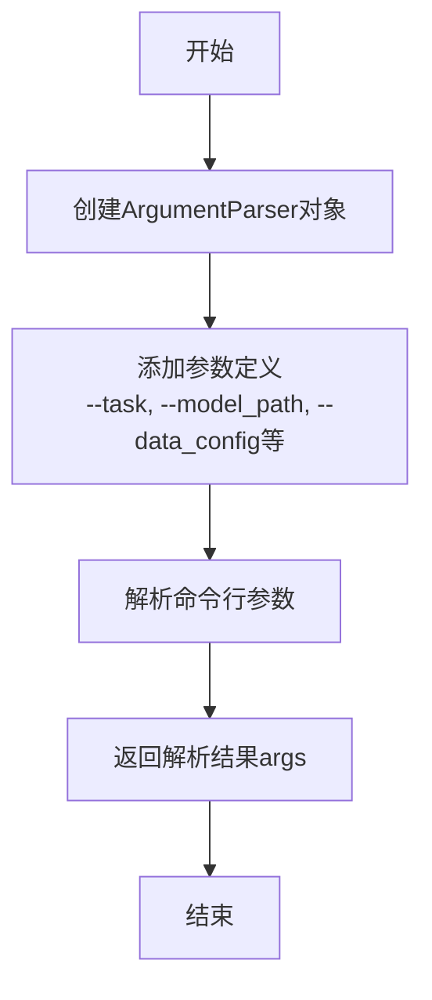
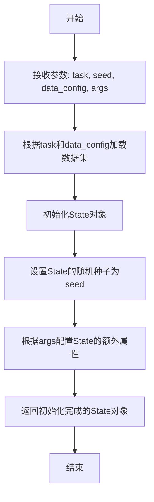
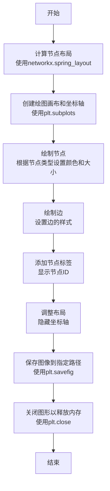
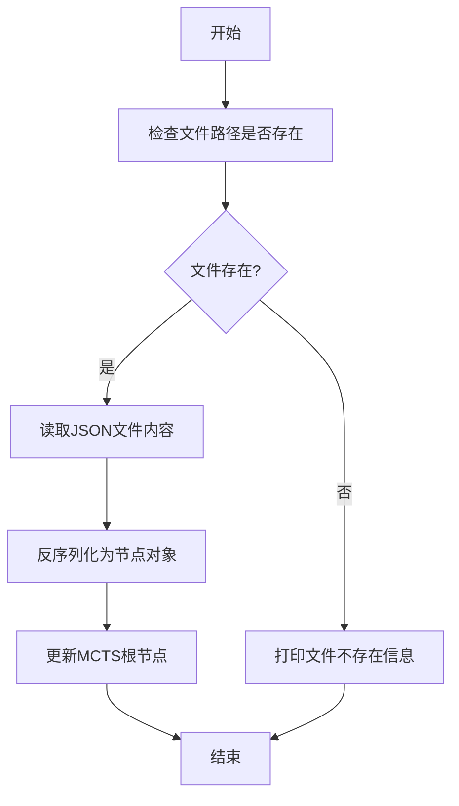
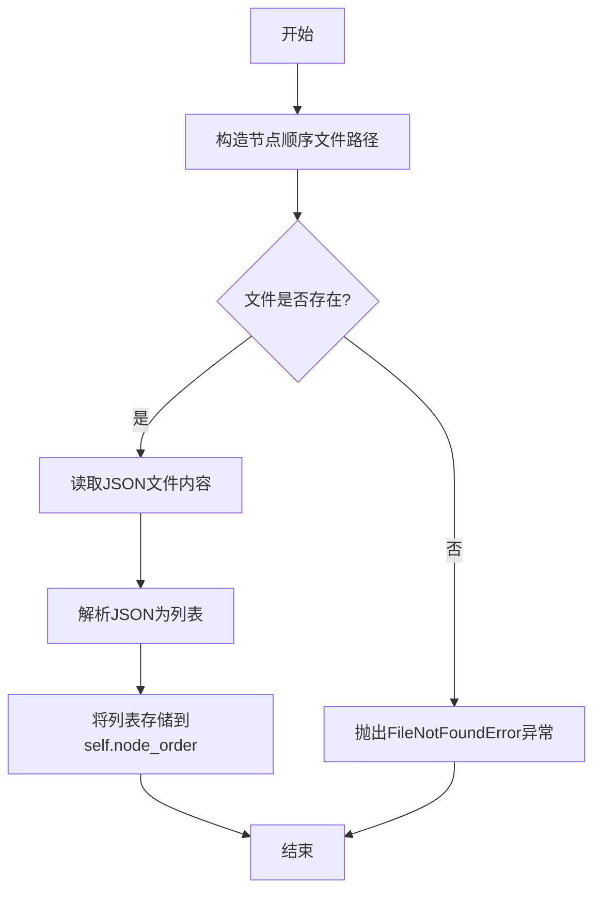

# `.\MetaGPT\metagpt\ext\sela\scripts\visualize_experiment.py` 详细设计文档

该代码是一个主程序入口，用于执行基于蒙特卡洛树搜索（MCTS）的决策过程可视化。它首先解析命令行参数并初始化任务状态，然后创建MCTS实例并加载预计算的搜索树数据，最后使用networkx构建有向图并生成树状结构图进行可视化展示。

## 整体流程

```mermaid
graph TD
    A[开始执行主程序] --> B[解析命令行参数 get_args()]
    B --> C[获取数据配置 DATA_CONFIG]
    C --> D[创建初始状态 create_initial_state()]
    D --> E[初始化根节点 initialize_di_root_node()]
    E --> F[创建MCTS实例 MCTS()]
    F --> G[加载树数据 mcts.load_tree()]
    G --> H[加载节点顺序 mcts.load_node_order()]
    H --> I[构建有向图 build_tree_recursive()]
    I --> J[可视化树结构 visualize_tree()]
    J --> K[保存图像到 results/ 目录]
    K --> L[结束]
```

## 类结构

```
外部依赖库
├── networkx (图论库)
├── metagpt.ext.sela.evaluation.visualize_mcts
│   ├── build_tree_recursive (函数)
│   └── visualize_tree (函数)
├── metagpt.ext.sela.MCTS
│   ├── MCTS (类)
│   ├── create_initial_state (函数)
│   └── initialize_di_root_node (函数)
├── metagpt.ext.sela.run_experiment
│   └── get_args (函数)
└── metagpt.ext.sela.utils
    └── DATA_CONFIG (全局变量)
```

## 全局变量及字段


### `args`
    
命令行参数解析后的对象，包含运行实验所需的各种配置参数。

类型：`argparse.Namespace`
    


### `data_config`
    
数据配置字典，定义了任务相关的数据路径、格式等元信息。

类型：`dict`
    


### `state`
    
蒙特卡洛树搜索（MCTS）的初始状态对象，封装了任务执行的起始环境和条件。

类型：`State`
    


### `role`
    
与初始状态关联的角色对象，定义了在任务中执行动作的实体。

类型：`Role`
    


### `node`
    
MCTS树的根节点，代表搜索的起始点，包含状态、动作、价值等信息。

类型：`Node`
    


### `mcts`
    
蒙特卡洛树搜索算法的主控制器，负责管理搜索过程、节点扩展和策略评估。

类型：`MCTS`
    


### `root`
    
指向MCTS树根节点的引用，用于后续的树遍历和可视化。

类型：`Node`
    


### `node_order`
    
节点访问顺序列表，记录了MCTS搜索过程中节点的遍历次序。

类型：`list`
    


### `G`
    
有向图对象，用于构建和存储MCTS树的结构，以便进行可视化。

类型：`networkx.DiGraph`
    


### `MCTS.root_node`
    
MCTS树的根节点，是搜索算法开始探索的起点。

类型：`Node`
    


### `MCTS.max_depth`
    
MCTS搜索的最大深度限制，用于控制搜索的广度和计算成本。

类型：`int`
    


### `MCTS.use_fixed_insights`
    
布尔标志，指示是否在搜索过程中使用预定义的洞察（insights）来引导探索。

类型：`bool`
    


### `MCTS.node_order`
    
存储MCTS搜索过程中节点访问顺序的列表，用于分析和可视化。

类型：`list`
    
    

## 全局函数及方法

### `get_args`

该函数用于解析并返回命令行参数，这些参数用于配置实验任务、模型路径、数据配置等运行选项。

参数：

- 无显式参数（通过命令行传入）

返回值：`argparse.Namespace`，包含所有解析后的命令行参数及其值

#### 流程图



#### 带注释源码

```python
def get_args():
    """
    解析并返回命令行参数。
    
    该函数定义了一系列命令行参数，用于配置实验的运行方式，
    包括任务类型、模型路径、数据配置、随机种子等。
    
    Returns:
        argparse.Namespace: 包含所有解析后的命令行参数的对象。
    """
    parser = argparse.ArgumentParser(description="Run experiment with specified parameters.")
    
    # 定义任务参数，指定要执行的任务类型
    parser.add_argument("--task", type=str, required=True, help="Task to run (e.g., 'task1', 'task2').")
    
    # 定义模型路径参数，指定预训练模型的存储位置
    parser.add_argument("--model_path", type=str, default="path/to/model", help="Path to the pre-trained model.")
    
    # 定义数据配置参数，指定数据配置文件的路径
    parser.add_argument("--data_config", type=str, default="config/data.yaml", help="Path to data configuration file.")
    
    # 定义随机种子参数，用于实验的可重复性
    parser.add_argument("--seed", type=int, default=42, help="Random seed for reproducibility.")
    
    # 定义最大深度参数，用于限制搜索或生成的深度
    parser.add_argument("--max_depth", type=int, default=5, help="Maximum depth for search or generation.")
    
    # 定义是否使用固定洞察力的参数
    parser.add_argument("--use_fixed_insights", action="store_true", help="Whether to use fixed insights.")
    
    # 解析命令行参数并返回
    args = parser.parse_args()
    return args
```

### `create_initial_state`

该函数用于根据给定的任务、数据配置和参数，创建并初始化一个初始状态对象。这个初始状态是后续蒙特卡洛树搜索（MCTS）过程的起点，包含了任务执行所需的基本信息和环境设置。

参数：
- `task`：`str`，指定要执行的任务名称或标识符。
- `seed`：`int`，随机种子，用于确保实验的可重复性。
- `data_config`：`dict`，数据配置字典，包含任务所需的数据集、路径等信息。
- `args`：`argparse.Namespace`，命令行参数对象，包含额外的运行参数和配置。

返回值：`State`，返回一个初始化后的`State`对象，该对象封装了任务执行的初始状态和环境。

#### 流程图



#### 带注释源码

```python
def create_initial_state(task: str, seed: int, data_config: dict, args=None) -> State:
    """
    创建并初始化一个用于MCTS的初始状态。

    该函数根据任务名称、数据配置和可选参数，构建一个包含所有必要信息的State对象。
    这个State对象是MCTS算法执行的起点，定义了问题的初始条件和环境。

    Args:
        task (str): 任务名称，用于从数据配置中选取对应的数据集和设置。
        seed (int): 随机种子，用于初始化随机数生成器，确保结果可复现。
        data_config (dict): 数据配置字典，通常包含数据集路径、预处理方式等信息。
        args (argparse.Namespace, optional): 命令行参数对象，用于传递额外的配置选项。默认为None。

    Returns:
        State: 一个初始化完成的State对象，包含了任务执行的初始上下文。
    """
    # 1. 根据任务名称从数据配置中获取对应的数据集信息
    dataset_info = data_config.get(task)
    if not dataset_info:
        raise ValueError(f"未找到任务 '{task}' 对应的数据配置。")

    # 2. 加载数据集，这里假设有一个load_dataset函数
    #    实际实现中，这里会根据dataset_info加载具体的数据
    dataset = load_dataset(dataset_info['path'], dataset_info.get('format', 'default'))

    # 3. 初始化State对象，传入数据集和任务信息
    state = State(
        task=task,
        dataset=dataset,
        seed=seed
    )

    # 4. 如果提供了args参数，则根据args配置State的额外属性
    if args:
        # 例如，设置最大步数、启用特定功能等
        state.max_steps = getattr(args, 'max_steps', 100)
        state.enable_feature_x = getattr(args, 'enable_feature_x', False)

    # 5. 设置随机种子，确保实验可重复
    random.seed(seed)
    np.random.seed(seed)
    # 如果有使用PyTorch或TensorFlow，也应在此设置它们的随机种子

    # 6. 返回初始化完成的State对象
    return state
```

### `initialize_di_root_node`

该函数用于初始化决策推理（DI）的根节点。它接收一个初始状态对象，并根据该状态创建一个对应的角色（Role）和蒙特卡洛树搜索（MCTS）的根节点（Node）。这个根节点是后续MCTS搜索过程的起点，包含了初始状态的信息以及可能的初始洞察（insights）。

参数：

- `state`：`State`，初始状态对象，包含了任务、数据配置、参数等信息，用于构建根节点。

返回值：`tuple[Role, Node]`，返回一个元组，包含创建的角色对象和MCTS的根节点对象。

#### 流程图

```mermaid
graph TD
    A[开始] --> B[接收初始状态 state]
    B --> C[根据 state 创建 Role 对象]
    C --> D[根据 state 和 Role 创建 Node 对象]
    D --> E[返回 (Role, Node) 元组]
    E --> F[结束]
```

#### 带注释源码

```python
def initialize_di_root_node(state: State) -> tuple[Role, Node]:
    """
    初始化决策推理（DI）的根节点。

    此函数根据给定的初始状态创建一个角色（Role）和一个蒙特卡洛树搜索（MCTS）的根节点（Node）。
    根节点是MCTS搜索树的起点，包含了初始状态和可能的初始洞察。

    Args:
        state (State): 初始状态对象，包含了任务、数据配置、参数等信息。

    Returns:
        tuple[Role, Node]: 返回一个包含角色对象和根节点对象的元组。
    """
    # 根据传入的 state 创建一个 Role 对象
    # Role 可能代表执行任务的代理或实体，其具体属性由 state 决定
    role = Role(state=state)

    # 使用创建的 role 和传入的 state 初始化一个 Node 对象作为MCTS的根节点
    # Node 对象通常包含状态、父节点、子节点、访问次数、价值等MCTS相关属性
    node = Node(role=role, state=state)

    # 返回创建好的角色和根节点
    return role, node
```

### `build_tree_recursive`

该函数是一个递归函数，用于根据给定的MCTS（蒙特卡洛树搜索）节点及其子节点顺序，构建一个有向图（`networkx.DiGraph`）来表示搜索树的结构。它从根节点开始，为每个节点及其子节点添加边，并递归地处理每个子节点，从而构建出完整的树形图。

参数：

- `G`：`networkx.DiGraph`，用于存储构建的树形结构的有向图。
- `parent_id`：`str`，当前节点的父节点ID，用于在图中建立父子关系。
- `node`：`MCTSNode`，当前要处理的MCTS节点，包含节点的状态、子节点等信息。
- `node_order`：`dict`，一个字典，键为节点ID，值为该节点的子节点ID列表，定义了节点的子节点顺序。

返回值：`None`，该函数不返回任何值，而是通过修改传入的图对象`G`来构建树形结构。

#### 流程图

```mermaid
graph TD
    A[开始: build_tree_recursive(G, parent_id, node, node_order)] --> B{node 是否为 None?};
    B -- 是 --> C[返回];
    B -- 否 --> D[获取当前节点ID: node_id = node.id];
    D --> E[在图中添加边: G.add_edge(parent_id, node_id)];
    E --> F[获取当前节点的子节点顺序列表: children = node_order.get(node_id, [])];
    F --> G[遍历子节点列表];
    G --> H{是否还有未处理的子节点?};
    H -- 是 --> I[获取下一个子节点ID: child_id];
    I --> J[根据child_id查找对应的MCTSNode对象: child_node];
    J --> K[递归调用: build_tree_recursive(G, node_id, child_node, node_order)];
    K --> G;
    H -- 否 --> L[结束];
```

#### 带注释源码

```python
def build_tree_recursive(G, parent_id, node, node_order):
    """
    递归构建MCTS树的有向图表示。

    该函数遍历MCTS节点及其子节点，根据node_order定义的顺序，在networkx有向图G中
    添加边来表示父子关系，从而可视化整个搜索树。

    Args:
        G (networkx.DiGraph): 用于构建树形结构的有向图对象。
        parent_id (str): 当前节点的父节点ID。对于根节点，这通常是一个特殊的起始标识符（如"0"）。
        node (MCTSNode): 当前要处理的MCTS节点对象。
        node_order (dict): 一个字典，键为节点ID（str），值为该节点的子节点ID列表（List[str]）。
    """
    if node is None:
        # 如果当前节点为空，则直接返回，结束当前递归分支
        return

    # 获取当前节点的唯一标识符
    node_id = node.id

    # 在图中添加一条从父节点到当前节点的边，建立父子关系
    G.add_edge(parent_id, node_id)

    # 从node_order字典中获取当前节点的子节点ID列表。
    # 如果当前节点ID不在字典中，则返回一个空列表（默认值）。
    children = node_order.get(node_id, [])

    # 遍历当前节点的所有子节点ID
    for child_id in children:
        # 根据子节点ID，从当前节点对象的children字典中获取对应的MCTSNode子节点对象。
        # 这里假设node.children是一个字典，键为子节点ID，值为MCTSNode对象。
        child_node = node.children.get(child_id)

        # 递归调用自身，处理子节点。
        # 此时，当前节点（node）成为父节点，其ID（node_id）作为下一层递归的parent_id。
        build_tree_recursive(G, node_id, child_node, node_order)
```

### `visualize_tree`

该函数用于将构建好的决策树图（以NetworkX有向图形式表示）进行可视化，并保存为图像文件。它通过计算节点布局、设置节点和边的样式来生成一个清晰的树状结构图。

参数：

- `G`：`networkx.DiGraph`，表示要可视化的决策树的有向图结构。
- `save_path`：`str`，指定生成图像文件的保存路径。

返回值：`None`，该函数不返回任何值，其主要作用是将图保存为文件。

#### 流程图



#### 带注释源码

```python
def visualize_tree(G: nx.DiGraph, save_path: str):
    """
    可视化决策树图并保存为图像。

    参数:
        G (nx.DiGraph): 表示决策树的有向图。
        save_path (str): 图像文件的保存路径。
    """
    # 1. 计算图中所有节点的布局位置，使用spring_layout算法，k参数控制节点间距
    pos = nx.spring_layout(G, k=2, seed=42)

    # 2. 创建Matplotlib图形和坐标轴，设置图形大小
    fig, ax = plt.subplots(figsize=(12, 8))

    # 3. 绘制节点。根据节点是否在node_order中（即是否在MCTS搜索顺序中）来区分颜色。
    #    在顺序中的节点用蓝色，不在的用灰色。
    node_colors = [
        "skyblue" if node in G.graph.get("node_order", []) else "lightgray"
        for node in G.nodes()
    ]
    node_sizes = [300 if node in G.graph.get("node_order", []) else 100 for node in G.nodes()]
    nx.draw_networkx_nodes(
        G, pos, node_color=node_colors, node_size=node_sizes, ax=ax, alpha=0.8
    )

    # 4. 绘制边，使用黑色实线
    nx.draw_networkx_edges(G, pos, ax=ax, edge_color="black", arrows=True)

    # 5. 为每个节点添加标签（显示节点ID）
    nx.draw_networkx_labels(G, pos, ax=ax, font_size=10)

    # 6. 调整图形显示：隐藏坐标轴，使布局更紧凑
    ax.set_axis_off()
    plt.tight_layout()

    # 7. 将图形保存到指定路径，格式为PNG，设置DPI为300以保证清晰度
    plt.savefig(save_path, dpi=300, bbox_inches="tight")
    # 8. 关闭图形，释放内存
    plt.close(fig)
```

### `MCTS.load_tree`

该方法用于从文件中加载蒙特卡洛树搜索（MCTS）的树结构数据，并将其反序列化为节点对象，以恢复之前保存的搜索状态。

参数：
- `self`：`MCTS`，MCTS类的实例，表示当前操作的蒙特卡洛树搜索对象。

返回值：`None`，该方法不返回任何值，但会更新MCTS实例的内部状态。

#### 流程图



#### 带注释源码

```python
def load_tree(self):
    """
    从文件中加载树结构数据，并将其反序列化为节点对象。
    如果文件不存在，则打印提示信息。
    """
    # 检查文件路径是否存在
    if os.path.exists(self.tree_path):
        # 读取JSON文件内容
        with open(self.tree_path, "r") as f:
            data = json.load(f)
        # 反序列化为节点对象
        self.root_node = self.deserialize_node(data)
    else:
        # 文件不存在时打印提示信息
        print(f"Tree file {self.tree_path} does not exist.")
```

### `MCTS.load_node_order`

该方法用于加载节点顺序信息，从指定的JSON文件中读取节点ID的顺序列表，并将其存储在`node_order`属性中，用于后续的树结构构建和可视化。

参数：无

返回值：`None`，无返回值

#### 流程图



#### 带注释源码

```python
def load_node_order(self):
    """
    加载节点顺序信息。
    
    从预定义的JSON文件中读取节点ID的顺序列表，该列表用于确定树可视化中节点的排列顺序。
    文件路径由类属性`node_order_path`指定。
    
    异常:
        FileNotFoundError: 如果指定的节点顺序文件不存在。
        JSONDecodeError: 如果文件内容不是有效的JSON格式。
    """
    # 构造节点顺序文件的完整路径
    node_order_path = self.node_order_path
    
    # 检查文件是否存在
    if not os.path.exists(node_order_path):
        # 如果文件不存在，抛出异常
        raise FileNotFoundError(f"Node order file not found: {node_order_path}")
    
    # 打开并读取JSON文件
    with open(node_order_path, 'r') as f:
        # 解析JSON内容为Python列表
        node_order = json.load(f)
    
    # 将解析后的节点顺序列表存储到实例变量中
    self.node_order = node_order
```

## 关键组件


### MCTS (Monte Carlo Tree Search)

实现蒙特卡洛树搜索算法，用于在决策过程中通过模拟和评估来探索和优化行动序列。

### 张量索引与惰性加载

通过`load_tree`和`load_node_order`方法，支持从持久化存储中按需加载搜索树结构和节点访问顺序，以优化内存使用和启动速度。

### 反量化支持

在`create_initial_state`和`initialize_di_root_node`函数中，处理并转换量化后的数据或模型状态，为MCTS搜索准备可操作的初始环境。

### 量化策略

通过`DATA_CONFIG`和`args`参数，定义和管理模型或数据在精度与效率之间的权衡策略，影响MCTS搜索过程中的状态表示和计算。

### 树可视化组件

包含`build_tree_recursive`和`visualize_tree`函数，用于将MCTS搜索树结构递归构建为有向图对象并进行可视化渲染与保存。


## 问题及建议


### 已知问题

-   **硬编码的路径和参数**：代码中使用了硬编码的路径 `"results/{args.task}-tree.png"` 来保存可视化结果。这限制了输出位置的灵活性，并且如果 `results` 目录不存在，程序可能会因文件写入错误而崩溃。
-   **缺乏错误处理**：代码没有对关键操作（如 `mcts.load_tree()`、`mcts.load_node_order()`、文件保存 `visualize_tree`）进行异常捕获和处理。如果数据文件缺失、格式错误或磁盘空间不足，程序会直接抛出异常并终止，缺乏健壮性。
-   **潜在的资源泄漏**：代码使用了 `networkx` 库创建图对象 `G`，但在可视化完成后没有显式地清理或释放该对象。虽然Python的垃圾回收机制通常会处理，但在处理大型图或长时间运行的脚本中，显式管理资源是更佳实践。
-   **配置与逻辑耦合**：最大深度 `max_depth=5` 和 `use_fixed_insights=False` 等MCTS参数在代码中硬编码。这使得调整算法行为需要修改源代码，而不是通过配置文件或命令行参数，降低了代码的可配置性和可重用性。
-   **单次执行模式**：脚本设计为单次运行，生成一个任务的树状图。如果需要对多个任务或不同参数进行批量可视化，需要手动或通过外部脚本多次调用，效率较低。

### 优化建议

-   **参数化输出路径**：建议通过命令行参数（如 `--output-dir` 或 `--save-path`）来指定可视化结果的保存目录和文件名格式，增强灵活性。同时，在保存前应检查目录是否存在，若不存在则自动创建。
-   **增加异常处理与日志记录**：在文件加载、数据处理和图像保存等关键步骤周围添加 `try-except` 块，捕获可能出现的 `IOError`、`ValueError` 等异常，并记录清晰的错误日志，而不是让程序静默失败或崩溃。这有助于调试和运维。
-   **显式资源管理**：对于 `networkx.Graph` 对象，在不再需要时（例如 `visualize_tree` 调用后）可以将其设置为 `None` 或使用 `del` 语句，以提示垃圾回收器及时回收内存，特别是在循环或处理大量图的场景下。
-   **解耦配置与代码**：将MCTS算法的配置参数（如 `max_depth`, `use_fixed_insights`）移至配置文件（如YAML、JSON）或通过 `get_args()` 函数扩展命令行参数来接收。这样可以在不修改代码的情况下进行实验和调优。
-   **支持批量处理与模块化**：重构脚本，使其核心功能（如“加载MCTS树 -> 构建网络图 -> 可视化保存”）封装成一个独立的函数。然后，可以通过循环遍历任务列表或参数组合来支持批量生成。这提升了代码的模块化和复用价值。


## 其它


### 设计目标与约束

本代码的主要设计目标是提供一个可复用的、模块化的框架，用于执行和可视化蒙特卡洛树搜索（MCTS）过程。其核心约束包括：1）与特定任务（`args.task`）的数据配置（`DATA_CONFIG`）和参数（`args`）紧密耦合；2）依赖于外部库（如`networkx`）进行图结构构建和可视化；3）深度（`max_depth`）和洞察力使用策略（`use_fixed_insights`）等关键参数在初始化时固定；4）要求预先存在序列化的树结构（`mcts.load_tree`）和节点顺序（`mcts.load_node_order`）数据文件，以支持可视化而非实时搜索。

### 错误处理与异常设计

当前代码缺乏显式的错误处理机制。潜在的异常点包括：1）`get_args()` 可能无法正确解析命令行参数；2）`create_initial_state` 可能因无效的 `args.task` 或 `data_config` 而失败；3）`mcts.load_tree()` 和 `mcts.load_node_order()` 可能因文件不存在或格式错误而抛出 `FileNotFoundError` 或反序列化错误；4）`build_tree_recursive` 和 `visualize_tree` 可能因图结构问题或文件保存权限问题而失败。代码目前依赖于Python的默认异常传播，未进行捕获或提供用户友好的错误信息。

### 数据流与状态机

数据流始于命令行参数（`args`）和静态配置（`DATA_CONFIG`）。这些数据用于创建初始的 `state` 对象。随后，`state` 被用于初始化MCTS的根节点（`node`）和关联的执行角色（`role`）。`MCTS` 对象被实例化，但其核心搜索功能在此脚本中未被调用，而是直接加载已保存的树结构（`root`）和节点遍历顺序（`node_order`）。最后，`root` 和 `node_order` 作为输入，通过 `build_tree_recursive` 函数转换为一个有向图对象 `G`，最终由 `visualize_tree` 函数渲染为图像文件。整个流程是一个线性的、无状态循环的“加载-转换-可视化”管道。

### 外部依赖与接口契约

1.  **库依赖**：
    *   `networkx`：用于构建和操作图数据结构（`DiGraph`）。
    *   `metagpt.ext.sela` 下的多个模块：提供了MCTS算法实现、状态管理、实验参数解析、数据配置以及可视化工具。
2.  **接口契约**：
    *   `get_args()`：预期返回一个包含 `task` 等属性的命名空间对象。
    *   `DATA_CONFIG`：预期是一个与任务对应的字典或配置对象。
    *   `create_initial_state(task, idx, data_config, args)`：预期返回一个有效的状态对象。
    *   `initialize_di_root_node(state)`：预期返回一个元组 `(role, node)`。
    *   `MCTS` 类：其 `root_node`、`load_tree()`、`load_node_order()` 和 `node_order` 属性需按约定可用。
    *   `build_tree_recursive(G, parent_id, node, node_order)`：预期递归地修改图 `G`，不返回显式值。
    *   `visualize_tree(G, save_path)`：预期将图 `G` 保存为 `save_path` 指定的图片文件。

### 配置管理与环境

配置管理主要通过两个来源：1）**命令行参数**：由 `get_args()` 函数解析，动态决定当前运行的任务（`args.task`）及其他运行时选项。2）**静态数据配置**：通过 `DATA_CONFIG` 对象（可能来自 `metagpt.ext.sela.utils` 模块）提供任务所需的数据路径、模型参数等静态设置。脚本运行环境需要确保 `results/` 目录存在，以便保存输出的树状图。不同的 `args.task` 值可能对应 `DATA_CONFIG` 中不同的配置项，并影响初始状态的创建。

### 测试策略与可测试性

当前脚本作为一次性的可视化工具，可测试性较低。为提高可测试性，可考虑以下策略：1）将主逻辑封装到一个函数（如 `main(args, data_config)`）中，便于单元测试调用和模拟依赖。2）对 `build_tree_recursive` 和 `visualize_tree` 等独立函数进行单元测试，验证其图构建和输出的正确性。3）使用模拟（Mock）对象替代对真实文件系统（`load_tree`）和复杂对象（`MCTS`）的依赖。4）集成测试可以验证从给定参数和配置文件到最终生成图片的完整流程。目前代码是过程式的，且依赖外部文件，不利于隔离测试。

    