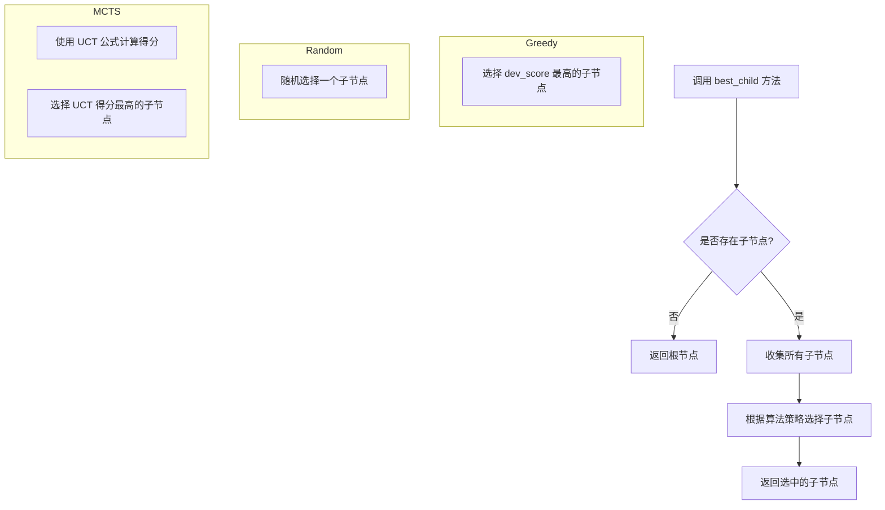
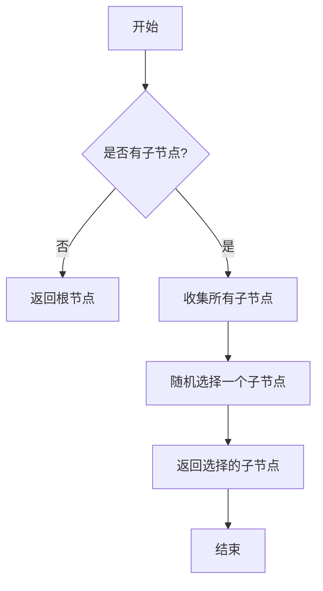

# `.\MetaGPT\metagpt\ext\sela\search\search_algorithm.py` 详细设计文档

该代码文件实现了三种基于树搜索的算法（贪婪搜索、随机搜索和蒙特卡洛树搜索），用于在给定的搜索树中选择最优的子节点。这些算法继承自一个通用的树搜索基类，通过不同的策略（如最大化奖励、随机选择或平衡探索与利用）来决定下一步的搜索方向。

## 整体流程



## 类结构

```
BaseTreeSearch (基类，来自 metagpt.ext.sela.search.tree_search)
├── Greedy (贪婪搜索算法)
├── Random (随机搜索算法)
└── MCTS (蒙特卡洛树搜索算法)
```

## 全局变量及字段


    

## 全局函数及方法


### `Greedy.best_child`

该方法实现了贪心策略，用于从当前节点的所有子节点中，选择评估分数（dev_score）最高的一个子节点作为最佳子节点。如果当前节点没有子节点，则返回根节点。

参数：
- `self`：`Greedy`，`Greedy` 类的实例，代表当前搜索树的状态。

返回值：`Node`，返回被选中的最佳子节点或根节点。

#### 流程图

```mermaid
flowchart TD
    A[开始] --> B{当前节点是否有子节点?<br>len(self.children) == 0}
    B -- 是 --> C[返回根节点 self.root_node]
    B -- 否 --> D[获取所有子节点列表 all_children]
    D --> E[遍历 all_children<br>计算每个子节点的 dev_score]
    E --> F[选择 dev_score 最高的子节点]
    F --> G[返回该子节点]
```

#### 带注释源码

```python
def best_child(self):
    # 检查当前节点是否有子节点
    if len(self.children) == 0:
        # 如果没有子节点，则返回根节点
        return self.root_node
    # 将 self.children 字典中的所有子节点列表展平，合并成一个列表
    # self.children 的结构可能为 {action1: [node1, node2], action2: [node3, ...]}
    all_children = [child for children in self.children.values() for child in children]
    # 使用 max 函数和 key 参数，从所有子节点中找出 normalized_reward 字典中
    # "dev_score" 键对应的值最大的那个节点。
    # 如果某个子节点的 normalized_reward 中没有 "dev_score" 键，则使用默认值 0。
    return max(all_children, key=lambda x: x.normalized_reward.get("dev_score", 0))
```


### `Random.best_child`

该方法用于在随机搜索策略下，从当前节点的所有子节点中随机选择一个作为最佳子节点返回。如果当前节点没有子节点，则返回根节点。

参数：

- `self`：`Random`，`Random` 类的实例，表示当前搜索树对象。

返回值：`Node`，返回随机选择的一个子节点，如果没有子节点则返回根节点。

#### 流程图



#### 带注释源码

```python
def best_child(self):
    # 检查当前节点是否有子节点
    if len(self.children) == 0:
        # 如果没有子节点，返回根节点
        return self.root_node
    # 将所有子节点（可能按不同键值分组存储）扁平化为一个列表
    all_children = [child for children in self.children.values() for child in children]
    # 使用 numpy 的 random.choice 方法随机选择一个子节点并返回
    return np.random.choice(all_children)
```


### `MCTS.best_child`

该方法实现了蒙特卡洛树搜索（MCTS）算法中的最佳子节点选择步骤。它使用UCT（Upper Confidence Bound applied to Trees）公式来平衡探索（exploration）和利用（exploitation），从当前节点的所有子节点中选择一个分数最高的节点作为最佳子节点。如果当前节点没有子节点，则返回根节点。

参数：
-  `self`：`MCTS`，MCTS搜索器实例本身。

返回值：`Node`，根据UCT公式计算出的最佳子节点，或者在没有子节点时返回根节点。

#### 流程图

```mermaid
flowchart TD
    A[开始] --> B{当前节点有子节点吗？<br>len(self.children) == 0}
    B -- 否 --> C[返回根节点 self.root_node]
    B -- 是 --> D[获取所有子节点<br>all_children = [...]]
    D --> E[定义UCT评分函数<br>def uct(node): ...]
    E --> F[使用max函数和UCT评分<br>选择最佳子节点]
    F --> G[返回最佳子节点]
    C --> H[结束]
    G --> H
```

#### 带注释源码

```
    def best_child(self):
        # 定义UCT（Upper Confidence Bound for Trees）评分函数
        # 该函数用于计算一个节点的UCT分数，平衡了节点的平均价值（利用）和其被探索的程度（探索）
        def uct(node: Node):
            # n_visits: 节点的访问次数。如果节点未被访问过，则使用一个预设的常量 self.c_unvisited 作为其虚拟访问次数。
            n_visits = node.visited if node.visited else self.c_unvisited
            # avg_value: 节点的平均价值。如果节点被访问过，使用其 avg_value() 方法计算。
            #            如果未被访问过，则使用其初始价值 node.value 除以 self.c_unvisited 作为估计值。
            avg_value = node.avg_value() if node.visited else node.value / self.c_unvisited
            # UCT公式：平均价值 + 探索系数 * sqrt( ln(父节点访问次数) / 本节点访问次数 )
            # self.c_explore 是控制探索权重的超参数。
            return avg_value + self.c_explore * np.sqrt(np.log(node.parent.visited) / n_visits)

        # 如果当前节点（self）没有任何子节点，则无法选择，直接返回根节点。
        if len(self.children) == 0:
            return self.root_node

        # 将 self.children 字典（可能按动作键组织）中的所有子节点扁平化为一个列表。
        # self.children.values() 返回一个包含多个子节点列表的视图。
        # 内层循环遍历每个子节点列表，外层循环将它们合并到 all_children 列表中。
        all_children = [child for children in self.children.values() for child in children]

        # 使用 max 函数和上面定义的 uct 函数作为 key，从所有子节点中选出UCT分数最高的一个。
        return max(all_children, key=uct)
```


## 关键组件


### BaseTreeSearch

作为所有具体树搜索策略（Greedy, Random, MCTS）的基类，定义了树搜索的基本框架和接口。

### Greedy

一种贪心搜索策略，总是选择当前所有子节点中开发分数（dev_score）最高的节点作为最佳子节点。

### Random

一种随机搜索策略，从当前所有子节点中随机选择一个节点作为最佳子节点。

### MCTS

一种蒙特卡洛树搜索策略，使用UCT（Upper Confidence Bound applied to Trees）公式平衡探索与利用，以选择最佳子节点。

### Node

表示搜索树中的一个节点，包含节点的状态、访问次数、价值等属性，是树搜索算法操作的基本单元。


## 问题及建议


### 已知问题

-   **`best_child` 方法在 `children` 为空时返回 `root_node`**：在 `Greedy`、`Random` 和 `MCTS` 类中，当 `self.children` 为空时，`best_child` 方法直接返回 `self.root_node`。这可能导致逻辑上的不一致，因为 `best_child` 的语义是“从子节点中选择最佳”，而返回根节点可能并非调用者所期望的行为，尤其是在根节点可能不是有效候选动作的情况下。这更像是一种处理边界情况的默认行为，但缺乏明确的文档说明其意图和适用场景。
-   **`MCTS` 类中 `uct` 函数对未访问节点的处理存在潜在除零风险**：在 `uct` 函数中，计算 `n_visits` 时使用了 `self.c_unvisited` 作为未访问节点的默认访问次数。如果 `self.c_unvisited` 被设置为0（虽然代码中未显示其默认值，但这是一个可能的配置），那么在计算 `np.sqrt(np.log(node.parent.visited) / n_visits)` 时会导致除零错误。此外，使用 `node.value / self.c_unvisited` 计算未访问节点的平均价值也可能在 `self.c_unvisited` 为0时引发除零错误。
-   **`MCTS` 类中 `uct` 函数访问 `node.parent.visited` 可能引发 `AttributeError`**：`uct` 函数在计算时直接访问 `node.parent.visited`。如果 `node` 是根节点（即 `node.parent` 为 `None`），那么访问 `node.parent.visited` 将导致 `AttributeError`。虽然当前 `best_child` 方法在 `children` 为空时返回根节点，避免了此问题，但若未来逻辑变更或 `uct` 函数被用于其他上下文，此隐患可能暴露。
-   **`Random` 类使用 `np.random.choice` 可能引发 `ValueError`**：当 `all_children` 列表为空时（虽然当前逻辑在 `children` 为空时提前返回，但理论上 `children` 不为空时 `all_children` 也可能为空，取决于 `self.children` 的结构），`np.random.choice(all_children)` 会抛出 `ValueError: a must be non-empty`。当前代码通过前置条件 `if len(self.children) == 0` 避免了 `all_children` 为空的情况，但这一依赖关系不够健壮，且未明确说明。
-   **`Greedy` 类中 `normalized_reward.get("dev_score", 0)` 的键名硬编码**：`Greedy` 类的选择逻辑依赖于 `normalized_reward` 字典中的 `"dev_score"` 键。这降低了代码的灵活性和可配置性。如果奖励结构发生变化或需要使用其他指标进行贪婪选择，则需要修改此硬编码的键名。

### 优化建议

-   **重构 `best_child` 方法的边界情况处理逻辑**：建议明确 `best_child` 方法在无有效子节点时的行为。可以考虑抛出明确的异常（如 `ValueError` 或自定义异常），或返回一个特殊的哨兵值（如 `None`），并在调用方进行显式处理。同时，应更新文档以说明此行为。对于返回 `root_node` 的当前行为，应添加注释说明其设计意图和潜在风险。
-   **增强 `MCTS` 类 `uct` 函数的鲁棒性**：
    1.  为 `self.c_unvisited` 设置一个非零的最小正值（例如 `1e-6`）作为默认值，并在初始化时进行验证，以避免除零错误。
    2.  在 `uct` 函数内部添加对 `node.parent` 是否为 `None` 的检查。如果 `node` 是根节点，可以考虑返回一个默认值（如负无穷）或抛出异常，具体取决于算法逻辑。
    3.  考虑将 `uct` 计算中未访问节点的价值估计逻辑封装为一个独立的方法，以提高可测试性和可维护性。
-   **增强 `Random` 类的健壮性**：在调用 `np.random.choice` 之前，显式检查 `all_children` 列表是否为空。如果为空，应按照与 `Greedy` 和 `MCTS` 类一致的策略进行处理（例如，抛出异常或返回 `None`），而不是依赖前置条件。
-   **提高 `Greedy` 类选择策略的灵活性**：将用于选择最佳子节点的键名（如 `"dev_score"`）作为类初始化参数或方法参数传入。这样可以在不修改类代码的情况下适应不同的奖励结构或选择标准。例如，可以在 `__init__` 方法中添加 `selection_key="dev_score"` 参数，并在 `best_child` 方法中使用它。
-   **提取公共逻辑以减少代码重复**：`Greedy`、`Random` 和 `MCTS` 三个类的 `best_child` 方法中，都有将 `self.children` 字典展平成 `all_children` 列表的逻辑。可以考虑在基类 `BaseTreeSearch` 中提供一个受保护的方法（如 `_flatten_children`）来封装此逻辑，从而减少子类中的代码重复。
-   **添加类型注解和文档字符串**：为类和方法添加更详细的类型注解（例如，`best_child` 方法的返回类型应为 `Optional[Node]`）和文档字符串，说明其功能、参数、返回值以及边界情况的行为。这将提高代码的可读性和可维护性。
-   **考虑性能优化**：如果 `self.children` 的结构非常庞大或 `best_child` 被频繁调用，展平操作 `[child for children in self.children.values() for child in children]` 可能会成为性能瓶颈。可以考虑缓存展平后的列表，或在数据结构设计上优化，以支持更高效的最佳子节点查询。但需权衡优化带来的复杂性与实际性能收益。


## 其它


### 设计目标与约束

本模块的设计目标是提供多种树搜索策略的实现，作为元编程框架中代码生成或任务规划等场景的探索算法。核心约束包括：
1.  **策略可插拔性**：所有策略类（`Greedy`, `Random`, `MCTS`）必须继承自统一的基类 `BaseTreeSearch`，并实现相同的接口方法 `best_child`，以确保它们可以在上层调用者中无缝替换。
2.  **算法简洁性**：作为示例或基础实现，代码优先追求清晰易懂，而非极致的性能优化。
3.  **数据依赖**：算法的执行依赖于 `Node` 节点对象中预计算好的属性（如 `normalized_reward`, `visited`, `value`, `parent` 等），模块本身不负责这些属性的维护和更新。

### 错误处理与异常设计

当前代码中错误处理较为简单，主要依赖前置条件：
1.  **空子节点处理**：当 `self.children` 为空时，所有策略均返回 `self.root_node`。这是一种合理的默认行为，避免了在无有效子节点时进行选择操作可能引发的 `KeyError` 或 `IndexError`。
2.  **潜在风险**：
    *   `Greedy` 策略中，如果所有子节点的 `normalized_reward` 字典中均不存在 `"dev_score"` 键，`lambda x: x.normalized_reward.get("dev_score", 0)` 将始终返回 0，`max` 函数可能返回第一个元素，其选择行为是未定义的。建议增加日志或断言。
    *   `MCTS` 策略中，计算 `uct` 时直接访问 `node.parent.visited`，如果 `node` 是根节点或其 `parent` 为 `None`，将引发 `AttributeError`。虽然当前逻辑中 `all_children` 应均为非根节点，但缺乏显式保护。
3.  **异常类型**：代码可能抛出的异常包括 `KeyError`（字典访问）、`AttributeError`（对象属性访问）、`ValueError`（`np.random.choice` 传入空列表）等，但均未显式捕获或转换。

### 数据流与状态机

1.  **数据流**：
    *   **输入**：`best_child` 方法的执行依赖于 `self.children`（存储当前节点的子节点映射）和 `self.root_node`。
    *   **处理**：每个策略从 `self.children` 中提取出所有子节点列表 `all_children`，然后依据特定规则（贪婪分数、随机、UCT公式）从中选择一个节点。
    *   **输出**：返回选中的 `Node` 对象。
2.  **状态机**：本模块自身不维护复杂的状态机。其行为是确定性的（`Greedy`, `MCTS`）或随机的（`Random`），每次调用 `best_child` 都是一个独立的决策过程，不依赖于历史调用（除了 `MCTS` 中使用的、由外部维护的节点访问次数 `visited` 和值 `value`）。

### 外部依赖与接口契约

1.  **外部依赖**：
    *   `numpy` (`np`)：用于数学运算（`np.sqrt`, `np.log`）和随机选择（`np.random.choice`）。
    *   `metagpt.ext.sela.search.tree_search`：从中导入基类 `BaseTreeSearch` 和数据结构 `Node`。这是最核心的依赖，定义了模块的接口和操作对象。
2.  **接口契约**：
    *   **对上游（调用者）的契约**：所有策略类提供 `best_child()` 方法，返回一个 `Node` 实例。调用者需确保在调用前，`self.children` 和 `self.root_node` 已被正确初始化。
    *   **对下游（`Node`）的契约**：策略实现假设 `Node` 实例拥有以下属性，且其含义和类型符合预期：
        *   `Greedy`: `normalized_reward` (dict), `normalized_reward.get("dev_score", 0)` 应返回数值。
        *   `Random`: 无特殊要求。
        *   `MCTS`: `visited` (int), `value` (数值类型), `parent` (Node), `parent.visited` (int), 以及 `avg_value()` 方法。
    *   **对配置的契约**：`MCTS` 策略依赖于 `self.c_explore` 和 `self.c_unvisited` 这两个超参数，它们应在类实例化时由基类或外部设置。

### 性能考量

1.  **时间复杂度**：`best_child` 方法的主要开销在于构建 `all_children` 列表（O(N)）和寻找最大值（O(N)），其中 N 为子节点总数。对于 `MCTS`，每个子节点还需计算一次 `uct` 值（包含对数和平开方运算）。在子节点数量极大时，这可能成为瓶颈。
2.  **空间复杂度**：需要构建 `all_children` 列表，占用 O(N) 的额外空间。对于极大分支因子的树，可考虑使用生成器或迭代器避免一次性构建完整列表。
3.  **随机数生成**：`Random` 策略使用 `np.random.choice`，其性能通常足够。但在极高频调用或需要可重复性的场景下，可能需要管理随机数生成器的状态。
4.  **数值稳定性**：`MCTS` 的 `uct` 公式中，当 `n_visits` 或 `node.parent.visited` 很小时，`np.log` 和除法运算可能导致数值问题（如 log(0)）。当前代码通过 `self.c_unvisited` 给予未访问节点一个初始访问次数，缓解了除零问题，但未处理 `node.parent.visited` 为 0 或 1 时 `np.log` 的计算。

### 测试策略建议

1.  **单元测试**：
    *   **边界条件**：测试 `self.children` 为空时，是否都返回 `root_node`。
    *   `Greedy`：测试 `normalized_reward` 中 `"dev_score"` 存在、不存在、值相等的情况。
    *   `Random`：通过设置随机种子测试其随机性，或进行多次调用统计分布。
    *   `MCTS`：测试UCT公式计算是否正确，特别是 `visited` 为0或1，以及 `c_unvisited` 影响下的行为。
2.  **集成测试**：将策略类与完整的树搜索流程结合，验证其选择节点后对整体搜索过程（如模拟、回溯）的影响。
3.  **Mock依赖**：使用Mock对象模拟 `Node` 的属性，以隔离测试策略逻辑本身。

    