# `.\MetaGPT\metagpt\ext\sela\search\tree_search.py` 详细设计文档

该代码实现了一个基于蒙特卡洛树搜索（MCTS）的决策树搜索框架，用于自动化机器学习（AutoML）任务。其核心功能是：给定一个机器学习任务（如数据集和评估指标），通过模拟实验者（Experimenter）角色执行代码、生成新指令（Insights）、评估模型性能，并利用树搜索算法探索不同的指令序列（即解决方案路径），以找到在开发集和测试集上性能最优的模型构建策略。

## 整体流程

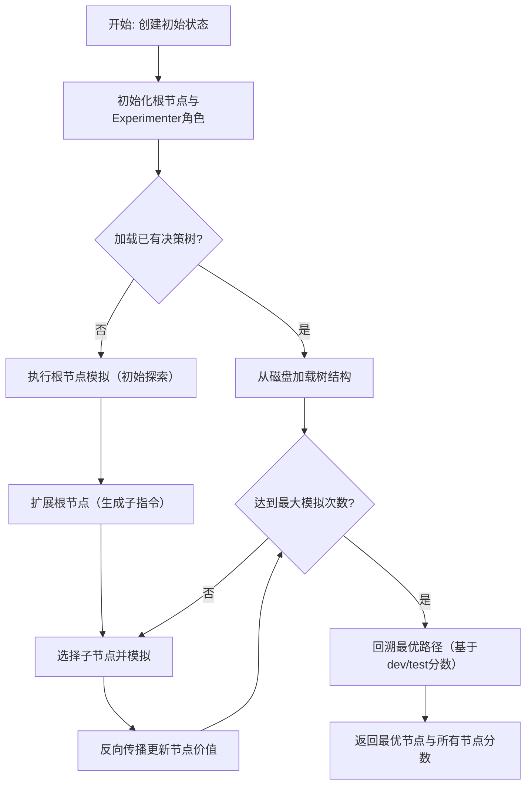

## 类结构

```
BaseTreeSearch (树搜索基类)
├── Node (决策树节点)
└── 全局函数
    ├── initialize_di_root_node
    └── create_initial_state
```

## 全局变量及字段


### `Node.state`
    
存储节点状态信息的字典，包含任务、工作目录、数据集配置、评估指标等关键参数。

类型：`dict`
    


### `Node.action`
    
表示导致当前节点产生的操作或指令，通常由InstructionGenerator生成。

类型：`str`
    


### `Node.value`
    
节点的累计奖励值，用于MCTS算法中的节点评估和选择。

类型：`float`
    


### `Node.raw_value`
    
节点未经归一化的原始测试分数，用于直接性能评估。

类型：`float`
    


### `Node.raw_reward`
    
存储节点原始奖励分数的字典，包含开发集和测试集的分数。

类型：`dict`
    


### `Node.parent`
    
指向父节点的引用，用于构建树结构和回溯传播奖励。

类型：`Node`
    


### `Node.children`
    
存储子节点对象的列表，表示当前节点在决策树中的后继节点。

类型：`list`
    


### `Node.max_depth`
    
节点允许的最大深度，用于控制决策树的搜索范围。

类型：`int`
    


### `Node.depth`
    
节点在决策树中的当前深度，根节点深度为0。

类型：`int`
    


### `Node.id`
    
节点的唯一标识符，通常基于父节点ID和兄弟节点数量生成。

类型：`str`
    


### `Node.visited`
    
节点被访问的次数，用于计算平均奖励和探索策略。

类型：`int`
    


### `Node.normalized_reward`
    
存储归一化后奖励分数的字典，确保不同指标间可比性。

类型：`dict`
    


### `BaseTreeSearch.root_node`
    
决策树的根节点，作为搜索算法的起始点。

类型：`Node`
    


### `BaseTreeSearch.children`
    
映射节点到其子节点列表的字典，用于快速访问树结构。

类型：`dict`
    


### `BaseTreeSearch.max_depth`
    
树搜索算法允许的最大深度，控制搜索空间大小。

类型：`int`
    


### `BaseTreeSearch.c_explore`
    
探索系数，用于平衡MCTS算法中的探索与利用。

类型：`float`
    


### `BaseTreeSearch.c_unvisited`
    
未访问节点奖励系数，鼓励算法探索未访问的节点。

类型：`float`
    


### `BaseTreeSearch.node_order`
    
记录节点访问顺序的列表，用于后续分析和结果展示。

类型：`list`
    


### `BaseTreeSearch.instruction_generator`
    
指令生成器实例，负责为节点扩展生成新的操作指令。

类型：`InstructionGenerator`
    


### `BaseTreeSearch.use_fixed_insights`
    
标志位，指示是否使用预定义的固定指令集进行节点扩展。

类型：`bool`
    
    

## 全局函数及方法

### `initialize_di_root_node`

初始化决策树的根节点。该函数根据传入的初始状态字典创建一个 `Experimenter` 角色实例和一个 `Node` 节点实例。`Experimenter` 角色负责执行具体的实验任务，而 `Node` 节点则代表决策树中的一个状态节点，用于记录状态、动作、价值等信息，并作为树搜索的起点。

参数：

- `state`：`dict`，决策树的初始状态字典，包含任务、工作目录、节点目录、数据集配置、实验池路径、任务需求、是否已运行、起始任务ID、评分标准（分数越低是否越好）、角色超时时间、是否使用外部评估、自定义数据集目录等信息。
- `reflection`：`bool`，可选，默认为 `True`。指示是否在 `Experimenter` 角色中使用反思机制。

返回值：`tuple`，返回一个包含两个元素的元组。第一个元素是 `Experimenter` 角色实例，第二个元素是 `Node` 根节点实例。

#### 流程图

```mermaid
flowchart TD
    A[开始] --> B[从state字典中提取参数]
    B --> C[创建Experimenter角色实例]
    C --> D[创建Node根节点实例]
    D --> E[返回(role, node)元组]
    E --> F[结束]
```

#### 带注释源码

```python
def initialize_di_root_node(state: dict, reflection: bool = True):
    """
    Initialize the root node of the decision tree.

    Args:
        state (dict): The initial state of the tree, containing:
            - task (str): The task to be performed (e.g., "titanic").
            - work_dir (str): The working directory.
            - node_dir (str): The directory for the node.
            - dataset_config (dict): The configuration of the dataset.
            - datasets_dir (str): The directory of the datasets.
            - exp_pool_path (str): The path to the experiment pool.
            - requirement (str): The requirement for the task.
            - has_run (bool): Whether the task has run.
            - start_task_id (int): The ID of the starting task.
            - low_is_better (bool): Whether a lower score is better.
            - role_timeout (int): The timeout for the role.
            - external_eval (bool): Whether to use external evaluation.
            - custom_dataset_dir (str): The directory of the custom dataset.
        reflection (bool, optional): Whether to use reflection. Defaults to True.

    Returns:
        tuple: A tuple containing the Experimenter role and the root Node.
    """
    # 1. 使用从state字典中提取的参数创建Experimenter角色实例。
    #    角色ID固定为"0"，表示根节点。
    role = Experimenter(
        node_id="0",
        start_task_id=state["start_task_id"],
        use_reflection=reflection,
        role_dir=state["node_dir"],
        role_timeout=state["role_timeout"],
    )
    # 2. 创建Node根节点实例。
    #    parent=None 表示这是根节点，没有父节点。
    #    state=state 将初始状态字典传递给节点。
    #    action=None 根节点没有导致其产生的动作。
    #    value=0 初始价值设为0。
    return role, Node(parent=None, state=state, action=None, value=0)
```


### `create_initial_state`

该函数是决策树搜索算法的初始化入口，负责根据给定的任务名称、起始任务ID、数据配置和命令行参数，构建并返回一个包含所有必要运行信息的初始状态字典。它处理两种数据源：自定义数据集和预配置的基准数据集，并根据不同的数据源设置相应的评估路径、需求描述和实验池路径。

参数：

-  `task`：`str`，要执行的任务名称（例如 `"titanic"`）。
-  `start_task_id`：`int`，决策树搜索的起始任务ID，用于控制搜索深度。
-  `data_config`：`dict`，数据配置字典，包含 `datasets`（数据集配置）、`work_dir`（工作目录）和 `role_dir`（角色目录）等关键信息。
-  `args`：`argparse.Namespace`，命令行参数对象，包含 `external_eval`（是否使用外部评估）、`custom_dataset_dir`（自定义数据集目录）、`special_instruction`（特殊指令）、`name`（实验名称后缀）、`low_is_better`（分数越低是否越好）、`role_timeout`（角色执行超时时间）等属性。

返回值：`dict`，一个包含任务执行所有初始配置的状态字典。该字典定义了后续决策树节点运行的环境、数据路径、评估方式等核心参数。

#### 流程图

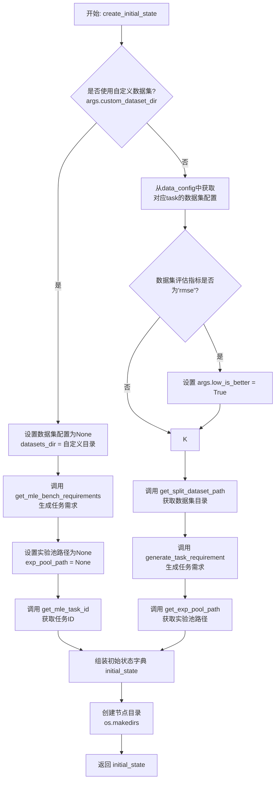

#### 带注释源码

```python
def create_initial_state(task: str, start_task_id: int, data_config: dict, args):
    """
    Create the initial state of the tree.

    Args:
        task (str): The task to be performed.
        start_task_id (int): The ID of the starting task.
        data_config (dict): The configuration of the data.
            Expected keys: 'datasets', 'work_dir', 'role_dir'.
        args (Namespace): The arguments passed to the program.
            Expected attributes: 'external_eval', 'custom_dataset_dir', 'special_instruction', 'name', 'low_is_better', 'role_timeout'.

    Returns:
        dict: The initial state of the tree.
    """
    # 确定是否使用外部评估方式
    external_eval = args.external_eval

    # 处理自定义数据集的情况
    if args.custom_dataset_dir:
        # 自定义数据集没有预定义的配置
        dataset_config = None
        # 数据集目录直接使用传入的自定义目录
        datasets_dir = args.custom_dataset_dir
        # 根据自定义目录和数据配置生成任务需求，可包含特殊指令
        requirement = get_mle_bench_requirements(
            args.custom_dataset_dir, data_config, special_instruction=args.special_instruction
        )
        # 自定义数据集不使用预定义的实验池
        exp_pool_path = None
        # 从自定义数据集目录名中提取任务ID
        task = get_mle_task_id(args.custom_dataset_dir)
    # 处理预配置基准数据集的情况
    else:
        # 从数据配置中获取指定任务的数据集详细配置
        dataset_config = data_config["datasets"][task]
        # 如果评估指标是均方根误差(RMSE)，则分数越低越好
        if dataset_config["metric"] == "rmse":
            args.low_is_better = True
        # 获取该任务分割后（如训练集、验证集、测试集）的数据集路径
        datasets_dir = get_split_dataset_path(task, data_config)
        # 生成针对该任务的需求描述，标记为决策树使用，可包含特殊指令
        requirement = generate_task_requirement(
            task, data_config, is_di=True, special_instruction=args.special_instruction
        )
        # 获取用于数据集分析的实验池路径
        exp_pool_path = get_exp_pool_path(task, data_config, pool_name="ds_analysis_pool")

    # 组装初始状态字典，包含所有必要的运行时信息
    initial_state = {
        "task": task,  # 任务标识
        "work_dir": data_config["work_dir"],  # 根工作目录
        "node_dir": os.path.join(data_config["work_dir"], data_config["role_dir"], f"{task}{args.name}"),  # 当前节点/实验的专属目录
        "dataset_config": dataset_config,  # 数据集配置（自定义数据集时为None）
        "datasets_dir": datasets_dir,  # 数据集文件所在目录（如果使用外部评估则可能不被使用）
        "exp_pool_path": exp_pool_path,  # 可复用的实验组件池路径
        "requirement": requirement,  # 任务需求描述
        "has_run": False,  # 标记该节点是否已运行
        "start_task_id": start_task_id,  # 起始任务ID，用于控制搜索深度
        "low_is_better": args.low_is_better,  # 评估分数是否越低越好
        "role_timeout": args.role_timeout,  # 角色执行超时时间
        "external_eval": external_eval,  # 是否使用外部评估流程
        "custom_dataset_dir": args.custom_dataset_dir,  # 自定义数据集目录（如果使用）
    }
    # 确保该节点的专属目录存在
    os.makedirs(initial_state["node_dir"], exist_ok=True)
    # 返回构建好的初始状态
    return initial_state
```


### `Node.__init__`

初始化决策树中的一个节点，设置节点的基本属性，包括父节点、状态、动作、价值等，并计算节点的深度和唯一标识符。

参数：

- `parent`：`Node`，父节点，根节点为None
- `state`：`dict`，节点的状态字典，包含任务、工作目录、数据集配置等信息
- `action`：`str`，导致当前节点的动作或指令
- `value`：`float`，节点的累计价值，用于MCTS算法
- `max_depth`：`int`，树的最大深度，默认为4
- `**kwargs`：`dict`，其他关键字参数，当前未使用

返回值：`None`，构造函数不返回值

#### 流程图

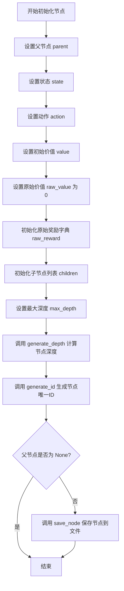

#### 带注释源码

```python
def __init__(
    self, parent=None, state: dict = None, action: str = None, value: float = 0, max_depth: int = 4, **kwargs
):
    # 设置节点的父节点
    self.parent = parent
    # 设置节点的状态字典，包含任务配置、路径等信息
    self.state = state
    # 设置导致到达此节点的动作或指令
    self.action = action
    # 设置节点的累计价值（用于MCTS的回传）
    self.value = value
    # 初始化节点的原始价值（未归一化的奖励）
    self.raw_value = 0
    # 初始化原始奖励字典，用于存储不同数据集的原始评分
    self.raw_reward = dict()
    # 初始化子节点列表
    self.children = []
    # 设置树的最大搜索深度
    self.max_depth = max_depth
    # 计算当前节点在树中的深度（根节点深度为0）
    self.depth = self.generate_depth()
    # 生成节点的唯一标识符（例如 "0-1-2"）
    self.id = self.generate_id()
    # 如果节点不是根节点，则将其序列化保存到磁盘
    if self.parent is not None:
        self.save_node()
```

### `Node.__hash__`

该方法用于生成Node对象的哈希值，基于节点的唯一标识符`id`。

参数：

- `self`：`Node`，当前Node实例

返回值：`int`，基于节点`id`计算出的哈希值

#### 流程图

```mermaid
flowchart TD
    A[开始] --> B[获取节点ID<br>self.id]
    B --> C[计算ID的哈希值<br>hash(self.id)]
    C --> D[返回哈希值]
    D --> E[结束]
```

#### 带注释源码

```python
def __hash__(self):
    # 使用节点的唯一标识符`id`来计算哈希值
    # 这使得Node对象可以在集合（set）中作为键使用，或用于字典（dict）的键
    return hash(self.id)
```

### `Node.avg_value`

计算节点的平均价值，即节点的总价值除以其访问次数。如果节点未被访问过，则返回0。

参数：无

返回值：`float`，节点的平均价值

#### 流程图

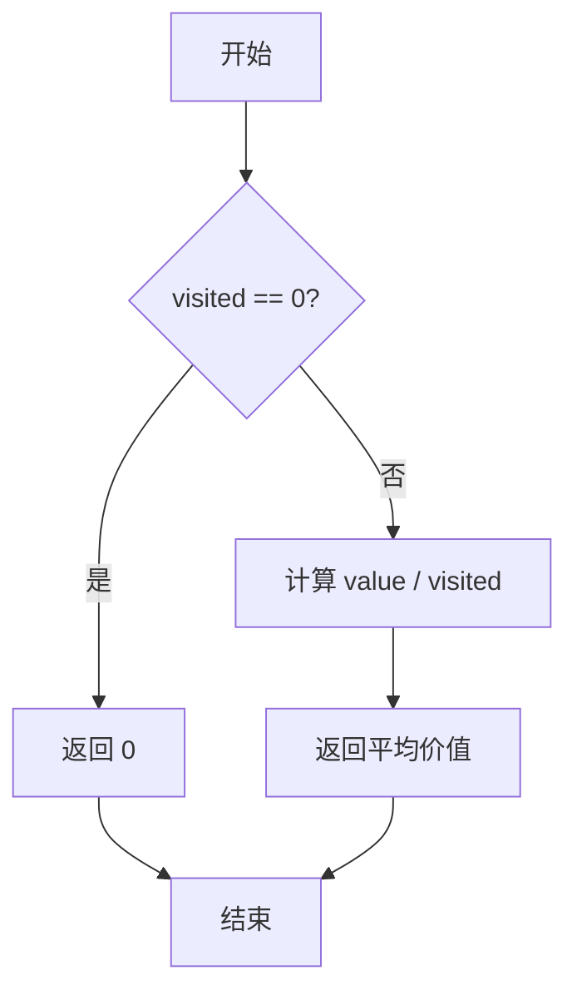

#### 带注释源码

```python
def avg_value(self):
    # 如果节点未被访问过，则平均价值为0
    if self.visited == 0:
        return 0
    # 计算平均价值：总价值除以访问次数
    return self.value / self.visited
```

### `Node.save_node`

该方法用于将当前 `Node` 对象序列化并保存到磁盘上的一个 `.pkl` 文件中。文件路径由节点的状态字典中的 `node_dir` 字段和节点自身的 `id` 决定。这是实现决策树持久化（保存和加载搜索状态）的关键方法。

参数：
- `self`：`Node`，当前 `Node` 实例。

返回值：`None`，此方法不返回任何值。

#### 流程图

```mermaid
flowchart TD
    A[开始] --> B[获取节点目录路径<br>self.state['node_dir']]
    B --> C{目录是否存在?}
    C -- 否 --> D[创建目录<br>os.makedirs]
    C -- 是 --> E
    D --> E[构造文件路径<br>Node-{self.id}.pkl]
    E --> F[打开文件准备写入<br>以二进制写模式]
    F --> G[序列化并保存节点对象<br>pickle.dump(self, f)]
    G --> H[结束]
```

#### 带注释源码

```python
def save_node(self):
    # 确保节点对应的目录存在，如果不存在则创建
    os.makedirs(self.state["node_dir"], exist_ok=True)
    # 构造完整的文件路径，文件名格式为 "Node-{节点ID}.pkl"
    with open(os.path.join(self.state["node_dir"], f"Node-{self.id}.pkl"), "wb") as f:
        # 使用 pickle 模块将当前节点对象（self）序列化并写入文件
        pickle.dump(self, f)
```

### `Node.load_node`

该方法用于从磁盘加载当前节点的序列化对象。它通过读取与节点ID对应的pickle文件，反序列化并返回一个`Node`实例。这是MCTS（蒙特卡洛树搜索）算法中用于恢复树节点状态的关键方法，支持断点续跑和状态持久化。

参数：

-  `self`：`Node`，当前节点实例

返回值：`Node`，反序列化后的节点对象

#### 流程图

```mermaid
flowchart TD
    A[开始] --> B[构造文件路径<br>state['node_dir']/Node-{self.id}.pkl]
    B --> C{文件存在?}
    C -- 是 --> D[打开文件并读取二进制数据]
    D --> E[使用pickle.load反序列化]
    E --> F[返回Node对象]
    C -- 否 --> G[抛出FileNotFoundError异常]
    F --> H[结束]
    G --> H
```

#### 带注释源码

```python
def load_node(self):
    # 构造当前节点序列化文件的完整路径
    # 路径格式：{工作目录}/{节点目录}/Node-{节点ID}.pkl
    with open(os.path.join(self.state["node_dir"], f"Node-{self.id}.pkl"), "rb") as f:
        # 使用pickle模块的load函数反序列化文件内容
        # 返回重构的Node对象
        return pickle.load(f)
```

### `Node.get_depth`

该方法用于获取当前节点在决策树中的深度。深度从根节点（深度为0）开始计算，每向下一层深度加1。

参数：无

返回值：`int`，当前节点的深度值

#### 流程图

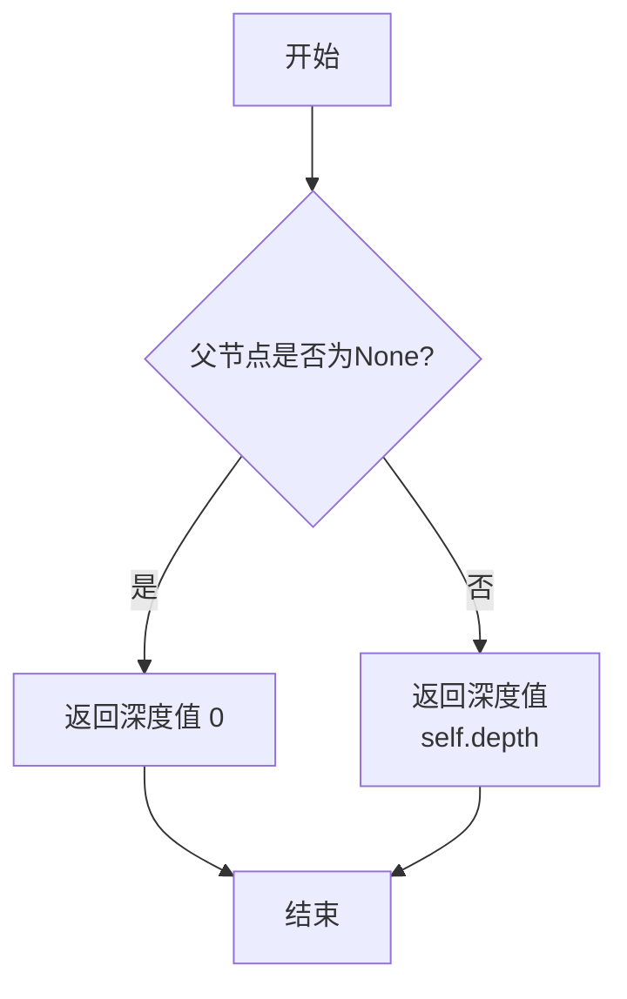

#### 带注释源码

```python
def get_depth(self):
    # 返回当前节点的深度属性
    return self.depth
```

### `Node.get_node_dir`

该方法用于获取当前节点对应的目录路径，该路径存储在节点的状态字典中，通常用于存储节点相关的文件（如序列化的节点对象、角色状态、预测结果等）。

参数：
- `self`：`Node`，当前节点实例。

返回值：`str`，节点目录的路径字符串。

#### 流程图

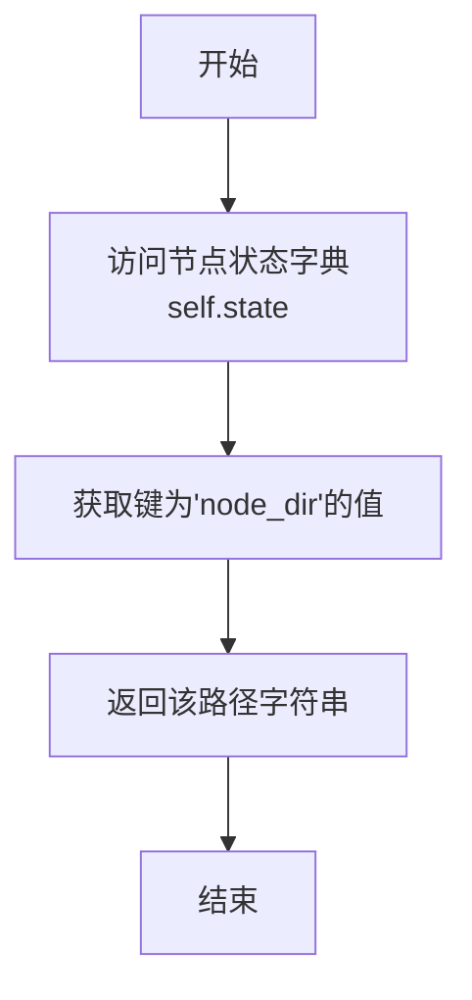

#### 带注释源码

```python
def get_node_dir(self):
    # 从节点的状态字典 `self.state` 中获取键为 `'node_dir'` 的值。
    # 这个值是在节点初始化时设置的，代表了该节点在文件系统中的工作目录。
    return self.state["node_dir"]
```

### `Node.generate_depth`

该方法用于计算当前节点在决策树中的深度。如果节点是根节点（即没有父节点），则深度为0；否则，深度为其父节点的深度加1。

参数：
- 无

返回值：`int`，当前节点在树中的深度。

#### 流程图

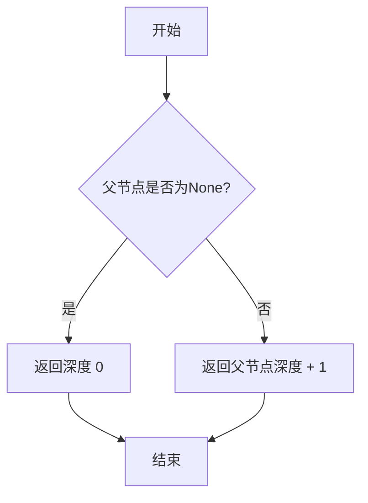

#### 带注释源码

```python
def generate_depth(self):
    # 如果当前节点没有父节点（即根节点），则深度为0
    if self.parent is None:
        return 0
    else:
        # 否则，深度为父节点的深度加1
        return self.parent.depth + 1
```

### `Node.generate_id`

该方法用于生成当前节点的唯一标识符（ID）。如果节点是根节点（即没有父节点），则返回 "0"；否则，返回父节点ID与当前节点在父节点子节点列表中的索引拼接而成的字符串，格式为 `{父节点ID}-{索引}`。

参数：

-  `self`：`Node`，当前节点实例

返回值：`str`，生成的节点ID字符串

#### 流程图

```mermaid
flowchart TD
    A[开始] --> B{父节点是否为None?}
    B -- 是 --> C[返回 '0']
    B -- 否 --> D[获取父节点ID和当前节点在父节点子节点列表中的索引]
    D --> E[拼接ID: f'{父节点ID}-{索引}']
    E --> F[返回拼接后的ID]
    F --> G[结束]
```

#### 带注释源码

```python
def generate_id(self):
    # 如果当前节点没有父节点，说明它是根节点
    if self.parent is None:
        # 根节点的ID固定为 "0"
        return "0"
    else:
        # 获取当前节点在父节点子节点列表中的位置（索引）
        num_sibling = len(self.parent.children)
        # 生成ID，格式为：父节点ID-当前节点在兄弟节点中的序号
        return f"{self.parent.id}-{num_sibling}"
```

### `Node.is_terminal`

该方法用于判断当前节点是否为决策树搜索过程中的终端节点。其核心逻辑是检查节点状态中记录的起始任务ID是否达到了预设的最大深度加一。如果达到，则表明该节点已处于搜索路径的末端，无法再进一步扩展。

参数：
-  `self`：`Node`，当前节点实例

返回值：`int`，返回一个整数（在Python中用作布尔值），如果当前节点是终端节点则返回`True`（非零值），否则返回`False`（0）。

#### 流程图

```mermaid
flowchart TD
    A[开始] --> B{检查条件<br>self.state['start_task_id'] == self.max_depth + 1}
    B -- 是 --> C[返回 True]
    B -- 否 --> D[返回 False]
    C --> E[结束]
    D --> E
```

#### 带注释源码

```python
def is_terminal(self):
    # 判断节点是否为终端节点。
    # 判断依据：节点状态中记录的起始任务ID是否等于最大深度加一。
    # 如果相等，说明搜索已达到最大深度，当前节点为终端节点。
    return int(self.state["start_task_id"]) == self.max_depth + 1  # TODO: Check if this is correct or +1
```

### `Node.is_fully_expanded`

该方法用于判断当前节点是否已经完全展开。在蒙特卡洛树搜索（MCTS）的上下文中，一个节点被认为是“完全展开”的，当它至少有一个子节点时。这通常意味着该节点已经进行过至少一次扩展操作，生成了可能的后续状态（子节点）。

参数：

-  `self`：`Node`，当前节点实例

返回值：`bool`，如果节点至少有一个子节点则返回 `True`，否则返回 `False`

#### 流程图

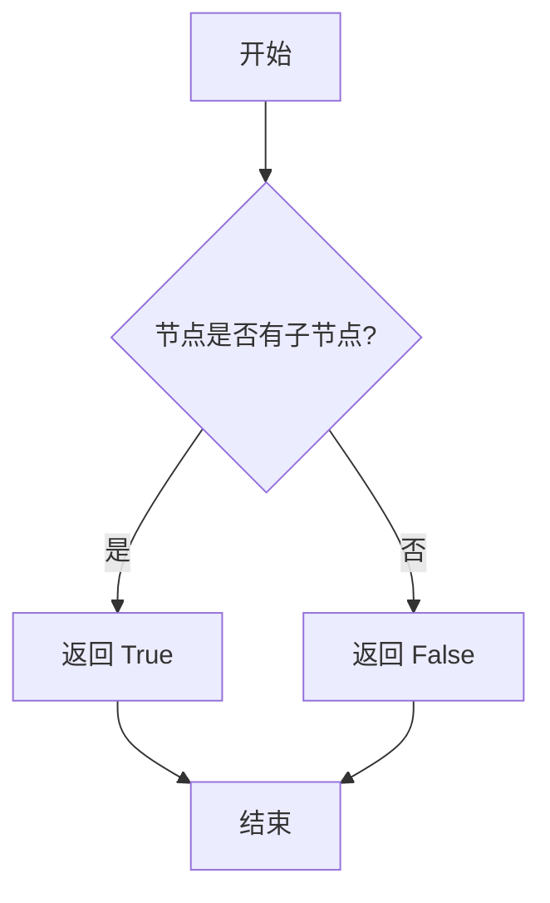

#### 带注释源码

```python
def is_fully_expanded(self):
    # 检查当前节点的子节点列表长度是否大于0
    # 如果大于0，说明节点已经扩展过，返回True
    # 否则，返回False
    return len(self.children) > 0
```

### `Node.add_child`

该方法用于向当前节点添加一个子节点，将其添加到节点的子节点列表中。

参数：

- `child_node`：`Node`，要添加的子节点对象

返回值：`None`，无返回值

#### 流程图

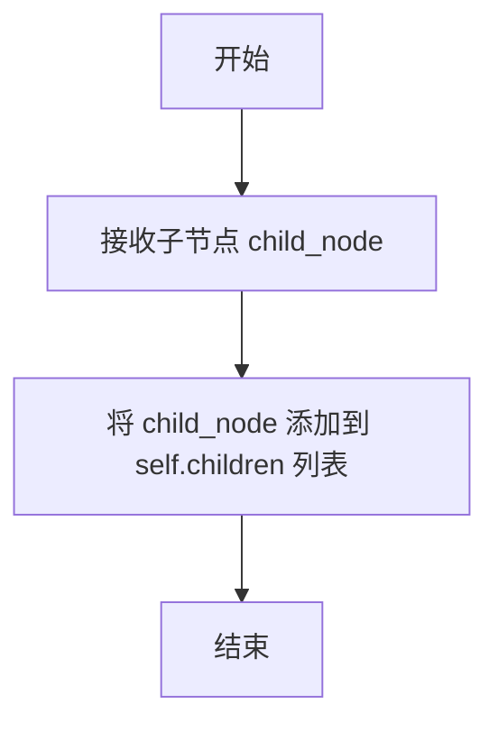

#### 带注释源码

```python
def add_child(self, child_node):
    # 将传入的 child_node 对象添加到当前节点的子节点列表 self.children 中
    self.children.append(child_node)
```

### `Node.update`

更新节点的累积奖励值和访问次数，并可选地更新父节点的角色状态。如果提供了子节点，会从子节点加载角色并更新父节点的角色状态到子节点的起始任务位置。

参数：

- `reward`：`dict`，包含评估分数的字典，通常包含 `score` 键，可能还包含 `train_score`、`dev_score`、`test_score` 等键。
- `child_node`：`Node`，可选参数，默认为 `None`。如果提供，表示当前节点是父节点，需要根据子节点的角色状态更新自己的角色状态。

返回值：`None`，此方法不返回任何值，直接修改节点对象的内部状态。

#### 流程图

```mermaid
flowchart TD
    A[开始] --> B{child_node 是否为 None?}
    B -- 否 --> C[从 child_node 加载角色]
    C --> D[从当前节点加载角色]
    D --> E[更新当前节点角色状态<br>至 child_node 的起始任务]
    E --> F[保存当前节点角色状态]
    B -- 是 --> G[将 reward['test_score']<br>赋给 self.raw_value]
    F --> H[更新累积奖励 self.value]
    G --> H
    H --> I[增加访问次数 self.visited]
    I --> J[保存节点状态到文件]
    J --> K[结束]
```

#### 带注释源码

```python
def update(self, reward: dict, child_node=None):
    # 如果提供了子节点，说明当前节点是父节点，需要更新其角色状态
    if child_node is not None:
        # 从子节点加载角色对象
        child_role = child_node.load_role()
        # 从当前节点加载角色对象
        role = self.load_role()
        # 将当前节点的角色状态更新到子节点角色的起始任务位置
        role.update_til_start_task(child_role)
        # 保存更新后的角色状态
        role.save_state()
    else:
        # 如果没有提供子节点，说明当前节点是叶子节点或正在被直接更新
        # 将测试集分数记录到 raw_value 字段
        self.raw_value = reward["test_score"]
    # 将本次模拟的奖励分数累加到节点的总价值中
    self.value += reward["score"]
    # 节点的访问次数加一
    self.visited += 1
    # 将更新后的节点状态序列化保存到磁盘
    self.save_node()
```

### `Node.get_role_path`

该方法用于获取当前节点对应的角色状态文件的完整路径。它基于节点的唯一标识符（ID）和节点状态中存储的目录信息，构建并返回一个JSON文件的路径，该文件保存了`Experimenter`角色的状态信息。

参数：

- 无

返回值：`str`，返回一个字符串，表示角色状态文件的完整路径。

#### 流程图

```mermaid
flowchart TD
    A[开始] --> B[获取节点ID]
    B --> C[从节点状态中获取节点目录]
    C --> D[拼接文件名<br>Node-{id}.json]
    D --> E[拼接完整路径<br>node_dir/Node-{id}.json]
    E --> F[返回完整路径]
    F --> G[结束]
```

#### 带注释源码

```python
def get_role_path(self):
    # 根据节点ID生成角色状态文件的文件名
    fname = f"Node-{self.id}.json"
    # 将文件名与节点状态中存储的目录路径拼接，得到完整的文件路径
    role_path = os.path.join(self.state["node_dir"], fname)
    # 返回该完整路径
    return role_path
```

### `Node.load_role`

该方法用于从磁盘加载与当前节点关联的`Experimenter`角色对象。它首先从节点对应的JSON文件中读取角色配置，然后根据配置实例化一个`Experimenter`对象。在实例化后，如果当前节点有父节点，它会从父节点加载角色状态并更新当前角色，以确保角色状态（如已完成的任务列表）的连续性。最后，它会重新映射角色中的任务ID，并返回该角色实例。

参数：
-  `self`：`Node`，当前节点实例。

返回值：`Experimenter`，加载并初始化后的`Experimenter`角色对象。

#### 流程图

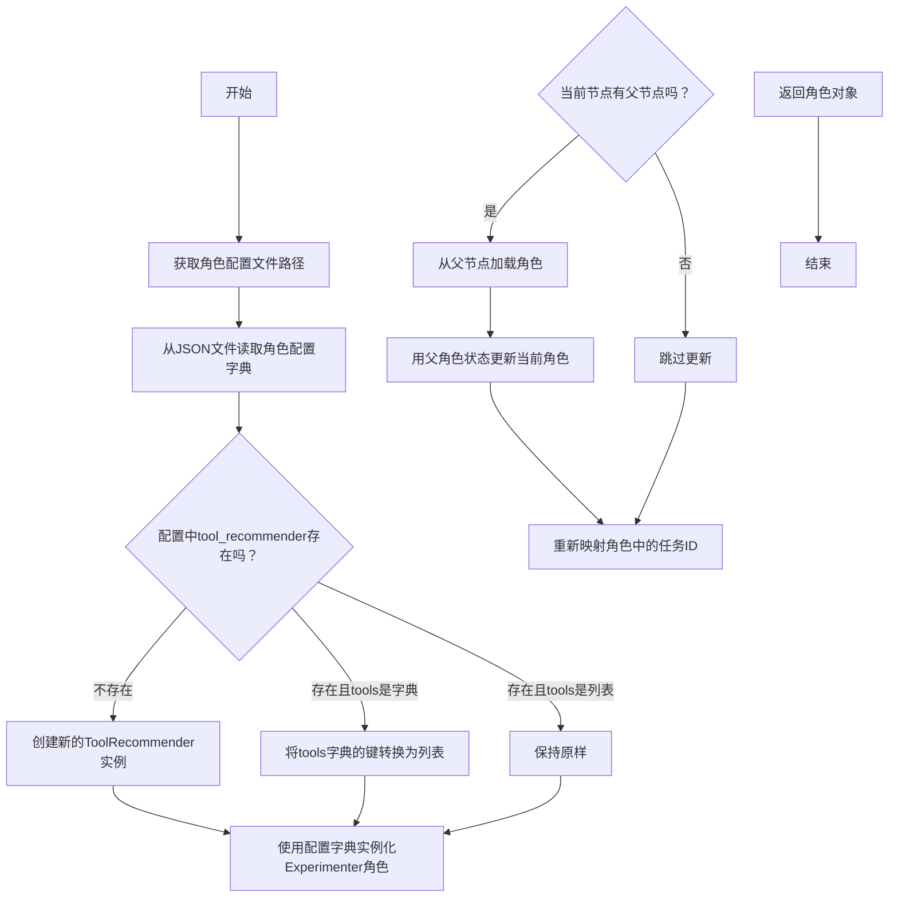

#### 带注释源码

```python
def load_role(self):
    # 1. 获取存储角色配置的JSON文件路径
    role_dict = read_json_file(self.get_role_path())
    
    # 2. 处理工具推荐器配置
    #    如果配置中没有tool_recommender，则创建一个新的ToolRecommender实例
    if role_dict.get("tool_recommender") is None:
        role_dict["tool_recommender"] = ToolRecommender()
    #    如果配置中的tool_recommender.tools是字典，则将其键转换为列表
    elif isinstance(role_dict.get("tool_recommender", {}).get("tools"), dict):
        role_dict["tool_recommender"]["tools"] = list(role_dict["tool_recommender"]["tools"].keys())
    
    # 3. 使用处理后的配置字典实例化Experimenter角色
    role = Experimenter(**role_dict)
    
    # 4. 如果当前节点有父节点，则从父节点加载角色状态并更新当前角色
    #    这确保了角色在决策树中的状态连续性（例如，已完成的任务列表）
    if self.parent is not None:  # TODO: Check this
        parent_role = self.parent.load_role()
        role.update_til_start_task(parent_role, backward=False)
    
    # 5. 重新映射角色内部的任务ID，确保任务序列的一致性
    role.remap_tasks()
    
    # 6. 返回加载并初始化完成的角色对象
    return role
```

### `Node.save_new_role`

该方法用于保存一个新的`Experimenter`角色实例到当前节点。它会更新角色的节点ID、起始任务ID，并设置状态为未保存，然后根据节点的动作（action）修改角色的下一条指令。最后，通过深度复制角色实例并调用其`save_state`方法进行静态保存，确保角色状态被持久化到文件系统中。

参数：

- `role`：`Experimenter`，需要保存的`Experimenter`角色实例

返回值：`None`，无返回值

#### 流程图

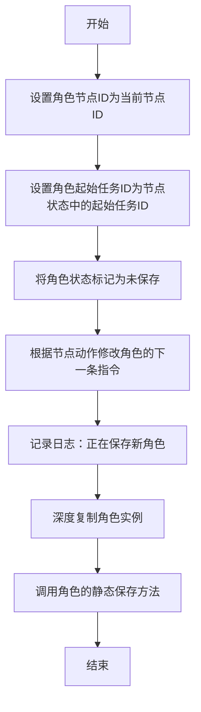

#### 带注释源码

```python
def save_new_role(self, role: Experimenter):
    # 将传入角色的节点ID设置为当前节点的ID
    role.node_id = self.id
    # 将传入角色的起始任务ID设置为当前节点状态中记录的起始任务ID
    role.start_task_id = self.state["start_task_id"]
    # 将角色的状态保存标志设置为False，表示需要保存
    role.state_saved = False
    # 根据当前节点的动作（action）来修改角色的下一条指令
    role.change_next_instruction(self.action)
    # 记录日志，表明正在保存一个新的角色
    mcts_logger.log("MCTS", f"Saving new role: {role.node_id}")
    # 对角色实例进行深度复制，以避免后续操作影响原始对象
    role = role.model_copy()
    # 调用角色的保存状态方法，使用静态保存模式
    role.save_state(static_save=True)
```

### `Node.expand`

该方法用于扩展当前节点，生成新的子节点。它首先检查节点是否已完全扩展，如果未完全扩展，则加载当前节点的角色，获取原始指令，然后通过指令生成器生成新的指令。对于每个新生成的指令，创建一个新的子节点，并保存对应的新角色。

参数：

- `self`：`Node`，当前节点实例
- `max_children`：`int`，最大子节点数量
- `instruction_generator`：`InstructionGenerator`，指令生成器实例

返回值：`None`，无返回值

#### 流程图

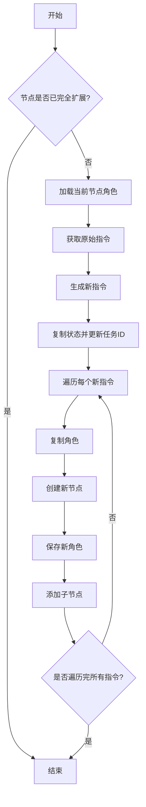

#### 带注释源码

```python
async def expand(self, max_children: int, instruction_generator: InstructionGenerator):
    # 检查节点是否已完全扩展，如果是则直接返回
    if self.is_fully_expanded():
        return
    # 加载当前节点的角色
    role = self.load_role()
    # 获取原始指令
    original_instruction = role.get_next_instruction()
    # 通过指令生成器生成新的指令
    insights = await instruction_generator.generate_new_instructions(
        task_id=role.start_task_id + 1,
        original_instruction=original_instruction,
        max_num=max_children,
    )
    # 复制当前节点的状态，并更新任务ID
    new_state = self.state.copy()
    new_state["start_task_id"] += 1
    # 遍历每个新生成的指令
    for insight in insights:
        # 复制当前节点的角色
        new_role = role.model_copy()
        # 创建新的子节点
        node = Node(parent=self, state=new_state, action=insight, value=0)
        # 保存新角色的状态
        node.save_new_role(new_role)
        # 将新节点添加为当前节点的子节点
        self.add_child(node)
```

### `Node.get_predictions_path`

该方法用于根据给定的数据集划分（如训练集、验证集、测试集），生成并返回对应预测结果文件的完整路径。

参数：

- `split`：`str`，数据集的划分名称，例如 `"train"`、`"dev"`、`"test"`。

返回值：`str`，预测结果文件的完整路径。

#### 流程图

```mermaid
flowchart TD
    A[开始] --> B[接收 split 参数]
    B --> C[拼接路径<br/>node_dir + Node-{id}-{split}_predictions.csv]
    C --> D[返回完整文件路径]
    D --> E[结束]
```

#### 带注释源码

```python
def get_predictions_path(self, split):
    # 使用 os.path.join 方法，将节点目录、节点ID和数据集划分信息拼接成预测文件的完整路径。
    # 格式为：{node_dir}/Node-{self.id}-{split}_predictions.csv
    return os.path.join(self.state["node_dir"], f"Node-{self.id}-{split}_predictions.csv")
```

### `Node.get_and_move_predictions`

该方法用于获取指定数据集划分（如训练集、验证集、测试集）的预测结果文件。如果预测文件不存在于当前节点的目录中，它会从工作目录的公共任务文件夹中复制过来，然后读取并返回该CSV文件的内容。

参数：

- `self`：`Node`，当前节点实例
- `split`：`str`，数据集的划分名称（例如："train"、"dev"、"test"）

返回值：`pandas.DataFrame`，包含指定划分的预测结果的DataFrame

#### 流程图

```mermaid
flowchart TD
    A[开始: get_and_move_predictions(split)] --> B{预测文件<br>存在于节点目录?};
    B -- 否 --> C[构建源文件路径<br>（工作目录/任务/划分_predictions.csv）];
    C --> D[复制源文件到节点目录];
    D --> E[删除源文件];
    E --> F[从节点目录读取CSV文件];
    B -- 是 --> F;
    F --> G[返回DataFrame];
    G --> H[结束];
```

#### 带注释源码

```python
def get_and_move_predictions(self, split):
    # 构建当前节点目录下预测文件的完整路径
    # 格式：{node_dir}/Node-{self.id}-{split}_predictions.csv
    if not os.path.exists(self.get_predictions_path(split)):
        # 如果节点目录下没有预测文件，则从工作目录的公共任务文件夹中复制
        # 源文件路径：{work_dir}/{task}/{split}_predictions.csv
        pred_path = os.path.join(self.state["work_dir"], self.state["task"], f"{split}_predictions.csv")
        # 将预测文件复制到当前节点的专属目录
        shutil.copy(pred_path, self.get_predictions_path(split))
        # 复制完成后，删除源文件，避免重复使用或空间浪费
        os.remove(pred_path)
    # 读取节点目录下的预测CSV文件并返回DataFrame
    return pd.read_csv(self.get_predictions_path(split))
```

### `Node.get_gt`

该方法用于加载指定数据分割（如训练集、验证集、测试集）的真实标签（ground truth）数据。

参数：
- `split`：`str`，数据分割的名称，例如 `"train"`、`"dev"`、`"test"`。

返回值：`pandas.DataFrame`，包含指定数据分割的真实标签数据。

#### 流程图

```mermaid
flowchart TD
    A[开始] --> B[拼接真实标签文件路径]
    B --> C[使用pandas读取CSV文件]
    C --> D[返回DataFrame]
    D --> E[结束]
```

#### 带注释源码

```python
def get_gt(self, split):
    # 根据数据分割名称（split）和节点状态中存储的数据集目录路径，拼接真实标签文件的完整路径。
    # 路径格式为：{datasets_dir}/{split}_target
    gt_path = os.path.join(self.state["datasets_dir"][f"{split}_target"])
    # 使用pandas的read_csv函数读取CSV文件，并返回包含真实标签的DataFrame。
    return pd.read_csv(gt_path)
```

### `Node.evaluate_prediction`

该方法用于评估指定数据分割（如开发集或测试集）上的预测结果。它首先获取预测值和真实值，然后根据数据集配置的评估指标计算得分。

参数：

- `split`：`str`，数据分割的名称，例如 "dev" 或 "test"，用于指定评估哪个数据集的预测结果。

返回值：`float`，返回根据指定评估指标计算出的得分。

#### 流程图

```mermaid
flowchart TD
    A[开始] --> B[获取指定数据分割的预测值]
    B --> C[获取指定数据分割的真实值]
    C --> D[获取数据集配置的评估指标]
    D --> E[调用 evaluate_score 计算得分]
    E --> F[返回得分]
    F --> G[结束]
```

#### 带注释源码

```python
def evaluate_prediction(self, split):
    # 获取指定数据分割的预测值
    preds = self.get_and_move_predictions(split)["target"]
    # 获取指定数据分割的真实值
    gt = self.get_gt(split)["target"]
    # 从状态中获取数据集配置的评估指标
    metric = self.state["dataset_config"]["metric"]
    # 调用评估函数计算得分并返回
    return evaluate_score(preds, gt, metric)
```

### `Node.evaluate_simulation`

该方法用于评估节点在模拟运行后的预测结果。根据节点的配置（是否使用外部评估），它要么计算并返回开发集和测试集的评估分数，要么仅将预测文件移动到节点目录中，并返回传入的分数字典。

参数：

- `self`：`Node`，当前节点实例
- `score_dict`：`dict`，包含初步评估分数的字典，通常来自`role.get_score()`的返回值

返回值：`dict`，更新后的分数字典。如果启用了外部评估，则包含`dev_score`和`test_score`；否则，与传入的`score_dict`相同。

#### 流程图

```mermaid
flowchart TD
    A[开始: evaluate_simulation] --> B{外部评估?<br>self.state['external_eval']}
    B -- 是 --> C[调用 evaluate_prediction<br>计算 dev 集分数]
    C --> D[调用 evaluate_prediction<br>计算 test 集分数]
    D --> E[构建 scores 字典<br>包含 dev_score, test_score, score]
    E --> F[更新 score_dict<br>score_dict.update(scores)]
    F --> G[返回 score_dict]
    B -- 否 --> H[调用 get_and_move_predictions<br>移动 dev 集预测文件]
    H --> I[调用 get_and_move_predictions<br>移动 test 集预测文件]
    I --> J[返回原始 score_dict]
```

#### 带注释源码

```python
def evaluate_simulation(self, score_dict):
    # 检查是否配置为使用外部评估（即，使用本地数据集文件进行评估）
    if self.state["external_eval"]:  # use external evaluation
        # 调用 evaluate_prediction 方法计算开发集和测试集的分数
        scores = {"dev_score": self.evaluate_prediction("dev"), "test_score": self.evaluate_prediction("test")}
        # 将开发集分数作为本次模拟的主要得分（用于MCTS的回传）
        scores["score"] = scores["dev_score"]
        # 用计算出的分数更新传入的分数字典
        score_dict.update(scores)
    else:
        # 如果不使用外部评估，则仅将预测结果文件从工作目录移动到节点目录
        # 这通常意味着评估分数已由其他流程（如角色运行）计算并包含在 score_dict 中
        self.get_and_move_predictions("dev")
        self.get_and_move_predictions("test")
    # 返回更新后的（或原始的）分数字典
    return score_dict
```

### `Node.run_node`

该方法用于执行当前节点对应的实验者（Experimenter）角色，运行机器学习任务，获取评估分数，并处理可能的异常和重试逻辑。如果节点是终端节点且角色状态已保存，则直接返回原始奖励；否则，会尝试加载并执行角色，进行任务模拟和评估。

参数：

- `role`：`Experimenter`，可选的实验者角色实例。如果为None，则从当前节点加载角色。
- 无其他显式参数，但方法内部使用`self`（当前Node实例）的状态和属性。

返回值：`tuple`，包含两个元素的元组：
1. `score_dict`：`dict`，包含归一化后的评估分数字典，键包括`test_score`、`dev_score`和`score`。
2. `result_dict`：`dict`，包含角色获取的解决方案信息。

#### 流程图

```mermaid
flowchart TD
    A[开始 run_node] --> B{节点是终端节点且角色已保存?}
    B -- 是 --> C[返回原始奖励]
    B -- 否 --> D[初始化重试计数和完成标志]
    D --> E{重试次数 <= 最大重试次数且未完成?}
    E -- 是 --> F{角色是否为None?}
    F -- 是 --> G[从节点加载角色并执行历史代码]
    G --> H[运行角色继续任务]
    F -- 否 --> I[运行角色开始新任务]
    I --> J[获取角色评分]
    J --> K[评估模拟结果]
    K --> L[设置原始奖励和完成标志]
    L --> M[捕获超时异常]
    M --> N[记录超时日志并跳出循环]
    L --> O[捕获其他异常]
    O --> P[记录错误日志并增加重试计数]
    E -- 否 --> Q{运行是否完成?}
    Q -- 否 --> R[根据评分方向设置默认分数]
    R --> S[设置原始奖励]
    Q -- 是 --> T[根据评分方向归一化分数]
    T --> U[获取角色解决方案]
    U --> V[返回分数字典和解决方案字典]
```

#### 带注释源码

```python
async def run_node(self, role: Experimenter = None):
    # 如果节点是终端节点且角色状态已保存，直接返回原始奖励
    if self.is_terminal() and role is not None:
        if role.state_saved:
            return self.raw_reward

    # 初始化最大重试次数和运行完成标志
    max_retries = 3
    num_runs = 1
    run_finished = False
    # 循环尝试运行角色，最多重试max_retries次
    while num_runs <= max_retries and not run_finished:
        try:
            # 如果未提供角色，从当前节点加载并执行历史代码
            if not role:
                role = self.load_role()
                await load_execute_notebook(role)  # 执行之前notebook的代码
                await role.run(with_message="continue")  # 继续执行任务
            else:
                # 如果提供了角色，使用任务需求开始新任务
                await role.run(with_message=self.state["requirement"])
            # 获取角色评分
            score_dict = await role.get_score()
            # 评估模拟结果（可能使用外部评估）
            score_dict = self.evaluate_simulation(score_dict)
            # 保存原始奖励并标记运行完成
            self.raw_reward = score_dict
            run_finished = True
        except TimeoutException as e:
            # 处理角色级别超时异常，记录日志并跳出循环
            mcts_logger.log("MCTS", f"Role-level timeout: {e}")
            break
        except Exception as e:
            # 处理其他异常，记录日志并增加重试计数
            mcts_logger.log("MCTS", f"Error in running the role: {e}")
            num_runs += 1

    # 如果运行未完成，根据评分方向设置默认分数
    if not run_finished:
        mcts_logger.log("MCTS", f"Role {role.node_id} failed to run")
        if self.state["low_is_better"]:
            # 如果低分更好，设置分数为无穷大
            score_dict = {"test_score": np.inf, "dev_score": np.inf, "score": np.inf}
        else:
            # 否则设置分数为0
            score_dict = {"test_score": 0, "dev_score": 0, "score": 0}
        self.raw_reward = score_dict
    # 根据评分方向归一化分数（高分更好）
    if self.state["low_is_better"]:
        # 归一化分数到0-1之间，高分更好
        def normalize_score(score):
            if score == -1:
                return 0
            return 1 / (1 + score)

        score_dict = {k: normalize_score(v) for k, v in score_dict.items()}
    # 保存归一化后的奖励
    self.normalized_reward = score_dict
    # 获取角色的解决方案信息
    result_dict = role.get_solution()
    # 返回分数字典和解决方案字典
    return score_dict, result_dict
```

### `BaseTreeSearch.__init__`

初始化BaseTreeSearch类的实例，设置树搜索的根节点、最大深度以及是否使用固定洞察的配置。

参数：

- `root_node`：`Node`，树搜索的根节点，包含初始状态和配置信息
- `max_depth`：`int`，树搜索的最大深度限制
- `use_fixed_insights`：`bool`，指示是否使用预定义的固定洞察来生成新指令

返回值：`None`，构造函数不返回任何值

#### 流程图

```mermaid
flowchart TD
    A[开始初始化] --> B[设置根节点 root_node]
    B --> C[设置最大深度 max_depth]
    C --> D[设置固定洞察标志 use_fixed_insights]
    D --> E[初始化完成]
```

#### 带注释源码

```python
def __init__(self, root_node: Node, max_depth: int, use_fixed_insights: bool):
    # 设置树搜索的根节点，包含初始状态和配置
    self.root_node = root_node
    # 设置树搜索的最大深度限制，控制搜索范围
    self.max_depth = max_depth
    # 设置是否使用预定义的固定洞察来生成新指令
    self.use_fixed_insights = use_fixed_insights
```

### `BaseTreeSearch.select`

该方法用于在树搜索过程中选择下一个要探索的节点。它通过调用 `best_child` 方法（该方法在子类中实现，例如 UCT 算法）来确定当前节点的最佳子节点，并记录选择日志。

参数：

- `node`：`Node`，当前节点，表示搜索树中需要选择子节点的位置。

返回值：`Node`，返回根据特定策略（如 UCT 分数）选择出的最佳子节点。

#### 流程图

```mermaid
flowchart TD
    A[开始: select(node)] --> B[调用 best_child() 方法]
    B --> C{best_child 是否实现?}
    C -- 是 --> D[返回最佳子节点]
    C -- 否 --> E[抛出 NotImplementedError]
    D --> F[记录选择日志]
    F --> G[结束: 返回节点]
```

#### 带注释源码

```python
def select(self, node: Node):
    # 调用 best_child 方法选择当前节点的最佳子节点
    # 该方法的具体实现由子类提供（例如 UCT 算法）
    node = self.best_child()
    # 记录选择节点的日志信息
    mcts_logger.log("MCTS", f"Selected node id: {node.id}")
    # 返回选择出的节点
    return node
```

### `BaseTreeSearch.best_child`

该方法是一个抽象方法，用于在树搜索算法中选择最佳子节点。由于它是一个未实现的抽象方法，其具体逻辑需要由子类根据特定的搜索策略（如UCT、贪心等）来定义。

参数：

- 无

返回值：`Node`，返回根据特定策略计算出的最佳子节点。

#### 流程图

```mermaid
flowchart TD
    A[开始] --> B{子类是否实现？}
    B -- 是 --> C[执行子类实现的选择逻辑]
    C --> D[返回最佳子节点]
    B -- 否 --> E[抛出 NotImplementedError 异常]
    E --> F[结束]
```

#### 带注释源码

```python
def best_child(self):
    # 这是一个抽象方法，需要在子类中实现具体的逻辑。
    # 通常用于根据某种策略（如UCT公式、贪心策略等）从当前节点的子节点中选择一个“最佳”节点。
    # 例如，在MCTS中，这可能涉及平衡探索（exploration）和利用（exploitation）。
    raise NotImplementedError
```

### `BaseTreeSearch.expand`

该方法用于扩展给定节点，生成其子节点。它首先检查节点是否已完全扩展，如果未完全扩展，则加载节点的角色，生成新的指令（insights），并为每个新指令创建一个子节点。每个子节点保存一个新的角色状态，并添加到父节点的子节点列表中。

参数：

- `node`：`Node`，要扩展的节点
- `max_children`：`int`，最大子节点数量

返回值：`list[Node]`，扩展后生成的子节点列表

#### 流程图

```mermaid
flowchart TD
    A[开始] --> B{节点是否已完全扩展?}
    B -- 是 --> C[返回空列表]
    B -- 否 --> D[加载节点角色]
    D --> E[生成新指令 insights]
    E --> F[遍历每个 insight]
    F --> G[复制角色状态]
    G --> H[创建新子节点]
    H --> I[保存新角色到子节点]
    I --> J[将子节点添加到父节点]
    J --> K{是否还有更多 insight?}
    K -- 是 --> F
    K -- 否 --> L[返回子节点列表]
```

#### 带注释源码

```python
async def expand(self, node: Node, max_children=5):
    # 调用节点的 expand 方法，传入最大子节点数和指令生成器
    await node.expand(max_children, self.instruction_generator)
    # 如果节点不在 children 字典中或其子节点列表为空，则更新 children 字典
    if node not in self.children or not self.children[node]:
        self.children[node] = node.children
    # 返回节点的子节点列表
    return node.children
```

### `BaseTreeSearch.simulate`

该方法用于对给定的决策树节点进行随机模拟，直到达到终止状态，并返回模拟得到的奖励值。它通过随机选择子节点进行深度优先探索，最终执行选中的叶子节点并获取其评估分数。

参数：

- `node`：`Node`，要进行模拟的决策树节点
- `role`：`Experimenter`，可选的实验执行者角色，如果提供则使用该角色执行节点

返回值：`dict`，包含模拟得到的奖励分数，通常包括 `test_score`、`dev_score` 和 `score` 等键值对

#### 流程图

```mermaid
graph TD
    A[开始模拟节点 node] --> B{node 是否有子节点?};
    B -- 是 --> C[随机选择一个子节点作为新的 node];
    C --> B;
    B -- 否 --> D[执行 node.run_node 方法];
    D --> E[获取奖励 reward 和结果 result_dict];
    E --> F[记录模拟奖励];
    F --> G[返回奖励 reward];
```

#### 带注释源码

```python
async def simulate(self, node: Node, role=None):
    "Returns the reward for a random simulation (to completion) of `node`"
    mcts_logger.log("MCTS", f"Start simulating node {node.id}:")
    # 循环随机选择子节点，直到到达叶子节点
    while node.children:
        node = np.random.choice(node.children)
    # 执行叶子节点，获取奖励和结果
    reward, result_dict = await node.run_node(role)
    mcts_logger.log("MCTS", f"Simulated node's reward: {reward}")
    # TODO: add new insights
    return reward
```

### `BaseTreeSearch.backpropagate`

该方法实现了蒙特卡洛树搜索（MCTS）中的反向传播（Backpropagation）步骤。它从给定的节点开始，沿着父节点路径向上回溯，将模拟得到的奖励（reward）更新到路径上的每个节点。更新内容包括累加奖励值、增加访问次数，并可选地更新父节点的角色状态。

参数：

- `node`：`Node`，当前模拟结束的节点，奖励将从该节点开始向上传播。
- `reward`：`dict`，模拟得到的奖励字典，通常包含如 `score`、`test_score`、`dev_score` 等键值对。

返回值：`None`，该方法不返回任何值，直接修改节点树的状态。

#### 流程图

```mermaid
flowchart TD
    A[开始: backpropagate(node, reward)] --> B[child_node = node]
    B --> C[node.update(reward)]
    C --> D[node = node.parent]
    D --> E{node 是否为 None?}
    E -- 否 --> F[node.update(reward, child_node)]
    F --> G[node, child_node = node.parent, node]
    G --> D
    E -- 是 --> H[结束]
```

#### 带注释源码

```python
def backpropagate(self, node: Node, reward: dict):
    # 保存当前节点作为子节点，用于后续更新父节点时传递
    child_node = node
    # 首先更新当前节点自身的奖励和访问次数
    node.update(reward)
    # 移动到父节点，开始向上回溯
    node = node.parent
    # 循环向上遍历所有祖先节点，直到根节点（parent为None）
    while node is not None:
        # 更新当前祖先节点的奖励和访问次数，并传入子节点以更新角色状态
        node.update(reward, child_node)
        # 继续向上移动：当前节点成为新的子节点，其父节点成为新的当前节点
        node, child_node = node.parent, node
```

### `BaseTreeSearch.best_path`

该方法在决策树中执行广度优先搜索（BFS），以找到在开发集（dev）和测试集（test）上具有最高归一化奖励分数的路径。它从给定的根节点开始，遍历所有子节点，比较每个节点的归一化奖励分数，并返回在开发集和测试集上表现最佳的子节点，以及所有已访问节点的分数记录。

参数：

- `root`：`Node`，搜索的起始节点，即决策树的根节点

返回值：`dict`，包含以下键的字典：
  - `"dev_best"`：在开发集（dev）上具有最高归一化奖励分数的`Node`对象
  - `"global_best"`：在测试集（test）上具有最高归一化奖励分数的`Node`对象
  - `"scores"`：一个字典，包含所有已访问节点在开发集和测试集上的归一化奖励分数和原始奖励分数列表

#### 流程图

```mermaid
graph TD
    A[开始: best_path(root)] --> B[初始化最佳节点和分数]
    B --> C[调用BFS查找dev最佳节点]
    C --> D[调用BFS查找test最佳节点]
    D --> E[获取所有节点分数记录]
    E --> F[返回结果字典]
    F --> G[结束]

    subgraph BFS查找最佳节点
        H[开始BFS: bfs(node, best_score, best_child, split)] --> I{节点是否在children中?}
        I -- 否 --> J[返回当前最佳分数和节点]
        I -- 是 --> K[遍历节点的每个子节点]
        K --> L[获取子节点的归一化奖励分数]
        L --> M{分数是否大于当前最佳分数?}
        M -- 是 --> N[更新最佳分数和节点]
        M -- 否 --> O[继续遍历]
        N --> O
        O --> P[递归调用BFS处理子节点]
        P --> Q[返回递归结果]
    end

    C --> H
    D --> H
```

#### 带注释源码

```python
def best_path(self, root: Node):
    # 初始化最佳子节点为根节点
    best_child = root
    # 获取根节点在测试集上的归一化奖励分数作为全局最佳分数
    global_best_score = root.normalized_reward["test_score"]
    # 获取根节点在开发集上的归一化奖励分数作为开发集最佳分数
    dev_best_score = root.normalized_reward["dev_score"]

    # 定义广度优先搜索（BFS）函数，用于查找指定分数类型（split）的最佳节点
    def bfs(node: Node, best_score: float, best_child: Node, split: str):
        # 确保分数类型是有效的（"test_score" 或 "dev_score"）
        assert split in ["test_score", "dev_score"]
        # 如果当前节点不在children字典中（即没有子节点），则返回当前最佳分数和节点
        if node not in self.children:
            return best_score, best_child
        # 遍历当前节点的所有子节点
        for child in self.children[node]:
            # 获取子节点在指定分数类型上的归一化奖励分数
            score = child.normalized_reward[split]
            # 打印子节点ID、分数类型和分数（用于调试）
            print(child.id, split, score)
            # 如果当前子节点的分数大于当前最佳分数，则更新最佳分数和最佳节点
            if score > best_score:
                best_score = score
                best_child = child
            # 递归调用BFS处理子节点，继续查找更优节点
            best_score, best_child = bfs(child, best_score, best_child, split)
        # 返回最终的最佳分数和最佳节点
        return best_score, best_child

    # 调用BFS查找在测试集上表现最佳的节点
    _, global_best_child = bfs(root, global_best_score, best_child, "test_score")
    # 调用BFS查找在开发集上表现最佳的节点
    _, dev_best_child = bfs(root, dev_best_score, best_child, "dev_score")

    # 返回包含最佳节点和所有节点分数记录的字典
    return {"dev_best": dev_best_child, "global_best": global_best_child, "scores": self.get_score_order_dict()}
```


### `BaseTreeSearch.get_num_simulations`

该方法用于获取蒙特卡洛树搜索（MCTS）过程中已执行的模拟（Simulation）次数。它通过查询根节点的访问次数（`visited` 属性）来统计整个搜索树中已完成的模拟轮次总数。

参数：
-  `self`：`BaseTreeSearch`，`BaseTreeSearch` 类的实例，代表当前搜索树对象。

返回值：`int`，返回一个整数，表示从搜索开始到当前时刻，根节点（即整个搜索过程）累计被访问（即模拟）的次数。

#### 流程图

```mermaid
flowchart TD
    A[开始] --> B[访问根节点 self.root_node]
    B --> C[获取根节点的 visited 属性值]
    C --> D[返回 visited 值作为模拟次数]
    D --> E[结束]
```

#### 带注释源码

```
def get_num_simulations(self):
    # 直接返回根节点（self.root_node）的 visited 属性值。
    # 在 MCTS 的 backpropagation 阶段，每次模拟的结果都会更新从叶节点到根节点路径上所有节点的 visited 计数。
    # 因此，根节点的 visited 计数就代表了整个搜索过程中执行的总模拟次数。
    return self.root_node.visited
```


### `BaseTreeSearch.save_node_order`

该方法用于将节点ID添加到节点顺序列表中，并将更新后的列表保存到JSON文件中，以便记录搜索过程中节点的访问顺序。

参数：

- `node_id`：`str`，要添加到节点顺序列表中的节点ID

返回值：`None`，无返回值

#### 流程图

```mermaid
flowchart TD
    A[开始] --> B[将node_id添加到node_order列表]
    B --> C[构建文件路径]
    C --> D[打开文件并写入JSON数据]
    D --> E[结束]
```

#### 带注释源码

```python
def save_node_order(self, node_id: str):
    # 将节点ID添加到节点顺序列表中
    self.node_order.append(node_id)
    # 构建文件路径，指向根节点状态中的节点目录下的node_order.json文件
    with open(os.path.join(self.root_node.state["node_dir"], "node_order.json"), "w") as f:
        # 将节点顺序列表以JSON格式写入文件
        json.dump(self.node_order, f)
```

### `BaseTreeSearch.load_node_order`

该方法用于从文件中加载节点执行顺序列表，并将其存储到`BaseTreeSearch`实例的`node_order`属性中。它读取一个JSON文件，该文件记录了在树搜索过程中节点的访问顺序。

参数：

-  `self`：`BaseTreeSearch`，`BaseTreeSearch`类的实例，用于访问根节点状态和存储加载的节点顺序。

返回值：`None`，该方法没有返回值，但会更新实例的`node_order`属性。

#### 流程图

```mermaid
flowchart TD
    A[开始] --> B[构造文件路径<br>node_order.json]
    B --> C{文件是否存在？}
    C -- 是 --> D[打开并读取JSON文件]
    D --> E[解析JSON内容<br>并赋值给self.node_order]
    E --> F[结束]
    C -- 否 --> G[结束<br>（self.node_order保持为空列表）]
```

#### 带注释源码

```python
def load_node_order(self):
    # 构造节点顺序文件的完整路径。该文件位于根节点的状态字典中指定的工作目录下。
    with open(os.path.join(self.root_node.state["node_dir"], "node_order.json"), "r") as f:
        # 打开文件并读取其内容，使用json.load解析JSON格式的数据。
        # 将解析得到的列表直接赋值给当前实例的node_order属性。
        self.node_order = json.load(f)
```

### `BaseTreeSearch.get_score_order_dict`

该方法用于收集并返回搜索过程中所有已访问节点的评估分数，包括归一化后的开发集和测试集分数，以及原始分数。它遍历存储在`node_order`列表中的节点ID，加载每个节点对象，并提取其归一化奖励和原始奖励中的开发集和测试集分数，最终将这些分数组织成一个字典返回。

参数：

- 无参数

返回值：`dict`，包含四个列表的字典：
  - `"dev"`：所有节点的归一化开发集分数列表
  - `"test"`：所有节点的归一化测试集分数列表
  - `"dev_raw"`：所有节点的原始开发集分数列表
  - `"test_raw"`：所有节点的原始测试集分数列表

#### 流程图

```mermaid
flowchart TD
    A[开始] --> B[初始化 scores 字典<br>包含 dev, test, dev_raw, test_raw 四个空列表]
    B --> C{遍历 node_order 列表中的每个 node_id}
    C --> D[为当前 node_id 创建临时 Node 对象]
    D --> E[设置 Node 对象的 id 为当前 node_id]
    E --> F[从磁盘加载完整的 Node 对象]
    F --> G[将 Node 的 normalized_reward['dev_score']<br>添加到 scores['dev'] 列表]
    G --> H[将 Node 的 normalized_reward['test_score']<br>添加到 scores['test'] 列表]
    H --> I[将 Node 的 raw_reward['dev_score']<br>添加到 scores['dev_raw'] 列表]
    I --> J[将 Node 的 raw_reward['test_score']<br>添加到 scores['test_raw'] 列表]
    J --> C
    C -- 遍历结束 --> K[返回包含四个分数列表的 scores 字典]
    K --> L[结束]
```

#### 带注释源码

```python
def get_score_order_dict(self):
    # 初始化一个字典，用于存储四种类型的分数列表
    scores = {"dev": [], "test": [], "dev_raw": [], "test_raw": []}
    
    # 遍历存储在 self.node_order 中的每个节点ID
    for node_id in self.node_order:
        # 创建一个临时的 Node 对象，使用根节点的状态进行初始化
        # 这个临时对象仅用于后续加载完整的节点数据
        node = Node(parent=None, state=self.root_node.state, action=None, value=0)
        # 将临时节点的ID设置为当前遍历到的 node_id
        node.id = node_id
        # 根据 node_id 从磁盘加载完整的 Node 对象（包含所有属性和奖励信息）
        node = node.load_node()
        
        # 将加载的节点的归一化开发集分数添加到 'dev' 列表
        scores["dev"].append(node.normalized_reward["dev_score"])
        # 将加载的节点的归一化测试集分数添加到 'test' 列表
        scores["test"].append(node.normalized_reward["test_score"])
        # 将加载的节点的原始开发集分数添加到 'dev_raw' 列表
        scores["dev_raw"].append(node.raw_reward["dev_score"])
        # 将加载的节点的原始测试集分数添加到 'test_raw' 列表
        scores["test_raw"].append(node.raw_reward["test_score"])
    
    # 返回包含所有分数列表的字典
    return scores
```

### `BaseTreeSearch.search`

`BaseTreeSearch.search` 是蒙特卡洛树搜索（MCTS）算法的主循环。它负责初始化搜索树，执行指定次数的模拟（rollouts），并在每次模拟中执行选择（Select）、扩展（Expand）、模拟（Simulate）和反向传播（Backpropagate）步骤。最终，它返回搜索过程中找到的最佳路径节点。

参数：

- `state`：`dict`，包含任务配置、工作目录、数据集路径等信息的初始状态字典。
- `args`：`Namespace`，包含控制搜索行为的命令行参数，如是否使用反思（reflection）、是否加载现有树（load_tree）、模拟次数（rollouts）等。

返回值：`dict`，一个字典，包含根据开发集（dev）和测试集（test）分数分别找到的最佳子节点（`dev_best` 和 `global_best`），以及所有已访问节点的分数记录（`scores`）。

#### 流程图

```mermaid
flowchart TD
    A[开始搜索] --> B{是否加载现有树?}
    B -- 是 --> C[加载树结构]
    B -- 否 --> D[初始化根节点并模拟]
    C --> E[加载节点访问顺序]
    D --> F[扩展根节点并模拟一个子节点]
    F --> G[记录初始节点顺序]
    E --> H[循环执行指定次数的模拟]
    G --> H
    H --> I{当前节点是终止节点?}
    I -- 是 --> J[直接使用节点已有奖励进行反向传播]
    I -- 否 --> K[扩展节点并模拟一个随机子节点]
    K --> L[反向传播奖励]
    J --> L
    L --> M[记录当前节点ID]
    M --> N{是否完成所有模拟?}
    N -- 否 --> H
    N -- 是 --> O[计算并返回最佳路径]
    O --> P[结束]
```

#### 带注释源码

```python
async def search(self, state: dict, args):
    # 解析参数：是否使用反思、是否加载树、模拟次数、是否从头开始
    reflection = args.reflection
    load_tree = args.load_tree
    rollouts = args.rollouts
    from_scratch = args.from_scratch

    # 1. 初始化：创建实验者角色和搜索树的根节点
    role, root = initialize_di_root_node(state, reflection=reflection)
    self.root_node = root

    # 2. 初始化指令生成器，用于在扩展步骤中生成新的子节点（指令）
    self.instruction_generator = InstructionGenerator(
        state=state, use_fixed_insights=self.use_fixed_insights, from_scratch=from_scratch
    )
    await self.instruction_generator.initialize()

    # 3. 尝试加载之前保存的树结构
    tree_loaded = False
    if load_tree:
        tree_loaded = self.load_tree()
        mcts_logger.log("MCTS", f"Number of simulations: {self.get_num_simulations()}")
        mcts_logger.log("MCTS", f"Tree loaded: {tree_loaded}")

    # 4. 如果树加载失败，则进行初始构建
    if not tree_loaded:
        # 预留两次模拟用于初始化树：一次模拟根节点，一次扩展并模拟一个子节点
        rollouts -= 2
        if rollouts < 0:
            raise ValueError("Rollouts must be greater than 2 if there is no tree to load")

        # 4.1 初始化子节点字典
        self.children[root] = []

        # 4.2 模拟根节点，获取初始奖励，并反向传播
        reward = await self.simulate(root, role)
        self.backpropagate(root, reward)

        # 4.3 扩展根节点，随机选择一个子节点进行模拟，并反向传播
        node, reward = await self.expand_and_simulate(root)
        # self.backpropagate(node, reward) # 已在expand_and_simulate内部调用

        # 4.4 记录初始两个节点的访问顺序
        self.save_node_order(root.id)
        self.save_node_order(node.id)
    else:
        # 5. 如果树加载成功，则根节点更新为加载的根节点，并加载节点访问顺序
        root = self.root_node
        self.load_node_order()

    # 6. 主循环：执行指定次数的模拟（rollouts）
    for _ in range(rollouts):
        mcts_logger.log("MCTS", f"Start the next rollout {_+1}")

        # 6.1 选择阶段：根据策略（如UCT）选择一个待探索的节点
        node = self.select(root)

        # 6.2 判断选择的节点是否为终止节点（达到最大深度）
        if node.is_terminal():
            # 如果是终止节点且未模拟过，则进行模拟；否则使用已有奖励
            if node.raw_value == 0:
                reward = await self.simulate(node)
            else:
                reward = {"test_score": node.raw_value, "score": node.raw_reward["score"]}
            mcts_logger.log("MCTS", f"Terminal node's reward: {reward}")
            # 6.3 反向传播奖励
            self.backpropagate(node, reward)
        else:
            # 6.4 对于非终止节点：扩展该节点，并随机模拟一个子节点
            node, reward = await self.expand_and_simulate(node)
            # self.backpropagate(node, reward) # 已在expand_and_simulate内部调用

        # 6.5 记录本次模拟访问的节点ID
        self.save_node_order(node.id)

    # 7. 所有模拟完成后，计算并返回最佳路径
    return self.best_path(root)
```

### `BaseTreeSearch.expand_and_simulate`

该方法用于扩展给定的决策树节点（生成其子节点），然后随机选择一个子节点进行模拟（执行该节点对应的任务），最后将模拟得到的奖励值反向传播回该节点及其祖先节点，以更新它们的价值。

参数：

- `node`：`Node`，需要被扩展和模拟的决策树节点对象。

返回值：`tuple`，包含两个元素的元组：
- 第一个元素是 `Node` 类型，表示被模拟的子节点。
- 第二个元素是 `dict` 类型，表示模拟该子节点后得到的奖励字典，通常包含 `test_score`、`dev_score` 和 `score` 等键。

#### 流程图

```mermaid
flowchart TD
    A[开始: expand_and_simulate(node)] --> B{node.visited > 0?};
    B -- 是 --> C[调用 self.expand(node) 扩展节点];
    C --> D[从子节点列表中随机选择一个子节点 node];
    B -- 否 --> E[直接使用当前节点 node];
    D --> F;
    E --> F[调用 self.simulate(node) 模拟节点];
    F --> G[调用 self.backpropagate(node, reward) 反向传播奖励];
    G --> H[返回 (node, reward)];
    H --> I[结束];
```

#### 带注释源码

```python
async def expand_and_simulate(self, node: Node):
    # Expand and randomly select a child node, then simulate it
    # 如果节点已被访问过（visited > 0），则对其进行扩展
    if node.visited > 0:
        # 调用 expand 方法生成当前节点的子节点
        children = await self.expand(node)
        # 从生成的子节点列表中随机选择一个作为下一步要模拟的节点
        node = np.random.choice(children)
    # 模拟选中的节点，执行其对应的任务并获取奖励
    reward = await self.simulate(node)
    # 将模拟得到的奖励反向传播，更新当前节点及其祖先节点的价值
    self.backpropagate(node, reward)
    # 返回被模拟的节点和获得的奖励
    return node, reward
```

### `BaseTreeSearch.load_tree`

该方法用于从磁盘加载已保存的决策树结构。它会遍历指定目录下的所有`.pkl`文件，递归地重建根节点及其所有子节点，并将它们组织到`self.children`字典中，以恢复整个搜索树的状态。

参数：
- 无显式参数。该方法是一个实例方法，通过`self`访问`root_node.state["node_dir"]`来获取节点文件所在的目录路径。

返回值：`bool`，如果成功加载了树结构（即至少找到了根节点文件并加载了子节点），则返回`True`；否则返回`False`。

#### 流程图

```mermaid
flowchart TD
    A[开始 load_tree] --> B{根节点文件<br>Node-0.pkl 存在?};
    B -- 否 --> C[返回 False];
    B -- 是 --> D[加载根节点<br>pickle.load];
    D --> E[初始化 children 字典<br>self.children[root_node] = root_node.children];
    E --> F[调用 load_children_node<br>递归加载子节点];
    F --> G{children 字典非空?};
    G -- 否 --> C;
    G -- 是 --> H[返回 True];
```

#### 带注释源码

```python
def load_tree(self):
    # 定义一个内部递归函数，用于加载给定节点的所有子节点
    def load_children_node(node: Node):
        # 记录日志，显示当前正在加载的节点及其子节点ID
        mcts_logger.log("MCTS", f"Load node {node.id}'s child: {node.children}")
        # 递归终止条件：如果节点是终端节点或没有子节点，则停止递归
        if node.is_terminal() or not node.children:
            return
        # 遍历当前节点的所有子节点
        for child in node.children:
            # 从磁盘加载子节点的具体数据（.pkl文件）
            child.load_node()
            # 将加载的子节点及其子节点列表（child.children）存入全局的children字典
            self.children[child] = child.children
            # 递归调用，继续加载当前子节点的子节点（即孙节点）
            load_children_node(child)

    # 获取根节点目录下所有的.pkl文件
    all_pkl_files = os.listdir(self.root_node.state["node_dir"])
    all_pkl_files = [f for f in all_pkl_files if f.endswith(".pkl")]
    # 检查根节点文件（Node-0.pkl）是否存在
    if os.path.exists(os.path.join(self.root_node.state["node_dir"], "Node-0.pkl")):
        # 如果存在，则加载根节点
        with open(os.path.join(self.root_node.state["node_dir"], "Node-0.pkl"), "rb") as f:
            self.root_node = pickle.load(f)
        # 将根节点及其子节点列表初始化到children字典中
        self.children[self.root_node] = self.root_node.children
        # 开始递归加载整个树的所有子节点
        load_children_node(self.root_node)

        # 加载完成后，检查children字典是否非空。非空表示至少加载了一些节点结构。
        if self.children:
            return True
    # 如果根节点文件不存在，或者加载后children字典为空，则返回False
    return False
```

## 关键组件


### 决策树节点 (Node)

代表蒙特卡洛树搜索（MCTS）中的一个状态节点，包含任务执行状态、动作、价值、子节点等信息，并负责节点的创建、保存、加载、评估和扩展等核心操作。

### 树搜索基类 (BaseTreeSearch)

定义了蒙特卡洛树搜索（MCTS）算法的基本框架，包括选择（Select）、扩展（Expand）、模拟（Simulate）和反向传播（Backpropagate）等核心步骤，并管理搜索树的结构和状态。

### 实验执行器 (Experimenter)

作为任务执行的核心角色，负责根据指令生成和执行代码（如Jupyter Notebook），管理任务状态，并获取任务执行的评分结果。

### 指令生成器 (InstructionGenerator)

负责为决策树节点的扩展生成新的指令或“洞察”（insights），以指导`Experimenter`进行下一步操作，支持从固定集合生成或基于上下文动态生成。

### 状态初始化与根节点创建 (initialize_di_root_node, create_initial_state)

负责根据输入参数（如任务名称、配置、命令行参数）创建MCTS搜索的初始状态字典，并基于此状态初始化根节点和对应的`Experimenter`角色。

### 评估与评分 (evaluate_score, Node.evaluate_prediction, Node.evaluate_simulation)

提供模型预测结果的评估功能，根据指定的指标（如RMSE）计算分数，并支持在节点模拟过程中整合内部评分与外部评估结果。

### 工具推荐器 (ToolRecommender)

为`Experimenter`角色推荐可能用到的工具或库，辅助其完成数据科学任务，其状态会被序列化并保存在角色信息中。

### 超时与异常处理 (TimeoutException)

定义了任务执行过程中的超时异常，用于在`Node.run_node`方法中捕获并处理角色执行超时的情况，确保搜索过程的健壮性。

### 日志记录器 (mcts_logger)

提供结构化的日志记录功能，用于跟踪MCTS搜索过程中的关键事件、节点状态和调试信息。


## 问题及建议


### 已知问题

-   **硬编码的终止条件逻辑不一致**：`Node.is_terminal()` 方法中，终止条件为 `int(self.state["start_task_id"]) == self.max_depth + 1`。注释中标注了 `TODO: Check if this is correct or +1`，表明开发者不确定此逻辑的正确性。同时，`Node.__init__` 中传入的 `max_depth` 参数与 `BaseTreeSearch` 中的 `max_depth` 关系不明确，可能导致节点深度计算错误或提前/延迟终止搜索。
-   **错误处理和资源清理不完善**：在 `Node.get_and_move_predictions` 方法中，如果 `shutil.copy` 成功但后续的 `os.remove` 失败，可能导致原始预测文件被错误删除。此外，`Node.run_node` 方法在捕获 `TimeoutException` 后直接 `break` 退出循环，但未对 `score_dict` 进行赋值，可能导致在后续代码中引用未定义的变量（尽管后面有兜底逻辑，但流程不清晰）。
-   **潜在的序列化/反序列化问题**：`Node.load_role` 方法中，从 JSON 文件加载 `Experimenter` 角色时，对 `tool_recommender` 字段进行了复杂的类型检查和转换（例如将 `dict` 转换为 `list`）。这表明序列化格式（JSON）与代码中使用的对象结构可能存在不一致，增加了维护复杂性和出错风险。
-   **状态管理存在隐患**：`Node.update` 方法在更新节点值时，如果提供了 `child_node`，则会加载子节点和父节点的角色并进行合并 (`role.update_til_start_task`)。这个操作可能具有副作用，且依赖于磁盘上的角色状态文件，在并发或异常情况下可能导致状态不一致。
-   **`BaseTreeSearch.best_child` 方法未实现**：`BaseTreeSearch` 是一个基类，其 `best_child` 方法直接抛出 `NotImplementedError`。虽然这可能是设计如此（期望子类实现），但在当前代码片段中，`BaseTreeSearch.select` 方法调用了 `self.best_child()`，这意味着直接实例化 `BaseTreeSearch` 并运行 `search` 会导致运行时错误。`BaseTreeSearch.search` 方法中调用的 `self.select(root)` 会触发此问题。
-   **循环导入风险**：代码顶部从 `metagpt.ext.sela.experimenter` 导入了 `Experimenter` 和 `TimeoutException`。如果 `experimenter` 模块也导入了当前模块（或存在其他循环依赖），可能导致运行时错误或初始化问题。

### 优化建议

-   **明确并统一搜索终止逻辑**：重新审视 `max_depth` 的含义。建议将 `max_depth` 定义为树的最大深度（根节点深度为0）。修改 `Node.is_terminal()` 方法，使其基于节点自身的 `depth` 属性与 `self.max_depth` 进行比较，例如 `return self.depth >= self.max_depth`。同时，确保 `Node` 和 `BaseTreeSearch` 中的 `max_depth` 概念一致，并在初始化时正确传递。
-   **增强错误恢复和资源管理**：在 `Node.get_and_move_predictions` 中，考虑使用 `shutil.move` 替代 `copy`+`remove`，或者在使用 `os.remove` 前确认目标文件已存在。在 `Node.run_node` 的异常处理块中，确保所有执行路径都明确设置了 `score_dict` 和 `run_finished` 状态，避免逻辑分支遗漏。
-   **改进序列化机制**：考虑使用更稳定的序列化方案。如果坚持使用 JSON，建议为 `Experimenter` 类（及其嵌套对象如 `ToolRecommender`）定义明确的 `to_dict`/`from_dict` 方法，确保序列化格式的稳定性和可读性，避免在 `load_role` 中进行临时的、易出错的数据结构修补。
-   **解耦节点值与角色状态更新**：重新设计 `Node.update` 方法。节点的价值更新（`value`, `visited`）应与角色状态的合并操作分离。可以考虑将角色状态的合并 (`update_til_start_task`) 移至更合适的时机（例如，在反向传播路径确定后），或者使其成为可选的、显式调用的操作，以降低方法的复杂性和副作用。
-   **将 `BaseTreeSearch` 明确为抽象基类或提供默认实现**：如果 `BaseTreeSearch` 不应被直接实例化，应将其改为抽象基类（例如使用 `abc.ABC` 和 `@abstractmethod` 装饰器），并让 `best_child` 成为抽象方法。如果存在一个通用的选择策略（如UCT），可以在此提供默认实现，并由子类决定是否覆盖。
-   **重构导入并检查循环依赖**：检查项目中的导入关系图，确保没有循环导入。如果 `experimenter` 模块确实需要当前模块的功能，考虑将共享的常量、异常或工具函数提取到第三个公共模块中，或者使用局部导入（在函数内部导入）来打破循环。
-   **添加类型注解和文档**：为关键的函数和方法（尤其是那些涉及复杂数据流和状态变更的，如 `Node.run_node`, `BaseTreeSearch.search`）添加更详细的类型注解和文档字符串。这有助于提高代码的可读性和可维护性，并方便静态类型检查工具（如 mypy）进行验证。
-   **性能优化**：`BaseTreeSearch.load_tree` 和 `Node.load_role` 涉及频繁的磁盘 I/O（读取 `.pkl` 和 `.json` 文件）。在搜索过程中，可以考虑缓存已加载的节点和角色对象，避免重复反序列化。同时，评估 `Node.save_node` 的调用频率，必要时进行批量或异步保存。


## 其它


### 设计目标与约束

本模块的核心设计目标是实现一个基于蒙特卡洛树搜索（MCTS）的自动化机器学习（AutoML）决策框架。其主要约束包括：1) 搜索深度有限（`max_depth`），以避免无限探索；2) 支持从断点恢复（`load_tree`），以提高实验的容错性和可重复性；3) 兼容外部评估（`external_eval`）和自定义数据集（`custom_dataset_dir`），以扩展应用场景；4) 通过超时机制（`role_timeout`）和重试逻辑控制单次实验的运行时间与稳定性。

### 错误处理与异常设计

模块的错误处理主要围绕`Node.run_node`方法展开。它通过`try-except`块捕获`TimeoutException`（角色级超时）和通用的`Exception`。对于超时，直接中断当前运行尝试；对于其他异常，允许最多3次重试（`max_retries`）。若所有尝试均失败，则根据`low_is_better`标志，将奖励值设置为极值（`np.inf`或`0`），确保搜索过程不会因单点故障而完全停滞。日志记录（`mcts_logger`）贯穿关键步骤，用于问题追踪。

### 数据流与状态机

数据流以`Node`对象为核心载体，其`state`字典包含了任务配置、路径、评估标志等所有运行时信息。状态演变沿着树结构进行：从根节点（`root_node`）开始，通过`select`->`expand`->`simulate`->`backpropagate`的MCTS标准流程推进。`Node`自身的状态通过`is_terminal`（是否达到最大深度）和`is_fully_expanded`（是否已生成子节点）来定义。预测结果文件（`*_predictions.csv`）和评估分数（`raw_reward`, `normalized_reward`）是节点间传递和更新的关键数据。

### 外部依赖与接口契约

1.  **数据接口**：依赖`metagpt.ext.sela.data`模块提供`get_mle_bench_requirements`, `generate_task_requirement`等函数来生成任务需求，依赖`get_split_dataset_path`获取数据集路径。评估分数计算依赖`metagpt.ext.sela.evaluation.evaluation.evaluate_score`函数。
2.  **角色接口**：核心依赖`Experimenter`角色类来执行具体的机器学习任务。`Node`类通过`load_role`和`save_new_role`方法与之交互，并调用其`run`、`get_score`等方法。
3.  **工具与指令接口**：依赖`ToolRecommender`进行工具推荐，依赖`InstructionGenerator`在节点扩展（`expand`）时生成新的探索指令（`insights`）。
4.  **持久化接口**：使用`pickle`序列化`Node`对象，使用`json`保存节点ID顺序（`node_order`）。文件操作（`os`, `shutil`）和数据结构（`pandas`, `numpy`）是基础依赖。

### 配置管理与环境假设

模块的运行严重依赖于通过`create_initial_state`函数构建的`state`字典配置。该配置假设工作目录（`work_dir`）结构符合预期，能正确找到数据集、实验池等路径。它同时假设传入的`data_config`字典包含完整的`datasets`、`work_dir`、`role_dir`等配置项。对于自定义数据集，假设其目录结构符合`get_mle_bench_requirements`和`get_mle_task_id`函数的预期。环境上假设有足够的磁盘空间用于保存中间节点和预测结果。

### 性能与可扩展性考虑

当前实现中，树的加载（`load_tree`）采用递归方式加载所有子节点，对于深度和广度很大的树，可能存在内存和启动时间问题。搜索算法（`BaseTreeSearch.search`）的循环次数由`rollouts`参数控制，是性能的主要决定因素。节点扩展（`Node.expand`）依赖外部`InstructionGenerator`，其生成指令的速度和数量（`max_children`）直接影响搜索的广度。可扩展性方面，`BaseTreeSearch`作为基类，其`best_child`等方法为`NotImplementedError`，为实现不同的树搜索策略（如UCT）留下了扩展点。

    