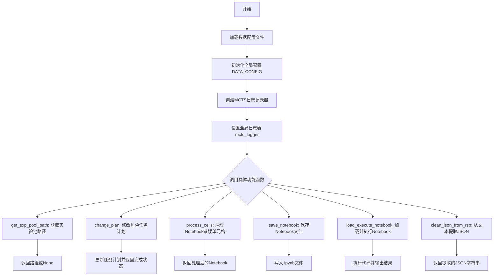
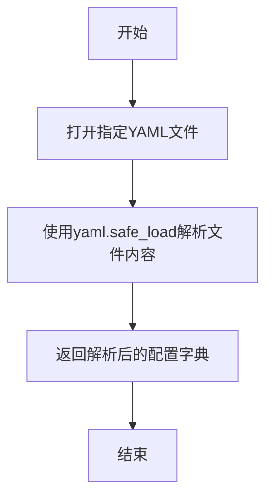
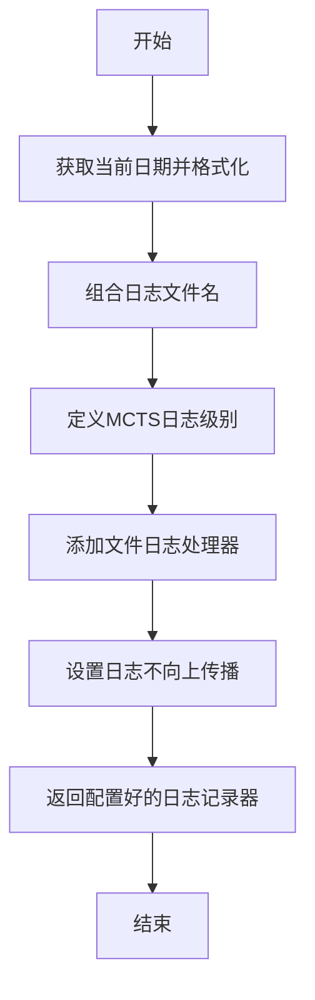
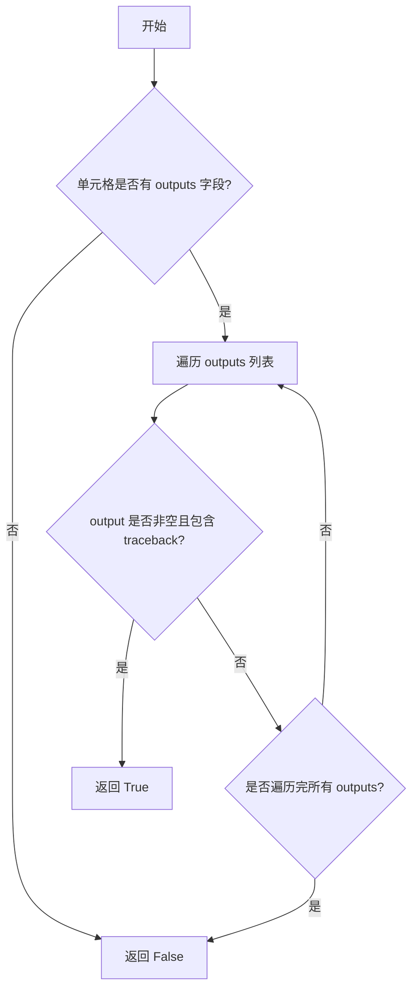
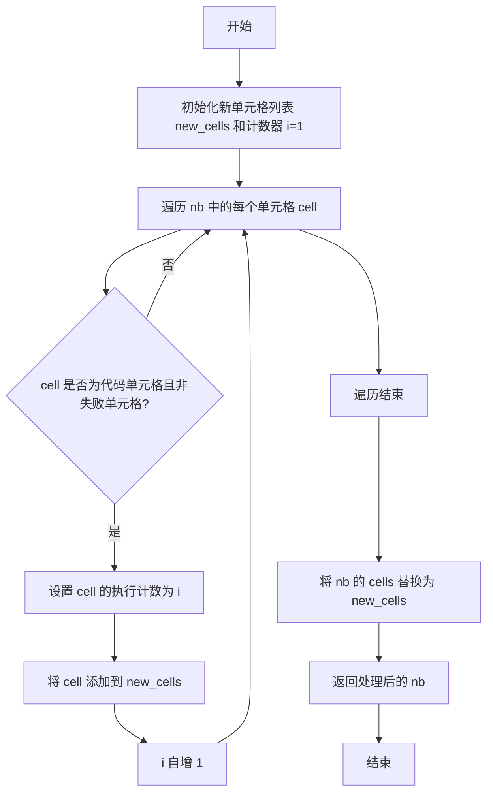
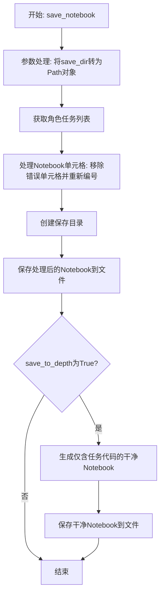
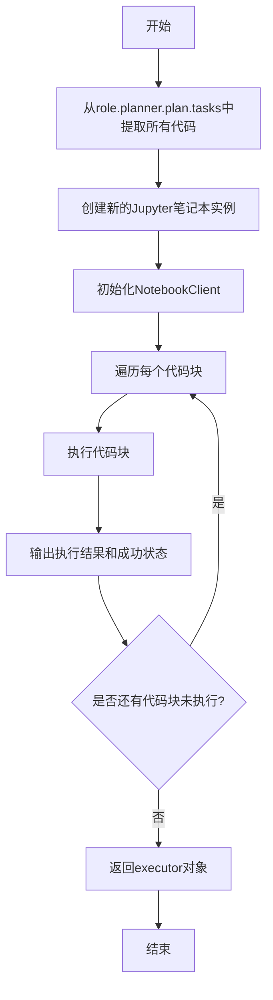

# `.\MetaGPT\metagpt\ext\sela\utils.py` 详细设计文档

该代码文件提供了一系列用于处理Jupyter Notebook、管理实验数据、配置日志以及辅助角色（Role）执行和保存代码的实用工具函数。核心功能包括：加载和管理数据集配置、创建和管理MCTS（蒙特卡洛树搜索）日志、处理Notebook单元格（如清理错误输出）、保存和加载执行Notebook，以及从文本响应中提取JSON数据。

## 整体流程



## 类结构

```
Notebook Utilities Module
├── Global Variables
│   ├── DATASET_CONFIG
│   ├── DATA_CONFIG
│   └── mcts_logger
├── Global Functions
│   ├── load_data_config
│   ├── get_mcts_logger
│   ├── get_exp_pool_path
│   ├── change_plan
│   ├── is_cell_to_delete
│   ├── process_cells
│   ├── save_notebook
│   ├── load_execute_notebook
│   └── clean_json_from_rsp
```

## 全局变量及字段


### `DATASET_CONFIG`
    
从 datasets.yaml 文件加载的配置字典，包含数据集的元信息。

类型：`dict`
    


### `DATA_CONFIG`
    
从 data.yaml 文件加载的配置字典，并合并了 DATASET_CONFIG 中的数据集信息，包含工作目录、角色目录等全局配置。

类型：`dict`
    


### `mcts_logger`
    
一个配置好的日志记录器实例，用于记录 MCTS（蒙特卡洛树搜索）相关的调试信息，日志文件保存在 DATA_CONFIG 指定的目录中。

类型：`loguru.logger`
    


    

## 全局函数及方法

### `load_data_config`

该函数用于从指定的YAML配置文件中读取数据配置，并将其解析为Python字典对象。

参数：

- `file_path`：`str`，可选参数，默认值为"data.yaml"，表示要读取的YAML配置文件的路径。

返回值：`dict`，返回从YAML文件中解析出的配置数据字典。

#### 流程图



#### 带注释源码

```python
def load_data_config(file_path="data.yaml"):
    # 使用上下文管理器打开指定路径的YAML文件
    with open(file_path, "r") as stream:
        # 使用yaml.safe_load安全地解析YAML文件内容为Python字典
        data_config = yaml.safe_load(stream)
    # 返回解析后的配置字典
    return data_config
```


### `get_mcts_logger`

该函数用于配置并返回一个专用于MCTS（蒙特卡洛树搜索）模块的日志记录器。它根据配置创建日志文件，设置日志级别和输出格式，并确保日志不会向上传播到父记录器。

参数：
- 无

返回值：`loguru.logger`，一个已配置好的日志记录器实例，用于记录MCTS相关的调试及运行信息。

#### 流程图



#### 带注释源码

```python
def get_mcts_logger():
    # 设置日志文件的记录级别为DEBUG，以捕获最详细的信息
    logfile_level = "DEBUG"
    # 预留的日志名前缀变量，当前为None
    name: str = None
    # 获取当前系统时间
    current_date = datetime.now()
    # 将日期格式化为“年月日”字符串，例如“20231027”
    formatted_date = current_date.strftime("%Y%m%d")
    # 组合日志文件名：如果提供了name前缀，则文件名为“{name}_{日期}.txt”，否则仅为“{日期}.txt”
    log_name = f"{name}_{formatted_date}" if name else formatted_date  # name a log with prefix name

    # 可选：移除所有现有的日志处理器（当前被注释掉）
    # _logger.remove()
    # 自定义一个名为“MCTS”的日志级别，颜色为绿色，级别数值为25（介于INFO和WARNING之间）
    _logger.level("MCTS", color="<green>", no=25)
    # 可选：添加控制台日志处理器（当前被注释掉）
    # _logger.add(sys.stderr, level=print_level)
    # 添加文件日志处理器。日志文件路径由配置项`work_dir`、`role_dir`和上面生成的`log_name`拼接而成。
    # 该处理器只记录级别等于或高于`logfile_level`（即DEBUG）的日志。
    _logger.add(Path(DATA_CONFIG["work_dir"]) / DATA_CONFIG["role_dir"] / f"{log_name}.txt", level=logfile_level)
    # 设置日志记录器不将日志消息传播给父记录器（如果有的话），避免重复记录。
    _logger.propagate = False
    # 返回配置完成的日志记录器对象
    return _logger
```


### `get_exp_pool_path`

根据给定的任务名称和数据配置，构建并返回实验池（analysis_pool）的JSON文件路径。如果该路径不存在，则返回None。

参数：

- `task_name`：`str`，任务名称，用于在数据配置中查找对应的数据集信息。
- `data_config`：`dict`，数据配置字典，包含数据集目录和数据集映射信息。
- `pool_name`：`str`，默认为"analysis_pool"，实验池文件的名称（不含扩展名）。

返回值：`str | None`，如果实验池文件存在，则返回其完整路径；否则返回None。

#### 流程图

```mermaid
flowchart TD
    A[开始] --> B{task_name 是否在<br>data_config['datasets']中?}
    B -- 是 --> C[获取对应数据集信息]
    B -- 否 --> D[抛出 ValueError 异常]
    C --> E[拼接数据集完整路径]
    E --> F[拼接实验池文件完整路径]
    F --> G{路径是否存在?}
    G -- 是 --> H[返回路径]
    G -- 否 --> I[返回 None]
    D --> J[结束]
    H --> J
    I --> J
```

#### 带注释源码

```python
def get_exp_pool_path(task_name, data_config, pool_name="analysis_pool"):
    # 从配置中获取数据集根目录
    datasets_dir = data_config["datasets_dir"]
    # 检查任务名称是否在配置的数据集列表中
    if task_name in data_config["datasets"]:
        # 获取该任务对应的数据集配置信息
        dataset = data_config["datasets"][task_name]
        # 拼接数据集的完整路径
        data_path = os.path.join(datasets_dir, dataset["dataset"])
    else:
        # 如果任务名称未找到，抛出异常并列出所有可用数据集
        raise ValueError(
            f"Dataset {task_name} not found in config file. Available datasets: {data_config['datasets'].keys()}"
        )
    # 在数据集路径下，拼接指定名称的JSON文件路径作为实验池路径
    exp_pool_path = os.path.join(data_path, f"{pool_name}.json")
    # 检查该路径对应的文件是否存在
    if not os.path.exists(exp_pool_path):
        # 如果文件不存在，返回None
        return None
    # 文件存在，返回完整路径
    return exp_pool_path
```

### `change_plan`

该函数用于修改一个角色（`role`）的当前任务计划。它会检查该角色任务列表（`tasks`）中第一个尚未编写代码（`code`）的任务，并将其计划（`plan`）更新为传入的新计划。如果所有任务都已编写了代码，则返回 `True`，表示计划修改完成；否则返回 `False`。

参数：
-  `role`：`Role`，包含任务计划（`planner.plan.tasks`）的角色对象。
-  `plan`：`str`，要设置的新计划内容。

返回值：`bool`，如果所有任务都已包含代码（即没有任务需要修改计划），则返回 `True`；否则返回 `False`。

#### 流程图

```mermaid
flowchart TD
    A[开始: change_plan(role, plan)] --> B[获取角色任务列表 tasks]
    B --> C[初始化 finished = True]
    C --> D[遍历 tasks]
    D --> E{当前 task.code 为空?}
    E -- 是 --> F[finished = False<br/>记录当前索引 i]
    E -- 否 --> G[继续遍历]
    G --> D
    F --> H{finished 为 False?}
    H -- 是 --> I[更新 tasks[i].plan = plan]
    H -- 否 --> J[跳过更新]
    I --> K[返回 finished]
    J --> K
```

#### 带注释源码

```python
def change_plan(role, plan):
    # 打印将要更改的计划内容
    print(f"Change next plan to: {plan}")
    # 从角色对象中获取任务列表
    tasks = role.planner.plan.tasks
    # 初始化一个标志，假设所有任务都已完成（即都有代码）
    finished = True
    # 遍历任务列表，查找第一个没有代码的任务
    for i, task in enumerate(tasks):
        if not task.code:
            # 找到未完成的任务，更新标志并记录其索引
            finished = False
            break
    # 如果存在未完成的任务（finished为False），则更新该任务的计划
    if not finished:
        tasks[i].plan = plan
    # 返回标志：True表示所有任务都有代码，无需/无法修改计划；False表示已修改了某个任务的计划
    return finished
```

### `is_cell_to_delete`

该函数用于判断一个 Jupyter Notebook 单元格是否应该被删除。它检查单元格的输出中是否包含“traceback”字段，如果存在则表明该单元格执行时发生了错误，应被标记为删除。

参数：

- `cell`：`NotebookNode`，一个 Jupyter Notebook 单元格对象，包含单元格的内容和输出信息。

返回值：`bool`，如果单元格应被删除则返回 `True`，否则返回 `False`。

#### 流程图



#### 带注释源码

```python
def is_cell_to_delete(cell: NotebookNode) -> bool:
    # 检查单元格是否有输出
    if "outputs" in cell:
        # 遍历所有输出
        for output in cell["outputs"]:
            # 如果输出非空且包含 traceback 字段，说明执行出错
            if output and "traceback" in output:
                return True
    # 如果没有输出或输出中没有 traceback，则不需要删除
    return False
```

### `process_cells`

该函数用于处理 Jupyter Notebook 的单元格，主要功能是过滤掉执行失败的代码单元格，并对保留的代码单元格重新编号执行顺序。

参数：

- `nb`：`NotebookNode`，表示一个 Jupyter Notebook 对象，包含多个单元格（cells）。

返回值：`NotebookNode`，返回处理后的 Jupyter Notebook 对象，其中失败的代码单元格已被移除，且保留的代码单元格执行顺序已重新编号。

#### 流程图



#### 带注释源码

```python
def process_cells(nb: NotebookNode) -> NotebookNode:
    # 初始化一个新的单元格列表，用于存储处理后的单元格
    new_cells = []
    # 初始化计数器 i，用于重新编号代码单元格的执行顺序
    i = 1
    # 遍历 Notebook 中的所有单元格
    for cell in nb["cells"]:
        # 检查当前单元格是否为代码单元格，并且不是需要删除的失败单元格
        if cell["cell_type"] == "code" and not is_cell_to_delete(cell):
            # 重新设置该代码单元格的执行计数为当前计数器 i 的值
            cell["execution_count"] = i
            # 将该单元格添加到新的单元格列表中
            new_cells.append(cell)
            # 计数器 i 自增，为下一个代码单元格准备
            i = i + 1
    # 将原始 Notebook 的单元格列表替换为处理后的新列表
    nb["cells"] = new_cells
    # 返回处理后的 Notebook 对象
    return nb
```


### `save_notebook`

该函数用于将角色（Role）执行代码生成的Jupyter Notebook内容保存到指定目录。它首先处理Notebook中的单元格，移除包含错误追踪的单元格并重新编号执行顺序，然后将处理后的Notebook写入文件。如果指定了`save_to_depth`参数，还会额外生成一个仅包含任务代码的“干净”版本Notebook。

参数：

- `role`：`Role`，包含任务计划和代码执行器的角色对象，用于获取Notebook内容和任务代码
- `save_dir`：`str`，保存Notebook文件的目录路径，默认为空字符串
- `name`：`str`，保存的Notebook文件名（不含扩展名），默认为空字符串
- `save_to_depth`：`bool`，是否额外生成仅包含任务代码的“干净”Notebook，默认为False

返回值：`None`，该函数不返回任何值，仅执行文件保存操作

#### 流程图



#### 带注释源码

```python
def save_notebook(role: Role, save_dir: str = "", name: str = "", save_to_depth=False):
    # 将保存目录字符串转换为Path对象以便路径操作
    save_dir = Path(save_dir)
    
    # 从角色对象中获取任务计划中的所有任务
    tasks = role.planner.plan.tasks
    
    # 处理Notebook单元格：移除包含错误追踪的单元格并重新编号执行顺序
    nb = process_cells(role.execute_code.nb)
    
    # 确保保存目录存在，如果不存在则创建
    os.makedirs(save_dir, exist_ok=True)
    
    # 构建完整的文件路径并保存处理后的Notebook
    file_path = save_dir / f"{name}.ipynb"
    nbformat.write(nb, file_path)

    # 如果指定了save_to_depth参数，则额外生成干净版本的Notebook
    if save_to_depth:
        # 构建干净Notebook的文件路径
        clean_file_path = save_dir / f"{name}_clean.ipynb"
        
        # 从所有任务中提取代码（仅包含有代码的任务）
        codes = [task.code for task in tasks if task.code]
        
        # 创建新的Notebook对象
        clean_nb = nbformat.v4.new_notebook()
        
        # 将所有任务代码作为新的代码单元格添加到干净Notebook中
        for code in codes:
            clean_nb.cells.append(nbformat.v4.new_code_cell(code))
        
        # 保存干净Notebook到文件
        nbformat.write(clean_nb, clean_file_path)
```


### `load_execute_notebook`

该函数是一个异步方法，用于加载并执行一个Jupyter笔记本。它首先从给定的`role`对象中提取所有任务的代码，然后创建一个新的Jupyter笔记本实例，并使用`NotebookClient`来执行这些代码。每个代码块执行后，会输出执行结果和成功状态。最后，返回包含执行结果的`executor`对象。

参数：

- `role`：`Role`，一个角色对象，包含任务计划（`planner.plan.tasks`）和执行代码的组件（`execute_code`）

返回值：`NotebookClient`，返回一个`NotebookClient`实例，该实例包含了执行后的笔记本状态和结果

#### 流程图



#### 带注释源码

```python
async def load_execute_notebook(role):
    # 从role对象的planner.plan.tasks中提取所有任务的代码
    tasks = role.planner.plan.tasks
    codes = [task.code for task in tasks if task.code]
    
    # 获取role对象的execute_code组件
    executor = role.execute_code
    
    # 创建一个新的Jupyter笔记本实例
    executor.nb = nbformat.v4.new_notebook()
    
    # 初始化NotebookClient，设置超时时间为role.role_timeout
    executor.nb_client = NotebookClient(executor.nb, timeout=role.role_timeout)
    
    # 遍历每个代码块并执行
    for code in codes:
        # 执行代码块，获取输出和成功状态
        outputs, success = await executor.run(code)
        # 打印执行结果
        print(f"Execution success: {success}, Output: {outputs}")
    
    # 打印执行完成信息
    print("Finish executing the loaded notebook")
    
    # 返回包含执行结果的executor对象
    return executor
```

### `clean_json_from_rsp`

该函数用于从一段文本中提取被包裹在 Markdown 代码块标记 ````json` 和 ```` 之间的 JSON 字符串内容。它会移除代码块标记本身，并将所有匹配到的 JSON 块合并为一个字符串返回。如果未找到任何匹配项，则返回空字符串。

参数：
- `text`：`str`，需要处理的原始文本字符串。

返回值：`str`，提取并合并后的 JSON 字符串。如果未找到匹配项，则返回空字符串 `""`。

#### 流程图

```mermaid
flowchart TD
    A[开始: clean_json_from_rsp(text)] --> B{使用正则表达式查找\n所有 ```json ... ``` 块};
    B --> C{是否找到匹配项?};
    C -- 是 --> D[将所有匹配到的内容\n用换行符连接];
    D --> E[返回连接后的字符串];
    C -- 否 --> F[返回空字符串];
    E --> G[结束];
    F --> G;
```

#### 带注释源码

```python
def clean_json_from_rsp(text):
    # 定义正则表达式模式，用于匹配被 ```json 和 ``` 包裹的内容
    # re.DOTALL 标志使 '.' 匹配包括换行符在内的所有字符
    pattern = r"```json(.*?)```"
    # 使用 re.findall 查找所有非重叠的匹配项
    matches = re.findall(pattern, text, re.DOTALL)
    # 判断是否找到匹配项
    if matches:
        # 如果找到，将所有匹配到的内容用换行符连接成一个字符串
        json_str = "\n".join(matches)
        return json_str
    else:
        # 如果没有找到任何匹配项，返回空字符串
        return ""
```

## 关键组件


### 数据配置加载与管理

通过 `load_data_config` 函数和全局变量 `DATASET_CONFIG`、`DATA_CONFIG` 实现，负责从 YAML 配置文件（`data.yaml` 和 `datasets.yaml`）中加载数据路径、工作目录、数据集定义等配置信息，并进行合并，为整个系统提供统一的配置访问入口。

### 日志系统

通过 `get_mcts_logger` 函数和全局变量 `mcts_logger` 实现，负责初始化并配置一个基于 `loguru` 的日志记录器。该记录器将日志输出到由配置指定的工作目录和角色目录下的日期化文件中，并支持自定义日志级别和颜色，用于记录 MCTS（蒙特卡洛树搜索）等关键过程的运行信息。

### Jupyter Notebook 处理与执行

包含 `process_cells`、`save_notebook` 和 `load_execute_notebook` 等函数，负责处理 Jupyter Notebook 的代码单元。功能包括：清理包含错误追踪（`traceback`）的失败单元、重新编排执行序号、将角色（`Role`）执行生成的代码保存为 `.ipynb` 文件，以及异步加载并执行任务代码以重建 Notebook 执行状态。

### 任务与计划管理

通过 `change_plan` 函数实现，负责在角色（`Role`）的执行流程中动态修改其计划（`plan`）。它会检查当前任务列表的完成状态，并为第一个未完成的任务更新其计划内容，从而实现对自动化工作流的干预和引导。

### 文本内容清洗

通过 `clean_json_from_rsp` 函数实现，负责使用正则表达式从文本响应中提取被 ````json` 和 ```` 标记包裹的 JSON 字符串。这是一个用于解析和清洗 LLM（大语言模型）等组件返回的文本响应的工具函数，确保下游处理能获得结构化的 JSON 数据。


## 问题及建议


### 已知问题

-   **硬编码的配置文件路径**：`load_data_config` 函数默认加载当前目录下的 `data.yaml` 和 `datasets.yaml` 文件。这降低了代码的灵活性和可配置性，当文件位置或命名规则改变时，需要修改多处代码。
-   **日志配置的潜在冲突**：`get_mcts_logger` 函数修改了全局的 `_logger` 对象（例如添加了新的日志级别和文件处理器），但并未移除可能已存在的处理器。如果此函数被多次调用，可能会导致日志被重复记录到多个文件或控制台，产生冗余输出。
-   **不完整的错误处理**：`get_exp_pool_path` 函数在找不到文件时返回 `None`，但调用方可能未对此情况进行处理，可能导致后续操作因 `None` 值而失败。`load_data_config` 函数在文件不存在或格式错误时会直接抛出异常，缺乏更友好的错误提示或降级处理。
-   **潜在的竞态条件**：`save_notebook` 函数中，`os.makedirs(save_dir, exist_ok=True)` 在多进程或多线程环境下创建目录是安全的，但后续的文件写入操作 `nbformat.write` 并非原子操作。如果多个进程同时写入同一文件，可能导致文件内容损坏或不一致。
-   **代码执行状态判断逻辑不严谨**：`change_plan` 函数通过检查 `task.code` 是否存在来判断任务是否完成。这假设了所有任务都必须有代码，且代码生成即代表任务完成。如果存在没有代码的任务（如纯分析任务）或代码生成后执行失败，此逻辑可能失效。
-   **内存使用效率**：`load_execute_notebook` 函数会一次性加载所有任务的代码（`codes = [task.code for task in tasks if task.code]`）并顺序执行。如果任务数量非常多或代码量巨大，可能会占用较多内存。同时，顺序执行可能无法充分利用多核CPU资源。

### 优化建议

-   **配置文件路径参数化**：将 `load_data_config` 函数的默认文件路径改为可配置参数，或通过环境变量、命令行参数等方式传入。这提高了代码在不同部署环境下的适应性。
-   **改进日志初始化逻辑**：在 `get_mcts_logger` 函数中，确保每次调用时先清理（`_logger.remove()`）再添加新的处理器，或者设计为单例模式，确保日志配置只初始化一次。同时，考虑将日志级别、格式、文件路径等也作为可配置项。
-   **增强错误处理与资源管理**：
    -   在 `load_data_config` 中使用 `try-except` 块捕获 `FileNotFoundError` 和 `yaml.YAMLError`，并提供更清晰的错误信息或返回默认配置。
    -   在 `get_exp_pool_path` 中，明确返回 `None` 的场景，并在调用方进行判空处理，或考虑抛出更具业务语义的异常（如 `ExpPoolNotFoundError`）。
    -   对于文件写入操作（如 `save_notebook`），可以考虑使用临时文件写入，完成后通过原子操作（如 `os.rename`）替换目标文件，以避免写入过程中的部分可见或损坏。
-   **优化任务状态管理**：为 `Task` 类引入明确的状态枚举（如 `PENDING`, `CODE_GENERATED`, `EXECUTING`, `SUCCESS`, `FAILED`），并在 `change_plan` 等函数中基于状态进行逻辑判断，使业务逻辑更清晰、健壮。
-   **提升执行效率与资源利用**：
    -   在 `load_execute_notebook` 中，可以考虑对独立的任务代码进行并行执行（例如使用 `asyncio.gather`），前提是任务间没有依赖关系。对于有依赖的任务，可以构建依赖图并按拓扑顺序执行。
    -   对于大型代码块的执行，可以考虑流式处理或分块加载，避免一次性占用过多内存。
-   **代码清理函数增强**：`clean_json_from_rsp` 函数目前只处理被 ````json` 和 ```` 包裹的内容。建议增强其鲁棒性，例如处理没有标记的JSON字符串，或提供更灵活的正则模式。同时，考虑将解析后的字符串进行 `json.loads` 验证，确保其是有效的JSON。
-   **增加类型注解与文档**：为函数和关键变量添加更详细的类型注解（Type Hints），并编写清晰的文档字符串（docstring）。这能显著提升代码的可读性、可维护性，并方便IDE进行智能提示和静态类型检查。


## 其它


### 设计目标与约束

本模块的核心设计目标是提供一个用于管理和执行Jupyter Notebook代码的辅助工具集，作为MetaGPT框架中角色（Role）执行代码任务的支撑组件。其主要约束包括：1) 必须与MetaGPT的`Role`类及其内部结构（如`planner.plan.tasks`、`execute_code`）紧密集成；2) 需要处理来自外部YAML配置文件的动态数据路径和日志设置；3) 执行环境需兼容异步操作（`async/await`）；4) 生成的Notebook文件需保持标准格式（nbformat）并可被Jupyter环境正确识别。

### 错误处理与异常设计

模块的错误处理策略较为基础，主要依赖于Python的标准异常机制。在`get_exp_pool_path`函数中，当指定的`task_name`不在配置中时，会抛出`ValueError`。在`load_data_config`函数中，依赖`yaml.safe_load`，可能抛出YAML解析或文件IO相关的异常。`load_execute_notebook`函数中的`executor.run`调用可能因代码执行错误而失败，但当前仅打印`success`状态，未进行更上层的异常传播或恢复处理。整体缺乏统一的错误日志记录（虽然配置了logger但未在关键函数中使用）和重试机制。

### 数据流与状态机

数据流始于`DATA_CONFIG`和`DATASET_CONFIG`的加载，它们定义了工作目录、数据集路径等静态配置。核心数据对象是MetaGPT `Role`实例，其`planner.plan.tasks`属性承载了待执行的代码任务序列。主要流程包括：1) **配置加载流**：YAML -> 字典；2) **任务执行流**：`Role.tasks.code` -> `executor.run` -> 输出；3) **文件生成流**：`Role`状态（含执行后的Notebook节点） -> `process_cells`清洗 -> `nbformat.write`写入.ipynb文件；4) **路径解析流**：`task_name` + `data_config` -> `get_exp_pool_path` -> 文件系统路径。模块本身不维护复杂的状态机，状态主要由外部的`Role`对象管理。

### 外部依赖与接口契约

1.  **显式依赖**：
    *   `nbformat`, `nbclient`: 用于Notebook的创建、读写和执行。契约：遵循Jupyter Notebook的JSON结构（NotebookNode）。
    *   `yaml`: 用于解析配置文件。契约：配置文件需为合法的YAML格式。
    *   `loguru`: 用于日志记录。契约：通过`_logger`单例对象提供日志接口。
    *   `metagpt.roles.role.Role`: 核心操作对象。契约：`Role`对象必须包含`planner.plan.tasks`（列表，元素有`code`属性）、`execute_code`（有`nb`和`nb_client`属性）、`role_timeout`属性。
2.  **隐式依赖**：
    *   文件系统：用于读写配置文件、数据集文件、日志文件和生成的.ipynb文件。
    *   异步运行时环境：`asyncio`，因为`load_execute_notebook`是异步函数。
3.  **配置契约**：
    *   `data.yaml` 和 `datasets.yaml` 需包含特定的键，如`work_dir`、`role_dir`、`datasets_dir`、`datasets`（字典）等，供`load_data_config`和`get_exp_pool_path`使用。

### 安全与合规性考虑

1.  **代码执行安全**：`load_execute_notebook`函数通过`nbclient.NotebookClient`执行任意来自`Role.tasks.code`的代码，这存在严重的安全风险。代码可能包含恶意操作。当前设计完全信任输入源，在生产环境中需增加沙箱隔离或严格的代码审查与过滤机制。
2.  **配置注入**：从YAML文件加载配置，如果文件来源不可信，可能遭受YAML反序列化攻击。虽然使用了`yaml.safe_load`缓解了部分风险，但最佳实践是验证配置内容的结构和值。
3.  **路径遍历**：`get_exp_pool_path`和`save_notebook`函数通过拼接用户或配置提供的字符串生成文件路径，存在潜在的路径遍历风险（如`../../../etc/passwd`）。需要使用`os.path.normpath`进行规范化检查，或更严格地使用`pathlib.Path`进行路径解析和限制。
4.  **日志信息泄露**：日志文件可能记录代码执行内容、路径等敏感信息。需要明确日志级别和内容的敏感性，并确保日志文件的存储权限适当。

### 测试策略建议

1.  **单元测试**：
    *   `load_data_config`: 测试正常加载、文件不存在、YAML格式错误等情况。
    *   `get_exp_pool_path`: 测试`task_name`存在/不存在、`pool_name`文件存在/不存在等分支。
    *   `is_cell_to_delete` / `process_cells`: 测试包含`traceback`的cell被正确过滤，以及`execution_count`的重置逻辑。
    *   `clean_json_from_rsp`: 测试从包含` ```json `标记的文本中正确提取JSON字符串。
2.  **集成测试**：
    *   `save_notebook`: 模拟一个`Role`对象及其任务，测试生成的.ipynb文件格式正确，且`save_to_depth`选项能生成干净的Notebook。
    *   `load_execute_notebook`: 在测试环境中异步执行一段简单的安全代码（如`print('hello')`），验证执行流程和输出捕获。
3.  **模拟（Mocking）**：测试时应大量使用Mock对象来模拟`Role`、`NotebookClient`、文件系统操作（`os.path.exists`, `nbformat.write`）和异步调用，以避免对真实环境和外部服务的依赖。
4.  **配置测试**：确保代码在`DATA_CONFIG`键缺失或格式不正确时的健壮性。

    