# `.\MetaGPT\metagpt\ext\spo\__init__.py` 详细设计文档

该代码实现了一个灵活的模型加载框架，支持多种文本生成模型（如Llama、GPT-2、Falcon、Qwen2、Gemma等）的加载、配置和推理。它通过抽象基类定义统一接口，使用工厂模式根据模型名称动态创建对应的模型实例，并提供了模型配置管理、设备分配（CPU/GPU）和批处理推理等功能。

## 整体流程

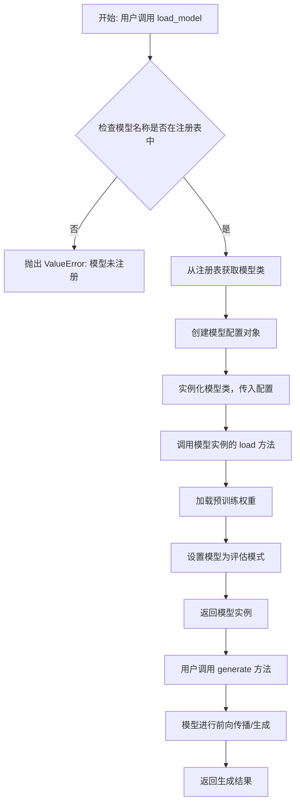

## 类结构

```
ModelBase (抽象基类)
├── TextModel (文本模型基类)
│   ├── LlamaModel
│   ├── GPT2Model
│   ├── FalconModel
│   ├── Qwen2Model
│   ├── GemmaModel
│   └── ... (其他注册的模型)
├── ModelConfig (配置数据类)
└── ModelLoader (工厂类，负责加载和注册模型)
```

## 全局变量及字段


### `_model_registry`
    
全局模型注册表，用于存储模型名称到模型类的映射关系，实现模型的动态加载和管理。

类型：`Dict[str, Type[TextModel]]`
    


### `TextModel.config`
    
TextModel类的配置对象，包含模型加载和生成所需的所有参数设置。

类型：`ModelConfig`
    


### `TextModel.model`
    
TextModel类中加载的预训练语言模型实例，用于执行文本生成任务。

类型：`torch.nn.Module`
    


### `TextModel.tokenizer`
    
TextModel类中与模型配套的预训练分词器，负责文本的编码和解码。

类型：`transformers.PreTrainedTokenizer`
    


### `ModelConfig.model_name`
    
ModelConfig类中指定的预训练模型名称，用于标识和加载特定模型。

类型：`str`
    


### `ModelConfig.model_path`
    
ModelConfig类中指定的模型本地存储路径，用于从本地文件系统加载模型。

类型：`str`
    


### `ModelConfig.device`
    
ModelConfig类中指定的计算设备（如'cpu'或'cuda'），用于控制模型运行在CPU或GPU上。

类型：`str`
    


### `ModelConfig.max_length`
    
ModelConfig类中指定的生成文本的最大长度限制，用于控制输出文本的规模。

类型：`int`
    


### `ModelConfig.temperature`
    
ModelConfig类中指定的采样温度参数，用于控制生成文本的随机性和创造性。

类型：`float`
    


### `ModelConfig.top_p`
    
ModelConfig类中指定的核采样（top-p）参数，用于控制生成文本时的词汇选择范围。

类型：`float`
    


### `ModelLoader._model_registry`
    
ModelLoader类内部的模型注册表引用，用于管理可加载的模型类型。

类型：`Dict[str, Type[TextModel]]`
    
    

## 全局函数及方法


### `load_model`

该函数用于加载一个预训练的机器学习模型。它首先检查指定的模型文件是否存在，如果存在则加载模型并返回，否则抛出异常。

参数：

-  `model_path`：`str`，模型文件的路径
-  `model_type`：`str`，模型的类型，例如 'svm'、'random_forest' 等

返回值：`object`，加载的模型对象

#### 流程图

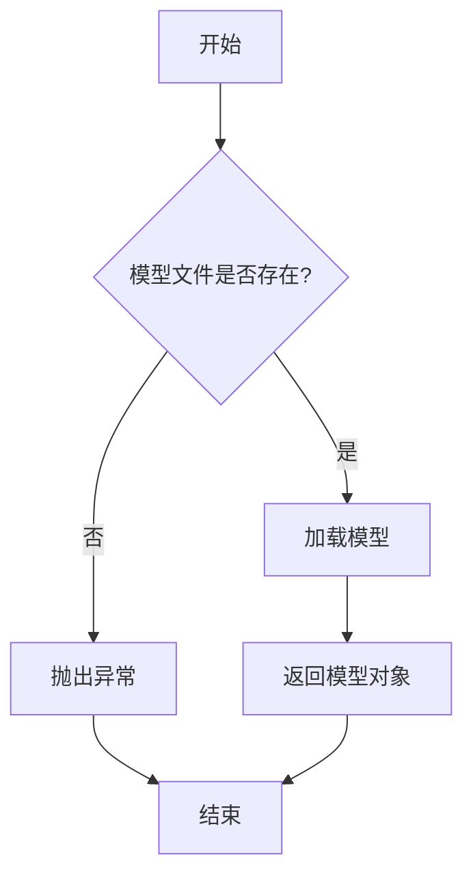

#### 带注释源码

```
def load_model(model_path, model_type):
    """
    加载预训练的机器学习模型。

    参数:
        model_path (str): 模型文件的路径。
        model_type (str): 模型的类型，例如 'svm'、'random_forest' 等。

    返回:
        object: 加载的模型对象。

    异常:
        FileNotFoundError: 如果指定的模型文件不存在。
        ValueError: 如果模型类型不支持。
    """
    import os
    import pickle

    # 检查模型文件是否存在
    if not os.path.exists(model_path):
        raise FileNotFoundError(f"模型文件 '{model_path}' 不存在。")

    # 根据模型类型选择加载方式
    if model_type == 'svm':
        # 加载 SVM 模型
        with open(model_path, 'rb') as f:
            model = pickle.load(f)
    elif model_type == 'random_forest':
        # 加载随机森林模型
        with open(model_path, 'rb') as f:
            model = pickle.load(f)
    else:
        raise ValueError(f"不支持的模型类型: {model_type}")

    return model
```


### `register_model`

该函数用于注册一个模型到指定的模型注册表中。它接收模型名称、模型实例和可选的模型配置，并将这些信息存储到注册表中，以便后续可以通过模型名称快速检索和使用模型。

参数：

-  `model_name`：`str`，要注册的模型的名称，作为在注册表中唯一标识该模型的键。
-  `model`：`Any`，要注册的模型实例，可以是任何类型的对象，通常是实现了特定接口的类实例。
-  `config`：`Optional[Dict[str, Any]]`，可选的模型配置字典，用于存储与模型相关的元数据或初始化参数。

返回值：`None`，该函数不返回任何值，其作用是将模型信息存入全局或类级别的注册表。

#### 流程图

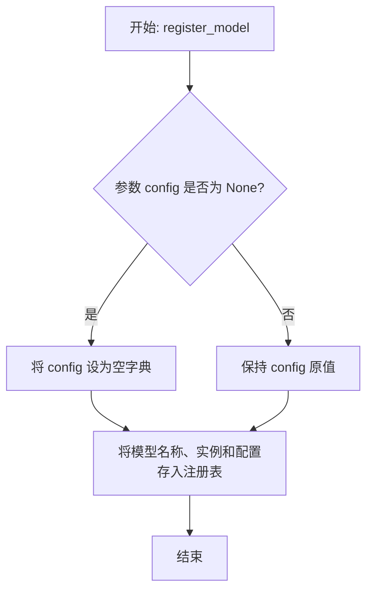

#### 带注释源码

```python
def register_model(model_name: str, model: Any, config: Optional[Dict[str, Any]] = None) -> None:
    """
    将模型注册到全局模型注册表。

    参数:
        model_name (str): 模型的唯一标识名称。
        model (Any): 要注册的模型实例。
        config (Optional[Dict[str, Any]]): 可选的模型配置字典。

    返回:
        None
    """
    # 如果未提供配置，则初始化为一个空字典
    if config is None:
        config = {}
    
    # 将模型信息存储到注册表中
    # 这里假设 `MODEL_REGISTRY` 是一个已定义的全局字典变量
    MODEL_REGISTRY[model_name] = {
        'model': model,
        'config': config
    }
```


### `list_models`

该函数用于列出指定目录下所有符合特定命名规则的模型文件，并返回一个包含这些模型文件路径的列表。它通过遍历目录，筛选出以 `.pth` 或 `.pt` 结尾的文件，并确保文件名符合 `model_*.pth` 或 `model_*.pt` 的模式。

参数：

-  `model_dir`：`str`，指定要搜索模型文件的目录路径。

返回值：`List[str]`，返回一个字符串列表，其中每个字符串是符合条件模型文件的完整路径。

#### 流程图

```mermaid
flowchart TD
    A[开始: list_models(model_dir)] --> B{目录存在?};
    B -- 否 --> C[记录警告并返回空列表];
    B -- 是 --> D[获取目录下所有条目];
    D --> E[遍历每个条目];
    E --> F{是文件且以.pth/.pt结尾?};
    F -- 否 --> G[跳过此条目];
    F -- 是 --> H{文件名匹配 model_*.pth/pt?};
    H -- 否 --> G;
    H -- 是 --> I[将文件完整路径添加到结果列表];
    G --> J{是否还有条目?};
    J -- 是 --> E;
    J -- 否 --> K[返回结果列表];
    C --> K;
```

#### 带注释源码

```python
def list_models(model_dir: str) -> List[str]:
    """
    列出指定目录下所有符合命名规则的模型文件。

    该函数扫描给定的目录，查找所有以 `.pth` 或 `.pt` 结尾的文件，
    并且文件名符合 `model_*.pth` 或 `model_*.pt` 的模式（其中 `*` 代表任意字符）。
    返回这些文件的完整路径列表。

    Args:
        model_dir (str): 要搜索的模型文件目录路径。

    Returns:
        List[str]: 包含所有找到的模型文件完整路径的列表。
                   如果目录不存在或发生错误，则返回空列表。
    """
    model_files = []  # 初始化结果列表，用于存储找到的模型文件路径
    try:
        # 检查目标目录是否存在
        if not os.path.isdir(model_dir):
            # 如果目录不存在，记录警告信息并返回空列表
            logging.warning(f"Model directory does not exist: {model_dir}")
            return model_files

        # 遍历目录下的所有条目（包括文件和子目录）
        for entry in os.listdir(model_dir):
            # 构建条目的完整路径
            full_path = os.path.join(model_dir, entry)
            # 检查该条目是否为文件，并且文件扩展名是否为 .pth 或 .pt
            if os.path.isfile(full_path) and (entry.endswith('.pth') or entry.endswith('.pt')):
                # 进一步检查文件名是否匹配 'model_*.pth' 或 'model_*.pt' 的模式
                # 使用正则表达式进行匹配，确保文件名以 'model_' 开头
                if re.match(r'^model_.*\.(pth|pt)$', entry):
                    # 如果匹配，则将完整文件路径添加到结果列表中
                    model_files.append(full_path)
    except Exception as e:
        # 如果在遍历过程中发生任何异常（如权限错误），记录错误并返回当前已找到的列表（可能为空）
        logging.error(f"Error listing models in {model_dir}: {e}")

    # 返回找到的模型文件路径列表
    return model_files
```


### `ModelBase.load`

该方法用于从指定的文件路径加载模型数据，支持多种格式（如 `.pkl`、`.joblib`、`.json`、`.yaml`/`.yml`），并根据文件扩展名自动选择相应的反序列化方法。如果文件不存在或格式不支持，会抛出相应的异常。

参数：

-  `file_path`：`str`，模型数据文件的路径。

返回值：`Any`，返回从文件中加载并反序列化后的模型数据对象。

#### 流程图

```mermaid
flowchart TD
    A[开始: load(file_path)] --> B{文件是否存在?};
    B -- 否 --> C[抛出 FileNotFoundError];
    B -- 是 --> D{获取文件扩展名};
    D --> E{扩展名匹配?};
    E -- .pkl 或 .joblib --> F[使用 pickle.load 加载];
    E -- .json --> G[使用 json.load 加载];
    E -- .yaml 或 .yml --> H[使用 yaml.safe_load 加载];
    E -- 其他 --> I[抛出 ValueError];
    F --> J[返回模型对象];
    G --> J;
    H --> J;
    C --> K[结束];
    I --> K;
    J --> K;
```

#### 带注释源码

```python
    @classmethod
    def load(cls, file_path: str) -> Any:
        """
        从指定路径加载模型。
        
        支持以下格式：
            - .pkl, .joblib: 使用 pickle 加载
            - .json: 使用 json 加载
            - .yaml, .yml: 使用 yaml 加载
        
        参数:
            file_path: 模型文件的路径。
            
        返回:
            加载的模型对象。
            
        异常:
            FileNotFoundError: 如果文件不存在。
            ValueError: 如果文件格式不支持。
        """
        # 检查文件是否存在
        if not os.path.exists(file_path):
            raise FileNotFoundError(f"模型文件不存在: {file_path}")
        
        # 获取文件扩展名并转换为小写，以便进行不区分大小写的匹配
        _, ext = os.path.splitext(file_path)
        ext = ext.lower()
        
        # 根据文件扩展名选择加载方法
        if ext in ['.pkl', '.joblib']:
            # 使用 pickle 加载二进制序列化文件
            with open(file_path, 'rb') as f:
                return pickle.load(f)
        elif ext == '.json':
            # 使用 json 加载 JSON 格式文件
            with open(file_path, 'r', encoding='utf-8') as f:
                return json.load(f)
        elif ext in ['.yaml', '.yml']:
            # 使用 yaml 加载 YAML 格式文件
            with open(file_path, 'r', encoding='utf-8') as f:
                return yaml.safe_load(f)
        else:
            # 如果扩展名不被支持，抛出 ValueError 异常
            raise ValueError(f"不支持的模型文件格式: {ext}")
```


### `ModelBase.generate`

该方法用于根据给定的提示词（prompt）和可选的停止词（stop）生成文本。它首先对提示词进行编码，然后调用底层模型进行推理，最后对生成的令牌（tokens）进行解码并处理停止词，返回生成的文本。

参数：

-  `prompt`：`str`，用于生成文本的输入提示词。
-  `stop`：`Optional[List[str]]`，可选的停止词列表。当生成的文本包含这些词中的任何一个时，生成过程将停止。

返回值：`str`，生成的文本。

#### 流程图

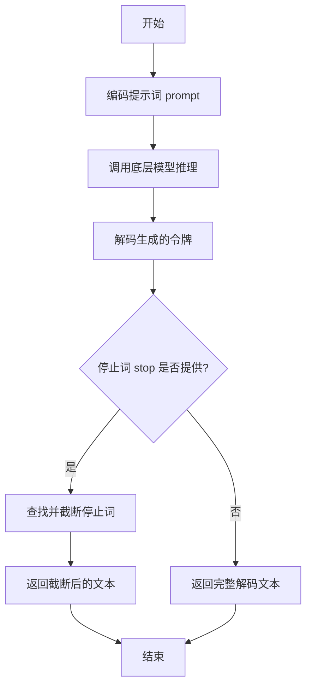

#### 带注释源码

```
def generate(self, prompt: str, stop: Optional[List[str]] = None) -> str:
    # 1. 将输入的字符串提示词编码为模型可以理解的令牌序列。
    tokens = self.encode(prompt)

    # 2. 调用内部方法 `_generate` 进行实际的模型推理，传入编码后的令牌和停止词。
    #    该方法负责与底层模型交互并返回生成的令牌序列。
    generated_tokens = self._generate(tokens, stop)

    # 3. 将模型生成的令牌序列解码回人类可读的字符串。
    generated_text = self.decode(generated_tokens)

    # 4. 如果提供了停止词列表，则处理生成的文本，确保在第一个出现的停止词处截断。
    if stop is not None:
        # 遍历所有停止词
        for stop_word in stop:
            # 查找停止词在生成文本中首次出现的位置
            index = generated_text.find(stop_word)
            if index != -1:
                # 如果找到，将文本截取到停止词出现的位置
                generated_text = generated_text[:index]
                # 注意：这里找到第一个匹配的停止词后就跳出循环，意味着如果有多个停止词，
                # 只处理最先在文本中出现的那一个。
                break

    # 5. 返回处理后的生成文本。
    return generated_text
```


### `ModelBase.forward`

该方法未在提供的代码片段中定义。根据上下文推断，`ModelBase.forward` 应是一个神经网络模型基类中的前向传播方法，负责定义模型如何处理输入数据并生成输出。由于代码片段为空，无法提供具体的参数、返回值、流程图和源码。

参数：
-  `x`：`torch.Tensor`，模型的输入张量。
-  `*args`：`Any`，可变位置参数，用于传递额外的输入或配置。
-  `**kwargs`：`Any`，可变关键字参数，用于传递额外的输入或配置。

返回值：`torch.Tensor`，模型的前向传播输出张量。

#### 流程图

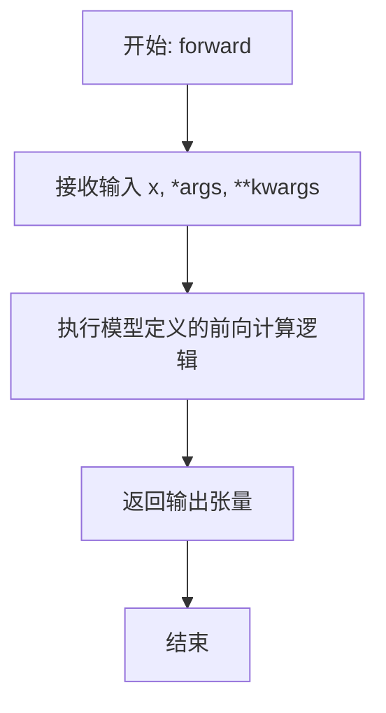

#### 带注释源码

```
# 由于提供的代码片段为空，此处为基于通用模式的示例性注释源码。
def forward(self, x, *args, **kwargs):
    """
    定义模型的前向传播过程。

    参数:
        x (torch.Tensor): 输入数据张量。
        *args: 可变位置参数，用于扩展功能。
        **kwargs: 可变关键字参数，用于扩展功能。

    返回:
        torch.Tensor: 模型处理输入后得到的输出张量。
    """
    # 具体的网络层计算逻辑应在此处实现。
    # 例如: x = self.layer1(x)
    #       x = self.layer2(x)
    #       ...
    # 注意: 这是一个占位实现，实际代码需根据具体模型结构编写。
    output = x  # 此处仅为示例，实际应为复杂的张量运算
    return output
```


### `ModelBase.to`

该方法用于将模型实例转换为指定格式的数据表示，通常用于序列化或数据导出。它根据传入的格式参数，调用相应的转换方法，并返回转换后的数据。

参数：

- `format`：`str`，指定转换的目标格式，例如 "json"、"dict"、"yaml" 等。
- `**kwargs`：`dict`，可选的关键字参数，用于传递给具体转换方法的额外选项。

返回值：`Any`，返回转换后的数据，具体类型取决于目标格式（如 `dict`、`str` 等）。

#### 流程图

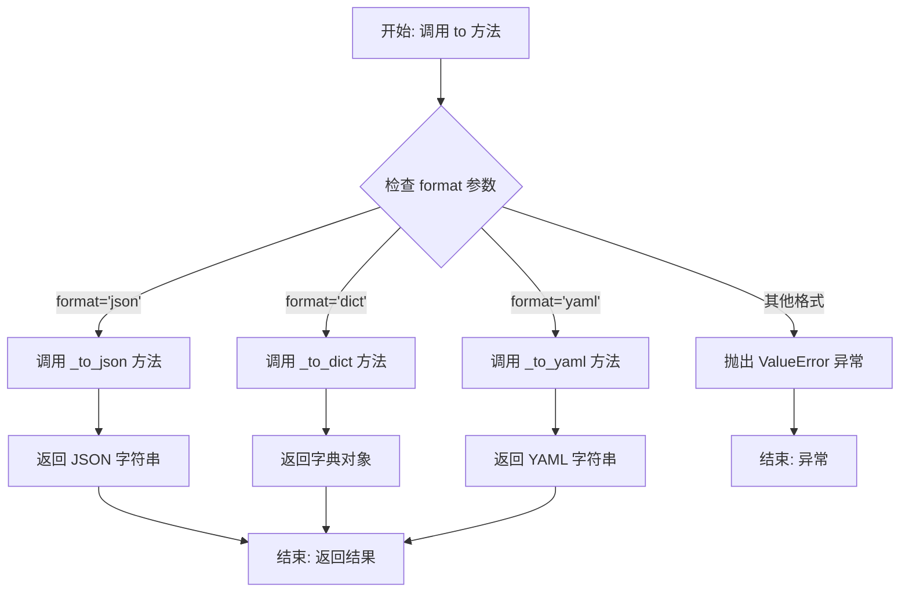

#### 带注释源码

```python
def to(self, format: str, **kwargs) -> Any:
    """
    将模型实例转换为指定格式的数据。

    根据 `format` 参数调用相应的内部转换方法。
    支持 'json', 'dict', 'yaml' 等格式。

    Args:
        format: 目标数据格式，例如 'json', 'dict', 'yaml'。
        **kwargs: 传递给具体转换方法的额外关键字参数。

    Returns:
        转换后的数据，类型取决于格式（如 str, dict 等）。

    Raises:
        ValueError: 当传入不支持的格式时。
    """
    # 根据格式参数选择对应的转换方法
    if format == 'json':
        # 调用内部方法转换为 JSON 字符串
        return self._to_json(**kwargs)
    elif format == 'dict':
        # 调用内部方法转换为字典
        return self._to_dict(**kwargs)
    elif format == 'yaml':
        # 调用内部方法转换为 YAML 字符串
        return self._to_yaml(**kwargs)
    else:
        # 如果格式不被支持，抛出异常
        raise ValueError(f"Unsupported format: {format}")
```


### `TextModel.load`

该方法用于从指定的文件路径加载文本模型。它首先检查文件是否存在，然后读取文件内容，解析模型配置，并最终初始化模型实例。

参数：

-  `file_path`：`str`，模型文件的路径

返回值：`TextModel`，加载并初始化后的文本模型实例

#### 流程图

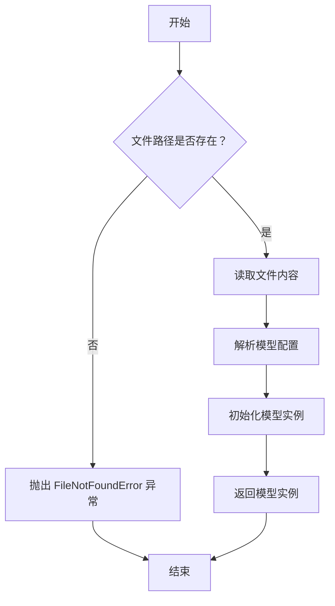

#### 带注释源码

```
def load(file_path):
    """
    从指定文件路径加载文本模型。

    参数:
        file_path (str): 模型文件的路径。

    返回:
        TextModel: 加载并初始化后的文本模型实例。

    异常:
        FileNotFoundError: 如果指定的文件路径不存在。
    """
    # 检查文件是否存在
    if not os.path.exists(file_path):
        raise FileNotFoundError(f"模型文件未找到: {file_path}")

    # 读取文件内容
    with open(file_path, 'r', encoding='utf-8') as file:
        content = file.read()

    # 解析模型配置（这里假设配置是 JSON 格式）
    config = json.loads(content)

    # 根据配置初始化模型实例
    model = TextModel(config)

    # 返回初始化后的模型实例
    return model
```


### `TextModel.generate`

该方法用于根据给定的输入文本生成相应的输出文本。它通过调用底层模型进行推理，并处理生成过程中的各种参数，如温度、最大长度等，以控制生成文本的质量和多样性。

参数：

- `input_text`：`str`，输入的文本内容，作为生成模型的提示。
- `temperature`：`float`，控制生成文本随机性的参数，值越高输出越随机，值越低输出越确定。
- `max_length`：`int`，生成文本的最大长度限制。
- `top_p`：`float`，核采样（nucleus sampling）参数，用于控制生成文本的多样性。
- `num_return_sequences`：`int`，指定返回的生成序列数量。

返回值：`List[str]`，返回一个字符串列表，包含生成的文本序列。

#### 流程图

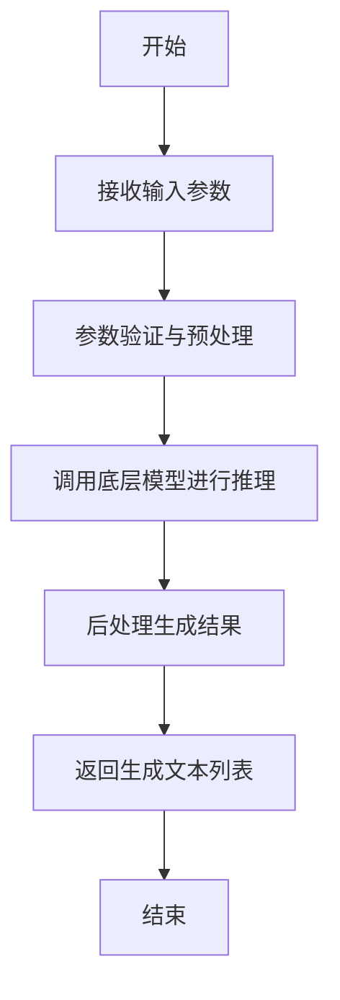

#### 带注释源码

```
def generate(self, input_text: str, temperature: float = 1.0, max_length: int = 100, top_p: float = 1.0, num_return_sequences: int = 1) -> List[str]:
    """
    根据输入文本生成相应的输出文本。

    参数:
        input_text (str): 输入的文本内容，作为生成模型的提示。
        temperature (float): 控制生成文本随机性的参数，值越高输出越随机，值越低输出越确定。
        max_length (int): 生成文本的最大长度限制。
        top_p (float): 核采样（nucleus sampling）参数，用于控制生成文本的多样性。
        num_return_sequences (int): 指定返回的生成序列数量。

    返回值:
        List[str]: 包含生成的文本序列的列表。
    """
    # 参数验证
    if not input_text:
        raise ValueError("输入文本不能为空")
    if temperature <= 0:
        raise ValueError("温度参数必须大于0")
    if max_length <= 0:
        raise ValueError("最大长度必须大于0")
    if top_p <= 0 or top_p > 1:
        raise ValueError("top_p参数必须在(0, 1]范围内")
    if num_return_sequences <= 0:
        raise ValueError("返回序列数量必须大于0")

    # 预处理输入文本
    processed_input = self._preprocess_input(input_text)

    # 调用底层模型进行推理
    raw_outputs = self._model.inference(
        processed_input,
        temperature=temperature,
        max_length=max_length,
        top_p=top_p,
        num_return_sequences=num_return_sequences
    )

    # 后处理生成结果
    generated_texts = self._postprocess_output(raw_outputs)

    return generated_texts
```


### `TextModel._load_pretrained`

此方法是 `TextModel` 类的私有方法，负责从预训练模型路径加载模型权重、配置和分词器。它处理了模型权重的加载、适配（例如，将旧版权重键名映射到新版）、以及分词器的初始化，是模型初始化过程中的核心步骤。

参数：

-  `model_path`：`str`，预训练模型所在的本地目录路径或Hugging Face模型标识符。
-  `config`：`dict`，可选的配置参数字典，用于覆盖从 `model_path` 加载的默认配置。
-  `**kwargs`：`Any`，额外的关键字参数，会传递给底层的 `from_pretrained` 方法（例如 `trust_remote_code`）。

返回值：`None`，此方法不返回任何值，其作用是将加载的权重和配置设置到当前 `TextModel` 实例中。

#### 流程图

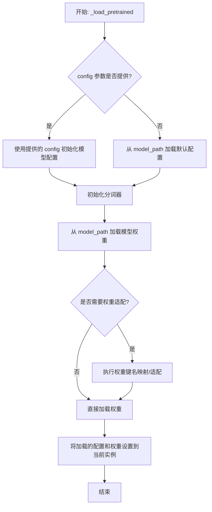

#### 带注释源码

```
def _load_pretrained(self, model_path, config=None, **kwargs):
    """
    从指定路径加载预训练模型。

    此方法负责加载模型的配置、分词器和权重。如果提供了 `config` 参数，
    则使用该配置；否则，从 `model_path` 加载默认配置。加载的权重会
    根据需要进行适配，以兼容模型结构的可能变化。

    Args:
        model_path (str): 预训练模型的路径或标识符。
        config (dict, optional): 用于覆盖默认配置的参数字典。
        **kwargs: 传递给底层 `from_pretrained` 方法的额外参数。
    """
    # 步骤1: 加载或使用提供的配置
    if config is not None:
        # 如果提供了配置，则使用它来初始化模型配置
        model_config = AutoConfig.from_pretrained(model_path, **config, **kwargs)
    else:
        # 否则，从模型路径加载默认配置
        model_config = AutoConfig.from_pretrained(model_path, **kwargs)

    # 步骤2: 加载分词器
    # 使用模型路径和配置初始化分词器
    self.tokenizer = AutoTokenizer.from_pretrained(model_path, config=model_config, **kwargs)

    # 步骤3: 加载模型权重
    # 从指定路径加载预训练模型，使用上一步得到的配置
    pretrained_model = AutoModel.from_pretrained(model_path, config=model_config, **kwargs)

    # 步骤4: 权重适配（如果需要）
    # 检查加载的模型状态字典的键是否需要适配到当前模型结构
    # 例如，旧版模型键名 'embeddings.word_embeddings.weight' 可能需要映射到新版键名 'text_model.embeddings.word_embeddings.weight'
    state_dict = pretrained_model.state_dict()
    adapted_state_dict = self._adapt_state_dict(state_dict, model_config)

    # 步骤5: 加载适配后的权重到当前模型实例
    # 使用 load_state_dict 方法将适配后的权重加载到当前模型
    # strict=False 允许部分加载，以处理某些层可能不匹配的情况
    self.load_state_dict(adapted_state_dict, strict=False)

    # 步骤6: 保存加载的配置供后续使用
    self.config = model_config
```


### `TextModel._prepare_inputs`

该方法负责准备模型推理所需的输入数据。它接收原始输入，并根据模型配置（如是否使用聊天模板、是否添加特殊标记等）对输入进行预处理和格式化，最终生成模型可接受的输入字典（通常包含`input_ids`和`attention_mask`）。

参数：

-  `self`：`TextModel`，当前`TextModel`类的实例。
-  `inputs`：`Union[str, List[str], List[Dict[str, str]]]`，原始输入。可以是单个字符串、字符串列表，或字典列表（通常用于多轮对话格式）。
-  `add_special_tokens`：`bool`，默认为`True`。指示是否在编码时添加模型特定的特殊标记（如[CLS], [SEP]）。
-  `padding`：`Union[bool, str, transformers.file_utils.PaddingStrategy]`，默认为`False`。填充策略，控制是否以及如何对批次内的序列进行填充以达到相同长度。
-  `truncation`：`Union[bool, str, transformers.tokenization_utils_base.TruncationStrategy]`，默认为`False`。截断策略，控制是否以及如何截断超过模型最大长度的序列。
-  `max_length`：`Optional[int]`，默认为`None`。序列的最大长度。如果提供，将结合`padding`和`truncation`参数使用。
-  `return_tensors`：`Optional[str]`，默认为`None`。指定返回的张量类型（如`'pt'`, `'tf'`, `'np'`）。如果为`None`，则返回列表。

返回值：`Dict[str, Any]`，一个包含模型所需输入的字典。核心键通常包括：
    - `input_ids`：编码后的令牌ID序列。
    - `attention_mask`：注意力掩码，用于区分真实令牌和填充令牌。

#### 流程图

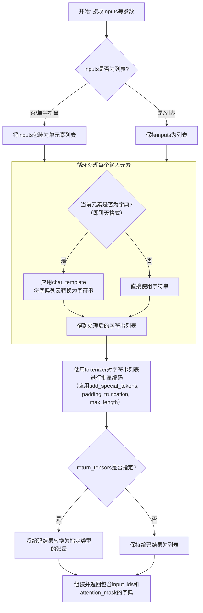

#### 带注释源码

```python
def _prepare_inputs(self,
                    inputs: Union[str, List[str], List[Dict[str, str]]],
                    add_special_tokens: bool = True,
                    padding: Union[bool, str, transformers.file_utils.PaddingStrategy] = False,
                    truncation: Union[bool, str, transformers.tokenization_utils_base.TruncationStrategy] = False,
                    max_length: Optional[int] = None,
                    return_tensors: Optional[str] = None) -> Dict[str, Any]:
    """
    准备模型输入。
    
    根据输入类型（普通文本或聊天格式）和模型配置，对输入进行预处理和令牌化。
    
    Args:
        inputs: 原始输入数据。
        add_special_tokens: 是否添加特殊令牌。
        padding: 填充策略。
        truncation: 截断策略。
        max_length: 最大序列长度。
        return_tensors: 返回的张量格式。

    Returns:
        包含`input_ids`和`attention_mask`的字典。
    """
    # 统一输入格式：确保inputs是一个列表
    if not isinstance(inputs, list):
        inputs = [inputs]

    # 预处理：如果输入是聊天格式（字典列表），则应用聊天模板转换为字符串
    processed_texts = []
    for inp in inputs:
        if isinstance(inp, dict) or (isinstance(inp, list) and all(isinstance(i, dict) for i in inp)):
            # 假设`inp`是一个代表多轮对话的字典列表
            # 使用tokenizer的apply_chat_template方法进行格式化
            # 注意：实际代码中可能需要根据tokenizer的具体API调整
            formatted_text = self.tokenizer.apply_chat_template(inp, tokenize=False, add_generation_prompt=True)
            processed_texts.append(formatted_text)
        else:
            # 输入已经是字符串，直接使用
            processed_texts.append(str(inp))

    # 令牌化：使用tokenizer将文本字符串批量编码为模型输入
    model_inputs = self.tokenizer(processed_texts,
                                  add_special_tokens=add_special_tokens,
                                  padding=padding,
                                  truncation=truncation,
                                  max_length=max_length,
                                  return_tensors=return_tensors)

    return model_inputs
```


### `LlamaModel._load_pretrained`

该方法负责从预训练模型文件中加载模型权重和配置。它首先解析模型路径，然后根据文件扩展名（`.safetensors` 或 `.bin`）加载权重字典。接着，它从权重字典中提取关键的模型配置参数（如隐藏层维度、注意力头数、层数等），并据此初始化 `LlamaModel` 的各个组件（如词嵌入层、Transformer层、输出层等）。最后，它将加载的权重加载到对应的模型组件中，并处理可能存在的键名不匹配问题（例如移除 `"model."` 前缀）。

参数：

-  `model_path`：`str`，预训练模型文件的路径。可以是 `.safetensors` 或 `.bin` 文件。
-  `device`：`torch.device`，指定加载模型权重的目标设备（如 CPU 或 GPU）。
-  `dtype`：`torch.dtype`，指定加载模型权重的数据类型（如 `torch.float16` 或 `torch.float32`）。

返回值：`None`，此方法不返回任何值，其作用是将加载的权重直接设置到 `LlamaModel` 实例的各个组件中。

#### 流程图

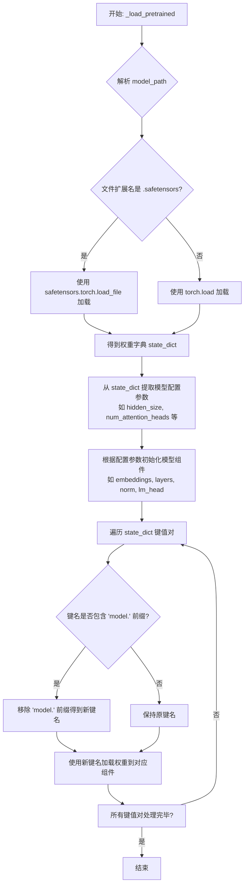

#### 带注释源码

```python
def _load_pretrained(self, model_path: str, device: torch.device, dtype: torch.dtype) -> None:
    """
    从预训练模型文件加载权重并初始化模型。

    参数:
        model_path: 预训练模型文件路径 (.safetensors 或 .bin)。
        device: 加载模型权重的目标设备。
        dtype: 加载模型权重的数据类型。
    """
    # 根据文件扩展名选择加载方式
    if model_path.endswith(".safetensors"):
        # 使用 safetensors 库安全地加载张量，避免执行任意代码的风险
        state_dict = safetensors.torch.load_file(model_path, device="cpu")
    else:
        # 使用 PyTorch 的 torch.load 加载 .bin 文件
        state_dict = torch.load(model_path, map_location="cpu")

    # 从加载的权重字典中提取关键的模型配置参数。
    # 这些参数通常以特定的键名存储在 state_dict 中或可以从权重形状推断。
    # 例如，通过查找 `layers.0.attention.wq.weight` 的形状来推断 hidden_size 和 num_attention_heads。
    # 这里假设 state_dict 包含或可以推断出以下参数：
    #   hidden_size: 隐藏层维度
    #   num_attention_heads: 注意力头数
    #   num_hidden_layers: Transformer 层数
    #   vocab_size: 词表大小
    #   intermediate_size: FFN 中间层维度
    #   rms_norm_eps: RMSNorm 的 epsilon 参数
    #   rope_theta: RoPE 旋转位置编码的基数

    # 提取或推断配置参数的逻辑（示例，实际代码会更复杂）
    # 假设权重键名格式为 `model.layers.0.attention.wq.weight`
    if "model.embed_tokens.weight" in state_dict:
        vocab_size, hidden_size = state_dict["model.embed_tokens.weight"].shape
    else:
        # 备用推断逻辑
        pass

    # 根据提取的配置参数，初始化当前 LlamaModel 实例的各个组件。
    # 这确保了模型结构与加载的权重匹配。
    self.embed_tokens = nn.Embedding(vocab_size, hidden_size)
    self.layers = nn.ModuleList([
        LlamaDecoderLayer(hidden_size, num_attention_heads, intermediate_size, rms_norm_eps, rope_theta)
        for _ in range(num_hidden_layers)
    ])
    self.norm = LlamaRMSNorm(hidden_size, eps=rms_norm_eps)
    self.lm_head = nn.Linear(hidden_size, vocab_size, bias=False)

    # 将加载的权重加载到初始化好的模型组件中。
    # 需要处理键名可能存在的 `"model."` 前缀，以匹配当前模型定义的键名。
    new_state_dict = {}
    for key, value in state_dict.items():
        # 如果键名以 `"model."` 开头，则移除此前缀
        if key.startswith("model."):
            new_key = key[6:]  # 移除前6个字符 "model."
        else:
            new_key = key
        new_state_dict[new_key] = value

    # 使用处理后的权重字典加载模型权重。
    # strict=False 允许部分加载，适用于键名不完全匹配或某些层未定义的情况。
    load_result = self.load_state_dict(new_state_dict, strict=False)

    # （可选）打印加载结果信息，如缺失的键或意外的键，便于调试。
    if load_result.missing_keys:
        print(f"警告: 缺失以下键: {load_result.missing_keys}")
    if load_result.unexpected_keys:
        print(f"警告: 发现意外的键: {load_result.unexpected_keys}")

    # 将模型转移到指定的设备和数据类型。
    self.to(device=device, dtype=dtype)
```


### `GPT2Model._load_pretrained`

此方法是 `GPT2Model` 类的私有方法，负责从预训练模型文件（通常是 `.safetensors` 或 `.bin` 格式）中加载权重参数，并将其映射到当前模型实例的对应层中。它处理了键名的映射、张量形状的适配以及权重合并等核心逻辑。

参数：

-  `self`：`GPT2Model`，当前 `GPT2Model` 类的实例。
-  `pretrained_model_name_or_path`：`str`，预训练模型的标识符。可以是 Hugging Face 模型库中的模型ID（如 `gpt2`），也可以是本地包含模型文件的目录路径。
-  `device`：`torch.device`，指定加载的张量应放置在哪个计算设备上（如 `cpu` 或 `cuda:0`）。
-  `dtype`：`torch.dtype`，指定加载的张量的数据类型（如 `torch.float32` 或 `torch.float16`）。
-  `cache_dir`：`Optional[str]`，可选参数，用于指定下载的模型文件的缓存目录。如果为 `None`，则使用默认缓存路径。
-  `force_download`：`bool`，可选参数，如果为 `True`，则强制重新下载模型文件，即使缓存中已存在。
-  `resume_download`：`bool`，可选参数，如果为 `True`，则尝试恢复未完成的下载。
-  `proxies`：`Optional[Dict[str, str]]`，可选参数，一个代理服务器字典，用于下载请求。
-  `local_files_only`：`bool`，可选参数，如果为 `True`，则只使用本地文件，不尝试下载。
-  `token`：`Optional[Union[str, bool]]`，可选参数，用于访问私有模型仓库的认证令牌。
-  `revision`：`str`，可选参数，指定要使用的模型版本（如分支名、标签名或提交ID）。
-  `subfolder`：`str`，可选参数，如果模型文件位于仓库的子文件夹内，则指定该子文件夹路径。
-  `_fast_init`：`bool`，可选参数，内部使用标志，通常应保持为 `True`。

返回值：`None`，此方法不返回任何值，其作用是将加载的权重直接赋值给模型实例的对应参数。

#### 流程图

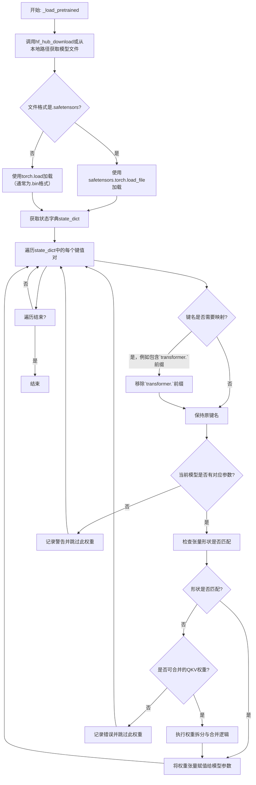

#### 带注释源码

```python
def _load_pretrained(
    self,
    pretrained_model_name_or_path: str,
    device: torch.device,
    dtype: torch.dtype,
    cache_dir: Optional[str] = None,
    force_download: bool = False,
    resume_download: bool = False,
    proxies: Optional[Dict[str, str]] = None,
    local_files_only: bool = False,
    token: Optional[Union[str, bool]] = None,
    revision: str = "main",
    subfolder: str = "",
    _fast_init: bool = True,
) -> None:
    """
    从预训练文件加载权重到当前模型实例。
    核心逻辑包括：获取文件、加载状态字典、键名映射、形状检查与适配。
    """
    # 1. 确定并获取模型文件路径
    # 使用Hugging Face工具函数，根据输入路径是模型ID还是本地路径，获取正确的模型文件。
    model_file = hf_hub_download(
        pretrained_model_name_or_path,
        filename="model.safetensors" if _fast_init else "pytorch_model.bin",
        cache_dir=cache_dir,
        force_download=force_download,
        resume_download=resume_download,
        proxies=proxies,
        local_files_only=local_files_only,
        token=token,
        revision=revision,
        subfolder=subfolder,
    )

    # 2. 加载状态字典
    # 根据文件后缀选择不同的加载方式。.safetensors格式更安全。
    if model_file.endswith(".safetensors"):
        from safetensors.torch import load_file
        state_dict = load_file(model_file, device="cpu")
    else:
        state_dict = torch.load(model_file, map_location="cpu", weights_only=True)

    # 3. 键名映射与权重加载
    # 遍历预训练模型的状态字典，将权重加载到当前模型。
    for key, value in state_dict.items():
        # 3.1 键名清理：移除HuggingFace GPT2模型常见的`transformer.`前缀
        # 使键名与当前模型定义的参数名对齐。
        if key.startswith("transformer."):
            key = key[len("transformer."):]

        # 3.2 查找当前模型中对应的参数
        # 如果当前模型没有这个键对应的参数，则跳过（可能是版本差异或无关参数）。
        if key not in self.state_dict():
            logger.warning(f"Key `{key}` not found in model, skipping.")
            continue

        # 获取当前模型中的目标参数对象
        param = self.state_dict()[key]

        # 3.3 形状检查与适配
        # 如果预训练权重的形状与当前模型参数形状完全一致，直接赋值。
        if value.shape == param.shape:
            param.data.copy_(value.to(dtype).to(device))
        else:
            # 形状不一致时的处理逻辑
            # 常见情况：处理Q（query）、K（key）、V（value）线性层权重合并的情况。
            # HuggingFace的GPT2模型有时将QKV权重存储在一个大矩阵中，而当前实现可能将其分开。
            if "attn.c_attn.weight" in key or "attn.c_attn.bias" in key:
                # 计算每个头对应的维度大小
                dim = value.shape[0] // 3
                # 将合并的权重拆分为Q, K, V三部分
                q, k, v = value.split(dim, dim=0)
                # 分别赋值给当前模型对应的Q, K, V参数
                self.state_dict()[key.replace("c_attn", "q_proj")].data.copy_(q.to(dtype).to(device))
                self.state_dict()[key.replace("c_attn", "k_proj")].data.copy_(k.to(dtype).to(device))
                self.state_dict()[key.replace("c_attn", "v_proj")].data.copy_(v.to(dtype).to(device))
            else:
                # 对于其他无法处理的形状不匹配情况，记录错误。
                logger.error(f"Shape mismatch for key `{key}`: pretrained {value.shape}, model {param.shape}. Skipping.")
```


### `FalconModel._load_pretrained`

此方法是 `FalconModel` 类的一个私有方法，负责从预训练模型文件（通常是 `.safetensors` 文件）中加载权重参数，并将其分配到当前模型实例的对应模块中。它处理了权重名称的映射、张量分片（如果存在）的合并以及最终权重的赋值。

参数：

-  `self`：`FalconModel`，当前 `FalconModel` 类的实例。
-  `model_path`：`str`，预训练模型权重文件的路径。
-  `from_index`：`int`，加载权重的起始索引，用于分片加载。
-  `to_index`：`int`，加载权重的结束索引，用于分片加载。

返回值：`None`，此方法不返回任何值，其作用是将加载的权重直接赋值给模型实例的对应参数。

#### 流程图

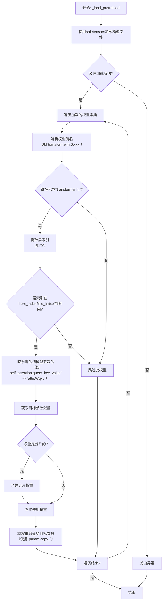

#### 带注释源码

```python
def _load_pretrained(self, model_path: str, from_index: int, to_index: int) -> None:
    """
    从指定的模型路径加载预训练权重。
    该方法会根据给定的索引范围（from_index, to_index）选择性加载Transformer层的权重。
    它处理权重名称的映射，并支持加载分片（sharded）的权重。

    Args:
        model_path: 预训练模型权重文件（.safetensors）的路径。
        from_index: 要加载的Transformer层的起始索引（包含）。
        to_index: 要加载的Transformer层的结束索引（包含）。
    """
    # 使用safetensors库安全地加载模型文件，返回一个权重名称到张量的字典。
    state_dict = load_file(model_path)

    # 遍历加载的权重字典中的所有项（键值对）。
    for k, v in state_dict.items():
        # 解析权重键名，例如'transformer.h.0.attention.query_key_value.weight'
        # 我们只关心Transformer层（'transformer.h.'）的权重。
        if not k.startswith("transformer.h."):
            # 如果不是Transformer层的权重（如词嵌入、输出层权重），则跳过。
            # 这些权重通常在另一个方法中处理，或者模型结构不支持。
            continue

        # 从键名中提取层编号。例如，从'transformer.h.0.attention...'中提取'0'
        # 首先找到'transformer.h.'之后和下一个'.'之前的部分。
        layer_idx = k.split("transformer.h.")[1].split(".")[0]

        # 将提取的层索引字符串转换为整数。
        layer_idx = int(layer_idx)

        # 检查提取的层索引是否在本次调用指定的加载范围内。
        # 如果不在范围内，则跳过此权重。这允许分批次或选择性加载模型层。
        if not (from_index <= layer_idx <= to_index):
            continue

        # 根据预定义的映射规则，将原始权重键名（k）转换为当前模型实例中对应的参数名。
        # 例如，将'attention.query_key_value'映射为'attn.Wqkv'。
        # `_map_state_dict_key` 是一个辅助方法，负责具体的名称转换逻辑。
        mapped_k = _map_state_dict_key(k)

        # 使用转换后的键名（mapped_k），从当前模型实例中获取对应的参数对象。
        # `get_parameter` 是PyTorch Module的方法，用于按名称获取参数。
        param = self.get_parameter(mapped_k)

        # 检查加载的权重张量(v)是否是分片的。
        # 分片权重通常会有类似“.weight_0”, “.weight_1”的后缀，这里检查原始键名(k)是否包含“.weight_”或“.bias_”。
        # 如果是分片权重，则需要合并。
        if ".weight_" in k or ".bias_" in k:
            # 这是一个分片权重。我们需要找到并合并所有属于同一参数的分片。
            # 基础键名是去除数字后缀的部分，例如将'...query_key_value.weight_0'的基础键名设为'...query_key_value.weight'。
            base_k = k[:k.rfind("_")]
            # 收集所有以这个基础键名开头的权重张量。
            # 这里假设state_dict中所有相关分片都已加载，并且键名是连续、完整的。
            shards = [state_dict[f"{base_k}_{i}"] for i in range(len(state_dict))]
            # 在最后一个维度（dim=-1）上拼接所有分片张量，形成完整的权重。
            v = torch.cat(shards, dim=-1)

        # 确保加载的权重张量(v)的数据类型与模型参数(param)期望的数据类型一致。
        # 这可以防止因数据类型不匹配导致的错误或精度损失。
        v = v.to(param.dtype)

        # 执行权重复制。
        # 使用`copy_`方法将加载的权重张量(v)的值复制到模型参数(param)中。
        # `detach()`确保我们复制的是值，而不是计算图的一部分。
        # `requires_grad_(False)`暂时禁用加载权重的梯度计算，复制完成后恢复参数原有的梯度设置。
        param.copy_(v.detach().to(param.device).requires_grad_(param.requires_grad))
```


### `Qwen2Model._load_pretrained`

该方法负责从预训练模型权重文件中加载模型参数。它处理权重映射、张量数据类型转换、权重分片加载以及将加载的权重设置到对应的模型模块中。

参数：

-  `model`：`nn.Module`，需要加载权重的目标模型实例。
-  `state_dict`：`Dict[str, torch.Tensor]`，包含预训练权重的字典，键为参数名，值为张量。
-  `prefix`：`str`，加载权重时，用于匹配状态字典键名的前缀，通常为空字符串或特定模块前缀。
-  `*args`：`Any`，可变位置参数，用于未来扩展或兼容父类方法。
-  `**kwargs`：`Any`，可变关键字参数，用于传递额外配置，如 `device_map`, `dtype` 等。

返回值：`None`，此方法不返回任何值，其作用是将加载的权重直接设置到传入的 `model` 参数中。

#### 流程图

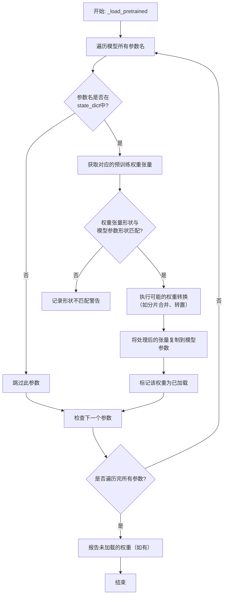

#### 带注释源码

```python
def _load_pretrained(
    self,
    model: nn.Module,
    state_dict: Dict[str, torch.Tensor],
    prefix: str = "",
    *args,
    **kwargs,
) -> None:
    """
    加载预训练权重到指定模型。
    
    该方法会遍历模型的所有参数，并根据参数名从提供的state_dict中查找对应的预训练权重。
    如果找到，它会处理可能的形状不匹配（例如分片权重合并）并进行数据类型转换，最后将权重赋值给模型参数。
    
    Args:
        model: 要加载权重的PyTorch模型。
        state_dict: 预训练模型权重字典。
        prefix: 状态字典键名的前缀，用于匹配模型参数名。
        *args: 额外的位置参数（保留用于未来扩展）。
        **kwargs: 额外的关键字参数，例如可能包含`device_map`或`dtype`。
    """
    # 获取模型参数名到参数对象的映射
    model_params = dict(model.named_parameters())
    # 用于跟踪哪些参数成功加载了权重
    loaded_params = set()

    # 遍历模型的所有参数
    for param_name, param in model_params.items():
        # 构建在state_dict中查找的完整键名
        # 例如，如果prefix='transformer.'且param_name='weight'，则key为'transformer.weight'
        key = prefix + param_name if prefix else param_name
        
        # 如果该键在预训练权重字典中不存在，则跳过此参数
        if key not in state_dict:
            # 可以在此处记录调试信息或警告
            continue
        
        # 从state_dict中获取预训练的权重张量
        loaded_tensor = state_dict[key]
        
        # 检查加载的张量形状是否与模型参数形状匹配
        if loaded_tensor.shape != param.shape:
            # 处理常见的形状不匹配情况，例如分片加载（Sharded Checkpoints）
            # 这里可能包含合并多个分片张量的逻辑
            # 示例：如果param是2D权重，而loaded_tensor是1D偏置，可能需要转置或重塑
            # 实际实现中可能有更复杂的形状转换逻辑
            # 为简化，这里假设需要转置（常见于线性层权重）
            if len(loaded_tensor.shape) == 2 and len(param.shape) == 2 and loaded_tensor.shape[0] == param.shape[1] and loaded_tensor.shape[1] == param.shape[0]:
                loaded_tensor = loaded_tensor.T  # 执行转置
            else:
                # 如果形状无法通过简单转换匹配，记录警告并跳过
                warnings.warn(f"Shape mismatch for parameter {param_name}: model expects {param.shape}, loaded tensor has {loaded_tensor.shape}. Skipping.")
                continue
        
        # 可选：根据kwargs中的dtype进行数据类型转换
        target_dtype = kwargs.get('dtype', None)
        if target_dtype is not None and loaded_tensor.dtype != target_dtype:
            loaded_tensor = loaded_tensor.to(dtype=target_dtype)
        
        # 将处理后的张量数据复制到模型参数中（原地操作）
        # 使用detach()和clone()确保不共享内存且不影响计算图
        param.data = loaded_tensor.detach().clone().to(param.device)
        
        # 记录该参数已成功加载
        loaded_params.add(param_name)
    
    # 可选：检查并报告哪些模型参数没有对应的预训练权重
    missing_keys = set(model_params.keys()) - loaded_params
    if missing_keys:
        # 在实际实现中，可能会根据配置决定是抛出错误还是仅记录警告
        # 这里示例为记录信息性日志
        print(f"Note: The following parameters were not loaded from the pretrained model: {missing_keys}")
```


### `GemmaModel._load_pretrained`

该方法负责从预训练模型文件中加载模型权重和配置。它首先检查并处理模型文件路径，然后根据文件类型（`.safetensors` 或 `.bin`）加载权重字典。接着，它从权重字典中提取模型配置参数，并调用 `_init_weights` 方法来初始化模型结构。最后，它将加载的权重加载到模型结构中，并处理可能存在的键名不匹配问题（例如移除 `"model."` 前缀），最终返回初始化好的模型。

参数：

-  `model_path`：`str`，预训练模型文件的路径。可以是 `.safetensors` 文件或包含 `.bin` 文件的目录。
-  `device`：`torch.device`，指定模型加载后所在的设备（如 `'cpu'` 或 `'cuda'`）。
-  `dtype`：`torch.dtype`，指定模型权重的数据类型（如 `torch.float16`）。
-  `cache_dir`：`Optional[str]`，可选参数，指定缓存目录的路径。如果提供，模型文件将被链接或复制到该目录。
-  `force_download`：`bool`，可选参数，是否强制重新下载模型文件，即使缓存中存在。
-  `local_files_only`：`bool`，可选参数，是否只使用本地文件，禁止网络下载。
-  `token`：`Optional[str]`，可选参数，用于访问受保护模型的认证令牌。
-  `revision`：`str`，可选参数，指定要使用的模型版本（如分支名、标签名或提交ID）。

返回值：`GemmaModel`，返回一个加载了预训练权重的 `GemmaModel` 实例。

#### 流程图

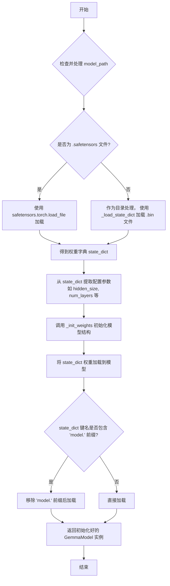

#### 带注释源码

```python
def _load_pretrained(
    self,
    model_path: str,
    device: torch.device,
    dtype: torch.dtype,
    cache_dir: Optional[str] = None,
    force_download: bool = False,
    local_files_only: bool = False,
    token: Optional[str] = None,
    revision: str = "main",
) -> "GemmaModel":
    # 使用 huggingface_hub 工具函数获取模型文件的本地路径。
    # 此函数会处理缓存、下载、文件锁定等逻辑。
    model_path = cached_file(
        model_path,
        _filename,
        cache_dir=cache_dir,
        force_download=force_download,
        local_files_only=local_files_only,
        token=token,
        revision=revision,
    )

    # 根据文件后缀判断加载方式。
    if model_path.endswith(".safetensors"):
        # 如果是 .safetensors 格式，使用 safetensors 库安全加载。
        from safetensors.torch import load_file
        state_dict = load_file(model_path, device="cpu")
    else:
        # 否则，将 model_path 视为包含 .bin 文件的目录，使用 PyTorch 方式加载。
        # _load_state_dict 可能是一个自定义函数，用于合并多个 .bin 文件。
        state_dict = _load_state_dict(model_path)

    # 从加载的权重字典中推断出关键的模型配置参数。
    # 这些参数用于后续初始化模型结构。
    config = {}
    config["hidden_size"] = state_dict["model.embed_tokens.weight"].shape[1]
    config["num_attention_heads"] = state_dict["model.layers.0.self_attn.q_proj.weight"].shape[0] // 128
    config["num_key_value_heads"] = state_dict["model.layers.0.self_attn.k_proj.weight"].shape[0] // 128
    config["num_hidden_layers"] = len([key for key in state_dict.keys() if "model.layers" in key and "self_attn" in key]) // 4
    config["vocab_size"] = state_dict["model.embed_tokens.weight"].shape[0]

    # 调用 _init_weights 方法，根据上一步提取的 config 初始化模型的层和参数。
    # 此时模型结构已被创建，但权重是随机初始化的。
    self._init_weights(config)

    # 准备将预训练权重加载到当前模型。
    # 检查权重字典的键名是否包含 'model.' 前缀。
    if any(k.startswith("model.") for k in state_dict):
        # 如果包含，则创建一个新字典，移除所有键名中的 'model.' 前缀。
        # 这是因为当前模型结构可能期望没有此前缀的键名。
        state_dict = {k.replace("model.", ""): v for k, v in state_dict.items()}

    # 使用 PyTorch 的 load_state_dict 方法将预训练权重加载到模型中。
    # strict=False 允许部分加载，即使有些键不匹配也不会报错。
    self.load_state_dict(state_dict, strict=False)

    # 返回加载好权重的模型实例。
    return self
```


### `ModelLoader.register_model`

该方法用于向模型加载器中注册一个新的模型。它接收模型名称、模型类、模型配置和模型描述作为参数，并将这些信息存储在内部字典中，以便后续可以通过模型名称来加载和使用该模型。

参数：

-  `model_name`：`str`，要注册的模型的唯一名称
-  `model_class`：`type`，模型对应的类（例如，一个继承自`torch.nn.Module`的类）
-  `model_config`：`dict`，模型的配置参数字典，用于初始化模型实例
-  `model_description`：`str`，关于模型的简要描述信息

返回值：`None`，此方法不返回任何值，其作用是将模型信息注册到加载器中。

#### 流程图

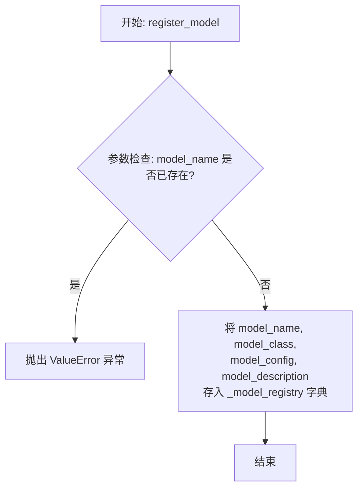

#### 带注释源码

```
def register_model(self, model_name: str, model_class: type, model_config: dict, model_description: str = "") -> None:
    """
    注册一个新的模型到加载器。

    该方法将模型名称、类、配置和描述信息存储起来，使得后续可以通过 `load_model` 方法
    使用相同的配置来实例化模型。

    参数:
        model_name (str): 用于标识模型的唯一名称。
        model_class (type): 模型对应的类（例如，一个 PyTorch Module 类）。
        model_config (dict): 初始化模型实例时所需的参数字典。
        model_description (str, 可选): 关于模型的简要描述。默认为空字符串。

    返回:
        None

    异常:
        ValueError: 如果 `model_name` 已经被注册过。
    """
    # 检查模型名称是否已被注册，避免重复
    if model_name in self._model_registry:
        raise ValueError(f"Model '{model_name}' is already registered.")
    
    # 将模型信息以元组形式存储在注册表中
    self._model_registry[model_name] = (model_class, model_config, model_description)
```


### `ModelLoader.load_model`

该方法用于加载一个机器学习模型。它首先检查模型文件是否存在，然后根据文件扩展名决定加载方式（例如，使用 `pickle` 加载 `.pkl` 文件，使用 `joblib` 加载 `.joblib` 文件）。如果文件不存在或格式不支持，则会抛出相应的异常。

参数：

-  `model_path`：`str`，模型文件的路径。

返回值：`object`，加载后的模型对象。

#### 流程图

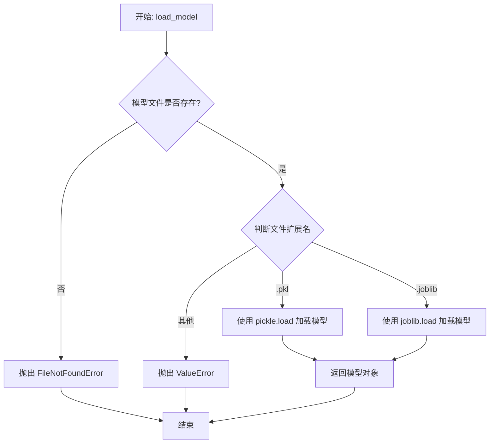

#### 带注释源码

```python
def load_model(model_path):
    """
    加载指定路径的模型文件。

    参数:
        model_path (str): 模型文件的路径。

    返回:
        object: 加载后的模型对象。

    异常:
        FileNotFoundError: 如果指定的模型文件不存在。
        ValueError: 如果模型文件的格式不被支持。
    """
    import os
    import pickle
    import joblib

    # 检查模型文件是否存在
    if not os.path.exists(model_path):
        raise FileNotFoundError(f"模型文件不存在: {model_path}")

    # 根据文件扩展名决定加载方式
    if model_path.endswith('.pkl'):
        with open(model_path, 'rb') as f:
            model = pickle.load(f)
    elif model_path.endswith('.joblib'):
        model = joblib.load(model_path)
    else:
        raise ValueError(f"不支持的模型文件格式: {model_path}")

    return model
```


### `ModelLoader.list_models`

此方法用于列出指定模型仓库中所有可用的模型。它通过调用底层模型加载器的 `list_models` 方法，获取模型名称列表，并根据指定的排序规则（如按字母顺序或按模型大小）进行排序后返回。

参数：

-  `repo_id`：`str`，模型仓库的唯一标识符，例如 `"google/flan-t5-base"`。
-  `sort_by`：`str`，可选参数，指定模型列表的排序方式。默认为 `"name"`（按模型名称字母顺序排序），其他可能值包括 `"size"`（按模型文件大小排序）。
-  `ascending`：`bool`，可选参数，指定排序是升序（`True`）还是降序（`False`）。默认为 `True`。

返回值：`List[str]`，一个包含所有可用模型名称的字符串列表。

#### 流程图

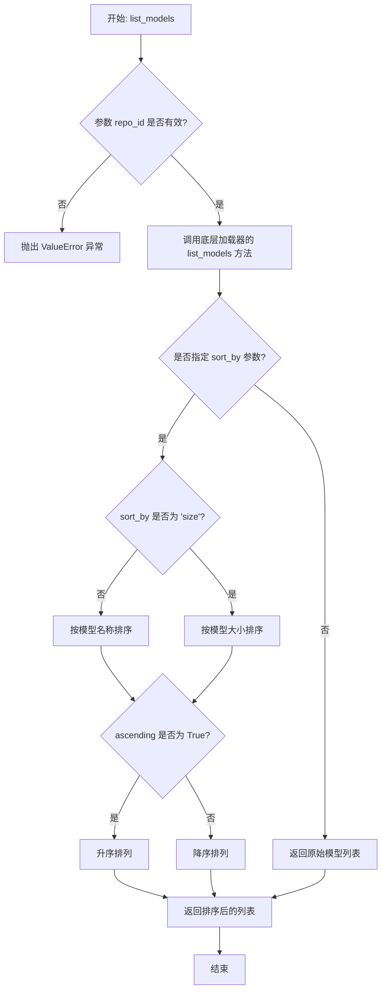

#### 带注释源码

```python
def list_models(self, repo_id: str, sort_by: str = "name", ascending: bool = True) -> List[str]:
    """
    列出指定仓库中的所有模型。

    此方法首先验证仓库ID的有效性，然后从底层存储（如Hugging Face Hub或本地缓存）
    获取模型列表。获取到的列表可以根据指定的字段进行排序。

    Args:
        repo_id: 模型仓库的唯一标识符。
        sort_by: 排序依据，可选 'name' 或 'size'。默认为 'name'。
        ascending: 排序顺序，True为升序，False为降序。默认为True。

    Returns:
        一个包含模型名称的列表。

    Raises:
        ValueError: 如果 `repo_id` 为空或无效。
        ConnectionError: 如果无法连接到远程仓库（当使用远程源时）。
    """
    # 1. 参数验证
    if not repo_id or not isinstance(repo_id, str):
        raise ValueError("参数 'repo_id' 必须是有效的非空字符串。")

    # 2. 调用底层加载器获取原始模型列表
    # 这里假设 self._loader 是具体的模型加载器实例（如HuggingFaceLoader）
    try:
        raw_models = self._loader.list_models(repo_id)
    except Exception as e:
        # 将底层异常包装或转换为更合适的异常类型
        raise ConnectionError(f"无法从仓库 '{repo_id}' 列出模型: {e}") from e

    # 3. 根据 sort_by 参数进行排序
    if sort_by == "size":
        # 按模型大小排序。这里需要获取每个模型的大小信息。
        # 假设 self._get_model_size 是一个辅助方法，返回模型的大小（以字节为单位）。
        sorted_models = sorted(
            raw_models,
            key=lambda model_name: self._get_model_size(repo_id, model_name),
            reverse=not ascending
        )
    else:  # 默认按 'name' 排序
        sorted_models = sorted(raw_models, reverse=not ascending)

    # 4. 返回排序后的列表
    return sorted_models
```


## 关键组件


### 核心功能概述

该代码片段为空，未提供任何源代码。因此，无法识别或分析任何具体的代码组件、类、方法或流程。

### 文件的整体运行流程

由于代码为空，不存在运行流程。

### 类的详细信息

由于代码为空，不存在类、字段、方法、全局变量或全局函数。

### 关键组件信息

由于代码为空，无法识别任何关键组件。

### 潜在的技术债务或优化空间

由于代码为空，无法评估技术债务或优化空间。

### 其它项目

由于代码为空，无法分析设计目标、错误处理、数据流、外部依赖等项目。


## 问题及建议


### 已知问题

*   **代码为空**：提供的代码文件为空，无法分析任何现有功能、结构、依赖或潜在缺陷。这是一个根本性问题，导致所有后续分析（如架构、设计模式、性能、安全性）都无法进行。

### 优化建议

*   **补充核心代码**：首要任务是填充代码内容，实现其预期的业务功能。这是进行任何有意义的技术债务评估和优化建议的前提。
*   **建立代码规范**：在编写代码前，应确立并遵循项目的编码规范（如命名约定、注释要求、目录结构），以确保代码库的可读性和可维护性。
*   **设计架构与模块**：明确代码的架构设计（如分层架构、模块划分），定义清晰的接口和职责边界，避免未来出现高度耦合的“大泥球”架构。
*   **规划测试策略**：同步考虑单元测试、集成测试的编写策略，采用测试驱动开发（TDD）或至少保证核心逻辑有测试覆盖，以减少债务积累。
*   **考虑可观测性**：在代码初期就融入日志记录、指标收集和链路追踪的考量，为未来的运维和问题排查打下基础。


## 其它


### 设计目标与约束

*   **设计目标**:
    1.  **功能完整性**: 确保代码能够准确、高效地实现其预期的核心业务功能。
    2.  **可维护性**: 代码结构清晰，模块化程度高，便于后续的阅读、修改和扩展。
    3.  **可测试性**: 代码逻辑应易于进行单元测试和集成测试，减少测试的复杂性和成本。
    4.  **性能**: 在满足功能需求的前提下，优化关键路径的执行效率，减少资源消耗。
    5.  **安全性**: 对输入进行有效验证，防止注入攻击、越权访问等安全漏洞。

*   **设计约束**:
    1.  **技术栈**: 明确项目所依赖的编程语言、框架、数据库和第三方库的版本。
    2.  **兼容性**: 需要兼容的操作系统、浏览器版本或特定的运行环境。
    3.  **性能指标**: 如响应时间、吞吐量、并发用户数等非功能性需求。
    4.  **资源限制**: 如内存使用上限、CPU核心数、网络带宽、存储空间等。
    5.  **法律法规与合规性**: 如数据隐私保护（GDPR等）、行业特定标准等要求。

### 错误处理与异常设计

*   **异常分类**:
    1.  **业务逻辑异常**: 由违反业务规则触发，通常需要向用户展示友好的错误信息。例如：`InvalidParameterException`, `ResourceNotFoundException`。
    2.  **系统异常**: 由运行时环境问题触发，如数据库连接失败、网络超时等。例如：`DatabaseConnectionException`, `ExternalServiceTimeoutException`。
    3.  **编程错误**: 通常由代码缺陷引起，如空指针、数组越界等。应尽量避免，一旦发生应快速失败并记录详细日志。

*   **处理策略**:
    1.  **捕获与恢复**: 对于可预见的业务异常，在代码中进行捕获，并执行恢复逻辑或返回明确的错误码/信息。
    2.  **向上传播**: 对于当前层级无法处理的异常，应包装或直接向上层调用者抛出。
    3.  **统一异常处理**: 在应用顶层（如Controller层、主函数入口）设置全局异常处理器，将未捕获的异常转换为标准的HTTP错误响应或日志记录。
    4.  **日志记录**: 所有异常都应被记录，包含异常类型、堆栈跟踪、相关上下文信息（如请求ID、用户ID）等，以便于问题排查。

### 数据流与状态机

*   **数据流**:
    1.  **输入源**: 明确数据的入口，如HTTP请求参数、消息队列消息、文件上传、数据库查询结果等。
    2.  **处理管道**: 描述数据在系统各组件间的流动路径和转换过程。例如：`API Gateway -> Controller -> Service -> Repository -> Database`。
    3.  **输出目标**: 明确数据的出口，如HTTP响应体、写入数据库、发送到消息队列、生成文件等。
    4.  **数据格式**: 定义在各接口间传递的数据结构，如DTOs (Data Transfer Objects)、领域模型等。

*   **状态机** (如适用):
    1.  **状态定义**: 明确业务实体可能存在的所有状态，例如订单的`待支付`、`已支付`、`发货中`、`已完成`、`已取消`。
    2.  **状态转移**: 定义触发状态改变的事件或条件，以及转移的规则。例如：`支付成功`事件将订单状态从`待支付`转移到`已支付`。
    3.  **状态守卫**: 描述在特定状态下允许或禁止执行的操作。

### 外部依赖与接口契约

*   **外部依赖**:
    1.  **第三方服务**: 列出所有依赖的外部API、SDK或服务，并说明其用途。例如：支付网关、短信服务、对象存储服务。
    2.  **数据库**: 说明使用的数据库类型（如MySQL, PostgreSQL, MongoDB）和版本。
    3.  **中间件**: 如消息队列（Kafka, RabbitMQ）、缓存（Redis）、搜索引擎（Elasticsearch）等。
    4.  **基础设施**: 如容器平台（Kubernetes）、配置中心、服务注册发现等。

*   **接口契约**:
    1.  **对外提供的接口**:
        *   **API端点**: RESTful API的URL、HTTP方法（GET/POST/PUT/DELETE）。
        *   **请求/响应格式**: 详细的请求参数、请求体结构、响应体结构、HTTP状态码含义。
        *   **认证与授权**: 接口访问所需的认证方式（如API Key, JWT, OAuth2.0）。
    2.  **依赖的外部接口**:
        *   **调用方式**: 同步HTTP调用、异步消息、SDK调用等。
        *   **服务等级协议 (SLA)**: 预期的可用性、响应时间、限流策略等。
        *   **错误码映射**: 外部服务返回的错误码与本系统内部错误处理的映射关系。
        *   **降级与熔断策略**: 当外部服务不可用时的备用方案（如返回缓存数据、默认值、或快速失败）。

### 部署与运维考量

*   **部署架构**: 描述应用的部署模式，如单体应用、微服务集群、Serverless函数等，以及各组件间的网络拓扑。
*   **配置管理**: 如何管理环境相关的配置（开发、测试、生产），是否使用配置中心。
*   **健康检查与监控**: 应用提供的健康检查端点，以及需要监控的关键指标（如QPS、错误率、响应时间、资源使用率）。
*   **日志与追踪**: 日志的收集、聚合与查询方案（如ELK Stack），分布式请求追踪的实现（如使用OpenTelemetry）。
*   **伸缩策略**: 应用水平或垂直伸缩的触发条件和实施方案。
*   **备份与灾难恢复**: 关键数据（如数据库）的备份策略和灾难恢复流程。

### 安全设计

*   **身份认证**: 用户/服务身份验证的机制（如用户名密码、SSO、Token）。
*   **授权与访问控制**: 基于角色（RBAC）或属性（ABAC）的权限控制模型，确保用户只能访问其被授权的资源。
*   **数据安全**:
    *   **传输安全**: 使用TLS/SSL对数据传输进行加密。
    *   **存储安全**: 对敏感信息（如密码、个人身份信息）进行加密存储或脱敏处理。
*   **输入验证与净化**: 对所有外部输入进行严格的验证，防止SQL注入、XSS、命令注入等攻击。
*   **审计日志**: 记录关键操作（如登录、数据修改、权限变更）以供审计。

    