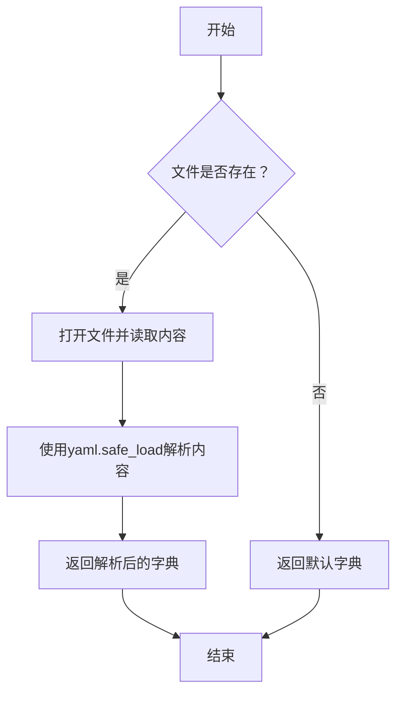
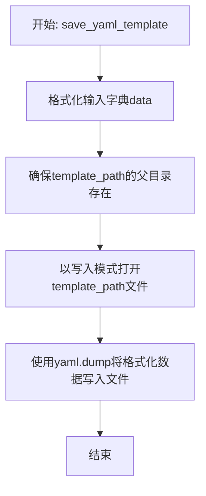
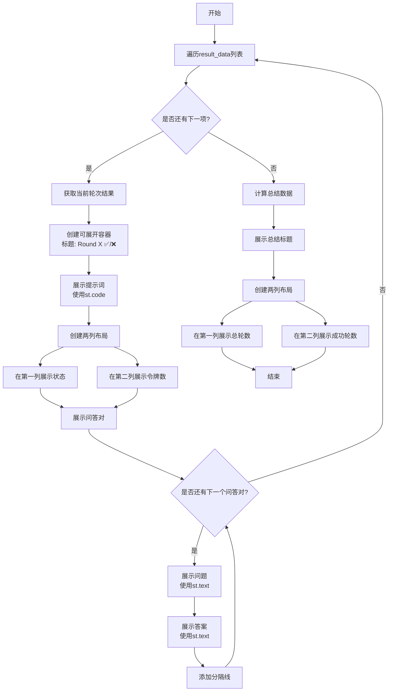

# `.\MetaGPT\metagpt\ext\spo\app.py` 详细设计文档

该代码是一个基于Streamlit的Web应用程序，用于实现自监督提示优化（Self-Supervised Prompt Optimization, SPO）框架。它提供了一个交互式界面，允许用户创建、编辑和管理提示模板，配置不同的LLM模型参数，运行多轮次的提示优化过程，并可视化优化结果。核心功能是通过迭代优化提示词，使其在给定任务上获得更好的性能。

## 整体流程

```mermaid
graph TD
    A[启动Streamlit应用] --> B{检查session_state}
    B --> C[渲染主界面标题和侧边栏]
    C --> D{选择模板模式}
    D -- 使用现有 --> E[加载YAML模板]
    D -- 创建新 --> F[输入新模板名]
    E --> G[在UI中编辑模板内容]
    F --> G
    G --> H{点击保存模板?}
    H -- 是 --> I[保存模板到YAML文件]
    H -- 否 --> J{点击开始优化?}
    J -- 是 --> K[初始化LLM客户端]
    K --> L[创建PromptOptimizer实例]
    L --> M[运行optimize()方法]
    M --> N[加载并显示优化结果]
    N --> O{点击测试提示?}
    O -- 是 --> P[调用LLM执行测试]
    O -- 否 --> Q[结束]
    I --> J
    P --> Q
```

## 类结构

```
Streamlit Web App
├── Global Functions
│   ├── load_yaml_template
│   ├── save_yaml_template
│   └── display_optimization_results
├── Main Function (main)
│   ├── UI Rendering Logic
│   ├── Event Handlers
│   └── StreamlitSink (Inner Class)
└── External Dependencies
    ├── PromptOptimizer (metagpt.ext.spo.components.optimizer)
    └── SPO_LLM (metagpt.ext.spo.utils.llm_client)
```

## 全局变量及字段


### `_logger`
    
一个配置好的loguru日志记录器实例，用于在应用程序中记录不同级别的日志信息。

类型：`loguru.logger`
    


    

## 全局函数及方法

### `load_yaml_template`

该函数用于从指定的YAML模板文件路径加载数据。如果文件存在，则读取并解析YAML内容；如果文件不存在，则返回一个包含默认值的字典。

参数：

- `template_path`：`Path`，YAML模板文件的路径。

返回值：`Dict`，包含从YAML文件解析的数据或默认数据。

#### 流程图



#### 带注释源码

```python
def load_yaml_template(template_path: Path) -> Dict:
    # 检查指定路径的文件是否存在
    if template_path.exists():
        # 如果文件存在，以只读模式打开文件，使用UTF-8编码
        with open(template_path, "r", encoding="utf-8") as f:
            # 使用yaml.safe_load安全地解析YAML内容并返回字典
            return yaml.safe_load(f)
    # 如果文件不存在，返回一个包含默认值的字典
    return {"prompt": "", "requirements": "", "count": None, "qa": [{"question": "", "answer": ""}]}
```

### `save_yaml_template`

该函数负责将给定的字典数据格式化为一个标准化的YAML模板结构，并保存到指定的文件路径。它会确保数据中的关键字段（如`prompt`、`requirements`、`qa`列表）被正确转换为字符串并清理空白字符，同时创建必要的父目录以确保文件可以成功写入。

参数：

- `template_path`：`Path`，目标YAML文件的保存路径。
- `data`：`Dict`，包含待保存模板数据的字典。

返回值：`None`，该函数不返回任何值，其作用是将数据写入文件。

#### 流程图



#### 带注释源码

```python
def save_yaml_template(template_path: Path, data: Dict) -> None:
    # 1. 数据格式化：从输入字典`data`中提取关键字段，并确保它们为字符串类型。
    #    对于`qa`列表，遍历每个问答对，清理问题和答案字符串两端的空白字符。
    template_format = {
        "prompt": str(data.get("prompt", "")),  # 获取提示文本，默认为空字符串
        "requirements": str(data.get("requirements", "")),  # 获取需求文本，默认为空字符串
        "count": data.get("count"),  # 获取计数，可能为None
        "qa": [
            {"question": str(qa.get("question", "")).strip(), "answer": str(qa.get("answer", "")).strip()}
            for qa in data.get("qa", [])  # 遍历qa列表，默认为空列表
        ],
    }

    # 2. 目录创建：确保目标文件路径的父目录存在。如果不存在，则递归创建。
    template_path.parent.mkdir(parents=True, exist_ok=True)

    # 3. 文件写入：以UTF-8编码打开文件，使用yaml.dump将格式化后的字典写入。
    #    allow_unicode=True: 允许Unicode字符。
    #    sort_keys=False: 保持字典键的原始顺序。
    #    default_flow_style=False: 使用块样式（而非流样式）提高可读性。
    #    indent=2: 使用2个空格进行缩进。
    with open(template_path, "w", encoding="utf-8") as f:
        yaml.dump(template_format, f, allow_unicode=True, sort_keys=False, default_flow_style=False, indent=2)
```

### `display_optimization_results`

该函数用于在Streamlit应用中展示提示词优化过程的结果。它接收一个包含多轮优化结果的数据列表，为每一轮结果创建一个可展开的容器，展示该轮的提示词、状态、令牌消耗以及对应的问答对。最后，它会计算并展示一个总结，包括总轮数和成功轮数。

参数：

- `result_data`：`list`，一个字典列表，其中每个字典代表一轮优化结果。字典应包含以下键：`round`（轮次编号）、`succeed`（是否成功）、`prompt`（优化后的提示词）、`tokens`（消耗的令牌数）、`answers`（问答对列表，每个问答对包含`question`和`answer`）。

返回值：`None`，该函数不返回任何值，其作用是在Streamlit界面上渲染内容。

#### 流程图



#### 带注释源码

```python
def display_optimization_results(result_data):
    # 遍历每一轮优化结果
    for result in result_data:
        # 提取当前轮次的关键信息
        round_num = result["round"]
        success = result["succeed"]
        prompt = result["prompt"]

        # 为每一轮结果创建一个可展开的容器，标题包含轮次和成功/失败图标
        with st.expander(f"Round {round_num} {':white_check_mark:' if success else ':x:'}"):
            # 展示优化后的提示词，使用代码块格式
            st.markdown("**Prompt:**")
            st.code(prompt, language="text")
            st.markdown("<br>", unsafe_allow_html=True)  # 添加一个换行

            # 创建两列布局，用于并排展示状态和令牌消耗
            col1, col2 = st.columns(2)
            with col1:
                # 展示本轮优化状态（成功或失败）
                st.markdown(f"**Status:** {'Success ✅ ' if success else 'Failed ❌ '}")
            with col2:
                # 展示本轮消耗的令牌数
                st.markdown(f"**Tokens:** {result['tokens']}")

            # 展示本轮优化对应的所有问答对
            st.markdown("**Answers:**")
            for idx, answer in enumerate(result["answers"]):
                # 展示问题
                st.markdown(f"**Question {idx + 1}:**")
                st.text(answer["question"])
                # 展示答案
                st.markdown("**Answer:**")
                st.text(answer["answer"])
                st.markdown("---")  # 在问答对之间添加分隔线

    # 计算并展示总结信息
    success_count = sum(1 for r in result_data if r["succeed"])
    total_rounds = len(result_data)

    st.markdown("### Summary")
    col1, col2 = st.columns(2)
    with col1:
        # 展示总优化轮数
        st.metric("Total Rounds", total_rounds)
    with col2:
        # 展示成功的优化轮数
        st.metric("Successful Rounds", success_count)
```

### `main`

`main` 函数是 Streamlit 应用的入口点，负责构建一个用于自我监督提示优化（SPO）的交互式 Web 界面。它管理整个应用的生命周期，包括：加载/保存 YAML 模板、配置 LLM 参数、运行提示优化流程、展示优化结果以及测试优化后的提示。

参数：
- 无显式参数。该函数通过 Streamlit 的 `st.session_state` 和侧边栏/主区域的用户输入来获取所有配置和数据。

返回值：`None`，该函数不返回任何值，其作用是通过 Streamlit 框架渲染和更新 Web 界面。

#### 流程图

```mermaid
flowchart TD
    A[开始: 运行 main 函数] --> B[初始化 session_state<br>用于存储优化结果]
    B --> C[渲染应用标题与介绍]
    C --> D[渲染侧边栏配置面板]
    D --> D1[选择/创建模板]
    D --> D2[配置优化/评估/执行 LLM 参数]
    D --> D3[配置优化器轮次参数]
    
    D --> E{模板名称是否有效?}
    E -->|是| F[加载对应 YAML 模板数据]
    E -->|否| G[等待用户输入有效模板名]
    F --> H[在主区域渲染模板编辑器<br>（Prompt, Requirements, Q&A）]
    H --> I[用户点击 'Save Template']
    I --> J[保存模板到 YAML 文件]
    
    H --> K[用户点击 'Start Optimization']
    K --> L[初始化 SPO_LLM 客户端]
    L --> M[创建 PromptOptimizer 实例]
    M --> N[运行 optimizer.optimize()<br>显示进度条]
    N --> O[加载并展示优化结果]
    
    H --> P[用户点击 'Test Prompt']
    P --> Q[使用配置的 LLM 执行测试]
    Q --> R[展示 LLM 生成的响应]
    
    G --> S[等待后续用户操作]
    J --> S
    O --> S
    R --> S
    S --> T[结束/保持应用运行]
```

#### 带注释源码

```python
def main():
    # 初始化 session_state，用于在 Streamlit 应用的不同次渲染间保持状态。
    # `optimization_results` 用于存储优化过程的结果。
    if "optimization_results" not in st.session_state:
        st.session_state.optimization_results = []

    # 渲染应用的主标题和介绍区域，包含指向论文和 GitHub 仓库的链接。
    st.markdown(
        """
        <div style="background-color: #f0f2f6; padding: 20px; border-radius: 10px; margin-bottom: 25px">
            <div style="display: flex; justify-content: space-between; align-items: center; margin-bottom: 10px">
                <h1 style="margin: 0;">SPO | Self-Supervised Prompt Optimization 🤖</h1>
            </div>
            <div style="display: flex; gap: 20px; align-items: center">
                <a href="https://arxiv.org/pdf/2502.06855" target="_blank" style="text-decoration: none;">
                    
                </a>
                <a href="https://github.com/geekan/MetaGPT/blob/main/examples/spo/README.md" target="_blank" style="text-decoration: none;">
                    
                </a>
                <span style="color: #666;">A framework for self-supervised prompt optimization</span>
            </div>
        </div>
        """,
        unsafe_allow_html=True,
    )

    # --- 侧边栏配置区域 ---
    with st.sidebar:
        st.header("Configuration")

        # 模板选择/创建部分
        # 定义模板文件的存储路径，并列出所有现有的 YAML 模板文件。
        settings_path = Path("metagpt/ext/spo/settings")
        existing_templates = [f.stem for f in settings_path.glob("*.yaml")]

        # 提供单选按钮，让用户选择使用现有模板还是创建新模板。
        template_mode = st.radio("Template Mode", ["Use Existing", "Create New"])

        if template_mode == "Use Existing":
            # 如果选择使用现有模板，则提供一个下拉选择框。
            template_name = st.selectbox("Select Template", existing_templates)
        else:
            # 如果选择创建新模板，则提供一个文本输入框。
            template_name = st.text_input("New Template Name")
            # 确保模板名以 `.yaml` 结尾。
            if template_name and not template_name.endswith(".yaml"):
                template_name = f"{template_name}"

        # LLM 设置部分
        # 为优化、评估和执行三个步骤分别配置模型和温度参数。
        st.subheader("LLM Settings")
        opt_model = st.selectbox(
            "Optimization Model", ["claude-3-5-sonnet-20240620", "gpt-4o", "gpt-4o-mini", "deepseek-chat"], index=0
        )
        opt_temp = st.slider("Optimization Temperature", 0.0, 1.0, 0.7)

        eval_model = st.selectbox(
            "Evaluation Model", ["gpt-4o-mini", "claude-3-5-sonnet-20240620", "gpt-4o", "deepseek-chat"], index=0
        )
        eval_temp = st.slider("Evaluation Temperature", 0.0, 1.0, 0.3)

        exec_model = st.selectbox(
            "Execution Model", ["gpt-4o-mini", "claude-3-5-sonnet-20240620", "gpt-4o", "deepseek-chat"], index=0
        )
        exec_temp = st.slider("Execution Temperature", 0.0, 1.0, 0.0)

        # 优化器设置部分
        # 配置优化过程的起始轮次和最大轮次。
        st.subheader("Optimizer Settings")
        initial_round = st.number_input("Initial Round", 1, 100, 1)
        max_rounds = st.number_input("Maximum Rounds", 1, 100, 10)

    # --- 主内容区域 ---
    st.header("Template Configuration")

    # 仅当用户提供了有效的模板名称时，才渲染模板编辑器和相关功能。
    if template_name:
        # 构建完整的模板文件路径。
        template_path = settings_path / f"{template_name}.yaml"
        # 加载模板数据。如果文件不存在，返回一个包含空字段的默认字典。
        template_data = load_yaml_template(template_path)

        # 检查当前会话中存储的模板名是否与用户选择的一致。
        # 如果不一致，则更新 session_state 中的模板名和 Q&A 列表。
        if "current_template" not in st.session_state or st.session_state.current_template != template_name:
            st.session_state.current_template = template_name
            st.session_state.qas = template_data.get("qa", [])

        # 编辑模板的核心部分：Prompt 和 Requirements 文本区域。
        prompt = st.text_area("Prompt", template_data.get("prompt", ""), height=100)
        requirements = st.text_area("Requirements", template_data.get("requirements", ""), height=100)

        # Q&A 示例部分
        st.subheader("Q&A Examples")

        # 提供一个按钮，用于向 Q&A 列表中添加新的空条目。
        if st.button("Add New Q&A"):
            st.session_state.qas.append({"question": "", "answer": ""})

        # 动态渲染当前 Q&A 列表，允许用户编辑或删除每一项。
        new_qas = []
        for i in range(len(st.session_state.qas)):
            st.markdown(f"**QA #{i + 1}**")
            # 使用三列布局：问题、答案、删除按钮。
            col1, col2, col3 = st.columns([45, 45, 10])

            with col1:
                question = st.text_area(
                    f"Question {i + 1}", st.session_state.qas[i].get("question", ""), key=f"q_{i}", height=100
                )
            with col2:
                answer = st.text_area(
                    f"Answer {i + 1}", st.session_state.qas[i].get("answer", ""), key=f"a_{i}", height=100
                )
            with col3:
                # 删除按钮。点击后从列表中移除该项，并立即重新运行应用以刷新界面。
                if st.button("🗑️", key=f"delete_{i}"):
                    st.session_state.qas.pop(i)
                    st.rerun()

            new_qas.append({"question": question, "answer": answer})

        # 保存模板按钮。点击后将当前编辑的所有内容保存到 YAML 文件中。
        if st.button("Save Template"):
            # 构建要保存的数据字典。
            new_template_data = {"prompt": prompt, "requirements": requirements, "count": None, "qa": new_qas}
            # 调用保存函数。
            save_yaml_template(template_path, new_template_data)
            # 更新 session_state 中的 Q&A 列表。
            st.session_state.qas = new_qas
            # 显示成功消息。
            st.success(f"Template saved to {template_path}")

        # 模板预览区域：以 YAML 格式显示当前编辑的模板内容。
        st.subheader("Current Template Preview")
        preview_data = {"qa": new_qas, "requirements": requirements, "prompt": prompt}
        st.code(yaml.dump(preview_data, allow_unicode=True), language="yaml")

        # --- 优化日志区域 ---
        st.subheader("Optimization Logs")
        # 创建一个空的占位符容器，用于动态显示日志。
        log_container = st.empty()

        # 定义一个自定义的日志处理器（Sink），将日志消息重定向到 Streamlit 界面。
        class StreamlitSink:
            def write(self, message):
                # 从 session_state 获取当前的日志列表，添加新消息，并更新回去。
                current_logs = st.session_state.get("logs", [])
                current_logs.append(message.strip())
                st.session_state.logs = current_logs
                # 更新日志容器的内容。
                log_container.code("\n".join(current_logs), language="plaintext")

        streamlit_sink = StreamlitSink()
        # 移除 loguru 默认的处理器。
        _logger.remove()

        # 定义一个过滤器，只记录名称中包含 "optimizer" 的日志（为了聚焦于优化过程）。
        def prompt_optimizer_filter(record):
            return "optimizer" in record["name"].lower()

        # 添加两个日志处理器：
        # 1. 自定义的 StreamlitSink，用于在界面上显示日志。
        _logger.add(
            streamlit_sink.write,
            format="{time:YYYY-MM-DD HH:mm:ss.SSS} | {level: <8} | {name}:{function}:{line} - {message}",
            filter=prompt_optimizer_filter,
        )
        # 2. 文件处理器，将所有 DEBUG 级别及以上的日志写入文件。
        _logger.add(METAGPT_ROOT / "logs/{time:YYYYMMDD}.txt", level="DEBUG")

        # --- 开始优化按钮 ---
        if st.button("Start Optimization"):
            try:
                # 1. 初始化 LLM 客户端。根据侧边栏的配置，为优化、评估、执行三个步骤设置不同的模型和温度。
                SPO_LLM.initialize(
                    optimize_kwargs={"model": opt_model, "temperature": opt_temp},
                    evaluate_kwargs={"model": eval_model, "temperature": eval_temp},
                    execute_kwargs={"model": exec_model, "temperature": exec_temp},
                )

                # 2. 创建 PromptOptimizer 实例。
                #    - `optimized_path`: 优化过程中生成文件的输出目录。
                #    - `initial_round`: 优化起始轮次。
                #    - `max_rounds`: 最大优化轮次。
                #    - `template`: 使用的模板文件名。
                #    - `name`: 优化任务名称。
                optimizer = PromptOptimizer(
                    optimized_path="workspace",
                    initial_round=initial_round,
                    max_rounds=max_rounds,
                    template=f"{template_name}.yaml",
                    name=template_name,
                )

                # 3. 运行优化过程，并显示一个旋转的等待指示器。
                with st.spinner("Optimizing prompts..."):
                    optimizer.optimize()

                st.success("Optimization completed!")

                # 4. 加载并展示优化结果。
                st.header("Optimization Results")
                # 获取优化结果文件的路径。
                prompt_path = optimizer.root_path / "prompts"
                # 加载结果数据。
                result_data = optimizer.data_utils.load_results(prompt_path)
                # 将结果存储到 session_state 中，以便后续展示。
                st.session_state.optimization_results = result_data

            except Exception as e:
                # 如果优化过程中发生任何异常，在界面上显示错误信息，并记录到日志。
                st.error(f"An error occurred: {str(e)}")
                _logger.error(f"Error during optimization: {str(e)}")

        # 如果 session_state 中已有优化结果，则调用函数展示它们。
        if st.session_state.optimization_results:
            st.header("Optimization Results")
            display_optimization_results(st.session_state.optimization_results)

        # --- 测试优化后提示的区域 ---
        st.markdown("---")
        st.subheader("Test Optimized Prompt")
        # 使用两列布局：一列输入优化后的提示词，另一列输入测试问题。
        col1, col2 = st.columns(2)

        with col1:
            test_prompt = st.text_area("Optimized Prompt", value="", height=200, key="test_prompt")

        with col2:
            test_question = st.text_area("Your Question", value="", height=200, key="test_question")

        # 测试按钮
        if st.button("Test Prompt"):
            # 检查用户是否输入了提示词和问题。
            if test_prompt and test_question:
                try:
                    with st.spinner("Generating response..."):
                        # 重新初始化 LLM 客户端（确保使用当前侧边栏的配置）。
                        SPO_LLM.initialize(
                            optimize_kwargs={"model": opt_model, "temperature": opt_temp},
                            evaluate_kwargs={"model": eval_model, "temperature": eval_temp},
                            execute_kwargs={"model": exec_model, "temperature": exec_temp},
                        )

                        # 获取 LLM 实例。
                        llm = SPO_LLM.get_instance()
                        # 构建请求消息，将优化后的提示词和用户问题组合。
                        messages = [{"role": "user", "content": f"{test_prompt}\n\n{test_question}"}]

                        # 定义一个异步函数来获取 LLM 的响应。
                        async def get_response():
                            # 使用 `EXECUTE` 请求类型来模拟最终的执行步骤。
                            return await llm.responser(request_type=RequestType.EXECUTE, messages=messages)

                        # 由于 Streamlit 是同步环境，需要创建新的事件循环来运行异步代码。
                        loop = asyncio.new_event_loop()
                        asyncio.set_event_loop(loop)
                        try:
                            response = loop.run_until_complete(get_response())
                        finally:
                            loop.close()

                        # 展示 LLM 返回的响应。
                        st.subheader("Response:")
                        st.markdown(response)

                except Exception as e:
                    st.error(f"Error generating response: {str(e)}")
            else:
                st.warning("Please enter both prompt and question.")


# 标准入口点：当脚本被直接运行时，执行 main 函数。
if __name__ == "__main__":
    main()
```

### `StreamlitSink.write`

该方法是一个自定义的日志处理器（sink），用于将日志消息捕获并实时显示在Streamlit应用的日志容器中。它接收日志消息，将其存储到Streamlit的会话状态（`st.session_state`）中，并更新UI上的日志显示区域。

参数：

- `message`：`str`，由Loguru日志系统传递过来的日志消息字符串。

返回值：`None`，此方法不返回任何值。

#### 流程图

```mermaid
flowchart TD
    A[开始: write(message)被调用] --> B[从session_state获取当前日志列表<br>current_logs]
    B --> C[将新的message添加到<br>current_logs列表末尾]
    C --> D[将更新后的列表<br>保存回session_state]
    D --> E[使用log_container.code<br>更新UI显示所有日志]
    E --> F[结束]
```

#### 带注释源码

```python
class StreamlitSink:
    def write(self, message):
        # 从Streamlit的会话状态中获取名为“logs”的列表，如果不存在则初始化为空列表。
        current_logs = st.session_state.get("logs", [])
        # 将传入的日志消息去除首尾空白字符后，添加到日志列表的末尾。
        current_logs.append(message.strip())
        # 将更新后的日志列表保存回会话状态，以便在页面刷新或重载时保持状态。
        st.session_state.logs = current_logs

        # 使用一个预先创建的、空的Streamlit容器（log_container），
        # 将当前所有的日志（用换行符连接成一个字符串）以纯文本格式显示在UI上。
        log_container.code("\n".join(current_logs), language="plaintext")
```

## 关键组件


### PromptOptimizer

核心优化器组件，负责执行自监督提示优化的主循环，包括初始化、多轮优化、结果评估与持久化。

### SPO_LLM

统一的LLM客户端管理器，负责根据不同任务类型（优化、评估、执行）初始化和管理对应的LLM实例，提供异步请求接口。

### 模板管理系统

包含`load_yaml_template`和`save_yaml_template`函数，负责从YAML文件加载和保存提示优化模板，模板包含初始提示、需求、Q&A示例等配置。

### Streamlit UI 界面

基于Streamlit构建的交互式Web界面，提供模板配置、优化参数设置、优化过程监控、结果可视化以及优化后提示的测试功能。

### 日志与结果展示系统

包含`display_optimization_results`函数和`StreamlitSink`类，负责将优化过程中的日志实时输出到UI，并以可展开的格式清晰展示每一轮的优化结果、状态和消耗的Token数。


## 问题及建议


### 已知问题

-   **异步事件循环管理不当**：在 `main` 函数中，当用户点击“Test Prompt”按钮时，代码创建了一个新的事件循环 `asyncio.new_event_loop()` 并手动运行异步任务。这可能导致与 Streamlit 自身的事件循环冲突，尤其是在多线程或复杂交互场景下，引发 `RuntimeError`（例如“此事件循环已在运行”）。这是一种不推荐的做法。
-   **全局状态依赖与潜在竞态条件**：应用逻辑严重依赖 `st.session_state` 来存储模板数据、日志和优化结果。虽然 Streamlit 脚本在每次交互后重新运行，但 `session_state` 的更新和读取顺序在复杂的 UI 交互（如快速连续点击按钮）下可能导致状态不一致或意外的 UI 行为。
-   **硬编码的路径和配置**：`settings_path = Path("metagpt/ext/spo/settings")` 使用了相对路径。如果工作目录不是项目根目录，此路径将无法正确解析，导致模板文件加载失败。这降低了代码的可移植性和健壮性。
-   **日志记录配置存在副作用**：在 `main` 函数中，每次页面渲染都会重新配置 `_logger`（移除所有处理器并添加新的 Streamlit Sink 和文件处理器）。这可能导致日志重复记录或在高频交互下产生不必要的开销。此外，`prompt_optimizer_filter` 过滤器可能过于宽泛，影响其他组件的日志。
-   **模板保存逻辑可能导致数据丢失**：在“Save Template”按钮的逻辑中，`new_qas` 是从当前 UI 状态构建的，但在删除 Q&A 项后立即 `st.rerun()`。虽然这能刷新 UI，但在复杂的多步骤操作中，如果 `st.session_state.qas` 的更新与 `new_qas` 的构建不同步，可能意外保存不完整的数据。
-   **错误处理不够细致**：`main` 函数中优化过程的 `try-except` 块捕获了所有 `Exception`，但仅通过 `st.error` 显示简单错误信息。对于不同的错误类型（如网络错误、文件 IO 错误、模型 API 错误），没有差异化的处理或恢复机制，不利于调试和用户体验。
-   **资源管理不足**：`PromptOptimizer` 实例在优化过程中可能创建大量中间文件（提示、结果）。代码中没有显示清理旧结果或管理磁盘空间的逻辑，长期运行可能导致 `workspace` 目录膨胀。
-   **UI 组件键（Key）管理简单**：在动态生成 Q&A 编辑字段时，使用了如 `f”q_{i}”` 和 `f”a_{i}”` 作为 `st.text_area` 的 `key`。当列表项被删除时，后续项的索引 `i` 会改变，可能导致 Streamlit 的组件状态与预期数据错位，引发渲染问题。

### 优化建议

-   **重构异步调用**：避免在 Streamlit 回调中手动管理事件循环。建议将异步调用封装在独立的异步函数中，并使用 `asyncio.run`（适用于独立脚本）或确保与 Streamlit 的异步运行时兼容。更好的做法是检查并复用现有的事件循环，或者使用 `asyncio.get_event_loop()`，但需注意线程安全。对于 Streamlit，考虑使用 `st.rerun` 配合外部异步任务执行器。
-   **加强状态管理**：明确 `st.session_state` 中每个键的初始化、更新和清除时机。对于关键操作（如开始优化），考虑添加防重复点击机制（禁用按钮）或使用事务性更新模式，以减少竞态条件。将状态更新逻辑集中化。
-   **使用绝对路径和配置管理**：将 `settings_path` 等路径基于 `METAGPT_ROOT` 或通过配置文件解析，确保路径可靠性。例如：`settings_path = METAGPT_ROOT / “metagpt/ext/spo/settings”`。
-   **优化日志配置**：将日志配置移出 `main` 函数，放在模块加载时或通过一个初始化函数执行，避免重复配置。确保日志过滤器更精确，或者为不同的组件使用不同的 `logger` 实例。
-   **改进模板保存的数据流**：在删除 Q&A 项时，直接更新 `st.session_state.qas`，然后依靠下一次脚本执行来重新渲染 UI，而不是在删除后立即构建 `new_qas` 并保存。确保保存操作基于最新的、稳定的 `session_state` 数据。
-   **细化错误处理**：捕获更具体的异常类型（如 `FileNotFoundError`, `yaml.YAMLError`, `ConnectionError` 等），并提供更有针对性的错误消息和恢复建议。可以考虑将错误日志记录到文件，并在 UI 上显示用户友好的提示。
-   **添加资源管理功能**：在 `PromptOptimizer` 或应用层面，提供清理旧优化结果（例如按时间或轮次）的选项。可以在 UI 上添加一个“清理工作空间”按钮，或在优化开始前自动清理超过一定数量的旧结果。
-   **改进 UI 键生成策略**：使用更稳定的标识符作为 Streamlit 组件的 `key`，例如使用 Q&A 条目的唯一 ID（如 UUID）或基于内容哈希，而不是依赖列表索引。这可以防止在列表顺序变化时组件状态混乱。
-   **增加输入验证**：在保存模板或开始优化前，验证必填字段（如 `prompt`）是否为空，`qa` 列表是否至少有一个有效条目。提供即时反馈，防止无效数据提交。
-   **模块化与代码结构优化**：将 `main` 函数中庞大的 UI 布局和逻辑按功能拆分成更小的辅助函数或类（如 `TemplateEditor`, `OptimizationRunner`, `ResultVisualizer`），提高代码可读性和可维护性。将业务逻辑与 UI 渲染分离。
-   **性能考虑**：优化 `display_optimization_results` 函数，当结果数据很大时，考虑分页或虚拟滚动，避免一次渲染过多 `st.expander` 组件导致界面卡顿。
-   **增强测试功能**：当前的“Test Prompt”功能较为简单。可以考虑扩展，允许用户从历史优化结果中选择一个提示进行测试，或批量测试多个问题，并提供更详细的响应评估指标。


## 其它


### 设计目标与约束

本代码是一个基于Streamlit的Web应用，用于实现自监督提示词优化（Self-Supervised Prompt Optimization, SPO）。其核心设计目标是提供一个交互式界面，允许用户配置、保存、加载提示词模板，并启动一个多轮次的优化流程，以迭代改进提示词的质量。主要约束包括：1) 依赖外部LLM API（如Claude, GPT）进行优化、评估和执行，因此网络延迟和API成本是需要考虑的因素；2) 作为演示/工具类应用，需要保持界面的直观性和操作的流畅性；3) 代码结构需与MetaGPT框架的SPO组件集成。

### 错误处理与异常设计

代码中的错误处理主要采用`try...except`块包裹可能失败的核心操作（如优化过程、LLM调用）。当异常发生时，会通过`st.error`在界面上显示错误信息，同时使用`_logger.error`记录到日志文件。例如，在`main`函数的“Start Optimization”按钮逻辑和“Test Prompt”按钮逻辑中，都捕获了通用的`Exception`。然而，当前的错误处理较为笼统，未对不同类型的异常（如网络错误、文件IO错误、API配额错误）进行区分处理和恢复指导，这是可以改进的地方。日志系统被配置为同时输出到Streamlit界面和本地文件，便于调试。

### 数据流与状态机

应用的数据流围绕`st.session_state`和YAML模板文件展开：
1.  **初始化**：`main`函数检查并初始化`st.session_state.optimization_results`（存储历史优化结果）和`st.session_state.logs`（存储日志）。
2.  **模板配置流**：用户通过侧边栏选择或创建模板名称 -> 从对应YAML文件`load_yaml_template` -> 数据填充到主界面的编辑区域（prompt, requirements, qa列表）-> 用户编辑 -> 点击“Save Template”触发`save_yaml_template`写回文件。`st.session_state.qas`用于动态管理QA列表的增删。
3.  **优化执行流**：用户配置LLM参数和优化轮次 -> 点击“Start Optimization” -> 初始化`SPO_LLM` -> 实例化`PromptOptimizer` -> 调用`optimizer.optimize()`（此方法会驱动多轮优化、评估循环）-> 优化结果通过`optimizer.data_utils.load_results`加载并存入`st.session_state.optimization_results` -> 触发界面重绘，通过`display_optimization_results`展示结果。
4.  **状态机**：应用存在几个主要状态：`模板编辑状态`、`优化运行状态`（由`st.spinner`指示）、`结果展示状态`。这些状态通过按钮点击和`st.session_state`中的数据进行切换和维持。

### 外部依赖与接口契约

1.  **Streamlit (`st`)**: 用于构建整个Web UI。契约包括使用其会话状态管理、组件渲染（`st.text_area`, `st.button`, `st.columns`等）和布局方法。
2.  **MetaGPT SPO 组件**:
    *   `PromptOptimizer` 类: 核心优化器。契约是传入`optimized_path`, `initial_round`, `max_rounds`, `template`, `name`等参数，并调用其`optimize()`方法启动优化流程。
    *   `SPO_LLM` 类: 统一LLM客户端。契约是首先调用`initialize`方法配置不同阶段（优化、评估、执行）的LLM模型参数，然后通过`get_instance`获取实例，并使用`responser`方法进行异步调用。
    *   `RequestType` 枚举: 用于指定`SPO_LLM.responser`的请求类型（如`EXECUTE`）。
3.  **PyYAML (`yaml`)**: 用于读写YAML格式的模板文件。使用`safe_load`和`dump`方法，约定了模板文件的字典结构。
4.  **Loguru (`_logger`)**: 用于应用日志记录。代码中对其进行了配置，添加了一个自定义的`StreamlitSink`以便在UI中显示日志，并过滤只显示包含“optimizer”的日志记录。
5.  **异步运行时 (`asyncio`)**: 在“Test Prompt”功能中，用于执行异步的LLM调用。这里创建了一个新的事件循环来运行异步函数。
6.  **路径操作 (`pathlib.Path`)**: 用于跨平台的文件路径操作。

    