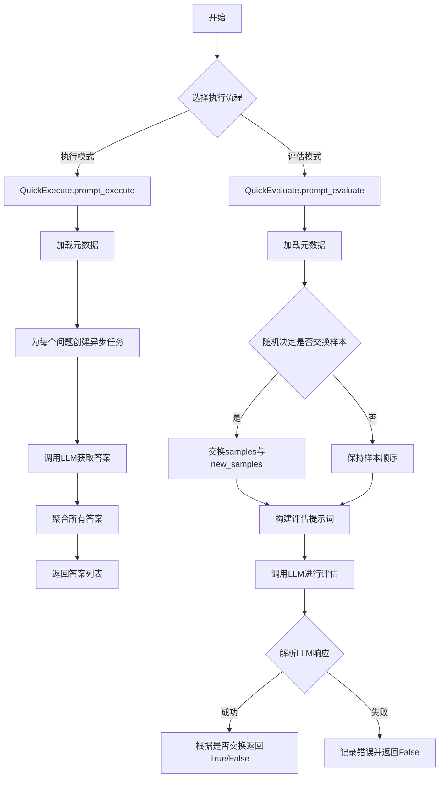
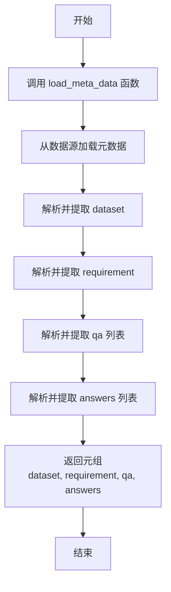
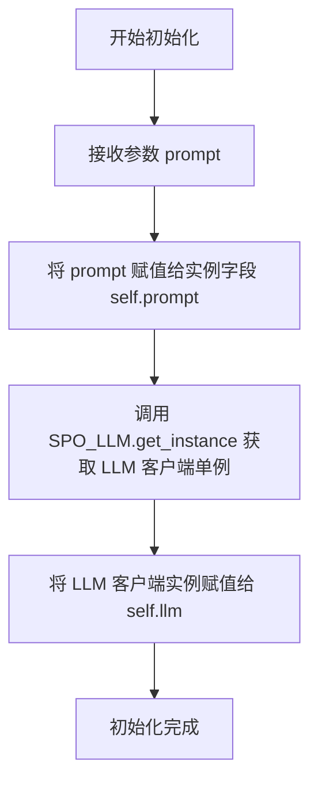
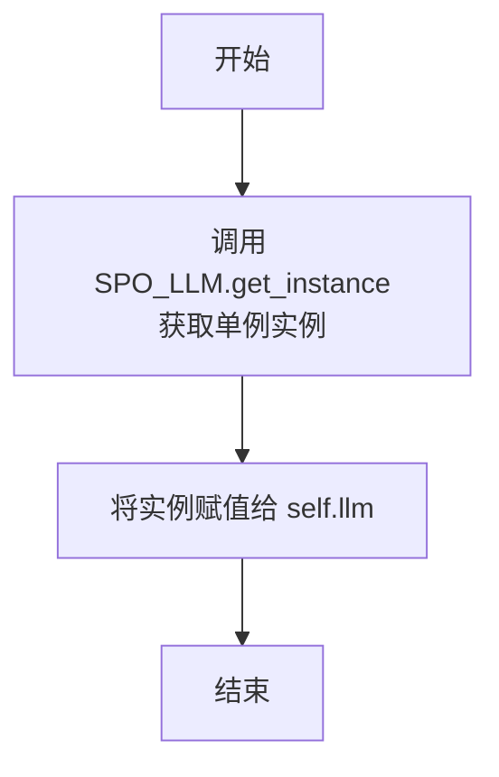
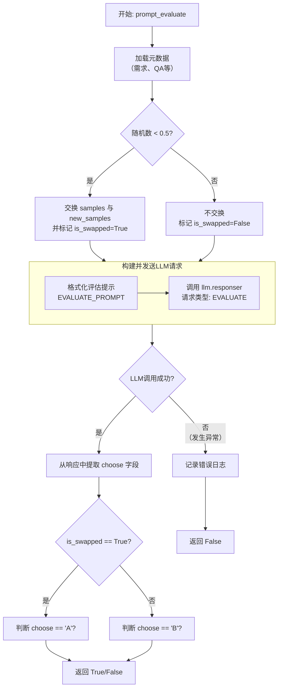

# `.\MetaGPT\metagpt\ext\spo\components\evaluator.py` 详细设计文档

该代码文件提供了一个用于评估不同模型在特定任务上表现的框架。它包含两个核心类：`QuickExecute` 用于异步执行提示词并获取模型对一系列问题的回答；`QuickEvaluate` 用于比较两组样本（例如，两个不同模型的输出）的质量，通过调用大语言模型（LLM）作为评判者，根据给定的要求和标准，判断哪一组样本更优。

## 整体流程



## 类结构

```
QuickExecute (执行类)
├── __init__
└── prompt_execute
QuickEvaluate (评估类)
├── __init__
└── prompt_evaluate
```

## 全局变量及字段


### `logger`
    
用于记录日志的日志记录器实例，提供不同级别的日志记录功能。

类型：`metagpt.logs.Logger`
    


### `QuickExecute.prompt`
    
存储要执行的提示词模板，用于构建LLM的输入消息。

类型：`str`
    


### `QuickExecute.llm`
    
SPO_LLM的单例实例，用于向大语言模型发送请求并获取响应。

类型：`SPO_LLM`
    


### `QuickEvaluate.llm`
    
SPO_LLM的单例实例，用于向大语言模型发送评估请求并获取响应。

类型：`SPO_LLM`
    
    

## 全局函数及方法


### `load.load_meta_data`

该函数用于加载元数据，返回一个包含四个元素的元组，分别对应数据集、需求描述、问答对列表和答案列表。

参数：
- 无参数

返回值：`tuple`，一个包含四个元素的元组，结构为 `(dataset, requirement, qa, answers)`。其中：
    - `dataset`：加载的数据集对象或数据。
    - `requirement`：与数据集相关的需求描述字符串。
    - `qa`：一个字典列表，每个字典代表一个问答对，通常包含 `"question"` 和 `"answer"` 键。
    - `answers`：一个列表，包含所有问题的标准答案。

#### 流程图



#### 带注释源码

```
# 注意：以下代码是根据调用上下文推断的函数实现。
# 实际函数定义可能在 `metagpt.ext.spo.utils.load` 模块中。

def load_meta_data() -> tuple:
    """
    加载并返回评估所需的元数据。

    Returns:
        tuple: 一个包含四个元素的元组，依次为：
            - dataset: 数据集对象或数据。
            - requirement: 需求描述字符串。
            - qa: 问答对列表，每个元素是一个包含'question'和'answer'的字典。
            - answers: 标准答案列表。
    """
    # 1. 从文件、数据库或配置中加载原始数据
    # raw_data = load_from_source(...)

    # 2. 解析原始数据，提取出数据集部分
    # dataset = parse_dataset(raw_data)

    # 3. 解析原始数据，提取出需求描述部分
    # requirement = parse_requirement(raw_data)

    # 4. 解析原始数据，提取出问答对列表
    # qa = parse_qa_pairs(raw_data)

    # 5. 从问答对列表中提取出所有答案，形成标准答案列表
    # answers = [item.get("answer") for item in qa]

    # 6. 将提取出的四个部分打包成元组并返回
    # return dataset, requirement, qa, answers

    # 占位返回语句，实际实现应返回具体数据
    return None, "", [], []
```


### `extract_content`

该函数用于从给定的文本响应中，提取指定标签内的内容。它通过识别文本中特定的开始和结束标记（例如 `<choose>` 和 `</choose>`），并返回这些标记之间的文本内容。如果未找到指定的标签，则返回 `None`。

参数：

-  `response`：`str`，包含可能带有标签的原始文本响应。
-  `tag`：`str`，需要提取内容的标签名称（例如 "choose"）。

返回值：`str | None`，如果成功找到并提取了标签内容，则返回该内容字符串；否则返回 `None`。

#### 流程图

```mermaid
flowchart TD
    A[开始: extract_content(response, tag)] --> B{response 或 tag 为空?};
    B -- 是 --> C[返回 None];
    B -- 否 --> D[构造开始标签<br/>start_tag = f'<{tag}>'];
    D --> E[构造结束标签<br/>end_tag = f'</{tag}>'];
    E --> F{response 中同时包含 start_tag 和 end_tag?};
    F -- 否 --> C;
    F -- 是 --> G[查找 start_tag 的结束位置<br/>start_idx = response.find(start_tag) + len(start_tag)];
    G --> H[查找 end_tag 的开始位置<br/>end_idx = response.find(end_tag, start_idx)];
    H --> I[提取并去除首尾空白字符<br/>content = response[start_idx:end_idx].strip()];
    I --> J{content 是否为空?};
    J -- 是 --> C;
    J -- 否 --> K[返回 content];
    K --> L[结束];
    C --> L;
```

#### 带注释源码

```python
def extract_content(response: str, tag: str) -> str | None:
    """
    从响应文本中提取指定标签内的内容。

    参数:
        response (str): 包含可能带有标签的原始文本响应。
        tag (str): 需要提取内容的标签名称（例如 "choose"）。

    返回:
        str | None: 如果成功找到并提取了标签内容，则返回该内容字符串；否则返回 None。
    """
    # 检查输入参数是否有效
    if not response or not tag:
        return None

    # 构造开始和结束标签字符串
    start_tag = f"<{tag}>"
    end_tag = f"</{tag}>"

    # 检查响应中是否同时包含开始和结束标签
    if start_tag in response and end_tag in response:
        # 找到开始标签的结束位置，即内容开始的位置
        start_idx = response.find(start_tag) + len(start_tag)
        # 从内容开始位置之后查找结束标签，找到内容结束的位置
        end_idx = response.find(end_tag, start_idx)
        # 提取标签之间的内容，并去除首尾的空白字符
        content = response[start_idx:end_idx].strip()
        # 如果提取的内容不为空，则返回；否则返回 None
        return content if content else None
    # 如果未找到完整的标签对，则返回 None
    return None
```


### `QuickExecute.__init__`

`QuickExecute` 类的构造函数，用于初始化一个快速执行器实例。它接收一个提示词字符串，并获取一个大型语言模型（LLM）客户端的单例实例，为后续的异步提示执行做准备。

参数：

-  `prompt`：`str`，用于后续执行的核心提示词字符串。

返回值：`None`，构造函数不返回任何值。

#### 流程图



#### 带注释源码

```python
def __init__(self, prompt: str):
    # 将传入的提示词字符串保存为实例变量，供类内其他方法（如 prompt_execute）使用。
    self.prompt = prompt
    # 通过 SPO_LLM 类的 get_instance 方法获取一个全局唯一的 LLM 客户端实例。
    # 这种方式确保了在整个应用中，QuickExecute 实例共享同一个 LLM 连接或配置。
    self.llm = SPO_LLM.get_instance()
```


### `QuickExecute.prompt_execute`

该方法用于异步执行给定的提示词（`prompt`）对一组问题（从元数据中加载）进行批量问答。它通过调用大语言模型（LLM）接口，为每个问题生成答案，并汇总返回。

参数：
-  `self`：`QuickExecute`，`QuickExecute`类的实例，包含要执行的提示词（`self.prompt`）和LLM客户端（`self.llm`）。

返回值：`tuple[Any]`，一个元组，其中包含一个字典列表。每个字典代表一个问题的问答结果，包含键`"question"`（原始问题）和`"answer"`（LLM生成的答案或异常信息）。

#### 流程图

```mermaid
flowchart TD
    A[开始] --> B[加载元数据，获取QA列表]
    B --> C[为每个问题创建异步任务<br>fetch_answer]
    C --> D[并发执行所有异步任务]
    D --> E{任务执行成功?}
    E -- 是 --> F[返回答案字典<br>question, answer]
    E -- 否 --> G[返回错误信息字典<br>question, str(e)]
    F & G --> H[聚合所有任务结果<br>得到answers列表]
    H --> I[将answers列表包装为元组返回]
    I --> J[结束]
```

#### 带注释源码

```python
async def prompt_execute(self) -> tuple[Any]:
    # 1. 从元数据中加载数据，这里只需要qa（问答对列表）
    _, _, qa, _ = load.load_meta_data()
    # 2. 初始化答案列表（虽然最终由asyncio.gather填充，这里定义清晰）
    answers = []

    # 3. 定义内部异步函数，用于处理单个问题的问答
    async def fetch_answer(q: str) -> Dict[str, Any]:
        # 3.1 构建发送给LLM的消息，将类实例的提示词与具体问题拼接
        messages = [{"role": "user", "content": f"{self.prompt}\n\n{q}"}]
        try:
            # 3.2 调用LLM客户端，指定请求类型为EXECUTE，并传入消息
            answer = await self.llm.responser(request_type=RequestType.EXECUTE, messages=messages)
            # 3.3 成功则返回包含问题和答案的字典
            return {"question": q, "answer": answer}
        except Exception as e:
            # 3.4 发生异常时，返回包含问题和错误信息的字典
            return {"question": q, "answer": str(e)}

    # 4. 为qa列表中的每个问题项，创建一个异步任务（调用fetch_answer）
    tasks = [fetch_answer(item["question"]) for item in qa]
    # 5. 并发执行所有任务，并等待它们全部完成，结果按任务创建顺序存储在answers中
    answers = await asyncio.gather(*tasks)

    # 6. 将结果列表包装成元组并返回
    return answers
```


### `QuickEvaluate.__init__`

该方法用于初始化 `QuickEvaluate` 类的实例，主要职责是获取 `SPO_LLM` 的单例实例，并将其赋值给实例变量 `self.llm`，为后续的评估操作提供语言模型客户端。

参数：
- 无

返回值：`None`，无返回值

#### 流程图



#### 带注释源码

```python
def __init__(self):
    # 获取 SPO_LLM 的单例实例，用于后续与语言模型交互
    self.llm = SPO_LLM.get_instance()
```


### `QuickEvaluate.prompt_evaluate`

该方法用于评估两组样本（`samples` 和 `new_samples`）在满足给定需求方面的优劣。它通过向大语言模型（LLM）发送一个格式化的评估提示，并解析模型的响应来决定哪一组样本更优。评估过程包含一个随机交换样本组的步骤，以增加评估的随机性或公平性。

参数：

-  `samples`：`dict`，第一组待评估的样本数据。
-  `new_samples`：`dict`，第二组待评估的样本数据。

返回值：`bool`，返回 `True` 表示 `samples` 优于 `new_samples`；返回 `False` 表示 `new_samples` 优于 `samples` 或评估过程中发生异常。

#### 流程图



#### 带注释源码

```python
async def prompt_evaluate(self, samples: dict, new_samples: dict) -> bool:
    # 1. 加载评估所需的元数据，包括需求描述和QA对
    _, requirement, qa, _ = load.load_meta_data()

    # 2. 随机决定是否交换两组样本的“身份”，以引入随机性
    if random.random() < 0.5:
        samples, new_samples = new_samples, samples
        is_swapped = True  # 标记发生了交换
    else:
        is_swapped = False # 标记未发生交换

    # 3. 构建发送给LLM的提示消息
    messages = [
        {
            "role": "user",
            "content": EVALUATE_PROMPT.format(
                requirement=requirement,  # 需求描述
                sample=samples,           # 第一组样本（可能已被交换）
                new_sample=new_samples,   # 第二组样本（可能已被交换）
                answers=str(qa)           # 参考的QA对
            ),
        }
    ]

    try:
        # 4. 调用LLM进行推理，指定请求类型为评估(EVALUATE)
        response = await self.llm.responser(request_type=RequestType.EVALUATE, messages=messages)
        # 5. 从LLM的响应中提取关键决策字段 "choose"（预期为 'A' 或 'B'）
        choose = extract_content(response, "choose")
        # 6. 根据是否交换过样本，解释 'choose' 的结果，并返回最终的布尔值判断
        #    如果交换过，则 choose=='A' 表示 new_samples 更优，即原 samples 更差，应返回 False
        #    如果没交换，则 choose=='B' 表示 samples 更优，应返回 True
        return choose == "A" if is_swapped else choose == "B"

    except Exception as e:
        # 7. 如果LLM调用或解析过程出现异常，记录错误并返回 False
        logger.error(e)
        return False
```


## 关键组件


### SPO_LLM

一个单例模式的LLM客户端，用于处理不同类型的请求（如执行和评估），封装了与大型语言模型的交互逻辑。

### 惰性数据加载 (`load.load_meta_data`)

一个用于加载元数据（如需求、问答对等）的实用函数，采用惰性加载策略，仅在需要时从数据源获取数据，以提高初始化和运行效率。

### 异步任务处理 (`asyncio.gather`)

利用Python的`asyncio`库进行并发异步任务处理，用于同时向LLM发送多个问题以获取答案，从而显著提升批量处理的性能。

### 随机样本交换策略

在评估过程中，以50%的概率随机交换待比较的两个样本（`samples`和`new_samples`）的顺序，并记录交换状态，以消除评估过程中可能存在的顺序偏见。

### 响应内容提取 (`extract_content`)

一个用于从LLM的复杂响应中提取特定结构化内容（例如，从评估响应中提取“choose”字段的值）的辅助函数。


## 问题及建议


### 已知问题

-   **数据加载耦合度高**：`QuickExecute.prompt_execute` 和 `QuickEvaluate.prompt_evaluate` 方法内部都直接调用 `load.load_meta_data()` 来获取数据。这导致类与数据加载逻辑紧密耦合，难以进行单元测试（需要模拟文件或网络I/O），也无法灵活地处理不同的数据源或进行数据预处理。
-   **随机交换逻辑可能导致评估结果不一致**：`QuickEvaluate.prompt_evaluate` 方法中，以50%的概率交换 `samples` 和 `new_samples` 的输入顺序，并据此反转最终判断逻辑。这种设计虽然可能旨在消除模型对输入顺序的偏见，但引入了非确定性，使得相同的输入可能产生不同的评估结果，不利于结果复现和调试。
-   **错误处理过于简单**：`QuickExecute.prompt_execute` 方法中，当 `llm.responser` 调用失败时，仅将异常信息作为答案返回。`QuickEvaluate.prompt_evaluate` 方法在异常时直接返回 `False`。这种处理方式丢失了错误的上下文和类型，不利于问题诊断和系统监控。
-   **潜在的资源竞争与性能瓶颈**：`QuickExecute.prompt_execute` 方法使用 `asyncio.gather` 并发执行所有问题的查询。如果问题数量巨大，可能会对下游LLM服务造成瞬时高负载压力，缺乏并发控制（如信号量）可能导致请求被限流或失败。
-   **类型注解不完整**：`QuickExecute.prompt_execute` 方法的返回类型标注为 `tuple[Any]`，但实际返回的是 `List[Dict[str, Any]]`。`QuickEvaluate.prompt_evaluate` 方法的 `samples` 和 `new_samples` 参数类型仅为 `dict`，过于宽泛，降低了代码的可读性和静态检查工具的有效性。

### 优化建议

-   **解耦数据加载**：将数据加载职责从业务类中剥离。可以为 `QuickExecute` 和 `QuickEvaluate` 的构造函数增加参数（如 `qa_data: List[Dict]`, `requirement: str`），由外部调用者负责加载并传入所需数据。这提高了类的可测试性和灵活性。
-   **移除或明确随机交换逻辑**：评估逻辑应具有确定性以确保结果可复现。建议移除随机交换。如果为了评估模型对顺序的鲁棒性，可以改为在外部进行多次评估（例如，分别以A/B和B/A顺序各评估一次），然后综合结果，而不是在单次评估内部随机化。
-   **增强错误处理与日志记录**：捕获异常时，应记录更详细的错误信息（如请求参数、异常堆栈）。考虑定义自定义异常类来区分不同类型的失败（如网络错误、LLM响应解析错误）。对于 `QuickExecute`，可以记录哪些问题失败了，而不是简单地将错误信息作为答案。
-   **引入并发控制**：在 `QuickExecute.prompt_execute` 中，使用 `asyncio.Semaphore` 来限制同时发起的LLM请求数量，避免对下游服务造成冲击。可以根据下游服务的容量配置合适的并发上限。
-   **完善类型注解**：修正 `QuickExecute.prompt_execute` 的返回类型为 `List[Dict[str, Any]]`。为 `QuickEvaluate.prompt_evaluate` 的 `samples` 和 `new_samples` 参数定义更具体的类型，例如使用 `TypedDict` 或 Pydantic `BaseModel` 来描述其预期结构。这有助于开发者理解和使用这些类，并利用mypy等工具进行类型检查。
-   **考虑配置化**：将 `EVALUATE_PROMPT` 的引用以及随机交换的概率（0.5）等硬编码值提取为类属性或通过配置注入，提高代码的可维护性和可配置性。


## 其它


### 设计目标与约束

本模块的核心设计目标是提供一个轻量级、异步的框架，用于执行和评估基于大语言模型（LLM）的提示词任务。它旨在支持对特定数据集（通过`load_meta_data`加载）进行快速、并发的问答生成（`QuickExecute`）以及基于LLM的答案质量比较与评估（`QuickEvaluate`）。主要约束包括：1）强依赖外部LLM服务（`SPO_LLM`）的可用性与性能；2）评估逻辑的随机性（随机交换样本顺序）可能影响评估结果的可重复性；3）错误处理较为基础，仅记录日志并返回默认值；4）数据加载逻辑（`load.load_meta_data`）与格式是固定的，限制了模块的通用性。

### 错误处理与异常设计

模块的错误处理策略较为简单。在`QuickExecute.prompt_execute`方法中，使用`try-except`捕获`llm.responser`调用可能抛出的任何异常，并将异常信息字符串作为`answer`返回，确保异步任务集合不会因单个失败而中断。在`QuickEvaluate.prompt_evaluate`方法中，同样使用`try-except`捕获LLM调用或内容解析（`extract_content`）过程中的异常，记录错误日志（`logger.error`）并返回`False`作为默认评估结果。这种设计保证了流程的健壮性，但缺乏对异常类型的细分处理（如网络超时、API配额不足、响应格式错误等），也未提供重试机制或更细致的失败反馈。

### 数据流与状态机

模块的数据流清晰且线性。对于执行流程（`QuickExecute`）：输入为固定的提示词模板（`self.prompt`）和通过`load_meta_data`加载的问题列表（`qa`）；内部为每个问题并发构造LLM请求消息；输出为包含每个问题及其对应答案（或错误信息）的字典列表。对于评估流程（`QuickEvaluate`）：输入为两套待比较的答案样本（`samples`, `new_samples`）；内部随机决定样本比较顺序，并组合需求、样本、标准答案（`qa`）构造评估提示词；通过LLM获取评估结果（`choose`），并根据随机交换标志（`is_swapped`）解析出最终布尔值（表示`new_samples`是否优于`samples`）。模块本身是无状态的，所有状态（如加载的数据、LLM实例）均在对象初始化时确定。

### 外部依赖与接口契约

1.  **LLM服务 (`SPO_LLM`)**: 核心外部依赖。通过单例模式`SPO_LLM.get_instance()`获取客户端。模块依赖其`responser`方法，并需按照`RequestType.EXECUTE`和`RequestType.EVALUATE`枚举值区分请求类型。响应格式需与`extract_content`函数的解析逻辑兼容。
2.  **数据加载模块 (`load`)**: 依赖`load.load_meta_data()`函数。该函数需返回一个四元组`(_, requirement, qa, _)`，其中`requirement`（字符串）和`qa`（字典列表，至少包含`"question"`键）被本模块使用。此接口契约是隐式的，变更可能导致运行时错误。
3.  **提示词模板 (`EVALUATE_PROMPT`)**: 依赖从`metagpt.ext.spo.prompts.evaluate_prompt`导入的`EVALUATE_PROMPT`字符串模板。该模板需包含`{requirement}`、`{sample}`、`{new_sample}`、`{answers}`四个占位符，其填充后的内容将作为评估的上下文。
4.  **工具函数 (`extract_content`)**: 依赖`metagpt.ext.spo.utils.llm_client.extract_content`函数，用于从LLM的响应中提取指定键（如`"choose"`）的内容。这要求LLM的响应格式与该函数的解析逻辑匹配。
5.  **日志系统 (`metagpt.logs.logger`)**: 依赖外部的日志记录器进行错误输出。
6.  **Python标准库**: 依赖`asyncio`（异步并发）、`random`（随机交换）、`typing`（类型注解）。

    