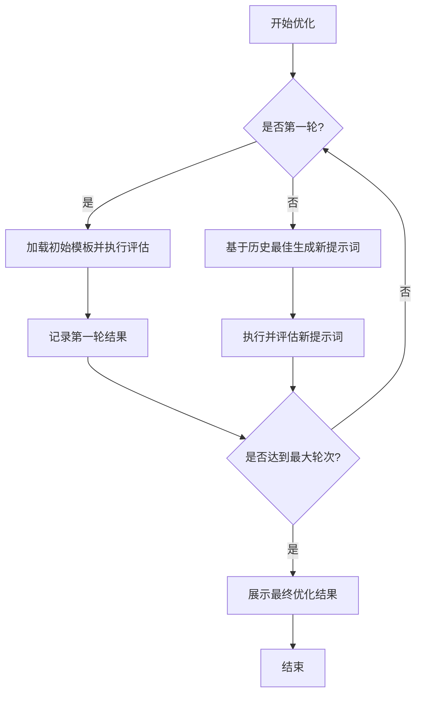
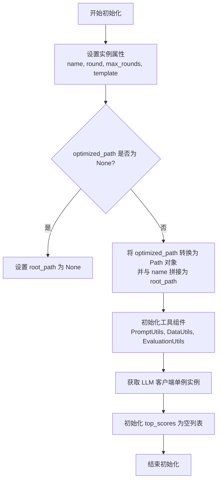
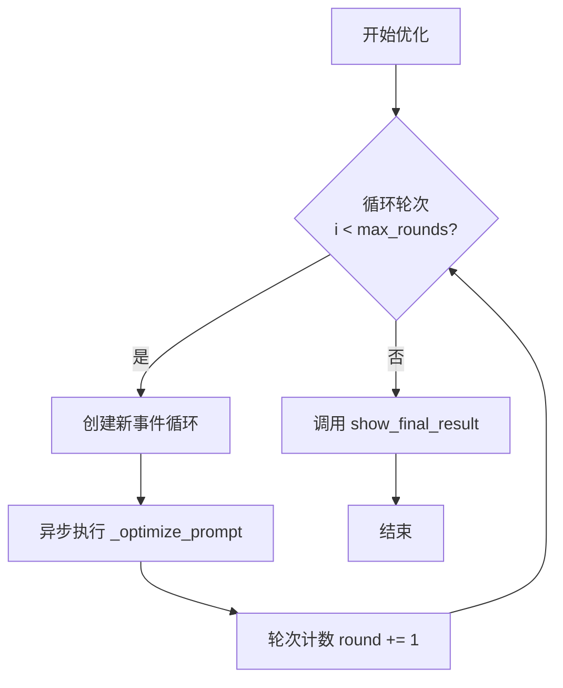
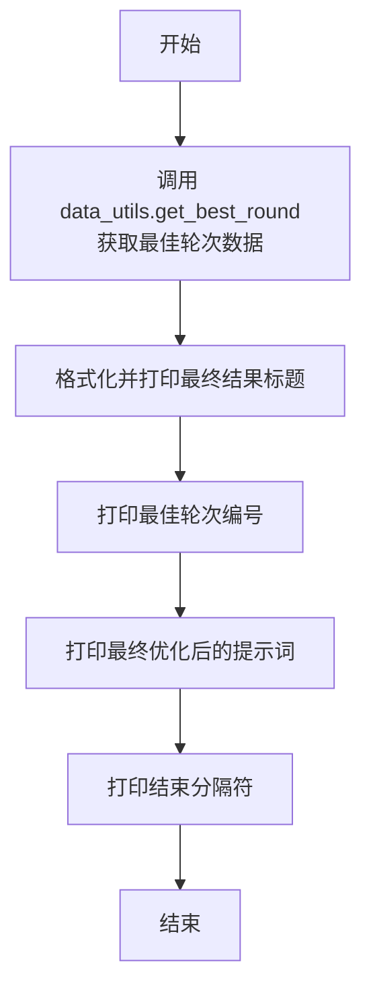
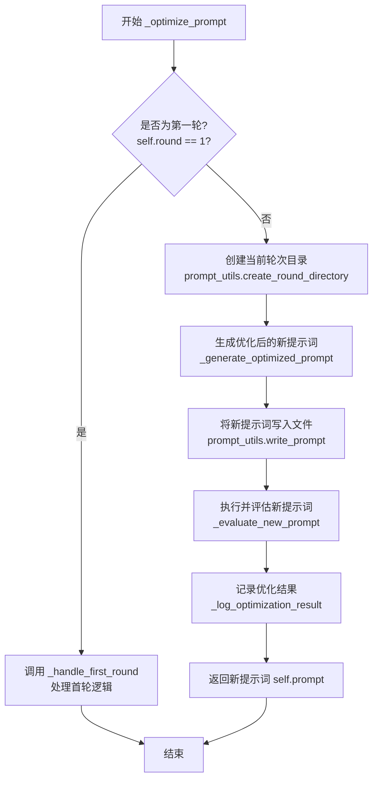
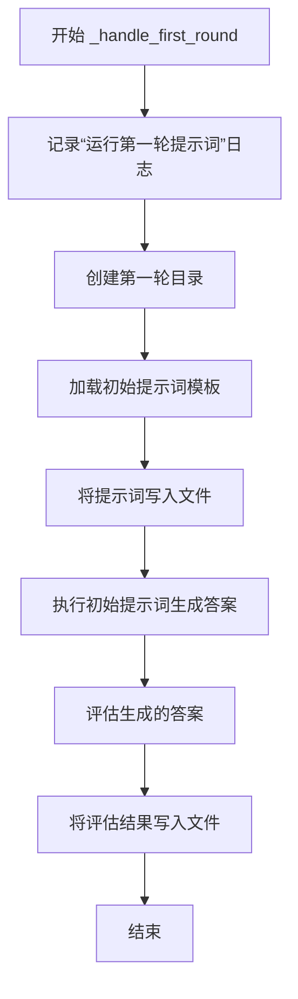
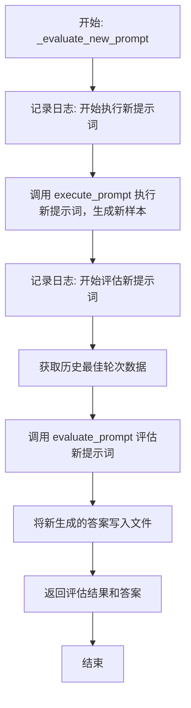
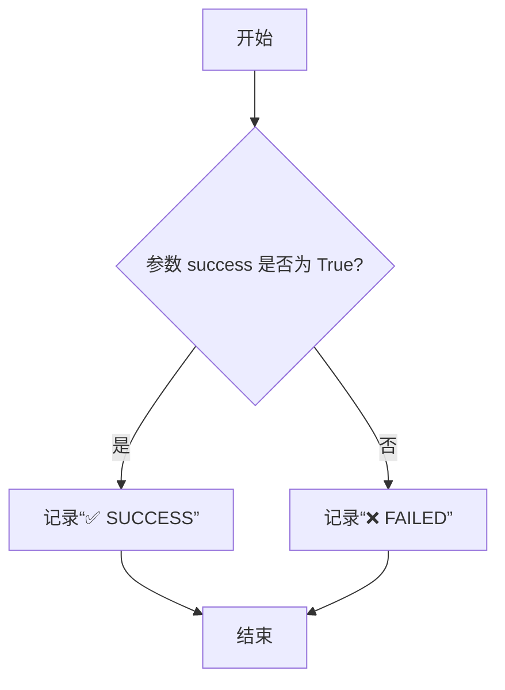

# `.\MetaGPT\metagpt\ext\spo\components\optimizer.py` 详细设计文档

该代码实现了一个提示词优化器（PromptOptimizer），它通过多轮迭代的方式，利用LLM（大语言模型）自动评估和优化给定的初始提示词模板。在每一轮中，它会基于历史最佳表现生成新的优化提示词，执行并评估其效果，最终输出最优的提示词及其表现。

## 整体流程



## 类结构

```
PromptOptimizer (提示词优化器主类)
├── __init__ (初始化)
├── optimize (主优化循环)
├── show_final_result (展示最终结果)
├── _optimize_prompt (单轮优化流程)
├── _handle_first_round (处理第一轮)
├── _generate_optimized_prompt (生成优化提示词)
├── _evaluate_new_prompt (评估新提示词)
└── _log_optimization_result (记录优化结果)
```

## 全局变量及字段


### `logger`
    
用于记录日志的全局日志记录器实例。

类型：`Logger`
    


### `PromptOptimizer.name`
    
优化器的名称，用于标识不同的优化任务或实例。

类型：`str`
    


### `PromptOptimizer.root_path`
    
优化过程中所有文件和结果存储的根目录路径。

类型：`Path`
    


### `PromptOptimizer.top_scores`
    
存储各轮优化中最佳得分或相关评估指标的列表。

类型：`List[Any]`
    


### `PromptOptimizer.round`
    
当前优化轮次，从初始轮次开始递增。

类型：`int`
    


### `PromptOptimizer.max_rounds`
    
优化过程的最大轮次限制。

类型：`int`
    


### `PromptOptimizer.template`
    
用于加载元数据（如初始提示、需求等）的模板名称或路径。

类型：`str`
    


### `PromptOptimizer.prompt_utils`
    
提供提示词相关操作（如创建目录、写入提示词等）的工具类实例。

类型：`PromptUtils`
    


### `PromptOptimizer.data_utils`
    
提供数据加载、处理和转换（如获取最佳轮次、列表转Markdown等）的工具类实例。

类型：`DataUtils`
    


### `PromptOptimizer.evaluation_utils`
    
提供提示词执行和评估功能的工具类实例。

类型：`EvaluationUtils`
    


### `PromptOptimizer.llm`
    
用于与大型语言模型交互的客户端实例，负责发送优化请求。

类型：`SPO_LLM`
    


### `PromptOptimizer.prompt`
    
当前轮次正在使用或生成的优化后的提示词内容。

类型：`str`
    
    

## 全局函数及方法

### `PromptOptimizer.__init__`

初始化 `PromptOptimizer` 类的实例，设置优化过程所需的核心参数、路径和工具组件。

参数：

- `optimized_path`：`str`，优化结果和中间文件的根目录路径。如果为 `None`，则不会创建路径。
- `initial_round`：`int`，优化过程的起始轮次，默认为 1。
- `max_rounds`：`int`，最大优化轮次，默认为 10。
- `name`：`str`，优化任务的名称，用于创建子目录。
- `template`：`str`，用于加载元数据（如初始提示、需求等）的模板标识符。

返回值：`None`，构造函数不返回任何值。

#### 流程图



#### 带注释源码

```python
def __init__(
    self,
    optimized_path: str = None,      # 优化结果存储的根目录路径
    initial_round: int = 1,          # 优化起始轮次
    max_rounds: int = 10,            # 最大优化轮次
    name: str = "",                  # 优化任务名称，用于路径区分
    template: str = "",              # 用于加载元数据的模板标识
) -> None:
    # 设置优化任务的基本标识和状态
    self.name = name
    # 构建优化过程的根目录路径：optimized_path/name
    self.root_path = Path(optimized_path) / self.name if optimized_path else None
    # 存储每轮最佳分数的列表
    self.top_scores = []
    # 设置当前优化轮次和最大轮次限制
    self.round = initial_round
    self.max_rounds = max_rounds
    # 存储模板标识，用于后续加载数据
    self.template = template

    # 初始化核心工具组件，它们将共享根目录路径以进行文件操作
    self.prompt_utils = PromptUtils(self.root_path)      # 处理提示词文件读写
    self.data_utils = DataUtils(self.root_path)          # 加载和处理评估数据
    self.evaluation_utils = EvaluationUtils(self.root_path) # 执行和评估提示词
    # 获取大语言模型客户端的单例实例，用于生成优化后的提示词
    self.llm = SPO_LLM.get_instance()
```

### `PromptOptimizer.optimize`

该方法负责执行提示词（Prompt）的自动化优化流程。它通过一个循环，在指定的最大轮次（`max_rounds`）内，依次调用内部方法 `_optimize_prompt` 来生成、评估和迭代优化提示词。每一轮优化都会生成新的提示词，并基于评估结果决定是否采纳。优化过程结束后，会调用 `show_final_result` 方法展示最终的最佳结果。

参数：
- `self`：`PromptOptimizer`，`PromptOptimizer` 类的实例，包含优化所需的所有配置和工具。

返回值：`None`，该方法不返回任何值，其作用在于执行优化流程并输出日志。

#### 流程图



#### 带注释源码

```python
def optimize(self):
    # 开始一个循环，最多执行 max_rounds 轮优化
    for opt_round in range(self.max_rounds):
        # 为异步操作创建一个新的事件循环
        loop = asyncio.new_event_loop()
        asyncio.set_event_loop(loop)
        # 运行异步的提示词优化核心流程
        loop.run_until_complete(self._optimize_prompt())
        # 完成一轮优化后，增加轮次计数
        self.round += 1

    # 所有轮次优化完成后，展示最终的最佳结果
    self.show_final_result()
```

### `PromptOptimizer.show_final_result`

该方法用于在提示词优化过程结束后，展示最终的最佳优化结果。它从持久化存储中检索出在之前所有轮次中表现最佳的一轮数据，并将该轮次的编号和优化后的最终提示词以结构化的日志形式输出，为开发者提供一个清晰的优化终点总结。

参数：
-  `self`：`PromptOptimizer`，`PromptOptimizer`类的实例，用于访问实例属性和方法。

返回值：`None`，该方法不返回任何值，其功能是打印日志信息。

#### 流程图



#### 带注释源码

```python
def show_final_result(self):
    # 1. 从数据工具类中获取在历史所有轮次中评估得分最高的那一轮数据。
    #    返回的数据结构是一个字典，通常包含 `round`（轮次号）和 `prompt`（该轮使用的提示词）等字段。
    best_round = self.data_utils.get_best_round()

    # 2. 在日志中打印一个醒目的分隔符和标题，标志着优化过程的结束和最终结果的展示。
    logger.info("\n" + "=" * 50)
    logger.info("\n🏆 OPTIMIZATION COMPLETED - FINAL RESULTS 🏆\n")

    # 3. 打印找到的最佳轮次的编号。
    logger.info(f"\n📌 Best Performing Round: {best_round['round']}")
    # 4. 打印该最佳轮次所使用的、经过优化的最终提示词内容。
    logger.info(f"\n🎯 Final Optimized Prompt:\n{best_round['prompt']}")

    # 5. 再次打印分隔符，使日志输出结构清晰。
    logger.info("\n" + "=" * 50 + "\n")
```

### `PromptOptimizer._optimize_prompt`

该方法是一个异步方法，是`PromptOptimizer`类中提示词优化流程的核心执行单元。它负责在非第一轮（即`self.round > 1`）的优化迭代中，执行以下操作：为当前轮次创建目录，调用LLM生成优化后的新提示词，将新提示词写入文件，然后执行并评估该新提示词，最后记录优化结果。

参数：
-  `self`：`PromptOptimizer`，`PromptOptimizer`类的实例，用于访问类属性和其他方法。

返回值：`str`，返回经过本轮优化后生成的新提示词字符串。

#### 流程图



#### 带注释源码

```python
async def _optimize_prompt(self):
    # 1. 构建提示词文件路径，并加载历史评估数据
    prompt_path = self.root_path / "prompts"
    load.set_file_name(self.template)
    data = self.data_utils.load_results(prompt_path)

    # 2. 判断是否为第一轮优化，如果是则执行首轮特殊逻辑
    if self.round == 1:
        await self._handle_first_round(prompt_path, data)
        return

    # 3. 为非第一轮优化创建专属目录
    directory = self.prompt_utils.create_round_directory(prompt_path, self.round)
    # 4. 调用LLM生成优化后的新提示词
    new_prompt = await self._generate_optimized_prompt()
    self.prompt = new_prompt

    # 5. 记录日志并将新提示词写入文件
    logger.info(f"\nRound {self.round} Prompt: {self.prompt}\n")
    self.prompt_utils.write_prompt(directory, prompt=self.prompt)

    # 6. 执行新提示词并评估其效果
    success, answers = await self._evaluate_new_prompt(prompt_path, data, directory)
    # 7. 记录本轮优化的最终结果（成功/失败）
    self._log_optimization_result(success)

    # 8. 返回本轮生成的新提示词
    return self.prompt
```


### `PromptOptimizer._handle_first_round`

该方法处理提示词优化流程中的第一轮。它负责加载初始提示词模板，创建第一轮的目录结构，执行初始提示词以生成答案，并对这些答案进行评估和记录。

参数：

-  `self`：`PromptOptimizer`，`PromptOptimizer`类的实例，提供访问类属性和其他方法的上下文。
-  `prompt_path`：`pathlib.Path`，存储提示词相关文件的根目录路径。
-  `data`：`List[dict]`，从之前轮次加载的评估结果数据列表。

返回值：`None`，此方法不返回任何值，其主要作用是通过执行和评估第一轮提示词来初始化优化流程。

#### 流程图



#### 带注释源码

```python
async def _handle_first_round(self, prompt_path: Path, data: List[dict]) -> None:
    # 记录开始第一轮操作的日志信息
    logger.info("\n⚡ RUNNING Round 1 PROMPT ⚡\n")
    # 为第一轮创建专用的目录结构
    directory = self.prompt_utils.create_round_directory(prompt_path, self.round)

    # 从模板加载元数据，获取初始提示词、需求、QA对和数量
    # 这里只使用了返回的第一个值（prompt），其他值被忽略
    prompt, _, _, _ = load.load_meta_data()
    # 将加载的初始提示词设置为当前实例的prompt属性
    self.prompt = prompt
    # 将初始提示词写入到第一轮创建的目录中
    self.prompt_utils.write_prompt(directory, prompt=self.prompt)

    # 使用初始提示词执行评估，生成新的答案样本
    new_samples = await self.evaluation_utils.execute_prompt(self, directory)
    # 对生成的答案进行评估，因为是第一轮，所以没有之前的样本（samples）用于比较
    # `initial=True` 标志表示这是初始评估
    _, answers = await self.evaluation_utils.evaluate_prompt(
        self, None, new_samples, path=prompt_path, data=data, initial=True
    )
    # 将评估得到的答案写入到第一轮的目录中
    self.prompt_utils.write_answers(directory, answers=answers)
```


### `PromptOptimizer._generate_optimized_prompt`

该方法负责生成优化后的提示词。它首先加载元数据（如需求、问答对等），然后获取上一轮最佳表现的数据（包括提示词和答案）。接着，它将这些信息与预定义的优化提示模板结合，构造出用于请求大语言模型（LLM）的完整提示。最后，它调用LLM获取优化建议和新的提示词，并从中提取出修改说明和优化后的新提示词返回。

参数：

-  `self`：`PromptOptimizer`，当前`PromptOptimizer`类的实例。

返回值：`str`，返回从LLM响应中提取出的优化后的新提示词字符串。如果提取失败，则返回空字符串。

#### 流程图

```mermaid
graph TD
    A[开始] --> B[加载元数据<br/>load.load_meta_data]
    B --> C[获取最佳轮次数据<br/>self.data_utils.get_best_round]
    C --> D[将问答数据转换为Markdown格式<br/>self.data_utils.list_to_markdown]
    D --> E[格式化优化提示模板<br/>PROMPT_OPTIMIZE_PROMPT.format]
    E --> F[调用LLM生成优化建议<br/>self.llm.responser]
    F --> G[从响应中提取修改说明<br/>extract_content(response, 'modification')]
    G --> H[从响应中提取新提示词<br/>extract_content(response, 'prompt')]
    H --> I{新提示词是否有效?}
    I -- 是 --> J[返回新提示词]
    I -- 否 --> K[返回空字符串]
    J --> L[结束]
    K --> L
```

#### 带注释源码

```python
async def _generate_optimized_prompt(self):
    # 1. 加载元数据：获取需求、问答对、数量等信息
    _, requirements, qa, count = load.load_meta_data()
    # 2. 获取历史最佳轮次的数据（包含该轮次的提示词和答案）
    samples = self.data_utils.get_best_round()

    # 3. 记录优化开始日志
    logger.info(f"\n🚀Round {self.round} OPTIMIZATION STARTING 🚀\n")
    logger.info(f"\nSelecting prompt for round {samples['round']} and advancing to the iteration phase\n")

    # 4. 数据格式化：将标准答案和最佳轮次的答案转换为Markdown格式，便于LLM处理
    golden_answer = self.data_utils.list_to_markdown(qa)
    best_answer = self.data_utils.list_to_markdown(samples["answers"])

    # 5. 构造发送给LLM的优化提示词
    #    将最佳轮次的提示词、答案、需求、标准答案等填入预定义的优化模板中
    optimize_prompt = PROMPT_OPTIMIZE_PROMPT.format(
        prompt=samples["prompt"],          # 上一轮最佳提示词
        answers=best_answer,               # 上一轮最佳答案
        requirements=requirements,         # 任务需求描述
        golden_answers=golden_answer,      # 标准答案（Ground Truth）
        count=count,                       # 样本数量
    )

    # 6. 调用大语言模型（LLM）获取优化建议
    response = await self.llm.responser(
        request_type=RequestType.OPTIMIZE, # 指定请求类型为“优化”
        messages=[{"role": "user", "content": optimize_prompt}] # 发送构造好的提示词
    )

    # 7. 从LLM的响应中提取“修改说明”部分，并记录日志
    modification = extract_content(response, "modification")
    logger.info(f"Modification of {self.round} round: {modification}")

    # 8. 从LLM的响应中提取“优化后的新提示词”部分
    prompt = extract_content(response, "prompt")
    # 9. 返回提取到的新提示词，如果提取失败则返回空字符串
    return prompt if prompt else ""
```

### `PromptOptimizer._evaluate_new_prompt`

该方法用于评估新生成的优化提示词。它首先执行新提示词以生成新的样本答案，然后通过对比新答案与历史最佳答案，评估新提示词的有效性。评估结果（成功与否）和生成的答案将被记录。

参数：

-  `prompt_path`：`Path`，存储提示词和评估数据的根目录路径。
-  `data`：`List[dict]`，历史评估数据列表。
-  `directory`：`Path`，当前轮次（round）对应的目录，用于存储本轮生成的提示词和答案。

返回值：`tuple[bool, List[dict]]`，返回一个元组，包含一个布尔值（表示新提示词是否优于历史最佳提示词）和一个字典列表（表示新提示词执行后生成的答案样本）。

#### 流程图



#### 带注释源码

```python
async def _evaluate_new_prompt(self, prompt_path, data, directory):
    # 记录开始执行新优化提示词的日志
    logger.info("\n⚡ RUNNING OPTIMIZED PROMPT ⚡\n")
    # 调用 EvaluationUtils 的 execute_prompt 方法，使用当前优化器实例和新目录执行提示词，生成新的答案样本
    new_samples = await self.evaluation_utils.execute_prompt(self, directory)

    # 记录开始评估新提示词性能的日志
    logger.info("\n📊 EVALUATING OPTIMIZED PROMPT 📊\n")
    # 从 DataUtils 获取历史最佳轮次的数据（包含提示词和答案）
    samples = self.data_utils.get_best_round()
    # 调用 EvaluationUtils 的 evaluate_prompt 方法，对比新样本与历史最佳样本，评估新提示词是否更优
    # `initial=False` 表示这不是第一轮评估
    success, answers = await self.evaluation_utils.evaluate_prompt(
        self, samples, new_samples, path=prompt_path, data=data, initial=False
    )

    # 将本轮评估生成的新答案写入到当前轮次的目录中
    self.prompt_utils.write_answers(directory, answers=answers)
    # 返回评估结果（布尔值）和生成的答案列表
    return success, answers
```

### `PromptOptimizer._log_optimization_result`

该方法用于记录单轮提示词优化的结果。它接收一个表示优化是否成功的布尔值，并根据该值输出相应的日志信息，清晰地展示本轮优化的最终状态。

参数：

-  `success`：`bool`，表示本轮提示词优化是否成功的标志。`True` 表示成功，`False` 表示失败。

返回值：`None`，该方法不返回任何值，仅执行日志记录操作。

#### 流程图



#### 带注释源码

```python
def _log_optimization_result(self, success):
    # 输出优化结果的分隔标题
    logger.info("\n🎯 OPTIMIZATION RESULT 🎯\n")
    # 根据传入的 success 参数，判断并记录本轮优化的成功或失败状态
    # 使用三元表达式动态生成日志内容
    logger.info(f"\nRound {self.round} Optimization: {'✅ SUCCESS' if success else '❌ FAILED'}\n")
```

## 关键组件


### PromptOptimizer 类

PromptOptimizer 类是提示词优化的核心控制器，负责管理整个优化流程，包括初始化、多轮迭代优化、结果评估与展示。

### 提示词优化流程

定义了从初始提示词开始，通过多轮迭代（每轮包含生成、执行、评估、选择等步骤）来优化提示词，最终输出最佳提示词的完整工作流。

### 数据加载与元数据管理

通过 `load` 模块和 `DataUtils` 类，负责加载初始的提示词模板、需求、问答对等元数据，并在优化过程中管理不同轮次的结果数据。

### 提示词生成与优化

通过 `_generate_optimized_prompt` 方法，利用大语言模型（LLM）根据历史最佳提示词、其对应的答案、标准答案以及需求，生成新的、经过优化的提示词。

### 提示词执行与评估

通过 `EvaluationUtils` 类，负责执行新生成的提示词以获取答案，并将这些答案与标准答案进行对比评估，以判断本轮优化是否成功。

### 结果持久化与目录管理

通过 `PromptUtils` 类，负责为每一轮优化创建独立的目录，并将该轮的提示词、生成的答案等结果写入文件，实现结果的持久化存储和版本管理。

### 大语言模型客户端

`SPO_LLM` 类作为与大语言模型交互的客户端，封装了模型调用、请求类型管理和响应内容提取等功能，是提示词生成和优化的核心依赖。

### 工具类集合

包含 `DataUtils`、`EvaluationUtils`、`PromptUtils` 等工具类，分别负责数据处理、评估逻辑和文件操作，为优化流程提供模块化的支持。


## 问题及建议


### 已知问题

-   **事件循环管理不当**：在 `optimize` 方法的循环中，每次迭代都创建新的 `asyncio` 事件循环 (`asyncio.new_event_loop()`) 并手动设置。这种做法在嵌套或复杂异步环境中可能导致事件循环冲突、资源泄漏或不可预测的行为，尤其是在与外部异步框架集成时。
-   **错误处理缺失**：代码中缺乏对关键操作（如 `load.load_meta_data()`、`llm.responser()`、`evaluation_utils.execute_prompt()` 等）的异常捕获和处理。如果这些操作失败（例如，文件不存在、网络错误、LLM API 调用失败），程序会直接崩溃，缺乏优雅降级或重试机制。
-   **潜在的无限循环风险**：`optimize` 方法使用 `for` 循环执行固定轮次 (`max_rounds`)，但内部没有检查提前终止条件（例如，当优化分数达到满意阈值时）。这可能导致不必要的计算开销和成本。
-   **状态管理不清晰**：`self.prompt` 在 `_handle_first_round` 和 `_optimize_prompt` 中被赋值，但其生命周期和在不同方法间的同步状态未明确说明。同时，`self.top_scores` 字段被声明但从未在类中使用，可能是冗余代码或未完成的功能。
-   **资源路径硬编码**：`prompt_path` 被硬编码为 `self.root_path / "prompts"`，缺乏灵活性。如果项目结构变化或需要支持不同的路径配置，修改起来会比较麻烦。
-   **日志输出过于冗杂**：代码中插入了大量装饰性日志（如 `"🚀Round {self.round} OPTIMIZATION STARTING 🚀"`），虽然有助于调试，但在生产环境或长期运行中可能造成日志膨胀，影响可读性和存储。

### 优化建议

-   **重构事件循环管理**：将 `optimize` 方法改为 `async` 方法，并在顶层（如 `main` 函数）统一管理一个事件循环。移除 `asyncio.new_event_loop()` 和 `loop.run_until_complete` 的调用，直接使用 `await` 调用异步方法。这样可以避免事件循环的混乱，符合 `asyncio` 的最佳实践。
-   **增强错误处理与鲁棒性**：
    -   在 `_generate_optimized_prompt`、`_evaluate_new_prompt` 等关键方法中添加 `try-except` 块，捕获可能出现的异常（如 `FileNotFoundError`, `KeyError`, `ConnectionError` 等）。
    -   对于可重试的错误（如网络超时），实现指数退避的重试逻辑。
    -   记录详细的错误信息，并考虑在优化失败时提供备选方案（如回退到上一轮的最佳提示）。
-   **引入提前终止机制**：在 `optimize` 循环中，检查每轮优化后的评估结果（`success` 标志或分数）。如果连续若干轮没有改进，或分数已达到预设目标，可以提前跳出循环，节省计算资源和时间。
-   **清理和明确状态管理**：
    -   移除未使用的 `self.top_scores` 字段，或实现其功能。
    -   考虑将 `self.prompt` 的更新逻辑集中化，并明确其作为当前轮次优化提示的用途。可以添加一个方法来统一获取当前最佳提示。
    -   使用 `@property` 装饰器或显式的 getter/setter 方法来管理关键状态，提高封装性。
-   **提高配置灵活性**：
    -   将 `"prompts"` 等硬编码路径作为类初始化参数或配置文件项，提高代码的可配置性和可测试性。
    -   考虑使用 `pathlib.Path` 更安全地构建路径。
-   **优化日志策略**：
    -   引入日志级别控制（如 `logging.DEBUG`, `logging.INFO`）。将详细的流程日志设置为 `DEBUG` 级别，只在需要时启用。
    -   保持核心状态变更和结果日志为 `INFO` 级别，确保日志的清晰和有效。
    -   考虑使用结构化的日志格式，便于后续的日志分析和监控。
-   **提高代码可测试性**：
    -   将 `load.load_meta_data()`、`llm.responser()` 等外部依赖通过依赖注入（如作为 `__init__` 参数）的方式传入，而不是在方法内部直接调用。这样可以方便地在单元测试中模拟（mock）这些依赖。
    -   将复杂的异步方法拆分为更小、功能更单一的函数，便于单独测试。


## 其它


### 设计目标与约束

1.  **设计目标**：
    *   实现一个自动化的提示词（Prompt）优化流程，通过多轮迭代，基于评估反馈不断改进提示词，以提升其在特定任务（如结构化信息提取）上的性能。
    *   提供清晰的优化过程记录，包括每轮的提示词、生成的答案、评估结果以及优化建议。
    *   支持从初始提示词开始优化，也支持基于历史最佳结果进行迭代优化。

2.  **设计约束**：
    *   依赖于外部大语言模型（LLM）服务（通过 `SPO_LLM` 类）来生成优化后的提示词和执行提示词。
    *   优化过程是同步阻塞的，通过 `asyncio` 事件循环在 `optimize` 方法中顺序执行多轮优化。
    *   数据（提示词、答案、评估结果）的存储和读取依赖于文件系统，遵循特定的目录结构（`root_path / name / prompts / round_*`）。
    *   最大优化轮次由 `max_rounds` 参数限制，防止无限循环。

### 错误处理与异常设计

1.  **显式错误处理**：
    *   在 `_generate_optimized_prompt` 方法中，从 LLM 响应中提取 `prompt` 内容后，会检查其是否为空。如果为空，则返回空字符串作为默认值，防止后续流程因 `None` 值而中断。
    *   在 `_optimize_prompt` 方法中，`_evaluate_new_prompt` 返回的 `success` 标志被用于记录优化结果，但并未因失败而终止整个优化流程，体现了“尝试并记录”的容错思想。

2.  **隐式错误处理（依赖调用方）**：
    *   核心的 LLM 调用（`self.llm.responser`）、文件操作（`self.prompt_utils.write_prompt`）、数据加载（`self.data_utils.load_results`）等方法可能抛出异常（如网络错误、IO错误、数据格式错误）。当前代码中未对这些潜在异常进行捕获和处理，意味着这些异常将向上传播，由调用 `PromptOptimizer.optimize()` 的代码负责处理。这要求调用方具备相应的错误处理机制。

3.  **日志记录**：
    *   使用 `logger` 对象在关键步骤（如每轮开始、优化建议生成、评估结果）输出信息性日志，有助于在出现问题时进行调试和追踪流程状态。

### 数据流与状态机

1.  **核心数据流**：
    *   **输入**：初始模板名称（`template`）、优化存储路径（`optimized_path`）、任务名称（`name`）。
    *   **处理**：
        1.  **初始化**：加载元数据（`load.load_meta_data`），获取初始需求、示例问答等。
        2.  **第一轮**：直接使用初始提示词，执行并评估，将结果保存。
        3.  **后续轮次**：
            a.  **生成**：读取历史最佳轮次的数据，结合需求与示例，调用 LLM 生成优化建议和新的提示词。
            b.  **执行**：使用新提示词执行任务，生成新的答案样本。
            c.  **评估**：将新答案与历史最佳答案（或黄金答案）对比，评估优化是否成功。
            d.  **持久化**：保存新提示词、答案及评估结果。
    *   **输出**：存储在文件系统中的多轮优化记录，以及控制台打印的最终最佳结果（轮次和提示词）。

2.  **状态机（简化）**：
    *   **状态**：当前优化轮次（`self.round`）、历史最佳轮次数据（通过 `self.data_utils.get_best_round()` 获取）。
    *   **转移**：
        *   `round == 1` -> 执行 `_handle_first_round`。
        *   `round > 1` 且 `round <= max_rounds` -> 执行 `_generate_optimized_prompt` -> `_evaluate_new_prompt`。
        *   每轮结束后 `self.round += 1`。
        *   达到 `max_rounds` 后，进入 `show_final_result` 状态。

### 外部依赖与接口契约

1.  **外部依赖**：
    *   **`metagpt.ext.spo.utils.llm_client.SPO_LLM`**：提供与大语言模型交互的客户端。`PromptOptimizer` 依赖其 `get_instance()` 方法获取实例，并调用 `responser` 方法发送优化请求和执行请求。契约要求 `responser` 返回符合预期的响应格式。
    *   **`metagpt.ext.spo.utils` 中的 `load` 模块**：提供 `load_meta_data` 和 `set_file_name` 函数，用于加载优化任务所需的元数据（初始提示、需求、QA对等）。契约要求元数据文件存在且格式正确。
    *   **`metagpt.ext.spo.utils.data_utils.DataUtils`**：提供数据加载、结果查询（`get_best_round`）、数据格式转换（`list_to_markdown`）等功能。契约依赖于特定的文件存储结构。
    *   **`metagpt.ext.spo.utils.evaluation_utils.EvaluationUtils`**：提供提示词执行（`execute_prompt`）和评估（`evaluate_prompt`）的核心逻辑。这是优化效果判定的关键依赖。
    *   **`metagpt.ext.spo.utils.prompt_utils.PromptUtils`**：负责管理优化过程中产生的文件（创建目录、写入提示词和答案）。
    *   **`metagpt.ext.spo.prompts.optimize_prompt.PROMPT_OPTIMIZE_PROMPT`**：一个字符串模板，定义了请求 LLM 优化提示词的固定提示格式。契约要求该模板包含必要的占位符（如 `{prompt}`, `{answers}` 等）。

2.  **接口契约**：
    *   **`__init__` 方法**：调用者需提供 `optimized_path` 和 `name` 以确定工作空间，提供 `template` 以指定初始任务。`initial_round` 和 `max_rounds` 控制优化起点和终点。
    *   **`optimize` 方法**：是主要的公开接口，启动并阻塞直到整个多轮优化完成。无参数，返回 `None`。执行过程中会写入文件并打印日志。
    *   **`_generate_optimized_prompt` 等方法**：内部私有方法，遵循特定的异步接口定义，并期望从 `load`、`data_utils` 等依赖项获取特定格式的数据。

    