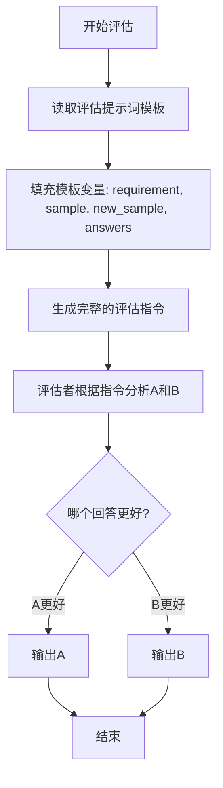

# `.\MetaGPT\metagpt\ext\spo\prompts\evaluate_prompt.py` 详细设计文档

该代码定义了一个用于评估AI模型生成文本质量的提示词模板。它通过比较两个候选回答（A和B）与原始需求及参考答案的匹配度，引导评估者进行分析并做出选择。

## 整体流程



## 类结构

```
无类结构 (仅包含全局字符串常量)
```

## 全局变量及字段


### `EVALUATE_PROMPT`
    
一个用于评估两个响应（A和B）哪个更好地满足原始需求的提示词模板字符串，其中包含占位符用于插入需求、待评估的响应样本、参考答案等具体内容。

类型：`str`
    


    

## 全局函数及方法


## 关键组件


### 提示词模板 (Prompt Template)

一个用于评估两个AI模型响应（A和B）质量的预定义字符串模板，它定义了评估任务的结构、输入变量和输出格式。

### 变量插值 (Variable Interpolation)

模板中用于动态插入具体评估内容的占位符（如 `{requirement}`, `{sample}`, `{new_sample}`, `{answers}`），使得同一个模板可以复用于不同的评估任务。

### 结构化输出指令 (Structured Output Instruction)

通过明确的指令（“Provide your analysis... using XML tags to encapsulate your response.”）和预定义的XML标签（`<analyse>` 和 `<choose>`），强制要求评估结果以机器可解析的结构化格式输出。

### 评估标准 (Evaluation Criteria)

隐含在模板指令中的评估逻辑：要求基于原始需求（`{requirement}`）和参考答案（`{answers}`）来比较两个响应（A和B），并选择更优者。参考答案的存在引入了“严格遵循”的约束，作为评估的关键依据。


## 问题及建议


### 已知问题

-   **硬编码的提示词模板**：`EVALUATE_PROMPT` 字符串被硬编码在代码中。这导致任何对提示词格式、内容或语言的修改都需要直接修改源代码，降低了灵活性和可维护性。在多语言支持或需要根据不同场景动态调整提示词的场景下，此设计会成为瓶颈。
-   **缺乏输入验证与错误处理**：代码片段仅展示了模板字符串，没有包含任何加载、填充或使用该模板的逻辑。在实际使用中，如果传入的 `requirement`、`sample`、`new_sample` 或 `answers` 变量包含可能破坏 XML 格式的特殊字符（如 `<`, `>`, `&`），生成的响应将导致 XML 解析失败。代码没有对输入进行清理或转义。
-   **脆弱的输出格式依赖**：评估逻辑严重依赖 LLM 严格按照 `<analyse>` 和 `<choose>` 的 XML 标签格式输出。如果 LLM 的输出出现细微偏差（如添加额外空格、换行、注释或使用不同标签），下游的解析程序可能会失败。这种“字符串匹配”式的接口契约非常脆弱。
-   **模板可读性与维护性差**：长字符串模板在代码中直接定义，当内容复杂时（如包含多行、复杂占位符），可读性较差，不利于后续的审查和修改。

### 优化建议

-   **将提示词外部化**：将 `EVALUATE_PROMPT` 模板移至外部配置文件（如 YAML、JSON）或专门的提示词管理模块中。这样可以在不重新部署代码的情况下修改提示词，并方便支持多环境、多版本。
-   **实现输入清理与转义**：在将变量填充到模板前，应对所有输入字符串进行转义处理，特别是当它们将被包裹在 XML 标签中时。可以使用标准的 XML/HTML 转义库（如 Python 的 `html.escape`）来处理 `<`, `>`, `&` 等字符。
-   **强化输出解析的鲁棒性**：下游解析代码不应依赖严格的字符串匹配。建议使用健壮的 XML 解析器（如 Python 的 `xml.etree.ElementTree`）来提取 `<analyse>` 和 `<choose>` 标签内的内容，这样即使输出中有无关的空白字符或命名空间，也能正确解析。或者，考虑使用更结构化的输出格式要求，如 JSON。
-   **改进模板定义方式**：使用 Python 的三引号字符串或从外部文件读取来改善长模板的可读性。可以考虑使用现代 Python 的 f-string 或 `str.format` 的清晰写法，并为占位符添加明确的类型或格式注释。
-   **添加模板使用示例与文档**：在代码中或相关文档中，应明确说明如何正确调用此模板，包括各个参数期望的数据类型和格式（例如，`answers` 是否应为纯文本还是结构化数据），以减少误用。


## 其它


### 设计目标与约束

本代码片段的核心设计目标是提供一个可复用的、结构化的提示词模板，用于基于特定需求对两个候选回答（A和B）进行评估和选择。其设计约束包括：
1.  **输入驱动**：评估逻辑完全依赖于外部传入的 `requirement`、`sample`、`new_sample` 和 `answers` 四个变量，代码本身不包含任何业务逻辑或判断规则。
2.  **输出格式化**：强制要求评估结果（分析和选择）必须封装在特定的XML标签（`<analyse>` 和 `<choose>`）中，以确保下游系统能够进行结构化解析。
3.  **模板化与可配置性**：通过Python的三引号字符串定义模板，使得提示词内容易于修改和维护，无需改动代码逻辑。
4.  **无状态性**：该模板字符串是全局常量，不维护任何状态，每次评估都是独立的。

### 错误处理与异常设计

当前代码片段（一个字符串常量）本身不具备错误处理能力。错误处理的责任完全转移给了使用此模板的调用者（例如，一个LLM调用框架或脚本）。潜在的异常场景及处理责任归属包括：
1.  **模板变量缺失**：如果调用者在格式化字符串时未提供 `requirement`、`sample`、`new_sample`、`answers` 中的任何一个或多个，将引发 `KeyError`。调用者需确保传入所有必要参数。
2.  **格式错误**：如果生成的最终提示词不符合大语言模型（LLM）的输入要求，或者LLM的返回结果未能严格遵循 `<analyse>` 和 `<choose>` 的XML格式，解析将失败。调用者需要负责捕获这些解析异常，并可能实施重试、降级或报错策略。
3.  **内容安全与注入**：由于模板内容直接拼接用户提供的 `requirement` 和 `answers` 等，存在提示词注入的风险。调用者应在传入变量前对内容进行必要的清洗或转义，以防止恶意指令破坏评估逻辑。

### 数据流与状态机

本组件的数据流是线性的、无状态的：
1.  **输入**：四个字符串参数：`requirement`（原始需求）、`sample`（回答A）、`new_sample`（回答B）、`answers`（参考/黄金答案）。
2.  **处理**：调用者（如Python的 `str.format` 方法）将输入参数注入到 `EVALUATE_PROMPT` 模板的相应占位符（`{...}`）中，生成一个完整的、可供LLM处理的提示词字符串。
3.  **输出**：生成的提示词字符串。该字符串预期被发送给LLM，LLM处理后返回一个包含 `<analyse>` 和 `<choose>` 标签的XML格式字符串。
    该过程不涉及任何状态存储或转换，是一个纯函数式的模板填充操作。

### 外部依赖与接口契约

1.  **外部依赖**：
    *   **大语言模型（LLM）服务**：核心外部依赖。该模板生成的提示词专为LLM设计，其有效性依赖于LLM对指令的理解和遵循能力。
    *   **字符串格式化引擎**：依赖于Python的字符串格式化功能（如 `format` 方法）来填充模板。
    *   **调用者环境**：依赖于调用者提供正确的、已预处理的输入参数。

2.  **接口契约**：
    *   **输入契约**：调用者必须提供一个包含 `requirement`、`sample`、`new_sample`、`answers` 四个键的字典（或等价物）用于模板渲染。
    *   **输出契约**：该模板本身输出一个字符串。然而，它隐含地定义了与**下游LLM**和**结果解析器**的契约：LLM返回的文本必须严格遵循 `<analyse>...</analyse><choose>A/B</choose>` 的格式，以便解析器能提取“分析”和“选择”两部分内容。

    