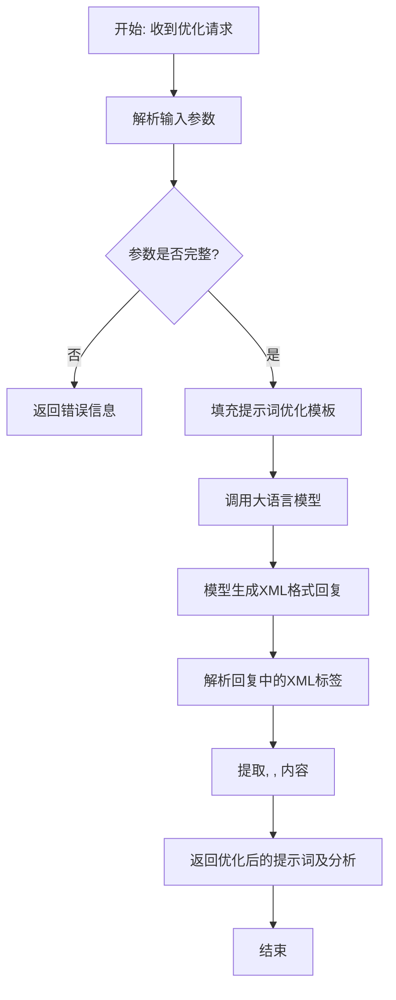

# `.\MetaGPT\metagpt\ext\spo\prompts\optimize_prompt.py` 详细设计文档

该代码定义了一个用于优化AI提示词（Prompt）的模板字符串。它通过分析用户需求、参考提示词、参考提示词的执行结果以及期望的最佳答案，指导AI系统重构和优化提示词，最终输出包含分析、修改要点和完整优化后提示词的XML格式结果。

## 整体流程



## 类结构

```
无显式类结构
├── 全局常量: PROMPT_OPTIMIZE_PROMPT (多行字符串模板)
└── 无显式函数
```

## 全局变量及字段


### `PROMPT_OPTIMIZE_PROMPT`
    
一个用于指导AI优化提示词（prompt）的多行字符串模板，包含占位符以接收用户需求、参考提示词、执行结果和期望答案等输入。

类型：`str`
    


    

## 全局函数及方法


## 关键组件


### 提示词优化模板

一个用于重构和优化用户提示词的多轮对话模板，它通过分析需求、参考提示词、执行结果和期望答案，引导生成包含分析、修改点和完整优化提示词的XML格式回复。

### XML格式输出规范

定义了优化结果的结构化输出格式，要求回复必须包含`<analyse>`、`<modification>`和`<prompt>`三个XML标签，分别用于存放分析过程、修改点总结和完整的优化后提示词。

### 多模态输入与上下文

系统整合了多种输入信息作为优化依据，包括用户原始需求、待优化的参考提示词、参考提示词的历史执行结果以及期望的理想答案（黄金标准），为生成高质量的优化建议提供了丰富的上下文。

### 迭代优化与差异化要求

明确要求优化必须基于一个历史表现优秀的提示词进行，并且优化后的新提示词必须与提供的参考示例有所区别，强调了持续改进和避免简单复制的原则。


## 问题及建议


### 已知问题

-   **提示词结构僵化**：代码强制要求输出必须包含固定的三个XML标签（`<analyse>`、`<modification>`、`<prompt>`），这限制了LLM的创造性，可能导致其为了满足格式要求而生成质量不高的内容，而非专注于优化提示词本身。
-   **上下文信息过载**：提示词模板中同时包含了`requirements`、`prompt`、`answers`和`golden_answers`四部分上下文。对于复杂的优化任务，这可能提供必要信息，但也可能造成信息冗余，分散LLM的注意力，增加其处理负担。
-   **优化目标模糊**：指令“You must make further optimizations and improvements”和“The modified prompt must differ from the provided example”是定性的、模糊的要求。缺乏具体的、可衡量的优化标准（例如：提高指令清晰度20%、减少歧义、增强特定任务的性能），可能导致优化方向不一致或效果难以评估。
-   **缺乏迭代与验证指引**：当前流程是单次优化。没有机制要求LLM对优化后的提示词进行自我评估、解释其相对于旧版本的改进之处，或提出验证其效果的简单方法，使得优化结果的可靠性和有效性存疑。
-   **硬编码的“{count}”变量**：在`<prompt>`标签的描述中硬编码了“{count}”变量（`Provide the complete optimized prompt {count}`），但该变量在提供的上下文或指令中并未定义或传入，这会导致最终生成的提示词文本中包含未替换的占位符，是一个明显的运行时错误。

### 优化建议

-   **采用更灵活的响应格式**：建议将固定的XML标签结构改为更灵活的指令，例如“请按以下部分组织你的回复：1. 分析报告； 2. 修改摘要； 3. 优化后的完整提示词。”。这既保证了结构的清晰，又允许LLM使用更自然的语言，可能提升内容质量。
-   **优化上下文输入策略**：引入动态上下文加载机制。可以设计一个前置步骤，让LLM先分析优化需求，再主动请求它认为必要的信息（如：“要优化此提示词，请提供其在实际使用中的3个失败案例”），而非一次性提供所有可能信息。
-   **定义明确的优化指标与约束**：在`requirements`或系统指令中，明确具体的优化维度。例如：“优化目标：1. 将提示词的模糊指令减少至少30%； 2. 确保优化后的提示词在[某项具体任务]上的预期性能不低于参考提示词； 3. 新提示词长度不得超过原提示词的120%。”
-   **引入自我评估与解释环节**：在输出要求中增加一个部分，例如“<rationale>解释你的优化如何解决了分析中提到的问题，并预测优化后提示词可能带来的改进。</rationale>”。这鼓励LLM进行元认知思考，使优化过程更加透明和可信。
-   **修复变量引用错误**：移除`<prompt>`标签描述中未定义的`{count}`变量，或确保在调用此模板时传入相应的`count`值。正确的描述应为“Provide the complete optimized prompt”。


## 其它


### 设计目标与约束

本代码段的核心设计目标是提供一个结构化的模板，用于指导AI（如大型语言模型）对给定的初始提示词（prompt）进行迭代优化。其核心约束包括：
1.  **输入结构化**：必须接收用户需求（requirements）、待优化的参考提示词（prompt）、参考提示词的执行结果示例（answers）以及期望的最佳答案示例（golden_answers）作为输入。
2.  **输出标准化**：优化过程的分析、修改点和最终优化的提示词必须严格按照指定的XML标签格式（`<analyse>`、`<modification>`、`<prompt>`）输出，以确保下游系统能够可靠地解析。
3.  **优化强制性**：优化必须基于一个“表现优异”的参考提示词进行，且生成的优化版本必须与参考提示词有所不同，旨在实现持续改进。
4.  **方法开放性**：允许在优化过程中引入任何思维模型（thinking models），为提示词工程提供了方法论上的灵活性。

### 错误处理与异常设计

当前代码段（一个字符串模板）本身不包含运行时错误处理逻辑。其错误处理与异常设计完全依赖于使用该模板的外部系统。潜在的错误场景及外部系统应有的处理方式包括：
1.  **输入缺失或格式错误**：如果`{requirements}`、`{prompt}`等输入变量为空或格式不符合预期，外部系统应在填充模板前进行校验，并可能返回错误信息或使用默认值。
2.  **AI输出格式不符合规范**：生成的响应可能不包含要求的XML标签，或标签结构不正确。外部系统需要实现健壮的XML解析器，能够处理格式错误的响应，例如通过正则表达式回退提取、提供错误提示或触发重试机制。
3.  **优化指令冲突**：当“必须基于优秀参考提示优化”与“必须与参考提示不同”两个约束在某些边缘情况下可能产生冲突（例如，参考提示已近乎完美）。外部系统或人工审核员需要设定优先级或定义“不同”的衡量标准（如最小修改阈值）。

### 数据流与状态机

本模板定义了提示词优化任务的一个**单向数据流管道**：
1.  **输入注入**：外部系统将四个核心参数（`requirements`, `prompt`, `answers`, `golden_answers`）注入到模板的对应占位符中，形成一个完整的、上下文丰富的“优化指令”提示词。
2.  **AI处理**：完整的提示词被发送给AI模型。AI模型扮演“提示词优化师”的角色，其内部处理过程可抽象为一个状态：**“分析-决策-生成”**。
    *   **状态：分析**：AI解析所有输入，理解需求、对比参考输出与期望输出的差距。
    *   **状态：决策**：基于分析，确定优化策略和具体修改点。
    *   **状态：生成**：按照严格的XML格式，输出分析、修改摘要和新的提示词。
3.  **输出解析**：外部系统接收AI的响应，通过XML解析器提取出三个关键组件：`<analyse>`、`<modification>`和`<prompt>`。其中，`<prompt>`内容即为本次优化迭代的产出物，可用于下一轮测试或直接应用。

### 外部依赖与接口契约

1.  **外部依赖**：
    *   **大型语言模型（LLM）服务**：本模板完全依赖一个能够理解复杂指令、进行推理并遵循格式输出的大型语言模型（如GPT-4、Claude等）。模型的性能、对指令的遵从度直接影响优化效果。
    *   **模板渲染引擎**：需要一个能够执行字符串格式化（如Python的`str.format`或f-string）的运行时环境来填充占位符。
    *   **XML解析器**：下游系统需要具备XML解析能力以提取结构化结果。

2.  **接口契约**：
    *   **输入接口**：调用者必须提供与模板中占位符同名的四个字符串变量。
    *   **输出接口**：承诺AI模型将返回一个包含特定XML标签的文本响应。下游解析器依赖此契约。
    *   **隐式契约**：假设AI模型具有“提示词工程”和“对比分析”的能力，并且理解“思维模型”等概念。

### 安全与合规考虑

1.  **提示词注入**：模板中直接插入了用户控制的`{requirements}`和`{prompt}`等内容。恶意用户可能构造特殊输入，试图劫持AI的优化指令，使其执行非预期操作（如泄露系统提示、生成有害内容）。外部系统应对输入进行适当的清洗和过滤。
2.  **数据泄露**：`{answers}`和`{golden_answers}`可能包含敏感的业务数据或测试用例。在日志记录、传输或使用过程中，需考虑对这些数据进行脱敏或加密处理。
3.  **输出内容安全**：优化生成的最终`<prompt>`可能被用于其他AI交互。需要确保该优化过程不会无意中引入偏见、生成歧视性语言或违反内容安全政策。建议在关键应用中加入对生成提示词的人工审核或自动安全扫描环节。

### 测试策略

1.  **单元测试（模板层面）**：验证模板字符串格式化功能，确保所有占位符能被正确替换，且替换后格式仍有效（如XML结构未破坏）。
2.  **集成测试（AI交互层面）**：
    *   **格式遵从性测试**：使用一组标准输入，验证AI是否能稳定返回符合`<analyse>`、`<modification>`、`<prompt>`格式的响应。
    *   **优化有效性测试**：设计测试用例，其中`golden_answers`明显优于`answers`。验证优化后的新提示词在相同需求下，能否产生更接近`golden_answers`的输出。这需要定义评估指标（如相似度分数、人工评分）。
3.  **回归测试**：当参考提示词本身更新或AI模型版本升级时，需要重新运行测试套件，确保优化流程的稳定性和输出质量未退化。

    