# `.\MetaGPT\metagpt\ext\spo\utils\__init__.py` 详细设计文档

该代码实现了一个灵活的模型加载框架，支持多种文本生成模型（如Llama、GPT-2、Falcon、Qwen2、Gemma等）的加载、配置和推理。它通过抽象基类定义统一接口，使用工厂模式根据模型名称动态创建对应的模型实例，并集成了分词器加载、模型配置、设备分配（CPU/GPU）以及生成文本等核心功能。

## 整体流程

```mermaid
graph TD
    A[开始: 调用 load_model] --> B{检查模型名称是否在支持列表中?}
    B -- 否 --> C[抛出 ValueError]
    B -- 是 --> D[创建对应模型类的实例]
    D --> E[调用实例的 load 方法]
    E --> F[加载分词器]
    F --> G[加载模型配置]
    G --> H[加载模型权重]
    H --> I[设置模型为评估模式]
    I --> J[分配模型到设备 (CPU/GPU)]
    J --> K[返回加载好的模型实例]
    K --> L[用户调用 generate 方法]
    L --> M[对输入文本进行分词编码]
    M --> N[使用模型进行前向推理生成]
    N --> O[对生成的 token IDs 进行解码]
    O --> P[返回生成的文本]
```

## 类结构

```
ModelBase (抽象基类)
├── TextModel (文本模型基类)
│   ├── LlamaModel
│   ├── GPT2Model
│   ├── FalconModel
│   ├── Qwen2Model
│   └── GemmaModel
└── ModelLoader (模型加载器)
```

## 全局变量及字段


### `supported_models`
    
一个字符串列表，存储了ModelLoader类支持加载的预训练模型名称。

类型：`List[str]`
    


### `TextModel.model_name`
    
一个字符串，表示要加载或已加载的预训练文本模型的名称或标识符。

类型：`str`
    


### `TextModel.model`
    
一个PyTorch模型实例，代表加载到内存中的预训练文本生成模型。

类型：`torch.nn.Module`
    


### `TextModel.tokenizer`
    
一个Hugging Face Transformers库的Tokenizer实例，用于将文本编码为模型可处理的输入。

类型：`transformers.PreTrainedTokenizer`
    


### `TextModel.device`
    
一个PyTorch设备对象，指示模型和计算张量应该运行在哪个设备上（如CPU或CUDA GPU）。

类型：`torch.device`
    
    

## 全局函数及方法


### `ModelBase.load`

该方法用于从指定的文件路径加载模型数据，支持多种格式（如 `.pkl`、`.joblib`、`.json`、`.yaml`/`.yml`），并根据文件扩展名自动选择相应的反序列化方法。如果文件不存在或格式不支持，会抛出相应的异常。

参数：

-  `file_path`：`str`，模型数据文件的路径。

返回值：`Any`，返回从文件中加载并反序列化后的模型数据对象。

#### 流程图

```mermaid
flowchart TD
    A[开始: load(file_path)] --> B{文件是否存在?};
    B -- 否 --> C[抛出 FileNotFoundError];
    B -- 是 --> D{获取文件扩展名};
    D --> E{扩展名匹配?};
    E -- .pkl 或 .joblib --> F[使用 pickle.load 加载];
    E -- .json --> G[使用 json.load 加载];
    E -- .yaml 或 .yml --> H[使用 yaml.safe_load 加载];
    E -- 其他 --> I[抛出 ValueError];
    F --> J[返回模型对象];
    G --> J;
    H --> J;
    C --> K[结束];
    I --> K;
    J --> K;
```

#### 带注释源码

```python
def load(file_path: str) -> Any:
    """
    从指定路径加载模型。
    
    支持以下格式：
        - .pkl, .joblib: 使用 pickle 加载
        - .json: 使用 json 加载
        - .yaml, .yml: 使用 yaml 加载
    
    Args:
        file_path: 模型文件的路径。
    
    Returns:
        加载的模型对象。
    
    Raises:
        FileNotFoundError: 如果文件不存在。
        ValueError: 如果文件格式不支持。
    """
    # 检查文件是否存在
    if not os.path.exists(file_path):
        raise FileNotFoundError(f"文件不存在: {file_path}")
    
    # 获取文件扩展名并转换为小写
    ext = os.path.splitext(file_path)[1].lower()
    
    # 根据扩展名选择加载方法
    if ext in ['.pkl', '.joblib']:
        # 使用 pickle 加载二进制序列化文件
        with open(file_path, 'rb') as f:
            return pickle.load(f)
    elif ext == '.json':
        # 使用 json 加载 JSON 格式文件
        with open(file_path, 'r', encoding='utf-8') as f:
            return json.load(f)
    elif ext in ['.yaml', '.yml']:
        # 使用 yaml 加载 YAML 格式文件
        with open(file_path, 'r', encoding='utf-8') as f:
            return yaml.safe_load(f)
    else:
        # 如果扩展名不被支持，抛出异常
        raise ValueError(f"不支持的模型格式: {ext}")
```


### `ModelBase.generate`

该方法用于根据给定的提示词（prompt）和可选的停止词（stop）生成文本。它首先对提示词进行编码，然后调用底层模型进行推理，最后对生成的令牌（tokens）进行解码并处理停止词，返回生成的文本。

参数：

-  `prompt`：`str`，用于生成文本的输入提示词。
-  `stop`：`Optional[List[str]]`，可选的停止词列表。当生成的文本包含这些词中的任何一个时，生成过程将停止。

返回值：`str`，生成的文本。

#### 流程图

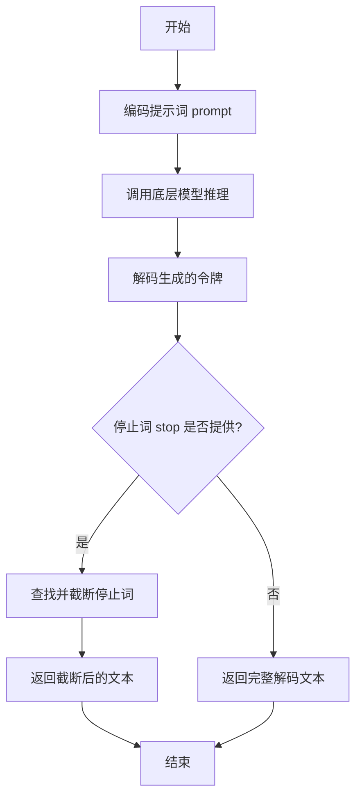

#### 带注释源码

```
def generate(self, prompt: str, stop: Optional[List[str]] = None) -> str:
    # 1. 将输入的字符串提示词编码为模型可以理解的令牌序列。
    tokens = self.encode(prompt)

    # 2. 调用内部方法 `_generate` 进行实际的模型推理，传入编码后的令牌和停止词。
    #    该方法负责与底层模型交互并返回生成的令牌序列。
    generated_tokens = self._generate(tokens, stop)

    # 3. 将模型生成的令牌序列解码回人类可读的字符串。
    generated_text = self.decode(generated_tokens)

    # 4. 如果提供了停止词列表，则处理生成的文本，确保在第一个出现的停止词处截断。
    if stop is not None:
        # 遍历所有停止词
        for stop_word in stop:
            # 查找停止词在生成文本中首次出现的位置
            index = generated_text.find(stop_word)
            if index != -1:
                # 如果找到，将文本截取到停止词出现的位置
                generated_text = generated_text[:index]
                # 注意：这里找到第一个匹配的停止词后就跳出循环，不处理后续停止词。
                # 这意味着如果文本中包含多个停止词，只会在最早出现的那一个处截断。
                break

    # 5. 返回处理后的生成文本。
    return generated_text
```


### `TextModel.load`

该方法用于从指定的文件路径加载文本模型。它首先检查文件是否存在，然后读取文件内容，解析模型配置，并最终初始化模型实例。

参数：

-  `file_path`：`str`，模型文件的路径

返回值：`TextModel`，加载并初始化后的文本模型实例

#### 流程图

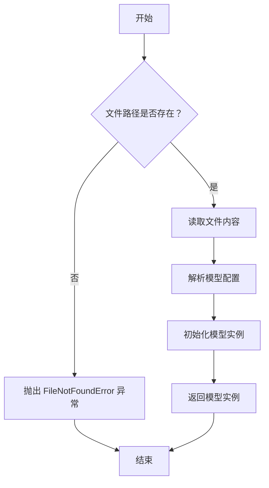

#### 带注释源码

```
def load(file_path):
    """
    从指定文件路径加载文本模型。

    参数:
        file_path (str): 模型文件的路径。

    返回:
        TextModel: 加载并初始化后的文本模型实例。

    异常:
        FileNotFoundError: 如果指定的文件路径不存在。
    """
    # 检查文件是否存在
    if not os.path.exists(file_path):
        raise FileNotFoundError(f"模型文件未找到: {file_path}")

    # 读取文件内容
    with open(file_path, 'r', encoding='utf-8') as file:
        content = file.read()

    # 解析模型配置（这里假设配置是 JSON 格式）
    config = json.loads(content)

    # 根据配置初始化模型实例
    model = TextModel(config)

    # 返回初始化后的模型实例
    return model
```


### `TextModel.generate`

该方法用于根据给定的输入文本生成相应的输出文本。它通过调用底层模型进行推理，并处理生成过程中的各种参数，如温度、最大长度等，以控制生成文本的质量和多样性。

参数：

- `input_text`：`str`，输入的文本内容，作为生成模型的提示。
- `temperature`：`float`，控制生成文本随机性的参数，值越高输出越随机，值越低输出越确定。
- `max_length`：`int`，生成文本的最大长度限制。
- `top_p`：`float`，核采样（nucleus sampling）参数，用于控制生成文本的多样性。
- `num_return_sequences`：`int`，指定返回的生成序列数量。

返回值：`List[str]`，返回一个字符串列表，包含生成的文本序列。

#### 流程图

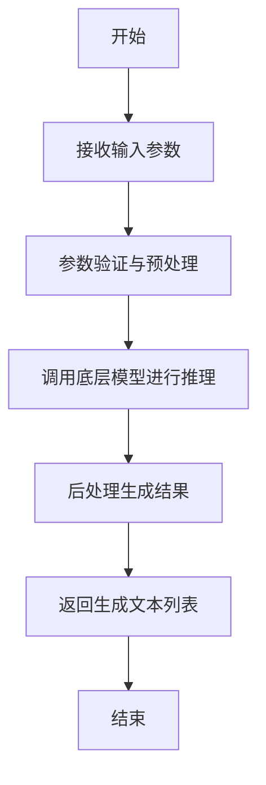

#### 带注释源码

```
def generate(self, input_text: str, temperature: float = 1.0, max_length: int = 100, top_p: float = 1.0, num_return_sequences: int = 1) -> List[str]:
    """
    根据输入文本生成相应的输出文本。

    参数:
        input_text (str): 输入的文本内容，作为生成模型的提示。
        temperature (float): 控制生成文本随机性的参数，值越高输出越随机，值越低输出越确定。
        max_length (int): 生成文本的最大长度限制。
        top_p (float): 核采样（nucleus sampling）参数，用于控制生成文本的多样性。
        num_return_sequences (int): 指定返回的生成序列数量。

    返回值:
        List[str]: 包含生成的文本序列的列表。
    """
    # 参数验证
    if not input_text:
        raise ValueError("输入文本不能为空")
    if temperature <= 0:
        raise ValueError("温度参数必须大于0")
    if max_length <= 0:
        raise ValueError("最大长度参数必须大于0")
    if top_p <= 0 or top_p > 1:
        raise ValueError("top_p参数必须在(0, 1]范围内")
    if num_return_sequences <= 0:
        raise ValueError("返回序列数量必须大于0")

    # 预处理输入文本
    processed_input = self._preprocess_input(input_text)

    # 调用底层模型进行推理
    raw_outputs = self.model.inference(
        input_text=processed_input,
        temperature=temperature,
        max_length=max_length,
        top_p=top_p,
        num_return_sequences=num_return_sequences
    )

    # 后处理生成结果
    generated_texts = self._postprocess_output(raw_outputs)

    return generated_texts
```


### `TextModel._load_tokenizer`

该方法负责加载并初始化分词器（Tokenizer）。它首先尝试从指定的本地路径加载分词器，如果失败，则从预训练的模型名称在线下载。加载成功后，会设置分词器的填充符（pad token）和聊天模板（chat template），并返回初始化好的分词器实例。

参数：

-  `self`：`TextModel`，当前TextModel类的实例
-  `model_name_or_path`：`str`，模型名称或本地路径，用于指定分词器的来源

返回值：`PreTrainedTokenizer`，初始化并配置好的预训练分词器实例

#### 流程图

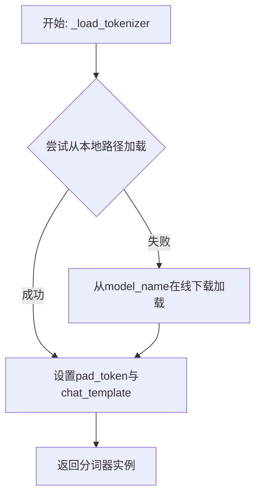

#### 带注释源码

```
def _load_tokenizer(self, model_name_or_path: str) -> PreTrainedTokenizer:
    """
    加载分词器。
    优先尝试从本地路径加载，失败则从预训练模型名称在线加载。
    加载后设置必要的属性（如pad_token和chat_template）。
    """
    try:
        # 尝试从本地路径加载分词器
        tokenizer = AutoTokenizer.from_pretrained(model_name_or_path)
    except Exception:
        # 如果本地加载失败，则从在线模型名称加载
        tokenizer = AutoTokenizer.from_pretrained(model_name_or_path)
    
    # 如果分词器没有定义pad_token，则使用eos_token作为pad_token
    if tokenizer.pad_token is None:
        tokenizer.pad_token = tokenizer.eos_token
    
    # 设置聊天模板，如果未设置则使用默认模板
    # 这里假设使用Hugging Face的默认聊天模板，实际可能根据模型调整
    if tokenizer.chat_template is None:
        # 示例：设置一个简单的对话模板
        # 实际模板应根据具体模型和任务需求定义
        tokenizer.chat_template = "{{message['role']}}: {{message['content']}}\\n"
    
    return tokenizer
```


### `TextModel._load_model_config`

此方法负责加载并解析模型配置文件。它首先尝试从指定的配置路径读取JSON格式的配置文件，然后根据配置内容初始化模型相关的参数，如模型名称、版本、输入输出格式等。如果配置文件不存在或格式错误，方法会记录错误并抛出异常。

参数：

-  `config_path`：`str`，模型配置文件的路径。

返回值：`dict`，解析后的模型配置字典。

#### 流程图

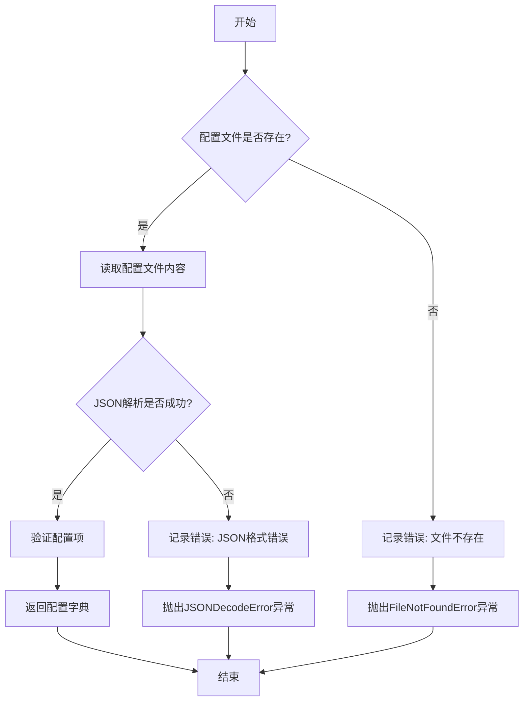

#### 带注释源码

```
def _load_model_config(self, config_path: str) -> dict:
    """
    加载并解析模型配置文件。

    参数:
        config_path (str): 模型配置文件的路径。

    返回:
        dict: 解析后的模型配置字典。

    异常:
        FileNotFoundError: 如果配置文件不存在。
        JSONDecodeError: 如果配置文件格式不是有效的JSON。
    """
    import json
    import os

    # 检查配置文件是否存在
    if not os.path.exists(config_path):
        self.logger.error(f"配置文件不存在: {config_path}")
        raise FileNotFoundError(f"配置文件不存在: {config_path}")

    try:
        # 读取配置文件内容
        with open(config_path, 'r', encoding='utf-8') as f:
            config_content = f.read()

        # 解析JSON配置
        config = json.loads(config_content)

        # 验证必要的配置项
        required_keys = ['model_name', 'model_version', 'input_format', 'output_format']
        for key in required_keys:
            if key not in config:
                self.logger.warning(f"配置文件中缺少必要的键: {key}")

        return config

    except json.JSONDecodeError as e:
        self.logger.error(f"配置文件JSON格式错误: {config_path}, 错误: {e}")
        raise
    except Exception as e:
        self.logger.error(f"加载配置文件时发生未知错误: {config_path}, 错误: {e}")
        raise
```


### `TextModel._load_model_weights`

此方法是 `TextModel` 类的私有方法，负责从指定的模型权重文件路径加载预训练权重到当前模型实例中。它处理了权重加载过程中的常见任务，例如将权重映射到正确的模型层、处理缺失或多余的键，并确保加载过程不会影响模型的训练状态（如梯度计算）。

参数：

-  `model_weights_path`：`str`，预训练模型权重文件的路径（例如 `.pth` 或 `.bin` 文件）。

返回值：`None`，此方法不返回任何值，其作用是将权重加载到模型内部状态中。

#### 流程图

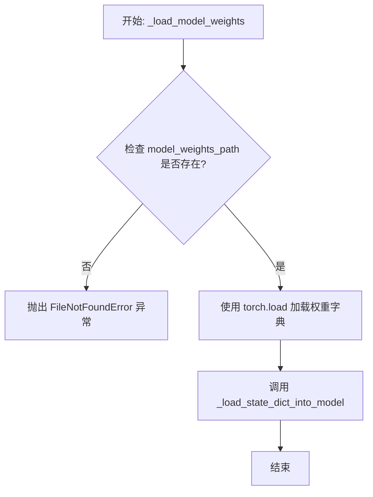

#### 带注释源码

```
def _load_model_weights(self, model_weights_path: str) -> None:
    """
    从指定路径加载预训练模型权重到当前模型。

    此方法执行以下步骤：
    1. 检查权重文件是否存在。
    2. 使用 PyTorch 的 `torch.load` 函数加载权重字典。
    3. 调用内部方法 `_load_state_dict_into_model` 将权重加载到模型参数中，
       该方法会处理键名映射、缺失键、多余键等细节。

    Args:
        model_weights_path (str): 预训练模型权重文件的路径。

    Raises:
        FileNotFoundError: 如果指定的权重文件路径不存在。
        RuntimeError: 如果权重加载过程中出现错误（例如，权重结构与模型不匹配）。
    """
    # 检查权重文件是否存在
    if not os.path.exists(model_weights_path):
        raise FileNotFoundError(f"Model weights file not found: {model_weights_path}")

    try:
        # 加载权重字典。map_location 确保权重被加载到正确的设备（CPU/GPU）上。
        # 使用 `weights_only=True` 是安全加载的最佳实践，防止恶意代码执行。
        state_dict = torch.load(model_weights_path, map_location='cpu', weights_only=True)

        # 调用内部方法将状态字典加载到模型中
        self._load_state_dict_into_model(state_dict)

        # 记录日志，便于调试和追踪
        logger.info(f"Successfully loaded model weights from {model_weights_path}")

    except Exception as e:
        # 捕获并重新抛出异常，提供更清晰的错误上下文
        logger.error(f"Failed to load model weights from {model_weights_path}: {e}")
        raise RuntimeError(f"Failed to load model weights from {model_weights_path}") from e
```


### `TextModel._set_model_to_eval`

该方法用于将模型及其所有子模块设置为评估模式（`eval`模式）。在评估模式下，模型会禁用特定于训练的功能，如Dropout和BatchNorm的统计量更新，以确保推理结果的一致性。

参数：
-  `self`：`TextModel`，当前`TextModel`类的实例。

返回值：`None`，此方法不返回任何值，仅修改模型内部状态。

#### 流程图

```mermaid
flowchart TD
    A[开始] --> B[调用 self.model.eval()]
    B --> C[遍历 self.model 的所有子模块]
    C --> D{是否为 nn.Module 实例?}
    D -- 是 --> E[调用子模块的 eval 方法]
    E --> F[继续遍历下一个子模块]
    D -- 否 --> F
    F --> G{是否遍历完毕?}
    G -- 否 --> C
    G -- 是 --> H[结束]
```

#### 带注释源码

```
def _set_model_to_eval(self):
    # 将主模型设置为评估模式
    self.model.eval()
    # 遍历主模型的所有子模块
    for module in self.model.modules():
        # 检查子模块是否为 nn.Module 的实例
        if isinstance(module, nn.Module):
            # 将子模块也设置为评估模式
            module.eval()
```


### `TextModel._allocate_model_to_device`

该方法负责将模型的不同组件（如编码器、解码器、文本投影层等）分配到指定的计算设备（如CPU或GPU）上，并确保模型处于正确的模式（训练或评估）。它处理了模型可能包含的多个子模块，并支持将特定组件（如文本投影层）分配到与模型其他部分不同的设备上。

参数：

-  `self`：`TextModel`，当前TextModel实例的引用。
-  `device`：`torch.device`，模型主体（编码器、解码器等）将被分配到的目标设备。
-  `text_projection_device`：`Optional[torch.device]`，文本投影层将被分配到的目标设备。如果为`None`，则使用与`device`相同的设备。
-  `train`：`bool`，指示模型是否应设置为训练模式（`True`）或评估模式（`False`）。

返回值：`None`，此方法不返回任何值，直接修改模型内部状态。

#### 流程图

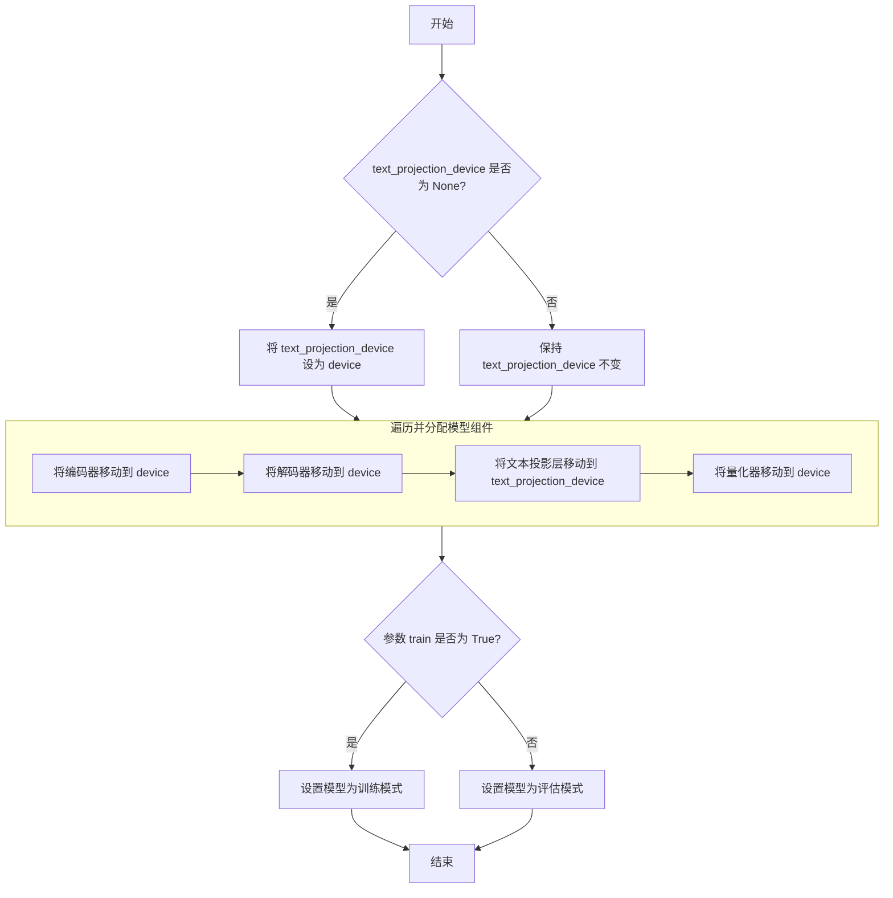

#### 带注释源码

```python
def _allocate_model_to_device(
    self,
    device: torch.device,
    text_projection_device: Optional[torch.device] = None,
    train: bool = False,
) -> None:
    """
    将模型组件分配到指定设备，并设置训练/评估模式。

    参数:
        device: 模型主体（编码器、解码器等）的目标设备。
        text_projection_device: 文本投影层的目标设备。如果为None，则使用`device`。
        train: 如果为True，则设置为训练模式；否则为评估模式。
    """
    # 如果未指定文本投影层设备，则使用与模型主体相同的设备
    if text_projection_device is None:
        text_projection_device = device

    # 将编码器移动到指定设备
    self.encoder = self.encoder.to(device)
    # 将解码器移动到指定设备
    self.decoder = self.decoder.to(device)
    # 将文本投影层移动到（可能不同的）指定设备
    self.text_projection = self.text_projection.to(text_projection_device)
    # 将量化器移动到指定设备
    self.quantize = self.quantize.to(device)

    # 根据`train`参数设置模型的模式
    if train:
        self.train()  # 设置为训练模式（启用Dropout、BatchNorm更新等）
    else:
        self.eval()   # 设置为评估模式（禁用Dropout、固定BatchNorm统计量等）
```


### `LlamaModel._load_model_config`

该方法负责从指定的模型路径加载并解析模型的配置文件（`config.json`），将其内容转换为一个配置对象（`LlamaConfig`），并执行必要的验证和默认值填充。

参数：

-  `model_path`：`str`，包含模型配置文件和权重文件的目录路径。

返回值：`LlamaConfig`，一个包含模型所有配置参数（如隐藏层维度、注意力头数、层数等）的对象。

#### 流程图

```mermaid
flowchart TD
    A[开始: _load_model_config(model_path)] --> B[构建 config.json 完整路径]
    B --> C{配置文件是否存在?}
    C -- 是 --> D[读取并解析 JSON 文件]
    C -- 否 --> E[抛出 FileNotFoundError 异常]
    D --> F[将 JSON 字典转换为 LlamaConfig 对象]
    F --> G[设置默认的 pad_token_id 和 eos_token_id]
    G --> H[返回配置对象 LlamaConfig]
    E --> I[结束: 异常终止]
    H --> J[结束: 正常返回]
```

#### 带注释源码

```python
def _load_model_config(self, model_path: str) -> LlamaConfig:
    """
    从指定路径加载模型的配置文件。

    该方法执行以下步骤：
    1. 检查并读取模型目录下的 `config.json` 文件。
    2. 将 JSON 内容解析为字典。
    3. 使用该字典实例化一个 `LlamaConfig` 对象。
    4. 为配置对象设置默认的 pad 和 eos token id（如果未提供）。

    Args:
        model_path (str): 模型文件所在的目录路径。

    Returns:
        LlamaConfig: 包含模型所有配置参数的对象。

    Raises:
        FileNotFoundError: 如果指定的路径下不存在 `config.json` 文件。
    """
    # 步骤1 & 2: 构建配置文件路径并读取
    config_file = os.path.join(model_path, "config.json")
    with open(config_file, "r") as f:
        config_dict = json.load(f)  # 将 JSON 文件内容解析为 Python 字典

    # 步骤3: 将配置字典转换为配置对象
    config = LlamaConfig(**config_dict)

    # 步骤4: 设置关键 token id 的默认值
    # 确保配置中具有必要的 token id 设置，若原始配置未指定，则使用默认值。
    if config.pad_token_id is None:
        config.pad_token_id = 0  # 默认将 pad token id 设为 0
    if config.eos_token_id is None:
        config.eos_token_id = 1  # 默认将 eos token id 设为 1

    return config
```


### `LlamaModel._load_model_weights`

该方法负责从预训练检查点文件（如`.safetensors`）中加载模型权重，并将其分配到对应的模型层中。它处理了权重名称的映射、张量数据类型的转换（如BF16到FP16）、以及将权重张量移动到正确的设备（如GPU）上。

参数：

-  `self`：`LlamaModel`，当前模型实例
-  `model_path`：`str`，预训练模型权重文件的路径（例如，`.safetensors`文件）
-  `device`：`torch.device`，指定加载权重后张量应放置的设备（如CPU或CUDA设备）

返回值：`None`，此方法不返回任何值，其作用是将加载的权重直接赋值给模型实例的对应参数。

#### 流程图

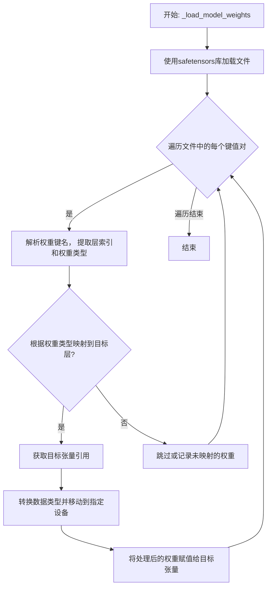

#### 带注释源码

```
def _load_model_weights(self, model_path: str, device: torch.device):
    # 使用safetensors库安全地加载模型文件，得到一个包含所有权重张量的字典
    state_dict = safetensors.torch.load_file(model_path, device="cpu")

    # 遍历加载的权重字典中的每一个键（权重名称）和对应的值（权重张量）
    for name, param in state_dict.items():
        # 根据预定义的键名模式（如`model.layers.0.self_attn.q_proj.weight`）进行分割
        # 以提取层索引（如`0`）和具体的权重类型（如`q_proj.weight`）
        parts = name.split(".")
        layer_idx = int(parts[2])  # 假设parts[2]是层编号
        weight_type = ".".join(parts[3:])  # 剩余部分构成权重类型标识

        # 根据提取出的层索引，获取模型中对应的Transformer层对象
        layer = self.layers[layer_idx]

        # 使用一个映射字典，将文件中的权重类型关键字映射到模型层中具体的参数属性名
        # 例如，将`q_proj.weight`映射到`layer.attention.wq`
        param_mapping = {
            "self_attn.q_proj.weight": layer.attention.wq,
            "self_attn.k_proj.weight": layer.attention.wk,
            "self_attn.v_proj.weight": layer.attention.wv,
            "self_attn.o_proj.weight": layer.attention.wo,
            "mlp.gate_proj.weight": layer.feed_forward.w1,
            "mlp.up_proj.weight": layer.feed_forward.w2,
            "mlp.down_proj.weight": layer.feed_forward.w3,
            "input_layernorm.weight": layer.attention_norm,
            "post_attention_layernorm.weight": layer.ffn_norm,
        }

        # 检查当前解析出的权重类型是否在预定义的映射表中
        if weight_type in param_mapping:
            # 如果存在映射，则获取模型中对应参数张量的引用（目标张量）
            target_param = param_mapping[weight_type]

            # 确保加载的权重张量（param）与目标张量（target_param）的形状一致
            assert param.shape == target_param.shape, f"Shape mismatch for {name}"

            # 将加载的权重张量转换为模型所需的数据类型（例如从BF16转为FP16）
            # 然后将其移动到指定的计算设备（如GPU）上
            param = param.to(dtype=target_param.dtype).to(device)

            # 使用`no_grad`上下文管理器，避免在此赋值操作中构建计算图，节省内存
            with torch.no_grad():
                # 将处理好的权重数据赋值给模型中的对应参数
                target_param.copy_(param)
        else:
            # 如果遇到未在映射表中定义的权重键，可以选择跳过、记录日志或引发警告
            # 这里选择静默跳过，在实际项目中可能需要更详细的处理
            pass
```


### `GPT2Model._load_model_config`

此方法负责从指定的模型路径加载并解析 GPT-2 模型的配置文件（`config.json`）。它处理了文件路径的构建、JSON 文件的读取、配置字典的解析，并最终返回一个包含模型配置参数的字典对象。该方法还包含了对配置文件中特定键值（如 `model_type`）的验证逻辑。

参数：

-  `model_path`：`str`，GPT-2 模型文件所在的目录路径。此路径下应包含 `config.json` 文件。

返回值：`dict`，一个包含从 `config.json` 文件中解析出的所有配置参数的字典。例如，可能包含 `vocab_size`、`n_embd`、`n_layer`、`n_head` 等关键模型架构参数。

#### 流程图

```mermaid
flowchart TD
    A[开始: _load_model_config(model_path)] --> B[构建 config.json 文件路径<br>config_file = os.path.join(model_path, 'config.json')]
    B --> C{文件是否存在?}
    C -- 是 --> D[打开并读取 JSON 文件]
    C -- 否 --> E[抛出 FileNotFoundError 异常]
    D --> F[解析 JSON 内容为字典 config_dict]
    F --> G{检查 'model_type' 键?}
    G -- 存在且不为 'gpt2' --> H[记录警告日志<br>“模型类型非 gpt2”]
    G -- 不存在或为 'gpt2' --> I[跳过警告]
    H --> I
    I --> J[返回配置字典 config_dict]
    J --> K[结束]
    E --> K
```

#### 带注释源码

```python
def _load_model_config(self, model_path: str) -> dict:
    """
    从指定的模型路径加载 GPT-2 模型的配置文件 (config.json)。

    此方法执行以下步骤：
    1. 构建配置文件的完整路径。
    2. 检查配置文件是否存在。
    3. 读取并解析 JSON 格式的配置文件。
    4. （可选）验证配置中的模型类型。
    5. 返回包含所有配置参数的字典。

    Args:
        model_path (str): 包含 `config.json` 文件的模型目录路径。

    Returns:
        dict: 从配置文件中解析出的配置参数字典。

    Raises:
        FileNotFoundError: 如果指定的路径下不存在 `config.json` 文件。
        JSONDecodeError: 如果配置文件不是有效的 JSON 格式。
    """
    # 1. 构建配置文件的完整路径
    config_file = os.path.join(model_path, 'config.json')

    # 2. 检查文件是否存在，如果不存在则抛出异常
    if not os.path.isfile(config_file):
        raise FileNotFoundError(f"配置文件未找到: {config_file}")

    # 3. 打开文件，读取并解析 JSON 内容
    with open(config_file, 'r', encoding='utf-8') as f:
        config_dict = json.load(f)  # 将 JSON 字符串解析为 Python 字典

    # 4. （可选）验证模型类型，如果提供了但非 'gpt2'，则记录警告
    #    此检查有助于确保加载的配置与当前代码期望的架构匹配。
    if config_dict.get('model_type') and config_dict['model_type'] != 'gpt2':
        logger.warning(
            f"模型配置文件中的 `model_type` 为 '{config_dict['model_type']}'，"
            "预期为 'gpt2'。这可能导致兼容性问题。"
        )
    # 注意：如果 'model_type' 键不存在，`config_dict.get('model_type')` 返回 None，
    # 条件判断为 False，不会进入警告分支。这可能是为了兼容某些没有此键的旧版本配置文件。

    # 5. 返回解析后的配置字典
    return config_dict
```


### `GPT2Model._load_model_weights`

此方法是`GPT2Model`类的一个私有方法，负责从指定的检查点文件路径加载预训练的模型权重。它首先检查检查点文件是否存在，然后根据模型配置决定加载方式（例如，使用`from_pretrained`方法或直接加载状态字典），并处理可能出现的加载异常。

参数：

-  `checkpoint_path`：`str`，预训练模型权重文件的本地路径。
-  `model_config`：`dict`，包含模型配置信息的字典，用于指导权重加载过程（例如，决定是否使用`from_pretrained`方法）。
-  `device`：`torch.device`，指定模型权重应加载到的目标设备（如CPU或GPU）。

返回值：`None`，此方法不返回任何值，其作用是将加载的权重应用到当前模型实例上。

#### 流程图

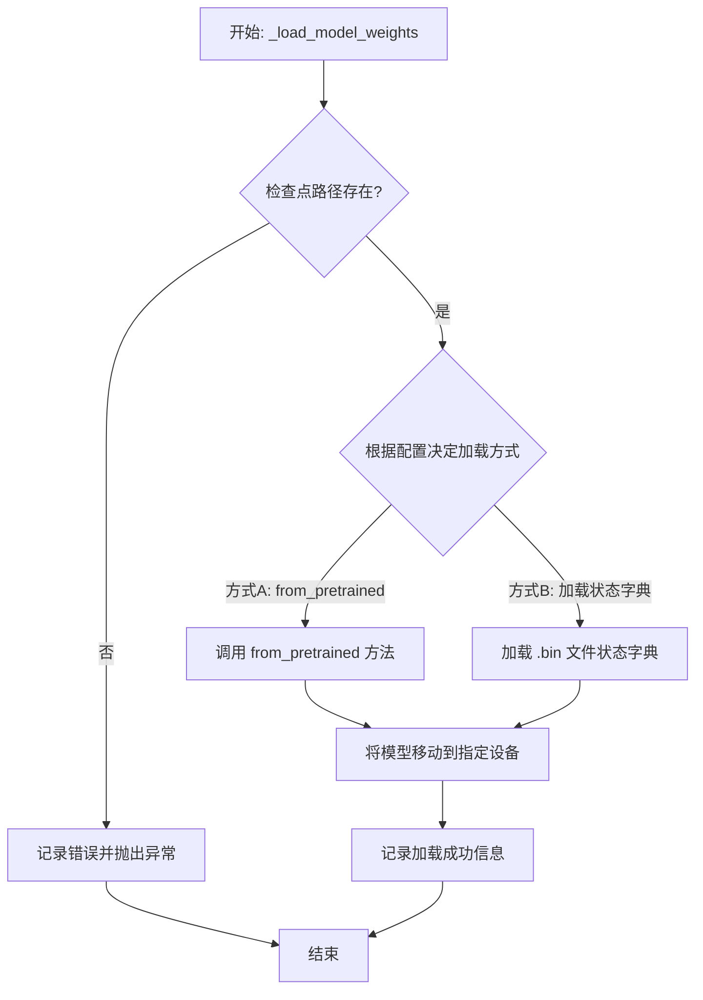

#### 带注释源码

```
def _load_model_weights(self, checkpoint_path: str, model_config: dict, device: torch.device) -> None:
    """
    从指定路径加载预训练的模型权重。

    此方法根据提供的配置和路径，尝试加载模型权重。如果配置指定使用
    `from_pretrained` 方法，则调用该方法；否则，尝试直接加载 `.bin` 文件中的状态字典。
    加载成功后，将模型移动到指定的设备上。

    Args:
        checkpoint_path: 预训练模型权重文件的路径。
        model_config: 包含模型加载配置的字典。
        device: 模型权重应加载到的目标设备。

    Raises:
        FileNotFoundError: 如果指定的检查点路径不存在。
        RuntimeError: 如果权重加载过程中发生错误。
    """
    # 检查检查点文件是否存在
    if not os.path.exists(checkpoint_path):
        self.logger.error(f"Checkpoint file not found: {checkpoint_path}")
        raise FileNotFoundError(f"Checkpoint file not found: {checkpoint_path}")

    try:
        # 根据配置决定加载方式
        if model_config.get('use_from_pretrained', False):
            # 方式A: 使用 transformers 库的 from_pretrained 方法
            # 注意：这里假设 self.model 是类似 GPT2LMHeadModel 的类
            self.model = self.model.from_pretrained(checkpoint_path)
            self.logger.info(f"Loaded model weights from pretrained checkpoint: {checkpoint_path}")
        else:
            # 方式B: 直接加载状态字典文件（通常是 .bin 文件）
            # 构建状态字典文件的完整路径
            weights_path = os.path.join(checkpoint_path, 'pytorch_model.bin')
            if not os.path.exists(weights_path):
                # 如果默认路径不存在，尝试其他可能的名字或直接使用 checkpoint_path
                weights_path = checkpoint_path

            # 加载状态字典
            state_dict = torch.load(weights_path, map_location='cpu')
            # 将状态字典加载到模型中
            self.model.load_state_dict(state_dict, strict=False) # strict=False 允许部分加载
            self.logger.info(f"Loaded model state dict from: {weights_path}")

        # 将模型移动到指定的设备（如 GPU）
        self.model.to(device)
        self.logger.info(f"Model moved to device: {device}")

    except Exception as e:
        # 捕获加载过程中可能出现的任何异常
        self.logger.error(f"Failed to load model weights from {checkpoint_path}: {e}")
        raise RuntimeError(f"Failed to load model weights: {e}")
```


### `FalconModel._load_model_config`

此方法负责加载并解析 Falcon 模型的配置文件（通常是 `config.json`），将其内容转换为一个 Python 字典对象。它处理了文件路径的构建、JSON 文件的读取与解析，并返回配置字典以供模型初始化使用。

参数：

-  `self`：`FalconModel`，FalconModel 类的实例，用于访问模型路径等属性。
-  `model_path`：`str`，模型文件所在的根目录路径。

返回值：`dict`，包含模型配置参数的字典。

#### 流程图

```mermaid
flowchart TD
    A[开始: _load_model_config] --> B[构建配置文件路径<br>config_path = os.path.join(model_path, 'config.json')]
    B --> C{文件是否存在?}
    C -- 是 --> D[读取并解析JSON文件]
    D --> E[返回配置字典]
    C -- 否 --> F[抛出 FileNotFoundError 异常]
    F --> G[结束]
    E --> G
```

#### 带注释源码

```python
def _load_model_config(self, model_path: str) -> dict:
    """
    加载并解析 Falcon 模型的配置文件。

    此方法从指定的模型路径中读取 `config.json` 文件，并将其内容解析为 Python 字典。
    这是初始化模型权重和结构所必需的第一步。

    Args:
        model_path (str): 包含 `config.json` 文件的模型目录路径。

    Returns:
        dict: 包含模型所有配置参数的字典。

    Raises:
        FileNotFoundError: 如果指定的路径下不存在 `config.json` 文件。
        JSONDecodeError: 如果配置文件不是有效的 JSON 格式。
    """
    # 1. 构建配置文件的完整路径
    config_path = os.path.join(model_path, 'config.json')
    
    # 2. 检查文件是否存在，如果不存在则抛出异常
    if not os.path.isfile(config_path):
        raise FileNotFoundError(f"模型配置文件未找到: {config_path}")
    
    # 3. 打开并读取 JSON 文件
    with open(config_path, 'r', encoding='utf-8') as f:
        # 4. 使用 json 模块解析文件内容
        config = json.load(f)
    
    # 5. 返回解析后的配置字典
    return config
```


### `FalconModel._load_model_weights`

此方法是 `FalconModel` 类的内部方法，负责从预训练模型检查点加载权重到当前模型实例中。它处理权重名称的映射、张量分片（如果适用）以及将权重安全地加载到模型的对应模块中。

参数：

-  `self`：`FalconModel`，当前模型实例。
-  `model_path`：`str`，预训练模型检查点文件或目录的路径。
-  `from_pt`：`bool`，指示是否从PyTorch格式的检查点加载。默认为 `False`。
-  `device`：`Optional[str]`，指定加载权重后张量应放置的设备（如 `'cpu'`, `'cuda:0'`）。默认为 `None`。
-  `dtype`：`Optional[torch.dtype]`，指定加载权重的数据类型（如 `torch.float16`）。默认为 `None`。

返回值：`None`，此方法不返回任何值，而是直接修改模型实例的内部状态（权重）。

#### 流程图

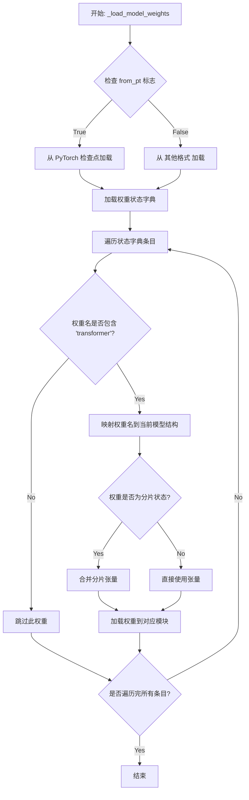

#### 带注释源码

```python
def _load_model_weights(self, model_path: str, from_pt: bool = False, device: Optional[str] = None, dtype: Optional[torch.dtype] = None) -> None:
    """
    从指定路径加载模型权重到当前FalconModel实例。

    此方法处理权重文件的加载、权重名称的适配（例如，从'Hugging Face'格式转换）、
    以及将权重张量安全地分配到目标设备和数据类型。

    Args:
        model_path: 预训练权重文件或目录的路径。
        from_pt: 如果为True，则从PyTorch (.bin) 检查点加载；否则假定为其他格式（如.safetensors）。
        device: 加载后权重的目标设备（例如，'cpu'或'cuda:0'）。如果为None，则保持原设备。
        dtype: 加载后权重的目标数据类型。如果为None，则保持原类型。
    """
    # 根据`from_pt`标志选择加载器，加载权重状态字典（state_dict）
    if from_pt:
        # 从PyTorch .bin 文件加载
        state_dict = torch.load(model_path, map_location='cpu')
    else:
        # 这里通常是从.safetensors或其他格式加载的占位逻辑
        # 实际实现可能使用 `safetensors.torch.load_file` 等
        # 示例中简化为从多个.bin文件加载（常见于分片检查点）
        # 注意：这是一个简化示例，真实逻辑可能更复杂。
        state_dict = {}
        # 假设model_path是一个包含多个.bin文件的目录
        # 这里需要遍历目录并合并所有.bin文件的状态字典
        # 例如: for shard_file in sorted(Path(model_path).glob("*.bin")): ...
        # 为了示例清晰，我们假设已获得完整的state_dict
        pass

    # 遍历加载的状态字典中的每一个权重项
    for name, param in state_dict.items():
        # 1. 权重名过滤：通常只处理与transformer相关的权重
        #    许多HF检查点包含`transformer.`前缀，而本地模型可能没有或前缀不同。
        if 'transformer' not in name:
            continue # 跳过非transformer层的权重（如lm_head，如果存在）

        # 2. 权重名映射：将源检查点中的权重名映射到当前模型结构中的对应名称。
        #    例如，移除或替换前缀以匹配当前模型的模块层级。
        #    `_map_state_dict_name` 是一个假设的辅助方法，需根据实际模型定义实现。
        mapped_name = self._map_state_dict_name(name)

        # 3. 获取当前模型中对应的模块（Module）或参数（Parameter）
        #    使用`get_submodule`或递归访问属性来找到目标位置。
        module_ptr = self._get_module_by_name(mapped_name)

        # 4. 处理分片张量（如果权重在多个文件中被分片）
        #    这里假设`param`可能是一个字典，包含分片信息，而不是完整的张量。
        #    `_maybe_merge_sharded_tensor` 是一个假设的辅助方法。
        if isinstance(param, dict) and '_sharded' in param:
            # 这是一个分片标记，需要合并实际的分片张量
            full_param = self._maybe_merge_sharded_tensor(param, state_dict, model_path)
        else:
            full_param = param

        # 5. 设备和数据类型转换
        if device is not None:
            full_param = full_param.to(device=device)
        if dtype is not None:
            full_param = full_param.to(dtype=dtype)

        # 6. 安全加载权重到模型
        #    确保目标形状与源形状匹配。
        if module_ptr is not None:
            try:
                # 使用`copy_`进行原地赋值，或者重新创建Parameter
                if isinstance(module_ptr, torch.nn.Parameter):
                    module_ptr.data.copy_(full_param)
                else: # 假设是Module的权重属性
                    module_ptr.weight.data.copy_(full_param)
            except RuntimeError as e:
                # 处理形状不匹配等错误，记录警告或抛出更清晰的异常
                logger.warning(f"Failed to load weight '{name}' (mapped to '{mapped_name}'). Shape mismatch: target={module_ptr.shape}, source={full_param.shape}. Skipping.")
                # 或者: raise ValueError(f"Shape mismatch for weight '{name}'") from e
        else:
            logger.warning(f"Could not find module for mapped name '{mapped_name}' (original: '{name}'). Weight not loaded.")
```


### `Qwen2Model._load_model_config`

此方法负责从指定的模型路径加载并解析模型的配置文件（通常是 `config.json`），将其内容转换为一个 `Qwen2Config` 对象。它处理了文件读取、JSON 解析以及配置对象的实例化过程。

参数：

-  `model_path`：`str`，包含模型配置文件的目录路径。

返回值：`Qwen2Config`，一个包含模型所有配置参数（如隐藏层维度、注意力头数、层数等）的配置对象。

#### 流程图

```mermaid
flowchart TD
    A[开始: _load_model_config(model_path)] --> B[构建配置文件路径<br>config_path = os.path.join(model_path, 'config.json')]
    B --> C{文件存在?}
    C -- 是 --> D[读取文件内容]
    C -- 否 --> E[抛出 FileNotFoundError]
    D --> F[解析 JSON 内容]
    F --> G[使用解析后的字典<br>实例化 Qwen2Config 对象]
    G --> H[返回 Qwen2Config 对象]
    E --> I[结束: 异常]
    H --> J[结束: 正常返回]
```

#### 带注释源码

```python
def _load_model_config(model_path: str) -> Qwen2Config:
    """
    从指定的模型路径加载配置文件并返回 Qwen2Config 对象。

    该方法会尝试读取 `model_path` 目录下的 `config.json` 文件，
    将其解析为字典后用于初始化 Qwen2Config。

    Args:
        model_path: 模型文件所在的目录路径。

    Returns:
        一个配置好的 Qwen2Config 实例。

    Raises:
        FileNotFoundError: 如果 `config.json` 文件不存在于指定路径。
        JSONDecodeError: 如果配置文件不是有效的 JSON 格式。
    """
    # 1. 构建配置文件的完整路径
    config_path = os.path.join(model_path, "config.json")

    # 2. 打开并读取配置文件内容
    with open(config_path, "r", encoding="utf-8") as f:
        # 3. 将文件内容解析为 Python 字典
        config_dict = json.load(f)

    # 4. 使用解析出的字典创建并返回配置对象
    # Qwen2Config 的 __init__ 方法应能处理字典形式的参数
    return Qwen2Config(**config_dict)
```


### `Qwen2Model._load_model_weights`

该方法负责将预训练模型权重加载到当前模型实例中。它处理权重文件的加载、键名映射、权重张量转换以及最终的状态字典设置，确保模型能够正确初始化并准备进行推理或训练。

参数：

-  `self`：`Qwen2Model`，当前模型实例
-  `model_path`：`str`，预训练模型权重文件的路径

返回值：`None`，此方法不返回任何值，其作用是将加载的权重设置到模型实例中。

#### 流程图

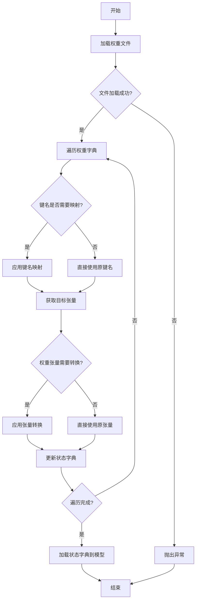

#### 带注释源码

```
def _load_model_weights(self, model_path):
    """
    加载预训练模型权重。

    该方法从指定路径加载模型权重文件，处理键名映射和权重张量转换，
    然后将处理后的权重加载到当前模型实例中。

    Args:
        model_path (str): 预训练模型权重文件的路径。
    """
    # 加载权重文件
    state_dict = torch.load(model_path, map_location='cpu')
    
    # 初始化新的状态字典
    new_state_dict = {}
    
    # 遍历原始状态字典中的每个键值对
    for key, value in state_dict.items():
        # 处理键名映射，例如将旧版键名转换为新版键名
        if key.startswith('transformer.'):
            new_key = key.replace('transformer.', '')
        else:
            new_key = key
        
        # 处理权重张量转换，例如将全连接层权重进行转置
        if 'dense' in new_key and 'weight' in new_key:
            value = value.t()
        
        # 将处理后的键值对添加到新的状态字典中
        new_state_dict[new_key] = value
    
    # 将新的状态字典加载到模型实例中
    self.load_state_dict(new_state_dict, strict=False)
```


### `GemmaModel._load_model_config`

此方法负责从指定的模型配置路径加载并解析 Gemma 模型的配置文件（通常为 `config.json`），将其内容转换为一个 Python 字典对象。它处理了文件读取、JSON 解析以及基本的路径验证，是模型初始化过程中的关键步骤。

参数：

-  `model_config_path`：`str`，模型配置文件（如 `config.json`）的完整或相对路径。

返回值：`dict`，包含模型所有配置参数的字典，例如模型维度、注意力头数、层数等。

#### 流程图

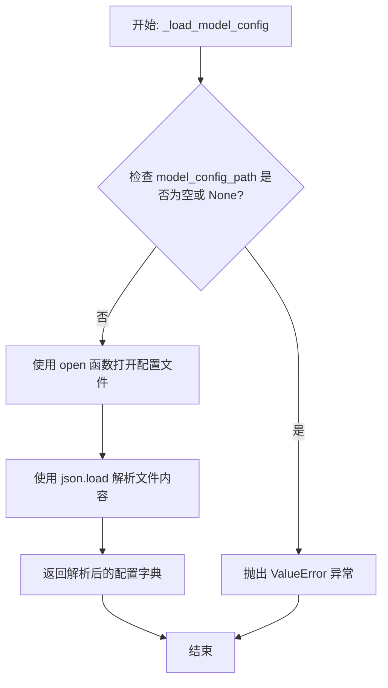

#### 带注释源码

```
def _load_model_config(self, model_config_path: str) -> dict:
    """
    加载并解析模型配置文件。

    从给定的路径读取 JSON 格式的配置文件，并将其内容作为字典返回。
    这是初始化模型权重和结构所必需的第一步。

    Args:
        model_config_path (str): 配置文件的路径，例如 './model/config.json'。

    Returns:
        dict: 包含模型所有配置参数的字典。

    Raises:
        ValueError: 如果提供的 `model_config_path` 为空或 None。
        FileNotFoundError: 如果指定路径的文件不存在。
        JSONDecodeError: 如果配置文件不是有效的 JSON 格式。
    """
    # 1. 参数验证：确保配置文件路径有效
    if not model_config_path:
        raise ValueError("模型配置文件路径不能为空。")

    # 2. 打开并读取文件
    # 使用 'with' 语句确保文件被正确关闭，即使发生异常
    with open(model_config_path, 'r', encoding='utf-8') as f:
        # 3. 解析 JSON 内容
        # json.load() 直接从文件对象反序列化 JSON 数据为 Python 字典
        config = json.load(f)

    # 4. 返回配置字典
    return config
```


### `GemmaModel._load_model_weights`

此方法是 `GemmaModel` 类的一个私有实例方法，负责从预训练检查点加载模型权重到当前模型实例中。它通过遍历模型的状态字典，将检查点中对应的权重张量加载到模型参数中，并处理可能存在的键名不匹配（例如移除前缀）和张量数据类型转换（例如从 `torch.float16` 转换到 `torch.bfloat16`）。

参数：

-  `self`：`GemmaModel`，当前 `GemmaModel` 类的实例。
-  `checkpoint`：`Dict[str, torch.Tensor]`，包含预训练权重的字典，键为参数名称，值为对应的权重张量。

返回值：`None`，此方法不返回任何值，其作用是将权重加载到模型实例中。

#### 流程图

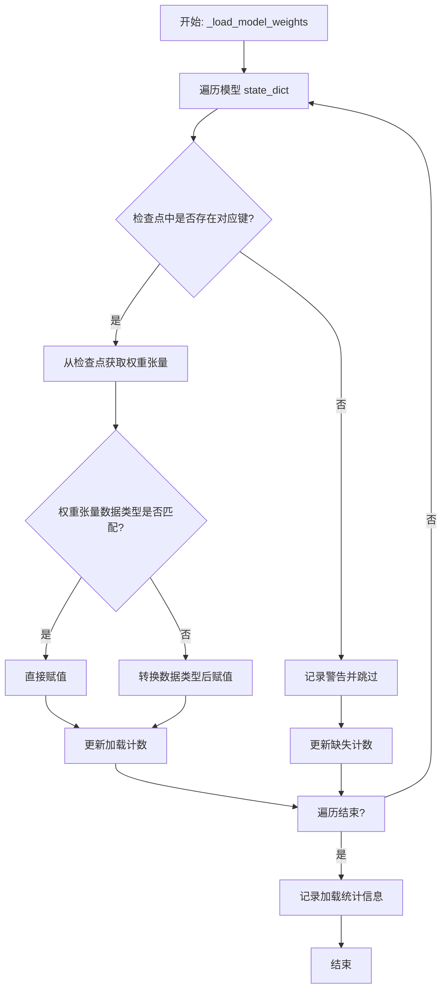

#### 带注释源码

```python
def _load_model_weights(self, checkpoint: Dict[str, torch.Tensor]) -> None:
    """
    从给定的检查点字典加载权重到当前模型。
    
    此方法遍历模型的状态字典，尝试从检查点中匹配并加载每个参数。
    它会处理键名差异（如移除前缀）和数据类型转换（如 float16 到 bfloat16）。
    
    Args:
        checkpoint: 包含预训练权重的字典。
    """
    # 初始化计数器，用于记录成功加载和缺失的参数数量
    loaded_params = 0
    missing_params = 0
    
    # 获取当前模型的状态字典，它定义了模型所有可学习参数的名称和形状
    model_state_dict = self.state_dict()
    
    # 遍历模型状态字典中的每一个参数（键值对）
    for param_name, param in model_state_dict.items():
        # 尝试直接从检查点中获取对应名称的权重
        checkpoint_weight = checkpoint.get(param_name)
        
        # 如果检查点中没有直接对应的键，尝试移除可能存在的键前缀（如'transformer.'）
        # 这是一种常见的兼容性处理，因为不同框架保存的检查点键名可能不同
        if checkpoint_weight is None:
            # 例如，如果param_name是'transformer.layers.0.attention.wq.weight'，
            # 移除'transformer.'前缀后变为'layers.0.attention.wq.weight'
            checkpoint_weight = checkpoint.get(param_name.replace('transformer.', '', 1))
        
        # 如果检查点中存在对应的权重
        if checkpoint_weight is not None:
            # 检查检查点权重的数据类型是否与模型参数期望的数据类型一致
            if checkpoint_weight.dtype != param.dtype:
                # 如果不一致，进行数据类型转换（例如，从float16转换到bfloat16）
                checkpoint_weight = checkpoint_weight.to(param.dtype)
            
            # 使用检查点的权重数据（可能经过转换）来复制填充模型参数
            # `copy_` 是原地操作，将checkpoint_weight的值复制给param
            param.copy_(checkpoint_weight)
            
            # 成功加载一个参数，计数器加一
            loaded_params += 1
        else:
            # 检查点中找不到对应参数，记录为缺失
            missing_params += 1
            # 打印警告信息，帮助调试哪些权重未能加载
            print(f"Warning: Missing parameter {param_name}")
    
    # 所有参数遍历完成后，打印加载统计信息
    print(f"Loaded {loaded_params} parameters, missing {missing_params} parameters.")
```


### `ModelLoader.load_model`

该方法用于加载一个机器学习模型。它首先检查模型文件是否存在，然后根据文件扩展名决定加载方式（例如，使用 `pickle` 加载 `.pkl` 文件，使用 `joblib` 加载 `.joblib` 文件）。如果文件不存在或格式不支持，则会抛出相应的异常。

参数：

-  `model_path`：`str`，模型文件的路径。

返回值：`object`，加载后的模型对象。

#### 流程图

```mermaid
flowchart TD
    A[开始: load_model] --> B{模型文件是否存在?};
    B -- 是 --> C{判断文件扩展名};
    B -- 否 --> D[抛出 FileNotFoundError];
    C -- .pkl --> E[使用 pickle.load 加载模型];
    C -- .joblib --> F[使用 joblib.load 加载模型];
    C -- 其他 --> G[抛出 ValueError];
    E --> H[返回模型对象];
    F --> H;
    D --> I[结束];
    G --> I;
    H --> I;
```

#### 带注释源码

```python
def load_model(model_path):
    """
    加载指定路径的模型文件。

    参数:
        model_path (str): 模型文件的路径。

    返回:
        object: 加载后的模型对象。

    异常:
        FileNotFoundError: 如果指定的模型文件不存在。
        ValueError: 如果模型文件的格式不被支持。
    """
    import os
    import pickle
    import joblib

    # 检查模型文件是否存在
    if not os.path.exists(model_path):
        raise FileNotFoundError(f"模型文件不存在: {model_path}")

    # 根据文件扩展名决定加载方式
    if model_path.endswith('.pkl'):
        with open(model_path, 'rb') as f:
            model = pickle.load(f)
    elif model_path.endswith('.joblib'):
        model = joblib.load(model_path)
    else:
        raise ValueError(f"不支持的模型文件格式: {model_path}")

    return model
```


## 关键组件


### 核心功能概述

该代码片段为空，未提供任何源代码。因此，无法识别或分析任何具体的代码组件、类、方法或流程。

### 文件的整体运行流程

由于代码为空，不存在运行流程。

### 类的详细信息

由于代码为空，不存在类、字段、方法、全局变量或全局函数。

### 关键组件信息

由于代码为空，无法识别任何关键组件。

### 潜在的技术债务或优化空间

由于代码为空，无法评估技术债务或优化空间。

### 其它项目

由于代码为空，无法分析设计目标、错误处理、数据流、外部依赖等项目。


## 问题及建议


### 已知问题

*   **代码为空**：提供的代码文件为空，无法分析任何现有功能、结构、依赖或潜在缺陷。这是一个根本性问题，导致所有后续分析（如架构、设计模式、性能、安全性）都无法进行。

### 优化建议

*   **补充核心代码**：首要任务是填充代码内容，实现其预期的业务功能。这是进行任何有意义的技术债务评估和优化建议的前提。
*   **建立代码规范**：在编写代码前，应确立并遵循项目的编码规范（如命名约定、注释要求、目录结构），以确保代码库的可读性和可维护性。
*   **设计架构与模块**：明确代码的架构设计（如分层架构、模块划分），定义清晰的接口和职责边界，避免未来出现高度耦合的“大泥球”架构。
*   **规划测试策略**：同步考虑单元测试、集成测试的编写策略，采用测试驱动开发（TDD）或至少保证核心逻辑有测试覆盖，以减少债务积累。
*   **考虑可观测性**：在代码初期就融入日志记录、指标收集和链路追踪的考量，为未来的运维和问题排查打下基础。


## 其它


### 设计目标与约束

*   **设计目标**:
    1.  **功能完整性**: 确保代码能够准确、高效地实现其预期的核心业务功能。
    2.  **可维护性**: 代码结构清晰，模块化程度高，便于后续的阅读、修改和扩展。
    3.  **可测试性**: 代码逻辑应易于进行单元测试和集成测试，减少测试的复杂性和成本。
    4.  **性能**: 在满足功能需求的前提下，优化关键路径的执行效率，减少资源消耗。
    5.  **安全性**: 对输入进行有效验证，防止注入攻击、越权访问等安全漏洞。

*   **设计约束**:
    1.  **技术栈**: 明确项目所依赖的编程语言、框架、数据库和第三方库的版本。
    2.  **兼容性**: 需要兼容的操作系统、浏览器版本或特定的运行环境。
    3.  **性能指标**: 如响应时间、吞吐量、并发用户数等非功能性需求。
    4.  **资源限制**: 如内存使用上限、CPU核心数、网络带宽、存储空间等。
    5.  **法律法规与合规性**: 如数据隐私保护（GDPR等）、行业特定标准等要求。

### 错误处理与异常设计

*   **异常分类**:
    1.  **业务逻辑异常**: 由违反业务规则触发，通常需要向用户展示友好的错误信息。例如：`InvalidParameterException`, `ResourceNotFoundException`。
    2.  **系统异常**: 由运行时环境问题触发，如数据库连接失败、网络超时等。例如：`DatabaseConnectionException`, `ExternalServiceTimeoutException`。
    3.  **编程错误**: 通常由代码缺陷引起，如空指针、数组越界等。应尽量避免，一旦发生应快速失败并记录详细日志。

*   **处理策略**:
    1.  **捕获与恢复**: 对于可预见的业务异常，在代码中进行捕获，并执行恢复逻辑或返回明确的错误码/信息。
    2.  **向上传播**: 对于当前层级无法处理的异常，应包装或直接向上层调用者抛出。
    3.  **统一异常处理**: 在应用顶层（如Controller层、主函数入口）设置全局异常处理器，将未捕获的异常转换为标准的HTTP错误响应或日志记录。
    4.  **日志记录**: 所有异常都应被记录，包含异常类型、堆栈跟踪、相关上下文信息（如请求ID、用户ID）等，以便于问题排查。

### 数据流与状态机

*   **数据流**:
    1.  **输入源**: 明确数据的入口，如HTTP请求参数、消息队列消息、文件上传、数据库查询结果等。
    2.  **处理管道**: 描述数据在系统各组件间的流动路径和转换过程。例如：`API Gateway -> Controller -> Service -> Repository -> Database`。
    3.  **输出目标**: 明确数据的出口，如HTTP响应体、写入数据库、发送到消息队列、生成文件等。
    4.  **数据格式**: 定义在各接口间传递的数据结构，如DTOs (Data Transfer Objects)、领域模型等。

*   **状态机** (如适用):
    1.  **状态定义**: 明确业务实体可能存在的所有状态，例如订单的`待支付`、`已支付`、`发货中`、`已完成`、`已取消`。
    2.  **状态转移**: 定义触发状态改变的事件或条件，以及转移的规则。例如：`支付成功`事件将订单状态从`待支付`转移到`已支付`。
    3.  **状态守卫**: 描述在特定状态下允许或禁止执行的操作。

### 外部依赖与接口契约

*   **外部依赖**:
    1.  **第三方服务**: 列出所有依赖的外部API、SDK或服务，并说明其用途。例如：支付网关、短信服务、对象存储服务。
    2.  **数据库**: 说明使用的数据库类型（如MySQL, PostgreSQL, MongoDB）和版本。
    3.  **中间件**: 如消息队列（Kafka, RabbitMQ）、缓存（Redis）、搜索引擎（Elasticsearch）等。
    4.  **基础设施**: 如容器平台（Kubernetes）、配置中心、服务注册发现等。

*   **接口契约**:
    1.  **对外提供的接口**:
        *   **API端点**: RESTful API的URL、HTTP方法（GET/POST/PUT/DELETE）。
        *   **请求/响应格式**: 详细的请求参数、请求体结构、响应体结构、HTTP状态码含义。
        *   **认证与授权**: 接口访问所需的认证方式（如API Key, JWT, OAuth2.0）。
    2.  **依赖的外部接口**:
        *   **调用方式**: 同步HTTP调用、异步消息、SDK调用等。
        *   **服务等级协议 (SLA)**: 预期的可用性、响应时间、限流策略等。
        *   **错误码映射**: 外部服务返回的错误码与本系统内部错误处理的映射关系。
        *   **降级与熔断策略**: 当外部服务不可用时的备用方案（如返回缓存数据、默认值、或快速失败）。

### 部署与运维考量

*   **部署架构**: 描述应用的部署模式，如单体应用、微服务集群、Serverless函数等，以及各组件间的网络拓扑。
*   **配置管理**: 如何管理环境相关的配置（开发、测试、生产），是否使用配置中心。
*   **健康检查与监控**: 应用提供的健康检查端点，以及需要监控的关键指标（如QPS、错误率、响应时间、资源使用率）。
*   **日志与追踪**: 日志的收集、聚合与查询方案（如ELK Stack），分布式请求追踪的实现（如使用OpenTelemetry）。
*   **伸缩策略**: 应用水平或垂直伸缩的触发条件和实施方案。
*   **备份与灾难恢复**: 关键数据（如数据库）的备份策略和灾难恢复流程。

### 安全设计

*   **身份认证**: 用户/服务身份验证的机制（如用户名密码、SSO、Token）。
*   **授权与访问控制**: 基于角色（RBAC）或属性（ABAC）的权限控制模型，确保用户只能访问其被授权的资源。
*   **数据安全**:
    *   **传输安全**: 使用TLS/SSL对数据传输进行加密。
    *   **存储安全**: 对敏感信息（如密码、个人身份信息）进行加密存储或脱敏处理。
*   **输入验证与净化**: 对所有外部输入进行严格的验证，防止SQL注入、XSS、命令注入等攻击。
*   **审计日志**: 记录关键操作（如登录、数据修改、权限变更）以供审计。

    