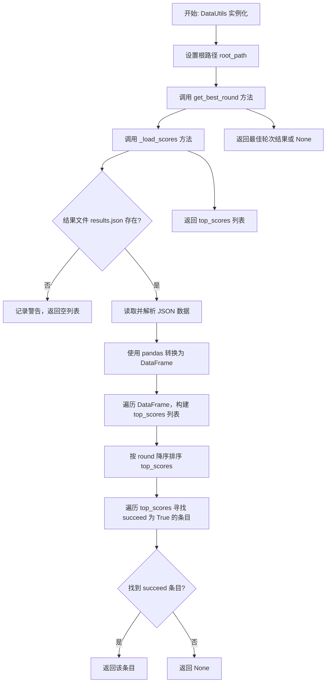
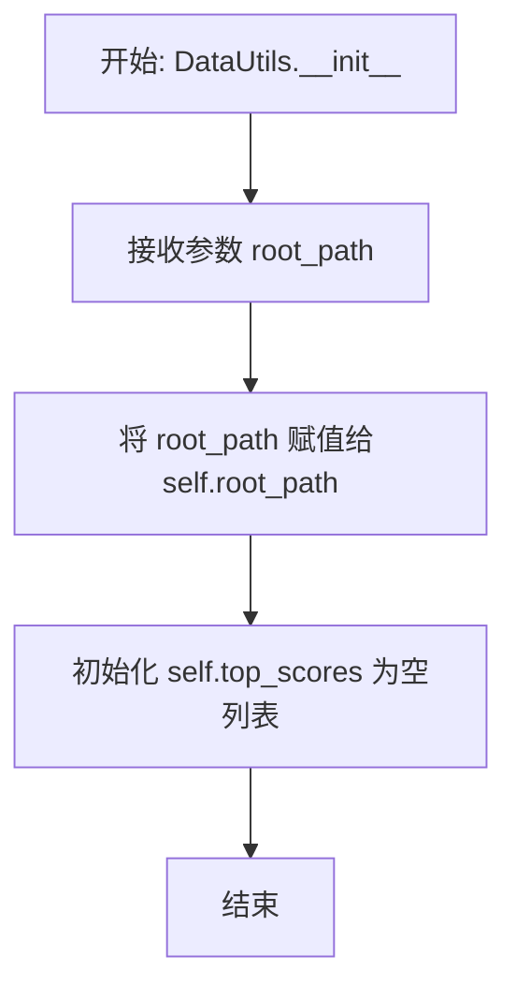
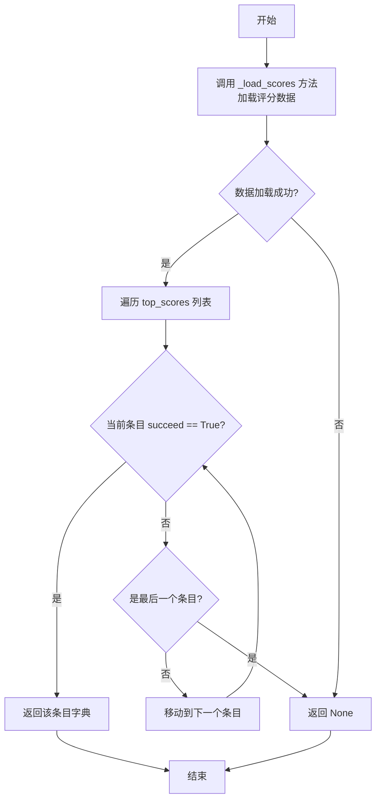
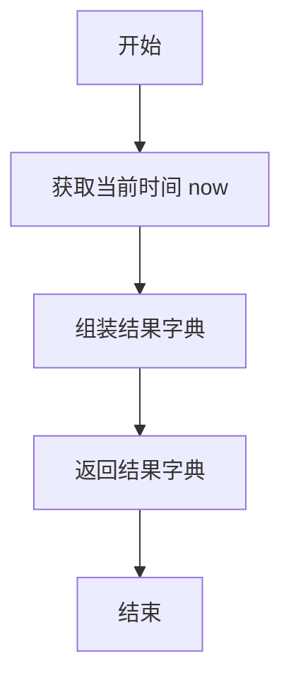
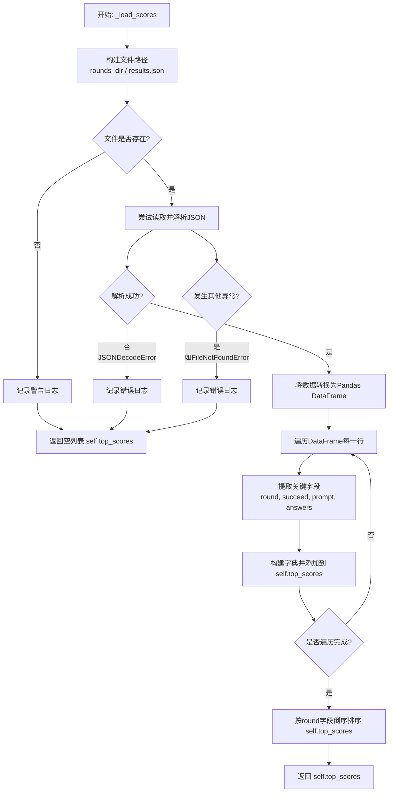
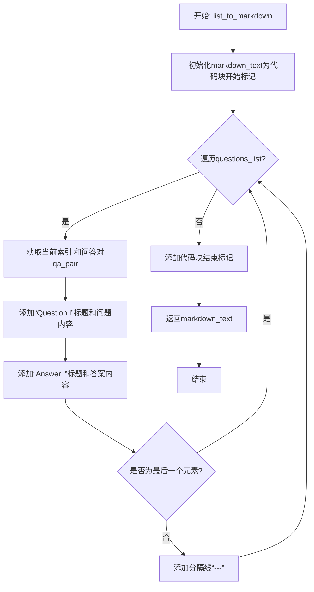

# `.\MetaGPT\metagpt\ext\spo\utils\data_utils.py` 详细设计文档

该文件定义了一个 DataUtils 类，主要用于处理与提示工程实验相关的数据。其核心功能包括：从 JSON 文件中加载和解析实验结果数据，筛选出最佳轮次（succeed 为 True 的轮次），创建新的实验结果记录，将结果保存回文件，以及将问答列表格式化为 Markdown 文本。它充当了一个数据访问和格式化的工具类，服务于需要分析和管理多轮提示实验结果的系统。

## 整体流程



## 类结构

```
DataUtils
├── __init__
├── load_results
├── get_best_round
├── get_results_file_path
├── create_result_data
├── save_results
├── _load_scores
└── list_to_markdown
```

## 全局变量及字段


### `DataUtils.root_path`
    
存储数据文件根目录的路径对象，用于定位和操作相关文件。

类型：`pathlib.Path`
    


### `DataUtils.top_scores`
    
缓存从结果文件中加载并处理后的最佳回合数据列表，按回合数降序排列。

类型：`List[Dict]`
    
    

## 全局函数及方法


### `DataUtils.__init__`

`DataUtils` 类的构造函数，用于初始化一个`DataUtils`实例。它接收一个根路径参数，并设置实例的根路径属性和一个用于存储顶级分数的空列表。

参数：

-  `root_path`：`Path`，表示数据文件存储的根目录路径。

返回值：`None`，构造函数不返回任何值。

#### 流程图



#### 带注释源码

```
def __init__(self, root_path: Path):
    # 将传入的根路径参数保存为实例变量，用于后续文件操作
    self.root_path = root_path
    # 初始化一个空列表，用于存储从结果文件中加载的“最佳”或“顶级”分数/记录
    self.top_scores = []
```


### `DataUtils.load_results`

该方法用于从指定路径的 `results.json` 文件中加载结果数据。如果文件存在且格式正确，则返回解析后的 JSON 数据列表；如果文件不存在或 JSON 格式无效，则返回空列表。

参数：

- `path`：`Path`，包含 `results.json` 文件的目录路径。

返回值：`list`，从 JSON 文件加载的结果数据列表，如果文件不存在或格式无效则返回空列表。

#### 流程图

```mermaid
flowchart TD
    A[开始: load_results(path)] --> B[调用 get_results_file_path(path) 获取完整文件路径]
    B --> C{文件是否存在?}
    C -- 是 --> D[尝试读取并解析 JSON]
    D --> E{JSON 解析成功?}
    E -- 是 --> F[返回解析后的列表]
    E -- 否 --> G[返回空列表]
    C -- 否 --> G
    F --> H[结束]
    G --> H
```

#### 带注释源码

```python
def load_results(self, path: Path) -> list:
    # 通过调用 get_results_file_path 方法，构建 results.json 文件的完整路径
    result_path = self.get_results_file_path(path)
    # 检查该文件是否存在
    if result_path.exists():
        try:
            # 尝试读取文件内容并解析为 JSON 格式，返回解析后的 Python 列表
            return json.loads(result_path.read_text())
        except json.JSONDecodeError:
            # 如果 JSON 格式无效，捕获异常并返回空列表
            return []
    # 如果文件不存在，直接返回空列表
    return []
```


### `DataUtils.get_best_round`

该方法用于从已加载的评分数据中，查找并返回第一个成功的回合（round）的完整信息。它首先确保评分数据已加载到内存中，然后遍历这些数据，寻找 `succeed` 字段为 `True` 的条目。如果找到，则返回该条目；如果遍历完所有条目仍未找到成功的回合，则返回 `None`。

参数：
-  `self`：`DataUtils`，`DataUtils` 类的实例，用于访问类属性和其他方法。

返回值：`dict | None`，如果找到成功的回合，则返回一个包含该回合详细信息的字典（包含 `round`、`succeed`、`prompt`、`answers` 等键）；如果没有找到任何成功的回合，则返回 `None`。

#### 流程图



#### 带注释源码

```python
def get_best_round(self):
    # 1. 确保评分数据已加载到 self.top_scores 列表中
    self._load_scores()

    # 2. 遍历已加载的评分数据
    for entry in self.top_scores:
        # 3. 检查当前条目的 'succeed' 字段是否为 True
        if entry["succeed"]:
            # 4. 如果找到成功的回合，立即返回该条目的完整信息
            return entry

    # 5. 如果遍历完所有条目都没有找到成功的回合，则返回 None
    return None
```


### `DataUtils.get_results_file_path`

该方法根据给定的提示路径，构建并返回该路径下 `results.json` 文件的完整路径对象。

参数：

- `prompt_path`：`pathlib.Path`，包含提示或相关数据的目录路径。

返回值：`pathlib.Path`，指向 `prompt_path` 目录下 `results.json` 文件的完整路径对象。

#### 流程图

```mermaid
flowchart TD
    A[开始] --> B[接收参数 prompt_path]
    B --> C[使用 / 运算符拼接路径<br>prompt_path / "results.json"]
    C --> D[返回拼接后的 Path 对象]
    D --> E[结束]
```

#### 带注释源码

```python
def get_results_file_path(self, prompt_path: Path) -> Path:
    # 使用路径拼接操作符 `/`，将给定的目录路径 `prompt_path` 与文件名 `"results.json"` 组合，
    # 生成并返回一个指向该 JSON 文件的 Path 对象。
    return prompt_path / "results.json"
```


### `DataUtils.create_result_data`

该方法用于创建并返回一个表示单轮测试结果的字典对象。它整合了测试轮次、答案列表、使用的提示词、是否成功、消耗的令牌数以及当前时间戳等信息，为后续的持久化存储（如保存到JSON文件）提供标准化的数据结构。

参数：

-  `round`：`int`，当前测试的轮次编号。
-  `answers`：`list[dict]`，本轮测试生成的答案列表，每个答案通常是一个包含问题与答案的字典。
-  `prompt`：`str`，本轮测试所使用的提示词（Prompt）内容。
-  `succeed`：`bool`，本轮测试是否成功完成的标志。
-  `tokens`：`int`，本轮测试所消耗的令牌（Token）数量。

返回值：`dict`，一个包含所有输入参数及当前时间戳的字典，用于记录单次测试的完整结果。

#### 流程图



#### 带注释源码

```python
def create_result_data(self, round: int, answers: list[dict], prompt: str, succeed: bool, tokens: int) -> dict:
    # 获取当前时间，作为结果生成的时间戳
    now = datetime.datetime.now()
    # 组装并返回包含所有输入参数和时间戳的结果字典
    # `round`: 测试轮次
    # `answers`: 生成的答案列表
    # `prompt`: 使用的提示词
    # `succeed`: 成功标志
    # `tokens`: 消耗的令牌数
    # `time`: 结果创建时间
    return {"round": round, "answers": answers, "prompt": prompt, "succeed": succeed, "tokens": tokens, "time": now}
```


### `DataUtils.save_results`

将给定的数据（列表或字典）序列化为格式化的JSON字符串，并保存到指定的文件路径。

参数：

-  `json_file_path`：`Path`，目标JSON文件的路径对象
-  `data`：`Union[List, Dict]`，需要被保存的数据，可以是列表或字典类型

返回值：`None`，此方法不返回任何值

#### 流程图

```mermaid
flowchart TD
    A[开始: save_results(json_file_path, data)] --> B[将数据序列化为JSON字符串<br/>使用default=str处理非标准类型]
    B --> C[将JSON字符串写入指定文件路径]
    C --> D[结束]
```

#### 带注释源码

```python
def save_results(self, json_file_path: Path, data: Union[List, Dict]):
    # 将传入的数据（列表或字典）序列化为格式化的JSON字符串。
    # `default=str` 参数确保任何非JSON标准类型（如datetime对象）在序列化时会被转换为字符串。
    # `indent=4` 参数使生成的JSON字符串具有缩进，提高可读性。
    json_path = json_file_path
    json_path.write_text(json.dumps(data, default=str, indent=4))
```


### `DataUtils._load_scores`

该方法用于从指定的结果文件（`results.json`）中加载历史测试轮次的数据，将其解析并转换为一个按轮次倒序排列的字典列表，存储在实例变量 `self.top_scores` 中。它处理文件不存在、JSON格式错误等异常情况，并记录相应的日志。

参数：
-  `self`：`DataUtils`，`DataUtils` 类的实例，用于访问实例变量 `root_path` 和 `top_scores`。

返回值：`list`，返回加载并处理后的历史得分数据列表，即 `self.top_scores`。如果文件不存在或发生错误，可能返回空列表。

#### 流程图



#### 带注释源码

```python
def _load_scores(self):
    # 1. 构建结果文件的完整路径：根目录下的 "prompts/results.json"
    rounds_dir = self.root_path / "prompts"
    result_file = rounds_dir / "results.json"
    # 2. 初始化实例变量 top_scores 为空列表
    self.top_scores = []

    try:
        # 3. 检查结果文件是否存在
        if not result_file.exists():
            # 3.1 如果文件不存在，记录警告日志
            logger.warning(f"Results file not found at {result_file}")
            # 3.2 返回当前的空列表
            return self.top_scores

        # 4. 读取文件内容并解析为JSON对象
        data = json.loads(result_file.read_text(encoding="utf-8"))
        # 5. 将JSON数据转换为Pandas DataFrame，便于处理
        df = pd.DataFrame(data)

        # 6. 遍历DataFrame的每一行（即每一轮测试数据）
        for index, row in df.iterrows():
            # 6.1 从每一行中提取指定的关键字段
            # 6.2 构建一个包含这些字段的字典
            # 6.3 将该字典添加到 self.top_scores 列表中
            self.top_scores.append(
                {
                    "round": row["round"],      # 轮次编号
                    "succeed": row["succeed"],  # 是否成功
                    "prompt": row["prompt"],    # 使用的提示词
                    "answers": row["answers"],  # 生成的答案列表
                }
            )

        # 7. 对 self.top_scores 列表进行排序，按 'round' 字段降序排列（最新的轮次在前）
        self.top_scores.sort(key=lambda x: x["round"], reverse=True)

    # 8. 异常处理块
    except FileNotFoundError:
        # 8.1 处理文件未找到异常（尽管前面已检查，但并发操作可能导致）
        logger.error(f"Could not find results file: {result_file}")
    except json.JSONDecodeError:
        # 8.2 处理JSON格式错误异常
        logger.error(f"Invalid JSON format in file: {result_file}")
    except Exception as e:
        # 8.3 处理其他未预期的异常
        logger.error(f"Unexpected error loading scores: {str(e)}")

    # 9. 返回处理后的列表（无论是成功加载的数据还是空列表）
    return self.top_scores
```


### `DataUtils.list_to_markdown`

将包含“question”和“answer”键的字典列表转换为格式化的Markdown字符串。该函数遍历列表，为每个问答对生成带编号的“Question”和“Answer”部分，并用分隔线隔开，最后将整个内容包裹在Markdown代码块中。

参数：

-  `questions_list`：`list`，包含'question'和'answer'键的字典列表

返回值：`str`，格式化的Markdown字符串

#### 流程图



#### 带注释源码

```python
def list_to_markdown(self, questions_list: list):
    """
    Convert a list of question-answer dictionaries to a formatted Markdown string.

    Args:
        questions_list (list): List of dictionaries containing 'question' and 'answer' keys

    Returns:
        str: Formatted Markdown string
    """
    # 初始化Markdown字符串，以代码块开始
    markdown_text = "```\n"

    # 遍历输入的问答列表，enumerate用于同时获取索引和元素，索引从1开始
    for i, qa_pair in enumerate(questions_list, 1):
        # 添加问题部分：标题和内容
        markdown_text += f"Question {i}\n\n"
        markdown_text += f"{qa_pair['question']}\n\n"

        # 添加答案部分：标题和内容
        markdown_text += f"Answer {i}\n\n"
        markdown_text += f"{qa_pair['answer']}\n\n"

        # 如果不是最后一个问答对，则添加分隔线
        if i < len(questions_list):
            markdown_text += "---\n\n"

    # 添加代码块结束标记
    markdown_text += "\n```"

    # 返回最终生成的Markdown字符串
    return markdown_text
```


## 关键组件


### 数据加载与持久化组件

负责从文件系统加载JSON格式的结果数据，并将处理后的数据（如评估结果、提示词等）以JSON格式保存回文件系统，实现了数据的持久化存储与读取。

### 结果数据处理与分析组件

提供对已保存结果数据的处理功能，包括将结果数据转换为Pandas DataFrame进行结构化分析、按轮次排序、筛选最佳轮次（首个成功的轮次），以及将问答列表转换为格式化的Markdown字符串，便于结果展示与报告生成。

### 文件路径管理组件

封装了与文件路径相关的逻辑，根据给定的基础路径（如提示词目录）构建完整的结果文件路径，确保数据文件定位的准确性和一致性。


## 问题及建议


### 已知问题

-   **硬编码路径与逻辑耦合**：`_load_scores` 方法中硬编码了 `"prompts"` 子目录和 `"results.json"` 文件名，使得类的功能与特定的目录结构强绑定，降低了代码的复用性和灵活性。
-   **方法职责不单一**：`_load_scores` 方法不仅负责加载数据，还直接修改了类属性 `self.top_scores` 并对其进行排序。这违反了单一职责原则，使得方法难以测试和理解。
-   **潜在的重复文件读取**：`load_results` 和 `_load_scores` 方法都涉及读取 `results.json` 文件，但逻辑不同且可能被重复调用，存在性能浪费和潜在的数据不一致风险。
-   **异常处理不完整**：`_load_scores` 方法中虽然捕获了多种异常，但在 `pd.DataFrame(data)` 转换时，如果 `data` 不是列表或字典格式，会抛出未处理的异常，导致程序崩溃。
-   **类型注解不精确**：`list_to_markdown` 方法的参数 `questions_list` 类型注解仅为 `list`，过于宽泛。应使用 `List[Dict[str, str]]` 或 `TypedDict` 来明确其内部结构，提高代码可读性和工具支持。
-   **数据验证缺失**：`create_result_data` 方法接受任意参数并直接构建字典，缺少对输入数据（如 `answers` 结构、`tokens` 是否为非负整数等）的有效性验证。
-   **硬编码的 Markdown 格式**：`list_to_markdown` 方法输出的 Markdown 格式是固定的（使用 ` ``` ` 代码块包裹）。如果调用方需要不同的格式（如表格、列表），则无法满足，扩展性差。

### 优化建议

-   **解耦路径配置**：将 `"prompts"` 和 `"results.json"` 作为 `__init__` 方法的参数，或通过配置文件管理，使 `DataUtils` 类能适应不同的项目结构。
-   **重构 `_load_scores` 方法**：将其拆分为两个方法：一个纯函数用于从给定路径加载并返回原始数据列表；另一个方法调用前者，处理数据并更新 `self.top_scores`。这样更符合单一职责原则，便于单元测试。
-   **统一文件读取逻辑**：考虑提供一个基础的、安全的 JSON 文件读取方法（可包含缓存机制），供 `load_results` 和重构后的数据加载方法调用，避免重复代码和 IO 操作。
-   **增强异常处理与数据验证**：在 `_load_scores` 的 `pd.DataFrame` 转换前，增加对 `data` 数据类型的检查。在 `create_result_data` 方法中，添加对输入参数的验证（例如使用 Pydantic 模型），确保数据质量。
-   **细化类型注解**：为 `list_to_markdown` 方法的 `questions_list` 参数使用更精确的类型提示，例如 `List[Dict[Literal[“question”, “answer”], str]]` 或定义 `QuestionAnswerPair` 类型。
-   **提高 `list_to_markdown` 的灵活性**：将该方法改造成一个模板方法或策略模式。可以接受一个格式化函数或模板字符串作为参数，允许调用方自定义输出的 Markdown 结构，提升组件的复用性。
-   **考虑性能优化**：如果 `results.json` 文件很大或频繁访问，可以考虑在类内部缓存读取的结果（注意缓存失效问题），或者使用更高效的数据处理库（如 `polars`）替代 `pandas` 进行简单的数据筛选和排序。


## 其它


### 设计目标与约束

本模块 `DataUtils` 的设计目标是提供一个轻量级、专注于文件 I/O 和数据格式转换的工具类，用于管理特定目录结构下的结果数据。其核心约束包括：1) 依赖固定的目录结构（`root_path/prompts/results.json`）进行数据读写；2) 主要处理 JSON 格式的数据持久化；3) 内部使用 Pandas DataFrame 进行简单的数据筛选和排序，但并非强依赖；4) 设计为无状态工具类（除缓存 `top_scores` 外），方法间耦合度低。

### 错误处理与异常设计

模块采用了分层的错误处理策略：1) **预期错误**：如文件不存在（`FileNotFoundError`）和 JSON 格式错误（`json.JSONDecodeError`），通过 `logger.warning` 或 `logger.error` 记录并返回安全默认值（如空列表），避免程序崩溃。2) **未预期错误**：通过捕获通用的 `Exception` 并记录日志，确保单一方法的失败不影响整体流程。然而，错误处理存在不一致性，例如 `load_results` 方法在文件不存在时静默返回空列表，而 `_load_scores` 会记录警告，且部分方法（如 `save_results`）未显式处理异常，可能将错误抛给调用者。

### 数据流与状态机

模块的数据流清晰：1) **输入**：外部通过 `root_path` 指定数据根目录，通过各方法参数传入具体数据（如轮次、答案列表等）。2) **处理**：数据在内存中以列表、字典形式流转，核心方法 `_load_scores` 负责从文件加载数据到 `self.top_scores` 缓存，并进行排序。`create_result_data` 负责封装数据为统一结构。3) **输出**：通过 `save_results` 将数据持久化为 JSON 文件，或通过 `list_to_markdown` 将数据转换为 Markdown 格式字符串。模块本身不具备复杂的状态机，主要状态是 `self.top_scores` 列表，其内容随 `_load_scores` 或 `get_best_round` 的调用而更新。

### 外部依赖与接口契约

1.  **显式依赖**：
    *   `json`：用于 JSON 数据的序列化与反序列化。
    *   `pandas` (`pd`)：仅在 `_load_scores` 方法中用于将 JSON 列表转换为 DataFrame 以方便处理，属于非核心依赖。
    *   `pathlib.Path`：用于跨平台的文件路径操作。
    *   `metagpt.logs.logger`：用于记录信息、警告和错误日志。
2.  **隐式依赖/接口契约**：
    *   **目录结构契约**：调用者需确保 `root_path` 目录下存在 `prompts` 子目录，且 `results.json` 文件符合预期的 JSON 格式（包含 `round`, `succeed`, `prompt`, `answers` 等字段）。
    *   **数据格式契约**：`create_result_data` 方法定义了结果数据的标准字典格式。`list_to_markdown` 方法要求输入列表中的每个元素都是包含 `'question'` 和 `'answer'` 键的字典。
    *   **方法调用顺序**：`get_best_round` 方法的正确执行依赖于 `_load_scores` 已被调用或 `self.top_scores` 已被正确填充。

### 性能考量

1.  **I/O 操作**：`_load_scores` 和 `load_results` 每次调用都会读取文件，如果结果文件很大或方法被频繁调用，可能成为性能瓶颈。`self.top_scores` 作为缓存，但更新机制被动（仅在调用特定方法时更新），且没有失效策略。
2.  **数据处理**：在 `_load_scores` 中，即使只需要查找一个成功轮次，也会将全部数据加载到 DataFrame 并转换为字典列表，对于大数据集可能效率低下。`list_to_markdown` 方法使用字符串拼接来构建 Markdown，对于超长列表可能效率不高。
3.  **内存使用**：整个结果文件内容会被加载到内存（列表、DataFrame、缓存列表），如果结果文件异常庞大，可能导致内存压力。

### 安全性与合规性

1.  **路径遍历**：代码使用 `pathlib.Path` 进行路径拼接，在一定程度上避免了路径遍历攻击，但未对 `root_path` 输入进行校验，如果传入恶意路径可能访问系统敏感文件。
2.  **数据验证**：在加载外部 JSON 文件（`results.json`）后，未对数据的完整性和有效性进行严格验证（例如，检查必要字段是否存在、字段类型是否正确），直接信任并处理数据，存在反序列化后数据不一致的风险。
3.  **敏感信息**：`prompt` 和 `answers` 字段可能包含敏感信息，但模块以明文形式存储和记录，未提供任何加密或脱敏处理。
4.  **错误信息泄露**：在异常处理中，错误日志可能包含文件路径等内部信息，在生产环境中需注意日志级别和内容，避免信息泄露。

    