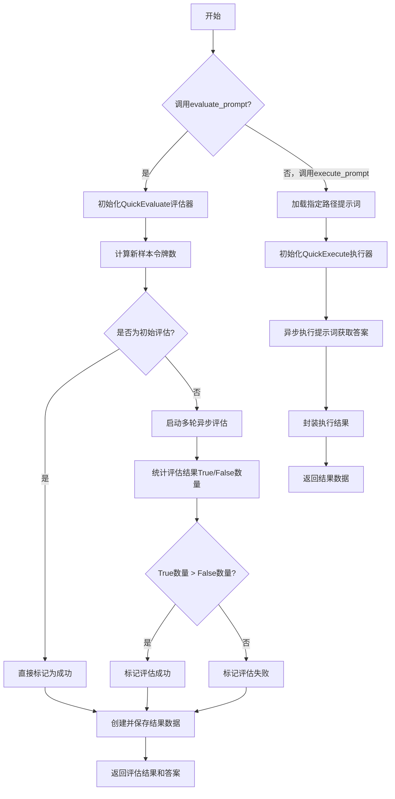
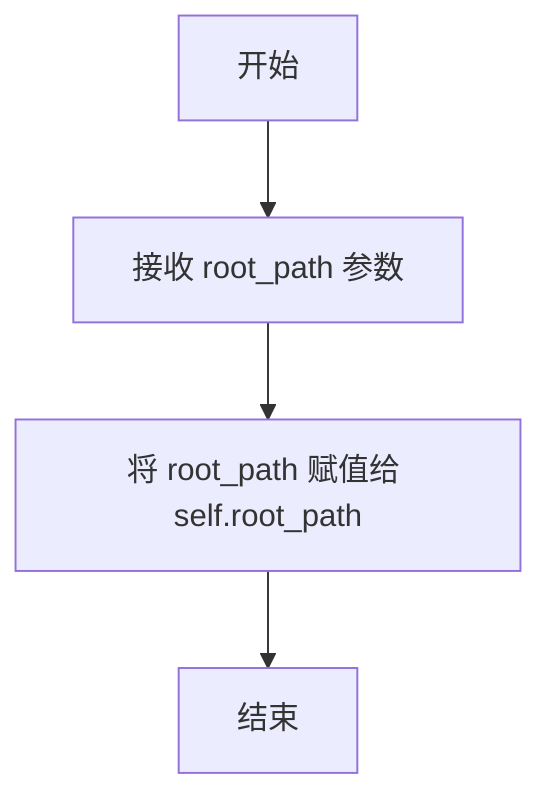
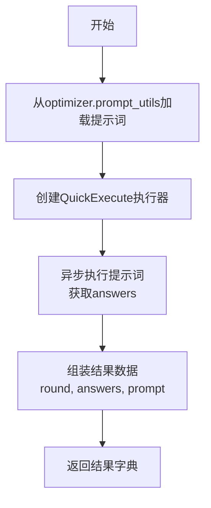

# `.\MetaGPT\metagpt\ext\spo\utils\evaluation_utils.py` 详细设计文档

该代码文件提供了一个用于提示词（Prompt）评估和执行的工具类 `EvaluationUtils`。其核心功能是：1）通过 `execute_prompt` 方法执行给定的提示词并获取模型回答；2）通过 `evaluate_prompt` 方法，利用 `QuickEvaluate` 组件对新的提示词执行结果与旧样本进行多轮对比评估，判断新提示词是否更优，并将评估结果（包括成功状态、回答、令牌数等）保存到指定路径。整个过程旨在自动化地优化提示词，是提示词工程工作流的一部分。

## 整体流程



## 类结构

```
EvaluationUtils (评估工具类)
├── 字段: root_path
├── 方法: __init__
├── 方法: execute_prompt
└── 方法: evaluate_prompt
```

## 全局变量及字段


### `EVALUATION_REPETITION`
    
控制评估重复次数的全局常量，用于多次执行评估以提高结果的可靠性。

类型：`int`
    


### `EvaluationUtils.root_path`
    
存储根路径的实例变量，用于定位和管理评估相关的文件路径。

类型：`Path`
    
    

## 全局函数及方法


### `count_tokens`

该函数用于计算给定样本字典中`answers`字段的文本内容所包含的token数量。它使用`tiktoken`库的`cl100k_base`编码器进行编码和计数。

参数：

-  `sample`：`dict`，包含待计算token数量的数据字典，其中应包含`answers`键。

返回值：`int`，返回样本中`answers`字段文本内容编码后的token数量。如果输入样本为空，则返回0。

#### 流程图

```mermaid
flowchart TD
    A[开始: count_tokens(sample)] --> B{sample 是否为空?}
    B -- 是 --> C[返回 0]
    B -- 否 --> D[获取 cl100k_base 编码器]
    D --> E[将 sample['answers'] 转换为字符串并编码]
    E --> F[计算编码后列表的长度]
    F --> G[返回长度作为 token 数量]
```

#### 带注释源码

```python
def count_tokens(sample: dict):
    # 检查输入样本是否为空
    if not sample:
        # 如果为空，直接返回0个token
        return 0
    else:
        # 获取tiktoken库中用于GPT-3.5/4等模型的cl100k_base编码器
        encoding = tiktoken.get_encoding("cl100k_base")
        # 1. 从样本字典中取出'answers'字段的值
        # 2. 使用str()确保其被转换为字符串
        # 3. 使用编码器的encode方法将字符串转换为token ID列表
        # 4. 使用len()计算列表长度，即token数量
        # 5. 返回该数量
        return len(encoding.encode(str(sample["answers"])))
```


### `EvaluationUtils.__init__`

该方法用于初始化 `EvaluationUtils` 类的实例，主要功能是设置实例的根路径属性，为后续的文件操作和数据处理提供基础路径。

参数：

- `root_path`：`Path`，表示根路径，用于指定文件操作和数据处理的起始目录。

返回值：`None`，无返回值。

#### 流程图



#### 带注释源码

```python
def __init__(self, root_path: Path) -> None:
    # 初始化方法，设置实例的根路径属性
    self.root_path = root_path  # 将传入的根路径保存为实例变量
```


### `EvaluationUtils.execute_prompt`

该方法用于执行一个给定的提示词（prompt），通过指定的优化器（optimizer）加载提示词内容，然后使用`QuickExecute`组件异步执行该提示词，最后将执行结果（答案）、当前轮次和使用的提示词封装成一个字典返回。

参数：

-  `optimizer`：`Any`，一个优化器对象，用于提供当前轮次（`round`）和提示词加载工具（`prompt_utils`）。
-  `prompt_path`：`Path`，提示词文件的路径，用于加载具体的提示词内容。

返回值：`dict`，一个包含执行结果的字典，其键包括：`"round"`（当前优化轮次）、`"answers"`（提示词执行得到的答案）和`"prompt"`（所使用的完整提示词内容）。

#### 流程图



#### 带注释源码

```python
async def execute_prompt(self, optimizer: Any, prompt_path: Path) -> dict:
    # 1. 使用优化器提供的工具，根据当前轮次和文件路径加载提示词内容
    optimizer.prompt = optimizer.prompt_utils.load_prompt(optimizer.round, prompt_path)
    # 2. 使用加载的提示词创建一个快速执行器
    executor = QuickExecute(prompt=optimizer.prompt)

    # 3. 异步执行提示词，获取答案列表
    answers = await executor.prompt_execute()

    # 4. 记录当前的优化轮次
    cur_round = optimizer.round

    # 5. 将轮次、答案和提示词组装成一个字典作为结果
    new_data = {"round": cur_round, "answers": answers, "prompt": optimizer.prompt}

    # 6. 返回结果字典
    return new_data
```


### `EvaluationUtils.evaluate_prompt`

该方法用于评估新生成的提示词样本相对于旧样本的质量。它通过多次并行调用评估器来比较新旧样本，根据多数投票原则决定新样本是否“成功”（即优于旧样本）。无论评估结果如何，它都会将新样本的数据（包括评估结果和令牌数）记录到结果列表中，并持久化保存到文件。最后，返回评估成功与否的布尔值以及新样本的答案内容。

参数：

- `optimizer`：`Any`，优化器对象，提供数据工具（`data_utils`）用于创建结果数据和文件操作。
- `samples`：`Optional[dict]`，旧的样本数据，用于与新样本进行比较评估。
- `new_samples`：`dict`，新生成的样本数据，包含轮次（`round`）、答案（`answers`）和提示词（`prompt`）等信息。
- `path`：`Path`，结果文件存储的目录路径。
- `data`：`List[dict]`，当前已累积的结果数据列表，新的结果将被追加到此列表中。
- `initial`：`bool`，默认为`False`。如果为`True`，则跳过评估流程，直接认为新样本成功。通常用于初始化阶段。

返回值：`Tuple[bool, dict]`，返回一个元组。第一个元素是布尔值，表示新样本是否评估为成功（优于旧样本）；第二个元素是新样本的答案（`answers`）字典。

#### 流程图

```mermaid
flowchart TD
    A[开始] --> B{initial 参数为 True?}
    B -- 是 --> C[设置 succeed = True]
    B -- 否 --> D[创建 QuickEvaluate 评估器]
    D --> E[计算新样本的令牌数<br>new_token = count_tokens(new_samples)]
    E --> F[并行执行 EVALUATION_REPETITION 次评估]
    F --> G[收集评估结果 evaluation_results]
    G --> H[统计评估结果中 True 和 False 的数量]
    H --> I[根据多数投票原则<br>决定 succeed 值]
    C --> J[使用 optimizer.data_utils<br>创建结果数据 new_data]
    I --> J
    J --> K[将 new_data 追加到 data 列表]
    K --> L[获取结果文件路径 result_path]
    L --> M[将整个 data 列表保存到文件]
    M --> N[从 new_samples 中提取 answers]
    N --> O[返回 succeed 和 answers]
```

#### 带注释源码

```python
async def evaluate_prompt(
    self,
    optimizer: Any,
    samples: Optional[dict],
    new_samples: dict,
    path: Path,
    data: List[dict],
    initial: bool = False,
) -> Tuple[bool, dict]:
    # 1. 初始化评估器
    evaluator = QuickEvaluate()
    # 2. 计算新样本的令牌消耗量
    new_token = count_tokens(new_samples)

    # 3. 评估逻辑分支
    if initial is True:
        # 如果是初始轮次，则无需评估，直接视为成功
        succeed = True
    else:
        # 否则，进行多次并行评估以提高结果稳定性
        evaluation_results = []

        # 使用 asyncio.gather 并行执行 EVALUATION_REPETITION 次评估
        evaluation_results.extend(
            await asyncio.gather(
                *(
                    evaluator.prompt_evaluate(samples=samples, new_samples=new_samples)
                    for _ in range(EVALUATION_REPETITION)
                )
            )
        )

        # 记录评估结果日志
        logger.info(f"Evaluation Results {evaluation_results}")

        # 4. 统计评估结果，采用多数投票机制
        true_count = evaluation_results.count(True)
        false_count = evaluation_results.count(False)
        succeed = true_count > false_count

    # 5. 创建结构化的结果数据条目
    new_data = optimizer.data_utils.create_result_data(
        new_samples["round"], new_samples["answers"], new_samples["prompt"], succeed, new_token
    )

    # 6. 将新结果追加到内存中的数据列表
    data.append(new_data)

    # 7. 获取结果文件路径并保存所有数据（全量覆盖）
    result_path = optimizer.data_utils.get_results_file_path(path)
    optimizer.data_utils.save_results(result_path, data)

    # 8. 提取新样本的答案内容
    answers = new_samples["answers"]

    # 9. 返回评估结果和答案
    return succeed, answers
```

## 关键组件


### 张量索引与惰性加载

代码中未直接涉及张量操作或显式的惰性加载机制。数据加载和评估过程是即时执行的。

### 反量化支持

代码中未涉及任何量化或反量化操作。所有数据处理和评估均基于原始文本数据。

### 量化策略

代码中未实现或使用任何模型量化策略。核心功能围绕提示词的执行与评估展开。

### 提示词执行与评估组件

通过`QuickExecute`和`QuickEvaluate`类封装了异步的提示词执行与多轮评估逻辑，是代码的核心功能组件。

### 令牌计数工具

通过`count_tokens`函数和`tiktoken`库，实现了对生成答案的令牌数量统计，用于评估过程中的成本或效率考量。

### 数据持久化管理

通过`EvaluationUtils`类中的方法以及`optimizer.data_utils`，实现了评估结果的数据封装、追加到列表以及保存至文件系统的完整流程。


## 问题及建议


### 已知问题

-   **硬编码的评估重复次数**：`EVALUATION_REPETITION = 4` 是一个硬编码的常量，缺乏灵活性。如果不同的评估场景需要不同的重复次数，或者需要根据运行时条件动态调整，当前设计无法满足。
-   **类型注解不精确**：多个函数参数（如 `optimizer: Any`, `samples: Optional[dict]`）使用了过于宽泛的类型注解（`Any`, `dict`）。这降低了代码的可读性、可维护性，并使得静态类型检查工具（如 mypy）无法提供有效的类型安全保证。
-   **潜在的循环依赖或紧耦合**：`EvaluationUtils` 类的方法严重依赖于传入的 `optimizer` 对象，并直接调用其内部组件（如 `optimizer.prompt_utils`, `optimizer.data_utils`）。这暗示着 `EvaluationUtils` 与 `optimizer` 的具体实现存在紧耦合，违反了依赖倒置原则，使得 `EvaluationUtils` 难以独立测试和复用。
-   **错误处理机制缺失**：代码中没有显式的错误处理逻辑（如 try-except 块）。`execute_prompt` 和 `evaluate_prompt` 方法在执行外部操作（如调用 `QuickExecute.prompt_execute`、`QuickEvaluate.prompt_evaluate`、文件 I/O 操作）时，如果发生异常（如网络错误、文件权限错误、模型 API 错误），异常会直接向上抛出，可能导致程序崩溃且中间状态（如部分写入的数据）不一致。
-   **同步与异步混合的潜在风险**：`evaluate_prompt` 方法内部使用了 `asyncio.gather` 并发执行多个评估任务，但其参数 `samples` 和 `new_samples` 是共享的字典对象。如果 `QuickEvaluate.prompt_evaluate` 方法内部修改了这些字典（尽管当前代码未显示），可能会引发并发数据竞争问题。
-   **代码重复与职责不清**：`execute_prompt` 方法中构造了 `new_data`，`evaluate_prompt` 方法中也通过 `optimizer.data_utils.create_result_data` 构造了类似的数据结构。数据构造逻辑分散在多个地方，且 `EvaluationUtils` 类同时负责执行、评估、数据构造和持久化，违反了单一职责原则。

### 优化建议

-   **将常量参数化**：将 `EVALUATION_REPETITION` 作为 `EvaluationUtils` 类构造函数的参数，或者作为 `evaluate_prompt` 方法的可选参数。这样可以根据不同用例灵活配置评估的严格度。
-   **使用精确的类型注解**：定义具体的接口或协议类（例如 `PromptOptimizerProtocol`），并使用 `typing.Protocol` 或抽象基类（ABC）来精确描述 `optimizer` 参数所需的最小接口（如 `prompt_utils`, `data_utils`, `round` 属性）。同时，为 `samples` 和 `new_samples` 等字典参数定义 `TypedDict` 以明确其结构。
-   **解耦依赖**：重构 `EvaluationUtils`，使其不直接依赖具体的 `optimizer` 对象。可以将所需的工具（如 `prompt_utils`, `data_utils`）和状态（如 `round`）作为方法参数传入，或者通过依赖注入在初始化时提供。这提高了模块的独立性和可测试性。
-   **增强错误处理与状态回滚**：在关键操作（特别是涉及 I/O 和外部服务调用的地方）周围添加 try-except 块。记录详细的错误日志，并考虑实现事务性操作，例如在保存结果到文件失败时，尝试恢复或清理部分写入的数据，或者至少确保异常被妥善捕获并转换为对调用方有意义的错误信息。
-   **确保并发安全**：如果 `QuickEvaluate.prompt_evaluate` 或其依赖有修改输入数据的可能，应在并发调用前对 `samples` 和 `new_samples` 进行深拷贝，或者确保评估函数是纯函数（无副作用）。同时，审查所有在并发上下文中访问的共享资源。
-   **重构以遵循单一职责原则**：
    -   考虑将数据构造逻辑统一到 `data_utils` 中。
    -   将执行（`execute_prompt`）、评估（`evaluate_prompt`）、和数据持久化（保存结果）拆分为更细粒度的组件或服务，`EvaluationUtils` 主要扮演协调者的角色。
    -   引入领域模型（如 `EvaluationSample`, `EvaluationResult`）来封装数据，代替使用原始的字典，提高代码的表达力和类型安全。


## 其它


### 设计目标与约束

本模块的核心设计目标是提供一个异步的、可复用的提示词（Prompt）执行与评估框架，用于优化流程。它通过分离执行（`QuickExecute`）与评估（`QuickEvaluate`）职责，支持对同一提示词进行多次评估以确保结果的稳定性。主要约束包括：1) 依赖外部库`tiktoken`进行令牌计数；2) 评估逻辑（`QuickEvaluate.prompt_evaluate`）的具体实现被封装在外部组件中，本模块仅负责调用和结果统计；3) 数据持久化（保存结果到文件）与业务逻辑耦合在`evaluate_prompt`方法中。

### 错误处理与异常设计

当前代码中显式的错误处理较为有限。`execute_prompt`和`evaluate_prompt`方法中的异步操作（`asyncio.gather`, `executor.prompt_execute`, `evaluator.prompt_evaluate`）可能抛出异常，但并未被捕获和处理，这会导致整个异步任务失败。`count_tokens`函数对输入`sample`为`None`或缺少`"answers"`键的情况做了基本防护。数据保存操作`optimizer.data_utils.save_results`也可能因文件IO问题失败。建议增加适当的`try-except`块来捕获潜在异常，并根据业务场景决定是记录日志后重试、返回默认值还是向上传播异常。

### 数据流与状态机

数据流始于`execute_prompt`方法，它使用`optimizer`提供的提示词，通过`QuickExecute`生成答案`answers`，并封装为`new_samples`字典。该字典随后流入`evaluate_prompt`方法。在`evaluate_prompt`中，`new_samples`与历史`samples`（可选）一同被提交给`QuickEvaluate`进行多次评估。根据评估投票结果（`true_count > false_count`）决定本次优化是否`成功（succeed）`。无论成功与否，本次运行的数据（轮次、答案、提示词、成功状态、令牌数）都会被构造成`new_data`，追加到内存列表`data`中，并同步持久化到文件。`round`字段标识了优化的轮次，构成了一个简单的线性状态推进。

### 外部依赖与接口契约

1.  **外部库**：`tiktoken`（用于OpenAI模型令牌计数）、`asyncio`（异步运行时）。
2.  **内部组件依赖**：
    *   `QuickExecute`类：契约是必须提供异步方法`prompt_execute() -> Any`，用于执行提示词并返回答案。
    *   `QuickEvaluate`类：契约是必须提供异步方法`prompt_evaluate(samples: Optional[dict], new_samples: dict) -> bool`，用于评估新旧样本并返回布尔值结论。
    *   `optimizer`对象：作为上下文传入，需满足以下接口契约：
        *   属性`round`: `Any`，标识当前轮次。
        *   属性`prompt`: `str`，当前提示词。
        *   属性`prompt_utils`：需有方法`load_prompt(round, path) -> str`。
        *   属性`data_utils`：需有方法`create_result_data(...) -> dict`、`get_results_file_path(path) -> Path`和`save_results(path, data) -> None`。
3.  **全局配置**：`EVALUATION_REPETITION`常量定义了评估重复次数，影响结果稳定性和性能。

### 并发与性能考量

模块利用`asyncio.gather`并发执行多次评估任务（`EVALUATION_REPETITION`次），这是主要的性能优化点，能显著缩短多轮评估的总耗时。然而，`execute_prompt`和`evaluate_prompt`通常是顺序执行的，整体流程的并发潜力未被充分挖掘。令牌计数函数`count_tokens`是同步的，对于大量或大文本的样本，可能成为性能瓶颈。若`QuickExecute.prompt_execute`或`QuickEvaluate.prompt_evaluate`涉及网络IO（如调用大模型API），则异步并发设计至关重要。

### 配置与可扩展性

评估的重复次数由全局常量`EVALUATION_REPETITION`硬编码控制，缺乏灵活性。`EvaluationUtils`类的初始化仅接收`root_path`，其行为高度依赖于传入的`optimizer`对象的结构，这带来了紧耦合。要扩展新的评估策略或执行器，需要创建符合既定接口契约（`prompt_evaluate`, `prompt_execute`）的新类，并修改调用方代码。数据保存路径和格式由`optimizer.data_utils`控制，扩展新的持久化方式（如数据库）需要修改该工具类。

### 测试策略建议

1.  **单元测试**：应模拟（Mock）所有外部依赖（`QuickExecute`, `QuickEvaluate`, `optimizer`及其`prompt_utils`, `data_utils`，以及`tiktoken`），对`execute_prompt`和`evaluate_prompt`的核心逻辑进行测试。重点测试`evaluate_prompt`中评估结果统计逻辑（`true_count > false_count`）以及`initial`标志为True时的旁路逻辑。
2.  **集成测试**：使用真实的或测试专用的`QuickExecute`/`QuickEvaluate`实现，验证整个执行-评估-保存数据流的正确性。
3.  **异步测试**：确保测试框架支持异步测试（如`pytest-asyncio`），以正确测试`asyncio.gather`等异步操作。
4.  **异常流测试**：模拟外部组件抛出异常、文件写入失败等场景，验证系统的健壮性（在补充错误处理后）。

    