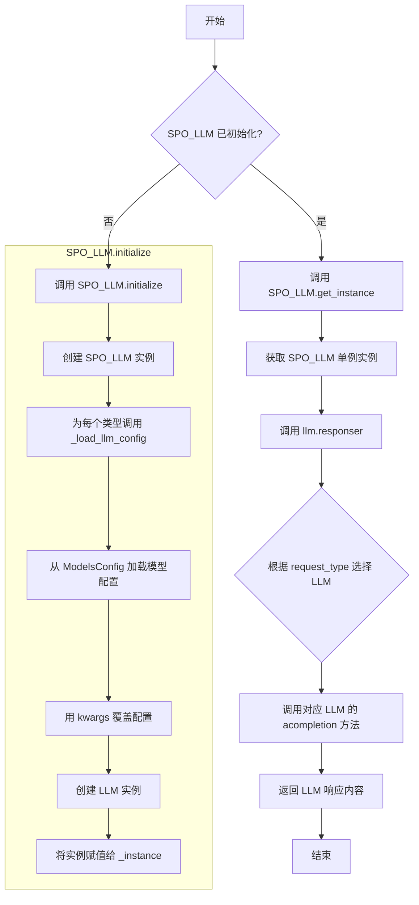
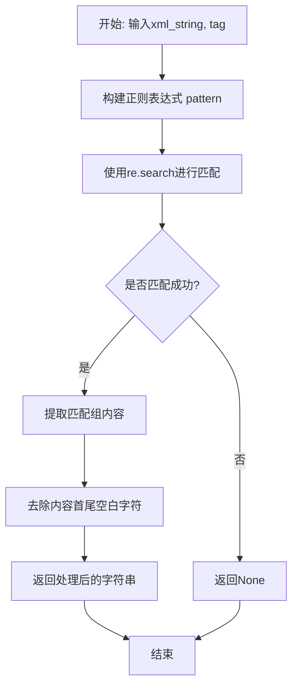
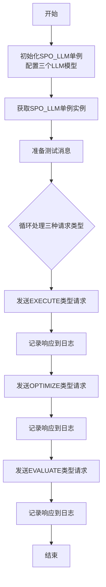
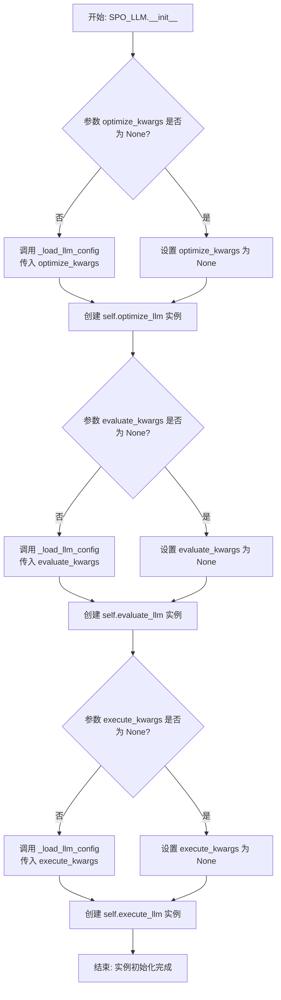
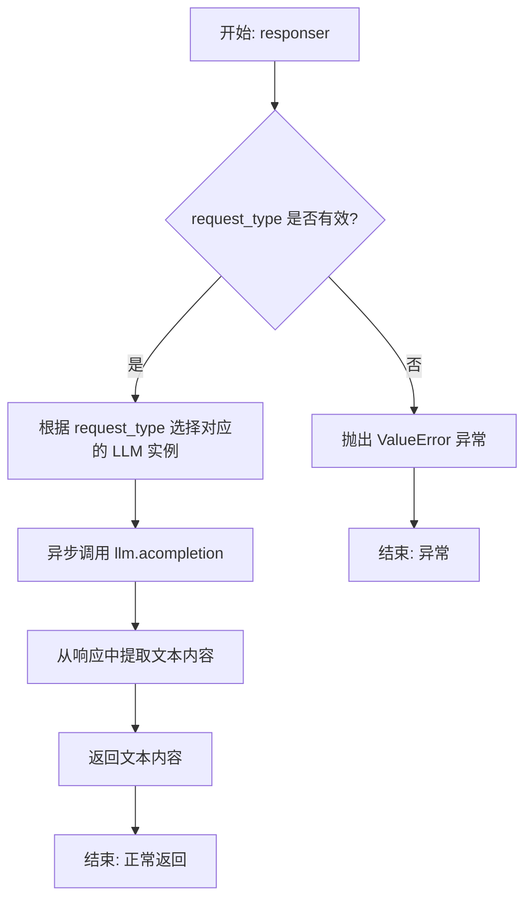
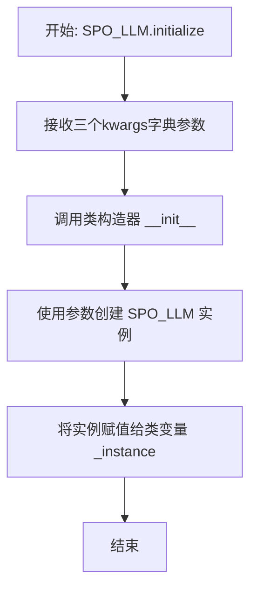

# `.\MetaGPT\metagpt\ext\spo\utils\llm_client.py` 详细设计文档

该代码实现了一个名为 SPO_LLM 的单例类，用于管理三种不同用途（优化、评估、执行）的大语言模型（LLM）实例。它通过配置参数初始化不同的 LLM，并根据请求类型（RequestType）将消息路由到对应的 LLM 进行处理，最后返回 LLM 的响应内容。代码还包含一个辅助函数用于从 XML 字符串中提取特定标签的内容，以及一个用于演示的异步主函数。

## 整体流程



## 类结构

```
SPO_LLM (单例类)
├── 类字段: _instance
├── 实例字段: evaluate_llm, optimize_llm, execute_llm
├── 实例方法: __init__, _load_llm_config, responser
└── 类方法: initialize, get_instance

RequestType (枚举类)
├── OPTIMIZE
├── EVALUATE
└── EXECUTE
```

## 全局变量及字段


### `SPO_LLM._instance`
    
用于实现单例模式的类变量，存储SPO_LLM的唯一全局实例。

类型：`Optional[SPO_LLM]`
    


### `SPO_LLM.evaluate_llm`
    
用于执行评估（evaluate）任务的LLM实例，根据传入的配置参数初始化。

类型：`LLM`
    


### `SPO_LLM.optimize_llm`
    
用于执行优化（optimize）任务的LLM实例，根据传入的配置参数初始化。

类型：`LLM`
    


### `SPO_LLM.execute_llm`
    
用于执行执行（execute）任务的LLM实例，根据传入的配置参数初始化。

类型：`LLM`
    
    

## 全局函数及方法


### `extract_content`

该函数用于从给定的XML格式字符串中，提取指定标签内的文本内容。它使用正则表达式进行匹配，并返回去除首尾空白字符的纯文本。如果未找到匹配的标签，则返回`None`。

参数：

-  `xml_string`：`str`，包含XML格式内容的字符串。
-  `tag`：`str`，需要提取内容的XML标签名称。

返回值：`Optional[str]`，如果找到匹配的标签，则返回标签内的文本内容（已去除首尾空白字符）；否则返回`None`。

#### 流程图



#### 带注释源码

```python
def extract_content(xml_string: str, tag: str) -> Optional[str]:
    # 构建正则表达式模式，用于匹配指定标签及其内容。
    # re.DOTALL标志使 '.' 匹配包括换行符在内的所有字符。
    pattern = rf"<{tag}>(.*?)</{tag}>"
    # 在xml_string中搜索第一个匹配pattern的子串。
    match = re.search(pattern, xml_string, re.DOTALL)
    # 如果找到匹配项，则提取第一个捕获组（即标签内容），并去除首尾空白字符后返回。
    # 否则，返回None。
    return match.group(1).strip() if match else None
```


### `main`

`main` 函数是程序的异步入口点，用于初始化 `SPO_LLM` 单例，并使用三种不同的请求类型（`EXECUTE`、`OPTIMIZE`、`EVALUATE`）向对应的 LLM 实例发送测试消息，最后将响应结果记录到日志中。

参数：
- 无

返回值：`None`，无返回值

#### 流程图



#### 带注释源码

```python
async def main():
    # test LLM
    # 初始化 SPO_LLM 单例，为三种不同的请求类型配置对应的 LLM 模型和参数。
    SPO_LLM.initialize(
        optimize_kwargs={"model": "gpt-4o", "temperature": 0.7},
        evaluate_kwargs={"model": "gpt-4o-mini", "temperature": 0.3},
        execute_kwargs={"model": "gpt-4o-mini", "temperature": 0.3},
    )

    # 获取已初始化的 SPO_LLM 单例实例。
    llm = SPO_LLM.get_instance()

    # test messages
    # 准备一个简单的测试消息。
    hello_msg = [{"role": "user", "content": "hello"}]
    # 使用 EXECUTE 类型的请求发送消息，并获取响应。
    response = await llm.responser(request_type=RequestType.EXECUTE, messages=hello_msg)
    # 将响应内容记录到日志。
    logger(f"AI: {response}")
    # 使用 OPTIMIZE 类型的请求发送消息，并获取响应。
    response = await llm.responser(request_type=RequestType.OPTIMIZE, messages=hello_msg)
    logger(f"AI: {response}")
    # 使用 EVALUATE 类型的请求发送消息，并获取响应。
    response = await llm.responser(request_type=RequestType.EVALUATE, messages=hello_msg)
    logger(f"AI: {response}")
```


### `SPO_LLM.__init__`

初始化 `SPO_LLM` 类的实例，根据传入的配置参数创建三个独立的 `LLM` 实例，分别用于优化、评估和执行任务。

参数：

- `optimize_kwargs`：`Optional[dict]`，用于配置优化任务 `LLM` 实例的参数字典，包含如 `model`、`temperature` 等键值对。
- `evaluate_kwargs`：`Optional[dict]`，用于配置评估任务 `LLM` 实例的参数字典。
- `execute_kwargs`：`Optional[dict]`，用于配置执行任务 `LLM` 实例的参数字典。

返回值：`None`，此方法为构造函数，不返回任何值。

#### 流程图



#### 带注释源码

```python
def __init__(
    self,
    optimize_kwargs: Optional[dict] = None,  # 优化任务LLM的配置参数
    evaluate_kwargs: Optional[dict] = None,  # 评估任务LLM的配置参数
    execute_kwargs: Optional[dict] = None,   # 执行任务LLM的配置参数
) -> None:
    # 使用 _load_llm_config 方法处理 evaluate_kwargs 参数，生成LLM配置，并创建评估LLM实例
    self.evaluate_llm = LLM(llm_config=self._load_llm_config(evaluate_kwargs))
    # 使用 _load_llm_config 方法处理 optimize_kwargs 参数，生成LLM配置，并创建优化LLM实例
    self.optimize_llm = LLM(llm_config=self._load_llm_config(optimize_kwargs))
    # 使用 _load_llm_config 方法处理 execute_kwargs 参数，生成LLM配置，并创建执行LLM实例
    self.execute_llm = LLM(llm_config=self._load_llm_config(execute_kwargs))
```

### `SPO_LLM._load_llm_config`

该方法负责根据传入的参数字典，加载并配置指定的LLM模型。它首先验证必需的`model`参数，然后从全局模型配置中获取该模型的默认配置。接着，它会用传入的参数字典覆盖默认配置中的对应属性，最终返回一个配置好的模型配置对象。

参数：

- `kwargs`：`dict`，包含模型配置参数的字典，其中必须包含`model`键。

返回值：`Any`，一个配置好的模型配置对象，通常是`ModelsConfig`中定义的某个配置类的实例。

#### 流程图

```mermaid
flowchart TD
    A[开始: _load_llm_config(kwargs)] --> B{kwargs中是否包含'model'键?}
    B -- 否 --> C[抛出 ValueError 异常]
    B -- 是 --> D[从 ModelsConfig 获取默认配置]
    D --> E{获取 model 配置成功?}
    E -- 否 --> F[抛出 ValueError 异常]
    E -- 是 --> G[创建配置的深拷贝 config]
    G --> H[遍历 kwargs 的键值对]
    H --> I{config 是否拥有该属性?}
    I -- 否 --> J[跳过此键值对]
    I -- 是 --> K[使用 setattr 更新 config 属性]
    J --> L[继续遍历]
    K --> L
    L --> H
    H -- 遍历结束 --> M[返回配置好的 config 对象]
    C --> N[结束]
    F --> N
    M --> N
```

#### 带注释源码

```python
def _load_llm_config(self, kwargs: dict) -> Any:
    # 1. 检查必需的 'model' 参数
    model = kwargs.get("model")
    if not model:
        raise ValueError("'model' parameter is required")

    try:
        # 2. 从全局 ModelsConfig 中获取指定模型的默认配置
        model_config = ModelsConfig.default().get(model)
        if model_config is None:
            raise ValueError(f"Model '{model}' not found in configuration")

        # 3. 创建默认配置的深拷贝，避免修改原始配置
        config = model_config.model_copy()

        # 4. 遍历传入的参数字典，覆盖默认配置中的属性
        for key, value in kwargs.items():
            # 仅当配置对象拥有该属性时才进行覆盖
            if hasattr(config, key):
                setattr(config, key, value)

        # 5. 返回最终配置好的对象
        return config

    # 6. 异常处理：捕获可能的配置加载错误
    except AttributeError:
        raise ValueError(f"Model '{model}' not found in configuration")
    except Exception as e:
        raise ValueError(f"Error loading configuration for model '{model}': {str(e)}")
```

### `SPO_LLM.responser`

该方法根据传入的请求类型（`RequestType`），从预配置的LLM实例映射中选择对应的LLM，并异步调用其`acompletion`方法处理消息列表，最终返回LLM生成的文本内容。

参数：

- `request_type`：`RequestType`，请求类型枚举，决定使用哪个LLM实例（优化、评估或执行）。
- `messages`：`List[dict]`，消息列表，通常包含角色（如“user”）和内容，用于与LLM进行对话。

返回值：`str`，LLM生成的文本响应内容。

#### 流程图



#### 带注释源码

```python
async def responser(self, request_type: RequestType, messages: List[dict]) -> str:
    # 定义请求类型到LLM实例的映射字典
    llm_mapping = {
        RequestType.OPTIMIZE: self.optimize_llm,
        RequestType.EVALUATE: self.evaluate_llm,
        RequestType.EXECUTE: self.execute_llm,
    }

    # 根据请求类型获取对应的LLM实例
    llm = llm_mapping.get(request_type)
    # 如果请求类型无效，抛出异常
    if not llm:
        raise ValueError(f"Invalid request type. Valid types: {', '.join([t.value for t in RequestType])}")

    # 异步调用LLM的完成接口处理消息
    response = await llm.acompletion(messages)
    # 从响应对象中提取第一个选择的消息内容并返回
    return response.choices[0].message.content
```

### `SPO_LLM.initialize`

这是一个类方法，用于初始化 `SPO_LLM` 类的全局单例实例。它接收三个字典参数，分别用于配置优化、评估和执行三种不同功能的 LLM 模型，并创建 `SPO_LLM` 实例赋值给类变量 `_instance`。

参数：

- `optimize_kwargs`：`dict`，用于配置优化功能 LLM 的参数，如模型名称、温度等。
- `evaluate_kwargs`：`dict`，用于配置评估功能 LLM 的参数。
- `execute_kwargs`：`dict`，用于配置执行功能 LLM 的参数。

返回值：`None`，此方法不返回任何值，其作用是将创建的 `SPO_LLM` 实例赋值给类变量 `_instance`。

#### 流程图



#### 带注释源码

```python
    @classmethod
    def initialize(cls, optimize_kwargs: dict, evaluate_kwargs: dict, execute_kwargs: dict) -> None:
        """Initialize the global instance"""
        # 调用类的构造方法 __init__，传入三个配置字典，创建一个 SPO_LLM 实例。
        # 然后将这个新创建的实例赋值给类变量 `_instance`，从而完成全局单例的初始化。
        cls._instance = cls(optimize_kwargs, evaluate_kwargs, execute_kwargs)
```

### `SPO_LLM.get_instance`

这是一个类方法，用于获取 `SPO_LLM` 类的全局单例实例。它实现了简单的单例模式，确保在整个应用程序中只有一个 `SPO_LLM` 实例被创建和使用。如果实例尚未初始化，则会抛出运行时错误。

参数：
-  `cls`：`Class[SPO_LLM]`，类方法的隐式参数，指向 `SPO_LLM` 类本身。

返回值：`SPO_LLM`，返回已初始化的 `SPO_LLM` 类的全局单例实例。

#### 流程图

```mermaid
flowchart TD
    A[开始: 调用 get_instance] --> B{检查 _instance 是否为 None?}
    B -- 是 --> C[抛出 RuntimeError<br>“SPO_LLM not initialized. Call initialize() first.”]
    B -- 否 --> D[返回 _instance 单例对象]
    C --> E[结束: 程序异常终止]
    D --> F[结束: 返回实例]
```

#### 带注释源码

```python
    @classmethod
    def get_instance(cls) -> "SPO_LLM":
        """Get the global instance"""
        # 检查类变量 `_instance` 是否为 None。
        # 如果为 None，说明单例实例尚未通过 `initialize` 方法创建。
        if cls._instance is None:
            # 抛出运行时错误，提示用户必须先调用 `initialize` 方法。
            raise RuntimeError("SPO_LLM not initialized. Call initialize() first.")
        # 如果 `_instance` 不为 None，则返回这个已初始化的单例实例。
        return cls._instance
```

## 关键组件


### SPO_LLM 类

一个单例类，用于管理三种不同用途（优化、评估、执行）的 LLM 实例，根据请求类型分发请求到对应的 LLM。

### 请求类型枚举 (RequestType)

定义了三种 LLM 请求类型：OPTIMIZE（优化）、EVALUATE（评估）和 EXECUTE（执行），用于在 SPO_LLM 中路由请求。

### 配置加载机制 (_load_llm_config 方法)

根据传入的参数字典动态加载和配置 LLM 模型，支持从全局配置中获取默认值并覆盖特定参数。

### 异步响应器 (responser 方法)

根据传入的 RequestType 选择对应的 LLM 实例，并异步调用其 acompletion 方法获取响应内容。

### 单例模式管理 (initialize 和 get_instance 类方法)

提供全局单例的初始化和获取接口，确保应用中只有一个 SPO_LLM 实例管理所有 LLM 客户端。

### XML 内容提取函数 (extract_content)

一个工具函数，使用正则表达式从给定的 XML 格式字符串中提取指定标签内的内容。


## 问题及建议


### 已知问题

-   **单例模式实现不完整**：`SPO_LLM` 类使用了类变量 `_instance` 来实现单例模式，但其 `__init__` 方法并未被保护。这意味着在调用 `initialize` 之后，仍然可以通过 `SPO_LLM(...)` 直接创建新的实例，破坏了单例的约束。
-   **配置加载逻辑存在冗余和错误处理不精确**：`_load_llm_config` 方法中，`try` 块捕获了 `AttributeError` 和通用的 `Exception`。然而，`ModelsConfig.default().get(model)` 返回 `None` 时，后续的 `model_config.model_copy()` 调用会引发 `AttributeError`，这与“模型未找到”的语义不完全匹配，且错误信息可能不够清晰。同时，`model_config` 为 `None` 时的检查与 `AttributeError` 捕获存在逻辑重叠。
-   **硬编码的响应内容提取**：`responser` 方法直接返回 `response.choices[0].message.content`，这假设了 LLM 响应结构始终符合 OpenAI API 的格式。如果底层 `LLM` 类支持的模型或响应格式发生变化，此代码将无法适应。
-   **缺乏资源管理**：代码没有提供关闭或清理 LLM 实例（如释放网络连接）的方法。在长期运行的服务中，这可能导致资源泄漏。
-   **测试代码与生产代码耦合**：`main` 函数中的测试逻辑与核心类定义放在同一个文件中，这不利于代码的模块化和部署。

### 优化建议

-   **完善单例模式**：重写 `__new__` 方法以确保无论通过何种方式创建对象，都返回唯一的实例。或者，将 `__init__` 设为私有，并通过类方法 `get_instance` 来获取（必要时初始化）实例，确保实例化路径唯一。
-   **重构配置加载与错误处理**：简化 `_load_llm_config` 方法。首先检查 `model` 参数，然后直接从 `ModelsConfig` 获取配置。如果获取结果为 `None`，直接抛出 `ValueError` 并明确提示模型未找到。移除对 `AttributeError` 的捕获，让更具体的错误（如配置复制失败）向上传播，或进行更精细的捕获和处理。
-   **抽象响应解析逻辑**：将 `response.choices[0].message.content` 这行代码封装到一个独立的方法中（例如 `_parse_llm_response`）。这样，当需要支持不同LLM提供商的响应格式时，只需修改这个方法，或者将其设计为可插拔的策略。
-   **添加资源管理接口**：在 `SPO_LLM` 类中增加一个 `close` 或 `cleanup` 方法，用于内部调用各个 `LLM` 实例的关闭逻辑（如果 `LLM` 类支持的话）。确保单例在应用结束时能被正确清理。
-   **分离关注点**：将 `main` 函数中的测试代码移到一个独立的测试文件（如 `test_spo_llm.py`）中。保持核心模块的纯净，只包含业务逻辑和类定义。
-   **考虑配置的灵活性**：当前 `initialize` 方法要求同时提供三个配置字典。可以考虑支持部分更新，或者允许通过一个统一的配置字典来初始化，增加使用的便利性。
-   **增强日志记录**：在 `responser` 方法中，可以增加更详细的日志，例如记录请求类型、使用的模型、请求耗时等，便于监控和调试。


## 其它


### 设计目标与约束

本模块的核心设计目标是提供一个面向特定任务（优化、评估、执行）的、可配置的多LLM（大语言模型）代理封装。它遵循单一职责原则，将不同任务的LLM调用逻辑与配置管理分离。主要约束包括：1) 依赖外部配置系统（`ModelsConfig`）来获取模型参数；2) 采用单例模式确保全局只有一个配置好的代理实例；3) 异步设计以支持高效的并发LLM调用。

### 错误处理与异常设计

模块通过明确的异常类型和错误信息来处理错误情况：
1. **配置加载错误**：在`_load_llm_config`方法中，当`model`参数缺失、配置中找不到指定模型或设置属性时发生错误，会抛出`ValueError`并附带清晰的描述信息。
2. **单例访问错误**：在`get_instance`类方法中，如果单例实例未被初始化（`_instance`为`None`），会抛出`RuntimeError`。
3. **无效请求类型错误**：在`responser`方法中，如果传入的`request_type`不在预定义的`RequestType`枚举中，会抛出`ValueError`。
这种设计使得调用方能够清晰地捕获和处理特定类型的失败，而不是依赖通用的异常。

### 数据流与状态机

模块的数据流清晰：
1. **初始化阶段**：通过`SPO_LLM.initialize(...)`传入三个任务的配置字典，触发单例实例的创建。在构造函数中，为每个任务（优化、评估、执行）分别创建一个独立的`LLM`实例，其配置通过`_load_llm_config`方法从全局`ModelsConfig`加载并覆盖用户提供的参数。
2. **运行阶段**：用户通过`SPO_LLM.get_instance()`获取单例实例，然后调用`responser`方法。该方法根据`request_type`参数路由到对应的`LLM`实例（`optimize_llm`, `evaluate_llm`, `execute_llm`之一），并调用其`acompletion`方法异步获取响应，最后提取并返回响应内容。
模块没有复杂的状态变迁，其核心状态是单例实例及其内部三个LLM子实例的配置和就绪状态。

### 外部依赖与接口契约

1. **`metagpt.configs.models_config.ModelsConfig`**：用于获取默认的LLM模型配置。契约：期望调用其`default()`方法返回一个包含模型配置的对象，并且该对象支持`get(model_name)`方法和`model_copy()`方法。
2. **`metagpt.llm.LLM`**：核心LLM调用封装。契约：期望其构造函数接受一个配置对象（`llm_config`），并且其实例拥有一个异步方法`acompletion(messages)`，该方法返回一个包含`choices`列表的对象，其中`choices[0].message.content`为响应文本。
3. **`metagpt.logs.logger`**：日志记录工具。
4. **`re` (正则表达式库)** 和 **`asyncio`**：Python标准库，用于内容提取和异步运行时管理。
模块通过`_load_llm_config`方法抽象了与`ModelsConfig`的交互细节，但调用方仍需保证传入的配置字典结构符合预期。

### 并发与线程安全

模块设计为异步（`async`）操作，核心方法`responser`是`async`的，适用于`asyncio`事件循环。这允许在IO密集的LLM调用期间不阻塞事件循环。单例模式的实现（基于类变量`_instance`）在典型的单线程`asyncio`应用中是安全的，因为初始化（`initialize`）通常在程序启动时完成，后续的`get_instance`只是读取操作。然而，如果在多线程环境中使用，或者存在在运行时并发调用`initialize`的风险，则需要额外的锁机制来保证线程安全，目前代码并未提供此类保护。

### 配置管理与扩展性

配置管理通过`_load_llm_config`方法集中处理。它支持从默认配置获取基础设置，并通过传入的`kwargs`字典覆盖特定参数（如`temperature`），提供了灵活性。扩展性体现在：
1. **新增任务类型**：如需支持新的`RequestType`，需要在`RequestType`枚举、`__init__`中的LLM实例创建、`responser`中的`llm_mapping`三处进行添加。
2. **配置模型**：通过修改传入`initialize`方法的`kwargs`或底层的`ModelsConfig`，可以轻松切换不同的LLM模型（如`gpt-4o`, `gpt-4o-mini`）或调整其参数。
当前的配置覆盖逻辑（`setattr`）假设配置对象的所有属性都是可写的，这可能不适用于所有配置类。

### 测试策略与示例

模块包含一个`main`函数作为使用示例和简单的集成测试。它演示了完整的流程：初始化单例、获取实例、针对三种不同请求类型发送消息并记录响应。这可以作为模块基础功能的冒烟测试。更全面的单元测试应覆盖：
1. `_load_llm_config`在各种有效和无效输入下的行为。
2. `responser`方法的路由逻辑和错误处理。
3. 单例模式的初始化和访问。
4. `extract_content`辅助函数的正则匹配功能。
测试应模拟`LLM.acompletion`的响应，以避免在测试中产生真实的API调用和费用。

    