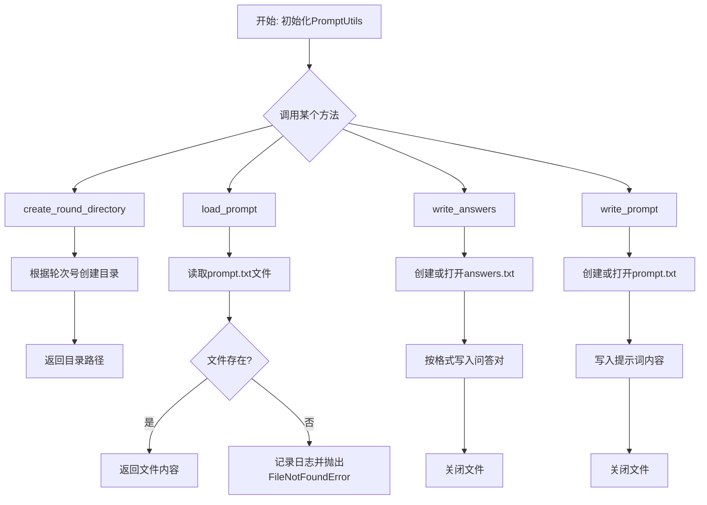
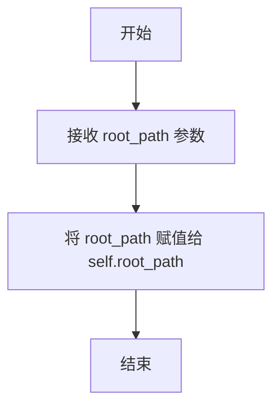
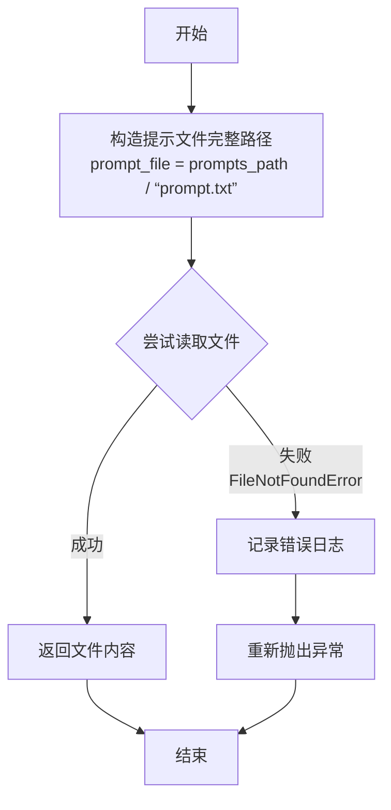
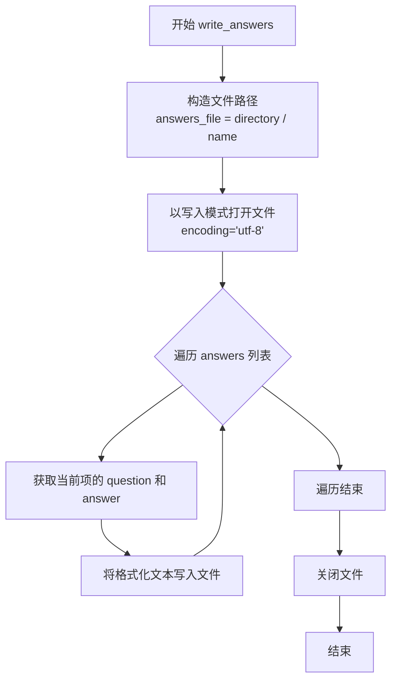

# `.\MetaGPT\metagpt\ext\spo\utils\prompt_utils.py` 详细设计文档

该代码定义了一个PromptUtils类，用于管理多轮对话或评估任务中的提示词（prompt）和答案（answer）文件。核心功能包括：根据轮次创建目录、从指定路径加载提示词文本、将问答对写入答案文件、以及将提示词写入文件。它封装了与文件系统交互的常见操作，旨在为基于提示词的流程（如LLM评估或对话管理）提供基础的文件组织工具。

## 整体流程



## 类结构

```
PromptUtils
├── __init__
├── create_round_directory
├── load_prompt
├── write_answers
└── write_prompt
```

## 全局变量及字段


### `PromptUtils.root_path`
    
存储PromptUtils类操作的基础根目录路径，用于构建和管理提示文件及轮次目录。

类型：`Path`
    
    

## 全局函数及方法

### `PromptUtils.__init__`

该方法用于初始化 `PromptUtils` 类的实例，设置其根路径属性。

参数：

- `root_path`：`Path`，表示文件系统操作的根目录路径。

返回值：`None`，此方法为构造函数，不返回任何值。

#### 流程图



#### 带注释源码

```python
def __init__(self, root_path: Path):
    # 初始化方法，设置实例的根路径属性
    self.root_path = root_path
```

### `PromptUtils.create_round_directory`

该方法用于在指定的提示路径下，根据给定的轮次号创建一个对应的轮次目录（例如 `round_1`）。如果目录已存在，则不会引发错误。

参数：
- `prompt_path`：`Path`，基础提示文件所在的目录路径。
- `round_number`：`int`，当前对话或任务的轮次编号。

返回值：`Path`，返回新创建或已存在的轮次目录的路径对象。

#### 流程图

```mermaid
graph TD
    A[开始: create_round_directory] --> B[组合目录路径: prompt_path / round_{round_number}]
    B --> C{目录是否存在?}
    C -- 否 --> D[创建目录]
    C -- 是 --> E[跳过创建]
    D --> F[返回目录路径]
    E --> F
    F --> G[结束]
```

#### 带注释源码

```python
def create_round_directory(self, prompt_path: Path, round_number: int) -> Path:
    # 根据基础路径和轮次号，构建本轮次的目录路径
    directory = prompt_path / f"round_{round_number}"
    # 创建目录。`parents=True`确保父目录存在，`exist_ok=True`表示如果目录已存在则不报错
    directory.mkdir(parents=True, exist_ok=True)
    # 返回创建好的目录路径对象
    return directory
```

### `PromptUtils.load_prompt`

该方法用于从指定路径加载提示文本文件（prompt.txt）的内容。

参数：

- `round_number`：`int`，当前轮次编号，主要用于日志记录。
- `prompts_path`：`Path`，提示文件所在目录的路径。

返回值：`str`，成功读取到的提示文本文件内容。

#### 流程图



#### 带注释源码

```python
def load_prompt(self, round_number: int, prompts_path: Path):
    # 构造提示文件的完整路径，假设文件名为 “prompt.txt”
    prompt_file = prompts_path / "prompt.txt"

    try:
        # 尝试以 UTF-8 编码读取文件内容并返回
        return prompt_file.read_text(encoding="utf-8")
    except FileNotFoundError as e:
        # 如果文件未找到，记录包含轮次信息的错误日志
        logger.info(f"Error loading prompt for round {round_number}: {e}")
        # 重新抛出异常，由调用者处理
        raise
```

### `PromptUtils.write_answers`

该方法用于将一组问答对（以字典列表形式组织）写入到指定目录下的一个文本文件中。每个问答对会被格式化为清晰可读的文本块，包含“Question:”和“Answer:”标签。

参数：

- `directory`：`Path`，目标目录的路径对象，用于指定答案文件的存放位置。
- `answers`：`dict`，一个字典列表，其中每个字典应包含 `'question'` 和 `'answer'` 两个键，分别存储问题和答案的文本。
- `name`：`str`，可选参数，指定输出文件的名称，默认为 `"answers.txt"`。

返回值：`None`，此方法不返回任何值，其作用是将数据写入文件。

#### 流程图



#### 带注释源码

```python
def write_answers(self, directory: Path, answers: dict, name: str = "answers.txt"):
    # 1. 根据传入的目录和文件名，构造完整的文件路径对象。
    answers_file = directory / name
    # 2. 以写入模式（‘w’）和 UTF-8 编码打开文件。使用 `with` 语句确保文件操作完成后正确关闭。
    with answers_file.open("w", encoding="utf-8") as file:
        # 3. 遍历传入的答案字典列表。
        for item in answers:
            # 4. 将每个问答对格式化为带有明确标签的文本块，并写入文件。
            #    格式为：
            #    Question:
            #    {问题内容}
            #    Answer:
            #    {答案内容}
            #    （空行）
            file.write(f"Question:\n{item['question']}\n")
            file.write(f"Answer:\n{item['answer']}\n")
            file.write("\n")
    # 5. 方法执行完毕，无返回值。
```

### `PromptUtils.write_prompt`

该方法用于将给定的提示文本（`prompt`）写入到指定目录（`directory`）下的一个名为 `prompt.txt` 的文件中。它主要用于在特定轮次的对话或任务中持久化保存提示信息。

参数：

- `directory`：`Path`，目标目录的路径对象，`prompt.txt` 文件将在此目录下创建或覆盖。
- `prompt`：`str`，需要写入文件的提示文本内容。

返回值：`None`，该方法不返回任何值。

#### 流程图

```mermaid
flowchart TD
    A[开始] --> B[构造文件路径<br>prompt_file = directory / 'prompt.txt']
    B --> C[写入文件<br>prompt_file.write_text(prompt, encoding='utf-8')]
    C --> D[结束]
```

#### 带注释源码

```python
def write_prompt(self, directory: Path, prompt: str):
    # 在指定的目录下，构造目标文件路径，文件名为 'prompt.txt'
    prompt_file = directory / "prompt.txt"
    # 将传入的 prompt 字符串以 UTF-8 编码写入到构造的文件路径中
    # 如果文件已存在，则会被覆盖
    prompt_file.write_text(prompt, encoding="utf-8")
```

## 关键组件


### 文件与目录管理

负责创建和管理用于存储提示和答案的目录结构，包括根据轮次创建子目录。

### 提示加载与写入

负责从指定文件加载提示文本，并将生成的提示写入到对应的目录文件中。

### 答案写入

负责将问答对（字典格式）格式化并写入到指定的答案文件中，支持自定义文件名。


## 问题及建议


### 已知问题

-   **硬编码的文件名和路径结构**：代码中多处硬编码了文件名（如 `prompt.txt`、`answers.txt`）和目录命名规则（`round_{round_number}`）。这使得代码与特定的文件系统结构紧密耦合，降低了灵活性。如果需要更改文件名或调整目录结构，必须修改源代码。
-   **错误处理不够健壮**：`load_prompt` 方法在捕获 `FileNotFoundError` 后，虽然记录了日志，但直接重新抛出异常。对于调用者来说，这提供了足够的信息，但代码本身没有提供任何恢复机制或更详细的错误上下文（例如，尝试查找备用文件）。
-   **方法职责边界模糊**：`load_prompt` 方法接收 `prompts_path` 参数，但其内部逻辑却假设该路径下存在一个名为 `prompt.txt` 的文件。方法的名称暗示它加载“提示”，但参数名 `prompts_path`（复数形式）可能暗示一个包含多个提示的目录，这造成了命名上的歧义和职责不清晰。
-   **缺乏输入验证**：类方法（如 `write_answers`）没有对输入参数（如 `answers` 字典的结构）进行有效性验证。如果传入的 `answers` 格式不符合预期（例如，缺少 `'question'` 或 `'answer'` 键），可能会导致运行时错误或生成格式错误的文件。
-   **潜在的编码问题**：虽然当前代码指定了 `utf-8` 编码进行读写，但如果未来处理的文件包含 `utf-8` 无法解码的字符，或者来自不同编码系统的文件，可能会出现问题。代码没有提供处理编码错误的策略。

### 优化建议

-   **将配置参数化**：将硬编码的文件名（`prompt.txt`、`answers.txt`）和目录前缀（`round_`）提取为类的配置参数（例如，通过 `__init__` 方法初始化或作为类常量）。这样可以提高代码的可配置性和可测试性。
-   **增强错误处理与恢复**：在 `load_prompt` 方法中，可以尝试从多个备选路径或文件名加载提示。此外，可以定义更具体的异常类（如 `PromptLoadingError`）来包装底层异常，并提供更丰富的错误信息。对于文件写入操作，也可以考虑添加更详细的异常捕获和日志记录。
-   **重构以明确职责**：考虑将 `load_prompt` 方法重命名为更准确的名称，如 `load_prompt_from_file`，并明确其参数 `prompt_file_path`。或者，创建一个更通用的 `FileLoader` 类来负责各种文件的加载，使 `PromptUtils` 更专注于业务逻辑。
-   **添加输入验证和契约**：在 `write_answers` 等方法开始时，验证 `answers` 参数是否为预期的列表字典结构，并检查每个字典是否包含必要的键。可以使用 `assert` 语句（在开发环境中）或抛出 `ValueError` 来强制契约。
-   **提高编码处理的鲁棒性**：可以为读写文件的方法增加 `encoding` 参数，并提供一个合理的默认值（如 `utf-8`）。同时，考虑在捕获 `UnicodeDecodeError` 时提供回退策略（如尝试其他编码或记录错误并跳过问题行）。
-   **考虑使用更高级的序列化格式**：如果 `answers` 的数据结构变得复杂，考虑使用如 JSON 或 YAML 等格式进行序列化，而不是自定义的文本格式。这可以提高数据的可读性、可维护性和互操作性。当前方法可以保留作为向后兼容或简单用例的选项。
-   **引入依赖注入以提升可测试性**：`root_path` 通过 `__init__` 注入是好的做法。可以进一步考虑将对文件系统的操作（如 `Path.mkdir`、`Path.read_text`）抽象为一个接口（例如 `FileSystemOps`），以便在单元测试中轻松模拟。


## 其它


### 设计目标与约束

本模块旨在提供一个轻量级、职责单一的提示词（Prompt）管理工具，用于在多轮对话或任务执行场景中，组织、加载和保存提示词及相关答案。其核心设计目标包括：
1.  **职责分离**：将文件路径管理、目录创建、文件读写等与提示词处理相关的IO操作封装在一个独立的类中，使业务逻辑代码更清晰。
2.  **可配置性**：通过构造函数接收根路径，支持在不同项目或环境下灵活配置提示词的存储位置。
3.  **容错性**：在加载文件时进行基本的异常捕获和日志记录，便于问题追踪。
4.  **约定优于配置**：采用固定的文件名（如 `prompt.txt`, `answers.txt`）和目录命名格式（如 `round_{n}`），简化使用逻辑。

主要约束包括：
*   文件格式固定为UTF-8编码的文本文件。
*   答案数据的存储结构依赖于调用方传入的特定字典格式（包含 `'question'` 和 `'answer'` 键）。
*   模块功能相对基础，不涉及复杂的提示词模板渲染、版本管理或高级的序列化/反序列化。

### 错误处理与异常设计

模块的错误处理策略如下：
1.  **主动异常抛出**：`load_prompt` 方法在目标文件不存在时，会捕获 `FileNotFoundError`，记录日志后重新抛出该异常。这强制调用方必须处理文件缺失的情况，符合“快速失败”原则。
2.  **静默创建目录**：`create_round_directory` 方法使用 `exist_ok=True` 参数，当目录已存在时不会抛出异常，而是静默继续，这适应了重复运行或恢复执行的场景。
3.  **依赖上下文异常**：`write_answers` 和 `write_prompt` 方法在执行文件写入操作时，未显式捕获异常。任何IO错误（如权限不足、磁盘已满）将直接向上层抛出，由调用方根据具体业务上下文决定如何处理。
4.  **日志记录**：使用项目统一的 `logger` 记录非致命性的错误信息（如文件未找到），便于调试和监控，但不会改变程序流程。

### 数据流与状态机

本模块不维护复杂的内部状态，其数据流主要是线性的文件IO操作：
1.  **初始化数据流**：`PromptUtils` 实例化时，从外部传入 `root_path`，作为所有后续文件操作的基准路径。
2.  **读取数据流**：调用 `load_prompt(prompts_path)`。数据从磁盘文件（`prompts_path / "prompt.txt"`）读取，经过解码后，以字符串形式返回给调用方。
3.  **写入数据流**：
    *   **提示词写入**：调用 `write_prompt(directory, prompt)`。数据（`prompt` 字符串）被写入到指定目录的 `prompt.txt` 文件中。
    *   **答案写入**：调用 `write_answers(directory, answers)`。数据（`answers` 字典列表）被格式化后，写入到指定目录的 `answers.txt` 文件中。
4.  **目录创建**：`create_round_directory` 作为辅助流程，通常在写入操作前被调用，用于准备存储数据的目录结构。

模块本身无状态机，其行为完全由方法调用的输入参数决定。

### 外部依赖与接口契约

1.  **外部依赖**：
    *   **Python标准库**：`pathlib.Path` 用于所有路径操作和文件读写。
    *   **项目内部模块**：`metagpt.logs.logger` 用于记录信息日志。这是该模块唯一的项目特定依赖。
2.  **接口契约（对调用方）**：
    *   **`__init__(root_path: Path)`**：要求调用方提供一个有效的 `Path` 对象作为工作根目录。
    *   **`load_prompt(prompts_path: Path)`**：要求 `prompts_path` 目录下存在名为 `prompt.txt` 的文件，且为UTF-8编码。返回该文件内容字符串，若文件不存在则抛出 `FileNotFoundError`。
    *   **`write_answers(directory: Path, answers: dict, name: str)`**：要求 `answers` 参数为一个字典列表，且每个字典至少包含 `'question'` 和 `'answer'` 两个键。方法将在 `directory` 下创建或覆盖名为 `name`（默认为 `answers.txt`）的文件。
    *   **`write_prompt(directory: Path, prompt: str)`**：将 `prompt` 字符串写入 `directory` 下的 `prompt.txt` 文件。
    *   **`create_round_directory(prompt_path: Path, round_number: int)`**：在 `prompt_path` 下创建格式为 `round_{round_number}` 的子目录。
3.  **隐式契约**：所有文件操作均使用UTF-8编码。调用方应确保传入的 `Path` 对象在当前的运行环境中是有效且可访问的。

### 安全与合规考虑

1.  **路径遍历风险**：模块内部未对传入的 `Path` 对象进行规范化或安全检查。如果 `root_path` 或 `prompts_path` 等参数来源于不可信的用户输入，可能存在路径遍历攻击的风险，导致文件被意外读取或写入到系统敏感位置。在生产环境中，调用方应负责对输入路径进行验证和限制。
2.  **数据泄露**：模块以明文形式存储提示词和答案。如果存储的内容包含敏感信息（如API密钥、个人数据），需要考虑在存储前进行加密，或确保存储目录的访问权限得到严格控制。
3.  **文件覆盖**：`write_answers` 和 `write_prompt` 方法默认会覆盖目标文件。在需要保留历史版本的场景下，这可能不符合需求，应由调用方实现版本管理逻辑或使用不同的文件名。
4.  **资源耗尽**：模块未对写入文件的大小进行限制。如果写入的内容异常巨大，可能导致磁盘空间耗尽或内存问题。对于处理大规模数据的场景，应考虑流式写入或分块处理。

### 测试策略建议

1.  **单元测试**：
    *   **目录创建**：测试 `create_round_directory` 在目录不存在、已存在等情况下的行为。
    *   **文件加载**：测试 `load_prompt` 在文件存在、不存在、内容为空、编码错误等情况下的行为和异常抛出。
    *   **文件写入**：测试 `write_prompt` 和 `write_answers` 能否正确写入内容，并验证生成文件的格式和内容。
    *   **依赖隔离**：使用Mock对象替换 `pathlib.Path` 的读写方法和 `logger`，以隔离测试环境。
2.  **集成测试**：将 `PromptUtils` 与实际的业务逻辑代码结合，测试完整的“加载提示词-处理-保存答案”流程。
3.  **异常测试**：模拟磁盘权限错误、只读文件系统等场景，验证模块的异常处理是否符合预期。
4.  **并发测试（如适用）**：如果模块可能在多线程/多进程环境下使用，需要测试并发创建目录和写入文件时是否存在竞态条件或数据损坏。


    