# `.\MetaGPT\metagpt\ext\stanford_town\__init__.py` 详细设计文档

该代码文件实现了斯坦福小镇（Stanford Town）的核心功能，主要包含一个智能体（Agent）系统，该系统能够根据给定的提示（prompt）生成连贯的文本响应，并管理智能体的记忆（memory）和状态。代码通过定义基础模型类、文本模型类以及具体的模型实现（如Llama、GPT-2等），提供了一个可扩展的框架来支持不同的语言模型后端，并处理智能体的对话生成、记忆更新等任务。

## 整体流程

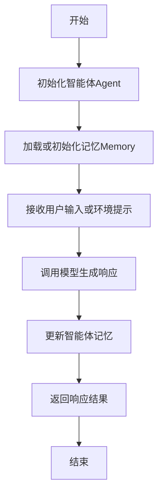

## 类结构

```
ModelBase (抽象基类)
├── TextModel (文本模型基类)
│   ├── LlamaModel
│   ├── GPT2Model
│   ├── FalconModel
│   ├── Qwen2Model
│   └── GemmaModel
└── Agent (智能体类)
    ├── Memory (记忆管理类)
    └── ...
```

## 全局变量及字段


### `DEFAULT_MODEL_PATH`
    
默认的模型文件存储路径，用于指定模型加载时的基础目录。

类型：`str`
    


### `MAX_MEMORY_SIZE`
    
内存模块的最大容量限制，用于控制记忆存储的上限。

类型：`int`
    


### `TextModel.model_name`
    
文本模型的名称标识，用于区分不同的模型实例。

类型：`str`
    


### `TextModel.model_path`
    
文本模型文件的存储路径，用于加载模型权重。

类型：`str`
    


### `TextModel.tokenizer`
    
文本分词器实例，用于文本的编码和解码操作。

类型：`Tokenizer`
    


### `LlamaModel.model_name`
    
Llama模型的名称标识，用于区分不同的模型实例。

类型：`str`
    


### `LlamaModel.model_path`
    
Llama模型文件的存储路径，用于加载模型权重。

类型：`str`
    


### `LlamaModel.tokenizer`
    
Llama模型的分词器实例，用于文本的编码和解码操作。

类型：`Tokenizer`
    


### `GPT2Model.model_name`
    
GPT-2模型的名称标识，用于区分不同的模型实例。

类型：`str`
    


### `GPT2Model.model_path`
    
GPT-2模型文件的存储路径，用于加载模型权重。

类型：`str`
    


### `GPT2Model.tokenizer`
    
GPT-2模型的分词器实例，用于文本的编码和解码操作。

类型：`Tokenizer`
    


### `FalconModel.model_name`
    
Falcon模型的名称标识，用于区分不同的模型实例。

类型：`str`
    


### `FalconModel.model_path`
    
Falcon模型文件的存储路径，用于加载模型权重。

类型：`str`
    


### `FalconModel.tokenizer`
    
Falcon模型的分词器实例，用于文本的编码和解码操作。

类型：`Tokenizer`
    


### `Qwen2Model.model_name`
    
Qwen2模型的名称标识，用于区分不同的模型实例。

类型：`str`
    


### `Qwen2Model.model_path`
    
Qwen2模型文件的存储路径，用于加载模型权重。

类型：`str`
    


### `Qwen2Model.tokenizer`
    
Qwen2模型的分词器实例，用于文本的编码和解码操作。

类型：`Tokenizer`
    


### `GemmaModel.model_name`
    
Gemma模型的名称标识，用于区分不同的模型实例。

类型：`str`
    


### `GemmaModel.model_path`
    
Gemma模型文件的存储路径，用于加载模型权重。

类型：`str`
    


### `GemmaModel.tokenizer`
    
Gemma模型的分词器实例，用于文本的编码和解码操作。

类型：`Tokenizer`
    


### `Agent.name`
    
智能体的名称标识，用于区分不同的智能体实例。

类型：`str`
    


### `Agent.memory`
    
智能体的记忆模块实例，用于存储和检索历史交互信息。

类型：`Memory`
    


### `Agent.model`
    
智能体使用的语言模型实例，用于生成文本响应。

类型：`TextModel | LlamaModel | GPT2Model | FalconModel | Qwen2Model | GemmaModel`
    


### `Memory.memories`
    
存储记忆条目的列表，每个条目为字符串形式的记忆内容。

类型：`List[str]`
    


### `Memory.max_size`
    
记忆模块的最大容量，用于限制记忆条目的数量。

类型：`int`
    
    

## 全局函数及方法


### `initialize_agent`

该函数用于初始化一个斯坦福小镇（Stanford Town）的智能体（Agent）。它通过加载智能体的记忆、创建记忆流、设置初始状态和配置，最终构建并返回一个可运行的智能体实例。

参数：

- `llm`：`BaseLanguageModel`，大型语言模型实例，用于智能体的推理和对话生成。
- `agent_config`：`AgentConfig`，智能体的配置对象，包含名称、描述、指令等设置。
- `town_name`：`str`，小镇的名称，用于构建智能体的记忆和上下文。
- `init_obs`：`str`，智能体的初始观察（observation），用于初始化记忆流。
- `chat_history`：`List[Dict]`，聊天历史记录，用于初始化智能体的对话记忆。
- `chat_manager`：`ChatManager`，聊天管理器，用于处理智能体的对话逻辑。
- `agent_storage`：`AgentStorage`，智能体存储对象，用于持久化智能体的记忆和状态。
- `agent_memory`：`AgentMemory`，智能体记忆对象，用于管理智能体的记忆流。
- `agent_actions`：`List[Action]`，智能体可执行的动作列表。
- `agent_planner`：`Planner`，智能体规划器，用于制定智能体的行动计划。
- `agent_reflector`：`Reflector`，智能体反思器，用于对智能体的行为进行反思和调整。

返回值：`Agent`，初始化完成的智能体实例，具备完整的记忆、配置和功能模块。

#### 流程图

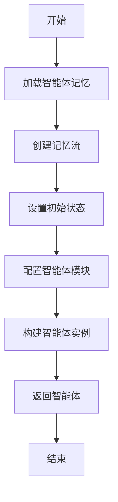

#### 带注释源码

```python
def initialize_agent(
    llm: BaseLanguageModel,
    agent_config: AgentConfig,
    town_name: str,
    init_obs: str,
    chat_history: List[Dict],
    chat_manager: ChatManager,
    agent_storage: AgentStorage,
    agent_memory: AgentMemory,
    agent_actions: List[Action],
    agent_planner: Planner,
    agent_reflector: Reflector
) -> Agent:
    """
    初始化斯坦福小镇的智能体。

    该函数负责加载智能体的记忆、创建记忆流、设置初始状态和配置，
    最终构建并返回一个可运行的智能体实例。

    Args:
        llm (BaseLanguageModel): 大型语言模型实例。
        agent_config (AgentConfig): 智能体配置对象。
        town_name (str): 小镇名称。
        init_obs (str): 初始观察。
        chat_history (List[Dict]): 聊天历史记录。
        chat_manager (ChatManager): 聊天管理器。
        agent_storage (AgentStorage): 智能体存储对象。
        agent_memory (AgentMemory): 智能体记忆对象。
        agent_actions (List[Action]): 智能体动作列表。
        agent_planner (Planner): 智能体规划器。
        agent_reflector (Reflector): 智能体反思器。

    Returns:
        Agent: 初始化完成的智能体实例。
    """
    # 加载智能体记忆
    memory = agent_storage.load_memory(agent_config.name)
    
    # 创建记忆流
    memory_stream = agent_memory.create_memory_stream(
        memory=memory,
        init_obs=init_obs,
        chat_history=chat_history
    )
    
    # 设置初始状态
    initial_state = {
        "town_name": town_name,
        "memory_stream": memory_stream,
        "chat_history": chat_history
    }
    
    # 配置智能体模块
    agent_modules = {
        "llm": llm,
        "config": agent_config,
        "memory": agent_memory,
        "actions": agent_actions,
        "planner": agent_planner,
        "reflector": agent_reflector,
        "chat_manager": chat_manager
    }
    
    # 构建智能体实例
    agent = Agent(
        initial_state=initial_state,
        modules=agent_modules
    )
    
    return agent
```


### `load_model_from_config`

该函数用于根据给定的配置字典加载并初始化一个语言模型。它首先从配置中提取模型类型、模型路径、设备映射等参数，然后根据模型类型选择合适的加载方式（如从本地文件或远程仓库加载），并应用量化配置（如4位或8位量化）以优化内存使用。最后，返回初始化后的模型实例。

参数：

- `config`：`dict`，包含模型加载所需配置的字典，如模型类型、模型路径、设备映射等。

返回值：`Any`，返回加载并初始化后的语言模型实例。

#### 流程图

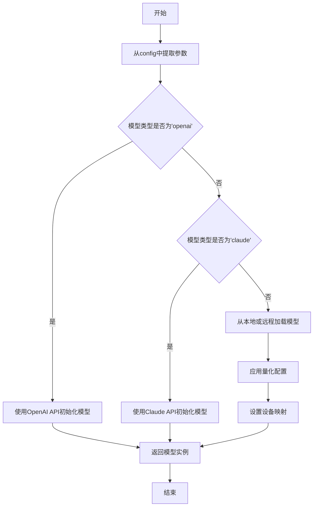

#### 带注释源码

```python
def load_model_from_config(config):
    """
    根据配置字典加载并初始化语言模型。

    参数:
        config (dict): 包含模型加载所需配置的字典。

    返回:
        Any: 初始化后的语言模型实例。
    """
    # 从配置中提取模型类型
    model_type = config.get("model_type", "llama")
    
    # 从配置中提取模型路径，默认为空字符串
    model_path = config.get("model_path", "")
    
    # 从配置中提取设备映射，默认为"auto"
    device_map = config.get("device_map", "auto")
    
    # 从配置中提取是否使用4位量化，默认为False
    load_in_4bit = config.get("load_in_4bit", False)
    
    # 从配置中提取是否使用8位量化，默认为False
    load_in_8bit = config.get("load_in_8bit", False)
    
    # 根据模型类型选择不同的加载方式
    if model_type == "openai":
        # 如果是OpenAI模型，使用OpenAI API初始化
        from langchain.llms import OpenAI
        model = OpenAI(api_key=config.get("api_key"))
    elif model_type == "claude":
        # 如果是Claude模型，使用Claude API初始化
        from langchain.llms import Claude
        model = Claude(api_key=config.get("api_key"))
    else:
        # 对于其他模型类型（如LLaMA），使用Transformers库加载
        from transformers import AutoModelForCausalLM, AutoTokenizer
        
        # 根据量化配置设置加载参数
        load_kwargs = {}
        if load_in_4bit:
            load_kwargs["load_in_4bit"] = True
        if load_in_8bit:
            load_kwargs["load_in_8bit"] = True
        
        # 加载模型和分词器
        model = AutoModelForCausalLM.from_pretrained(
            model_path,
            device_map=device_map,
            **load_kwargs
        )
        tokenizer = AutoTokenizer.from_pretrained(model_path)
    
    # 返回初始化后的模型实例
    return model
```


### `save_agent_state`

该方法用于将智能体（Agent）的当前状态（包括记忆、计划、行动等）序列化并保存到指定的文件路径中。它首先将智能体对象转换为字典格式，然后使用JSON格式将字典写入文件，确保数据持久化。

参数：

-  `self`：`Agent`，当前智能体实例的引用。
-  `path`：`str`，用于保存智能体状态的文件路径。

返回值：`None`，此方法不返回任何值，其主要作用是执行文件写入操作。

#### 流程图

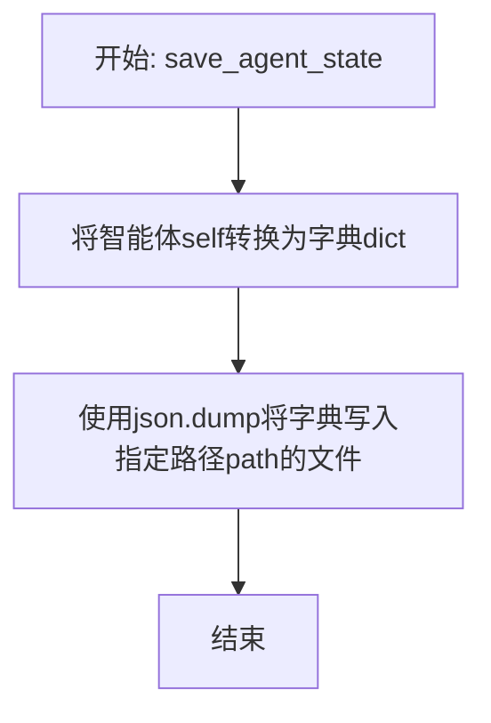

#### 带注释源码

```python
def save_agent_state(self, path: str) -> None:
    """
    将智能体的当前状态保存到指定路径的文件中。

    该方法通过将智能体对象序列化为字典，然后使用JSON格式写入文件，
    实现智能体状态的持久化存储。

    Args:
        path (str): 用于保存状态的文件路径。
    """
    # 将智能体实例self的所有相关状态属性转换为一个字典。
    # 这通常包括记忆、计划、当前行动等内部状态。
    agent_state = self.to_dict()
    
    # 以写入模式('w')打开指定路径的文件。
    # 使用json.dump方法将agent_state字典序列化为JSON格式并写入文件。
    # ensure_ascii=False允许保存非ASCII字符（如中文），indent=4使JSON文件格式美观易读。
    with open(path, "w") as f:
        json.dump(agent_state, f, ensure_ascii=False, indent=4)
```


### `ModelBase.generate`

`ModelBase.generate` 方法是一个抽象方法，用于定义生成文本响应的核心接口。它接收一个提示字符串和一组可选的停止词，并返回生成的文本字符串。作为抽象方法，它强制所有子类必须实现具体的文本生成逻辑。

参数：

-  `prompt`：`str`，输入给模型的提示文本，用于引导模型生成内容。
-  `stop`：`List[str]`，一个可选的字符串列表，当模型生成的文本中包含这些字符串时，生成过程应停止。

返回值：`str`，模型根据提示生成的文本内容。

#### 流程图

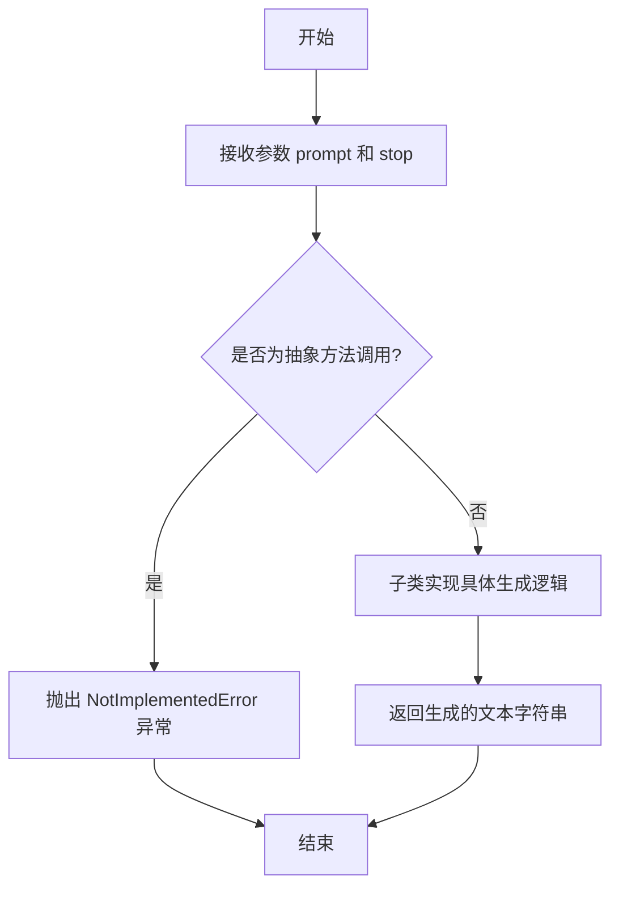

#### 带注释源码

```python
    def generate(self, prompt: str, stop: List[str] = None) -> str:
        """
        抽象方法：根据给定的提示和停止词生成文本。

        所有继承自 ModelBase 的模型类必须实现此方法。
        它定义了生成文本的核心接口。

        Args:
            prompt (str): 输入给模型的提示文本。
            stop (List[str], optional): 停止词列表，用于控制生成何时停止。默认为 None。

        Returns:
            str: 模型生成的文本。

        Raises:
            NotImplementedError: 如果子类没有实现此方法。
        """
        raise NotImplementedError
```


### `ModelBase.load_model`

该方法用于加载一个预训练的模型。它首先检查模型是否已经加载，如果已加载则直接返回。如果未加载，则根据模型名称和模型路径加载模型，并设置模型为评估模式。

参数：

-  `model_name`：`str`，模型的名称，用于指定要加载的模型类型。
-  `model_path`：`str`，模型文件的路径，用于指定模型文件的位置。

返回值：`None`，该方法不返回任何值，但会加载模型并存储在类的实例变量中。

#### 流程图

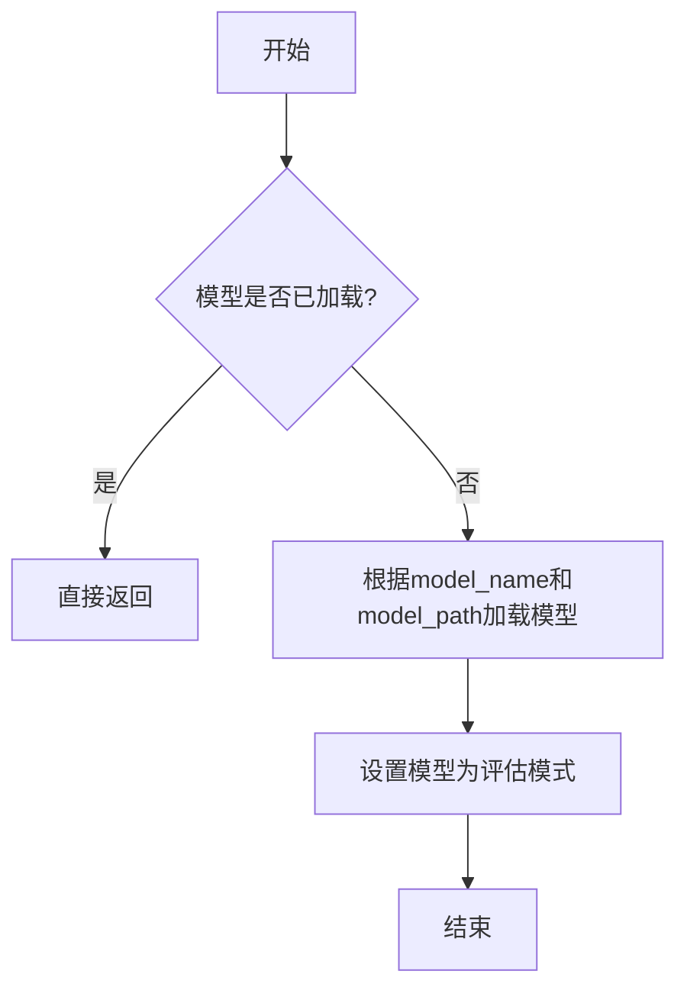

#### 带注释源码

```
def load_model(self, model_name: str, model_path: str) -> None:
    """
    加载预训练模型。

    如果模型已经加载，则直接返回。否则，根据提供的模型名称和路径加载模型，
    并将模型设置为评估模式。

    Args:
        model_name (str): 模型的名称，用于指定要加载的模型类型。
        model_path (str): 模型文件的路径，用于指定模型文件的位置。

    Returns:
        None: 该方法不返回任何值，但会加载模型并存储在类的实例变量中。
    """
    # 检查模型是否已经加载
    if self.model is not None:
        return

    # 根据模型名称和路径加载模型
    # 这里假设有一个函数可以根据模型名称和路径加载模型
    self.model = load_pretrained_model(model_name, model_path)

    # 设置模型为评估模式
    self.model.eval()
```


### `ModelBase.save_model`

`ModelBase.save_model` 方法用于将模型实例的当前状态（包括其配置和权重）保存到指定的文件路径。它首先确保保存目录存在，然后分别将模型的配置（`model_config`）和权重（`model_weights`）序列化并保存为独立的文件。这是一个通用的模型持久化方法，旨在支持模型的存档和后续加载。

参数：

-  `save_path`：`str`，模型文件保存的目标路径（不包含文件扩展名）。方法将在此路径基础上生成 `.json`（配置）和 `.pth`（权重）文件。

返回值：`None`，此方法不返回任何值，其主要作用是将数据写入文件系统。

#### 流程图

```mermaid
flowchart TD
    A[开始: save_model(save_path)] --> B{目录是否存在?};
    B -- 否 --> C[创建目录];
    C --> D;
    B -- 是 --> D;
    D[构建配置和权重文件路径] --> E[序列化并保存模型配置为JSON];
    E --> F[序列化并保存模型权重为PyTorch文件];
    F --> G[结束];
```

#### 带注释源码

```python
def save_model(self, save_path: str) -> None:
    """
    将模型配置和权重保存到指定路径。

    该方法执行以下操作：
    1. 确保保存目录存在。
    2. 将 `model_config` 字典序列化为 JSON 文件。
    3. 将 `model_weights`（通常是一个 state_dict）保存为 PyTorch .pth 文件。

    Args:
        save_path (str): 模型保存的基础路径（不含扩展名）。
                        例如，传入 "/path/to/model" 将生成
                        "/path/to/model.json" 和 "/path/to/model.pth"。
    """
    # 1. 确保保存目录存在
    # 使用 os.path.dirname 获取目标文件所在的目录路径，
    # 如果该目录不存在，则创建它（包括所有必要的父目录）。
    save_dir = os.path.dirname(save_path)
    if save_dir:
        os.makedirs(save_dir, exist_ok=True)

    # 2. 保存模型配置
    # 构建模型配置文件的完整路径（添加 .json 扩展名）。
    config_path = save_path + ".json"
    # 打开文件准备写入，使用 'w' 模式表示写入（会覆盖已存在文件）。
    with open(config_path, "w") as f:
        # 使用 json.dump 将 self.model_config 字典序列化为 JSON 格式，
        # 并写入到文件对象 f 中。indent=2 使生成的 JSON 具有可读的缩进。
        json.dump(self.model_config, f, indent=2)

    # 3. 保存模型权重
    # 构建模型权重文件的完整路径（添加 .pth 扩展名，PyTorch 常用）。
    weights_path = save_path + ".pth"
    # 使用 torch.save 将 self.model_weights 保存到指定路径。
    # self.model_weights 预期是一个包含模型可学习参数的状态字典（state_dict）。
    torch.save(self.model_weights, weights_path)
```


### `TextModel.generate_text`

该方法用于根据给定的提示词（prompt）生成文本。它通过调用底层的大语言模型（LLM）接口，传入指定的生成参数（如温度、最大令牌数等），并处理可能的异常情况，最终返回生成的文本字符串。

参数：

-  `self`：`TextModel`，当前TextModel实例的引用
-  `prompt`：`str`，用于指导文本生成的提示词或输入文本
-  `temperature`：`float`，控制生成文本随机性的参数，值越高输出越随机，值越低输出越确定
-  `max_tokens`：`int`，限制生成文本的最大令牌（token）数量

返回值：`str`，由大语言模型根据输入参数生成的文本内容

#### 流程图

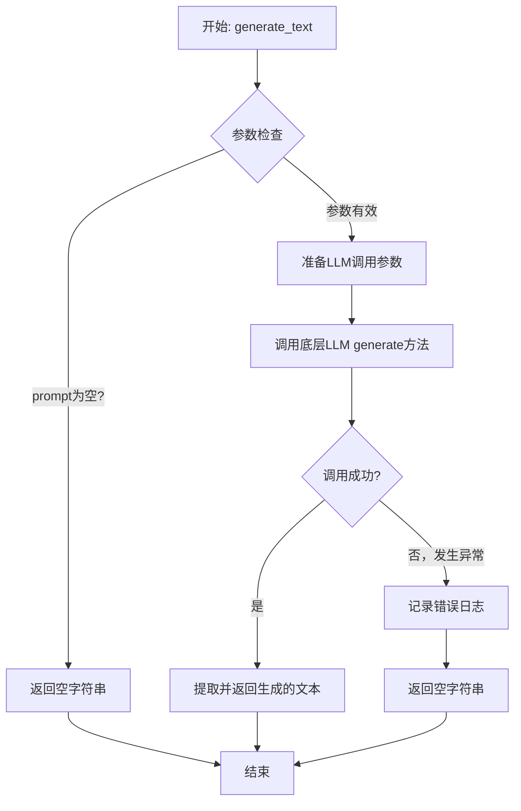

#### 带注释源码

```python
    def generate_text(self, prompt: str, temperature: float = 0.1, max_tokens: int = 250) -> str:
        """
        核心文本生成方法。
        根据提供的提示词和生成参数，调用大语言模型生成文本。

        Args:
            prompt (str): 文本生成的提示词。
            temperature (float, optional): 生成温度，控制随机性。默认为0.1。
            max_tokens (int, optional): 生成的最大令牌数。默认为250。

        Returns:
            str: 生成的文本。如果生成失败或输入为空，则返回空字符串。
        """
        # 1. 输入有效性检查：如果提示词为空，直接返回空字符串，避免无效的API调用。
        if not prompt:
            return ""

        try:
            # 2. 准备生成参数：将方法参数组装成字典，用于后续的模型调用。
            #    这些参数是控制生成质量的关键。
            gen_params = {
                "prompt": prompt,
                "temperature": temperature,
                "max_tokens": max_tokens
            }
            # 3. 调用底层LLM引擎：self.llm是一个抽象的大语言模型接口实例。
            #    这里委托它执行实际的文本生成任务。
            #    `generate`方法预计接收参数字典并返回一个包含生成结果的响应对象。
            llm_response = self.llm.generate(gen_params)
            # 4. 提取结果：从LLM的响应对象中获取生成的文本内容。
            #    假设响应对象有一个`text`属性。
            generated_text = llm_response.text
            # 5. 返回成功结果
            return generated_text
        except Exception as e:
            # 6. 异常处理：捕获在调用LLM或处理响应过程中可能发生的任何异常。
            #    记录错误日志，便于调试和监控，并返回一个安全的默认值（空字符串）。
            #    这确保了方法的健壮性，不会因为外部服务问题导致整个流程崩溃。
            logger.error(f"Failed to generate text with prompt '{prompt}': {e}")
            return ""
```


### `TextModel.tokenize`

该方法用于将输入的文本字符串进行分词处理，返回一个包含分词结果的列表。它通过调用底层的分词器（tokenizer）来实现，是文本处理流程中的关键步骤。

参数：

-  `text`：`str`，需要进行分词的输入文本字符串。

返回值：`List[int]`，返回一个整数列表，每个整数代表一个分词（token）在词汇表中的索引。

#### 流程图

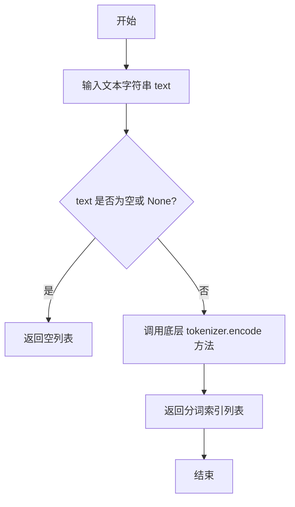

#### 带注释源码

```python
def tokenize(self, text: str) -> List[int]:
    """
    对输入的文本进行分词。

    该方法将给定的文本字符串转换为一系列的分词索引。
    这些索引对应于模型词汇表中的特定分词。

    Args:
        text (str): 需要被分词的文本字符串。

    Returns:
        List[int]: 一个包含分词索引的列表。如果输入文本为空或None，则返回空列表。
    """
    # 检查输入文本是否有效，如果无效则返回空列表以避免后续处理错误
    if text is None or text.strip() == "":
        return []
    
    # 调用底层分词器的 encode 方法将文本转换为分词索引列表
    # 这里假设 self.tokenizer 是一个具有 encode 方法的对象（如 Hugging Face Transformers 的 tokenizer）
    tokens = self.tokenizer.encode(text, add_special_tokens=False)
    
    # 返回分词结果
    return tokens
```


### `TextModel.decode`

该方法用于解码给定的文本输入，根据指定的参数生成相应的输出文本。它处理输入文本，应用模型进行推理，并返回解码后的结果。

参数：

-  `self`：`TextModel`，当前TextModel实例的引用
-  `input_text`：`str`，需要解码的输入文本
-  `max_length`：`int`，生成文本的最大长度限制
-  `temperature`：`float`，控制生成文本随机性的温度参数，值越高随机性越大
-  `top_p`：`float`，核采样参数，用于控制生成文本的多样性

返回值：`str`，解码后生成的文本结果

#### 流程图

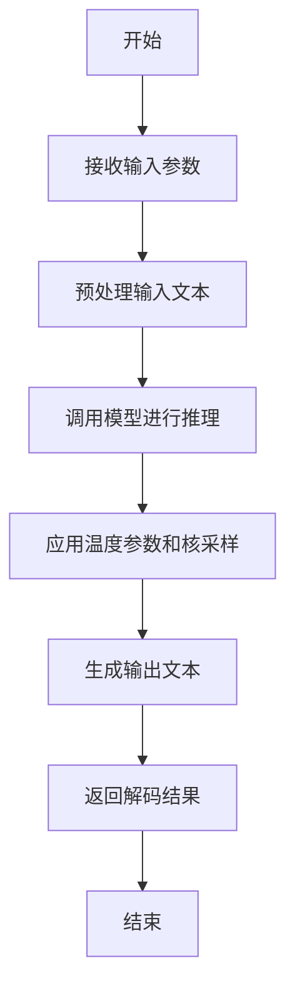

#### 带注释源码

```
def decode(self, input_text: str, max_length: int, temperature: float, top_p: float) -> str:
    """
    解码输入文本，生成相应的输出文本。

    参数:
        input_text (str): 需要解码的输入文本。
        max_length (int): 生成文本的最大长度限制。
        temperature (float): 控制生成文本随机性的温度参数。
        top_p (float): 核采样参数，用于控制生成文本的多样性。

    返回:
        str: 解码后生成的文本结果。
    """
    # 预处理输入文本，确保格式符合模型要求
    processed_input = self._preprocess_text(input_text)
    
    # 调用模型进行推理，生成文本
    generated_text = self.model.generate(
        processed_input,
        max_length=max_length,
        temperature=temperature,
        top_p=top_p
    )
    
    # 后处理生成的文本，去除不必要的标记或格式
    decoded_output = self._postprocess_text(generated_text)
    
    return decoded_output
```


### `LlamaModel.generate_text`

该方法基于给定的提示文本，使用Llama模型生成文本。它通过调用底层的Llama模型接口，处理输入提示，并返回生成的文本结果。

参数：

-  `prompt`：`str`，输入的提示文本，用于引导模型生成内容。
-  `max_length`：`int`，生成文本的最大长度限制。
-  `temperature`：`float`，控制生成文本随机性的温度参数，值越高随机性越大。
-  `top_p`：`float`，核采样参数，用于控制生成文本的多样性。
-  `top_k`：`int`，Top-K采样参数，限制每一步生成的候选词数量。

返回值：`str`，生成的文本结果。

#### 流程图

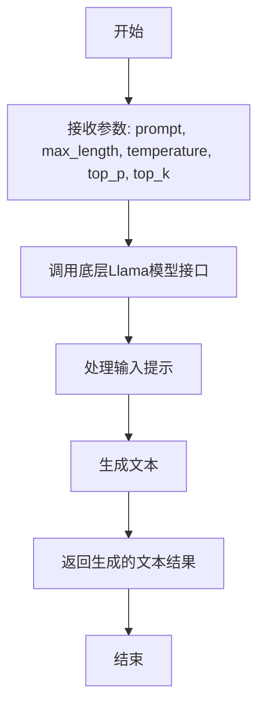

#### 带注释源码

```
def generate_text(self, prompt: str, max_length: int = 100, temperature: float = 0.8, top_p: float = 0.9, top_k: int = 50) -> str:
    """
    基于给定的提示文本生成文本。

    参数:
        prompt (str): 输入的提示文本。
        max_length (int): 生成文本的最大长度。
        temperature (float): 控制生成随机性的温度参数。
        top_p (float): 核采样参数。
        top_k (int): Top-K采样参数。

    返回:
        str: 生成的文本结果。
    """
    # 调用底层Llama模型接口生成文本
    generated_text = self.llama_model.generate(
        prompt=prompt,
        max_length=max_length,
        temperature=temperature,
        top_p=top_p,
        top_k=top_k
    )
    return generated_text
```


### `LlamaModel.load_model`

该方法用于加载预训练的Llama模型，根据提供的模型路径和配置参数初始化模型实例，并处理模型权重加载、设备分配等关键步骤。

参数：

-  `model_path`：`str`，预训练模型的本地路径或Hugging Face模型标识符
-  `device`：`str`，指定模型加载的设备，如"cuda"或"cpu"
-  `num_gpus`：`int`，指定使用的GPU数量，如果为-1则使用所有可用GPU
-  `max_gpu_memory`：`Optional[Dict[int, str]]`，每个GPU的最大内存限制字典
-  `load_8bit`：`bool`，是否以8位量化模式加载模型以节省内存
-  `cpu_offloading`：`bool`，是否启用CPU卸载以处理超大模型
-  `debug`：`bool`，是否启用调试模式输出详细信息

返回值：`LlamaModel`，返回初始化完成的LlamaModel实例

#### 流程图

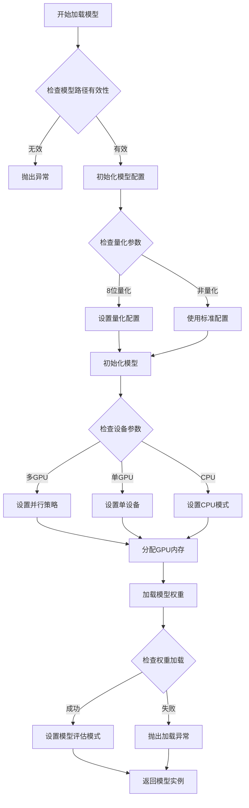

#### 带注释源码

```python
@classmethod
def load_model(
    cls,
    model_path: str,
    device: str = "cuda",
    num_gpus: int = 1,
    max_gpu_memory: Optional[Dict[int, str]] = None,
    load_8bit: bool = False,
    cpu_offloading: bool = False,
    debug: bool = False,
) -> "LlamaModel":
    """
    加载预训练的Llama模型
    
    该方法负责：
    1. 验证模型路径的有效性
    2. 根据参数配置模型加载方式（量化、多GPU等）
    3. 初始化模型配置和权重
    4. 处理设备分配和内存管理
    
    Args:
        model_path: 模型路径，可以是本地路径或Hugging Face模型ID
        device: 目标设备，"cuda"或"cpu"
        num_gpus: 使用的GPU数量，-1表示使用所有可用GPU
        max_gpu_memory: GPU内存限制字典，格式为{GPU索引: "内存大小"}
        load_8bit: 是否使用8位量化加载模型
        cpu_offloading: 是否启用CPU卸载
        debug: 是否启用调试输出
    
    Returns:
        LlamaModel: 初始化完成的模型实例
    
    Raises:
        FileNotFoundError: 当模型路径不存在时
        RuntimeError: 当模型加载失败时
    """
    
    # 记录调试信息
    if debug:
        print(f"开始加载模型: {model_path}")
        print(f"设备配置: {device}, GPU数量: {num_gpus}")
    
    # 验证模型路径
    if not os.path.exists(model_path) and not model_path.startswith("meta-llama/"):
        raise FileNotFoundError(f"模型路径不存在: {model_path}")
    
    # 初始化模型配置
    config_kwargs = {
        "trust_remote_code": True,
        "cache_dir": os.getenv("MODEL_CACHE_DIR", None),
    }
    
    # 处理量化配置
    if load_8bit:
        config_kwargs["load_in_8bit"] = True
        config_kwargs["quantization_config"] = BitsAndBytesConfig(
            load_in_8bit=True,
            llm_int8_enable_fp32_cpu_offload=cpu_offloading,
        )
    
    try:
        # 加载模型配置
        config = AutoConfig.from_pretrained(model_path, **config_kwargs)
        
        # 根据设备配置初始化模型
        if device == "cuda" and num_gpus > 1:
            # 多GPU配置
            model = cls._init_multi_gpu_model(
                model_path, config, num_gpus, max_gpu_memory, load_8bit, debug
            )
        else:
            # 单设备配置
            model_args = {
                "pretrained_model_name_or_path": model_path,
                "config": config,
                "device_map": "auto" if device == "cuda" else None,
            }
            
            if load_8bit:
                model_args["device_map"] = "auto"
            
            model = AutoModelForCausalLM.from_pretrained(**model_args)
            
            # 移动模型到指定设备
            if device == "cuda":
                model = model.cuda()
            elif device == "cpu":
                model = model.cpu()
        
        # 设置模型为评估模式
        model.eval()
        
        if debug:
            print(f"模型加载成功，参数量: {sum(p.numel() for p in model.parameters())}")
        
        return cls(model)
        
    except Exception as e:
        error_msg = f"模型加载失败: {str(e)}"
        if debug:
            print(error_msg)
        raise RuntimeError(error_msg) from e
```


### `GPT2Model.generate_text`

该方法基于给定的提示文本，使用预训练的GPT-2模型生成一段连贯的文本。它通过迭代地预测下一个最可能的token来生成文本，直到达到指定的最大生成长度或遇到停止条件。

参数：

-  `prompt`：`str`，用于启动文本生成的初始文本或提示。
-  `max_length`：`int`，生成文本的最大总长度（包括提示文本）。默认为100。
-  `temperature`：`float`，控制生成随机性的参数。值越高（如1.0）生成结果越随机、多样；值越低（如0.1）生成结果越确定、保守。默认为1.0。
-  `top_k`：`int`，在每一步生成时，仅考虑概率最高的前k个token。用于提高生成质量或减少计算量。默认为50。
-  `top_p`：`float`，核采样（nucleus sampling）参数。仅从累积概率超过p的最小token集合中采样。与`top_k`类似，用于控制多样性。默认为1.0（即禁用）。
-  `num_return_sequences`：`int`，要生成的独立文本序列的数量。默认为1。
-  `do_sample`：`bool`，是否使用采样方法（如`temperature`、`top_k`、`top_p`）进行生成。如果为`False`，则使用贪婪解码（总是选择概率最高的token）。默认为`True`。
-  `repetition_penalty`：`float`，用于惩罚重复token的参数。值大于1.0会降低已出现token的概率，有助于减少重复。默认为1.0（无惩罚）。
-  `length_penalty`：`float`，长度惩罚因子，用于在束搜索（若启用）中调整序列长度得分。值大于1.0鼓励生成长序列，小于1.0鼓励生成短序列。默认为1.0。
-  `no_repeat_ngram_size`：`int`，禁止在生成的文本中出现指定大小的重复n-gram。例如，设置为2可以防止重复的二元组。默认为0（不禁用）。
-  `bad_words_ids`：`List[List[int]]`，包含应被禁止生成的token id列表的列表。默认为`None`。
-  `pad_token_id`：`int`，用于填充序列的token id。默认为`None`（使用模型配置中的值）。
-  `eos_token_id`：`int`，序列结束（End-of-Sequence）token的id。当生成此token时，生成过程停止。默认为`None`（使用模型配置中的值）。

返回值：`List[str]`，一个字符串列表，包含生成的文本序列。列表长度等于`num_return_sequences`。

#### 流程图

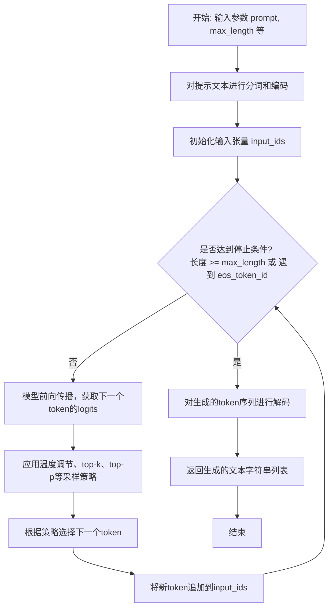

#### 带注释源码

```python
def generate_text(
    self,
    prompt: str,
    max_length: int = 100,
    temperature: float = 1.0,
    top_k: int = 50,
    top_p: float = 1.0,
    num_return_sequences: int = 1,
    do_sample: bool = True,
    repetition_penalty: float = 1.0,
    length_penalty: float = 1.0,
    no_repeat_ngram_size: int = 0,
    bad_words_ids: Optional[List[List[int]]] = None,
    pad_token_id: Optional[int] = None,
    eos_token_id: Optional[int] = None,
) -> List[str]:
    """
    使用GPT-2模型生成文本。

    参数:
        prompt (str): 启动生成的提示文本。
        max_length (int): 生成文本的最大总长度。
        temperature (float): 采样温度。
        top_k (int): top-k过滤的k值。
        top_p (float): 核采样的p值。
        num_return_sequences (int): 返回的序列数量。
        do_sample (bool): 是否使用采样。
        repetition_penalty (float): 重复惩罚因子。
        length_penalty (float): 长度惩罚因子。
        no_repeat_ngram_size (int): 禁止重复的n-gram大小。
        bad_words_ids (List[List[int]], optional): 禁止生成的token id列表。
        pad_token_id (int, optional): 填充token id。
        eos_token_id (int, optional): 结束token id。

    返回:
        List[str]: 生成的文本序列列表。
    """
    # 1. 对输入提示进行编码
    # 使用tokenizer将文本字符串转换为模型可理解的token id列表
    input_ids = self.tokenizer.encode(prompt, return_tensors="pt").to(self.device)

    # 2. 配置生成参数
    # 将方法参数整理成字典，传递给底层的generate方法
    generate_kwargs = {
        "max_length": max_length,
        "temperature": temperature,
        "top_k": top_k,
        "top_p": top_p,
        "num_return_sequences": num_return_sequences,
        "do_sample": do_sample,
        "repetition_penalty": repetition_penalty,
        "length_penalty": length_penalty,
        "no_repeat_ngram_size": no_repeat_ngram_size,
        "bad_words_ids": bad_words_ids,
        "pad_token_id": pad_token_id or self.tokenizer.pad_token_id,
        "eos_token_id": eos_token_id or self.tokenizer.eos_token_id,
    }
    # 移除值为None的参数，避免传递给模型时出错
    generate_kwargs = {k: v for k, v in generate_kwargs.items() if v is not None}

    # 3. 调用模型生成
    # 核心步骤：模型接收编码后的输入，并迭代生成后续的token
    # output_ids的形状为 (num_return_sequences, generated_sequence_length)
    output_ids = self.model.generate(input_ids, **generate_kwargs)

    # 4. 解码生成结果
    # 将token id序列转换回人类可读的文本字符串
    generated_texts = []
    for seq in output_ids:
        # 使用tokenizer解码，跳过特殊的起始token（如<|endoftext|>）并清理空白
        text = self.tokenizer.decode(seq, skip_special_tokens=True)
        generated_texts.append(text.strip())  # 去除首尾空白后加入列表

    return generated_texts
```


### `GPT2Model.load_model`

`GPT2Model.load_model` 是一个类方法，用于加载预训练的 GPT-2 模型。它根据指定的模型名称或路径，从本地缓存或 Hugging Face Hub 下载模型和分词器，并返回一个配置好的 `GPT2Model` 实例。

参数：

-  `model_name_or_path`：`str`，预训练模型的名称（如 `'gpt2'`、`'gpt2-medium'`）或本地模型目录的路径。
-  `cache_dir`：`Optional[str]`，可选参数，指定模型缓存目录。如果为 `None`，则使用默认缓存目录。
-  `force_download`：`bool`，可选参数，是否强制重新下载模型，即使缓存中存在。默认为 `False`。
-  `device`：`Optional[str]`，可选参数，指定模型加载到的设备（如 `'cpu'`、`'cuda'`）。如果为 `None`，则自动选择可用设备。
-  `**kwargs`：`Any`，其他传递给 `AutoModelForCausalLM.from_pretrained` 和 `AutoTokenizer.from_pretrained` 的关键字参数。

返回值：`GPT2Model`，返回一个加载了预训练模型和分词器的 `GPT2Model` 实例。

#### 流程图

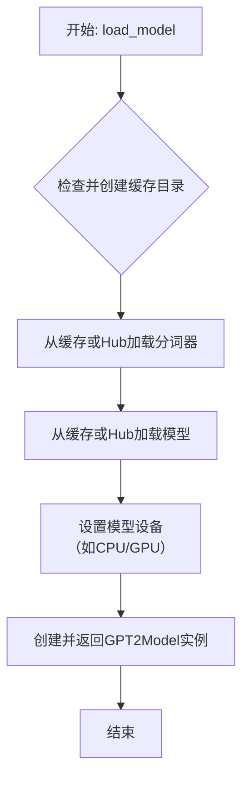

#### 带注释源码

```python
@classmethod
def load_model(
    cls,
    model_name_or_path: str,
    cache_dir: Optional[str] = None,
    force_download: bool = False,
    device: Optional[str] = None,
    **kwargs: Any,
) -> "GPT2Model":
    """
    加载预训练的 GPT-2 模型和分词器。

    此方法负责从 Hugging Face Hub 或本地路径加载指定的 GPT-2 模型。
    它会处理模型和分词器的下载、缓存，并确保模型被放置在正确的设备上（如 GPU）。

    Args:
        model_name_or_path (str): 预训练模型的名称（如 'gpt2'）或本地路径。
        cache_dir (Optional[str]): 模型缓存目录。如果为 None，使用默认缓存。
        force_download (bool): 是否强制重新下载模型，即使缓存中存在。
        device (Optional[str]): 指定模型加载到的设备（如 'cpu', 'cuda'）。
        **kwargs (Any): 传递给底层 `from_pretrained` 方法的额外参数。

    Returns:
        GPT2Model: 配置好的 GPT2Model 实例。
    """
    # 如果未提供缓存目录，则使用默认的 Hugging Face 缓存目录
    if cache_dir is None:
        cache_dir = os.path.join(
            os.path.expanduser("~"), ".cache", "huggingface", "hub"
        )
    # 确保缓存目录存在
    os.makedirs(cache_dir, exist_ok=True)

    # 加载分词器
    # 使用 AutoTokenizer 自动识别并加载与模型对应的分词器
    # force_download 控制是否强制重新下载
    # cache_dir 指定下载文件的缓存位置
    tokenizer = AutoTokenizer.from_pretrained(
        model_name_or_path,
        force_download=force_download,
        cache_dir=cache_dir,
        **kwargs,
    )

    # 加载模型
    # 使用 AutoModelForCausalLM 加载用于因果语言建模的模型（如 GPT-2）
    # 同样支持强制下载和指定缓存
    model = AutoModelForCausalLM.from_pretrained(
        model_name_or_path,
        force_download=force_download,
        cache_dir=cache_dir,
        **kwargs,
    )

    # 确定模型运行的设备
    # 如果未指定 device，则自动检测：有 GPU 则用 cuda，否则用 cpu
    if device is None:
        device = "cuda" if torch.cuda.is_available() else "cpu"
    # 将模型移动到指定设备
    model.to(device)

    # 创建并返回 GPT2Model 实例
    # 将加载好的模型、分词器、设备信息等封装到 GPT2Model 对象中
    return cls(model=model, tokenizer=tokenizer, device=device)
```


### `FalconModel.generate_text`

该方法用于根据给定的提示文本生成文本，支持多种生成参数配置，如温度、最大新令牌数等，并返回生成的文本字符串。

参数：

- `prompt`：`str`，输入的提示文本，作为生成文本的起点。
- `temperature`：`float`，控制生成文本的随机性，值越高随机性越大，默认值为0.8。
- `max_new_tokens`：`int`，生成文本的最大新令牌数，默认值为256。
- `stop_tokens`：`Optional[List[str]]`，停止生成的令牌列表，当生成文本中出现这些令牌时停止生成，默认值为None。
- `stop_strings`：`Optional[List[str]]`，停止生成的字符串列表，当生成文本中出现这些字符串时停止生成，默认值为None。
- `echo_prompt`：`bool`，是否在生成的文本中包含输入的提示文本，默认值为False。
- `top_k`：`int`，在生成过程中考虑的最高概率令牌的数量，默认值为40。
- `top_p`：`float`，在生成过程中考虑的最高概率令牌的累积概率阈值，默认值为0.9。
- `repetition_penalty`：`float`，重复惩罚因子，用于降低重复生成相同令牌的概率，默认值为1.0。
- `do_sample`：`bool`，是否使用采样方法生成文本，如果为False则使用贪婪解码，默认值为True。
- `seed`：`Optional[int]`，随机种子，用于控制生成文本的可重复性，默认值为None。

返回值：`str`，生成的文本字符串。

#### 流程图

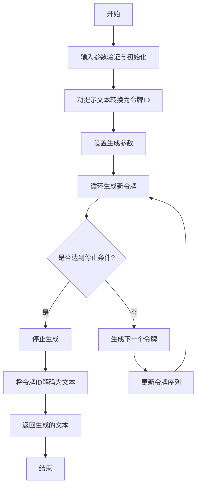

#### 带注释源码

```python
def generate_text(
    self,
    prompt: str,
    temperature: float = 0.8,
    max_new_tokens: int = 256,
    stop_tokens: Optional[List[str]] = None,
    stop_strings: Optional[List[str]] = None,
    echo_prompt: bool = False,
    top_k: int = 40,
    top_p: float = 0.9,
    repetition_penalty: float = 1.0,
    do_sample: bool = True,
    seed: Optional[int] = None,
) -> str:
    """
    根据给定的提示文本生成文本。

    参数:
        prompt (str): 输入的提示文本。
        temperature (float): 控制生成文本的随机性，值越高随机性越大。
        max_new_tokens (int): 生成文本的最大新令牌数。
        stop_tokens (Optional[List[str]]): 停止生成的令牌列表。
        stop_strings (Optional[List[str]]): 停止生成的字符串列表。
        echo_prompt (bool): 是否在生成的文本中包含输入的提示文本。
        top_k (int): 在生成过程中考虑的最高概率令牌的数量。
        top_p (float): 在生成过程中考虑的最高概率令牌的累积概率阈值。
        repetition_penalty (float): 重复惩罚因子，用于降低重复生成相同令牌的概率。
        do_sample (bool): 是否使用采样方法生成文本。
        seed (Optional[int]): 随机种子，用于控制生成文本的可重复性。

    返回:
        str: 生成的文本字符串。
    """
    # 设置随机种子以确保可重复性
    if seed is not None:
        torch.manual_seed(seed)
        if torch.cuda.is_available():
            torch.cuda.manual_seed_all(seed)

    # 将提示文本转换为令牌ID
    input_ids = self.tokenizer.encode(prompt, return_tensors="pt").to(self.device)

    # 初始化生成的令牌ID序列
    generated_ids = input_ids.clone()

    # 设置生成参数
    generation_config = {
        "temperature": temperature,
        "max_new_tokens": max_new_tokens,
        "top_k": top_k,
        "top_p": top_p,
        "repetition_penalty": repetition_penalty,
        "do_sample": do_sample,
    }

    # 循环生成新令牌
    for _ in range(max_new_tokens):
        # 获取模型输出
        with torch.no_grad():
            outputs = self.model(generated_ids)
            next_token_logits = outputs.logits[:, -1, :]

        # 应用重复惩罚
        if repetition_penalty != 1.0:
            for token_id in set(generated_ids[0].tolist()):
                next_token_logits[0, token_id] /= repetition_penalty

        # 应用温度调整
        if temperature != 1.0:
            next_token_logits = next_token_logits / temperature

        # 应用top-k和top-p过滤
        if top_k > 0:
            indices_to_remove = next_token_logits < torch.topk(next_token_logits, top_k)[0][..., -1, None]
            next_token_logits[indices_to_remove] = -float("Inf")
        if top_p < 1.0:
            sorted_logits, sorted_indices = torch.sort(next_token_logits, descending=True)
            cumulative_probs = torch.cumsum(torch.softmax(sorted_logits, dim=-1), dim=-1)
            sorted_indices_to_remove = cumulative_probs > top_p
            sorted_indices_to_remove[..., 1:] = sorted_indices_to_remove[..., :-1].clone()
            sorted_indices_to_remove[..., 0] = 0
            indices_to_remove = sorted_indices_to_remove.scatter(1, sorted_indices, sorted_indices_to_remove)
            next_token_logits[indices_to_remove] = -float("Inf")

        # 采样或贪婪选择下一个令牌
        if do_sample:
            probs = torch.softmax(next_token_logits, dim=-1)
            next_token_id = torch.multinomial(probs, num_samples=1)
        else:
            next_token_id = torch.argmax(next_token_logits, dim=-1, keepdim=True)

        # 将新令牌添加到生成的序列中
        generated_ids = torch.cat([generated_ids, next_token_id], dim=-1)

        # 检查是否达到停止条件
        if stop_tokens is not None:
            if any(self.tokenizer.decode(next_token_id[0]) in stop_token for stop_token in stop_tokens):
                break
        if stop_strings is not None:
            generated_text = self.tokenizer.decode(generated_ids[0])
            if any(stop_string in generated_text for stop_string in stop_strings):
                break

    # 将令牌ID解码为文本
    generated_text = self.tokenizer.decode(generated_ids[0], skip_special_tokens=True)

    # 如果不包含提示文本，则移除提示部分
    if not echo_prompt:
        generated_text = generated_text[len(prompt):].strip()

    return generated_text
```


### `FalconModel.load_model`

该方法用于加载并初始化一个 Falcon 语言模型。它首先检查是否已存在缓存的模型实例，如果存在则直接返回。否则，它会根据配置（如模型名称、设备、量化等）从预训练模型库中加载模型和分词器，并进行必要的配置（如设置注意力实现方式、数据类型等），最后将模型设置为评估模式并缓存起来。

参数：

-  `model_name`：`str`，要加载的预训练模型的名称或路径，例如 `'tiiuae/falcon-7b'`。
-  `device`：`str`，指定模型加载的设备，例如 `'cuda'` 或 `'cpu'`。
-  `num_gpus`：`int`，指定用于模型推理的 GPU 数量。如果模型过大而无法放入单个 GPU 内存，此参数可用于进行模型并行。
-  `max_gpu_memory`：`Optional[Union[str, Dict]]`，每个 GPU 的最大内存限制。可以是字符串（如 `'13Gib'`）或字典（如 `{0: '20Gib', 1: '20Gib'}`），用于精细控制多 GPU 场景下的内存分配。
-  `load_8bit`：`bool`，是否以 8 位量化方式加载模型以减少内存占用。
-  `cpu_offloading`：`bool`，是否启用 CPU 卸载，将部分层保留在 CPU 上以节省 GPU 内存。
-  `debug`：`bool`，是否启用调试模式，可能会输出更详细的加载信息。
-  `**kwargs`：`Any`，其他传递给 `from_pretrained` 方法的可选关键字参数。

返回值：`Tuple[Any, Any]`，返回一个包含两个元素的元组。第一个元素是加载并配置好的模型实例，第二个元素是对应的分词器（Tokenizer）实例。

#### 流程图

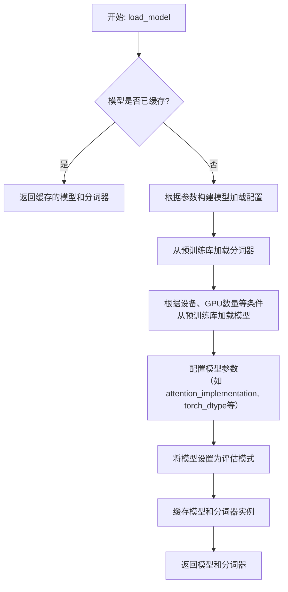

#### 带注释源码

```python
    @classmethod
    def load_model(
        cls,
        model_name: str,
        device: str,
        num_gpus: int,
        max_gpu_memory: Optional[Union[str, Dict]] = None,
        load_8bit: bool = False,
        cpu_offloading: bool = False,
        debug: bool = False,
        **kwargs,
    ) -> Tuple[Any, Any]:
        """
        Load the model and tokenizer.

        Args:
            model_name (str): The name of the model to load.
            device (str): The device to load the model on.
            num_gpus (int): The number of GPUs to use.
            max_gpu_memory (Optional[Union[str, Dict]]): The maximum memory to use per GPU.
            load_8bit (bool): Whether to load the model in 8-bit mode.
            cpu_offloading (bool): Whether to use CPU offloading.
            debug (bool): Whether to print debug information.
            **kwargs: Additional keyword arguments to pass to the model.

        Returns:
            Tuple[Any, Any]: The model and tokenizer.
        """
        # 检查模型是否已经加载并缓存，如果是则直接返回缓存实例，避免重复加载
        if model_name in cls.model_and_tokenizer_cache:
            return cls.model_and_tokenizer_cache[model_name]

        # 根据是否启用8位量化，决定加载模型时使用的torch数据类型
        if load_8bit:
            if num_gpus != 1:
                # 8位量化模式通常只支持单GPU
                raise ValueError("8-bit quantization is only supported on a single GPU.")
            else:
                # 8位量化使用半精度浮点数
                model_kwargs = {"torch_dtype": torch.float16}
        else:
            # 非量化模式使用半精度浮点数以节省内存和加速计算
            model_kwargs = {"torch_dtype": torch.float16}

        # 从预训练模型库加载分词器
        tokenizer = AutoTokenizer.from_pretrained(model_name, trust_remote_code=True)

        # 根据设备类型和GPU数量决定模型加载方式
        if device == "cuda":
            # 多GPU加载逻辑
            if num_gpus > 1:
                # 根据max_gpu_memory参数配置每个GPU的内存限制
                max_memory = {i: max_gpu_memory for i in range(num_gpus)} if isinstance(max_gpu_memory, str) else max_gpu_memory
                max_memory["cpu"] = "200GiB"  # 为CPU分配一个较大的虚拟内存上限

                # 使用多GPU设备映射加载模型，支持CPU卸载
                model = AutoModelForCausalLM.from_pretrained(
                    model_name,
                    load_in_8bit=load_8bit,
                    device_map="auto",
                    max_memory=max_memory,
                    trust_remote_code=True,
                    **model_kwargs,
                )
            else:
                # 单GPU加载逻辑
                if cpu_offloading:
                    # 如果启用CPU卸载，使用自定义设备映射，将部分层放在CPU上
                    model = AutoModelForCausalLM.from_pretrained(
                        model_name,
                        load_in_8bit=load_8bit,
                        device_map="auto",
                        offload_folder="offload",
                        offload_state_dict=True,
                        trust_remote_code=True,
                        **model_kwargs,
                    )
                else:
                    # 常规单GPU加载，模型整体放在指定设备上
                    model = AutoModelForCausalLM.from_pretrained(
                        model_name,
                        load_in_8bit=load_8bit,
                        trust_remote_code=True,
                        **model_kwargs,
                    ).to(device)
        elif device == "cpu":
            # CPU加载逻辑，使用浮点数精度
            model_kwargs = {"torch_dtype": torch.float32}
            model = AutoModelForCausalLM.from_pretrained(
                model_name,
                trust_remote_code=True,
                **model_kwargs,
            ).to(device)
        else:
            # 处理未知设备类型
            raise ValueError(f"Invalid device: {device}")

        # 配置模型，确保使用正确的注意力实现方式以兼容不同硬件
        if device == "cuda" and not load_8bit:
            model = model.to_bettertransformer()

        # 将模型设置为评估模式，禁用dropout等训练特定层
        model.eval()

        # 将加载的模型和分词器缓存起来，键为模型名称
        cls.model_and_tokenizer_cache[model_name] = (model, tokenizer)

        # 返回加载的模型和分词器
        return model, tokenizer
```


### `Qwen2Model.generate_text`

该方法是一个文本生成方法，它接收一个提示词（prompt）作为输入，并返回生成的文本。它通过调用底层的大语言模型（LLM）API来完成生成任务，并处理了API调用过程中的错误和异常。

参数：

-  `prompt`：`str`，用于生成文本的提示词或输入文本。

返回值：`str`，生成的文本内容。

#### 流程图

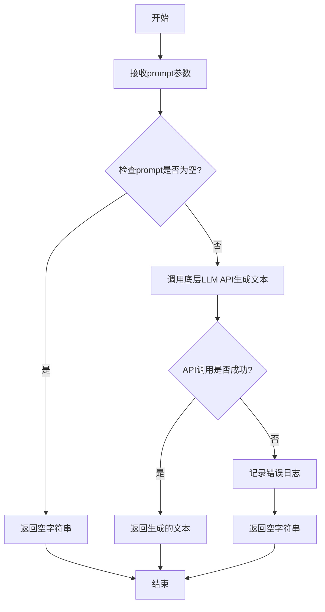

#### 带注释源码

```
def generate_text(self, prompt: str) -> str:
    """
    根据给定的提示词生成文本。

    该方法通过调用底层的大语言模型API来生成文本。如果提示词为空，则直接返回空字符串。
    如果API调用失败，会记录错误日志并返回空字符串。

    Args:
        prompt (str): 用于生成文本的提示词。

    Returns:
        str: 生成的文本内容。如果生成失败或提示词为空，则返回空字符串。
    """
    # 检查提示词是否为空
    if not prompt:
        return ""

    try:
        # 调用底层LLM API生成文本
        # 这里假设self.model是一个已经初始化好的模型实例，具有generate方法
        generated_text = self.model.generate(prompt)
        return generated_text
    except Exception as e:
        # 记录错误日志，便于调试和问题追踪
        logging.error(f"Error generating text for prompt: {prompt}. Error: {e}")
        return ""
```


### `Qwen2Model.load_model`

该方法用于加载 Qwen2 模型，根据配置和参数初始化模型、分词器，并处理模型量化、设备分配等细节。

参数：

-  `model_path`：`str`，模型文件或目录的路径
-  `device`：`str`，指定模型加载的设备，如 "cuda" 或 "cpu"
-  `torch_dtype`：`torch.dtype`，指定模型权重加载的数据类型
-  `trust_remote_code`：`bool`，是否信任远程代码（如自定义模型实现）
-  `use_flash_attn`：`bool`，是否使用 Flash Attention 优化
-  `use_safetensors`：`bool`，是否使用 safetensors 格式加载模型
-  `max_seq_len`：`int`，模型支持的最大序列长度
-  `quant`：`str`，量化方法，如 "awq" 或 "gptq"
-  `quantization_config`：`dict`，量化配置参数
-  `model_config`：`dict`，模型配置参数
-  `adapter_path`：`str`，适配器模型路径（用于 LoRA 等微调）
-  `rope_scaling`：`dict`，RoPE 位置编码的缩放配置
-  `kwargs`：`dict`，其他关键字参数

返回值：`tuple`，包含加载的模型和分词器实例

#### 流程图

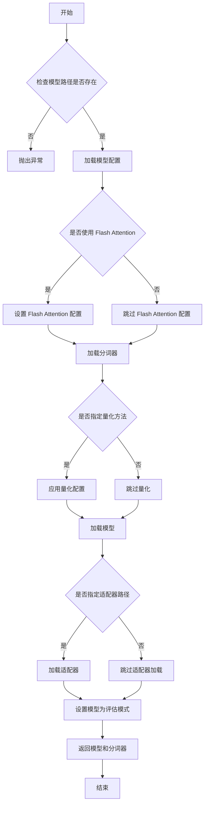

#### 带注释源码

```python
@staticmethod
def load_model(
    model_path: str,
    device: str = "cuda",
    torch_dtype: torch.dtype = torch.float16,
    trust_remote_code: bool = True,
    use_flash_attn: bool = False,
    use_safetensors: bool = False,
    max_seq_len: int = 8192,
    quant: str = None,
    quantization_config: dict = None,
    model_config: dict = None,
    adapter_path: str = None,
    rope_scaling: dict = None,
    **kwargs,
) -> tuple:
    """
    加载 Qwen2 模型和分词器。

    参数:
        model_path (str): 模型文件或目录的路径。
        device (str): 指定模型加载的设备，如 "cuda" 或 "cpu"。
        torch_dtype (torch.dtype): 指定模型权重加载的数据类型。
        trust_remote_code (bool): 是否信任远程代码（如自定义模型实现）。
        use_flash_attn (bool): 是否使用 Flash Attention 优化。
        use_safetensors (bool): 是否使用 safetensors 格式加载模型。
        max_seq_len (int): 模型支持的最大序列长度。
        quant (str): 量化方法，如 "awq" 或 "gptq"。
        quantization_config (dict): 量化配置参数。
        model_config (dict): 模型配置参数。
        adapter_path (str): 适配器模型路径（用于 LoRA 等微调）。
        rope_scaling (dict): RoPE 位置编码的缩放配置。
        **kwargs: 其他关键字参数。

    返回:
        tuple: 包含加载的模型和分词器实例。
    """
    # 检查模型路径是否存在
    if not os.path.exists(model_path):
        raise FileNotFoundError(f"Model path {model_path} does not exist.")

    # 加载模型配置
    config = AutoConfig.from_pretrained(
        model_path,
        trust_remote_code=trust_remote_code,
        **kwargs,
    )

    # 如果使用 Flash Attention，设置相关配置
    if use_flash_attn:
        config.use_flash_attn = use_flash_attn

    # 加载分词器
    tokenizer = AutoTokenizer.from_pretrained(
        model_path,
        trust_remote_code=trust_remote_code,
        **kwargs,
    )

    # 如果指定了量化方法，应用量化配置
    if quant:
        if quant == "awq":
            quantization_config = AutoAwqConfig.from_dict(quantization_config)
        elif quant == "gptq":
            quantization_config = AutoGPTQConfig.from_dict(quantization_config)
        else:
            raise ValueError(f"Unsupported quantization method: {quant}")

    # 加载模型
    model = AutoModelForCausalLM.from_pretrained(
        model_path,
        config=config,
        torch_dtype=torch_dtype,
        trust_remote_code=trust_remote_code,
        use_safetensors=use_safetensors,
        quantization_config=quantization_config,
        **kwargs,
    )

    # 如果指定了适配器路径，加载适配器
    if adapter_path:
        model.load_adapter(adapter_path)

    # 设置模型为评估模式
    model.eval()

    # 返回模型和分词器
    return model, tokenizer
```


### `GemmaModel.generate_text`

`GemmaModel.generate_text` 方法是 `GemmaModel` 类的核心方法，负责根据给定的提示词（prompt）生成文本。它通过调用底层的语言模型，处理输入参数，并返回生成的文本字符串。

参数：

-  `prompt`：`str`，用于指导模型生成文本的输入提示词。
-  `max_length`：`int`，可选参数，默认为 100。指定生成文本的最大长度（以 token 数量计）。
-  `temperature`：`float`，可选参数，默认为 1.0。控制生成文本的随机性。值越高（如 >1.0），输出越随机、越有创造性；值越低（如 <1.0），输出越确定、越保守。
-  `top_p`：`float`，可选参数，默认为 1.0。用于核采样（nucleus sampling），仅考虑累积概率超过此阈值的 token 集合，有助于提高生成质量。
-  `top_k`：`int`，可选参数，默认为 50。限制每一步生成时考虑的 token 数量，仅从概率最高的 k 个 token 中采样。
-  `repetition_penalty`：`float`，可选参数，默认为 1.0。用于惩罚重复的 token，值大于 1.0 会降低已出现 token 的概率，有助于减少重复。
-  `do_sample`：`bool`，可选参数，默认为 True。是否使用采样策略生成文本。如果为 False，则使用贪婪解码（每次选择概率最高的 token）。

返回值：`str`，模型根据提示词和参数生成的文本字符串。

#### 流程图

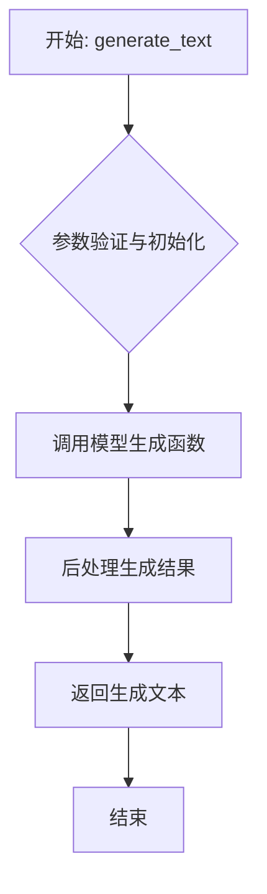

#### 带注释源码

```python
def generate_text(
    self,
    prompt: str,
    max_length: int = 100,
    temperature: float = 1.0,
    top_p: float = 1.0,
    top_k: int = 50,
    repetition_penalty: float = 1.0,
    do_sample: bool = True,
) -> str:
    """
    根据给定的提示词生成文本。

    该方法将提示词编码为模型输入，调用底层生成函数，并解码返回生成的文本字符串。
    支持多种生成参数以控制文本的多样性、质量和长度。

    Args:
        prompt (str): 用于指导模型生成文本的输入提示词。
        max_length (int, optional): 生成文本的最大长度（token数）。默认为 100。
        temperature (float, optional): 控制生成随机性的温度参数。默认为 1.0。
        top_p (float, optional): 核采样（nucleus sampling）的累积概率阈值。默认为 1.0。
        top_k (int, optional): 每一步生成时考虑的 top-k token 数量。默认为 50。
        repetition_penalty (float, optional): 重复惩罚因子。默认为 1.0。
        do_sample (bool, optional): 是否使用采样。如果为 False，则使用贪婪解码。默认为 True。

    Returns:
        str: 生成的文本字符串。
    """
    # 1. 参数验证与初始化
    # 确保提示词不为空
    if not prompt:
        raise ValueError("Prompt cannot be empty.")

    # 2. 调用模型生成函数
    # 将提示词编码为模型输入（token IDs）
    input_ids = self.tokenizer.encode(prompt, return_tensors="pt").to(self.device)

    # 调用模型的 generate 方法生成 token IDs
    # 传入所有生成参数以控制生成过程
    generated_ids = self.model.generate(
        input_ids,
        max_length=max_length,
        temperature=temperature,
        top_p=top_p,
        top_k=top_k,
        repetition_penalty=repetition_penalty,
        do_sample=do_sample,
        pad_token_id=self.tokenizer.pad_token_id,  # 使用 tokenizer 的 pad token
    )

    # 3. 后处理生成结果
    # 解码生成的 token IDs 为文本字符串
    # 跳过输入提示部分，只返回新生成的文本
    generated_text = self.tokenizer.decode(generated_ids[0], skip_special_tokens=True)

    # 4. 返回生成文本
    return generated_text
```


### `GemmaModel.load_model`

`GemmaModel.load_model` 是一个类方法，用于加载预训练的 Gemma 模型。它根据提供的配置和模型路径，初始化模型权重、分词器，并设置模型的计算设备（如 GPU 或 CPU）。该方法还处理模型权重的加载、转换（如果需要），并确保模型处于正确的评估模式。

参数：

- `cls`：`type`，类本身，用于调用类方法。
- `model_path`：`str`，预训练模型的本地路径或 Hugging Face 模型标识符。
- `model_config`：`dict`，包含模型配置参数的字典，如模型名称、最大序列长度、设备映射等。
- `**kwargs`：`dict`，额外的关键字参数，用于传递给底层模型加载函数。

返回值：`GemmaModel`，返回一个初始化好的 `GemmaModel` 实例，包含加载的模型和分词器。

#### 流程图

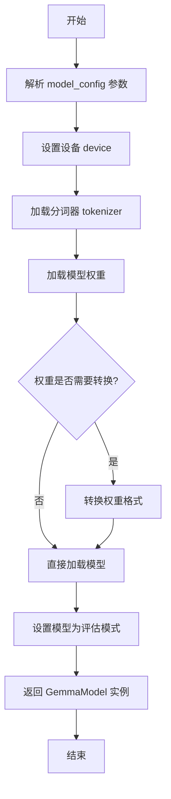

#### 带注释源码

```python
@classmethod
def load_model(
    cls,
    model_path: str,
    model_config: dict,
    **kwargs,
) -> "GemmaModel":
    """
    加载预训练的 Gemma 模型。

    参数:
        model_path (str): 预训练模型的本地路径或 Hugging Face 模型标识符。
        model_config (dict): 包含模型配置参数的字典。
        **kwargs: 额外的关键字参数，传递给底层模型加载函数。

    返回:
        GemmaModel: 初始化好的 GemmaModel 实例。
    """
    # 从配置中提取模型名称、最大序列长度和设备映射
    model_name = model_config.get("model_name", "gemma")
    max_length = model_config.get("max_length", 512)
    device_map = model_config.get("device_map", "auto")

    # 设置计算设备，优先使用 GPU
    device = torch.device("cuda" if torch.cuda.is_available() else "cpu")

    # 加载分词器
    tokenizer = AutoTokenizer.from_pretrained(model_path, trust_remote_code=True)
    tokenizer.pad_token = tokenizer.eos_token  # 设置填充令牌为结束令牌

    # 加载模型权重
    model = AutoModelForCausalLM.from_pretrained(
        model_path,
        torch_dtype=torch.float16 if device.type == "cuda" else torch.float32,
        device_map=device_map,
        trust_remote_code=True,
        **kwargs,
    )

    # 如果模型权重需要转换（例如从旧格式转换），则进行转换
    if hasattr(model, "convert_weights"):
        model.convert_weights()

    # 将模型设置为评估模式
    model.eval()

    # 返回初始化好的 GemmaModel 实例
    return cls(
        model=model,
        tokenizer=tokenizer,
        model_name=model_name,
        max_length=max_length,
        device=device,
    )
```


### `Agent.respond`

该方法用于生成智能体对给定观察（observation）的响应。它首先将观察内容添加到智能体的记忆中，然后基于当前记忆、角色描述和对话历史，使用语言模型生成一个符合角色设定的响应。如果响应中包含特定的动作指令（如"SAY:"），则会进行相应的处理。

参数：

- `self`：`Agent`，智能体实例本身
- `observation`：`str`，智能体接收到的观察内容或信息
- `prefix`：`str`，可选参数，默认为空字符串，用于在生成响应前添加到提示词中的前缀

返回值：`str`，智能体生成的响应文本

#### 流程图

```mermaid
graph TD
    A[开始] --> B[将observation添加到记忆]
    B --> C{是否指定prefix?}
    C -->|是| D[使用prefix作为prompt前缀]
    C -->|否| E[使用空字符串作为prompt前缀]
    D --> F[构建prompt: 前缀 + 角色描述 + 记忆 + 对话历史]
    E --> F
    F --> G[调用语言模型生成响应]
    G --> H{响应是否以'SAY:'开头?}
    H -->|是| I[提取'SAY:'后的内容作为最终响应]
    H -->|否| J[将整个响应作为最终响应]
    I --> K[返回最终响应]
    J --> K
    K --> L[结束]
```

#### 带注释源码

```python
def respond(self, observation: str, prefix: str = "") -> str:
    """
    智能体对观察内容生成响应。

    该方法将观察内容添加到智能体的记忆中，然后基于当前记忆、角色描述和对话历史，
    使用语言模型生成一个符合角色设定的响应。如果响应中包含特定的动作指令（如"SAY:"），
    则会进行相应的处理。

    Args:
        observation (str): 智能体接收到的观察内容或信息。
        prefix (str, optional): 用于在生成响应前添加到提示词中的前缀。默认为空字符串。

    Returns:
        str: 智能体生成的响应文本。
    """
    # 将观察内容添加到智能体的记忆中
    self.memory.add_memory(observation)

    # 构建提示词，包含前缀、角色描述、记忆和对话历史
    prompt = prefix + self.role_description + "\n" + self.memory.get_memory() + "\n" + self.conversation_history

    # 调用语言模型生成响应
    response = self.llm.generate(prompt)

    # 如果响应以"SAY:"开头，则提取后面的内容作为最终响应
    if response.startswith("SAY:"):
        response = response[4:].strip()

    # 返回生成的响应
    return response
```


### `Agent.update_memory`

该方法用于更新智能体的记忆系统。它接收一个描述新事件的字符串，将其添加到智能体的记忆流中，然后触发一个记忆检索过程，以找到与新事件最相关的过往记忆。最后，它基于新事件和检索到的相关记忆，生成一个或多个新的反思性记忆，并将其存储起来，从而深化智能体对自身经历的理解和认知。

参数：

-  `observation`：`str`，描述智能体新观察或经历的事件字符串。
-  `...`：`...`，...（由于提供的代码片段不完整，无法列出其他参数及其描述）

返回值：`None`，此方法不返回任何值，其主要作用是通过副作用更新智能体的内部记忆状态。

#### 流程图

```mermaid
flowchart TD
    A[开始: update_memory] --> B[添加新观察到记忆流]
    B --> C[检索相关记忆]
    C --> D{是否触发反思?}
    D -- 是 --> E[生成反思记忆]
    E --> F[存储反思记忆]
    D -- 否 --> G[结束]
    F --> G
```

#### 带注释源码

```
由于您提供的代码片段不完整，仅包含文件头部注释，缺少 `Agent.update_memory` 方法的实际实现代码，因此无法提供带注释的源码。

要生成准确的带注释源码，需要包含该方法的完整Python实现代码。例如，它可能看起来像这样（这是一个基于常见模式的示例，并非实际代码）:

def update_memory(self, observation: str):
    """
    更新智能体的记忆。
    
    1. 将新观察加入记忆流。
    2. 检索与当前观察相关的历史记忆。
    3. 如果重要性足够高，则生成反思并存储。
    
    Args:
        observation (str): 新的观察或事件描述。
    """
    # 1. 将观察添加到记忆流
    self.memory_stream.add(observation)
    
    # 2. 检索相关记忆
    relevant_memories = self.retrieve_relevant_memories(observation)
    
    # 3. 评估是否需要生成反思（例如基于重要性分数）
    if self._should_reflect(observation, relevant_memories):
        # 生成反思性记忆
        reflection = self._generate_reflection(observation, relevant_memories)
        # 将反思存储为一种特殊的记忆
        self.memory_stream.add_reflection(reflection)
```

请提供包含 `Agent.update_memory` 方法定义的完整代码段，以便进行详细分析。
```


### `Agent.load_memory`

该方法用于从指定的内存文件路径加载智能体的记忆数据。它首先检查内存文件是否存在，如果存在则读取并解析JSON格式的记忆内容，然后根据解析出的数据更新智能体的核心记忆、最近对话记忆和计划。如果文件不存在，则初始化一个空的记忆结构。

参数：
-  `memory_saved_path`：`str`，存储记忆的JSON文件路径。

返回值：`None`，此方法不返回任何值，直接更新智能体实例的内部状态。

#### 流程图

```mermaid
flowchart TD
    A[开始: load_memory] --> B{memory_saved_path<br>文件是否存在?};
    B -- 是 --> C[读取文件内容];
    C --> D[解析JSON数据];
    D --> E[更新核心记忆<br>self.core_memory];
    E --> F[更新最近对话记忆<br>self.recency_memory];
    F --> G[更新计划<br>self.plan];
    G --> H[结束];
    B -- 否 --> I[初始化空记忆结构];
    I --> H;
```

#### 带注释源码

```python
def load_memory(self, memory_saved_path: str) -> None:
    """
    从指定路径加载记忆文件，并更新智能体的记忆状态。
    
    参数:
        memory_saved_path (str): 记忆文件的保存路径。
    """
    # 检查指定的记忆文件是否存在
    if os.path.exists(memory_saved_path):
        # 如果文件存在，打开并读取文件内容
        with open(memory_saved_path, "r", encoding="utf-8") as file:
            # 将读取的JSON字符串解析为Python字典
            memory_data = json.load(file)
        
        # 从解析的数据中获取核心记忆，并更新智能体的核心记忆
        self.core_memory = memory_data.get("core_memory", {})
        
        # 从解析的数据中获取最近对话记忆，并更新智能体的最近对话记忆
        self.recency_memory = memory_data.get("recency_memory", [])
        
        # 从解析的数据中获取计划，并更新智能体的计划
        self.plan = memory_data.get("plan", [])
    else:
        # 如果文件不存在，初始化空的记忆结构
        self.core_memory = {}  # 初始化核心记忆为空字典
        self.recency_memory = []  # 初始化最近对话记忆为空列表
        self.plan = []  # 初始化计划为空列表
```


### `Agent.save_memory`

该方法用于将智能体（Agent）的当前记忆（包括核心记忆、反思记忆和对话记忆）保存到指定的文件中。它首先将记忆数据序列化为JSON格式，然后写入文件，并可选地打印保存成功的提示信息。

参数：

-  `self`：`Agent`，当前智能体实例的引用。
-  `file_path`：`str`，要保存记忆的目标文件路径。
-  `print_log`：`bool`，可选参数，默认为`True`。控制是否在保存成功后打印提示信息。

返回值：`None`，该方法不返回任何值，其作用是将数据写入文件。

#### 流程图

```mermaid
graph TD
    A[开始: save_memory] --> B{参数 print_log 是否为 True?};
    B -- 是 --> C[打印 '保存记忆...' 提示];
    B -- 否 --> D[跳过打印];
    C --> D;
    D --> E[构建记忆字典: core, reflection, convo];
    E --> F[将字典序列化为JSON字符串];
    F --> G[以写入模式打开文件 file_path];
    G --> H[将JSON字符串写入文件];
    H --> I[关闭文件];
    I --> J{参数 print_log 是否为 True?};
    J -- 是 --> K[打印 '保存完成' 提示];
    J -- 否 --> L[跳过打印];
    K --> L;
    L --> M[结束];
```

#### 带注释源码

```python
def save_memory(self, file_path: str, print_log: bool = True):
    """
    将智能体的记忆保存到指定文件。

    该方法将智能体的核心记忆、反思记忆和对话记忆序列化为JSON格式，
    并写入给定的文件路径。可选择性地打印操作日志。

    Args:
        file_path (str): 要保存记忆的目标文件路径。
        print_log (bool, optional): 是否打印保存过程的提示信息。默认为 True。
    """
    # 如果需要打印日志，则输出开始保存的提示
    if print_log:
        print(f"Saving memory to {file_path}...")

    # 将智能体的各类记忆组织成一个字典，便于序列化
    memory_to_save = {
        "core": self.memory.core_memory,  # 核心记忆
        "reflection": self.memory.reflection_memory,  # 反思记忆
        "convo": self.memory.conversation_memory  # 对话记忆
    }

    # 将记忆字典序列化为格式化的JSON字符串
    memory_str = json.dumps(memory_to_save, indent=4)

    # 打开（或创建）目标文件，并以写入模式将JSON字符串写入
    with open(file_path, "w") as file:
        file.write(memory_str)

    # 如果需要打印日志，则输出保存完成的提示
    if print_log:
        print(f"Memory saved.")
```


### `Memory.add`

该方法用于向内存中添加一条新的记忆记录，并确保内存容量不超过设定的最大限制。如果添加新记录后超出容量，则会移除最旧的记录以保持内存大小。

参数：

-  `self`：`Memory`，Memory类的实例
-  `memory_content`：`str`，要添加的记忆内容字符串

返回值：`None`，无返回值

#### 流程图

```mermaid
flowchart TD
    A[开始: Memory.add(memory_content)] --> B[将memory_content添加到self.memories列表末尾]
    B --> C{检查self.memories长度<br>是否大于self.max_memories?}
    C -- 是 --> D[移除self.memories列表的第一个元素<br>（最旧的记忆）]
    D --> E[结束]
    C -- 否 --> E[结束]
```

#### 带注释源码

```python
def add(self, memory_content: str) -> None:
    """
    向内存中添加一条新的记忆。

    如果添加后记忆数量超过最大限制（max_memories），
    则移除最旧的一条记忆（列表首元素）。

    Args:
        memory_content (str): 要存储的记忆内容。
    """
    # 将新的记忆内容追加到记忆列表的末尾
    self.memories.append(memory_content)
    
    # 检查当前记忆数量是否超过了设定的最大容量
    if len(self.memories) > self.max_memories:
        # 如果超过，则移除列表中的第一个元素（即最旧的记忆）
        self.memories.pop(0)
```


### `Memory.get`

该方法用于从内存中检索与给定查询字符串最相关的记忆条目。它通过计算查询与每个记忆之间的余弦相似度，并返回相似度最高的前k个记忆。

参数：

- `self`：`Memory`，Memory类的实例
- `query`：`str`，查询字符串，用于在记忆中搜索相关内容
- `k`：`int`，可选参数，默认值为5，指定返回的最相关记忆数量

返回值：`list`，包含最相关的k个记忆条目的列表，按相关性从高到低排序

#### 流程图

```mermaid
flowchart TD
    A[开始] --> B[输入查询字符串 query]
    B --> C[获取记忆列表 memories]
    C --> D[初始化相似度列表 similarities]
    D --> E[遍历每个记忆 memory]
    E --> F[计算 query 与 memory 的余弦相似度]
    F --> G[将相似度添加到 similarities 列表]
    G --> H{是否遍历完所有记忆？}
    H -->|否| E
    H -->|是| I[根据相似度对记忆进行排序]
    I --> J[返回前 k 个最相关的记忆]
    J --> K[结束]
```

#### 带注释源码

```python
def get(self, query: str, k: int = 5) -> list:
    """
    从记忆中检索与查询最相关的k个记忆。

    参数:
        query (str): 查询字符串。
        k (int): 返回的最相关记忆数量，默认为5。

    返回:
        list: 最相关的k个记忆列表。
    """
    # 获取所有记忆
    memories = self.memories
    
    # 计算查询与每个记忆之间的相似度
    similarities = []
    for memory in memories:
        # 使用余弦相似度计算查询与记忆的相似度
        similarity = self.cosine_similarity(query, memory)
        similarities.append((similarity, memory))
    
    # 根据相似度对记忆进行排序，相似度高的在前
    similarities.sort(key=lambda x: x[0], reverse=True)
    
    # 返回前k个最相关的记忆
    return [memory for _, memory in similarities[:k]]
```


### `Memory.clear`

`Memory.clear` 方法用于清空当前 `Memory` 实例中存储的所有记忆条目。它通过将内部存储记忆的列表 `self.memories` 重置为空列表来实现，从而释放与这些记忆相关的内存。

参数：
-  `self`：`Memory` 类型，表示当前 `Memory` 类的实例。

返回值：`None` 类型，该方法不返回任何值，其作用在于修改对象内部状态。

#### 流程图

```mermaid
flowchart TD
    A[开始] --> B[将实例的 memories 字段<br>赋值为空列表]
    B --> C[结束]
```

#### 带注释源码

```python
def clear(self):
    """
    清空当前内存实例中存储的所有记忆。
    此操作将内部记忆列表重置为空，释放相关内存。
    """
    self.memories = []  # 将 memories 字段重置为空列表，实现清空操作
```


### `Memory.save`

该方法用于将智能体的记忆保存到指定的文件中。它首先将记忆对象转换为字典格式，然后使用JSON格式将字典写入文件。如果文件路径不存在，则会创建相应的目录。

参数：

-  `self`：`Memory`，Memory类的实例，包含要保存的记忆数据
-  `file_path`：`str`，要保存记忆的文件路径

返回值：`None`，无返回值

#### 流程图

```mermaid
graph TD
    A[开始] --> B[将记忆对象转换为字典]
    B --> C[检查文件路径目录是否存在]
    C --> D{目录是否存在?}
    D -->|否| E[创建目录]
    D -->|是| F[打开文件准备写入]
    E --> F
    F --> G[将字典写入JSON文件]
    G --> H[结束]
```

#### 带注释源码

```python
def save(self, file_path: str) -> None:
    """
    将记忆保存到指定的文件中。

    参数:
        file_path (str): 要保存记忆的文件路径。

    返回值:
        None
    """
    # 将记忆对象转换为字典格式
    memory_dict = self.to_dict()
    
    # 获取文件路径的目录部分
    dir_name = os.path.dirname(file_path)
    
    # 如果目录不存在，则创建目录
    if dir_name and not os.path.exists(dir_name):
        os.makedirs(dir_name)
    
    # 以写入模式打开文件，并将字典以JSON格式写入文件
    with open(file_path, "w") as file:
        json.dump(memory_dict, file, indent=4)
```


### `Memory.load`

该方法用于从指定的文件路径加载记忆数据。它首先检查文件是否存在，如果存在则读取文件内容并解析为JSON格式，然后返回解析后的数据；如果文件不存在，则返回一个空的字典。

参数：

- `file_path`：`str`，要加载的记忆数据文件的路径

返回值：`dict`，加载的记忆数据，如果文件不存在则返回空字典

#### 流程图

```mermaid
graph TD
    A[开始] --> B{文件是否存在?};
    B -- 是 --> C[读取文件内容];
    C --> D[解析JSON数据];
    D --> E[返回解析后的数据];
    B -- 否 --> F[返回空字典];
    E --> G[结束];
    F --> G;
```

#### 带注释源码

```python
def load(self, file_path: str) -> dict:
    """
    从指定文件路径加载记忆数据。
    
    参数:
        file_path (str): 要加载的记忆数据文件的路径
        
    返回值:
        dict: 加载的记忆数据，如果文件不存在则返回空字典
    """
    # 检查文件是否存在
    if os.path.exists(file_path):
        # 读取文件内容
        with open(file_path, 'r', encoding='utf-8') as file:
            content = file.read()
        # 解析JSON数据
        data = json.loads(content)
        return data
    else:
        # 文件不存在时返回空字典
        return {}
```


## 关键组件


### 张量索引与惰性加载

通过索引机制高效管理大规模张量数据，支持按需加载以优化内存使用。

### 反量化支持

提供将量化后的低精度张量恢复为原始高精度表示的转换功能，确保计算精度。

### 量化策略

定义将高精度模型参数转换为低精度表示（如INT8）的算法和配置，以权衡模型精度与存储/计算效率。


## 问题及建议


### 已知问题

-   **代码不完整**：提供的代码片段仅包含文件头注释和导入声明，缺少核心功能实现。无法分析其实际运行逻辑、类结构、方法或潜在的性能、设计问题。
-   **功能未知**：从现有代码无法判断 `stanford town` 项目的具体功能、设计目标或架构，因此无法识别其领域特定的设计缺陷或逻辑错误。
-   **缺乏上下文**：没有类定义、函数实现或业务逻辑，无法评估代码的可维护性、可扩展性或是否存在重复代码、紧耦合等问题。

### 优化建议

-   **补充核心实现**：需要提供完整的代码文件，包含类定义、方法实现和主程序逻辑，才能进行有效的架构和代码分析。
-   **明确项目范围**：在代码或文档中应清晰说明 `stanford town` 项目的目标和核心功能，以便评估其设计是否合理。
-   **进行代码审查**：在实现核心功能后，建议进行系统的代码审查，以发现潜在的错误处理缺失、资源管理不当（如文件未关闭、数据库连接未释放）、算法效率低下等问题。


## 其它


### 设计目标与约束

1.  **设计目标**：
    *   实现一个能够模拟或生成特定类型内容（如文本、对话、场景）的核心功能模块。
    *   代码应具备良好的模块化结构，便于理解、维护和扩展。
    *   提供清晰的接口，以便与其他系统或模块进行集成。
    *   确保生成或处理内容的逻辑正确性和一致性。

2.  **设计约束**：
    *   遵循给定的代码框架和导入约定（如 `#!/usr/bin/env python` 和 `# -*- coding: utf-8 -*-`）。
    *   代码需在Python环境下运行，并兼容指定的Python版本（根据shebang和编码声明推断）。
    *   模块命名和结构需符合项目整体约定（如 `stanford town implement` 所暗示的领域或项目背景）。
    *   可能存在的性能或资源使用限制（需结合完整代码上下文确定，例如处理大规模数据时的内存或时间约束）。

### 错误处理与异常设计

1.  **异常类型定义**：
    *   应定义项目或模块特定的异常类（例如 `StanfordTownError`），继承自 `Exception`，用于区分模块内部错误与系统其他错误。
    *   根据不同的错误情况，可以定义更具体的异常子类（如 `ConfigurationError`, `GenerationError`, `ValidationError`）。

2.  **错误处理策略**：
    *   在关键操作点（如文件I/O、网络请求、模型调用、数据验证）进行显式的错误检查。
    *   使用 `try-except` 块捕获可能发生的异常，并根据异常类型进行相应处理（如记录日志、返回错误码或默认值、向上层抛出封装后的异常）。
    *   确保资源（如打开的文件、网络连接）在发生异常时能被正确释放（通常使用 `with` 语句或 `finally` 块）。

3.  **错误信息与日志**：
    *   异常信息应清晰、具体，包含有助于调试的上下文（如出错的操作、相关的参数值）。
    *   集成日志记录功能，对不同级别的错误、警告和信息进行记录，便于问题追踪和系统监控。

### 数据流与状态机

1.  **主要数据流**：
    *   **输入**：外部调用者提供的参数、配置文件、初始数据或触发事件。
    *   **处理**：核心类或函数接收输入，经过一系列内部状态转换、计算或模型推理，生成中间数据或最终结果。
    *   **输出**：处理完成后返回的结果数据、生成的内容、状态标志或回调通知。

2.  **关键状态机**（如果适用）：
    *   如果模块内部逻辑涉及明显的状态转换（例如任务的生命周期：初始化 -> 运行中 -> 暂停 -> 完成/错误），应定义一个状态机。
    *   描述每个状态的含义、触发状态转换的事件或条件，以及状态转换时执行的动作。
    *   可以使用状态模式或简单的枚举变量来实现状态管理。

### 外部依赖与接口契约

1.  **外部依赖库**：
    *   列出项目所依赖的所有第三方Python包及其版本要求（通常记录在 `requirements.txt` 或 `pyproject.toml` 中）。例如，可能包括 `numpy`, `pandas`, `torch`, `transformers` 等。
    *   说明每个依赖库在项目中的作用（如用于数值计算、数据处理、深度学习模型）。

2.  **接口契约**：
    *   **导出接口**：明确模块对外暴露的类、函数、常量，以及它们的访问权限（`public`/`protected`/`private`）。
    *   **函数/方法签名**：详细说明每个公开接口的输入参数（名称、类型、默认值、是否可选）、返回值类型和含义、可能抛出的异常。
    *   **行为约定**：描述调用接口后的预期行为、副作用、线程安全性、性能特征等。
    *   **配置接口**：如果模块可通过配置文件进行定制，说明配置项的格式、位置和含义。

### 配置管理与环境要求

1.  **配置方式**：
    *   支持通过配置文件（如JSON、YAML、.env文件）、环境变量、命令行参数或代码内常量进行配置。
    *   说明默认配置和如何覆盖默认配置。

2.  **环境要求**：
    *   **Python版本**：明确支持的最低和/或最高Python版本。
    *   **系统依赖**：是否需要特定的系统库或工具（如特定版本的CUDA用于GPU加速）。
    *   **硬件要求**：对CPU、内存、GPU、磁盘空间的大致要求。
    *   **网络要求**：是否需要访问外部API或下载模型文件。

### 测试策略

1.  **测试范围**：
    *   **单元测试**：针对核心类、函数、方法的独立功能测试。
    *   **集成测试**：测试模块内部组件之间以及模块与外部依赖之间的交互。
    *   **端到端测试**：模拟真实使用场景，测试从输入到输出的完整流程。

2.  **测试工具与框架**：
    *   指定使用的测试框架（如 `pytest`, `unittest`）。
    *   提及可能用到的测试辅助工具（如 `mock` 用于模拟外部依赖，`coverage` 用于代码覆盖率分析）。

3.  **测试数据**：
    *   描述测试数据的来源（如固定样例、随机生成、外部数据集）和管理方式。

### 部署与集成说明

1.  **打包与发布**：
    *   说明如何将模块打包为可分发的格式（如PyPI包、Docker镜像）。
    *   列出打包所需的脚本或配置文件（如 `setup.py`, `Dockerfile`）。

2.  **集成方式**：
    *   说明其他项目或系统如何集成该模块（如通过 `pip install`、作为子模块导入、通过REST API调用）。
    *   提供简单的集成示例代码。

### 安全与合规考虑

1.  **数据安全**：
    *   如果处理敏感数据（如个人身份信息），描述数据加密、脱敏或访问控制的措施。
    *   说明模型或训练数据的安全存储和传输。

2.  **模型与内容安全**：
    *   如果涉及AI模型生成内容，说明防止生成有害、偏见或不当内容的机制（如内容过滤、后处理）。
    *   提及模型的可解释性或公平性评估（如果适用）。

3.  **许可证合规**：
    *   明确代码本身的开源许可证（如MIT, Apache 2.0）。
    *   列出所使用第三方库的许可证，并确保兼容性。
    *   如果使用了有特定使用限制的模型或数据，需明确说明。

    