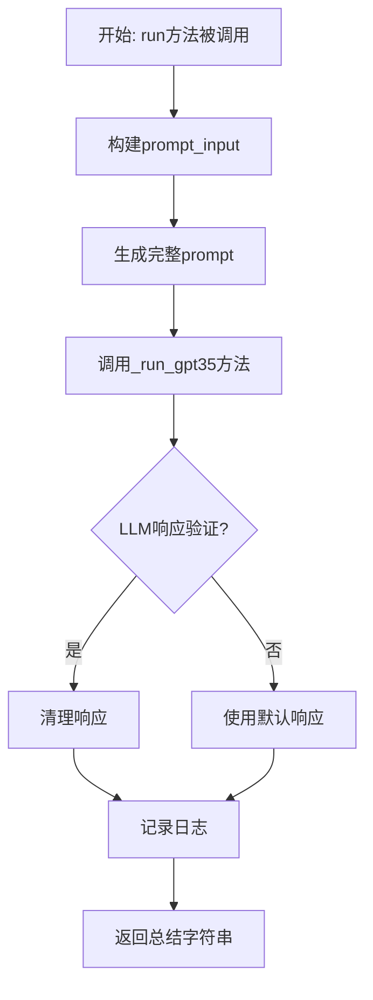
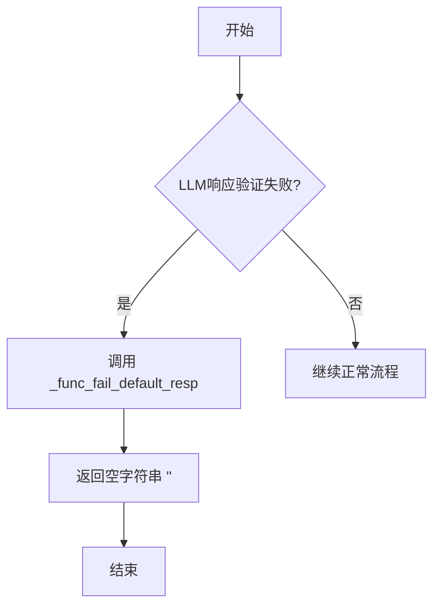
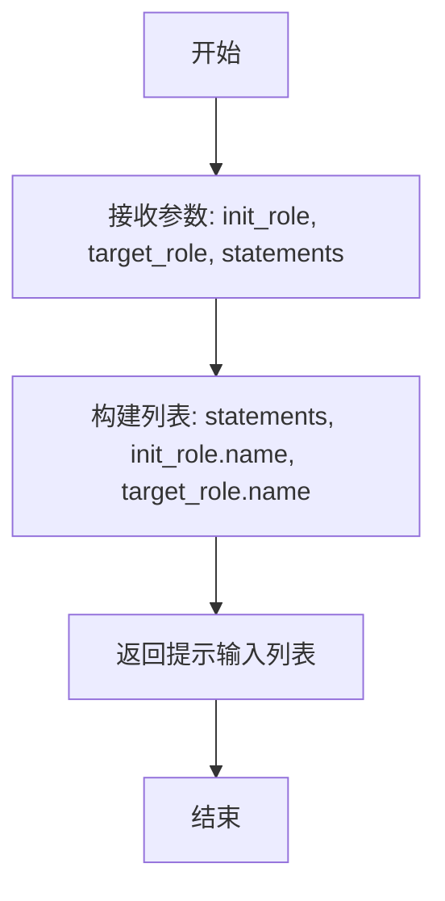

# `.\MetaGPT\metagpt\ext\stanford_town\actions\agent_chat_sum_rel.py` 详细设计文档

该代码定义了一个名为AgentChatSumRel的类，继承自STAction，其核心功能是总结两个智能体（角色）在对话中建立的关系。它通过调用大语言模型（GPT-3.5）处理输入的对话陈述，生成一个描述两个角色之间关系的总结性字符串。

## 整体流程



## 类结构

```
STAction (基类)
└── AgentChatSumRel (关系总结动作)
```

## 全局变量及字段


### `logger`
    
用于记录日志的全局日志记录器实例。

类型：`logging.Logger`
    


### `AgentChatSumRel.name`
    
动作类的名称，固定为'AgentChatSumRel'。

类型：`str`
    
    

## 全局函数及方法


### `AgentChatSumRel._func_validate`

该方法用于验证大语言模型（LLM）对提示词（prompt）的响应（`llm_resp`）是否符合预期的格式。具体来说，它尝试将响应字符串按双引号（`"`）分割，并检查分割后的第一部分（去除首尾空格后）是否能够成功获取。如果尝试过程中没有发生异常，则认为响应格式有效。

参数：

- `llm_resp`：`str`，大语言模型返回的原始响应字符串。
- `prompt`：`str`，生成`llm_resp`所使用的提示词。在此验证方法中，此参数未被使用，但为保持接口一致性而保留。

返回值：`bool`，如果`llm_resp`能够成功按双引号分割并提取出第一部分（即使该部分为空字符串），则返回`True`，否则返回`False`。

#### 流程图

```mermaid
graph TD
    A[开始] --> B{尝试执行 llm_resp.split('"')[0].strip()};
    B -- 成功 --> C[resp = True];
    B -- 发生异常 --> D[resp = False];
    C --> E[返回 resp];
    D --> E;
```

#### 带注释源码

```python
def _func_validate(self, llm_resp: str, prompt: str) -> bool:
    # 初始化返回值为 False，假设验证失败
    resp = False
    try:
        # 尝试将 llm_resp 按双引号分割，取第一个元素，并去除首尾空格
        # 此操作旨在验证响应中是否包含至少一个由双引号包围的字段
        # 如果 llm_resp 中不包含双引号，split('"') 将返回包含原字符串的列表，
        # 取 [0] 是安全的，strip() 也是安全的。
        # 如果 llm_resp 不是字符串或为 None，则会触发异常。
        _ = llm_resp.split('"')[0].strip()
        # 如果上述操作未引发异常，则将返回值设为 True
        resp = True
    except Exception:
        # 捕获所有异常（包括 AttributeError, IndexError 等），
        # 保持 resp 为初始值 False，表示验证失败。
        pass
    # 返回验证结果
    return resp
```


### `AgentChatSumRel._func_cleanup`

该方法用于清理和格式化从大语言模型（LLM）获得的原始响应字符串。它通过提取响应中第一个双引号之前的内容并去除首尾空白字符，来获取一个简洁、无引号的文本摘要。

参数：

- `llm_resp`：`str`，从大语言模型（LLM）获得的原始响应字符串。
- `prompt`：`str`，生成该响应所使用的提示词（在本方法中未直接使用）。

返回值：`str`，清理和格式化后的字符串，即原始响应中第一个双引号之前的内容，并已去除首尾空白字符。

#### 流程图

```mermaid
flowchart TD
    A[开始] --> B{输入: llm_resp}
    B --> C["使用 split('\"') 分割字符串"]
    C --> D["取分割结果的第一个元素 (索引0)"]
    D --> E["使用 strip() 去除首尾空白"]
    E --> F["返回清理后的字符串"]
    F --> G[结束]
```

#### 带注释源码

```python
def _func_cleanup(self, llm_resp: str, prompt: str) -> str:
    # 1. 使用双引号 '"' 作为分隔符，将 llm_resp 字符串分割成一个列表。
    # 2. 取该列表的第一个元素（索引为0），即第一个双引号之前的所有内容。
    # 3. 使用 strip() 方法去除该内容首尾的空白字符（如空格、换行符等）。
    # 4. 返回处理后的字符串。
    return llm_resp.split('"')[0].strip()
```


### `AgentChatSumRel._func_fail_default_resp`

该方法作为`AgentChatSumRel`类中处理LLM响应失败时的默认回退方法。当`_func_validate`方法验证LLM响应失败时，此方法被调用以提供一个默认的响应字符串，确保后续流程不会因空响应而中断。

参数：
- 无

返回值：`str`，返回一个空字符串作为默认响应。

#### 流程图



#### 带注释源码

```python
def _func_fail_default_resp(self) -> str:
    pass  # 方法体为空，默认返回None，但在类型注解中期望返回str
```

**注意**：当前实现中，`_func_fail_default_resp`方法体为空（仅包含`pass`语句），根据Python函数行为，它将隐式返回`None`。然而，其类型注解为`-> str`，表明期望返回一个字符串。这可能导致类型不一致或运行时错误。建议修改为返回一个空字符串`""`以符合类型约定并确保健壮性。


### `AgentChatSumRel.run`

该方法用于总结两个智能体（角色）在对话中建立的关系。它接收对话内容、发起角色和目标角色信息，通过调用GPT-3.5模型生成一段描述两者关系的总结性文本。

参数：

-  `init_role`：`STRole`，发起对话的智能体角色对象
-  `target_role`：`STRole`，对话目标的智能体角色对象
-  `statements`：`str`，需要总结的对话内容文本

返回值：`str`，返回一个描述两个角色之间关系的总结性字符串

#### 流程图

```mermaid
flowchart TD
    A[开始: run(init_role, target_role, statements)] --> B[调用create_prompt_input<br>组装prompt_input]
    B --> C[调用generate_prompt_with_tmpl_filename<br>使用模板生成完整prompt]
    C --> D[调用_run_gpt35<br>请求GPT-3.5模型]
    D --> E{模型调用成功?}
    E -- 是 --> F[记录日志并返回结果]
    E -- 否 --> G[返回空或默认值]
    F --> H[结束]
    G --> H
```

#### 带注释源码

```python
async def run(self, init_role: "STRole", target_role: "STRole", statements: str) -> str:
    # 定义内部函数，用于组装提示词输入
    def create_prompt_input(init_role: "STRole", target_role: "STRole", statements: str) -> str:
        # 将对话内容、发起者名称、目标者名称组合成列表作为提示词输入
        prompt_input = [statements, init_role.name, target_role.name]
        return prompt_input

    # 1. 组装提示词输入
    prompt_input = create_prompt_input(init_role, target_role, statements)
    # 2. 使用指定的模板文件生成完整的提示词
    prompt = self.generate_prompt_with_tmpl_filename(prompt_input, "summarize_chat_relationship_v2.txt")

    # 定义示例输出和特殊指令，用于引导模型生成
    example_output = "Jane Doe is working on a project"
    special_instruction = "The output should be a string that responds to the question."
    # 3. 调用GPT-3.5模型生成关系总结
    output = await self._run_gpt35(prompt, example_output, special_instruction)
    # 4. 记录执行日志
    logger.info(f"Role: {init_role.name} Action: {self.cls_name} output: {output}")
    # 5. 返回模型生成的结果
    return output
```


### `AgentChatSumRel.create_prompt_input`

该方法用于为总结聊天关系的任务构建提示输入。它接收初始角色、目标角色和聊天陈述，并将它们组合成一个列表，作为后续生成完整提示的基础。

参数：

-  `init_role`：`STRole`，发起聊天总结的初始角色对象
-  `target_role`：`STRole`，聊天中的目标角色对象
-  `statements`：`str`，需要总结的聊天陈述内容

返回值：`str`，返回一个包含聊天陈述、初始角色名称和目标角色名称的列表

#### 流程图



#### 带注释源码

```
def create_prompt_input(init_role: "STRole", target_role: "STRole", statements: str) -> str:
    # 构建提示输入列表，包含三个元素：
    # 1. 聊天陈述内容
    # 2. 初始角色的名称
    # 3. 目标角色的名称
    prompt_input = [statements, init_role.name, target_role.name]
    
    # 返回构建好的提示输入列表
    return prompt_input
```


## 关键组件


### STAction基类

作为所有斯坦福小镇（Stanford Town）动作（Action）的抽象基类，定义了动作执行、LLM响应验证与清理等通用流程和接口。

### 提示词模板引擎

通过`generate_prompt_with_tmpl_filename`方法，将动态数据与预定义的文本模板文件（如`summarize_chat_relationship_v2.txt`）结合，生成最终发送给LLM的提示词。

### LLM响应处理器

包含`_func_validate`、`_func_cleanup`和`_func_fail_default_resp`方法，用于对LLM的原始输出进行有效性验证、格式清理以及在失败时提供默认响应，确保下游逻辑接收到的数据是规整和可靠的。

### GPT-3.5执行器

通过`_run_gpt35`异步方法，封装了与GPT-3.5模型的交互过程，包括发送提示词、处理特殊指令（`special_instruction`）和示例输出（`example_output`），并返回模型的生成结果。

### 关系摘要核心逻辑

在`run`方法中实现，通过组合提示词模板引擎和LLM执行器，接收初始角色、目标角色和对话陈述作为输入，驱动LLM生成对两个角色之间关系的总结性描述。


## 问题及建议


### 已知问题

-   **`_func_fail_default_resp` 方法实现不完整**：该方法仅包含 `pass` 语句，当 `_func_validate` 验证失败时，无法提供一个有效的默认返回值，可能导致调用方接收到 `None` 或引发错误。
-   **异常处理过于宽泛**：`_func_validate` 和 `_func_cleanup` 方法中的 `try...except` 块捕获了通用的 `Exception`，这可能会掩盖代码中其他潜在的错误，不利于调试和问题定位。
-   **硬编码的模型和提示模板**：`run` 方法中直接调用了 `_run_gpt35` 并使用了固定的提示模板文件名 `"summarize_chat_relationship_v2.txt"`，这降低了代码的灵活性和可配置性，难以适配不同的模型或任务变体。
-   **字符串解析逻辑脆弱**：`_func_validate` 和 `_func_cleanup` 依赖于 `llm_resp.split('"')[0].strip()` 来提取内容。这种解析方式假设大语言模型（LLM）的响应总是以引号包裹目标字符串开头，如果响应格式不符合预期（例如，没有引号、引号位置变化、或包含转义引号），将导致验证失败或清理结果错误。
-   **缺乏输入验证**：`run` 方法接收 `init_role`、`target_role` 和 `statements` 参数，但未对它们的有效性（如非空、类型正确）进行检查，可能将无效数据传递给下游处理逻辑。

### 优化建议

-   **完善 `_func_fail_default_resp` 方法**：应实现该方法，返回一个合理的默认字符串（例如空字符串 `""` 或表示失败的特定标识），确保方法调用链的健壮性。
-   **细化异常处理**：将 `_func_validate` 和 `_func_cleanup` 中的 `except Exception:` 改为捕获更具体的异常，例如 `IndexError`（针对 `split` 操作）和 `AttributeError`（如果 `llm_resp` 不是字符串）。同时，可以考虑记录日志以便追踪问题。
-   **提升配置灵活性**：
    -   将调用的模型（如 `gpt-3.5-turbo`）和提示模板文件名作为类属性或通过 `__init__` 参数注入，使行为可配置。
    -   考虑将 `_run_gpt35` 方法抽象为一个更通用的 `_call_llm` 方法，通过配置决定使用哪个模型。
-   **增强响应解析的鲁棒性**：
    -   改进 `_func_validate` 和 `_func_cleanup` 的逻辑，使其能处理更多样的响应格式。例如，可以使用正则表达式来更灵活地匹配和提取目标文本，或者先尝试 JSON 解析（如果响应是结构化格式）。
    -   在 `_func_validate` 中增加对提取后内容非空等基本语义的检查。
-   **增加输入参数验证**：在 `run` 方法开始时，对输入参数进行基本的有效性检查（例如，使用 `assert` 或 `if` 语句配合抛出 `ValueError`），并提供清晰的错误信息。
-   **考虑异步优化**：`run` 方法是异步的，但其中调用的辅助函数 `create_prompt_input` 和 `generate_prompt_with_tmpl_filename` 是同步的。如果这些操作涉及 I/O（如读取模板文件），应考虑也将它们改为异步以提高整体性能，尤其是在高并发场景下。


## 其它


### 设计目标与约束

该代码的设计目标是提供一个可复用的动作类，用于在斯坦福小镇（Stanford Town）智能体对话场景中，基于给定的对话陈述，总结两个智能体（角色）之间的关系。核心约束包括：必须继承自`STAction`基类以遵循框架规范；必须实现异步的`run`方法作为主要入口；必须包含响应验证（`_func_validate`）、清理（`_func_cleanup`）和失败默认响应（`_func_fail_default_resp`）的钩子方法以适配父类的LLM调用流程；输出必须是一个简洁的、总结关系的字符串。

### 错误处理与异常设计

错误处理主要内嵌在LLM调用流程中。`_func_validate`方法尝试解析LLM响应，若解析失败（如因响应格式不符合预期而引发`Exception`）则返回`False`，触发父类`_run_gpt35`中的重试或失败处理逻辑。`_func_fail_default_resp`方法当前为空（`pass`），这意味着当LLM调用最终失败时，`run`方法可能返回`None`或由父类逻辑决定默认值，这是一个潜在的风险点。`run`方法本身没有显式的`try-catch`块，依赖异步框架和父类进行异常捕获与日志记录。

### 数据流与状态机

1.  **输入**：`run`方法接收`init_role`（发起方角色）、`target_role`（目标方角色）和`statements`（对话内容字符串）。
2.  **处理**：
    a. 通过内部函数`create_prompt_input`将输入数据组装成列表`prompt_input`。
    b. 调用`generate_prompt_with_tmpl_filename`，将`prompt_input`与模板文件`"summarize_chat_relationship_v2.txt"`结合，生成完整的提示词`prompt`。
    c. 调用`_run_gpt35`方法（继承自父类）异步执行LLM调用，传入`prompt`、示例输出`example_output`和特殊指令`special_instruction`。
    d. `_run_gpt35`内部会调用`_func_validate`验证LLM原始响应，若验证失败可能重试；验证通过后调用`_func_cleanup`清理响应格式。
3.  **输出**：清理后的LLM响应字符串作为`run`方法的返回值，并记录日志。该字符串旨在概括`init_role`与`target_role`基于`statements`的关系。

### 外部依赖与接口契约

1.  **父类依赖**：强依赖于`STAction`基类，继承其`generate_prompt_with_tmpl_filename`、`_run_gpt35`等方法及可能的配置。必须实现`name`类变量和`_func_validate`、`_func_cleanup`、`_func_fail_default_resp`方法以满足父类契约。
2.  **LLM服务**：通过父类的`_run_gpt35`方法间接依赖GPT-3.5等大语言模型服务，具体模型和API配置由上层框架决定。
3.  **模板文件**：依赖外部模板文件`"summarize_chat_relationship_v2.txt"`来构造提示词。该文件的路径和内容管理是外部化的，变更可能影响功能。
4.  **角色对象**：`run`方法参数依赖`STRole`类型的对象（通过字符串注解提示），预期该对象具有`name`属性。这是与斯坦福小镇角色系统的接口契约。
5.  **日志系统**：依赖`metagpt.logs.logger`进行信息输出。

### 安全与合规考虑

1.  **数据隐私**：代码处理对话内容（`statements`），可能包含模拟角色的个人信息或敏感交互。需确保在调用外部LLM API时，符合数据隐私政策，避免传输真实个人数据。
2.  **内容安全**：生成的总结内容依赖LLM，可能存在生成不当、有偏见或不准确内容的风险。当前代码没有对输出内容进行后置过滤或安全检查。
3.  **模板安全**：模板文件`"summarize_chat_relationship_v2.txt"`的内容若来自不可信源，可能存在提示词注入风险，影响LLM行为。
4.  **错误信息泄露**：当前错误处理逻辑可能将内部异常或原始LLM响应记录到日志，需注意日志配置，避免泄露敏感信息。

### 测试策略建议

1.  **单元测试**：
    *   `_func_validate`：测试有效响应字符串（含引号）返回`True`，无效格式（如无引号、空字符串）返回`False`。
    *   `_func_cleanup`：测试从含引号的响应字符串中正确提取前半部分。
    *   `create_prompt_input`：测试函数是否正确组装输入列表。
2.  **集成测试**：
    *   `run`方法：使用Mock对象模拟`init_role`、`target_role`和`statements`，并Mock父类的`_run_gpt35`方法以返回预设响应，验证最终输出和日志记录。
    *   模拟LLM调用失败场景，验证错误处理流程（尽管`_func_fail_default_resp`为空）。
3.  **组件测试**：与实际的模板文件结合，测试从输入到输出的完整流程，确保提示词构造正确且LLM能理解任务。
4.  **非功能测试**：考虑异步调用的超时设置和并发场景下的行为（如果多个`run`同时执行）。

    