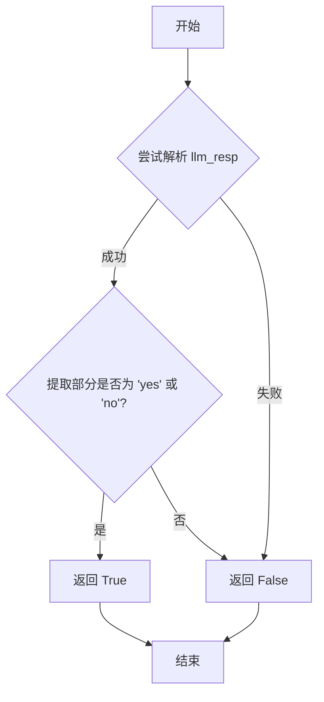
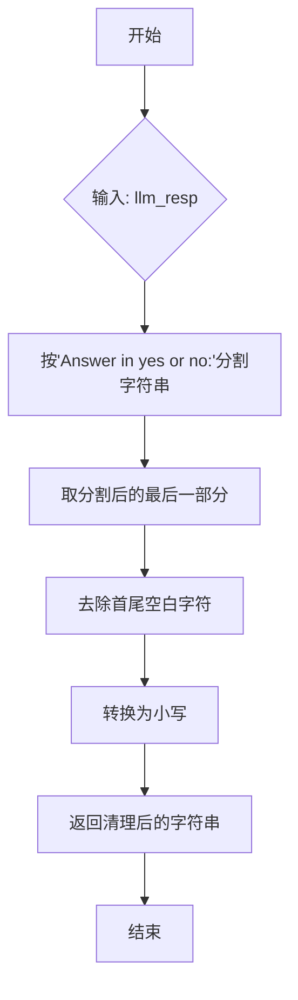
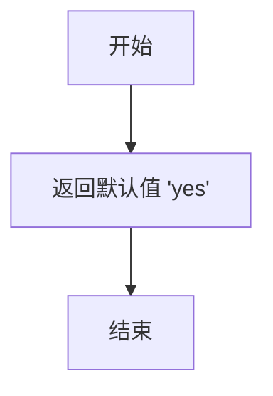
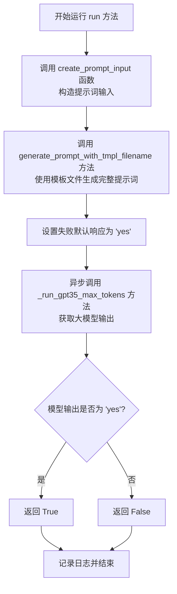
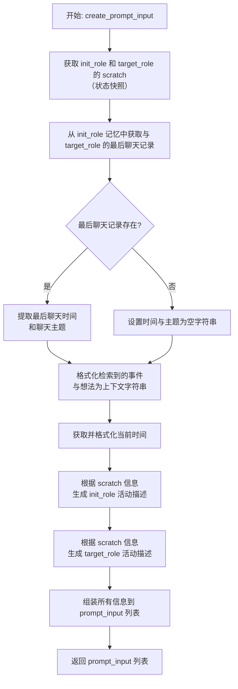

# `.\MetaGPT\metagpt\ext\stanford_town\actions\decide_to_talk.py` 详细设计文档

该代码实现了一个名为`DecideToTalk`的动作类，其核心功能是让一个角色（`init_role`）基于当前上下文、自身状态、目标角色（`target_role`）状态以及历史交互信息，通过调用大语言模型（GPT-3.5）来决定是否要与目标角色发起对话，并返回一个布尔值（`True`表示“是”，`False`表示“否”）。

## 整体流程

```mermaid
graph TD
    A[开始: run(init_role, target_role, retrieved)] --> B[调用create_prompt_input生成提示词输入]
    B --> C[调用generate_prompt_with_tmpl_filename组装完整提示词]
    C --> D[设置默认失败响应为'yes']
    D --> E[异步调用_run_gpt35_max_tokens获取LLM响应]
    E --> F{LLM响应是否有效?}
    F -- 是 --> G[调用_func_cleanup清洗响应]
    F -- 否 --> H[返回_func_fail_default_resp默认值'yes']
    G --> I[判断清洗后响应是否为'yes']
    I -- 是 --> J[返回True]
    I -- 否 --> K[返回False]
    H --> J
    J --> L[记录日志并结束]
    K --> L
```

## 类结构

```
STAction (基类)
└── DecideToTalk (决定是否对话的动作类)
```

## 全局变量及字段


### `logger`
    
用于记录日志的全局日志记录器实例。

类型：`Logger`
    


### `DecideToTalk.name`
    
动作的名称，固定为'DecideToTalk'。

类型：`str`
    
    

## 全局函数及方法

### `DecideToTalk._func_validate`

该方法用于验证大语言模型（LLM）对“是否决定交谈”提示的响应格式是否有效。它检查响应字符串是否包含“Answer in yes or no:”部分，并且该部分之后的内容是否为“yes”或“no”（不区分大小写）。如果响应格式正确，则返回 `True`，否则返回 `False`。

参数：

- `llm_resp`：`str`，大语言模型返回的原始响应字符串。
- `prompt`：`str`，发送给大语言模型的提示词（在此方法中未使用）。

返回值：`bool`，表示响应格式是否有效。`True` 表示响应格式正确（包含“yes”或“no”），`False` 表示格式不正确。

#### 流程图



#### 带注释源码

```python
def _func_validate(self, llm_resp: str, prompt: str) -> bool:
    resp = False  # 初始化返回值为 False，假设验证失败
    try:
        # 1. 尝试按“Answer in yes or no:”分割字符串，取最后一部分。
        # 2. 去除该部分首尾的空白字符。
        # 3. 将其转换为小写。
        # 4. 检查它是否等于“yes”或“no”。
        if llm_resp.split("Answer in yes or no:")[-1].strip().lower() in ["yes", "no"]:
            resp = True  # 如果匹配，则将返回值设为 True
    except ValueError:
        # 如果分割操作引发 ValueError（例如字符串中不包含分隔符），则忽略异常，resp 保持为 False
        pass
    return resp  # 返回验证结果
```

### `DecideToTalk._func_cleanup`

该方法用于清理和提取大语言模型（LLM）的响应文本。它从包含特定引导字符串 `"Answer in yes or no:"` 的原始响应中，提取出 `"yes"` 或 `"no"` 的最终答案，并将其转换为小写字符串。

参数：

- `llm_resp`：`str`，大语言模型返回的原始响应文本。
- `prompt`：`str`，发送给大语言模型的提示词（在此方法中未使用）。

返回值：`str`，清理和提取后的最终答案，为小写的 `"yes"` 或 `"no"`。

#### 流程图



#### 带注释源码

```python
def _func_cleanup(self, llm_resp: str, prompt: str) -> str:
    # 1. 使用 "Answer in yes or no:" 作为分隔符，将原始响应 `llm_resp` 分割成多个部分。
    # 2. 取分割后的最后一个部分（即引导词之后的答案部分）。
    # 3. 使用 `.strip()` 方法去除该部分字符串首尾的空白字符（如空格、换行符）。
    # 4. 使用 `.lower()` 方法将字符串统一转换为小写，确保返回值为 "yes" 或 "no"。
    return llm_resp.split("Answer in yes or no:")[-1].strip().lower()
```


### `DecideToTalk._func_fail_default_resp`

该方法定义了当大语言模型（LLM）的响应无法通过验证（`_func_validate`）或清理（`_func_cleanup`）时，作为默认回退策略返回的字符串值。它提供了一个简单、保守的默认决策，以确保动作逻辑在异常情况下仍能继续执行。

参数：
- 无

返回值：`str`，返回字符串 `"yes"`，表示在无法确定时，默认选择“是”（即决定进行对话）。

#### 流程图



#### 带注释源码

```python
    def _func_fail_default_resp(self) -> str:
        # 当LLM响应验证或清理失败时，返回的默认值。
        # 选择“yes”作为默认值，是一个保守的决策，倾向于允许对话发生。
        return "yes"
```


### `DecideToTalk.run`

该方法用于决定一个角色（`init_role`）是否应该与另一个角色（`target_role`）进行对话。它基于两个角色的当前状态、记忆中的过往互动以及从记忆中检索到的相关事件和想法，构造一个提示词（prompt）并调用大语言模型（GPT-3.5）来生成一个“yes”或“no”的决策。最终返回一个布尔值，表示是否发起对话。

参数：
- `init_role`：`STRole`，发起决策的角色对象。
- `target_role`：`STRole`，目标对话角色对象。
- `retrieved`：`dict`，一个字典，包含从记忆中检索到的相关事件（`events`）和想法（`thoughts`）节点。
- `*args`：`Any`，可变位置参数。
- `**kwargs`：`Any`，可变关键字参数。

返回值：`bool`，如果决策结果为“yes”则返回`True`，否则返回`False`。

#### 流程图



#### 带注释源码

```python
async def run(self, init_role: "STRole", target_role: "STRole", retrieved: dict, *args, **kwargs) -> bool:
    """Run action"""

    # 内部函数：根据输入参数构造发送给大语言模型的提示词输入列表。
    def create_prompt_input(init_role: "STRole", target_role: "STRole", retrieved: dict) -> str:
        # 获取发起角色和目标角色的“草稿”信息，通常包含当前状态、计划等。
        scratch = init_role.rc.scratch
        target_scratch = target_role.rc.scratch
        
        # 获取两个角色之间的最后一次聊天记录。
        last_chat = init_role.rc.memory.get_last_chat(target_role.name)
        last_chatted_time = ""
        last_chat_about = ""
        if last_chat:
            # 格式化最后聊天时间。
            last_chatted_time = last_chat.created.strftime("%B %d, %Y, %H:%M:%S")
            # 获取最后聊天的主题。
            last_chat_about = last_chat.description

        # 构建上下文：整合检索到的事件和想法。
        context = ""
        for c_node in retrieved["events"]:
            # 调整事件描述文本的时态（例如，将“is”改为“was”）。
            curr_desc = c_node.description.split(" ")
            curr_desc[2:3] = ["was"]
            curr_desc = " ".join(curr_desc)
            context += f"{curr_desc}. "
        context += "\n"
        for c_node in retrieved["thoughts"]:
            context += f"{c_node.description}. "

        # 获取当前时间并格式化。
        curr_time = scratch.curr_time.strftime("%B %d, %Y, %H:%M:%S %p")
        
        # 处理发起角色的当前活动描述。
        init_act_desc = scratch.act_description
        if "(" in init_act_desc:
            init_act_desc = init_act_desc.split("(")[-1][:-1]

        # 根据发起角色的状态（是否在计划路径中、是否在等待）生成其状态描述。
        if len(scratch.planned_path) == 0 and "waiting" not in init_act_desc:
            init_p_desc = f"{init_role.name} is already {init_act_desc}"
        elif "waiting" in init_act_desc:
            init_p_desc = f"{init_role.name} is {init_act_desc}"
        else:
            init_p_desc = f"{init_role.name} is on the way to {init_act_desc}"

        # 处理目标角色的当前活动描述。
        target_act_desc = scratch.act_description
        if "(" in target_act_desc:
            target_act_desc = target_act_desc.split("(")[-1][:-1]

        # 根据目标角色的状态生成其状态描述。
        # 注意：这里有一个潜在的逻辑错误，第86行判断的是 `init_act_desc` 而非 `target_act_desc`。
        if len(target_scratch.planned_path) == 0 and "waiting" not in init_act_desc:
            target_p_desc = f"{target_role.name} is already {target_act_desc}"
        elif "waiting" in init_act_desc:
            target_p_desc = f"{init_role.name} is {init_act_desc}"
        else:
            target_p_desc = f"{target_role.name} is on the way to {target_act_desc}"

        # 将所有构造好的信息片段组合成提示词输入列表。
        prompt_input = []
        prompt_input += [context]
        prompt_input += [curr_time]
        prompt_input += [init_role.name]
        prompt_input += [target_role.name]
        prompt_input += [last_chatted_time]
        prompt_input += [last_chat_about]
        prompt_input += [init_p_desc]
        prompt_input += [target_p_desc]
        prompt_input += [init_role.name]
        prompt_input += [target_role.name]
        return prompt_input

    # 1. 构造提示词输入。
    prompt_input = create_prompt_input(init_role, target_role, retrieved)
    # 2. 使用指定的模板文件生成最终的提示词字符串。
    prompt = self.generate_prompt_with_tmpl_filename(
        prompt_input=prompt_input, tmpl_filename="decide_to_talk_v2.txt"
    )
    # 3. 设置当大模型响应验证失败时的默认返回值。
    self.fail_default_resp = self._func_fail_default_resp()
    # 4. 异步调用大语言模型（GPT-3.5），限制最大输出token数为20，获取“yes”或“no”的响应。
    output = await self._run_gpt35_max_tokens(prompt, max_tokens=20)  # yes or no
    # 5. 将模型输出转换为布尔值。
    result = True if output == "yes" else False
    # 6. 记录决策日志。
    logger.info(f"Role: {init_role.name} Action: {self.cls_name} output: {result}")
    # 7. 返回决策结果。
    return result
```

### `DecideToTalk.create_prompt_input`

`DecideToTalk.create_prompt_input` 是一个嵌套在 `DecideToTalk.run` 方法中的内部函数。它的核心功能是根据发起对话的角色 (`init_role`)、目标角色 (`target_role`) 以及检索到的相关记忆 (`retrieved`)，构造一个用于输入给大语言模型 (LLM) 的提示信息列表。该列表包含了决定是否发起对话所需的各种上下文信息，如角色当前状态、历史交互、环境事件和想法等。

参数：

- `init_role`：`STRole`，发起对话的角色对象，包含其状态、记忆和行为计划。
- `target_role`：`STRole`，目标对话角色对象，包含其状态和行为计划。
- `retrieved`：`dict`，一个字典，包含从记忆中检索到的与当前决策相关的“事件” (`events`) 和“想法” (`thoughts`) 节点。

返回值：`list`，一个字符串列表，包含了格式化后的上下文信息、当前时间、角色信息、上次聊天记录以及角色当前活动描述，这些将作为提示词模板的输入。

#### 流程图



#### 带注释源码

```python
def create_prompt_input(init_role: "STRole", target_role: "STRole", retrieved: dict) -> str:
    # 获取两个角色的当前状态快照（scratch），其中包含计划路径、当前行为描述等信息。
    scratch = init_role.rc.scratch
    target_scratch = target_role.rc.scratch

    # 从发起角色的记忆中，获取与目标角色最近的一次聊天记录。
    last_chat = init_role.rc.memory.get_last_chat(target_role.name)
    last_chatted_time = ""
    last_chat_about = ""
    # 如果存在上次聊天记录，则从中提取格式化的时间和聊天主题。
    if last_chat:
        last_chatted_time = last_chat.created.strftime("%B %d, %Y, %H:%M:%S")
        last_chat_about = last_chat.description

    # 构建上下文字符串。
    context = ""
    # 处理检索到的事件节点：将描述中的“is”改为“was”，使其成为过去时态，并拼接。
    for c_node in retrieved["events"]:
        curr_desc = c_node.description.split(" ")
        curr_desc[2:3] = ["was"]
        curr_desc = " ".join(curr_desc)
        context += f"{curr_desc}. "
    context += "\n"
    # 直接拼接检索到的想法节点描述。
    for c_node in retrieved["thoughts"]:
        context += f"{c_node.description}. "

    # 获取并格式化当前时间。
    curr_time = scratch.curr_time.strftime("%B %d, %Y, %H:%M:%S %p")

    # 生成发起角色(init_role)的当前活动描述。
    init_act_desc = scratch.act_description
    # 如果描述中包含括号，则提取括号内的内容作为核心活动。
    if "(" in init_act_desc:
        init_act_desc = init_act_desc.split("(")[-1][:-1]
    # 根据计划路径和活动描述，生成更自然的语言描述。
    if len(scratch.planned_path) == 0 and "waiting" not in init_act_desc:
        init_p_desc = f"{init_role.name} is already {init_act_desc}"
    elif "waiting" in init_act_desc:
        init_p_desc = f"{init_role.name} is {init_act_desc}"
    else:
        init_p_desc = f"{init_role.name} is on the way to {init_act_desc}"

    # 生成目标角色(target_role)的当前活动描述（逻辑与上方类似，但存在一个潜在错误）。
    target_act_desc = scratch.act_description  # 错误：这里应该使用 target_scratch.act_description
    if "(" in target_act_desc:
        target_act_desc = target_act_desc.split("(")[-1][:-1]
    # 生成目标角色描述时，错误地引用了 init_act_desc 而不是 target_act_desc。
    if len(target_scratch.planned_path) == 0 and "waiting" not in init_act_desc: # 错误：应检查 target_act_desc
        target_p_desc = f"{target_role.name} is already {target_act_desc}"
    elif "waiting" in init_act_desc: # 错误：应检查 target_act_desc
        target_p_desc = f"{init_role.name} is {init_act_desc}" # 错误：描述串用了错误的角色名和活动
    else:
        target_p_desc = f"{target_role.name} is on the way to {target_act_desc}"

    # 将以上所有处理好的信息按顺序组装成一个列表，作为最终返回的提示词输入。
    prompt_input = []
    prompt_input += [context]
    prompt_input += [curr_time]
    prompt_input += [init_role.name]
    prompt_input += [target_role.name]
    prompt_input += [last_chatted_time]
    prompt_input += [last_chat_about]
    prompt_input += [init_p_desc]
    prompt_input += [target_p_desc]
    prompt_input += [init_role.name]
    prompt_input += [target_role.name]
    return prompt_input
```

## 关键组件


### STAction基类

作为所有斯坦福小镇动作的抽象基类，定义了动作执行的标准接口和验证、清理、默认响应等通用行为框架。

### 角色决策逻辑

通过分析当前时间、角色状态、过往交互记录和记忆检索信息，动态构建提示词，驱动LLM判断一个角色是否应该与另一个角色发起对话。

### 提示词工程模板

使用外部模板文件`decide_to_talk_v2.txt`，将结构化的上下文信息（如事件、想法、角色描述、最后聊天时间）格式化为LLM可理解的指令，以引导其做出“是/否”的二元决策。

### LLM响应验证与清理

包含对LLM输出的验证机制（`_func_validate`），确保响应格式为“yes”或“no”，并提供相应的清理方法（`_func_cleanup`）来提取有效答案，以及失败时的默认响应（`_func_fail_default_resp`）。

### 异步执行与日志记录

采用异步方式（`async run`）执行核心决策流程，调用GPT-3.5模型并限制token数量以优化成本与响应速度，同时记录关键决策日志以供追踪和分析。


## 问题及建议


### 已知问题

-   **硬编码的提示词模板文件名**：`run` 方法中直接使用了硬编码的字符串 `"decide_to_talk_v2.txt"` 作为模板文件名。这降低了代码的灵活性和可维护性，如果模板文件需要重命名或存在多个版本，必须修改源代码。
-   **脆弱的响应解析逻辑**：`_func_validate` 和 `_func_cleanup` 方法依赖于 LLM 响应中必须包含 `"Answer in yes or no:"` 这个特定字符串来进行分割和验证。如果 LLM 的响应格式稍有变化（例如，使用不同的引导词或标点），解析就会失败，导致默认返回 `"yes"`，这可能引入非预期的行为。
-   **逻辑错误与变量误用**：在 `create_prompt_input` 函数中，构建 `target_p_desc`（目标角色描述）时，错误地使用了 `init_act_desc` 和 `init_role.name` 来判断目标角色的状态。这会导致生成的目标角色描述不准确，可能影响决策的合理性。
-   **魔法数字**：`_run_gpt35_max_tokens` 调用中使用了硬编码的 `max_tokens=20`。这个数字缺乏上下文说明，如果未来模型或需求变化，调整起来不够直观。
-   **缺乏类型注解**：`run` 方法的参数 `init_role` 和 `target_role` 使用了字符串前向引用 `"STRole"`，但未在文件顶部导入或定义。虽然运行时可能通过其他方式解决，但这不利于静态类型检查工具（如 mypy）的分析和 IDE 的智能提示。

### 优化建议

-   **将模板文件名参数化**：建议将模板文件名作为类属性（如 `tmpl_name: str = "decide_to_talk_v2.txt"`）或 `run` 方法的参数。这样可以在不修改核心代码的情况下，通过继承或传参来更换模板，提高可配置性。
-   **增强响应解析的鲁棒性**：改进 `_func_validate` 和 `_func_cleanup` 方法。验证逻辑可以改为检查响应是否以 `"yes"` 或 `"no"`（不区分大小写）结尾或包含，而不强依赖特定前缀。清理逻辑可以使用正则表达式更灵活地提取 `yes/no` 答案。
-   **修复描述生成的逻辑错误**：修正 `create_prompt_input` 函数中 `target_p_desc` 的生成逻辑。应使用 `target_act_desc` 和 `target_scratch` 来判断目标角色的状态，确保描述信息的准确性。
-   **用常量替换魔法数字**：将 `max_tokens=20` 定义为一个类常量（如 `DEFAULT_MAX_TOKENS = 20`），并在调用处使用该常量。这提高了代码的可读性和可维护性。
-   **补充类型注解并考虑导入**：在文件顶部添加 `from typing import TYPE_CHECKING`，并在 `if TYPE_CHECKING:` 块内导入 `STRole` 类，以提供完整的类型注解，改善开发体验和代码质量。
-   **考虑添加更详细的日志**：当前日志仅记录了最终布尔结果。建议在解析 LLM 原始响应（`output`）时也进行记录，特别是在验证失败或使用默认响应时，这有助于调试和监控模型行为。
-   **评估默认响应策略**：当前验证失败时默认返回 `"yes"` (`_func_fail_default_resp`)。需要根据业务逻辑评估这是否是最佳策略。或许在某些场景下，默认 `"no"` 或抛出异常让上层处理更为合适。


## 其它


### 设计目标与约束

该代码的设计目标是实现一个决策代理，用于判断一个角色（`init_role`）是否应该与另一个角色（`target_role`）进行对话。其核心约束包括：
1.  **决策依据**：决策必须基于给定的上下文信息，包括两个角色的当前状态、历史交互记录以及从记忆中检索到的相关事件和想法。
2.  **输出确定性**：决策结果必须是一个明确的布尔值（`True` 或 `False`），对应“是”或“否”。
3.  **LLM集成**：依赖大型语言模型（GPT-3.5）进行推理，但通过严格的输入输出验证和清理来确保结果的可靠性。
4.  **错误恢复**：当LLM响应不符合预期格式时，提供默认的“是”（`yes`）作为后备响应，确保流程不会中断。
5.  **性能约束**：通过限制LLM响应的最大令牌数（`max_tokens=20`）来控制调用成本和响应时间。

### 错误处理与异常设计

代码通过以下机制处理错误和异常：
1.  **LLM响应验证 (`_func_validate`)**：检查LLM的原始响应字符串是否以“Answer in yes or no:”为分隔符，并且分隔后的最后部分是否为“yes”或“no”。如果格式不符，则验证失败，返回 `False`。
2.  **响应清理 (`_func_cleanup`)**：在验证通过后，从LLM响应中提取出“yes”或“no”的纯净字符串。
3.  **默认失败响应 (`_func_fail_default_resp`)**：当验证失败时，提供一个默认的“yes”字符串作为决策结果，确保 `run` 方法能继续执行并返回一个布尔值。
4.  **异常捕获**：在 `_func_validate` 中使用 `try...except ValueError` 块来捕获潜在的字符串操作异常（如 `split` 操作失败），并在异常发生时安全地返回 `False`。
5.  **日志记录**：在 `run` 方法的最后，使用 `logger.info` 记录决策的输入角色和最终输出结果，便于调试和监控。

### 数据流与状态机

1.  **数据输入**：
    *   `init_role`: 发起决策的角色对象。
    *   `target_role`: 目标对话角色对象。
    *   `retrieved`: 一个字典，包含从记忆中检索到的相关“事件”和“想法”节点列表。
2.  **内部数据处理流程**：
    a.  **提示词构建 (`create_prompt_input`)**：整合输入参数，生成一个结构化的字符串列表作为LLM的输入上下文。这包括：检索到的事件和想法、当前时间、两个角色的姓名、上次聊天的时间和内容、以及两个角色当前活动的描述。
    b.  **模板渲染**：使用 `generate_prompt_with_tmpl_filename` 方法将上一步的列表与外部模板文件（`decide_to_talk_v2.txt`）结合，生成最终的LLM提示词。
    c.  **LLM调用与响应处理**：调用 `_run_gpt35_max_tokens` 获取LLM响应。响应首先经过 `_func_validate` 验证，若通过则用 `_func_cleanup` 清理，否则使用 `_func_fail_default_resp` 提供的默认值。
3.  **状态转换**：本类本身不维护内部状态。它作为一个无状态的“动作”执行器，其输出（布尔值）会直接影响调用者（可能是角色或更高层级的协调器）的后续行为状态（例如，从“空闲”或“移动”状态转换为“准备对话”状态）。
4.  **数据输出**：一个布尔值，表示 `init_role` 是否应该与 `target_role` 交谈。

### 外部依赖与接口契约

1.  **父类依赖 (`STAction`)**：继承自 `STAction`，依赖于其定义的框架性方法，如 `generate_prompt_with_tmpl_filename` 和 `_run_gpt35_max_tokens`。
2.  **LLM服务依赖**：通过父类方法 `_run_gpt35_max_tokens` 隐式依赖一个能够处理GPT-3.5请求的外部服务或API。
3.  **模板文件依赖**：依赖位于外部文件系统中的模板文件 `decide_to_talk_v2.txt`。该文件的路径和内容格式构成了一个隐式接口契约。
4.  **角色对象接口契约**：
    *   `STRole` 对象必须包含 `rc.scratch` 属性，该属性下需有 `curr_time` (datetime), `act_description` (str), `planned_path` (list) 等字段。
    *   `STRole` 对象必须包含 `rc.memory` 属性，且该属性需有 `get_last_chat` 方法，返回一个具有 `created` (datetime) 和 `description` (str) 属性的对象。
5.  **检索数据接口契约**：`retrieved` 参数必须是一个字典，且至少包含键为 `"events"` 和 `"thoughts"` 的项，它们的值应为可迭代对象，其中的元素需具有 `description` (str) 属性。

    