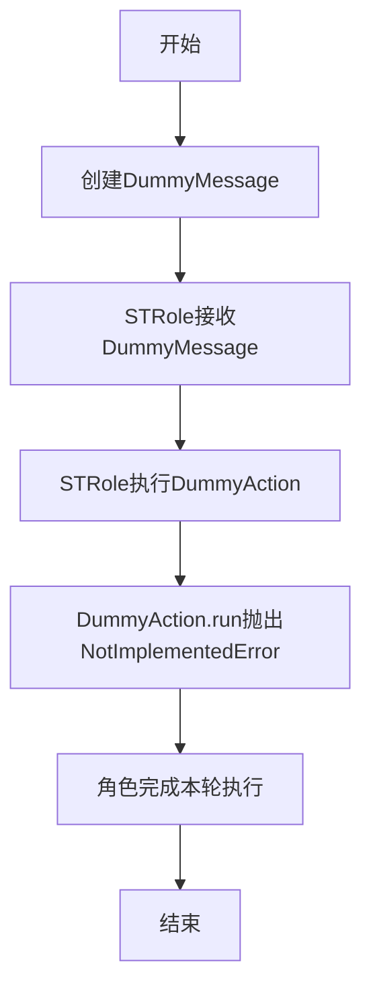
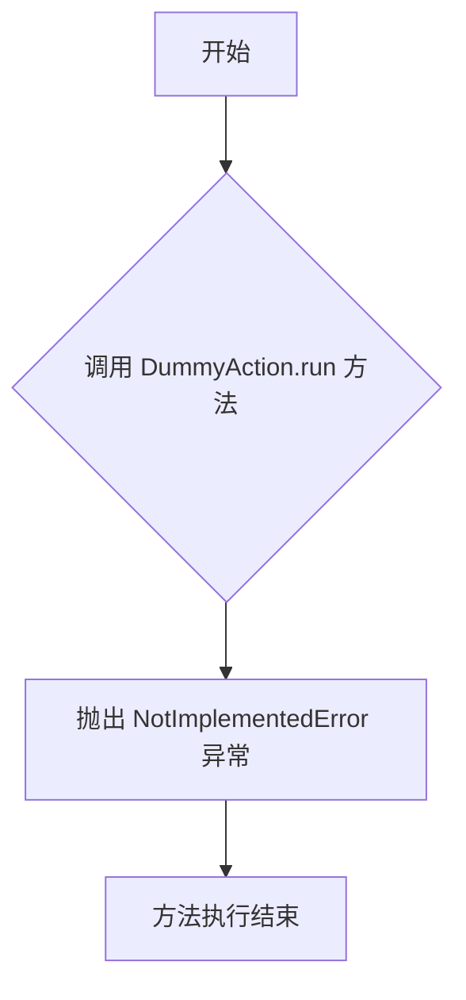

# `.\MetaGPT\metagpt\ext\stanford_town\actions\dummy_action.py` 详细设计文档

该代码定义了一个虚拟动作（DummyAction）和虚拟消息（DummyMessage），用于在MetaGPT框架中确保每个角色（STRole）在每个执行轮次都能处理消息，即使没有实际任务需要执行。DummyAction是一个占位符动作，其run方法抛出NotImplementedError，而DummyMessage是一个预定义内容的Message子类，用于触发角色的处理流程。

## 整体流程



## 类结构

```
Action (基类)
└── DummyAction
Message (基类)
└── DummyMessage
```

## 全局变量及字段


### `DummyMessage.content`
    
消息的内容，默认为字符串 'dummy'，用于在角色间传递一个占位符消息以触发每轮执行。

类型：`str`
    


### `DummyMessage.cause_by`
    
指示消息由哪个动作类触发，默认为字符串 'DummyAction'，用于标识消息的来源。

类型：`str`
    
    

## 全局函数及方法


### `DummyAction.run`

`DummyAction.run` 是 `DummyAction` 类的异步方法，其核心设计目的是作为一个占位符或抽象方法，强制引发 `NotImplementedError` 异常。这表明该方法的具体实现应由子类提供，而 `DummyAction` 类本身不执行任何实际的操作逻辑。它通常用于定义一个动作（Action）的接口或基类，确保子类必须重写此方法以实现具体的功能。

参数：

-  `*args`：`tuple`，可变位置参数，用于接收任意数量的位置参数，但在此方法中未被使用。
-  `**kwargs`：`dict`，可变关键字参数，用于接收任意数量的关键字参数，但在此方法中未被使用。

返回值：`None`，此方法不返回任何值，而是直接抛出 `NotImplementedError` 异常。

#### 流程图



#### 带注释源码

```python
async def run(self, *args, **kwargs):
    # 该方法被设计为必须由子类重写以实现具体功能。
    # 当直接调用基类的 run 方法时，会抛出 NotImplementedError 异常，
    # 提示开发者该方法尚未实现。
    raise NotImplementedError
```


## 关键组件


### DummyAction

一个占位符动作类，用于在系统中触发一个未实现的操作，通常用于测试或作为其他动作的基类。

### DummyMessage

一个虚拟消息类，用于在角色之间传递一个占位符消息，确保每个角色在每个回合都能执行一次，即使没有实际的消息需要处理。


## 问题及建议


### 已知问题

-   **功能缺失的基类**：`DummyAction` 类继承了 `Action` 并重写了 `run` 方法，但该方法仅抛出一个 `NotImplementedError` 异常。这违背了基类 `Action` 的设计初衷（提供一个可执行的动作），使得 `DummyAction` 本身无法完成任何实际工作，其存在仅是为了满足消息传递的 `cause_by` 类型匹配，这是一种设计上的妥协。
-   **潜在的运行时错误**：如果代码中意外地直接调用了 `DummyAction.run()` 方法，程序会立即抛出 `NotImplementedError` 异常，导致进程中断。这增加了代码的脆弱性。
-   **语义模糊**：`DummyMessage` 的 `content` 字段被固定为字符串 `"dummy"`。虽然当前逻辑可能不依赖其内容，但这限制了消息携带额外上下文信息的能力。如果未来需要基于 `DummyMessage` 的内容做出简单决策，当前设计无法支持。

### 优化建议

-   **重构 `DummyAction` 的角色**：建议将 `DummyAction` 重命名为更能反映其真实目的的类，例如 `NoOpAction` (No-Operation Action) 或 `TriggerAction`。其 `run` 方法应被实现为一个空操作（例如 `return “”` 或 `pass`），明确表示此动作不执行任何业务逻辑，仅用于触发角色（Role）的思考与响应循环。这消除了潜在的运行时异常风险，并使类的行为符合其名称的预期。
-   **增强 `DummyMessage` 的灵活性**：考虑将 `DummyMessage` 的 `content` 字段默认值设为空字符串 `""`，并允许在构造时传入自定义内容。这样既保持了向后兼容性（不传参时行为不变），又为未来可能的扩展提供了空间，例如传递一个简单的指令或状态标识。
-   **补充文档说明**：在 `DummyAction` 和 `DummyMessage` 的类文档字符串中，应更清晰地说明它们在系统中的作用——即作为驱动角色执行循环的“触发器”或“心跳信号”，而非执行具体任务。这有助于其他开发者理解其设计意图，避免误用。


## 其它


### 设计目标与约束

该代码的设计目标是提供一个占位符机制，确保在MetaGPT框架中，每个STRole（角色）都能处理由DummyAction（虚拟动作）产生的DummyMessage（虚拟消息），从而保证角色在每个执行轮次中都能被触发。主要约束包括：
1.  **向后兼容性**：DummyAction和DummyMessage需要与现有的Action和Message基类保持兼容，确保框架其他部分能正常识别和处理它们。
2.  **最小侵入性**：作为占位符，其实现应尽可能简单，不引入复杂的逻辑或状态，以避免对系统核心流程造成干扰。
3.  **明确标识**：DummyMessage需要具有明确的类型标识（如特定的`cause_by`字段），以便在消息路由和处理逻辑中能被正确识别为虚拟消息。

### 错误处理与异常设计

当前代码的错误处理设计如下：
1.  **DummyAction.run方法**：直接抛出`NotImplementedError`异常。这是一个明确的设计选择，旨在强制任何尝试直接执行DummyAction的代码必须处理此异常或避免调用。它充当了一个安全机制，防止DummyAction被误用为实际的功能性动作。
2.  **DummyMessage**：作为数据类，其错误处理主要依赖于父类`Message`的机制。DummyMessage本身没有定义额外的验证逻辑，因此依赖于使用方确保其内容符合预期（例如，`content`字段保持为"dummy"）。

潜在的改进是，如果框架期望DummyAction在某些场景下被安全地调用（例如，日志记录或调试），可以考虑将其`run`方法改为空实现（`pass`）或返回一个固定的无害值，而不是抛出异常，但这会改变其当前“禁止执行”的设计意图。

### 数据流与状态机

在MetaGPT框架的上下文中，DummyAction和DummyMessage参与的数据流和状态机如下：
1.  **数据流触发**：通常由系统调度器或某个协调组件在需要确保所有角色都被“唤醒”或推进一轮时，创建DummyMessage实例。
2.  **消息路由**：创建的DummyMessage被放入消息队列或直接分配给目标STRole。由于其`cause_by`字段为"DummyAction"，框架的消息路由逻辑能够识别并将其与DummyAction关联。
3.  **角色状态推进**：STRole在接收到DummyMessage后，会触发其反应链（`_react`）。在寻找处理该消息的Action时，会匹配到DummyAction（因为`cause_by`匹配）。虽然DummyAction.run会抛出异常，但角色或框架的异常处理逻辑应能捕获此异常并将其视为一个无害的、预期的占位操作，从而允许角色完成本轮的状态处理（可能更新内部状态、记录日志等），并准备好接收下一个真实的消息。
4.  **状态机循环**：此机制确保了即使没有外部真实事件，每个角色也能定期获得一个“心跳”信号，有助于维持基于回合的状态机或事件循环的运转，防止角色因等待永远不会到来的特定消息而“卡住”。

### 外部依赖与接口契约

1.  **继承依赖**：
    *   `DummyAction` 继承自 `metagpt.actions.Action`。它必须遵守Action基类的接口契约，特别是实现`run`方法（即使实现是抛出异常）。
    *   `DummyMessage` 继承自 `metagpt.schema.Message`。它必须与Message基类的数据模型兼容，并可以利用其序列化/反序列化、比较等方法。
2.  **框架耦合**：
    *   该代码紧密耦合于MetaGPT框架的特定设计模式，即角色（Role）通过消息（Message）的`cause_by`字段来查找并执行相应的动作（Action）。`DummyMessage.cause_by = "DummyAction"` 是这个契约的关键部分。
3.  **使用方契约**：
    *   任何创建DummyMessage的组件（如环境、调度器）都应将其`cause_by`设置为"DummyAction"。
    *   任何处理Message的组件（特别是STRole及其反应逻辑）需要能够正确处理`cause_by`为"DummyAction"的消息，通常意味着关联到DummyAction并容忍其`run`方法抛出的`NotImplementedError`（或进行捕获并忽略）。
    *   框架的其他部分不应依赖于DummyAction执行任何实际工作；它纯粹是一个占位符和触发器。

    