# `.\MetaGPT\metagpt\ext\stanford_town\actions\gen_action_details.py` 详细设计文档

该文件是MetaGPT框架中Stanford Town扩展的一部分，包含一系列用于生成角色动作详细信息的类。这些类继承自STAction基类，通过调用大语言模型（GPT-3.5）来生成动作的各个组成部分，包括发生地点（世界、区域、场所）、对象、发音符号、事件三元组以及对象描述等，最终组合成一个完整的动作详情字典。

## 整体流程

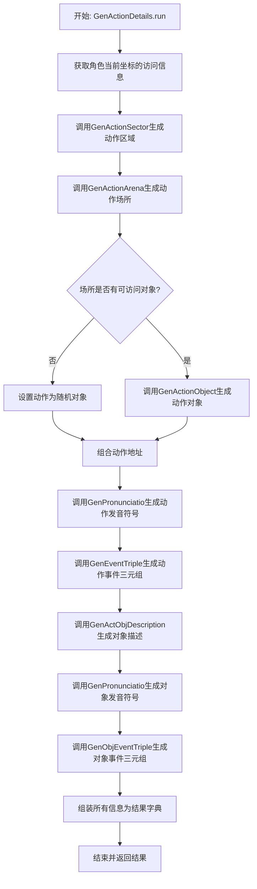

## 类结构

```
STAction (基类)
├── GenActionSector (生成动作区域)
├── GenActionArena (生成动作场所)
├── GenActionObject (生成动作对象)
├── GenPronunciatio (生成发音符号)
├── GenEventTriple (生成事件三元组)
├── GenActObjDescription (生成对象描述)
├── GenObjEventTriple (生成对象事件三元组)
└── GenActionDetails (生成动作详情，协调调用上述类)
```

## 全局变量及字段


### `GenActionSector.name`
    
动作类的标识名称，用于区分不同的动作生成器。

类型：`str`
    


### `GenActionArena.name`
    
动作类的标识名称，用于区分不同的动作生成器。

类型：`str`
    


### `GenActionObject.name`
    
动作类的标识名称，用于区分不同的动作生成器。

类型：`str`
    


### `GenPronunciatio.name`
    
动作类的标识名称，用于区分不同的动作生成器。

类型：`str`
    


### `GenEventTriple.name`
    
动作类的标识名称，用于区分不同的动作生成器。

类型：`str`
    


### `GenActObjDescription.name`
    
动作类的标识名称，用于区分不同的动作生成器。

类型：`str`
    


### `GenObjEventTriple.name`
    
动作类的标识名称，用于区分不同的动作生成器。

类型：`str`
    


### `GenActionDetails.name`
    
动作类的标识名称，用于区分不同的动作生成器。

类型：`str`
    
    

## 全局函数及方法

### `GenActionSector._func_cleanup`

该方法用于清理从大语言模型（LLM）返回的响应字符串。它通过截取第一个右花括号 `}` 之前的部分来提取有效内容，旨在去除响应中可能存在的多余格式或无关文本，确保返回的字符串是干净、可用的。

参数：

- `llm_resp`：`str`，从大语言模型获取的原始响应字符串。
- `prompt`：`str`，生成该响应时使用的提示词（在本方法中未使用）。

返回值：`str`，清理后的响应字符串，即原始响应中第一个 `}` 字符之前的部分。

#### 流程图

```mermaid
graph TD
    A[开始] --> B[输入参数 llm_resp]
    B --> C{llm_resp 是否包含 '}'?}
    C -- 是 --> D[使用 split 方法以 '}' 分割字符串]
    D --> E[取分割后的第一个元素作为 cleaned_response]
    E --> F[返回 cleaned_response]
    C -- 否 --> G[返回空字符串 '']
    G --> H[结束]
    F --> H
```

#### 带注释源码

```python
def _func_cleanup(self, llm_resp: str, prompt: str):
    # 使用 split 方法，以右花括号 '}' 为分隔符分割 llm_resp 字符串。
    # 分割后返回一个列表，取第一个元素（索引0），即第一个 '}' 之前的所有内容。
    # 这通常用于提取 LLM 响应中 JSON 格式或其他结构化数据的主体部分。
    cleaned_response = llm_resp.split("}")[0]
    # 返回清理后的字符串。
    return cleaned_response
```

### `GenActionSector._func_validate`

该方法用于验证大语言模型（LLM）对特定提示词（prompt）的响应（`llm_resp`）是否符合预期的格式要求。它执行一系列简单的格式检查，确保响应非空、包含特定字符且不包含特定字符，以判断响应是否有效。

参数：

- `llm_resp`：`str`，大语言模型返回的原始文本响应。
- `prompt`：`str`，生成该响应所使用的提示词文本。

返回值：`bool`，如果响应通过所有格式检查则返回 `True`，否则返回 `False`。

#### 流程图

```mermaid
graph TD
    A[开始验证] --> B{llm_resp.strip() 长度 < 1?};
    B -- 是 --> C[返回 False];
    B -- 否 --> D{llm_resp 包含 '}'?};
    D -- 否 --> C;
    D -- 是 --> E{llm_resp 包含 ','?};
    E -- 是 --> C;
    E -- 否 --> F[返回 True];
    C --> G[结束];
    F --> G;
```

#### 带注释源码

```python
    def _func_validate(self, llm_resp: str, prompt: str):
        # 检查1: 去除首尾空格后，响应是否为空字符串
        if len(llm_resp.strip()) < 1:
            return False
        # 检查2: 响应中是否包含结束大括号 '}'
        if "}" not in llm_resp:
            return False
        # 检查3: 响应中是否包含逗号 ',' (可能用于防止列表形式的无效响应)
        if "," in llm_resp:
            return False
        # 所有检查通过，返回 True 表示响应有效
        return True
```

### `GenActionSector._func_fail_default_resp`

该方法用于在生成行动区域（Sector）失败时，提供一个默认的返回值。它不接收任何参数，直接返回一个硬编码的字符串 `"kitchen"`，作为默认的行动区域。

参数：
- 无

返回值：`str`，返回一个固定的字符串 `"kitchen"`，表示默认的行动区域。

#### 流程图

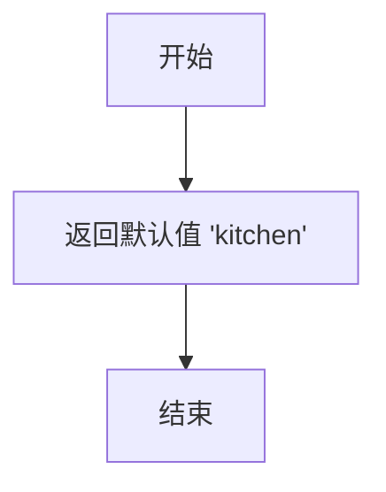

#### 带注释源码

```python
def _func_fail_default_resp(self):
    fs = "kitchen"  # 定义一个字符串变量 fs，赋值为 "kitchen"
    return fs  # 返回 fs 作为默认的行动区域
```


### `GenActionSector.run`

该方法根据角色（STRole）、可访问的瓦片信息（access_tile）和动作描述（act_desp），利用大语言模型（GPT-3.5）生成或确定一个最适合执行该动作的“区域”（Sector）。其核心逻辑是：首先构建一个提示词（prompt），其中包含角色信息、生活区域、可访问区域以及动作描述；然后将此提示词发送给LLM获取建议的区域；最后对LLM的输出进行验证和清洗，并确保返回的区域在角色实际可访问的范围内，如果不在则使用角色的生活区域作为默认值。

参数：

-  `role`：`STRole`，执行动作的角色对象，包含其记忆、状态等信息。
-  `access_tile`：`dict[str, str]`，一个字典，包含角色当前所在或可访问的瓦片信息，例如 `{'world': '世界名', 'sector': '区域名'}`。
-  `act_desp`：`str`，对将要执行的动作的文本描述。

返回值：`str`，生成的或最终确定的动作执行区域（Sector）名称。

#### 流程图

```mermaid
flowchart TD
    A[开始: run(role, access_tile, act_desp)] --> B[调用 create_prompt_input<br>构建提示词输入列表]
    B --> C[使用 prompt_template<br>生成完整提示词 prompt]
    C --> D[设置失败默认响应<br>self.fail_default_resp]
    D --> E{异步调用 _run_gpt35_max_tokens<br>获取LLM输出}
    E --> F[获取角色在 access_tile['world']<br>中所有可访问区域列表 x]
    F --> G{LLM输出 output 是否在<br>可访问列表 x 中?}
    G -- 是 --> H[记录日志并返回 output]
    G -- 否 --> I[将 output 设置为<br>角色的生活区域]
    I --> H
```

#### 带注释源码

```python
async def run(self, role: "STRole", access_tile: dict[str, str], act_desp: str):
    # 内部函数：根据输入参数构建发送给LLM的提示词所需的输入列表。
    def create_prompt_input(role, access_tile: dict[str, str], act_desp):
        act_world = f"{access_tile['world']}"  # 从瓦片信息中提取世界名称

        prompt_input = []  # 初始化提示词输入列表

        # 以下代码块（被注释的）似乎是早期的、更复杂的提示词构建逻辑。
        # 它添加了角色名、生活区域、可访问区域等信息。
        # prompt_input += [role.scratch.get_str_name()]
        # prompt_input += [role.scratch.living_area.split(":")[1]]
        # x = f"{act_world}:{role.scratch.living_area.split(':')[1]}"
        # prompt_input += [role.s_mem.get_str_accessible_sector_arenas(x)]
        # ... (更多行)

        # MAR 11 TEMP 注释表明这是一个临时修改。
        # 清空之前的输入，重新构建。
        prompt_input = []
        act_world = access_tile["world"]
        # 获取角色在该世界中所有可访问的区域字符串。
        accessible_sector_str = role.s_mem.get_str_accessible_sectors(act_world)
        curr = accessible_sector_str.split(", ")  # 分割成列表
        fin_accessible_sectors = []
        for i in curr:
            # 临时逻辑：如果区域名包含“'s house”，则只保留包含角色姓氏的区域。
            # 这可能是为了过滤掉其他角色的房子。
            if "'s house" in i:
                if role.scratch.last_name in i:
                    fin_accessible_sectors += [i]
            else:
                fin_accessible_sectors += [i]
        # 将过滤后的列表重新连接成字符串。
        accessible_sector_str = ", ".join(fin_accessible_sectors)
        # END MAR 11 TEMP

        # 将最终的可访问区域字符串加入提示词输入。
        prompt_input += [accessible_sector_str]

        # 处理动作描述：如果包含括号，则拆分为主要动作和对象/目标。
        act_desp_1 = act_desp
        act_desp_2 = act_desp
        if "(" in act_desp:
            act_desp_1 = act_desp.split("(")[0].strip()   # 括号前部分，如“正在睡觉”
            act_desp_2 = act_desp.split("(")[-1][:-1]     # 括号内部分，如“在床上”
        prompt_input += [role.scratch.get_str_name()]  # 角色名
        prompt_input += [act_desp_1]  # 动作描述1
        prompt_input += [act_desp_2]  # 动作描述2
        prompt_input += [role.scratch.get_str_name()]  # 角色名（再次）
        return prompt_input

    # 使用指定的模板文件生成完整的提示词。
    prompt_template = "action_location_sector_v1.txt"
    prompt_input = create_prompt_input(role, access_tile, act_desp)
    prompt = self.generate_prompt_with_tmpl_filename(prompt_input, prompt_template)

    # 设置LLM调用失败时的默认返回值。
    self.fail_default_resp = self._func_fail_default_resp()
    # 异步调用GPT-3.5，限制最大token数以控制输出长度。
    output = await self._run_gpt35_max_tokens(prompt, max_tokens=15)

    # 验证LLM返回的区域是否在角色实际可访问的列表中。
    y = f"{access_tile['world']}"
    # 获取角色在该世界中所有可访问的区域列表。
    x = [i.strip() for i in role.s_mem.get_str_accessible_sectors(y).split(",")]
    if output not in x:
        # 如果LLM返回的区域不可访问，有两种备选方案：
        # 1. 随机选择一个可访问区域（被注释掉）。
        # output = random.choice(x)
        # 2. 使用角色自己的生活区域作为默认值（当前采用）。
        output = role.scratch.living_area.split(":")[1]
    # 记录执行日志。
    logger.info(f"Role: {role.name} Action: {self.cls_name} output: {output}")
    # 返回最终确定的区域名称。
    return output
```


### `GenActionArena._func_cleanup`

该方法用于清理从大语言模型（LLM）获得的原始响应字符串。其核心逻辑是截取字符串中第一个右花括号 `}` 之前的部分，并返回该子字符串。这是一种简单的后处理步骤，旨在从可能包含额外格式或内容的响应中提取出核心的有效信息。

参数：

- `llm_resp`：`str`，从大语言模型获取的原始响应字符串。
- `prompt`：`str`，生成该响应所使用的提示词（在本方法中未使用）。

返回值：`str`，清理后的响应字符串，即原始字符串中第一个 `}` 之前的部分。

#### 流程图

```mermaid
graph TD
    A[开始] --> B{输入: llm_resp}
    B --> C[执行清理操作: cleaned_response = llm_resp.split('}')[0]]
    C --> D[返回 cleaned_response]
    D --> E[结束]
```

#### 带注释源码

```python
def _func_cleanup(self, llm_resp: str, prompt: str):
    # 将原始响应字符串按右花括号 '}' 分割，取分割后的第一部分（即第一个 '}' 之前的内容）
    cleaned_response = llm_resp.split("}")[0]
    # 返回清理后的字符串
    return cleaned_response
```

### `GenActionArena._func_validate`

该方法用于验证大语言模型（LLM）对特定提示词（prompt）的响应（`llm_resp`）是否符合预期的格式要求。它检查响应字符串是否非空、是否包含右花括号 `}` 以及是否不包含逗号 `,`。只有当所有条件都满足时，才认为响应有效。

参数：
- `llm_resp`：`str`，大语言模型返回的原始响应字符串。
- `prompt`：`str`，生成此响应所使用的提示词。在此方法中未直接使用，但作为接口的一部分保留。

返回值：`bool`，如果响应字符串满足所有验证条件则返回 `True`，否则返回 `False`。

#### 流程图

```mermaid
graph TD
    A[开始验证] --> B{llm_resp.strip长度 < 1?};
    B -- 是 --> C[返回 False];
    B -- 否 --> D{llm_resp 包含 '}'?};
    D -- 否 --> C;
    D -- 是 --> E{llm_resp 包含 ','?};
    E -- 是 --> C;
    E -- 否 --> F[返回 True];
    C --> G[结束];
    F --> G;
```

#### 带注释源码

```python
    def _func_validate(self, llm_resp: str, prompt: str):
        # 检查1: 响应字符串去除首尾空格后是否为空
        if len(llm_resp.strip()) < 1:
            return False
        # 检查2: 响应字符串中是否包含右花括号 '}'
        if "}" not in llm_resp:
            return False
        # 检查3: 响应字符串中是否包含逗号 ','
        if "," in llm_resp:
            return False
        # 所有检查通过，返回 True
        return True
```

### `GenActionArena._func_fail_default_resp`

该方法用于在生成行动场所（Arena）失败时，提供一个默认的响应值。

参数：
- 无参数

返回值：`str`，返回一个字符串 `"kitchen"`，作为默认的行动场所。

#### 流程图


#### 带注释源码

```python
def _func_fail_default_resp(self):
    fs = "kitchen"  # 定义一个字符串变量 fs，赋值为 "kitchen"
    return fs       # 返回 fs 作为默认的失败响应
```

### `GenActionArena.run`

该方法根据给定的角色、动作描述、世界和区域，生成一个合适的“场所”（Arena）名称。它通过构建提示词调用大语言模型（GPT-3.5）来生成候选场所，并对输出进行验证和过滤，确保生成的场所是角色在该世界和区域内可访问的。

参数：
- `role`：`STRole`，执行动作的角色对象，包含角色的记忆、状态等信息。
- `act_desp`：`str`，动作的描述文本，用于指导场所的生成。
- `act_world`：`str`，动作发生的世界名称。
- `act_sector`：`str`，动作发生的区域名称。

返回值：`str`，生成的、角色可访问的场所名称。

#### 流程图

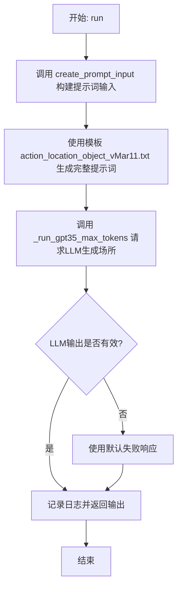

#### 带注释源码

```python
async def run(self, role: "STRole", act_desp: str, act_world: str, act_sector: str):
    # 内部函数：根据输入参数构建发送给LLM的提示词内容列表。
    def create_prompt_input(role, act_desp, act_world, act_sector):
        prompt_input = []
        prompt_input += [role.scratch.get_str_name()]  # 角色名
        x = f"{act_world}:{act_sector}"
        prompt_input += [act_sector]  # 区域名

        # MAR 11 TEMP: 临时逻辑，过滤角色可访问的场所列表。
        # 获取角色在该世界-区域下可访问的所有场所字符串。
        accessible_arena_str = role.s_mem.get_str_accessible_sector_arenas(x)
        curr = accessible_arena_str.split(", ")
        fin_accessible_arenas = []
        for i in curr:
            # 如果场所名包含“'s room”，则检查是否属于该角色的姓氏。
            if "'s room" in i:
                if role.scratch.last_name in i:
                    fin_accessible_arenas += [i]
            else:
                fin_accessible_arenas += [i]
        # 将过滤后的列表重新组合成字符串。
        accessible_arena_str = ", ".join(fin_accessible_arenas)
        # END MAR 11 TEMP
        prompt_input += [accessible_arena_str]  # 可访问的场所列表

        # 处理动作描述：如果包含括号，则拆分为主要动作和对象。
        act_desp_1 = act_desp
        act_desp_2 = act_desp
        if "(" in act_desp:
            act_desp_1 = act_desp.split("(")[0].strip()  # 主要动作
            act_desp_2 = act_desp.split("(")[-1][:-1]    # 动作对象
        prompt_input += [role.scratch.get_str_name()]  # 角色名（再次）
        prompt_input += [act_desp_1]  # 主要动作描述
        prompt_input += [act_desp_2]  # 动作对象描述
        prompt_input += [role.scratch.get_str_name()]  # 角色名（第三次）

        prompt_input += [act_sector]  # 区域名（再次）
        prompt_input += [accessible_arena_str]  # 可访问的场所列表（再次）
        return prompt_input

    # 指定使用的提示词模板文件。
    prompt_template = "action_location_object_vMar11.txt"
    # 构建提示词输入列表。
    prompt_input = create_prompt_input(role, act_desp, act_world, act_sector)
    # 使用模板和输入生成最终的提示词字符串。
    prompt = self.generate_prompt_with_tmpl_filename(prompt_input, prompt_template)
    # 设置默认的失败响应（例如，当LLM调用失败时返回“kitchen”）。
    self.fail_default_resp = self._func_fail_default_resp()
    # 调用GPT-3.5模型，生成最多15个token的响应。
    output = await self._run_gpt35_max_tokens(prompt, max_tokens=15)
    # 记录生成结果到日志。
    logger.info(f"Role: {role.name} Action: {self.cls_name} output: {output}")
    # 返回生成的场所名称。
    return output
```

### `GenActionObject._func_validate`

该方法用于验证大语言模型（LLM）对生成动作对象（Action Object）的响应是否有效。它检查响应字符串是否非空，仅此一项条件满足即视为有效。

参数：

- `llm_resp`：`str`，大语言模型返回的原始响应字符串。
- `prompt`：`str`，生成此响应所使用的提示词（在本方法中未使用）。

返回值：`bool`，如果响应字符串去除首尾空格后长度大于0，则返回 `True`，否则返回 `False`。

#### 流程图

```mermaid
graph TD
    A[开始] --> B{llm_resp.strip() 长度是否 >= 1?};
    B -- 是 --> C[返回 True];
    B -- 否 --> D[返回 False];
```

#### 带注释源码

```python
def _func_validate(self, llm_resp: str, prompt: str):
    # 检查去除首尾空格后的响应字符串长度是否大于0。
    # 这是该类中唯一需要的验证条件，与同文件其他类的验证逻辑（如检查'}'或','）不同。
    if len(llm_resp.strip()) < 1:
        return False
    return True
```

### `GenActionObject._func_cleanup`

该方法用于清理和格式化从大语言模型（LLM）获得的原始响应文本。它通过去除字符串两端的空白字符，确保返回一个干净、无多余空格的字符串。

参数：
- `llm_resp`：`str`，从LLM获取的原始响应字符串。
- `prompt`：`str`，生成响应时使用的提示词（在此方法中未使用）。

返回值：`str`，清理后的字符串，已去除首尾空白字符。

#### 流程图

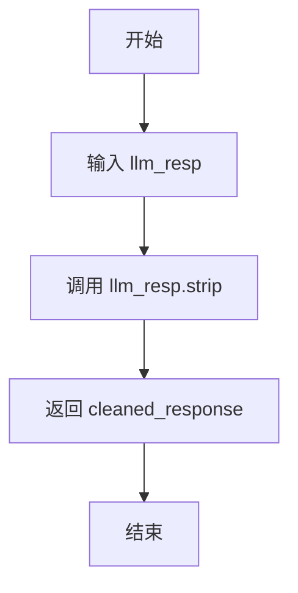

#### 带注释源码

```python
def _func_cleanup(self, llm_resp: str, prompt: str):
    # 使用 strip() 方法去除字符串两端的空白字符
    cleaned_response = llm_resp.strip()
    # 返回清理后的字符串
    return cleaned_response
```

### `GenActionObject._func_fail_default_resp`

该方法用于在生成动作对象失败时，提供一个默认的响应值。它返回一个硬编码的字符串 `"bed"`，作为后备方案，以确保系统在无法生成有效对象时仍能继续运行。

参数：
- 无

返回值：`str`，返回一个默认的动作对象名称，即字符串 `"bed"`。

#### 流程图

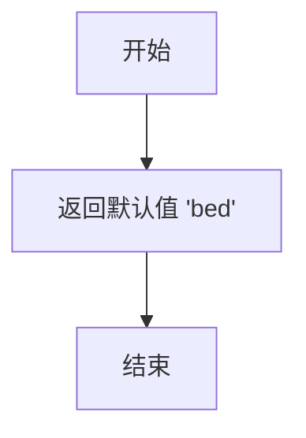

#### 带注释源码

```python
def _func_fail_default_resp(self):
    fs = "bed"  # 定义一个默认的失败响应字符串
    return fs   # 返回该默认字符串
```

### `GenActionObject.run`

该方法根据给定的角色、动作描述和临时地址，生成一个具体的动作对象。它首先通过提示模板调用语言模型来生成候选对象，然后验证该对象是否在角色可访问的游戏对象列表中。如果不在，则随机选择一个可访问的对象作为输出。

参数：

- `role`：`STRole`，表示执行动作的角色对象，包含角色的记忆、状态等信息。
- `act_desp`：`str`，表示动作的描述，用于生成动作对象的上下文。
- `temp_address`：`str`，表示临时地址，用于获取该地址下可访问的游戏对象列表。

返回值：`str`，表示生成的动作对象名称。

#### 流程图

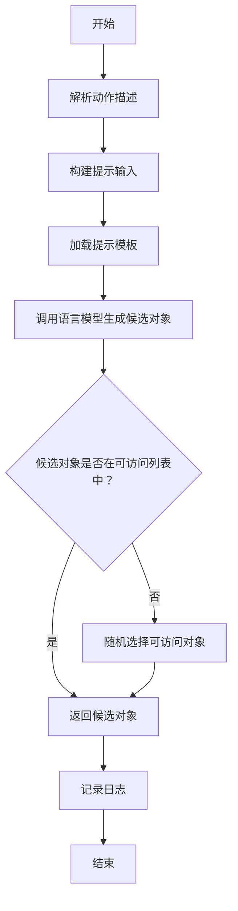

#### 带注释源码

```python
async def run(self, role: "STRole", act_desp: str, temp_address: str):
    # 内部函数：构建提示输入
    def create_prompt_input(role, act_desp, temp_address):
        prompt_input = []
        # 如果动作描述中包含括号，提取括号内的内容作为动作描述
        if "(" in act_desp:
            act_desp = act_desp.split("(")[-1][:-1]

        # 将动作描述添加到提示输入中
        prompt_input += [act_desp]
        # 获取临时地址下可访问的游戏对象列表，并添加到提示输入中
        prompt_input += [role.s_mem.get_str_accessible_arena_game_objects(temp_address)]
        return prompt_input

    # 指定提示模板文件
    prompt_template = "action_object_v2.txt"
    # 构建提示输入
    prompt_input = create_prompt_input(role, act_desp, temp_address)
    # 生成完整的提示文本
    prompt = self.generate_prompt_with_tmpl_filename(prompt_input, prompt_template)
    # 设置默认失败响应
    self.fail_default_resp = self._func_fail_default_resp()
    # 调用语言模型生成候选对象，限制最大令牌数为15
    output = await self._run_gpt35_max_tokens(prompt, max_tokens=15)
    # 获取临时地址下可访问的游戏对象列表，并转换为列表形式
    x = [i.strip() for i in role.s_mem.get_str_accessible_arena_game_objects(temp_address).split(",")]
    # 验证候选对象是否在可访问列表中
    if output not in x:
        # 如果不在，随机选择一个可访问对象作为输出
        output = random.choice(x)
    # 记录生成的动作对象日志
    logger.info(f"Role: {role.name} Action: {self.cls_name} output: {output}")
    # 返回生成的动作对象
    return output
```

### `GenPronunciatio._func_cleanup`

该方法用于清理和格式化从大语言模型（LLM）获取的关于动作发音（Pronunciatio）的响应。其核心功能是去除响应字符串首尾的空白字符，并确保返回的字符串长度不超过3个字符，以符合发音符号（通常为emoji）的格式要求。

参数：

- `llm_resp`：`str`，从大语言模型获取的原始响应字符串。
- `prompt`：`str`，生成该响应时使用的提示词（在本方法中未使用）。

返回值：`str`，清理和格式化后的字符串，长度不超过3个字符。

#### 流程图

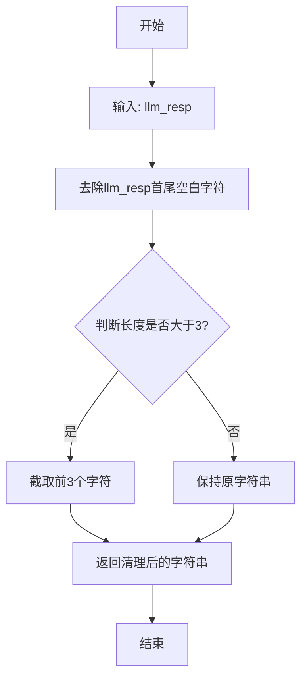

#### 带注释源码

```python
def _func_cleanup(self, llm_resp: str, prompt: str):
    # 1. 去除响应字符串首尾的空白字符（如空格、换行符等）
    cr = llm_resp.strip()
    # 2. 检查清理后字符串的长度
    if len(cr) > 3:
        # 3. 如果长度超过3，则截取前3个字符
        cr = cr[:3]
    # 4. 返回最终清理和格式化后的字符串
    return cr
```

### `GenPronunciatio._func_validate`

该方法用于验证大语言模型（LLM）对生成发音符号（Pronunciatio）请求的响应是否有效。它通过尝试清理响应并检查其基本完整性来确保响应符合预期格式，特别是确保响应不为空且清理过程不会引发异常。

参数：

- `llm_resp`：`str`，大语言模型返回的原始响应字符串。
- `prompt`：`str`，生成此响应所使用的提示词（在本方法中未直接使用，但为保持接口一致而保留）。

返回值：`bool`，如果响应通过验证则返回 `True`，否则返回 `False`。

#### 流程图

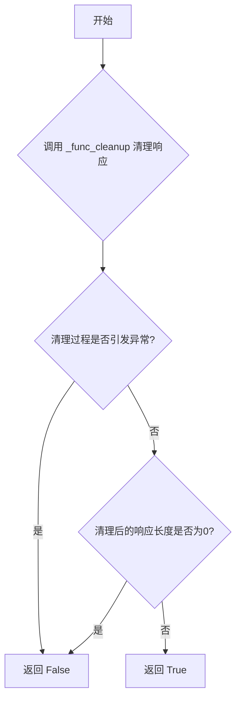

#### 带注释源码

```python
def _func_validate(self, llm_resp: str, prompt: str):
    try:
        # 尝试调用清理函数来处理LLM的响应。
        # 清理函数会去除首尾空格，并将响应长度限制在3个字符以内。
        self._func_cleanup(llm_resp, prompt="")
        # 检查清理后的响应是否为空字符串。
        # 如果为空，说明原始响应无效（例如，可能只包含空白字符）。
        if len(llm_resp) == 0:
            return False
    except Exception:
        # 如果在清理过程中发生任何异常（例如，响应格式意外导致清理函数出错），
        # 则认为响应无效。
        return False
    # 如果响应成功通过清理且不为空，则认为它是有效的。
    return True
```

### `GenPronunciatio._func_fail_default_resp`

该方法用于在生成角色动作的“发音”（Pronunciatio，即表情符号表示）失败时，提供一个默认的返回值。它是`GenPronunciatio`类中LLM（大语言模型）调用失败时的后备方案。

参数：
- 无参数

返回值：`str`，返回一个默认的表情符号字符串 "😋"。

#### 流程图

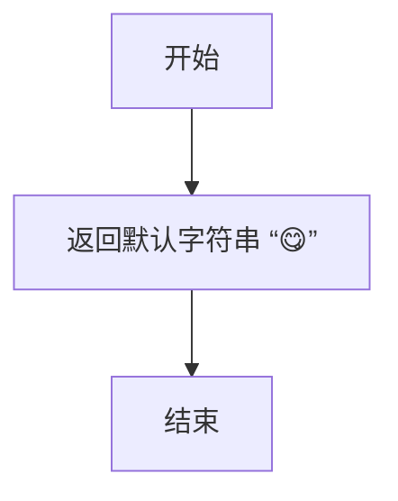

#### 带注释源码

```python
def _func_fail_default_resp(self):
    # 定义一个默认的失败响应字符串，这里是一个“好吃”的表情符号。
    fs = "😋"
    # 返回这个默认字符串。
    return fs
```

### `GenPronunciatio.run`

该方法根据给定的动作描述（act_desp）生成对应的表情符号（emoji）表示，用于在模拟环境中可视化角色的动作。它通过调用大语言模型（GPT-3.5）来生成与动作描述相匹配的、最多包含三个字符的表情符号串。如果生成失败，则返回默认的“😋”表情。

参数：

- `role`：`STRole`，表示执行动作的角色对象，包含角色的状态和记忆信息。
- `act_desp`：`str`，表示动作的描述文本，例如“taking a bath”。

返回值：`str`，返回一个表示动作的表情符号字符串，例如“🛁🧖‍♀️”。

#### 流程图

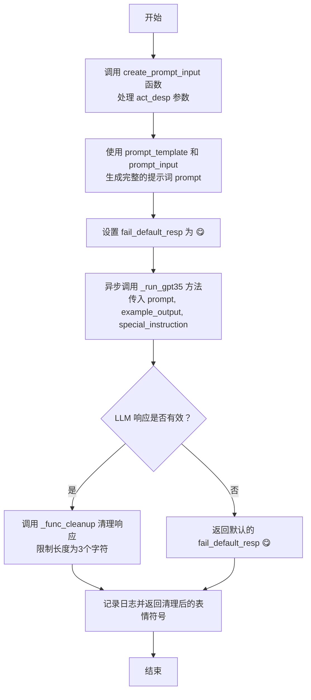

#### 带注释源码

```python
async def run(self, role: "STRole", act_desp: str):
    # 内部函数：根据动作描述创建提示词输入
    def create_prompt_input(act_desp):
        # 如果动作描述中包含括号，则提取括号内的内容作为核心描述
        if "(" in act_desp:
            act_desp = act_desp.split("(")[-1].split(")")[0]
        # 将处理后的动作描述放入列表作为提示词输入
        prompt_input = [act_desp]
        return prompt_input

    # 指定使用的提示词模板文件名
    prompt_template = "generate_pronunciatio_v1.txt"
    # 创建提示词输入
    prompt_input = create_prompt_input(act_desp)
    # 使用基类方法生成完整的提示词
    prompt = self.generate_prompt_with_tmpl_filename(prompt_input, prompt_template)
    # 设置示例输出，用于指导LLM生成格式
    example_output = "🛁🧖‍♀️"
    # 特殊指令，要求LLM输出必须只包含表情符号
    special_instruction = "The value for the output must ONLY contain the emojis."
    # 设置失败时的默认返回值
    self.fail_default_resp = self._func_fail_default_resp()
    # 异步调用GPT-3.5模型生成表情符号
    output = await self._run_gpt35(prompt, example_output, special_instruction)
    # 记录生成结果到日志
    logger.info(f"Role: {role.name} Action: {self.cls_name} output: {output}")
    # 返回生成的表情符号字符串
    return output
```

### `GenEventTriple._func_cleanup`

该方法用于清理和格式化从大语言模型（LLM）获取的原始响应字符串，将其转换为一个包含两个元素的列表，代表一个事件三元组中的后两个元素（主语和谓语）。

参数：

- `llm_resp`：`str`，从LLM获取的原始响应字符串。
- `prompt`：`str`，生成该响应的提示词（在此方法中未使用）。

返回值：`list`，一个包含两个字符串元素的列表，分别代表事件三元组中的动作（或状态）和对象（或目标）。

#### 流程图

```mermaid
graph TD
    A[开始] --> B[去除字符串首尾空格]
    B --> C{字符串是否包含 ')'?}
    C -- 是 --> D[截取 ')' 之前的部分]
    C -- 否 --> E[使用整个字符串]
    D --> F[按 ',' 分割字符串]
    E --> F
    F --> G[去除每个分割部分的空格]
    G --> H[返回清理后的列表]
    H --> I[结束]
```

#### 带注释源码

```python
    def _func_cleanup(self, llm_resp: str, prompt: str):
        # 1. 去除原始响应字符串首尾的空白字符
        cr = llm_resp.strip()
        # 2. 假设响应格式为 `(动作, 对象)`，截取第一个右括号之前的部分
        #    这有助于处理LLM可能返回的额外文本或格式
        cr = [i.strip() for i in cr.split(")")[0].split(",")]
        # 3. 返回一个列表，其中包含两个元素：动作和对象
        return cr
```

### `GenEventTriple._func_validate`

该方法用于验证大语言模型（LLM）生成的响应字符串是否符合生成事件三元组的格式要求。它通过清理响应字符串并检查其结构来确保数据有效性。

参数：

- `llm_resp`：`str`，大语言模型返回的原始响应字符串。
- `prompt`：`str`，生成响应时使用的提示词，在本方法中未直接使用。

返回值：`bool`，如果响应字符串经过清理后是一个包含两个元素的列表，则返回 `True`，否则返回 `False`。

#### 流程图

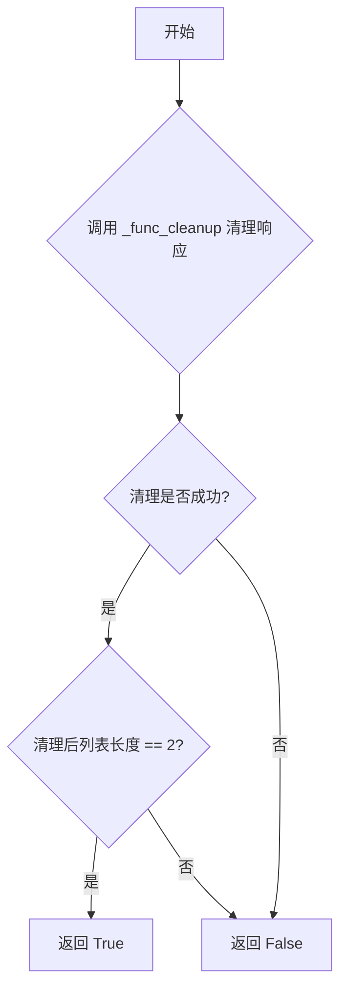

#### 带注释源码

```python
def _func_validate(self, llm_resp: str, prompt: str):
    try:
        # 1. 首先调用 _func_cleanup 方法清理响应字符串。
        #    该方法会去除首尾空格，按 ')' 分割取第一部分，再按 ',' 分割成列表。
        llm_resp = self._func_cleanup(llm_resp, prompt="")
        # 2. 验证清理后的结果是否为恰好包含两个元素的列表。
        #    这符合事件三元组（主语， 谓语）的预期格式。
        if len(llm_resp) != 2:
            return False
    except Exception:
        # 3. 如果在清理或验证过程中发生任何异常（如字符串格式错误），
        #    则认为响应无效，返回 False。
        return False
    # 4. 所有检查通过，返回 True 表示响应有效。
    return True
```

### `GenEventTriple._func_fail_default_resp`

该方法为`GenEventTriple`类提供了一个默认的失败响应。当生成事件三元组（主语-谓语-宾语）的LLM调用失败或验证不通过时，该方法被调用，返回一个表示角色“空闲”状态的默认三元组。

参数：
- `role`：`STRole`，触发此失败响应的角色对象。

返回值：`tuple`，一个包含三个字符串的元组，格式为`(角色名, "is", "idle")`，表示该角色当前处于空闲状态。

#### 流程图

```mermaid
flowchart TD
    A[开始] --> B[接收角色对象 role]
    B --> C[构造元组 fs = (role.name, 'is', 'idle')]
    C --> D[返回 fs]
    D --> E[结束]
```

#### 带注释源码

```python
    def _func_fail_default_resp(self, role):
        # 构造并返回一个默认的失败响应元组。
        # 该元组表示给定角色处于“空闲”状态。
        fs = (role.name, "is", "idle")
        return fs
```

### `GenEventTriple.run`

该方法用于生成一个事件三元组（Event Triple），通常用于描述角色执行某个动作时产生的事件。它接收角色和动作描述作为输入，通过调用大语言模型（GPT-3.5）生成一个由主语、谓语和宾语组成的三元组，并返回一个包含角色名称和生成的三元组的元组。

参数：

- `role`：`STRole`，表示执行动作的角色对象，包含角色的名称、记忆、状态等信息。
- `act_desp`：`str`，表示动作的描述字符串，用于生成事件三元组。

返回值：`tuple`，返回一个三元组，格式为 `(role.name, predicate, object)`，其中 `predicate` 和 `object` 是通过大语言模型生成的动作谓语和宾语。

#### 流程图

```mermaid
graph TD
    A[开始] --> B[调用 create_prompt_input 生成提示输入]
    B --> C[加载提示模板 generate_event_triple_v1.txt]
    C --> D[生成完整提示]
    D --> E[调用 _run_gpt35_max_tokens 生成 LLM 响应]
    E --> F{验证响应是否有效？}
    F -- 是 --> G[清理响应并提取谓语和宾语]
    F -- 否 --> H[使用默认失败响应]
    H --> I[返回默认三元组]
    G --> J[组合成最终三元组 (role.name, predicate, object)]
    J --> K[记录日志]
    K --> L[返回三元组]
    I --> K
```

#### 带注释源码

```python
async def run(self, role: "STRole", act_desp: str):
    # 内部函数：根据角色和动作描述生成提示输入
    def create_prompt_input(role, act_desp):
        # 如果动作描述中包含括号，提取括号内的内容作为核心描述
        if "(" in act_desp:
            act_desp = act_desp.split("(")[-1].split(")")[0]
        # 提示输入格式：[角色名称, 动作描述, 角色名称]
        prompt_input = [role.name, act_desp, role.name]
        return prompt_input

    # 指定使用的提示模板文件名
    prompt_template = "generate_event_triple_v1.txt"
    # 生成提示输入
    prompt_input = create_prompt_input(role, act_desp)
    # 使用模板和输入生成完整的提示
    prompt = self.generate_prompt_with_tmpl_filename(prompt_input, prompt_template)
    # 设置默认的失败响应，格式为 (角色名, "is", "idle")
    self.fail_default_resp = self._func_fail_default_resp(role)
    # 调用 GPT-3.5 模型生成响应，限制最大 token 数为 30
    output = await self._run_gpt35_max_tokens(prompt, max_tokens=30)
    # 将模型输出与角色名组合成最终的三元组
    output = (role.name, output[0], output[1])
    # 记录生成的事件三元组到日志
    logger.info(f"Role: {role.name} Action: {self.cls_name} output: {output}")
    # 返回生成的事件三元组
    return output
```

### `GenActObjDescription._func_cleanup`

该方法用于清理从大语言模型（LLM）返回的响应字符串。具体来说，它会去除字符串末尾的句点（如果存在），以确保返回的描述性短语格式统一，不包含结束标点。

参数：

- `llm_resp`：`str`，从大语言模型获取的原始响应字符串。
- `prompt`：`str`，生成该响应时使用的提示词（在本方法中未使用）。

返回值：`str`，清理后的字符串，已移除末尾的句点。

#### 流程图

```mermaid
flowchart TD
    A[开始] --> B{输入: llm_resp}
    B --> C[去除字符串首尾空白字符]
    C --> D{字符串最后一个字符是 '.'?}
    D -- 是 --> E[移除最后一个字符]
    D -- 否 --> F[保持原样]
    E --> G[返回清理后的字符串]
    F --> G
    G --> H[结束]
```

#### 带注释源码

```python
def _func_cleanup(self, llm_resp: str, prompt: str):
    # 1. 去除输入字符串 `llm_resp` 的首尾空白字符。
    cr = llm_resp.strip()
    # 2. 检查清理后的字符串是否以句点 '.' 结尾。
    if cr[-1] == ".":
        # 3. 如果是，则移除最后一个字符（即句点）。
        cr = cr[:-1]
    # 4. 返回处理后的字符串。
    return cr
```

### `GenActObjDescription._func_validate`

该方法用于验证大语言模型（LLM）对生成动作对象描述的响应是否有效。它通过尝试调用清理函数来检查响应是否可以被正确处理，如果清理过程中出现异常或清理后的响应无效，则返回 `False`，否则返回 `True`。

参数：

- `llm_resp`：`str`，大语言模型返回的原始响应字符串。
- `prompt`：`str`，生成响应时使用的提示词（在本方法中未直接使用，但为保持接口一致而保留）。

返回值：`bool`，如果响应有效则返回 `True`，否则返回 `False`。

#### 流程图

```mermaid
graph TD
    A[开始] --> B{尝试调用 _func_cleanup 清理 llm_resp};
    B -->|成功| C[返回 True];
    B -->|抛出异常| D[返回 False];
    C --> E[结束];
    D --> E;
```

#### 带注释源码

```python
def _func_validate(self, llm_resp: str, prompt: str):
    try:
        # 尝试调用 _func_cleanup 方法清理 llm_resp。
        # 如果清理过程成功（即没有抛出异常），则认为响应有效。
        llm_resp = self._func_cleanup(llm_resp, prompt="")
    except Exception:
        # 如果在清理过程中捕获到任何异常，则认为响应无效，返回 False。
        return False
    # 清理成功，返回 True 表示响应有效。
    return True
```

### `GenActObjDescription._func_fail_default_resp`

该方法为`GenActObjDescription`类提供了一个默认的失败响应生成器。当大语言模型（LLM）无法生成有效的动作对象描述时，该方法被调用，返回一个基于给定动作对象的、表示“空闲”状态的默认描述字符串。

参数：

- `act_game_object`：`str`，需要生成默认描述的动作对象名称。

返回值：`str`，一个格式为“{act_game_object} is idle”的默认描述字符串。

#### 流程图

```mermaid
graph TD
    A[开始] --> B[接收参数 act_game_object]
    B --> C[构造默认字符串 fs = f'{act_game_object} is idle']
    C --> D[返回 fs]
    D --> E[结束]
```

#### 带注释源码

```python
    def _func_fail_default_resp(self, act_game_object):
        # 构造并返回一个默认的失败响应字符串。
        # 格式为：`{动作对象名称} is idle`，表示该对象处于空闲状态。
        fs = f"{act_game_object} is idle"
        return fs
```

### `GenActObjDescription.run`

该方法用于生成角色对特定游戏对象执行动作时的描述文本。它接收一个游戏对象和动作描述，通过大语言模型生成一个简短的、描述性的短语，用于填充到类似“{游戏对象} is {描述}”的模板中。

参数：

- `role`：`STRole`，执行动作的角色对象，包含角色的记忆、状态等信息
- `act_game_object`：`str`，游戏对象的名称，如“bed”、“kitchen table”等
- `act_desp`：`str`，动作的描述文本，如“sleeping”、“cooking breakfast”等

返回值：`str`，返回生成的描述短语，如“being fixed”、“occupied”等

#### 流程图

```mermaid
graph TD
    A[开始: run(role, act_game_object, act_desp)] --> B[调用create_prompt_input<br>构造提示词输入]
    B --> C[使用模板文件<br>generate_obj_event_v1.txt生成完整提示词]
    C --> D[调用_run_gpt35方法<br>请求大语言模型生成]
    D --> E{模型响应是否有效?}
    E -- 是 --> F[调用_func_cleanup<br>清理响应文本]
    F --> G[记录日志并返回结果]
    E -- 否 --> H[返回_func_fail_default_resp<br>生成的默认响应]
    H --> G
    G --> I[结束]
```

#### 带注释源码

```python
async def run(self, role: "STRole", act_game_object: str, act_desp: str):
    # 内部函数：构造提示词输入参数
    def create_prompt_input(act_game_object, act_desp, role):
        # 提示词输入是一个列表，包含游戏对象、角色名、动作描述等元素
        prompt_input = [act_game_object, role.name, act_desp, act_game_object, act_game_object]
        return prompt_input

    # 使用指定的模板文件构造提示词
    prompt_template = "generate_obj_event_v1.txt"
    prompt_input = create_prompt_input(act_game_object, act_desp, role)
    prompt = self.generate_prompt_with_tmpl_filename(prompt_input, prompt_template)
    
    # 设置示例输出和特殊指令，指导模型生成特定格式的响应
    example_output = "being fixed"
    special_instruction = "The output should ONLY contain the phrase that should go in <fill in>."
    
    # 设置失败时的默认响应
    self.fail_default_resp = self._func_fail_default_resp(act_game_object)
    
    # 调用大语言模型生成响应
    output = await self._run_gpt35(prompt, example_output, special_instruction)
    
    # 记录执行日志
    logger.info(f"Role: {role.name} Action: {self.cls_name} output: {output}")
    
    # 返回生成的描述文本
    return output
```

### `GenObjEventTriple._func_cleanup`

该方法用于清理和格式化从大语言模型（LLM）获得的原始响应字符串，将其转换为一个包含两个元素的列表，作为事件三元组中的后两个元素。

参数：

- `llm_resp`：`str`，从LLM获取的原始响应字符串。
- `prompt`：`str`，生成该响应所使用的提示词（在本方法中未使用）。

返回值：`list`，一个包含两个字符串元素的列表，代表事件三元组中的谓词和宾语部分。

#### 流程图

```mermaid
graph TD
    A[开始] --> B[输入: llm_resp]
    B --> C[去除字符串首尾空白字符]
    C --> D[以第一个')'字符为界截取字符串]
    D --> E[以','为分隔符分割字符串]
    E --> F[去除分割后每个元素的空白字符]
    F --> G[返回包含两个元素的列表]
    G --> H[结束]
```

#### 带注释源码

```python
def _func_cleanup(self, llm_resp: str, prompt: str):
    # 1. 去除原始响应字符串首尾的空白字符
    cr = llm_resp.strip()
    # 2. 以第一个右括号 ')' 为界，截取其前面的部分。
    #    然后以逗号 ',' 为分隔符，将字符串分割成列表。
    #    最后，使用列表推导式去除列表中每个元素的首尾空白字符。
    cr = [i.strip() for i in cr.split(")")[0].split(",")]
    # 3. 返回处理后的列表。根据 `_func_validate` 方法，预期此列表应恰好包含两个元素。
    return cr
```

### `GenObjEventTriple._func_validate`

该方法用于验证大语言模型（LLM）对生成对象事件三元组的响应是否有效。它首先尝试清理响应字符串，然后检查清理后的结果是否为恰好包含两个元素的列表。如果清理过程抛出异常或结果不符合预期，则验证失败。

参数：

- `llm_resp`：`str`，大语言模型返回的原始响应字符串。
- `prompt`：`str`，生成响应时使用的提示词（在本方法中未直接使用）。

返回值：`bool`，如果响应有效则返回 `True`，否则返回 `False`。

#### 流程图

```mermaid
graph TD
    A[开始] --> B{调用 _func_cleanup 清理 llm_resp};
    B --> C{是否抛出异常?};
    C -->|是| D[返回 False];
    C -->|否| E{清理后的列表长度是否为 2?};
    E -->|是| F[返回 True];
    E -->|否| D;
```

#### 带注释源码

```python
def _func_validate(self, llm_resp: str, prompt: str):
    try:
        # 尝试调用 _func_cleanup 方法清理响应字符串。
        # _func_cleanup 会将字符串按 ')' 和 ',' 分割并去除空格。
        llm_resp = self._func_cleanup(llm_resp, prompt="")
        # 验证清理后的结果是否为恰好包含两个元素的列表。
        # 这符合事件三元组（主语， 谓语， 宾语）中后两个元素的预期格式。
        if len(llm_resp) != 2:
            return False
    except Exception:
        # 如果在清理或验证过程中发生任何异常（如字符串格式错误），则验证失败。
        return False
    # 所有检查通过，返回验证成功。
    return True
```

### `GenObjEventTriple._func_fail_default_resp`

该方法用于在生成对象事件三元组失败时，提供一个默认的、安全的响应。它返回一个表示对象处于“空闲”状态的三元组，以确保系统在LLM响应无效时仍能继续运行，避免因空值或异常导致流程中断。

参数：

- `act_game_object`：`str`，表示当前动作所涉及的游戏对象名称，用于构建默认事件三元组的主体。

返回值：`tuple[str, str, str]`，返回一个包含三个字符串的元组，格式为`(对象名称, "is", "idle")`，表示该对象处于空闲状态。

#### 流程图

```mermaid
graph TD
    A[开始] --> B[接收参数 act_game_object]
    B --> C[构建默认三元组 fs = (act_game_object, 'is', 'idle')]
    C --> D[返回默认三元组 fs]
    D --> E[结束]
```

#### 带注释源码

```python
def _func_fail_default_resp(self, act_game_object: str):
    # 构建一个默认的事件三元组，表示对象处于“空闲”状态。
    # 当LLM无法生成有效响应时，此方法提供一个安全的回退值。
    fs = (act_game_object, "is", "idle")
    return fs
```

### `GenObjEventTriple.run`

该方法用于生成与游戏对象相关的事件三元组（主语、谓语、宾语），基于给定的游戏对象和对象描述，通过调用大语言模型（GPT-3.5）生成一个描述该对象状态或行为的简短事件。

参数：

- `role`：`STRole`，表示当前执行动作的角色对象，用于日志记录和可能的上下文信息。
- `act_game_object`：`str`，表示游戏对象的名称或标识符，将作为事件三元组的主语。
- `act_obj_desp`：`str`，表示游戏对象的描述，用于生成事件三元组的谓语和宾语。

返回值：`tuple`，返回一个三元组 `(act_game_object, predicate, object)`，其中 `predicate` 和 `object` 是由大语言模型生成的谓语和宾语，描述游戏对象的状态或行为。

#### 流程图

```mermaid
graph TD
    A[开始] --> B[创建提示输入<br>act_game_object, act_obj_desp]
    B --> C[加载提示模板<br>generate_event_triple_v1.txt]
    C --> D[生成完整提示]
    D --> E[调用大语言模型 GPT-3.5<br>max_tokens=30]
    E --> F{模型响应是否有效？}
    F -- 是 --> G[清理响应<br>分割为两部分]
    G --> H[构建三元组<br>act_game_object, predicate, object]
    H --> I[记录日志]
    I --> J[返回三元组]
    F -- 否 --> K[使用默认响应<br>act_game_object, 'is', 'idle']
    K --> I
```

#### 带注释源码

```python
async def run(self, role: "STRole", act_game_object, act_obj_desp):
    # 内部函数：根据游戏对象和对象描述创建提示输入
    def create_prompt_input(act_game_object, act_obj_desp):
        prompt_input = [act_game_object, act_obj_desp, act_game_object]
        return prompt_input

    # 指定使用的提示模板文件名
    prompt_template = "generate_event_triple_v1.txt"
    # 创建提示输入
    prompt_input = create_prompt_input(act_game_object, act_obj_desp)
    # 使用模板和输入生成完整的提示
    prompt = self.generate_prompt_with_tmpl_filename(prompt_input, prompt_template)
    # 设置默认失败响应，当模型响应无效时使用
    self.fail_default_resp = self._func_fail_default_resp(act_game_object)
    # 调用 GPT-3.5 模型，限制最大 token 数为 30
    output = await self._run_gpt35_max_tokens(prompt, max_tokens=30)
    # 将模型输出与游戏对象组合成三元组
    output = (act_game_object, output[0], output[1])
    # 记录执行日志
    logger.info(f"Role: {role.name} Action: {self.cls_name} output: {output}")
    # 返回生成的事件三元组
    return output
```

### `GenActionDetails._func_cleanup`

该方法用于清理和格式化从大语言模型（LLM）返回的响应字符串。其核心功能是接收原始的LLM响应，通过特定的处理逻辑（如分割、去除特定字符等）将其转换为更干净、结构化的格式，以供后续步骤使用。当前实现中，该方法仅包含一个占位符 `pass` 语句，表明其具体清理逻辑尚未定义，需要根据实际需求进行填充。

参数：

- `llm_resp`：`str`，从大语言模型获取的原始响应字符串。
- `prompt`：`str`，生成该响应时使用的提示词。

返回值：`list`，清理后的响应，通常是一个列表或其他结构化数据。

#### 流程图

```mermaid
graph TD
    A[开始] --> B[接收参数 llm_resp 和 prompt]
    B --> C[执行清理逻辑]
    C --> D[返回清理后的结果]
    D --> E[结束]
```

#### 带注释源码

```python
def _func_cleanup(self, llm_resp: str, prompt: str) -> list:
    pass  # TODO: 实现具体的清理逻辑，例如分割字符串、去除特定字符等
```

### `GenActionDetails._func_validate`

该方法用于验证大语言模型（LLM）对`GenActionDetails`动作生成的响应字符串（`llm_resp`）是否有效。其核心逻辑是尝试调用清理函数`_func_cleanup`来处理响应，如果清理过程成功（即未抛出异常），则认为响应有效；否则认为响应无效。

参数：
- `llm_resp`：`str`，大语言模型返回的原始响应字符串。
- `prompt`：`str`，生成此响应所使用的提示词（在本方法中未使用）。

返回值：`bool`，如果响应字符串可以被成功清理，则返回`True`，否则返回`False`。

#### 流程图

```mermaid
graph TD
    A[开始] --> B{尝试调用 _func_cleanup(llm_resp)}；
    B -- 成功 --> C[返回 True]；
    B -- 抛出异常 --> D[返回 False]；
    C --> E[结束]；
    D --> E；
```

#### 带注释源码

```python
    def _func_validate(self, llm_resp: str, prompt: str) -> bool:
        # TODO -- this sometimes generates error
        try:
            # 核心验证逻辑：尝试调用清理函数。
            # 如果清理函数能正常执行（不抛出异常），则认为响应格式基本有效。
            self._func_cleanup(llm_resp)
        except Exception:
            # 如果在清理过程中捕获到任何异常，则认为响应无效。
            return False
        # 清理成功，返回有效标志。
        return True
```

### `GenActionDetails._func_fail_default_resp`

该方法用于在生成动作详情的LLM（大语言模型）调用失败时，提供一个默认的、安全的空响应，以确保系统在异常情况下仍能返回一个结构化的结果，避免后续处理流程因数据缺失而中断。

参数：
-  `self`：`GenActionDetails`，类实例自身，用于访问类属性和方法。

返回值：`dict`，返回一个空的Python字典 `{}`，作为生成动作详情失败时的默认响应。

#### 流程图

```mermaid
graph TD
    A[开始] --> B[创建空字典 fs = {}]
    B --> C[返回 fs]
    C --> D[结束]
```

#### 带注释源码

```python
    def _func_fail_default_resp(self):
        # 创建一个空字典作为默认的失败响应
        fs = {}
        # 返回该空字典
        return fs
```

### `GenActionDetails.run`

该方法用于生成角色动作的详细描述，包括动作发生的地点、对象、持续时间、发音、事件等。它通过调用多个子动作生成器来构建一个完整的动作字典，最终返回包含所有动作细节的字典。

参数：

- `role`：`STRole`，表示执行动作的角色对象
- `act_desp`：`str`，表示动作的描述字符串
- `act_dura`：`int`，表示动作的持续时间

返回值：`dict`，包含动作的详细信息的字典，如动作地址、持续时间、描述、发音、事件等

#### 流程图

```mermaid
graph TD
    A[开始] --> B[获取角色当前瓦片信息]
    B --> C[生成动作区域]
    C --> D[生成动作场所]
    D --> E[生成动作地址]
    E --> F{检查可访问的游戏对象}
    F -->|无| G[设置动作为随机]
    F -->|有| H[生成动作对象]
    G --> I[生成动作发音]
    H --> I
    I --> J[生成动作事件]
    J --> K[生成动作对象描述]
    K --> L[生成动作对象发音]
    L --> M[生成动作对象事件]
    M --> N[构建结果字典]
    N --> O[记录日志]
    O --> P[返回结果字典]
```

#### 带注释源码

```python
async def run(self, role: "STRole", act_desp: str, act_dura):
    # 获取角色当前瓦片的信息，包括世界和区域
    access_tile = role.rc.env.observe(
        obs_params=EnvObsParams(obs_type=EnvObsType.GET_TITLE, coord=role.scratch.curr_tile)
    )
    act_world = access_tile["world"]
    
    # 生成动作发生的区域
    act_sector = await GenActionSector().run(role, access_tile, act_desp)
    
    # 生成动作发生的场所
    act_arena = await GenActionArena().run(role, act_desp, act_world, act_sector)
    
    # 构建动作地址
    act_address = f"{act_world}:{act_sector}:{act_arena}"
    
    # 检查该地址是否有可访问的游戏对象，如果没有则设置为随机
    if not role.s_mem.get_str_accessible_arena_game_objects(act_address):
        act_game_object = "<random>"
    else:
        # 生成动作对象
        act_game_object = await GenActionObject().run(role, act_desp, act_address)
    
    # 构建新的动作地址，包含游戏对象
    new_address = f"{act_world}:{act_sector}:{act_arena}:{act_game_object}"
    
    # 生成动作的发音
    act_pron = await GenPronunciatio().run(role, act_desp)
    
    # 生成动作的事件
    act_event = await GenEventTriple().run(role, act_desp)
    
    # 生成动作对象的描述
    act_obj_desp = await GenActObjDescription().run(role, act_game_object, act_desp)
    
    # 生成动作对象的发音
    act_obj_pron = await GenPronunciatio().run(role, act_obj_desp)
    
    # 生成动作对象的事件
    act_obj_event = await GenObjEventTriple().run(role, act_game_object, act_obj_desp)
    
    # 构建包含所有动作细节的字典
    result_dict = {
        "action_address": new_address,
        "action_duration": int(act_dura),
        "action_description": act_desp,
        "action_pronunciatio": act_pron,
        "action_event": act_event,
        "chatting_with": None,
        "chat": None,
        "chatting_with_buffer": None,
        "chatting_end_time": None,
        "act_obj_description": act_obj_desp,
        "act_obj_pronunciatio": act_obj_pron,
        "act_obj_event": act_obj_event,
    }
    
    # 记录日志
    logger.info(f"Role: {role.name} Action: {self.cls_name} output: {result_dict}")
    
    # 返回结果字典
    return result_dict
```

## 关键组件


### GenActionSector

根据角色当前状态、可访问区域和动作描述，生成动作发生的“扇区”（Sector）位置。它通过查询角色的空间记忆，构建提示词调用大语言模型（LLM）来决策，并包含对输出结果的验证、清理和后备逻辑。

### GenActionArena

在给定的世界（World）和扇区（Sector）内，根据动作描述，生成动作发生的具体“场所”（Arena）。它同样基于角色的空间记忆和LLM进行决策，并对可访问的场所列表进行过滤（例如，只允许访问同姓角色的房间）。

### GenActionObject

在指定的地址（包含世界、扇区、场所）内，根据动作描述，生成动作所针对的具体“游戏对象”（Game Object）。它查询该地址下所有可访问的对象，并通过LLM选择最相关的一个，如果LLM输出无效则随机选择一个。

### GenPronunciatio

根据动作描述，生成代表该动作的“发音符号”（Pronunciatio），通常是一个或多个表情符号（Emoji）。它通过LLM将自然语言描述转化为简洁的符号表示。

### GenEventTriple

根据角色和动作描述，生成描述该动作的“事件三元组”（Event Triple），格式为（主语，谓语，宾语）。它用于以结构化的方式记录角色行为。

### GenActObjDescription

根据动作描述和动作对象，生成描述该对象在动作中状态的“对象事件描述”（Act Object Description）。例如，“床”在“睡觉”动作中可能被描述为“被使用”。

### GenObjEventTriple

根据动作对象及其状态描述，生成描述该对象状态变化的“对象事件三元组”（Object Event Triple），格式为（对象，状态，描述）。它用于以结构化方式记录对象的状态变化。

### GenActionDetails

动作细节生成的总协调器。它按顺序调用上述各个组件（GenActionSector, GenActionArena, GenActionObject, GenPronunciatio, GenEventTriple, GenActObjDescription, GenObjEventTriple），整合所有生成的信息（如地址、持续时间、描述、符号、事件三元组等），最终形成一个完整的动作细节字典。


## 问题及建议


### 已知问题

1.  **硬编码的模板文件名和默认值**：多个类（如 `GenActionSector`, `GenActionArena`）在 `run` 方法中直接硬编码了模板文件名（如 `"action_location_sector_v1.txt"`）和失败默认返回值（如 `"kitchen"`, `"bed"`）。这使得代码难以维护和适应变化，例如当需要更换提示模板或默认行为时，需要修改多处源代码。
2.  **重复的验证和清理逻辑**：`GenActionSector` 和 `GenActionArena` 类的 `_func_validate` 和 `_func_cleanup` 方法逻辑完全一致，`GenEventTriple` 和 `GenObjEventTriple` 也存在高度相似的逻辑。这违反了 DRY（Don‘t Repeat Yourself）原则，增加了维护成本和出错风险。
3.  **临时性代码注释**：`GenActionSector` 和 `GenActionArena` 的 `run` 方法中存在被注释掉的代码块（标记为 `# MAR 11 TEMP`），这些代码虽然被注释，但增加了代码的混乱度，可能表示未完成的重构或遗留的调试代码，影响可读性。
4.  **脆弱的字符串解析**：多个方法（如 `create_prompt_input`）依赖字符串分割（如 `split("(")`）来解析 `act_desp` 参数。这种解析方式非常脆弱，如果输入格式稍有变化（例如括号不匹配、额外空格），就可能导致错误或产生意外的结果。
5.  **未实现的清理方法**：`GenActionDetails` 类的 `_func_cleanup` 方法仅包含 `pass` 语句，没有实际实现。而其 `_func_validate` 方法调用了这个未实现的清理方法，这可能导致验证逻辑无效或抛出异常。
6.  **潜在的循环依赖与紧耦合**：`GenActionDetails.run` 方法直接实例化并调用了其他多个 `STAction` 子类（如 `GenActionSector().run(...)`）。这种紧耦合使得 `GenActionDetails` 类依赖于所有这些具体类的实现，降低了模块的独立性和可测试性。
7.  **魔法数字（Magic Numbers）**：在调用 `_run_gpt35_max_tokens` 时，多处使用了硬编码的 `max_tokens=15` 或 `max_tokens=30`。这些数字缺乏解释，其合理性难以评估，调整时需要搜索所有出现的地方。
8.  **异常处理不足**：`_func_validate` 和 `_func_cleanup` 方法中普遍使用 `try...except Exception` 来捕获异常并返回 `False` 或默认值。这种处理方式过于宽泛，可能掩盖了真正的编程错误或外部服务异常，不利于调试和问题定位。
9.  **日志信息不一致**：所有 `run` 方法都使用 `logger.info` 记录日志，但格式略有不同（有的使用 `self.cls_name`，有的直接写类名）。`GenActionSector` 中有一行被注释掉的 `output = random.choice(x)`，这可能是备用的降级策略，但当前未启用，逻辑上直接使用了居住区域，这可能并非最佳后备方案。

### 优化建议

1.  **配置化与依赖注入**：
    *   将提示模板文件名、失败默认值、`max_tokens` 等配置项提取到类属性或外部配置文件中。
    *   考虑使用依赖注入框架或工厂模式来管理 `GenActionDetails` 对其子动作的依赖，将具体类的实例化移至外部，注入接口或抽象基类，以降低耦合度。
2.  **抽象与重构重复逻辑**：
    *   创建一个基类或混入类（Mixin），将 `_func_validate` 和 `_func_cleanup` 的通用逻辑（如检查长度、特定字符）封装其中。各个子类可以继承或组合这个类，并覆盖需要定制化的部分。
    *   对于 `GenEventTriple` 和 `GenObjEventTriple`，可以尝试合并共性，通过参数化差异部分。
3.  **清理代码库**：
    *   审查并移除所有标记为 `TEMP` 的注释代码块。如果它们是必要的逻辑，应将其正式化并取消注释；如果是调试残留，则应删除。
    *   统一所有类的日志格式，例如都使用 `self.__class__.__name__` 或一个统一的属性来获取动作名称。
4.  **增强输入处理的鲁棒性**：
    *   使用更健壮的方法来解析 `act_desp`，例如正则表达式，或者在接受参数时进行预处理和验证。
    *   考虑为复杂的输入定义明确的数据结构或使用 Pydantic 等库进行验证，而非依赖原始的字符串操作。
5.  **实现或明确清理方法**：
    *   完成 `GenActionDetails._func_cleanup` 方法的实现，或者如果确实不需要，应将其从父类要求中移除（如果可能），或至少让 `_func_validate` 不依赖它。
6.  **改进异常处理策略**：
    *   将宽泛的 `except Exception` 替换为更具体的异常类型捕获。
    *   在捕获异常后，可以记录更详细的错误信息（如原始响应、提示内容）到日志（DEBUG 或 WARNING 级别），以便于问题诊断，同时对外返回定义良好的失败响应。
7.  **定义常量与配置**：
    *   将魔法数字（如 15, 30）定义为类常量或模块级常量，并附上注释说明其含义和设定依据。
8.  **完善后备机制**：
    *   重新评估 `GenActionSector` 中当 LLM 输出无效时的后备逻辑。被注释的 `random.choice(x)` 和当前使用的 `role.scratch.living_area` 哪个更合理？明确后备策略并使其可配置。
9.  **增加单元测试**：
    *   为每个 `_func_validate`, `_func_cleanup`, `_func_fail_default_resp` 和 `create_prompt_input` 方法编写单元测试，覆盖正常、边界和异常情况，确保字符串处理和验证逻辑的可靠性。
10. **考虑异步优化**：
    *   在 `GenActionDetails.run` 方法中，多个 `await` 调用是顺序执行的。如果这些子动作之间没有严格的先后依赖，可以考虑使用 `asyncio.gather` 并发执行，以降低总体延迟。


## 其它


### 设计目标与约束

本模块的设计目标是为一组智能体（角色）生成其具体动作的详细描述和元数据。这些动作发生在模拟的“斯坦福小镇”环境中。核心约束包括：必须与底层环境（`EnvSpace`）和角色记忆系统（`STRole.s_mem`）集成；必须使用大型语言模型（GPT-3.5）作为核心推理引擎来生成自然语言和结构化输出；生成的输出（如地点、对象、表情符号、事件三元组）必须符合环境可达性和角色背景的约束；代码需要具备一定的容错性，当LLM输出不符合预期时，能提供合理的默认值或回退逻辑。

### 错误处理与异常设计

模块的错误处理主要围绕LLM响应的验证和清理展开。每个`STAction`子类都实现了`_func_validate`和`_func_cleanup`方法，用于检查LLM返回的字符串格式是否有效，并进行清洗以提取所需部分。如果验证失败，`_func_fail_default_resp`方法会提供一个安全的默认返回值。在`run`方法中，部分类（如`GenActionSector`, `GenActionObject`）在LLM输出后，会再次与环境或记忆中的可达集合进行比对，如果输出不在有效集合内，则使用随机选择或回退到角色生活区域等策略。整体上，异常被控制在类内部处理，`run`方法对外返回有效值，不向上抛出业务异常，保证了调用链的稳定性。日志系统记录了每个动作的输入和输出，便于追踪问题。

### 数据流与状态机

数据流始于`GenActionDetails.run`方法，它接收一个动作描述(`act_desp`)和持续时间(`act_dura`)。流程是顺序且依赖的：首先获取角色当前所在瓦片的环境信息(`access_tile`)，然后依次调用`GenActionSector` -> `GenActionArena` -> `GenActionObject` 来逐级确定动作发生的世界、区域、场景和对象，构建出完整的动作地址(`action_address`)。接着，并行或顺序生成动作的发音符号(`act_pron`)、事件三元组(`act_event`)、对象描述(`act_obj_desp`)、对象发音符号(`act_obj_pron`)和对象事件三元组(`act_obj_event`)。每个子生成器都接收上游数据（主要是`act_desp`和角色信息）并产生输出。整个流程没有复杂的循环或条件状态转移，是一个线性的、以数据为驱动的管道，最终将所有结果汇总到一个字典中返回。角色对象(`role`)和其记忆(`s_mem`, `scratch`)作为共享的上下文状态贯穿始终。

### 外部依赖与接口契约

1.  **LLM服务**：依赖父类`STAction`提供的`_run_gpt35`和`_run_gpt35_max_tokens`方法调用GPT-3.5模型。契约是这些方法需要接收提示词(`prompt`)并返回字符串响应。
2.  **环境接口**：依赖`role.rc.env.observe`方法，通过`EnvObsParams`查询环境信息。契约是该方法返回一个包含`world`、`sector`等键的字典(`access_tile`)。
3.  **角色记忆接口**：强依赖`STRole`对象的多个方法：
    *   `s_mem.get_str_accessible_sectors(world)`: 返回指定世界内角色可访问的区域字符串列表。
    *   `s_mem.get_str_accessible_sector_arenas(address)`: 返回指定地址（世界:区域）内可访问的场景字符串列表。
    *   `s_mem.get_str_accessible_arena_game_objects(address)`: 返回指定地址（世界:区域:场景）内可访问的游戏对象字符串列表。
    *   `scratch`属性下的`get_str_name()`, `living_area`, `last_name`, `get_str_daily_plan_req()`, `curr_tile`等，提供角色的即时状态和背景信息。
4.  **模板文件**：依赖外部的文本文件（如`action_location_sector_v1.txt`）作为LLM提示词模板。契约是这些文件存在于特定路径，且包含特定占位符供`generate_prompt_with_tmpl_filename`方法填充。
5.  **日志系统**：依赖`metagpt.logs.logger`进行信息记录。

### 安全与合规考虑

1.  **提示词注入**：代码通过硬编码的模板和参数列表构建提示词，`prompt_input`列表中的用户输入（`act_desp`）在拼接前经过了简单的字符串分割处理（提取括号内内容），但未进行严格的清洗或转义。如果`act_desp`完全来自不可信源，可能存在提示词注入风险，影响LLM输出或产生非预期内容。当前上下文（斯坦福小镇模拟）中，`act_desp`可能由系统其他部分生成，风险相对可控，但仍需注意。
2.  **内容安全**：依赖的GPT-3.5模型自身具备一定的内容安全策略。生成的输出（如事件描述、表情符号）在模拟环境内部使用，通常不直接面向最终用户，但若结果用于生成公开内容，则需要额外的审核层。
3.  **数据隐私**：代码处理模拟角色数据，不涉及真实用户个人信息。
4.  **资源使用**：频繁调用LLM（一个完整动作生成需调用约7次）可能产生显著的成本和延迟。代码中使用了`max_tokens`参数进行限制，但整体优化依赖于上游调度。

### 测试策略建议

1.  **单元测试**：
    *   **验证与清理逻辑**：为每个`_func_validate`和`_func_cleanup`方法编写测试用例，覆盖有效响应、边界情况（空字符串、特殊字符）和无效响应。
    *   **默认响应**：测试`_func_fail_default_resp`返回值的合理性和类型。
    *   **提示词构建**：测试`create_prompt_input`函数，验证其根据不同输入（如带括号/不带括号的`act_desp`，不同的`role`状态）生成的`prompt_input`列表是否符合预期。
    *   **回退逻辑**：模拟LLM返回无效或不在可达集合内的输出，测试`GenActionSector`和`GenActionObject`中的回退逻辑（如使用`random.choice`或回退到`living_area`）是否正确触发。
2.  **集成测试**：
    *   **完整流程**：模拟一个`STRole`对象及其记忆、环境接口，调用`GenActionDetails.run`，验证其返回的字典结构正确，且内部各子动作生成器的调用顺序和数据传递正确。
    *   **外部依赖Mock**：使用Mock对象替代真实的`_run_gpt35`、`env.observe`和`s_mem`方法，注入预设的返回值，测试整个模块在不同场景下的行为。
3.  **端到端测试**：在完整的斯坦福小镇模拟环境中，触发角色规划动作，验证`GenActionDetails`生成的行动细节能否被环境正确执行和呈现。
4.  **性能测试**：评估生成一个完整动作详情所需的平均时间，特别是LLM调用的延迟，为系统实时性提供参考。

    