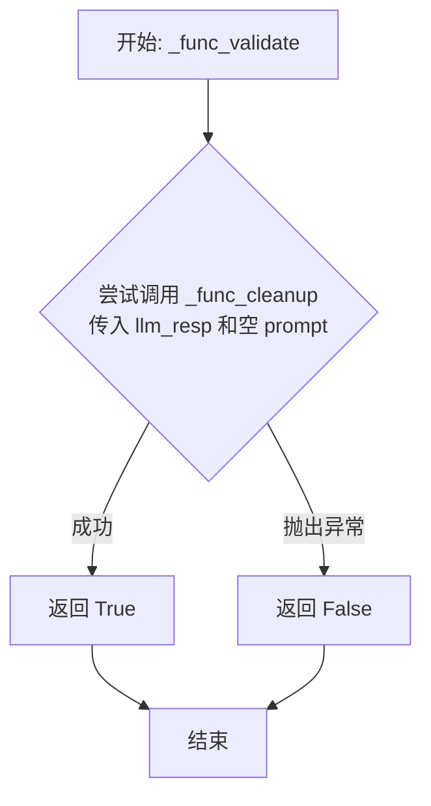
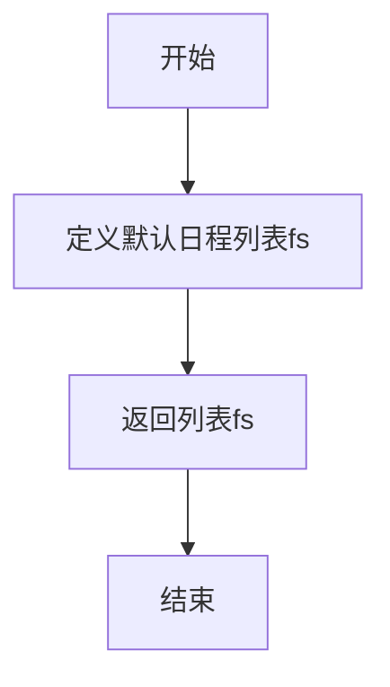
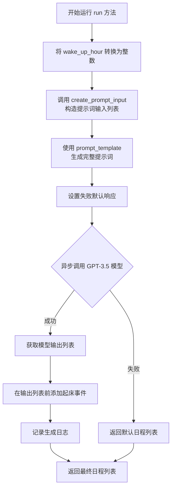

# `.\MetaGPT\metagpt\ext\stanford_town\actions\gen_daily_schedule.py` 详细设计文档

该代码实现了一个生成每日日程安排的动作类，属于斯坦福小镇项目的一部分。它继承自STAction基类，主要功能是根据角色的背景信息（身份、生活方式、当前日期等）和指定的起床时间，调用大语言模型生成该角色一天的详细活动计划。如果模型调用失败，会返回一个默认的日程作为后备方案。

## 整体流程

```mermaid
graph TD
    A[开始: run(role, wake_up_hour)] --> B[解析参数: wake_up_hour转int]
    B --> C[构建提示词输入: create_prompt_input]
    C --> D[加载提示词模板: daily_planning_v6.txt]
    D --> E[生成完整提示词: generate_prompt_with_tmpl_filename]
    E --> F[设置失败默认响应: _func_fail_default_resp]
    F --> G[调用LLM: _run_gpt35_max_tokens]
    G --> H{LLM响应是否有效?}
    H -- 是 --> I[清理和格式化响应: _func_cleanup]
    I --> J[在响应开头添加起床事件]
    J --> K[记录日志]
    K --> L[返回日程列表]
    H -- 否 --> M[返回默认日程列表]
```

## 类结构

```
STAction (动作基类)
└── GenDailySchedule (生成每日日程)
```

## 全局变量及字段


### `logger`
    
用于记录日志的全局日志记录器实例，提供不同级别的日志输出功能。

类型：`Logger`
    


### `GenDailySchedule.name`
    
动作类的名称标识符，固定为'GenDailySchedule'，用于区分不同的动作类型。

类型：`str`
    
    

## 全局函数及方法


### `GenDailySchedule._func_validate`

该方法用于验证大语言模型（LLM）生成的响应字符串 `llm_resp` 是否有效。其核心逻辑是尝试调用 `_func_cleanup` 方法来清理和解析响应字符串。如果清理过程成功完成（即没有抛出异常），则认为响应有效；否则，认为响应无效。

参数：

-  `llm_resp`：`str`，需要验证的大语言模型原始响应字符串。
-  `prompt`：`str`，生成 `llm_resp` 所使用的提示词。**注意**：在此方法的实现中，`prompt` 参数未被使用，调用 `_func_cleanup` 时传入了一个空字符串。

返回值：`bool`，如果 `_func_cleanup` 方法成功执行（未抛出异常），则返回 `True`，表示响应有效；否则返回 `False`，表示响应无效。

#### 流程图



#### 带注释源码

```python
    def _func_validate(self, llm_resp: str, prompt: str) -> bool:
        # 尝试调用 _func_cleanup 方法来清理和解析 llm_resp。
        # 注意：这里传入的 prompt 参数是一个空字符串，说明验证逻辑不依赖原始提示词。
        try:
            self._func_cleanup(llm_resp, prompt="")
        # 如果在清理过程中捕获到任何异常（Exception），则认为响应无效。
        except Exception:
            return False
        # 如果清理过程顺利完成，则认为响应有效。
        return True
```


### `GenDailySchedule._func_cleanup`

该方法用于清理和解析从大语言模型（LLM）返回的日程计划文本响应。它通过特定的分隔符和规则提取出有效的日程条目，并返回一个清理后的日程列表。

参数：

- `llm_resp`：`str`，大语言模型返回的原始文本响应。
- `prompt`：`str`，生成响应的提示词（在此方法中未使用）。

返回值：`list`，清理后的日程条目列表。

#### 流程图

```mermaid
flowchart TD
    A[开始] --> B[将llm_resp按')'分割成列表_cr]
    B --> C{遍历_cr中的每个元素i}
    C --> D[检查i的最后一个字符是否为数字]
    D -- 是 --> E[移除i的最后一个字符并去除首尾空格]
    E --> F[检查i的最后一个字符是否为'.'或',']
    F -- 是 --> G[移除最后一个字符并去除首尾空格]
    G --> H[将清理后的i添加到结果列表cr]
    D -- 否 --> I[跳过当前元素]
    F -- 否 --> H
    H --> C
    C -- 遍历结束 --> J[返回结果列表cr]
    I --> C
```

#### 带注释源码

```python
def _func_cleanup(self, llm_resp: str, prompt: str) -> list:
    cr = []  # 初始化清理后的结果列表
    _cr = llm_resp.split(")")  # 将原始响应按右括号')'分割成列表
    for i in _cr:  # 遍历分割后的每个元素
        if i[-1].isdigit():  # 检查元素的最后一个字符是否为数字
            i = i[:-1].strip()  # 移除最后一个字符（数字）并去除首尾空格
            if i[-1] == "." or i[-1] == ",":  # 检查移除数字后最后一个字符是否为句号或逗号
                cr += [i[:-1].strip()]  # 移除最后一个字符（标点）并去除首尾空格，然后添加到结果列表
    return cr  # 返回清理后的日程列表
```


### `GenDailySchedule._func_fail_default_resp`

该方法为`GenDailySchedule`类的一个受保护方法，用于在生成每日日程计划失败时，提供一个默认的、通用的日程安排列表作为后备响应。这确保了系统在无法从LLM获得有效输出时，仍能返回一个结构化的、合理的日程计划，提高了系统的鲁棒性。

参数：
-  `self`：`GenDailySchedule`，指向当前类实例的引用。

返回值：`list`，一个包含7个字符串元素的列表，每个字符串描述了一个时间段内的默认活动安排。

#### 流程图



#### 带注释源码

```python
    def _func_fail_default_resp(self) -> int:
        # 定义一个包含默认日程安排的字符串列表。
        # 列表中的每个字符串代表一个时间点或时间段的活动。
        fs = [
            "wake up and complete the morning routine at 6:00 am",  # 早上6点起床并完成晨间例行事务
            "eat breakfast at 7:00 am",                            # 早上7点吃早餐
            "read a book from 8:00 am to 12:00 pm",                # 上午8点到12点读书
            "have lunch at 12:00 pm",                              # 中午12点吃午餐
            "take a nap from 1:00 pm to 4:00 pm",                  # 下午1点到4点午睡
            "relax and watch TV from 7:00 pm to 8:00 pm",          # 晚上7点到8点放松看电视
            "go to bed at 11:00 pm",                               # 晚上11点睡觉
        ]
        # 返回该默认日程列表。
        # 注意：方法签名中声明的返回值类型为`int`，但实际返回的是`list`，这是一个类型注解错误。
        return fs
```


### `GenDailySchedule.run`

该方法用于为给定的角色生成一份每日日程安排。它首先根据角色的背景信息、生活方式、当前日期、名字以及指定的起床时间构造提示词，然后调用大语言模型（GPT-3.5）生成日程内容。如果模型调用失败，会返回一个默认的日程列表。最后，将生成的日程与固定的“起床”事件合并，并记录日志。

参数：
- `role`：`STRole`，需要生成日程的角色对象，包含其背景、生活方式等信息。
- `wake_up_hour`：`str`，角色起床的小时数（24小时制），例如 `"8"` 表示早上8点。

返回值：`list`，一个字符串列表，其中每个字符串代表日程中的一个事件，例如 `"wake up and complete the morning routine at 8:00 am"`。

#### 流程图



#### 带注释源码

```python
async def run(self, role: "STRole", wake_up_hour: str):
    # 内部函数：根据角色信息和起床时间构造提示词输入
    def create_prompt_input(role, wake_up_hour):
        prompt_input = []
        prompt_input += [role.scratch.get_str_iss()]          # 角色的背景/身份摘要
        prompt_input += [role.scratch.get_str_lifestyle()]    # 角色的生活方式描述
        prompt_input += [role.scratch.get_str_curr_date_str()] # 当前日期字符串
        prompt_input += [role.scratch.get_str_firstname()]    # 角色的名字
        prompt_input += [f"{str(wake_up_hour)}:00 am"]        # 格式化的起床时间
        return prompt_input

    # 1. 将字符串类型的起床小时转换为整数
    wake_up_hour = int(wake_up_hour)
    # 2. 指定使用的提示词模板文件名
    prompt_template = "daily_planning_v6.txt"
    # 3. 构造提示词输入
    prompt_input = create_prompt_input(role, wake_up_hour)
    # 4. 使用基类方法生成完整的提示词
    prompt = self.generate_prompt_with_tmpl_filename(prompt_input, prompt_template)
    # 5. 预先获取失败时的默认响应（一个日程列表）
    self.fail_default_resp = self._func_fail_default_resp()
    # 6. 异步调用 GPT-3.5 模型，生成日程，限制最大 token 数为 500
    output = await self._run_gpt35_max_tokens(prompt, max_tokens=500)
    # 7. 在模型生成的日程列表最前面，添加固定的“起床和晨间例行”事件
    output = [f"wake up and complete the morning routine at {wake_up_hour}:00 am"] + output
    # 8. 记录生成日志，包含角色名和当前类名
    logger.info(f"Role: {role.name} Action: {self.cls_name} output: {output}")
    # 9. 返回最终的日程列表
    return output
```

## 关键组件


### 张量索引与惰性加载

代码中未直接涉及张量操作或显式的惰性加载机制。该类主要处理文本数据的生成与解析，其数据流基于字符串处理和LLM调用。

### 反量化支持

代码中未涉及数值量化或反量化操作。所有数据处理均在文本层面进行，核心是解析LLM返回的字符串格式的日程安排。

### 量化策略

代码中未涉及任何量化策略。其核心功能是生成自然语言描述的日程安排，不涉及模型权重、激活值或任何其他数值的量化、压缩或精度调整。

### 提示工程与模板管理

该类通过`prompt_template`参数（`"daily_planning_v6.txt"`）指定外部模板文件，并使用`generate_prompt_with_tmpl_filename`方法将动态输入（`prompt_input`）与模板结合，生成最终发送给LLM的提示词。这是控制LLM输出格式和内容的关键策略。

### LLM响应后处理

该类包含`_func_cleanup`方法，用于清洗和解析LLM返回的原始文本响应（`llm_resp`），将其转换为结构化的日程列表。这是确保输出数据可用性的关键步骤。

### 默认失败响应机制

该类通过`_func_fail_default_resp`方法定义了一个默认的日程列表。当LLM调用失败或响应验证（`_func_validate`）不通过时，系统可以回退到此默认响应，保证了功能的鲁棒性。


## 问题及建议


### 已知问题

-   **代码健壮性不足**：`_func_cleanup` 方法中的清理逻辑过于简单且脆弱。它假设 LLM 的响应格式严格遵循特定模式（如以数字结尾并用括号分隔），一旦响应格式稍有变化（例如，数字后没有括号、使用不同的分隔符或包含额外的标点），解析就会失败或产生错误结果。这可能导致整个 `_func_validate` 校验失败，即使 LLM 返回了有效内容。
-   **硬编码的默认响应**：`_func_fail_default_resp` 方法返回一个固定的日程列表。这个默认日程（如早上6点起床、7点吃早餐等）可能完全不符合角色的背景、生活方式或当前日期（`role.scratch` 中的信息），导致在 LLM 调用失败时生成的日程缺乏个性化和上下文相关性，降低了系统的仿真真实感。
-   **错误处理机制不完善**：`run` 方法中，如果 `_run_gpt35_max_tokens` 调用失败，代码会直接使用 `self.fail_default_resp`（通过 `_func_fail_default_resp` 设置）。然而，这里没有对 LLM 调用过程中可能出现的网络错误、API 限制、超时等异常进行捕获和处理，只是依赖父类或底层方法可能存在的通用错误处理，缺乏针对此特定动作的细粒度错误恢复策略。
-   **潜在的整数转换风险**：`run` 方法开始时将 `wake_up_hour` 参数转换为整数（`int(wake_up_hour)`）。如果传入的 `wake_up_hour` 字符串无法转换为整数（例如，包含非数字字符或为空），将抛出 `ValueError` 异常，导致整个动作失败，且没有提供友好的错误信息或回退机制。
-   **输出格式不一致**：`run` 方法在最终输出列表前，硬性添加了 `"wake up and complete the morning routine at {wake_up_hour}:00 am"` 条目。这可能导致与 LLM 生成的后续条目在时间上冲突（例如，LLM 可能也生成了一个相近时间的起床事件），或者风格不一致（LLM 生成的条目描述方式可能不同）。

### 优化建议

-   **增强 `_func_cleanup` 的鲁棒性**：使用更健壮的解析方法，例如正则表达式，来提取日程条目。正则表达式可以更灵活地匹配各种可能的格式变化（例如，处理不同括号、分隔符、时间格式）。同时，增加对解析后数据的验证，确保每个条目包含有效的时间信息。
-   **改进默认响应生成逻辑**：`_func_fail_default_resp` 不应返回静态列表，而应基于传入的 `role` 和 `wake_up_hour` 参数生成一个更合理的默认日程。可以设计一个简单的算法，利用 `role.scratch` 中的信息（如生活方式、当前日期）来构建一个基础日程框架，使其更具角色个性化和上下文感知能力。
-   **完善异常处理与日志记录**：在 `run` 方法中，显式地捕获 `_run_gpt35_max_tokens` 调用可能抛出的异常（如 `APIError`, `Timeout`, `ValueError` 等）。在捕获异常后，除了使用改进后的默认响应，还应记录详细的错误日志（包括异常类型、堆栈跟踪和触发异常的输入），以便于问题排查和监控。可以考虑实现重试逻辑（带有退避策略）来应对暂时的网络或 API 故障。
-   **参数验证与安全转换**：在转换 `wake_up_hour` 为整数之前，先进行验证。检查其是否为有效数字字符串，并确保其在合理的范围内（例如，0-23）。如果无效，可以抛出一个更具信息量的自定义异常，或者提供一个合理的默认值（如 7），并记录警告。
-   **统一输出格式与去重**：重新考虑是否需要在输出中硬性添加起床事件。如果 LLM 的提示模板已经明确要求包含起床时间，则可能不需要额外添加。如果需要确保起床事件存在，可以在 `_func_cleanup` 之后，对解析出的日程列表进行检查和合并，移除时间冲突的重复条目，并确保所有时间表述格式一致（例如，统一为 “HH:MM am/pm” 格式）。这可以通过一个后处理函数来实现。
-   **提升代码可测试性**：将 `_func_cleanup`, `_func_fail_default_resp` 以及建议中的新后处理函数设计为纯函数，使其不依赖类状态。这样可以方便地编写单元测试，验证各种边界情况和异常输入下的行为。同时，为 `run` 方法的主要逻辑分支（成功、LLM失败、参数无效）编写集成测试或模拟测试。


## 其它


### 设计目标与约束

本模块的核心设计目标是生成一个符合角色背景和生活方式的、结构化的每日时间表。主要约束包括：1) 必须依赖外部大语言模型（GPT-3.5）生成初始计划内容；2) 生成的日程必须从指定的 `wake_up_hour` 开始；3) 输出格式必须为字符串列表，每个元素代表一个日程项；4) 在LLM响应解析失败或API调用异常时，必须提供一套默认的、合理的日程作为降级方案。

### 错误处理与异常设计

错误处理策略分为三个层次：
1.  **LLM响应验证与清理 (`_func_validate`, `_func_cleanup`)**: 在调用LLM后，首先通过 `_func_validate` 检查响应格式是否可被 `_func_cleanup` 方法成功解析。若验证失败，则整个 `run` 方法将回退到使用 `_func_fail_default_resp` 提供的默认日程。
2.  **LLM API调用异常**: `_run_gpt35_max_tokens` 方法内部应封装对LLM API的调用。任何在此过程中抛出的网络异常、认证错误或API限制错误，都应由其捕获并处理，最终导致 `run` 方法返回默认日程。
3.  **输入验证**: `run` 方法将 `wake_up_hour` 参数转换为整数，但未对转换异常（如输入非数字字符串）或数值范围（如超过24）进行检查，这依赖于调用方保证输入有效性，构成了潜在的设计缺陷。

### 数据流与状态机

1.  **数据流**:
    *   **输入**: `STRole` 对象（包含身份、生活方式、当前日期等背景信息）和 `wake_up_hour`（字符串格式的起床小时）。
    *   **处理**:
        a. 整合角色信息与起床时间，构造LLM提示词。
        b. 调用LLM API获取原始文本响应。
        c. 清洗和解析LLM响应，将其转换为日程项列表。
        d. 在列表首部插入固定的起床事件。
    *   **输出**: 一个字符串列表，按时间顺序描述了从起床到睡觉的每日计划。
2.  **状态机**: 本模块逻辑相对线性，可视为一个简单状态机：
    *   **状态S0 (初始)**: 接收输入参数。
    *   **状态S1 (提示词构建)**: 成功构建提示词。
    *   **状态S2 (LLM调用)**: 成功调用LLM并获得响应。
    *   **状态S3 (响应解析)**: 成功解析LLM响应。
    *   **状态S4 (结果组装)**: 成功插入起床事件并记录日志。
    *   **状态S_error (错误)**: 在S1、S2、S3任一环节失败，则跳转至此状态，返回默认日程。S4为最终成功状态。

### 外部依赖与接口契约

1.  **外部依赖**:
    *   **大语言模型 (GPT-3.5)**: 核心依赖，通过 `_run_gpt35_max_tokens` 方法调用。其可用性、性能及输出格式的稳定性直接影响本模块功能。
    *   **模板文件 (`daily_planning_v6.txt`)**: 提示词模板，其内容结构决定了LLM接收的指令和上下文，是影响输出质量的关键配置。
    *   **父类 `STAction` 及 `generate_prompt_with_tmpl_filename` 方法**: 依赖父类提供提示词生成和LLM调用等基础能力。
    *   **`STRole` 类**: 依赖其 `scratch` 属性提供的 `get_str_iss`, `get_str_lifestyle`, `get_str_curr_date_str`, `get_str_firstname` 方法来获取角色上下文。
2.  **接口契约**:
    *   **`run` 方法**: 是模块的主要对外接口。它承诺接收一个 `STRole` 实例和一个表示小时的字符串，并返回一个字符串列表格式的日程。在内部处理失败时，它承诺返回一个非空的默认日程列表，保证调用方总能获得一个结果。
    *   **`_func_cleanup` 方法**: 是一个脆弱的内部契约，其解析逻辑严重依赖于LLM响应的特定格式（例如，以数字和右括号结尾的条目）。如果LLM的输出格式发生变化，此方法很可能失效。

    