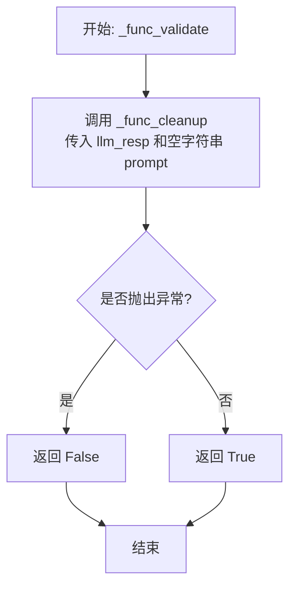
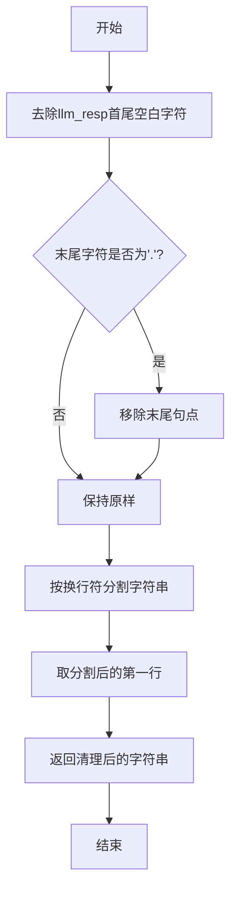
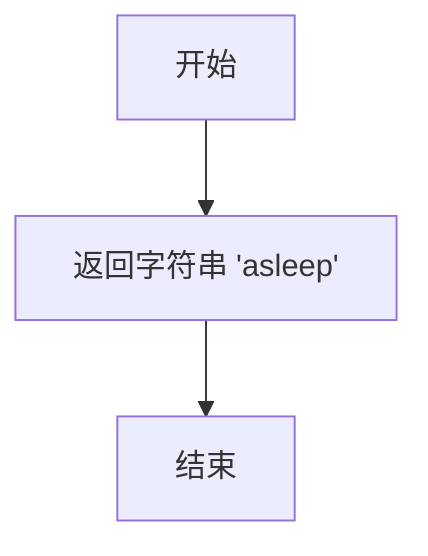
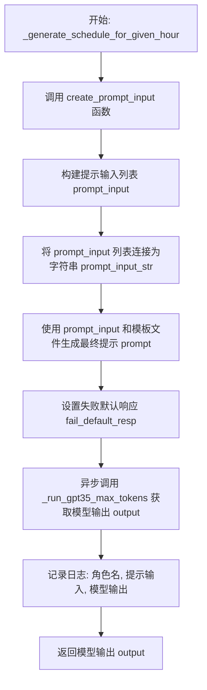
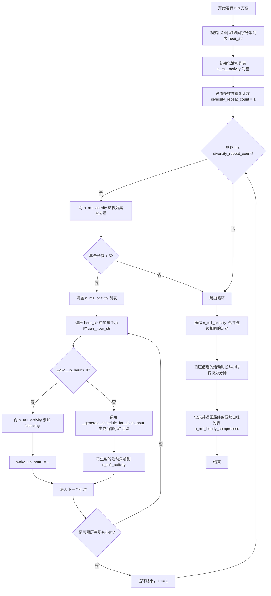

# `.\MetaGPT\metagpt\ext\stanford_town\actions\gen_hourly_schedule.py` 详细设计文档

该代码定义了一个名为 GenHourlySchedule 的类，它继承自 STAction，核心功能是为一个角色（STRole）生成一天24小时的详细日程安排。它通过调用大语言模型（GPT-3.5）为每个小时生成活动描述，然后将连续相同的活动压缩为带持续时间的任务块，最终输出一个以分钟为单位的日程列表。

## 整体流程

```mermaid
graph TD
    A[开始: run(wake_up_hour)] --> B[初始化24小时时间字符串列表]
    B --> C{循环 diversity_repeat_count 次}
    C --> D[遍历24小时]
    D --> E{当前小时 < wake_up_hour?}
    E -- 是 --> F[添加'sleeping'活动]
    E -- 否 --> G[调用 _generate_schedule_for_given_hour]
    G --> H[构建提示词并调用LLM]
    H --> I[记录日志并收集活动]
    I --> J[完成24小时遍历]
    J --> K[压缩连续相同活动]
    K --> L[将小时转换为分钟]
    L --> M[返回压缩后的日程列表]
```

## 类结构

```
STAction (基类)
└── GenHourlySchedule (生成小时级日程)
```

## 全局变量及字段


### `get_random_alphanumeric`
    
生成一个长度在i和j之间的随机字母数字字符串。

类型：`function`
    


### `GenHourlySchedule.name`
    
动作类的名称，固定为'GenHourlySchedule'。

类型：`str`
    
    

## 全局函数及方法

### `get_random_alphanumeric`

生成一个指定长度范围内的随机字母数字字符串。

参数：

- `i`：`int`，最小长度，默认为6
- `j`：`int`，最大长度，默认为6

返回值：`str`，一个长度在i和j之间的随机字母数字字符串

#### 流程图

```mermaid
graph TD
    A[开始] --> B[生成随机长度k<br>k = random.randint(i, j)]
    B --> C[生成随机字符串x<br>x = ''.join(random.choices(字母+数字, k=k))]
    C --> D[返回x]
    D --> E[结束]
```

#### 带注释源码

```python
def get_random_alphanumeric(i=6, j=6):
    """
    返回一个长度在i和j之间的随机字母数字字符串。

    输入:
        i: 最小长度范围
        j: 最大长度范围
    输出:
        一个长度在i和j之间的字母数字字符串。
    """
    # 在i和j之间（包含两端）随机选择一个整数作为字符串长度
    k = random.randint(i, j)
    # 从字母（大小写）和数字中随机选择k个字符，并连接成字符串
    x = "".join(random.choices(string.ascii_letters + string.digits, k=k))
    # 返回生成的随机字符串
    return x
```


### `GenHourlySchedule._func_validate`

该方法用于验证大语言模型（LLM）对提示词（prompt）的响应（`llm_resp`）是否有效。其验证逻辑是尝试调用同一类中的清理方法 `_func_cleanup` 来处理响应文本。如果清理过程成功（即没有抛出异常），则认为响应有效；否则认为响应无效。

参数：

-  `llm_resp`：`str`，大语言模型返回的原始响应文本。
-  `prompt`：`str`，生成该响应所使用的提示词。**注意**：在此方法的实现中，`prompt` 参数未被使用，它被传递给 `_func_cleanup` 时使用了空字符串 `""` 作为默认值。

返回值：`bool`，如果响应文本可以被成功清理，则返回 `True`，否则返回 `False`。

#### 流程图



#### 带注释源码

```python
def _func_validate(self, llm_resp: str, prompt: str) -> bool:
    # 尝试调用清理函数来处理LLM的响应。
    # 如果清理过程成功（无异常），则认为响应有效。
    try:
        # 注意：这里传入的 prompt 参数被硬编码为空字符串 ""，
        # 表明当前的验证逻辑不依赖原始提示词，仅依赖响应文本本身的结构或格式。
        self._func_cleanup(llm_resp, prompt="")
    except Exception:
        # 如果在清理过程中捕获到任何异常，则验证失败。
        return False
    # 清理过程顺利完成，验证成功。
    return True
```


### `GenHourlySchedule._func_cleanup`

该方法用于清理和格式化从大语言模型（LLM）获取的响应文本。其主要功能是去除响应文本首尾的空白字符、移除末尾的句点，并仅保留第一行内容，最终返回一个清理后的字符串。

参数：

- `llm_resp`：`str`，从大语言模型获取的原始响应文本。
- `prompt`：`str`，生成响应时使用的提示词。在此方法中未使用，但为保持接口一致性而保留。

返回值：`str`，经过清理和格式化后的字符串。

#### 流程图



#### 带注释源码

```python
def _func_cleanup(self, llm_resp: str, prompt: str) -> list:
    # 1. 去除响应字符串首尾的空白字符（如空格、换行符）
    cr = llm_resp.strip()
    # 2. 检查清理后的字符串最后一个字符是否为句点'.'，如果是则移除它
    if cr[-1] == ".":
        cr = cr[:-1]
    # 3. 将字符串按换行符'\n'分割成列表，并只取第一行内容
    #    这确保了即使LLM返回多行文本，也只使用第一行作为有效输出
    cr = cr.split("\n")[0]
    # 4. 返回清理和截取后的字符串
    return cr
```


### `GenHourlySchedule._func_fail_default_resp`

该方法作为生成小时级日程计划（`GenHourlySchedule`）操作失败时的默认响应生成器。当主流程（如调用大语言模型生成日程）失败时，该方法提供一个简单、固定的默认值，以确保系统在异常情况下仍能返回一个有效的、可预测的响应，从而维持系统的鲁棒性。

参数：
- 无

返回值：`int`，返回一个表示默认活动状态的整数。根据源码，实际返回的是一个字符串 `"asleep"`，但方法的类型注解声明返回 `int`，这存在类型注解与实际返回值不匹配的问题。

#### 流程图



#### 带注释源码

```python
def _func_fail_default_resp(self) -> int:
    # 定义一个固定的字符串作为默认响应。
    fs = "asleep"
    # 返回该字符串。注意：方法类型注解为 `-> int`，但实际返回的是 `str`，存在类型不匹配。
    return fs
```


### `GenHourlySchedule._generate_schedule_for_given_hour`

该方法是一个异步方法，用于为给定的角色（`STRole`）在特定小时（`curr_hour_str`）生成一项日程活动。它通过构建一个包含日程格式、角色信息、先前日程和特定提示的输入，调用大语言模型（GPT-3.5）来生成该小时的活动描述。该方法主要用于在生成全天24小时日程的循环中，为每个尚未安排活动的小时生成具体内容。

参数：

-  `role`：`STRole`，需要生成日程的角色对象，包含其个人信息、状态等。
-  `curr_hour_str`：`str`，当前需要生成活动的小时字符串（例如 "01:00 AM"）。
-  `p_f_ds_hourly_org`：`list`，一个列表，包含在当前小时之前已经为其他小时生成的活动描述。用于为模型提供上下文。
-  `hour_str`：`list`，一个包含全天24小时时间标签的字符串列表（例如 ["00:00 AM", "01:00 AM", ...]），用于构建完整的日程格式模板。
-  `intermission2`：`str`，可选参数，额外的提示信息字符串，可以插入到给模型的提示中，用于引导或约束模型的输出。

返回值：`str`，返回一个字符串，描述角色在`curr_hour_str`这个小时进行的活动（例如 "working on her painting"）。

#### 流程图



#### 带注释源码

```python
async def _generate_schedule_for_given_hour(
        self, role: "STRole", curr_hour_str, p_f_ds_hourly_org, hour_str, intermission2=None
    ):
        # 内部函数：用于构建发送给大语言模型的提示输入。
        def create_prompt_input(persona, curr_hour_str, p_f_ds_hourly_org, hour_str, intermission2=None):
            # 1. 构建一个空的日程格式模板，覆盖全天所有小时。
            schedule_format = ""
            for i in hour_str:
                schedule_format += f"[{persona.scratch.get_str_curr_date_str()} -- {i}]"
                schedule_format += " Activity: [Fill in]\n"
            schedule_format = schedule_format[:-1]  # 移除最后一个换行符

            # 2. 构建一个字符串，描述角色今天原计划要完成的事项（daily requirements）。
            intermission_str = "Here the originally intended hourly breakdown of"
            intermission_str += f" {persona.scratch.get_str_firstname()}'s schedule today: "
            for count, i in enumerate(persona.scratch.daily_req):
                intermission_str += f"{str(count + 1)}) {i}, "
            intermission_str = intermission_str[:-2]  # 移除最后的逗号和空格

            # 3. 如果存在先前已生成的活动（p_f_ds_hourly_org），将其格式化为提示的一部分。
            prior_schedule = ""
            if p_f_ds_hourly_org:
                prior_schedule = "\n"
                for count, i in enumerate(p_f_ds_hourly_org):
                    # 为每个活动生成一个随机ID并格式化
                    prior_schedule += f"[(ID:{get_random_alphanumeric()})"
                    prior_schedule += f" {persona.scratch.get_str_curr_date_str()} --"
                    prior_schedule += f" {hour_str[count]}] Activity:"
                    prior_schedule += f" {persona.scratch.get_str_firstname()}"
                    prior_schedule += f" is {i}\n"

            # 4. 构建提示的结尾部分，明确指出当前需要模型填充的小时和活动开头。
            prompt_ending = f"[(ID:{get_random_alphanumeric()})"
            prompt_ending += f" {persona.scratch.get_str_curr_date_str()}"
            prompt_ending += f" -- {curr_hour_str}] Activity:"
            prompt_ending += f" {persona.scratch.get_str_firstname()} is"

            # 5. 处理可选的额外提示信息。
            if intermission2:
                intermission2 = f"\n{intermission2}"

            # 6. 将所有部分组合成一个提示输入列表。
            prompt_input = []
            prompt_input += [schedule_format]          # 空日程模板
            prompt_input += [persona.scratch.get_str_iss()] # 角色核心身份陈述
            prompt_input += [prior_schedule + "\n"]    # 先前日程（如有）
            prompt_input += [intermission_str]         # 原计划事项
            if intermission2:
                prompt_input += [intermission2]        # 额外提示（如有）
            else:
                prompt_input += [""]                   # 占位空字符串
            prompt_input += [prompt_ending]            # 当前小时提示结尾

            return prompt_input

        # 主逻辑开始
        prompt_template = "generate_hourly_schedule_v2.txt"  # 使用的提示模板文件名
        # 调用内部函数构建提示输入
        prompt_input = create_prompt_input(role, curr_hour_str, p_f_ds_hourly_org, hour_str, intermission2)
        # 将提示输入列表连接成字符串，用于日志记录
        prompt_input_str = "\n".join(prompt_input)
        # 使用基类方法，结合模板文件和输入列表生成最终发送给LLM的提示字符串
        prompt = self.generate_prompt_with_tmpl_filename(prompt_input, prompt_template)
        # 设置如果LLM调用失败或验证不通过时的默认返回值
        self.fail_default_resp = self._func_fail_default_resp()
        # 异步调用GPT-3.5模型，请求生成最多50个token的响应
        output = await self._run_gpt35_max_tokens(prompt, max_tokens=50)
        # 记录详细的运行日志，包括角色、输入和输出
        logger.info(
            f"Role: {role.name} _generate_schedule_for_given_hour prompt_input: {prompt_input_str}, "
            f"output: {output}"
        )
        # 返回模型生成的活动描述字符串
        return output
```


### `GenHourlySchedule.run`

该方法用于为给定的角色生成一个24小时的详细日程安排。它首先根据角色的起床时间填充睡眠时段，然后为每个非睡眠小时调用大语言模型生成具体的活动描述。最后，将生成的每小时活动列表压缩为连续活动及其持续时间的格式，并将持续时间从小时转换为分钟。

参数：

- `role`：`STRole`，表示需要生成日程的角色对象，包含角色的个人信息和状态。
- `wake_up_hour`：`int`，表示角色的起床时间（小时），用于确定从一天的哪个时间点开始安排非睡眠活动。

返回值：`list`，返回一个列表，其中每个元素是一个包含活动名称（字符串）和持续时间（整数，以分钟为单位）的子列表，代表压缩后的24小时日程。

#### 流程图



#### 带注释源码

```python
async def run(self, role: "STRole", wake_up_hour: int):
    # 定义一天24小时的时间字符串表示
    hour_str = [
        "00:00 AM", "01:00 AM", "02:00 AM", "03:00 AM", "04:00 AM", "05:00 AM",
        "06:00 AM", "07:00 AM", "08:00 AM", "09:00 AM", "10:00 AM", "11:00 AM",
        "12:00 PM", "01:00 PM", "02:00 PM", "03:00 PM", "04:00 PM", "05:00 PM",
        "06:00 PM", "07:00 PM", "08:00 PM", "09:00 PM", "10:00 PM", "11:00 PM",
    ]
    n_m1_activity = []  # 初始化用于存储每小时活动的列表
    diversity_repeat_count = 1  # 设置多样性生成循环次数（当前为1，TODO 提示可改为3）
    # 开始多样性生成循环，旨在生成多样化的日程（当前循环只执行一次）
    for i in range(diversity_repeat_count):
        logger.info(f"diversity_repeat_count idx: {i}")
        n_m1_activity_set = set(n_m1_activity)  # 将当前活动列表转换为集合以检查多样性
        # 如果活动种类少于5种，则重新生成整个日程
        if len(n_m1_activity_set) < 5:
            n_m1_activity = []  # 清空活动列表以重新生成
            # 遍历一天中的每一个小时
            for count, curr_hour_str in enumerate(hour_str):
                # 如果还有剩余的“睡眠”小时需要分配（根据 wake_up_hour）
                if wake_up_hour > 0:
                    n_m1_activity += ["sleeping"]  # 为该小时添加“睡眠”活动
                    wake_up_hour -= 1  # 减少剩余的睡眠小时数
                else:
                    # 对于非睡眠小时，调用内部方法生成具体的活动描述
                    logger.info(f"_generate_schedule_for_given_hour idx: {count}, n_m1_activity: {n_m1_activity}")
                    n_m1_activity += [
                        await self._generate_schedule_for_given_hour(role, curr_hour_str, n_m1_activity, hour_str)
                    ]

    # Step 1. 压缩每小时日程：将连续相同的活动合并，并记录其持续小时数
    _n_m1_hourly_compressed = []
    prev = None  # 记录前一个活动
    prev_count = 0  # 记录前一个活动的连续计数
    for i in n_m1_activity:
        if i != prev:  # 如果当前活动与前一个不同
            prev_count = 1
            _n_m1_hourly_compressed += [[i, prev_count]]  # 添加新活动项
            prev = i
        elif _n_m1_hourly_compressed:  # 如果活动相同且压缩列表不为空
            _n_m1_hourly_compressed[-1][1] += 1  # 增加最后一个活动的持续时间

    # Step 2. 将持续时间从小时转换为分钟（1小时 = 60分钟）
    n_m1_hourly_compressed = []
    for task, duration in _n_m1_hourly_compressed:
        n_m1_hourly_compressed += [[task, duration * 60]]

    # 记录生成的最终日程并返回
    logger.info(f"Role: {role.name} Action: {self.cls_name} output: {n_m1_hourly_compressed}")
    return n_m1_hourly_compressed
```

## 关键组件


### STAction 基类

作为所有具体动作（Action）的抽象基类，定义了动作执行、验证、清理和失败默认响应的标准接口和流程。

### 提示词生成与模板引擎

通过 `generate_prompt_with_tmpl_filename` 方法，结合动态构建的输入列表和预定义的文本模板文件（如 `generate_hourly_schedule_v2.txt`），生成用于大语言模型（LLM）的最终提示词。

### 大语言模型（LLM）交互器

通过 `_run_gpt35_max_tokens` 方法，封装了与 GPT-3.5 等大语言模型的异步交互过程，负责发送提示词并获取模型生成的文本响应。

### 日程压缩与扩展算法

包含两个核心步骤：1）将连续的相同活动合并，并记录持续时间（小时）；2）将小时级的时间单位转换为分钟级，为后续的细粒度调度提供基础数据。

### 角色（STRole）状态与数据访问器

通过 `role.scratch` 对象，提供了对角色内部状态（如当前日期、名字、日常需求）的统一访问接口，是构建上下文感知提示词的关键数据来源。


## 问题及建议


### 已知问题

-   **硬编码的提示词模板文件名**：`_generate_schedule_for_given_hour` 方法中直接使用了字符串 `"generate_hourly_schedule_v2.txt"` 作为模板文件名。这使得模板的路径和名称难以修改，降低了代码的灵活性和可维护性。
-   **硬编码的模型调用参数**：`_run_gpt35_max_tokens` 方法被调用时，`max_tokens` 参数被固定为 `50`。这个值可能不适用于所有场景，限制了生成内容的长度和灵活性。
-   **硬编码的重复次数**：`run` 方法中的 `diversity_repeat_count` 变量被硬编码为 `1`（注释中提示原为 `3`）。这种硬编码使得调整生成日程的多样性尝试次数变得困难。
-   **潜在的逻辑错误**：在 `run` 方法的循环中，当 `wake_up_hour > 0` 时，会向 `n_m1_activity` 列表添加 `"sleeping"` 并递减 `wake_up_hour`。然而，如果 `wake_up_hour` 的值大于 `hour_str` 列表的长度（24），此逻辑可能导致索引错误或无限循环（尽管在实际上下文中 `wake_up_hour` 可能被限制）。更稳健的做法是添加一个保护条件。
-   **压缩算法缺陷**：在 `run` 方法中压缩日程的步骤（Step 1）存在逻辑错误。`prev_count` 变量在每次遇到新活动时被重置为 `1`，但随后立即被添加到 `_n_m1_hourly_compressed` 列表中。这意味着每个活动的初始计数都是 `1`，然后后续遇到相同活动时再递增。虽然最终结果可能正确，但逻辑不够清晰。更标准的做法是遇到新活动时，先将前一个活动（如果存在）及其计数加入列表。
-   **异常处理不足**：`_func_validate` 和 `_func_cleanup` 方法用于验证和清理 LLM 的响应。`_func_validate` 仅通过尝试执行 `_func_cleanup` 并捕获异常来判断响应是否有效。如果 `_func_cleanup` 中的清理逻辑本身不完善（例如，未能处理所有可能的无效响应格式），可能导致误判。此外，当验证失败时，返回的默认响应（`"asleep"`）可能过于简单，无法反映复杂的失败场景。
-   **代码可读性与结构**：`_generate_schedule_for_given_hour` 方法内部嵌套定义了 `create_prompt_input` 函数。虽然这限制了其作用域，但对于较长的函数，将内部函数提取为类方法或模块级函数可能提高可读性和可测试性。此外，部分字符串拼接逻辑较长，可读性较差。
-   **缺乏类型注解**：部分方法（如 `_generate_schedule_for_given_hour`）的参数和返回值缺乏详细的类型注解，降低了代码的清晰度和 IDE 支持。
-   **全局函数依赖**：`get_random_alphanumeric` 函数被用作生成随机 ID 的工具。虽然目前是模块级函数，但如果项目规模扩大，这类工具函数最好集中管理。

### 优化建议

-   **配置化提示词与参数**：将提示词模板文件名（如 `"generate_hourly_schedule_v2.txt"`）、LLM 调用参数（如 `max_tokens=50`）以及控制参数（如 `diversity_repeat_count`）抽取到配置文件或类属性中。这样可以在不修改代码的情况下调整行为，便于测试和部署。
-   **修复压缩逻辑**：重构 `run` 方法中的日程压缩逻辑（Step 1），使其更清晰、健壮。例如，可以使用 `itertools.groupby` 或显式地遍历列表并正确累加计数。
-   **增强输入验证与边界处理**：在 `run` 方法中，对 `wake_up_hour` 参数添加验证，确保其值在合理范围内（例如，0到23之间）。同时，优化 `_func_validate` 和 `_func_cleanup` 方法，使其能更精确地识别和处理 LLM 返回的各种格式，并提供更丰富的默认或回退响应。
-   **提升代码结构与可读性**：
    -   考虑将 `_generate_schedule_for_given_hour` 方法内的 `create_prompt_input` 函数提取为独立的辅助方法或模块级函数。
    -   对长字符串拼接使用 `str.join()` 或 `str.format()`/f-string 的多行格式，以提高可读性。
    -   为所有方法参数和返回值添加完整的类型注解。
-   **集中工具函数管理**：考虑将 `get_random_alphanumeric` 这类通用工具函数移至项目级的工具模块中，促进代码复用和一致性。
-   **增加日志与监控**：在关键步骤（如 LLM 调用、日程压缩）增加更详细的日志记录，便于调试和监控系统运行状态。当前日志虽然存在，但可以更结构化。
-   **考虑性能优化**：如果 `diversity_repeat_count` 被调高（例如从1改为3），`run` 方法会多次调用 LLM，这可能成为性能瓶颈。可以考虑异步并发执行这些调用（如果 LLM 客户端支持），或者实现缓存机制以避免重复生成相同小时的日程。
-   **改进错误处理**：在 `_generate_schedule_for_given_hour` 和 `run` 方法中，增加更具体的异常捕获和处理逻辑，例如处理网络请求失败、LLM 服务不可用等情况，并提供有意义的错误信息或降级方案。


## 其它


### 设计目标与约束

本模块的核心设计目标是生成一个符合角色（`STRole`）背景和当前状态的、连贯且合理的24小时日程安排。其核心约束包括：1) 输出必须覆盖完整的24小时周期；2) 日程活动需基于角色的个人背景（`scratch`）和每日需求（`daily_req`）生成；3) 生成过程需考虑已规划的部分日程（`p_f_ds_hourly_org`）以保证连续性；4) 实现上依赖于大语言模型（GPT-3.5）进行核心的日程内容生成，并需处理其输出的不确定性和格式化问题。

### 错误处理与异常设计

模块的错误处理主要围绕大语言模型（LLM）调用的可靠性和输出格式的合规性展开。具体策略包括：1) 在 `_func_validate` 方法中，通过尝试调用清理函数 `_func_cleanup` 来验证LLM响应的基本格式有效性，若清理过程抛出异常则视为无效响应。2) 当LLM调用失败或响应验证不通过时，通过 `_func_fail_default_resp` 方法返回默认活动“asleep”作为降级方案，确保流程不中断。3) 在 `run` 方法中，通过 `diversity_repeat_count` 循环尝试生成多样化的日程，若生成的独特活动过少（`<5`）则重新生成，这是一种简单的重试与多样性保障机制。日志记录贯穿关键步骤，便于问题追踪。

### 数据流与状态机

模块的数据流始于 `run` 方法，输入为角色对象和起床时间。内部状态 `n_m1_activity` 列表逐步构建24小时的活动序列。核心数据转换流程为：1) 按小时顺序调用 `_generate_schedule_for_given_hour`，结合角色信息和已有日程片段，生成每个小时的活动描述。2) 将得到的24个活动字符串列表（`n_m1_activity`）进行压缩（第一步压缩），合并连续相同的活动并记录持续时间（小时数）。3) 将小时级持续时间转换为分钟级（第二步压缩），形成最终的 `[活动, 分钟数]` 对列表作为输出。该过程可视为一个简单的线性状态累积与后处理流程。

### 外部依赖与接口契约

1.  **父类依赖**：继承自 `STAction` 类，依赖其提供的 `generate_prompt_with_tmpl_filename` 方法（用于组装提示词）和 `_run_gpt35_max_tokens` 方法（用于调用LLM）。
2.  **LLM服务**：强依赖 `_run_gpt35_max_tokens` 方法背后的GPT-3.5模型服务，该服务的可用性、延迟和输出质量直接影响本模块功能。
3.  **模板文件**：依赖外部提示词模板文件 `generate_hourly_schedule_v2.txt`，该文件的内容结构定义了与LLM交互的指令和格式。
4.  **角色对象接口**：`run` 方法及内部方法接收 `STRole` 类型的 `role` 参数，并调用其 `scratch` 属性的 `get_str_curr_date_str`, `get_str_iss`, `get_str_firstname` 方法以及访问 `daily_req` 属性，这构成了与角色模块的接口契约。
5.  **日志系统**：依赖 `metagpt.logs.logger` 进行运行信息记录。

### 安全与合规考量

1.  **提示词注入风险**：`create_prompt_input` 函数动态拼接来自角色对象（`persona.scratch`）的用户数据到提示词中。需确保这些数据来源可信，或进行适当的清洗和转义，以防止恶意数据篡改提示词意图或导致LLM输出异常内容。当前代码未见显式清洗。
2.  **数据隐私**：角色的日程信息（如姓名、日程安排）可能包含敏感数据。在日志记录中（如 `logger.info` 行），直接输出了完整的提示词输入和LLM响应，存在敏感信息泄露风险。应考虑对日志内容进行脱敏处理或控制日志级别。
3.  **资源消耗与滥用**：`diversity_repeat_count` 循环（当前为1，但注释提示可能改为3）会导致多次调用LLM。若无限制，可能造成不必要的API调用成本和服务负载。需确保该循环有合理的终止条件（当前基于活动多样性判断）和上限。

### 测试策略建议

1.  **单元测试**：
    *   `get_random_alphanumeric`：测试生成字符串的长度范围及字符集。
    *   `_func_validate` 与 `_func_cleanup`：测试对合法及非法LLM响应字符串的处理。
    *   `_func_fail_default_resp`：验证默认返回值。
    *   `create_prompt_input`：测试给定输入下生成的提示词列表结构是否符合预期。
2.  **集成测试**：
    *   模拟 `STRole` 对象和 `STAction` 父类方法，测试 `_generate_schedule_for_given_hour` 的完整流程，包括提示词生成、LLM模拟调用（使用固定响应）、响应处理和日志记录。
    *   测试 `run` 方法的完整流程：模拟小时循环、LLM调用、日程压缩与扩展逻辑，验证最终输出的格式（24小时，分钟数总和为1440）和基本合理性。
3.  **场景测试**：
    *   测试不同 `wake_up_hour` 参数下，前置“sleeping”活动的正确插入。
    *   测试当 `diversity_repeat_count` 循环触发重新生成时，逻辑是否正确执行。
    *   测试LLM返回异常或默认响应时，系统是否能正常降级并完成流程。

    