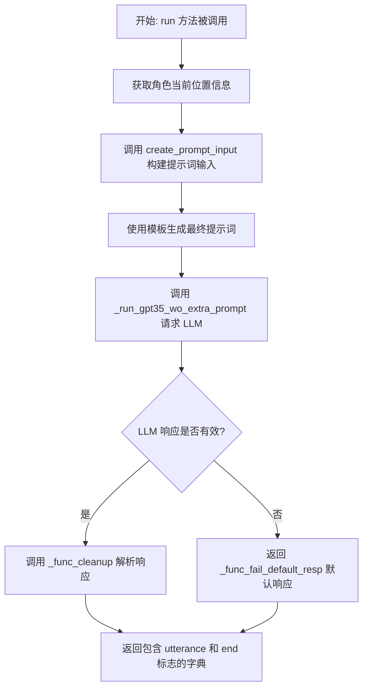
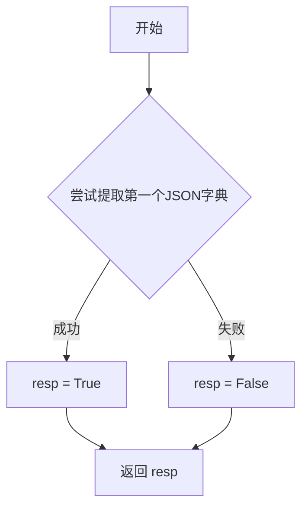
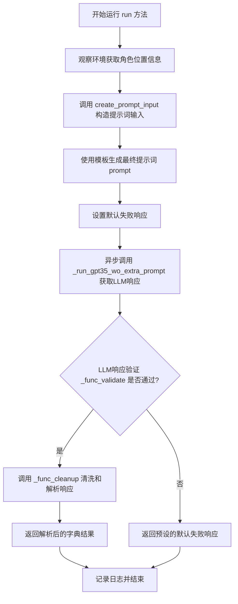
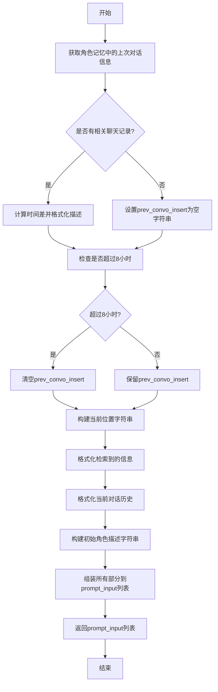

# `.\MetaGPT\metagpt\ext\stanford_town\actions\gen_iter_chat_utt.py` 详细设计文档

该代码实现了一个名为 GenIterChatUTT 的动作类，用于在斯坦福小镇模拟环境中生成角色间的迭代对话内容。它通过整合角色的记忆、当前上下文、检索到的相关信息以及对话历史，构造提示词并调用大语言模型（GPT-3.5）来生成下一轮对话的回应，并判断对话是否应该结束。

## 整体流程



## 类结构

```
STAction (基类)
└── GenIterChatUTT (生成迭代对话动作)
```

## 全局变量及字段


### `GenIterChatUTT.name`
    
动作类的名称标识，固定为'GenIterChatUTT'，用于在系统中唯一标识此动作类型。

类型：`str`
    
    

## 全局函数及方法

### `GenIterChatUTT._func_validate`

该方法用于验证大语言模型（LLM）的响应字符串是否包含有效的 JSON 字典。它通过尝试从响应中提取第一个 JSON 字典来判断响应格式是否正确。

参数：
- `llm_resp`：`str`，大语言模型的原始响应字符串。
- `prompt`：`str`，生成此响应的原始提示词（在本方法中未使用）。

返回值：`bool`，如果成功从 `llm_resp` 中提取到第一个 JSON 字典则返回 `True`，否则返回 `False`。

#### 流程图



#### 带注释源码

```python
def _func_validate(self, llm_resp: str, prompt: str) -> bool:
    # 初始化返回值为 False
    resp = False
    try:
        # 尝试从 llm_resp 中提取第一个 JSON 字典
        # 如果提取成功，说明响应格式基本正确
        _ = extract_first_json_dict(llm_resp)
        # 将返回值设置为 True
        resp = True
    except Exception:
        # 如果提取过程中发生任何异常（如无有效JSON、JSON格式错误等）
        # 则保持 resp 为 False，并静默处理异常
        pass
    # 返回验证结果
    return resp
```


### `GenIterChatUTT._func_cleanup`

该方法用于清理和解析大语言模型（LLM）的响应文本。其核心功能是从LLM返回的字符串中提取第一个JSON字典，并将其转换为一个结构化的字典对象，包含对话的“话语”（utterance）和对话是否“结束”（end）的标志。

参数：

-  `llm_resp`：`str`，大语言模型返回的原始响应字符串。
-  `prompt`：`str`，生成此响应的原始提示词（在本方法中未使用）。

返回值：`dict`，一个包含两个键的字典：
    - `"utterance"`：`str`，解析出的对话话语内容。
    - `"end"`：`bool`，指示对话是否应该结束的标志。如果解析出的第二个值包含字母‘f’或‘F’，则标志为`False`（继续对话），否则为`True`（结束对话）。

#### 流程图

```mermaid
graph TD
    A[开始: _func_cleanup] --> B[调用 extract_first_json_dict 解析 llm_resp];
    B --> C{解析成功?};
    C -- 是 --> D[初始化 cleaned_dict 和 cleaned 列表];
    D --> E[遍历 gpt_response 的键值对];
    E --> F[将每个值 val 添加到 cleaned 列表];
    F --> G[将 cleaned[0] 赋值给 cleaned_dict['utterance']];
    G --> H[设置 cleaned_dict['end'] 为 True];
    H --> I{cleaned[1] 包含 'f' 或 'F'?};
    I -- 是 --> J[设置 cleaned_dict['end'] 为 False];
    I -- 否 --> K[保持 cleaned_dict['end'] 为 True];
    J --> L[返回 cleaned_dict];
    K --> L;
    C -- 否/异常 --> M[流程终止于 extract_first_json_dict 内部];
```

#### 带注释源码

```python
    def _func_cleanup(self, llm_resp: str, prompt: str) -> dict:
        # 从LLM响应字符串中提取第一个JSON字典。
        # 此函数假设 llm_resp 包含有效的JSON，并由 extract_first_json_dict 处理可能的异常或格式问题。
        gpt_response = extract_first_json_dict(llm_resp)

        # 初始化一个空字典用于存放清理后的结果。
        cleaned_dict = dict()
        # 初始化一个列表，用于临时存储从JSON字典中提取的所有值。
        cleaned = []
        # 遍历提取出的JSON字典的所有项。
        for key, val in gpt_response.items():
            # 将每个值（val）添加到 cleaned 列表中。注意：这里忽略了键（key）。
            cleaned += [val]
        # 将 cleaned 列表中的第一个元素作为“话语”内容存入结果字典。
        cleaned_dict["utterance"] = cleaned[0]
        # 默认设置对话“结束”标志为 True。
        cleaned_dict["end"] = True
        # 检查 cleaned 列表中的第二个元素（索引为1）的字符串表示中是否包含 'f' 或 'F'。
        # 如果包含，则将“结束”标志设置为 False，表示对话应继续。
        if "f" in str(cleaned[1]) or "F" in str(cleaned[1]):
            cleaned_dict["end"] = False

        # 返回结构化的清理结果字典。
        return cleaned_dict
```


### `GenIterChatUTT._func_fail_default_resp`

该方法作为`GenIterChatUTT`动作类的后备响应生成器。当主流程（如调用大语言模型生成对话）失败时，该方法被调用以返回一个默认的、安全的响应字典，确保系统在异常情况下仍能提供一个结构化的输出，避免流程中断。

参数：
- 无

返回值：`dict`，一个包含默认对话响应和对话状态标志的字典。

#### 流程图

```mermaid
graph TD
    A[开始] --> B[创建空字典 cleaned_dict]
    B --> C[设置 cleaned_dict['utterance'] = '...']
    C --> D[设置 cleaned_dict['end'] = False]
    D --> E[返回 cleaned_dict]
    E --> F[结束]
```

#### 带注释源码

```python
    def _func_fail_default_resp(self) -> dict:
        # 创建一个空字典，用于存储清理后的响应数据
        cleaned_dict = dict()
        # 设置默认的对话内容为一个省略号，表示无实际内容或对话暂停
        cleaned_dict["utterance"] = "..."
        # 将对话结束标志设置为False，表示对话尚未结束，可以继续
        cleaned_dict["end"] = False
        # 返回这个默认的响应字典
        return cleaned_dict
```

### `GenIterChatUTT.run`

该方法是一个异步方法，属于`GenIterChatUTT`类，用于生成迭代式对话中的下一句发言。它通过整合当前角色状态、环境信息、记忆检索结果和对话上下文，构造提示词并调用大语言模型（GPT-3.5）来生成符合角色设定的、连贯的对话回应，并判断对话是否应结束。

参数：

- `init_role`：`STRole`，发起本次对话生成动作的主动角色对象。
- `target_role`：`STRole`，本次对话的目标角色对象。
- `retrieved`：`dict`，从记忆系统中检索到的、与当前对话相关的记忆条目字典。
- `curr_context`：`str`，描述当前对话发生的背景或情境的字符串。
- `curr_chat`：`list[str]`，当前对话中已发生的发言记录列表，每个元素通常为“说话者: 发言内容”格式的字符串。
- `*args`：可变位置参数，当前未使用。
- `**kwargs`：可变关键字参数，当前未使用。

返回值：`dict`，一个包含生成结果和对话状态的字典。通常包含键`"utterance"`（生成的发言文本）和`"end"`（布尔值，指示对话是否应结束）。

#### 流程图



#### 带注释源码

```python
async def run(
    self,
    init_role: "STRole",          # 发起对话的主动角色
    target_role: "STRole",        # 对话的目标角色
    retrieved: dict,              # 检索到的相关记忆
    curr_context: str,            # 当前对话发生的背景
    curr_chat: list[str],         # 当前的对话历史记录
    *args,
    **kwargs,
) -> dict:                        # 返回包含生成发言和结束标志的字典
    # 内部函数：用于构建发送给大语言模型的提示词输入列表
    def create_prompt_input(
        access_tile: dict[str, str],  # 角色当前所在的区块信息
        init_role: "STRole",
        target_role: "STRole",
        retrieved: dict,
        curr_context: str,
        curr_chat: list[str],
    ):
        role = init_role
        scratch = role.rc.scratch          # 角色的临时状态/草稿信息
        target_scratch = target_role.rc.scratch

        # 1. 构建“先前对话插入语”：检查记忆中是否存在与目标角色的最近对话，并格式化时间描述。
        prev_convo_insert = "\n"
        if role.rc.memory.chat_list:
            for i in role.rc.memory.chat_list:
                if i.object == target_role.name:
                    v1 = int((scratch.curr_time - i.created).total_seconds() / 60)
                    prev_convo_insert += (
                        f"{str(v1)} minutes ago, {scratch.name} and "
                        f"{target_scratch.name} were already {i.description} "
                        f"This context takes place after that conversation."
                    )
                    break
        if prev_convo_insert == "\n":
            prev_convo_insert = ""
        # 如果最近的聊天记录超过480分钟（8小时），则忽略“先前对话插入语”
        if role.rc.memory.chat_list:
            if int((scratch.curr_time - role.rc.memory.chat_list[-1].created).total_seconds() / 60) > 480:
                prev_convo_insert = ""
        logger.info(f"prev_convo_insert: {prev_convo_insert}")

        # 2. 构建当前精确位置字符串
        curr_sector = f"{access_tile['sector']}"
        curr_arena = f"{access_tile['arena']}"
        curr_location = f"{curr_arena} in {curr_sector}"

        # 3. 将检索到的记忆字典格式化为字符串
        retrieved_str = ""
        for key, vals in retrieved.items():
            for v in vals:
                retrieved_str += f"- {v.description}\n"

        # 4. 将当前聊天记录列表格式化为字符串
        convo_str = ""
        for i in curr_chat:
            convo_str += ": ".join(i) + "\n"
        if convo_str == "":
            convo_str = "[The conversation has not started yet -- start it!]"

        # 5. 获取主动角色的核心身份描述
        init_iss = f"Here is Here is a brief description of {scratch.name}.\n{scratch.get_str_iss()}"

        # 6. 将所有组件按特定顺序组合成提示词输入列表
        prompt_input = [
            init_iss,              # 角色身份
            scratch.name,          # 主动角色名
            retrieved_str,         # 相关记忆
            prev_convo_insert,     # 先前对话上下文
            curr_location,         # 当前位置
            curr_context,          # 当前情境
            scratch.name,          # 主动角色名 (重复，用于模板占位)
            target_scratch.name,   # 目标角色名
            convo_str,             # 当前对话历史
            scratch.name,          # 主动角色名 (重复)
            target_scratch.name,   # 目标角色名 (重复)
            scratch.name,          # 主动角色名 (重复)
            scratch.name,          # 主动角色名 (重复)
            scratch.name,          # 主动角色名 (重复)
        ]
        return prompt_input

    # 主流程开始
    # 步骤1: 观察环境，获取主动角色当前所在的区块(sector)和区域(arena)信息
    access_tile = init_role.rc.env.observe(
        obs_params=EnvObsParams(obs_type=EnvObsType.GET_TITLE, coord=init_role.scratch.curr_tile)
    )

    # 步骤2: 调用内部函数，构建提示词输入
    prompt_input = create_prompt_input(access_tile, init_role, target_role, retrieved, curr_context, curr_chat)

    # 步骤3: 使用类中定义的模板文件（iterative_convo_v1.txt）和上一步的输入，生成最终的大语言模型提示词
    prompt = self.generate_prompt_with_tmpl_filename(prompt_input, "iterative_convo_v1.txt")

    # 步骤4: 设置当大语言模型调用失败时的默认返回响应
    self.fail_default_resp = self._func_fail_default_resp()

    # 步骤5: 异步调用大语言模型（GPT-3.5），传入构造好的提示词，获取原始响应
    # 注意：_run_gpt35_wo_extra_prompt 内部会调用 _func_validate 进行响应格式验证，
    #       若验证失败则返回 fail_default_resp，若成功则调用 _func_cleanup 进行解析。
    output = await self._run_gpt35_wo_extra_prompt(prompt)

    # 步骤6: 记录生成动作的日志
    logger.info(f"Role: {init_role.name} Action: {self.cls_name} output: {output}")

    # 步骤7: 返回最终结果（可能是解析后的字典，也可能是默认失败响应）
    return output
```

### `GenIterChatUTT.create_prompt_input`

该方法用于为生成迭代式对话的提示（prompt）准备输入数据。它整合了角色信息、环境上下文、记忆检索结果和当前对话历史，构建一个结构化的列表，作为后续生成对话响应的基础。

参数：

- `access_tile`：`dict[str, str]`，包含当前角色所在位置的区块（sector）和区域（arena）信息。
- `init_role`：`STRole`，发起对话的初始角色对象。
- `target_role`：`STRole`，对话的目标角色对象。
- `retrieved`：`dict`，从记忆中检索到的相关事件或信息。
- `curr_context`：`str`，当前的对话或场景上下文描述。
- `curr_chat`：`list[str]`，当前的对话历史记录，每条记录是一个字符串列表。

返回值：`list`，一个包含多个字符串元素的列表，这些元素按顺序组合后构成完整的对话生成提示。

#### 流程图



#### 带注释源码

```python
def create_prompt_input(
    access_tile: dict[str, str],
    init_role: "STRole",
    target_role: "STRole",
    retrieved: dict,
    curr_context: str,
    curr_chat: list[str],
):
    # 获取初始角色及其记忆
    role = init_role
    scratch = role.rc.scratch
    target_scratch = target_role.rc.scratch

    # 初始化上次对话插入文本
    prev_convo_insert = "\n"
    # 检查角色记忆中是否有与目标角色的聊天记录
    if role.rc.memory.chat_list:
        for i in role.rc.memory.chat_list:
            if i.object == target_role.name:
                # 计算距离上次对话的分钟数
                v1 = int((scratch.curr_time - i.created).total_seconds() / 60)
                prev_convo_insert += (
                    f"{str(v1)} minutes ago, {scratch.name} and "
                    f"{target_scratch.name} were already {i.description} "
                    f"This context takes place after that conversation."
                )
                break
    # 如果没有找到相关记录，则清空插入文本
    if prev_convo_insert == "\n":
        prev_convo_insert = ""
    # 如果最近一次聊天记录超过480分钟（8小时），也清空插入文本
    if role.rc.memory.chat_list:
        if int((scratch.curr_time - role.rc.memory.chat_list[-1].created).total_seconds() / 60) > 480:
            prev_convo_insert = ""
    logger.info(f"prev_convo_insert: {prev_convo_insert}")

    # 构建当前位置描述字符串
    curr_sector = f"{access_tile['sector']}"
    curr_arena = f"{access_tile['arena']}"
    curr_location = f"{curr_arena} in {curr_sector}"

    # 格式化检索到的记忆信息
    retrieved_str = ""
    for key, vals in retrieved.items():
        for v in vals:
            retrieved_str += f"- {v.description}\n"

    # 格式化当前对话历史
    convo_str = ""
    for i in curr_chat:
        convo_str += ": ".join(i) + "\n"
    if convo_str == "":
        convo_str = "[The conversation has not started yet -- start it!]"

    # 构建初始角色的简要描述
    init_iss = f"Here is Here is a brief description of {scratch.name}.\n{scratch.get_str_iss()}"

    # 将所有部分按顺序组装到列表中
    prompt_input = [
        init_iss,
        scratch.name,
        retrieved_str,
        prev_convo_insert,
        curr_location,
        curr_context,
        scratch.name,
        target_scratch.name,
        convo_str,
        scratch.name,
        target_scratch.name,
        scratch.name,
        scratch.name,
        scratch.name,
    ]
    return prompt_input
```

## 关键组件


### 张量索引与惰性加载

代码中未直接涉及张量索引与惰性加载机制。

### 反量化支持

代码中未直接涉及反量化支持。

### 量化策略

代码中未直接涉及量化策略。

### 对话生成与状态管理

该类（`GenIterChatUTT`）的核心功能是生成迭代式对话的下一句发言。它通过整合角色记忆、当前环境上下文、历史对话记录以及检索到的相关信息，构造一个复杂的提示词（prompt），并调用大语言模型（LLM）来生成符合角色设定和当前情境的、自然的对话内容，同时判断对话是否应该结束。

### 环境观察与信息获取

通过 `init_role.rc.env.observe` 方法，根据指定的观察参数（`EnvObsParams`）获取角色当前所在位置（`curr_tile`）的详细信息（如区域、场所），这些信息被用于构建对话发生的具体场景上下文。

### 提示词工程与模板化

使用 `generate_prompt_with_tmpl_filename` 方法，将构造好的结构化数据（`prompt_input`）与预定义的文本模板（`iterative_convo_v1.txt`）相结合，生成最终发送给大语言模型的完整提示词。这实现了提示逻辑与模板内容的解耦。

### LLM响应处理与验证

包含了对大语言模型响应的验证（`_func_validate`）、清理与解析（`_func_cleanup`）以及失败默认响应（`_func_fail_default_resp`）的完整流程。验证确保响应为有效的JSON格式；清理过程提取关键字段（`utterance` 和 `end`）；失败处理提供降级方案以保证系统鲁棒性。

### 角色记忆与上下文集成

在构建提示词时，深度集成了角色的记忆系统（`role.rc.memory`），例如查找与目标角色最近的一次聊天记录，并计算时间差，将“X分钟前，A和B进行过Y对话”这样的上下文信息融入提示，使得生成的对话具有连续性和历史感。

### 异步执行与模型调用

通过 `_run_gpt35_wo_extra_prompt` 方法异步调用大语言模型（此处特指GPT-3.5），生成对话内容。这符合现代AI应用中对耗时IO操作进行异步处理的常见模式。


## 问题及建议


### 已知问题

-   **JSON解析逻辑脆弱**：`_func_cleanup`方法假设LLM返回的JSON字典恰好有两个键值对，且第二个值用于判断对话是否结束。这种强假设使得代码极易因LLM输出格式的微小变化而崩溃。
-   **硬编码的失败默认响应**：`_func_fail_default_resp`方法返回一个固定的、无意义的默认响应`"..."`，这可能导致对话流程中断或产生不自然的交互。
-   **时间计算逻辑存在潜在错误**：`create_prompt_input`函数中，计算聊天记录时间差时，将`total_seconds()`的结果除以60得到分钟数，但未进行取整或四舍五入，可能导致字符串拼接时出现浮点数。
-   **日志级别不当**：`run`方法中使用`logger.info`记录LLM的完整输出`output`。如果输出内容很长（如包含长对话历史），可能会严重干扰日志的可读性和增加存储开销。
-   **未充分利用基类或接口**：代码中直接调用了`_run_gpt35_wo_extra_prompt`等方法，这些方法的具体实现和错误处理策略不明确，存在隐藏的依赖风险。

### 优化建议

-   **增强JSON解析的健壮性**：在`_func_cleanup`中，应更安全地处理JSON。例如，使用`.get()`方法访问键，提供默认值；明确检查键的存在性；并重构结束标志`end`的判断逻辑，使其不依赖于固定的键顺序或值格式（如检查布尔值或特定字符串）。
-   **改进失败处理机制**：`_func_fail_default_resp`应生成更具上下文感知能力的默认响应。例如，可以基于当前对话历史或角色状态生成一个更合理的占位语句，或者抛出一个可被上层捕获的特定异常，以便进行更精细的流程控制。
-   **修正并明确时间计算**：在`create_prompt_input`中，对时间差计算的结果使用`int()`进行显式取整，确保拼接的字符串是整数分钟。同时，考虑将时间差计算逻辑抽取为独立的工具函数，以提高可测试性和复用性。
-   **调整日志记录策略**：对于LLM的输出`output`，建议改用`logger.debug`进行记录，或至少只记录其关键摘要（如输出字典的键或前N个字符），以避免日志污染。关键状态（如动作开始/结束）可使用`logger.info`。
-   **明确依赖与契约**：审查并明确`_run_gpt35_wo_extra_prompt`等继承或来自基类的方法的输入输出契约、可能抛出的异常以及性能特征。考虑在类文档或方法签名中添加类型提示和文档字符串，以提升代码的可维护性。
-   **引入单元测试**：为`_func_validate`、`_func_cleanup`和`create_prompt_input`等关键函数编写单元测试，覆盖正常情况、边界情况（如空输入、异常JSON）和失败情况，以确保逻辑正确性和重构安全性。


## 其它


### 设计目标与约束

该代码模块 `GenIterChatUTT` 是斯坦福小镇项目中的一个动作类，其核心设计目标是：在模拟环境中，驱动一个角色（`init_role`）基于当前上下文、记忆和对话历史，生成与另一个目标角色（`target_role`）进行迭代式对话的下一条话语。主要约束包括：1) 必须与项目整体的 `STAction` 基类框架兼容，遵循其 `_func_validate`、`_func_cleanup`、`_func_fail_default_resp` 和 `run` 方法模板。2) 依赖于特定的提示词模板文件 (`iterative_convo_v1.txt`) 来构造LLM输入。3) 输出必须为包含 `utterance`（话语内容）和 `end`（对话是否结束标志）的字典格式，以支持上层对话流程控制。4) 性能上需适应实时或准实时的模拟环境交互。

### 错误处理与异常设计

1.  **LLM响应验证 (`_func_validate`)**：通过 `extract_first_json_dict` 尝试解析LLM返回的字符串。如果解析成功（即返回了有效的JSON字典），则验证通过；如果解析过程抛出任何异常，则验证失败。这是一种防御性编程，确保后续清理逻辑能处理结构化的数据。
2.  **默认失败响应 (`_func_fail_default_resp`)**：当LLM调用失败或响应验证不通过时，提供一个安全的默认返回值 `{"utterance": "...", "end": False}`。这确保了系统在异常情况下仍能继续运行，不会因缺少必要字段而崩溃，同时 `"..."` 作为占位符话语，`end=False` 表示对话应继续尝试。
3.  **异常隔离**：`_func_validate` 和 `_func_cleanup` 中的异常被局部捕获和处理（如 `_func_validate` 中的 try-except），防止单个动作的失败影响整个模拟进程。`run` 方法中的主要逻辑（如环境观察、提示词构造）没有显式的异常处理，依赖上层调用者或框架进行容错。

### 数据流与状态机

1.  **输入数据流**：
    *   **角色状态**：`init_role` 和 `target_role` 对象，提供其记忆 (`rc.memory`)、基本属性 (`scratch`) 和当前环境位置。
    *   **上下文信息**：`retrieved`（检索到的相关记忆条目）、`curr_context`（当前情境描述）、`curr_chat`（当前轮次的对话历史列表）。
    *   **环境状态**：通过 `init_role.rc.env.observe` 获取的 `access_tile`（当前所在位置的区块信息）。

2.  **内部处理流**：
    1.  **环境观察**：获取 `init_role` 的当前位置信息（`sector`, `arena`）。
    2.  **提示词构造 (`create_prompt_input`)**：整合所有输入数据，按照固定逻辑（如计算上次对话时间差、格式化记忆和对话历史）组装成提示词参数列表。
    3.  **LLM调用**：使用构造好的参数和模板文件生成最终提示词，调用 `_run_gpt35_wo_extra_prompt` 方法获取大语言模型的原始响应。
    4.  **响应后处理**：依次通过 `_func_validate` 验证响应格式，通过 `_func_cleanup` 从响应中提取并清洗出结构化的 `utterance` 和 `end` 标志。

3.  **输出数据流**：
    *   成功路径：返回清洗后的字典 `{"utterance": str, "end": bool}`。
    *   失败路径：返回默认字典 `{"utterance": "...", "end": False}`。

4.  **状态影响**：
    *   本动作不直接修改任何角色或环境的状态。它产生的 `utterance` 和 `end` 标志将作为输出，由调用者（可能是对话管理或环境步进逻辑）用于更新对话历史、角色记忆或决定是否结束当前对话轮次。

### 外部依赖与接口契约

1.  **父类/框架依赖 (`STAction`)**：必须实现 `run` 方法作为主要入口，并可选择性地覆盖 `_func_validate`、`_func_cleanup`、`_func_fail_default_resp`。依赖父类提供的 `generate_prompt_with_tmpl_filename` 方法和 `_run_gpt35_wo_extra_prompt` 方法。
2.  **项目内部依赖**：
    *   `metagpt.environment.stanford_town.env_space.EnvObsParams`, `EnvObsType`：用于构造环境观察的参数。
    *   `metagpt.ext.stanford_town.utils.utils.extract_first_json_dict`：用于从LLM响应中提取第一个JSON字典。
    *   `STRole` 类：约定其必须具有 `rc` 属性（内含 `scratch`, `memory`, `env`），且 `scratch` 需有 `name`, `curr_time`, `curr_tile`, `get_str_iss()` 等属性或方法。
3.  **数据接口契约**：
    *   **输入 `retrieved`**：预期为一个字典，其值应为可迭代对象，且其中的元素具有 `description` 属性。
    *   **输入 `curr_chat`**：预期为一个字符串列表，每个元素代表一轮对话交换，格式预期为 `"speaker: utterance"`，以便用 `": "` 连接。
    *   **输出**：必须返回一个字典，且至少包含键 `"utterance"` (字符串类型) 和 `"end"` (布尔类型)。
4.  **资源/文件依赖**：依赖位于特定路径下的提示词模板文件 `"iterative_convo_v1.txt"`。该文件的内容格式必须与 `create_prompt_input` 函数生成的提示词参数列表顺序严格匹配。
5.  **LLM服务依赖**：通过 `_run_gpt35_wo_extra_prompt` 隐式依赖外部的GPT-3.5或兼容的大语言模型API服务。其可用性、响应格式和延迟直接影响本动作的成败与性能。


    