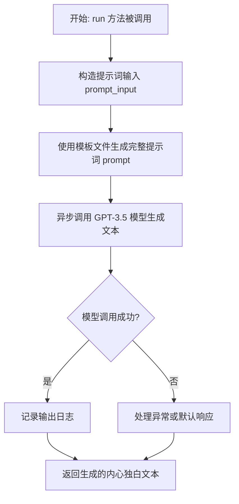
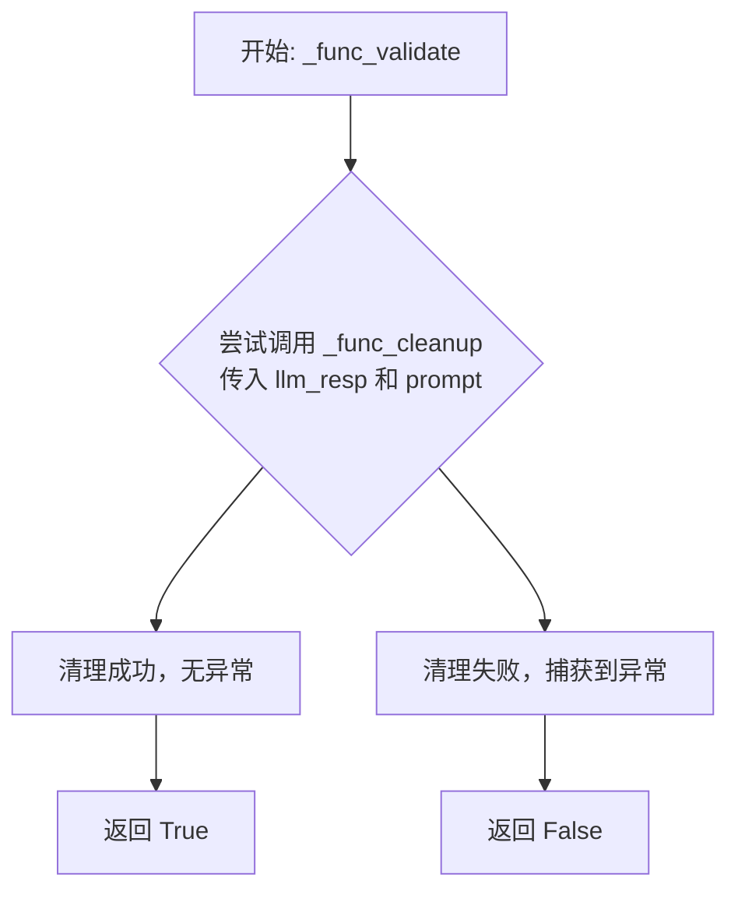
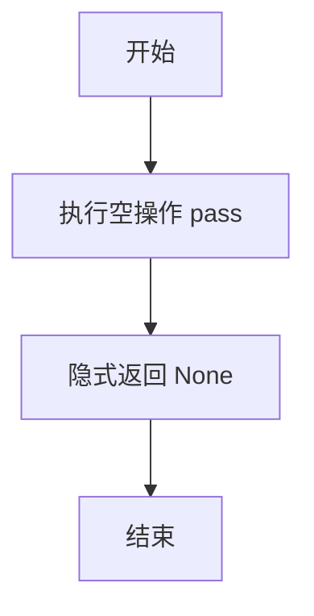
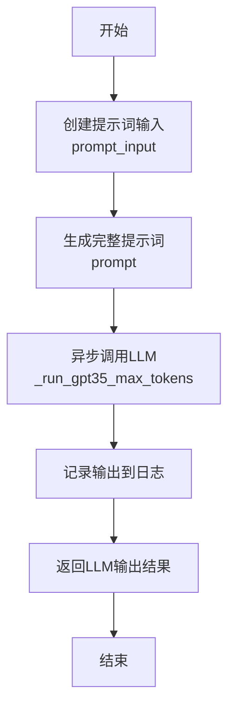

# `.\MetaGPT\metagpt\ext\stanford_town\actions\inner_voice_action.py` 详细设计文档

该代码定义了一个名为 AgentWhisperThoughtAction 的动作类，它是 STAction 的子类。其核心功能是模拟一个角色（Agent）的“内心独白”或“低语思考”过程。它接收关于角色的陈述（statements），构造特定的提示词（prompt），调用大语言模型（GPT-3.5）生成一段简短的、代表角色内心想法的文本，并记录日志。

## 整体流程



## 类结构

```
STAction (基类，可能来自 metagpt.ext.stanford_town.actions.st_action)
└── AgentWhisperThoughtAction (当前类，实现特定思考动作)
```

## 全局变量及字段


### `logger`
    
用于记录日志的全局日志记录器实例，提供不同级别的日志输出功能。

类型：`Logger`
    


### `AgentWhisperThoughtAction.name`
    
动作类的名称标识符，固定值为'AgentWhisperThoughtAction'，用于区分不同的动作类型。

类型：`str`
    
    

## 全局函数及方法

### `AgentWhisperThoughtAction._func_validate`

该方法用于验证大语言模型（LLM）的响应是否可以通过清理函数 `_func_cleanup` 进行处理。它通过尝试调用清理函数来检查响应的有效性，如果清理过程不抛出异常，则认为响应有效。

参数：
- `llm_resp`：`str`，需要验证的大语言模型原始响应文本。
- `prompt`：`str`，生成此响应的原始提示词，在本方法中未直接使用，但会传递给清理函数。

返回值：`bool`，如果响应可以被成功清理则返回 `True`，否则返回 `False`。

#### 流程图



#### 带注释源码

```python
def _func_validate(self, llm_resp: str, prompt: str) -> bool:
    try:
        # 尝试调用清理函数来验证 llm_resp 的格式是否有效。
        # 如果 _func_cleanup 能够正常处理输入而不抛出异常，
        # 则认为该响应是有效的。
        self._func_cleanup(llm_resp, prompt)
        # 验证通过，返回 True
        return True
    except Exception:
        # 如果在清理过程中捕获到任何异常，
        # 则认为响应无效，返回 False。
        # 这里的异常处理较为宽泛（捕获所有 Exception），
        # 确保了方法的健壮性。
        return False
```


### `AgentWhisperThoughtAction._func_cleanup`

该方法用于清理和格式化从大语言模型（LLM）获得的原始响应文本。其核心逻辑是提取响应中第一个被双引号包围的字符串之前的内容，并去除首尾空白字符，从而得到一个简洁的、无引号的字符串。

参数：

-  `llm_resp`：`str`，从大语言模型获取的原始响应字符串。
-  `prompt`：`str`，生成响应的原始提示词，在此方法中未使用。

返回值：`str`，清理和格式化后的字符串。

#### 流程图

```mermaid
flowchart TD
    A[开始] --> B{输入 llm_resp}
    B --> C[使用 split('"') 分割字符串]
    C --> D[取分割后的第一个元素<br/>索引 0]
    D --> E[使用 strip() 去除首尾空白]
    E --> F[返回清理后的字符串]
    F --> G[结束]
```

#### 带注释源码

```python
def _func_cleanup(self, llm_resp: str, prompt: str = "") -> str:
    # 1. 使用双引号 '"' 作为分隔符，将 llm_resp 字符串分割成一个列表。
    # 2. 取该列表的第一个元素（索引为0），即第一个双引号之前的所有内容。
    # 3. 使用 strip() 方法移除该内容首尾的空白字符（如空格、换行符等）。
    # 4. 返回处理后的字符串。
    return llm_resp.split('"')[0].strip()
```


### `AgentWhisperThoughtAction._func_fail_default_resp`

该方法旨在提供一个默认的失败响应字符串，当`_func_validate`方法验证失败时，作为后备方案返回。当前实现为空（`pass`），意味着它返回`None`，这可能导致调用方需要处理`None`值或引发异常。

参数：
- 无

返回值：`str`，一个默认的失败响应字符串。当前实现返回`None`。

#### 流程图



#### 带注释源码

```python
def _func_fail_default_resp(self) -> str:
    pass  # 当前实现为空，返回 None，需要后续完善以返回有效的默认字符串
```

### `AgentWhisperThoughtAction.run`

该方法用于执行角色的“内心独白”动作，通过调用大语言模型生成角色对给定陈述（statements）的内心思考或反应，并将思考结果记录到日志中。

参数：

- `role`：`STRole`，执行该动作的角色实例，包含角色的状态和背景信息。
- `statements`：`str`，触发角色内心思考的外部陈述或事件描述。
- `test_input`：`Any`，可选参数，用于测试的输入，默认为None。
- `verbose`：`bool`，可选参数，控制是否输出详细日志，默认为False。

返回值：`str`，返回大语言模型生成的、代表角色内心思考的文本内容。

#### 流程图



#### 带注释源码

```python
async def run(self, role: "STRole", statements: str, test_input=None, verbose=False) -> str:
    # 定义一个内部函数，用于构建发送给大语言模型的提示词输入部分。
    def create_prompt_input(role: "STRole", statements, test_input=None):
        # 提示词输入是一个列表，包含角色名称和触发思考的陈述。
        prompt_input = [role.scratch.name, statements]
        return prompt_input

    # 调用内部函数，生成提示词输入。
    prompt_input = create_prompt_input(role, statements)
    # 使用指定的模板文件（whisper_inner_thought_v1.txt）和上一步的输入，生成完整的提示词。
    prompt = self.generate_prompt_with_tmpl_filename(prompt_input, "whisper_inner_thought_v1.txt")

    # 异步调用大语言模型（GPT-3.5），并限制最大输出token数为50，获取角色的“内心独白”。
    output = await self._run_gpt35_max_tokens(prompt, max_tokens=50)
    # 将执行的动作和结果记录到日志中。
    logger.info(f"Role: {role.name} Action: {self.cls_name} output: {output}")
    # 返回大语言模型生成的思考内容。
    return output
```

## 关键组件


### STAction基类

作为所有斯坦福小镇（Stanford Town）动作的抽象基类，定义了动作执行、LLM响应验证与清理等通用接口和流程。

### AgentWhisperThoughtAction

一个具体的动作类，负责模拟角色（Agent）的内心独白（Whisper Thought）生成过程，通过调用LLM（GPT-3.5）基于角色的当前状态和外部陈述来生成简短的内心想法。

### 提示词模板（whisper_inner_thought_v1.txt）

定义了生成“内心独白”时输入给LLM的提示词结构，将角色名称和外部陈述等动态信息嵌入到固定的叙述模板中，以引导LLM生成符合上下文的输出。

### LLM调用与响应处理（_run_gpt35_max_tokens）

封装了对GPT-3.5模型的异步调用，并限制其最大输出令牌数，是动作执行过程中与外部AI模型交互的核心组件。

### 响应清理与验证（_func_cleanup, _func_validate）

提供对LLM返回的原始文本进行后处理的机制（如去除引号、修剪空白），并验证响应格式是否符合预期，确保下游逻辑能处理规整的数据。


## 问题及建议


### 已知问题

-   **异常处理过于宽泛**：`_func_validate` 方法中使用了 `except Exception` 来捕获所有异常，这可能会掩盖代码中的具体错误，使得调试和问题定位变得困难。
-   **默认响应方法未实现**：`_func_fail_default_resp` 方法仅包含 `pass` 语句，没有返回任何有效的默认值。当 `_func_validate` 返回 `False` 时，调用此方法将得到 `None`，可能导致调用方出现未预期的行为或错误。
-   **硬编码的提示词模板**：`run` 方法中直接使用了硬编码的模板文件名 `"whisper_inner_thought_v1.txt"`，这降低了代码的灵活性和可配置性。如果需要更换或版本化提示词模板，必须修改源代码。
-   **硬编码的模型参数**：`run` 方法中调用 `_run_gpt35_max_tokens` 时，`max_tokens` 参数被硬编码为 `50`。这个限制可能不适用于所有场景，限制了生成内容的长度和灵活性。
-   **日志信息不完整**：`run` 方法中的日志记录仅包含角色名、动作名和输出，缺少输入信息（如 `statements`）和关键的提示词内容，不利于问题追溯和调试。

### 优化建议

-   **细化异常处理**：在 `_func_validate` 方法中，应捕获更具体的异常（例如与字符串处理相关的 `ValueError`, `IndexError`），或者至少记录被捕获的异常信息，以便于调试。
-   **实现有意义的默认响应**：`_func_fail_default_resp` 方法应返回一个合理的默认字符串（例如空字符串 `""` 或一个表示失败的占位符），以确保调用链的健壮性。
-   **将模板名称参数化**：考虑将提示词模板文件名（如 `"whisper_inner_thought_v1.txt"`）作为类属性或 `run` 方法的参数，以提高代码的可配置性和可测试性。
-   **将模型参数配置化**：将 `max_tokens` 等模型调用参数从硬编码改为可配置项，例如通过类初始化参数、配置文件或环境变量来设置，以适应不同的使用场景。
-   **增强日志记录**：在 `run` 方法的日志中增加输入参数（如 `statements`）和/或生成的完整 `prompt` 内容。这有助于在出现问题时，完整复现和诊断调用过程。
-   **考虑输入验证**：`run` 方法可以增加对输入参数（如 `role`, `statements`）的基础验证（例如非空检查、类型检查），以提高代码的鲁棒性。


## 其它


### 设计目标与约束

该代码的设计目标是实现一个名为`AgentWhisperThoughtAction`的特定动作，作为斯坦福小镇（Stanford Town）智能体行为体系的一部分。其核心功能是处理智能体的“内心独白”或“低语思考”行为，即根据外部陈述（`statements`）生成一个简短的、内部的思考回应。主要约束包括：1) 继承自`STAction`基类，需遵循其定义的运行接口和模板化提示生成机制；2) 依赖于特定的提示模板文件（`whisper_inner_thought_v1.txt`）；3) 使用GPT-3.5模型进行文本生成，并限制最大输出令牌数为50，以确保思考内容的简洁性；4) 设计上主要服务于异步执行环境。

### 错误处理与异常设计

代码中的错误处理相对简单，主要体现在`_func_validate`和`_func_cleanup`方法中。`_func_validate`方法尝试调用`_func_cleanup`，如果过程中抛出任何异常（`Exception`），则验证失败，返回`False`。这是一种防御性编程，确保LLM的响应能够被后续的清理逻辑正确处理。然而，这种捕获所有异常的方式可能过于宽泛，会掩盖具体的错误类型，不利于调试。`_func_fail_default_resp`方法当前为空（`pass`），意味着在生成失败时没有提供默认的备用响应，这可能是一个潜在的风险点，调用者需要自行处理`None`或异常情况。主方法`run`依赖于`_run_gpt35_max_tokens`，其内部的网络请求、模型调用等错误会向上层抛出，由调用者（如智能体或动作调度器）进行统一处理。

### 数据流与状态机

1.  **输入数据流**：外部调用者（通常是`STRole`智能体）提供`role`对象（包含智能体状态和记忆）和`statements`字符串（触发思考的外部陈述）。`test_input`参数在当前实现中未使用。
2.  **内部处理流**：
    a. `create_prompt_input`函数将输入参数格式化为列表`[role.scratch.name, statements]`。
    b. `generate_prompt_with_tmpl_filename`方法使用上述列表和模板文件名`"whisper_inner_thought_v1.txt"`，生成最终发送给LLM的提示字符串。
    c. `_run_gpt35_max_tokens`方法异步调用GPT-3.5模型，传入提示并限制最大输出为50个令牌。
    d. 模型返回的原始响应`output`被记录到日志。
3.  **输出数据流**：将LLM生成的原始响应字符串`output`直接返回给调用者。值得注意的是，`_func_cleanup`方法虽然定义了清理逻辑（分割并取第一部分），但在当前的`run`方法中并未被调用，因此返回的是未经处理的原始响应。这可能是一个设计上的不一致或待完成的部分。
4.  **状态影响**：此动作是只读的，它不修改传入的`role`对象的状态。它基于角色的当前状态（如名字）和外部输入生成一个新的输出，但不更新角色的记忆、计划或情感等内部状态。状态的更新应由调用此动作的上层逻辑负责。

### 外部依赖与接口契约

1.  **父类依赖**：强依赖于`metagpt.ext.stanford_town.actions.st_action.STAction`基类。契约包括必须实现`run`异步方法，以及可以使用父类提供的`generate_prompt_with_tmpl_filename`和`_run_gpt35_max_tokens`等方法。
2.  **模板文件依赖**：依赖一个名为`whisper_inner_thought_v1.txt`的外部文本文件作为提示模板。该文件的确切路径由基类的逻辑决定，通常位于特定的模板目录下。文件不存在或格式错误会导致提示生成失败。
3.  **LLM服务依赖**：通过`_run_gpt35_max_tokens`方法，隐式依赖于一个能够处理GPT-3.5模型请求的外部服务或API（如OpenAI API）。这涉及到网络连接、API密钥、服务可用性和速率限制等外部因素。
4.  **日志系统依赖**：依赖`metagpt.logs.logger`进行信息记录。
5.  **接口契约**：
    *   **对调用者**：提供异步的`run(role, statements, test_input=None, verbose=False) -> str`接口。调用者需确保`role`参数是有效的`STRole`实例。
    *   **对框架**：作为`STAction`的子类，其`name`属性和方法实现需符合框架对“动作”的预期，以便被动作池发现和管理。

### 潜在的技术债务或优化空间（补充）

1.  **响应清理逻辑未使用**：`_func_cleanup`和`_func_validate`方法已定义，但在核心的`run`流程中未被整合。`run`方法直接返回了LLM的原始响应。这可能导致返回内容包含多余的引号或格式，不符合“内心独白”的纯净文本预期。应明确是否需要在`run`中调用清理逻辑，或者这些方法是用于其他验证场景。
2.  **失败默认响应缺失**：`_func_fail_default_resp`返回`None`（由于`pass`语句）。当LLM调用失败或验证不通过时，没有提供降级策略，可能导致上游逻辑接收到意外的`None`值。应考虑返回一个安全的默认字符串（如“...”或“[思考中]”）。
3.  **异常处理粒度**：`_func_validate`中的`except Exception:`过于宽泛。建议捕获更具体的异常，或者至少记录异常信息，以方便调试。
4.  **硬编码参数**：最大令牌数`max_tokens=50`被硬编码在`run`方法中。考虑使其可配置，例如通过类属性或构造函数参数传入，以增加灵活性。
5.  **测试输入参数未实现**：`run`方法签名包含`test_input`参数，但在`create_prompt_input`和后续流程中均未使用。应明确其用途，或从接口中移除。
6.  **同步与异步混合**：`create_prompt_input`被定义为`run`方法内部的嵌套同步函数。虽然影响不大，但为了代码清晰，可以考虑将其提取为类的私有同步方法（如`_create_prompt_input`）。


    