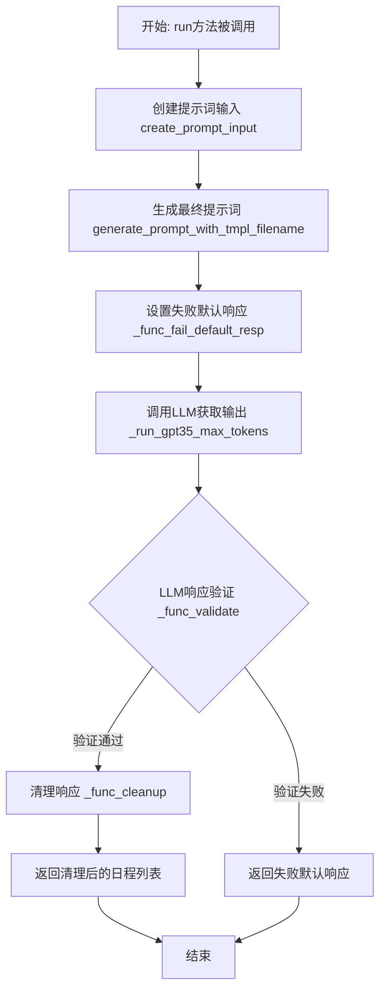
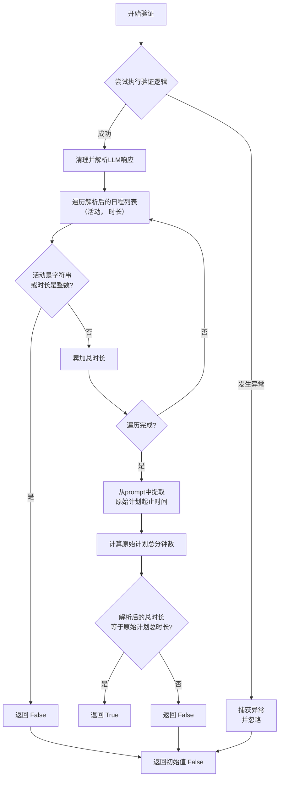
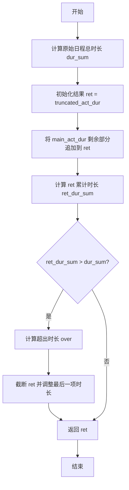
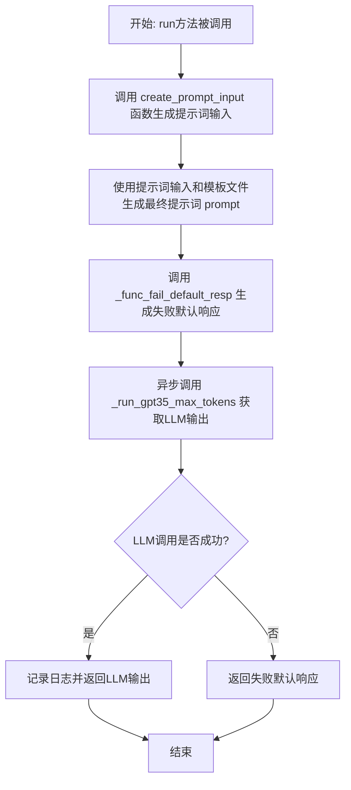

# `.\MetaGPT\metagpt\ext\stanford_town\actions\new_decomp_schedule.py` 详细设计文档

该代码定义了一个名为`NewDecompSchedule`的类，它是`STAction`的子类，用于在斯坦福小镇模拟环境中重新分解和调整角色的日程安排。核心功能是接收一个原始日程、一个被截断的日程以及一个需要插入的新活动及其持续时间，然后通过调用大语言模型（GPT-3.5）生成一个修订后的、时间上连贯的新日程，并确保新日程的总时长与原始计划的时间窗口相匹配。

## 整体流程



## 类结构

```
STAction (基类)
└── NewDecompSchedule (新日程分解动作)
```

## 全局变量及字段


### `logger`
    
用于记录日志的全局日志记录器实例

类型：`Logger`
    


### `NewDecompSchedule.name`
    
动作类的名称标识，固定为'NewDecompSchedule'

类型：`str`
    
    

## 全局函数及方法


### `NewDecompSchedule._func_validate`

该方法用于验证由大语言模型（LLM）生成的修订后日程安排数据的有效性。它通过检查日程项是否为字符串、时长是否为整数，并计算总时长是否与原始计划的时间跨度一致，来判断LLM的响应是否符合预期格式和逻辑。

参数：

-  `llm_resp`：`str`，大语言模型返回的原始响应字符串。
-  `prompt`：`str`，生成`llm_resp`所使用的完整提示词。

返回值：`bool`，如果验证通过（即格式正确且总时长匹配）则返回`True`，否则返回`False`。

#### 流程图



#### 带注释源码

```python
def _func_validate(self, llm_resp: str, prompt: str) -> bool:
    # 初始化返回值为 False，假设验证不通过
    resp = False
    try:
        # 1. 清理并格式化LLM的原始响应，将其转换为结构化的列表 `[(活动1, 时长1), ...]`
        llm_resp = self._func_cleanup(llm_resp, prompt)
        
        dur_sum = 0
        # 2. 遍历清理后的日程列表，进行初步格式验证
        for act, dur in llm_resp:
            dur_sum += dur  # 累加所有活动的时长
            # 检查活动描述是否为字符串（应为字符串，但这里逻辑是如果“是”字符串则返回False，可能是个笔误，应为 `if not isinstance(act, str):`）
            if isinstance(act, str):
                return False
            # 检查时长是否为整数（应为整数，但这里逻辑是如果“是”整数则返回False，可能是个笔误，应为 `if not isinstance(dur, int):`）
            if isinstance(dur, int):
                return False
        
        # 3. 从原始提示词中提取原始计划的起止时间字符串
        #    例如从 "originally planned schedule from 08:00 AM to 05:00 PM:" 中提取 "08:00 AM to 05:00 PM"
        x = prompt.split("\n")[0].split("originally planned schedule from")[-1].strip()[:-1]
        # 将字符串转换为 datetime 对象
        x = [datetime.datetime.strptime(i.strip(), "%H:%M %p") for i in x.split(" to ")]
        # 计算原始计划的总时长（分钟）
        delta_min = int((x[1] - x[0]).total_seconds() / 60)

        # 4. 核心验证：比较解析出的日程总时长与原始计划总时长是否一致
        if int(dur_sum) != int(delta_min):
            return False
        # 如果所有检查都通过，则将返回值设为 True
        resp = True
    except Exception:
        # 5. 如果在上述任何步骤中发生异常（如格式解析错误），则静默捕获异常
        #    此时 resp 保持初始值 False
        pass
    # 6. 返回最终的验证结果
    return resp
```


### `NewDecompSchedule._func_cleanup`

该方法用于清理和解析大语言模型（LLM）生成的修订后日程文本，将其转换为结构化的列表格式。它从包含原始提示和LLM响应的混合文本中，提取出“The revised schedule:”之后的部分，解析每一行的时间段和活动描述，计算每个活动的持续时间（分钟），并最终返回一个由`[活动描述, 持续时间]`组成的列表。

参数：

-  `llm_resp`：`str`，大语言模型生成的原始响应文本。
-  `prompt`：`str`，发送给大语言模型的原始提示文本。

返回值：`list`，一个列表，其中每个元素都是一个包含两个元素的子列表，格式为`[action: str, delta_min: int]`，分别表示活动描述和该活动的持续时间（分钟）。

#### 流程图

```mermaid
flowchart TD
    A[开始] --> B[合并 prompt 和 llm_resp]
    B --> C[提取“The revised schedule:”后的内容]
    C --> D[按行分割]
    D --> E[遍历每一行]
    E --> F[按“ -- ”分割行<br>得到时间字符串和活动]
    F --> G[按“ ~ ”分割时间字符串<br>得到开始和结束时间]
    G --> H[计算时间差<br>转换为分钟数]
    H --> I{持续时间是否小于0?}
    I -- 是 --> J[将持续时间设为0]
    I -- 否 --> K[保留原值]
    J --> L[将[活动, 持续时间]加入结果列表]
    K --> L
    L --> M{是否还有未处理的行?}
    M -- 是 --> E
    M -- 否 --> N[返回结果列表]
```

#### 带注释源码

```python
    def _func_cleanup(self, llm_resp: str, prompt: str) -> list:
        # 1. 将原始提示和LLM响应合并，以便于后续提取
        new_schedule = prompt + " " + llm_resp.strip()
        # 2. 定位并提取“The revised schedule:”标记之后的内容，即修订后的日程部分
        new_schedule = new_schedule.split("The revised schedule:")[-1].strip()
        # 3. 将提取出的日程文本按行分割，得到每一行的日程项
        new_schedule = new_schedule.split("\n")

        # 4. 初步解析：将每一行按“ -- ”分割，分割成[时间字符串, 活动描述]的临时列表
        ret_temp = []
        for i in new_schedule:
            ret_temp += [i.split(" -- ")]

        # 5. 详细解析：处理临时列表中的每一项
        ret = []
        for time_str, action in ret_temp:
            # 5.1 将时间字符串（如“08:00 ~ 08:30”）按“ ~ ”分割，得到开始和结束时间
            start_time = time_str.split(" ~ ")[0].strip()
            end_time = time_str.split(" ~ ")[1].strip()
            # 5.2 计算开始时间和结束时间的时间差，并转换为分钟数
            delta = datetime.datetime.strptime(end_time, "%H:%M") - datetime.datetime.strptime(start_time, "%H:%M")
            delta_min = int(delta.total_seconds() / 60)
            # 5.3 处理异常情况：如果计算出的持续时间为负数，则将其置为0
            if delta_min < 0:
                delta_min = 0
            # 5.4 将解析出的[活动描述, 持续时间]加入到最终结果列表中
            ret += [[action, delta_min]]

        # 6. 返回结构化的日程列表
        return ret
```


### `NewDecompSchedule._func_fail_default_resp`

该方法用于在LLM响应验证失败时，生成一个默认的、经过调整的日程安排。它通过合并原始日程（`main_act_dur`）和截断的日程（`truncated_act_dur`），并确保总时长与原始日程一致，从而创建一个后备计划。

参数：

-  `main_act_dur`：`int`，原始的日程安排列表，每个元素为`[活动描述, 持续时间(分钟)]`。
-  `truncated_act_dur`：`int`，被截断的日程安排列表，每个元素为`[活动描述, 持续时间(分钟)]`。

返回值：`int`，返回一个调整后的日程安排列表，其总时长与`main_act_dur`的总时长相等。

#### 流程图



#### 带注释源码

```python
def _func_fail_default_resp(self, main_act_dur: int, truncated_act_dur: int) -> int:
    # 计算原始日程的总时长
    dur_sum = 0
    for act, dur in main_act_dur:
        dur_sum += dur

    # 初始化结果为截断的日程，并追加原始日程中剩余的部分
    ret = truncated_act_dur[:]
    ret += main_act_dur[len(ret) - 1 :]

    # 如果合并后的总时长超过了原始总时长，需要进行修剪
    ret_dur_sum = 0
    count = 0
    over = None
    for act, dur in ret:
        ret_dur_sum += dur
        if ret_dur_sum == dur_sum:
            break
        if ret_dur_sum > dur_sum:
            over = ret_dur_sum - dur_sum  # 计算超出的时长
            break
        count += 1

    # 如果存在超出，则截断列表并调整最后一项的时长
    if over:
        ret = ret[: count + 1]
        ret[-1][1] -= over

    return ret
```

### `NewDecompSchedule.run`

该方法用于生成一个修订后的日程安排。它接收一个角色的原始日程、一个被截断的日程、时间范围以及一个需要插入的新活动及其持续时间，然后通过调用大语言模型（GPT-3.5）来生成一个考虑了新活动、并适应指定时间范围的新日程。如果模型生成失败，则会使用一个备用的失败处理函数来生成一个默认的日程。

参数：

- `role`：`STRole`，表示需要重新安排日程的角色对象，包含角色的基本信息。
- `main_act_dur`：`int`，表示角色原始的日程安排列表，每个元素是一个 `[活动描述, 持续时间(分钟)]` 的列表。
- `truncated_act_dur`：`int`，表示一个被截断的日程安排列表，作为新日程的初始部分。
- `start_time_hour`：`datetime`，表示新日程的开始时间。
- `end_time_hour`：`datetime`，表示新日程的结束时间。
- `inserted_act`：`str`，表示需要插入到日程中的新活动的描述。
- `inserted_act_dur`：`int`，表示需要插入的新活动的持续时间（分钟）。
- `*args`：`tuple`，可变位置参数。
- `**kwargs`：`dict`，可变关键字参数。

返回值：`str`，返回由大语言模型生成的修订后的日程文本，或者在模型失败时返回由 `_func_fail_default_resp` 生成的默认日程。

#### 流程图



#### 带注释源码

```python
async def run(
    self,
    role: "STRole",  # 角色对象，包含角色信息
    main_act_dur: int,  # 原始日程列表，元素为 [活动, 分钟数]
    truncated_act_dur: int,  # 截断的日程列表，作为新日程基础
    start_time_hour: datetime,  # 新日程开始时间
    end_time_hour: datetime,  # 新日程结束时间
    inserted_act: str,  # 要插入的新活动描述
    inserted_act_dur: int,  # 新活动的持续时间（分钟）
    *args,  # 额外的位置参数
    **kwargs,  # 额外的关键字参数
):
    # 内部函数：用于构建发送给大语言模型的提示词输入
    def create_prompt_input(
        role: "STRole",
        main_act_dur: int,
        truncated_act_dur: int,
        start_time_hour: datetime,
        end_time_hour: datetime,
        inserted_act: str,
        inserted_act_dur: int,
    ):
        persona_name = role.name  # 获取角色名称
        start_hour_str = start_time_hour.strftime("%H:%M %p")  # 格式化开始时间
        end_hour_str = end_time_hour.strftime("%H:%M %p")  # 格式化结束时间

        # 构建原始日程的字符串表示
        original_plan = ""
        for_time = start_time_hour
        for i in main_act_dur:
            original_plan += (
                f'{for_time.strftime("%H:%M")} ~ '
                f'{(for_time + datetime.timedelta(minutes=int(i[1]))).strftime("%H:%M")} -- ' + i[0]
            )
            original_plan += "\n"
            for_time += datetime.timedelta(minutes=int(i[1]))

        # 构建新日程的初始部分（基于截断的日程）
        new_plan_init = ""
        for_time = start_time_hour
        for count, i in enumerate(truncated_act_dur):
            new_plan_init += (
                f'{for_time.strftime("%H:%M")} ~ '
                f'{(for_time + datetime.timedelta(minutes=int(i[1]))).strftime("%H:%M")} -- ' + i[0]
            )
            new_plan_init += "\n"
            if count < len(truncated_act_dur) - 1:
                for_time += datetime.timedelta(minutes=int(i[1]))

        new_plan_init += (for_time + datetime.timedelta(minutes=int(i[1]))).strftime("%H:%M") + " ~"

        # 将所有信息组装成提示词输入列表
        prompt_input = [
            persona_name,
            start_hour_str,
            end_hour_str,
            original_plan,
            persona_name,
            inserted_act,
            inserted_act_dur,
            persona_name,
            start_hour_str,
            end_hour_str,
            end_hour_str,
            new_plan_init,
        ]
        return prompt_input

    # 1. 生成提示词输入
    prompt_input = create_prompt_input(
        role, main_act_dur, truncated_act_dur, start_time_hour, end_time_hour, inserted_act, inserted_act_dur
    )
    # 2. 使用模板文件生成最终提示词
    prompt = self.generate_prompt_with_tmpl_filename(prompt_input, "new_decomp_schedule_v1.txt")
    # 3. 预先计算失败时的默认响应
    self.fail_default_resp = self._func_fail_default_resp(main_act_dur, truncated_act_dur)
    # 4. 异步调用大语言模型（GPT-3.5）获取输出
    output = await self._run_gpt35_max_tokens(prompt, max_tokens=1000)
    # 5. 记录执行日志
    logger.info(f"Role: {role.name} Action: {self.cls_name} output: {output}")
    # 6. 返回模型输出（如果失败，_run_gpt35_max_tokens 内部应返回 fail_default_resp）
    return output
```

## 关键组件


### 时间管理与调度重构

该组件负责解析、验证和重构基于时间块的日程安排。它接收一个原始日程计划、一个被截断的日程计划以及一个需要插入的新活动及其持续时间，然后生成一个修订后的日程。核心功能包括：从LLM响应中提取并解析“修订后的日程”文本，将其转换为（活动，持续时间）对的列表；验证解析后日程的总持续时间是否与原始计划的时间窗口匹配；以及在LLM响应验证失败时，提供一个后备方案来合并原始计划和截断计划，确保总时长一致。

### LLM响应验证与清理

该组件定义了处理LLM输出的标准化流程。`_func_validate`方法用于验证LLM返回的日程列表的格式（活动应为字符串，持续时间应为整数）以及总时长是否与指定时间窗口相符。`_func_cleanup`方法则负责从包含提示词和LLM响应的混合文本中，精准提取出“修订后的日程”部分，并将其解析为结构化的（活动描述，持续时间（分钟））列表，同时处理时间跨度的计算与负值的纠正。

### 后备（Fallback）策略生成

当LLM的响应无法通过验证时，此组件提供一个保底的日程生成逻辑。`_func_fail_default_resp`方法通过智能地合并原始日程(`main_act_dur`)和截断的日程(`truncated_act_dur`)来创建一个新的日程列表。其核心逻辑是确保新日程的总持续时间严格等于原始日程的总时间，如果合并过程中出现时间超出，会对最后一个活动项的持续时间进行修剪。

### 提示词工程与上下文构建

此组件封装了与LLM交互的上下文构建逻辑。`create_prompt_input`函数将角色信息、原始计划、截断计划、时间边界、待插入活动等所有输入参数，组装成符合预定模板（`new_decomp_schedule_v1.txt`）要求的提示词输入列表。这确保了传递给LLM的指令清晰、结构化，包含了执行日程分解与重构所需的所有必要信息。

### 异步任务执行与集成

作为`STAction`的子类，该组件集成了异步执行框架。`run`方法是主要入口，它协调整个工作流：构建提示词、设置失败默认响应、调用LLM（通过`_run_gpt35_max_tokens`）、记录日志并返回结果。这体现了其在更大的智能体（Agent）行动体系中的角色，即作为一个可异步调用的、具有自验证和后备机制的计划调整行动。


## 问题及建议


### 已知问题

-   **`_func_validate` 方法逻辑错误且始终返回 `False`**：该方法在验证 LLM 响应时存在逻辑错误。`if isinstance(act, str):` 和 `if isinstance(dur, int):` 的判断条件本意应是检查类型是否**不**符合预期（例如，`act` 应为字符串，`dur` 应为整数），但当前逻辑是如果类型符合预期反而返回 `False`，导致验证几乎总是失败。此外，方法开头将 `resp` 初始化为 `False`，在 `try` 块中未成功将其置为 `True`，且 `except` 块为空，导致无论验证是否通过，最终都返回 `False`。
-   **`_func_fail_default_resp` 方法返回值类型与声明不符**：方法签名声明返回 `int` 类型，但实际返回的是 `list` 类型（变量 `ret`），这会导致类型错误。
-   **`run` 方法参数类型标注错误**：`main_act_dur` 和 `truncated_act_dur` 参数被标注为 `int` 类型，但从代码内部使用（如 `for act, dur in main_act_dur:`）和 `create_prompt_input` 函数的调用来看，它们应为 `list` 类型（例如 `List[Tuple[str, int]]`）。
-   **`_func_cleanup` 方法健壮性不足**：该方法严重依赖 LLM 返回字符串的固定格式（如 “The revised schedule:” 和 “ -- ” 作为分隔符）。如果 LLM 的输出格式稍有变化（例如，使用不同的描述词或分隔符），解析就会失败，导致返回错误结果或抛出异常。
-   **`_func_fail_default_resp` 方法逻辑复杂且存在潜在错误**：该方法用于生成后备计划，但逻辑较为复杂，涉及列表切片和时长调整。变量 `i` 在嵌套循环后使用（`for_time += datetime.timedelta(minutes=int(i[1]))`）可能引用的是最后一次循环的 `i`，这在 `truncated_act_dur` 为空时会导致错误。同时，调整时长的逻辑（`ret[-1][1] -= over`）直接修改了传入的 `truncated_act_dur` 列表中的元素，可能产生意外的副作用。
-   **异常处理过于宽泛**：`_func_validate` 方法中的 `except Exception:` 捕获了所有异常且未做任何处理（`pass`），这会掩盖代码中的真实错误，使得调试困难。
-   **硬编码的提示词模板文件名**：`run` 方法中直接使用了硬编码的模板文件名 `"new_decomp_schedule_v1.txt"`，这使得模板难以替换或配置，降低了代码的灵活性。

### 优化建议

-   **修正 `_func_validate` 方法**：1) 修正类型检查逻辑，例如改为 `if not isinstance(act, str):` 和 `if not isinstance(dur, int):`。2) 在验证通过时，将 `resp` 设置为 `True` 并返回。3) 考虑在 `except` 块中记录异常信息或至少返回 `False`，而不是静默忽略。
-   **修正 `_func_fail_default_resp` 方法的返回类型**：将方法签名中的返回值类型从 `int` 更正为 `list`，以反映其实际返回的数据结构。
-   **修正 `run` 方法的参数类型**：将 `main_act_dur` 和 `truncated_act_dur` 的参数类型从 `int` 更正为更精确的类型，例如 `List[Tuple[str, int]]`。
-   **增强 `_func_cleanup` 方法的鲁棒性**：1) 使用更灵活的解析方法，例如正则表达式，来提取时间-活动对，减少对固定格式的依赖。2) 增加对解析失败情况的处理，例如返回空列表或抛出更具信息量的异常。
-   **重构 `_func_fail_default_resp` 方法**：1) 简化逻辑，明确计算总时长差并平均或按比例分配到最后一个活动项。2) 避免修改输入参数 `truncated_act_dur`，可以创建其副本进行操作。3) 修复循环变量作用域问题，确保逻辑清晰正确。
-   **改进异常处理**：将 `_func_validate` 中的空 `except` 块改为至少记录错误日志，或者更精确地捕获预期的异常类型，让其他异常正常抛出以便于发现问题。
-   **将模板文件名参数化**：考虑将提示词模板文件名作为类属性或 `run` 方法的参数，提高代码的可配置性和可测试性。
-   **添加单元测试**：为每个关键方法（尤其是 `_func_validate`, `_func_cleanup`, `_func_fail_default_resp`）编写全面的单元测试，覆盖正常情况和各种边界、异常情况，以确保逻辑正确性和代码健壮性。
-   **代码注释与文档**：为复杂的方法（如 `_func_fail_default_resp`）添加详细的注释，说明其输入、输出和算法步骤，提高代码可读性和可维护性。


## 其它


### 设计目标与约束

本模块的核心设计目标是为斯坦福小镇（Stanford Town）智能体角色（STRole）提供一个动态日程分解与重排的能力。具体而言，当智能体需要在现有日程中插入一项新活动时，该模块能够智能地调整后续活动的时间安排，确保总时间窗口不变，并生成一个逻辑连贯的新日程。主要约束包括：必须严格遵循给定的起始和结束时间；必须保持原有活动的顺序，但允许调整其持续时间；必须处理大语言模型（LLM）可能返回的无效或格式错误的响应，并提供默认的降级处理方案。

### 错误处理与异常设计

模块的错误处理主要围绕LLM响应的验证和清理展开。`_func_validate`方法负责验证LLM返回的日程分解结果是否符合逻辑（如活动是否为字符串、时长是否为整数）和数学约束（所有活动总时长是否等于原定时间窗口）。如果验证失败，`run`方法将使用`_func_fail_default_resp`方法生成的默认响应作为后备方案。该方法通过合并原始日程（`main_act_dur`）和已截断的日程（`truncated_act_dur`）来构造一个可行的日程，并在总时长超出时进行修剪。整体异常处理策略是“优雅降级”，优先保证系统能返回一个可用的日程，即使它不是最优的。当前设计在`_func_validate`和`_func_cleanup`中使用了宽泛的`try-except`，可能掩盖了具体的解析错误，未来可细化异常类型以提升可调试性。

### 数据流与状态机

1.  **输入数据流**：`run`方法接收角色对象、原始日程列表、已截断的日程列表、时间窗口、待插入活动及其时长作为输入。
2.  **内部处理流**：
    a. `create_prompt_input`函数将输入数据格式化为符合提示词模板（`new_decomp_schedule_v1.txt`）要求的列表。
    b. `generate_prompt_with_tmpl_filename`方法将模板与输入数据结合，生成最终发送给LLM的提示词。
    c. `_run_gpt35_max_tokens`方法异步调用LLM获取响应。
    d. 响应首先经过`_func_cleanup`进行解析和清洗，转化为`[[活动, 分钟数], ...]`的标准列表格式。
    e. 清洗后的结果由`_func_validate`进行验证。
    f. 若验证通过，则返回该结果；若验证失败，则返回由`_func_fail_default_resp`预先计算好的默认日程。
3.  **输出数据流**：最终输出为一个列表，其中每个元素是一个子列表，包含活动名称（字符串）和该活动的持续时间（整数，单位：分钟）。该列表代表了在指定时间窗口内，插入新活动后的完整修订日程。
4.  **状态机**：本模块逻辑本质上是确定性的，不涉及复杂的状态转移。其“状态”可简化为两种：`成功`（LLM响应有效并验证通过）和`降级`（LLM响应无效，使用默认后备方案）。

### 外部依赖与接口契约

1.  **父类依赖**：继承自`STAction`，依赖其提供的`generate_prompt_with_tmpl_filename`方法（用于加载和填充提示词模板）和`_run_gpt35_max_tokens`方法（用于执行LLM调用）。
2.  **LLM服务**：强依赖一个兼容OpenAI GPT-3.5接口的大语言模型服务，通过`_run_gpt35_max_tokens`进行交互。契约期望LLM返回特定格式的文本日程。
3.  **模板文件**：依赖外部文本文件`new_decomp_schedule_v1.txt`。该文件定义了引导LLM进行日程分解的提示词结构和指令。模块与模板文件的契约是：模板中需包含特定的占位符（如`{0}`, `{1}`等），`create_prompt_input`返回的列表将按顺序填充这些占位符。
4.  **数据结构契约**：
    *   输入参数`main_act_dur`和`truncated_act_dur`应为`List[Tuple[str, int]]`类型，即字符串（活动名）和整数（分钟数）组成的元组列表。
    *   内部方法`_func_cleanup`和`_func_fail_default_resp`的输出、以及`run`方法的最终输出，均为`List[List[Union[str, int]]]`类型。
    *   时间参数`start_time_hour`和`end_time_hour`应为`datetime.datetime`类型（代码中标注为`datetime`，但实际使用其`strftime`和计算功能，应为`datetime.datetime`实例）。

    