# `.\MetaGPT\metagpt\ext\stanford_town\actions\run_reflect_action.py` 详细设计文档

该文件是MetaGPT框架中Stanford Town扩展的一部分，包含了一系列用于智能体（Agent）进行自我反思和认知处理的Action类。这些Action通过调用大语言模型（GPT-3.5）来处理智能体的陈述（statements），生成焦点问题、洞察与证据、事件三元组、事件/聊天重要性评分、对话中的计划思考以及对话记忆摘要，旨在模拟智能体的高级认知和反思能力。

## 整体流程

```mermaid
graph TD
    Start[开始执行Reflect Action] --> SelectAction{选择具体的Action类}
    SelectAction --> AgentFocusPt[AgentFocusPt: 生成焦点问题]
    SelectAction --> AgentInsightAndGuidance[AgentInsightAndGuidance: 生成洞察与证据]
    SelectAction --> AgentEventTriple[AgentEventTriple: 生成事件三元组]
    SelectAction --> AgentEventPoignancy[AgentEventPoignancy: 评估事件重要性]
    SelectAction --> AgentChatPoignancy[AgentChatPoignancy: 评估聊天重要性]
    SelectAction --> AgentPlanThoughtOnConvo[AgentPlanThoughtOnConvo: 生成对话计划思考]
    SelectAction --> AgentMemoryOnConvo[AgentMemoryOnConvo: 生成对话记忆摘要]
    
    subgraph Common Flow [每个Action的通用执行流程]
        A1[接收输入: role, statements等] --> A2[调用内部create_prompt_input函数构建提示词输入]
        A2 --> A3[调用generate_prompt_with_tmpl_filename生成最终Prompt]
        A3 --> A4[调用_run_gpt35或_run_gpt35_max_tokens请求LLM]
        A4 --> A5[LLM返回原始响应]
        A5 --> A6[可选: 使用_fun_cleanup清理和格式化响应]
        A6 --> A7[记录日志并返回结果]
    end
    
    AgentFocusPt --> Common Flow
    AgentInsightAndGuidance --> Common Flow
    AgentEventTriple --> Common Flow
    AgentEventPoignancy --> Common Flow
    AgentChatPoignancy --> Common Flow
    AgentPlanThoughtOnConvo --> Common Flow
    AgentMemoryOnConvo --> Common Flow
    
    Common Flow --> End[结束]
```

## 类结构

```
STAction (基类，来自metagpt.ext.stanford_town.actions.st_action)
├── AgentFocusPt
├── AgentInsightAndGuidance
├── AgentEventTriple
├── AgentEventPoignancy
├── AgentChatPoignancy
├── AgentPlanThoughtOnConvo
└── AgentMemoryOnConvo
```

## 全局变量及字段


### `AgentFocusPt.name`
    
该动作类的标识名称，用于区分不同的动作类型。

类型：`str`
    


### `AgentInsightAndGuidance.name`
    
该动作类的标识名称，用于区分不同的动作类型。

类型：`str`
    


### `AgentEventTriple.name`
    
该动作类的标识名称，用于区分不同的动作类型。

类型：`str`
    


### `AgentEventPoignancy.name`
    
该动作类的标识名称，用于区分不同的动作类型。

类型：`str`
    


### `AgentChatPoignancy.name`
    
该动作类的标识名称，用于区分不同的动作类型。

类型：`str`
    


### `AgentPlanThoughtOnConvo.name`
    
该动作类的标识名称，用于区分不同的动作类型。

类型：`str`
    


### `AgentMemoryOnConvo.name`
    
该动作类的标识名称，用于区分不同的动作类型。

类型：`str`
    
    

## 全局函数及方法

### `AgentFocusPt._func_validate`

该方法用于验证大语言模型（LLM）的响应是否有效。其核心逻辑是尝试调用清理函数 `_func_cleanup` 来处理响应，如果清理过程没有抛出异常，则认为响应有效，返回 `True`；否则返回 `False`。

参数：
- `llm_resp`：`str`，需要验证的大语言模型原始响应文本。
- `prompt`：`str`，生成该响应所使用的提示词（Prompt），在本方法中未直接使用，但作为参数传递给清理函数。

返回值：`bool`，表示验证结果。如果响应有效（清理过程无异常）则返回 `True`，否则返回 `False`。

#### 流程图

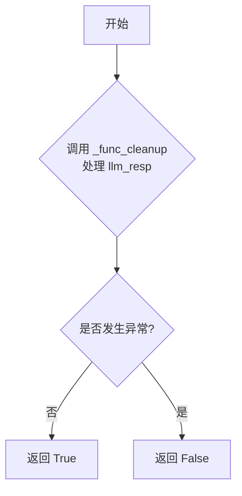

#### 带注释源码

```python
def _func_validate(self, llm_resp: str, prompt: str) -> bool:
    try:
        # 尝试调用清理函数处理LLM响应。
        # 如果清理过程成功（未抛出异常），则认为响应格式或内容基本有效。
        self._func_cleanup(llm_resp, prompt)
        # 验证通过，返回True。
        return True
    except Exception:
        # 如果在清理过程中捕获到任何异常，则认为响应无效。
        # 返回False。
        return False
```

### `AgentFocusPt._func_cleanup`

该方法用于清理或验证大语言模型（LLM）的响应。在 `AgentFocusPt` 类中，此方法被设计为一个简单的“直通”函数，直接返回原始的 `llm_resp` 参数，表明对于此类任务，LLM的原始输出被认为是干净且无需额外处理的。它被 `_func_validate` 方法调用以验证响应是否可被“清理”（即处理），从而间接判断响应是否有效。

参数：
- `llm_resp`：`str`，需要清理或验证的大语言模型原始响应文本。
- `prompt`：`str`，生成此响应所使用的提示词，在此方法中未使用。

返回值：`str`，返回经过清理后的字符串。在本实现中，直接返回输入的 `llm_resp`。

#### 流程图

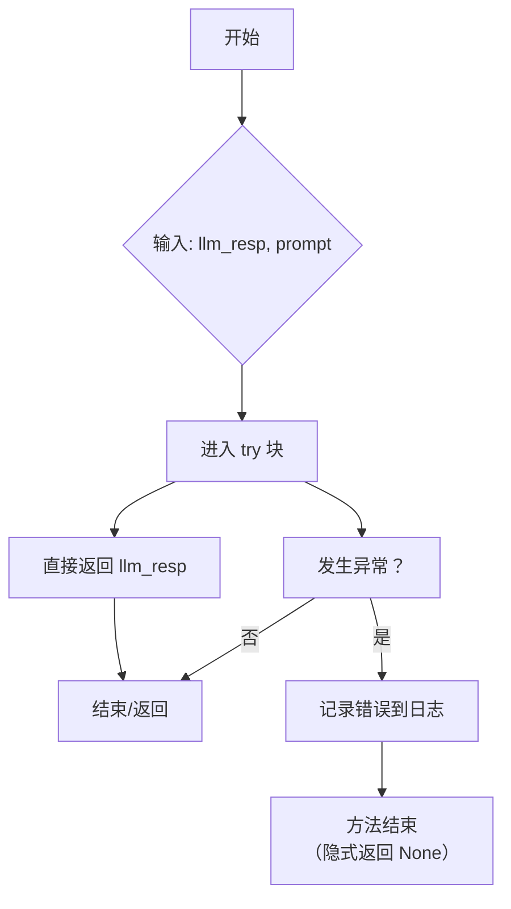

#### 带注释源码

```python
def _func_cleanup(self, llm_resp: str, prompt: str = "") -> str:
    try:
        """
        Cleanup handling has been completed for run_v2
        """
        # 对于 `AgentFocusPt` 类，清理操作已经完成（可能指上游流程），
        # 因此直接返回原始 LLM 响应，不做任何处理。
        return llm_resp
    except Exception as exp:
        # 如果发生任何异常，记录错误信息。
        # 注意：此处捕获异常后仅记录日志，方法将隐式返回 `None`。
        # 这可能导致调用方（如 `_func_validate`）收到意外的 `None` 值。
        logger.error(f"{self.cls_name} with error {exp}")
```

### `AgentFocusPt._func_fail_default_resp`

该方法作为 `AgentFocusPt` 类的默认失败响应生成器。当主流程（如调用大语言模型）失败时，该方法被调用以提供一个默认的、安全的返回值，确保系统在异常情况下仍能继续运行，避免因未处理的异常而崩溃。当前实现为一个空方法（`pass`），意味着它返回 `None`。

参数：
- 无

返回值：`str`，该方法理论上应返回一个字符串作为默认响应，但当前实现返回 `None`。

#### 流程图

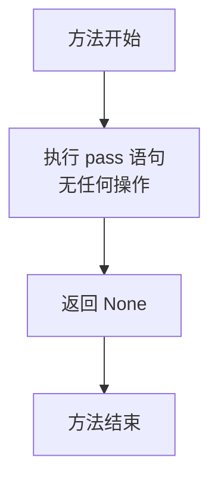

#### 带注释源码

```python
def _func_fail_default_resp(self) -> str:
    # 方法定义：返回类型为字符串。
    # 功能：作为默认的失败响应生成器。
    # 当前实现：仅包含一个 `pass` 语句，不执行任何操作，隐式返回 `None`。
    # 设计意图：提供一个占位符，当主流程失败时，可在此处返回一个预定义的、安全的默认字符串（例如一个空字符串或特定提示信息），以确保系统鲁棒性。
    pass
```

### `AgentFocusPt.run`

该方法用于生成一个角色（Agent）的焦点问题列表。它接收角色的陈述（statements）和期望生成的问题数量（n），通过调用GPT-3.5模型生成一个包含n个焦点问题的字符串列表，并返回该列表。

参数：

- `role`：`STRole`，表示当前执行动作的角色对象，包含角色的属性和状态信息。
- `statements`：`str`，表示角色的陈述或输入文本，作为生成焦点问题的依据。
- `n`：`int`，表示期望生成的焦点问题的数量。
- `test_input`：`Optional[Any]`，可选参数，用于测试或调试目的，默认为None。

返回值：`str`，返回一个字符串，该字符串是一个包含n个焦点问题的列表（以字符串形式表示）。

#### 流程图

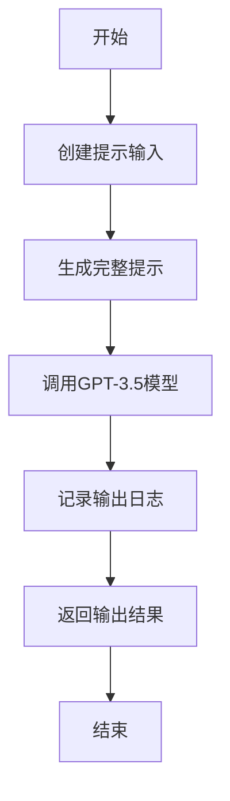

#### 带注释源码

```python
async def run(self, role: "STRole", statements: str, n: int, test_input=None) -> str:
    # 定义内部函数，用于创建提示输入
    def create_prompt_input(role: "STRole", statements, n, test_input=None):
        prompt_input = [statements, str(n)]  # 将陈述和问题数量转换为列表
        return prompt_input

    # 调用内部函数创建提示输入
    prompt_input = create_prompt_input(role, statements, n)
    # 使用模板文件生成完整的提示文本
    prompt = self.generate_prompt_with_tmpl_filename(prompt_input, "generate_focal_pt_v1.txt")

    # 示例输出，用于指导模型生成格式正确的响应
    example_output = '["What should Jane do for lunch", "Does Jane like strawberry", "Who is Jane"]'
    # 特殊指令，要求输出必须是一个字符串列表
    special_instruction = "Output must be a list of str."
    # 调用GPT-3.5模型生成输出
    output = await self._run_gpt35(prompt, example_output, special_instruction)
    # 记录输出日志，包括角色名称和动作名称
    logger.info(f"Role: {role.name} Action: {self.cls_name} output: {output}")
    # 返回生成的输出
    return output
```

### `AgentInsightAndGuidance._func_validate`

该方法用于验证大语言模型（LLM）对特定提示（prompt）的响应（`llm_resp`）是否有效。其验证逻辑是尝试调用并执行清理函数 `_func_cleanup`。如果清理过程成功完成（即没有抛出异常），则认为响应有效；如果清理过程抛出任何异常，则认为响应无效。

参数：
- `llm_resp`：`str`，大语言模型返回的原始响应文本。
- `prompt`：`str`，生成此响应所使用的提示文本。

返回值：`bool`，如果响应有效则返回 `True`，否则返回 `False`。

#### 流程图

```mermaid
flowchart TD
    A[开始] --> B{尝试执行<br>_func_cleanup(llm_resp, prompt)}
    B -- 成功 --> C[返回 True]
    B -- 抛出任何异常 --> D[返回 False]
    C --> E[结束]
    D --> E
```

#### 带注释源码

```python
def _func_validate(self, llm_resp: str, prompt: str) -> bool:
    try:
        # 核心验证逻辑：尝试调用清理函数。
        # 如果清理函数能正常执行（不抛出异常），则认为LLM的响应格式正确，是有效的。
        self._func_cleanup(llm_resp, prompt)
        # 清理成功，返回 True 表示验证通过。
        return True
    except Exception:
        # 如果在清理过程中捕获到任何异常，则认为响应无效，返回 False。
        return False
```

### `AgentInsightAndGuidance._func_cleanup`

该方法用于清理和解析来自大语言模型（LLM）的响应文本，将其转换为一个结构化的字典。具体来说，它处理包含“洞察”和“证据”的文本行，提取出“思想”（thought）和对应的“证据索引列表”（evidence indices），并返回一个以思想为键、证据索引列表为值的字典。

参数：
- `llm_resp`：`str`，来自大语言模型的原始响应文本。
- `prompt`：`str`，触发该响应的提示词（在此方法中未使用，但为接口一致性而保留）。

返回值：`dict`，一个字典，其中键是提取出的“思想”（字符串），值是对应的“证据索引列表”（整数列表）。

#### 流程图

```mermaid
flowchart TD
    A[开始] --> B[异常处理开始]
    B --> C[预处理llm_resp<br>添加“1. ”前缀并去除首尾空格]
    C --> D[初始化空字典 ret]
    D --> E{遍历llm_resp的每一行}
    E -->|有下一行| F[处理当前行 i]
    F --> G{行中是否包含<br>“(because of ”?}
    G -->|否| E
    G -->|是| H[提取thought部分<br>（括号前的内容）]
    H --> I{行中是否包含<br>闭合的“)”?}
    I -->|否| E
    I -->|是| J[提取evi_raw部分<br>（括号内的内容）]
    J --> K[使用正则表达式<br>提取所有数字]
    K --> L[将数字字符串列表<br>转换为整数列表]
    L --> M[将 thought: evi_raw<br>存入字典 ret]
    M --> E
    E -->|遍历完成| N[返回字典 ret]
    N --> O[结束]
    B --> P[发生异常]
    P --> Q[记录错误日志]
    Q --> O
```

#### 带注释源码

```python
    def _func_cleanup(self, llm_resp: str, prompt: str = "") -> dict:
        try:
            # 1. 预处理：在响应文本前添加“1. ”并去除首尾空格，以标准化格式。
            llm_resp = "1. " + llm_resp.strip()
            # 2. 初始化一个空字典，用于存储最终结果。
            ret = dict()
            # 3. 按行遍历处理后的响应文本。
            for i in llm_resp.split("\n"):
                # 4. 提取当前行中第一个句点（.）和空格之后的部分作为`row`。
                #    例如，将“1. Some thought (because of 1, 2)”转换为“Some thought (because of 1, 2)”。
                row = " ".join(i.split(". ")[1:])
                # 5. 检查当前行是否包含证据标记“(because of ”。如果没有，则跳过此行。
                if "(because of " not in row:
                    continue
                # 6. 提取“思想”（thought）部分：即“(because of ”之前的所有内容，并去除首尾空格。
                thought = row.split("(because of ")[0].strip()
                # 7. 检查在“(because of ”之后是否存在闭合的“)”。如果没有，则跳过此行。
                if ")" not in row.split("(because of ")[1]:
                    continue
                # 8. 提取“证据原始字符串”（evi_raw）部分：即“(because of ”和第一个“)”之间的内容。
                evi_raw = row.split("(because of ")[1].split(")")[0].strip()
                # 9. 使用正则表达式从`evi_raw`中提取所有数字字符串（例如，从“1, 2”中提取['1', '2']）。
                evi_raw = re.findall(r"\d+", evi_raw)
                # 10. 将数字字符串列表转换为整数列表。
                evi_raw = [int(i.strip()) for i in evi_raw]
                # 11. 将“思想”作为键，整数列表作为值，存入结果字典`ret`。
                ret[thought] = evi_raw
            # 12. 返回处理后的字典。
            return ret
        except Exception as exp:
            # 13. 如果在处理过程中发生任何异常，记录错误日志。
            #     注意：此处方法没有显式返回，在Python中会隐式返回`None`。
            #     调用方`_func_validate`依赖此处的异常来返回`False`。
            logger.error(f"{self.cls_name} with error {exp}")
```

### `AgentInsightAndGuidance._func_fail_default_resp`

该方法作为`AgentInsightAndGuidance`类的后备响应生成器。当主流程（如调用大语言模型）失败或无法生成有效输出时，此方法被调用以提供一个默认的、结构化的响应，确保系统在异常情况下仍能返回一个可预测的结果，从而维持程序的稳定运行。

参数：
- `n`：`int`，指定需要生成的默认响应条目的数量。

返回值：`list[str]`，返回一个包含`n`个相同字符串`"I am hungry"`的列表，作为默认的洞察和指导内容。

#### 流程图

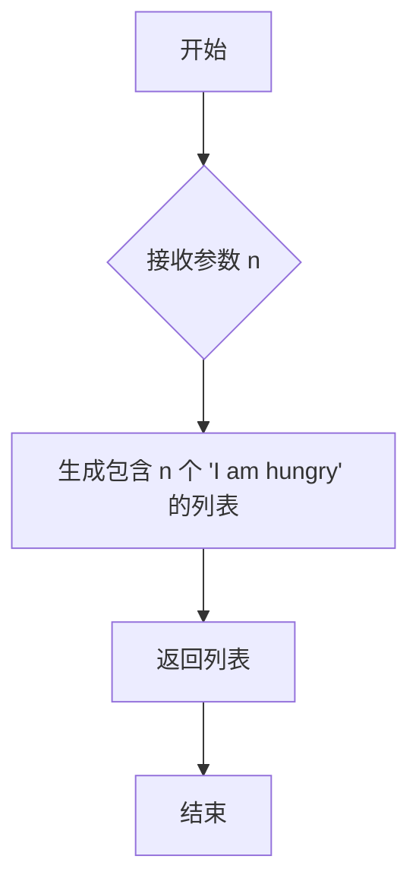

#### 带注释源码

```python
def _func_fail_default_resp(self, n: int) -> str:
    # 返回一个包含 n 个重复字符串 "I am hungry" 的列表。
    # 此方法作为后备方案，在主逻辑（如LLM调用）失败时提供默认输出。
    return ["I am hungry"] * n
```

### `AgentInsightAndGuidance.run`

该方法属于`AgentInsightAndGuidance`类，其核心功能是：接收一个角色（`STRole`）、一组陈述语句（`statements`）和一个数量（`n`），通过调用大语言模型（GPT-3.5）生成基于这些陈述的“洞察与证据”字典。该方法首先构建特定的提示词，然后调用LLM接口，最后对LLM的原始响应进行解析和清洗，将其转换为一个结构化的字典，其中键是“想法”（thought），值是与该想法相关的证据索引列表。

参数：
- `role`：`STRole`，代表执行此动作的智能体角色，用于提供上下文信息（如角色名称），但在当前方法实现中，`role`参数在构建提示词时未被直接使用。
- `statements`：`str`，一组文本陈述，作为生成洞察和证据的基础输入。
- `n`：`int`，一个整数参数，用于控制生成洞察的数量或相关配置，它被直接拼接到提示词中。
- `test_input`：`None`，预留的测试输入参数，在当前实现中未使用。

返回值：`dict`，返回一个字典。字典的键（`str`类型）是从LLM响应中解析出的“想法”（thought），值（`list[int]`类型）是与该想法相关联的证据索引列表。如果LLM响应解析失败，将返回一个由`_func_fail_default_resp`方法生成的默认响应（一个包含`n`个“I am hungry”字符串的列表）。

#### 流程图

```mermaid
graph TD
    A[开始: run(role, statements, n, test_input)] --> B[调用 create_prompt_input 构建提示词输入列表];
    B --> C[调用 generate_prompt_with_tmpl_filename 生成完整提示词];
    C --> D[设置 fail_default_resp 属性];
    D --> E[异步调用 _run_gpt35_max_tokens 获取LLM原始输出];
    E --> F{LLM调用是否成功?};
    F -- 是 --> G[记录日志并返回原始输出 output];
    F -- 否（或后续清理失败） --> H[返回 fail_default_resp 作为默认响应];
    G --> I[结束];
    H --> I;
```

#### 带注释源码

```python
async def run(self, role: "STRole", statements: str, n: int, test_input=None) -> dict:
    # 内部函数：构建发送给LLM提示词模板的输入参数列表。
    # 注意：`role` 和 `test_input` 参数在此函数内部未被使用，但为保持接口一致而保留。
    def create_prompt_input(role, statements, n, test_input=None):
        prompt_input = [statements, str(n)]  # 将 statements 和 数字 n 转换为字符串后组成列表
        return prompt_input

    # 步骤1: 构建提示词输入并生成最终提示词字符串。
    # 使用指定的模板文件 "insight_and_evidence_v1.txt"。
    prompt_input = create_prompt_input(role, statements, n)
    prompt = self.generate_prompt_with_tmpl_filename(prompt_input, "insight_and_evidence_v1.txt")

    # 步骤2: 设置失败时的默认响应。调用 `_func_fail_default_resp` 方法生成一个包含 n 个重复字符串的列表。
    self.fail_default_resp = self._func_fail_default_resp(n)
    
    # 步骤3: 异步调用大语言模型（GPT-3.5），并限制最大输出token数为150。
    # `_run_gpt35_max_tokens` 方法内部会处理与LLM的通信。
    output = await self._run_gpt35_max_tokens(prompt, max_tokens=150)
    
    # 步骤4: 记录执行日志，包含角色名、动作名和LLM的原始输出。
    logger.info(f"Role: {role.name} Action: {self.cls_name} output: {output}")
    
    # 步骤5: 返回LLM的原始输出。
    # 注意：此处返回的是 `_run_gpt35_max_tokens` 的原始结果（通常是字符串）。
    # 实际的响应清洗和字典转换逻辑在 `_func_cleanup` 方法中定义，但本 `run` 方法并未直接调用它。
    # 清洗步骤可能由父类 `STAction` 的 `_run_gpt35_max_tokens` 方法或其调用链在验证响应后自动执行。
    return output
```

### `AgentEventTriple._func_validate`

该方法用于验证由大语言模型（LLM）生成的关于事件三元组的响应。它首先尝试清理响应文本，然后检查清理后的结果是否为恰好包含两个元素的列表。如果清理过程成功且结果长度符合预期，则返回 `True`，否则返回 `False`。

参数：
- `llm_resp`：`str`，大语言模型返回的原始响应文本。
- `prompt`：`str`，生成此响应所使用的提示词（在此方法中未使用）。

返回值：`bool`，表示验证是否通过。`True` 表示响应格式有效，`False` 表示无效。

#### 流程图

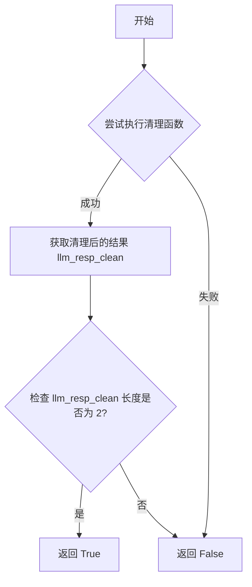

#### 带注释源码

```python
def _func_validate(self, llm_resp: str, prompt: str) -> bool:
    try:
        # 调用 _func_cleanup 方法清理 LLM 的原始响应。
        # 注意：传入的 prompt 参数在此处未被使用。
        llm_resp = self._func_cleanup(llm_resp, prompt="")
        # 验证清理后的响应是否为恰好包含两个元素的列表。
        # 这符合事件三元组（主语， 谓语）的预期格式。
        if len(llm_resp) != 2:
            return False
    except Exception:
        # 如果在清理或验证过程中发生任何异常（如格式解析错误），
        # 则认为验证失败，返回 False。
        return False
    # 所有检查通过，返回 True 表示验证成功。
    return True
```

### `AgentEventTriple._func_cleanup`

该方法用于清理和解析大语言模型（LLM）对事件三元组生成的原始响应文本。它从响应中提取关键部分，并确保返回一个包含两个元素的列表，代表事件三元组中的两个核心成分（例如，主语和谓语，或事件的两个关键描述）。

参数：

- `llm_resp`：`str`，大语言模型返回的原始响应文本。
- `prompt`：`str`，触发该响应的原始提示词，在此方法中未使用。

返回值：`list`，一个包含两个字符串元素的列表，代表从响应中解析出的两个核心事件成分。如果解析失败，则返回原始响应的最后两个部分。

#### 流程图

```mermaid
flowchart TD
    A[开始] --> B{输入: llm_resp}
    B --> C[清理响应: 去除首尾空格]
    C --> D[分割字符串: 以第一个')'为界]
    D --> E[取第一部分，按','分割]
    E --> F[清理分割后的每个元素: 去除空格]
    F --> G{检查元素数量是否为2?}
    G -- 是 --> H[返回该列表]
    G -- 否 --> I[返回列表的最后两个元素]
    H --> J[结束]
    I --> J
```

#### 带注释源码

```python
def _func_cleanup(self, llm_resp: str, prompt: str = "") -> list:
    try:
        # 1. 去除响应字符串首尾的空白字符
        cr = llm_resp.strip()
        # 2. 以第一个右括号 ')' 为分隔符进行分割，取第一部分（即括号内的内容）
        #    然后以逗号 ',' 为分隔符进行分割，得到一个列表
        cr = [i.strip() for i in cr.split(")")[0].split(",")]
        # 3. 检查分割后列表的长度
        if len(cr) != 2:
            # 如果长度不为2，则返回列表的最后两个元素
            # 这是一种容错处理，确保总是返回两个元素
            return cr[-2:]
        # 4. 如果长度正好为2，则直接返回该列表
        return cr
    except Exception as exp:
        # 5. 如果在处理过程中发生任何异常，记录错误日志
        logger.error(f"{self.cls_name} with error {exp}")
        # 注意：此处没有显式返回，函数将隐式返回 None。
        # 在实际调用中，`_func_validate` 方法会捕获此异常并返回 False。
```

### `AgentEventTriple._func_fail_default_resp`

该方法作为`AgentEventTriple`类的后备响应生成器。当主流程（如调用大语言模型）失败或验证不通过时，此方法被调用以提供一个默认的、安全的返回值，确保系统在异常情况下仍能继续运行，避免因外部服务不稳定而导致整个流程中断。

参数：
-  `self`：`AgentEventTriple`，指向当前类实例的引用。

返回值：`str`，一个默认的字符串返回值。在当前实现中，该方法直接返回`None`（通过`pass`语句），这意味着它没有提供一个有意义的默认值，这可能是一个潜在的技术债务。

#### 流程图

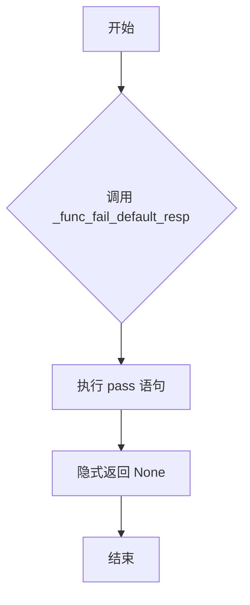

#### 带注释源码

```python
    def _func_fail_default_resp(self) -> str:
        # 方法定义：作为失败时的默认响应生成器。
        # 当前实现为空（pass），这意味着在失败时没有提供有效的默认返回值。
        # 这可能导致调用方接收到 None，需要调用方自行处理。
        # 建议优化：返回一个安全的默认字符串，例如空字符串 "" 或特定的错误标识符。
        pass
```

### `AgentEventTriple.run`

该方法用于生成事件三元组（Event Triple），即从给定的陈述中提取出主语、谓语和宾语，以构建结构化的事件表示。它通过调用GPT-3.5模型，根据提示模板生成事件三元组，并返回一个包含角色名称、主语和宾语的元组。

参数：

- `statements`：`str`，输入的陈述文本，用于生成事件三元组。
- `role`：`"STRole"`，角色对象，包含角色的相关信息，如名称和状态。
- `verbose`：`bool`，可选参数，控制是否输出详细日志，默认为`False`。

返回值：`tuple`，返回一个三元组，包含角色名称、主语和宾语。

#### 流程图

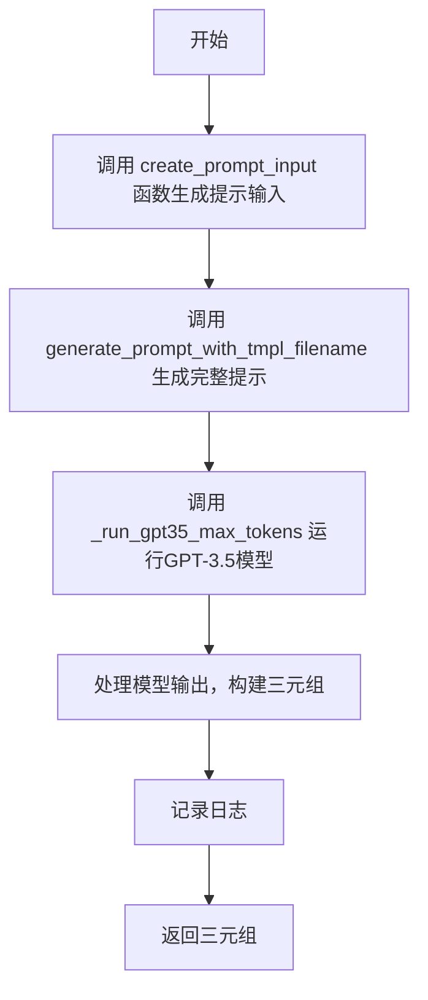

#### 带注释源码

```python
async def run(self, statements: str, role: "STRole", verbose=False) -> tuple:
    # 定义内部函数 create_prompt_input，用于生成提示输入
    def create_prompt_input(statements, role):
        # 如果 statements 中包含括号，提取括号内的内容
        if "(" in statements:
            statements = statements.split("(")[-1].split(")")[0]
        # 构建提示输入列表，包含角色名称、陈述和角色名称
        prompt_input = [role.scratch.name, statements, role.scratch.name]
        return prompt_input

    # 调用 create_prompt_input 生成提示输入
    prompt_input = create_prompt_input(statements, role)
    # 使用提示模板文件生成完整提示
    prompt = self.generate_prompt_with_tmpl_filename(prompt_input, "generate_event_triple_v1.txt")

    # 调用 GPT-3.5 模型生成输出，限制最大令牌数为30
    output = await self._run_gpt35_max_tokens(prompt, max_tokens=30)
    # 构建三元组，包含角色名称、主语和宾语
    output = (role.scratch.name, output[0], output[1])
    # 记录日志，输出角色名称、动作名称和生成的三元组
    logger.info(f"Role: {role.name} Action: {self.cls_name} output: {output}")
    # 返回三元组
    return output
```

### `AgentEventPoignancy._func_validate`

该方法用于验证大语言模型（LLM）对特定提示（prompt）的响应（`llm_resp`）是否有效。其验证逻辑是尝试调用并执行清理函数 `_func_cleanup`。如果清理过程成功完成（即没有抛出异常），则认为响应有效并返回 `True`；如果清理过程中发生任何异常，则认为响应无效并返回 `False`。

参数：
- `llm_resp`：`str`，大语言模型返回的原始响应文本。
- `prompt`：`str`，生成此响应所使用的提示词文本。

返回值：`bool`，表示验证结果。`True` 表示响应有效，`False` 表示响应无效。

#### 流程图

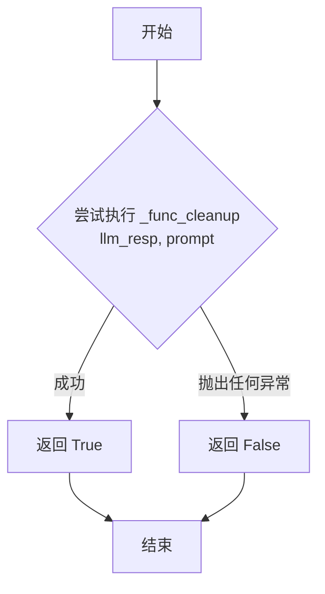

#### 带注释源码

```python
    def _func_validate(self, llm_resp: str, prompt: str) -> bool:
        try:
            # 核心验证逻辑：尝试调用清理函数。
            # 如果清理函数能正常执行（不抛出异常），则认为LLM的响应格式或内容是有效的。
            self._func_cleanup(llm_resp, prompt)
            # 清理成功，返回验证通过。
            return True
        except Exception:
            # 在清理过程中捕获到任何异常，则认为响应无效，返回验证失败。
            return False
```

### `AgentEventPoignancy._func_cleanup`

该方法用于清理和验证由大语言模型（LLM）生成的关于事件重要性（Poignancy）的响应。其核心功能是将LLM返回的字符串响应转换为一个整数，该整数代表事件的重要性评分（1到10分）。如果转换失败，方法会记录错误。

参数：

- `llm_resp`：`str`，大语言模型返回的原始字符串响应。
- `prompt`：`str`，生成响应的提示词（在此方法中未使用，但为保持接口一致而保留）。

返回值：`int`，清理和转换后的事件重要性整数评分。

#### 流程图

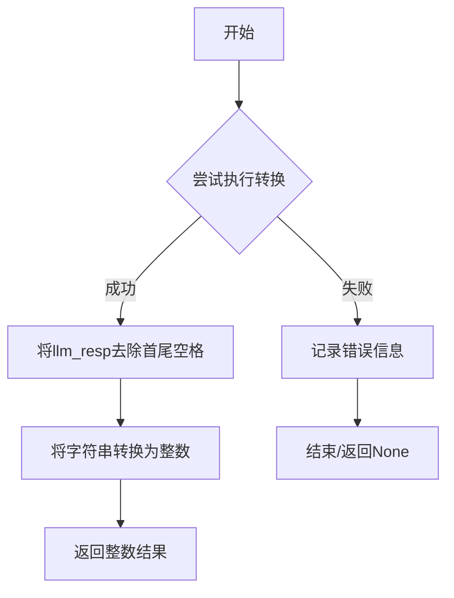

#### 带注释源码

```python
    def _func_cleanup(self, llm_resp: str, prompt: str = "") -> int:
        try:
            # 1. 去除LLM响应字符串的首尾空白字符。
            llm_resp = int(llm_resp.strip())
            # 2. 将清理后的字符串转换为整数。
            # 此转换隐含了验证逻辑，如果字符串无法转换为整数，将抛出ValueError。
            return llm_resp
        except Exception as exp:
            # 3. 如果转换过程中发生任何异常（例如ValueError），则记录错误日志。
            # 注意：此处捕获了所有异常，可能过于宽泛，建议明确指定异常类型。
            logger.error(f"{self.cls_name} with error {exp}")
            # 4. 方法在异常情况下没有显式返回值，将隐式返回None。
            # 这可能导致调用方（如`_func_validate`）接收到意外的None值。
```

### `AgentEventPoignancy._func_fail_default_resp`

该方法作为 `AgentEventPoignancy` 类的后备响应生成器。当主流程（如调用大语言模型）失败或验证不通过时，此方法被调用以提供一个默认的返回值，确保系统在异常情况下仍能继续运行，避免因外部服务不稳定或响应格式错误而导致整个流程中断。当前实现为一个空方法（`pass`），意味着它返回 `None`，这可能需要根据具体业务逻辑进行填充。

参数：
- 无

返回值：`None`，无实际返回值。

#### 流程图

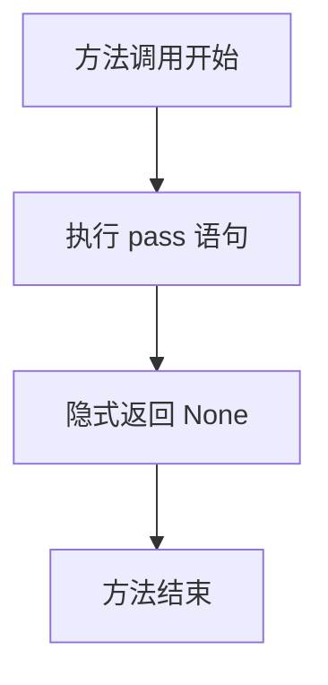

#### 带注释源码

```python
def _func_fail_default_resp(self) -> str:
    pass  # 当前实现为空，作为失败时的默认响应占位符，返回 None。
```

### `AgentEventPoignancy.run`

该方法用于评估给定事件对特定角色的情感显著性（poignancy），即该事件对角色情感的影响程度。它通过调用GPT-3.5模型，基于角色的身份、当前状态和事件描述，生成一个1到10的整数评分，表示事件的情感强度。

参数：

- `role`：`STRole`，表示要评估情感显著性的角色对象，包含角色的姓名、状态等信息。
- `statements`：`str`，描述事件的文本语句，用于评估其情感显著性。
- `test_input`：`None`，保留参数，当前未使用。
- `verbose`：`bool`，控制是否输出详细日志的标志，当前未使用。

返回值：`str`，返回一个字符串形式的整数（1到10），表示事件对指定角色的情感显著性评分。

#### 流程图

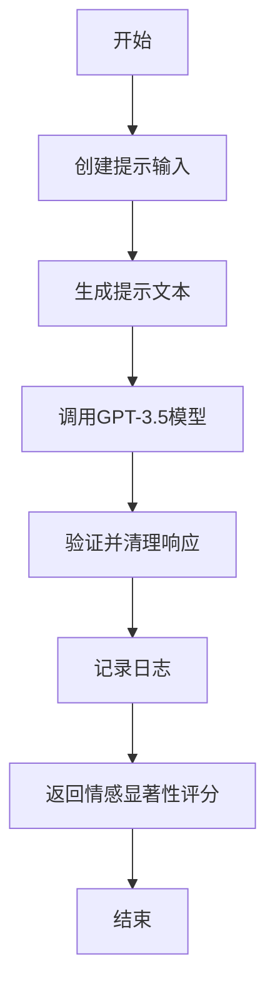

#### 带注释源码

```python
async def run(self, role: "STRole", statements: str, test_input=None, verbose=False) -> str:
    # 定义内部函数，用于创建提示输入
    def create_prompt_input(role: "STRole", statements: str, test_input=None):
        # 提示输入包括角色姓名、角色状态、角色姓名（重复）和事件描述
        prompt_input = [role.scratch.name, role.scratch.get_str_iss(), role.scratch.name, statements]
        return prompt_input

    # 调用内部函数创建提示输入
    prompt_input = create_prompt_input(role, statements)
    # 使用模板文件生成完整的提示文本
    prompt = self.generate_prompt_with_tmpl_filename(prompt_input, "poignancy_event_v1.txt")

    # 示例输出，用于指导模型生成响应
    example_output = "5"  # 示例输出为整数5
    # 特殊指令，要求模型只输出一个1到10的整数值
    special_instruction = "The output should ONLY contain ONE integer value on the scale of 1 to 10."
    # 调用GPT-3.5模型生成响应
    output = await self._run_gpt35(prompt, example_output, special_instruction)
    # 记录日志，包括角色姓名、动作名称和输出结果
    logger.info(f"Role: {role.name} Action: {self.cls_name} output: {output}")
    # 返回情感显著性评分
    return output
```

### `AgentChatPoignancy._func_validate`

该方法用于验证大语言模型（LLM）对聊天情感显著性（Chat Poignancy）预测任务的响应。它通过调用清理函数 `_func_cleanup` 来尝试处理原始响应字符串。如果清理过程成功（即未抛出异常），则认为响应有效；否则，认为响应无效。

参数：

- `llm_resp`：`str`，大语言模型返回的原始响应字符串。
- `prompt`：`str`，生成此响应所使用的提示词。

返回值：`bool`，表示验证结果。如果响应有效则返回 `True`，否则返回 `False`。

#### 流程图

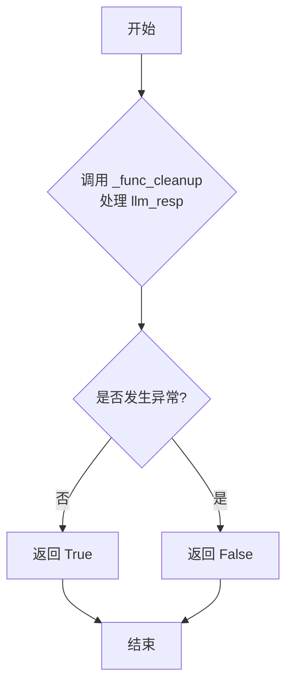

#### 带注释源码

```python
def _func_validate(self, llm_resp: str, prompt: str) -> bool:
    try:
        # 尝试调用清理函数来处理LLM的原始响应。
        # 如果清理过程成功（即没有抛出异常），则认为响应格式有效。
        self._func_cleanup(llm_resp, prompt)
        return True
    except Exception:
        # 如果在清理过程中捕获到任何异常，则认为响应格式无效。
        return False
```

### `AgentChatPoignancy._func_cleanup`

该方法用于清理和验证由大语言模型（LLM）生成的关于聊天情感强度的响应。它尝试将响应字符串转换为一个整数，该整数应在1到10的范围内，表示情感的强烈程度。如果转换失败，它会记录错误。

参数：

- `llm_resp`：`str`，大语言模型返回的原始响应字符串。
- `prompt`：`str`，可选参数，生成响应时使用的提示词，在此方法中未使用。

返回值：`int`，清理和转换后的整数情感强度值。

#### 流程图


#### 带注释源码

```python
def _func_cleanup(self, llm_resp: str, prompt: str = "") -> int:
    try:
        # 1. 去除响应字符串的首尾空白字符
        llm_resp = int(llm_resp.strip())
        # 2. 将清理后的字符串转换为整数
        return llm_resp
    except Exception as exp:
        # 3. 如果转换过程中发生任何异常（如非数字字符），则记录错误
        logger.error(f"{self.cls_name} with error {exp}")
```

### `AgentChatPoignancy._func_fail_default_resp`

该方法作为 `AgentChatPoignancy` 类的默认失败响应生成器。当主处理流程（如调用大语言模型）失败或验证不通过时，该方法被调用以提供一个安全的、默认的返回值，确保系统在异常情况下仍能继续运行，避免因缺少返回值而导致程序崩溃。

参数：
- 无

返回值：`str`，一个默认的字符串返回值。根据代码实现，当前方法体为空（`pass`），因此实际返回值为 `None`。这暗示该方法可能是一个待实现的占位符，或者其父类 `STAction` 可能提供了默认实现。

#### 流程图

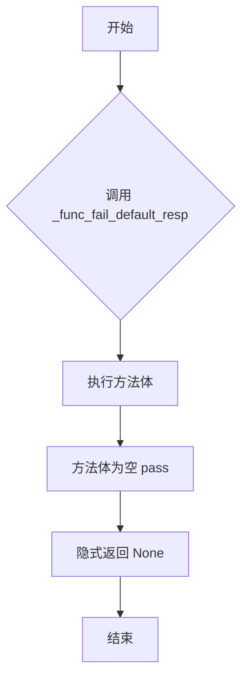

#### 带注释源码

```python
    def _func_fail_default_resp(self) -> str:
        # 方法功能：生成一个默认的失败响应。
        # 当前实现：方法体为空（pass），这意味着：
        # 1. 它可能是一个待后续填充具体逻辑的占位符。
        # 2. 它可能依赖父类 `STAction` 的默认实现。
        # 3. 调用此方法将隐式返回 `None`，而非其声明的 `str` 类型。
        # 这可能导致类型不匹配或下游处理错误，属于潜在的技术债务。
        pass
```

### `AgentChatPoignancy.run`

该方法用于评估聊天对话的情感强度（Poignancy），通过调用GPT-3.5模型生成一个1到10的整数评分，表示对话的情感重要性或影响力。

参数：

- `role`：`STRole`，表示执行该动作的角色对象，包含角色的名称和状态信息。
- `statements`：`str`，表示需要评估的聊天对话内容。
- `test_input`：`Any`（可选），用于测试的输入参数，默认为None。
- `verbose`：`bool`（可选），控制是否输出详细日志，默认为False。

返回值：`str`，返回一个字符串形式的整数（1到10），表示对话的情感强度评分。

#### 流程图

```mermaid
graph TD
    A[开始] --> B[创建提示输入]
    B --> C[生成提示文本]
    C --> D[调用GPT-3.5模型]
    D --> E{验证输出?}
    E -->|是| F[清理并返回结果]
    E -->|否| G[返回默认响应]
    F --> H[记录日志]
    G --> H
    H --> I[结束]
```

#### 带注释源码

```python
async def run(self, role: "STRole", statements: str, test_input=None, verbose=False) -> str:
    # 定义内部函数，用于创建提示输入
    def create_prompt_input(role: "STRole", statements, test_input=None):
        # 提示输入包括角色名称、角色状态字符串、角色名称和对话内容
        prompt_input = [role.scratch.name, role.scratch.get_str_iss(), role.scratch.name, statements]
        return prompt_input

    # 调用内部函数生成提示输入
    prompt_input = create_prompt_input(role, statements)
    # 使用模板文件生成完整的提示文本
    prompt = self.generate_prompt_with_tmpl_filename(prompt_input, "poignancy_chat_v1.txt")

    # 示例输出，用于指导模型生成格式
    example_output = "5"  # 示例输出为整数5
    # 特殊指令，要求输出仅为1到10的整数
    special_instruction = "The output should ONLY contain ONE integer value on the scale of 1 to 10."
    # 调用GPT-3.5模型生成输出
    output = await self._run_gpt35(prompt, example_output, special_instruction)
    # 记录日志，包括角色名称、动作名称和输出结果
    logger.info(f"Role: {role.name} Action: {self.cls_name} output: {output}")
    # 返回输出结果
    return output
```

### `AgentPlanThoughtOnConvo._func_validate`

该方法用于验证大语言模型（LLM）对特定提示（prompt）的响应（`llm_resp`）是否有效。其验证逻辑是尝试调用清理函数 `_func_cleanup` 来处理响应文本。如果清理过程成功（即没有抛出异常），则认为响应有效；否则认为响应无效。

参数：
- `llm_resp`：`str`，大语言模型返回的原始响应文本。
- `prompt`：`str`，生成此响应所使用的提示文本。

返回值：`bool`，如果响应可以被成功清理，则返回 `True`，否则返回 `False`。

#### 流程图

```mermaid
graph TD
    A[开始] --> B{尝试调用 _func_cleanup<br/>处理 llm_resp};
    B -- 成功 --> C[返回 True];
    B -- 抛出任何异常 --> D[返回 False];
    C --> E[结束];
    D --> E;
```

#### 带注释源码

```python
def _func_validate(self, llm_resp: str, prompt: str) -> bool:
    try:
        # 核心验证逻辑：尝试调用清理函数。
        # 如果清理过程没有抛出异常，则认为LLM的响应格式或内容是有效的。
        self._func_cleanup(llm_resp, prompt)
        # 清理成功，返回 True 表示验证通过。
        return True
    except Exception:
        # 如果在清理过程中捕获到任何异常，则认为响应无效，返回 False。
        return False
```

### `AgentPlanThoughtOnConvo._func_cleanup`

该方法用于清理和格式化从大语言模型（LLM）获得的关于对话计划的思考响应。它通过提取响应中第一个双引号之前的内容，并去除首尾空格，来确保返回一个简洁、无引号的字符串。

参数：

- `llm_resp`：`str`，从大语言模型获得的原始响应文本。
- `prompt`：`str`，触发响应的提示词（在此方法中未使用，但为接口一致性而保留）。

返回值：`str`，清理和格式化后的字符串，即原始响应中第一个双引号之前的内容（去除首尾空格）。

#### 流程图

```mermaid
graph TD
    A[开始] --> B{尝试执行清理操作};
    B --> C[提取第一个双引号前的内容];
    C --> D[去除首尾空格];
    D --> E[返回清理后的字符串];
    B --> F[发生异常];
    F --> G[记录错误日志];
    G --> H[结束];
    E --> H;
```

#### 带注释源码

```python
def _func_cleanup(self, llm_resp: str, prompt: str = "") -> str:
    try:
        # 尝试从LLM响应中提取第一个双引号之前的内容，并去除首尾空格。
        # 这旨在从可能包含引号或其他格式的响应中，提取出核心的、无格式的文本。
        return llm_resp.split('"')[0].strip()
    except Exception as exp:
        # 如果在清理过程中发生任何异常（例如，llm_resp为None或非字符串类型），
        # 则记录错误日志。注意：此方法在异常情况下没有显式返回值。
        logger.error(f"{self.cls_name} with error {exp}")
```

### `AgentPlanThoughtOnConvo._func_fail_default_resp`

该方法作为 `AgentPlanThoughtOnConvo` 类的默认失败响应生成器。当主逻辑（如调用大语言模型）失败时，该方法被调用以提供一个默认的、安全的返回值，确保系统在异常情况下仍能继续运行，避免因外部服务不稳定或内部处理错误而导致整个流程中断。

参数：
-  `self`：`AgentPlanThoughtOnConvo`，指向当前类实例的引用。

返回值：`str`，一个默认的字符串返回值。在当前实现中，该方法直接返回 `None`（通过 `pass` 语句），这意味着它没有提供一个有意义的默认字符串，这可能是一个需要改进的技术债务点。

#### 流程图

```mermaid
graph TD
    A[开始] --> B{调用 _func_fail_default_resp}；
    B --> C[执行 pass 语句]；
    C --> D[隐式返回 None]；
    D --> E[结束]；
```

#### 带注释源码

```python
    def _func_fail_default_resp(self) -> str:
        pass  # 该方法当前未实现任何逻辑，直接返回 None。这是一个占位符，用于在主逻辑失败时提供一个默认响应，但当前并未提供有效的默认值。
```

### `AgentPlanThoughtOnConvo.run`

该方法用于生成智能体在对话后的规划性思考。它接收对话内容，通过大语言模型（GPT-3.5）生成一个简短的、关于后续行动或思考的总结性文本。

参数：
- `role`：`STRole`，代表执行此操作的智能体角色对象，包含其身份、状态等信息。
- `statements`：`str`，需要分析的对话内容或陈述。
- `test_input`：`None`，保留参数，当前未使用。
- `verbose`：`bool`，控制是否输出详细日志的标志，当前未在方法内部使用。

返回值：`str`，返回一个由大语言模型生成的、关于对话后规划思考的字符串。

#### 流程图

```mermaid
flowchart TD
    A[开始] --> B[调用内部函数<br>create_prompt_input]
    B --> C[使用prompt_input和模板文件<br>生成最终提示词prompt]
    C --> D[异步调用_run_gpt35_max_tokens<br>请求GPT-3.5生成文本]
    D --> E[记录生成结果到日志]
    E --> F[返回生成的文本]
    F --> G[结束]
```

#### 带注释源码

```python
async def run(self, role: "STRole", statements: str, test_input=None, verbose=False) -> str:
    # 定义内部函数，用于构建发送给大语言模型的提示词输入
    def create_prompt_input(role, statements, test_input=None):
        # 提示词输入是一个列表，包含对话内容和角色名称
        prompt_input = [statements, role.scratch.name, role.scratch.name, role.scratch.name]
        return prompt_input

    # 步骤1：构建提示词输入
    prompt_input = create_prompt_input(role, statements)
    # 步骤2：使用指定的模板文件（planning_thought_on_convo_v1.txt）和输入生成最终提示词
    prompt = self.generate_prompt_with_tmpl_filename(prompt_input, "planning_thought_on_convo_v1.txt")

    # 步骤3：异步调用GPT-3.5模型，生成最多50个token的文本
    output = await self._run_gpt35_max_tokens(prompt, max_tokens=50)
    # 步骤4：将生成的结果记录到日志中
    logger.info(f"Role: {role.name} Action: {self.cls_name} output: {output}")
    # 步骤5：返回生成的文本
    return output
```

### `AgentMemoryOnConvo._func_validate`

该方法用于验证大语言模型（LLM）对特定提示（prompt）的响应（`llm_resp`）是否有效。其验证逻辑是尝试调用清理函数 `_func_cleanup` 来处理响应，如果清理过程成功（即未抛出异常），则认为响应有效；否则认为响应无效。

参数：
- `llm_resp`：`str`，大语言模型返回的原始响应文本。
- `prompt`：`str`，生成此响应所使用的提示文本。

返回值：`bool`，如果响应可以被成功清理，则返回 `True`，否则返回 `False`。

#### 流程图

```mermaid
graph TD
    A[开始] --> B{尝试调用 _func_cleanup<br/>处理 llm_resp 和 prompt};
    B -- 成功 --> C[返回 True];
    B -- 抛出任何异常 --> D[返回 False];
    C --> E[结束];
    D --> E;
```

#### 带注释源码

```python
def _func_validate(self, llm_resp: str, prompt: str) -> bool:
    try:
        # 尝试调用清理函数来处理LLM的响应。
        # 如果清理过程没有抛出异常，则认为响应格式或内容基本有效。
        self._func_cleanup(llm_resp, prompt)
        # 清理成功，返回 True 表示验证通过。
        return True
    except Exception:
        # 如果在清理过程中捕获到任何异常（如格式解析错误），
        # 则认为响应无效，返回 False。
        return False
```

### `AgentMemoryOnConvo._func_cleanup`

该方法用于清理和格式化从大语言模型（LLM）获得的响应文本。具体来说，它从响应中提取第一个双引号之前的内容，并去除首尾空格，旨在从可能包含额外格式或引号的原始响应中提取出核心的总结性字符串。

参数：

- `llm_resp`：`str`，从大语言模型获取的原始响应文本。
- `prompt`：`str`，触发该响应的提示词（在此方法中未使用）。

返回值：`str`，清理和格式化后的字符串，即第一个双引号之前并去除首尾空格的文本。

#### 流程图

```mermaid
graph TD
    A[开始] --> B{尝试执行清理操作}
    B -->|成功| C[提取第一个双引号前的内容]
    C --> D[去除首尾空格]
    D --> E[返回清理后的字符串]
    B -->|失败| F[记录错误日志]
    F --> G[方法结束，隐式返回None]
    E --> G
```

#### 带注释源码

```python
def _func_cleanup(self, llm_resp: str, prompt: str = "") -> str:
    try:
        # 核心清理逻辑：将原始响应按双引号分割，取第一部分，并去除首尾空格。
        # 目的是从可能被引号包裹的响应中提取出纯文本内容。
        return llm_resp.split('"')[0].strip()
    except Exception as exp:
        # 如果清理过程中发生任何异常（如llm_resp为None或非字符串），记录错误日志。
        # 注意：此方法在异常情况下没有显式返回值，将隐式返回None。
        logger.error(f"{self.cls_name} with error {exp}")
```

### `AgentMemoryOnConvo._func_fail_default_resp`

该方法作为 `AgentMemoryOnConvo` 类的默认失败响应生成器。当主流程（如 `run` 方法）中的 LLM 调用失败或验证不通过时，此方法会被调用以提供一个安全的、默认的返回值，确保系统在异常情况下仍能继续运行，避免因外部服务不稳定导致整个流程中断。

参数：
-  `self`：`AgentMemoryOnConvo`，指向当前类实例的引用。

返回值：`str`，一个默认的字符串返回值。当前实现返回 `None`。

#### 流程图

```mermaid
flowchart TD
    Start([开始]) --> Process[执行 pass 语句]
    Process --> Return[返回 None]
    Return --> End([结束])
```

#### 带注释源码

```python
    def _func_fail_default_resp(self) -> str:
        # 方法体为空，仅包含一个 `pass` 语句。
        # 这意味着当调用此方法时，它不会执行任何操作，并隐式返回 `None`。
        # 这通常表示该类尚未实现具体的失败回退逻辑，或者其父类 `STAction` 可能提供了默认行为。
        pass
```

### `AgentMemoryOnConvo.run`

该方法用于生成对话记忆摘要。它接收一个角色对象和一段对话陈述，通过调用大语言模型（GPT-3.5）生成一个总结对话中有趣内容的字符串。

参数：
- `role`：`STRole`，代表执行此动作的智能体角色，包含其状态和属性。
- `statements`：`str`，需要被分析和总结的对话内容或陈述。
- `test_input`：`None`，保留参数，当前未使用。
- `verbose`：`bool`，控制是否输出详细日志的标志，当前未使用。

返回值：`str`，返回一个由大语言模型生成的、总结对话中有趣内容的字符串。

#### 流程图

```mermaid
graph TD
    A[开始: AgentMemoryOnConvo.run] --> B[调用 create_prompt_input 函数构造提示词输入]
    B --> C[调用 generate_prompt_with_tmpl_filename 生成完整提示词]
    C --> D[异步调用 _run_gpt35 方法请求LLM]
    D --> E{LLM响应是否成功?}
    E -- 是 --> F[记录日志并返回生成的摘要字符串]
    E -- 否 --> G[调用 _func_fail_default_resp 返回默认响应]
    G --> F
    F --> H[结束]
```

#### 带注释源码

```python
async def run(self, role: "STRole", statements: str, test_input=None, verbose=False) -> str:
    # 内部函数：根据角色和对话内容构造提示词模板的输入参数列表。
    def create_prompt_input(role, statements, test_input=None):
        prompt_input = [statements, role.scratch.name, role.scratch.name, role.scratch.name]
        return prompt_input

    # 1. 构造提示词输入
    prompt_input = create_prompt_input(role, statements)
    # 2. 使用指定的模板文件（"memo_on_convo_v1.txt"）生成完整的提示词
    prompt = self.generate_prompt_with_tmpl_filename(prompt_input, "memo_on_convo_v1.txt")
    # 3. 定义示例输出和特殊指令，用于引导LLM生成符合格式的响应
    example_output = "Jane Doe was interesting to talk to."
    special_instruction = (
        "The output should ONLY contain a string that summarizes anything interesting "
        "that the agent may have noticed"
    )
    # 4. 异步调用底层方法，向GPT-3.5发送请求，并传入提示词、示例和指令
    output = await self._run_gpt35(prompt, example_output, special_instruction)
    # 5. 记录执行日志
    logger.info(f"Role: {role.name} Action: {self.cls_name} output: {output}")
    # 6. 返回LLM生成的摘要字符串
    return output
```

## 关键组件


### AgentFocusPt

负责生成角色的焦点问题列表。它接收一组陈述（statements）和一个数量n，通过GPT-3.5模型生成n个与角色当前状态相关的、需要关注的核心问题。

### AgentInsightAndGuidance

负责生成角色的洞察与证据映射。它接收一组陈述（statements）和一个数量n，通过GPT-3.5模型生成n个关键想法（thought），并为每个想法关联一组支持该想法的陈述索引作为证据（evidence）。

### AgentEventTriple

负责从陈述中提取事件三元组（主语，谓语）。它接收一个陈述字符串，通过GPT-3.5模型解析出事件的核心动作（谓语）和对象（宾语），并与给定的角色名共同构成一个（主语，谓语，宾语）形式的事件三元组。

### AgentEventPoignancy

负责评估一个事件对角色情感的影响程度（显著性）。它接收一个事件描述，通过GPT-3.5模型输出一个1到10的整数，表示该事件对角色情感冲击的强度。

### AgentChatPoignancy

负责评估一段对话对角色情感的影响程度（显著性）。它接收一段对话内容，通过GPT-3.5模型输出一个1到10的整数，表示这段对话对角色情感冲击的强度。

### AgentPlanThoughtOnConvo

负责基于对话内容生成角色的后续计划或想法。它接收一段对话内容，通过GPT-3.5模型生成一个简短的文本，描述角色在对话后可能产生的计划或思考。

### AgentMemoryOnConvo

负责从对话中提取值得记忆的要点。它接收一段对话内容，通过GPT-3.5模型生成一个简短的总结性文本，概括对话中任何有趣或值得注意的内容。


## 问题及建议


### 已知问题

-   **异常处理不完整且不一致**：多个类的 `_func_cleanup` 和 `_func_validate` 方法在捕获异常后仅记录日志，但未返回有效的默认值或重新抛出异常，可能导致调用方接收到 `None` 或不完整的数据，引发后续错误。例如，`AgentInsightAndGuidance._func_cleanup` 在异常时没有 `return` 语句。
-   **硬编码的提示模板文件名**：所有 `run` 方法中使用的提示模板文件名（如 `"generate_focal_pt_v1.txt"`）都是硬编码字符串，这使得模板的维护、更新和路径管理变得困难，容易因文件丢失或版本变更导致运行时错误。
-   **代码重复度高**：所有类都继承自 `STAction`，并重复实现了结构几乎相同的 `_func_validate`、`_func_cleanup` 和 `_func_fail_default_resp` 方法，仅核心逻辑有差异。这种重复违反了 DRY（Don‘t Repeat Yourself）原则，增加了维护成本。
-   **类型提示和返回值定义不精确**：多个方法的返回值类型标注与实际可能返回的值不符。例如，`AgentInsightAndGuidance.run` 标注返回 `dict`，但 `_run_gpt35_max_tokens` 的原始输出可能是字符串，经过 `_func_cleanup` 处理后才为 `dict`，若清理失败则可能返回其他类型。`_func_fail_default_resp` 的返回值类型也未明确。
-   **潜在的数据解析脆弱性**：`AgentInsightAndGuidance._func_cleanup` 方法严重依赖 LLM 返回字符串的特定格式（如 “(because of “, “)“ 等）。如果 LLM 的输出格式稍有变化，解析逻辑就会失败，导致返回空字典或异常。
-   **未使用的参数**：多个 `run` 方法及其内部的 `create_prompt_input` 函数定义了 `test_input` 和 `verbose` 参数，但在函数体内并未使用，造成混淆。

### 优化建议

-   **重构异常处理与默认值机制**：在基类 `STAction` 中定义一个统一的、健壮的异常处理流程。确保 `_func_cleanup` 在异常时总是返回一个类型安全的默认值（例如，对于列表返回空列表，对于字典返回空字典，对于整数返回 0）。`_func_validate` 应更严格地检查数据结构和类型。
-   **集中管理提示模板**：创建一个提示模板管理器（如字典或配置文件），将模板名称与文件路径的映射关系集中管理。这样可以在一个地方修改模板路径或版本，避免在代码中散落硬编码字符串。
-   **抽象和复用公共逻辑**：将 `_func_validate`、`_func_cleanup` 和 `_func_fail_default_resp` 的通用模式提取到 `STAction` 基类中，子类通过重写一个 `cleanup_and_validate` 方法或提供配置项来指定其特定的清理和验证逻辑。这能大幅减少代码重复。
-   **加强类型注解与契约**：使用 `typing` 模块（如 `Optional`， `Union`）更精确地标注返回值。确保 `run` 方法的返回类型与 `_func_cleanup` 的输出类型严格一致。考虑使用 Pydantic 模型来定义和验证 LLM 的响应结构，使数据流更清晰、更安全。
-   **增强解析鲁棒性**：对于 `AgentInsightAndGuidance` 这类复杂解析，可以改用更稳健的方法，如尝试使用正则表达式捕获关键部分，或引入多步解析（先提取可能的结构，再验证）。同时，增加对解析失败情况的日志记录和降级处理（如返回部分结果或默认值）。
-   **清理无用参数**：移除所有未使用的 `test_input` 和 `verbose` 参数，以简化接口。如果未来需要，再通过 `**kwargs` 等方式灵活添加。
-   **引入单元测试**：为每个 Action 类的 `_func_cleanup` 方法编写单元测试，覆盖正常情况、边界情况和各种可能的错误格式，确保解析逻辑的可靠性。


## 其它


### 设计目标与约束

本模块的设计目标是实现一个基于大型语言模型（LLM）的智能体（Agent）反思与认知增强系统。它作为 Stanford Town 项目的一部分，旨在为虚拟角色（STRole）提供高级的认知功能，如生成关注点、洞察与证据、事件三元组提取、情感显著性评估（事件/聊天）、对话后计划思考以及对话记忆总结。核心约束包括：1) 必须继承自统一的基类 `STAction`，以保持框架内行为定义的一致性；2) 严重依赖外部 LLM（如 GPT-3.5）服务，所有核心逻辑均为 prompt 构建与响应后处理；3) 输出格式需严格符合下游处理的要求（如列表、字典、整数、元组）；4) 需要具备基本的错误处理与默认响应机制，以保证在 LLM 响应异常时系统的鲁棒性。

### 错误处理与异常设计

模块的错误处理主要围绕 LLM 响应的验证、清理和默认回退展开。每个类都实现了 `_func_validate`, `_func_cleanup`, `_func_fail_default_resp` 方法。`_func_validate` 尝试调用 `_func_cleanup`，若抛出异常则返回 `False`，表示响应无效。`_func_cleanup` 负责将原始的 LLM 文本响应解析并转换为目标数据结构（如字典、列表、整数），在此过程中若发生异常（如格式不符、类型转换失败），会记录错误日志并通常导致清理失败。`_func_fail_default_resp` 提供验证失败时的默认返回值。`run` 方法内部通过 `_run_gpt35` 或 `_run_gpt35_max_tokens` 调用 LLM，这些方法应封装网络请求超时、API错误等异常，但当前代码片段未展示其具体实现。整体上，错误处理是防御性的，但异常捕获范围较宽（`except Exception`），可能掩盖一些本应区分的特定错误类型。

### 数据流与状态机

本模块不维护内部状态，其行为是无状态的。数据流始于外部调用者（如 `STRole`）传入的参数（如 `statements`, `n`）。`run` 方法首先通过内部函数 `create_prompt_input` 将输入参数组装成 prompt 变量列表，然后调用 `generate_prompt_with_tmpl_filename` 方法（继承自 `STAction`）结合指定的模板文件生成最终 prompt 文本。该 prompt 被发送给 LLM 服务。返回的文本响应依次经过验证 (`_func_validate`)、清理转换 (`_func_cleanup`)，最终形成结构化数据（如字典、列表、整数）返回给调用者。整个流程是线性的、同步的（尽管 `run` 是异步方法），没有复杂的状态转移或循环。

### 外部依赖与接口契约

1.  **LLM 服务**：强依赖 OpenAI GPT-3.5 或兼容 API。通过 `_run_gpt35` 和 `_run_gpt35_max_tokens` 方法调用。契约包括：输入为特定格式的 prompt 字符串，输出为原始文本响应。
2.  **基类 `STAction`**：所有动作类均继承自此基类。依赖其提供的 `generate_prompt_with_tmpl_filename`、`_run_gpt35`、`_run_gpt35_max_tokens`、`cls_name` 等属性和方法。契约是必须实现 `name`、`run` 以及 `_func_validate`、`_func_cleanup`、`_func_fail_default_resp` 方法。
3.  **模板文件系统**：依赖外部的文本模板文件（如 `generate_focal_pt_v1.txt`）。契约是这些文件需存在于特定路径，且内容格式需与 `create_prompt_input` 生成的变量列表匹配。
4.  **角色对象 `STRole`**：作为 `run` 方法的参数。依赖其 `scratch` 属性下的 `name` 和 `get_str_iss()` 方法。契约是这些属性和方法必须存在并返回预期的字符串值。
5.  **日志系统**：依赖 `metagpt.logs.logger` 进行信息与错误记录。

### 安全与合规考虑

1.  **数据隐私**：`statements` 等输入可能包含模拟角色的个人信息或对话内容。这些数据会被发送到外部 LLM API，需考虑用户隐私政策和数据跨境传输的合规性。
2.  **Prompt 注入**：由于 prompt 由用户输入的 `statements` 和固定模板拼接而成，存在被恶意构造的输入进行 prompt 注入攻击的风险，可能导致 LLM 执行非预期操作或泄露模板信息。当前代码未对输入进行清洗或转义。
3.  **内容安全**：LLM 生成的内容（如关注点、洞察）未经过滤，可能产生不适当、有偏见或有害的输出。模块缺乏内容安全审查机制。
4.  **API 密钥管理**：访问 LLM 服务的 API 密钥的管理安全不在本模块范围内，但属于系统关键依赖。

### 性能考量

1.  **LLM API 延迟**：模块性能瓶颈主要在于网络调用 LLM API 的延迟。所有 `run` 方法都是 `async` 的，支持异步并发以缓解此问题。
2.  **Token 使用**：`_run_gpt35_max_tokens` 方法通过 `max_tokens` 参数限制输出长度，有助于控制单次调用成本与时间。但输入 prompt 的长度（尤其是包含长 `statements` 时）未加限制，可能增加成本和延迟。
3.  **响应解析开销**：`_func_cleanup` 中的字符串处理（如正则匹配、分割）对于简单响应开销很小，但对于 `AgentInsightAndGuidance` 中复杂的多行解析，在响应很长时可能成为可测量的开销。
4.  **无缓存**：相同的输入每次都会触发新的 LLM API 调用，没有实现缓存层，可能导致重复计算和成本增加。

### 配置与可调参数

模块的行为主要通过以下方式配置和调整：
1.  **Prompt 模板**：每个类使用的 `.txt` 模板文件是核心配置点，修改模板可以彻底改变 LLM 的任务指令和输出格式。
2.  **LLM 参数**：`_run_gpt35` 和 `_run_gpt35_max_tokens` 方法内部应封装了 LLM 参数（如 `temperature`, `top_p`），但这些参数的设置未在代码中直接暴露，可能依赖于基类或全局配置。
3.  **验证与清理逻辑**：`_func_validate` 和 `_func_cleanup` 中的规则（如长度检查、格式匹配）是硬编码的，调整它们需要修改源代码。
4.  **默认响应**：`_func_fail_default_resp` 返回的默认值可根据场景调整。

### 测试策略建议

1.  **单元测试**：
    *   **验证与清理函数**：针对 `_func_cleanup` 和 `_func_validate`，构造格式正确、边界情况、格式错误的 LLM 响应字符串，断言输出是否符合预期，验证是否返回 `True/False`。
    *   **Prompt 构建**：测试 `create_prompt_input` 函数，验证给定输入参数是否能生成正确的 prompt 变量列表。
2.  **集成测试**：
    *   **模拟 LLM**：使用 Mock 对象替换 `_run_gpt35` 等方法，模拟返回预定义的响应，测试整个 `run` 方法是否能正确调用依赖并返回处理后的结果。
    *   **模板文件加载**：确保与 `generate_prompt_with_tmpl_filename` 的集成能正确找到并读取模板文件。
3.  **端到端测试**：在真实或测试环境中，使用真实的 `STRole` 对象和 LLM API（或测试专用的 LLM 沙盒），运行 `run` 方法，检查最终输出是否满足业务逻辑需求。
4.  **错误处理测试**：模拟 LLM 调用超时、返回无法解析的文本、抛出异常等情况，验证系统是否能优雅降级（如返回默认响应）并记录适当日志。

    