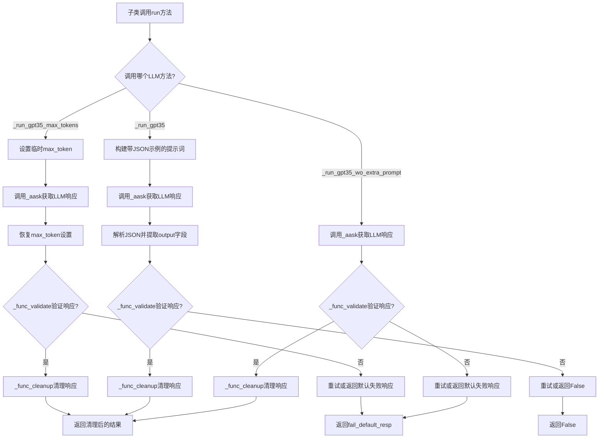
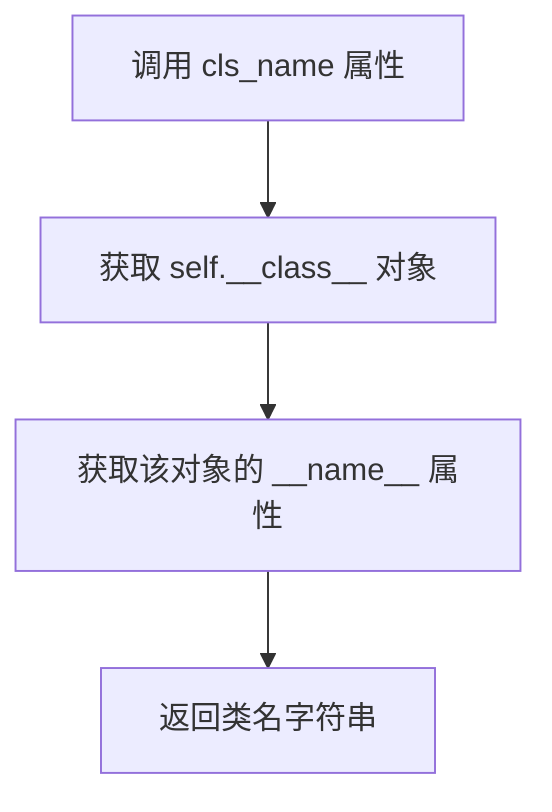
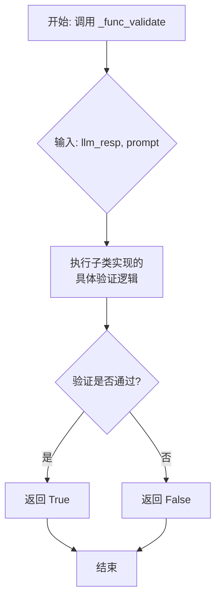
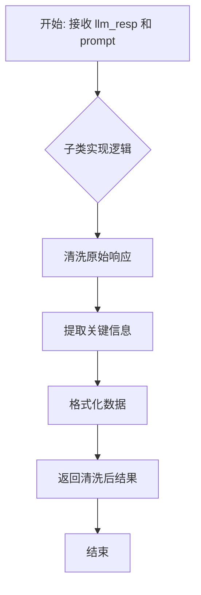
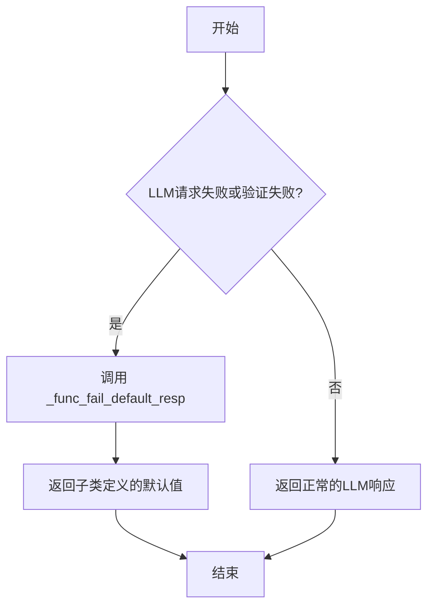
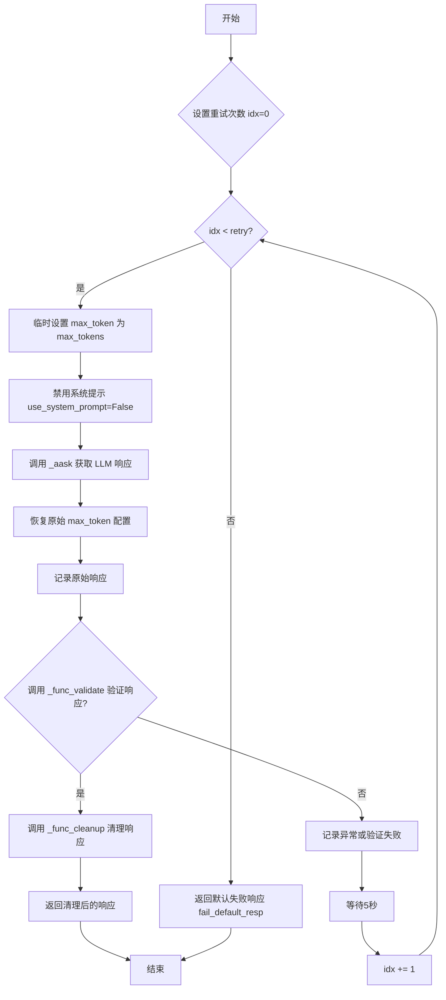
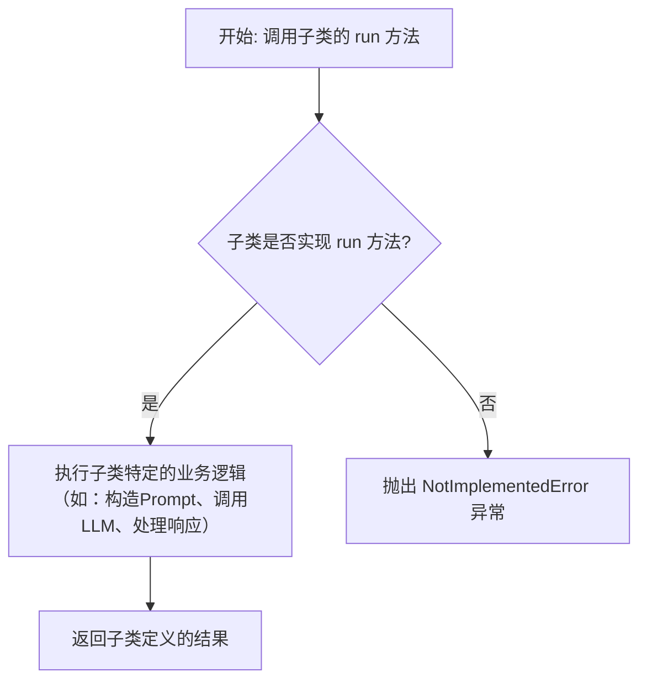

# `.\MetaGPT\metagpt\ext\stanford_town\actions\st_action.py` 详细设计文档

该文件定义了一个用于StanfordTown项目的抽象动作基类STAction，它继承自MetaGPT的Action类，提供了与LLM交互的通用方法，包括生成提示词模板、调用LLM并处理响应（包括验证、清理和失败处理），并强制子类实现具体的运行逻辑。

## 整体流程



## 类结构

```
Action (MetaGPT基类)
└── STAction (StanfordTown动作抽象基类)
    ├── (具体子类，如: ConverseAction, PlanAction等，需实现抽象方法)
    └── ...
```

## 全局变量及字段


### `STAction.name`
    
动作的名称，默认为'STAction'，用于标识该动作类。

类型：`str`
    


### `STAction.prompt_dir`
    
存储提示模板文件的目录路径，用于加载和生成LLM提示。

类型：`Path`
    


### `STAction.fail_default_resp`
    
当LLM调用失败或验证不通过时返回的默认响应，可为None。

类型：`Optional[str]`
    
    

## 全局函数及方法


### `STAction.cls_name`

`cls_name` 是一个只读属性（property），用于获取当前 `STAction` 类实例所属的具体子类的类名。

参数：无

返回值：`str`，返回当前实例所属类的类名字符串。

#### 流程图



#### 带注释源码

```python
    @property
    def cls_name(self):
        # 使用 self.__class__ 获取当前实例的类对象
        # 然后访问类对象的 __name__ 属性，该属性存储了类的名称
        return self.__class__.__name__
```


### `STAction._func_validate`

`_func_validate` 是 `STAction` 抽象基类中定义的一个抽象方法。它的核心职责是验证由大语言模型（LLM）生成的原始响应（`llm_resp`）是否符合特定子类动作的预期格式、内容或业务逻辑。该方法充当了LLM输出与下游处理逻辑之间的一个验证门，确保只有有效的响应才会被进一步清理（`_func_cleanup`）和使用。具体的验证逻辑（如检查JSON结构、关键词、语义正确性等）需要由继承 `STAction` 的子类来实现。

参数：

- `llm_resp`：`str`，从大语言模型获取的原始文本响应。
- `prompt`：`str`，发送给大语言模型的原始提示词，可用于上下文相关的验证。

返回值：`bool`，返回一个布尔值。`True` 表示 `llm_resp` 通过了验证，是有效的；`False` 表示验证失败，响应无效。

#### 流程图



#### 带注释源码

```python
    @abstractmethod
    def _func_validate(self, llm_resp: str, prompt: str):
        # 这是一个抽象方法，使用 `@abstractmethod` 装饰器标记。
        # 这意味着 `STAction` 类本身不能直接实例化，任何继承它的非抽象子类都必须实现这个方法。
        # 参数 `llm_resp` 和 `prompt` 的类型提示为 `str`。
        # 方法体直接抛出 `NotImplementedError` 异常，强制子类提供具体实现。
        raise NotImplementedError
```


### `STAction._func_cleanup`

`_func_cleanup` 是 `STAction` 类中的一个抽象方法，其核心功能是**对大型语言模型（LLM）返回的原始响应字符串进行后处理和清洗**。它旨在将 LLM 的原始、可能包含额外格式或噪声的输出，转换为下游任务（如验证、存储或进一步处理）所需的干净、结构化的数据格式。该方法的具体实现逻辑由 `STAction` 的子类根据其特定的业务场景来定义。

参数：

-  `llm_resp`：`str`，大型语言模型返回的原始响应字符串。
-  `prompt`：`str`，发送给大型语言模型的原始提示词。此参数可能用于辅助解析或理解 `llm_resp` 的上下文。

返回值：`Any`，经过清洗和处理后的数据。具体的返回类型（如 `str`, `dict`, `list` 等）由子类实现决定，它代表了该 Action 期望的最终、可用的输出格式。

#### 流程图



#### 带注释源码

```
    @abstractmethod
    def _func_cleanup(self, llm_resp: str, prompt: str):
        # 这是一个抽象方法，没有具体的实现代码。
        # 它定义了方法签名和预期行为，强制所有继承自 `STAction` 的子类
        # 必须根据自身需求实现此方法。
        # 参数 `llm_resp` 是 LLM 的原始响应，`prompt` 是原始提示。
        # 子类实现应在此方法中编写逻辑，以将 `llm_resp` 转换为所需的格式。
        raise NotImplementedError
```


### `STAction._func_fail_default_resp`

这是一个抽象方法，用于定义当LLM（大语言模型）请求失败或验证不通过时，返回的默认响应。它作为STAction类及其子类中LLM调用流程的兜底机制，确保在异常情况下有一个可控的返回值。

参数：
-  `self`：`STAction`，当前STAction类或其子类的实例。

返回值：`Any`，当LLM请求失败或响应验证失败时返回的默认值。具体类型和内容由子类实现决定。

#### 流程图



#### 带注释源码

```python
    @abstractmethod
    def _func_fail_default_resp(self):
        # 这是一个抽象方法，必须在STAction的子类中被具体实现。
        # 它的目的是提供一个在LLM交互流程（如_run_gpt35_max_tokens, _run_gpt35, _run_gpt35_wo_extra_prompt）
        # 发生失败（如达到重试次数上限、响应格式验证失败）时返回的默认值。
        # 这个默认值用于替代无效的LLM响应，保证后续逻辑的健壮性。
        # 例如，在对话生成失败时，可以返回一个预设的默认对话文本。
        raise NotImplementedError
```


### `STAction.generate_prompt_with_tmpl_filename`

该方法用于根据指定的模板文件名和输入内容，生成一个完整的提示词字符串。它读取模板文件，并将模板中的占位符（格式为 `!<INPUT {序号}>!`）替换为传入的输入参数，最后对生成的提示词进行清理和格式化。

参数：

-  `prompt_input`：`Union[str, list]`，要填充到模板中的输入内容。可以是单个字符串，也可以是字符串列表。
-  `tmpl_filename`：`str`，提示词模板文件的名称。该文件应位于 `self.prompt_dir` 目录下。

返回值：`str`，一个经过占位符替换和清理后，准备发送给大语言模型（LLM）的完整提示词字符串。

#### 流程图

```mermaid
graph TD
    A[开始: generate_prompt_with_tmpl_filename] --> B{判断 prompt_input 类型};
    B -- 是字符串 --> C[转换为单元素列表];
    B -- 是列表 --> D[保持为列表];
    C --> E[将所有列表元素转换为字符串];
    D --> E;
    E --> F[读取模板文件 tmpl_filename];
    F --> G[遍历 prompt_input 列表];
    G --> H[将模板中的 !<INPUT i>! 替换为 prompt_input[i]];
    H --> I{检查是否包含特殊标记 <commentblockmarker>###</commentblockmarker>};
    I -- 是 --> J[截取标记后的内容];
    I -- 否 --> K[保留全部内容];
    J --> L[去除首尾空白字符];
    K --> L;
    L --> M[返回最终提示词];
```

#### 带注释源码

```python
def generate_prompt_with_tmpl_filename(self, prompt_input: Union[str, list], tmpl_filename) -> str:
    """
    same with `generate_prompt`
    Args:
        prompt_input: the input we want to feed in (IF THERE ARE MORE THAN ONE INPUT, THIS CAN BE A LIST.)
        tmpl_filename: prompt template filename
    Returns:
        a str prompt that will be sent to LLM server.
    """
    # 1. 参数标准化：确保 prompt_input 是一个列表，且所有元素为字符串
    if isinstance(prompt_input, str):
        prompt_input = [prompt_input]
    prompt_input = [str(i) for i in prompt_input]

    # 2. 读取模板文件
    # 构建模板文件的完整路径：self.prompt_dir / tmpl_filename
    f = open(str(self.prompt_dir.joinpath(tmpl_filename)), "r")
    prompt = f.read()
    f.close()

    # 3. 替换占位符
    # 遍历输入列表，将模板中的 `!<INPUT {count}>!` 替换为对应的输入字符串
    for count, i in enumerate(prompt_input):
        prompt = prompt.replace(f"!<INPUT {count}>!", i)

    # 4. 清理和格式化
    # 如果模板中包含特殊注释块标记，则只保留标记之后的部分
    if "<commentblockmarker>###</commentblockmarker>" in prompt:
        prompt = prompt.split("<commentblockmarker>###</commentblockmarker>")[1]
    # 去除提示词首尾的空白字符后返回
    return prompt.strip()
```


### `STAction._aask`

`STAction._aask` 是 `STAction` 类的一个异步方法，其核心功能是作为与底层大语言模型（LLM）交互的抽象接口。它接收一个提示字符串，调用配置的LLM实例的异步问答方法，并返回LLM生成的文本响应。该方法封装了具体的LLM调用细节，为类中其他更复杂的方法（如 `_run_gpt35_max_tokens`, `_run_gpt35` 等）提供了基础的、统一的LLM交互能力。

参数：

- `prompt`：`str`，发送给大语言模型（LLM）的提示文本。

返回值：`str`，大语言模型（LLM）根据提示生成的文本响应。

#### 流程图

```mermaid
graph TD
    A[开始: 调用 _aask(prompt)] --> B[调用 self.llm.aask(prompt)]
    B --> C{等待LLM响应}
    C --> D[收到LLM响应字符串]
    D --> E[返回响应字符串]
    E --> F[结束]
```

#### 带注释源码

```python
async def _aask(self, prompt: str) -> str:
    # 调用当前实例的 `llm` 属性（一个LLM客户端实例）的 `aask` 异步方法。
    # `aask` 方法负责将 `prompt` 发送给实际的LLM服务（如OpenAI API）并获取响应。
    # 该方法直接返回LLM的原始响应字符串，不进行任何额外的验证、清理或格式化。
    return await self.llm.aask(prompt)
```


### `STAction._run_gpt35_max_tokens`

该方法用于调用GPT-3.5模型，并指定生成的最大令牌数（`max_tokens`）。它通过临时修改配置中的`max_token`参数来限制LLM的响应长度，并在多次重试失败后返回默认的失败响应。

参数：

-  `prompt`：`str`，发送给GPT-3.5模型的提示文本。
-  `max_tokens`：`int`，可选，默认为50。指定LLM响应允许的最大令牌数。
-  `retry`：`int`，可选，默认为3。在发生异常或验证失败时重试的次数。

返回值：`Union[str, None]`，如果成功，返回经过清理和验证的LLM响应字符串；如果所有重试都失败，则返回`self.fail_default_resp`（可能为`None`）。

#### 流程图



#### 带注释源码

```python
async def _run_gpt35_max_tokens(self, prompt: str, max_tokens: int = 50, retry: int = 3):
    # 循环重试，最多 retry 次
    for idx in range(retry):
        try:
            # 1. 保存当前配置中的 max_token 值
            tmp_max_tokens_rsp = getattr(self.config.llm, "max_token", 1500)
            # 2. 临时将配置中的 max_token 设置为传入的 max_tokens 参数
            setattr(self.config.llm, "max_token", max_tokens)
            # 3. 禁用系统提示，使模型行为更像非聊天补全
            self.llm.use_system_prompt = False

            # 4. 调用异步方法 _aask 发送提示并获取 LLM 响应
            llm_resp = await self._aask(prompt)

            # 5. 恢复配置中的原始 max_token 值
            setattr(self.config.llm, "max_token", tmp_max_tokens_rsp)
            # 6. 记录原始响应日志
            logger.info(f"Action: {self.cls_name} llm _run_gpt35_max_tokens raw resp: {llm_resp}")
            # 7. 调用抽象验证方法检查响应是否有效
            if self._func_validate(llm_resp, prompt):
                # 8. 如果有效，调用抽象清理方法处理响应并返回
                return self._func_cleanup(llm_resp, prompt)
        except Exception as exp:
            # 9. 捕获任何异常，记录警告日志
            logger.warning(f"Action: {self.cls_name} _run_gpt35_max_tokens exp: {exp}")
            # 10. 等待5秒，通常用于避免速率限制
            time.sleep(5)
    # 11. 所有重试都失败后，返回默认的失败响应
    return self.fail_default_resp
```


### `STAction._run_gpt35`

该方法用于向 GPT-3.5 模型发起请求，并处理其响应。它通过构建一个特定的提示词（prompt），要求模型以 JSON 格式输出，并包含一个示例输出。方法会尝试解析响应中的 JSON，提取 `"output"` 字段的值，并通过抽象方法 `_func_validate` 和 `_func_cleanup` 进行验证和清理。如果所有重试都失败，则返回 `False`。

参数：

-  `prompt`：`str`，发送给 LLM 的核心提示词内容。
-  `example_output`：`str`，期望输出格式的示例，用于构建最终提示词。
-  `special_instruction`：`str`，附加的特殊指令，用于指导 LLM 的输出格式或内容。
-  `retry`：`int`，请求失败时的重试次数，默认为 3。

返回值：`Union[bool, Any]`，如果成功获取并验证了 LLM 的响应，则返回经过 `_func_cleanup` 清理后的结果（类型由子类实现决定）；如果所有重试均失败，则返回 `False`。

#### 流程图

```mermaid
graph TD
    A[开始: _run_gpt35] --> B[构建最终提示词<br/>包含原始prompt、特殊指令和示例JSON]
    B --> C{设置重试次数<br/>idx in range(retry)}
    C --> D[尝试调用_aask获取LLM响应]
    D --> E{是否发生异常?}
    E -->|是| F[记录警告日志，等待5秒]
    F --> C
    E -->|否| G[记录原始响应日志]
    G --> H[截取响应中最后一个'}'之前的部分<br/>尝试解析为JSON]
    H --> I{JSON解析成功且包含'output'键?}
    I -->|是| J[提取llm_resp = json_data['output']]
    J --> K[调用_func_validate验证响应]
    K --> L{验证通过?}
    L -->|是| M[调用_func_cleanup清理并返回结果]
    L -->|否| N[进入下一次重试]
    I -->|否| N
    N --> C
    C -->|所有重试均失败| O[返回 False]
    M --> P[结束]
    O --> P
```

#### 带注释源码

```python
async def _run_gpt35(
    self, prompt: str, example_output: str, special_instruction: str, retry: int = 3
) -> Union[bool, Any]:
    """same with `gpt_structure.ChatGPT_safe_generate_response`"""
    # 1. 构建最终发送给LLM的提示词。
    #    将原始prompt用三引号包裹，添加要求输出JSON的指令、特殊指令和示例JSON。
    prompt = '"""\n' + prompt + '\n"""\n'
    prompt += f"Output the response to the prompt above in json. {special_instruction}\n"
    prompt += "Example output json:\n"
    prompt += '{"output": "' + str(example_output) + '"}'

    # 2. 开始重试循环
    for idx in range(retry):
        try:
            # 2.1 调用底层LLM接口获取响应
            llm_resp = await self._aask(prompt)
            # 2.2 记录原始响应，便于调试
            logger.info(f"Action: {self.cls_name} llm _run_gpt35 raw resp: {llm_resp}")
            # 2.3 处理响应：找到最后一个'}'，截取字符串，尝试解析JSON。
            #     这是一种简单的容错机制，防止LLM返回额外文本。
            end_idx = llm_resp.strip().rfind("}") + 1
            llm_resp = llm_resp[:end_idx]
            # 2.4 解析JSON并提取"output"字段的值
            llm_resp = json.loads(llm_resp)["output"]

            # 2.5 使用子类实现的抽象方法验证响应内容是否有效
            if self._func_validate(llm_resp, prompt):
                # 2.6 如果验证通过，使用子类实现的抽象方法清理并返回最终结果
                return self._func_cleanup(llm_resp, prompt)
        except Exception as exp:
            # 2.7 处理异常：记录日志，等待一段时间（通常用于避免速率限制），然后继续重试
            logger.warning(f"Action: {self.cls_name} _run_gpt35 exp: {exp}")
            time.sleep(5)  # usually avoid `Rate limit`
    # 3. 如果重试次数用尽仍未成功，返回False
    return False
```


### `STAction._run_gpt35_wo_extra_prompt`

该方法是一个异步方法，用于向配置的LLM（大语言模型）发送一个给定的提示（`prompt`），并获取其响应。它不添加任何额外的格式化指令（如JSON包装），直接使用原始提示进行查询。方法内置了重试机制，在发生异常或响应验证失败时，会尝试重新发送请求，最多重试指定次数。如果所有重试均失败，则返回类中定义的默认失败响应（`fail_default_resp`）。

参数：

-  `prompt`：`str`，要发送给大语言模型（LLM）的原始提示文本。
-  `retry`：`int`，可选参数，默认为3。当请求失败或响应验证失败时，最大重试次数。

返回值：`str`，经过清理和验证后的LLM响应文本。如果所有重试均失败，则返回`self.fail_default_resp`（可能为`None`）。

#### 流程图

```mermaid
graph TD
    A[开始: _run_gpt35_wo_extra_prompt] --> B{设置循环变量 idx < retry?};
    B -- 是 --> C[尝试: 调用 _aask 发送 prompt];
    C --> D{是否发生异常?};
    D -- 是 --> E[记录警告日志];
    E --> F[等待5秒];
    F --> G[循环变量 idx++];
    G --> B;
    D -- 否 --> H[清理响应: llm_resp.strip()];
    H --> I[记录响应日志];
    I --> J{调用 _func_validate 验证响应?};
    J -- 是 --> K[调用 _func_cleanup 清理响应];
    K --> L[返回清理后的响应];
    J -- 否 --> G;
    B -- 否 --> M[返回默认失败响应 self.fail_default_resp];
    L --> N[结束];
    M --> N;
```

#### 带注释源码

```python
async def _run_gpt35_wo_extra_prompt(self, prompt: str, retry: int = 3) -> str:
    # 循环尝试请求，最多重试 retry 次
    for idx in range(retry):
        try:
            # 1. 调用异步方法 _aask 向LLM发送原始提示，并获取原始响应
            llm_resp = await self._aask(prompt)
            # 2. 清理响应：去除首尾空白字符
            llm_resp = llm_resp.strip()
            # 3. 记录本次请求的原始响应日志，便于调试
            logger.info(f"Action: {self.cls_name} llm _run_gpt35_wo_extra_prompt raw resp: {llm_resp}")
            # 4. 调用抽象方法 _func_validate 验证响应是否有效
            if self._func_validate(llm_resp, prompt):
                # 5. 如果验证通过，调用抽象方法 _func_cleanup 对响应进行最终清理并返回
                return self._func_cleanup(llm_resp, prompt)
        except Exception as exp:
            # 6. 如果在请求或处理过程中发生任何异常，记录警告日志
            logger.warning(f"Action: {self.cls_name} _run_gpt35_wo_extra_prompt exp: {exp}")
            # 7. 等待5秒，通常用于避免触发API的速率限制（Rate limit）
            time.sleep(5)  # usually avoid `Rate limit`
    # 8. 如果循环结束（所有重试都失败），返回类中定义的默认失败响应
    return self.fail_default_resp
```


### `STAction.run`

`STAction.run` 是 `STAction` 抽象基类的核心执行方法。它定义了所有具体斯坦福小镇（StanfordTown）动作（Action）子类必须实现的接口。该方法旨在接收任意参数，执行特定的逻辑（通常涉及与大型语言模型LLM的交互），并返回执行结果。由于 `STAction` 是一个抽象基类，此方法的具体实现由子类提供，用于完成诸如生成对话、规划路径、执行任务等具体功能。

参数：

-  `*args`：`tuple`，可变位置参数，允许子类方法接收任意数量的位置参数。
-  `**kwargs`：`dict`，可变关键字参数，允许子类方法接收任意数量的关键字参数。

返回值：`Any`，返回值类型和描述由具体的子类实现决定。通常，它可能返回一个字符串（如LLM的响应）、一个布尔值（表示成功或失败）、一个字典或任何其他数据结构，具体取决于动作的目的。

#### 流程图



#### 带注释源码

```python
async def run(self, *args, **kwargs):
    """Run action"""
    # 这是一个抽象方法，在基类中仅提供接口定义。
    # 任何继承自 STAction 的具体动作类都必须重写此方法。
    # *args 和 **kwargs 提供了灵活性，允许子类方法接受所需的任何参数。
    # 当子类没有实现此方法时，调用它会抛出 NotImplementedError 异常。
    raise NotImplementedError("The run method should be implemented in a subclass.")
```


## 关键组件


### STAction基类

定义了StanfordTown项目中所有具体Action的抽象基类，提供了与LLM交互的通用框架和模板方法。

### 提示词模板系统

通过`generate_prompt_with_tmpl_filename`方法实现的动态提示词生成机制，支持从文件加载模板并进行变量替换。

### LLM交互适配器

包含`_run_gpt35_max_tokens`、`_run_gpt35`和`_run_gpt35_wo_extra_prompt`等方法，封装了与GPT-3.5等LLM模型的安全、可重试的交互逻辑。

### 响应验证与清理钩子

通过`_func_validate`和`_func_cleanup`等抽象方法，强制子类实现LLM响应的验证和后续清理逻辑，确保数据可靠性。

### 错误处理与重试机制

在LLM调用方法中集成了异常捕获、日志记录、指数退避（通过`time.sleep`）和默认失败响应的返回，提高了系统的鲁棒性。


## 问题及建议


### 已知问题

-   **硬编码的模型名称和参数**：代码中方法名（如 `_run_gpt35_max_tokens`, `_run_gpt35`）和硬编码的 `max_token` 值（1500）表明其与特定模型（GPT-3.5）深度耦合，限制了代码的通用性和可维护性。
-   **临时修改全局配置**：`_run_gpt35_max_tokens` 方法中临时修改 `self.config.llm.max_token` 并随后恢复，这种做法在多线程或异步环境下存在竞态条件风险，可能导致其他操作使用错误的配置。
-   **异常处理过于宽泛**：`except Exception` 捕获所有异常，虽然记录了日志并重试，但可能掩盖了非预期错误（如逻辑错误），不利于调试和问题定位。
-   **JSON解析逻辑脆弱**：`_run_gpt35` 方法中通过查找最后一个 `}` 来截取JSON字符串，这种方式不健壮。如果LLM响应中包含嵌套对象或字符串中包含 `}`，解析将失败。
-   **资源管理不当**：`generate_prompt_with_tmpl_filename` 方法使用 `open` 和 `close` 手动管理文件句柄，而非使用 `with` 语句，存在文件句柄泄漏的风险。
-   **缺乏类型注解和返回值不明确**：部分方法（如 `_run_gpt35`）返回 `Union[bool, Any]`，类型过于宽泛，调用方难以处理。抽象方法（如 `_func_validate`）缺少参数和返回值的类型注解。
-   **硬编码的重试间隔**：重试失败后固定等待5秒（`time.sleep(5)`），缺乏退避策略，可能在高负载或限流场景下效率低下。
-   **潜在的无限循环风险**：如果 `fail_default_resp` 为 `None`，且所有重试均失败，`_run_gpt35_max_tokens` 和 `_run_gpt35_wo_extra_prompt` 方法将返回 `None`，但调用方可能未处理此情况。

### 优化建议

-   **抽象LLM交互层**：将模型特定的逻辑（如方法命名、参数设置）抽象到一个通用的 `LLMClient` 接口或配置类中。通过依赖注入或配置驱动来支持不同的模型，提高代码的可扩展性。
-   **使用上下文管理器管理配置**：创建一个上下文管理器来临时修改配置，确保即使在发生异常时配置也能被正确恢复，避免竞态条件。
-   **细化异常处理**：区分不同类型的异常（如网络异常、API限流异常、解析异常、业务逻辑验证失败）。针对可重试的异常（如网络超时、限流）进行重试，对其他异常则立即抛出。
-   **使用标准库解析JSON**：在 `_run_gpt35` 方法中，应直接对完整的LLM响应字符串尝试 `json.loads()`。如果失败，可以尝试更健壮的提取方法（如使用正则表达式），或者要求LLM返回纯净的JSON。
-   **使用 `with` 语句管理资源**：将 `generate_prompt_with_tmpl_filename` 方法中的文件操作改为使用 `with open(...) as f:`，确保文件句柄被正确关闭。
-   **完善类型注解**：为所有抽象方法和类方法添加精确的类型注解。明确 `_run_gpt35` 等方法在成功和失败时的具体返回类型，例如使用 `Optional[YourType]` 或定义特定的异常/结果类。
-   **实现指数退避重试策略**：将固定的 `time.sleep(5)` 替换为带有指数退避和随机抖动的重试机制（例如使用 `tenacity` 库），以提高重试成功率并减轻服务器压力。
-   **确保默认返回值安全**：在基类或子类中确保 `fail_default_resp` 有一个合理的默认值（例如空字符串或特定标记对象），并在文档中明确所有运行方法在失败时的返回值约定。
-   **考虑异步文件I/O**：如果应用是I/O密集型的，可以考虑使用 `aiofiles` 等库进行异步文件读取，以避免阻塞事件循环。
-   **统一提示词生成逻辑**：考虑将 `generate_prompt_with_tmpl_filename` 的功能与 `metagpt` 框架中可能已有的提示词模板工具进行整合，避免重复造轮子。


## 其它


### 设计目标与约束

本模块（`STAction`）是 StanfordTown 项目中所有具体动作（Action）的抽象基类。其核心设计目标是提供一个可扩展、模板化的框架，用于生成和验证与大型语言模型（LLM）交互的提示词（prompt），并处理其响应。主要约束包括：1) 必须与 MetaGPT 框架的 `Action` 基类兼容；2) 需要支持多种与 GPT-3.5 模型交互的模式（如限制最大令牌数、要求 JSON 格式输出、无额外指令等）；3) 必须提供响应验证和清理的抽象接口，由子类实现具体逻辑；4) 需要具备基本的错误重试和降级处理能力。

### 错误处理与异常设计

模块的错误处理主要围绕与 LLM 交互的健壮性设计。`_run_gpt35_max_tokens`、`_run_gpt35` 和 `_run_gpt35_wo_extra_prompt` 方法均实现了重试机制（默认 3 次），当发生异常（如网络错误、速率限制、JSON 解析错误）或响应验证失败时，会等待 5 秒后重试。所有异常均被捕获并记录为警告日志，不会导致程序崩溃。重试耗尽后，方法会返回一个默认的失败响应（`fail_default_resp` 或 `False`）。这种设计确保了单个 Action 的失败不会阻塞整个代理（Agent）的工作流，符合容错设计原则。然而，当前异常处理较为笼统，未对不同类型异常（如网络超时、认证失败、内容过滤等）进行区分处理。

### 数据流与状态机

模块的数据流始于子类 `run` 方法的调用，该方法接收特定于动作的参数。子类 `run` 方法内部会调用 `generate_prompt_with_tmpl_filename` 方法，根据模板文件和输入参数生成最终的提示词字符串。然后，根据交互模式选择调用 `_run_gpt35_max_tokens`、`_run_gpt35` 或 `_run_gpt35_wo_extra_prompt` 方法之一。这些方法将提示词发送给 LLM 并获取原始响应。获取响应后，流程进入验证和清理阶段：首先调用子类实现的 `_func_validate` 方法检查响应是否有效；若有效，则调用 `_func_cleanup` 方法对响应进行格式化或提取关键信息；若无效或发生异常，则触发重试或返回默认值。整个流程是线性的，没有复杂的状态转移。模块本身不维护内部状态，所有必要信息都通过方法参数传递。

### 外部依赖与接口契约

1.  **父类依赖**：继承自 `metagpt.actions.action.Action`，依赖于其定义的 `llm`、`config` 等属性和基础框架机制。
2.  **LLM 接口契约**：通过 `self.llm.aask(prompt)` 异步方法与底层 LLM 服务交互。假定该 `aask` 方法接收字符串提示词并返回字符串响应。在 `_run_gpt35_max_tokens` 方法中，临时修改了 `self.config.llm.max_token` 属性并设置 `self.llm.use_system_prompt = False`，这要求底层的 `llm` 对象支持这些属性的动态修改以改变其行为。
3.  **模板文件契约**：`generate_prompt_with_tmpl_filename` 方法从 `self.prompt_dir` 目录读取模板文件。模板文件需遵循特定格式：使用 `!<INPUT {count}>!` 作为占位符，并可包含 `<commentblockmarker>###</commentblockmarker>` 标记来分隔注释和有效提示内容。
4.  **子类实现契约**：所有子类必须实现四个抽象方法：`_func_validate`（验证 LLM 响应）、`_func_cleanup`（清理响应）、`_func_fail_default_resp`（提供默认失败响应）和 `run`（执行动作的主入口）。子类通过实现这些方法来定义具体动作的语义和逻辑。
5.  **工具依赖**：使用了 Python 标准库的 `json`、`time`、`pathlib` 以及项目内部的 `metagpt.logs.logger`。

### 安全与合规考虑

1.  **提示词注入风险**：`generate_prompt_with_tmpl_filename` 方法使用简单的字符串替换，如果 `prompt_input` 中包含与模板语法冲突的内容（如 `!<INPUT 0>!`），可能导致提示词结构被破坏。当前设计假设输入是可信或经过预处理的。
2.  **LLM 使用策略**：代码中通过 `time.sleep(5)` 来缓解速率限制（Rate Limit），这是一种基础的客户端限流策略。但在高并发场景下可能不足，需要服务端或更复杂的限流机制。
3.  **数据隐私**：模块负责将包含可能敏感信息的 `prompt_input` 发送给外部 LLM API。代码本身未包含数据脱敏或加密逻辑，这需要在更高层级的应用或数据准备阶段确保。
4.  **错误信息泄露**：异常信息被记录到日志中，可能包含提示词内容或内部配置。需确保日志系统的访问权限得到适当控制。

    