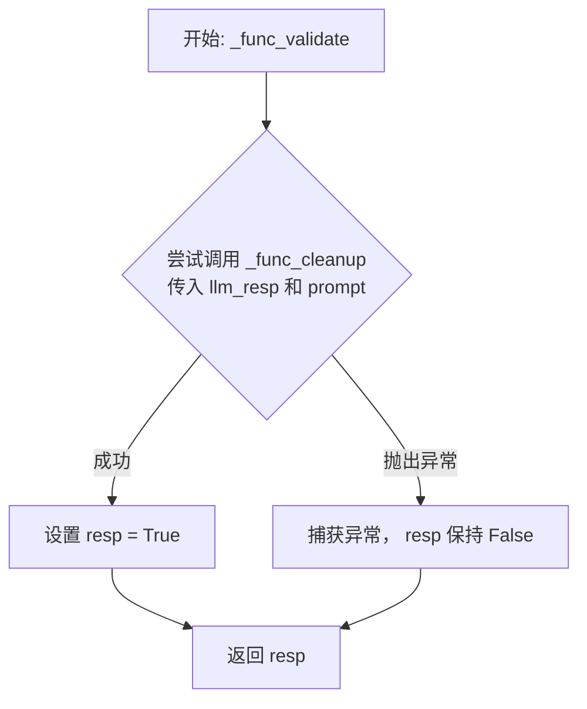
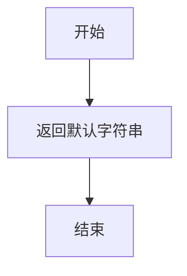

# `.\MetaGPT\metagpt\ext\stanford_town\actions\summarize_conv.py` 详细设计文档

该代码定义了一个名为`SummarizeConv`的类，它继承自`STAction`。其核心功能是接收一段对话列表（包含说话者和内容），通过调用大语言模型（GPT-3.5）生成一个简洁的、概括性的句子来描述这段对话的主题或核心内容，例如“conversing about what to eat for lunch”。

## 整体流程

```mermaid
graph TD
    A[开始: run(conv)] --> B[调用 create_prompt_input 格式化对话]
    B --> C[调用 generate_prompt_with_tmpl_filename 组装完整提示词]
    C --> D[调用 _run_gpt35 请求LLM生成摘要]
    D --> E{LLM响应是否有效?}
    E -- 是，通过 _func_validate --> F[调用 _func_cleanup 清理并格式化输出]
    E -- 否 --> G[返回 _func_fail_default_resp 默认响应]
    F --> H[记录日志并返回摘要结果]
    G --> H
    H --> I[结束]
```

## 类结构

```
STAction (基类，来自 metagpt.ext.stanford_town.actions.st_action)
└── SummarizeConv (对话摘要动作)
```

## 全局变量及字段


### `logger`
    
用于记录日志的全局日志记录器实例，提供不同级别的日志输出功能。

类型：`Logger`
    


### `SummarizeConv.name`
    
动作类的名称标识符，固定为'SummarizeConv'，用于区分不同的动作类型。

类型：`str`
    
    

## 全局函数及方法

### `SummarizeConv._func_validate`

该方法用于验证大语言模型（LLM）的响应是否可以通过 `_func_cleanup` 方法成功清理和格式化。它通过尝试调用清理方法并捕获异常来判断响应的有效性。

参数：
- `llm_resp`：`str`，需要验证的大语言模型原始响应文本。
- `prompt`：`str`，生成此响应所使用的提示词。

返回值：`bool`，如果响应可以被成功清理则返回 `True`，否则返回 `False`。

#### 流程图



#### 带注释源码

```python
def _func_validate(self, llm_resp: str, prompt: str) -> bool:
    # 初始化返回值为 False， 假设验证失败
    resp = False
    try:
        # 尝试调用清理函数，如果 llm_resp 格式不符合预期，此调用可能抛出异常
        _ = self._func_cleanup(llm_resp, prompt)
        # 如果上一行没有抛出异常，说明清理成功，将返回值设为 True
        resp = True
    except Exception:
        # 捕获所有异常，表示 llm_resp 无法被正确处理，resp 保持为初始值 False
        pass
    # 返回验证结果
    return resp
```


### `SummarizeConv._func_cleanup`

该方法用于清理和格式化从大语言模型（LLM）获得的原始响应，将其包装成一个描述对话主题的标准化字符串。

参数：

-  `llm_resp`：`str`，从大语言模型（LLM）获得的原始文本响应。
-  `prompt`：`str`，生成 `llm_resp` 所使用的提示词（在此方法中未使用，但为接口一致性而保留）。

返回值：`str`，一个以 "conversing about " 为前缀，后接清理后的 `llm_resp` 的字符串。

#### 流程图

```mermaid
flowchart TD
    A[开始] --> B{接收参数 llm_resp, prompt}
    B --> C[清理 llm_resp<br>去除首尾空白字符]
    C --> D[拼接字符串<br>"conversing about " + 清理后的llm_resp]
    D --> E[返回格式化后的字符串]
    E --> F[结束]
```

#### 带注释源码

```python
def _func_cleanup(self, llm_resp: str, prompt: str) -> str:
    # 清理llm_resp：去除字符串首尾的空白字符（如空格、换行符）
    ret = "conversing about " + llm_resp.strip()
    # 返回格式化后的字符串，例如："conversing about what to eat for lunch"
    return ret
```


### `SummarizeConv._func_fail_default_resp`

该方法用于在对话内容总结失败时，提供一个默认的、安全的总结字符串。

参数：
- 无

返回值：`str`，返回一个默认的对话总结字符串。

#### 流程图



#### 带注释源码

```python
def _func_fail_default_resp(self) -> str:
    # 当对话总结失败时，返回一个默认的、安全的总结字符串。
    # 这个字符串描述了一个通用的、无害的对话场景，以避免程序中断或返回空值。
    return "conversing with a housemate about morning greetings"
```

### `SummarizeConv.run`

该方法用于总结智能体之间的对话内容，生成一个简洁的摘要。它接收一个对话列表，通过调用大语言模型（GPT-3.5）来生成一个概括对话主题的句子。

参数：
- `conv`：`list`，一个列表，其中每个元素是一个包含说话者名称和发言内容的元组或列表，用于表示一段对话。

返回值：`str`，返回一个字符串，该字符串是对输入对话内容的概括性总结。

#### 流程图

```mermaid
flowchart TD
    A[开始: run(conv)] --> B[调用 create_prompt_input<br>将对话列表转换为字符串]
    B --> C[调用 generate_prompt_with_tmpl_filename<br>生成完整提示词]
    C --> D[异步调用 _run_gpt35<br>获取大模型响应]
    D --> E{模型响应是否有效?}
    E -- 是 --> F[记录日志并返回摘要]
    E -- 否 --> G[返回默认响应]
    F --> H[结束]
    G --> H
```

#### 带注释源码

```python
async def run(self, conv: list):
    # 定义一个内部函数，用于将输入的对话列表格式化为一个连续的字符串。
    # 每个对话行格式为：`说话者: "发言内容"`
    def create_prompt_input(conversation: list):
        convo_str = ""
        for row in conversation:
            convo_str += f'{row[0]}: "{row[1]}"\n'
        prompt_input = [convo_str]
        return prompt_input

    # 步骤1: 格式化输入数据，生成提示词的基础部分。
    prompt_input = create_prompt_input(conv)
    # 步骤2: 使用指定的模板文件（summarize_conversation_v1.txt）和基础输入，生成完整的提示词。
    prompt = self.generate_prompt_with_tmpl_filename(prompt_input, "summarize_conversation_v1.txt")

    # 定义示例输出，用于指导大语言模型生成类似格式的回复。
    example_output = "conversing about what to eat for lunch"
    # 定义特殊指令，约束大语言模型的输出格式和内容。
    special_instruction = (
        "The output must continue the sentence above by filling in the <fill in> tag. "
        "Don't start with 'this is a conversation about...' Just finish the sentence "
        "but do not miss any important details (including who are chatting)."
    )
    # 步骤3: 异步调用大语言模型（GPT-3.5），传入提示词、示例和指令，获取生成的对话摘要。
    output = await self._run_gpt35(prompt, example_output, special_instruction)
    # 步骤4: 记录执行日志。
    logger.info(f"Action: {self.cls_name} output: {output}")
    # 步骤5: 返回生成的摘要。
    return output
```

## 关键组件


### STAction基类

作为所有斯坦福小镇（Stanford Town）动作（Action）的抽象基类，定义了动作执行、LLM响应验证与清理、失败默认响应等通用接口和流程。

### 对话总结动作 (SummarizeConv)

继承自STAction，专门用于将智能体之间的对话列表总结为一个简短的、描述性的短语，例如“conversing about what to eat for lunch”。

### LLM集成与提示工程

通过`_run_gpt35`方法集成GPT-3.5模型，并利用模板文件（`summarize_conversation_v1.txt`）和特定的指令（`special_instruction`）来构造精确的提示词，以引导模型生成符合格式要求的总结。

### 响应处理与验证链

包含`_func_validate`、`_func_cleanup`和`_func_fail_default_resp`方法，构成了一个完整的LLM响应后处理链，用于验证响应格式、清理响应内容以及在生成失败时提供默认值，确保系统鲁棒性。

### 日志记录

使用`logger`记录动作执行的关键信息（如输出结果），便于系统监控和调试。


## 问题及建议


### 已知问题

-   **异常处理过于宽泛**：`_func_validate` 方法使用 `try...except Exception` 来捕获所有异常，这可能会掩盖代码中的潜在错误（例如，`_func_cleanup` 中的逻辑错误或类型错误），使得调试变得困难。
-   **硬编码的默认响应**：`_func_fail_default_resp` 方法返回一个固定的字符串 `"conversing with a housemate about morning greetings"`。这个默认响应可能不适用于所有对话场景，缺乏上下文相关性。
-   **提示词模板依赖**：`run` 方法依赖于一个外部模板文件 `"summarize_conversation_v1.txt"`。如果该文件丢失或格式错误，代码将无法正常工作，且错误可能不够明确。
-   **同步与异步混合**：`run` 方法是异步的，但其内部定义的 `create_prompt_input` 函数是同步的。虽然在这个简单场景下问题不大，但这种模式在更复杂的异步上下文中可能导致混淆或性能问题。
-   **日志信息不完整**：`logger.info` 仅记录了 `self.cls_name` 和 `output`，但没有记录原始的对话内容 (`conv`) 或生成的提示词 (`prompt`)。这在排查总结结果不符合预期的问题时，信息可能不足。

### 优化建议

-   **细化异常处理**：在 `_func_validate` 和 `_func_cleanup` 中，应捕获更具体的异常，并在验证失败时记录更详细的错误信息（例如，记录 `llm_resp` 的内容），以便于问题定位。
-   **改进默认响应生成**：可以考虑根据输入对话 (`conv`) 的某些特征（如参与者、对话长度）生成一个更合理的默认摘要，而不是返回一个完全静态的字符串。或者，将默认响应作为配置项。
-   **增强模板文件的健壮性**：在加载模板文件时，增加文件存在性检查，并提供清晰的错误信息。或者，考虑将模板字符串内嵌在代码中作为备选方案。
-   **统一异步模式**：将 `create_prompt_input` 函数移出 `run` 方法，或者明确其同步性质。如果项目整体采用异步，可以考虑将其也改为异步函数（尽管此处可能无必要）。
-   **丰富日志内容**：在 `logger.info` 或 `logger.debug` 中增加对输入参数 `conv` 和中间产物 `prompt` 的日志记录（注意可能涉及隐私，可做脱敏处理或仅在调试模式开启），这将极大有助于监控和调试。
-   **考虑结果缓存**：如果相同的对话内容可能被多次总结，可以考虑引入缓存机制（例如，基于 `conv` 内容的哈希值）来存储LLM的返回结果，以避免重复调用，节省成本和时间。
-   **增加单元测试**：为 `_func_cleanup`, `_func_validate`, `create_prompt_input` 等方法编写单元测试，确保其逻辑正确性，特别是边界情况（如空对话列表、包含特殊字符的对话内容）。


## 其它


### 设计目标与约束

本模块的核心设计目标是提供一个可复用的对话摘要生成组件，该组件继承自斯坦福小镇扩展的通用动作基类 `STAction`。其主要约束包括：必须与特定的提示词模板文件（`summarize_conversation_v1.txt`）协同工作；摘要输出必须遵循特定的句式结构（以“conversing about”开头）；必须集成对大语言模型（GPT-3.5）的异步调用，并处理其可能出现的响应异常情况。

### 错误处理与异常设计

错误处理主要通过 `_func_validate` 和 `_func_fail_default_resp` 方法实现防御性设计。`_func_validate` 方法尝试对模型原始响应进行清理，若清理过程抛出任何异常，则验证失败，返回 `False`。当验证失败或模型调用失败时，系统将回退到 `_func_fail_default_resp` 方法提供的默认响应（“conversing with a housemate about morning greetings”），确保系统在异常情况下仍能返回一个结构合规、语义基本的摘要，避免流程中断。

### 数据流与状态机

1.  **输入**：`run` 方法接收一个列表 `conv`，其每个元素是一个二元组 `(speaker, utterance)`，代表对话轮次。
2.  **处理**：
    a. 通过内部函数 `create_prompt_input` 将对话列表格式化为字符串。
    b. 结合模板文件生成最终提示词（`prompt`）。
    c. 异步调用 `_run_gpt35` 方法，传入提示词、示例输出和特殊指令，获取大语言模型的原始响应。
    d. 通过 `_func_validate` 验证响应格式，若有效则通过 `_func_cleanup` 进行清理（添加前缀）；若无效则使用 `_func_fail_default_resp` 的默认响应。
3.  **输出**：返回一个字符串格式的对话摘要，格式为 “conversing about ...”。

### 外部依赖与接口契约

1.  **父类依赖**：强依赖于 `STAction` 基类，特别是其 `generate_prompt_with_tmpl_filename` 方法（用于加载提示词模板）和 `_run_gpt35` 方法（用于调用大语言模型）。这要求基类必须正确实现模板解析和LLM调用逻辑。
2.  **资源依赖**：依赖位于特定路径的提示词模板文件 `summarize_conversation_v1.txt`。该文件的内容结构直接决定了提示词的生成和模型的输出格式。
3.  **服务依赖**：通过 `_run_gpt35` 方法隐式依赖外部的GPT-3.5 API服务。该服务的可用性、响应延迟和计费策略是本模块运行的外部约束。
4.  **日志接口**：依赖 `metagpt.logs.logger` 进行信息输出，将摘要结果记录到日志系统。


    