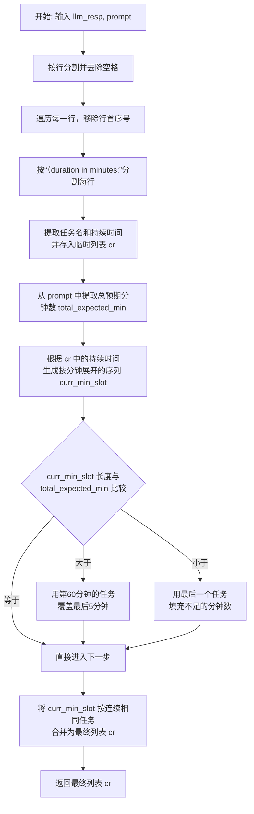
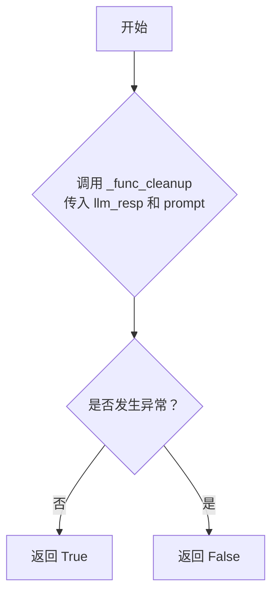

# `.\MetaGPT\metagpt\ext\stanford_town\actions\task_decomp.py` 详细设计文档

该代码实现了一个任务分解功能，属于斯坦福小镇（Stanford Town）项目的一部分。它继承自STAction，主要职责是将一个高级任务描述（如'写一篇论文'）分解为一系列更小、具有明确时间预算的子任务序列。核心流程包括：根据角色当前日程和任务信息构建提示词，调用大语言模型（GPT-3.5）生成初步分解结果，然后对模型输出进行清洗、验证和时长调整，确保子任务总时长与预期总时长匹配，最后格式化输出。

## 整体流程

```mermaid
graph TD
    A[开始: run(role, task_desc, truncated_act_dur)] --> B[调用 create_prompt_input 构建提示词输入]
    B --> C[调用 generate_prompt_with_tmpl_filename 生成完整提示词]
    C --> D[异步调用 _run_gpt35_max_tokens 获取LLM原始输出]
    D --> E{LLM输出是否通过 _func_validate?}
    E -- 否 --> F[使用 _func_fail_default_resp 默认响应]
    E -- 是 --> G[调用 _func_cleanup 清洗和解析LLM输出]
    G --> H[调整子任务序列总时长以匹配 truncated_act_dur]
    H --> I[格式化输出: 将子任务与原始任务描述合并]
    I --> J[返回最终的子任务列表]
```

## 类结构

```
STAction (基类)
└── TaskDecomp (任务分解动作)
    ├── 字段: name
    ├── 方法: _func_cleanup
    ├── 方法: _func_validate
    ├── 方法: _func_fail_default_resp
    └── 方法: run
```

## 全局变量及字段


### `TaskDecomp.name`
    
动作的名称，固定为'TaskDecomp'，用于标识此动作类。

类型：`str`
    
    

## 全局函数及方法

### `TaskDecomp._func_cleanup`

该方法用于清理和标准化从大语言模型（LLM）获取的任务分解响应字符串。它将包含任务描述和持续时间的原始文本解析为结构化的列表，并确保总持续时间与提示中指定的总预期分钟数相匹配。如果解析出的任务总时长与预期不符，方法会通过复制或截断最后一个任务来进行调整，最终返回一个格式为`[[任务名, 持续时间], ...]`的列表。

参数：
- `llm_resp`：`str`，从大语言模型获取的原始响应字符串，预期包含多行任务描述。
- `prompt`：`str`，生成`llm_resp`时使用的原始提示词，用于提取总预期持续时间。

返回值：`list`，一个二维列表，其中每个子列表包含一个任务名称（字符串）和其持续时间（整数），代表清理和标准化后的任务序列。

#### 流程图



#### 带注释源码

```python
    def _func_cleanup(self, llm_resp: str, prompt: str) -> list:
        # TODO SOMETHING HERE sometimes fails... See screenshot
        # 1. 初步清理：按换行符分割响应，并去除每行首尾空格。
        temp = [i.strip() for i in llm_resp.split("\n")]
        _cr = []
        cr = []
        # 2. 移除行号：遍历每一行，对于非首行，移除开头的序号（例如“1. ”）。
        for count, i in enumerate(temp):
            if count != 0:
                _cr += [" ".join([j.strip() for j in i.split(" ")][3:])]
            else:
                _cr += [i]
        # 3. 解析任务和持续时间：每行按“(duration in minutes:”分割。
        #    第一部分是任务名，去除末尾可能的句点。
        #    第二部分是持续时间，提取整数。
        for count, i in enumerate(_cr):
            k = [j.strip() for j in i.split("(duration in minutes:")]
            task = k[0]
            if task[-1] == ".":
                task = task[:-1]
            duration = int(k[1].split(",")[0].strip())
            cr += [[task, duration]]

        # 4. 从提示词中提取总预期持续时间。
        total_expected_min = int(prompt.split("(total duration in minutes")[-1].split("):")[0].strip())

        # TODO -- now, you need to make sure that this is the same as the sum of
        #         the current action sequence.
        # 5. 将任务列表展开为按分钟计数的序列。
        #    每个任务根据其持续时间，在序列中重复出现相应的次数。
        #    持续时间向下取整到5的倍数。
        curr_min_slot = [
            ["dummy", -1],
        ]  # (task_name, task_index)
        for count, i in enumerate(cr):
            i_task = i[0]
            i_duration = i[1]

            i_duration -= i_duration % 5
            if i_duration > 0:
                for j in range(i_duration):
                    curr_min_slot += [(i_task, count)]
        curr_min_slot = curr_min_slot[1:]

        # 6. 调整序列长度以匹配总预期时间。
        #    如果序列太长，用第60分钟的任务覆盖最后5分钟。
        #    如果序列太短，用最后一个任务填充不足的分钟数。
        if len(curr_min_slot) > total_expected_min:
            last_task = curr_min_slot[60]
            for i in range(1, 6):
                curr_min_slot[-1 * i] = last_task
        elif len(curr_min_slot) < total_expected_min:
            last_task = curr_min_slot[-1]
            for i in range(total_expected_min - len(curr_min_slot)):
                curr_min_slot += [last_task]

        # 7. 将按分钟展开的序列合并回任务列表。
        #    连续相同的任务合并，并累计其持续时间。
        cr_ret = [
            ["dummy", -1],
        ]
        for task, task_index in curr_min_slot:
            if task != cr_ret[-1][0]:
                cr_ret += [[task, 1]]
            else:
                cr_ret[-1][1] += 1
        cr = cr_ret[1:]

        # 8. 返回最终的任务列表。
        return cr
```


### `TaskDecomp._func_validate`

该方法用于验证大语言模型（LLM）对任务分解提示的响应是否有效。其核心逻辑是尝试调用 `_func_cleanup` 方法来解析和清理 LLM 的响应字符串。如果清理过程成功完成（即没有抛出异常），则认为响应有效；否则，认为响应无效。

参数：

-  `llm_resp`：`str`，大语言模型返回的原始响应文本。
-  `prompt`：`str`，生成 `llm_resp` 时所使用的原始提示词。

返回值：`bool`，如果 `llm_resp` 可以被 `_func_cleanup` 方法成功解析和处理，则返回 `True`，否则返回 `False`。

#### 流程图



#### 带注释源码

```python
def _func_validate(self, llm_resp: str, prompt: str) -> bool:
    # TODO -- this sometimes generates error
    # 尝试调用 _func_cleanup 方法来解析和验证 llm_resp。
    # 该方法包含复杂的字符串解析逻辑，可能因响应格式不符合预期而失败。
    try:
        self._func_cleanup(llm_resp, prompt)
    except Exception:
        # 如果在清理过程中捕获到任何异常，则认为响应无效。
        return False
    # 如果清理过程顺利完成，则认为响应有效。
    return True
```


### `TaskDecomp._func_fail_default_resp`

该方法是一个默认的失败响应生成器。当任务分解过程（例如，调用大语言模型或解析其响应）失败时，该方法被调用以提供一个安全的、默认的返回值，确保系统在异常情况下仍能继续运行，而不会因为缺少数据而崩溃。它返回一个预定义的、表示“睡眠”状态的任务列表。

参数：
-  `self`：`TaskDecomp`，指向当前`TaskDecomp`类实例的引用。

返回值：`int`，此处的返回值类型标注`-> int`与代码实际返回的列表`list`类型不符，是一个类型标注错误。实际返回一个包含单个子列表的列表，该子列表表示一个持续时间为0的“asleep”（睡眠）任务。

#### 流程图

```mermaid
flowchart TD
    Start[开始] --> GenerateDefault[生成默认失败响应列表]
    GenerateDefault --> ReturnList[返回列表<br>[['asleep', 0]]]
    ReturnList --> End[结束]
```

#### 带注释源码

```
    def _func_fail_default_resp(self) -> int:
        # 定义一个默认的失败响应。
        # 当任务分解过程（如LLM调用或响应解析）失败时，返回此值。
        # 返回值是一个列表，包含一个子列表。
        # 子列表的第一个元素是任务名称“asleep”，第二个元素是持续时间0。
        # 注意：方法签名中的返回值类型标注为`int`，但实际返回的是`list`，这是一个类型标注错误。
        fs = [["asleep", 0]]
        return fs
```


### `TaskDecomp.run`

该方法是一个异步方法，属于`TaskDecomp`类，其核心功能是接收一个高级任务描述和总时长，通过调用大语言模型（GPT-3.5）将任务分解为一系列更细粒度的子任务及其预估时长，并确保子任务的总时长与给定的总时长匹配。

参数：
-  `role`：`STRole`，代表执行任务的智能体角色，包含其日程、状态等信息。
-  `task_desc`：`int`，需要被分解的高级任务描述。**注意：根据代码上下文，此参数类型标注为`int`，但实际使用中应为字符串类型，这可能是一个类型标注错误。**
-  `truncated_act_dur`：`int`，该高级任务的总可用时长（以分钟为单位）。
-  `*args`：可变位置参数，当前未使用。
-  `**kwargs`：可变关键字参数，当前未使用。

返回值：`list`，返回一个列表，其中每个元素是一个包含两个元素的列表，格式为`[子任务描述, 子任务时长（分钟）]`。子任务描述是原始任务描述与模型分解出的子任务的组合。

#### 流程图

```mermaid
flowchart TD
    A[开始: run(role, task_desc, duration)] --> B[调用 create_prompt_input<br>生成LLM提示词]
    B --> C[调用 generate_prompt_with_tmpl_filename<br>组装最终Prompt]
    C --> D[异步调用 _run_gpt35_max_tokens<br>获取LLM原始响应]
    D --> E{LLM响应验证 _func_validate?}
    E -- 验证失败 --> F[使用默认响应 _func_fail_default_resp]
    E -- 验证成功 --> G[清洗响应 _func_cleanup]
    F --> H[得到output: 任务分解列表]
    G --> H
    H --> I[遍历output，累加时长time_sum]
    I --> J{time_sum <= 总时长?}
    J -- 是 --> K[将子任务加入fin_output]
    J -- 否 --> L[跳出循环]
    K --> I
    L --> M[计算fin_output总时长ftime_sum]
    M --> N[调整最后一个子任务的时长<br>使总时长等于给定总时长]
    N --> O[将原始任务描述与每个子任务描述组合]
    O --> P[返回最终的任务分解列表]
```

#### 带注释源码

```python
async def run(self, role: "STRole", task_desc: int, truncated_act_dur: int, *args, **kwargs):
    # 内部函数：用于构建发送给大语言模型的提示词（Prompt）。
    def create_prompt_input(role, task, duration):
        """
        构建提示词输入。其核心是生成一个字符串，描述角色当前及接下来一段时间（基于日程表）的计划，
        然后将角色信息、任务描述、当前时间范围、任务总时长等作为变量填入提示词模板。
        """
        # 获取角色当前在日程表中的小时索引
        curr_f_org_index = role.scratch.get_f_daily_schedule_hourly_org_index()
        all_indices = []
        # 通常包含当前索引及后续1-2个索引，以提供上下文
        all_indices += [curr_f_org_index]
        if curr_f_org_index + 1 <= len(role.scratch.f_daily_schedule_hourly_org):
            all_indices += [curr_f_org_index + 1]
        if curr_f_org_index + 2 <= len(role.scratch.f_daily_schedule_hourly_org):
            all_indices += [curr_f_org_index + 2]

        curr_time_range = ""  # 初始化当前时间范围字符串

        # 日志记录，用于调试
        logger.debug("DEBUG")
        logger.debug(role.scratch.f_daily_schedule_hourly_org)
        logger.debug(all_indices)

        # 开始构建总结字符串，描述“今天”和接下来的计划
        summ_str = f'Today is {role.scratch.curr_time.strftime("%B %d, %Y")}. '
        summ_str += "From "
        for index in all_indices:
            logger.debug(f"index {index}")
            if index < len(role.scratch.f_daily_schedule_hourly_org):
                # 计算当前计划块的开始分钟数
                start_min = 0
                for i in range(index):
                    start_min += role.scratch.f_daily_schedule_hourly_org[i][1]
                end_min = start_min + role.scratch.f_daily_schedule_hourly_org[index][1]
                # 将分钟数转换为具体时间
                start_time = datetime.datetime.strptime("00:00:00", "%H:%M:%S") + datetime.timedelta(
                    minutes=start_min
                )
                end_time = datetime.datetime.strptime("00:00:00", "%H:%M:%S") + datetime.timedelta(
                    minutes=end_min
                )
                start_time_str = start_time.strftime("%H:%M%p")
                end_time_str = end_time.strftime("%H:%M%p")
                # 将计划块格式化为字符串
                summ_str += (
                    f"{start_time_str} ~ {end_time_str}, {role.name} is planning "
                    f"on {role.scratch.f_daily_schedule_hourly_org[index][0]}, "
                )
                # 如果索引是当前索引的下一个，则记录为“当前时间范围”
                if curr_f_org_index + 1 == index:
                    curr_time_range = f"{start_time_str} ~ {end_time_str}"
        summ_str = summ_str[:-2] + "."  # 移除最后一个逗号和空格，加上句号

        # 组装最终的提示词输入列表，这些变量将填入外部模板文件
        prompt_input = []
        prompt_input += [role.scratch.get_str_iss()]  # 角色身份状态摘要
        prompt_input += [summ_str]                    # 上面构建的日程总结
        prompt_input += [role.scratch.get_str_firstname()] # 角色名（两次，可能是模板需要）
        prompt_input += [role.scratch.get_str_firstname()]
        prompt_input += [task]                        # 要分解的任务描述
        prompt_input += [curr_time_range]             # 当前/下一个时间范围
        prompt_input += [duration]                    # 任务总时长
        prompt_input += [role.scratch.get_str_firstname()] # 角色名
        return prompt_input

    # 1. 生成发送给LLM的提示词
    prompt_input = create_prompt_input(role, task_desc, truncated_act_dur)
    # 2. 使用模板文件（task_decomp_v3.txt）和生成的变量组装最终Prompt
    prompt = self.generate_prompt_with_tmpl_filename(prompt_input, "task_decomp_v3.txt")
    # 3. 设置验证失败时的默认响应函数
    self.fail_default_resp = self._func_fail_default_resp()
    # 4. 异步调用GPT-3.5模型，获取任务分解的原始响应
    output = await self._run_gpt35_max_tokens(prompt, max_tokens=1000)
    logger.info(f"Role: {role.name} {self.cls_name} output: {output}")

    # 5. 后处理：确保分解出的子任务总时长不超过给定的总时长
    fin_output = []
    time_sum = 0
    for i_task, i_duration in output:  # 遍历LLM返回的[任务， 时长]列表
        time_sum += i_duration
        # 如果累计时长小于等于总时长，则保留该子任务
        if time_sum <= truncated_act_dur:
            fin_output += [[i_task, i_duration]]
        else:  # 否则终止循环，丢弃导致超时的子任务及之后的所有子任务
            break

    # 6. 调整最后一个子任务的时长，使总时长精确等于给定的总时长
    ftime_sum = 0
    for fi_task, fi_duration in fin_output:
        ftime_sum += fi_duration
    # 计算差值，并加到最后一个子任务上
    fin_output[-1][1] += truncated_act_dur - ftime_sum
    output = fin_output  # 更新output为调整后的列表

    # 7. 将原始任务描述与每个分解出的子任务描述组合
    task_decomp = output
    ret = []
    for decomp_task, duration in task_decomp:
        # 组合格式为: “原始任务 (子任务)”
        ret += [[f"{task_desc} ({decomp_task})", duration]]
    output = ret  # 最终输出

    logger.info(f"Role: {role.name} Action: {self.cls_name} output: {output}")
    # 8. 返回最终的任务分解列表
    return output
```


## 关键组件


### 任务分解核心逻辑

负责将高层次任务描述（如“准备晚餐”）分解为一系列带有预估持续时间的子任务序列（如[["切菜", 10], ["烹饪", 20]]），并确保子任务总时长与给定的总持续时间（`truncated_act_dur`）匹配。

### 响应清理与验证

包含 `_func_cleanup` 和 `_func_validate` 方法，用于解析和清洗大语言模型（LLM）返回的文本响应，将其转换为结构化的任务列表，并验证响应的格式是否有效。该组件处理字符串分割、时长提取、时长槽位分配与调整等复杂逻辑。

### 提示词工程

通过 `create_prompt_input` 函数动态构建输入给LLM的提示词（Prompt）。该提示词整合了角色的当前状态、日程安排、目标任务描述和可用时间窗口，旨在引导LLM生成符合上下文和约束条件的任务分解结果。

### 时长调整与边界处理

在 `run` 方法中，对LLM输出的任务序列进行后处理，包括：确保子任务总时长不超过给定的 `truncated_act_dur`；对最后一个子任务的时长进行微调，以精确匹配总时长；以及将原始子任务与父任务描述进行合并格式化。

### 失败处理与默认响应

定义了 `_func_fail_default_resp` 方法，当LLM响应验证失败或处理过程中出现异常时，提供一个默认的、安全的响应（例如 `[["asleep", 0]]`），保证系统在异常情况下仍有确定性的输出，增强鲁棒性。


## 问题及建议


### 已知问题

-   **`_func_cleanup` 方法存在潜在解析失败风险**：代码注释中明确提到“TODO SOMETHING HERE sometimes fails... See screenshot”，表明该方法在解析大语言模型（LLM）的响应字符串时可能失败，尤其是在响应格式不符合预期时（例如，行数、空格或特定关键词缺失），这会导致后续处理逻辑出错。
-   **`_func_validate` 方法验证逻辑不充分**：该方法仅通过尝试调用 `_func_cleanup` 并捕获异常来判断响应是否有效。如果 `_func_cleanup` 本身存在逻辑错误但未抛出异常（例如，错误地解析了数据），则此验证方法无法发现，可能导致无效数据被后续流程使用。
-   **硬编码的索引和魔术数字**：在 `_func_cleanup` 方法中，存在多处硬编码的索引（如 `curr_min_slot[60]`）和数字（如 `for i in range(1, 6):`），这些逻辑缺乏清晰的上下文说明，难以理解其意图，且在任务时长或结构变化时可能失效。
-   **`run` 方法中时间计算逻辑存在疑问**：代码中有一行被注释掉的判断 `# if time_sum < duration:`，而实际使用的是 `if time_sum <= truncated_act_dur:`。同时，在最后调整时长时 (`fin_output[-1][1] += truncated_act_dur - ftime_sum`)，直接将剩余时间全部加到最后一项任务上，这可能不符合任务分解的合理性，且未考虑任务的最小时间粒度。
-   **错误处理与默认响应过于简单**：`_func_fail_default_resp` 方法返回一个固定的默认值 `[["asleep", 0]]`。当LLM调用失败或解析失败时，这可能导致角色行为被错误地设置为“asleep”且时长为0，与原始任务意图严重偏离，缺乏降级处理策略。
-   **日志记录级别不一致**：在 `create_prompt_input` 函数中使用了 `logger.debug`，而在 `run` 方法中使用了 `logger.info`。对于生产环境，`debug` 级别的日志可能过于详细，而关键的处理结果（`output`）使用 `info` 级别是合适的，但需要确保日志配置合理，避免信息泄露或性能问题。

### 优化建议

-   **增强 `_func_cleanup` 的鲁棒性**：使用更健壮的解析方法，例如正则表达式，来提取任务名称和持续时间。增加对输入字符串格式的预检查，并为各种可能的异常情况（如分割后数组长度不符、转换失败等）提供明确的错误处理或默认值，而不是依赖脆弱的字符串操作和索引。
-   **改进 `_func_validate` 验证逻辑**：除了检查能否成功解析，还应验证解析后的数据是否符合业务逻辑，例如，所有任务的总时长是否与提示中的 `total_expected_min` 一致（目前有TODO注释指出），以及任务名称是否非空等。
-   **消除硬编码和魔术数字**：将硬编码的索引和数字（如60、5、1、6等）提取为类常量或配置参数，并附上清晰的注释说明其含义和用途，提高代码可读性和可维护性。
-   **重构时间计算与任务分配逻辑**：重新审视 `run` 方法末尾的时间调整逻辑。考虑更合理的任务时长分配算法，例如按比例分配剩余时间，或确保每项任务满足最小时间单位（如代码中已有的 `i_duration -= i_duration % 5` 所暗示的5分钟粒度）。同时，明确注释中 `HM?????????` 处的逻辑选择原因。
-   **设计更合理的失败处理机制**：改进 `_func_fail_default_resp`，使其能根据输入的任务描述 (`task_desc`) 或上下文生成更合理的默认任务序列，或者抛出一个明确的、可被上层捕获的异常，让调用者决定如何处理失败，而不是返回一个可能无意义的固定值。
-   **规范日志输出**：统一并优化日志记录。确保 `debug` 日志仅在调试时输出关键中间变量，`info` 日志记录重要的业务事件（如任务分解结果）。考虑对可能包含敏感信息的日志（如完整的prompt）进行脱敏或仅在 `debug` 级别输出。
-   **添加单元测试**：为 `_func_cleanup`、`_func_validate` 和 `run` 方法编写全面的单元测试，覆盖正常情况、边界情况（如极短时长、超长任务列表）以及各种格式错误的LLM响应，以确保代码修改后的正确性和稳定性。
-   **代码结构优化**：考虑将 `create_prompt_input` 函数提取为类的一个独立方法，以提高可测试性。同时，`run` 方法较长，可以尝试将其中的结果后处理逻辑（从 `output` 到 `fin_output` 的部分）提取为单独的方法。


## 其它


### 设计目标与约束

本模块（`TaskDecomp`）是斯坦福小镇（Stanford Town）智能体模拟框架中，用于任务分解的核心组件。其主要设计目标是将一个高级别的、描述性的任务（例如“准备晚餐”）分解为一系列具体的、带有预估持续时间的子任务序列（例如[“洗菜”， 10], [“切菜”， 15], [“烹饪”， 30]）。该模块的运行严格依赖于大型语言模型（GPT-3.5）的生成能力，并需要与智能体角色（`STRole`）的日程计划（`scratch.f_daily_schedule_hourly_org`）和当前时间状态进行上下文结合，以确保分解出的子任务在时间逻辑上符合角色的当前日程安排。核心约束包括：1) 输入输出必须符合预定义的文本模板格式；2) 子任务总时长需与请求的`truncated_act_dur`参数匹配；3) 处理过程需具备一定的容错性，当LLM返回异常格式时能提供默认响应。

### 错误处理与异常设计

模块的错误处理主要围绕LLM响应的不可预测性展开。`_func_validate`方法尝试对原始LLM响应调用`_func_cleanup`进行解析，若解析过程抛出任何异常（`Exception`），则判定响应无效，返回`False`。当验证失败时，`run`方法将使用`_func_fail_default_resp`方法提供的默认失败响应（`[["asleep", 0]]`）。在`_func_cleanup`方法中，虽然代码尝试通过字符串分割、类型转换和时长调整来规范化响应，但注释（`# TODO SOMETHING HERE sometimes fails...`）表明此过程仍存在边界情况下的失败风险，这是当前设计中的一个已知弱点。此外，`run`方法末尾对分解后总时长的强制校准（`fin_output[-1][1] += truncated_act_dur - ftime_sum`）是一种后置补偿机制，用于确保总时长精确匹配，但这可能扭曲最后一个子任务的原始预估时长。

### 数据流与状态机

1.  **输入流**：`run`方法接收三个核心输入：`role`（智能体角色对象，包含身份、记忆和日程）、`task_desc`（待分解的高级任务描述）、`truncated_act_dur`（该任务可用的总时间预算）。
2.  **内部处理流**：
    a. **上下文构建**：`create_prompt_input`函数根据`role`的当前时间，从每小时日程计划中提取临近时间段的活动描述，拼接成给LLM的上下文提示。
    b. **LLM交互**：将构建好的提示通过`generate_prompt_with_tmpl_filename`方法填充至模板文件（`task_decomp_v3.txt`），生成最终Prompt，并调用`_run_gpt35_max_tokens`发起异步请求。
    c. **响应后处理**：对LLM返回的文本进行清洗（`_func_cleanup`）、验证（`_func_validate`），并可能应用失败默认值。
    d. **时长校准**：对清洗后的子任务列表进行时长累加和边界检查，确保总时长不超过`truncated_act_dur`，并通过调整最后一个任务的时长进行精确匹配。
    e. **结果格式化**：将每个子任务与原始`task_desc`进行组合，形成最终的输出格式`[f"{task_desc} ({decomp_task})", duration]`。
3.  **输出流**：返回一个列表，其中每个元素是一个二元列表，包含组合后的子任务描述字符串和该子任务的持续时间（分钟）。此输出可直接用于更新角色的行动计划。
4.  **状态影响**：本模块是只读的，不直接修改`role`对象的状态。其输出作为其他动作（如规划调度）的输入，间接影响角色未来的行为状态。

### 外部依赖与接口契约

1.  **父类依赖**：继承自`STAction`，依赖于其提供的`generate_prompt_with_tmpl_filename`（模板填充）、`_run_gpt35_max_tokens`（LLM调用）和`cls_name`等属性和方法。
2.  **LLM服务**：强依赖于一个能够响应`_run_gpt35_max_tokens`方法的GPT-3.5级别语言模型服务。其可用性、响应格式和延迟直接影响本模块的功能。
3.  **模板文件**：依赖位于特定路径下的文本模板文件`task_decomp_v3.txt`。该文件定义了与LLM交互的固定提示结构，其内容的变更会直接影响LLM的生成逻辑。
4.  **角色对象接口**：`run`方法要求`role`参数必须为`STRole`类（或兼容）的实例，并需提供以下接口：
    * `scratch.get_f_daily_schedule_hourly_org_index()`: 获取当前时间在日程中的索引。
    * `scratch.f_daily_schedule_hourly_org`: 访问原始的每小时日程计划列表。
    * `scratch.curr_time`: 获取当前时间对象。
    * `scratch.get_str_iss()`: 获取角色核心身份陈述。
    * `scratch.get_str_firstname()`: 获取角色名。
    * `name`: 角色名称属性。
5.  **日志系统**：依赖`metagpt.logs.logger`进行运行日志的记录。

    