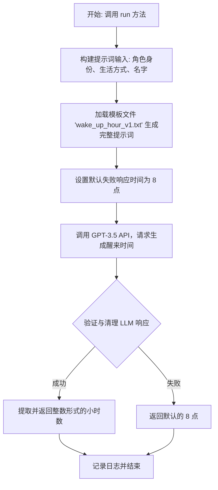
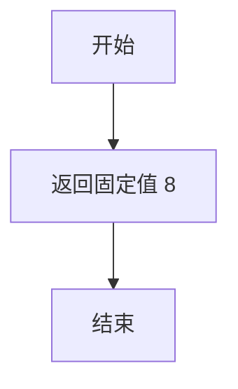

# `.\MetaGPT\metagpt\ext\stanford_town\actions\wake_up.py` 详细设计文档

该代码定义了一个名为 WakeUp 的动作类，其核心功能是模拟一个角色（如游戏或模拟环境中的NPC）的“醒来”行为。它通过调用大型语言模型（GPT-3.5），根据角色的身份、生活方式和名字生成一个合理的醒来时间（小时），并将该时间作为整数返回。

## 整体流程



## 类结构

```
STAction (基类，来自 metagpt.ext.stanford_town.actions.st_action)
└── WakeUp (本文件定义的类)
```

## 全局变量及字段


### `logger`
    
用于记录日志的全局日志记录器实例

类型：`Logger`
    


### `WakeUp.name`
    
动作的名称，固定为'WakeUp'

类型：`str`
    
    

## 全局函数及方法


### `WakeUp._func_validate`

该方法用于验证大语言模型（LLM）对唤醒时间查询的响应是否有效。其核心逻辑是尝试调用清理函数 `_func_cleanup` 来处理原始响应字符串。如果清理过程成功（即未抛出异常），则认为响应有效；否则，认为响应无效。

参数：

-  `llm_resp`：`str`，大语言模型返回的原始响应字符串。
-  `prompt`：`str`，生成响应所使用的提示词。此参数在方法内部未被使用，但为保持接口一致性而保留。

返回值：`bool`，如果响应可以被成功清理（即 `_func_cleanup` 未抛出异常），则返回 `True`，否则返回 `False`。

#### 流程图

```mermaid
flowchart TD
    A[开始: _func_validate] --> B{尝试调用 _func_cleanup(llm_resp, "")}
    B -- 成功 --> C[返回 True]
    B -- 抛出任何异常 --> D[返回 False]
    C --> E[结束]
    D --> E
```

#### 带注释源码

```python
    def _func_validate(self, llm_resp: str, prompt: str = None) -> bool:
        try:
            # 核心验证逻辑：尝试调用清理函数。如果清理过程不抛出异常，则认为响应格式有效。
            # 注意：此处传入的 prompt 参数为空字符串，因为清理函数 `_func_cleanup` 的实现
            # 实际上并不需要 prompt 参数，此设计可能是为了与其他类似方法保持接口一致。
            self._func_cleanup(llm_resp, prompt="")
        except Exception:
            # 如果在清理过程中捕获到任何异常（例如，字符串格式不符合预期），
            # 则判定为验证失败，返回 False。
            return False
        # 清理过程顺利完成，验证通过，返回 True。
        return True
```


### `WakeUp._func_cleanup`

该方法用于清理和解析大语言模型（LLM）的响应文本，从中提取出表示起床时间的数字。

参数：

-  `llm_resp`：`str`，大语言模型返回的原始文本响应。
-  `prompt`：`str`，生成响应的原始提示词（在此方法中未使用）。

返回值：`int`，解析出的起床时间（小时数）。

#### 流程图

```mermaid
graph TD
    A[开始: _func_cleanup<br/>输入: llm_resp] --> B[llm_resp.strip<br/>去除首尾空白字符];
    B --> C[.lower<br/>转换为小写];
    C --> D[.split('am')<br/>以'am'为分隔符分割字符串];
    D --> E[取分割后第一个元素];
    E --> F[int(...)<br/>转换为整数];
    F --> G[返回整数结果 cr];
```

#### 带注释源码

```python
    def _func_cleanup(self, llm_resp: str, prompt: str) -> int:
        # 1. 清理和预处理LLM响应文本
        #    a. 去除字符串首尾的空白字符（如空格、换行符）
        #    b. 将整个字符串转换为小写，确保后续分割操作不受大小写影响（例如处理'AM'或'am'）
        #    c. 使用字符串的'split'方法，以子字符串"am"作为分隔符进行分割。
        #       这假设LLM的响应格式类似于"7 am"或"7am"。
        #    d. 取分割后得到的列表中的第一个元素（索引0），这应该是代表小时数的数字部分。
        #       例如，对于"7 am"，分割后得到['7', '']，取'7'。
        cr = int(llm_resp.strip().lower().split("am")[0])
        # 2. 将提取出的数字字符串转换为整数类型并返回
        return cr
```


### `WakeUp._func_fail_default_resp`

该方法定义了当大语言模型（LLM）响应无效或处理失败时，作为后备方案返回的默认值。它返回一个固定的整数，代表默认的“醒来时间”。

参数：
- 无

返回值：`int`，返回一个固定的整数值 `8`，作为默认的醒来小时数。

#### 流程图



#### 带注释源码

```python
    def _func_fail_default_resp(self) -> int:
        # 定义一个固定的失败默认响应值
        fs = 8
        # 返回该默认值
        return fs
```


### `WakeUp.run`

该方法用于模拟角色（`STRole`）的“醒来”行为，通过调用大语言模型（GPT-3.5）来生成一个代表角色醒来时间的整数（小时）。它首先根据角色的状态（自我介绍、生活方式、名字）构建提示词，然后调用模型，处理并返回结果。如果模型调用失败，会返回一个默认值（8点）。

参数：

-  `role`：`STRole`，需要执行“醒来”动作的角色实例，包含了角色的背景、状态等信息。

返回值：`int`，代表角色醒来时间的小时数（例如，7 代表早上7点）。

#### 流程图

```mermaid
graph TD
    A[开始: WakeUp.run(role)] --> B[构建提示词输入 prompt_input];
    B --> C[使用模板生成完整提示词 prompt];
    C --> D[设置失败默认响应 fail_default_resp = 8];
    D --> E{异步调用 GPT-3.5 模型};
    E -- 成功 --> F[记录日志: Role, Action, output];
    F --> G[返回 output];
    E -- 失败 --> H[返回 fail_default_resp (8)];
```

#### 带注释源码

```python
async def run(self, role: "STRole"):
    # 定义一个内部函数，用于根据角色对象构建提示词所需的输入列表。
    def create_prompt_input(role):
        prompt_input = [
            role.scratch.get_str_iss(),        # 获取角色的自我介绍字符串
            role.scratch.get_str_lifestyle(),  # 获取角色的生活方式描述字符串
            role.scratch.get_str_firstname(),  # 获取角色的名字字符串
        ]
        return prompt_input

    # 步骤1: 为当前角色生成提示词输入数据。
    prompt_input = create_prompt_input(role)
    # 步骤2: 使用预定义的模板文件（'wake_up_hour_v1.txt'）和上一步的输入，生成完整的提示词字符串。
    prompt = self.generate_prompt_with_tmpl_filename(prompt_input, "wake_up_hour_v1.txt")
    # 步骤3: 预先获取并设置模型调用失败时的默认返回值（8点）。
    self.fail_default_resp = self._func_fail_default_resp()
    # 步骤4: 异步调用 GPT-3.5 模型，传入提示词，并限制最大输出token数为5。
    #        `_run_gpt35_max_tokens` 方法内部会处理成功、失败以及响应清洗。
    output = await self._run_gpt35_max_tokens(prompt, max_tokens=5)
    # 步骤5: 记录执行日志，包含角色名、动作名和模型输出。
    logger.info(f"Role: {role.name} Action: {self.cls_name} output: {output}")
    # 步骤6: 返回模型处理后的结果（一个代表小时的整数）。
    return output
```


## 关键组件


### STAction基类

作为所有斯坦福小镇（Stanford Town）动作（Action）的抽象基类，定义了动作执行、LLM响应验证与清理、失败默认响应等通用接口和流程框架。

### 提示词生成与模板管理

通过`generate_prompt_with_tmpl_filename`方法，根据动作特定的模板文件（如`wake_up_hour_v1.txt`）和运行时输入的变量，动态生成发送给大语言模型（LLM）的完整提示词。

### LLM交互与响应处理

通过`_run_gpt35_max_tokens`方法封装与大语言模型（此处为GPT-3.5）的异步交互，包括发送提示词、获取响应，并利用`_func_validate`和`_func_cleanup`方法对原始LLM响应进行验证和结构化清理，最终转化为可用的业务数据（如起床时间）。

### 角色状态与上下文管理

通过`STRole`对象及其`scratch`属性，获取角色的当前状态、生活方式和姓名等上下文信息，作为生成提示词的关键输入，确保动作执行符合角色的特定背景。

### 错误处理与默认值机制

通过`_func_fail_default_resp`方法定义当LLM响应验证或清理失败时的默认返回值（如默认起床时间8点），并通过`fail_default_resp`属性在`run`方法中设置，增强了系统的鲁棒性。


## 问题及建议


### 已知问题

-   **异常处理过于宽泛**：`_func_validate` 方法中使用了 `try...except Exception` 来捕获所有异常，这可能会掩盖代码中的潜在错误（例如，`_func_cleanup` 方法中的逻辑错误或输入格式问题），使得调试和问题定位变得困难。
-   **硬编码的默认值**：`_func_fail_default_resp` 方法返回一个硬编码的整数值 `8`。这个默认值缺乏上下文依据，可能不适用于所有角色或场景，降低了代码的灵活性和健壮性。
-   **脆弱的字符串解析逻辑**：`_func_cleanup` 方法依赖于特定的字符串格式（例如，期望 `llm_resp` 包含 “am” 并以特定方式分割）。如果大语言模型（LLM）的输出不符合此预期格式（例如，返回 “8 AM”， “8am”， 或 “8”），该方法将抛出异常或返回错误结果。
-   **缺乏输入验证**：`run` 方法中的 `create_prompt_input` 函数直接使用 `role` 对象的属性，但没有验证这些属性（如 `scratch.get_str_iss()` 等）是否存在或为有效值，可能导致运行时错误。
-   **日志信息不完整**：`run` 方法中的日志仅记录了角色名、动作名和输出，但没有记录关键的输入信息（`prompt_input`）或当 `_func_validate` 失败时使用的默认值，不利于问题追溯和监控。

### 优化建议

-   **细化异常处理**：在 `_func_validate` 和 `_func_cleanup` 方法中，应捕获更具体的异常（如 `ValueError`, `IndexError`, `AttributeError`），并记录详细的错误信息，以便于诊断问题。同时，考虑在验证失败时提供更有意义的反馈或采取更优雅的降级策略。
-   **使默认值可配置或基于上下文**：将 `_func_fail_default_resp` 中的默认值改为从配置中读取，或者根据 `role` 的某些属性（如生活方式 `lifestyle`）动态计算一个更合理的默认值。
-   **增强字符串解析的鲁棒性**：重构 `_func_cleanup` 方法，使用更健壮的解析方式，例如正则表达式，来提取时间数字。同时，增加对多种输入格式（如 “8 AM”, “8am”, “8”）的处理能力，并在解析失败时返回一个明确的错误或默认值。
-   **增加输入验证**：在 `create_prompt_input` 函数或 `run` 方法开始时，添加对 `role` 对象及其 `scratch` 属性必要性的检查。如果关键信息缺失，应提前抛出清晰的异常或记录警告。
-   **完善日志记录**：在 `run` 方法中，增加对输入参数（`prompt_input`）、使用的提示词模板、以及当 LLM 调用失败或验证失败时最终采用的值（无论是来自 `_func_cleanup` 还是 `_func_fail_default_resp`）的日志记录。这将极大地提升系统的可观测性。
-   **考虑异步优化**：`run` 方法是异步的，但内部调用的 `_run_gpt35_max_tokens` 可能涉及网络 I/O。应确保整个异步调用链路的错误处理是完备的，并且考虑添加超时控制，以防止因外部服务响应慢而导致的任务阻塞。


## 其它


### 设计目标与约束

该代码模块的设计目标是实现一个名为“WakeUp”的动作（Action），用于模拟斯坦福小镇（Stanford Town）中虚拟角色（STRole）的“醒来”行为。其核心功能是根据角色的个人背景（如身份、生活方式、名字）生成一个合理的醒来时间（小时数）。主要约束包括：1) 继承自`STAction`基类，需遵循其定义的执行框架（如`run`方法）；2) 依赖大型语言模型（GPT-3.5）生成文本响应；3) 需要对LLM的原始响应进行清洗和验证，确保返回一个有效的整数小时；4) 在LLM响应无效时，提供默认的失败响应（8点）。

### 错误处理与异常设计

1.  **输入验证 (`_func_validate`)**: 通过尝试调用清理函数`_func_cleanup`来间接验证LLM响应。如果清理过程抛出任何异常，则验证失败，返回`False`。这是一种防御性编程策略，但异常类型过于宽泛（捕获所有`Exception`），可能掩盖非预期的错误。
2.  **响应清理 (`_func_cleanup`)**: 假设LLM响应格式为类似“7am”的字符串。通过`split("am")`进行分割并取第一部分转换为整数。如果响应格式不符合预期（例如，不包含“am”或第一部分无法转换为整数），将抛出`ValueError`或`IndexError`。
3.  **默认失败处理 (`_func_fail_default_resp`)**: 当LLM响应无法通过验证或清理时，系统提供一个硬编码的默认值（8）。这确保了函数始终有返回值，避免了因LLM输出不稳定导致的流程中断。
4.  **运行流程 (`run`)**: 主执行方法`run`封装了提示词构建、LLM调用、日志记录和结果返回。它依赖于基类`_run_gpt35_max_tokens`处理LLM通信，该方法的内部错误（如网络超时、API限制）会向上抛出，由调用者处理。

### 数据流与状态机

1.  **数据流**:
    *   **输入**: `STRole`对象，通过其`scratch`属性提供身份(`iss`)、生活方式(`lifestyle`)、名字(`firstname`)等信息。
    *   **处理**:
        1.  `run`方法调用`create_prompt_input`，从`role`对象中提取信息，构建提示词输入列表。
        2.  使用`generate_prompt_with_tmpl_filename`方法，将输入列表与模板文件“wake_up_hour_v1.txt”结合，生成最终发送给LLM的提示词字符串。
        3.  调用`_run_gpt35_max_tokens`，将提示词发送给GPT-3.5模型，请求生成最多5个token的响应。
        4.  接收LLM的原始文本响应(`output`)。
        5.  （隐式）基类框架可能会调用`_func_validate`和`_func_cleanup`来处理`output`，但当前`run`方法直接返回了原始`output`，清理逻辑可能在其他地方被调用。
    *   **输出**: LLM的原始响应字符串（根据代码），或经过清理后的整数小时（根据类方法的设计意图）。当前`run`方法的实现是返回原始字符串。
2.  **状态机**: 该类本身不维护复杂的状态。其行为是确定性的：给定相同的`STRole`输入和外部LLM服务，应产生相同的输出（尽管LLM本身可能有随机性）。`fail_default_resp`属性在`run`方法中被设置，是一个实例级缓存，但并非状态机状态。

### 外部依赖与接口契约

1.  **外部依赖**:
    *   **父类 (`STAction`)**: 依赖其定义的`run`接口、`generate_prompt_with_tmpl_filename`方法用于提示词生成、`_run_gpt35_max_tokens`方法用于LLM调用。
    *   **LLM 服务 (GPT-3.5)**: 核心外部服务，通过基类的方法进行交互。其可用性、响应时间和输出格式直接影响本模块的功能。
    *   **模板文件 (“wake_up_hour_v1.txt”)**: 外部文件，定义了提示词的具体结构和内容。文件路径和内容的正确性至关重要。
    *   **日志系统 (`metagpt.logs.logger`)**: 用于记录操作日志。
2.  **接口契约**:
    *   **对上游调用者**: 提供`run(role: STRole)`异步方法，承诺返回一个表示醒来时间的字符串（或数字，取决于实际清理逻辑的调用位置）。
    *   **对下游 (LLM/模板)**: 假设模板文件“wake_up_hour_v1.txt”存在且格式正确，能够接受一个包含三个字符串的列表作为输入。假设LLM服务能够访问并返回预期格式的响应（如“Xam”）。
    *   **内部方法契约**: `_func_cleanup`期望输入一个包含“am”的字符串，并返回一个整数。`_func_validate`通过调用`_func_cleanup`来工作，假设清理失败即代表响应无效。

### 潜在的技术债务或优化空间（补充）

1.  **硬编码与魔法值**: 默认失败响应`8`是硬编码的。模板文件名“wake_up_hour_v1.txt”也是硬编码字符串。建议将其配置化。
2.  **脆弱的响应解析**: `_func_cleanup`严重依赖“am”这个特定字符串和格式。LLM的响应可能多样化（如“7 AM”, “7:00am”, “seven”），当前解析逻辑容易失败。需要更健壮的解析或使用LLM的结构化输出功能（如JSON模式）。
3.  **验证逻辑的异常处理**: `_func_validate`捕获所有`Exception`，这可能使得调试变得困难，因为会吞掉所有类型的错误。应该只捕获预期的解析错误（如`ValueError`, `IndexError`）。
4.  **返回类型不一致**: `run`方法返回的是LLM原始字符串(`output`)，但类中清理方法的设计意图是返回整数(`int`)。这造成了混淆和潜在的类型错误。需要明确并统一返回类型。
5.  **异步集成**: `run`方法是异步的，但其内部定义的`create_prompt_input`是同步函数。目前没有问题，但如果未来需要异步获取角色信息，则需要调整。
6.  **模板管理**: 模板文件以文本文件形式存在，如果模板数量增多或需要动态更新，管理起来可能不便。可以考虑使用模板引擎或将其存储在数据库/配置中心。

### 其它项目

1.  **测试策略**: 需要单元测试覆盖`_func_validate`, `_func_cleanup`, `_func_fail_default_resp`和`run`方法（可使用Mock模拟LLM调用）。重点测试边界情况，如LLM返回空字符串、非法格式、网络超时等。
2.  **配置化建议**: 将“默认失败响应小时数”和“模板文件路径/名称”作为类属性或从配置文件中读取，提高灵活性。
3.  **安全考虑**: 当前代码没有明显的安全漏洞。但提示词模板和LLM输入来自角色数据，需确保这些数据在注入到LLM提示词前经过适当的清理（尽管在上下文中角色数据是可信的），防止潜在的提示词注入攻击（虽不常见）。
4.  **性能考量**: `_run_gpt35_max_tokens`是主要的性能瓶颈，因为它涉及网络I/O。应考虑重试机制、超时设置以及可能的批量处理（如果未来有多个角色同时需要执行此动作）。`max_tokens=5`的设置是合理的，旨在控制响应长度和成本。

    