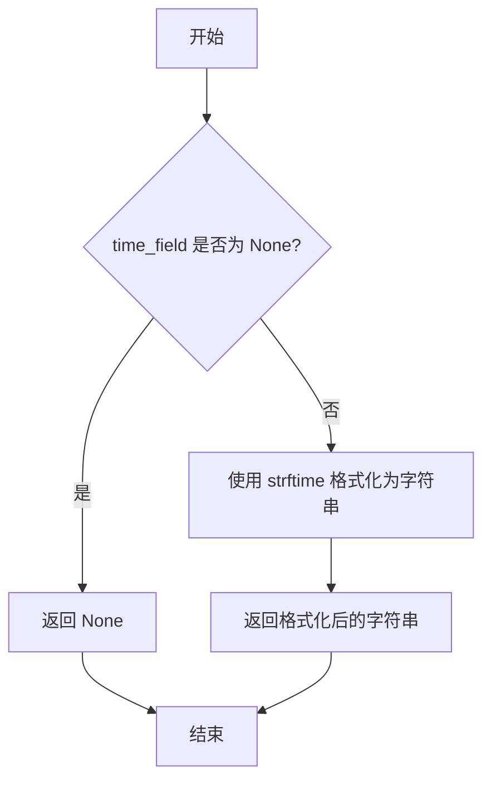
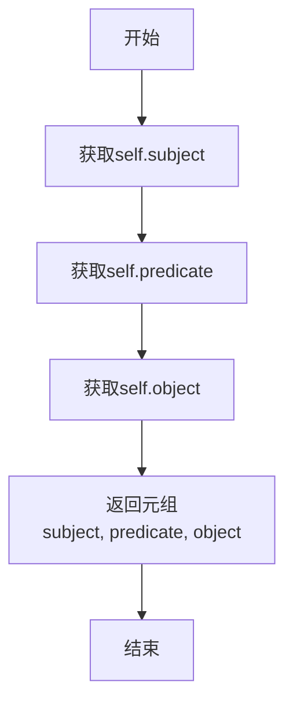
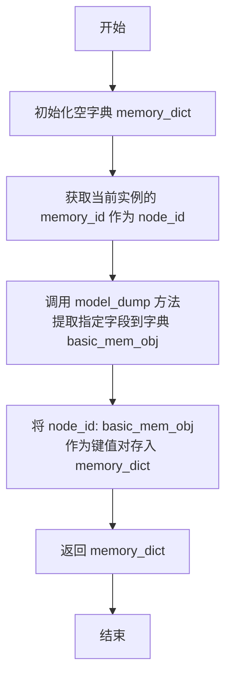
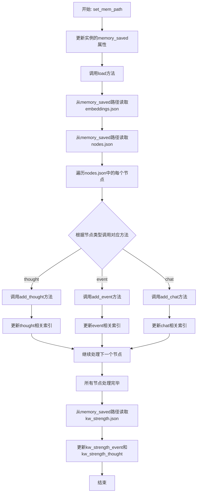
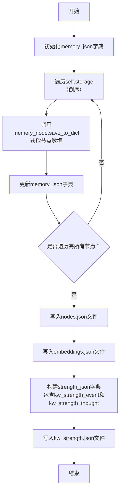
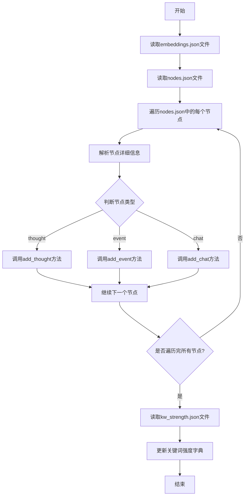
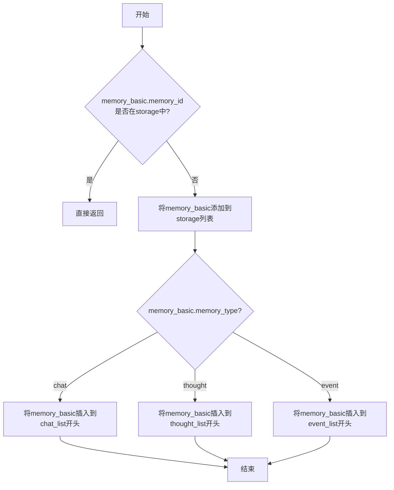
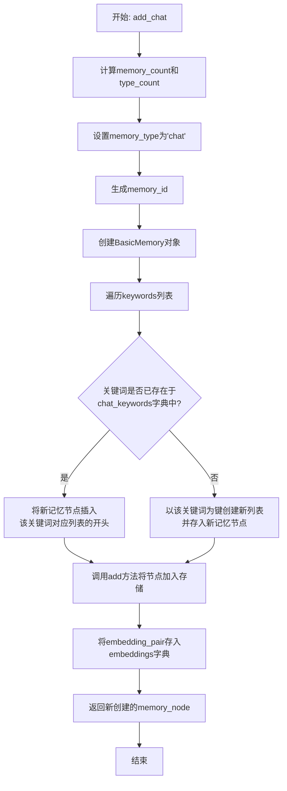
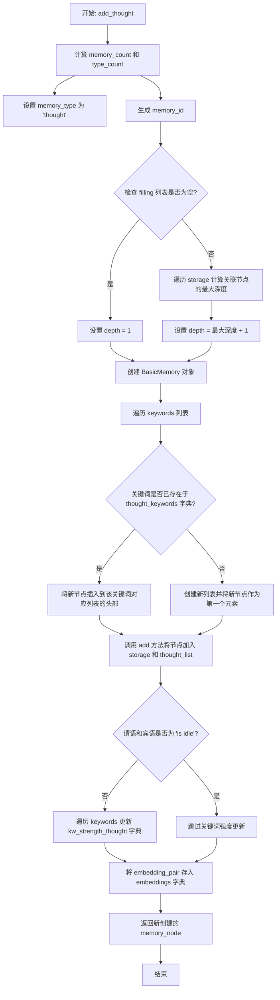
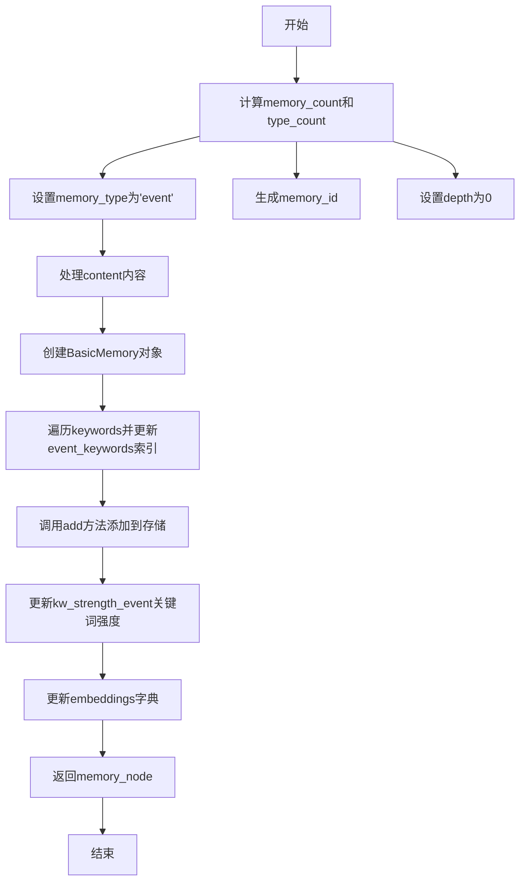

# `.\MetaGPT\metagpt\ext\stanford_town\memory\agent_memory.py` 详细设计文档

该代码实现了一个基于图灵奖得主 Geoffrey Hinton 等人提出的生成式智能体（Generative Agents）记忆模型的 Python 类库。它定义了 `BasicMemory` 作为记忆的基本单元（继承自消息类），以及 `AgentMemory` 作为智能体的记忆存储和管理系统，支持事件（event）、思考（thought）和对话（chat）三种记忆类型，并提供了记忆的增删改查、持久化存储（JSON格式）、关键词索引和关联检索等功能。

## 整体流程

```mermaid
graph TD
    A[开始] --> B{操作类型?}
    B -- 保存记忆 --> C[调用 AgentMemory.save]
    C --> D[遍历 storage 列表]
    D --> E[调用每个 BasicMemory.save_to_dict]
    E --> F[写入 nodes.json, embeddings.json, kw_strength.json]
    B -- 加载记忆 --> G[调用 AgentMemory.load]
    G --> H[读取 nodes.json, embeddings.json, kw_strength.json]
    H --> I[解析 JSON 数据]
    I --> J[根据 memory_type 调用 add_event/add_thought/add_chat]
    J --> K[填充 AgentMemory 的 storage 和各类索引]
    B -- 添加记忆 --> L[调用 AgentMemory.add_event/add_thought/add_chat]
    L --> M[创建 BasicMemory 实例]
    M --> N[更新 storage 和对应类型的记忆列表 (event_list/thought_list/chat_list)]
    N --> O[更新关键词索引 (event_keywords/thought_keywords/chat_keywords)]
    O --> P[更新关键词强度 (kw_strength_event/kw_strength_thought)]
    P --> Q[存储嵌入向量 (embeddings)]
    B -- 检索记忆 --> R[调用 retrieve_relevant_thoughts/retrieve_relevant_events/get_last_chat]
    R --> S[通过关键词索引查找相关记忆]
    S --> T[返回记忆集合或单个记忆]
```

## 类结构

```
Message (来自 metagpt.schema)
└── BasicMemory (基础记忆单元)
Memory (来自 metagpt.memory.memory)
└── AgentMemory (智能体记忆管理器)
```

## 全局变量及字段


### `BasicMemory.memory_id`
    
记忆的唯一标识符，用于区分不同的记忆节点。

类型：`Optional[str]`
    


### `BasicMemory.memory_count`
    
记忆在整体存储中的序号，表示这是第几个被创建的记忆。

类型：`int`
    


### `BasicMemory.type_count`
    
记忆在其所属类型（event/thought/chat）中的序号。

类型：`int`
    


### `BasicMemory.memory_type`
    
记忆的类型，用于区分事件（event）、想法（thought）和对话（chat）三种记忆。

类型：`Optional[str]`
    


### `BasicMemory.depth`
    
记忆的深度，通常用于表示记忆之间的关联层次或重要性。

类型：`int`
    


### `BasicMemory.created`
    
记忆的创建时间，记录记忆节点被初始化的时刻。

类型：`Optional[datetime]`
    


### `BasicMemory.expiration`
    
记忆的失效时间，用于标记记忆何时过期或不再有效。

类型：`Optional[datetime]`
    


### `BasicMemory.last_accessed`
    
记忆上一次被访问的时间，用于跟踪记忆的使用频率。

类型：`Optional[datetime]`
    


### `BasicMemory.subject`
    
记忆的主语，通常表示记忆的主体或发起者。

类型：`Optional[str]`
    


### `BasicMemory.predicate`
    
记忆的谓语，描述主语的动作或状态。

类型：`Optional[str]`
    


### `BasicMemory.object`
    
记忆的宾语，表示动作的承受者或相关对象。

类型：`Optional[str]`
    


### `BasicMemory.description`
    
记忆的详细描述或内容，通常与content属性保持一致。

类型：`Optional[str]`
    


### `BasicMemory.embedding_key`
    
记忆的嵌入向量键，用于关联记忆内容与其对应的向量表示。

类型：`Optional[str]`
    


### `BasicMemory.poignancy`
    
记忆的重要性或显著性评分，用于衡量记忆的关键程度。

类型：`int`
    


### `BasicMemory.keywords`
    
记忆的关键词列表，用于快速检索和分类记忆。

类型：`list[str]`
    


### `BasicMemory.filling`
    
记忆的关联列表，存储与该记忆相关的其他记忆的ID。

类型：`list`
    


### `AgentMemory.storage`
    
存储所有记忆节点的列表，是记忆系统的核心数据容器。

类型：`list[BasicMemory]`
    


### `AgentMemory.event_list`
    
专门存储事件类型记忆的列表，便于按类型快速访问。

类型：`list[BasicMemory]`
    


### `AgentMemory.thought_list`
    
专门存储想法类型记忆的列表，便于按类型快速访问。

类型：`list[BasicMemory]`
    


### `AgentMemory.chat_list`
    
专门存储对话类型记忆的列表，便于按类型快速访问。

类型：`list[BasicMemory]`
    


### `AgentMemory.event_keywords`
    
事件记忆的关键词索引，用于通过关键词快速检索相关事件记忆。

类型：`dict[str, list[BasicMemory]]`
    


### `AgentMemory.thought_keywords`
    
想法记忆的关键词索引，用于通过关键词快速检索相关想法记忆。

类型：`dict[str, list[BasicMemory]]`
    


### `AgentMemory.chat_keywords`
    
对话记忆的关键词索引，用于通过关键词快速检索相关对话记忆。

类型：`dict[str, list[BasicMemory]]`
    


### `AgentMemory.kw_strength_event`
    
事件关键词的强度统计，记录每个关键词在事件记忆中的出现频率。

类型：`dict[str, int]`
    


### `AgentMemory.kw_strength_thought`
    
想法关键词的强度统计，记录每个关键词在想法记忆中的出现频率。

类型：`dict[str, int]`
    


### `AgentMemory.memory_saved`
    
记忆数据的存储路径，用于指定记忆文件的保存和加载位置。

类型：`Optional[Path]`
    


### `AgentMemory.embeddings`
    
记忆嵌入向量的存储字典，键为embedding_key，值为对应的向量表示。

类型：`dict[str, list[float]]`
    
    

## 全局函数及方法

### `BasicMemory.check_values`

`BasicMemory.check_values` 是一个类方法，用作 Pydantic 模型的验证器。它在模型实例化之前被调用，用于检查和预处理传入的字段值。主要功能包括：如果提供了 `created` 字段，则自动将 `last_accessed` 字段设置为相同的值；如果提供了 `content` 字段，则将其值复制给 `description` 字段；确保 `filling` 字段如果存在，则是一个列表（如果为 `None` 则初始化为空列表）。这个方法确保了 `BasicMemory` 实例在创建时具有一致和有效的内部状态。

参数：

- `cls`：`type[BasicMemory]`，指向 `BasicMemory` 类本身的引用。
- `values`：`dict`，包含传入的、用于初始化模型实例的原始字段名和值的字典。

返回值：`dict`，返回经过检查和预处理后的字段值字典，供后续的模型实例化过程使用。

#### 流程图

```mermaid
flowchart TD
    A[开始: check_values(values)] --> B{values 字典中<br>是否包含 'created' 键?}
    B -- 是 --> C[将 values['last_accessed']<br>设置为 values['created'] 的值]
    B -- 否 --> D
    C --> D{values 字典中<br>是否包含 'content' 键?}
    D -- 是 --> E[将 values['description']<br>设置为 values['content'] 的值]
    D -- 否 --> F
    E --> F{values 字典中<br>是否包含 'filling' 键?}
    F -- 是 --> G{values['filling'] 是否为 None?}
    G -- 是 --> H[将 values['filling'] 设置为空列表 []]
    G -- 否 --> I
    F -- 否 --> I
    H --> I[返回处理后的 values 字典]
    I --> J[结束]
```

#### 带注释源码

```python
    @model_validator(mode="before")  # 指定此验证器在模型实例化“之前”运行
    @classmethod                     # 声明为类方法，第一个参数是类本身 (cls)
    def check_values(cls, values):
        # 检查传入的 values 字典中是否有 'created' 键
        if "created" in values:
            # 如果有，则将 'last_accessed' 字段的值设置为与 'created' 相同
            # 这确保了记忆的创建时间和最后访问时间在初始化时一致
            values["last_accessed"] = values["created"]
        # 检查传入的 values 字典中是否有 'content' 键
        if "content" in values:
            # 如果有，则将 'description' 字段的值设置为与 'content' 相同
            # 这实现了 content 到 description 的映射，保持向后兼容性或统一字段
            values["description"] = values["content"]
        # 检查传入的 values 字典中是否有 'filling' 键
        if "filling" in values:
            # 如果有，确保其值是一个列表。如果 values['filling'] 是 None，则将其转换为空列表 []
            # 这保证了 `filling` 字段始终是一个可迭代的列表，避免后续操作中出现 None 错误
            values["filling"] = values["filling"] or []
        # 返回处理后的 values 字典，Pydantic 将使用它来继续创建模型实例
        return values
```

### `BasicMemory.transform_time_field`

`transform_time_field` 是 `BasicMemory` 类的一个字段序列化器方法，用于将 `datetime` 类型的字段（如 `created` 和 `expiration`）转换为字符串格式，以便于 JSON 序列化。它确保时间字段在序列化为 JSON 时具有一致的字符串表示形式。

参数：

- `time_field`：`Optional[datetime]`，需要转换的 `datetime` 对象，可能为 `None`。

返回值：`str`，转换后的时间字符串，格式为 `"%Y-%m-%d %H:%M:%S"`。如果输入为 `None`，则返回 `None`。

#### 流程图



#### 带注释源码

```python
@field_serializer("created", "expiration")  # 指定此方法序列化 `created` 和 `expiration` 字段
def transform_time_field(self, time_field: Optional[datetime]) -> str:
    """
    将 `datetime` 对象转换为字符串格式，用于 JSON 序列化。
    
    参数:
        time_field (Optional[datetime]): 需要转换的 `datetime` 对象，可能为 `None`。
    
    返回:
        str: 格式为 `"%Y-%m-%d %H:%M:%S"` 的字符串，如果输入为 `None` 则返回 `None`。
    """
    if time_field:  # 检查 `time_field` 是否为 `None`
        time_field = time_field.strftime("%Y-%m-%d %H:%M:%S")  # 将 `datetime` 格式化为指定格式的字符串
    return time_field  # 返回格式化后的字符串或 `None`
```

### `BasicMemory.summary`

该方法返回一个包含主语（subject）、谓语（predicate）和宾语（object）的元组，用于快速获取记忆的核心三元组信息。

参数：无

返回值：`tuple[str | None, str | None, str | None]`，返回一个包含主语、谓语和宾语的元组，每个元素可能为字符串或None。

#### 流程图



#### 带注释源码

```python
def summary(self):
    # 返回一个包含主语、谓语和宾语的元组
    # 这是记忆的核心结构化信息
    return self.subject, self.predicate, self.object
```

### `BasicMemory.save_to_dict`

将 `BasicMemory` 实例序列化为一个字典，用于后续存储为 JSON 文件。该字典以当前实例的 `memory_id` 为键，以包含指定字段的实例属性字典为值。

参数：
- `self`：`BasicMemory`，当前 `BasicMemory` 类的实例。

返回值：`dict`，一个包含单个键值对的字典，键为当前记忆节点的 `memory_id`，值为该节点核心属性的字典表示。

#### 流程图



#### 带注释源码

```python
def save_to_dict(self) -> dict:
    """
    将MemoryBasic类转化为字典，用于存储json文件
    这里需要注意，cause_by跟GA不兼容，所以需要做一个格式转换
    """
    memory_dict = dict()  # 初始化一个空字典，用于存放最终结果
    node_id = self.memory_id  # 获取当前记忆节点的唯一标识符
    # 使用 Pydantic 的 model_dump 方法，将当前实例的指定字段序列化为字典。
    # `include` 参数指定了需要包含的字段列表，这些字段将被提取到 basic_mem_obj 中。
    basic_mem_obj = self.model_dump(
        include=[
            "node_count",      # 节点计数（注：源码中字段名为 memory_count，此处可能是笔误）
            "type_count",      # 类型计数
            "type",            # 记忆类型（注：源码中字段名为 memory_type，此处可能是笔误）
            "depth",           # 记忆深度
            "created",         # 创建时间
            "expiration",      # 过期时间
            "subject",         # 主语
            "predicate",       # 谓语
            "object",          # 宾语
            "description",     # 描述（与 content 内容一致）
            "embedding_key",   # 用于向量检索的键
            "poignancy",       # 重要性值
            "keywords",        # 关键词列表
            "filling",         # 关联的记忆ID列表
            "cause_by",        # 触发原因（来自父类 Message）
        ]
    )
    # 将 node_id 作为键，basic_mem_obj 作为值，存入 memory_dict 字典。
    memory_dict[node_id] = basic_mem_obj
    return memory_dict  # 返回构建好的字典
```

### `AgentMemory.set_mem_path`

该方法用于设置AgentMemory实例的持久化存储路径，并立即从该路径加载已保存的记忆数据。它通过更新实例的`memory_saved`属性来记录存储位置，并调用`load`方法将指定路径下的JSON文件（`nodes.json`、`embeddings.json`、`kw_strength.json`）解析并填充到当前内存结构中。

参数：

- `memory_saved`：`Path`，表示记忆数据存储的目录路径。该路径应包含`nodes.json`、`embeddings.json`和`kw_strength.json`文件。

返回值：`None`，该方法不返回任何值，其作用在于修改实例的内部状态。

#### 流程图



#### 带注释源码

```python
def set_mem_path(self, memory_saved: Path):
    # 设置记忆存储路径
    self.memory_saved = memory_saved
    # 调用load方法，从指定路径加载记忆数据
    self.load(memory_saved)
```

### `AgentMemory.save`

将AgentMemory实例中的记忆数据（包括存储的节点、嵌入向量和关键词强度）保存到指定路径下的JSON文件中。该方法会按照倒序存储节点，以确保最新的记忆在文件顶部。

参数：

- `memory_saved`：`Path`，保存记忆数据的目录路径

返回值：`None`，无返回值

#### 流程图



#### 带注释源码

```python
def save(self, memory_saved: Path):
    """
    将MemoryBasic类存储为Nodes.json形式。复现GA中的Kw Strength.json形式
    这里添加一个路径即可
    TODO 这里在存储时候进行倒序存储，之后需要验证（test_memory通过）
    """
    memory_json = dict()  # 初始化用于存储所有节点数据的字典
    for i in range(len(self.storage)):
        # 倒序遍历self.storage，确保最新的记忆（列表末尾）先被处理
        memory_node = self.storage[len(self.storage) - i - 1]
        # 调用BasicMemory的save_to_dict方法，将节点转换为字典格式
        memory_node = memory_node.save_to_dict()
        # 将节点字典合并到memory_json中
        memory_json.update(memory_node)
    # 将节点数据写入nodes.json文件
    write_json_file(memory_saved.joinpath("nodes.json"), memory_json)
    # 将嵌入向量数据写入embeddings.json文件
    write_json_file(memory_saved.joinpath("embeddings.json"), self.embeddings)

    # 构建关键词强度字典
    strength_json = dict()
    strength_json["kw_strength_event"] = self.kw_strength_event
    strength_json["kw_strength_thought"] = self.kw_strength_thought
    # 将关键词强度数据写入kw_strength.json文件
    write_json_file(memory_saved.joinpath("kw_strength.json"), strength_json)
```

### `AgentMemory.load`

该方法用于从指定路径加载并解析存储的记忆数据文件（包括节点信息、嵌入向量和关键词强度），并将其填充到AgentMemory类的相应数据结构中。

参数：

- `memory_saved`：`Path`，存储记忆数据文件的目录路径

返回值：`None`，无返回值

#### 流程图



#### 带注释源码

```python
def load(self, memory_saved: Path):
    """
    将GA的JSON解析，填充到AgentMemory类之中
    """
    # 1. 加载嵌入向量数据
    self.embeddings = read_json_file(memory_saved.joinpath("embeddings.json"))
    
    # 2. 加载节点数据
    memory_load = read_json_file(memory_saved.joinpath("nodes.json"))
    
    # 3. 遍历所有节点并解析
    for count in range(len(memory_load.keys())):
        node_id = f"node_{str(count + 1)}"
        node_details = memory_load[node_id]
        
        # 解析节点基本信息
        node_type = node_details["type"]
        created = datetime.strptime(node_details["created"], "%Y-%m-%d %H:%M:%S")
        
        # 处理过期时间（可能为None）
        expiration = None
        if node_details["expiration"]:
            expiration = datetime.strptime(node_details["expiration"], "%Y-%m-%d %H:%M:%S")
        
        # 解析三元组信息
        s = node_details["subject"]
        p = node_details["predicate"]
        o = node_details["object"]
        
        # 解析记忆内容和其他属性
        description = node_details["description"]
        embedding_pair = (node_details["embedding_key"], self.embeddings[node_details["embedding_key"]])
        poignancy = node_details["poignancy"]
        keywords = set(node_details["keywords"])
        filling = node_details["filling"]
        
        # 4. 根据节点类型调用相应的添加方法
        if node_type == "thought":
            self.add_thought(
                created, expiration, s, p, o, description, keywords, poignancy, embedding_pair, filling
            )
        if node_type == "event":
            self.add_event(created, expiration, s, p, o, description, keywords, poignancy, embedding_pair, filling)
        if node_type == "chat":
            self.add_chat(created, expiration, s, p, o, description, keywords, poignancy, embedding_pair, filling)
    
    # 5. 加载关键词强度数据
    strength_keywords_load = read_json_file(memory_saved.joinpath("kw_strength.json"))
    if strength_keywords_load["kw_strength_event"]:
        self.kw_strength_event = strength_keywords_load["kw_strength_event"]
    if strength_keywords_load["kw_strength_thought"]:
        self.kw_strength_thought = strength_keywords_load["kw_strength_thought"]
```

### `AgentMemory.add`

该方法用于向AgentMemory的存储中添加一个新的BasicMemory对象，并根据其记忆类型（chat、thought、event）将其分类存储到对应的列表中。如果该记忆已存在于存储中，则直接返回，避免重复添加。

参数：

- `memory_basic`：`BasicMemory`，要添加的BasicMemory对象，包含记忆的详细信息。

返回值：`None`，无返回值。

#### 流程图



#### 带注释源码

```python
def add(self, memory_basic: BasicMemory):
    """
    Add a new message to storage, while updating the index
    重写add方法，修改原有的Message类为BasicMemory类，并添加不同的记忆类型添加方式
    """
    # 检查该记忆是否已存在于存储中，避免重复添加
    if memory_basic.memory_id in self.storage:
        return
    # 将新的BasicMemory对象添加到存储列表
    self.storage.append(memory_basic)
    # 根据记忆类型，将其插入到对应的类型列表的开头
    if memory_basic.memory_type == "chat":
        self.chat_list[0:0] = [memory_basic]
        return
    if memory_basic.memory_type == "thought":
        self.thought_list[0:0] = [memory_basic]
        return
    if memory_basic.memory_type == "event":
        self.event_list[0:0] = [memory_basic]
        return
```

### `AgentMemory.add_chat`

该方法用于向智能体的记忆系统中添加一条“聊天”类型的记忆节点。它会根据提供的参数创建一个`BasicMemory`对象，将其添加到聊天记忆列表和关键词索引中，并存储相关的嵌入向量。

参数：

- `created`：`datetime`，记忆的创建时间。
- `expiration`：`datetime`，记忆的过期时间。
- `s`：`str`，记忆的主语（Subject）。
- `p`：`str`，记忆的谓语（Predicate）。
- `o`：`str`，记忆的宾语（Object）。
- `content`：`str`，记忆的详细描述内容。
- `keywords`：`list[str]`，与记忆相关的关键词列表。
- `poignancy`：`int`，记忆的重要性或显著性值。
- `embedding_pair`：`tuple[str, list[float]]`，一个元组，包含嵌入向量的键和对应的嵌入向量值。
- `filling`：`list`，一个包含与此记忆相关联的其他记忆ID的列表。
- `cause_by`：`str`，默认值为空字符串，表示导致此记忆产生的原因。

返回值：`BasicMemory`，返回新创建并添加到记忆系统中的聊天记忆节点对象。

#### 流程图



#### 带注释源码

```python
def add_chat(
    self, created, expiration, s, p, o, content, keywords, poignancy, embedding_pair, filling, cause_by=""
):
    """
    调用add方法，初始化chat，在创建的时候就需要调用embedding函数
    """
    # 计算新记忆的全局序号和聊天类型内的序号
    memory_count = len(self.storage) + 1
    type_count = len(self.thought_list) + 1
    memory_type = "chat"
    memory_id = f"node_{str(memory_count)}"
    depth = 1

    # 使用传入的参数创建一个新的BasicMemory对象（聊天记忆节点）
    memory_node = BasicMemory(
        memory_id=memory_id,
        memory_count=memory_count,
        type_count=type_count,
        memory_type=memory_type,
        depth=depth,
        created=created,
        expiration=expiration,
        subject=s,
        predicate=p,
        object=o,
        description=content,
        embedding_key=embedding_pair[0], # 使用嵌入对的第一个元素作为键
        poignancy=poignancy,
        keywords=keywords,
        filling=filling,
        cause_by=cause_by,
    )

    # 将关键词统一转换为小写，并更新聊天关键词索引
    keywords = [i.lower() for i in keywords]
    for kw in keywords:
        if kw in self.chat_keywords:
            # 如果关键词已存在，将新节点插入列表开头（保持最近相关性）
            self.chat_keywords[kw][0:0] = [memory_node]
        else:
            # 如果关键词不存在，创建新列表
            self.chat_keywords[kw] = [memory_node]

    # 调用父类的add方法，将节点添加到主存储和相应的类型列表中
    self.add(memory_node)

    # 将嵌入向量存储到embeddings字典中
    self.embeddings[embedding_pair[0]] = embedding_pair[1]
    # 返回新创建的记忆节点
    return memory_node
```

### `AgentMemory.add_thought`

该方法用于向智能体的记忆系统中添加一条“思考”类型的记忆节点。它会根据提供的参数创建一个`BasicMemory`对象，计算其深度，更新关键词索引和关键词强度，并将该节点添加到相应的存储列表中。

参数：

- `created`：`datetime`，记忆的创建时间
- `expiration`：`datetime`，记忆的过期时间
- `s`：`str`，记忆的主语
- `p`：`str`，记忆的谓语
- `o`：`str`，记忆的宾语
- `content`：`str`，记忆的详细描述内容
- `keywords`：`list[str]`，与记忆相关的关键词列表
- `poignancy`：`int`，记忆的重要性/显著性值
- `embedding_pair`：`tuple[str, list[float]]`，一个元组，包含嵌入向量的键和对应的向量值
- `filling`：`list`，一个包含与此记忆相关联的其他记忆节点ID的列表

返回值：`BasicMemory`，返回新创建并添加到记忆系统中的`BasicMemory`对象。

#### 流程图



#### 带注释源码

```python
def add_thought(self, created, expiration, s, p, o, content, keywords, poignancy, embedding_pair, filling):
    """
    调用add方法，初始化thought
    """
    # 计算新记忆的全局序号和“思考”类型内的序号
    memory_count = len(self.storage) + 1
    type_count = len(self.thought_list) + 1
    memory_type = "thought"
    memory_id = f"node_{str(memory_count)}"
    depth = 1  # 默认深度为1

    try:
        # 如果提供了关联记忆ID列表（filling），则计算新记忆的深度
        # 深度 = 所有关联记忆中的最大深度 + 1
        if filling:
            depth_list = [memory_node.depth for memory_node in self.storage if memory_node.memory_id in filling]
            depth += max(depth_list)
    except Exception as exp:
        # 如果计算深度时发生异常，记录警告并保持默认深度
        logger.warning(f"filling init occur {exp}")
        pass

    # 使用提供的参数创建新的 BasicMemory 对象（思考节点）
    memory_node = BasicMemory(
        memory_id=memory_id,
        memory_count=memory_count,
        type_count=type_count,
        memory_type=memory_type,
        depth=depth,
        created=created,
        expiration=expiration,
        subject=s,
        predicate=p,
        object=o,
        description=content,
        embedding_key=embedding_pair[0],  # 嵌入向量的键
        poignancy=poignancy,
        keywords=keywords,
        filling=filling,
    )

    # 将关键词转换为小写，并更新关键词索引字典 (thought_keywords)
    keywords = [i.lower() for i in keywords]
    for kw in keywords:
        if kw in self.thought_keywords:
            # 如果关键词已存在，将新节点插入列表头部（最近优先）
            self.thought_keywords[kw][0:0] = [memory_node]
        else:
            # 如果关键词不存在，创建新列表
            self.thought_keywords[kw] = [memory_node]

    # 调用内部的 add 方法，将节点添加到总存储(storage)和思考列表(thought_list)
    self.add(memory_node)

    # 如果记忆内容不是“空闲”状态，则更新关键词强度
    # 关键词强度用于衡量某个关键词在“思考”类记忆中的出现频率
    if f"{p} {o}" != "is idle":
        for kw in keywords:
            if kw in self.kw_strength_thought:
                self.kw_strength_thought[kw] += 1
            else:
                self.kw_strength_thought[kw] = 1

    # 将嵌入向量存储到 embeddings 字典中
    self.embeddings[embedding_pair[0]] = embedding_pair[1]
    # 返回新创建的记忆节点
    return memory_node
```

### `AgentMemory.add_event`

该方法用于向AgentMemory中添加一个事件（event）类型的记忆节点。它会创建一个新的BasicMemory对象，设置其属性（如记忆ID、类型、深度、关键词等），并将其添加到相应的存储列表和索引中。同时，它会更新关键词强度字典和嵌入字典。

参数：

- `created`：`datetime`，事件的创建时间
- `expiration`：`datetime`，事件的过期时间
- `s`：`str`，事件的主语
- `p`：`str`，事件的谓语
- `o`：`str`，事件的宾语
- `content`：`str`，事件的描述内容
- `keywords`：`list[str]`，事件的关键词列表
- `poignancy`：`int`，事件的重要性值
- `embedding_pair`：`tuple[str, list[float]]`，包含嵌入键和嵌入向量的元组
- `filling`：`list`，与该事件相关联的其他记忆节点的ID列表

返回值：`BasicMemory`，返回新创建的事件记忆节点对象

#### 流程图



#### 带注释源码

```python
def add_event(self, created, expiration, s, p, o, content, keywords, poignancy, embedding_pair, filling):
    """
    调用add方法，初始化event
    """
    # 计算新的记忆节点计数和事件类型计数
    memory_count = len(self.storage) + 1
    type_count = len(self.event_list) + 1
    memory_type = "event"
    memory_id = f"node_{str(memory_count)}"
    depth = 0  # 事件记忆的深度初始为0

    # 如果content中包含括号，则进行简化处理
    if "(" in content:
        content = " ".join(content.split()[:3]) + " " + content.split("(")[-1][:-1]

    # 创建新的BasicMemory对象，表示事件记忆节点
    memory_node = BasicMemory(
        memory_id=memory_id,
        memory_count=memory_count,
        type_count=type_count,
        memory_type=memory_type,
        depth=depth,
        created=created,
        expiration=expiration,
        subject=s,
        predicate=p,
        object=o,
        description=content,
        embedding_key=embedding_pair[0],
        poignancy=poignancy,
        keywords=keywords,
        filling=filling,
    )

    # 将关键词转换为小写，并更新event_keywords索引
    keywords = [i.lower() for i in keywords]
    for kw in keywords:
        if kw in self.event_keywords:
            self.event_keywords[kw][0:0] = [memory_node]  # 在列表开头插入
        else:
            self.event_keywords[kw] = [memory_node]

    # 调用add方法将记忆节点添加到存储中
    self.add(memory_node)

    # 如果谓语和宾语不是"is idle"，则更新关键词强度
    if f"{p} {o}" != "is idle":
        for kw in keywords:
            if kw in self.kw_strength_event:
                self.kw_strength_event[kw] += 1
            else:
                self.kw_strength_event[kw] = 1

    # 将嵌入键和嵌入向量添加到embeddings字典中
    self.embeddings[embedding_pair[0]] = embedding_pair[1]
    return memory_node  # 返回新创建的记忆节点
```

### `AgentMemory.get_summarized_latest_events`

该方法用于获取最近发生的事件（event）的摘要信息。它从事件记忆列表（`event_list`）中取出指定数量（`retention`）的最新事件，对每个事件调用其 `summary()` 方法获取其三元组摘要（主语、谓语、宾语），并将这些摘要收集到一个集合中返回。这有助于快速获取近期关键事件的概要，避免处理完整的事件对象。

参数：

- `retention`：`int`，指定要获取的最新事件的数量。

返回值：`set`，返回一个包含最新事件摘要（三元组）的集合。

#### 流程图

```mermaid
graph TD
    A[开始] --> B[初始化空集合 ret_set]
    B --> C[遍历 event_list 前 retention 个元素]
    C --> D{是否遍历完成?}
    D -- 否 --> E[获取当前事件节点 e_node]
    E --> F[调用 e_node.summary() 获取摘要]
    F --> G[将摘要添加到 ret_set 集合中]
    G --> C
    D -- 是 --> H[返回 ret_set 集合]
    H --> I[结束]
```

#### 带注释源码

```python
def get_summarized_latest_events(self, retention):
    ret_set = set()  # 初始化一个空集合，用于存储事件摘要
    for e_node in self.event_list[:retention]:  # 遍历事件列表中的前`retention`个元素
        ret_set.add(e_node.summary())  # 对每个事件节点调用`summary()`方法获取其三元组摘要，并添加到集合中
    return ret_set  # 返回包含摘要的集合
```

### `AgentMemory.get_last_chat`

该方法用于根据目标角色名称（`target_role_name`）从聊天记忆的关键词索引（`chat_keywords`）中检索并返回与该角色相关的最近一次聊天记忆。如果找到，则返回对应的 `BasicMemory` 对象；否则返回 `False`。

参数：

- `target_role_name`：`str`，目标角色的名称，用于在聊天关键词索引中查找相关聊天记忆。

返回值：`Union[BasicMemory, bool]`，如果找到匹配的聊天记忆，则返回对应的 `BasicMemory` 对象；否则返回 `False`。

#### 流程图

```mermaid
graph TD
    A[开始] --> B{target_role_name.lower() 是否在 chat_keywords 中?};
    B -- 是 --> C[返回 chat_keywords[target_role_name.lower()][0]];
    B -- 否 --> D[返回 False];
    C --> E[结束];
    D --> E;
```

#### 带注释源码

```python
def get_last_chat(self, target_role_name: str):
    # 将目标角色名称转换为小写，以确保大小写不敏感匹配
    if target_role_name.lower() in self.chat_keywords:
        # 如果目标角色名称存在于聊天关键词索引中，返回该关键词对应的第一个聊天记忆（最近一次）
        return self.chat_keywords[target_role_name.lower()][0]
    else:
        # 如果未找到匹配的聊天记忆，返回 False
        return False
```

### `AgentMemory.retrieve_relevant_thoughts`

该方法用于根据给定的主语（s_content）、谓语（p_content）和宾语（o_content）内容，从智能体的“thought”（想法）类型记忆中检索所有相关的记忆节点。它通过查询一个按关键词索引的字典（`thought_keywords`）来实现，返回一个包含相关`BasicMemory`对象的集合。

参数：

- `s_content`：`str`，主语内容，用于作为关键词进行检索。
- `p_content`：`str`，谓语内容，用于作为关键词进行检索。
- `o_content`：`str`，宾语内容，用于作为关键词进行检索。

返回值：`set`，一个包含所有与输入关键词匹配的`BasicMemory`（想法类型）对象的集合。如果没有任何匹配项，则返回空集合。

#### 流程图

```mermaid
graph TD
    A[开始] --> B[将 s_content, p_content, o_content 放入列表 contents]
    B --> C[初始化空列表 ret]
    C --> D{遍历 contents 中的每个元素 i}
    D --> E{判断 i 是否在 thought_keywords 字典的键中?}
    E -- 是 --> F[将 thought_keywords[i.lower()] 对应的记忆节点列表追加到 ret]
    F --> D
    E -- 否 --> D
    D --> G[遍历结束]
    G --> H[将列表 ret 转换为集合 set]
    H --> I[返回结果集合]
```

#### 带注释源码

```python
def retrieve_relevant_thoughts(self, s_content: str, p_content: str, o_content: str) -> set:
    # 将输入的三个字符串参数组合成一个列表，便于遍历
    contents = [s_content, p_content, o_content]

    # 初始化一个空列表，用于收集所有匹配的记忆节点
    ret = []
    # 遍历 contents 列表中的每一个元素（即每一个关键词）
    for i in contents:
        # 检查当前关键词（转换为小写）是否存在于 thought_keywords 字典的键中
        # thought_keywords 是一个字典，键是关键词（小写字符串），值是对应的 BasicMemory 对象列表
        if i in self.thought_keywords:
            # 如果关键词存在，则将该关键词对应的记忆节点列表（self.thought_keywords[i.lower()]）
            # 中的所有元素追加到结果列表 ret 中
            ret += self.thought_keywords[i.lower()]

    # 将结果列表 ret 转换为集合（set），以自动去除可能因多个关键词匹配而重复的记忆节点
    ret = set(ret)
    # 返回最终的去重后的记忆节点集合
    return ret
```

### `AgentMemory.retrieve_relevant_events`

该方法用于根据给定的主语（s_content）、谓语（p_content）和宾语（o_content）内容，从事件（event）记忆中检索所有相关的记忆节点。它通过查询`event_keywords`字典，将与输入内容匹配的关键词所关联的事件记忆节点收集起来，并返回一个去重后的集合。

参数：

- `s_content`：`str`，主语内容，用于匹配事件记忆的关键词。
- `p_content`：`str`，谓语内容，用于匹配事件记忆的关键词。
- `o_content`：`str`，宾语内容，用于匹配事件记忆的关键词。

返回值：`set[BasicMemory]`，返回一个包含所有相关事件记忆节点（`BasicMemory`对象）的集合。如果没有找到匹配项，则返回空集合。

#### 流程图

```mermaid
flowchart TD
    A[开始] --> B[将s_content, p_content, o_content<br>组合成列表contents]
    B --> C[初始化空列表ret]
    C --> D{遍历contents中的每个元素i}
    D --> E{i是否在event_keywords中?}
    E -- 是 --> F[将event_keywords[i]中的<br>所有节点添加到ret]
    E -- 否 --> G[继续循环]
    F --> G
    G --> D
    D -- 遍历结束 --> H[将ret转换为集合<br>以去除重复项]
    H --> I[返回结果集合]
    I --> J[结束]
```

#### 带注释源码

```python
    def retrieve_relevant_events(self, s_content: str, p_content: str, o_content: str) -> set:
        # 将输入的主语、谓语、宾语内容组合成一个列表，便于遍历
        contents = [s_content, p_content, o_content]

        # 初始化一个空列表，用于存储检索到的相关事件记忆节点
        ret = []
        # 遍历contents列表中的每个元素（即s_content, p_content, o_content）
        for i in contents:
            # 检查当前元素i是否作为关键词存在于event_keywords字典中
            if i in self.event_keywords:
                # 如果存在，将该关键词对应的所有事件记忆节点列表（self.event_keywords[i]）
                # 通过列表拼接操作（+=）添加到ret列表中
                ret += self.event_keywords[i]

        # 将列表ret转换为集合（set），自动去除其中可能存在的重复记忆节点
        ret = set(ret)
        # 返回包含所有相关且唯一的事件记忆节点的集合
        return ret
```

## 关键组件

### BasicMemory

一个扩展自基础消息类的记忆单元，用于表示代理的单一记忆条目，包含记忆ID、类型、内容、关键词、重要性、关联关系等结构化信息，并支持序列化为字典格式。

### AgentMemory

代理的核心记忆系统，继承自基础Memory类，负责管理三种类型的记忆（事件、想法、聊天），提供记忆的增删改查、持久化存储与加载、关键词索引以及相关记忆检索等功能。

### 记忆类型分类与索引

系统将记忆分为事件(event)、想法(thought)、聊天(chat)三种类型，并为每种类型维护独立的列表存储和基于关键词的倒排索引字典，以实现高效的相关记忆检索。

### 记忆持久化与加载

提供`save`和`load`方法，将内存中的记忆数据（包括节点信息、嵌入向量、关键词强度）序列化为JSON文件（nodes.json, embeddings.json, kw_strength.json）存储到磁盘，并能从这些文件中加载数据重建记忆状态。

### 关键词强度追踪

为“事件”和“想法”类型的记忆维护`kw_strength_event`和`kw_strength_thought`字典，用于记录每个关键词在对应记忆类型中出现的频率，可能用于衡量关键词的重要性或热度。

## 问题及建议


### 已知问题

-   **字段命名与类型不一致**：`BasicMemory` 类中的 `memory_type` 字段在 `save_to_dict` 方法中被序列化为 `type`，但在 `load` 方法中又从 `node_details["type"]` 读取。这可能导致序列化/反序列化时数据丢失或混淆。
-   **硬编码的节点ID格式**：`load` 方法中通过 `f”node_{str(count + 1)}”` 构造节点ID，这依赖于 `nodes.json` 文件中的键严格按照 `node_1`, `node_2`... 的顺序排列。如果文件键顺序被打乱或格式不一致，加载将失败。
-   **异常处理过于宽泛**：`add_thought` 方法中的 `try-except` 块捕获了所有 `Exception`，仅记录警告后跳过。这可能会掩盖 `filling` 列表处理过程中的关键错误，导致内存节点深度计算错误。
-   **数据冗余与潜在不一致**：`BasicMemory` 同时拥有 `content`（继承自 `Message`）和 `description` 字段，并通过 `model_validator` 使 `description` 复制 `content` 的值。这增加了维护复杂性和存储开销，且存在两者不同步的风险。
-   **`add` 方法逻辑缺陷**：`add` 方法在添加 `memory_basic` 到 `storage` 列表前，仅检查 `memory_id` 是否已在 `storage` 中。然而，`storage` 列表存储的是 `BasicMemory` 对象，直接使用 `in` 操作符比较对象可能无法按预期工作（除非 `BasicMemory` 正确实现了 `__eq__` 方法）。目前依赖 `__hash__ = object.__hash__`，这可能导致重复添加。
-   **`embedding_pair` 参数设计模糊**：`add_chat`, `add_thought`, `add_event` 等方法接受一个 `embedding_pair` 参数（预期为元组 `(embedding_key, embedding_vector)`），但参数名和用法不够清晰，容易误用。
-   **`kw_strength` 更新逻辑不一致**：`add_thought` 和 `add_event` 中更新 `kw_strength_*` 字典的逻辑都排除了 `”is idle”` 的情况，但此业务规则的缘由未在代码中说明，缺乏上下文。

### 优化建议

-   **统一序列化字段名**：修改 `save_to_dict` 方法，将输出字典的键 `”type”` 改为 `”memory_type”`，以保持与 `BasicMemory` 类字段名一致，避免混淆。
-   **改进节点加载逻辑**：`load` 方法不应依赖硬编码的键顺序。建议直接遍历 `memory_load.items()` 来加载每个节点，或者使用更鲁棒的ID查找机制。
-   **细化异常处理**：将 `add_thought` 方法中的通用 `except Exception` 改为捕获更具体的异常（如 `KeyError`, `TypeError` 等），并考虑在错误发生时提供更明确的处理方式（例如，设置默认深度或抛出更有意义的异常）。
-   **消除数据冗余**：考虑移除 `BasicMemory` 中的 `description` 字段，完全使用继承自 `Message` 的 `content` 字段。如果因兼容性必须保留，应确保所有赋值和读取操作都通过明确的属性或方法进行，避免隐式复制。
-   **修正 `add` 方法去重逻辑**：实现 `BasicMemory.__eq__` 方法（例如，基于 `memory_id` 比较），或修改 `add` 方法中的检查逻辑，使用 `any(m.memory_id == memory_basic.memory_id for m in self.storage)` 来确保基于ID的正确去重。
-   **明确 `embedding_pair` 参数**：将 `embedding_pair` 参数拆分为两个明确的参数：`embedding_key: str` 和 `embedding_vector: List[float]`，提高代码可读性和使用安全性。
-   **增加注释与文档**：为 `kw_strength` 更新逻辑中排除 `”is idle”` 的规则添加注释，说明其业务含义。同时，为 `BasicMemory` 和 `AgentMemory` 的关键方法（如各类 `add_*` 方法）添加更详细的文档字符串，说明其用途、参数和返回值。
-   **性能优化**：`AgentMemory` 中的 `storage`, `*_list`, `*_keywords` 等容器存储了大量对象引用。考虑在数据量极大时，评估内存使用效率，或实现按需加载/分页机制。`save` 方法中的倒序存储（`len(self.storage) - i - 1`）若仅为通过测试，应评估其必要性或添加注释说明。
-   **增强类型提示**：为方法参数和返回值提供更精确的类型提示。例如，`embedding_pair` 可提示为 `Tuple[str, List[float]]`，`keywords` 参数可提示为 `Set[str]` 而非 `list[str]`（因内部常转为 `set` 或进行去重操作）。


## 其它


### 设计目标与约束

本模块的设计目标是实现一个基于图结构（Graph Architecture, GA）的智能体记忆系统，用于在MetaGPT框架中存储、检索和管理智能体的长期记忆。核心约束包括：
1.  **向后兼容性**：`BasicMemory` 类继承自框架的 `Message` 类，以复用其基础通信能力，但需通过字段映射（如 `content` 映射为 `description`）和类型扩展来适应记忆存储需求。
2.  **GA架构兼容性**：`AgentMemory` 类的数据模型（节点、关键词、嵌入向量）和持久化格式（`nodes.json`, `embeddings.json`, `kw_strength.json`）需与参考的GA（Generative Agents）论文或实现保持一致，确保能正确加载和保存GA格式的记忆数据。
3.  **内存与性能**：需在内存中维护多种索引（如按类型、关键词分类的列表和字典）以支持高效检索，同时需考虑大量记忆存储时的内存开销和检索速度。
4.  **功能完整性**：需支持记忆的增删改查（目前主要为增和查）、按类型（事件、思考、聊天）分类、基于关键词的关联检索、以及记忆的重要性（poignancy）和深度（depth）计算。

### 错误处理与异常设计

当前代码中的错误处理较为简单，主要体现在：
1.  **防御性编程**：在 `add_thought` 方法中计算 `depth` 时，使用 `try-except` 块捕获处理 `filling` 列表相关的异常，并记录警告日志后继续执行，防止因个别记忆节点关联问题导致整体添加失败。
2.  **数据验证**：`BasicMemory` 类使用 Pydantic 的 `model_validator` 对输入数据进行预处理和默认值设置（如设置 `last_accessed`, `description`, `filling`），确保了对象内部状态的一致性。
3.  **容错性**：`load` 方法在解析JSON数据时，对可能为空的 `expiration` 字段进行了条件判断，避免解析错误。
4.  **缺失的异常**：代码中缺乏对文件读写失败（如路径不存在、权限不足、JSON格式错误）、关键参数缺失或无效（如 `memory_type` 不是预定义类型）、以及索引更新失败等情况的显式异常处理或错误上报机制。

### 数据流与状态机

1.  **核心数据流**：
    *   **写入流**：外部调用 `add_chat`, `add_thought`, `add_event` -> 创建 `BasicMemory` 实例 -> 调用 `add` 方法 -> 更新 `storage` 列表及对应的类型列表（`event_list`, `thought_list`, `chat_list`） -> 更新关键词索引字典（`*_keywords`）和关键词强度字典（`kw_strength_*`） -> 存储嵌入向量到 `embeddings` 字典。
    *   **读取流**：调用 `retrieve_relevant_thoughts/events` 或 `get_last_chat` -> 查询关键词索引字典 -> 返回相关的 `BasicMemory` 对象集合或单个对象。
    *   **持久化流**：调用 `save` -> 遍历 `storage` -> 调用每个 `BasicMemory.save_to_dict` -> 合并为字典 -> 与 `embeddings`, `kw_strength_*` 一同写入JSON文件。
    *   **加载流**：调用 `load` -> 读取三个JSON文件 -> 解析数据 -> 根据 `type` 调用对应的 `add_*` 方法重建内存中的对象和索引。

2.  **状态机（记忆生命周期）**：
    *   **创建**：通过 `add_*` 方法创建，分配唯一 `memory_id`，设置创建时间、类型、初始深度等。
    *   **活跃**：存储在内存的各类列表和索引中，可通过检索方法访问。`last_accessed` 字段在创建时初始化，但代码中未见更新逻辑。
    *   **关联**：通过 `filling` 字段与其他记忆节点关联，影响 `thought` 类型节点的深度计算。
    *   **持久化**：通过 `save` 方法将内存状态序列化到磁盘。
    *   **失效**：设计上有 `expiration` 字段，但当前代码中未实现基于该字段的自动清理或过滤逻辑。

### 外部依赖与接口契约

1.  **外部依赖**：
    *   **框架依赖**：强依赖 `metagpt` 框架的 `Memory` 基类、`Message` 基类、`logger` 以及 `read_json_file` 和 `write_json_file` 工具函数。
    *   **第三方库**：依赖 `pydantic` 用于数据验证和序列化；依赖 `datetime` 和 `pathlib` 用于时间和路径处理。
    *   **数据格式**：依赖特定的JSON文件格式（GA格式）作为持久化存储的契约。

2.  **接口契约**：
    *   **向上契约（对框架）**：`AgentMemory` 继承并实现了 `Memory` 接口的 `add`, `save`, `load` 等方法，是框架记忆系统的具体实现。`BasicMemory` 作为 `Message` 的扩展，需确保在需要 `Message` 的上下文中能正常工作。
    *   **向下契约（对存储）**：`save` 和 `load` 方法定义了与文件系统交互的契约，即生成和解析特定结构的JSON文件。
    *   **横向契约（对其他模块）**：`add_chat`, `add_thought`, `add_event` 以及各类检索方法为其他模块（如感知、规划、对话模块）提供了操作和查询记忆的接口。这些方法的参数列表和返回值构成了使用契约。

### 并发与线程安全

当前代码实现未考虑并发访问。`AgentMemory` 实例中的 `storage`、各类列表和字典等共享状态在多个线程同时调用 `add`、`retrieve` 或 `save`/`load` 方法时，可能导致数据竞争、状态不一致或程序崩溃。例如，在遍历 `storage` 进行保存时，如果另一个线程正在添加新的记忆，可能会引发异常或保存不完整的数据。这是一个重要的潜在风险点，在需要多线程访问的场景下必须引入锁机制或其他并发控制策略。

### 配置与可扩展性

1.  **硬编码配置**：记忆类型（`"event"`, `"thought"`, `"chat"`）、ID格式（`"node_{count}"`）、时间格式（`"%Y-%m-%d %H:%M:%S"`）、以及深度计算逻辑等均在代码中硬编码，缺乏配置化支持。
2.  **扩展点**：
    *   **记忆类型**：目前支持三种类型。要新增类型，需修改 `BasicMemory.memory_type` 的潜在值，并在 `AgentMemory` 中增加对应的存储列表、关键词字典以及 `add_*` 和检索逻辑。
    *   **索引策略**：目前主要基于关键词建立倒排索引。可以扩展为基于嵌入向量的相似性检索或其他元数据（如时间范围、重要性分数）的索引。
    *   **存储后端**：当前持久化基于文件系统JSON。可以抽象出存储接口，支持数据库或其他存储介质。
    *   **清理策略**：可以基于 `expiration` 或 LRU（结合 `last_accessed`）实现自动记忆清理机制。
    *   **深度计算算法**：`thought` 深度的计算逻辑相对简单，可以扩展更复杂的图遍历算法来确定节点在记忆网络中的位置。

    