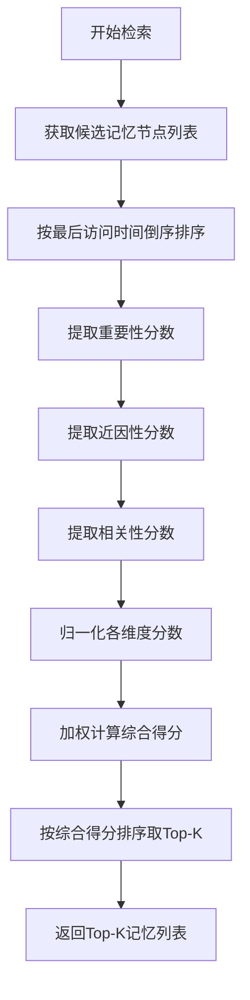
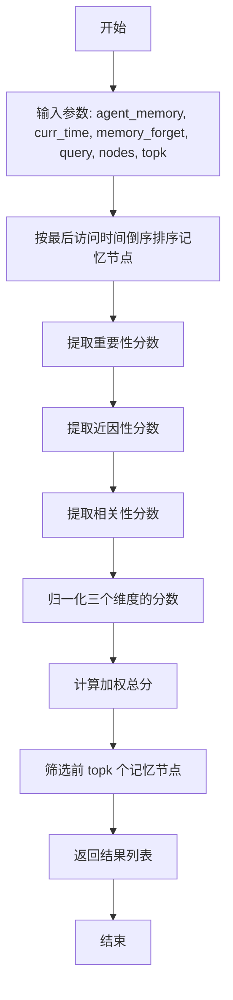
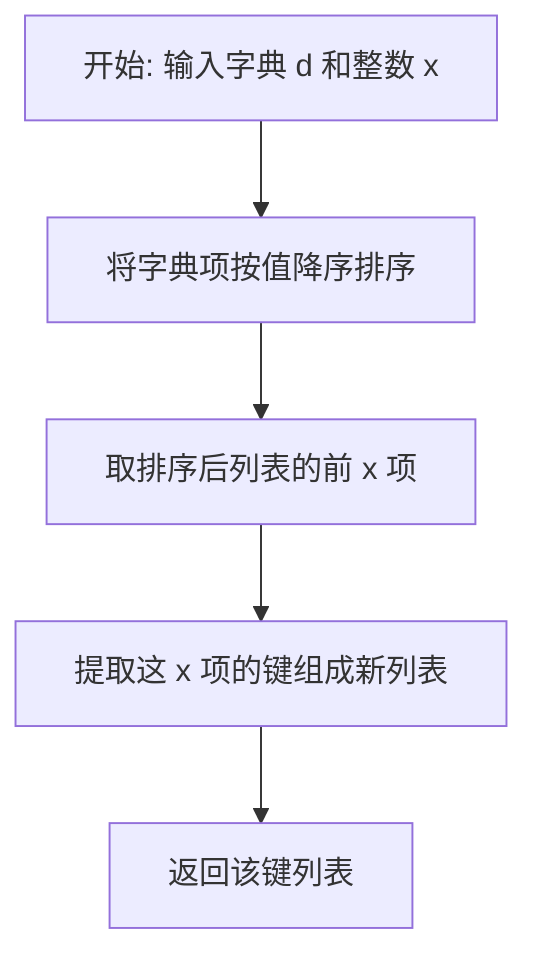
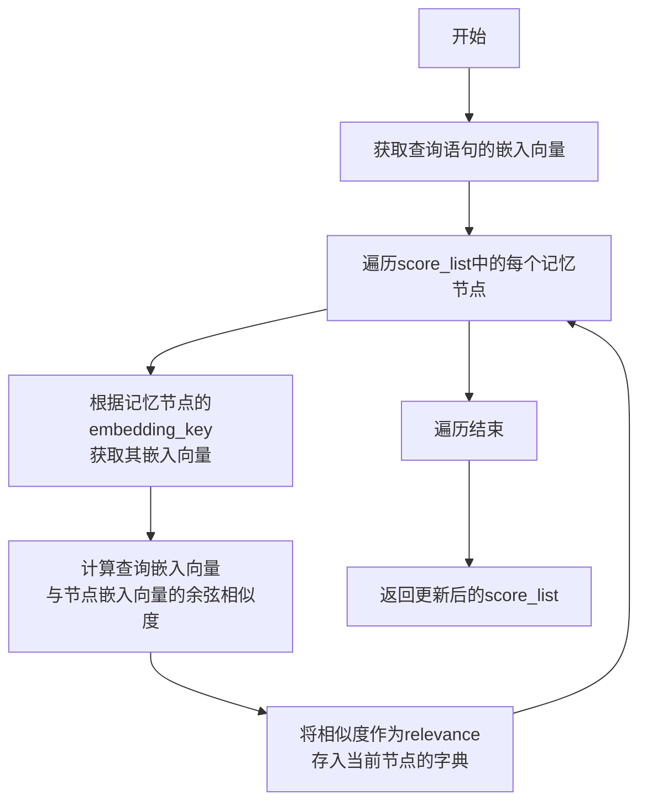
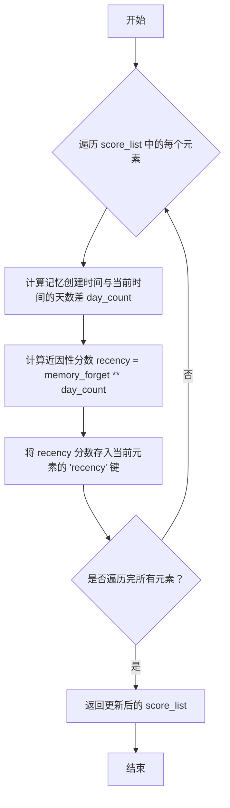
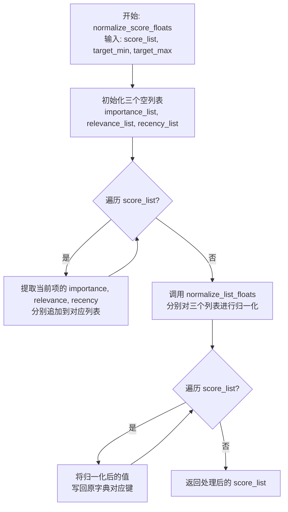

# `.\MetaGPT\metagpt\ext\stanford_town\memory\retrieve.py` 详细设计文档

该代码实现了一个基于多因素（重要性、近因性、相关性）加权评分的记忆检索系统，用于从智能体的记忆库中筛选出与给定查询最相关的Top-K条记忆。它首先对候选记忆进行多维度评分和归一化，然后根据预设权重计算综合得分，最后返回得分最高的记忆条目。

## 整体流程



## 类结构

```
全局函数
├── agent_retrieve (主检索函数)
├── new_agent_retrieve (面向角色的检索函数)
├── top_highest_x_values (获取Top-K值)
├── extract_importance (提取重要性)
├── extract_relevance (提取相关性)
├── extract_recency (提取近因性)
├── cos_sim (计算余弦相似度)
├── normalize_list_floats (列表归一化)
└── normalize_score_floats (分数归一化)
```

## 全局变量及字段


### `gw`
    
三个因素的权重列表，分别对应重要性、近因性、相关性，用于计算记忆检索的总分。

类型：`list[int]`
    


    

## 全局函数及方法

### `agent_retrieve`

该函数是智能体记忆检索的核心实现，它基于重要性、近因性和相关性三个维度对给定的记忆节点列表进行综合评分，并返回评分最高的前 `topk` 个记忆节点。函数首先对每个记忆节点计算三个维度的分数，然后进行归一化处理，最后通过加权求和得到总分，并筛选出最高分的记忆。

参数：

- `agent_memory`：`AgentMemory`，智能体的记忆对象，包含记忆的嵌入向量等信息。
- `curr_time`：`datetime.datetime`，当前时间，用于计算记忆的衰减因子。
- `memory_forget`：`float`，记忆衰减因子，表示记忆随时间的衰减速率。
- `query`：`str`，查询字符串，用于计算记忆与查询的相关性。
- `nodes`：`list[BasicMemory]`，待检索的记忆节点列表。
- `topk`：`int`，可选参数，默认值为4，指定返回的记忆节点数量。

返回值：`list[BasicMemory]`，返回评分最高的前 `topk` 个记忆节点列表。

#### 流程图



#### 带注释源码

```python
def agent_retrieve(
    agent_memory,
    curr_time: datetime.datetime,
    memory_forget: float,
    query: str,
    nodes: list[BasicMemory],
    topk: int = 4,
) -> list[BasicMemory]:
    """
    Retrieve需要集合Role使用,原因在于Role才具有AgentMemory,scratch
    逻辑:Role调用该函数,self.rc.AgentMemory,self.rc.scratch.curr_time,self.rc.scratch.memory_forget
    输入希望查询的内容与希望回顾的条数,返回TopK条高分记忆，即List[BasicMemory]

    Score_lists示例
    {
        "memory": memories[i],             BasicMemory类
        "importance": memories[i].poignancy
        "recency": 衰减因子计算结果
        "relevance": 搜索结果
    }
    """
    memories = nodes  # 待检索的记忆节点列表
    agent_memory_embedding = agent_memory.embeddings  # 获取智能体记忆的嵌入向量
    memories = sorted(memories, key=lambda memory_node: memory_node.last_accessed, reverse=True)  # 按最后访问时间倒序排序

    score_list = []  # 初始化分数列表
    score_list = extract_importance(memories, score_list)  # 提取重要性分数
    score_list = extract_recency(curr_time, memory_forget, score_list)  # 提取近因性分数
    score_list = extract_relevance(agent_memory_embedding, query, score_list)  # 提取相关性分数
    score_list = normalize_score_floats(score_list, 0, 1)  # 归一化三个维度的分数

    total_dict = {}  # 初始化总分字典
    gw = [1, 1, 1]  # 三个因素的权重: 重要性, 近因性, 相关性
    for i in range(len(score_list)):
        total_score = (
            score_list[i]["importance"] * gw[0] + score_list[i]["recency"] * gw[1] + score_list[i]["relevance"] * gw[2]
        )  # 计算加权总分
        total_dict[score_list[i]["memory"].memory_id] = total_score  # 将总分存入字典，键为记忆ID

    result = top_highest_x_values(total_dict, topk)  # 筛选前 topk 个记忆节点

    return result  # 返回的是一个BasicMemory列表
```


### `new_agent_retrieve`

该函数是智能体（Agent）记忆检索系统的一个高级接口。它接收一个角色对象（`role`）和一个关注点列表（`focus_points`），针对列表中的每一个关注点，从角色的记忆库（包括事件和想法）中检索出最相关的若干条记忆。检索过程综合考虑了记忆的重要性、近因性和相关性，并最终返回一个字典，其中键为关注点，值为与该关注点最相关的记忆列表。

参数：

-  `role`：`Role` 类型，包含智能体记忆（`memory`）和当前状态（`scratch`）等信息的角色对象。
-  `focus_points`：`list` 类型，一个字符串列表，表示需要检索记忆的关注点或查询主题。
-  `n_count`：`int` 类型，可选参数，默认为30。指定为每个关注点检索的记忆数量。

返回值：`dict` 类型，返回一个字典。字典的键是输入的关注点（`focal_pt`），值是一个 `BasicMemory` 对象列表，代表与该关注点最相关的 `n_count` 条记忆。

#### 流程图

```mermaid
flowchart TD
    A[开始: new_agent_retrieve(role, focus_points, n_count)] --> B{遍历 focus_points};
    B --> C[获取当前关注点 focal_pt];
    C --> D[从role.memory中<br>合并事件与想法列表<br>并过滤掉'idle'记忆];
    D --> E[按创建时间排序];
    E --> F[调用 agent_retrieve<br>进行综合评分与检索];
    F --> G[根据返回的ID列表<br>从存储中获取完整记忆对象];
    G --> H[更新记忆的最后访问时间];
    H --> I[将记忆列表存入结果字典<br>retrieved[focal_pt]];
    I --> B;
    B -- 遍历结束 --> J[返回结果字典 retrieved];
```

#### 带注释源码

```python
def new_agent_retrieve(role, focus_points: list, n_count=30) -> dict:
    """
    输入为role，关注点列表,返回记忆数量
    输出为字典，键为focus_point，值为对应的记忆列表
    """
    retrieved = dict()  # 初始化结果字典
    for focal_pt in focus_points:  # 遍历每一个关注点
        # 步骤1: 准备记忆节点列表
        # 合并角色的事件记忆和想法记忆，并过滤掉嵌入键包含'idle'的记忆（可能表示空闲或无意义记忆）
        nodes = [
            [i.last_accessed, i]  # 创建一个临时列表，包含最后访问时间和记忆对象本身，便于后续排序
            for i in role.memory.event_list + role.memory.thought_list
            if "idle" not in i.embedding_key
        ]
        # 按最后访问时间（created）升序排序（旧的在前）
        nodes = sorted(nodes, key=lambda x: x[0])
        # 提取排序后的纯记忆对象列表
        nodes = [i for created, i in nodes]

        # 步骤2: 调用核心检索函数
        # 传入角色记忆、当前时间、记忆衰减因子、当前关注点、候选节点列表和需要返回的数量
        results = agent_retrieve(
            role.memory, role.scratch.curr_time, role.scratch.recency_decay, focal_pt, nodes, n_count
        )
        # `results` 是一个包含 top `n_count` 个记忆ID的列表

        # 步骤3: 后处理检索结果
        final_result = []
        for n in results:  # 遍历每一个检索到的记忆ID
            for i in role.memory.storage:  # 在角色的完整记忆存储中查找
                if i.memory_id == n:  # 找到ID对应的完整记忆对象
                    i.last_accessed = role.scratch.curr_time  # 更新该记忆的最后访问时间为当前时间
                    final_result.append(i)  # 将记忆对象添加到最终结果列表

        # 步骤4: 将当前关注点的检索结果存入字典
        retrieved[focal_pt] = final_result

    return retrieved  # 返回格式为 {关注点1: [记忆1, 记忆2, ...], 关注点2: [...]} 的字典
```


### `top_highest_x_values`

该函数接收一个字典和一个整数 `x`，返回字典中值最高的前 `x` 个键组成的列表。它通过按字典的值降序排序，然后取前 `x` 个元素的键来实现。

参数：
-  `d`：`dict`，输入的字典，其值应为可比较的数值类型。
-  `x`：`int`，指定要返回的最高值的数量。

返回值：`list`，包含输入字典 `d` 中值最高的前 `x` 个键的列表。

#### 流程图



#### 带注释源码

```python
def top_highest_x_values(d, x):
    """
    输入字典，Topx
    返回以字典值排序，字典键组成的List[BasicMemory]
    """
    # 1. 将字典的键值对转换为元组列表，并按值（item[1]）降序排序
    # 2. 使用切片 [:x] 获取排序后列表的前 x 个元素
    # 3. 使用列表推导式从这 x 个元组中提取键（item[0]），形成最终的结果列表
    top_v = [item[0] for item in sorted(d.items(), key=lambda item: item[1], reverse=True)[:x]]
    return top_v
```


### `extract_importance`

该函数用于从一组记忆节点（`BasicMemory` 对象列表）中提取其重要性分数，并将每个记忆节点及其重要性分数封装成一个字典，添加到初始的分数列表中。重要性分数直接来源于记忆节点的 `poignancy` 属性。

参数：

-  `memories`：`list[BasicMemory]`，包含需要提取重要性分数的记忆节点列表。
-  `score_list`：`list[dict]`，初始的分数列表，函数会将新的分数字典追加到此列表中。

返回值：`list[dict]`，返回更新后的分数列表。列表中的每个元素是一个字典，包含键 `"memory"`（对应的 `BasicMemory` 对象）和 `"importance"`（该记忆的重要性分数，即 `poignancy`）。

#### 流程图

```mermaid
flowchart TD
    A[开始] --> B{遍历 memories 列表}
    B --> C[对于每个 memories[i]]
    C --> D[创建字典 score<br>包含 memory 和 importance]
    D --> E[将 score 追加到 score_list]
    E --> F{是否遍历完所有记忆?}
    F -- 否 --> C
    F -- 是 --> G[返回 score_list]
    G --> H[结束]
```

#### 带注释源码

```python
def extract_importance(memories, score_list):
    """
    抽取重要性
    """
    # 遍历输入的记忆节点列表
    for i in range(len(memories)):
        # 为每个记忆节点创建一个字典，包含该节点对象及其重要性分数（poignancy）
        score = {"memory": memories[i], "importance": memories[i].poignancy}
        # 将创建的字典追加到初始的分数列表中
        score_list.append(score)
    # 返回更新后的分数列表
    return score_list
```


### `extract_relevance`

该函数用于计算查询语句与记忆节点之间的相关性得分。它通过获取查询语句的嵌入向量，然后与每个记忆节点的嵌入向量计算余弦相似度，将相似度作为相关性得分添加到`score_list`中。

参数：

-  `agent_memory_embedding`：`dict`，代理记忆的嵌入向量字典，键为记忆节点的`embedding_key`，值为对应的嵌入向量。
-  `query`：`str`，查询语句，用于计算相关性。
-  `score_list`：`list[dict]`，包含记忆节点及其重要性、近因性等信息的字典列表，函数将在此列表的每个字典中添加`relevance`键。

返回值：`list[dict]`，更新后的`score_list`，其中每个字典都包含了计算出的相关性得分。

#### 流程图



#### 带注释源码

```python
def extract_relevance(agent_memory_embedding, query, score_list):
    """
    抽取相关性
    """
    # 获取查询语句的嵌入向量表示
    query_embedding = get_embedding(query)
    # 遍历score_list中的每个记忆节点
    for i in range(len(score_list)):
        # 根据当前记忆节点的embedding_key，从agent_memory_embedding字典中获取其对应的嵌入向量
        node_embedding = agent_memory_embedding[score_list[i]["memory"].embedding_key]
        # 计算查询嵌入向量与当前记忆节点嵌入向量的余弦相似度
        result = cos_sim(node_embedding, query_embedding)
        # 将计算出的相似度作为相关性得分，存入当前记忆节点对应的字典中
        score_list[i]["relevance"] = result

    # 返回更新后的score_list
    return score_list
```


### `extract_recency`

该函数用于计算记忆的“近因性”分数，基于记忆创建时间与当前时间的差异，应用指数衰减模型。衰减因子由 `memory_forget` 参数控制，表示每过一天记忆的衰减程度。

参数：

- `curr_time`：`datetime.datetime`，当前时间，用于计算与记忆创建时间的时间差。
- `memory_forget`：`float`，衰减因子，取值范围通常在0到1之间，表示记忆随天数衰减的速率。
- `score_list`：`list[dict]`，包含记忆及其相关分数的列表，每个元素是一个字典，包含 `"memory"`（BasicMemory对象）等键。

返回值：`list[dict]`，更新后的 `score_list`，其中每个字典新增或更新了 `"recency"` 键，其值为计算出的近因性分数。

#### 流程图



#### 带注释源码

```python
def extract_recency(curr_time, memory_forget, score_list):
    """
    抽取近因性，目前使用的现实世界过一天走一个衰减因子
    """
    # 遍历 score_list 中的每个记忆项
    for i in range(len(score_list)):
        # 计算记忆创建时间与当前时间的天数差
        day_count = (curr_time - score_list[i]["memory"].created).days
        # 使用指数衰减模型计算近因性分数：衰减因子 memory_forget 的 day_count 次方
        score_list[i]["recency"] = memory_forget**day_count
    # 返回更新后的 score_list，其中每个元素都包含了 recency 分数
    return score_list
```


### `cos_sim`

计算两个向量之间的余弦相似度。余弦相似度通过测量两个向量在方向上的夹角的余弦值来评估它们的相似性，取值范围为[-1, 1]，值越接近1表示两个向量方向越一致，相似度越高。

参数：

-  `a`：`numpy.ndarray` 或类似的可计算点积和范数的数组，第一个输入向量。
-  `b`：`numpy.ndarray` 或类似的可计算点积和范数的数组，第二个输入向量。

返回值：`float`，两个输入向量 `a` 和 `b` 的余弦相似度值。

#### 流程图

```mermaid
graph TD
    A[开始: cos_sim(a, b)] --> B[计算向量a和b的点积: dot(a, b)]
    B --> C[计算向量a的L2范数: norm(a)]
    B --> D[计算向量b的L2范数: norm(b)]
    C --> E[计算范数乘积: norm(a) * norm(b)]
    D --> E
    E --> F[计算余弦相似度: 点积 / 范数乘积]
    F --> G[返回结果: float]
    G --> H[结束]
```

#### 带注释源码

```
def cos_sim(a, b):
    """
    计算余弦相似度
    """
    # 使用numpy的dot函数计算向量a和b的点积（内积）
    # 使用numpy.linalg.norm函数计算向量a和b的L2范数（欧几里得长度）
    # 余弦相似度公式：cosθ = (a·b) / (||a|| * ||b||)
    return dot(a, b) / (norm(a) * norm(b))
```


### `normalize_list_floats`

该函数用于对给定的浮点数列表进行线性归一化处理，将列表中的每个值映射到指定的目标区间 `[target_min, target_max]` 内。它处理了空列表和所有值相等（即值域为0）的特殊情况。

参数：

-  `single_list`：`list`，包含待归一化浮点数的列表。
-  `target_min`：`float`，归一化后目标范围的最小值。
-  `target_max`：`float`，归一化后目标范围的最大值。

返回值：`list`，返回归一化处理后的新列表。如果输入列表为空，则返回空列表。

#### 流程图

```mermaid
flowchart TD
    A[开始: normalize_list_floats(single_list, target_min, target_max)] --> B{列表长度是否为0?}
    B -- 是 --> C[返回空列表 []]
    B -- 否 --> D[计算列表最小值 min_val]
    D --> E[计算列表最大值 max_val]
    E --> F[计算值域 range_val = max_val - min_val]
    F --> G{range_val 是否为 0?}
    G -- 是 --> H[遍历列表，将每个元素赋值为<br/> (target_max - target_min) / 2]
    G -- 否 --> I[遍历列表，对每个元素应用<br/> 线性归一化公式]
    H --> J[返回修改后的列表]
    I --> J
    J --> K[结束]
```

#### 带注释源码

```python
def normalize_list_floats(single_list, target_min, target_max):
    """
    单个列表归一化
    """
    # 处理空列表情况：直接返回空列表
    if len(single_list) == 0:
        return []

    # 步骤1: 计算原始数据的最小值、最大值和值域
    min_val = min(single_list)
    max_val = max(single_list)
    range_val = max_val - min_val

    # 步骤2: 处理所有值相等（值域为0）的特殊情况
    if range_val == 0:
        # 将所有值设置为目标区间的中点，避免除以零错误
        for i in range(len(single_list)):
            single_list[i] = (target_max - target_min) / 2
    else:
        # 步骤3: 应用标准的线性归一化公式
        # 公式: new_value = (old_value - min_val) * (target_range) / range_val + target_min
        for i in range(len(single_list)):
            single_list[i] = (single_list[i] - min_val) * (target_max - target_min) / range_val + target_min
    # 步骤4: 返回归一化后的列表（原地修改并返回）
    return single_list
```


### `normalize_score_floats`

该函数用于对记忆评分列表中的三个评分维度（重要性、相关性、近因性）分别进行归一化处理，使每个维度的分数都映射到指定的目标范围（`target_min` 到 `target_max`）内，以便后续进行加权求和等综合评分计算。

参数：
-  `score_list`：`list[dict]`，包含待归一化评分的字典列表。每个字典应包含 `"importance"`、`"relevance"`、`"recency"` 三个键，其值为待归一化的数值。
-  `target_min`：`float`，归一化后的目标最小值。
-  `target_max`：`float`，归一化后的目标最大值。

返回值：`list[dict]`，返回归一化处理后的评分字典列表。列表结构与输入 `score_list` 相同，但其中 `"importance"`、`"relevance"`、`"recency"` 三个键对应的值已被归一化到 `[target_min, target_max]` 区间。

#### 流程图



#### 带注释源码

```python
def normalize_score_floats(score_list, target_min, target_max):
    """
    整体归一化
    """
    # 步骤1: 初始化三个空列表，用于分别存储所有记忆项的重要性、相关性和近因性分数。
    importance_list = []
    relevance_list = []
    recency_list = []

    # 步骤2: 遍历输入的评分列表，将每个维度的分数提取到对应的独立列表中。
    for i in range(len(score_list)):
        importance_list.append(score_list[i]["importance"])
        relevance_list.append(score_list[i]["relevance"])
        recency_list.append(score_list[i]["recency"])

    # 步骤3: 调用辅助函数 `normalize_list_floats`，对三个独立的列表分别进行归一化处理。
    # 归一化将把每个列表中的值线性映射到 [target_min, target_max] 区间。
    importance_list = normalize_list_floats(importance_list, target_min, target_max)
    relevance_list = normalize_list_floats(relevance_list, target_min, target_max)
    recency_list = normalize_list_floats(recency_list, target_min, target_max)

    # 步骤4: 再次遍历评分列表，将归一化后的值从独立列表写回原字典的对应键中。
    for i in range(len(score_list)):
        score_list[i]["importance"] = importance_list[i]
        score_list[i]["relevance"] = relevance_list[i]
        score_list[i]["recency"] = recency_list[i]

    # 步骤5: 返回处理后的评分列表。
    return score_list
```


## 关键组件


### 记忆检索核心算法

实现基于重要性、近因性和相关性三个维度的加权评分算法，用于从智能体的记忆库中检索最相关的记忆条目。

### 记忆评分组件

包含 `extract_importance`、`extract_recency` 和 `extract_relevance` 三个函数，分别负责计算记忆条目的重要性分数、基于时间衰减的近因性分数以及基于向量相似度的相关性分数。

### 分数归一化组件

包含 `normalize_list_floats` 和 `normalize_score_floats` 两个函数，负责将不同量纲和范围的评分（重要性、近因性、相关性）归一化到统一的数值区间（如[0,1]），以便进行加权求和。

### 相似度计算组件

包含 `cos_sim` 函数，使用余弦相似度算法计算查询向量与记忆向量之间的相关性分数。

### 高层检索接口

包含 `agent_retrieve` 和 `new_agent_retrieve` 两个函数。`agent_retrieve` 是核心检索函数，`new_agent_retrieve` 是面向角色（Role）的封装接口，支持对多个关注点（focal points）进行批量检索。


## 问题及建议


### 已知问题

-   **硬编码权重与归一化范围**：`agent_retrieve` 函数中，重要性、近因性、相关性三个维度的权重 `gw = [1, 1, 1]` 以及归一化的目标范围 `(0, 1)` 是硬编码的。这限制了算法的灵活性和可配置性，无法根据不同场景或角色特性调整检索策略。
-   **潜在的性能瓶颈**：`extract_relevance` 函数在每次检索时，都会为查询文本 `query` 调用 `get_embedding` 函数计算一次嵌入向量。如果 `query` 不变或在一个会话中频繁调用，这将造成重复计算，影响性能。
-   **`new_agent_retrieve` 函数中的低效查找**：该函数在获取最终结果时，通过遍历 `role.memory.storage` 列表来匹配 `memory_id`，这是一个 O(n) 的线性查找操作。当记忆库 `storage` 较大时，这会成为性能瓶颈。
-   **`extract_recency` 函数的衰减模型过于简单**：当前仅使用天数 (`days`) 作为衰减因子 (`memory_forget**day_count`)，忽略了小时、分钟等更细粒度的时间间隔，可能导致同一天内发生的记忆在“近因性”上无法区分。
-   **`normalize_list_floats` 函数的边界情况处理**：当输入列表所有值相等 (`range_val == 0`) 时，函数将所有值设置为 `(target_max - target_min) / 2`。虽然避免了除零错误，但这种处理方式可能不符合某些归一化的数学期望（例如，全部置为最小值或平均值）。
-   **代码重复与函数职责不单一**：`normalize_score_floats` 函数内部手动提取三个列表、分别归一化、再写回，存在代码重复。同时，`agent_retrieve` 函数承担了太多职责：排序、分数计算、归一化、加权求和、排序筛选，违反了单一职责原则。

### 优化建议

-   **将权重和归一化参数配置化**：建议将权重 `gw` 和归一化范围 `(target_min, target_max)` 作为 `agent_retrieve` 函数的可选参数，或从角色配置、环境配置中读取，提高灵活性。
-   **引入查询嵌入缓存**：在 `agent_retrieve` 函数或调用它的上层（如 `Role` 类）中，为频繁使用的查询字符串缓存其嵌入向量 (`query_embedding`)，避免重复计算。
-   **优化内存查找逻辑**：在 `new_agent_retrieve` 函数中，可以先将 `role.memory.storage` 转换为一个以 `memory_id` 为键的字典，这样后续的匹配操作可以从 O(n) 降至 O(1)。
-   **细化时间衰减模型**：修改 `extract_recency` 函数，使用总秒数、小时数或更精细的时间差（例如 `total_seconds`）来计算衰减因子，使同一天内不同时刻的记忆也能在近因性上有所区分。
-   **重构归一化与评分流程**：
    1.  将 `extract_importance`, `extract_recency`, `extract_relevance` 三个函数合并或抽象为一个统一的“特征提取”步骤，返回结构化的分数字典列表。
    2.  将 `normalize_score_floats` 函数重写，使其直接操作分数字典列表，避免手动提取和写回列表，减少代码重复。
    3.  考虑将加权求和与排序筛选 (`top_highest_x_values`) 步骤分离，使主函数 `agent_retrieve` 的流程更清晰：`提取特征 -> 归一化 -> 加权评分 -> 排序返回`。
-   **增强错误处理与日志**：在关键步骤（如计算余弦相似度、归一化）添加更细致的异常处理（例如，处理零向量导致的除零错误）。同时，增加调试日志，便于追踪检索过程中的分数计算细节，辅助算法调优。


## 其它


### 设计目标与约束

本模块的核心设计目标是实现一个基于多因素（重要性、近因性、相关性）加权排序的记忆检索系统，用于支持智能体（Agent）从其长期记忆中高效、准确地提取与当前情境相关的信息。主要约束包括：1) 必须与现有的`BasicMemory`数据结构及`AgentMemory`管理机制兼容；2) 检索算法需要平衡计算效率与结果质量，以支持实时或近实时的交互场景；3) 权重参数（如`gw`）目前为硬编码，未来需支持灵活配置以适应不同Agent角色或任务需求。

### 错误处理与异常设计

当前代码中显式的错误处理较为有限。主要潜在风险点及处理方式包括：
1.  **空输入处理**：`normalize_list_floats`函数检查了输入列表长度，若为空则返回空列表，防止了除零错误。`agent_retrieve`函数未显式检查`nodes`列表为空的情况，但后续排序和循环操作能处理空列表。
2.  **数值计算异常**：`cos_sim`函数未处理向量范数为零（即零向量）的情况，这可能导致除零错误。`normalize_list_floats`函数在`range_val == 0`（即列表所有值相等）时进行了特殊处理，避免了除零错误，并赋予其中间值。
3.  **键查找异常**：`extract_relevance`函数通过`score_list[i]["memory"].embedding_key`从`agent_memory_embedding`字典中获取向量，若键不存在将引发`KeyError`。`new_agent_retrieve`函数中通过遍历`role.memory.storage`来匹配`memory_id`，若未找到匹配项，对应的记忆将不会加入`final_result`。
4.  **类型与接口契约**：函数依赖于输入参数（如`agent_memory`需有`embeddings`属性，`nodes`元素需为`BasicMemory`实例）符合预期，未进行类型验证或契约检查。

### 数据流与状态机

本模块不包含复杂的状态机，其核心是线性的数据处理流水线。
1.  **`agent_retrieve` 数据流**：
    *   **输入**：记忆节点列表(`nodes`)、查询字符串(`query`)、当前时间(`curr_time`)、衰减因子(`memory_forget`)、Agent记忆嵌入字典(`agent_memory_embedding`)。
    *   **处理**：
        a. 按`last_accessed`时间对记忆节点进行初步排序（逆序）。
        b. 依次计算每个记忆节点的**重要性**（直接取自`poignancy`）、**近因性**（基于创建时间与当前时间差，按衰减因子计算）、**相关性**（通过余弦相似度计算查询嵌入向量与记忆嵌入向量的相似度）。
        c. 将三个维度的分数分别归一化到[0,1]区间。
        d. 对每个记忆节点，将归一化后的三个分数按固定权重(`gw`)加权求和，得到综合得分。
        e. 根据综合得分选出Top-K个记忆节点的ID。
    *   **输出**：Top-K个记忆节点的ID列表。
2.  **`new_agent_retrieve` 数据流**：
    *   **输入**：角色对象(`role`)、关注点列表(`focus_points`)。
    *   **处理**：对每个关注点，从`role`的记忆中筛选非空闲的记忆节点，调用`agent_retrieve`获取Top-K的ID，再根据ID从存储中找回完整的`BasicMemory`对象，并更新其`last_accessed`时间。
    *   **输出**：一个字典，键为关注点，值为对应的`BasicMemory`对象列表。

### 外部依赖与接口契约

1.  **内部依赖**：
    *   `metagpt.ext.stanford_town.memory.agent_memory.BasicMemory`：定义了记忆节点的数据结构，依赖其`memory_id`, `last_accessed`, `created`, `poignancy`, `embedding_key`等属性。
    *   `metagpt.ext.stanford_town.utils.utils.get_embedding`：函数，用于将文本字符串转换为嵌入向量。其性能和质量直接影响相关性计算。
    *   `numpy.dot` 与 `numpy.linalg.norm`：用于计算余弦相似度。
2.  **接口契约（隐含）**：
    *   `agent_retrieve`函数期望`agent_memory`参数是一个具有`embeddings`属性的对象，该属性是一个字典，键为`BasicMemory.embedding_key`，值为对应的数值向量。
    *   `new_agent_retrieve`函数期望`role`参数具有`memory`和`scratch`属性，其中`role.memory`需有`event_list`, `thought_list`, `storage`等数据结构，`role.scratch`需有`curr_time`和`recency_decay`属性。
    *   所有记忆节点（`BasicMemory`实例）必须具有一致的属性集，特别是用于检索计算的属性。

    